# 과정 OT - 전체 일정 소개

> 생성형 AI 풀스택 개발 과정 | 총 45일 (315시간)

---

## 과정 전체 로드맵

```mermaid
gantt
    title 생성형 AI 풀스택 개발 과정 (45일)
    dateFormat  X
    axisFormat %s일차

    section PART 1: 기초
    생성형AI 입문 (4일)        :a1, 1, 4d
    웹개발 기초 (5일)           :a2, after a1, 5d
    파이썬 웹서비스 개발 (9일)   :a3, after a2, 9d
    데이터베이스 (3일)          :a4, after a3, 3d

    section PART 2: 심화
    생성형AI 심화 (6일)         :b1, after a4, 6d
    생성형AI 응용 (3일)         :b2, after b1, 3d

    section PART 3: 실전
    클라우드 서비스 (3일)       :c1, after b2, 3d
    팀 프로젝트 (12일)         :c2, after c1, 12d
```



---

## 대단원 구성

| # | 대단원 | 기간 | 시간 | 핵심 키워드 |
|---|--------|------|------|-------------|
| 0 | **과정 OT** | 0.5일 | 3h | 개발자의 진화, 과정 소개, 환경 셋업 |
| 1 | **생성형AI 입문** | 4일 | 28h | 프롬프트 엔지니어링, ChatGPT/Claude/Gemini, 바이브 코딩 |
| 2 | **웹개발 기초** | 5일 | 35h | Git, HTML, CSS, JavaScript, DOM |
| 3 | **파이썬 기반 웹서비스 개발** | 9일 | 63h | Python, Flask, REST-API, GPT 연동 |
| 4 | **데이터베이스** | 3일 | 21h | SQL, SQLite, 스크래핑, DB 연동 |
| 5 | **생성형AI 심화** | 6일 | 42h | OpenAI, HuggingFace, 이미지 생성, MCP, Agent |
| 6 | **생성형AI 응용** | 3일 | 21h | 챗봇/RAG/Agentic 미니 프로젝트 |
| 7 | **클라우드 서비스** | 3일 | 21h | AWS EC2, S3, RDS, 리눅스 |
| 8 | **팀 프로젝트** | 12일 | 84h | 기획 → 설계 → 개발 → 발표 |

---

## PART 1: 기초 다지기 (21일)

### 생성형AI 입문 (Day 1~4)

| Day | 과목 | 세부 주제 | 시간 |
|-----|------|-----------|------|
| 1 | 생성형AI 기초 | 과정 OT, 환경셋업, 생성형AI 기초와 프롬프트 엔지니어링 | 7h |
| 2 | 생성형AI 활용 | ChatGPT, Claude, Gemini 활용 및 특징 비교 | 7h |
| 3 | 에이전틱 서비스 | 이미지/동영상/PPT 슬라이드 생성 실습 | 7h |
| 4 | 바이브 코딩 | Antigravity와 바이브 코딩 실습 | 7h |

### 웹개발 기초 (Day 5~9)

| Day | 과목 | 세부 주제 | 시간 |
|-----|------|-----------|------|
| 5 | 형상관리 | SW형상관리, Git & GitHub | 7h |
| 6 | HTML | 각종 태그 | 7h |
| 7 | CSS | 디자인 | 7h |
| 8 | JavaScript | DOM 및 동적 웹 렌더링 | 7h |
| 9 | JavaScript | 각종 이벤트 핸들링 | 7h |

### 파이썬 기반 웹서비스 개발 (Day 10~18)

| Day | 과목 | 세부 주제 | 시간 |
|-----|------|-----------|------|
| 10 | 파이썬 Basics | 기초문법, 함수, 모듈 | 7h |
| 11 | 파이썬 Basics | 객체, 예외처리 | 7h |
| 12 | Flask | 웹서비스 개발 기초 - Flask CRUD | 7h |
| 13 | Flask | Template Engine | 7h |
| 14 | Flask | 로그인, 쿠키, 세션 | 7h |
| 15 | REST-API | 게시판 프로젝트 (1) | 7h |
| 16 | REST-API | 게시판 프로젝트 (2) | 7h |
| 17 | 실데이터 연동 | 외부 API 연동 (날씨, 주식 등) | 7h |
| 18 | GPT 연동 | 외부 GPT API를 통한 채팅 | 7h |

### 데이터베이스 (Day 19~21)

| Day | 과목 | 세부 주제 | 시간 |
|-----|------|-----------|------|
| 19 | SQL 기초 | SQL 쿼리문 기초 (SQLite) | 7h |
| 20 | 실데이터 연동 | 파이썬 코드와 DB 연동 | 7h |
| 21 | 데이터 스크래핑 | 원하는 데이터 수집 및 DB 적재 | 7h |

---

## PART 2: 심화 실습 (9일)

### 생성형AI 심화 (Day 22~27)

| Day | 과목 | 세부 주제 | 시간 |
|-----|------|-----------|------|
| 22 | 생성형AI 기초 및 응용 | OpenAI 활용한 기본 웹서비스 | 7h |
| 23 | 자연어 처리 | HuggingFace를 활용한 자연어 처리 실습 | 7h |
| 24 | 다양한 모델 | 다양한 모델 활용 (Anthropic, 로컬 모델 등) | 7h |
| 25 | 이미지 생성 | 간단한 이미지 생성 웹서비스 구현 | 7h |
| 26 | MCP | MCP Agent 기초 | 7h |
| 27 | Agent | Agent를 활용한 서비스 개발 | 7h |

### 생성형AI 응용 - 미니 프로젝트 (Day 28~30)

| Day | 과목 | 세부 주제 | 시간 |
|-----|------|-----------|------|
| 28 | 미니 프로젝트 | 생성형AI를 활용한 챗봇 개발 | 7h |
| 29 | 미니 프로젝트 | 생성형AI를 활용한 RAG 서비스 | 7h |
| 30 | 미니 프로젝트 | 생성형AI를 활용한 Agentic 서비스 | 7h |

---

## PART 3: 배포 & 실전 (15일)

### 클라우드 서비스 (Day 31~33)

| Day | 과목 | 세부 주제 | 시간 |
|-----|------|-----------|------|
| 31 | 클라우드 기초 | 가상머신, 인스턴스, 리눅스 | 7h |
| 32 | 서버 관리 | EC2 서버 관리 및 리눅스 운영/관리 | 7h |
| 33 | 클라우드 서비스 | S3 저장소, RDS 데이터베이스 구축 | 7h |

### 팀 프로젝트 (Day 34~45)

| Day | 단계 | 세부 내용 | 시간 |
|-----|------|-----------|------|
| 34 | 기획 | 프로젝트 기획, 팀선정, 주제확정 | 7h |
| 35 | 설계 | 설계 초안 리뷰 | 7h |
| 36~38 | 개발 | 프로젝트 진행 | 21h |
| 39 | 점검 | 중간점검 멘토링 | 7h |
| 40~44 | 개발 | 프로젝트 진행 | 35h |
| 45 | 발표 | 최종 발표/평가 | 7h |

---

## 실습 코드 저장소 구조

```
tutorial-genai/
├── 0.docs/                    ← 강의 자료 (현재 문서)
├── 1.openai/                  ← Day 22: OpenAI 웹서비스
├── 2.langchain/               ← Day 27: Agent 서비스 개발
├── 3.local/                   ← Day 23~24: HuggingFace, 다양한 모델
├── 4.anthropic/               ← Day 24, 26: Claude API, MCP Agent
├── 5.stablediffusion/         ← Day 25: 이미지 생성 웹서비스
├── 9.nlp/                     ← Day 23: 자연어 처리 실습
├── 10.project/                ← Day 28~30: 미니 프로젝트
└── 11.project_large/          ← Day 34~45: 팀 프로젝트 레퍼런스
```
