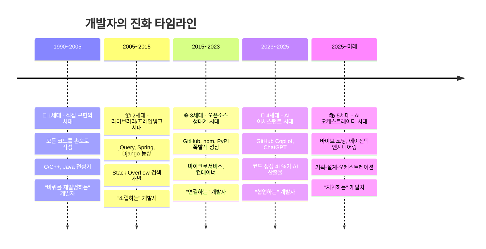
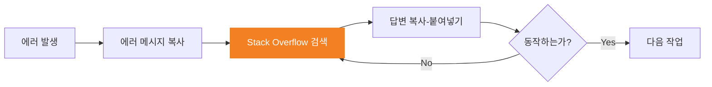
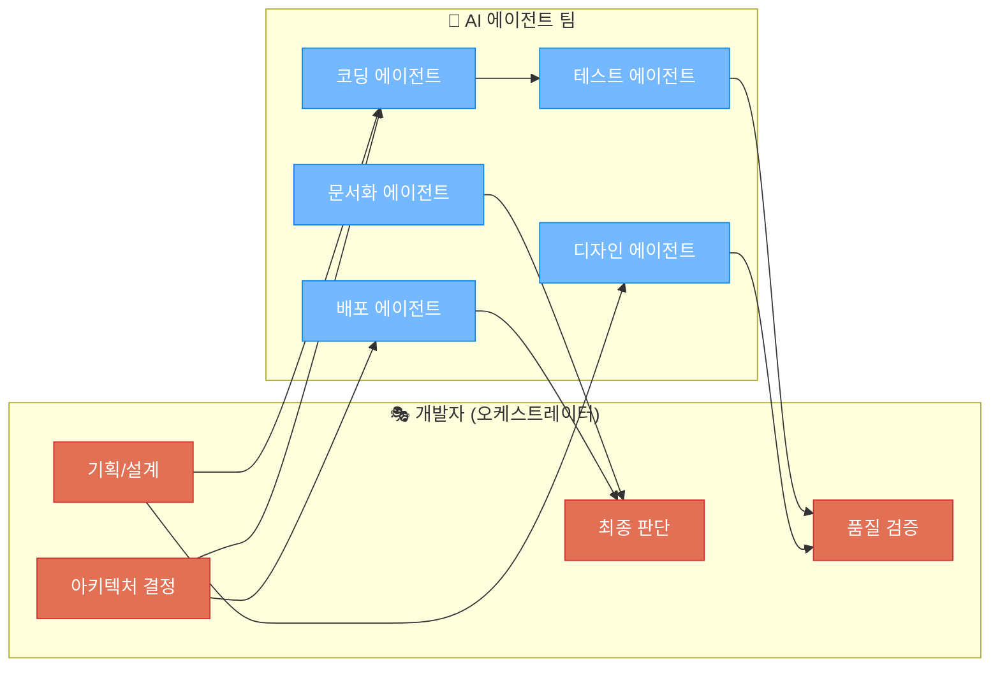
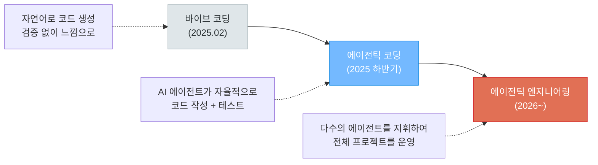
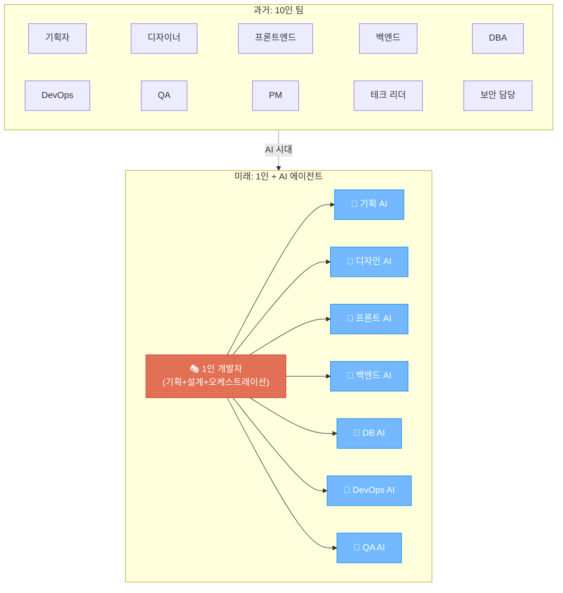
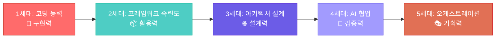
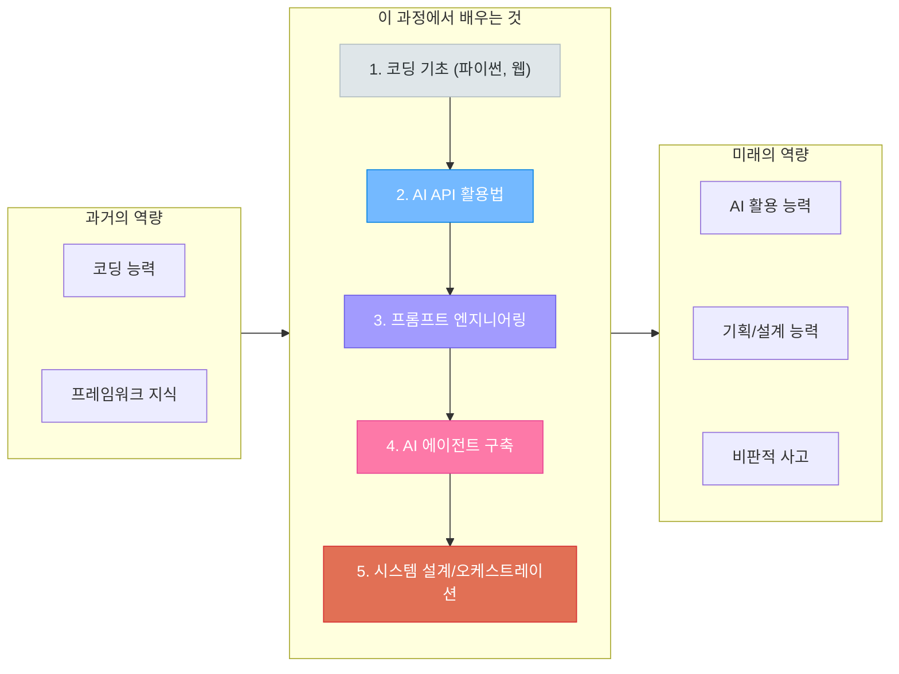

# 개발자의 진화 - 과거, 현재, 그리고 미래

> "The hottest new programming language is English" — Andrej Karpathy, 2025

---

## 개발자는 어떻게 변해왔는가?



---

## 1세대: 직접 구현의 시대 (1990~2005)

### "모든 것을 내 손으로 만들던 시절"


#### 특징

| 항목 | 내용 |
|------|------|
| **개발 방식** | 알고리즘, 자료구조를 직접 구현 |
| **도구** | 텍스트 에디터 (vi, Emacs), 터미널 컴파일러 |
| **정보 습득** | 전공 서적, 매뉴얼 페이지 (man page), 선배 개발자 |
| **핵심 역량** | 언어 문법 암기, 알고리즘 설계 능력, 디버깅 능력 |
| **대표 언어** | C, C++, Java, Perl |
| **개발 속도** | 매우 느림 - 단순 기능도 수백 줄 코드 필요 |

#### 실제 모습

```
문자열 정렬이 필요하다?
→ 퀵소트를 직접 구현한다

HTTP 요청을 보내야 한다?
→ 소켓 프로그래밍으로 직접 TCP 연결을 만든다

날짜 계산이 필요하다?
→ 윤년 계산 로직을 직접 작성한다
```

이 시대의 개발자는 **"장인"** 에 가까웠습니다. 코드 한 줄 한 줄을 직접 작성하며, 메모리 관리부터 네트워크 프로토콜까지 모든 것을 이해해야 했습니다. 개발 속도는 느렸지만, 시스템의 동작 원리를 깊이 이해하는 것이 개발자의 가장 큰 자산이었습니다.

#### 이 시대의 격언

> "Real programmers don't use Pascal." (진짜 개발자는 파스칼 같은 쉬운 언어를 쓰지 않는다)

저수준 언어에 대한 자부심이 곧 개발자의 정체성이던 시대입니다.

---

## 2세대: 라이브러리/프레임워크 시대 (2005~2015)

### "바퀴를 재발명하지 마라"


#### 특징

| 항목 | 내용 |
|------|------|
| **개발 방식** | 프레임워크가 뼈대를 제공, 비즈니스 로직만 작성 |
| **도구** | IDE (Eclipse, IntelliJ, Visual Studio) |
| **정보 습득** | Stack Overflow (2008~), 공식 문서, 기술 블로그 |
| **핵심 역량** | 프레임워크 숙련도, 디자인 패턴, API 활용 능력 |
| **대표 기술** | jQuery, Spring, Django, Rails, Bootstrap |
| **개발 속도** | 빠름 - 프레임워크가 반복 작업을 대체 |

#### 패러다임의 전환

```
문자열 정렬이 필요하다?
→ Arrays.sort() 또는 sorted() 한 줄이면 끝

HTTP 요청을 보내야 한다?
→ jQuery.ajax() 또는 requests.get()

날짜 계산이 필요하다?
→ moment.js 또는 datetime 라이브러리 사용
```

#### 이 시대의 상징: Stack Overflow 개발



"Stack Overflow 개발자"라는 별명이 생겼을 정도로, 검색 능력이 곧 개발 능력이 된 시대입니다. **"어떻게(How) 만드는가"** 보다 **"무엇을(What) 사용할 것인가"** 가 중요해졌습니다.

#### 이 시대의 격언

> "Don't Reinvent the Wheel" (바퀴를 재발명하지 마라)

---

## 3세대: 오픈소스 생태계 시대 (2015~2023)

### "레고 블록처럼 조립한다"


#### 특징

| 항목 | 내용 |
|------|------|
| **개발 방식** | 오픈소스 컴포넌트를 조합하여 시스템 구축 |
| **도구** | VS Code, Docker, Kubernetes, GitHub Actions |
| **정보 습득** | GitHub, 유튜브 튜토리얼, 온라인 강의 |
| **핵심 역량** | 아키텍처 설계, 기술 선택 안목, DevOps |
| **대표 기술** | React, Node.js, Docker, Kubernetes, Terraform |
| **개발 속도** | 매우 빠름 - npm install 한 줄로 수만 줄 기능 추가 |

#### 오픈소스 생태계의 폭발적 성장

```
2015년: GitHub 저장소 약 2,100만 개
2020년: GitHub 저장소 약 1억 9,000만 개
2023년: GitHub 저장소 약 3억 7,200만 개
npm 패키지: 200만+ 개
PyPI 패키지: 50만+ 개
```

#### 개발자의 역할 변화

```
웹 서버가 필요하다?
→ Express.js 또는 Flask를 npm/pip install

데이터베이스가 필요하다?
→ PostgreSQL + Docker Compose로 1분 만에 구축

배포해야 한다?
→ GitHub Actions + Docker + AWS로 자동 배포

모니터링이 필요하다?
→ Prometheus + Grafana 조합
```

이 시대의 개발자는 **"아키텍트"** 에 가까워졌습니다. 직접 코드를 작성하는 시간보다 **어떤 기술을 선택하고 어떻게 조합할 것인가** 를 고민하는 시간이 더 많아졌습니다.

#### 이 시대의 격언

> "Standing on the shoulders of giants" (거인의 어깨 위에 서라)

---

## 4세대: AI 어시스턴트 시대 (2023~2025)

### "AI가 옆에 앉은 페어 프로그래머"


#### 특징

| 항목 | 내용 |
|------|------|
| **개발 방식** | AI가 코드를 제안/생성, 개발자가 검토/수정 |
| **도구** | GitHub Copilot, ChatGPT, Cursor, Claude |
| **정보 습득** | AI에게 직접 질문, 코드 설명 요청 |
| **핵심 역량** | 프롬프트 엔지니어링, AI 결과물 검증 능력 |
| **대표 기술** | GitHub Copilot, ChatGPT, Claude, Gemini |
| **개발 속도** | 혁신적으로 빠름 - 복잡한 함수도 초 단위 생성 |

#### 핵심 수치 (2025년 기준)

```
- 전 세계에서 생성되는 코드의 41%가 AI의 손을 거침
- 미국 개발자의 92%가 AI 코딩 도구를 일상적으로 사용
- Y Combinator 2025 Winter Batch 스타트업 중 25%는
  코드베이스의 95% 이상을 AI가 작성
```

> 출처: GitHub Octoverse 2025, Y Combinator 통계

#### 새로운 워크플로우

```
함수 구현이 필요하다?
→ "이런 기능의 Python 함수 만들어줘" → AI가 즉시 생성

버그를 찾아야 한다?
→ 에러 로그를 AI에게 붙여넣기 → 원인과 해결책 제시

테스트 코드가 필요하다?
→ "이 함수의 유닛 테스트 작성해줘" → AI가 테스트 코드 생성

문서화가 필요하다?
→ "이 코드에 독스트링 추가해줘" → AI가 자동 문서화
```

#### 한계와 현실

하지만 이 시대에도 명확한 한계가 존재합니다:

```
- METR 연구 (2025): 숙련된 개발자가 AI 코딩 툴 사용 시
  생산성이 오히려 19% 감소하는 경우 발견
- AI 생성 코드의 수락률: 44% 미만
- CodeRabbit 분석 (2025.12): AI 코드에 "주요 이슈" 1.7배 높음
  → 보안 취약점 2.74배 높음
```

> 출처: METR 2025 상반기 연구, CodeRabbit 2025.12 GitHub PR 분석 (470건)

AI가 코드를 "작성"할 수는 있지만, **"올바른 코드"** 를 보장하지는 못합니다. 개발자의 **검증 능력** 이 그 어느 때보다 중요해진 시대입니다.

#### 이 시대의 격언

> "AI is the new Stack Overflow" (AI가 새로운 스택 오버플로우다)

---

## 5세대: AI 오케스트레이터 시대 (2025~미래)

### "나는 지휘자, AI가 오케스트라"



#### 특징

| 항목 | 내용 |
|------|------|
| **개발 방식** | 자연어로 의도를 전달, 다수의 AI 에이전트가 자율 실행 |
| **도구** | Claude Code, Cursor Agent, Antigravity, Devin |
| **정보 습득** | AI가 필요한 정보를 자율적으로 검색/학습 |
| **핵심 역량** | 기획력, 설계력, 오케스트레이션, 비판적 사고 |
| **대표 기술** | Agentic Engineering, MCP, Multi-Agent 시스템 |
| **개발 속도** | 1인이 과거 10인 팀의 생산성 달성 가능 |

#### "바이브 코딩"에서 "에이전틱 엔지니어링"으로

Andrej Karpathy가 2025년 2월에 제안한 **"바이브 코딩(Vibe Coding)"** 은 불과 1년도 안 되어 진화했습니다:



> 출처: Karpathy는 이제 "바이브 코딩은 낡았다"며, 프로 개발자의 AI 활용을 "에이전틱 엔지니어링"이라 부릅니다.
> — The New Stack, 2025

#### 미래 개발자의 하루

```
09:00  프로젝트 기획서를 자연어로 작성
       → "사용자 인증 시스템을 구축해줘. JWT 기반으로,
          소셜 로그인(Google, GitHub) 지원,
          2FA 옵션 포함"

09:30  AI 에이전트가 아키텍처를 제안
       → 개발자가 검토하고 방향을 조정
       → "Redis 세션 대신 JWT로 가자, 2FA는 TOTP 방식"

10:00  코딩 에이전트가 구현 시작 (자율 실행)
       → 테스트 에이전트가 동시에 테스트 코드 작성
       → 개발자는 다른 기능의 기획서 작성

12:00  에이전트의 중간 결과물 검토
       → 코드 리뷰, 아키텍처 적합성 판단
       → 피드백 전달: "에러 핸들링 더 견고하게"

14:00  디자인 에이전트가 UI/UX 시안 생성
       → 개발자가 사용성 관점에서 검토

16:00  통합 테스트, 보안 점검
       → AI가 생성한 코드의 취약점 분석
       → 최종 승인

17:00  배포 에이전트가 CI/CD 파이프라인 실행
       → 자동 배포 완료
```

#### 핵심 수치 (2026년 전망)

```
- Gartner 예측: 2026년 말까지 개발자의 75%가
  코드 작성보다 오케스트레이션에 더 많은 시간을 사용
- 평균 개발자의 하루: 코드 직접 작성 20%, 나머지 80%는
  AI 결과물 검토, 프롬프트 작성, 아키텍처 결정, 워크플로우 관리
- 바이브 코딩 도구 시장: 2026년 47억 달러 → 2027년 123억 달러 전망
- 주니어 개발자 수요: AI 도입 기업에서 40% 감소
```

> 출처: Gartner 2026 예측, unite.ai 2026 트렌드 리포트

#### 1인 개발자의 시대



Y Combinator의 CEO인 Garry Tan은 이렇게 말했습니다:

> "1인 유니콘(10억 달러 기업)이 곧 등장할 것이다.
> AI 덕분에 한 사람이 예전에 수십 명이 하던 일을 할 수 있게 되었다."

기획자도, 디자이너도, PM도 없이 **1인 개발자가 AI 에이전트를 지휘하여 전체 서비스를 만들어내는 시대** 가 현실이 되고 있습니다.

---

## 세대별 비교 종합



| 구분 | 1세대 (직접 구현) | 2세대 (프레임워크) | 3세대 (오픈소스) | 4세대 (AI 어시스턴트) | 5세대 (오케스트레이터) |
|------|-------------------|-------------------|-----------------|---------------------|---------------------|
| **시기** | 1990~2005 | 2005~2015 | 2015~2023 | 2023~2025 | 2025~미래 |
| **개발자 역할** | 장인 (Craftsman) | 조립자 (Assembler) | 아키텍트 (Architect) | 협업자 (Collaborator) | 지휘자 (Orchestrator) |
| **코드 작성** | 100% 수동 | 70% 수동 | 50% 수동 | 30% 수동 | 5~10% 수동 |
| **핵심 능력** | 알고리즘/문법 | 프레임워크 활용 | 기술 선택/통합 | 프롬프트/검증 | 기획/설계/판단 |
| **정보원** | 책/매뉴얼 | Stack Overflow | GitHub/유튜브 | ChatGPT/Claude | AI Agent 자율 탐색 |
| **1인 생산성** | 1x | 3x | 10x | 30x | 100x |
| **팀 규모** | 대규모 팀 | 중규모 팀 | 소규모 팀 | 더 작은 팀 | 1인 개발 가능 |

---

## 그래서, 우리는 무엇을 배워야 하는가?



### 코딩을 배우는 이유가 바뀌었다

```
과거: 코딩을 배우는 이유 = 코드를 작성하기 위해
현재: 코딩을 배우는 이유 = AI가 작성한 코드를 이해하고 검증하기 위해
미래: 코딩을 배우는 이유 = AI에게 정확한 지시를 내리기 위해
```

**코딩을 모르면 AI에게 올바른 지시를 내릴 수 없고, AI의 결과물이 맞는지 판단할 수 없습니다.**

이 과정은 여러분을 **4세대 개발자를 거쳐 5세대 오케스트레이터로** 성장시키는 것을 목표로 합니다:

1. **파이썬/웹 기초** → AI의 결과물을 이해하는 기반
2. **OpenAI/Claude API** → AI를 도구로 사용하는 능력
3. **LangChain/Agent** → AI 에이전트를 설계하고 연결하는 능력
4. **MCP/Multi-Agent** → 다수의 AI를 오케스트레이션하는 능력
5. **팀 프로젝트** → 실전에서 AI와 협업하여 서비스를 완성하는 경험

---

## 참고 자료

- [바이브 코딩: AI 코딩 툴로 달라진 개발자의 역할 (코드트리, 2026)](https://www.codetree.ai/blog/2026-%EB%B0%94%EC%9D%B4%EB%B8%8C-%EC%BD%94%EB%94%A9-%ED%88%B4-5%EA%B0%80%EC%A7%80-%EC%B6%94%EC%B2%9C-ai-%EC%BD%94%EB%94%A9-%ED%88%B4%EB%A1%9C-%EB%8B%AC%EB%9D%BC%EC%A7%84-%EA%B0%9C%EB%B0%9C%EC%9E%90/)
- [바이브 코딩 한계와 개발자 역할 변화 (rview, 2025)](https://content.rview.com/ko/blog/vibe-coding-vs-developers-future/)
- [Vibe Coding is Passé - Karpathy의 "에이전틱 엔지니어링" (The New Stack)](https://thenewstack.io/vibe-coding-is-passe/)
- [The Vibe Coding Revolution: Why 2026 Belongs to the Orchestrators (Medium)](https://medium.com/@techie.fellow/the-vibe-coding-revolution-why-2026-belongs-to-the-orchestrators-46b32d530133)
- [From Coder to Orchestrator: The Future of Software Engineering (Human Who Codes)](https://humanwhocodes.com/blog/2026/01/coder-orchestrator-future-software-engineering/)
- [AI Shifts IT Roles from Operator to Orchestrator (Network World)](https://www.networkworld.com/article/4159783/ai-shifts-it-roles-from-operator-to-orchestrator.html)
- [How AI Changes the Developer Workflow in 2026 (TurboGeek)](https://www.turbogeek.co.uk/ai-developer-workflow-2026/)
- [바이브 코딩의 이해와 적용 (삼성SDS, 2025)](https://www.samsungsds.com/kr/insights/understanding-and-applying-vibe-coding.html)
- [8년차 AI 엔지니어는 왜 바이브코딩을 포기했나? (NDS Cloud Tech Blog)](https://tech.cloud.nongshim.co.kr/blog/aws/ai/3854/)
- [바이브 코딩 (나무위키)](https://namu.wiki/w/%EB%B0%94%EC%9D%B4%EB%B8%8C%20%EC%BD%94%EB%94%A9)
- [What is Vibe Coding? (IBM)](https://www.ibm.com/think/topics/vibe-coding)
