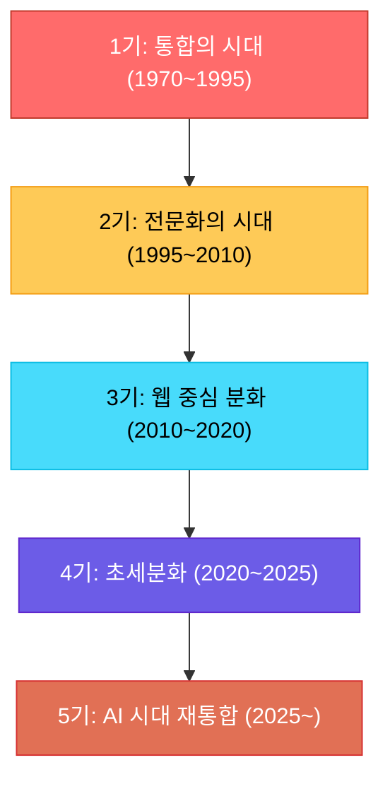
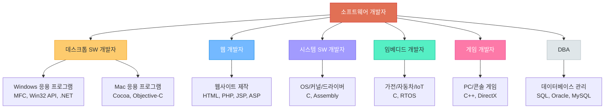
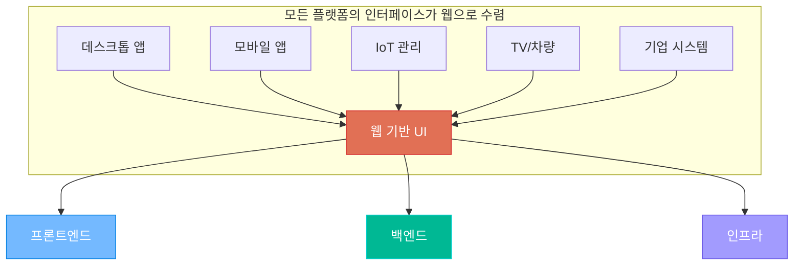
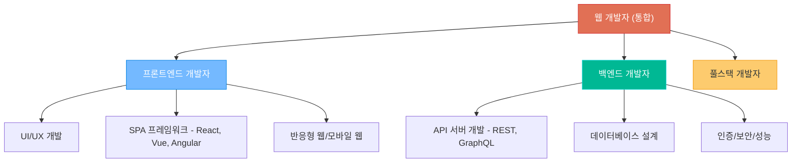
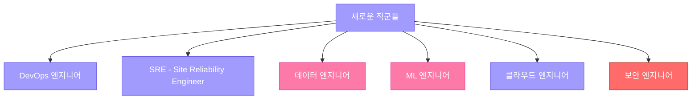
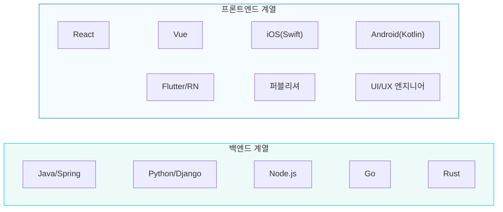
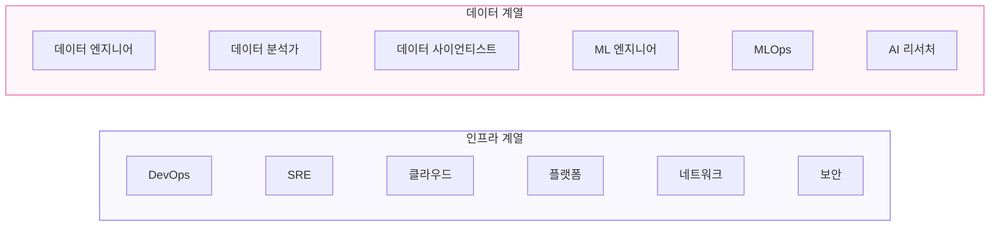
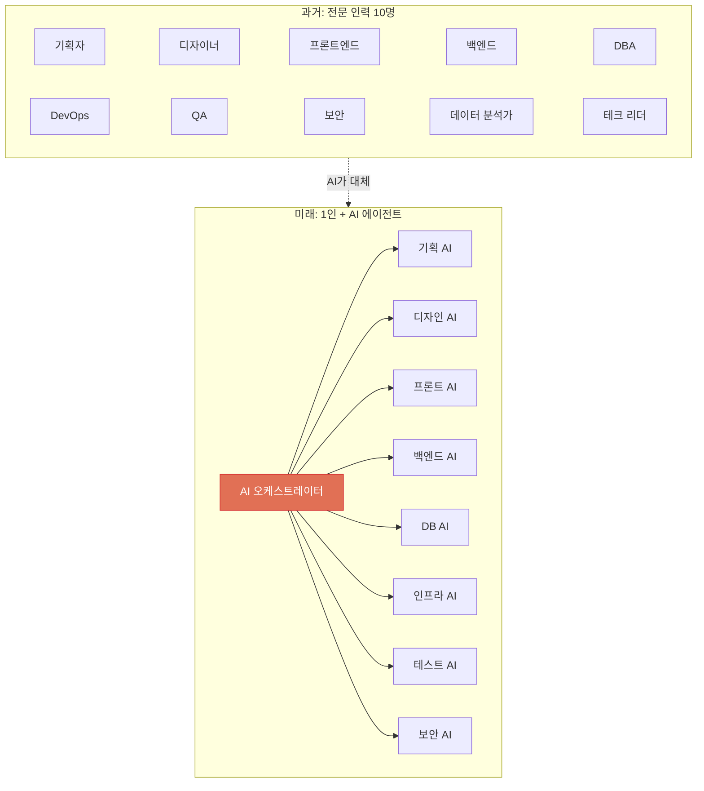
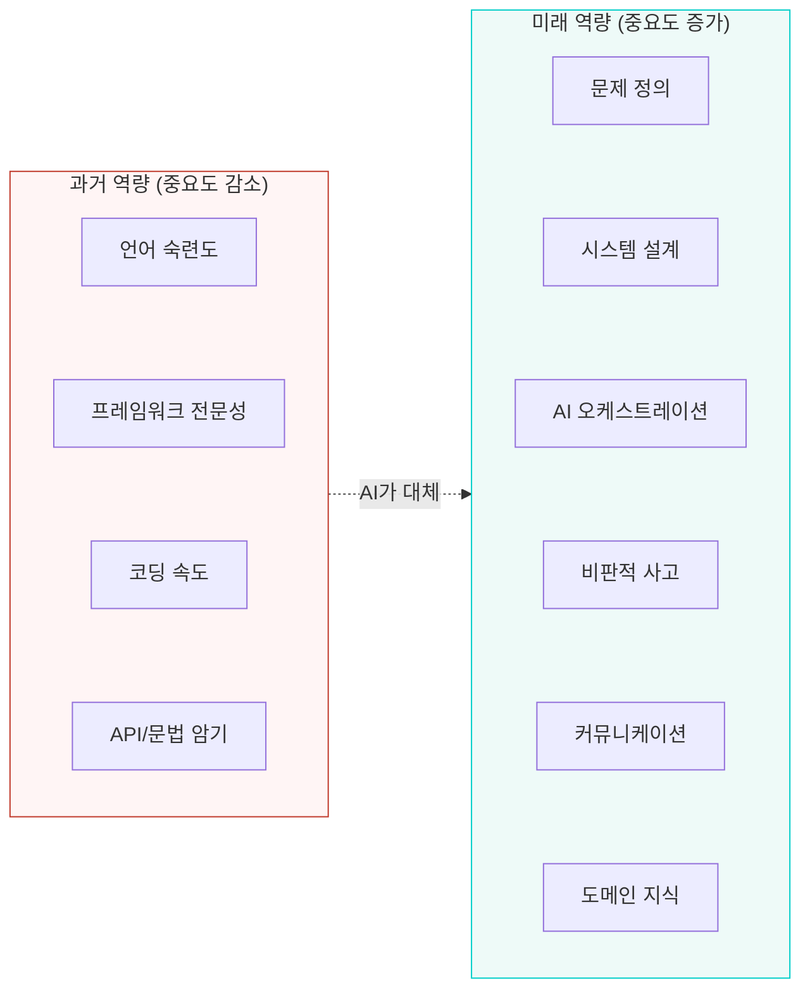
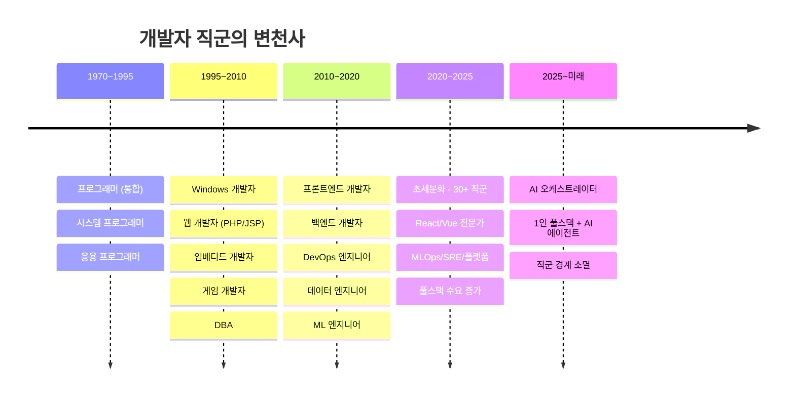

# 개발자 직군의 진화 - 통합에서 분화, 다시 통합으로

> 개발자라는 직업은 어떻게 세분화되었고, AI 시대에 다시 어떻게 합쳐지고 있는가?

---

## 개발자 직군 변천사 전체 흐름



---

## 1기: 통합의 시대 (1970~1995)

### "그냥 프로그래머"

이 시대에는 개발자를 세분화할 필요가 없었습니다. 컴퓨터를 다루는 사람 자체가 희소했고, 한 사람이 하드웨어 이해부터 소프트웨어 구현까지 모든 것을 담당했습니다.


#### 이 시대의 직업 분류

| 직업명 | 하는 일 | 비고 |
|--------|---------|------|
| **프로그래머 (Programmer)** | 코드를 작성하는 사람 | 가장 일반적인 호칭 |
| **시스템 프로그래머** | OS, 드라이버, 커널 레벨 개발 | 하드웨어와 가장 가까운 영역 |
| **응용 프로그래머** | 사용자가 쓰는 프로그램 개발 | 워드프로세서, 스프레드시트 등 |
| **전산실 관리자** | 컴퓨터 운영 + 프로그래밍 | 기업 전산실의 만능 담당자 |
| **SE (시스템 엔지니어)** | 설계 + 구현 + 운영 모두 | 일본식 IT 업계 용어, 한국에도 영향 |

> 이 시대에는 "개발자"라는 말보다 **"프로그래머"** 또는 **"전산쟁이"** 라는 호칭이 더 일반적이었습니다.

---

## 2기: 전문화의 시대 (1995~2010)

### "윈도우냐, 웹이냐, 임베디드냐"

Windows 95의 등장(1995), 인터넷의 대중화, 모바일 기기의 성장으로 소프트웨어가 다양한 플랫폼으로 확장되면서 개발자 직군이 **플랫폼별로** 세분화되기 시작했습니다.



#### 이 시대의 직업 분류

| 직업명 | 플랫폼 | 주요 기술 | 전성기 |
|--------|--------|-----------|--------|
| **Windows 응용 개발자** | 데스크톱 | MFC, Win32 API, VB, Delphi, .NET | 1995~2010 |
| **웹 개발자** | 웹 | HTML, CSS, JavaScript, PHP, JSP, ASP | 2000~ |
| **시스템 프로그래머** | OS/커널 | C, Assembly, Linux Kernel | 지속 |
| **임베디드 개발자** | 하드웨어 | C, RTOS, ARM | 지속 |
| **게임 개발자** | PC/콘솔 | C++, DirectX, OpenGL | 지속 |
| **DBA (데이터베이스 관리자)** | 데이터 | Oracle, MySQL, SQL Server | 1990~ |
| **ERP 개발자** | 기업용 SW | SAP ABAP, Oracle EBS | 2000~2015 |
| **모바일 개발자** | 휴대폰 | WIPI, BREW, J2ME | 2005~2010 |

#### 한국 IT 업계의 특수한 분류

```
SI (System Integration) 개발자
→ 대기업/공공기관의 시스템 구축 프로젝트
→ Java + Oracle + Spring 조합이 절대 다수
→ 한국 IT 인력의 가장 큰 비중을 차지

SM (System Management) 개발자
→ 기존 시스템의 유지보수/운영
→ 버그 수정, 기능 추가, 장애 대응

솔루션 개발자
→ 자체 제품(패키지 SW) 개발
→ 그룹웨어, ERP, 보안 솔루션 등
```

---

## 3기: 웹 중심 분화의 시대 (2010~2020)

### "모든 것이 웹이다"

스마트폰 혁명(아이폰 2007, 안드로이드 2008) 이후, **모든 서비스가 웹 기반으로 수렴** 하기 시작했습니다. 윈도우 응용 프로그램도, 모바일 앱도, 심지어 임베디드 장비의 관리 인터페이스도 웹으로 바뀌었습니다.



이 전환의 대표적 사례:
- **Microsoft Office** → Office 365 (웹 버전)
- **Adobe Photoshop** → Photoshop Web
- **VS Code** → 웹 기반 에디터 (Electron)
- **모바일 앱** → React Native, Flutter (웹 기술 기반 크로스플랫폼)
- **자동차 인포테인먼트** → 웹 기술 기반 UI
- **TV** → 스마트 TV 앱 = 웹앱

#### 웹 전성기의 직군 분화





#### 프론트엔드 vs 백엔드 - 상세 비교

| 구분 | 프론트엔드 개발자 | 백엔드 개발자 |
|------|------------------|--------------|
| **담당 영역** | 사용자가 보는 화면 (UI) | 사용자가 보지 못하는 서버 로직 |
| **핵심 기술** | HTML, CSS, JavaScript | Python, Java, Node.js, Go |
| **프레임워크** | React, Vue.js, Angular, Next.js | Django, Spring, Express, FastAPI |
| **관심사** | 디자인, 사용성, 반응속도, 접근성 | 데이터, 보안, 성능, 확장성 |
| **데이터베이스** | 거의 다루지 않음 | 핵심 업무 (SQL, NoSQL) |
| **배포** | CDN, 정적 호스팅 | 서버, 컨테이너, 클라우드 |

#### 이 시기에 새로 등장한 직군들

| 직군 | 등장 시기 | 역할 | 배경 |
|------|-----------|------|------|
| **DevOps 엔지니어** | 2010~ | 개발과 운영의 자동화 | CI/CD, Docker, Kubernetes |
| **SRE** | 2010~ | 서비스 안정성/가용성 보장 | Google이 만든 개념 |
| **데이터 엔지니어** | 2012~ | 데이터 파이프라인 구축 | 빅데이터 시대 |
| **ML 엔지니어** | 2015~ | 머신러닝 모델 개발/배포 | AI 붐 |
| **클라우드 엔지니어** | 2012~ | 클라우드 인프라 설계/운영 | AWS/Azure/GCP |
| **보안 엔지니어 (SecOps)** | 2015~ | 보안 설계/취약점 분석 | 사이버 보안 위협 증가 |
| **플랫폼 엔지니어** | 2018~ | 내부 개발 플랫폼 구축 | 개발 생산성 향상 |
| **QA 엔지니어** | 2000~ | 품질 보증/테스트 자동화 | 소프트웨어 품질 중요성 |

---

## 4기: 초세분화의 시대 (2020~2025)

### "모든 영역에 전문가가 필요하다"

클라우드, 마이크로서비스, AI, 보안... 기술 스택이 너무 복잡해지면서 개발자 직군이 극도로 세분화되었습니다.





> 2020~2025년 사이, Stack Overflow 개발자 설문에서 **개발자의 과반수가 2개 이상의 직군에 해당** 한다고 응답했습니다. DBA, SRE, 보안 담당자는 평균 **7개의 다른 역할** 도 동시에 수행한다고 답했습니다.

이 과도한 세분화는 역설적으로 **"풀스택 개발자"** 에 대한 수요를 다시 높였습니다.

---

## 5기: AI 시대의 재통합 (2025~미래)

### "AI가 전문성을 보완하면, 한 사람이면 된다"



#### 직군 경계의 소멸

| 과거의 전문 직군 | AI가 대체/보완하는 부분 | 남는 인간의 역할 |
|-----------------|----------------------|-----------------|
| 프론트엔드 개발자 | UI 코드 자동 생성 (v0, Bolt) | UX 판단, 사용자 경험 설계 |
| 백엔드 개발자 | API/DB 로직 자동 생성 | 아키텍처 설계, 보안 판단 |
| DBA | 쿼리 최적화, 스키마 생성 AI | 데이터 모델링 전략 |
| DevOps | 인프라 코드 자동 생성 | 비용/성능 트레이드오프 판단 |
| QA | 테스트 코드 자동 생성 및 실행 | 테스트 전략, 엣지 케이스 발견 |
| 디자이너 | 디자인 초안 AI 생성 | 브랜드 방향성, 감성 판단 |

#### 미래 개발자의 핵심 역량

```
과거: "이 기술을 얼마나 깊이 아는가?"
미래: "이 문제를 어떻게 해결할 것인가?"

과거: 특정 프레임워크의 전문가
미래: 문제 해결의 전문가 (도구는 AI가 다룸)
```



---

## 한눈에 보는 직군 변천사 종합



---

## 이 과정과의 연결

이 과정은 **웹 기초(프론트엔드 + 백엔드)** 를 배운 후, **AI 도구를 활용** 하여 **1인 풀스택 개발자** 로 성장하는 것을 목표로 합니다.

```
웹개발 기초 (HTML/CSS/JS)     → 프론트엔드 기본기
파이썬 Flask                   → 백엔드 기본기
데이터베이스                    → DBA 기본기
생성형AI 심화/응용              → AI 활용 능력
클라우드 서비스                 → DevOps 기본기
팀 프로젝트                    → 전체 통합 + 오케스트레이션 경험
```
