# 프로그래밍 언어의 발전사

> 기계어에서 자연어까지 — 프로그래밍 언어 80년의 역사

---

## 프로그래밍 언어 진화의 전체 흐름

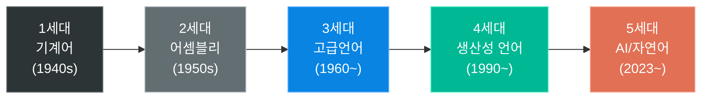

---

## 주요 언어 탄생 타임라인

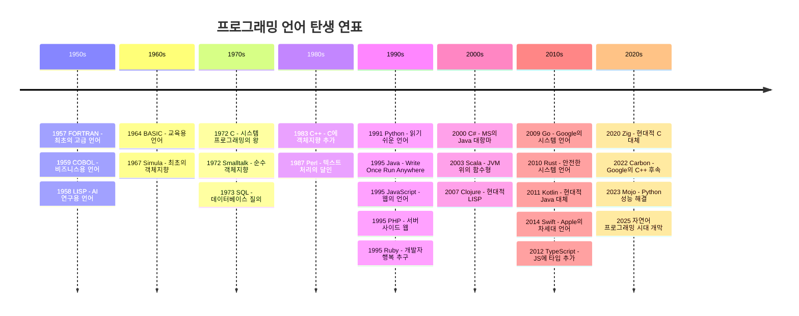

---

## 1. 시스템 프로그래밍의 계보: C → C++ → Rust/Go

### C (1972) — 모든 것의 시작

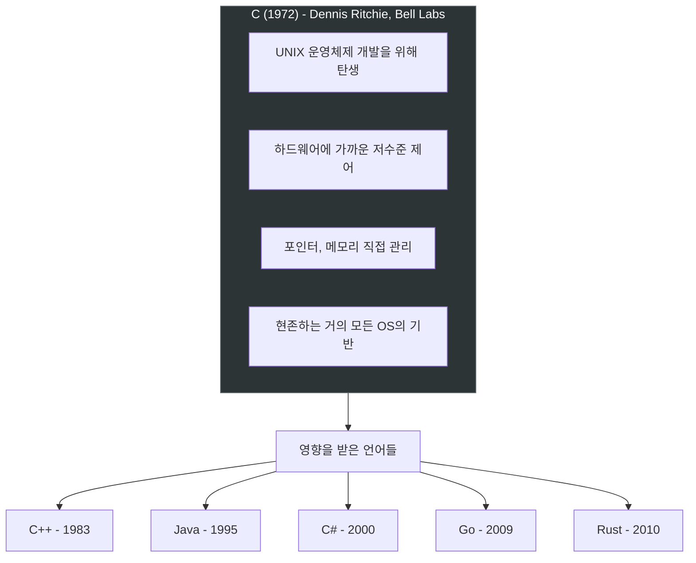

| 항목 | 내용 |
|------|------|
| **탄생** | 1972년, Dennis Ritchie, AT&T Bell Labs |
| **목적** | UNIX 운영체제를 이식 가능하게 재작성 |
| **특징** | 하드웨어 직접 제어, 포인터, 수동 메모리 관리 |
| **영향력** | Linux, Windows, macOS 커널 모두 C로 작성 |
| **현재 위치** | TIOBE 2026년 4월 기준 **2위** (10.99%) |
| **사용 분야** | OS 커널, 임베디드, 드라이버, IoT |

> C는 50년이 넘은 언어이지만, **운영체제, 데이터베이스, 네트워크 장비** 등 성능이 중요한 분야에서 여전히 대체 불가능합니다.

### C++ (1983) — C에 객체지향을 더하다

| 항목 | 내용 |
|------|------|
| **탄생** | 1983년, Bjarne Stroustrup, Bell Labs |
| **원래 이름** | "C with Classes" (클래스가 있는 C) |
| **특징** | C의 성능 + 객체지향 + 템플릿 + STL |
| **현재 위치** | TIOBE 2026년 4월 기준 **4위** (8.67%) |
| **사용 분야** | 게임 엔진 (Unreal), 브라우저 (Chrome), DB (MySQL) |

### Go (2009) — Google의 실용주의 언어

| 항목 | 내용 |
|------|------|
| **탄생** | 2009년, Google (Rob Pike, Ken Thompson) |
| **목적** | C++의 복잡성 해결, 대규모 시스템 개발 생산성 향상 |
| **특징** | 간결한 문법, 빠른 컴파일, 내장 동시성(goroutine) |
| **사용 분야** | Docker, Kubernetes, Terraform 등 인프라 도구 |

### Rust (2010) — 안전한 시스템 프로그래밍

| 항목 | 내용 |
|------|------|
| **탄생** | 2010년, Mozilla (Graydon Hoare) |
| **목적** | C/C++의 메모리 안전 문제 해결 |
| **특징** | 소유권(ownership) 시스템, GC 없이 메모리 안전 보장 |
| **사용 분야** | Firefox 엔진, Linux 커널 (일부), Discord 서버 |

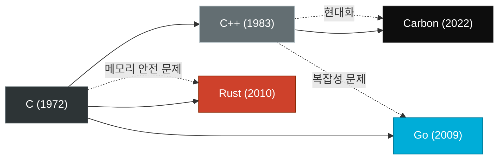

---

## 2. 엔터프라이즈의 왕: Java의 시대

### Java (1995) — "Write Once, Run Anywhere"

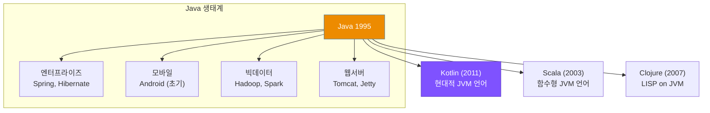

| 항목 | 내용 |
|------|------|
| **탄생** | 1995년, Sun Microsystems (James Gosling) |
| **핵심 철학** | JVM (Java Virtual Machine) 위에서 플랫폼 독립적 실행 |
| **전성기** | 2000~2015년 — 엔터프라이즈 시장 지배 |
| **현재 위치** | TIOBE 2026년 4월 기준 **3위** (8.71%) |
| **한국에서의 위상** | SI/공공기관/금융권 = Java + Spring + Oracle 사실상 표준 |

#### Java가 엔터프라이즈를 지배한 이유

```
1. 플랫폼 독립성 → 다양한 서버 환경에서 동일하게 동작
2. 강력한 타입 시스템 → 대규모 팀 개발에 적합
3. 풍부한 생태계 → Spring, Hibernate, Maven
4. 역호환성 → 15년 전 코드도 현재 JVM에서 실행 가능
5. 기업용 지원 → Oracle, IBM, Red Hat의 상용 지원
```

#### Java의 도전자들

| 언어 | 관계 | 장점 |
|------|------|------|
| **Kotlin** | Java 대체 (JVM 호환) | 간결한 문법, null 안전성, Android 공식 언어 |
| **Scala** | JVM 위의 함수형 | 빅데이터 (Spark), 타입 안전성 |
| **C#** | Java의 경쟁자 (MS) | .NET 생태계, Unity 게임 엔진 |

> C#은 TIOBE 2025년 올해의 언어로 선정되었으며(+2.94%), Java의 강력한 대항마로 성장 중입니다.

---

## 3. 웹의 삼위일체: HTML + CSS + JavaScript

### JavaScript (1995) — 10일 만에 만든 세계 정복 언어

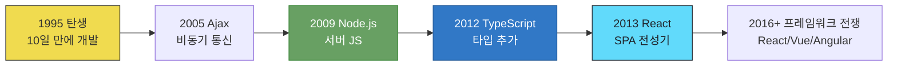

| 항목 | 내용 |
|------|------|
| **탄생** | 1995년, Brendan Eich, Netscape — **단 10일 만에 설계** |
| **원래 이름** | Mocha → LiveScript → JavaScript (Java 마케팅 편승) |
| **전환점** | 2009년 Node.js 등장 → 브라우저 밖에서도 실행 가능 |
| **현재** | 웹 프론트엔드의 **유일한** 프로그래밍 언어 |
| **생태계** | npm 패키지 200만+ 개 (세계 최대 패키지 레지스트리) |

#### JavaScript 프레임워크 생태계

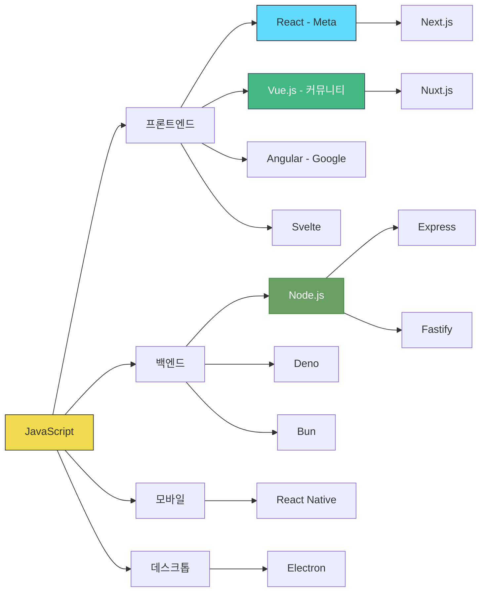

---

## 4. 현대의 절대 강자: Python

### Python (1991) — "읽기 쉬운 코드가 최고다"

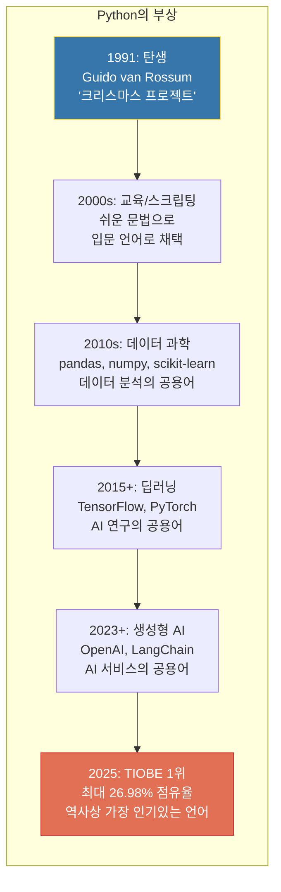

| 항목 | 내용 |
|------|------|
| **탄생** | 1991년, Guido van Rossum, 네덜란드 |
| **설계 철학** | "There should be one obvious way to do it" |
| **핵심 강점** | 가독성, 풍부한 라이브러리, 거대한 커뮤니티 |
| **현재 위치** | TIOBE 2026년 4월 기준 **1위** (22.61%) — 부동의 1위 |
| **약점** | 실행 속도가 느림 (C 대비 10~100배) |

#### Python이 1위가 된 이유

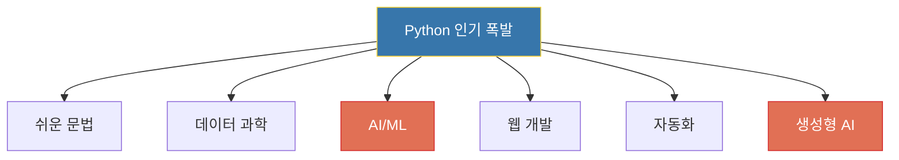

#### Python vs Java vs JavaScript 비교

같은 기능을 구현하는 코드 비교:

**"Hello, World!" 출력**

```
# Python (1줄)
print("Hello, World!")

// Java (5줄)
public class Hello {
    public static void main(String[] args) {
        System.out.println("Hello, World!");
    }
}

// JavaScript (1줄)
console.log("Hello, World!");
```

**HTTP 서버 만들기**

```
# Python Flask (5줄)
from flask import Flask
app = Flask(__name__)

@app.route('/')
def hello():
    return 'Hello!'

// Java Spring (10줄+)
@SpringBootApplication
public class Application {
    public static void main(String[] args) {
        SpringApplication.run(Application.class, args);
    }
}
@RestController
class HelloController {
    @GetMapping("/")
    String hello() { return "Hello!"; }
}

// Node.js Express (5줄)
const express = require('express')
const app = express()
app.get('/', (req, res) => res.send('Hello!'))
app.listen(3000)
```

---

## 5. 2026년 현재 언어 순위 (TIOBE Index)

| 순위 | 언어 | 점유율 | 전년 대비 | 주요 사용 분야 |
|------|------|--------|-----------|---------------|
| 1 | **Python** | 22.61% | -4.37% | AI/ML, 웹, 데이터, 자동화 |
| 2 | **C** | 10.99% | +0.38% | OS, 임베디드, IoT |
| 3 | **Java** | 8.71% | -1.65% | 엔터프라이즈, Android, 빅데이터 |
| 4 | **C++** | 8.67% | -1.89% | 게임, 시스템, 고성능 |
| 5 | **C#** | 7.39% | +2.94% | .NET, Unity, 기업용 |
| 6 | **JavaScript** | ~5% | - | 웹 프론트엔드, Node.js |
| 7 | **Go** | ~3% | - | 클라우드, 인프라 도구 |
| 8 | **SQL** | ~3% | - | 데이터베이스 |
| 9 | **Rust** | ~2% | +상승 | 시스템, WebAssembly |
| 10 | **R** | ~2% | +상승 | 통계, 데이터 과학 |

> C#이 2025년 TIOBE "올해의 프로그래밍 언어"로 선정 (+2.94%)
> Python은 2025년 7월 최고치 26.98%에서 하락세이나 여전히 압도적 1위

---

## 6. 언어 선택의 현실적 가이드

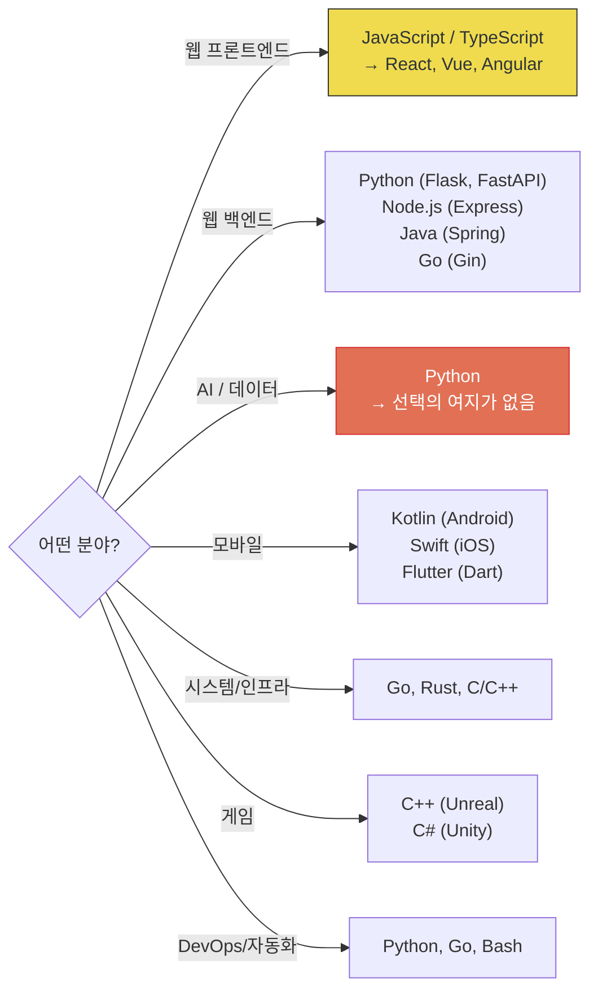

---

## 7. 이 과정에서 사용하는 언어

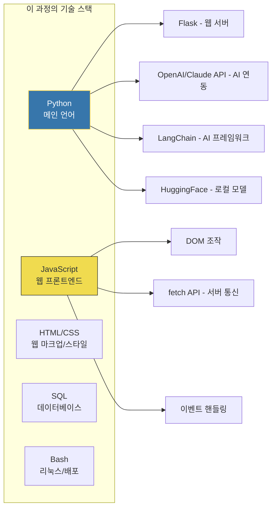

### 왜 Python인가?

```
1. AI/ML 생태계의 사실상 표준
   → OpenAI, Anthropic, HuggingFace 모두 Python SDK 제공

2. 배우기 쉬움
   → 영어 문장과 비슷한 직관적 문법

3. 웹 개발 가능
   → Flask, FastAPI로 빠르게 웹서비스 구축

4. 풍부한 라이브러리
   → "Python에 없는 라이브러리는 없다"

5. 취업 시장
   → AI 시대에 가장 수요가 높은 언어
```

---

## 8. 프로그래밍의 미래: 자연어가 새로운 프로그래밍 언어


Andrej Karpathy가 말했습니다:

> **"The hottest new programming language is English"**
> (가장 핫한 새 프로그래밍 언어는 영어다)

프로그래밍 언어는 **기계에 가까운 언어에서 인간에 가까운 언어로** 계속 진화해왔습니다. 그리고 2025년, 드디어 **자연어 자체가 프로그래밍 언어** 가 되는 시대가 열렸습니다.

하지만 기존 프로그래밍 언어의 이해 없이는 AI에게 올바른 지시를 내릴 수 없고, AI의 결과물을 검증할 수 없습니다. **그래서 이 과정에서 Python과 웹 기술을 배우는 것입니다.**

---

## 참고 자료

- [TIOBE Index - April 2026](https://www.tiobe.com/tiobe-index/)
- [TIOBE Index for April 2026: Top 10 (TechRepublic)](https://www.techrepublic.com/article/news-tiobe-index-language-rankings/)
- [C# wins TIOBE Programming Language of the Year 2025 (InfoWorld)](https://www.infoworld.com/article/4112993/c-wins-tiobe-programming-language-of-the-year-honors-for-2025.html)
- [Python is slipping in popularity (InfoWorld)](https://www.infoworld.com/article/4129615/python-is-slipping-in-popularity-tiobe.html)
- [프로그래밍 언어의 역사 (위키백과)](https://ko.wikipedia.org/wiki/%ED%94%84%EB%A1%9C%EA%B7%B8%EB%9E%98%EB%B0%8D_%EC%96%B8%EC%96%B4%EC%9D%98_%EC%97%AD%EC%82%AC)
- [프로그래밍 언어의 역사와 전망 (F-Lab)](https://f-lab.ai/en/insight/history-future-of-programming-languages)
- [모든 프로그래밍 언어의 간략한 역사 (ITWorld)](https://www.itworld.co.kr/article/3551869/)
