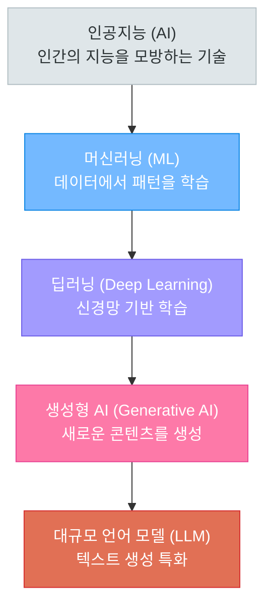
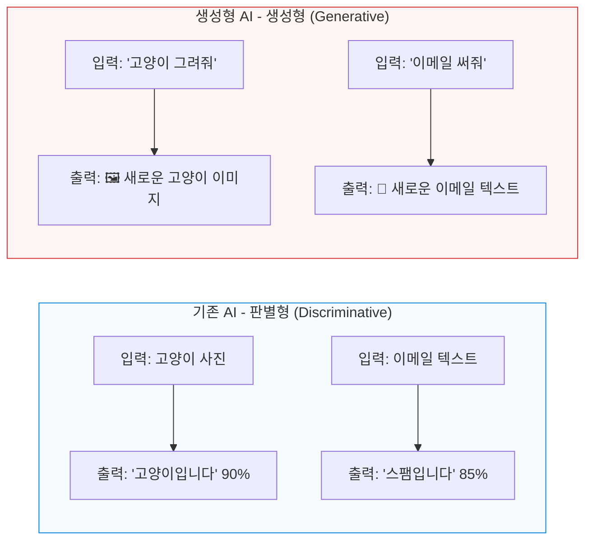
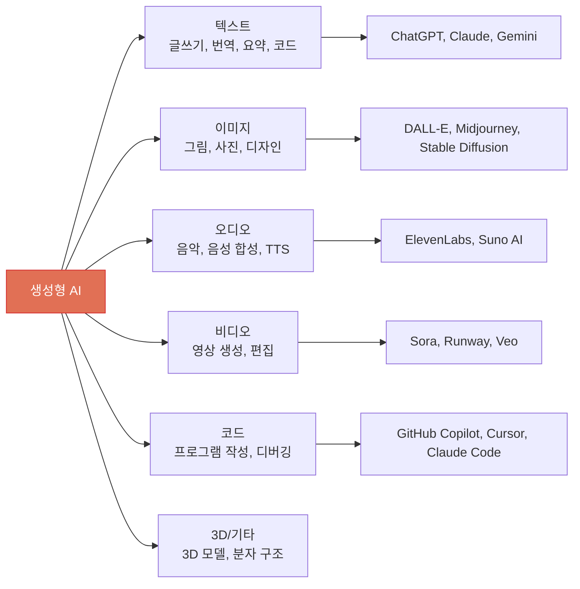
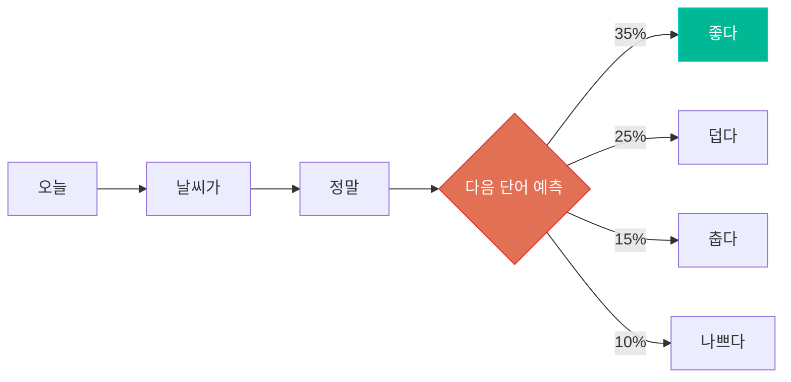
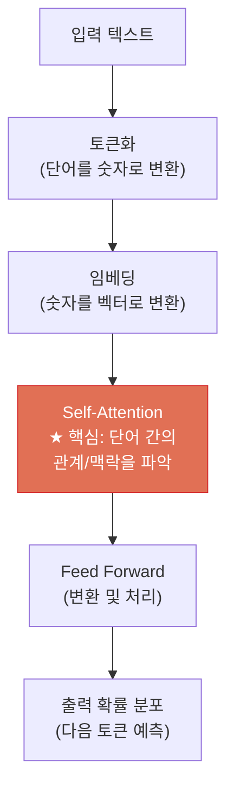
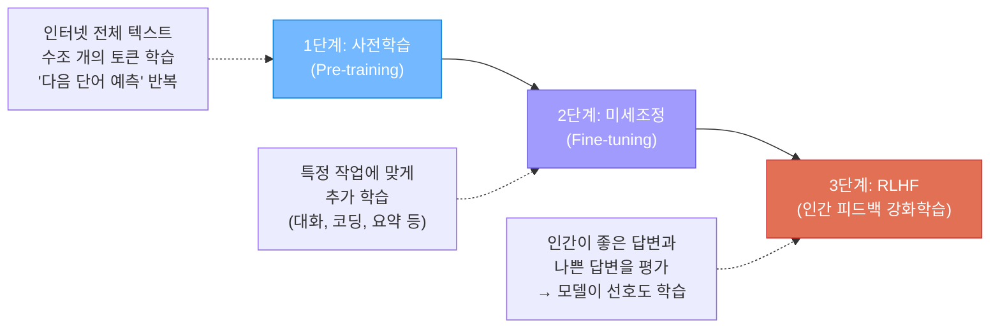
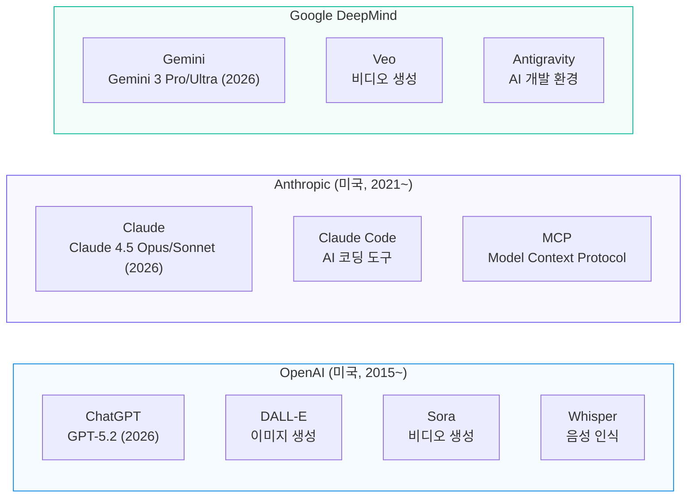
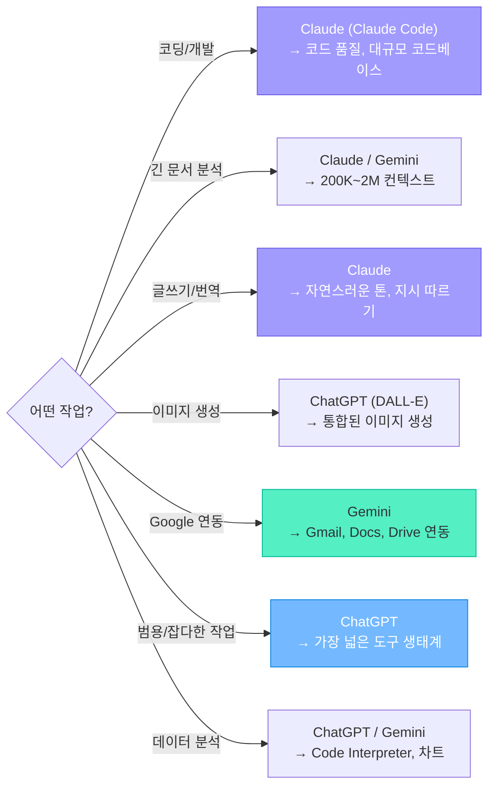
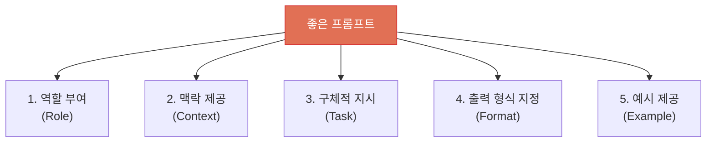
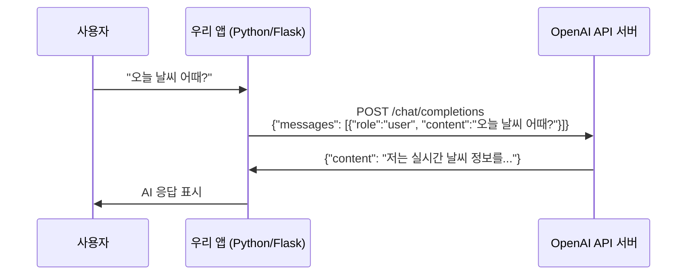

# 생성형 AI 개론

> "생성형 AI란 무엇이고, 어떻게 동작하며, 왜 세상을 바꾸고 있는가?"

---

## 1. AI의 큰 그림



| 개념 | 정의 | 예시 |
|------|------|------|
| **AI (인공지능)** | 인간의 지능을 모방하는 모든 기술 | 체스 AI, 자율주행, 음성인식 |
| **ML (머신러닝)** | 데이터에서 패턴을 학습하는 AI | 스팸 필터, 추천 시스템 |
| **딥러닝** | 인공 신경망을 사용한 머신러닝 | 이미지 인식, 번역 |
| **생성형 AI** | **새로운 콘텐츠를 만들어내는** AI | 글쓰기, 그림, 음악, 코드 생성 |
| **LLM** | 텍스트 생성에 특화된 초거대 모델 | ChatGPT, Claude, Gemini |

---

## 2. 생성형 AI란?

### 기존 AI vs 생성형 AI



| 구분 | 판별형 AI | 생성형 AI |
|------|----------|----------|
| **목적** | 분류/예측 (이것은 X인가?) | 생성 (새로운 X를 만들어라) |
| **출력** | 라벨, 확률, 숫자 | 텍스트, 이미지, 코드, 음악 |
| **예시** | 스팸 필터, 얼굴 인식 | ChatGPT, DALL-E, Midjourney |

### 생성형 AI가 만들 수 있는 것들



---

## 3. LLM은 어떻게 동작하는가?

### 핵심 원리: "다음 단어 예측"

LLM의 동작 원리는 놀라울 정도로 단순합니다:

> **주어진 텍스트 다음에 올 가장 적절한 단어(토큰)를 예측한다.**

```
입력: "오늘 날씨가 정말"
→ LLM 예측: "좋다" (확률 35%) | "덥다" (확률 25%) | "춥다" (확률 15%) | ...

입력: "파이썬에서 리스트를 정렬하려면"
→ LLM 예측: "sort()" (확률 40%) | "sorted()" (확률 30%) | ...
```



이 단순한 원리를 **수조 개의 파라미터** 와 **인터넷 전체의 텍스트 데이터** 로 스케일업하면, 마치 "이해하고 생각하는 것처럼" 보이는 결과가 나옵니다.

### 트랜스포머 (Transformer) 아키텍처

2017년 Google의 논문 **"Attention Is All You Need"** 에서 발표된 트랜스포머는 현재 **모든 LLM의 기반** 입니다.



#### Self-Attention이 하는 일

```
문장: "그 은행에서 돈을 인출했다"

"은행"의 의미를 파악할 때:
→ "돈", "인출"과의 관계를 보고 → 금융 기관
→ 만약 "강", "물고기"가 있었다면 → 강변

이처럼 문맥에 따라 단어의 의미를 동적으로 파악하는 것이
Self-Attention의 핵심입니다.
```

### LLM의 학습 과정



### 핵심 용어 정리

| 용어 | 설명 | 비유 |
|------|------|------|
| **파라미터 (Parameter)** | 모델이 학습한 "지식"의 단위. 숫자로 된 가중치 | 뇌의 시냅스 연결 |
| **토큰 (Token)** | 텍스트를 처리하는 최소 단위 (단어 또는 단어 조각) | 한글 1글자 ≈ 2~3토큰 |
| **컨텍스트 윈도우** | 모델이 한 번에 처리할 수 있는 최대 토큰 수 | 작업 기억(Working Memory) |
| **Temperature** | 출력의 랜덤성 조절 (0=확정적, 1=창의적) | 모험심의 정도 |
| **프롬프트 (Prompt)** | 사용자가 모델에게 주는 입력 텍스트 | 질문/지시/요청 |
| **할루시네이션** | 모델이 사실이 아닌 것을 사실처럼 생성하는 현상 | "그럴듯한 거짓말" |
| **RAG** | 외부 문서를 검색하여 답변에 활용하는 기법 | 오픈북 시험 |

---

## 4. 3대 LLM 서비스 비교: ChatGPT vs Claude vs Gemini

### 회사 및 모델 개요



### 상세 비교 (2026년 기준)

| 항목 | ChatGPT (OpenAI) | Claude (Anthropic) | Gemini (Google) |
|------|-------------------|-------------------|-----------------|
| **최신 모델** | GPT-5.2 | Claude 4.5 Opus/Sonnet | Gemini 3 Pro/Ultra |
| **강점** | 범용성, 코딩, 도구 생태계 | 글쓰기, 긴 문서, 지시 따르기 | Google 연동, 대용량 컨텍스트 |
| **컨텍스트** | 128K 토큰 | 200K 토큰 | 1M~2M 토큰 |
| **무료 플랜** | GPT-5.2 제한적 사용 | 일일 사용량 제한 | Gemini 3 Pro 제한적 |
| **유료 (Pro)** | $20/월 (Plus) | $20/월 (Pro) | $19.99/월 (AI Pro) |
| **고급 플랜** | $200/월 (Pro) | $100~200/월 (Max) | $249.99/월 (Ultra) |
| **API 가격** | 중간 | 중간 | 상대적으로 저렴 |
| **코딩 능력** | 매우 강함 | 최상급 (특히 Claude Code) | 강함 |
| **글쓰기** | 강함 | 최상급 (자연스러운 톤) | 강함 |
| **한국어** | 강함 | 강함 | 보통 |
| **엔터프라이즈 점유율** | 2위 | 1위 (32%, 2026 초) | 3위 |

### 언제 어떤 것을 쓸까?



---

## 5. 프롬프트 엔지니어링 기초

### 프롬프트란?

> AI에게 주는 **입력 텍스트**. 같은 AI도 프롬프트에 따라 결과가 완전히 달라집니다.

### 좋은 프롬프트의 5가지 원칙



#### 나쁜 프롬프트 vs 좋은 프롬프트

**나쁜 프롬프트:**
```
파이썬 코드 짜줘
```

**좋은 프롬프트:**
```
[역할] 너는 10년차 Python 백엔드 개발자야.
[맥락] Flask로 REST API를 만들고 있어.
[지시] 사용자 회원가입 엔드포인트를 만들어줘.
       - POST /api/register
       - 입력: email, password, name
       - 비밀번호는 bcrypt로 해싱
       - 중복 이메일 체크
[형식] 코드에 주석을 달아서 설명해줘.
[예시] 요청: {"email": "test@test.com", "password": "1234", "name": "홍길동"}
       응답: {"message": "회원가입 성공", "user_id": 1}
```

### 프롬프트 패턴

| 패턴 | 설명 | 사용 시기 |
|------|------|-----------|
| **Zero-shot** | 예시 없이 바로 질문 | 간단한 질문 |
| **Few-shot** | 2~3개 예시를 함께 제공 | 특정 형식이 필요할 때 |
| **Chain-of-Thought** | "단계별로 생각해봐" 추가 | 복잡한 추론이 필요할 때 |
| **Role Playing** | 특정 역할을 부여 | 전문적인 답변이 필요할 때 |

---

## 6. API란? — 프로그램에서 AI를 사용하는 방법



```
웹 브라우저에서 ChatGPT 사용  →  일반 사용자
API로 ChatGPT를 내 프로그램에 연결  →  개발자
```

이 과정에서 배우는 것은 **API를 통해 AI를 프로그램에 통합하는 방법** 입니다.

---

## 7. 생성형 AI의 한계와 주의점

| 한계 | 설명 | 대응 방법 |
|------|------|-----------|
| **할루시네이션** | 사실이 아닌 것을 사실처럼 말함 | 중요한 정보는 반드시 검증 |
| **최신 정보 부족** | 학습 데이터 이후 정보를 모름 | RAG, 웹 검색 연동 |
| **수학/논리 약점** | 복잡한 계산에서 오류 가능 | 코드 실행 도구 연동 |
| **편향성** | 학습 데이터의 편향이 반영됨 | 다양한 관점 확인 |
| **보안** | 민감한 정보 입력 주의 | 개인정보, 기업 비밀 주의 |
| **저작권** | AI 생성물의 저작권 불명확 | 법적 판단 필요 |

---

## 참고 자료

- [ChatGPT vs Claude vs Gemini: LLM 비교 (코드트리)](https://www.codetree.ai/blog/chatgpt-vs-claude-vs-gemini-llm-%EB%B9%84%EA%B5%90/)
- [2024년 생성형 AI 서비스 톺아보기 (AI Ground)](https://www.aiground.co.kr/chatgpt-claude-gemini-comparison-guide/)
- [인공지능, LLM과 GPT는 어떻게 다를까? (Superb AI)](https://blog-ko.superb-ai.com/artificial-intelligence-llm-vs-gpt-whats-the-difference/)
- [ChatGPT vs Gemini vs Claude Full 2026 Comparison (Data Studios)](https://www.datastudios.org/post/chatgpt-vs-gemini-vs-claude-full-2026-comparison-complete-analysis-features-pricing-workflow-imp)
- [2026 AI Subscription Prices (SentiSight)](https://www.sentisight.ai/ai-price-comparison-gemini-chatgpt-claude-grok/)
- [AI Models in 2026: Which One Should You Actually Use? (GuruSup)](https://gurusup.com/blog/ai-comparisons)
