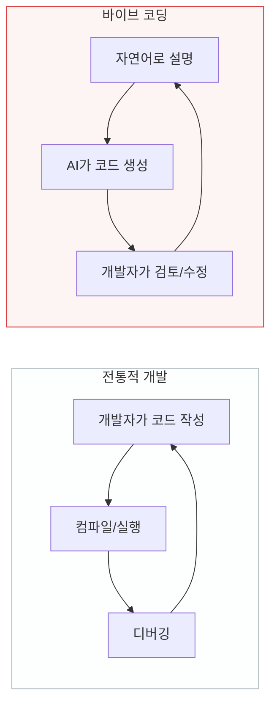
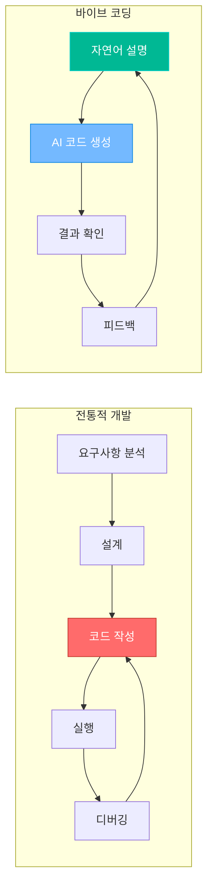
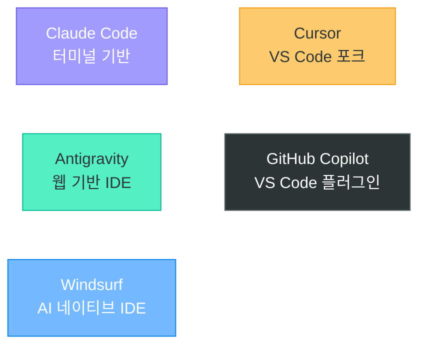
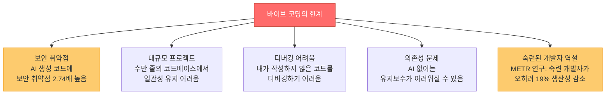

# 바이브 코딩 (Vibe Coding)

> "코드를 보지 마라, 느낌으로 코딩하라" — Andrej Karpathy, 2025.02

---

## 1. 바이브 코딩이란?

### 정의

**바이브 코딩(Vibe Coding)** 은 개발자가 자연어로 의도를 전달하면 AI가 코드를 생성하는 프로그래밍 방식입니다. 기존의 "한 줄 한 줄 코드를 직접 작성"하는 방식 대신, **"무엇을 만들고 싶은지 설명"** 하면 AI가 구현합니다.



### 기원

2025년 2월 3일, 전 OpenAI 공동창업자이자 전 Tesla AI 디렉터인 **Andrej Karpathy** 가 X(트위터)에 올린 글에서 처음 사용한 용어입니다:

> *"There's a new kind of coding I call **'vibe coding'**, where you fully give in to the vibes, embrace exponentials, and forget that the code even exists."*
>
> *"나는 이것을 '바이브 코딩'이라 부른다. 분위기에 완전히 몸을 맡기고, 코드가 존재한다는 것조차 잊어버리는 것이다."*

이 단어는 불과 1개월 만에 Merriam-Webster 사전에 "슬랭/트렌딩" 표현으로 등록되었고, **Collins 영어사전의 2025년 올해의 단어** 로 선정되었습니다.

---

## 2. 전통적 개발 vs 바이브 코딩



| 비교 항목 | 전통적 개발 | 바이브 코딩 |
|-----------|------------|------------|
| **코드 작성** | 개발자가 직접 (100%) | AI가 생성, 개발자가 검토 |
| **핵심 능력** | 프로그래밍 언어 숙련도 | 의도를 명확히 전달하는 능력 |
| **속도** | 느림 (타이핑 속도 제한) | 빠름 (AI가 순식간에 생성) |
| **진입 장벽** | 높음 (언어/프레임워크 학습) | 낮음 (자연어만으로 가능) |
| **코드 이해** | 깊이 이해 | 이해 없이도 동작 가능 (위험) |
| **비유** | 악보를 한 음표씩 그리는 작곡가 | 오케스트라를 지휘하는 지휘자 |

---

## 3. 바이브 코딩의 진화: 에이전틱 엔지니어링

Karpathy 본인도 바이브 코딩의 개념이 이미 진화했다고 말합니다:


| 단계 | 바이브 코딩 | 에이전틱 코딩 | 에이전틱 엔지니어링 |
|------|------------|-------------|-------------------|
| **검증** | 안 함 (느낌으로) | AI가 자체 테스트 | 체계적 검증 파이프라인 |
| **대상** | 개인 프로젝트, 프로토타입 | 소규모 프로젝트 | 프로덕션 서비스 |
| **코드 품질** | 낮을 수 있음 | 중간 | 높음 |
| **적합 사용자** | 비개발자, 프로토타이핑 | 개발자 | 시니어 개발자/아키텍트 |

---

## 4. 주요 바이브 코딩 도구

### 도구 비교



### 상세 비교표

| 항목 | Claude Code | Cursor | Antigravity | GitHub Copilot | Windsurf |
|------|------------|--------|-------------|---------------|----------|
| **제작사** | Anthropic | Anysphere | Google | GitHub (MS) | Codeium |
| **형태** | CLI (터미널) | 데스크톱 IDE | 웹 IDE | VS Code 플러그인 | 데스크톱 IDE |
| **AI 모델** | Claude 4.5 | 멀티모델 | Gemini 3 | GPT-4o + 자체 | 자체 + 멀티모델 |
| **컨텍스트** | ~100만 토큰 | 수만 토큰 | 대규모 | 수천 토큰 | 수만 토큰 |
| **강점** | 대규모 리팩토링, 복잡한 작업 | 일상적 코딩 생산성 | 프로젝트 전체 관리 | 실시간 자동완성 | 에이전트 기반 |
| **가격** | 사용량 기반 | $20/월 | 무료 (베타) | $10/월 | $10/월 (무료 있음) |
| **적합 대상** | 시니어 개발자 | 모든 개발자 | 프로토타이핑 | 모든 개발자 | 모든 개발자 |

### 각 도구의 실제 사용 방식

#### Claude Code — 터미널에서 대화하듯 코딩

```
$ claude

> 이 프로젝트의 전체 구조를 분석해줘

> Flask로 사용자 인증 API를 만들어줘. JWT 기반으로.

> 방금 만든 코드에 대한 테스트 코드도 작성해줘

> 이 에러를 분석하고 수정해줘: [에러 메시지 붙여넣기]
```

#### Cursor — IDE에서 AI와 채팅

```
1. VS Code와 거의 동일한 인터페이스
2. Cmd+K: 선택한 코드에 대해 AI에게 지시
   → "이 함수를 비동기로 바꿔줘"
3. Cmd+L: AI 채팅 패널 열기
   → "이 프로젝트에 로그인 기능 추가해줘"
4. Tab: AI의 자동완성 제안 수락
```

#### Antigravity — 프로젝트를 통째로 생성

```
1. "To-do 앱을 만들어줘. React + FastAPI로."
2. AI가 프로젝트 구조/파일/코드를 전부 생성
3. 실시간 미리보기로 결과 확인
4. "로그인 기능 추가해줘" → AI가 관련 파일 전부 수정
5. 배포까지 자동화
```

---

## 5. 바이브 코딩의 실전 활용 시나리오

### 시나리오 1: 프로토타입 빠르게 만들기


### 시나리오 2: 반복 작업 자동화

```
"이 CSV 파일을 읽어서 각 행의 이메일 주소를 추출하고,
 중복 제거 후 알파벳 순으로 정렬해서 새 파일로 저장하는
 Python 스크립트 만들어줘"

→ AI가 즉시 완성된 스크립트 생성
→ 과거: 30분 걸리던 작업 → 현재: 30초
```

### 시나리오 3: 모르는 기술 빠르게 활용

```
"WebSocket을 이용한 실시간 채팅을 구현해줘.
 Flask-SocketIO 사용하고, 접속자 목록도 보여줘"

→ 개발자가 WebSocket을 모르더라도
→ AI가 작동하는 코드를 생성
→ 생성된 코드를 보며 기술을 학습
```

---

## 6. 바이브 코딩의 한계와 주의사항

### 현실적인 한계



### "코딩을 몰라도 되는가?"에 대한 답

```
Q: 바이브 코딩이 있으니까 코딩을 배울 필요 없지 않나요?

A: 아닙니다. 오히려 더 중요해졌습니다.

  이유 1: AI가 생성한 코드가 올바른지 판단하려면 코딩 지식 필요
  이유 2: AI에게 정확한 지시를 내리려면 기술 이해 필요
  이유 3: AI가 못하는 디버깅/아키텍처 결정은 인간의 몫
  이유 4: AI 코드의 보안 취약점을 발견하려면 보안 지식 필요

  비유: 자동 번역기가 있다고 외국어를 몰라도 되는 게 아닌 것처럼,
       AI가 코딩을 해준다고 개발 지식이 불필요한 건 아닙니다.
```

---

## 7. 바이브 코딩 실습 준비

### 이 과정에서 체험할 도구

| Day | 도구 | 활용 |
|-----|------|------|
| Day 4 | Antigravity | 바이브 코딩으로 프로토타입 생성 |
| Day 22~27 | Claude Code / Cursor | AI 보조 개발 실습 |
| Day 28~30 | Claude Code | 미니 프로젝트에서 실전 활용 |
| Day 34~45 | 자유 선택 | 팀 프로젝트에서 바이브 코딩 도구 활용 |

### 바이브 코딩을 잘하기 위한 팁

```
1. 구체적으로 설명하라
   ❌ "웹사이트 만들어줘"
   ✅ "Flask로 사용자 등록/로그인이 가능한 웹사이트를 만들어줘.
       SQLite DB 사용하고, 비밀번호는 bcrypt로 해싱해줘"

2. 단계적으로 요청하라
   ❌ 전체 프로젝트를 한 번에 요청
   ✅ 기본 구조 → 기능 추가 → UI 개선 → 에러 처리

3. 결과를 반드시 검토하라
   → AI 코드를 그대로 사용하지 말고, 동작과 보안을 확인

4. 생성된 코드를 이해하라
   → 모르는 부분이 있으면 AI에게 설명을 요청

5. 버전 관리를 활용하라
   → Git으로 각 단계를 커밋하여 되돌릴 수 있게
```

---

## 참고 자료

- [바이브 코딩 (나무위키)](https://namu.wiki/w/%EB%B0%94%EC%9D%B4%EB%B8%8C%20%EC%BD%94%EB%94%A9)
- [베스트 AI 코딩 도구: Antigravity, Cursor, Claude Code 비교 (nextplatform)](https://nextplatform.net/antigravity-vs-cursor-vs-claude-code-for-ai-vibecoding/)
- [바이브 코딩 툴 추천 TOP 7 (waveon)](https://www.waveon.io/blog/vibe-coding-tool-top-5-ko)
- [2026 바이브 코딩 툴 5가지 추천 (코드트리)](https://www.codetree.ai/blog/2026-%EB%B0%94%EC%9D%B4%EB%B8%8C-%EC%BD%94%EB%94%A9-%ED%88%B4-5%EA%B0%80%EC%A7%80-%EC%B6%94%EC%B2%9C-ai-%EC%BD%94%EB%94%A9-%ED%88%B4%EB%A1%9C-%EB%8B%AC%EB%9D%BC%EC%A7%84-%EA%B0%9C%EB%B0%9C%EC%9E%90/)
- [바이브 코딩(Vibe Coding)의 본질과 도구별 비교 (Devitworld)](https://www.devitworld.com/coding/vive-coding/vibe-coding-tools-feature-claude-code/)
- [바이브 코딩의 이해와 적용 (삼성SDS)](https://www.samsungsds.com/kr/insights/understanding-and-applying-vibe-coding.html)
- [Vibe Coding Explained (Google Cloud)](https://cloud.google.com/discover/what-is-vibe-coding)
- [What is Vibe Coding? (IBM)](https://www.ibm.com/think/topics/vibe-coding)
