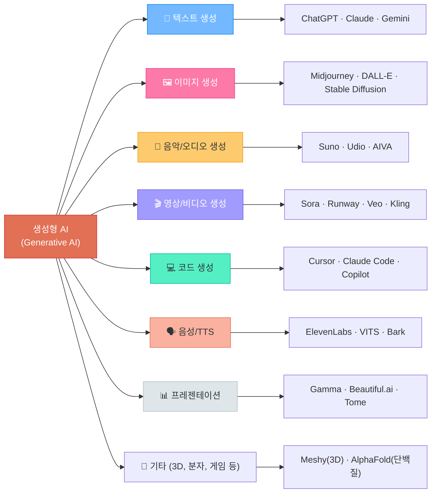
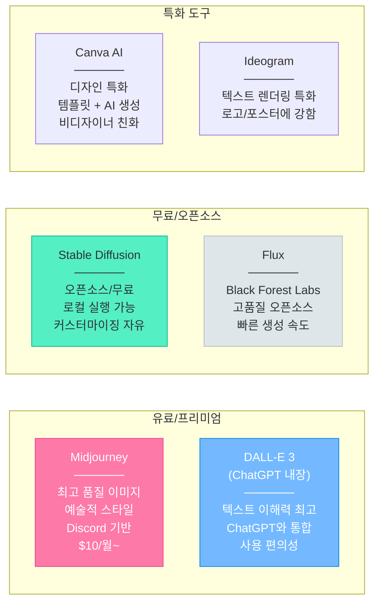
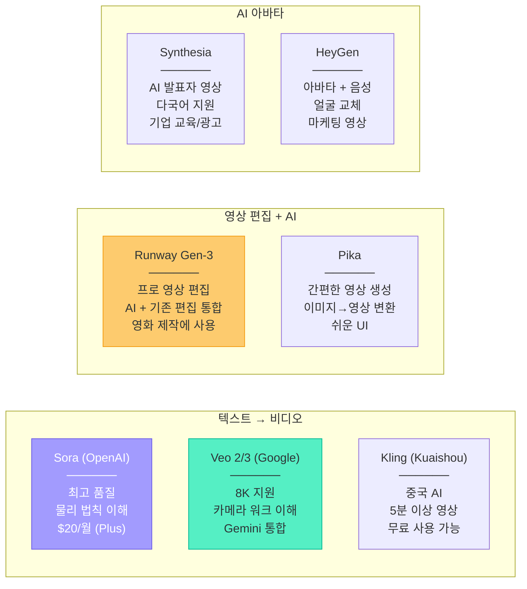
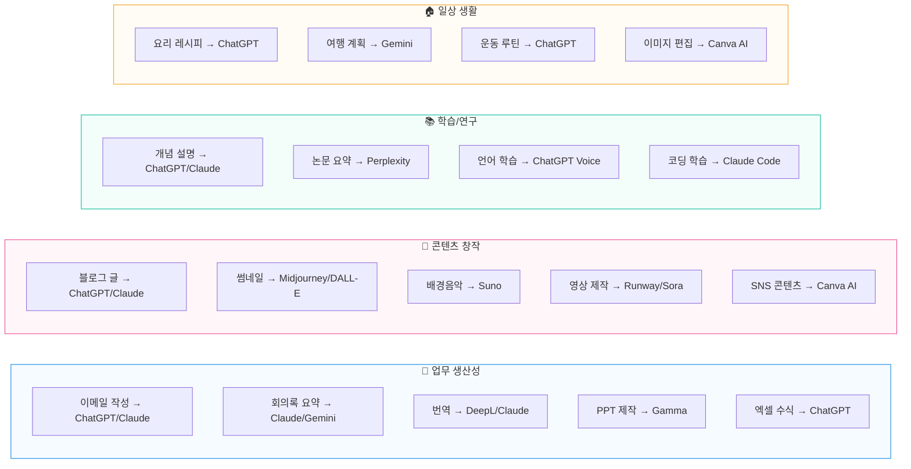

# 생성형 AI 전체 지형도

> 텍스트, 이미지, 음악, 영상, 코드 — 생성형 AI가 만들 수 있는 모든 것

---

## 1. 생성형 AI 분류 체계



---

## 2. 텍스트 생성 AI (LLM 챗봇)

### 일상에서 쓰는 AI 챗봇

| 서비스 | 회사 | 무료 | 유료 | 특징 |
|--------|------|------|------|------|
| **ChatGPT** | OpenAI | O | $20/월~ | 가장 범용적, 도구 생태계 최대 |
| **Claude** | Anthropic | O | $20/월~ | 글쓰기 최강, 긴 문서 처리, 코딩 |
| **Gemini** | Google | O | $20/월~ | Google 연동, 초대형 컨텍스트(1M+) |
| **Grok** | xAI (Elon Musk) | O | X 프리미엄 | X(트위터) 실시간 데이터 연동 |
| **Perplexity** | Perplexity AI | O | $20/월 | AI 검색 엔진 (출처 표시 특화) |
| **Copilot** | Microsoft | O | $20/월 | Bing 검색 + Office 연동 |

### 텍스트 AI로 할 수 있는 일

```
- 글쓰기: 이메일, 보고서, 블로그, 소설
- 요약: 긴 문서/논문을 핵심만 추출
- 번역: 다국어 번역 (뉘앙스까지 반영)
- 분석: 데이터 해석, 비교 분석
- 코딩: 프로그램 작성, 디버깅, 설명
- 학습: 개념 설명, 퀴즈 출제, 과외
- 브레인스토밍: 아이디어 발상, 기획
```

---

## 3. 이미지 생성 AI

### 주요 도구



### 이미지 AI 활용 사례

```
- 블로그/SNS 썸네일 제작
- 프레젠테이션 삽화
- 캐릭터/로고 디자인 초안
- 제품 목업(Mockup) 생성
- 웹툰/만화 소재
- 인테리어/패션 시뮬레이션
```

---

## 4. 음악/오디오 생성 AI

### 주요 도구

| 서비스 | 특징 | 가격 | 사용 예 |
|--------|------|------|---------|
| **Suno** | 가사+멜로디+보컬 자동 생성, v5 최신 | 무료(제한)/유료 $10/월~ | "신나는 K-pop 스타일 노래 만들어줘" |
| **Udio** | 고품질 음악 생성, 장르 다양 | 무료(제한)/유료 | 배경음악, 광고 음악 |
| **AIVA** | AI 작곡가, 클래식/영화음악 특화 | 무료/유료 | 게임 BGM, 영화 OST |
| **Boomy** | 초간단 음악 생성, 스트리밍 배포 가능 | 무료 | Spotify에 AI 음악 업로드 |
| **ElevenLabs** | 음성 합성/복제 최강 | 무료(제한)/유료 | 나레이션, 더빙, TTS |
| **Bark** | 오픈소스 음성 생성 | 무료 | 다국어 음성, 효과음 |

### 음악 AI로 할 수 있는 일

```
- 유튜브 배경음악 (저작권 걱정 없음)
- 팟캐스트 인트로/아웃트로
- 프레젠테이션 배경음악
- 개인 노래 작곡 (가사 포함)
- 오디오북 나레이션 (TTS)
- 다국어 더빙
```

---

## 5. 영상/비디오 생성 AI

### 주요 도구



### 영상 AI 활용 사례

```
- 유튜브 쇼츠/릴스 콘텐츠 제작
- 제품 소개 영상
- 교육/강의 영상 (AI 아바타)
- 마케팅/광고 영상
- 뮤직비디오
- 소셜 미디어 콘텐츠
```

---

## 6. 프레젠테이션/문서 AI

| 서비스 | 특징 | 활용 |
|--------|------|------|
| **Gamma** | 텍스트만 입력하면 PPT 자동 생성 | 발표 자료, 보고서 |
| **Beautiful.ai** | 디자인 자동 조정, 템플릿 풍부 | 비즈니스 프레젠테이션 |
| **Tome** | AI 스토리텔링 특화 | 기획서, 제안서 |
| **Canva AI** | 디자인+AI 통합 | 포스터, SNS, PPT |
| **Notion AI** | 문서 작성/요약/번역 AI | 업무 문서, 위키 |
| **Napkin AI** | 텍스트를 다이어그램으로 변환 | 개념 설명, 프로세스 도식화 |

---

## 7. 일상에서 쓸 수 있는 AI 도구 총정리



---

## 8. 생성형 AI 시장 규모

```
2024년: 약 670억 달러
2025년: 약 1,036억 달러 (전년 대비 +55%)
2026년: 약 1,610억 달러 (전망)
2030년: 약 1조 달러 (전망)
```

생성형 AI는 인터넷, 스마트폰에 이어 **제3의 기술 혁명** 으로 불리며, 모든 산업에 걸쳐 변화를 가속화하고 있습니다.

---

## 참고 자료

- [2025년 주목해야 할 생성형 AI 사이트 총정리 (링커리어)](https://community.linkareer.com/jayuu/4168236)
- [프롬프트 생성을 위한 최고의 AI - 2026 (Jenova)](https://www.jenova.ai/ko/resources/best-ai-for-prompt-generation)
- [Suno AI (나무위키)](https://namu.wiki/w/Suno)
- [Ranking the Top LLMs in 2026 (Whistler Billboards)](https://www.whistlerbillboards.com/friday-feature/top-llms-2026/)
- [10 Best LLMs of April 2026 (Azumo)](https://azumo.com/artificial-intelligence/ai-insights/top-10-llms-0625)
