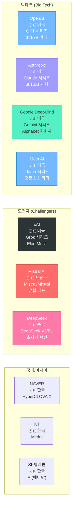
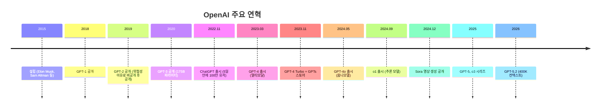
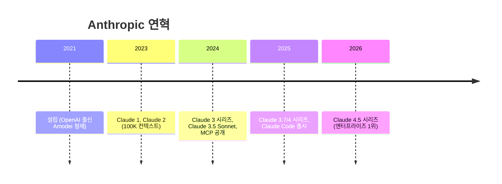
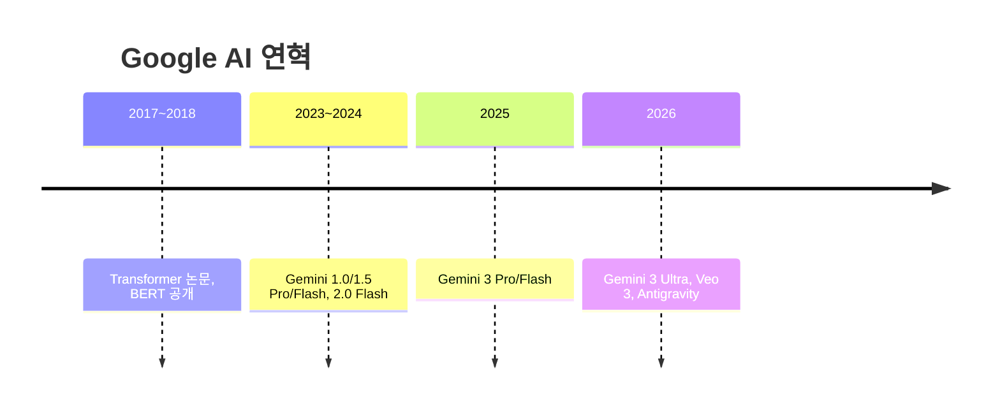
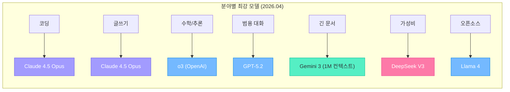
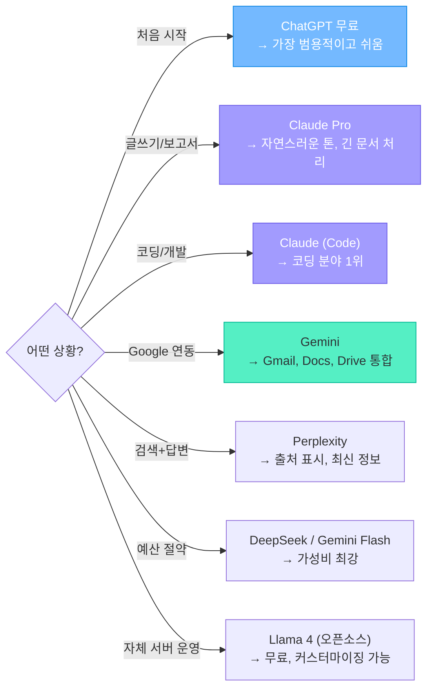

# LLM 회사와 모델 총정리

> 주요 AI 회사들의 역사, 모델 라인업, 그리고 차이점

---

## 1. LLM 회사 전체 지형도 (2026년 기준)



---

## 2. 주요 회사별 상세 프로필

### OpenAI — 생성형 AI의 선구자



| 항목 | 내용 |
|------|------|
| **설립** | 2015년, 미국 샌프란시스코 |
| **창업자** | Sam Altman, Elon Musk(이후 이탈), Ilya Sutskever 등 |
| **기업 가치** | $157B (약 200조원, 2025년 기준) |
| **직원 수** | ~3,000명 |
| **주요 투자자** | Microsoft ($13B+) |
| **엔터프라이즈 점유율** | 27% (2026년, 과거 50%에서 하락) |

#### OpenAI 모델 라인업 (2026년 기준)

| 모델 | 용도 | 특징 | API 가격 (1M 토큰) |
|------|------|------|-------------------|
| **GPT-5.2** | 플래그십 | 400K 컨텍스트, 최강 범용 | 입력 $1.75 / 출력 $14 |
| **GPT-4o** | 범용 멀티모달 | 텍스트+이미지+음성 통합 | 입력 $2.50 / 출력 $10 |
| **GPT-4o mini** | 경량/저가 | 빠르고 저렴 | 입력 $0.15 / 출력 $0.60 |
| **o3 / o4-mini** | 추론 특화 | 수학, 코딩, 복잡한 추론 | 입력 $10 / 출력 $40 |
| **DALL-E 3** | 이미지 생성 | 텍스트 이해력 최고 | 이미지당 $0.04~ |
| **Sora** | 영상 생성 | 물리 법칙 이해 | Plus 요금에 포함 |
| **Whisper** | 음성→텍스트 | 다국어 음성 인식 | 분당 $0.006 |
| **TTS** | 텍스트→음성 | 자연스러운 음성 합성 | 1M 문자 $15 |

---

### Anthropic — 안전한 AI의 추구자



| 항목 | 내용 |
|------|------|
| **설립** | 2021년, 미국 샌프란시스코 |
| **창업자** | Dario Amodei, Daniela Amodei (전 OpenAI VP) |
| **기업 가치** | $61.5B (약 80조원) |
| **철학** | "Constitutional AI" — AI 안전성을 최우선 |
| **엔터프라이즈 점유율** | 40% (2026년, 업계 1위) |
| **코딩 시장 점유율** | 54% (AI 코딩 분야 1위) |

#### Anthropic 모델 라인업

| 모델 | 용도 | 특징 | API 가격 (1M 토큰) |
|------|------|------|-------------------|
| **Claude 4.5 Opus** | 플래그십 | 최고 성능, 복잡한 작업 | 입력 $15 / 출력 $75 |
| **Claude 4.5 Sonnet** | 균형 | 성능과 비용의 최적 균형 | 입력 $3 / 출력 $15 |
| **Claude 4.5 Haiku** | 경량/저가 | 빠른 응답, 대량 처리 | 입력 $0.80 / 출력 $4 |

#### Anthropic의 차별점

```
1. Constitutional AI: 헌법적 AI - 스스로 윤리적 판단
2. 200K 컨텍스트: 약 15만 단어 = 500페이지 책 한 번에 처리
3. Claude Code: 터미널 기반 AI 코딩 도구 (100만 토큰)
4. MCP (Model Context Protocol): AI가 외부 도구를 사용하는 표준 프로토콜
5. 글쓰기 품질: 자연스러운 톤, 지시 따르기 최강
```

---

### Google DeepMind — 검색 거인의 AI



| 항목 | 내용 |
|------|------|
| **조직** | Google DeepMind (Google Brain + DeepMind 합병) |
| **모회사** | Alphabet Inc. (시가총액 $2T+) |
| **강점** | 초대형 컨텍스트(1M+), Google 서비스 통합, 인프라 |
| **Transformer** | 트랜스포머 아키텍처의 원조 (2017년 논문) |

#### Google 모델 라인업

| 모델 | 용도 | 특징 | API 가격 (1M 토큰) |
|------|------|------|-------------------|
| **Gemini 3 Ultra** | 플래그십 | 최고 성능, 멀티모달 | 고가 |
| **Gemini 3 Pro** | 범용 | 균형 잡힌 성능 | 입력 $1.25 / 출력 $5 |
| **Gemini 3 Flash** | 경량/저가 | Pro급 성능에 4배 저렴 | 입력 $0.50 / 출력 $3 |

---

### Meta AI — 오픈소스의 챔피언

| 항목 | 내용 |
|------|------|
| **모델** | Llama 시리즈 (Llama 4 최신) |
| **철학** | 완전 오픈소스 — 누구나 무료로 사용/수정 가능 |
| **영향력** | 오픈소스 LLM 생태계의 사실상 표준 |
| **Llama 4** | 10M 컨텍스트, 무료, Mixture of Experts |
| **활용** | 기업 내부 배포, 커스텀 모델 학습의 베이스 |

### xAI — 일론 머스크의 AI

| 항목 | 내용 |
|------|------|
| **설립** | 2023년, Elon Musk |
| **모델** | Grok 시리즈 (Grok 4.1 최신) |
| **차별점** | X(트위터) 실시간 데이터 연동 |
| **특징** | 유머러스한 답변 스타일, 검열이 적음 |

### Mistral AI — 유럽의 희망

| 항목 | 내용 |
|------|------|
| **설립** | 2023년, 프랑스 파리 |
| **창업자** | 전 Meta/Google AI 연구자들 |
| **모델** | Mistral Large, Mixtral (MoE) |
| **차별점** | Mixture of Experts — 효율적 연산, 유럽 데이터 규제 준수 |

### DeepSeek — 중국의 파괴적 혁신

| 항목 | 내용 |
|------|------|
| **설립** | 2023년, 중국 항저우 |
| **모델** | DeepSeek V3, DeepSeek R1 |
| **충격** | GPT-4급 성능을 극소 비용으로 달성 (학습 비용 $5.6M) |
| **영향** | AI 칩 독점 구조에 의문 제기, 주가 충격 발생 |

---

## 3. 모델 성능 비교 (2026년 기준)

### 분야별 최강자



### 가격 비교 (API, 1M 토큰 기준)

| 모델 | 입력 가격 | 출력 가격 | 비고 |
|------|----------|----------|------|
| GPT-4o mini | $0.15 | $0.60 | 가장 저렴한 프리미엄 |
| Gemini 3 Flash | $0.50 | $3.00 | 가성비 좋음 |
| Claude 4.5 Haiku | $0.80 | $4.00 | 빠르고 경량 |
| GPT-5.2 | $1.75 | $14.00 | 플래그십 |
| Claude 4.5 Sonnet | $3.00 | $15.00 | 균형 |
| Claude 4.5 Opus | $15.00 | $75.00 | 최고 성능 |

### 구독 서비스 가격 비교

| 서비스 | 무료 | 기본 유료 | 프리미엄 |
|--------|------|----------|----------|
| **ChatGPT** | GPT-5.2 제한적 | Go $8/월 · Plus $20/월 | Pro $200/월 |
| **Claude** | 일일 제한 | Pro $20/월 | Max $100~200/월 |
| **Gemini** | 제한적 | AI Pro $20/월 | Ultra $250/월 |

---

## 4. 모델 선택 가이드



---

## 참고 자료

- [Ranking the Top LLMs in 2026 (Whistler Billboards)](https://www.whistlerbillboards.com/friday-feature/top-llms-2026/)
- [10 Best LLMs of April 2026 (Azumo)](https://azumo.com/artificial-intelligence/ai-insights/top-10-llms-0625)
- [Top AI Models in 2026 (Bracai)](https://www.bracai.eu/post/top-ai-models-in-2026-which-is-the-best-llm)
- [LLM Model Evolution 2024-2026 — 244 Models (llm-evolution.com)](https://www.llm-evolution.com/)
- [AI Model Providers Landscape (Stackviv)](https://stackviv.ai/blog/ai-model-providers-landscape)
- [LLM Models 비교 (Mehmet Ozkaya, Medium)](https://mehmetozkaya.medium.com/llm-models-openai-chatgpt-meta-llama-anthropic-claude-google-gemini-mistral-ai-and-xai-grok-bd35779704c2)
