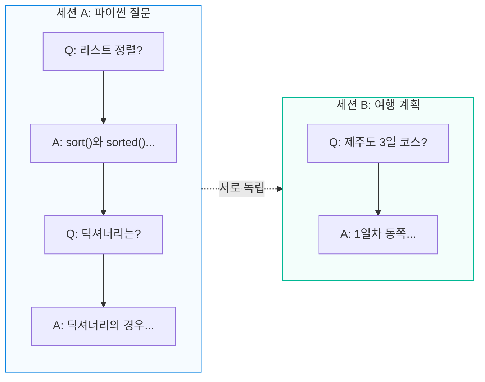
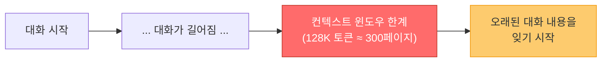
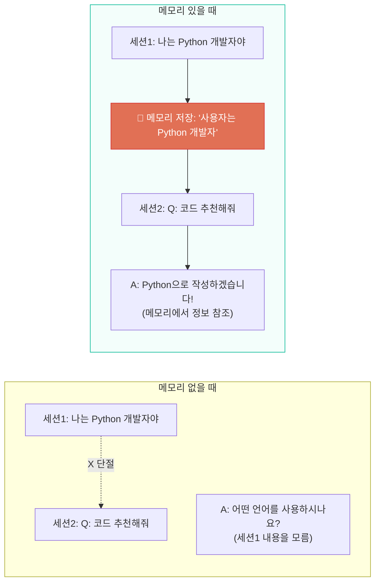
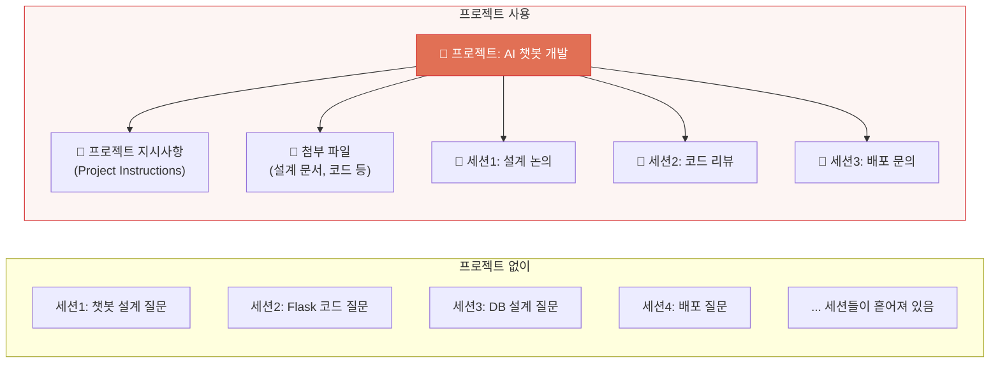
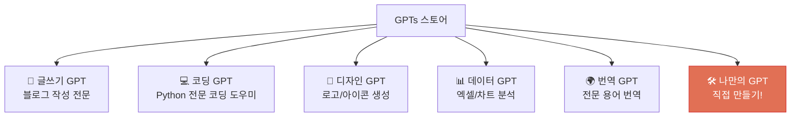
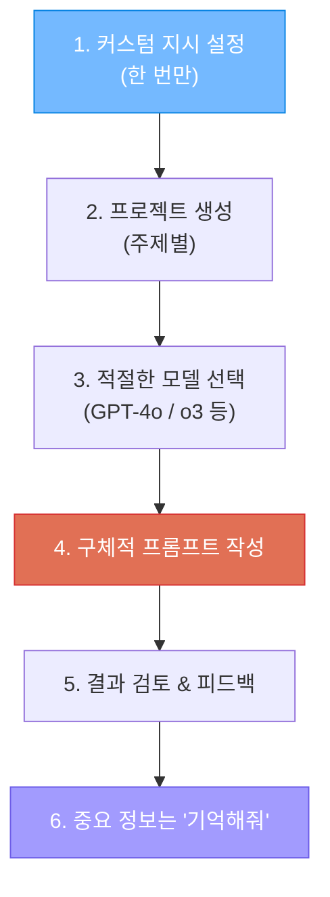

# ChatGPT 200% 활용하기

> ChatGPT의 인터페이스, 기능, 숨겨진 설정까지 — 제대로 쓰는 법

---

## 1. ChatGPT 화면 구성

```
┌──────────────┬─────────────────────────────────────┬──────────────────┐
│ 좌측 사이드바  │         메인 채팅 영역                │   기능 패널       │
│              │                                     │                  │
│ [+ 새 채팅]   │  모델 선택: GPT-4o ▾ / o3 / o4-mini │ Canvas           │
│              │                                     │  (글쓰기/코딩)    │
│ 채팅 히스토리  │ ┌─────────────────────────────────┐ │                  │
│  · 파이썬 질문 │ │                                 │ │ DALL-E           │
│  · 여행 계획  │ │         대화 영역                 │ │  (이미지 생성)    │
│  · API 설계  │ │                                 │ │                  │
│  · ...       │ │  🧑 사용자 메시지                 │ │ Code Interpreter │
│              │ │  🤖 AI 응답                      │ │  (코드 실행)      │
│ 프로젝트      │ │  🧑 사용자 메시지                 │ │                  │
│ GPTs 스토어   │ │  🤖 AI 응답                      │ │ 웹 브라우징       │
│              │ │                                 │ │  (검색)          │
│              │ └─────────────────────────────────┘ │                  │
│ ⚙ 설정       │                                     │                  │
│              │ ┌─────────────────────────────────┐ │                  │
│              │ │ 📎 파일  🖼 이미지  🌐 웹검색     │ │                  │
│              │ │ 메시지를 입력하세요...        ➤  │ │                  │
│              │ └─────────────────────────────────┘ │                  │
└──────────────┴─────────────────────────────────────┴──────────────────┘
```

---

## 2. 세션 (Chat/Conversation) 이란?

### 세션의 개념



**세션 = 하나의 대화 스레드**

- 각 세션은 **독립적인 맥락** 을 가짐
- 세션 A에서 이야기한 내용을 세션 B는 모름
- 같은 세션 안에서는 **이전 대화를 기억** (컨텍스트 유지)
- 좌측 사이드바에 세션 목록이 표시됨

### 세션의 한계: 컨텍스트 윈도우



```
컨텍스트 윈도우 = AI가 한 번에 "볼 수 있는" 텍스트의 양

GPT-4o:    128K 토큰 ≈ 약 300페이지
Claude:    200K 토큰 ≈ 약 500페이지
Gemini:    1~2M 토큰 ≈ 약 3,000페이지

→ 대화가 컨텍스트 윈도우를 넘어가면,
  초반 대화 내용을 "잊어버림"
→ 이것이 세션 분리가 필요한 이유
```

---

## 3. 메모리 (Memory) 기능

### 메모리란?

메모리는 **세션을 넘어서 기억을 유지** 하는 기능입니다.



### 메모리의 두 가지 유형

| 유형 | Saved Memories (저장된 기억) | Chat History Reference (대화 기록 참조) |
|------|---------------------------|--------------------------------------|
| **방식** | 직접 "기억해줘"라고 요청 | 자동으로 과거 대화 참조 |
| **예시** | "나는 한국에 사는 개발자야. 기억해줘" | (자동) 과거 대화에서 관련 정보 찾기 |
| **용량** | ~1,200단어 (약 50개 항목) | 전체 대화 기록 |
| **무료 사용** | O (2025.06~) | X (유료만) |
| **관리** | 설정에서 확인/삭제 가능 | 자동 |

### 메모리 활용법

```
1. 자기소개 저장
   "나는 5년차 파이썬 백엔드 개발자야. 기억해줘"
   → 이후 모든 세션에서 Python 코드로 답변

2. 선호 스타일 저장
   "코드 답변할 때 항상 주석을 한국어로 달아줘. 기억해줘"
   → 이후 코드에 항상 한국어 주석 포함

3. 프로젝트 맥락 저장
   "나는 Flask로 챗봇 프로젝트를 진행 중이야. 기억해줘"
   → 관련 질문 시 프로젝트 맥락 반영

4. 메모리 확인/삭제
   설정 > Personalization > Memory > Manage
   → 저장된 기억 목록 확인 및 개별 삭제 가능
```

---

## 4. 커스텀 지시 (Custom Instructions)

### 커스텀 지시란?

**모든 대화에 자동으로 적용되는 기본 설정** 입니다.

```
설정 > Personalization > Custom Instructions

두 가지를 설정할 수 있습니다:

1. "What would you like ChatGPT to know about you?"
   (ChatGPT에게 나에 대해 알려줄 것)
   → 직업, 전문 분야, 사용 목적 등

2. "How would you like ChatGPT to respond?"
   (ChatGPT의 답변 방식)
   → 답변 스타일, 길이, 형식 등
```

### 설정 예시

```
[나에 대한 정보]
- 한국의 소프트웨어 개발 교육기관 강사
- Python, Flask, AI/ML 전문
- 초보 학생들을 대상으로 강의

[답변 방식]
- 한국어로 답변
- 코드에 한국어 주석 포함
- 초보자가 이해할 수 있는 수준으로 설명
- 코드 예시를 항상 포함
- 너무 길지 않게 핵심만 간결하게
```

---

## 5. 프로젝트 (Projects) 기능

### 프로젝트란?

**특정 주제/업무에 관련된 대화와 파일을 하나의 공간에 모아두는 기능** 입니다.



### 프로젝트의 핵심 요소

| 요소 | 설명 | 예시 |
|------|------|------|
| **프로젝트 지시사항** | 이 프로젝트의 모든 대화에 적용되는 규칙 | "Flask + SQLite 기반으로 답변해줘" |
| **파일 첨부** | 참고 문서, 코드, 데이터 등을 업로드 | 설계 문서, 기존 코드 파일 |
| **관련 세션** | 프로젝트 안에서 여러 세션 생성 | 설계/구현/테스트 각각 별도 세션 |

### 활용 팁

```
프로젝트 예시: "AI 챗봇 개발"

[프로젝트 지시사항]
- Flask + OpenAI API 기반으로 개발 중
- Python 3.12, SQLite3 사용
- 코드에 한국어 주석 필수
- 파일 구조: app.py, templates/, static/

[첨부 파일]
- requirements.txt
- 현재 app.py 코드
- 기획 문서.md

[세션들]
- "DB 스키마 설계" → DB 관련 질문
- "API 엔드포인트 구현" → 코딩 질문
- "프론트엔드 UI" → HTML/CSS 질문
```

---

## 6. GPTs (커스텀 GPT)

### GPTs란?

**특정 용도에 맞게 미리 설정된 ChatGPT** 입니다.



### 나만의 GPT 만들기

```
1. ChatGPT 좌측 메뉴 > "Explore GPTs" > "Create"
2. 이름, 설명, 아이콘 설정
3. Instructions (지시사항) 작성
   → "너는 초등학생 영어 과외 선생님이야..."
4. Knowledge (지식) 파일 업로드
   → 교과서, 참고 자료 등
5. Capabilities 선택
   → 웹 브라우징, 코드 실행, DALL-E 등
6. 저장 → 나만의 GPT 완성!
```

---

## 7. ChatGPT의 주요 기능들

### Canvas (캔버스)

```
- 글쓰기 또는 코딩 작업에 특화된 편집 모드
- AI와 함께 실시간으로 문서/코드를 수정
- 부분 선택 후 "이 부분만 수정해줘" 가능
- 버전 히스토리 지원
```

### Code Interpreter (코드 인터프리터)

```
- ChatGPT가 실제로 Python 코드를 실행할 수 있음
- 파일 업로드 → 데이터 분석 → 차트 생성
- 엑셀, CSV, 이미지 파일 처리 가능
- 수학 계산을 코드로 정확하게 수행
```

### 웹 브라우징

```
- 실시간 인터넷 검색 후 답변
- "오늘 서울 날씨" → 실제 검색 결과 기반 답변
- 학습 데이터에 없는 최신 정보 제공
```

### DALL-E 이미지 생성

```
- 대화 중에 바로 이미지 생성
- "고양이가 우주복을 입고 있는 그림 그려줘"
- 생성된 이미지 수정 요청 가능
```

### 음성 대화 (Voice)

```
- 실시간 음성으로 ChatGPT와 대화
- 언어 학습에 효과적 (발음 연습)
- 다양한 음성 스타일 선택 가능
```

---

## 8. 효과적인 ChatGPT 사용 워크플로우



### ChatGPT 모델 선택 가이드

| 상황 | 추천 모델 | 이유 |
|------|----------|------|
| 일상적인 질문 | GPT-4o mini | 빠르고 가벼움 |
| 복잡한 대화/분석 | GPT-4o | 범용 최강 |
| 수학/코딩/추론 | o3-mini | 추론 특화 |
| 이미지 생성 | GPT-4o (DALL-E) | 이미지 생성 내장 |
| 최고 성능이 필요할 때 | GPT-5.2 | 플래그십 |

---

## 참고 자료

- [Memory and new controls for ChatGPT (OpenAI)](https://openai.com/index/memory-and-new-controls-for-chatgpt/)
- [Memory FAQ (OpenAI Help Center)](https://help.openai.com/en/articles/8590148-memory-faq)
- [How to Use ChatGPT Memory Feature 2026 (QWE AI Academy)](https://www.qwe.edu.pl/tutorial/how-to-use-chatgpt-memory-feature/)
- [Master ChatGPT Memory in 2026 (Descript)](https://www.descript.com/blog/article/chatgpt-has-memory-now)
