# 프롬프트 엔지니어링의 진화

> 질문하는 방법이 곧 실력이다 — Zero-Shot에서 Agentic Prompt까지

---

## 1. 프롬프트 엔지니어링이란?

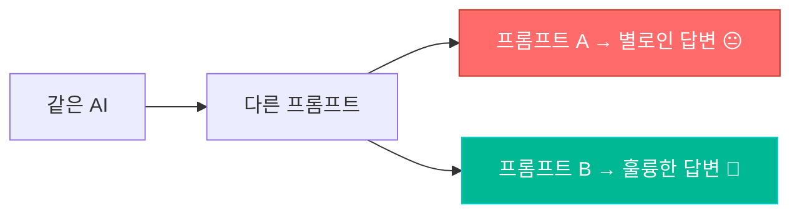

> **프롬프트 엔지니어링** = AI에게 원하는 결과를 얻기 위해 입력(프롬프트)을 설계하는 기술

같은 ChatGPT를 사용해도, **어떻게 질문하느냐** 에 따라 결과의 품질이 천지 차이입니다.

---

## 2. 프롬프트 기법의 진화 타임라인

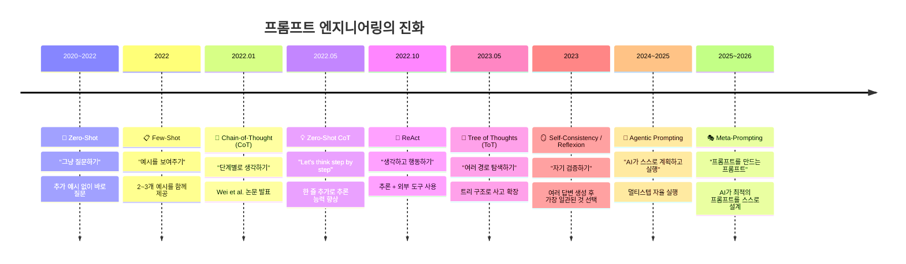

---

## 3. 세대별 상세 설명

### 1세대: Zero-Shot Prompting (2020~)

> "아무런 예시 없이 바로 질문하기"

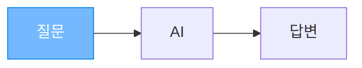

**사용법:**
```
[프롬프트]
다음 문장의 감정을 분석해줘:
"오늘 하루가 정말 좋았어!"
```

**결과:**
```
긍정적인 감정입니다. 기쁨과 만족감이 느껴집니다.
```

**특징:**
- 가장 간단한 방식
- 간단한 작업에는 충분
- 복잡한 작업에서는 정확도 떨어짐

---

### 2세대: Few-Shot Prompting (2022~)

> "이런 식으로 해줘" — 예시를 보여주기

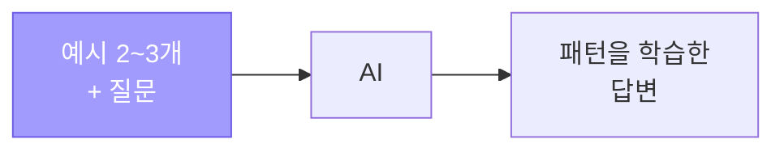

**사용법:**
```
[프롬프트]
다음 예시처럼 감정을 분석해줘:

문장: "정말 화가 난다" → 감정: 분노
문장: "너무 슬프다" → 감정: 슬픔
문장: "오늘 기분이 좋아!" → 감정: 기쁨

문장: "시험에 떨어졌어" → 감정:
```

**결과:**
```
감정: 실망/슬픔
```

**특징:**
- 예시를 통해 AI가 **패턴을 파악**
- 특정 형식의 출력이 필요할 때 효과적
- Zero-Shot보다 정확도 높음

**비유:**
```
Zero-Shot = "피아노 쳐봐"
Few-Shot  = "이 악보처럼 쳐봐" (악보 예시 제공)
```

---

### 3세대: Chain-of-Thought / CoT (2022.01~)

> "단계별로 천천히 생각해봐"

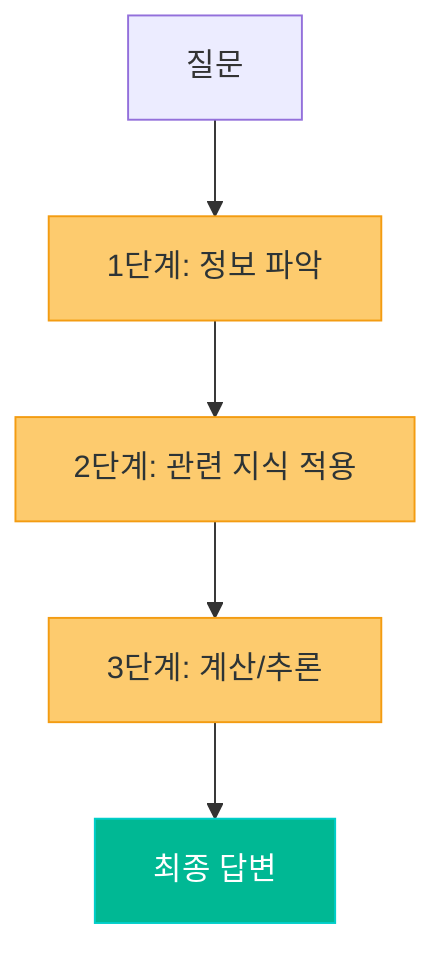

**Google Brain의 Wei et al. 논문 (2022)** 에서 제안된 기법입니다.

**일반 프롬프트:**
```
Q: 학교에 15명이 있고, 3명이 떠나고, 2명이 왔다면 몇 명?

A: 14명 (바로 답변 → 정확)
```

**CoT 프롬프트:**
```
Q: 카페에 23명이 있었습니다. 오전에 7명이 떠나고 5명이 왔습니다.
   점심에 3명이 떠나고 12명이 왔습니다. 현재 몇 명이 있나요?

A: 단계별로 풀어보겠습니다.
   1단계: 처음 23명
   2단계: 오전 - 7명 떠남 → 23-7=16명, 5명 옴 → 16+5=21명
   3단계: 점심 - 3명 떠남 → 21-3=18명, 12명 옴 → 18+12=30명
   답: 30명
```

**특징:**
- 복잡한 수학, 논리 문제에서 정확도 크게 향상
- AI가 **사고 과정을 보여줌** → 검증 가능
- "단계별로 생각해봐" 한 마디면 충분

---

### 3.5세대: Zero-Shot CoT (2022.05~)

> 마법의 한 줄: **"Let's think step by step"**

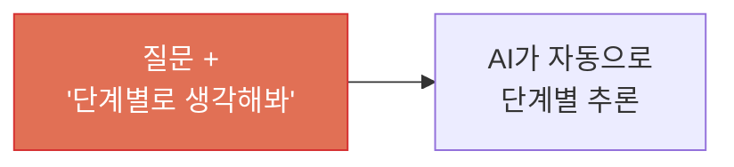

**Kojima et al. (2022)** 의 발견: 프롬프트 끝에 **"Let's think step by step"** (단계별로 생각해봐)을 붙이기만 하면 추론 능력이 극적으로 향상됩니다.

```
[프롬프트]
주차장에 차가 3대 있었습니다. 차 2대가 더 왔습니다.
이제 주차장에 차가 몇 대 있나요?
단계별로 생각해봐.
```

**성능 차이:**
```
Zero-Shot 정답률:        약 17% (MultiArith 벤치마크)
Zero-Shot CoT 정답률:    약 79%

→ "단계별로 생각해봐" 한 줄로 정답률 4.6배 향상!
```

---

### 4세대: ReAct (2022.10~)

> "생각하고 → 행동하고 → 관찰하고 → 다시 생각하기"

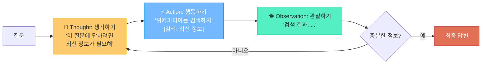

**Yao et al. (2023)** 이 제안한 **ReAct (Reasoning + Acting)** 는 AI가 **생각만 하는 것이 아니라 실제 도구를 사용** 할 수 있게 합니다.

**ReAct 실행 예시:**
```
질문: "2026년 현재 대한민국 대통령은 누구인가?"

Thought 1: 이 질문은 최신 정보가 필요하다. 검색해보자.
Action 1: Search["대한민국 대통령 2026년"]
Observation 1: 검색 결과...

Thought 2: 검색 결과를 바탕으로 답변할 수 있다.
Answer: ...
```

**특징:**
- AI가 **외부 도구** (검색, 계산기, API 등) 사용 가능
- 할루시네이션 감소 (실제 정보 기반)
- 이후 **AI Agent의 핵심 패턴** 이 됨
- LangChain, AutoGPT 등의 에이전트 프레임워크의 기반

---

### 5세대: Tree of Thoughts / ToT (2023.05~)

> "여러 가능성을 나무처럼 펼쳐서 최선을 찾기"

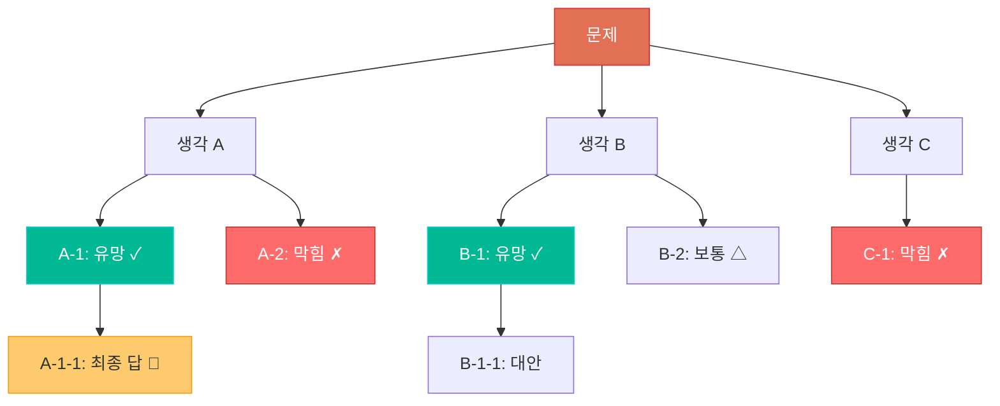

**Yao et al. (2023)** 이 제안한 ToT는 CoT의 **"한 줄기 사고"** 를 **"나무 구조의 탐색"** 으로 확장합니다.

```
CoT:  A → B → C → 답 (하나의 경로만)
ToT:  A → {B1, B2, B3} → 각각 평가 → 유망한 것만 확장 → 최적 답

마치 체스에서 여러 수를 미리 둬보고,
가장 좋은 수를 선택하는 것과 같습니다.
```

**특징:**
- 복잡한 문제(퍼즐, 계획, 전략)에서 탁월
- 여러 접근법을 동시에 탐색
- 막히면 **되돌아가기(backtracking)** 가능

---

### 6세대: Self-Consistency & Reflexion (2023~)

> "여러 번 풀어보고, 가장 많이 나온 답이 정답"

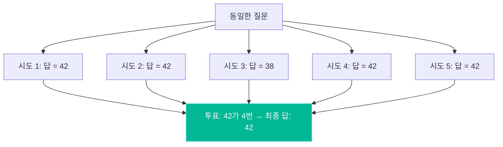

#### Self-Consistency (자기 일관성)
- 같은 질문을 여러 번 던져서 가장 일관된 답을 선택
- "다수결" 방식으로 오류 감소

#### Reflexion (자기 성찰)
- AI가 자신의 답변을 **스스로 검토하고 수정**

```
1차 답변: "파리는 독일의 수도입니다"
자기 검토: "잠깐, 파리는 프랑스의 수도지. 독일의 수도는 베를린이야."
수정 답변: "파리는 프랑스의 수도입니다"
```

---

### 7세대: Agentic Prompting (2024~2025)

> "AI에게 목표만 주면, 스스로 계획하고 실행"

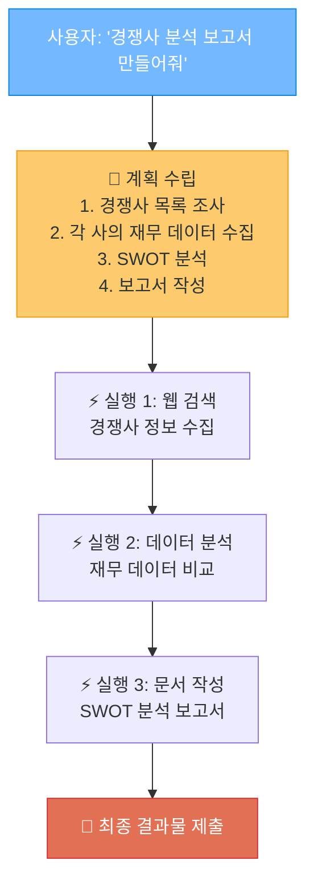

**특징:**
- 사용자는 **최종 목표만** 전달
- AI가 **스스로 단계를 계획** 하고 실행
- 여러 **도구를 자율적으로** 사용 (검색, 코드 실행, API 호출)
- **에러 발생 시 스스로 수정** 시도
- ChatGPT의 "Deep Research", Claude의 "Agent" 기능이 대표적

---

### 8세대: Meta-Prompting (2025~2026)

> "AI에게 프롬프트를 만들어달라고 하기"

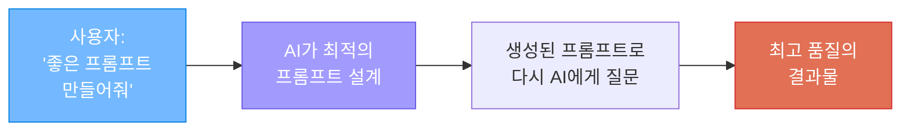

```
[사용자 입력]
"다음 작업을 위한 최적의 프롬프트를 만들어줘:
Python Flask로 REST API를 만드는 코드를 생성하고 싶어"

[AI가 생성한 메타 프롬프트]
"당신은 10년 경력의 Python 백엔드 개발자입니다.
다음 요구사항에 맞는 Flask REST API 코드를 작성해주세요.
- RESTful 원칙 준수 (GET, POST, PUT, DELETE)
- 에러 핸들링 포함
- 코드에 한국어 주석 포함
- 각 엔드포인트의 사용 예시를 curl 명령으로 제공
요구사항: ..."
```

---

## 4. 프롬프트 기법 비교 종합

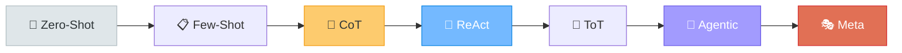

| 기법 | 시기 | 핵심 아이디어 | 적합한 상황 | 난이도 |
|------|------|-------------|------------|--------|
| **Zero-Shot** | 2020~ | 바로 질문 | 간단한 질문/번역 | 쉬움 |
| **Few-Shot** | 2022 | 예시 제공 | 특정 형식 필요 | 쉬움 |
| **CoT** | 2022.01 | 단계별 사고 | 수학, 논리 문제 | 보통 |
| **Zero-Shot CoT** | 2022.05 | "단계별로 생각해봐" | 범용 추론 향상 | 쉬움 |
| **ReAct** | 2022.10 | 생각 + 행동 | 최신 정보, 사실 확인 | 보통 |
| **ToT** | 2023.05 | 다중 경로 탐색 | 복잡한 계획/전략 | 어려움 |
| **Self-Consistency** | 2023 | 다수결/자기 검증 | 정확도가 중요한 작업 | 보통 |
| **Reflexion** | 2023 | 자기 성찰/수정 | 정확도 향상 | 보통 |
| **Agentic** | 2024~ | 자율 계획/실행 | 복잡한 멀티스텝 작업 | 어려움 |
| **Meta-Prompting** | 2025~ | 프롬프트 자동 생성 | 최적의 결과 추구 | 보통 |

---

## 5. 실전에서 바로 쓰는 프롬프트 팁

### 황금 공식: CRAFT

```
C - Context (맥락): 상황을 설명한다
R - Role (역할): AI에게 전문가 역할을 부여한다
A - Action (행동): 구체적으로 무엇을 해야 하는지 지시한다
F - Format (형식): 출력 형식을 지정한다
T - Tone (톤): 어조와 스타일을 지정한다
```

### 실전 예시

```
[나쁜 프롬프트]
파이썬 코드 짜줘

[좋은 프롬프트 - CRAFT 적용]
C (맥락): 초보 개발자를 위한 Flask 웹서비스 교육 자료를 만들고 있어.
R (역할): 너는 10년차 Python 웹 개발자야.
A (행동): 사용자 회원가입 API를 만들어줘.
         - POST /api/register 엔드포인트
         - email, password, name 입력
         - 비밀번호 bcrypt 해싱
         - SQLite3 DB에 저장
F (형식): 코드에 한국어 주석을 상세하게 달아줘.
         실행 가능한 전체 코드를 제공해줘.
T (톤): 초보자도 이해할 수 있도록 친절하게 설명해줘.
```

---

## 참고 자료

- [Prompt Engineering Guide (promptingguide.ai)](https://www.promptingguide.ai/)
- [Chain-of-Thought Prompting (promptingguide.ai)](https://www.promptingguide.ai/techniques/cot)
- [Tree of Thoughts (promptingguide.ai)](https://www.promptingguide.ai/techniques/tot)
- [Zero-Shot Prompting (promptingguide.ai)](https://www.promptingguide.ai/techniques/zeroshot)
- [Prompt Engineering: From Zero-Shot to Advanced AI Reasoning (Bluetick Consultants)](https://www.bluetickconsultants.com/the-evolution-of-prompt-engineering/)
- [What is Chain of Thought prompting? (IBM)](https://www.ibm.com/think/topics/chain-of-thoughts)
- [The Evolving Art of Prompt Engineering (Medium)](https://medium.com/@yujiisobe/the-evolving-art-and-science-of-prompt-engineering-a-chronological-journey-948c0a5a96f9)
