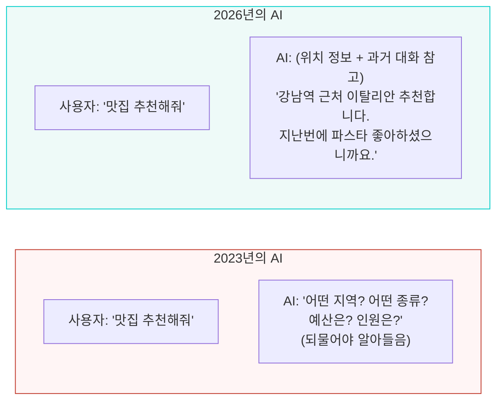
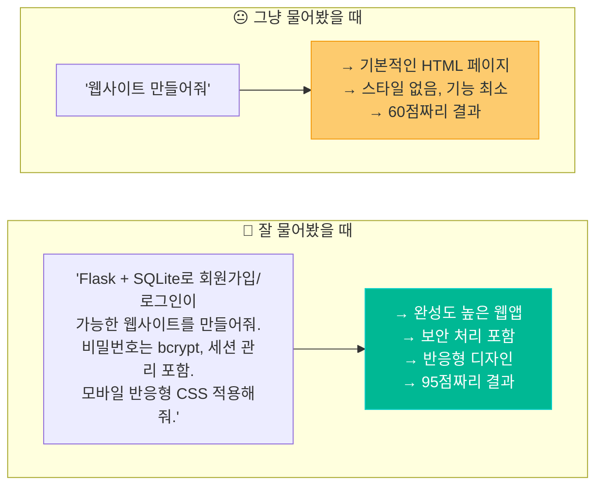
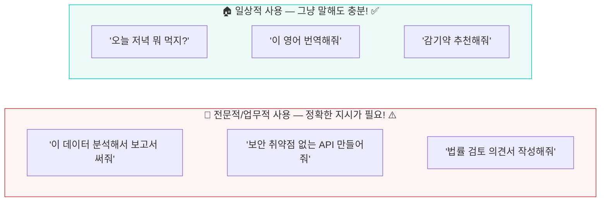
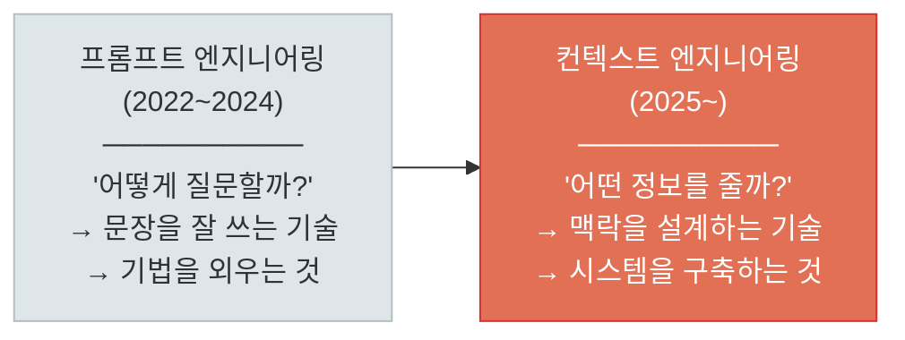
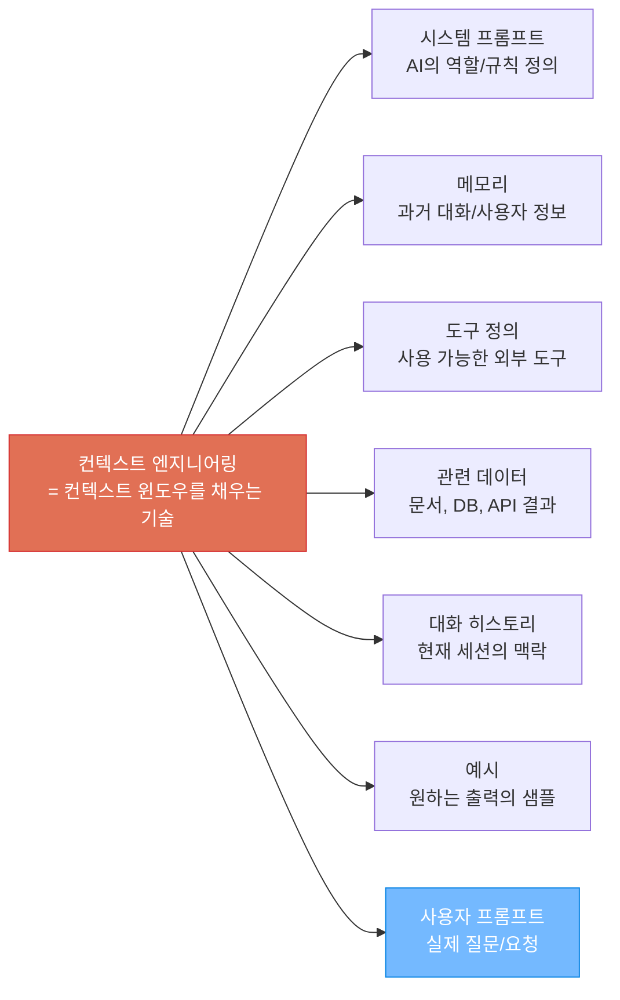
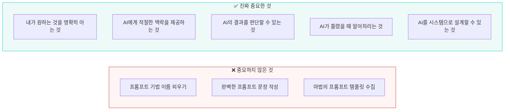
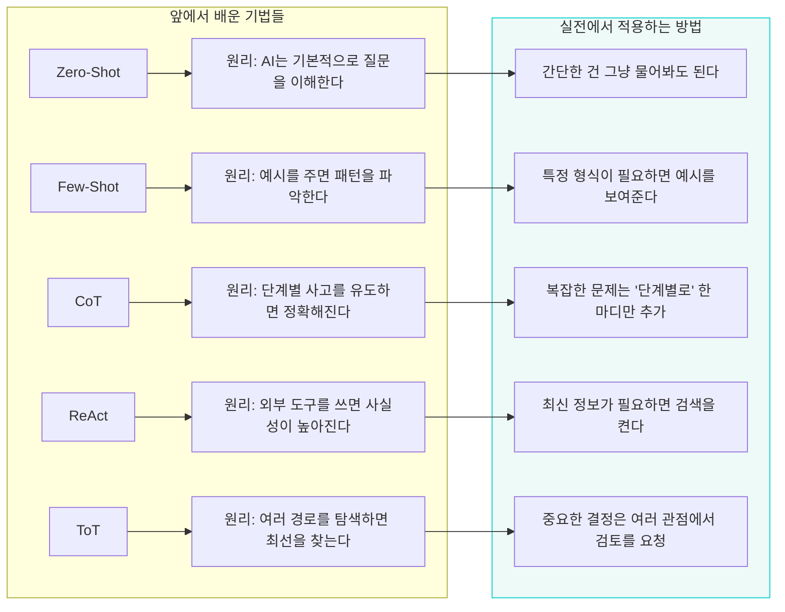
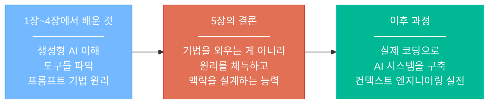
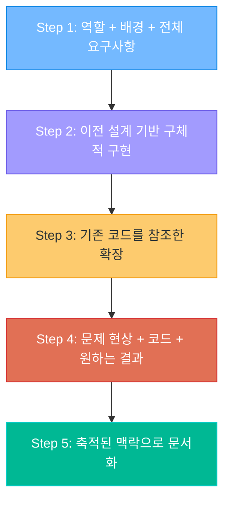

# 그래서 지금은? — 프롬프트 엔지니어링의 현재와 미래

> "요즘 AI가 똑똑해져서 그냥 말해도 되는 거 아냐?"
> 맞기도 하고, 틀리기도 합니다.

---

## 1. 솔직한 질문부터 시작하자

앞에서 Zero-Shot, Few-Shot, CoT, ReAct, ToT... 수많은 프롬프트 기법들을 배웠습니다.

그런데 여러분 머릿속에는 이런 의문이 있을 겁니다:

```
"요즘 ChatGPT한테 그냥 말해도 잘 알아듣는데?"
"이런 기법들 다 외워야 하는 거야?"
"프롬프트 엔지니어링, 배워봤자 소용없는 거 아냐?"
```

이 질문에 정직하게 답해보겠습니다.

---

## 2. 맞습니다 — AI가 똑똑해졌습니다

### 2년 전과 지금은 완전히 다릅니다



**실제로 달라진 것들:**

| 항목 | 2023년 | 2026년 |
|------|--------|--------|
| **의도 파악** | 정확한 프롬프트 필수 | 모호해도 의도 추론 |
| **되묻기** | 못하거나 어색 | 자연스럽게 되물어봄 |
| **맥락 유지** | 짧은 대화만 기억 | 과거 대화까지 참조 (메모리) |
| **출력 품질** | 프롬프트에 크게 좌우 | 기본 출력도 꽤 좋음 |
| **도구 사용** | 별도 설정 필요 | 알아서 검색/계산/코드 실행 |

**Microsoft 부사장의 말:**

> "2년 전만 해도 모두가 '프롬프트 엔지니어'가 인기 직업이 될 거라 했지만,
> 지금은 전혀 그렇지 않다."

**Gartner의 선언 (2025 중반):**

> "Context Engineering is in, Prompt Engineering is out."
> (컨텍스트 엔지니어링이 뜨고, 프롬프트 엔지니어링은 졌다.)

---

## 3. 하지만 — "그냥 말하면 된다"는 반만 맞습니다

### "괜찮은 결과" vs "탁월한 결과"의 차이



**핵심 진실:**

```
AI가 똑똑해진 건 맞지만,

"괜찮은 결과"는 누구나 얻을 수 있고,
"탁월한 결과"는 여전히 잘 물어보는 사람만 얻을 수 있습니다.

이 차이가 갈수록 더 중요해집니다.
```

### 일상 vs 업무의 차이



---

## 4. 프롬프트 엔지니어링은 죽지 않았다 — 진화했다

### "프롬프트 엔지니어링"에서 "컨텍스트 엔지니어링"으로

Andrej Karpathy (전 OpenAI 공동창업자, 전 Tesla AI 디렉터):

> **"I'm +1 for 'Context Engineering' over 'Prompt Engineering'."**
>
> "사람들은 프롬프트를 짧은 지시문 정도로 생각하지만,
> 실제 산업용 LLM 앱에서 **컨텍스트 엔지니어링** 은
> **컨텍스트 윈도우를 채우는 정교한 기술이자 과학** 이다."

Shopify CEO Tobi Lütke:

> **"The art of providing all the context for the task
> to be plausibly solvable by the LLM."**
>
> "LLM이 문제를 풀 수 있도록 **모든 맥락을 제공하는 기술** 이다."



### 무엇이 달라졌는가?

| 구분 | 프롬프트 엔지니어링 (과거) | 컨텍스트 엔지니어링 (현재) |
|------|--------------------------|--------------------------|
| **초점** | "어떻게 질문할까?" | "어떤 정보를 제공할까?" |
| **방법** | 프롬프트 문장을 정교하게 작성 | 컨텍스트 윈도우 전체를 설계 |
| **범위** | 프롬프트 텍스트만 | 시스템 프롬프트 + 메모리 + 도구 + 데이터 + 히스토리 |
| **대상** | 한 번의 질문 | 전체 AI 시스템 |
| **비유** | 좋은 질문을 하는 학생 | 좋은 시험 환경을 만드는 교수 |

### 컨텍스트 엔지니어링이란?

> AI가 **올바른 답변을 할 수 있도록** 필요한 **모든 맥락** 을 체계적으로 구성하는 것



```
프롬프트 엔지니어링 = 퍼즐의 한 조각 (사용자 프롬프트)
컨텍스트 엔지니어링 = 퍼즐 전체를 맞추는 것

과거: 프롬프트 문장을 완벽하게 쓰는 게 전부
현재: 프롬프트는 컨텍스트의 일부일 뿐. 전체 시스템을 설계하는 게 핵심
```

---

## 5. 결국 진짜 중요한 것은?

### "프롬프트 기법을 외우는 것"이 아닙니다



### 비유: AI는 천재 인턴이다

```
AI = 모든 분야의 지식을 가진 천재 인턴

좋은 상사 (= 좋은 컨텍스트 엔지니어):
  "이번 프로젝트는 이런 배경이 있고,
   우리 고객은 이런 사람들이야.
   이 문서를 참고해서,
   이런 형식으로 보고서를 써줘.
   특히 이 부분은 주의해줘."
   → 인턴이 훌륭한 결과물을 냄

나쁜 상사 (= 그냥 시키는 사람):
  "보고서 써"
   → 인턴이 뭘 써야 할지 모름
   → 여러 번 수정하게 됨
   → 시간 낭비

최악의 상사:
  "알아서 해"
   → ???
```

---

## 6. 앞에서 배운 기법들은 그래서 왜 필요했나?

### 기법을 "외우라"는 게 아니라, "원리를 이해하라"는 것



### 2026년에 필요한 프롬프트 원칙 — 딱 5가지

```
1. 맥락을 충분히 제공하라
   → AI는 독심술을 못한다. 배경을 알려줘야 한다.

2. 구체적으로 요청하라
   → "잘 해줘" 대신 "무엇을, 어떤 형식으로, 어느 수준으로"

3. 역할을 부여하라
   → "너는 10년차 개발자야" 한 줄이 결과를 바꾼다.

4. 복잡한 건 나눠서 시키라
   → 한 번에 모든 걸 시키지 말고, 단계별로 진행.

5. 결과를 반드시 검증하라
   → AI는 자신있게 틀린다. 항상 확인해야 한다.
```

---

## 7. 그래서 이 과정에서 우리는



```
프롬프트 엔지니어링의 기법들을 배운 이유:
→ "이걸 외워서 매번 쓰라"가 아니라
→ "AI가 어떻게 동작하는지 이해하기 위해"

그래야 AI를 도구로 쓰든, 시스템으로 구축하든,
근본적인 원리를 알고 활용할 수 있습니다.

이 과정의 나머지(생성형AI 심화, 응용, 프로젝트)에서
이 원리들을 실제 코드와 서비스로 구현하게 됩니다.
```

---

## 8. 컨텍스트 엔지니어링 실전 예시

> "온라인 쇼핑몰 백엔드를 AI와 함께 구축하는 시나리오"를 통해, 컨텍스트를 단계적으로 쌓아가며 프로젝트를 진행하는 방법을 살펴봅시다.

### Step 1: 역할과 프로젝트 배경 제공

```
🧑 사용자:
  너는 10년차 파이썬 백엔드 개발자야.
  FastAPI + PostgreSQL + Redis 기반으로
  온라인 쇼핑몰 백엔드를 만들 거야.

  요구사항:
  - 회원가입/로그인 (JWT 인증)
  - 상품 CRUD
  - 장바구니
  - 주문/결제
  - 관리자 대시보드

  먼저 전체 프로젝트 구조와 ERD를 설계해줘.
```

```
🤖 AI 응답:
  프로젝트 구조:
  ├── app/
  │   ├── main.py
  │   ├── models/       # SQLAlchemy 모델
  │   ├── schemas/      # Pydantic 스키마
  │   ├── routers/      # API 엔드포인트
  │   ├── services/     # 비즈니스 로직
  │   └── core/         # 설정, 보안, DB

  ERD: users, products, carts, cart_items,
       orders, order_items, categories 7개 테이블
  (상세 ERD 다이어그램 포함)
```

> **포인트**: 역할(10년차 개발자) + 기술 스택(FastAPI/PostgreSQL/Redis) + 전체 요구사항을 **첫 메시지에서 한꺼번에** 제공합니다. AI가 전체 그림을 이해한 상태에서 설계합니다.

### Step 2: 이전 맥락 위에 구체적 구현 요청

```
🧑 사용자:
  좋아. 이 ERD 기반으로 인증 모듈부터 구현하자.

  추가 조건:
  - 비밀번호는 bcrypt 해싱
  - Access Token (15분) + Refresh Token (7일)
  - Redis에 Refresh Token 저장
  - 로그아웃 시 토큰 블랙리스트 처리
  - rate limiting: 로그인 시도 5회/분

  models/user.py, schemas/auth.py, routers/auth.py,
  services/auth_service.py 순서로 작성해줘.
```

```
🤖 AI 응답:
  (Step 1에서 설계한 ERD의 users 테이블 기반으로)

  # models/user.py - SQLAlchemy 모델
  # schemas/auth.py - 요청/응답 Pydantic 스키마
  # services/auth_service.py - bcrypt + JWT + Redis 로직
  # routers/auth.py - /register, /login, /logout, /refresh 엔드포인트

  (4개 파일 전체 코드 + 설명)
```

> **포인트**: "인증 모듈"만 말해도 AI는 Step 1의 ERD, 기술 스택, 프로젝트 구조를 **기억하고 있으므로** 일관된 코드를 생성합니다. 이것이 **세션 내 컨텍스트 축적**입니다.

### Step 3: 기존 코드를 참조한 확장

```
🧑 사용자:
  인증 잘 됐어. 이제 상품 CRUD를 만들자.

  조건:
  - 일반 사용자: 조회만 가능
  - 관리자(is_admin=True): 등록/수정/삭제 가능
  - 상품 이미지는 S3 업로드 (presigned URL 방식)
  - 목록 조회 시 Redis 캐싱 (TTL 5분)
  - 페이지네이션: cursor 기반

  auth_service.py의 get_current_user 의존성을
  활용해서 권한 체크해줘.
```

```
🤖 AI 응답:
  (Step 2에서 만든 auth_service.py의 get_current_user를
   그대로 import하여 권한 체크 구현)

  # services/product_service.py
  #   - S3 presigned URL 생성
  #   - Redis 캐싱 로직
  # routers/product.py
  #   - Depends(get_current_user) 활용
  #   - 관리자 전용 엔드포인트에 admin 체크

  (전체 코드 + "auth_service의 이 함수를 재활용했습니다" 설명)
```

> **포인트**: 명시적으로 **이전에 만든 코드(`auth_service.py`)를 참조**하라고 지시합니다. AI가 프로젝트 전체 맥락을 활용하여 일관된 코드를 생성합니다.

### Step 4: 문제 발생 → 디버깅 맥락 제공

```
🧑 사용자:
  상품 목록 API에서 캐시 무효화가 안 돼.

  현상:
  - 관리자가 상품을 추가해도 목록이 안 바뀜
  - Redis에 이전 캐시가 계속 남아있음
  - TTL 5분 지나야 반영됨

  product_service.py의 캐시 관련 코드:
  (코드 붙여넣기)

  상품 등록/수정/삭제 시 자동으로
  캐시를 무효화하는 방법을 알려줘.
```

```
🤖 AI 응답:
  문제 원인: 상품 변경 시 Redis 캐시를 삭제하는
  로직이 없습니다.

  해결: product_service.py에 캐시 무효화 함수를 추가하고,
  create/update/delete 함수에서 호출합니다.

  async def invalidate_product_cache():
      keys = await redis.keys("products:list:*")
      if keys:
          await redis.delete(*keys)

  (수정된 전체 코드 + 변경 지점 표시)
```

> **포인트**: 에러 현상 + 관련 코드 + 원하는 결과를 **함께 제공**합니다. "캐시가 안 돼"만 말하면 AI는 어떤 캐시인지, 어떤 구조인지 모릅니다.

### Step 5: 최종 검증 및 문서화

```
🧑 사용자:
  전체 API가 완성됐어. 마지막으로:

  1. 지금까지 만든 전체 API 엔드포인트를
     표로 정리해줘 (메서드, 경로, 설명, 권한)

  2. 이 프로젝트의 README.md를 작성해줘
     - 프로젝트 소개, 기술 스택, 설치 방법
     - 환경변수 목록, API 문서 링크

  3. docker-compose.yml 작성해줘
     - app, postgres, redis 3개 서비스
```

```
🤖 AI 응답:
  (Step 1~4에서 축적된 전체 프로젝트 맥락을 바탕으로)

  1. API 엔드포인트 총 18개 정리표
  2. README.md (프로젝트 전체 구조 반영)
  3. docker-compose.yml (사용한 기술 스택 정확히 반영)
```

> **포인트**: 마지막 요청은 간단하지만, AI는 **세션 전체의 맥락**(ERD, 인증 방식, 캐시 구조, API 목록)을 활용하여 정확한 문서를 생성합니다.

### 이것이 컨텍스트 엔지니어링이다



| 원칙 | 이 예시에서 어떻게 적용했는가 |
|------|--------------------------|
| **맥락을 충분히 제공** | Step 1에서 역할, 기술 스택, 전체 요구사항을 한꺼번에 제공 |
| **구체적으로 요청** | 매 단계마다 파일명, 조건, 형식을 명시 |
| **역할을 부여** | "10년차 백엔드 개발자"로 코드 품질 수준을 설정 |
| **복잡한 건 나눠서** | 인증 → 상품 → 디버깅 → 문서화, 단계별로 진행 |
| **결과를 검증** | Step 4에서 실제 테스트 후 문제를 발견하고 수정 요청 |

> **핵심**: 프롬프트 한 줄을 잘 쓰는 것이 아니라, **대화 전체를 하나의 프로젝트로 설계**하는 것. 이전 단계의 결과가 다음 단계의 맥락이 되고, AI는 점점 더 정확한 답변을 합니다.

---

## 9. 한 줄 요약

> **프롬프트 엔지니어링은 죽지 않았다 — 흡수되었다.**
> 별도의 기술이 아니라, 모든 AI 활용의 **기본 소양** 이 되었다.
> 그리고 그 이름은 이제 **"컨텍스트 엔지니어링"** 이다.

---

## 참고 자료

- [Andrej Karpathy on Context Engineering (X/Twitter)](https://x.com/karpathy/status/1937902205765607626)
- [Context Engineering vs Prompt Engineering (IntuitionLabs)](https://intuitionlabs.ai/articles/context-engineering-vs-prompt-engineering-ai)
- [프롬프트를 넘어 컨텍스트로 — 에이전틱 AI를 위한 컨텍스트 엔지니어링의 부상 (CIO Korea)](https://www.cio.com/article/4082964/)
- [Prompt Engineering is Dead (Medium)](https://medium.com/data-science-in-your-pocket/prompt-engineering-is-dead-debb01e9720e)
- [2년 전 인기였던 프롬프트 엔지니어, 지금은 — "직무에서 역량으로" (AI타임스)](https://www.aitimes.com/news/articleView.html?idxno=169983)
- [Beyond the Text Box: The Future of LLM Prompt Engineering in 2026 (EIF)](https://blog.eif.am/llm-prompt-engineering)
- [The 2026 Guide to Prompt Engineering (IBM)](https://www.ibm.com/think/prompt-engineering)
- [From Prompt Engineering to Context Engineering (BigData Boutique)](https://bigdataboutique.com/blog/from-prompt-engineering-to-context-engineering)
