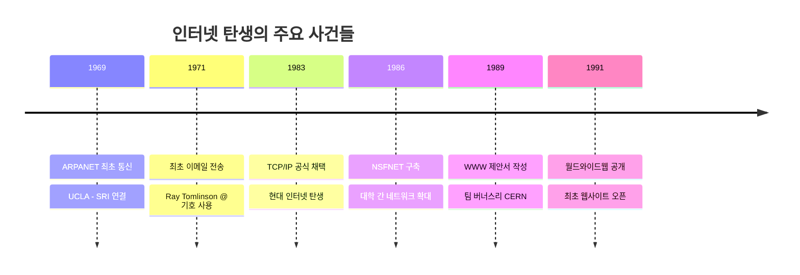
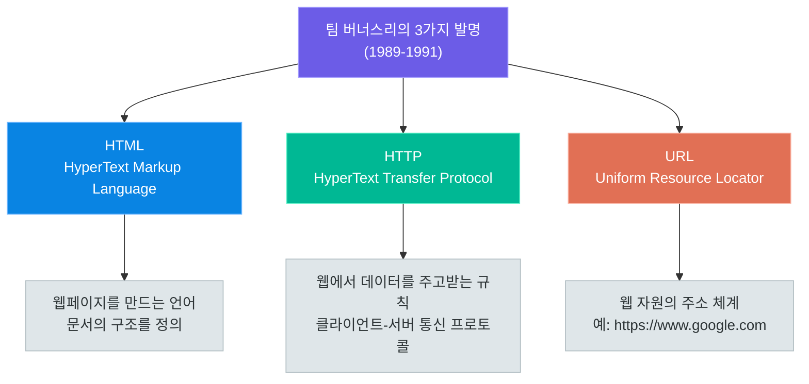
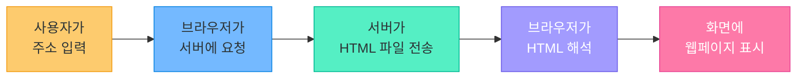
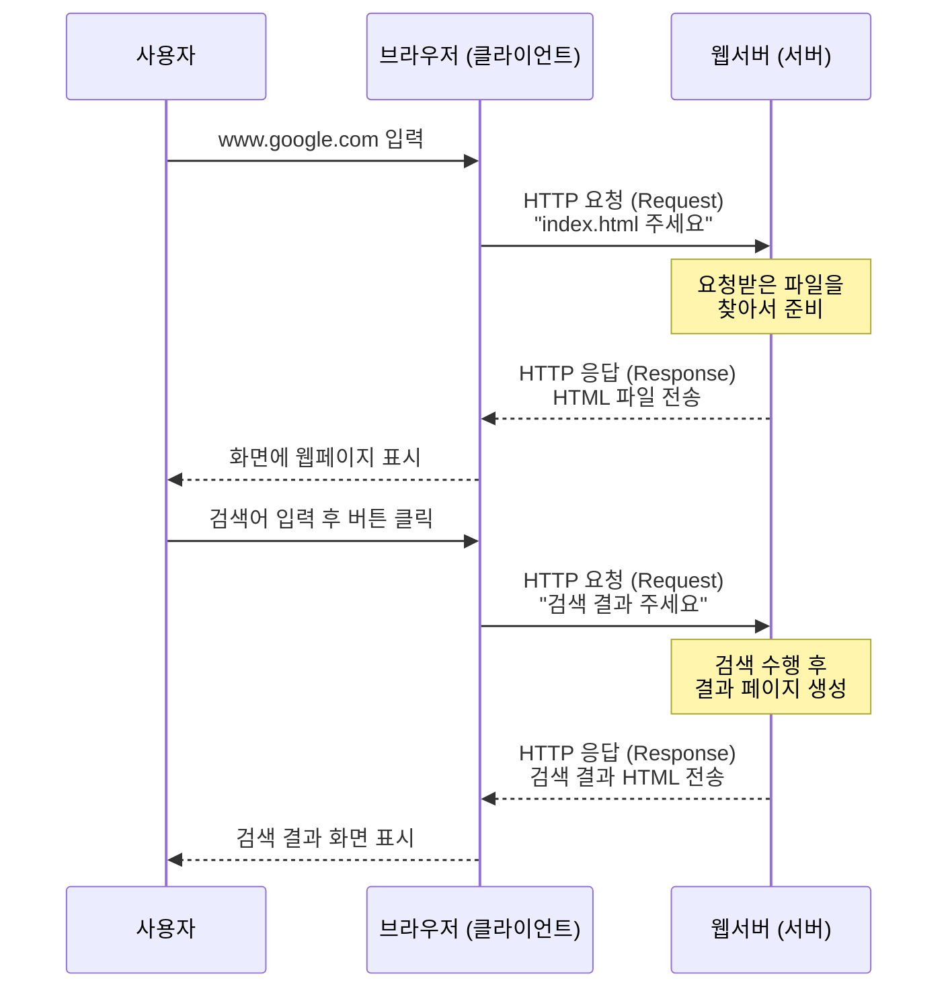
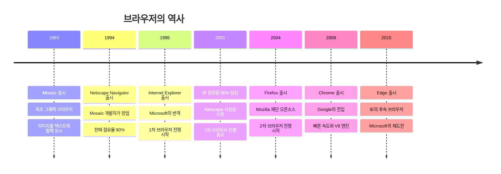
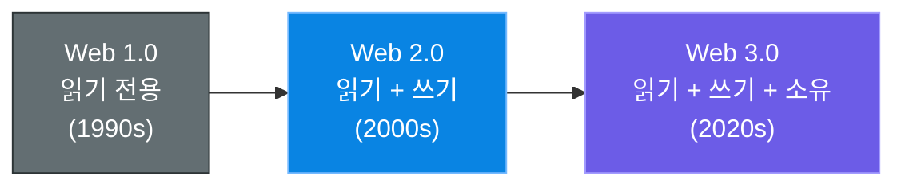
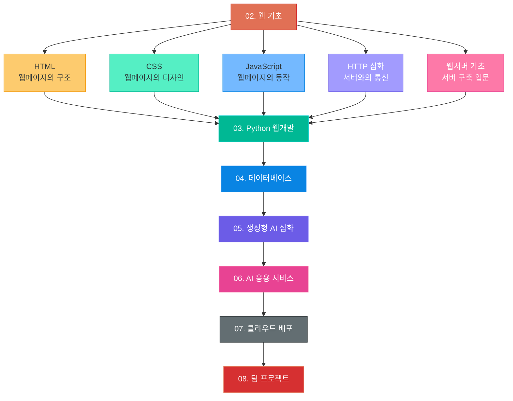

# 인터넷의 역사와 월드와이드웹 (WWW)

> 우리가 매일 사용하는 "인터넷"과 "웹"은 어떻게 탄생했을까?
> 이 장에서는 인터넷의 기원부터 현대 웹의 진화까지 전체 흐름을 살펴봅니다.

---

## 1. 인터넷의 탄생

### ARPANET - 모든 것의 시작 (1969)

인터넷의 시작은 **미국 국방부(DoD)**의 연구 프로젝트였습니다.

1960년대 냉전 시대, 미 국방부는 한 가지 고민을 했습니다:

> "핵전쟁이 일어나도 통신이 끊기지 않는 네트워크를 만들 수 없을까?"

기존 통신 방식은 **중앙 집중형**이었습니다. 중앙 서버가 파괴되면 전체 네트워크가 마비됩니다. 이 문제를 해결하기 위해 **분산형 네트워크** 개념이 등장했고, 이것이 바로 **ARPANET**(Advanced Research Projects Agency Network)입니다.

- **1969년 10월 29일**: UCLA와 스탠퍼드 연구소(SRI) 간 최초의 메시지 전송
- 전송하려던 단어: "LOGIN"
- 실제 전송된 글자: "LO" (그리고 시스템이 다운됨!)
- 이 두 글자가 인터넷 역사의 첫 메시지입니다

### TCP/IP 프로토콜의 탄생 (1983)

ARPANET은 성공적이었지만, 서로 다른 네트워크끼리 통신할 수 없다는 문제가 있었습니다.

**빈트 서프(Vint Cerf)**와 **밥 칸(Bob Kahn)**이 이 문제를 해결했습니다. 그들이 만든 것이 바로 **TCP/IP 프로토콜**입니다.

| 프로토콜 | 역할 | 비유 |
|---------|------|------|
| **TCP** (Transmission Control Protocol) | 데이터를 작은 조각(패킷)으로 나누고, 도착 후 다시 조립 | 택배를 여러 박스로 나눠 보내고 받는 쪽에서 조립 |
| **IP** (Internet Protocol) | 각 패킷이 목적지까지 가는 경로를 찾아줌 | 각 박스에 붙은 주소 라벨 |

1983년 1월 1일, ARPANET이 공식적으로 TCP/IP를 채택하면서 **현대 인터넷이 탄생**했습니다. 이 날을 "인터넷의 생일"이라고 부릅니다.

### 인터넷 주요 연대기



---

## 2. 월드와이드웹(WWW)의 탄생

### 팀 버너스리와 CERN (1989-1991)

**인터넷 ≠ 웹** 이라는 것을 먼저 이해해야 합니다.

- **인터넷**: 전 세계 컴퓨터를 연결하는 물리적 네트워크 (도로)
- **웹(WWW)**: 인터넷 위에서 동작하는 서비스 중 하나 (도로 위를 달리는 자동차)

1989년, 스위스 제네바의 유럽 입자물리 연구소(CERN)에서 일하던 영국 과학자 **팀 버너스리(Tim Berners-Lee)**는 한 가지 불편함을 느꼈습니다:

> "수천 명의 과학자들이 연구 결과를 쉽게 공유할 방법이 없을까?"

그는 1989년 "Information Management: A Proposal"이라는 제안서를 작성하고, 1991년에 세계 최초 웹사이트를 공개했습니다.

- 최초 웹사이트 주소: `http://info.cern.ch`
- 이 사이트는 지금도 접속 가능합니다!

### 팀 버너스리의 3가지 핵심 발명



| 발명 | 설명 | 현실 비유 |
|------|------|----------|
| **HTML** | 웹페이지의 내용과 구조를 정의하는 언어 | 책의 본문 내용 |
| **HTTP** | 웹에서 정보를 요청하고 받는 규칙 | 도서관에서 책을 빌리는 절차 |
| **URL** | 웹 자원(페이지, 이미지 등)의 고유 주소 | 책의 ISBN 번호, 도서관 위치 |

> 팀 버너스리는 WWW를 특허로 등록하지 않고 **무료로 공개**했습니다.
> 만약 특허를 냈다면 세계 최고 부자가 되었을 것입니다. 그 덕분에 오늘날 누구나 자유롭게 웹을 사용할 수 있습니다.

---

## 3. 웹페이지란?

### 웹페이지 = HTML 문서

웹페이지는 본질적으로 **텍스트 파일**입니다. 이 텍스트 파일이 **HTML(HyperText Markup Language)** 이라는 규칙에 따라 작성되어 있으면 브라우저가 이를 해석해서 예쁜 화면으로 보여줍니다.

간단한 예시:

```html
<!DOCTYPE html>
<html>
<head>
    <title>나의 첫 웹페이지</title>
</head>
<body>
    <h1>안녕하세요!</h1>
    <p>이것이 웹페이지입니다.</p>
</body>
</html>
```

위 텍스트를 브라우저가 해석하면:
- `<h1>` 태그 → 큰 제목으로 표시
- `<p>` 태그 → 일반 문단으로 표시

### 웹페이지가 화면에 표시되는 과정



**핵심 포인트:**
1. 웹페이지는 그냥 텍스트 파일이다
2. 브라우저가 그 텍스트를 해석해서 예쁘게 보여주는 것이다
3. 같은 HTML 파일이라도 브라우저마다 약간 다르게 보일 수 있다

---

## 4. 서버와 클라이언트

### 기본 개념

웹은 **요청(Request)과 응답(Response)**으로 동작합니다.

| 구분 | 클라이언트 (Client) | 서버 (Server) |
|------|-------------------|--------------|
| 역할 | 요청하는 쪽 | 응답하는 쪽 |
| 대표 예시 | 웹 브라우저 (Chrome, Safari 등) | 웹 서버 (Nginx, Apache 등) |
| 비유 | 음식점 손님 | 음식점 주방 |
| 하는 일 | "이 페이지 보여줘!" 요청 | 요청받은 페이지를 찾아서 보내줌 |

### 클라이언트-서버 상호작용



### 실생활 비유

음식점으로 비유하면:

1. **손님(클라이언트)**이 메뉴판을 보고 "김치찌개 하나요!" 라고 **주문(요청)**합니다
2. **주방(서버)**에서 김치찌개를 만들어 **배달(응답)**합니다
3. 손님은 음식을 받아서 먹습니다 (브라우저가 HTML을 받아서 화면에 표시)

> 중요: 서버는 클라이언트가 요청하기 전에는 아무것도 보내지 않습니다!
> 항상 클라이언트가 먼저 요청하고, 서버가 응답하는 구조입니다.

---

## 5. HTTP란?

### HyperText Transfer Protocol

**HTTP**는 클라이언트와 서버가 "대화하는 규칙(프로토콜)"입니다.

사람들끼리 대화할 때도 규칙이 있듯이 (인사 → 용건 → 마무리), 컴퓨터끼리도 정해진 규칙에 따라 대화합니다. 그 규칙이 HTTP입니다.

### HTTP의 핵심 특징

| 특징 | 설명 | 비유 |
|------|------|------|
| **요청-응답 구조** | 클라이언트가 요청하면 서버가 응답 | 질문하면 대답하는 것 |
| **비연결성 (Connectionless)** | 응답 후 연결을 끊음 | 전화 끊기 (용건 끝나면 끊음) |
| **무상태 (Stateless)** | 이전 요청을 기억하지 않음 | 매번 처음 만난 것처럼 대화 |

### HTTP 메서드 (맛보기)

```
GET    - 데이터를 달라고 요청 (웹페이지 보기)
POST   - 데이터를 보냄 (회원가입, 글 작성)
PUT    - 데이터를 수정 (프로필 수정)
DELETE - 데이터를 삭제 (글 삭제)
```

> HTTP에 대한 자세한 내용은 **05장 HTTP 심화** 에서 다룹니다.
> 지금은 "클라이언트와 서버가 대화하는 규칙"이라는 것만 기억하세요!

---

## 6. 브라우저의 역사와 전쟁

### 브라우저란?

**브라우저(Browser)**는 HTML 문서를 해석해서 사람이 읽을 수 있는 형태로 보여주는 소프트웨어입니다. "웹을 탐색(browse)하는 도구"라는 뜻에서 브라우저라 부릅니다.

### 브라우저 역사 연대기



### 1차 브라우저 전쟁 (1995-2001)

- **Netscape Navigator** vs **Internet Explorer**
- Microsoft가 Windows에 IE를 기본 탑재하는 전략으로 승리
- Netscape는 시장에서 사라졌지만, 소스 코드를 공개하여 **Mozilla Firefox**의 기반이 됨

### 2차 브라우저 전쟁 (2004-현재)

- Firefox가 IE 독점에 도전
- 2008년 Google Chrome 등장 → 빠른 속도와 개발자 도구로 급성장
- 현재 Chrome이 압도적 1위

### 현재 브라우저 점유율 (2024년 기준)

| 브라우저 | 점유율 | 특징 |
|---------|--------|------|
| **Chrome** | ~65% | Google, V8 엔진, 빠른 속도 |
| **Safari** | ~18% | Apple, Mac/iPhone 기본 브라우저 |
| **Edge** | ~5% | Microsoft, Chromium 기반 |
| **Firefox** | ~3% | Mozilla, 오픈소스, 프라이버시 강조 |
| 기타 | ~9% | Opera, Samsung Internet, Brave 등 |

> 개발자에게 중요한 점: 여러 브라우저에서 동일하게 동작하도록 만들어야 합니다!
> 이를 **크로스 브라우저 호환성(Cross-browser Compatibility)**이라고 합니다.

---

## 7. 웹의 진화 (Web 1.0 → 2.0 → 3.0)

### 웹은 계속 진화하고 있다



### Web 1.0: 읽기 전용 웹 (1990년대)

- **특징**: 정적 페이지, 일방향 정보 제공
- 웹사이트 소유자만 콘텐츠를 만들 수 있음
- 사용자는 그냥 **읽기만** 가능
- **예시**: 초기 기업 홈페이지, 뉴스 사이트, 백과사전

비유: **도서관** - 책을 읽을 수만 있고, 직접 책을 쓸 수는 없음

### Web 2.0: 읽기 + 쓰기 웹 (2000년대)

- **특징**: 사용자 참여, 양방향 소통, 동적 콘텐츠
- 누구나 콘텐츠를 **만들고 공유**할 수 있음
- **핵심 기술**: AJAX, JavaScript 프레임워크, REST API
- **예시**: YouTube, 블로그, SNS(Facebook, Instagram), 위키피디아

비유: **광장** - 누구나 발언하고, 토론하고, 콘텐츠를 올릴 수 있음

### Web 3.0: 읽기 + 쓰기 + 소유 웹 (2020년대)

- **특징**: 탈중앙화, 데이터 소유권, AI 통합
- 사용자가 자신의 데이터를 **직접 소유하고 통제**
- **핵심 기술**: 블록체인, 스마트 컨트랙트, AI/ML, 토큰 이코노미
- **예시**: NFT 마켓플레이스, DeFi, AI 에이전트, DAO

비유: **자기 집** - 자기 공간에서 모든 것을 소유하고 통제

### 비교 요약표

| 구분 | Web 1.0 | Web 2.0 | Web 3.0 |
|------|---------|---------|---------|
| **시기** | 1990s | 2000s-현재 | 2020s-현재 |
| **역할** | 읽기 | 읽기 + 쓰기 | 읽기 + 쓰기 + 소유 |
| **콘텐츠** | 기업이 생산 | 사용자가 생산 (UGC) | AI + 사용자가 생산 |
| **데이터 소유** | 웹사이트 소유자 | 플랫폼 기업 (구글, 메타) | 사용자 본인 |
| **수익 구조** | 광고, 구독 | 플랫폼 수수료, 데이터 판매 | 토큰, 직접 거래 |
| **핵심 기술** | HTML, CSS | AJAX, JavaScript, API | 블록체인, AI, 토큰 |
| **대표 서비스** | Yahoo, 기업 홈페이지 | YouTube, Instagram, 네이버 | OpenSea, ChatGPT, 메타버스 |

### 우리 과정과의 연결

이 과정(생성형 AI 풀스택 개발 과정)에서는 주로 **Web 2.0 기술 + AI(Web 3.0)**을 다룹니다:
- Web 2.0의 프론트엔드/백엔드 기술을 배우고
- 여기에 생성형 AI를 결합하여 새로운 서비스를 만드는 것이 목표입니다

---

## 8. 이 과정에서 배울 것들

### 커리큘럼 로드맵

앞으로 이 챕터에서 배울 핵심 주제들입니다:



### 각 장의 핵심 내용 미리보기

| 순서 | 주제 | 핵심 내용 | 배우는 이유 |
|------|------|----------|------------|
| 02장 | HTML | 웹페이지의 뼈대 만들기 | 모든 웹의 기본 구조 |
| 03장 | CSS | 웹페이지 꾸미기 (색상, 레이아웃) | 사용자 경험(UX) 향상 |
| 04장 | JavaScript | 웹페이지에 동작 추가 | 버튼 클릭, 데이터 처리 |
| 05장 | HTTP 심화 | 서버와 통신하는 방법 | API 호출, 데이터 전송 |
| 06장 | 웹서버 | 서버 프로그램 만들기 | 백엔드 개발의 시작 |

### 최종 목표

이 과정을 마치면 여러분은:

1. **웹이 어떻게 동작하는지** 완벽히 이해합니다
2. **HTML/CSS/JS**로 프론트엔드를 만들 수 있습니다
3. **Python으로 웹서버**를 구축할 수 있습니다
4. **생성형 AI API**를 활용한 서비스를 개발할 수 있습니다
5. **클라우드에 배포**하여 실제 서비스를 운영할 수 있습니다

---

## 핵심 요약

| 개념 | 핵심 포인트 |
|------|------------|
| 인터넷 | 1969년 ARPANET에서 시작, 1983년 TCP/IP로 현대 인터넷 탄생 |
| WWW | 1991년 팀 버너스리가 HTML + HTTP + URL을 발명하여 공개 |
| 웹페이지 | HTML로 작성된 텍스트 파일, 브라우저가 해석하여 표시 |
| 클라이언트-서버 | 요청(Request)과 응답(Response) 구조 |
| HTTP | 웹에서 데이터를 주고받는 규칙(프로토콜) |
| 브라우저 | HTML을 해석하여 화면에 보여주는 소프트웨어, Chrome이 1위 |
| 웹 진화 | Web 1.0(읽기) → 2.0(읽기+쓰기) → 3.0(읽기+쓰기+소유) |

---

## 다음 장 미리보기

> 다음 장에서는 **HTML**의 기본 문법과 태그를 배웁니다.
> 직접 웹페이지를 만들어보면서 웹 개발의 첫 걸음을 내딛어 보겠습니다!
