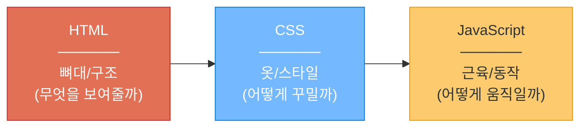
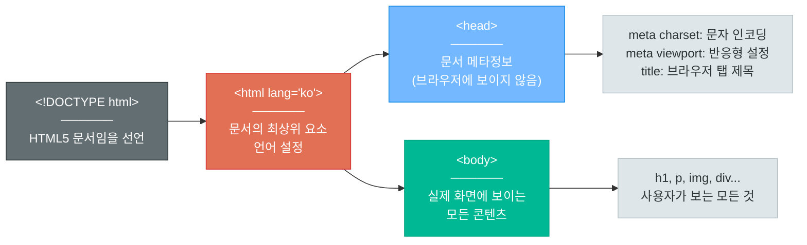
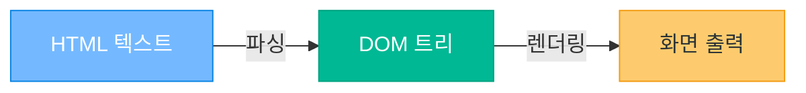
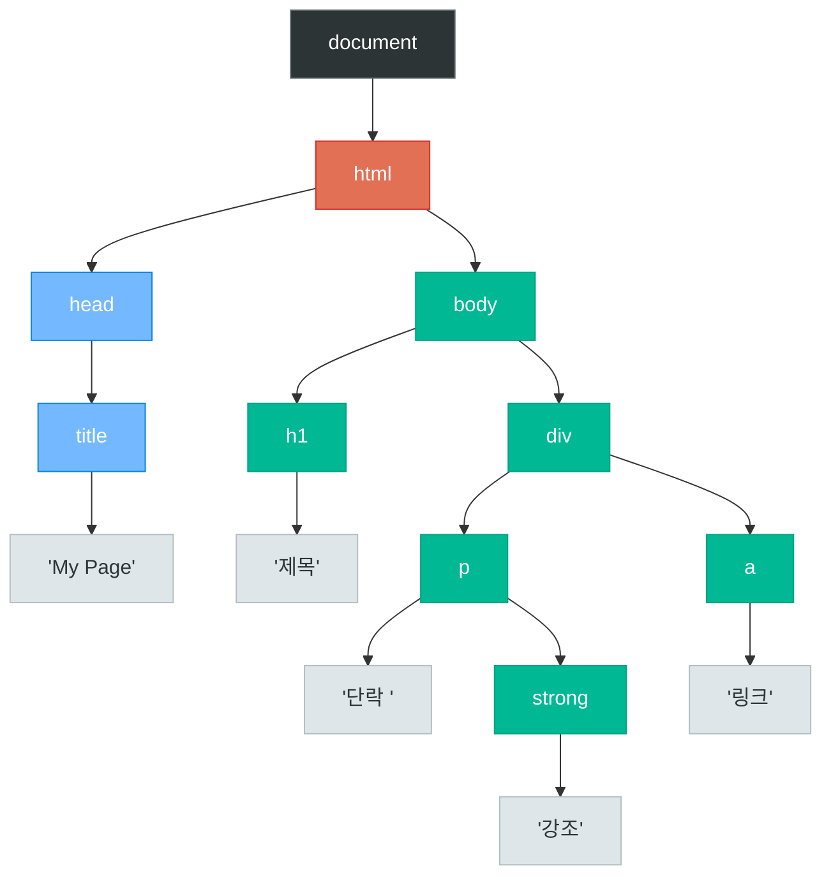
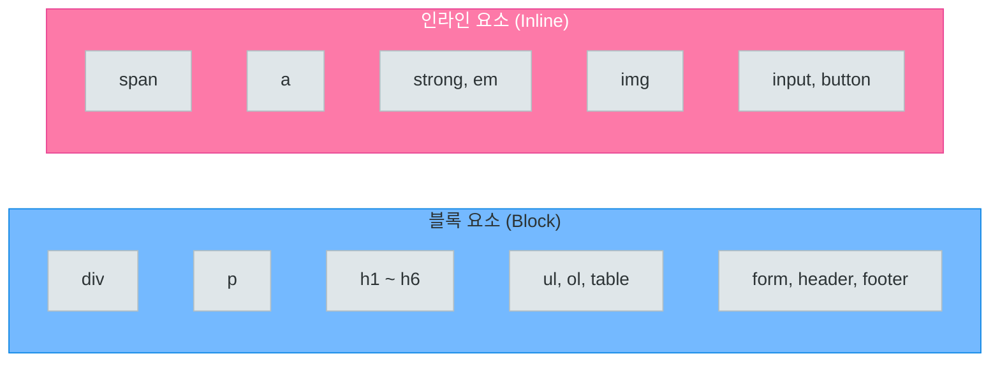
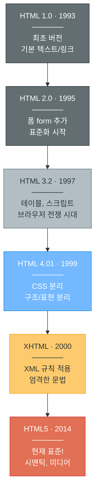
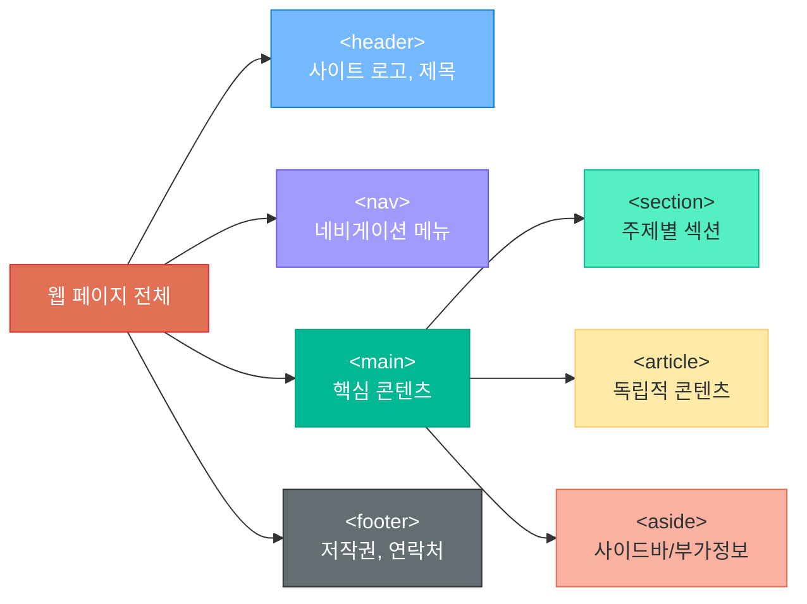
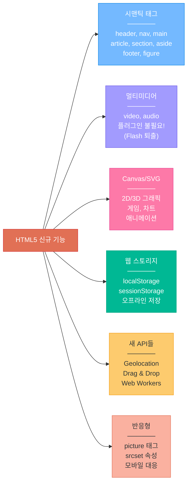
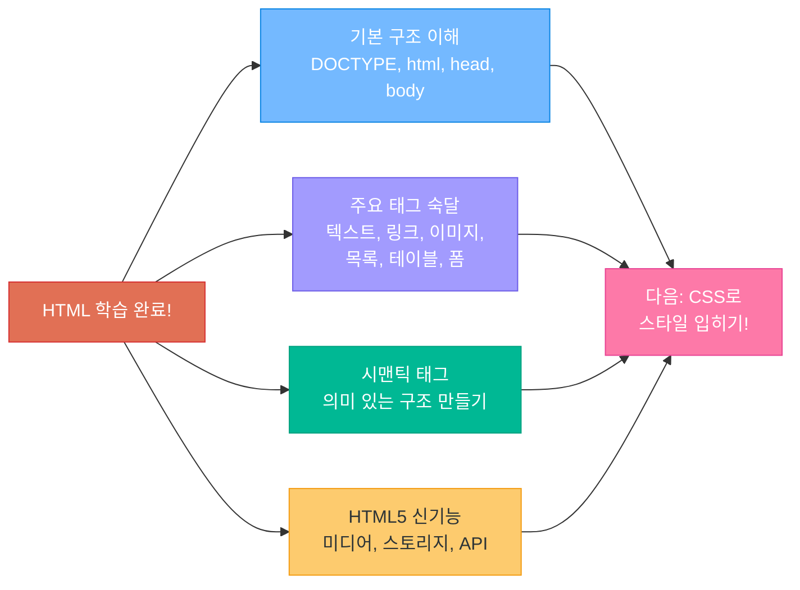

# HTML 기초와 발전

> 웹페이지의 뼈대를 만드는 언어, HTML의 기본부터 최신 HTML5까지

---

## 1. HTML이란?

### 정의

**HTML** = **H**yper**T**ext **M**arkup **L**anguage

- **HyperText**: 하이퍼링크를 통해 다른 문서로 이동할 수 있는 텍스트
- **Markup**: 태그(tag)로 콘텐츠의 구조와 의미를 표시하는 방식
- **Language**: 웹 브라우저가 이해하는 약속된 규칙 체계

### 핵심 개념

```
HTML은 프로그래밍 언어가 아닙니다!
- 조건문(if), 반복문(for) 없음
- 변수, 함수 없음
- "마크업 언어" = 콘텐츠에 의미와 구조를 부여하는 언어
```

### 웹 3대 기술 비유



| 기술 | 역할 | 비유 | 예시 |
|------|------|------|------|
| **HTML** | 구조 | 건물의 골격 | 제목, 문단, 이미지, 버튼 |
| **CSS** | 스타일 | 건물의 인테리어 | 색상, 크기, 배치, 애니메이션 |
| **JavaScript** | 동작 | 건물의 엘리베이터 | 클릭, 데이터 처리, API 호출 |

---

## 2. HTML 기본 구조

### 최소 HTML 문서 템플릿

```html
<!DOCTYPE html>
<html lang="ko">
<head>
    <meta charset="UTF-8">
    <meta name="viewport" content="width=device-width, initial-scale=1.0">
    <title>나의 첫 웹페이지</title>
</head>
<body>
    <h1>안녕하세요!</h1>
    <p>나의 첫 번째 웹페이지입니다.</p>
</body>
</html>
```

### 각 부분 설명



| 태그 | 역할 | 필수 여부 |
|------|------|-----------|
| `<!DOCTYPE html>` | HTML5 문서 선언 | 필수 |
| `<html>` | 문서의 루트(최상위) 요소 | 필수 |
| `<head>` | 메타데이터 영역 (보이지 않음) | 필수 |
| `<meta charset="UTF-8">` | 한글 등 유니코드 지원 | 권장 필수 |
| `<title>` | 브라우저 탭에 표시되는 제목 | 필수 |
| `<body>` | 화면에 보이는 콘텐츠 | 필수 |

---

## 3. DOM (Document Object Model)

### DOM이란?

브라우저가 HTML 문서를 읽으면, 텍스트를 **트리(Tree) 구조의 객체**로 변환합니다. 이것이 바로 **DOM(Document Object Model)**입니다. JavaScript는 이 DOM 트리를 조작하여 웹페이지의 내용, 구조, 스타일을 동적으로 변경합니다.

> DOM은 HTML 문서의 "프로그래밍 인터페이스"입니다. HTML이 설계도라면, DOM은 브라우저가 만든 실제 건물의 구조도입니다.

### HTML → DOM 변환 과정



### DOM 트리 시각화

다음 HTML 코드가 어떤 DOM 트리로 변환되는지 살펴봅시다.

```html
<html>
  <head>
    <title>My Page</title>
  </head>
  <body>
    <h1>제목</h1>
    <div>
      <p>단락 <strong>강조</strong></p>
      <a href="#">링크</a>
    </div>
  </body>
</html>
```



> **노드 종류**: 파란색은 `<head>` 영역, 초록색은 `<body>` 영역의 **요소 노드(Element Node)**, 회색은 **텍스트 노드(Text Node)**입니다.

### JavaScript로 DOM 조작하기

```javascript
// 요소 선택
const title = document.querySelector('h1');

// 내용 변경
title.textContent = '새로운 제목';

// 스타일 변경
title.style.color = 'blue';

// 새 요소 추가
const newP = document.createElement('p');
newP.textContent = '동적으로 추가된 단락';
document.querySelector('div').appendChild(newP);
```

| DOM 메서드 | 역할 | 예시 |
|-----------|------|------|
| `querySelector()` | CSS 선택자로 요소 찾기 | `document.querySelector('.class')` |
| `getElementById()` | id로 요소 찾기 | `document.getElementById('my-id')` |
| `textContent` | 텍스트 내용 변경 | `el.textContent = '새 텍스트'` |
| `innerHTML` | HTML 내용 변경 | `el.innerHTML = '<b>굵게</b>'` |
| `createElement()` | 새 요소 생성 | `document.createElement('div')` |
| `appendChild()` | 자식 요소 추가 | `parent.appendChild(child)` |
| `remove()` | 요소 삭제 | `el.remove()` |

---

## 4. 주요 태그 상세 설명

### 텍스트 태그

#### 제목 태그 (h1 ~ h6)

```html
<h1>가장 큰 제목 (한 페이지에 하나만!)</h1>
<h2>두 번째 제목</h2>
<h3>세 번째 제목</h3>
<h4>네 번째 제목</h4>
<h5>다섯 번째 제목</h5>
<h6>가장 작은 제목</h6>
```

> h1은 페이지에서 한 번만 사용하는 것이 SEO에 좋습니다.

#### 문단과 줄바꿈

```html
<p>이것은 하나의 문단입니다. HTML에서는 엔터를 여러 번 쳐도 한 칸만 띄어집니다.</p>
<p>새로운 문단을 시작하려면 p 태그를 사용합니다.</p>

<!-- 줄바꿈 (닫는 태그 없음) -->
<p>첫 번째 줄<br>두 번째 줄<br>세 번째 줄</p>

<!-- 가로선 (주제 구분) -->
<hr>
```

#### 텍스트 강조 태그

```html
<strong>굵은 글씨 (중요한 내용)</strong>
<em>기울임 (강조)</em>
<mark>형광펜 효과</mark>
<del>취소선 (삭제된 내용)</del>
<sub>아래 첨자</sub> - H<sub>2</sub>O
<sup>위 첨자</sup> - E=mc<sup>2</sup>
```

---

### 링크와 이미지

#### 하이퍼링크 (a 태그)

```html
<!-- 기본 링크 -->
<a href="https://www.google.com">구글로 이동</a>

<!-- 새 탭에서 열기 -->
<a href="https://www.naver.com" target="_blank">네이버 (새 탭)</a>

<!-- 페이지 내 이동 (앵커) -->
<a href="#section2">2번 섹션으로 이동</a>

<!-- 이메일 링크 -->
<a href="mailto:hello@example.com">이메일 보내기</a>
```

#### 이미지 (img 태그)

```html
<!-- 기본 이미지 (닫는 태그 없음) -->


<!-- 크기 지정 -->


<!-- 외부 URL 이미지 -->

```

> `alt` 속성은 이미지를 못 불러올 때 표시되며, 시각장애인용 스크린 리더에서 읽어줍니다.

---

### 목록

#### 순서 없는 목록 (ul)

```html
<ul>
    <li>사과</li>
    <li>바나나</li>
    <li>오렌지</li>
</ul>
```

결과:
- 사과
- 바나나
- 오렌지

#### 순서 있는 목록 (ol)

```html
<ol>
    <li>HTML 배우기</li>
    <li>CSS 배우기</li>
    <li>JavaScript 배우기</li>
</ol>
```

결과:
1. HTML 배우기
2. CSS 배우기
3. JavaScript 배우기

#### 중첩 목록

```html
<ul>
    <li>프론트엔드
        <ul>
            <li>HTML</li>
            <li>CSS</li>
            <li>JavaScript</li>
        </ul>
    </li>
    <li>백엔드
        <ul>
            <li>Python</li>
            <li>Node.js</li>
        </ul>
    </li>
</ul>
```

---

### 테이블

```html
<table border="1">
    <thead>
        <tr>
            <th>이름</th>
            <th>나이</th>
            <th>직업</th>
        </tr>
    </thead>
    <tbody>
        <tr>
            <td>김철수</td>
            <td>25</td>
            <td>개발자</td>
        </tr>
        <tr>
            <td>이영희</td>
            <td>30</td>
            <td>디자이너</td>
        </tr>
        <tr>
            <td>박민수</td>
            <td>28</td>
            <td>기획자</td>
        </tr>
    </tbody>
</table>
```

| 태그 | 역할 |
|------|------|
| `<table>` | 표 전체를 감싸는 태그 |
| `<thead>` | 표의 머리글 영역 |
| `<tbody>` | 표의 본문 영역 |
| `<tr>` | 행 (table row) |
| `<th>` | 머리글 셀 (굵게 표시됨) |
| `<td>` | 일반 데이터 셀 |

---

### 폼 (입력)

사용자로부터 데이터를 입력받는 태그들입니다.

#### input 태그의 다양한 type

```html
<!-- 텍스트 입력 -->
<input type="text" placeholder="이름을 입력하세요">

<!-- 비밀번호 (***으로 표시) -->
<input type="password" placeholder="비밀번호">

<!-- 이메일 (형식 검증) -->
<input type="email" placeholder="email@example.com">

<!-- 숫자 -->
<input type="number" min="1" max="100">

<!-- 체크박스 -->
<input type="checkbox" id="agree">
<label for="agree">동의합니다</label>

<!-- 라디오 버튼 (하나만 선택) -->
<input type="radio" name="gender" value="male"> 남성
<input type="radio" name="gender" value="female"> 여성

<!-- 날짜 -->
<input type="date">

<!-- 파일 업로드 -->
<input type="file">
```

#### 완성된 폼 예제

```html
<form action="/submit" method="POST">
    <h2>회원가입</h2>

    <label for="username">아이디:</label><br>
    <input type="text" id="username" name="username" required><br><br>

    <label for="email">이메일:</label><br>
    <input type="email" id="email" name="email" required><br><br>

    <label for="password">비밀번호:</label><br>
    <input type="password" id="password" name="password" required><br><br>

    <label for="age">나이:</label><br>
    <input type="number" id="age" name="age" min="1" max="120"><br><br>

    <label for="job">직업:</label><br>
    <select id="job" name="job">
        <option value="">선택하세요</option>
        <option value="developer">개발자</option>
        <option value="designer">디자이너</option>
        <option value="planner">기획자</option>
        <option value="student">학생</option>
    </select><br><br>

    <label for="intro">자기소개:</label><br>
    <textarea id="intro" name="intro" rows="4" cols="40"
              placeholder="간단한 자기소개를 작성하세요"></textarea><br><br>

    <input type="checkbox" id="agree" name="agree" required>
    <label for="agree">개인정보 수집에 동의합니다</label><br><br>

    <button type="submit">가입하기</button>
    <button type="reset">초기화</button>
</form>
```

---

### 구조/컨테이너

#### div (블록 컨테이너)

```html
<!-- div: 관련된 요소들을 하나로 묶는 "상자" -->
<div style="background-color: #f0f0f0; padding: 20px;">
    <h2>뉴스 카드</h2>
    <p>오늘의 주요 뉴스입니다.</p>
    <a href="#">자세히 보기</a>
</div>
```

#### span (인라인 컨테이너)

```html
<!-- span: 텍스트 일부분만 감싸는 "투명 포장지" -->
<p>오늘 날씨는 <span style="color: red;">매우 더움</span>입니다.</p>
<p>총 금액: <span style="font-weight: bold;">50,000원</span></p>
```

---

### 멀티미디어

```html
<!-- 비디오 -->
<video width="640" height="360" controls>
    <source src="movie.mp4" type="video/mp4">
    브라우저가 비디오를 지원하지 않습니다.
</video>

<!-- 오디오 -->
<audio controls>
    <source src="music.mp3" type="audio/mpeg">
    브라우저가 오디오를 지원하지 않습니다.
</audio>

<!-- 외부 콘텐츠 삽입 (YouTube 등) -->
<iframe width="560" height="315"
        src="https://www.youtube.com/embed/VIDEO_ID"
        title="유튜브 영상"
        allowfullscreen>
</iframe>
```

---

## 5. 블록 요소 vs 인라인 요소

### 개념 비교



### 차이점

| 특성 | 블록 요소 | 인라인 요소 |
|------|-----------|-------------|
| **너비** | 부모 요소의 전체 너비 차지 | 콘텐츠 크기만큼만 차지 |
| **줄바꿈** | 앞뒤로 자동 줄바꿈 | 줄바꿈 없이 나란히 배치 |
| **내부 요소** | 블록/인라인 모두 포함 가능 | 인라인만 포함 가능 |
| **width/height** | 설정 가능 | 설정 불가 (기본) |
| **대표 예** | div, p, h1 | span, a, strong |

### 시각적 비교

```
┌──────────────────────────────────────────────┐
│  <div> 블록 요소: 한 줄 전체를 차지합니다     │
└──────────────────────────────────────────────┘
┌──────────────────────────────────────────────┐
│  <p> 이것도 블록 요소입니다                   │
└──────────────────────────────────────────────┘
┌──────────────────────────────────────────────┐
│  <h2> 제목도 블록 요소                        │
└──────────────────────────────────────────────┘

[<span>인라인]  [<a>인라인]  [<strong>인라인]  ← 나란히!
```

---

## 6. HTML 버전 역사

### 타임라인



### 각 버전별 특징

| 버전 | 연도 | 주요 변화 |
|------|------|-----------|
| HTML 1.0 | 1993 | 최초의 HTML, 18개 태그, 텍스트와 링크만 |
| HTML 2.0 | 1995 | form, table 도입, IETF 표준화 |
| HTML 3.2 | 1997 | 스크립트, 스타일, 테이블 레이아웃, W3C 관리 |
| HTML 4.01 | 1999 | CSS와 분리, 구조/표현/동작 분리 원칙 확립 |
| XHTML | 2000 | XML 규칙 적용, 모든 태그 소문자, 닫기 필수 |
| **HTML5** | **2014** | **시맨틱 태그, 비디오/오디오, Canvas, API들** |

### HTML5가 가져온 혁명

```
HTML 4.01 시대                    HTML5 시대
──────────────                    ──────────────
- Flash 플러그인 필요              - 플러그인 없이 동영상 재생
- div로 모든 구조 표현             - 시맨틱 태그로 의미 부여
- 외부 라이브러리 의존             - 내장 API (위치, 저장 등)
- 데스크톱 위주                   - 모바일 반응형 고려
```

---

## 7. 시맨틱 태그 (Semantic Tags)

### 시맨틱이란?

**Semantic** = "의미를 가진"

- `<div>`: "나는 그냥 박스야" (의미 없음)
- `<header>`: "나는 머리글이야" (의미 있음)
- `<nav>`: "나는 네비게이션이야" (의미 있음)

### 시맨틱 태그 페이지 구조



### 페이지 레이아웃 구조

```
┌─────────────────────────────────────────────┐
│                 <header>                     │
│           로고    사이트 제목                 │
├─────────────────────────────────────────────┤
│                  <nav>                       │
│         홈 | 소개 | 서비스 | 연락처           │
├────────────────────────────────┬────────────┤
│           <main>               │  <aside>   │
│  ┌──────────────────────────┐  │            │
│  │      <section>           │  │  사이드바   │
│  │  ┌────────────────────┐  │  │  광고      │
│  │  │    <article>       │  │  │  관련글    │
│  │  │    블로그 포스트     │  │  │            │
│  │  └────────────────────┘  │  │            │
│  └──────────────────────────┘  │            │
├────────────────────────────────┴────────────┤
│                 <footer>                     │
│        Copyright 2026. 연락처 정보           │
└─────────────────────────────────────────────┘
```

### Before & After 비교

#### Before: div 지옥 (의미 없는 구조)

```html
<div class="header">
    <div class="logo">My Site</div>
    <div class="nav">
        <div class="nav-item"><a href="/">홈</a></div>
        <div class="nav-item"><a href="/about">소개</a></div>
    </div>
</div>
<div class="main">
    <div class="content">
        <div class="post">
            <div class="post-title">제목</div>
            <div class="post-body">내용...</div>
        </div>
    </div>
    <div class="sidebar">
        <div class="widget">광고</div>
    </div>
</div>
<div class="footer">
    <div class="copyright">Copyright 2026</div>
</div>
```

#### After: 시맨틱 태그 (의미 있는 구조)

```html
<header>
    <h1>My Site</h1>
    <nav>
        <a href="/">홈</a>
        <a href="/about">소개</a>
    </nav>
</header>
<main>
    <article>
        <h2>제목</h2>
        <p>내용...</p>
    </article>
    <aside>
        <p>광고</p>
    </aside>
</main>
<footer>
    <p>Copyright 2026</p>
</footer>
```

### 기타 시맨틱 태그

```html
<!-- 그림과 캡션 -->
<figure>
    
    <figcaption>2026년 1분기 매출 현황</figcaption>
</figure>

<!-- 접기/펼치기 -->
<details>
    <summary>더 보기 (클릭하세요)</summary>
    <p>숨겨진 상세 내용이 여기에 표시됩니다.</p>
</details>
```

### 시맨틱 태그의 3대 장점

| 장점 | 설명 |
|------|------|
| **SEO (검색 최적화)** | 검색엔진이 콘텐츠 구조를 정확히 파악 |
| **접근성 (Accessibility)** | 스크린 리더가 페이지 구조를 사용자에게 안내 |
| **코드 가독성** | 개발자가 코드만 봐도 구조 파악 가능 |

---

## 8. HTML5에서 추가된 것들

### 주요 신규 기능



### 상세 코드 예제

#### 비디오/오디오 (플러그인 없이!)

```html
<!-- HTML5 이전: Flash 플러그인 필요 -->
<!-- <object> <embed> 등 복잡한 코드... -->

<!-- HTML5: 간단하게! -->
<video controls autoplay muted>
    <source src="video.mp4" type="video/mp4">
    <source src="video.webm" type="video/webm">
    비디오를 재생할 수 없습니다.
</video>
```

#### localStorage (브라우저에 데이터 저장)

```html
<script>
    // 데이터 저장
    localStorage.setItem('username', '김철수');

    // 데이터 읽기
    const name = localStorage.getItem('username');
    console.log(name); // "김철수"

    // 데이터 삭제
    localStorage.removeItem('username');
</script>
```

#### Geolocation (위치 정보)

```html
<script>
    navigator.geolocation.getCurrentPosition(function(position) {
        console.log('위도: ' + position.coords.latitude);
        console.log('경도: ' + position.coords.longitude);
    });
</script>
```

#### 반응형 이미지

```html
<!-- 화면 크기에 따라 다른 이미지 로드 -->
<picture>
    <source media="(max-width: 600px)" srcset="small.jpg">
    <source media="(max-width: 1200px)" srcset="medium.jpg">
    
</picture>

<!-- srcset으로 해상도별 이미지 -->

```

---

## 9. 실습: 자기소개 페이지 만들기

아래 코드를 `index.html` 파일로 저장하고 브라우저에서 열어보세요.

```html
<!DOCTYPE html>
<html lang="ko">
<head>
    <meta charset="UTF-8">
    <meta name="viewport" content="width=device-width, initial-scale=1.0">
    <title>자기소개 - 홍길동</title>
</head>
<body>

    <!-- 헤더 영역 -->
    <header>
        <h1>홍길동의 자기소개 페이지</h1>
        <nav>
            <a href="#about">소개</a> |
            <a href="#skills">기술 스택</a> |
            <a href="#projects">프로젝트</a> |
            <a href="#contact">연락처</a>
        </nav>
        <hr>
    </header>

    <!-- 메인 콘텐츠 -->
    <main>

        <!-- 자기소개 섹션 -->
        <section id="about">
            <h2>About Me</h2>
            <figure>
                
                <figcaption>프로필 사진</figcaption>
            </figure>
            <p>안녕하세요! 저는 <strong>홍길동</strong>입니다.</p>
            <p><em>생성형 AI 풀스택 개발 과정</em>을 수강하고 있으며,
               웹 개발에 관심이 많습니다.</p>

            <details>
                <summary>더 자세한 소개 보기</summary>
                <p>저는 서울에 살고 있으며, 취미는 코딩과 음악 감상입니다.
                   새로운 기술을 배우는 것을 좋아하고, 특히 AI와 웹 기술의
                   결합에 큰 흥미를 느끼고 있습니다.</p>
            </details>
        </section>

        <hr>

        <!-- 기술 스택 섹션 -->
        <section id="skills">
            <h2>기술 스택</h2>

            <h3>현재 배우고 있는 기술</h3>
            <ul>
                <li>HTML5 / CSS3</li>
                <li>JavaScript</li>
                <li>Python</li>
                <li>생성형 AI (ChatGPT, Claude)</li>
            </ul>

            <h3>학습 로드맵</h3>
            <ol>
                <li>웹 기초 (HTML, CSS, JS) <mark>현재 단계!</mark></li>
                <li>프론트엔드 프레임워크 (React)</li>
                <li>백엔드 개발 (FastAPI)</li>
                <li>AI 서비스 개발</li>
                <li>풀스택 프로젝트</li>
            </ol>

            <h3>기술 수준</h3>
            <table border="1">
                <thead>
                    <tr>
                        <th>기술</th>
                        <th>수준</th>
                        <th>경험</th>
                    </tr>
                </thead>
                <tbody>
                    <tr>
                        <td>HTML</td>
                        <td>입문</td>
                        <td>1주일</td>
                    </tr>
                    <tr>
                        <td>CSS</td>
                        <td>입문</td>
                        <td>1주일</td>
                    </tr>
                    <tr>
                        <td>Python</td>
                        <td>초급</td>
                        <td>1개월</td>
                    </tr>
                    <tr>
                        <td>ChatGPT 활용</td>
                        <td>중급</td>
                        <td>6개월</td>
                    </tr>
                </tbody>
            </table>
        </section>

        <hr>

        <!-- 프로젝트 섹션 -->
        <section id="projects">
            <h2>프로젝트</h2>

            <article>
                <h3>프로젝트 1: 자기소개 웹페이지</h3>
                <p>HTML을 이용한 첫 번째 웹페이지 제작</p>
                <p>사용 기술: <span style="color: blue;">HTML5</span></p>
            </article>

            <article>
                <h3>프로젝트 2: AI 챗봇 (예정)</h3>
                <p>생성형 AI API를 활용한 챗봇 서비스 개발 예정</p>
                <p>사용 기술:
                    <span style="color: green;">Python</span>,
                    <span style="color: orange;">FastAPI</span>,
                    <span style="color: purple;">OpenAI API</span>
                </p>
            </article>
        </section>

        <hr>

        <!-- 연락처 섹션 -->
        <section id="contact">
            <h2>연락처</h2>

            <ul>
                <li>이메일: <a href="mailto:gildong@example.com">gildong@example.com</a></li>
                <li>깃허브: <a href="https://github.com/gildong" target="_blank">github.com/gildong</a></li>
                <li>블로그: <a href="https://blog.example.com" target="_blank">blog.example.com</a></li>
            </ul>

            <h3>메시지 남기기</h3>
            <form action="#" method="POST">
                <label for="name">이름:</label><br>
                <input type="text" id="name" name="name" placeholder="이름 입력" required><br><br>

                <label for="msg-email">이메일:</label><br>
                <input type="email" id="msg-email" name="email" placeholder="email@example.com" required><br><br>

                <label for="subject">제목:</label><br>
                <input type="text" id="subject" name="subject" placeholder="제목 입력"><br><br>

                <label for="message">메시지:</label><br>
                <textarea id="message" name="message" rows="5" cols="40"
                          placeholder="메시지를 입력하세요"></textarea><br><br>

                <button type="submit">보내기</button>
                <button type="reset">초기화</button>
            </form>
        </section>

    </main>

    <!-- 푸터 -->
    <footer>
        <hr>
        <p><small>Copyright 2026. 홍길동. All rights reserved.</small></p>
        <p>이 페이지는 <strong>생성형 AI 풀스택 개발 과정</strong> 실습으로 제작되었습니다.</p>
    </footer>

</body>
</html>
```

### 실습 체크리스트

위 코드에서 사용된 태그들을 확인해보세요:

- [x] 기본 구조: `<!DOCTYPE>`, `<html>`, `<head>`, `<body>`
- [x] 텍스트: `<h1>` ~ `<h3>`, `<p>`, `<strong>`, `<em>`, `<mark>`, `<small>`
- [x] 링크: `<a href>`, `target="_blank"`
- [x] 이미지: ``
- [x] 목록: `<ul>`, `<ol>`, `<li>`
- [x] 테이블: `<table>`, `<thead>`, `<tbody>`, `<tr>`, `<th>`, `<td>`
- [x] 폼: `<form>`, `<input>`, `<textarea>`, `<button>`, `<label>`
- [x] 시맨틱: `<header>`, `<nav>`, `<main>`, `<section>`, `<article>`, `<footer>`
- [x] 기타: `<figure>`, `<figcaption>`, `<details>`, `<summary>`, `<hr>`

### 다음 단계

이 HTML 뼈대에 CSS를 입혀서 예쁘게 꾸며볼 예정입니다!

---

## 정리



> HTML은 웹의 기초 중의 기초입니다.
> 태그를 외우려 하지 말고, 직접 타이핑하면서 익히세요!
> 모르는 태그는 MDN (developer.mozilla.org)에서 검색하면 됩니다.
