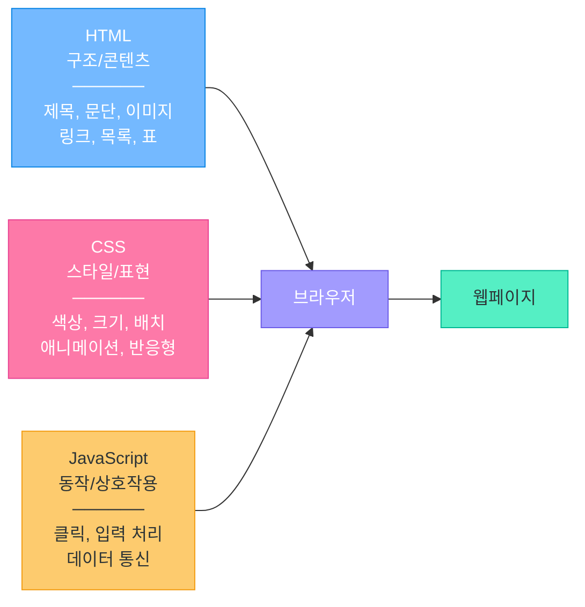
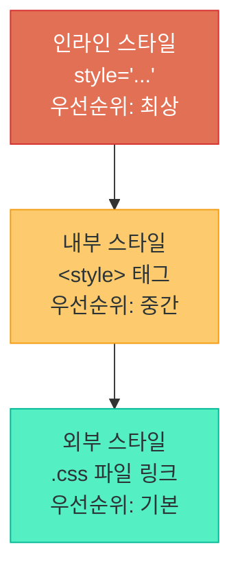
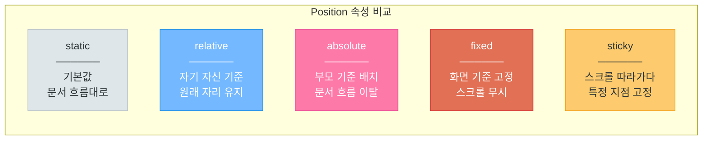
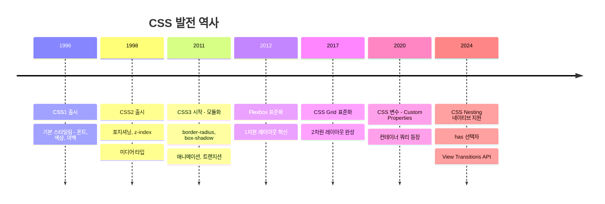
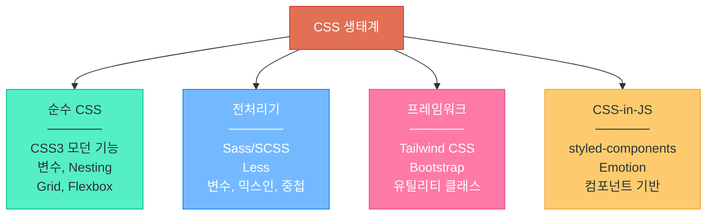
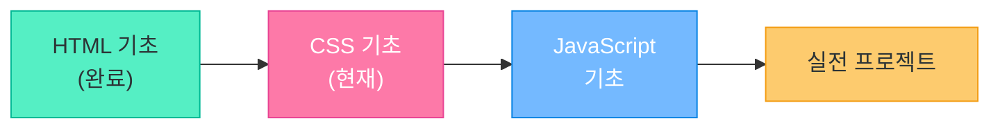

# CSS 기초

> HTML이 뼈대라면, CSS는 옷이다 — 웹 페이지에 색상, 레이아웃, 애니메이션을 입히는 언어

---

## 1. CSS란?

**CSS (Cascading Style Sheets)** 는 HTML 문서의 시각적 표현을 담당하는 스타일 언어입니다.

| 구분 | HTML | CSS |
|------|------|-----|
| 역할 | 구조 (뼈대) | 표현 (디자인) |
| 비유 | 건물의 골조 | 인테리어/외관 |
| 관심사 | "무엇이 있는가" | "어떻게 보이는가" |

### 왜 CSS가 필요한가?

```
❌ HTML에 스타일을 직접 넣으면:
   - 코드가 지저분해짐
   - 유지보수 어려움
   - 재사용 불가

✅ CSS로 분리하면:
   - 구조와 디자인 독립
   - 한 번 작성, 여러 페이지 적용
   - 디자이너/개발자 협업 용이
```



### CSS의 "Cascading" 의미

**Cascading(캐스케이딩)** = 위에서 아래로 흐르는 폭포처럼, 여러 스타일 규칙이 우선순위에 따라 적용된다는 뜻입니다.

---

## 2. CSS 적용 방법 3가지

### 방법 1: 인라인 스타일 (Inline Style) — 비추천

HTML 태그에 직접 `style` 속성을 작성합니다.

```html
<p style="color: red; font-size: 20px;">빨간 글씨입니다</p>
<h1 style="background-color: yellow;">노란 배경 제목</h1>
```

**단점:**
- 재사용 불가 (매 태그마다 반복 작성)
- HTML과 CSS가 섞여 유지보수 어려움
- 협업 시 충돌 발생

### 방법 2: 내부 스타일 (Internal Style) — 소규모 프로젝트

HTML 문서의 `<head>` 안에 `<style>` 태그로 작성합니다.

```html
<!DOCTYPE html>
<html>
<head>
    <title>내부 스타일 예제</title>
    <style>
        p {
            color: blue;
            font-size: 16px;
        }
        h1 {
            background-color: #f0f0f0;
            padding: 10px;
        }
    </style>
</head>
<body>
    <h1>제목입니다</h1>
    <p>파란색 문단입니다</p>
</body>
</html>
```

**장점:** 한 파일에서 관리 가능
**단점:** 다른 HTML 파일에서 재사용 불가

### 방법 3: 외부 스타일 (External Style) — 추천!

별도의 `.css` 파일을 만들고 `<link>` 태그로 연결합니다.

```html
<!-- index.html -->
<!DOCTYPE html>
<html>
<head>
    <title>외부 스타일 예제</title>
    <link rel="stylesheet" href="style.css">
</head>
<body>
    <h1>제목입니다</h1>
    <p>스타일이 적용된 문단입니다</p>
</body>
</html>
```

```css
/* style.css */
p {
    color: green;
    font-size: 18px;
    line-height: 1.6;
}

h1 {
    color: #333;
    border-bottom: 2px solid #e17055;
    padding-bottom: 10px;
}
```

**장점:**
- 여러 HTML 파일에서 하나의 CSS 공유
- 유지보수 용이
- 브라우저 캐싱으로 속도 향상

### 우선순위 (적용이 겹칠 때)

```
인라인 스타일 > 내부 스타일 > 외부 스타일
(가장 강함)                    (가장 약함)
```



---

## 3. CSS 선택자 (Selectors)

선택자는 "어떤 HTML 요소에 스타일을 적용할 것인가"를 지정합니다.

### 기본 선택자

```css
/* 태그 선택자 - 모든 해당 태그에 적용 */
p {
    color: #333;
    line-height: 1.6;
}

h1 {
    font-size: 32px;
}

/* 클래스 선택자 - 특정 클래스에 적용 (재사용 가능) */
.highlight {
    background-color: yellow;
    padding: 4px 8px;
}

.btn-primary {
    background-color: #0984e3;
    color: white;
    padding: 10px 20px;
    border-radius: 5px;
}

/* ID 선택자 - 고유한 하나의 요소에 적용 */
#main-title {
    font-size: 48px;
    text-align: center;
}

#navigation {
    position: fixed;
    top: 0;
    width: 100%;
}
```

```html
<!-- HTML에서의 사용 -->
<h1 id="main-title">메인 제목</h1>
<p class="highlight">강조된 문단</p>
<p class="highlight">이것도 강조</p>
<button class="btn-primary">클릭하세요</button>
```

### 결합 선택자

```css
/* 자손 선택자 - 하위 모든 요소 (깊이 무관) */
div p {
    margin-bottom: 10px;
}

/* 자식 선택자 - 바로 아래 자식만 */
ul > li {
    list-style: square;
}

/* 그룹 선택자 - 여러 선택자에 동일 스타일 */
h1, h2, h3 {
    font-family: 'Noto Sans KR', sans-serif;
    color: #2d3436;
}

/* 인접 형제 선택자 - 바로 다음 형제 */
h2 + p {
    font-size: 18px;
    color: #636e72;
}
```

### 가상 클래스 (Pseudo-classes)

```css
/* 마우스를 올렸을 때 */
a:hover {
    color: #e17055;
    text-decoration: underline;
}

/* 클릭하는 순간 */
button:active {
    transform: scale(0.95);
}

/* 첫 번째 자식 요소 */
li:first-child {
    font-weight: bold;
}

/* 마지막 자식 요소 */
li:last-child {
    border-bottom: none;
}

/* n번째 자식 (짝수번째) */
tr:nth-child(even) {
    background-color: #f8f9fa;
}

/* 포커스 상태 (입력 필드) */
input:focus {
    border-color: #0984e3;
    outline: none;
    box-shadow: 0 0 5px rgba(9, 132, 227, 0.3);
}
```

### 가상 요소 (Pseudo-elements)

```css
/* 요소 앞에 콘텐츠 추가 */
.required::before {
    content: "* ";
    color: red;
}

/* 요소 뒤에 콘텐츠 추가 */
a[href^="http"]::after {
    content: " 🔗";
}

/* 첫 번째 글자 스타일 */
p::first-letter {
    font-size: 2em;
    font-weight: bold;
    color: #e17055;
}

/* 첫 번째 줄 스타일 */
p::first-line {
    font-weight: bold;
}
```

### 선택자 우선순위 (Specificity)

여러 선택자가 같은 요소를 가리킬 때, 점수가 높은 쪽이 이깁니다.

```
점수 체계:
┌────────────────────────────────┬────────┐
│ 선택자 종류                     │ 점수    │
├────────────────────────────────┼────────┤
│ 인라인 스타일 (style="...")     │ 1000점  │
│ ID 선택자 (#id)                │ 100점   │
│ 클래스/가상클래스 (.class, :hover)│ 10점   │
│ 태그/가상요소 (div, ::before)   │ 1점    │
│ 전체 선택자 (*)                 │ 0점    │
└────────────────────────────────┴────────┘

예시:
  p               → 1점 (태그 1개)
  .intro          → 10점 (클래스 1개)
  p.intro         → 11점 (태그 + 클래스)
  #main           → 100점 (ID 1개)
  #main .intro p  → 111점 (ID + 클래스 + 태그)
```

---

## 4. 주요 CSS 속성

### 텍스트 관련

```css
.text-example {
    /* 글자 색상 */
    color: #2d3436;

    /* 글자 크기 */
    font-size: 16px;        /* 픽셀 (고정) */
    font-size: 1.2rem;      /* 루트 기준 상대 크기 (추천) */
    font-size: 1.2em;       /* 부모 기준 상대 크기 */

    /* 글꼴 */
    font-family: 'Noto Sans KR', 'Malgun Gothic', sans-serif;

    /* 글자 굵기 */
    font-weight: normal;    /* 400 */
    font-weight: bold;      /* 700 */
    font-weight: 300;       /* 가늘게 */

    /* 텍스트 정렬 */
    text-align: left;       /* 왼쪽 정렬 */
    text-align: center;     /* 가운데 정렬 */
    text-align: right;      /* 오른쪽 정렬 */

    /* 텍스트 장식 */
    text-decoration: none;          /* 밑줄 제거 */
    text-decoration: underline;     /* 밑줄 */
    text-decoration: line-through;  /* 취소선 */

    /* 줄 간격 */
    line-height: 1.6;       /* 글자 크기의 1.6배 (추천) */

    /* 자간 (글자 간격) */
    letter-spacing: -0.5px; /* 한글은 약간 좁히면 보기 좋음 */
}
```

### 배경 관련

```css
.background-example {
    /* 배경색 */
    background-color: #f8f9fa;

    /* 배경 이미지 */
    background-image: url('images/bg.jpg');
    background-size: cover;         /* 영역 꽉 채움 */
    background-size: contain;       /* 이미지 전체 보임 */
    background-position: center;    /* 중앙 배치 */
    background-repeat: no-repeat;   /* 반복 없음 */

    /* 그라데이션 배경 */
    background: linear-gradient(135deg, #667eea 0%, #764ba2 100%);
}
```

### 크기 관련

```css
.size-example {
    width: 300px;           /* 고정 너비 */
    width: 50%;             /* 부모의 50% */
    width: 100vw;           /* 화면 전체 너비 */

    max-width: 1200px;      /* 최대 너비 제한 */
    min-width: 320px;       /* 최소 너비 보장 */

    height: 200px;          /* 고정 높이 */
    min-height: 100vh;      /* 최소 화면 전체 높이 */
}
```

### 여백과 테두리 — Box Model

모든 HTML 요소는 **박스(Box)** 로 이루어져 있습니다.

```
┌─────────────────────────────────────────────────┐
│                  margin (바깥 여백)               │
│   ┌─────────────────────────────────────────┐   │
│   │            border (테두리)                │   │
│   │   ┌─────────────────────────────────┐   │   │
│   │   │        padding (안쪽 여백)        │   │   │
│   │   │   ┌─────────────────────────┐   │   │   │
│   │   │   │                         │   │   │   │
│   │   │   │     content (콘텐츠)     │   │   │   │
│   │   │   │     실제 내용 영역       │   │   │   │
│   │   │   │                         │   │   │   │
│   │   │   └─────────────────────────┘   │   │   │
│   │   │                                 │   │   │
│   │   └─────────────────────────────────┘   │   │
│   │                                         │   │
│   └─────────────────────────────────────────┘   │
│                                                 │
└─────────────────────────────────────────────────┘
```

```css
.box-model-example {
    /* 안쪽 여백 (padding) */
    padding: 20px;                     /* 상하좌우 모두 20px */
    padding: 10px 20px;                /* 상하 10px, 좌우 20px */
    padding: 10px 20px 30px 40px;      /* 상 우 하 좌 (시계방향) */

    /* 바깥 여백 (margin) */
    margin: 20px;                      /* 상하좌우 모두 20px */
    margin: 0 auto;                    /* 수평 가운데 정렬 */
    margin-bottom: 16px;               /* 아래쪽만 */

    /* 테두리 (border) */
    border: 1px solid #ddd;            /* 두께 스타일 색상 */
    border: 2px dashed #e17055;        /* 점선 테두리 */
    border-bottom: 3px solid #0984e3;  /* 아래쪽만 */

    /* 둥근 테두리 */
    border-radius: 8px;                /* 모서리 둥글게 */
    border-radius: 50%;                /* 원형 */

    /* 중요! box-sizing */
    box-sizing: border-box;  /* padding, border를 width에 포함 (추천) */
}
```

> **Tip:** `box-sizing: border-box`를 전체에 적용하면 크기 계산이 직관적입니다.

```css
/* 모든 요소에 border-box 적용 (권장 설정) */
* {
    box-sizing: border-box;
    margin: 0;
    padding: 0;
}
```

---

## 5. Display와 Position

### Display 속성

요소가 화면에 어떻게 배치되는지 결정합니다.

```css
/* block - 한 줄 전체 차지 (div, p, h1 등 기본값) */
.block-element {
    display: block;
    width: 100%;    /* 기본적으로 100% */
}

/* inline - 콘텐츠 만큼만 차지 (span, a 등 기본값) */
.inline-element {
    display: inline;
    /* width, height 설정 불가! */
}

/* inline-block - 인라인처럼 나란히 + 블록처럼 크기 조절 가능 */
.inline-block-element {
    display: inline-block;
    width: 200px;
    height: 100px;
}

/* none - 화면에서 완전히 제거 */
.hidden {
    display: none;
}
```

```
[block]     ████████████████████████████████████
            (한 줄 전체 차지)

[inline]    ██ ████ ██████ ███ (내용만큼 차지, 나란히 배치)

[inline-block]  ┌──────┐ ┌──────┐ ┌──────┐
                │      │ │      │ │      │  (나란히 + 크기 조절)
                └──────┘ └──────┘ └──────┘
```

### Position 속성

요소의 위치를 어떤 기준으로 잡을지 결정합니다.

```css
/* static - 기본값 (문서 흐름대로) */
.static {
    position: static;
}

/* relative - 자기 원래 위치 기준으로 이동 */
.relative {
    position: relative;
    top: 10px;      /* 원래 위치에서 아래로 10px */
    left: 20px;     /* 원래 위치에서 오른쪽으로 20px */
}

/* absolute - 가장 가까운 positioned 부모 기준 */
.parent {
    position: relative;  /* 부모에 relative 필수! */
}
.absolute {
    position: absolute;
    top: 0;
    right: 0;       /* 부모의 오른쪽 상단에 배치 */
}

/* fixed - 화면(viewport) 기준 고정 */
.fixed-header {
    position: fixed;
    top: 0;
    left: 0;
    width: 100%;
    z-index: 1000;  /* 다른 요소 위에 표시 */
}

/* sticky - 스크롤 시 특정 위치에서 고정 */
.sticky-nav {
    position: sticky;
    top: 0;         /* 스크롤해서 맨 위에 닿으면 고정 */
}
```



---

## 6. Flexbox 레이아웃

**Flexbox** 는 1차원(가로 또는 세로) 레이아웃을 쉽게 만드는 방법입니다.

### 기본 사용법

```css
/* 부모 요소에 flex 선언 */
.container {
    display: flex;
}

/* 자식 요소들이 자동으로 가로 배치됨 */
```

### 주요 속성

```css
.flex-container {
    display: flex;

    /* 배치 방향 */
    flex-direction: row;            /* 가로 (기본값) */
    flex-direction: column;         /* 세로 */
    flex-direction: row-reverse;    /* 가로 역순 */

    /* 가로축 정렬 (메인 축) */
    justify-content: flex-start;    /* 왼쪽 정렬 (기본) */
    justify-content: center;        /* 가운데 정렬 */
    justify-content: flex-end;      /* 오른쪽 정렬 */
    justify-content: space-between; /* 양끝 정렬, 사이 균등 */
    justify-content: space-around;  /* 균등 간격 */
    justify-content: space-evenly;  /* 완전 균등 간격 */

    /* 세로축 정렬 (교차 축) */
    align-items: stretch;           /* 높이 늘림 (기본) */
    align-items: center;            /* 세로 가운데 */
    align-items: flex-start;        /* 위쪽 정렬 */
    align-items: flex-end;          /* 아래쪽 정렬 */

    /* 줄 바꿈 */
    flex-wrap: nowrap;              /* 줄 바꿈 없음 (기본) */
    flex-wrap: wrap;                /* 넘치면 다음 줄로 */

    /* 아이템 간 간격 */
    gap: 16px;                      /* 모든 방향 간격 */
    gap: 10px 20px;                 /* 세로 가로 간격 */
}
```

### 실전 예제: 네비게이션 바

```css
/* 네비게이션 바 */
.navbar {
    display: flex;
    justify-content: space-between;
    align-items: center;
    padding: 0 20px;
    height: 60px;
    background-color: #2d3436;
}

.navbar .logo {
    font-size: 24px;
    color: white;
    font-weight: bold;
}

.navbar .menu {
    display: flex;
    gap: 20px;
    list-style: none;
}

.navbar .menu a {
    color: white;
    text-decoration: none;
}

.navbar .menu a:hover {
    color: #74b9ff;
}
```

### 실전 예제: 가운데 정렬 (가장 많이 쓰는 패턴)

```css
/* 완벽한 가운데 정렬 */
.center-box {
    display: flex;
    justify-content: center;    /* 가로 가운데 */
    align-items: center;        /* 세로 가운데 */
    height: 100vh;              /* 화면 전체 높이 */
}
```

### 실전 예제: 카드 레이아웃

```css
.card-container {
    display: flex;
    flex-wrap: wrap;
    gap: 20px;
    padding: 20px;
}

.card {
    flex: 1 1 300px;    /* 최소 300px, 균등 분배 */
    border: 1px solid #ddd;
    border-radius: 12px;
    padding: 20px;
    box-shadow: 0 2px 8px rgba(0, 0, 0, 0.1);
}

.card:hover {
    box-shadow: 0 4px 16px rgba(0, 0, 0, 0.2);
    transform: translateY(-2px);
    transition: all 0.3s ease;
}
```

---

## 7. Grid 레이아웃

**Grid** 는 2차원(가로 + 세로) 레이아웃을 위한 강력한 시스템입니다.

### 기본 사용법

```css
.grid-container {
    display: grid;

    /* 열 정의 */
    grid-template-columns: 200px 1fr 200px;     /* 3열: 고정-유동-고정 */
    grid-template-columns: repeat(3, 1fr);       /* 3열 균등 분배 */
    grid-template-columns: repeat(auto-fit, minmax(250px, 1fr)); /* 반응형! */

    /* 행 정의 */
    grid-template-rows: auto 1fr auto;           /* 3행 */

    /* 간격 */
    gap: 20px;
}
```

### 실전 예제: 성배 레이아웃 (Holy Grail Layout)

```html
<div class="layout">
    <header>헤더</header>
    <nav>사이드바</nav>
    <main>메인 콘텐츠</main>
    <aside>광고</aside>
    <footer>푸터</footer>
</div>
```

```css
.layout {
    display: grid;
    grid-template-columns: 200px 1fr 150px;
    grid-template-rows: 60px 1fr 50px;
    grid-template-areas:
        "header header header"
        "nav    main   aside"
        "footer footer footer";
    min-height: 100vh;
    gap: 10px;
}

header  { grid-area: header;  background: #2d3436; color: white; }
nav     { grid-area: nav;     background: #dfe6e9; }
main    { grid-area: main;    background: #fff; }
aside   { grid-area: aside;   background: #ffeaa7; }
footer  { grid-area: footer;  background: #636e72; color: white; }
```

### Flexbox vs Grid 비교

```
Flexbox = 1차원 (가로 OR 세로)
  - 네비게이션, 카드 한 줄 배치, 가운데 정렬

Grid = 2차원 (가로 AND 세로)
  - 전체 페이지 레이아웃, 대시보드, 갤러리
```

---

## 8. 반응형 디자인

화면 크기에 따라 레이아웃이 변하는 것을 **반응형 디자인** 이라고 합니다.

### viewport meta 태그 (필수!)

```html
<head>
    <meta name="viewport" content="width=device-width, initial-scale=1.0">
</head>
```

### Media Query (@media)

```css
/* 기본 스타일 (모바일) */
.container {
    padding: 10px;
}

.card-grid {
    display: grid;
    grid-template-columns: 1fr;   /* 모바일: 1열 */
    gap: 16px;
}

/* 태블릿 (768px 이상) */
@media (min-width: 768px) {
    .container {
        padding: 20px;
    }
    .card-grid {
        grid-template-columns: repeat(2, 1fr);   /* 태블릿: 2열 */
    }
}

/* 데스크톱 (1024px 이상) */
@media (min-width: 1024px) {
    .container {
        padding: 40px;
        max-width: 1200px;
        margin: 0 auto;
    }
    .card-grid {
        grid-template-columns: repeat(3, 1fr);   /* 데스크톱: 3열 */
    }
}

/* 대형 화면 (1440px 이상) */
@media (min-width: 1440px) {
    .card-grid {
        grid-template-columns: repeat(4, 1fr);   /* 대형: 4열 */
    }
}
```

### 주요 Breakpoints (분기점)

```
모바일:     ~767px    (스마트폰)
태블릿:     768px~    (아이패드)
데스크톱:   1024px~   (노트북/PC)
대형 화면:  1440px~   (대형 모니터)
```

### 모바일 퍼스트 vs 데스크톱 퍼스트

```css
/* 모바일 퍼스트 (추천!) - 작은 화면 기본 → 큰 화면으로 확장 */
.element { font-size: 14px; }              /* 모바일 기본 */
@media (min-width: 768px) { ... }          /* 태블릿 이상 */
@media (min-width: 1024px) { ... }         /* 데스크톱 이상 */

/* 데스크톱 퍼스트 - 큰 화면 기본 → 작은 화면으로 축소 */
.element { font-size: 18px; }              /* 데스크톱 기본 */
@media (max-width: 1023px) { ... }         /* 태블릿 이하 */
@media (max-width: 767px) { ... }          /* 모바일 이하 */
```

### 반응형 유틸리티 예제

```css
/* 모바일에서만 숨기기 */
@media (max-width: 767px) {
    .desktop-only {
        display: none;
    }
}

/* 데스크톱에서만 숨기기 */
@media (min-width: 768px) {
    .mobile-only {
        display: none;
    }
}
```

---

## 9. CSS 발전사



### 현대 CSS 트렌드



### 이 과정에서 배울 것

```
1. 순수 CSS 기초 (지금!)
2. Tailwind CSS (프로젝트에서 사용)
3. 필요에 따라 CSS-in-JS (React 학습 시)
```

---

## 10. 실습: 스타일 입히기

이전 HTML 챕터에서 만든 자기소개 페이지에 CSS를 적용해봅시다.

### style.css 파일 생성

```css
/* ========================================
   기본 리셋 및 전역 스타일
   ======================================== */
* {
    box-sizing: border-box;
    margin: 0;
    padding: 0;
}

body {
    font-family: 'Noto Sans KR', 'Malgun Gothic', sans-serif;
    line-height: 1.6;
    color: #2d3436;
    background-color: #f8f9fa;
}

/* ========================================
   헤더 영역
   ======================================== */
header {
    background: linear-gradient(135deg, #667eea 0%, #764ba2 100%);
    color: white;
    text-align: center;
    padding: 60px 20px;
}

header h1 {
    font-size: 2.5rem;
    margin-bottom: 10px;
}

header p {
    font-size: 1.2rem;
    opacity: 0.9;
}

/* ========================================
   네비게이션
   ======================================== */
nav {
    background-color: #2d3436;
    padding: 0 20px;
    position: sticky;
    top: 0;
    z-index: 100;
}

nav ul {
    display: flex;
    justify-content: center;
    gap: 30px;
    list-style: none;
    padding: 15px 0;
}

nav a {
    color: white;
    text-decoration: none;
    font-weight: 500;
    transition: color 0.3s ease;
}

nav a:hover {
    color: #74b9ff;
}

/* ========================================
   메인 콘텐츠
   ======================================== */
main {
    max-width: 900px;
    margin: 40px auto;
    padding: 0 20px;
}

section {
    background: white;
    border-radius: 12px;
    padding: 30px;
    margin-bottom: 30px;
    box-shadow: 0 2px 8px rgba(0, 0, 0, 0.08);
}

section h2 {
    color: #6c5ce7;
    border-bottom: 2px solid #a29bfe;
    padding-bottom: 10px;
    margin-bottom: 20px;
}

/* ========================================
   테이블 스타일
   ======================================== */
table {
    width: 100%;
    border-collapse: collapse;
    margin: 15px 0;
}

th, td {
    border: 1px solid #dfe6e9;
    padding: 12px 15px;
    text-align: left;
}

th {
    background-color: #6c5ce7;
    color: white;
}

tr:nth-child(even) {
    background-color: #f8f9fa;
}

tr:hover {
    background-color: #dfe6e9;
}

/* ========================================
   버튼 스타일
   ======================================== */
.btn {
    display: inline-block;
    padding: 10px 24px;
    border-radius: 6px;
    text-decoration: none;
    font-weight: 600;
    transition: all 0.3s ease;
    cursor: pointer;
    border: none;
}

.btn-primary {
    background-color: #6c5ce7;
    color: white;
}

.btn-primary:hover {
    background-color: #5a4bd1;
    transform: translateY(-2px);
    box-shadow: 0 4px 12px rgba(108, 92, 231, 0.4);
}

/* ========================================
   푸터
   ======================================== */
footer {
    background-color: #2d3436;
    color: white;
    text-align: center;
    padding: 30px 20px;
    margin-top: 40px;
}

/* ========================================
   반응형 디자인
   ======================================== */
@media (max-width: 767px) {
    header h1 {
        font-size: 1.8rem;
    }

    nav ul {
        flex-direction: column;
        align-items: center;
        gap: 10px;
    }

    section {
        padding: 20px;
        border-radius: 8px;
    }
}
```

### HTML에 CSS 연결하기

```html
<!DOCTYPE html>
<html lang="ko">
<head>
    <meta charset="UTF-8">
    <meta name="viewport" content="width=device-width, initial-scale=1.0">
    <title>나의 자기소개 페이지</title>
    <link rel="stylesheet" href="style.css">
</head>
<body>
    <header>
        <h1>홍길동</h1>
        <p>생성형 AI 풀스택 개발자를 꿈꾸는 학생</p>
    </header>

    <nav>
        <ul>
            <li><a href="#about">소개</a></li>
            <li><a href="#skills">기술</a></li>
            <li><a href="#contact">연락처</a></li>
        </ul>
    </nav>

    <main>
        <section id="about">
            <h2>자기소개</h2>
            <p>안녕하세요! 저는 웹 개발과 AI에 관심이 많은 학생입니다.</p>
        </section>

        <section id="skills">
            <h2>보유 기술</h2>
            <table>
                <tr>
                    <th>분야</th>
                    <th>기술</th>
                    <th>숙련도</th>
                </tr>
                <tr>
                    <td>프론트엔드</td>
                    <td>HTML, CSS</td>
                    <td>학습 중</td>
                </tr>
                <tr>
                    <td>백엔드</td>
                    <td>Python</td>
                    <td>학습 중</td>
                </tr>
            </table>
        </section>

        <section id="contact">
            <h2>연락처</h2>
            <a href="mailto:hong@example.com" class="btn btn-primary">이메일 보내기</a>
        </section>
    </main>

    <footer>
        <p>&copy; 2026 홍길동. All rights reserved.</p>
    </footer>
</body>
</html>
```

---

## 핵심 정리

| 개념 | 핵심 내용 |
|------|-----------|
| CSS 적용 | 외부 스타일시트 (.css 파일) 사용 권장 |
| 선택자 | 클래스(.class) 를 가장 많이 사용 |
| Box Model | content + padding + border + margin |
| Flexbox | 1차원 배치 (가로 또는 세로) |
| Grid | 2차원 배치 (행과 열 동시) |
| 반응형 | @media + 모바일 퍼스트 |
| 우선순위 | 인라인 > ID > 클래스 > 태그 |

---

## 다음 단계



> CSS는 처음에는 단순해 보이지만, 깊이 들어가면 매우 방대합니다.
> 가장 중요한 것은 **Flexbox** 와 **반응형 디자인** — 이 두 가지를 확실히 익히세요!
