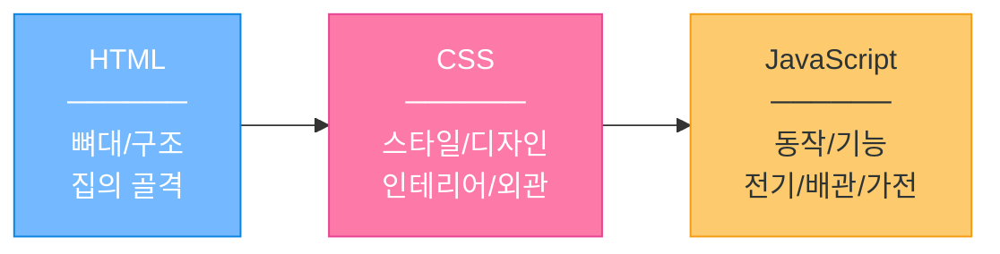
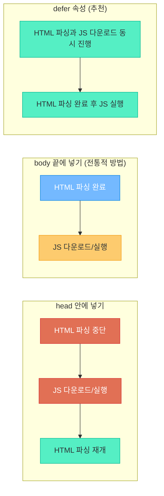
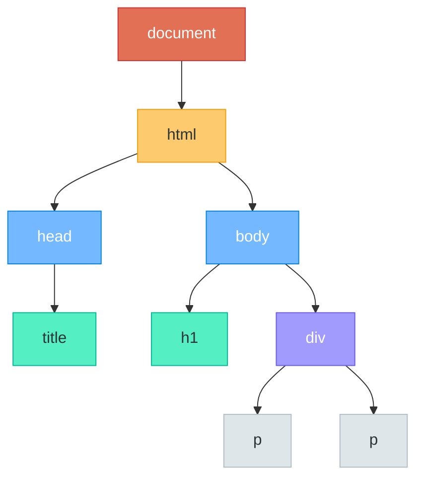
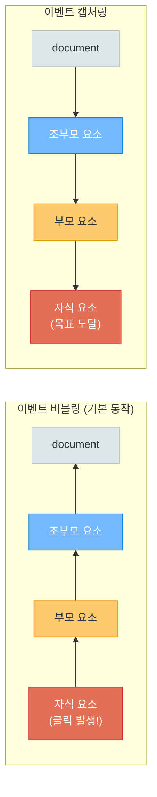
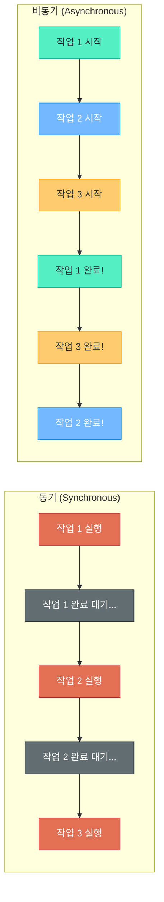
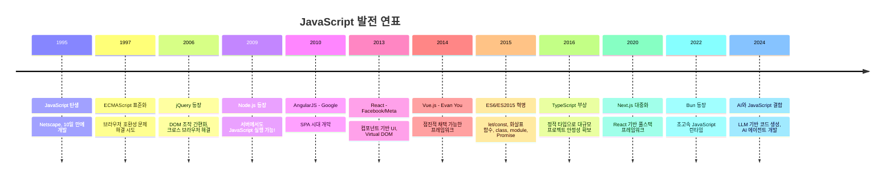
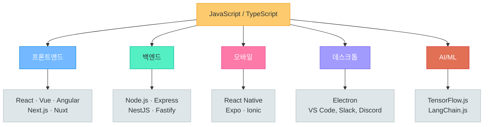
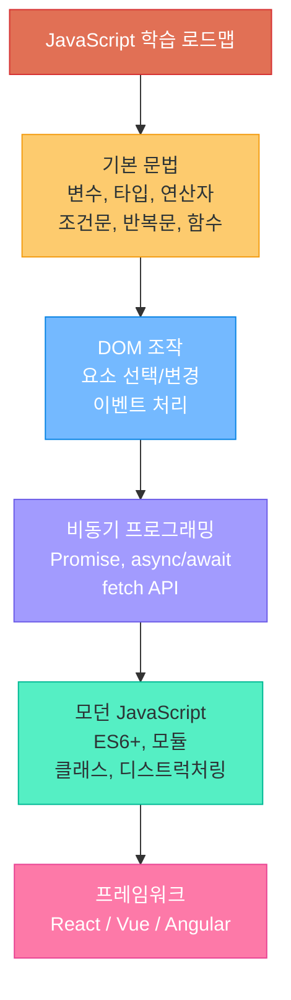

# JavaScript 기초

> 웹페이지에 생명을 불어넣는 언어 — 클릭하고, 움직이고, 변화하는 모든 것의 시작

---

## 1. JavaScript란?

### 웹의 3요소에서 JavaScript의 역할



- **HTML** = 뼈대 (구조를 정의)
- **CSS** = 옷 (시각적 스타일)
- **JavaScript** = 근육 + 두뇌 (동작과 로직)

### JavaScript의 탄생

| 항목 | 내용 |
|------|------|
| 창시자 | Brendan Eich |
| 탄생년 | 1995년 |
| 개발 기간 | **단 10일** |
| 최초 소속 | Netscape Communications |
| 원래 이름 | Mocha → LiveScript → JavaScript |

### 이름의 혼란: Java != JavaScript

> Java와 JavaScript의 관계는 **"car"와 "carpet"**의 관계와 같다.

당시 Java가 인기였기 때문에 마케팅 목적으로 이름을 "JavaScript"로 변경한 것일 뿐, 두 언어는 완전히 다른 언어이다.

### JavaScript로 할 수 있는 것들

```
- 웹페이지 동적 조작 (버튼 클릭, 애니메이션, 팝업)
- 폼 유효성 검사 (이메일 형식 확인 등)
- 서버 통신 (데이터 가져오기/보내기)
- 게임 개발 (Canvas, WebGL)
- 서버 개발 (Node.js)
- 모바일 앱 (React Native)
- 데스크톱 앱 (Electron)
- AI/ML (TensorFlow.js)
```

---

## 2. JavaScript 적용 방법

### 방법 1: 인라인 (비추천)

```html
<!-- HTML 태그 안에 직접 작성 — 유지보수 어렵고 지저분함 -->
<button onclick="alert('안녕하세요!')">클릭</button>
```

### 방법 2: 내부 스크립트

```html
<!DOCTYPE html>
<html>
<head>
    <title>내부 스크립트</title>
</head>
<body>
    <h1>내부 스크립트 예제</h1>

    <script>
        // HTML 파일 안에 <script> 태그로 작성
        console.log('안녕하세요, JavaScript!');
        alert('환영합니다!');
    </script>
</body>
</html>
```

### 방법 3: 외부 스크립트 (추천)

```html
<!-- index.html -->
<!DOCTYPE html>
<html>
<head>
    <title>외부 스크립트</title>
</head>
<body>
    <h1>외부 스크립트 예제</h1>

    <!-- 별도의 .js 파일을 불러옴 — 재사용성, 유지보수 Good -->
    <script src="app.js"></script>
</body>
</html>
```

```javascript
// app.js
console.log('외부 파일에서 실행됩니다!');
```

### script 태그의 위치와 로딩 방식



```html
<!-- 추천: defer 속성 사용 -->
<script src="app.js" defer></script>

<!-- async: 다운로드 완료 즉시 실행 (순서 보장 안됨) -->
<script src="analytics.js" async></script>
```

---

## 3. 기본 문법

### 변수 선언

```javascript
// var — 구시대 방식, 사용 지양!
var oldWay = '옛날 방식';  // 함수 스코프, 재선언 가능 (버그 유발)

// let — 변경 가능한 변수
let age = 25;
age = 26;  // OK: 값 변경 가능

// const — 변경 불가한 상수 (추천!)
const name = '김철수';
// name = '박영희';  // Error! 재할당 불가

// 규칙: 일단 const를 쓰고, 변경이 필요하면 let으로 바꾼다.
```

### 데이터 타입

```javascript
// 문자열 (String)
const greeting = '안녕하세요';
const template = `이름: ${name}, 나이: ${age}`;  // 템플릿 리터럴

// 숫자 (Number)
const integer = 42;
const decimal = 3.14;

// 불리언 (Boolean)
const isStudent = true;
const isGraduated = false;

// null과 undefined
const empty = null;        // 의도적으로 "비어있음"
let notYet;                // undefined — 아직 값을 할당하지 않음

// 배열 (Array)
const fruits = ['사과', '바나나', '딸기'];

// 객체 (Object)
const person = {
    name: '김철수',
    age: 25,
    isStudent: true
};

// typeof로 타입 확인
console.log(typeof greeting);   // "string"
console.log(typeof integer);    // "number"
console.log(typeof isStudent);  // "boolean"
console.log(typeof fruits);     // "object" (배열도 object!)
```

### 연산자

```javascript
// 산술 연산자
console.log(10 + 3);   // 13
console.log(10 - 3);   // 7
console.log(10 * 3);   // 30
console.log(10 / 3);   // 3.333...
console.log(10 % 3);   // 1 (나머지)

// 비교 연산자 — == vs === 차이가 핵심!
console.log(1 == '1');    // true  (값만 비교, 타입 무시)
console.log(1 === '1');   // false (값 + 타입 모두 비교) ← 이것을 쓰자!
console.log(1 != '1');    // false
console.log(1 !== '1');   // true  ← 이것을 쓰자!

// 논리 연산자
console.log(true && false);   // false (AND: 둘 다 true여야 true)
console.log(true || false);   // true  (OR: 하나만 true여도 true)
console.log(!true);           // false (NOT: 반전)
```

> **중요**: 항상 `===`와 `!==`를 사용하자. `==`는 예상치 못한 타입 변환이 일어나 버그를 유발한다.

### 조건문

```javascript
// if / else if / else
const score = 85;

if (score >= 90) {
    console.log('A학점');
} else if (score >= 80) {
    console.log('B학점');
} else if (score >= 70) {
    console.log('C학점');
} else {
    console.log('재수강');
}

// 삼항 연산자 (간단한 조건에 사용)
const result = score >= 60 ? '합격' : '불합격';
console.log(result);  // '합격'

// switch문 (여러 값 비교 시)
const day = '월요일';

switch (day) {
    case '월요일':
        console.log('한 주의 시작!');
        break;
    case '금요일':
        console.log('불금!');
        break;
    case '토요일':
    case '일요일':
        console.log('주말!');
        break;
    default:
        console.log('평일...');
}
```

### 반복문

```javascript
// for문 — 가장 기본적인 반복
for (let i = 0; i < 5; i++) {
    console.log(`${i}번째 반복`);
}

// while문 — 조건이 true인 동안 반복
let count = 0;
while (count < 3) {
    console.log(`카운트: ${count}`);
    count++;
}

// for...of — 배열 순회 (값을 가져옴)
const colors = ['빨강', '파랑', '초록'];
for (const color of colors) {
    console.log(color);  // '빨강', '파랑', '초록'
}

// for...in — 객체 순회 (키를 가져옴)
const user = { name: '철수', age: 25, city: '서울' };
for (const key in user) {
    console.log(`${key}: ${user[key]}`);
}

// forEach — 배열 메서드 (콜백 함수 사용)
colors.forEach(function(color, index) {
    console.log(`${index}: ${color}`);
});
```

### 함수

```javascript
// 함수 선언식
function greet(name) {
    return `안녕하세요, ${name}님!`;
}
console.log(greet('철수'));  // '안녕하세요, 철수님!'

// 화살표 함수 (ES6 — 현대적 방식)
const greetArrow = (name) => {
    return `안녕하세요, ${name}님!`;
};

// 한 줄짜리는 더 간결하게
const double = (n) => n * 2;
console.log(double(5));  // 10

// 매개변수 기본값
const introduce = (name, age = 20) => {
    return `${name}, ${age}세`;
};
console.log(introduce('영희'));       // '영희, 20세'
console.log(introduce('영희', 25));  // '영희, 25세'

// 콜백 함수 — 다른 함수에 인자로 전달되는 함수
const numbers = [1, 2, 3, 4, 5];

const doubled = numbers.map((n) => n * 2);
console.log(doubled);  // [2, 4, 6, 8, 10]

// 콜백 함수 활용 예시
function processData(data, callback) {
    const result = callback(data);
    console.log(`처리 결과: ${result}`);
}

processData(10, (x) => x * x);  // '처리 결과: 100'
```

### 배열과 객체

```javascript
// === 배열 (Array) ===
const fruits = ['사과', '바나나', '딸기', '포도'];

// 접근
console.log(fruits[0]);       // '사과'
console.log(fruits.length);   // 4

// 추가/삭제
fruits.push('수박');          // 끝에 추가
fruits.pop();                 // 끝에서 제거
fruits.unshift('메론');       // 앞에 추가

// 유용한 배열 메서드
const numbers = [1, 2, 3, 4, 5, 6, 7, 8, 9, 10];

// map: 각 요소를 변환해서 새 배열 반환
const squared = numbers.map(n => n * n);
// [1, 4, 9, 16, 25, 36, 49, 64, 81, 100]

// filter: 조건에 맞는 요소만 걸러냄
const evens = numbers.filter(n => n % 2 === 0);
// [2, 4, 6, 8, 10]

// find: 조건에 맞는 첫 번째 요소 반환
const found = numbers.find(n => n > 5);
// 6

// reduce: 배열을 하나의 값으로 축소
const sum = numbers.reduce((acc, n) => acc + n, 0);
// 55

// === 객체 (Object) ===
const student = {
    name: '김영희',
    age: 22,
    major: '컴퓨터공학',
    grades: [90, 85, 92],
    address: {
        city: '서울',
        district: '강남구'
    }
};

// 접근 방법
console.log(student.name);           // '김영희' (점 표기법)
console.log(student['major']);       // '컴퓨터공학' (대괄호 표기법)
console.log(student.address.city);   // '서울' (중첩 객체)

// 수정/추가
student.age = 23;
student.email = 'young@email.com';

// 구조 분해 할당 (Destructuring)
const { name, age, major } = student;
console.log(name);   // '김영희'
console.log(major);  // '컴퓨터공학'
```

---

## 4. DOM (Document Object Model)

### DOM이란?

HTML 문서를 **트리 구조**로 표현한 것. JavaScript는 이 트리를 통해 HTML 요소를 읽고, 수정하고, 추가하고, 삭제할 수 있다.



### DOM 요소 선택하기

```html
<div id="app">
    <h1 class="title">제목입니다</h1>
    <p class="content">첫 번째 문단</p>
    <p class="content">두 번째 문단</p>
    <button id="myBtn">클릭!</button>
</div>
```

```javascript
// getElementById — ID로 하나의 요소 선택
const app = document.getElementById('app');

// querySelector — CSS 선택자로 첫 번째 요소 선택 (추천!)
const title = document.querySelector('.title');
const btn = document.querySelector('#myBtn');

// querySelectorAll — CSS 선택자로 모든 요소 선택 (NodeList 반환)
const paragraphs = document.querySelectorAll('.content');
paragraphs.forEach(p => console.log(p.textContent));
```

### DOM 요소 내용 변경

```javascript
const title = document.querySelector('.title');

// textContent — 순수 텍스트만 변경
title.textContent = '새로운 제목';

// innerHTML — HTML 포함 가능 (주의: XSS 위험)
title.innerHTML = '<span style="color:red">빨간 제목</span>';
```

### DOM 요소 스타일 변경

```javascript
const box = document.querySelector('.box');

// 개별 스타일 변경
box.style.backgroundColor = '#3498db';
box.style.color = 'white';
box.style.padding = '20px';
box.style.borderRadius = '8px';

// 클래스 추가/제거 (추천 — CSS와 분리!)
box.classList.add('active');
box.classList.remove('hidden');
box.classList.toggle('dark-mode');  // 있으면 제거, 없으면 추가
```

### DOM 요소 추가/삭제

```javascript
// 새 요소 생성
const newItem = document.createElement('li');
newItem.textContent = '새로운 항목';
newItem.classList.add('list-item');

// 부모 요소에 추가
const list = document.querySelector('ul');
list.appendChild(newItem);

// 요소 삭제
const oldItem = document.querySelector('.old-item');
oldItem.remove();
```

---

## 5. 이벤트 처리

### 이벤트란?

사용자 또는 브라우저가 발생시키는 **행동/사건**. JavaScript는 이 이벤트를 감지하고 반응할 수 있다.

### 주요 이벤트 종류

| 이벤트 | 발생 시점 |
|--------|-----------|
| `click` | 요소를 클릭했을 때 |
| `dblclick` | 더블 클릭했을 때 |
| `input` | 입력값이 변경될 때 (실시간) |
| `change` | 입력값 변경 후 포커스를 잃을 때 |
| `submit` | 폼을 제출할 때 |
| `keydown` | 키보드를 누를 때 |
| `keyup` | 키보드를 뗄 때 |
| `mouseover` | 마우스를 올렸을 때 |
| `mouseout` | 마우스가 벗어났을 때 |
| `scroll` | 스크롤할 때 |
| `load` | 페이지 로딩 완료 시 |

### addEventListener 사용법

```javascript
// 기본 형태: element.addEventListener('이벤트명', 콜백함수)
const button = document.querySelector('#myBtn');

button.addEventListener('click', function() {
    alert('버튼이 클릭되었습니다!');
});

// 화살표 함수로 간결하게
button.addEventListener('click', () => {
    console.log('클릭!');
});
```

### event 객체 활용

```javascript
// 이벤트 핸들러는 event 객체를 자동으로 받는다
document.addEventListener('click', (event) => {
    console.log(event.target);       // 클릭된 요소
    console.log(event.type);         // 'click'
    console.log(event.clientX);      // 마우스 X 좌표
    console.log(event.clientY);      // 마우스 Y 좌표
});

// 키보드 이벤트
document.addEventListener('keydown', (event) => {
    console.log(event.key);          // 누른 키 ('Enter', 'a', 'Escape' 등)
    console.log(event.code);         // 키 코드 ('KeyA', 'Space' 등)
});

// 폼 제출 막기
const form = document.querySelector('form');
form.addEventListener('submit', (event) => {
    event.preventDefault();  // 폼 제출(페이지 새로고침)을 막는다
    console.log('폼 데이터 처리 중...');
});
```

### 이벤트 전파 (버블링과 캡처링)



```javascript
// 버블링 중단하기
child.addEventListener('click', (event) => {
    event.stopPropagation();  // 부모로 전파되지 않음
    console.log('자식만 반응!');
});
```

### 실용 예제: 버튼 클릭 시 색상 변경 + 입력값 실시간 표시

```html
<!DOCTYPE html>
<html>
<head><title>이벤트 예제</title></head>
<body>
    <h1 id="title">색상을 바꿔보세요!</h1>
    <button id="colorBtn">색상 변경</button>

    <hr>

    <input type="text" id="nameInput" placeholder="이름을 입력하세요">
    <p>입력된 이름: <span id="display">없음</span></p>

    <script>
        // 버튼 클릭 시 랜덤 색상 변경
        const title = document.querySelector('#title');
        const colorBtn = document.querySelector('#colorBtn');

        colorBtn.addEventListener('click', () => {
            const randomColor = '#' + Math.floor(Math.random() * 16777215).toString(16);
            title.style.color = randomColor;
        });

        // 입력값 실시간 표시
        const input = document.querySelector('#nameInput');
        const display = document.querySelector('#display');

        input.addEventListener('input', (event) => {
            display.textContent = event.target.value || '없음';
        });
    </script>
</body>
</html>
```

---

## 6. 비동기 프로그래밍

### 동기 vs 비동기



- **동기**: 앞의 작업이 끝나야 다음 작업 시작 (줄 서기)
- **비동기**: 작업을 시작해두고, 완료되면 알림 받기 (포장마차에서 번호표 받기)

### setTimeout / setInterval

```javascript
// setTimeout — 일정 시간 후 한 번 실행
console.log('1. 시작');

setTimeout(() => {
    console.log('2. 2초 후 실행됨');
}, 2000);  // 2000ms = 2초

console.log('3. setTimeout 등록 후 바로 실행');
// 출력 순서: 1 → 3 → 2 (비동기!)

// setInterval — 일정 간격으로 반복 실행
const timer = setInterval(() => {
    console.log('1초마다 실행');
}, 1000);

// 5초 후 반복 중단
setTimeout(() => {
    clearInterval(timer);
    console.log('타이머 중단!');
}, 5000);
```

### 콜백 지옥 (Callback Hell)

```javascript
// 중첩된 비동기 작업 — 코드가 오른쪽으로 계속 밀림
getUser(userId, function(user) {
    getOrders(user.id, function(orders) {
        getOrderDetail(orders[0].id, function(detail) {
            getProduct(detail.productId, function(product) {
                console.log(product.name);
                // 계속 중첩... 읽기 어렵고 유지보수 불가!
            });
        });
    });
});
```

### Promise — 콜백 지옥의 해결사

```javascript
// Promise: 미래에 완료될 작업을 나타내는 객체
const myPromise = new Promise((resolve, reject) => {
    const success = true;

    if (success) {
        resolve('성공했습니다!');  // 이행(fulfilled)
    } else {
        reject('실패했습니다!');   // 거부(rejected)
    }
});

// then/catch로 결과 처리
myPromise
    .then(result => console.log(result))   // '성공했습니다!'
    .catch(error => console.log(error));

// Promise 체이닝 — 콜백 지옥 해결!
getUser(userId)
    .then(user => getOrders(user.id))
    .then(orders => getOrderDetail(orders[0].id))
    .then(detail => getProduct(detail.productId))
    .then(product => console.log(product.name))
    .catch(error => console.log('에러 발생:', error));
```

### async/await — 가장 현대적인 방식

```javascript
// async/await — Promise를 동기 코드처럼 깔끔하게 작성
async function getUserProduct(userId) {
    try {
        const user = await getUser(userId);
        const orders = await getOrders(user.id);
        const detail = await getOrderDetail(orders[0].id);
        const product = await getProduct(detail.productId);

        console.log(product.name);
        return product;
    } catch (error) {
        console.log('에러 발생:', error);
    }
}

getUserProduct(123);
```

### fetch API로 데이터 가져오기

```javascript
// fetch — 서버에서 데이터를 가져오는 내장 함수
async function getWeather(city) {
    try {
        const response = await fetch(`https://api.example.com/weather?city=${city}`);

        if (!response.ok) {
            throw new Error(`HTTP 에러: ${response.status}`);
        }

        const data = await response.json();  // JSON 파싱
        console.log(`${city}의 온도: ${data.temperature}도`);
        return data;
    } catch (error) {
        console.error('데이터 가져오기 실패:', error);
    }
}

getWeather('서울');

// POST 요청 (데이터 전송)
async function createUser(userData) {
    const response = await fetch('https://api.example.com/users', {
        method: 'POST',
        headers: {
            'Content-Type': 'application/json'
        },
        body: JSON.stringify(userData)
    });

    const result = await response.json();
    return result;
}

createUser({ name: '김철수', email: 'cs@email.com' });
```

---

## 7. JavaScript 발전사



### 현재 JavaScript 생태계



> JavaScript는 더 이상 "브라우저 전용 언어"가 아니다. 프론트엔드, 백엔드, 모바일, 데스크톱, AI까지 모든 영역에서 사용된다.

---

## 8. 실습: 인터랙티브 할일 목록 (Todo List)

아래 코드를 하나의 HTML 파일로 저장하고 브라우저에서 열어보자.

```html
<!DOCTYPE html>
<html lang="ko">
<head>
    <meta charset="UTF-8">
    <meta name="viewport" content="width=device-width, initial-scale=1.0">
    <title>할일 목록 (Todo List)</title>
    <style>
        * {
            margin: 0;
            padding: 0;
            box-sizing: border-box;
        }

        body {
            font-family: 'Segoe UI', sans-serif;
            background: #f8f9fa;
            display: flex;
            justify-content: center;
            padding: 40px 20px;
        }

        .container {
            background: white;
            border-radius: 12px;
            padding: 30px;
            width: 100%;
            max-width: 500px;
            box-shadow: 0 4px 20px rgba(0, 0, 0, 0.1);
        }

        h1 {
            text-align: center;
            color: #2d3436;
            margin-bottom: 20px;
        }

        .input-area {
            display: flex;
            gap: 10px;
            margin-bottom: 20px;
        }

        .input-area input {
            flex: 1;
            padding: 12px 16px;
            border: 2px solid #dfe6e9;
            border-radius: 8px;
            font-size: 16px;
            outline: none;
            transition: border-color 0.3s;
        }

        .input-area input:focus {
            border-color: #0984e3;
        }

        .input-area button {
            padding: 12px 20px;
            background: #0984e3;
            color: white;
            border: none;
            border-radius: 8px;
            font-size: 16px;
            cursor: pointer;
            transition: background 0.3s;
        }

        .input-area button:hover {
            background: #0652DD;
        }

        .stats {
            text-align: center;
            color: #636e72;
            margin-bottom: 15px;
            font-size: 14px;
        }

        .todo-list {
            list-style: none;
        }

        .todo-item {
            display: flex;
            align-items: center;
            padding: 12px 16px;
            border: 1px solid #dfe6e9;
            border-radius: 8px;
            margin-bottom: 8px;
            transition: all 0.3s;
        }

        .todo-item:hover {
            border-color: #74b9ff;
        }

        .todo-item.done {
            background: #f1f2f6;
            text-decoration: line-through;
            color: #b2bec3;
        }

        .todo-item input[type="checkbox"] {
            margin-right: 12px;
            width: 18px;
            height: 18px;
            cursor: pointer;
        }

        .todo-item span {
            flex: 1;
            font-size: 16px;
        }

        .todo-item .delete-btn {
            background: #ff7675;
            color: white;
            border: none;
            border-radius: 6px;
            padding: 6px 12px;
            cursor: pointer;
            font-size: 12px;
            opacity: 0;
            transition: opacity 0.3s;
        }

        .todo-item:hover .delete-btn {
            opacity: 1;
        }

        .delete-btn:hover {
            background: #d63031;
        }

        .empty-message {
            text-align: center;
            color: #b2bec3;
            padding: 40px;
            font-size: 16px;
        }
    </style>
</head>
<body>
    <div class="container">
        <h1>My Todo List</h1>

        <div class="input-area">
            <input type="text" id="todoInput" placeholder="할 일을 입력하세요...">
            <button id="addBtn">추가</button>
        </div>

        <div class="stats" id="stats">총 0개 | 완료 0개 | 남은 할일 0개</div>

        <ul class="todo-list" id="todoList">
            <li class="empty-message" id="emptyMsg">아직 할 일이 없습니다. 위에 입력해보세요!</li>
        </ul>
    </div>

    <script>
        // === 할일 목록 데이터 ===
        let todos = [];
        let nextId = 1;

        // === DOM 요소 선택 ===
        const todoInput = document.querySelector('#todoInput');
        const addBtn = document.querySelector('#addBtn');
        const todoList = document.querySelector('#todoList');
        const stats = document.querySelector('#stats');
        const emptyMsg = document.querySelector('#emptyMsg');

        // === 할일 추가 함수 ===
        function addTodo() {
            const text = todoInput.value.trim();

            // 빈 입력 방지
            if (text === '') {
                todoInput.focus();
                return;
            }

            // 데이터에 추가
            const todo = {
                id: nextId++,
                text: text,
                done: false
            };
            todos.push(todo);

            // 화면에 렌더링
            renderTodos();

            // 입력창 초기화
            todoInput.value = '';
            todoInput.focus();
        }

        // === 할일 완료/취소 토글 ===
        function toggleTodo(id) {
            const todo = todos.find(t => t.id === id);
            if (todo) {
                todo.done = !todo.done;
                renderTodos();
            }
        }

        // === 할일 삭제 ===
        function deleteTodo(id) {
            todos = todos.filter(t => t.id !== id);
            renderTodos();
        }

        // === 화면 렌더링 함수 ===
        function renderTodos() {
            // 비어있으면 빈 메시지 표시
            if (todos.length === 0) {
                todoList.innerHTML = '<li class="empty-message">아직 할 일이 없습니다. 위에 입력해보세요!</li>';
            } else {
                todoList.innerHTML = todos.map(todo => `
                    <li class="todo-item ${todo.done ? 'done' : ''}">
                        <input type="checkbox"
                               ${todo.done ? 'checked' : ''}
                               onchange="toggleTodo(${todo.id})">
                        <span>${todo.text}</span>
                        <button class="delete-btn" onclick="deleteTodo(${todo.id})">삭제</button>
                    </li>
                `).join('');
            }

            // 통계 업데이트
            const total = todos.length;
            const doneCount = todos.filter(t => t.done).length;
            const remaining = total - doneCount;
            stats.textContent = `총 ${total}개 | 완료 ${doneCount}개 | 남은 할일 ${remaining}개`;
        }

        // === 이벤트 등록 ===
        // 추가 버튼 클릭
        addBtn.addEventListener('click', addTodo);

        // Enter 키 입력
        todoInput.addEventListener('keydown', (event) => {
            if (event.key === 'Enter') {
                addTodo();
            }
        });
    </script>
</body>
</html>
```

### 코드 핵심 분석

위 실습에서 사용된 JavaScript 핵심 개념 정리:

| 개념 | 사용된 곳 |
|------|-----------|
| `const`/`let` | 변수 선언 |
| 배열 (`[]`, `push`, `filter`, `find`, `map`) | 할일 데이터 관리 |
| 객체 (`{}`) | 개별 할일 항목 표현 |
| 함수 | `addTodo()`, `toggleTodo()`, `deleteTodo()`, `renderTodos()` |
| DOM 선택 | `querySelector()` |
| DOM 조작 | `innerHTML`, `textContent` |
| 이벤트 | `addEventListener('click')`, `addEventListener('keydown')` |
| 템플릿 리터럴 | 백틱(`` ` ``)으로 HTML 동적 생성 |
| 조건문 | 빈 입력 방지, 삼항 연산자로 클래스 토글 |
| 화살표 함수 | 콜백 함수 간결하게 작성 |

---

## 정리



> **다음 단계**: JavaScript의 기초를 익혔다면, React나 Vue 같은 프레임워크로 더 복잡하고 체계적인 웹 애플리케이션을 만들어볼 수 있다. 또한 Node.js를 배우면 서버 개발까지 JavaScript 하나로 풀스택 개발이 가능해진다.
