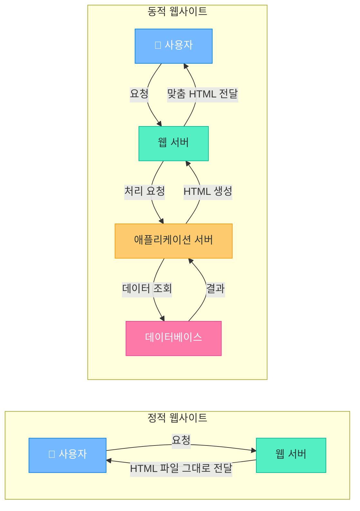
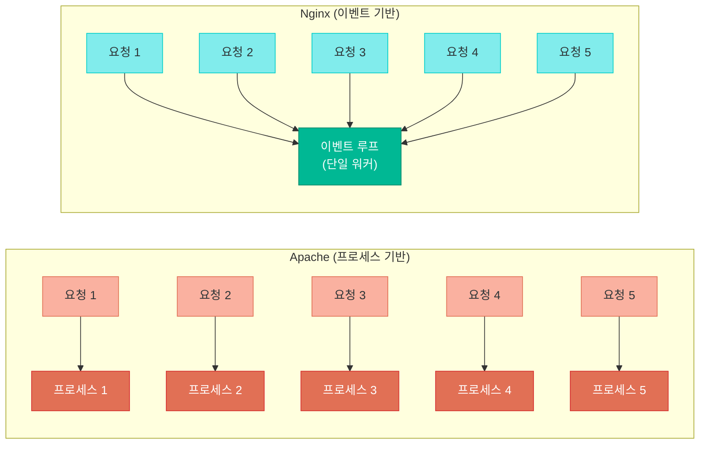
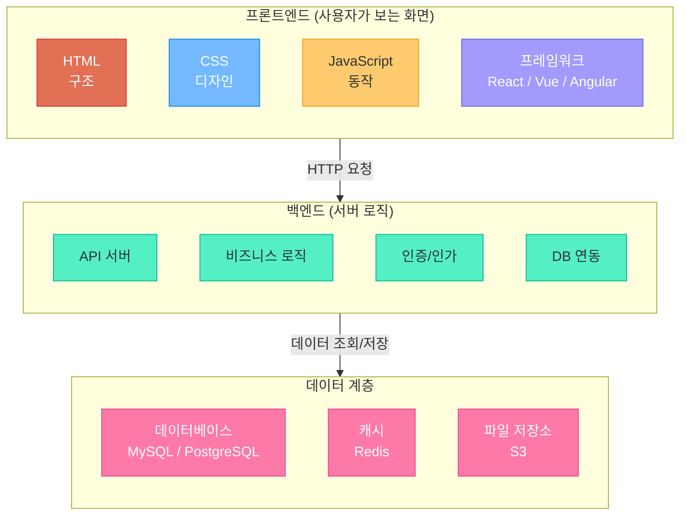
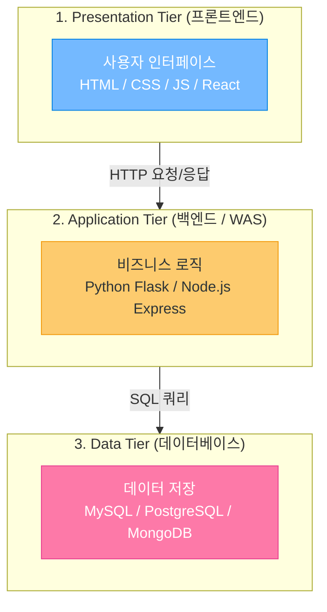
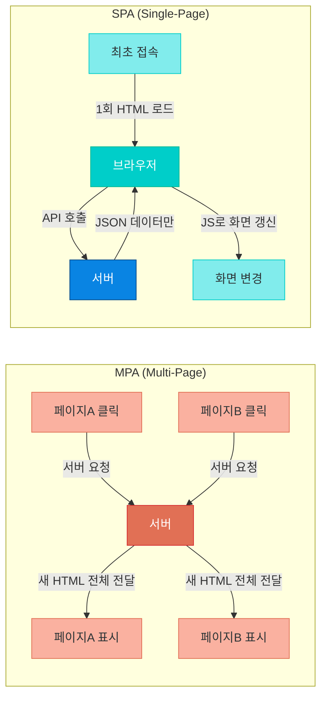
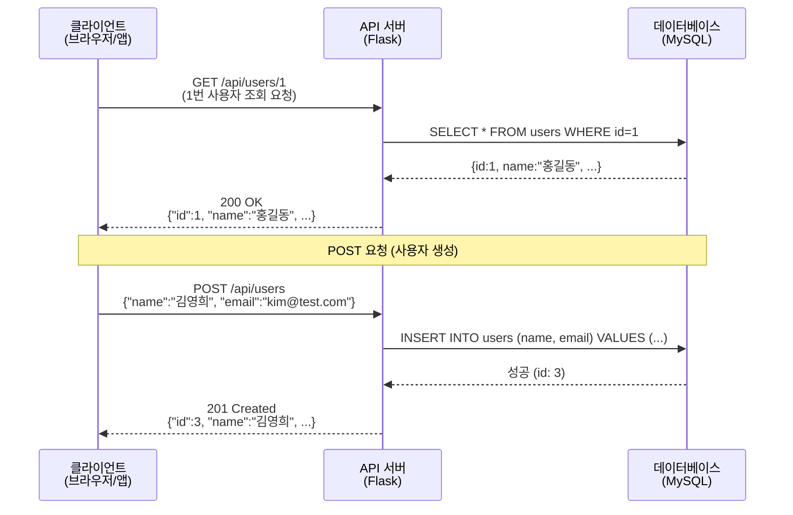
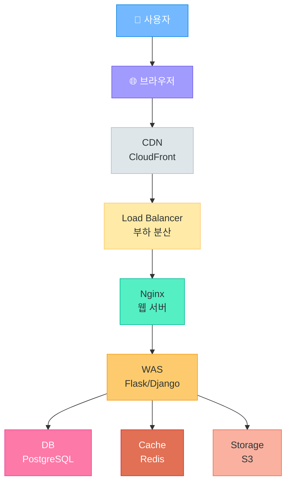
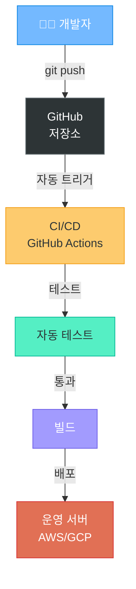
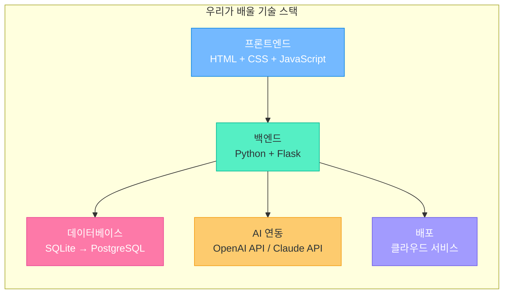

# 웹 서버와 웹 아키텍처

> 클라이언트의 요청을 받아 응답하는 웹 서버, 그리고 현대 웹 서비스를 구성하는 아키텍처 패턴

---

## 1. 정적 웹사이트 vs 동적 웹사이트

### 정적(Static) 웹사이트

- HTML, CSS, JS 파일을 **그대로** 클라이언트에 전달
- 모든 사용자에게 **동일한 내용**을 보여줌
- 서버 부하가 적고, 속도가 빠름
- 예시: 회사 소개 페이지, 포트폴리오, 블로그(Jekyll, Hugo, Gatsby)

### 동적(Dynamic) 웹사이트

- 서버에서 **요청마다 다른 내용**을 생성하여 응답
- 데이터베이스와 연동하여 사용자별 맞춤 콘텐츠 제공
- 예시: 쇼핑몰(쿠팡), SNS(인스타그램), 검색엔진(구글), 넷플릭스

### 동작 비교



### 비교 표

| 구분 | 정적 웹사이트 | 동적 웹사이트 |
|------|--------------|--------------|
| **속도** | 매우 빠름 (파일 그대로 전달) | 상대적으로 느림 (서버 처리 필요) |
| **비용** | 저렴 (CDN만으로 호스팅 가능) | 높음 (서버, DB 운영 필요) |
| **보안** | 높음 (공격 표면 적음) | 취약점 관리 필요 (SQL Injection 등) |
| **유연성** | 낮음 (내용 변경 시 파일 수정) | 높음 (DB 데이터만 바꾸면 됨) |
| **개인화** | 불가능 | 사용자별 맞춤 가능 |
| **예시** | GitHub Pages, 회사 소개 | 쿠팡, 네이버, 유튜브 |

---

## 2. 웹 서버란?

### 정의

웹 서버는 **클라이언트(브라우저)의 HTTP 요청을 받아 적절한 응답을 반환하는 소프트웨어**입니다.

### 주요 역할

| 역할 | 설명 |
|------|------|
| **정적 파일 서빙** | HTML, CSS, JS, 이미지 파일을 클라이언트에 전달 |
| **Reverse Proxy** | 클라이언트 요청을 뒤에 있는 애플리케이션 서버로 전달 |
| **Load Balancing** | 여러 서버에 요청을 분산하여 부하 분산 |
| **SSL/TLS 처리** | HTTPS 암호화 통신 처리 |
| **캐싱** | 자주 요청되는 콘텐츠를 메모리에 저장하여 빠르게 응답 |

### 웹 서버 vs WAS (Web Application Server)

| 구분 | 웹 서버 | WAS (애플리케이션 서버) |
|------|---------|----------------------|
| **역할** | 정적 콘텐츠 전달, Proxy | 동적 콘텐츠 생성, 비즈니스 로직 |
| **예시** | Nginx, Apache | Flask, Django, Express, Spring |
| **처리** | 파일 읽어서 전달 | 코드 실행, DB 연동 |
| **관계** | 앞단에서 요청 수신 | 뒷단에서 로직 처리 |

> 실무에서는 **Nginx(웹 서버)** 뒤에 **Flask/Django(WAS)**를 배치하는 구조가 일반적입니다.

---

## 3. Apache HTTP Server

### 개요

- **1995년** 등장한 세계 최초의 본격적인 오픈소스 웹 서버
- 이름 유래: "A Patchy Server" (패치들의 모음이라는 의미)
- Apache Software Foundation에서 관리
- 한때 전 세계 웹 서버의 70% 이상을 차지

### 처리 방식: 프로세스/스레드 기반

```
요청 1 → [프로세스 1] → 응답
요청 2 → [프로세스 2] → 응답
요청 3 → [프로세스 3] → 응답
...
요청 N → [프로세스 N] → 응답 (리소스 한계 도달!)
```

- **요청마다 프로세스 또는 스레드를 생성**하여 처리
- MPM(Multi-Processing Module) 방식: prefork, worker, event
- 동시 접속이 많으면 메모리와 CPU 사용량이 급증

### 주요 특징

| 특징 | 설명 |
|------|------|
| **.htaccess** | 디렉토리별 설정 가능 (비개발자도 쉽게 설정) |
| **모듈 시스템** | mod_rewrite(URL 재작성), mod_ssl(HTTPS), mod_php 등 |
| **가상 호스트** | 하나의 서버에서 여러 도메인 운영 가능 |
| **풍부한 문서** | 30년 역사의 커뮤니티, 대부분의 문제에 해결책 존재 |

### 장단점

- **장점**: 유연한 설정, 풍부한 모듈, .htaccess로 디렉토리별 제어
- **단점**: 동시 접속 1만 이상 시 성능 저하 (**C10K 문제**), 메모리 사용량 높음

---

## 4. Nginx

### 개요

- **2004년** 등장 (Igor Sysoev, 러시아 개발자)
- **C10K 문제 해결**을 목적으로 처음부터 설계됨
- 이벤트 기반(Event-driven) 비동기 처리 아키텍처
- 현재 전 세계에서 가장 많이 사용되는 웹 서버

> **C10K 문제란?** 하나의 서버에서 동시에 10,000개의 클라이언트 연결을 처리하는 것이 어려운 문제. Apache의 프로세스 기반 모델에서는 각 연결마다 프로세스가 필요하여 리소스가 폭발적으로 증가했습니다.

### 처리 방식: 이벤트 기반 비동기

```
요청 1 ──┐
요청 2 ──┤
요청 3 ──┼──→ [이벤트 루프 (단일 프로세스)] ──→ 응답들
...      │
요청 N ──┘
```

- **하나의 프로세스(워커)**가 수천 개의 요청을 동시에 처리
- Non-blocking I/O로 대기 없이 다음 요청 처리
- 적은 메모리로 높은 동시 처리 성능

### 주요 용도

| 용도 | 설명 |
|------|------|
| **정적 파일 서빙** | HTML, CSS, JS, 이미지를 매우 빠르게 전달 |
| **Reverse Proxy** | Flask, Django, Node.js 앞에서 요청 중계 |
| **Load Balancer** | 여러 백엔드 서버에 트래픽 분산 |
| **SSL Termination** | HTTPS 처리를 Nginx에서 담당 |
| **캐싱 서버** | 응답을 캐싱하여 백엔드 부하 감소 |

### 장단점

- **장점**: 높은 동시 처리 성능, 적은 메모리 사용, Reverse Proxy에 최적화
- **단점**: .htaccess 없음(설정 변경 시 서버 reload 필요), 동적 모듈 로딩 제한적

---

## 5. Apache vs Nginx 비교

### 처리 방식 비교



### 상세 비교 표

| 구분 | Apache | Nginx |
|------|--------|-------|
| **등장 시기** | 1995년 | 2004년 |
| **처리 방식** | 프로세스/스레드 기반 | 이벤트 기반 비동기 |
| **동시 접속** | ~10,000 (제한적) | 100,000+ (강력) |
| **메모리 사용** | 높음 (연결당 프로세스) | 낮음 (단일 이벤트 루프) |
| **정적 파일** | 보통 | 매우 빠름 |
| **동적 처리** | mod_php 등 직접 처리 | Proxy로 위임 |
| **설정 변경** | .htaccess (무중단) | 설정 파일 수정 후 reload |
| **시장 점유율** | ~20% (감소 추세) | ~34% (1위, 2024 기준) |
| **사용 기업** | 레거시 시스템 | Netflix, Dropbox, WordPress.com |

### 현재 트렌드 (2024 기준)

```
1위: Nginx       (~34%)  - 대규모 서비스의 표준
2위: Apache      (~20%)  - 레거시, 공유 호스팅
3위: Cloudflare  (~20%)  - CDN + 웹 서버 통합, 빠른 성장
4위: LiteSpeed   (~13%)  - WordPress 최적화
```

> Netflix는 수억 명의 동시 접속자를 Nginx로 처리합니다. 국내에서도 카카오, 네이버, 쿠팡 등 대부분의 대형 서비스가 Nginx를 사용합니다.

---

## 6. 웹 애플리케이션 아키텍처

### 프론트엔드 vs 백엔드



| 구분 | 프론트엔드 | 백엔드 |
|------|-----------|--------|
| **역할** | 사용자 인터페이스(UI) | 서버 로직, 데이터 처리 |
| **언어** | HTML, CSS, JavaScript | Python, Java, Node.js, Go |
| **프레임워크** | React, Vue, Angular | Flask, Django, Spring, Express |
| **실행 위치** | 브라우저 (클라이언트) | 서버 |
| **관심사** | 화면, 사용성, 반응속도 | 데이터, 보안, 성능 |

### 3-Tier 아키텍처

현대 웹 서비스의 가장 기본적인 구조입니다.



| Tier | 이름 | 역할 | 기술 예시 |
|------|------|------|----------|
| 1 | Presentation | 사용자와 상호작용 | React, Vue, HTML/CSS |
| 2 | Application | 비즈니스 로직 처리 | Flask, Django, Express |
| 3 | Data | 데이터 저장/관리 | MySQL, PostgreSQL, MongoDB |

### MPA vs SPA

#### MPA (Multi-Page Application)

- 페이지 이동마다 **서버에서 새로운 HTML**을 받아옴
- 전체 페이지가 새로고침됨
- 예시: 네이버 카페, 위키피디아, 전통 웹사이트

#### SPA (Single-Page Application)

- **최초 1회만 HTML** 로드, 이후 **JavaScript**로 화면을 동적 갱신
- 페이지 전환이 빠르고 앱처럼 동작
- 예시: Gmail, YouTube, 카카오맵, Netflix



| 구분 | MPA | SPA |
|------|-----|-----|
| **페이지 전환** | 전체 새로고침 | JS로 부분 갱신 |
| **초기 로딩** | 빠름 (HTML만 받음) | 느림 (JS 번들 다운로드) |
| **이후 속도** | 느림 (매번 전체 로드) | 빠름 (데이터만 교환) |
| **SEO** | 유리 (완성된 HTML) | 불리 (JS 렌더링 필요) |
| **개발 복잡도** | 낮음 | 높음 |
| **사용자 경험** | 웹사이트 느낌 | 앱 느낌 |
| **프레임워크** | JSP, Django Template | React, Vue, Angular |

---

## 7. API와 REST

### API란?

**API (Application Programming Interface)** = 프로그램과 프로그램이 소통하는 **약속된 창구**

```
비유: 식당에서 주방과 손님 사이의 "메뉴판 + 주문 시스템"이 API입니다.
- 손님(클라이언트): "짜장면 하나 주세요" (요청)
- 주방(서버): 짜장면을 만들어서 전달 (응답)
- 메뉴판(API): 어떤 요청을 할 수 있는지 정의
```

### REST란?

**REST (Representational State Transfer)** = API를 설계하는 **규칙/스타일**

핵심 원칙:
- **URL은 자원(Resource)을 나타낸다** → `/users`, `/products`
- **HTTP 메서드로 행위를 구분한다** → GET(조회), POST(생성), PUT(수정), DELETE(삭제)
- **상태를 저장하지 않는다 (Stateless)** → 각 요청은 독립적

### RESTful API 설계 예시

| HTTP 메서드 | URL | 동작 | 설명 |
|------------|-----|------|------|
| GET | `/api/users` | 목록 조회 | 모든 사용자 조회 |
| POST | `/api/users` | 생성 | 새 사용자 생성 |
| GET | `/api/users/1` | 단건 조회 | 1번 사용자 조회 |
| PUT | `/api/users/1` | 수정 | 1번 사용자 정보 수정 |
| DELETE | `/api/users/1` | 삭제 | 1번 사용자 삭제 |

### JSON 응답 예시

```json
// GET /api/users/1 응답
{
  "id": 1,
  "name": "홍길동",
  "email": "hong@example.com",
  "created_at": "2024-01-15T09:30:00Z"
}

// GET /api/users 응답
{
  "users": [
    {"id": 1, "name": "홍길동", "email": "hong@example.com"},
    {"id": 2, "name": "김철수", "email": "kim@example.com"}
  ],
  "total": 2
}
```

### API 호출 흐름



> YouTube 앱도 서버에서 영상 데이터를 **REST API**로 받아옵니다. `GET /api/videos/trending` 같은 요청으로 인기 영상 목록을 JSON으로 받아 화면에 표시합니다.

---

## 8. 현대 웹 서비스 전체 구조

### Full Architecture



### 각 구성요소 설명

| 구성요소 | 역할 | 실제 서비스 예시 |
|---------|------|----------------|
| **CDN** | 전 세계에 콘텐츠 복제, 가장 가까운 서버에서 전달 | CloudFront, Cloudflare |
| **Load Balancer** | 여러 서버에 요청을 균등 분배 | AWS ALB, Nginx |
| **Web Server** | 정적 파일 서빙, Reverse Proxy | Nginx, Apache |
| **WAS** | 비즈니스 로직 실행, API 처리 | Flask, Django, Express |
| **Database** | 데이터 영구 저장 | PostgreSQL, MySQL, MongoDB |
| **Cache** | 자주 쓰는 데이터를 메모리에 저장 (빠른 응답) | Redis, Memcached |
| **Storage** | 파일(이미지, 동영상) 저장 | AWS S3, GCS |

### 실제 서비스 구조 예시: Netflix

```
사용자 → Netflix 앱
       → CDN (전 세계 수천 대의 서버에 영상 캐싱)
       → API Gateway (요청 라우팅)
       → 마이크로서비스 (추천, 검색, 결제, 재생 등 수백 개)
       → 데이터베이스 (사용자 정보, 시청 기록)
       → AWS S3 (원본 영상 저장)
```

> Netflix는 하루 수억 건의 API 호출을 처리하며, 전 세계 인터넷 트래픽의 약 15%를 차지합니다.

---

## 9. 배포 흐름

### 전통적 배포 방식

```
개발자 PC → FTP 업로드 → 운영 서버
```

- 수동으로 파일을 서버에 업로드
- 실수로 잘못된 파일 배포 위험
- 롤백(이전 버전 복구)이 어려움

### 현대적 배포 방식: CI/CD



### CI/CD란?

| 용어 | 의미 | 설명 |
|------|------|------|
| **CI** | Continuous Integration | 코드 변경 시 자동으로 테스트 |
| **CD** | Continuous Deployment | 테스트 통과 시 자동으로 배포 |

### 배포 방식 비교

| 방식 | 도구 | 특징 | 적합한 경우 |
|------|------|------|-----------|
| **전통 방식** | FTP, SCP | 수동 업로드 | 소규모, 단순 사이트 |
| **클라우드** | AWS, GCP, Azure | 유연한 인프라, 오토스케일링 | 중/대규모 서비스 |
| **컨테이너** | Docker, Kubernetes | 환경 일관성, 확장 용이 | 마이크로서비스 |
| **간편 배포** | Vercel, Netlify, Railway | Git 연동 자동 배포 | 스타트업, 프로토타입 |

### 실무 배포 파이프라인 예시

```
1. 개발자가 feature 브랜치에서 작업
2. Pull Request 생성 → 코드 리뷰
3. PR 머지 → main 브랜치 업데이트
4. GitHub Actions 자동 실행:
   - 테스트 실행 (pytest)
   - Docker 이미지 빌드
   - AWS ECR에 이미지 푸시
   - ECS/EKS에 새 버전 배포
5. 헬스체크 통과 → 배포 완료
6. 문제 발생 시 → 자동 롤백
```

---

## 10. 다음 단계 미리보기

### 이 과정에서 만들게 될 것

이 교육 과정에서는 **Python + Flask**를 사용하여 백엔드 서버를 구축합니다.



### 앞으로의 학습 로드맵

| 순서 | 내용 | 핵심 기술 |
|------|------|----------|
| 1 | Python 기초 + 웹 개발 | Flask, Jinja2, REST API |
| 2 | 데이터베이스 | SQL, SQLAlchemy ORM |
| 3 | 생성형 AI 연동 | OpenAI API, 프롬프트 엔지니어링 |
| 4 | 프론트엔드 연동 | Fetch API, JSON 통신 |
| 5 | 배포 | Docker, 클라우드 |
| 6 | 팀 프로젝트 | 풀스택 AI 서비스 완성 |

---

## 핵심 요약

```
1. 정적 vs 동적: 파일 그대로 전달 vs 서버에서 생성
2. 웹 서버: HTTP 요청을 받아 응답 (Nginx, Apache)
3. Apache: 프로세스 기반, 유연한 설정, 레거시
4. Nginx: 이벤트 기반, 고성능, 현재 1위
5. 3-Tier: 프론트엔드 → 백엔드 → 데이터베이스
6. MPA vs SPA: 전체 새로고침 vs JS로 부분 갱신
7. REST API: URL = 자원, HTTP 메서드 = 행위
8. 현대 구조: CDN → LB → 웹서버 → WAS → DB
9. 배포: Git → CI/CD → 자동 배포가 표준
```

---

> **다음 강의**: Python 기초와 Flask 웹 개발로 직접 웹 서버를 만들어봅니다!
