# WAS (Web Application Server) 심화

> 웹 서비스가 동작하려면 단순히 HTML 파일을 전달하는 것만으로는 부족합니다.
> 사용자 로그인, 주문 처리, 데이터 조회 등 **동적인 비즈니스 로직**을 처리하는 핵심 엔진이 바로 **WAS**입니다.

---

## 1. 웹 서버 vs WAS 차이

### 웹 서버 (Web Server)

웹 서버는 **정적 파일**을 클라이언트에게 전달하는 역할을 합니다.

- HTML, CSS, JavaScript 파일 전송
- 이미지, 동영상 등 미디어 파일 서빙
- 대표 제품: **Apache HTTP Server**, **Nginx**
- 이미 만들어져 있는 파일을 "그대로" 전달

### WAS (Web Application Server)

WAS는 **동적 콘텐츠**를 생성하고 비즈니스 로직을 처리합니다.

- 사용자 요청에 따라 매번 다른 결과를 생성
- 데이터베이스와 연동하여 데이터 처리
- 인증/인가, 트랜잭션 관리 등 핵심 로직 수행
- 대표 제품: **Tomcat**, **Gunicorn**, **uWSGI**, **Uvicorn**

### 구조 비교 다이어그램

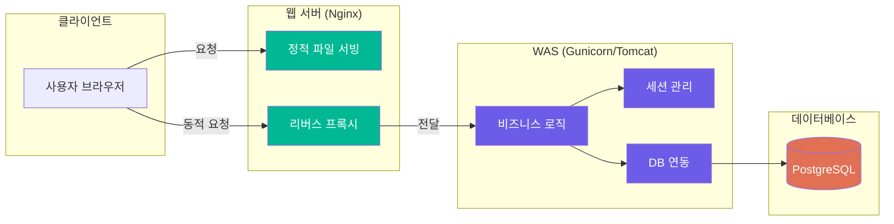

### 비유로 이해하기

> **웹 서버 = 은행의 접수 창구**
> - 단순한 안내 자료(팸플릿)는 바로 전달
> - 복잡한 업무는 뒤쪽 부서로 연결
>
> **WAS = 실제 업무 처리 부서**
> - 대출 심사, 계좌 개설 등 실제 업무 수행
> - 고객 정보 조회, 금액 계산 등 동적 처리

### 왜 웹 서버와 WAS를 분리하는가?

| 이유 | 설명 |
|------|------|
| **역할 분담** | 정적/동적 처리를 나눠 각자 최적화 가능 |
| **보안** | WAS를 외부에 직접 노출하지 않아 공격 표면 축소 |
| **성능** | 정적 파일은 웹 서버가 빠르게 처리, WAS는 로직에 집중 |
| **확장성** | WAS만 여러 대로 늘리는 수평 확장 가능 |
| **안정성** | WAS 장애 시에도 웹 서버에서 에러 페이지 제공 가능 |

---

## 2. 주요 WAS 제품

### Java 계열

Java 생태계는 WAS의 역사가 가장 깊고 제품이 다양합니다.

| 제품 | 개발사 | 라이선스 | 특징 |
|------|--------|----------|------|
| **Apache Tomcat** | Apache Foundation | 오픈소스 | 가장 많이 사용, Servlet/JSP 컨테이너 |
| **WildFly** | Red Hat | 오픈소스 | 구 JBoss, Java EE 완전 지원 |
| **WebLogic** | Oracle | 상용 | 대규모 엔터프라이즈, 고가 |
| **WebSphere** | IBM | 상용 | 금융/보험 업계에서 많이 사용 |
| **JEUS** | TmaxSoft | 상용 | 한국 국산 WAS, 공공기관 필수 |

> **참고**: 한국 공공기관에서는 국산 소프트웨어 사용을 권장하기 때문에 **JEUS**가 많이 사용됩니다.
> 정부 프로젝트에서 "전자정부 프레임워크 + JEUS + Tibero(DB)" 조합을 자주 볼 수 있습니다.

### Python 계열

Python 웹 개발에서 WAS의 역할을 하는 것이 **WSGI/ASGI 서버**입니다.

#### WSGI vs ASGI 차이

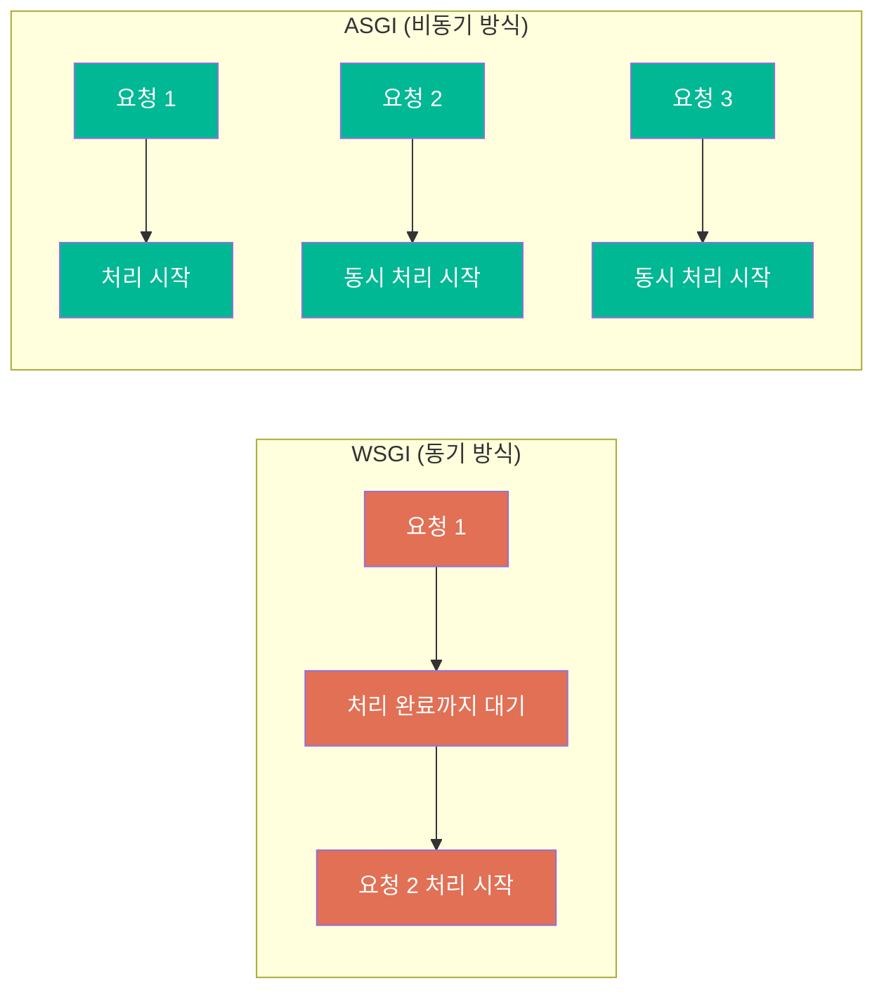

| 구분 | WSGI | ASGI |
|------|------|------|
| 처리 방식 | 동기 (Synchronous) | 비동기 (Asynchronous) |
| 동시 처리 | 요청당 1스레드/프로세스 | 이벤트 루프 기반 동시 처리 |
| 프레임워크 | Django, Flask | FastAPI, Starlette |
| WebSocket | 지원 안 됨 | 지원 |
| 적합한 용도 | 전통적 웹 앱 | 실시간 앱, AI 서비스, 채팅 |

**Python 계열 WAS 비교:**

| 제품 | 인터페이스 | 특징 |
|------|-----------|------|
| **Gunicorn** | WSGI | 설정 간단, Django/Flask에 주로 사용 |
| **uWSGI** | WSGI | 고성능, 설정 복잡, 다양한 기능 |
| **Uvicorn** | ASGI | 비동기 지원, FastAPI 공식 권장 |
| **Hypercorn** | ASGI | HTTP/2 지원, Quart 프레임워크와 사용 |

### Node.js 계열

Node.js는 자체적으로 HTTP 서버를 내장하고 있어 **별도 WAS 없이도** 동작합니다.

- **Node.js 자체**: 이벤트 루프 기반 비동기 처리, 단일 스레드
- **PM2**: 프로세스 매니저로, Node.js 앱의 클러스터 모드, 자동 재시작, 로그 관리 제공
- **Express.js / Fastify**: 웹 프레임워크이면서 서버 역할 동시 수행

### 전체 비교 표

| 제품 | 언어 | 라이선스 | 특징 | 주요 사용처 |
|------|------|----------|------|------------|
| Tomcat | Java | 오픈소스 | Servlet 컨테이너, 안정적 | 금융, 공공 |
| JEUS | Java | 상용 | 국산, 기술 지원 우수 | 한국 공공기관 |
| Gunicorn | Python | 오픈소스 | 간편, pre-fork 모델 | 스타트업, AI 서비스 |
| Uvicorn | Python | 오픈소스 | 비동기, 고성능 | FastAPI 기반 서비스 |
| Node.js+PM2 | JavaScript | 오픈소스 | 실시간 처리 강점 | 채팅, 스트리밍 |

---

## 3. WAS의 주요 기능

### 핵심 기능 다이어그램

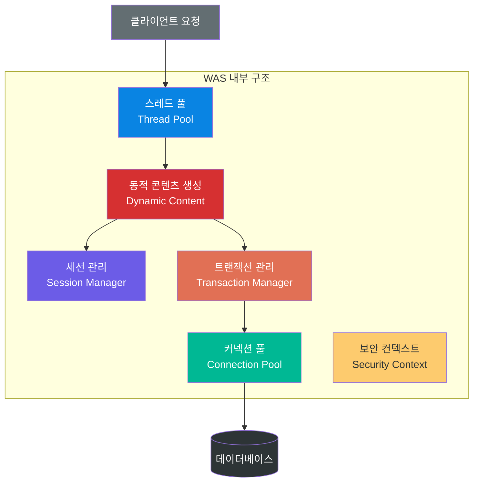

### 1) 동적 콘텐츠 생성

정적 웹 서버와 달리 WAS는 **요청마다 다른 결과**를 만들어냅니다.

- 같은 URL이라도 로그인한 사용자에 따라 다른 페이지 표시
- 검색어에 따라 다른 결과 반환
- 현재 시각, 재고 수량 등 실시간 데이터 반영

### 2) 세션 관리 (Session Management)

HTTP는 기본적으로 **무상태(Stateless)** 프로토콜입니다. WAS가 세션을 관리하여 사용자 상태를 유지합니다.

- 로그인 상태 유지
- 장바구니 정보 저장
- 세션 ID를 쿠키로 클라이언트에 전달

### 3) 트랜잭션 관리

데이터베이스 작업의 **원자성(Atomicity)**을 보장합니다.

> **예시**: 계좌 이체 시
> 1. A 계좌에서 10만원 차감
> 2. B 계좌에 10만원 추가
>
> 2번이 실패하면 1번도 취소되어야 합니다 → **롤백(Rollback)**

### 4) 커넥션 풀 (Connection Pool)

DB 연결을 매번 새로 만들면 비용이 큽니다. **미리 만들어둔 연결을 재사용**합니다.

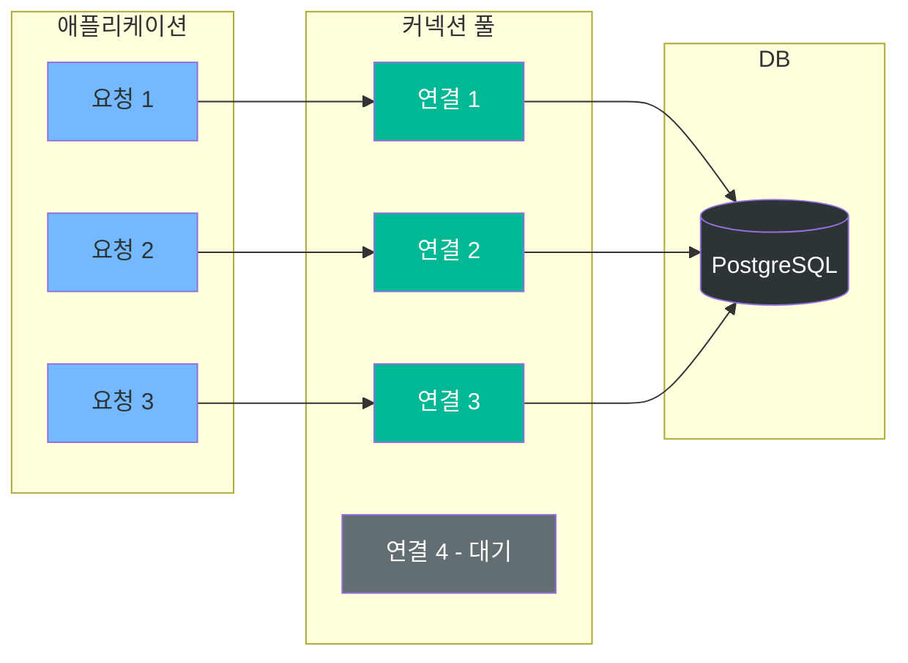

### 5) 스레드 풀 (Thread Pool)

요청마다 스레드를 새로 생성하면 오버헤드가 큽니다. **미리 생성한 스레드를 재활용**합니다.

- 최소/최대 스레드 수 설정
- 모든 스레드가 사용 중이면 대기 큐에서 대기
- 대기 시간 초과 시 503 에러 반환

---

## 4. WAS 보안

### 주요 보안 위협 (OWASP Top 10 기반)

#### SQL Injection (SQL 삽입)

공격자가 입력값에 SQL 코드를 삽입하여 데이터베이스를 조작하는 공격입니다.

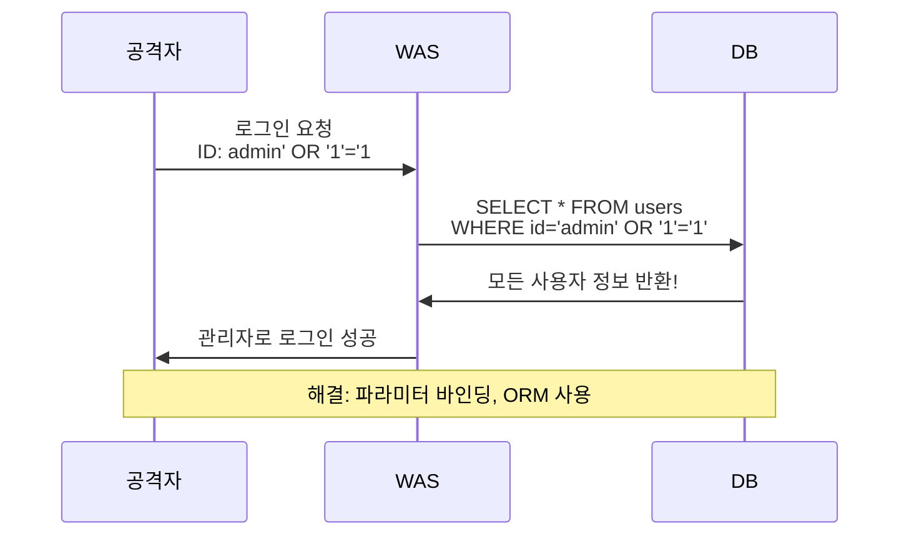

**해결 방법:**
- ORM(Object-Relational Mapping) 사용 (SQLAlchemy, Django ORM)
- 파라미터 바인딩 (Prepared Statement)
- 입력값 검증 및 이스케이프 처리

#### XSS (Cross-Site Scripting)

악성 스크립트를 웹 페이지에 주입하여 다른 사용자의 정보를 탈취합니다.

```mermaid
sequenceDiagram
    participant 공격자
    participant 웹사이트
    participant 피해자

    공격자->>웹사이트: 게시글 작성<br/>&lt;script&gt;steal(cookie)&lt;/script&gt;
    피해자->>웹사이트: 게시글 열람
    웹사이트->>피해자: 악성 스크립트 실행됨
    피해자->>공격자: 쿠키/세션 정보 전송

    Note over 공격자,피해자: 해결: 입력값 이스케이프, CSP 헤더
```

**해결 방법:**
- 입력값 HTML 이스케이프 (`<` → `&lt;`)
- Content-Security-Policy 헤더 설정
- HttpOnly 쿠키 사용 (JavaScript에서 접근 불가)

#### CSRF (Cross-Site Request Forgery)

사용자가 의도하지 않은 요청을 위조하여 서버에 전송합니다.

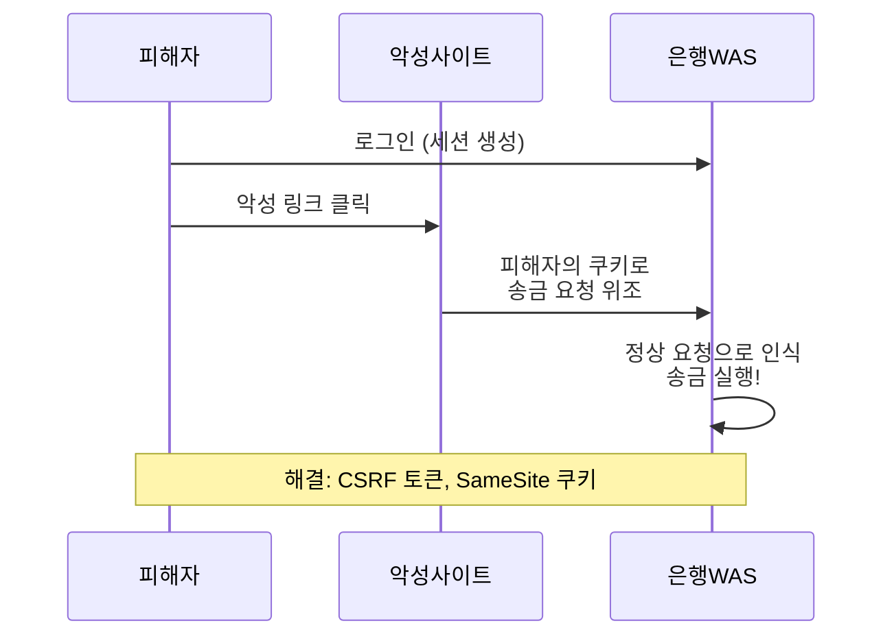

**해결 방법:**
- CSRF 토큰 사용 (매 요청마다 고유 토큰 검증)
- SameSite 쿠키 속성 설정
- Referer/Origin 헤더 검증

#### 인증/인가 취약점

**해결 방법:**
- **JWT (JSON Web Token)**: 토큰 기반 인증
- **OAuth 2.0**: 제3자 인증 위임 (구글, 카카오 로그인)
- **RBAC (Role-Based Access Control)**: 역할 기반 권한 관리

### 보안 설정 체크리스트

| 항목 | 설명 | 설정 예시 |
|------|------|----------|
| HTTPS 강제 적용 | 모든 통신 암호화 | SSL/TLS 인증서 적용 |
| CORS 설정 | 허용된 도메인만 접근 | `Access-Control-Allow-Origin` |
| Rate Limiting | 요청 횟수 제한 (DDoS 방지) | 분당 100회 제한 |
| 입력값 검증 | 모든 사용자 입력 검증 | 길이, 형식, 특수문자 제한 |
| 에러 메시지 관리 | 민감 정보 노출 금지 | 스택 트레이스 숨김 |
| 보안 헤더 | 브라우저 보안 정책 설정 | X-Frame-Options, CSP |
| 로그 관리 | 보안 이벤트 기록 | 로그인 실패, 권한 오류 기록 |

---

## 5. WAS 분산 처리

### 왜 분산 처리가 필요한가?

단일 서버는 한계가 있습니다:
- CPU/메모리 물리적 한계
- 동시 접속 수 제한 (보통 수천~수만)
- 서버 장애 시 전체 서비스 중단

### 수직 확장 vs 수평 확장

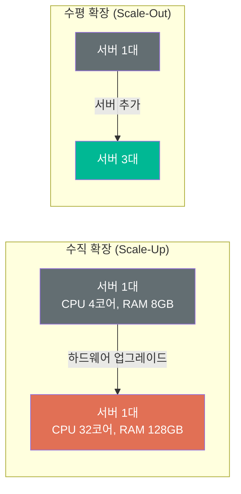

| 구분 | 수직 확장 (Scale-Up) | 수평 확장 (Scale-Out) |
|------|---------------------|---------------------|
| 방법 | 서버 사양 업그레이드 | 서버 대수 추가 |
| 장점 | 구현 간단, 호환성 유지 | 무한 확장 가능, 고가용성 |
| 단점 | 물리적 한계, 단일 장애점 | 구현 복잡, 데이터 동기화 필요 |
| 비용 | 고사양일수록 기하급수적 증가 | 선형적 비용 증가 |
| 사례 | 소규모 서비스 초기 단계 | Netflix, 네이버, 카카오 |

### 로드 밸런싱 (Load Balancing)

로드 밸런서는 들어오는 요청을 **여러 WAS 서버에 분배**하는 역할을 합니다.

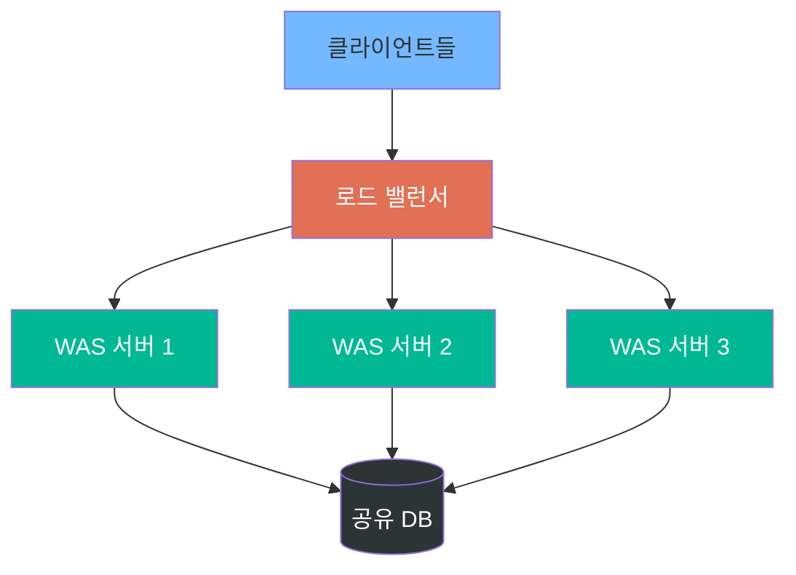

#### 로드 밸런싱 알고리즘

| 알고리즘 | 방식 | 장점 | 단점 |
|---------|------|------|------|
| **Round Robin** | 순서대로 분배 | 구현 간단, 균등 분배 | 서버 성능 차이 미반영 |
| **Least Connection** | 연결 수 가장 적은 서버로 | 부하 분산 우수 | 연결 수 추적 오버헤드 |
| **IP Hash** | 클라이언트 IP 기반 고정 | 세션 유지 용이 | 특정 서버에 편중 가능 |
| **Weighted** | 서버별 가중치 부여 | 성능 차이 반영 가능 | 가중치 설정 필요 |

#### L4 vs L7 로드 밸런서

| 구분 | L4 로드 밸런서 | L7 로드 밸런서 |
|------|---------------|---------------|
| 계층 | 전송 계층 (TCP/UDP) | 응용 계층 (HTTP/HTTPS) |
| 판단 기준 | IP, 포트 번호 | URL, 헤더, 쿠키 내용 |
| 속도 | 빠름 | 상대적으로 느림 |
| 기능 | 단순 분배 | URL 기반 라우팅, SSL 종단 |
| 사용 예 | AWS NLB | AWS ALB, Nginx |

### 세션 관리 문제와 해결

WAS가 여러 대이면 **세션이 공유되지 않는** 문제가 발생합니다.

> **문제 상황**: 사용자가 WAS 1에서 로그인 → 다음 요청이 WAS 2로 가면 → 로그인 정보 없음!

#### 해결 1: Sticky Session

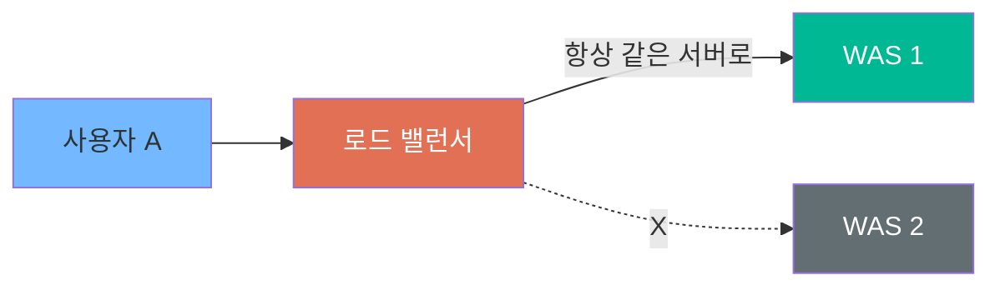

- 같은 사용자의 요청을 항상 같은 서버로 보냄
- **단점**: 특정 서버에 부하 집중, 서버 장애 시 세션 유실

#### 해결 2: Session Clustering

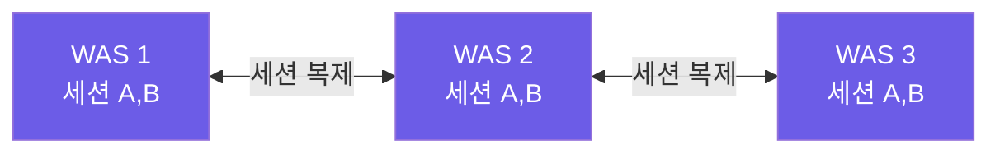

- 모든 WAS가 세션 정보를 복제하여 공유
- **단점**: 서버 수 증가 시 복제 트래픽 폭증, 메모리 낭비

#### 해결 3: 외부 세션 저장소 (Redis) — 가장 추천

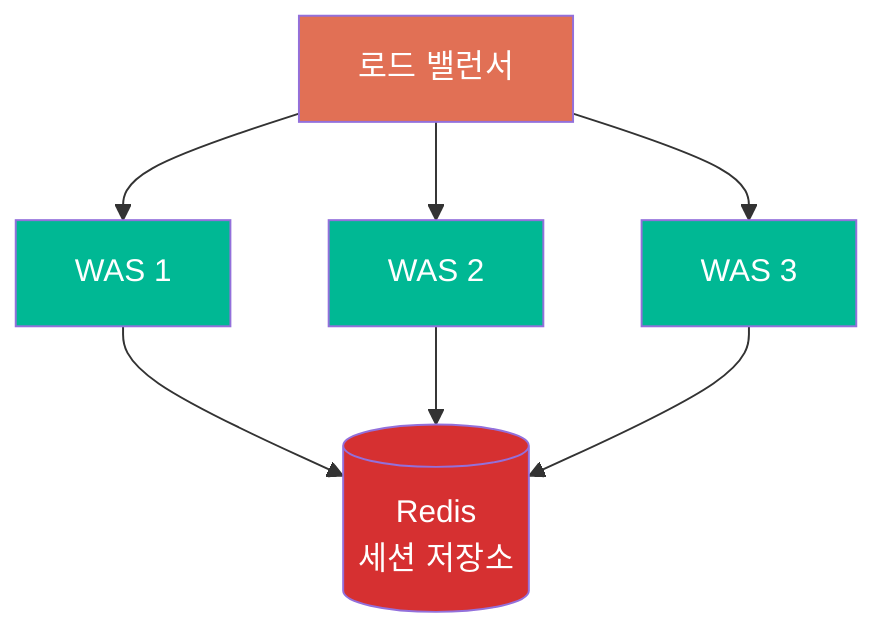

- 모든 WAS가 Redis 같은 외부 저장소에서 세션을 읽고/씀
- **장점**: 서버 추가/제거 자유, 장애 시에도 세션 유지
- **실무에서 가장 많이 사용하는 방식** (Netflix, 네이버, 카카오 등)

---

## 6. WAS 장애 대응

### 장애 유형

| 유형 | 원인 | 증상 |
|------|------|------|
| 서버 다운 | 하드웨어/소프트웨어 결함 | 응답 없음 (Connection Refused) |
| 네트워크 장애 | 스위치 고장, DNS 오류 | 타임아웃, 간헐적 실패 |
| DB 장애 | DB 서버 다운, 커넥션 풀 고갈 | 500 에러, 느린 응답 |
| 디스크 풀 | 로그/데이터 폭증 | 쓰기 실패, 서비스 중단 |
| OOM | 메모리 누수, 대량 요청 | 프로세스 강제 종료 |

### 장애 대응 전략

#### Health Check (상태 확인)

로드 밸런서가 주기적으로 WAS의 상태를 확인합니다.

- `/health` 엔드포인트에 주기적 요청
- 응답 없거나 에러 시 해당 서버를 분배 대상에서 제외
- 복구되면 다시 포함

#### Failover (장애 전환)

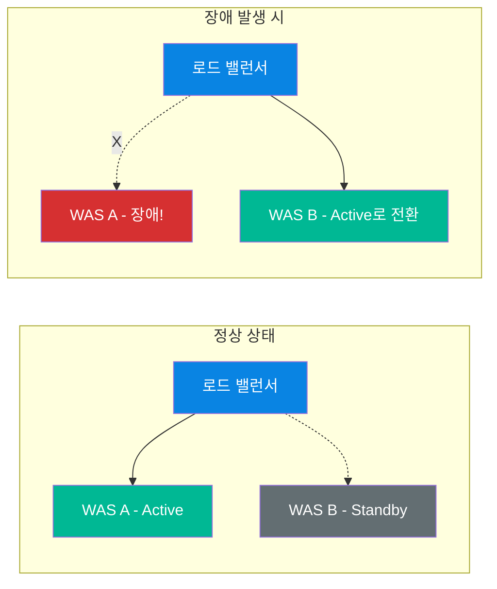

#### Circuit Breaker 패턴 (장애 전파 차단)

마이크로서비스 환경에서 하나의 서비스 장애가 **전체 시스템으로 전파되는 것을 차단**합니다.

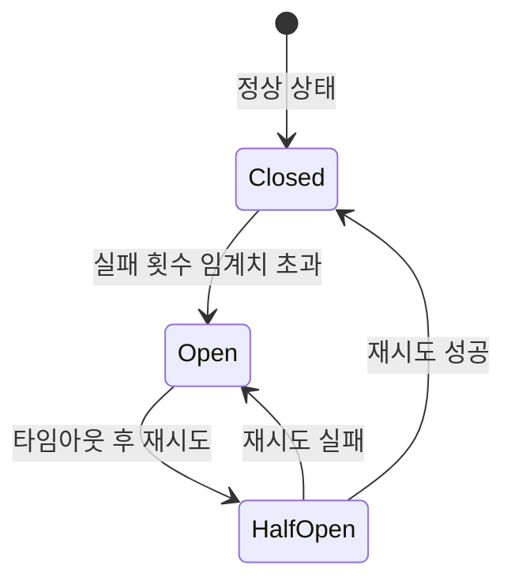

| 상태 | 동작 |
|------|------|
| **Closed (닫힘)** | 정상 작동, 요청을 그대로 전달 |
| **Open (열림)** | 요청을 차단, 즉시 에러 반환 (대상 서비스 보호) |
| **Half-Open (반열림)** | 일부 요청만 시험적으로 전달하여 복구 확인 |

> **실무 예시**: Netflix는 **Hystrix**(현재 Resilience4j)를 사용하여 Circuit Breaker를 구현합니다.
> 추천 서비스가 장애나면 → 추천 대신 "인기 콘텐츠" 목록을 보여줌 (Fallback)

#### Graceful Shutdown (우아한 종료)

서버를 종료할 때 **진행 중인 요청을 모두 완료한 후** 종료합니다.

1. 새로운 요청 수신 중단
2. 진행 중인 요청 완료 대기 (타임아웃 설정)
3. 리소스 정리 (DB 연결 반환, 파일 닫기)
4. 프로세스 종료

### 모니터링

#### 무엇을 모니터링하나?

| 지표 | 설명 | 경고 기준 예시 |
|------|------|--------------|
| CPU 사용률 | 서버 연산 부하 | > 80% |
| 메모리 사용률 | 힙 메모리 등 | > 85% |
| 응답 시간 | 요청~응답 소요 시간 | > 3초 |
| 에러율 | 5xx 에러 비율 | > 1% |
| 동시 접속 수 | 현재 활성 연결 수 | 최대치의 80% |
| 디스크 사용률 | 로그/데이터 저장 공간 | > 90% |

#### 주요 모니터링 도구

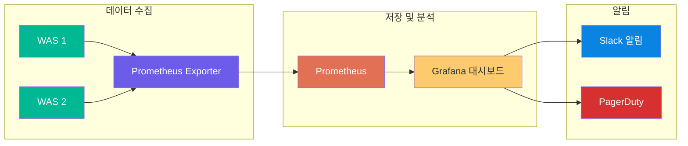

| 도구 | 역할 | 특징 |
|------|------|------|
| **Prometheus** | 메트릭 수집/저장 | 시계열 DB, Pull 방식 |
| **Grafana** | 시각화/대시보드 | 다양한 차트, 알림 설정 |
| **ELK Stack** | 로그 수집/분석 | Elasticsearch + Logstash + Kibana |
| **Datadog** | 통합 모니터링 | SaaS, APM, 로그 통합 |

---

## 7. 실무에서의 WAS 구성 예시

### 일반적인 구성

실무에서 가장 많이 볼 수 있는 구성은 다음과 같습니다:

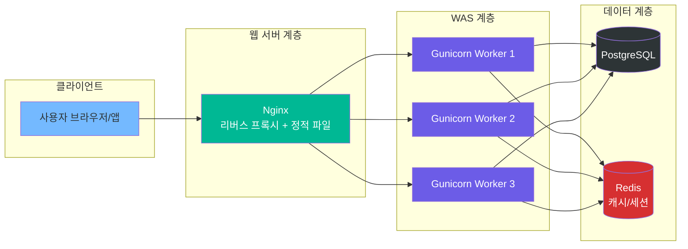

### Nginx 리버스 프록시 설정 예시

```nginx
# /etc/nginx/sites-available/myapp
upstream app_server {
    # Gunicorn WAS 서버들 (로드 밸런싱)
    server 127.0.0.1:8000;
    server 127.0.0.1:8001;
    server 127.0.0.1:8002;
}

server {
    listen 80;
    server_name myapp.com;

    # HTTP → HTTPS 리다이렉트
    return 301 https://$host$request_uri;
}

server {
    listen 443 ssl;
    server_name myapp.com;

    ssl_certificate /etc/ssl/certs/myapp.crt;
    ssl_certificate_key /etc/ssl/private/myapp.key;

    # 정적 파일은 Nginx가 직접 서빙
    location /static/ {
        alias /var/www/myapp/static/;
        expires 30d;
    }

    # 동적 요청은 WAS로 전달
    location / {
        proxy_pass http://app_server;
        proxy_set_header Host $host;
        proxy_set_header X-Real-IP $remote_addr;
        proxy_set_header X-Forwarded-For $proxy_add_x_forwarded_for;
        proxy_set_header X-Forwarded-Proto $scheme;
    }

    # Health Check 엔드포인트
    location /health {
        proxy_pass http://app_server;
        access_log off;
    }
}
```

### Gunicorn 실행 설정 예시

```bash
# gunicorn.conf.py
bind = "0.0.0.0:8000"
workers = 4                  # CPU 코어 수 * 2 + 1 권장
worker_class = "uvicorn.workers.UvicornWorker"  # ASGI 지원
timeout = 30                 # 요청 타임아웃
keepalive = 2               # Keep-Alive 타임아웃
max_requests = 1000         # Worker 재시작 주기 (메모리 누수 방지)
max_requests_jitter = 50    # 동시 재시작 방지
accesslog = "-"             # 접근 로그
errorlog = "-"              # 에러 로그
loglevel = "info"
```

### Docker 컨테이너 구성

실무에서는 대부분 **Docker**로 컨테이너화하여 배포합니다:

```yaml
# docker-compose.yml
version: '3.8'
services:
  nginx:
    image: nginx:alpine
    ports:
      - "80:80"
      - "443:443"
    depends_on:
      - web

  web:
    build: .
    command: gunicorn app.main:app -w 4 -k uvicorn.workers.UvicornWorker
    expose:
      - "8000"
    depends_on:
      - db
      - redis

  db:
    image: postgres:15
    environment:
      POSTGRES_DB: myapp
      POSTGRES_PASSWORD: secret

  redis:
    image: redis:7-alpine
```

### 대규모 서비스 구성 (Netflix, 네이버 참고)

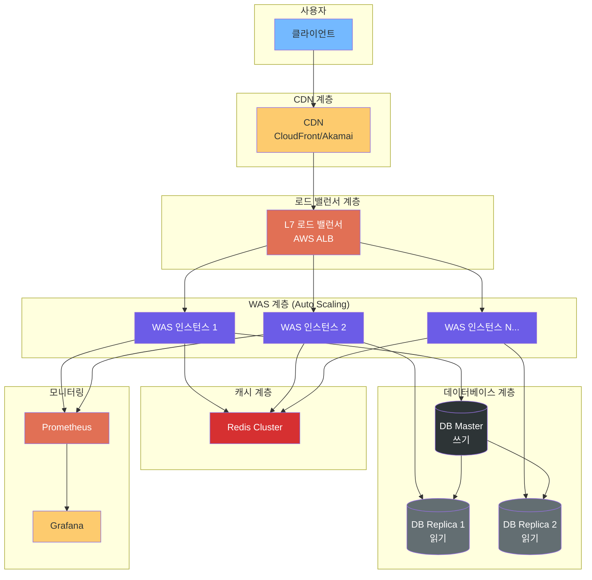

> **실무 팁**: 네이버, 카카오 같은 대규모 서비스에서는 위와 같은 다계층 구조를 사용합니다.
> - **CDN**: 정적 파일을 사용자에게 가까운 서버에서 전달 (응답 속도 향상)
> - **Auto Scaling**: 트래픽에 따라 WAS 인스턴스 자동 증감
> - **DB 읽기/쓰기 분리**: Master에서 쓰기, Replica에서 읽기 처리

---

## 정리

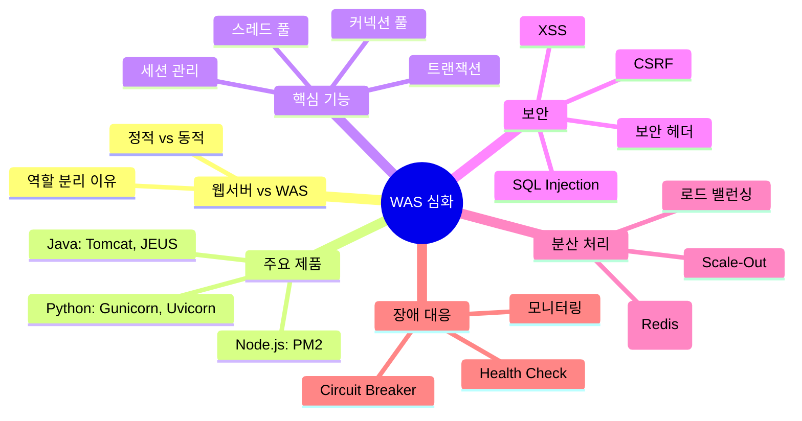

### 핵심 키워드 요약

| 개념 | 한 줄 요약 |
|------|-----------|
| WAS | 동적 콘텐츠를 생성하고 비즈니스 로직을 처리하는 서버 |
| 로드 밸런싱 | 여러 WAS에 요청을 균등 분배 |
| 세션 공유 | Redis 등 외부 저장소로 해결 |
| Circuit Breaker | 장애 전파를 차단하는 패턴 |
| WSGI/ASGI | Python 웹 앱과 WAS 간의 인터페이스 규약 |
| Graceful Shutdown | 진행 중 요청을 완료한 후 안전하게 종료 |

> **다음 학습**: WAS의 동작을 직접 체험하기 위해 FastAPI + Uvicorn 환경을 구축하고,
> Nginx 리버스 프록시를 연동하는 실습을 진행합니다.
