# 3-Tier 아키텍처와 고가용성

> 엔터프라이즈 서비스의 핵심 — 계층 분리로 확장하고, 이중화로 죽지 않는 시스템을 만든다

---

## 1. 3-Tier 아키텍처란?

### 개념

3-Tier 아키텍처는 웹 서비스를 **3개의 독립적인 계층**으로 분리하여 구성하는 설계 패턴입니다. 각 계층은 고유한 역할을 수행하며, 서로 독립적으로 확장·교체·유지보수할 수 있습니다.

| Tier | 한국어 명칭 | 역할 | 대표 기술 |
|------|------------|------|-----------|
| **Presentation Tier** | 프론트엔드/웹 서버 | 사용자 요청 수신, 정적 파일 서빙 | Nginx, Apache |
| **Application Tier** | WAS/비즈니스 로직 | 핵심 로직 처리, API 제공 | Tomcat, Gunicorn, Flask, Spring |
| **Data Tier** | 데이터베이스 | 데이터 영구 저장, 트랜잭션 | MySQL, PostgreSQL, Oracle |

### 3-Tier 구조도

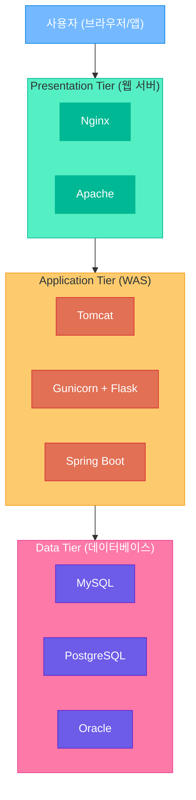

### 왜 3단계로 분리하는가?

| 이유 | 설명 |
|------|------|
| **보안** | 외부에서 DB에 직접 접근 불가. 각 계층이 방화벽 역할 |
| **확장성** | 트래픽이 몰리는 계층만 독립적으로 서버 추가 가능 |
| **유지보수** | DB를 교체해도 WAS 코드만 수정하면 됨. 프론트는 영향 없음 |
| **역할 분담** | 프론트 개발자, 백엔드 개발자, DBA가 각자 영역에 집중 |
| **장애 격리** | WAS에 장애가 나도 DB 데이터는 안전 |

### 2-Tier vs 3-Tier vs N-Tier 비교

| 구분 | 2-Tier | 3-Tier | N-Tier |
|------|--------|--------|--------|
| **구조** | 클라이언트 → DB | 클라이언트 → WAS → DB | 클라이언트 → 웹 → WAS → 캐시 → DB |
| **확장성** | 매우 낮음 | 높음 | 매우 높음 |
| **보안** | 취약 (DB 직접 노출) | 좋음 | 매우 좋음 |
| **복잡도** | 간단 | 적절 | 복잡 |
| **예시** | 사내 관리 도구 | 일반 웹 서비스 | 네이버, 쿠팡 |

---

## 2. 각 Tier별 역할 상세

### Web Tier (Presentation Tier)

가장 앞단에 위치하여 **사용자와 직접 만나는 계층**입니다.

| 역할 | 설명 |
|------|------|
| **정적 파일 서빙** | HTML, CSS, JS, 이미지를 빠르게 전달 |
| **SSL/TLS 종단** | HTTPS 암호화/복호화 처리 (뒤의 WAS는 HTTP 사용 가능) |
| **리버스 프록시** | 클라이언트 요청을 뒷단 WAS로 전달 |
| **캐싱** | 자주 요청되는 콘텐츠를 메모리에 저장 |
| **보안 첫 방어선** | Rate Limiting, IP 차단, DDoS 완화 |

> 실무 팁: Nginx에서 SSL을 처리하고, 뒤의 WAS에는 HTTP로 통신하면 WAS의 부하를 줄일 수 있습니다. 이것을 **SSL Offloading**이라고 합니다.

### WAS Tier (Application Tier)

서비스의 **핵심 비즈니스 로직**을 처리하는 계층입니다.

| 역할 | 설명 |
|------|------|
| **비즈니스 로직** | 주문 처리, 결제 검증, 추천 알고리즘 등 |
| **인증/인가** | JWT 검증, 세션 관리, 권한 확인 |
| **API 제공** | REST API, GraphQL 엔드포인트 |
| **데이터 변환** | DB 데이터를 API 응답 형태로 가공 |

> **수평 확장이 가장 활발한 계층**: Stateless하게 설계하면 서버를 무한히 추가할 수 있습니다. 카카오톡 메시지 서버, 쿠팡 주문 서버 등이 수십~수백 대의 WAS를 운영합니다.

### DB Tier (Data Tier)

데이터를 **영구적으로 저장**하고 관리하는 계층입니다.

| 역할 | 설명 |
|------|------|
| **데이터 영구 저장** | 서버가 꺼져도 데이터 유지 |
| **트랜잭션 처리** | ACID 보장 (원자성, 일관성, 격리성, 지속성) |
| **백업/복구** | 장애 시 데이터 복원 |
| **인덱싱** | 빠른 검색을 위한 인덱스 관리 |

> **가장 확장이 어려운 계층**: 데이터 정합성 때문에 단순히 서버를 추가할 수 없습니다. 이중화가 필수이며, 이것이 이 문서에서 가장 중요한 주제입니다.

### 3-Tier 데이터 흐름

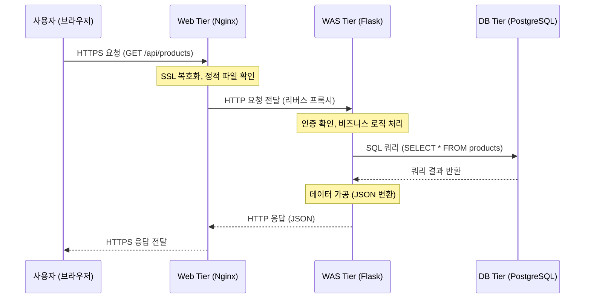

---

## 3. 고가용성 (HA: High Availability)

### 가용성이란?

**서비스가 중단 없이 정상적으로 운영되는 정도**를 의미합니다. "얼마나 안 죽느냐"를 숫자로 표현한 것입니다.

```
가용성(%) = (총 운영 시간 - 다운타임) / 총 운영 시간 × 100
```

### 가용성 숫자 (The Nines)

| 가용성 | 연간 허용 다운타임 | 월간 허용 다운타임 | 수준 |
|--------|-------------------|-------------------|------|
| **99%** (Two 9s) | 3일 15시간 36분 | 7시간 18분 | 개발/테스트 환경 |
| **99.9%** (Three 9s) | 8시간 46분 | 43분 48초 | 일반 웹 서비스 |
| **99.99%** (Four 9s) | 52분 36초 | 4분 23초 | 네이버, 카카오 수준 |
| **99.999%** (Five 9s) | 5분 15초 | 26초 | 금융, 통신 (거의 무중단) |

> 쿠팡의 경우, 1분 서비스 장애 = 수억 원의 매출 손실이 발생합니다. 네이버 검색이 5분 멈추면 뉴스에 나옵니다. 이것이 고가용성이 중요한 이유입니다.

### SLA (Service Level Agreement)

서비스 제공자가 고객에게 **보장하는 가용성 수준**입니다.

- AWS EC2 SLA: 99.99% (월간 4분 이상 장애 시 크레딧 환불)
- Google Cloud SLA: 99.95%~99.99%
- 네이버 클라우드: 99.9%

### SPOF (Single Point of Failure) = 단일 장애점

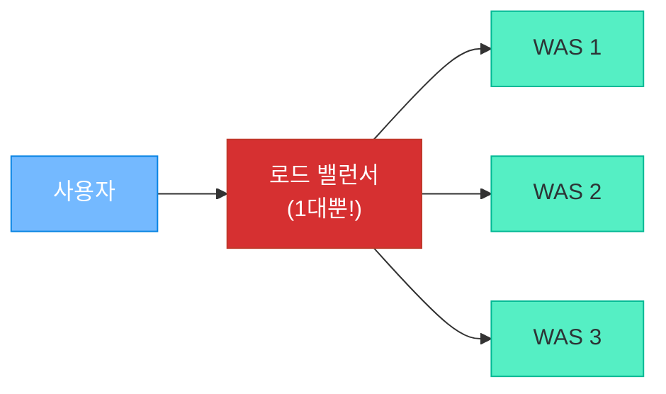

위 구조에서 **로드 밸런서가 1대뿐**이면, 이것이 죽는 순간 전체 서비스가 중단됩니다. 이것이 바로 **SPOF**입니다.

> **HA의 핵심 = SPOF를 모두 제거하는 것**. 모든 구성요소를 2대 이상으로 이중화해야 합니다.

---

## 4. Web/WAS Tier 이중화

### Active-Active 구성

**모든 서버가 동시에 트래픽을 처리**하는 구성입니다. Web/WAS Tier에서 가장 일반적인 방식입니다.

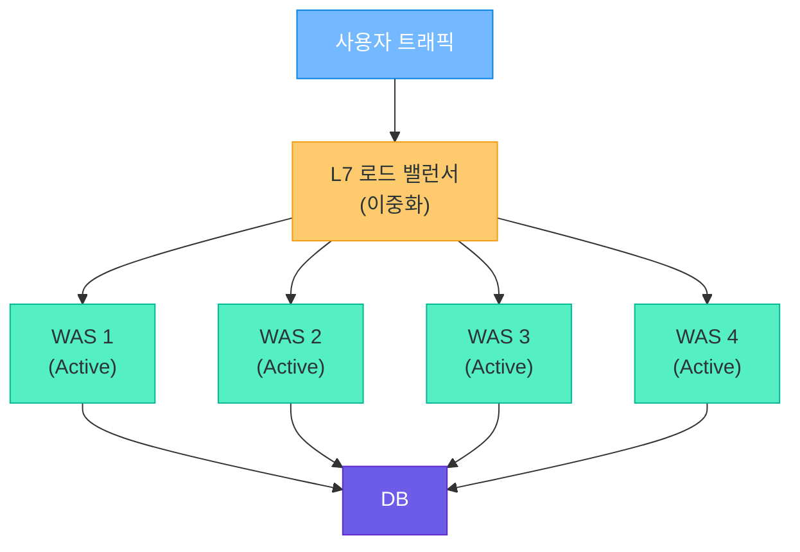

**동작 원리:**
- 로드 밸런서가 Round Robin, Least Connection 등의 알고리즘으로 트래픽 분배
- WAS 1대가 죽어도 나머지 3대가 즉시 처리 → **무중단**
- 트래픽이 증가하면 WAS를 추가하면 됨 → **수평 확장**

**전제 조건:**
- WAS는 반드시 **Stateless** 설계 (세션은 Redis에 저장)
- 어떤 WAS가 처리하든 결과가 동일해야 함

### 장애 감지와 Failover

로드 밸런서는 주기적으로 **Health Check**를 수행하여 서버 상태를 확인합니다.

| Health Check 유형 | 확인 방식 | 예시 |
|-------------------|-----------|------|
| **L4 (TCP)** | TCP 연결 성공 여부 | 포트 8080에 연결 가능한가? |
| **L7 (HTTP)** | HTTP 응답 코드 확인 | GET /health → 200 OK인가? |
| **Custom** | 비즈니스 로직 확인 | DB 연결 + 캐시 연결 모두 정상인가? |

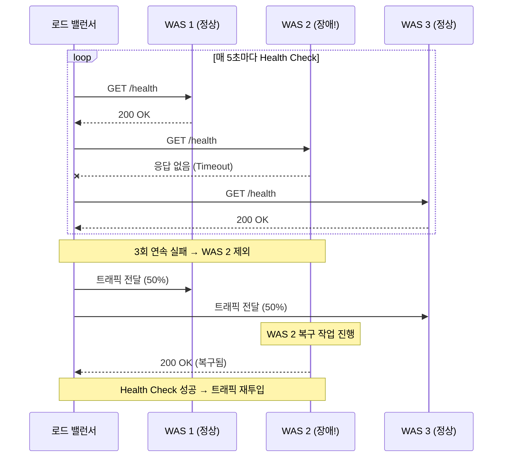

**Failover 과정 정리:**
1. Health Check 주기적 실행 (보통 5~10초 간격)
2. N회 연속 실패 → 해당 서버를 풀에서 제외
3. 나머지 서버가 트래픽을 분담
4. 복구 후 Health Check 통과 시 다시 투입

---

## 5. DB Tier 이중화 (가장 중요!)

DB는 **데이터의 정합성**이 생명이므로, 단순히 서버를 여러 대 띄우는 것만으로는 해결되지 않습니다.

### Active-Standby (실무 표준)

**한 대가 모든 작업을 처리하고, 다른 한 대는 대기**하는 구성입니다.

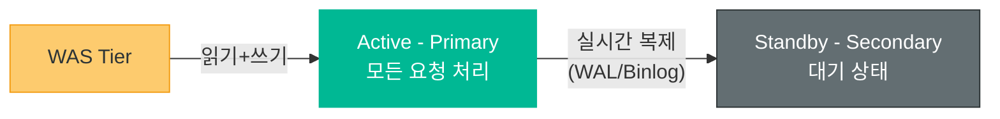

**동작 방식:**
- **Active (Primary/Master)**: 읽기+쓰기 모두 처리하는 메인 DB
- **Standby (Secondary/Slave)**: Active의 데이터를 실시간으로 복제받아 동일한 상태 유지
- Active 장애 발생 시 → Standby가 Active로 **승격 (Failover)**

**Standby 유형:**

| 유형 | 복제 방식 | 전환 시간 | 데이터 손실 | 비용 |
|------|-----------|-----------|-------------|------|
| **Hot Standby** | 실시간 동기/비동기 복제 | 수 초~수십 초 | 거의 없음 | 높음 |
| **Warm Standby** | 주기적 복제 (수 분 간격) | 수 분 | 약간 가능 | 중간 |
| **Cold Standby** | 백업 파일만 보관 | 수 시간 | 마지막 백업 이후 손실 | 낮음 |

> 실무에서는 **Hot Standby**가 기본입니다. AWS RDS Multi-AZ, 네이버 클라우드 DB 모두 Hot Standby 방식입니다.

**Failover 과정:**

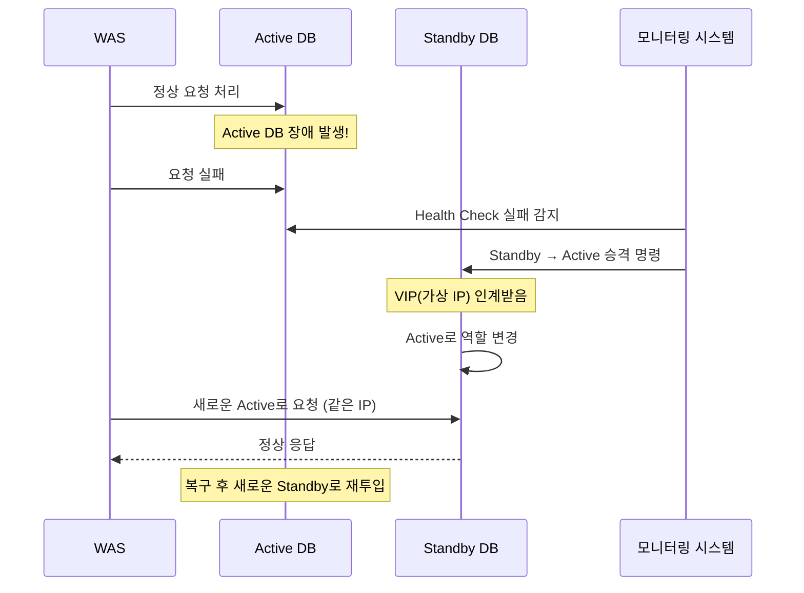

### Active-Active (사용 주의!)

두 DB 모두 읽기+쓰기가 가능한 구성입니다.

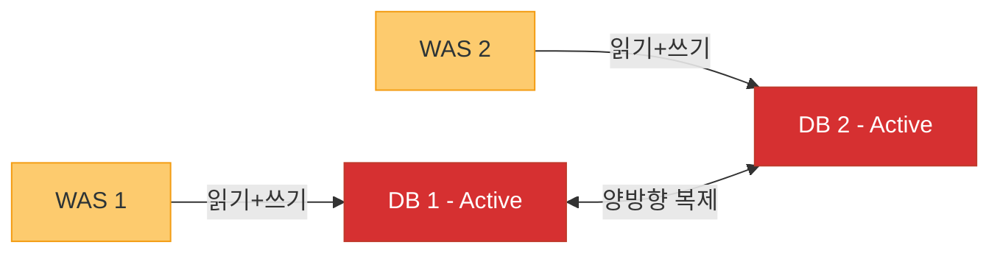

**문제점:**

| 문제 | 설명 |
|------|------|
| **데이터 충돌** | 같은 레코드를 동시에 수정하면 어떤 값이 정답인가? |
| **Split-Brain** | 네트워크 단절 시 두 DB가 각자 다른 데이터를 가짐 |
| **동기화 복잡도** | 양방향 복제는 단방향보다 훨씬 복잡 |
| **Eventual Consistency** | 두 DB의 데이터가 "결국에는" 같아지지만, 중간에 불일치 발생 |

**왜 실무에서 Active-Standby를 선호하는가:**
- 데이터 정합성이 가장 중요 → **쓰기는 한 곳에서만** 해야 충돌 방지
- 금융/결제 시스템에서 "잔액"이 DB마다 다르면 치명적
- Active-Active는 **Eventual Consistency** → 즉시 일관성이 필요한 서비스에 부적합
- 네이버, 카카오, 쿠팡 모두 핵심 DB는 Active-Standby 사용

### Read Replica (읽기 분산)

대부분의 서비스는 **읽기 트래픽이 80~90%**입니다. 이를 활용한 구성입니다.

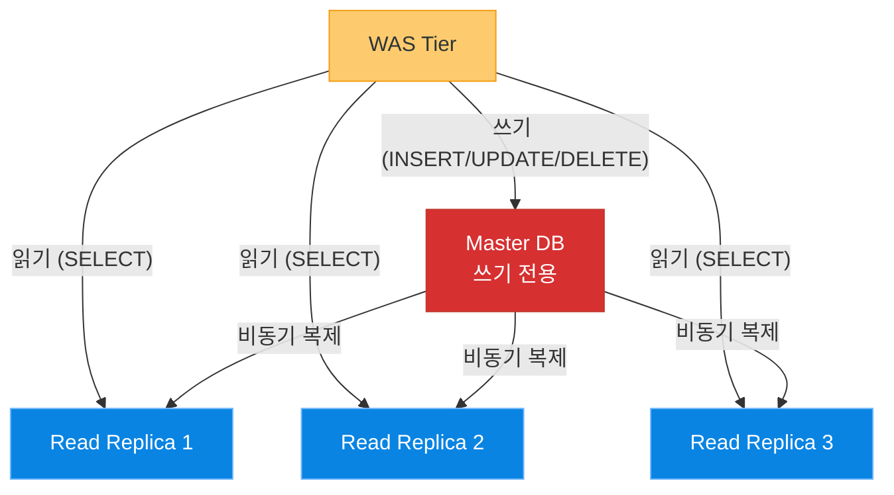

**특징:**
- Master는 쓰기만 담당 → 쓰기 성능 집중
- Read Replica는 읽기만 담당 → 필요에 따라 대수를 늘려 읽기 성능 확장
- 네이버 뉴스 같은 읽기 중심 서비스에 매우 효과적
- 주의: 비동기 복제이므로 약간의 **Replication Lag** (지연) 존재 (보통 수십 ms)

### DB 이중화 비교 표

| 구성 | 쓰기 | 읽기 | 장애 대응 | 복잡도 | 적합한 상황 |
|------|------|------|-----------|--------|-------------|
| **Active-Standby** | Active 1대 | Active 1대 | Failover (수 초~수십 초) | 낮음 | 대부분의 서비스 (기본) |
| **Active-Active** | 양쪽 모두 | 양쪽 모두 | 즉시 (이미 양쪽 활성) | 매우 높음 | 지역 분산 (Multi-Region) |
| **Read Replica** | Master 1대 | Replica N대 | Master Failover 필요 | 중간 | 읽기 중심 서비스 |
| **Active-Standby + Read Replica** | Active 1대 | Replica N대 | Standby Failover + 읽기 분산 | 중간 | 실무 최적 조합 |

---

## 6. 전체 3-Tier HA 아키텍처

### 실무 완성형 구성도

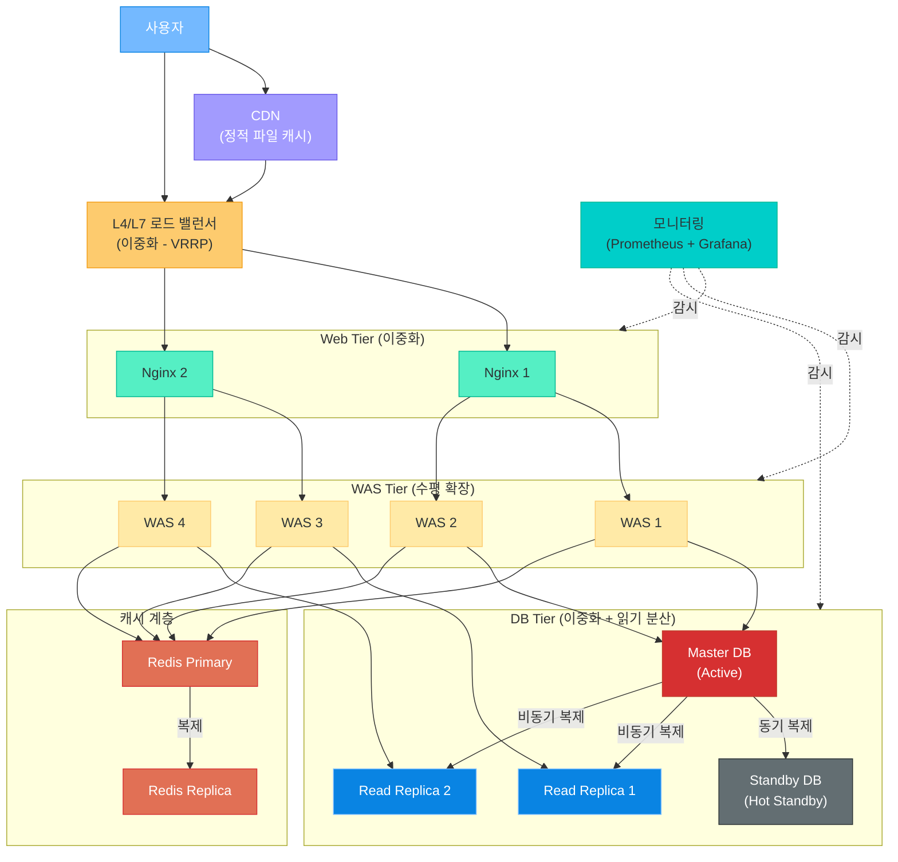

### 각 구성요소의 이중화 현황

| 구성요소 | 이중화 방식 | SPOF 제거 |
|----------|-------------|-----------|
| 로드 밸런서 | VRRP(Virtual Router Redundancy Protocol)로 이중화 | O |
| Web 서버 | Active-Active (LB가 분배) | O |
| WAS | Active-Active (수평 확장) | O |
| DB | Active-Standby + Read Replica | O |
| 캐시 (Redis) | Redis Sentinel 또는 Redis Cluster | O |
| 모니터링 | 이중화 또는 SaaS 사용 (Datadog 등) | O |

> **SPOF가 하나도 없는 구조** = 어느 한 곳이 죽어도 서비스가 계속 동작

---

## 7. 서비스 메시 (Service Mesh)

### MSA (Microservice Architecture) 등장 배경

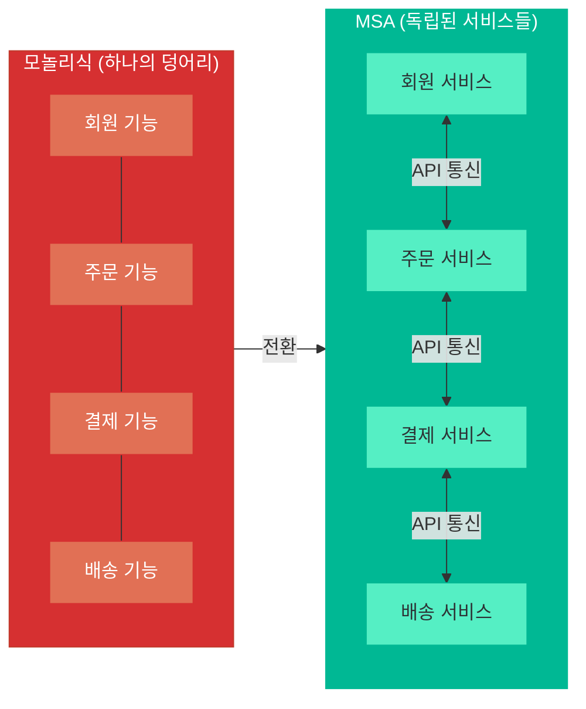

**모놀리식 → MSA 전환 이유:**
- 하나의 기능 수정이 전체 배포 필요 → 배포 리스크 증가
- 특정 기능만 확장 불가 → 전체를 확장해야 함
- 팀 간 코드 충돌 → 개발 속도 저하
- 쿠팡, 네이버, 카카오 모두 MSA로 전환 완료

**MSA의 문제:**
- 서비스가 수십~수백 개 → 서비스 간 통신이 폭발적으로 증가
- 각 서비스에 로드밸런싱, 인증, 로깅, 모니터링을 각각 구현해야 함
- 이 문제를 해결하기 위해 **서비스 메시** 등장

### 서비스 메시란?

**서비스 간 통신을 관리하는 전용 인프라 계층**입니다. 각 서비스 옆에 **Sidecar Proxy**를 배치하여, 서비스 코드 수정 없이 트래픽 관리·보안·모니터링을 처리합니다.

### 주요 기능

| 기능 | 설명 | 예시 |
|------|------|------|
| **서비스 디스커버리** | 서비스 위치를 자동으로 탐색 | "결제 서비스"가 어디 있는지 자동 파악 |
| **로드 밸런싱** | 서비스 간 트래픽 분산 | 주문 서비스 → 결제 서비스 3대에 분산 |
| **트래픽 관리** | 라우팅, 카나리 배포, A/B 테스트 | 10% 트래픽만 새 버전으로 보내기 |
| **보안 (mTLS)** | 서비스 간 암호화 통신 | 모든 서비스 간 통신이 자동 암호화 |
| **관측성** | 분산 추적, 메트릭, 로그 | 요청이 어떤 서비스를 거쳤는지 추적 |
| **Circuit Breaker** | 장애 전파 차단 | 결제 서비스 장애 시 주문 서비스까지 죽지 않게 |

### 서비스 메시 아키텍처

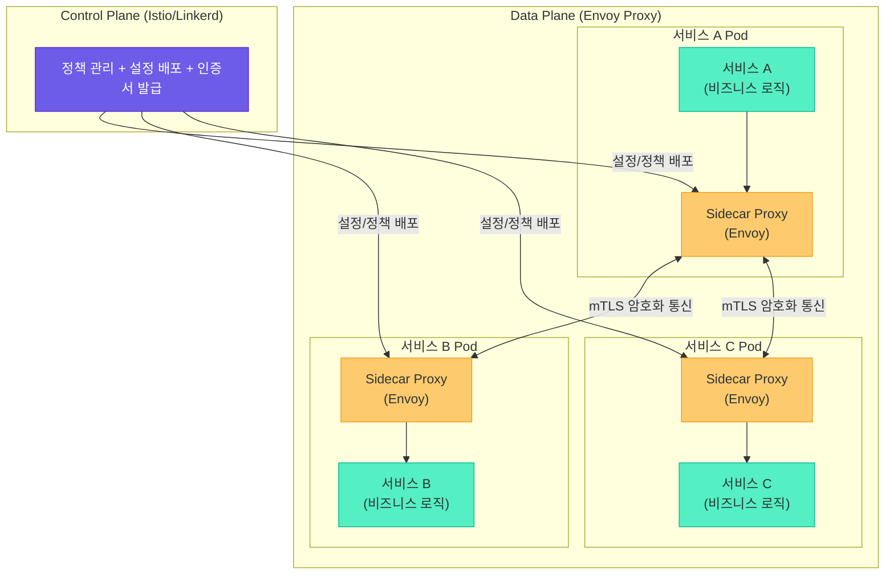

**구성 요소:**
- **Data Plane**: Sidecar Proxy(Envoy)가 실제 트래픽을 처리
- **Control Plane**: 정책 관리, 설정 배포, 인증서 관리

### 주요 도구

| 도구 | 특징 | 사용 기업 |
|------|------|-----------|
| **Istio** | 가장 유명, 기능 풍부, Kubernetes 기반 | 네이버, 카카오 |
| **Linkerd** | 경량, 간단, 빠른 도입 | 중소 규모 서비스 |
| **Consul Connect** | HashiCorp 생태계 연동 | Vault, Terraform 사용 기업 |
| **AWS App Mesh** | AWS 네이티브 | AWS 기반 서비스 |

---

## 8. 네트워크 토폴로지

### 네트워크 토폴로지란?

네트워크에 연결된 장비들의 **물리적 또는 논리적 연결 구조**를 의미합니다. 아키텍처 설계 시 네트워크 구조를 이해하는 것은 필수입니다.

### 스타형 (Star Topology)

모든 노드가 **중앙 스위치/허브**에 연결되는 구조입니다.

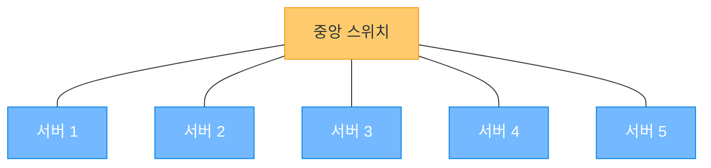

- **장점**: 구조 단순, 장애 격리 (한 노드 장애가 다른 노드에 영향 없음)
- **단점**: 중앙 스위치가 SPOF, 스위치 장애 시 전체 마비
- **사용**: 소규모 사무실, 가정 네트워크

### 버스형 (Bus Topology)

모든 노드가 **하나의 회선(버스)**을 공유하는 구조입니다.

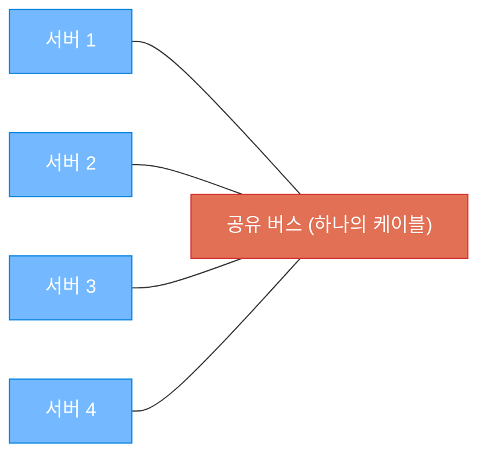

- **장점**: 케이블 비용 절감, 설치 간단
- **단점**: 버스 장애 시 전체 마비, 충돌 발생, 보안 취약
- **사용**: 과거 이더넷 (현재는 거의 사용하지 않음)

### 링형 (Ring Topology)

노드들이 **원형으로 연결**되는 구조입니다.

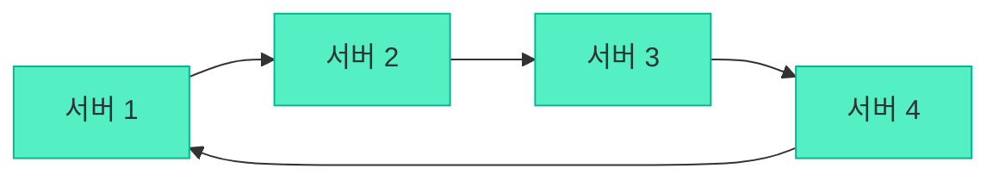

- **장점**: 데이터 흐름이 일정, 충돌 없음
- **단점**: 한 노드 장애 시 전체 영향, 확장 어려움
- **사용**: 토큰 링 네트워크 (과거), 일부 산업용 네트워크

### 메시형 (Mesh Topology)

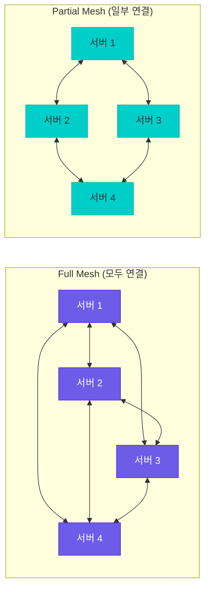

| 유형 | 설명 | 장점 | 단점 |
|------|------|------|------|
| **Full Mesh** | 모든 노드가 서로 직접 연결 | 가장 견고, 우회 경로 다수 | 비용 매우 높음, 연결 수 = n(n-1)/2 |
| **Partial Mesh** | 중요 노드만 교차 연결 | 비용 절약, 충분한 견고함 | Full Mesh보다 복원력 낮음 |

> **실무에서는 Partial Mesh + 이중화가 가장 일반적**입니다. 모든 것을 Full Mesh로 연결하면 비용이 기하급수적으로 증가하므로, 핵심 경로만 이중화하는 전략을 사용합니다.

### 네트워크 토폴로지 비교

| 토폴로지 | 견고함 | 비용 | 확장성 | 실무 사용 |
|----------|--------|------|--------|-----------|
| 스타형 | 중간 | 낮음 | 쉬움 | 사무실, 소규모 |
| 버스형 | 낮음 | 매우 낮음 | 어려움 | 거의 사용 안 함 |
| 링형 | 낮음 | 낮음 | 어려움 | 특수 목적 |
| Full Mesh | 최고 | 매우 높음 | 어려움 | 핵심 백본망 |
| Partial Mesh | 높음 | 중간 | 보통 | 데이터센터 기본 |

---

## 9. 실무 아키텍처 사례

### 소규모 서비스 (스타트업, 일 사용자 1만 이하)

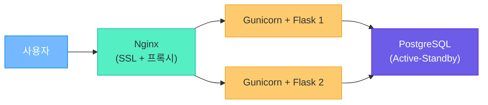

**구성:**
- 서버 1~3대로 운영
- Nginx가 SSL 처리 + 로드밸런싱 겸임
- DB는 Active-Standby로 최소한의 안정성 확보
- 모니터링: CloudWatch 또는 Uptime Robot

**비용:** 월 10~50만 원 (클라우드 기준)

### 중규모 서비스 (일반 기업, 일 사용자 10만~100만)

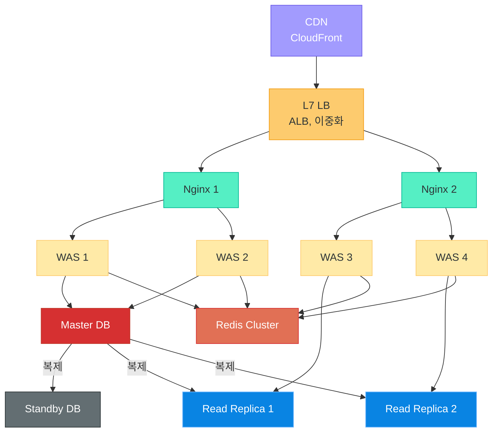

**구성:**
- Kubernetes 클러스터에서 운영 (EKS, GKE 등)
- CDN으로 정적 파일 가속
- Redis로 세션 + 캐시 처리
- DB: Active-Standby + Read Replica 2대
- 모니터링: Prometheus + Grafana + PagerDuty

**비용:** 월 200~1,000만 원

### 대규모 서비스 (네이버, 카카오, 쿠팡 급, 일 사용자 1,000만+)

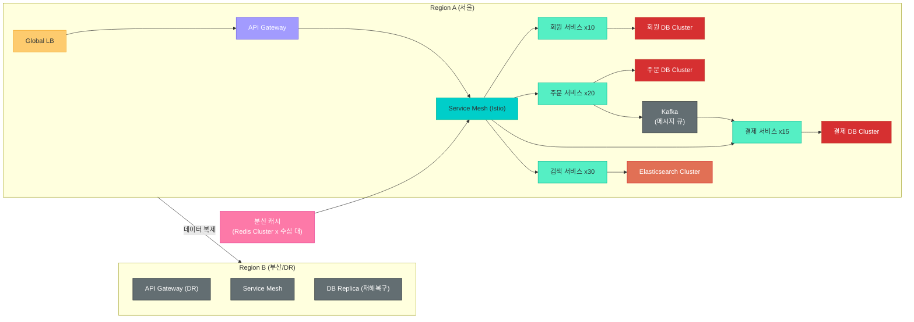

**구성:**
- **Multi-Region**: 서울 + 부산(재해복구) 이중 리전
- **MSA**: 수백 개의 마이크로서비스, 각 서비스마다 독립 DB
- **Service Mesh**: Istio 기반 서비스 간 통신 관리
- **메시지 큐**: Kafka로 서비스 간 비동기 통신
- **분산 캐시**: Redis Cluster 수십 대
- **검색**: Elasticsearch 전용 클러스터
- **모니터링**: 자체 구축 모니터링 시스템 + 분산 추적 (Jaeger)

**비용:** 월 수억~수십억 원

### 규모별 기술 선택 가이드

| 규모 | 인프라 | 배포 | DB | 캐시 | 모니터링 |
|------|--------|------|-----|------|----------|
| 소규모 | 단일 서버/VM | 수동 or Docker | PostgreSQL (1대) | 없음 or Redis 1대 | CloudWatch |
| 중규모 | Kubernetes | CI/CD (GitHub Actions) | Active-Standby + Replica | Redis Cluster | Prometheus + Grafana |
| 대규모 | Multi-Region K8s | GitOps (ArgoCD) | 서비스별 독립 DB | 분산 캐시 수십 대 | 자체 구축 |

---

## 10. 정리: 아키텍처 설계 원칙

### 핵심 5원칙

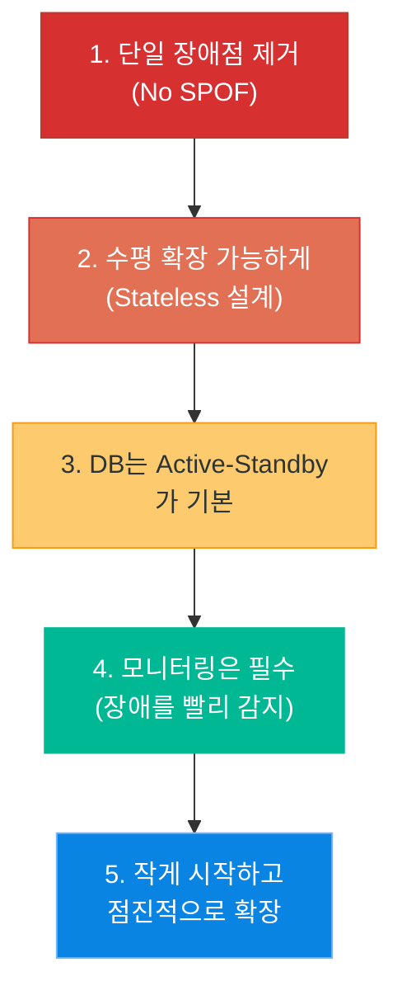

### 각 원칙 상세

| 원칙 | 실천 방법 | 안 하면 벌어지는 일 |
|------|-----------|---------------------|
| **단일 장애점 제거** | 모든 구성요소를 2대 이상으로 이중화 | 한 대 죽으면 전체 서비스 중단 |
| **Stateless 설계** | 세션을 Redis에 저장, 로컬 파일 사용 금지 | 서버 추가 시 세션 유실, 확장 불가 |
| **DB Active-Standby** | Hot Standby로 실시간 복제, 자동 Failover | DB 장애 = 서비스 전체 중단 (가장 치명적) |
| **모니터링 필수** | Health Check, 알림 설정, 대시보드 | 장애를 고객이 먼저 발견 → 신뢰 하락 |
| **점진적 확장** | 트래픽에 맞게 단계적으로 인프라 증설 | 과잉 투자 or 갑작스런 장애 |

### 기억해야 할 것

> "서비스는 반드시 죽는다. 문제는 죽었을 때 **얼마나 빨리 살아나느냐**이다."

- 장애는 예방하는 것이 아니라 **대비하는 것**
- 완벽한 시스템은 없다 → **장애 발생 시 자동 복구되는 시스템**이 좋은 시스템
- 처음부터 네이버 규모로 만들 필요 없다 → **서비스 성장에 맞게 진화**시키면 됨

---

## 추가 참고: 한눈에 보는 용어 정리

| 용어 | 의미 |
|------|------|
| **3-Tier** | 웹-WAS-DB로 나누는 계층 구조 |
| **HA (High Availability)** | 고가용성 — 서비스가 죽지 않게 하는 것 |
| **SPOF** | 단일 장애점 — 이것이 죽으면 전체가 죽는 곳 |
| **Failover** | 장애 시 대기 시스템으로 자동 전환 |
| **Active-Standby** | 한 대 운영 + 한 대 대기 (DB 기본) |
| **Active-Active** | 모두 동시에 운영 (WAS 기본) |
| **Read Replica** | 읽기 전용 복제 DB |
| **LB (Load Balancer)** | 트래픽을 여러 서버에 분배 |
| **Health Check** | 서버가 살아있는지 주기적 확인 |
| **SLA** | 서비스 수준 보장 계약 |
| **Service Mesh** | 마이크로서비스 간 통신 관리 인프라 |
| **Sidecar Proxy** | 서비스 옆에 붙는 프록시 (Envoy) |
| **mTLS** | 서비스 간 상호 인증 + 암호화 통신 |
| **Circuit Breaker** | 장애 전파를 차단하는 패턴 |
