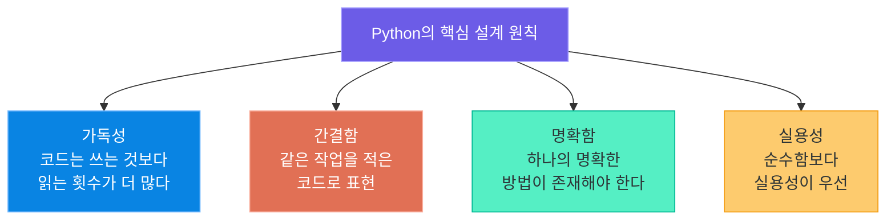
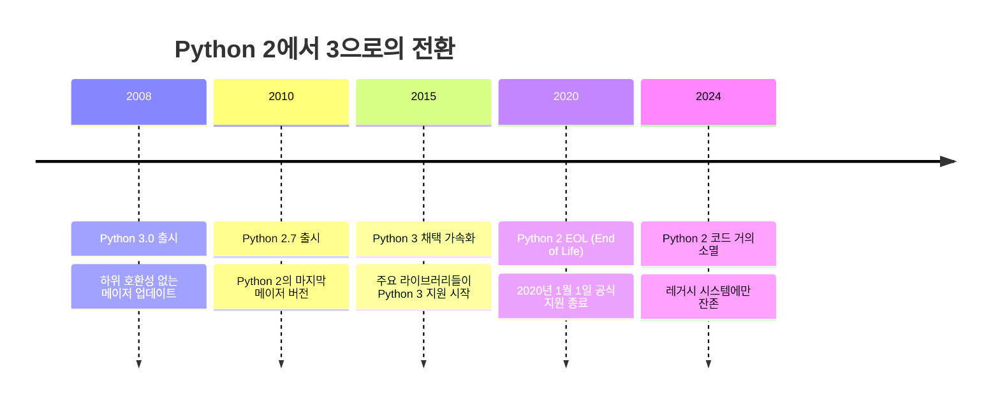
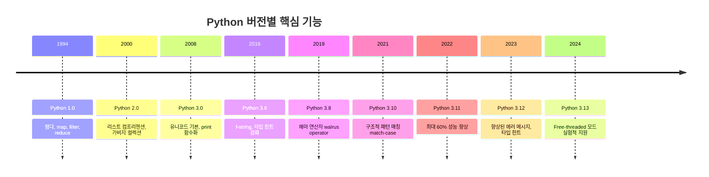
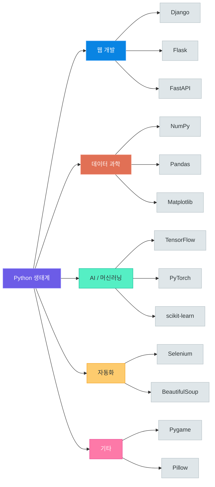
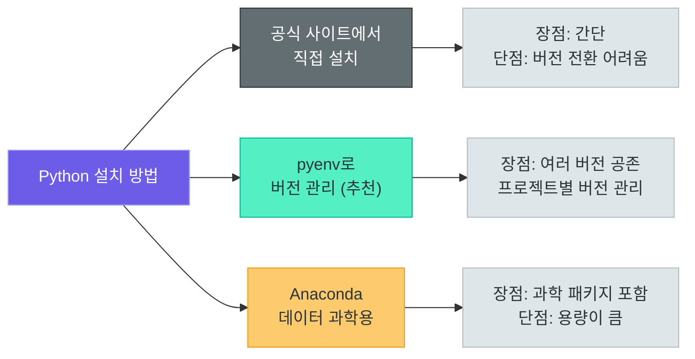
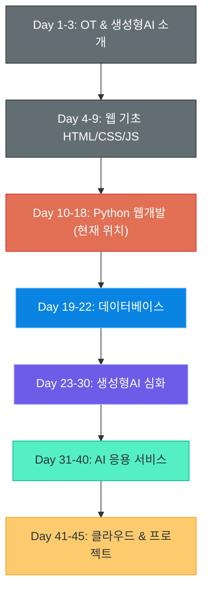
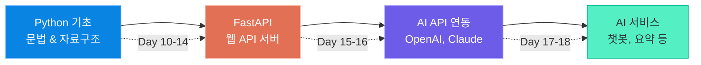

# Python의 역사와 철학

> 세상에서 가장 사랑받는 프로그래밍 언어는 어떻게 탄생했을까?
> 크리스마스 주간에 시작된 취미 프로젝트가 AI 시대의 핵심 언어가 되기까지의 여정을 따라가 봅니다.

---

## 1. Python의 탄생

### 크리스마스에 시작된 프로젝트

1989년 12월, 네덜란드의 프로그래머 **귀도 반 로썸(Guido van Rossum)**은 크리스마스 주간 휴가를 보내고 있었습니다. 당시 그는 네덜란드 국립 수학 및 컴퓨터 과학 연구소(CWI)에서 근무하며 **ABC 언어** 프로젝트에 참여하고 있었는데, ABC의 한계를 느끼고 있었습니다.

> "크리스마스 주간에 할 일이 없어서, 요즘 생각하고 있던 새 스크립팅 언어를 위한
> 인터프리터를 작성하기로 했습니다."
> -- 귀도 반 로썸

그렇게 시작된 "취미 프로젝트"가 바로 **Python**입니다.

| 항목 | 내용 |
|------|------|
| 창시자 | Guido van Rossum (귀도 반 로썸) |
| 착수 시기 | 1989년 12월 (크리스마스 주간) |
| 첫 공개 | 1991년 2월 (버전 0.9.0) |
| 공식 1.0 출시 | 1994년 1월 |
| 영향받은 언어 | ABC, C, Modula-3, Lisp, Haskell |

### 이름의 유래: Monty Python

Python이라는 이름은 뱀이 아니라, 귀도가 좋아하던 영국 코미디 그룹 **"Monty Python's Flying Circus"**에서 따온 것입니다.

귀도는 짧고, 독특하고, 약간 신비로운 이름을 원했다고 합니다. 덕분에 Python 관련 문서나 예제에서는 `spam`, `eggs`, `ham` 같은 Monty Python의 코미디 대사가 변수명으로 자주 등장합니다.

> **핵심 포인트:** Python의 탄생은 "더 나은 프로그래밍 경험"에 대한 한 개발자의 갈망에서 시작되었습니다. 복잡한 기업 프로젝트가 아니라 개인의 호기심과 불편함이 세계에서 가장 인기 있는 언어를 만들어낸 것입니다.

### Python의 설계 철학

귀도가 Python을 설계할 때 세운 핵심 원칙들이 있습니다:



이 철학은 30년이 지난 지금까지도 Python의 모든 결정에 영향을 미치고 있습니다. 새로운 기능을 추가할 때도 "이것이 가독성을 해치지 않는가?"를 항상 먼저 묻습니다.

---

## 2. Python의 철학 -- The Zen of Python

### import this

Python 인터프리터에서 `import this`를 입력하면 **The Zen of Python**이라는 이스터에그가 나타납니다. 이것은 Python의 철학을 19개의 격언으로 정리한 것으로, **Tim Peters**가 작성했습니다.

```python
# Python 인터프리터에서 실행해 보세요
import this
```

실행 결과 (핵심 발췌):

```
The Zen of Python, by Tim Peters

Beautiful is better than ugly.
Explicit is better than implicit.
Simple is better than complex.
Complex is better than complicated.
Flat is better than nested.
Sparse is better than dense.
Readability counts.
...
There should be one-- and preferably only one --obvious way to do it.
...
```

### 핵심 원칙 해설

| 원칙 (영문) | 의미 (한국어) | 실생활 비유 |
|-------------|--------------|------------|
| Beautiful is better than ugly | 아름다운 것이 추한 것보다 낫다 | 정돈된 책상이 업무 효율을 높인다 |
| Explicit is better than implicit | 명시적인 것이 암시적인 것보다 낫다 | 계약서에 모든 조건을 명확히 적는 것 |
| Simple is better than complex | 단순한 것이 복잡한 것보다 낫다 | 레시피는 간단할수록 실패가 적다 |
| Readability counts | 가독성은 중요하다 | 남이 읽을 코드라 생각하고 작성 |
| There should be one obvious way | 하나의 명확한 방법이 있어야 한다 | 목적지까지 최적 경로 하나를 추천 |
| Errors should never pass silently | 에러를 조용히 넘기지 말라 | 자동차 경고등을 무시하지 않는 것 |

### 다른 언어와의 코드 비교

같은 작업("Hello, World!"를 10번 출력)을 여러 언어로 작성해 보겠습니다:

**Java:**
```java
// Java: 클래스, 메인 메서드, 세미콜론 필요
public class HelloWorld {
    public static void main(String[] args) {
        for (int i = 0; i < 10; i++) {
            System.out.println("Hello, World!");
        }
    }
}
```

**C:**
```c
// C: 헤더 파일 포함, 세미콜론, 중괄호 필요
#include <stdio.h>
int main() {
    for (int i = 0; i < 10; i++) {
        printf("Hello, World!\n");
    }
    return 0;
}
```

**Python:**
```python
# Python: 이것이 전부입니다
for i in range(10):
    print("Hello, World!")
```

> **핵심 포인트:** Python은 "개발자의 시간이 컴퓨터의 시간보다 더 소중하다"는 철학을 가지고 있습니다. 컴퓨터가 조금 더 일하더라도 사람이 쉽게 읽고 쓸 수 있는 코드를 지향합니다.

---

## 3. Python 2 vs Python 3

### 왜 두 버전이 공존했는가?

2008년, Python 3.0이 출시되었습니다. 하지만 Python 3는 Python 2와 **하위 호환성이 없었습니다**. 이것은 의도적인 결정이었습니다. Python 2의 설계 실수를 바로잡기 위해서는 "깨뜨리는 변경(breaking changes)"이 불가피했기 때문입니다.

이를 비유하자면, 도시의 도로 체계를 완전히 새로 설계하는 것과 같습니다. 더 효율적인 도로가 되지만, 기존에 길을 외우고 다니던 사람들은 다시 배워야 합니다.

### 주요 차이점 비교

| 구분 | Python 2 | Python 3 |
|------|----------|----------|
| `print` | `print "Hello"` (문장) | `print("Hello")` (함수) |
| 정수 나눗셈 | `5 / 2 = 2` (정수) | `5 / 2 = 2.5` (실수) |
| 문자열 | ASCII 기본, 유니코드는 `u"문자"` | 유니코드 기본 (한글 처리 용이) |
| `range()` | 리스트 반환 (메모리 많이 사용) | 이터레이터 반환 (메모리 효율적) |
| `input()` | `raw_input()` 사용 | `input()` 통일 |
| 예외 처리 | `except Exception, e:` | `except Exception as e:` |
| 나눗셈 연산자 | 정수끼리 나누면 정수 반환 | `//` 사용해야 정수 반환 |

### 코드로 보는 차이

```python
# === Python 2 (더 이상 사용하지 마세요!) ===
# print는 문장(statement)
print "안녕하세요"

# 정수 나눗셈은 정수 결과
result = 5 / 2  # 결과: 2

# 유니코드 문자열은 접두사 필요
name = u"김철수"
```

```python
# === Python 3 (현재 표준) ===
# print는 함수(function)
print("안녕하세요")

# 정수 나눗셈은 실수 결과
result = 5 / 2    # 결과: 2.5
result = 5 // 2   # 결과: 2 (정수 나눗셈은 // 사용)

# 유니코드가 기본
name = "김철수"    # 접두사 없이 바로 사용
```

### Python 2의 종말



**2020년 1월 1일**, Python 2는 공식적으로 지원이 종료(EOL)되었습니다. 더 이상 보안 패치도 제공되지 않습니다.

> **핵심 포인트:** 현재 새로운 프로젝트에서 Python 2를 사용할 이유는 전혀 없습니다. 하지만 금융, 통신 등 레거시 시스템에서는 아직 Python 2 코드가 남아 있어, 마이그레이션 경험이 도움이 될 수 있습니다.

---

## 4. Python 버전 변천사

### 주요 버전별 타임라인



### 각 버전의 핵심 기능

#### Python 3.6 -- f-string (포맷 문자열)

```python
# 이전 방식: 번거롭고 읽기 어려움
name = "Python"
version = 3.6
old_way = "언어: %s, 버전: %.1f" % (name, version)
format_way = "언어: {}, 버전: {}".format(name, version)

# f-string: 직관적이고 깔끔!
new_way = f"언어: {name}, 버전: {version}"

# 표현식도 직접 삽입 가능
price = 15000
print(f"세후 가격: {price * 1.1:,.0f}원")  # 세후 가격: 16,500원
```

#### Python 3.8 -- Walrus Operator (해마 연산자 `:=`)

```python
# 이전 방식: 변수 할당과 조건 검사를 따로
data = input("입력: ")
if len(data) > 10:
    print(f"입력이 너무 깁니다: {len(data)}자")

# 해마 연산자: 할당과 검사를 동시에
if (n := len(input("입력: "))) > 10:
    print(f"입력이 너무 깁니다: {n}자")
```

#### Python 3.10 -- Pattern Matching (패턴 매칭)

```python
# match-case: 구조적 패턴 매칭 (switch문의 강력한 진화)
def handle_command(command):
    match command.split():
        case ["quit"]:
            print("프로그램을 종료합니다")
        case ["hello", name]:
            print(f"안녕하세요, {name}님!")
        case ["add", *numbers]:
            total = sum(int(n) for n in numbers)
            print(f"합계: {total}")
        case _:
            print("알 수 없는 명령어입니다")
```

#### Python 3.11 -- 성능 혁명

Python 3.11은 **CPython Faster** 프로젝트의 첫 결실로, 평균 **25%, 최대 60%** 성능이 향상되었습니다. 별도의 코드 수정 없이 버전 업그레이드만으로 속도가 빨라집니다.

#### Python 3.12 -- 향상된 에러 메시지

```python
# Python 3.12에서는 에러 메시지가 더 친절해졌습니다
# 오타를 치면 "혹시 이것을 의미했나요?"를 제안합니다
import sys
sys.stdlib_module_name  # AttributeError 시 유사 이름 제안
```

#### Python 3.13 -- Free-threaded (실험적)

Python의 오랜 한계였던 **GIL(Global Interpreter Lock)**을 제거하는 실험적 빌드를 지원합니다. 멀티코어 CPU를 온전히 활용할 수 있는 미래가 열리고 있습니다.

### 현재 추천 버전

| 상황 | 추천 버전 | 이유 |
|------|----------|------|
| 새 프로젝트 시작 | **Python 3.12** | 안정성과 최신 기능의 균형 |
| 성능이 중요한 경우 | **Python 3.11+** | CPython Faster 적용 |
| 학습 목적 | **Python 3.10+** | match-case 등 최신 문법 학습 |
| 실험적 기능 탐구 | **Python 3.13** | free-threaded, JIT 등 |

---

## 5. Python 생태계 개요

### Python이 사랑받는 이유

Python은 단순히 "쉬운 언어"가 아닙니다. Python이 진정으로 강력한 이유는 **거대한 생태계** 때문입니다. 요리에 비유하면, Python은 좋은 칼(도구)이지만, 진짜 힘은 세계 각국의 요리 레시피(라이브러리)에 있습니다.



### 분야별 주요 라이브러리

#### 웹 개발

| 프레임워크 | 특징 | 대표 사용처 |
|-----------|------|------------|
| **Django** | "배터리 포함" 풀스택 프레임워크, ORM/인증/관리자페이지 내장 | Instagram, Pinterest |
| **Flask** | 미니멀 마이크로 프레임워크, 자유도 높음 | Netflix (일부), LinkedIn |
| **FastAPI** | 비동기 지원, 자동 문서화, 타입 힌트 기반 | Microsoft, Uber |

#### 데이터 과학

| 라이브러리 | 역할 | 비유 |
|-----------|------|------|
| **NumPy** | 고성능 수치 연산 | 계산기 |
| **Pandas** | 표 형태 데이터 분석 | 엑셀의 초강력 버전 |
| **Matplotlib** | 그래프/차트 시각화 | 그래프 용지와 연필 |
| **Jupyter Notebook** | 대화형 코딩 환경 | 실험 노트북 |

#### AI / 머신러닝

| 프레임워크 | 개발사 | 특징 |
|-----------|--------|------|
| **TensorFlow** | Google | 프로덕션 배포에 강점 |
| **PyTorch** | Meta | 연구/학습에 유연함, 최근 1위 |
| **scikit-learn** | 커뮤니티 | 전통 머신러닝 알고리즘 모음 |
| **Hugging Face** | Hugging Face | 사전학습 모델 허브, Transformers 라이브러리 |

#### 자동화 / 스크립팅

Python은 "접착제 언어(glue language)"라고도 불립니다. 서로 다른 시스템을 연결하고, 반복 작업을 자동화하는 데 탁월합니다.

```python
# 간단한 자동화 예시: 폴더 내 파일 정리
import os
import shutil

# 확장자별로 파일을 분류하는 스크립트
for filename in os.listdir("./downloads"):
    if filename.endswith(".pdf"):
        shutil.move(f"./downloads/{filename}", "./documents/")
    elif filename.endswith((".jpg", ".png")):
        shutil.move(f"./downloads/{filename}", "./images/")
```

---

## 6. Python 개발 환경 설정

### Python 설치

Python을 설치하는 방법은 여러 가지가 있지만, **pyenv**를 사용하는 것을 강력히 추천합니다.



#### pyenv로 Python 설치하기

```bash
# 1. pyenv 설치 (macOS / Linux)
brew install pyenv          # macOS
curl https://pyenv.run | bash  # Linux

# 2. Python 3.12 설치
pyenv install 3.12.4

# 3. 글로벌 버전 설정 및 확인
pyenv global 3.12.4
python --version  # Python 3.12.4
```

#### pyenv의 장점

| 기능 | 설명 |
|------|------|
| 여러 버전 공존 | Python 3.10, 3.11, 3.12를 동시에 설치 가능 |
| 프로젝트별 버전 | 프로젝트 폴더마다 다른 Python 버전 사용 가능 |
| 간편한 전환 | `pyenv local 3.11.9` 한 줄로 전환 |
| 시스템 Python 보호 | OS 기본 Python을 건드리지 않음 |

### 가상 환경 (Virtual Environment)

가상 환경은 프로젝트별로 **독립된 패키지 공간**을 만드는 기능입니다.

왜 필요한지 비유로 설명하면: 요리할 때 재료를 한 냉장고에 다 넣으면 어떤 요리에 어떤 재료가 필요한지 헷갈립니다. 가상 환경은 **요리별로 전용 냉장고를 두는 것**과 같습니다.

```bash
# 1. 가상 환경 생성
python -m venv myproject_env

# 2. 가상 환경 활성화
# macOS/Linux:
source myproject_env/bin/activate

# Windows:
myproject_env\Scripts\activate

# 3. 활성화 확인 (프롬프트에 환경 이름 표시)
(myproject_env) $ python --version

# 4. 패키지 설치 (가상 환경 안에서만 유효)
pip install fastapi

# 5. 가상 환경 비활성화
deactivate
```

### IDE (통합 개발 환경)

| IDE | 특징 | 추천 대상 |
|-----|------|----------|
| **VS Code** | 무료, 가벼움, 풍부한 확장 기능, Python 확장 우수 | 모든 개발자 (특히 입문자) |
| **PyCharm** | Python 전용 IDE, 강력한 디버거/리팩토링 | Python 전문 개발자 |
| **Jupyter Notebook** | 대화형 코딩 환경, 시각화에 강점 | 데이터 과학자, 연구자 |
| **Cursor** | AI 기반 코드 편집기, 코드 자동완성 | AI 활용 개발자 |

### pip 기본 사용법

**pip**는 Python의 패키지 관리자입니다. Node.js의 npm, Java의 Maven과 같은 역할을 합니다.

```bash
# 패키지 설치
pip install requests

# 특정 버전 설치
pip install requests==2.31.0

# 패키지 업그레이드
pip install --upgrade requests

# 설치된 패키지 목록 확인
pip list

# 의존성 파일로 저장 (프로젝트 공유 시 필수!)
pip freeze > requirements.txt

# 의존성 파일에서 일괄 설치
pip install -r requirements.txt

# 패키지 삭제
pip uninstall requests
```

> **핵심 포인트:** `requirements.txt`는 프로젝트의 "레시피"와 같습니다. 다른 개발자가 동일한 환경을 재현할 수 있도록 항상 작성해 두어야 합니다.

---

## 7. 우리 과정에서의 Python

### 커리큘럼 내 위치

이 과정은 총 45일간 진행되며, Python은 **Day 10부터 Day 18**까지 약 9일 동안 집중적으로 학습합니다. 단순히 문법을 배우는 것이 아니라, 최종 목표인 **AI 서비스 개발**로 이어지는 핵심 도구로서 Python을 익히게 됩니다.



### Python 학습 로드맵 (Day 10-18)

| Day | 주제 | 핵심 내용 |
|-----|------|----------|
| Day 10 | Python 역사와 철학 | 언어 배경, 개발 환경 설정 **(오늘)** |
| Day 11 | Python 기본 문법 | 변수, 자료형, 연산자, 조건문, 반복문 |
| Day 12 | 함수와 모듈 | 함수 정의, 모듈 시스템, 패키지 |
| Day 13 | 객체지향 프로그래밍 | 클래스, 상속, 캡슐화 |
| Day 14 | 파일 처리와 예외 | 파일 I/O, try-except, 로깅 |
| Day 15 | FastAPI 입문 | REST API 설계, 라우팅, 요청/응답 |
| Day 16 | FastAPI 심화 | 미들웨어, 인증, 데이터 검증 |
| Day 17 | API 연동 실습 | 외부 API 호출, OpenAI API 연동 |
| Day 18 | 종합 프로젝트 | Python + FastAPI AI 서비스 개발 |

### Python에서 AI 서비스까지의 연결



우리 과정의 학습 흐름은 다음과 같습니다:

1. **Python 기초** (Day 10-14): 문법, 자료구조, 객체지향, 파일 처리를 익힙니다
2. **FastAPI** (Day 15-16): Python으로 웹 API 서버를 구축하는 방법을 배웁니다
3. **AI API 연동** (Day 17): OpenAI, Claude 등의 AI 모델을 API로 호출합니다
4. **AI 서비스 개발** (Day 18): 배운 모든 것을 결합하여 실제 AI 서비스를 만듭니다

> **핵심 포인트:** Python은 이 과정에서 "도구"의 역할을 합니다. Python 자체를 깊이 파는 것이 목적이 아니라, Python을 사용하여 AI 서비스를 만드는 것이 최종 목표입니다. 따라서 완벽하게 문법을 외우기보다는 "필요한 것을 찾아서 쓸 수 있는 능력"을 기르는 데 집중하겠습니다.

---

## 8. 핵심 정리

### 요약 표

| 항목 | 핵심 내용 |
|------|----------|
| 탄생 | 1991년, 귀도 반 로썸의 크리스마스 주간 프로젝트 |
| 이름 유래 | Monty Python (영국 코미디 그룹) |
| 철학 | 가독성, 간결함, "하나의 명확한 방법", 실용성 |
| The Zen of Python | `import this`로 확인 가능한 19가지 설계 원칙 |
| Python 2 vs 3 | Python 2는 2020.1.1 EOL, 현재는 Python 3만 사용 |
| 현재 추천 버전 | Python 3.12 (안정성과 기능의 균형) |
| 주요 생태계 | 웹(FastAPI), 데이터(Pandas), AI(PyTorch) |
| 개발 환경 | pyenv + venv + VS Code 추천 |
| 과정 내 위치 | Day 10-18, Python → FastAPI → AI 서비스 개발 |

### Python이 AI 시대에 특별한 이유

Python이 AI/ML 분야에서 사실상의 표준 언어가 된 이유를 정리하면 다음과 같습니다:

1. **낮은 진입 장벽**: 비전공자 연구자들도 쉽게 배울 수 있습니다
2. **풍부한 라이브러리**: NumPy, PyTorch, TensorFlow 등 핵심 도구가 모두 Python 기반입니다
3. **프로토타이핑 속도**: 아이디어를 빠르게 코드로 구현할 수 있습니다
4. **커뮤니티**: Stack Overflow, GitHub에서 Python 관련 답변이 가장 많습니다
5. **기업 지원**: Google, Meta, Microsoft 모두 Python을 핵심 언어로 지원합니다

---

## 다음 강의 미리보기

> 다음 강의 **[02. Python 기본 문법](02_python_syntax_basics.md)**에서는 Python의 변수, 자료형, 연산자, 조건문, 반복문을 직접 코드를 작성하며 학습합니다.
> 오늘 배운 Python의 철학 -- "간결하고 아름다운 코드" -- 이 문법에서 어떻게 구현되는지 직접 체험해 보겠습니다!

```python
# 다음 시간 미리보기: Python 기본 문법 맛보기
name = input("이름을 입력하세요: ")
print(f"환영합니다, {name}님! Python의 세계에 오신 것을 환영합니다.")
```
