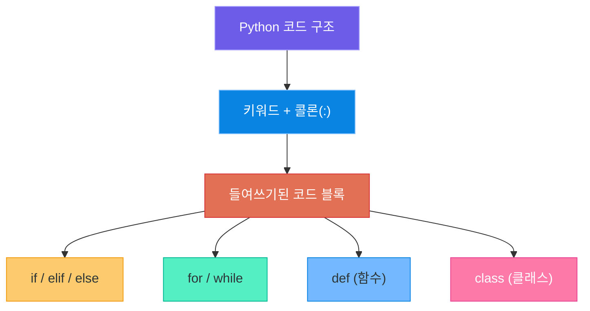
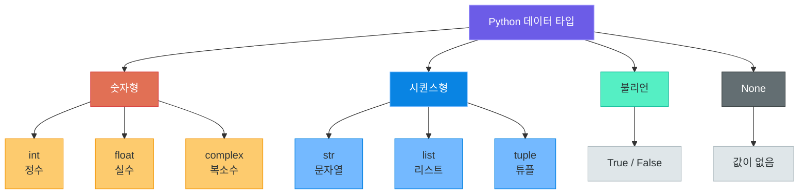
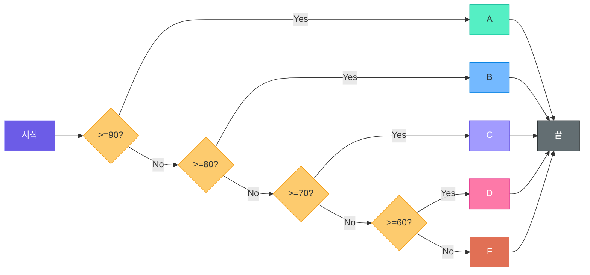
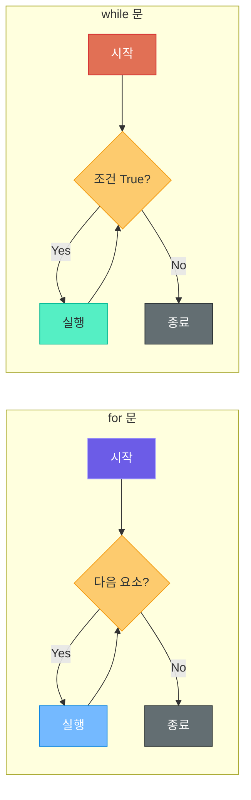
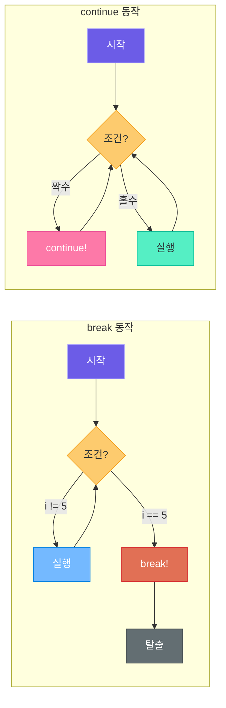
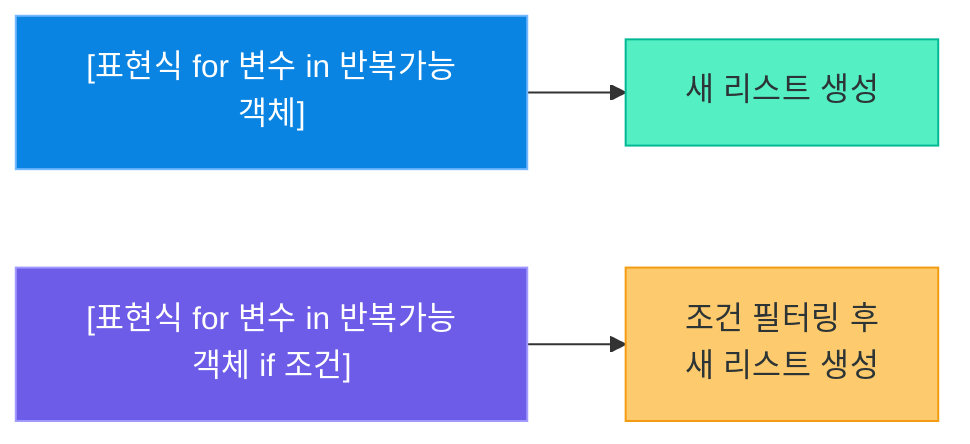
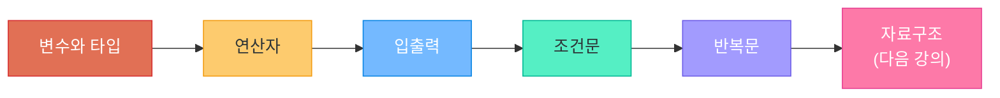

# Python 기본 문법

> 프로그래밍의 알파벳 -- 변수, 조건, 반복을 익히면 어떤 프로그램이든 만들 수 있습니다

---

## 1. 들여쓰기와 코드 구조

### Python은 "보이는 대로" 실행된다

대부분의 프로그래밍 언어는 중괄호 `{}`로 코드 블록을 구분합니다. 하지만 Python은 **들여쓰기(indentation)**로 코드의 구조를 결정합니다. 이것은 마치 글을 쓸 때 문단을 나누는 것과 같습니다. 들여쓰기가 곧 코드의 논리 구조입니다.

```python
# Python -- 들여쓰기로 블록을 구분
if score >= 90:
    print("A학점입니다")     # 4칸 들여쓰기
    print("축하합니다!")     # 같은 블록
else:
    print("다음에 더 잘하세요")  # 다른 블록
```

비교를 위해 다른 언어에서는 어떻게 하는지 살펴봅시다.

```java
// Java -- 중괄호로 블록을 구분
if (score >= 90) {
    System.out.println("A학점입니다");
    System.out.println("축하합니다!");
} else {
    System.out.println("다음에 더 잘하세요");
}
```

```javascript
// JavaScript -- 역시 중괄호 사용
if (score >= 90) {
    console.log("A학점입니다");
    console.log("축하합니다!");
} else {
    console.log("다음에 더 잘하세요");
}
```

### 들여쓰기 규칙

| 규칙 | 설명 |
|------|------|
| **4칸 공백** 사용 | Python 공식 스타일 가이드(PEP 8) 권장 |
| 탭(Tab) vs 공백(Space) | 하나만 선택해서 일관되게 사용 (공백 권장) |
| **혼용 금지** | 탭과 공백을 섞으면 에러 발생 |
| 같은 블록은 같은 깊이 | 같은 블록 안에서는 동일한 들여쓰기 필수 |

### 들여쓰기 실수 예시

```python
# IndentationError 발생! -- 들여쓰기가 잘못된 경우
if True:
    print("첫 번째 줄")
      print("두 번째 줄")  # 들여쓰기 깊이가 다르면 에러!

# 올바른 코드
if True:
    print("첫 번째 줄")
    print("두 번째 줄")  # 같은 깊이로 맞춰야 합니다
```

> **핵심 포인트:** Python에서 들여쓰기는 단순한 스타일이 아니라 **문법의 일부**입니다. 들여쓰기가 잘못되면 프로그램이 아예 실행되지 않습니다. 대부분의 코드 편집기(VS Code 등)에서는 Tab 키를 누르면 자동으로 4칸 공백으로 변환해 줍니다.

### 코드 블록의 구조



Python에서 코드 블록을 만드는 패턴은 언제나 동일합니다. **키워드 뒤에 콜론(`:`)을 붙이고**, 다음 줄부터 **4칸 들여쓰기**를 하면 됩니다.

```python
# 모든 코드 블록은 같은 패턴을 따릅니다
if 조건:
    실행할 코드    # 4칸 들여쓰기

for 변수 in 범위:
    실행할 코드    # 4칸 들여쓰기

def 함수이름():
    실행할 코드    # 4칸 들여쓰기
```

---

## 2. 변수와 데이터 타입

### 변수란?

변수(Variable)는 **데이터를 담는 그릇**입니다. 실생활에서 라벨이 붙은 상자를 떠올려 보세요. 상자에 "사과"라는 라벨을 붙이면, 나중에 "사과 상자"라고 부르며 내용물을 꺼낼 수 있습니다. Python에서의 변수도 마찬가지입니다.

```python
# 변수에 값 할당하기
name = "홍길동"       # 문자열(str)을 담는 변수
age = 25              # 정수(int)를 담는 변수
height = 175.5        # 실수(float)를 담는 변수
is_student = True     # 불리언(bool)을 담는 변수
```

### 동적 타이핑 (Dynamic Typing)

Python은 **동적 타이핑** 언어입니다. 변수를 만들 때 타입을 미리 선언하지 않아도 됩니다. 값을 넣으면 Python이 알아서 타입을 결정합니다.

```python
# Python -- 타입 선언 불필요 (동적 타이핑)
x = 10          # x는 정수(int)
x = "안녕"      # 같은 x가 이제 문자열(str)
x = 3.14        # 같은 x가 이제 실수(float)
```

```java
// Java -- 타입 선언 필수 (정적 타이핑)
int x = 10;             // x는 정수로 고정
// x = "안녕";          // 에러! 정수 변수에 문자열 불가
```

| 특징 | 동적 타이핑 (Python) | 정적 타이핑 (Java, C) |
|------|---------------------|---------------------|
| 타입 선언 | 불필요 | 필수 |
| 타입 변경 | 자유롭게 가능 | 불가능 |
| 장점 | 코드가 간결, 빠른 개발 | 컴파일 시 오류 발견, 안정성 |
| 단점 | 런타임 에러 가능성 | 코드가 길어짐 |

### Python의 기본 데이터 타입



### 기본 타입 상세

```python
# 정수 (int) -- 소수점 없는 숫자
count = 100
negative = -50
big_number = 1_000_000  # 언더스코어로 자릿수 구분 가능

# 실수 (float) -- 소수점이 있는 숫자
pi = 3.14159
temperature = -12.5
scientific = 2.5e10     # 과학적 표기법 (2.5 x 10^10)

# 문자열 (str) -- 텍스트 데이터
greeting = "안녕하세요"
name = '홍길동'         # 작은따옴표도 가능
long_text = """여러 줄에 걸친
긴 문자열도
작성할 수 있습니다"""

# 불리언 (bool) -- 참/거짓
is_active = True
is_deleted = False

# None -- 값이 없음을 나타냄
result = None           # "아직 값이 정해지지 않았다"는 의미
```

### type() 함수로 타입 확인하기

```python
# type() -- 변수의 타입을 확인하는 함수
print(type(42))          # <class 'int'>
print(type(3.14))        # <class 'float'>
print(type("Python"))    # <class 'str'>
print(type(True))        # <class 'bool'>
print(type(None))        # <class 'NoneType'>

# 변수의 타입 확인
age = 25
print(type(age))         # <class 'int'>
```

### 타입 변환 (캐스팅)

서로 다른 타입 사이를 변환할 수 있습니다. 이것을 **캐스팅(casting)**이라고 합니다.

```python
# 문자열 → 숫자
age_str = "25"
age_int = int(age_str)       # 25 (정수)
price_float = float("19.99") # 19.99 (실수)

# 숫자 → 문자열
num = 100
num_str = str(num)           # "100"

# 실수 → 정수 (소수점 이하 버림)
pi = 3.99
pi_int = int(pi)             # 3 (반올림이 아님!)

# 숫자 → 불리언
print(bool(0))       # False (0은 거짓)
print(bool(1))       # True  (0이 아닌 수는 참)
print(bool(""))      # False (빈 문자열은 거짓)
print(bool("hello")) # True  (내용이 있는 문자열은 참)
```

### 변수 이름 규칙

| 규칙 | 올바른 예 | 잘못된 예 |
|------|----------|----------|
| 영문, 숫자, 언더스코어 사용 | `my_name`, `age2` | `my-name`, `age!` |
| 숫자로 시작 불가 | `name1` | `1name` |
| 예약어 사용 불가 | `my_class` | `class`, `if`, `for` |
| 대소문자 구분 | `Name`과 `name`은 다른 변수 | - |
| 한글 사용 가능 (비권장) | `이름 = "홍길동"` | - |

> **핵심 포인트:** Python에서는 변수 이름을 **snake_case** (소문자 + 언더스코어)로 짓는 것이 관례입니다. 예: `user_name`, `total_score`, `is_valid`

---

## 3. 문자열 다루기

### 문자열 생성 방법

```python
# 작은따옴표
msg1 = '안녕하세요'

# 큰따옴표
msg2 = "반갑습니다"

# 따옴표 안에 따옴표 넣기
msg3 = "He said 'Hello'"    # 큰따옴표 안에 작은따옴표
msg4 = 'She said "Hi"'      # 작은따옴표 안에 큰따옴표
msg5 = "It\'s a book"       # 이스케이프 문자(\') 사용

# 여러 줄 문자열 (삼중 따옴표)
poem = """장미는 빨갛고
제비꽃은 파랗고
Python은 아름답습니다"""

# f-string (포매팅 문자열) -- Python 3.6+
name = "홍길동"
age = 25
intro = f"저는 {name}이고, {age}살입니다"
# 결과: "저는 홍길동이고, 25살입니다"
```

### 문자열 인덱싱

문자열의 각 글자는 **번호(인덱스)**를 가지고 있습니다.

```python
text = "Python"
#       P  y  t  h  o  n
# 정방향  0  1  2  3  4  5
# 역방향 -6 -5 -4 -3 -2 -1

print(text[0])    # P  (첫 번째 글자)
print(text[5])    # n  (여섯 번째 글자)
print(text[-1])   # n  (마지막 글자)
print(text[-2])   # o  (뒤에서 두 번째)
```

### 문자열 슬라이싱

슬라이싱은 문자열의 **일부분을 잘라내는** 기능입니다.

```python
text = "Hello Python World"

# [시작:끝] -- 시작 인덱스부터 끝 인덱스 "전"까지
print(text[0:5])    # "Hello"
print(text[6:12])   # "Python"

# 시작 또는 끝 생략
print(text[:5])     # "Hello"       (처음부터 5 전까지)
print(text[13:])    # "World"       (13부터 끝까지)

# [시작:끝:간격]
print(text[::2])    # "HloPto ol"   (2칸씩 건너뛰기)
print(text[::-1])   # "dlroW nohtyP olleH" (뒤집기!)
```

### 주요 문자열 메서드

```python
text = "  Hello, Python World!  "

# 대소문자 변환
print(text.upper())        # "  HELLO, PYTHON WORLD!  "
print(text.lower())        # "  hello, python world!  "

# 공백 제거
print(text.strip())        # "Hello, Python World!"  (양쪽 공백 제거)
print(text.lstrip())       # "Hello, Python World!  " (왼쪽 공백 제거)
print(text.rstrip())       # "  Hello, Python World!" (오른쪽 공백 제거)

# 분리와 결합
fruits = "사과,배,포도,딸기"
fruit_list = fruits.split(",")  # ['사과', '배', '포도', '딸기']
rejoined = " / ".join(fruit_list)  # "사과 / 배 / 포도 / 딸기"

# 찾기와 바꾸기
msg = "Python is fun"
print(msg.find("is"))       # 7  (찾은 위치의 인덱스)
print(msg.find("Java"))     # -1 (못 찾으면 -1)
print(msg.replace("fun", "awesome"))  # "Python is awesome"

# 시작/끝 확인
filename = "report.pdf"
print(filename.startswith("report"))  # True
print(filename.endswith(".pdf"))      # True

# 개수 세기
text2 = "banana"
print(text2.count("a"))     # 3
```

### 문자열 메서드 요약표

| 메서드 | 설명 | 예시 | 결과 |
|--------|------|------|------|
| `upper()` | 대문자로 변환 | `"hi".upper()` | `"HI"` |
| `lower()` | 소문자로 변환 | `"HI".lower()` | `"hi"` |
| `strip()` | 양쪽 공백 제거 | `" hi ".strip()` | `"hi"` |
| `split(sep)` | 구분자로 분리 | `"a,b".split(",")` | `['a','b']` |
| `join(list)` | 리스트를 결합 | `",".join(['a','b'])` | `"a,b"` |
| `replace(a,b)` | a를 b로 교체 | `"cat".replace("c","b")` | `"bat"` |
| `find(s)` | 위치 검색 | `"hello".find("ll")` | `2` |
| `count(s)` | 개수 세기 | `"aaa".count("a")` | `3` |

### 문자열 포매팅 비교

```python
name = "홍길동"
age = 25
score = 95.678

# 방법 1: f-string (권장! Python 3.6+)
print(f"이름: {name}, 나이: {age}세")
print(f"점수: {score:.1f}점")           # 소수점 1자리: 95.7

# 방법 2: format() 메서드
print("이름: {}, 나이: {}세".format(name, age))
print("이름: {0}, 나이: {1}세".format(name, age))

# 방법 3: % 연산자 (구식 방법)
print("이름: %s, 나이: %d세" % (name, age))
print("점수: %.1f점" % score)
```

| 방법 | 문법 | 특징 |
|------|------|------|
| **f-string** | `f"값: {변수}"` | 가장 직관적, 빠름, **권장** |
| `format()` | `"값: {}".format(변수)` | Python 3 표준 |
| `%` 연산자 | `"값: %s" % 변수` | C 스타일, 구식 |

> **핵심 포인트:** 새로 작성하는 코드에서는 **f-string**을 사용하세요. 가독성이 가장 좋고, 실행 속도도 빠릅니다.

---

## 4. 숫자와 연산자

### 산술 연산자

```python
a = 10
b = 3

print(a + b)    # 13   더하기
print(a - b)    # 7    빼기
print(a * b)    # 30   곱하기
print(a / b)    # 3.33 나누기 (항상 float 결과)
print(a // b)   # 3    몫 (정수 나누기)
print(a % b)    # 1    나머지
print(a ** b)   # 1000 거듭제곱 (10의 3제곱)
```

| 연산자 | 이름 | 예시 | 결과 |
|--------|------|------|------|
| `+` | 덧셈 | `7 + 3` | `10` |
| `-` | 뺄셈 | `7 - 3` | `4` |
| `*` | 곱셈 | `7 * 3` | `21` |
| `/` | 나눗셈 | `7 / 3` | `2.333...` |
| `//` | 몫 (정수 나눗셈) | `7 // 3` | `2` |
| `%` | 나머지 | `7 % 3` | `1` |
| `**` | 거듭제곱 | `2 ** 10` | `1024` |

### 비교 연산자

```python
x = 10
y = 5

print(x == y)   # False  같은가?
print(x != y)   # True   다른가?
print(x > y)    # True   큰가?
print(x < y)    # False  작은가?
print(x >= 10)  # True   크거나 같은가?
print(x <= 5)   # False  작거나 같은가?
```

| 연산자 | 의미 | 예시 | 결과 |
|--------|------|------|------|
| `==` | 같다 | `5 == 5` | `True` |
| `!=` | 다르다 | `5 != 3` | `True` |
| `>` | 크다 | `5 > 3` | `True` |
| `<` | 작다 | `5 < 3` | `False` |
| `>=` | 크거나 같다 | `5 >= 5` | `True` |
| `<=` | 작거나 같다 | `5 <= 3` | `False` |

### 논리 연산자

여러 조건을 **조합**할 때 사용합니다.

```python
age = 25
has_id = True

# and -- 둘 다 True여야 True
print(age >= 18 and has_id)     # True (성인이고 신분증 있음)

# or -- 하나라도 True이면 True
print(age < 18 or has_id)       # True (미성년은 아니지만 신분증 있음)

# not -- True와 False를 뒤집음
print(not has_id)               # False
```

| 연산자 | 의미 | 예시 | 결과 |
|--------|------|------|------|
| `and` | 그리고 (둘 다 참) | `True and False` | `False` |
| `or` | 또는 (하나만 참) | `True or False` | `True` |
| `not` | 부정 (반대) | `not True` | `False` |

### 할당 연산자

변수에 값을 저장하거나 업데이트할 때 사용합니다.

```python
x = 10      # 기본 할당

x += 5      # x = x + 5  → 15
x -= 3      # x = x - 3  → 12
x *= 2      # x = x * 2  → 24
x /= 4      # x = x / 4  → 6.0
x //= 2     # x = x // 2 → 3.0
x %= 2      # x = x % 2  → 1.0
x **= 3     # x = x ** 3 → 1.0
```

### 연산자 우선순위

수학에서처럼 Python에서도 연산자에는 우선순위가 있습니다.

```python
# 우선순위에 따른 계산
result = 2 + 3 * 4       # 14 (곱하기가 먼저)
result = (2 + 3) * 4     # 20 (괄호가 가장 먼저)
result = 2 ** 3 ** 2     # 512 (거듭제곱은 오른쪽부터)
```

| 우선순위 | 연산자 | 설명 |
|---------|--------|------|
| 1 (높음) | `()` | 괄호 |
| 2 | `**` | 거듭제곱 |
| 3 | `+x`, `-x`, `not` | 단항 연산자, 논리 부정 |
| 4 | `*`, `/`, `//`, `%` | 곱셈, 나눗셈 |
| 5 | `+`, `-` | 덧셈, 뺄셈 |
| 6 | `==`, `!=`, `<`, `>`, `<=`, `>=` | 비교 |
| 7 | `and` | 논리 AND |
| 8 (낮음) | `or` | 논리 OR |

> **핵심 포인트:** 우선순위가 헷갈릴 때는 **괄호 `()`**를 사용하세요. 괄호는 코드의 의도를 명확하게 만들어 줍니다. `(2 + 3) * 4`가 `2 + 3 * 4`보다 읽기 쉽습니다.

---

## 5. 입출력

### print() 함수 -- 화면에 출력하기

`print()` 함수는 Python에서 가장 먼저, 가장 많이 사용하는 함수입니다. 디버깅할 때도, 결과를 확인할 때도 항상 `print()`를 씁니다.

```python
# 기본 출력
print("Hello, Python!")          # Hello, Python!

# 여러 값 출력 (쉼표로 구분, 공백으로 연결)
print("이름:", "홍길동", "나이:", 25)
# 이름: 홍길동 나이: 25

# sep 매개변수 -- 구분자 변경
print("2025", "04", "20", sep="-")   # 2025-04-20
print("A", "B", "C", sep=" -> ")     # A -> B -> C

# end 매개변수 -- 줄바꿈 대신 다른 문자
print("로딩중", end="...")
print("완료!")
# 로딩중...완료!

# 여러 줄에 걸쳐 옆으로 출력
for i in range(5):
    print(i, end=" ")   # 0 1 2 3 4
```

### input() 함수 -- 사용자 입력 받기

```python
# 기본 입력 -- 항상 문자열(str)로 반환
name = input("이름을 입력하세요: ")
print(f"안녕하세요, {name}님!")

# 숫자 입력 -- 반드시 타입 변환 필요!
age = int(input("나이를 입력하세요: "))     # str → int
height = float(input("키를 입력하세요: "))  # str → float

# 실용적인 예시 -- 간단한 계산기
num1 = float(input("첫 번째 숫자: "))
num2 = float(input("두 번째 숫자: "))
print(f"{num1} + {num2} = {num1 + num2}")
```

### 포매팅된 출력

```python
# 정렬과 패딩
name = "홍길동"
score = 95

print(f"|{name:>10}|")    # |       홍길동|  오른쪽 정렬 (10칸)
print(f"|{name:<10}|")    # |홍길동       |  왼쪽 정렬
print(f"|{name:^10}|")    # |   홍길동    |  가운데 정렬
print(f"|{name:*^10}|")   # |***홍길동****|  빈칸을 *로 채우기

# 숫자 포매팅
pi = 3.141592653589793
print(f"원주율: {pi:.2f}")       # 원주율: 3.14 (소수점 2자리)
print(f"원주율: {pi:.4f}")       # 원주율: 3.1416 (소수점 4자리)

big = 1234567890
print(f"금액: {big:,}원")        # 금액: 1,234,567,890원

percent = 0.856
print(f"정답률: {percent:.1%}")  # 정답률: 85.6%
```

---

## 6. 조건문

### 조건문이란?

조건문은 프로그램에서 **"만약 ~라면"**이라는 판단을 내리는 구문입니다. 일상에서 우리가 하는 수많은 판단과 같습니다. "비가 오면 우산을 가져가고, 맑으면 그냥 간다" -- 이것이 바로 조건문의 원리입니다.

### if, elif, else

```python
# 기본 구조
score = 85

if score >= 90:
    grade = "A"
    print("우수합니다!")
elif score >= 80:
    grade = "B"
    print("잘했습니다!")
elif score >= 70:
    grade = "C"
    print("보통입니다")
elif score >= 60:
    grade = "D"
    print("좀 더 노력하세요")
else:
    grade = "F"
    print("재시험이 필요합니다")

print(f"학점: {grade}")   # 학점: B
```

### 조건문 흐름도



### 중첩 조건문

조건문 안에 또 다른 조건문을 넣을 수 있습니다.

```python
age = 20
has_ticket = True

if age >= 18:
    if has_ticket:
        print("입장 가능합니다")
    else:
        print("티켓을 구매해 주세요")
else:
    print("만 18세 이상만 입장 가능합니다")
```

> **핵심 포인트:** 중첩이 3단계 이상 깊어지면 코드가 읽기 어려워집니다. 이때는 함수로 분리하거나 `and`/`or` 연산자를 활용하여 조건을 합치는 것이 좋습니다.

```python
# 중첩 대신 and를 사용하여 단순화
if age >= 18 and has_ticket:
    print("입장 가능합니다")
elif age >= 18:
    print("티켓을 구매해 주세요")
else:
    print("만 18세 이상만 입장 가능합니다")
```

### 삼항 연산자 (조건 표현식)

간단한 조건문을 한 줄로 작성할 수 있습니다.

```python
# 기본 if-else
age = 20
if age >= 18:
    status = "성인"
else:
    status = "미성년"

# 삼항 연산자로 한 줄로 작성
status = "성인" if age >= 18 else "미성년"

# 실용 예시
score = 75
result = "합격" if score >= 60 else "불합격"
print(result)   # 합격
```

### match-case (Python 3.10+)

Python 3.10부터 도입된 **구조적 패턴 매칭**입니다. 다른 언어의 `switch-case`와 유사하지만 훨씬 강력합니다.

```python
# HTTP 상태 코드 판별
status_code = 404

match status_code:
    case 200:
        message = "OK - 성공"
    case 301:
        message = "Moved - 페이지 이동"
    case 404:
        message = "Not Found - 페이지를 찾을 수 없음"
    case 500:
        message = "Server Error - 서버 오류"
    case _:       # 그 외 모든 경우 (default)
        message = f"알 수 없는 상태 코드: {status_code}"

print(message)   # Not Found - 페이지를 찾을 수 없음
```

```python
# 명령어 처리 예시
command = "quit"

match command.lower():
    case "start" | "begin":       # 여러 값 매칭 (OR)
        print("프로그램을 시작합니다")
    case "stop" | "quit" | "exit":
        print("프로그램을 종료합니다")
    case "help":
        print("도움말을 표시합니다")
    case _:
        print(f"알 수 없는 명령어: {command}")
```

---

## 7. 반복문

### 반복문이란?

반복문은 **같은 작업을 여러 번 반복**하는 구문입니다. 100명의 학생에게 성적표를 보내야 한다면, 같은 코드를 100번 쓰는 대신 반복문을 사용하면 됩니다.

### for 문

`for` 문은 **정해진 횟수**만큼 반복하거나, 리스트 같은 **시퀀스(sequence)**의 요소를 하나씩 꺼내며 반복합니다.

```python
# 리스트의 각 요소를 순회
fruits = ["사과", "바나나", "딸기", "포도"]
for fruit in fruits:
    print(f"나는 {fruit}을(를) 좋아합니다")

# 문자열의 각 글자를 순회
for char in "Python":
    print(char, end=" ")   # P y t h o n
```

### range() 함수

```python
# range(끝) -- 0부터 끝-1까지
for i in range(5):
    print(i, end=" ")      # 0 1 2 3 4

# range(시작, 끝) -- 시작부터 끝-1까지
for i in range(1, 6):
    print(i, end=" ")      # 1 2 3 4 5

# range(시작, 끝, 간격)
for i in range(0, 10, 2):
    print(i, end=" ")      # 0 2 4 6 8

# 거꾸로 세기
for i in range(5, 0, -1):
    print(i, end=" ")      # 5 4 3 2 1
```

### enumerate() -- 인덱스와 값을 함께

```python
# 인덱스가 필요한 경우
fruits = ["사과", "바나나", "딸기"]

# enumerate 없이
for i in range(len(fruits)):
    print(f"{i}번: {fruits[i]}")

# enumerate 사용 -- 더 파이썬스럽게(Pythonic)!
for i, fruit in enumerate(fruits):
    print(f"{i}번: {fruit}")

# 시작 번호 지정
for i, fruit in enumerate(fruits, start=1):
    print(f"{i}번: {fruit}")
    # 1번: 사과
    # 2번: 바나나
    # 3번: 딸기
```

### zip() -- 여러 리스트를 묶어서 순회

```python
names = ["홍길동", "김영희", "이철수"]
scores = [90, 85, 78]
grades = ["A", "B", "C"]

for name, score, grade in zip(names, scores, grades):
    print(f"{name}: {score}점 ({grade})")
# 홍길동: 90점 (A)
# 김영희: 85점 (B)
# 이철수: 78점 (C)
```

### 반복문 흐름도



### while 문

`while` 문은 **조건이 참인 동안** 계속 반복합니다.

```python
# 기본 while 문
count = 0
while count < 5:
    print(f"반복 {count}회")
    count += 1           # 잊으면 무한 루프!

# 사용자 입력 반복 -- 실용적인 예시
while True:
    answer = input("계속하시겠습니까? (yes/no): ")
    if answer.lower() == "no":
        print("종료합니다")
        break            # while 탈출
    print("계속 진행합니다...")
```

### break, continue, else

```python
# break -- 반복문을 즉시 탈출
for i in range(10):
    if i == 5:
        print("5를 찾았습니다! 중단합니다.")
        break
    print(i, end=" ")
# 0 1 2 3 4 5를 찾았습니다! 중단합니다.

# continue -- 이번 반복만 건너뛰고 다음으로
for i in range(10):
    if i % 2 == 0:       # 짝수면 건너뛰기
        continue
    print(i, end=" ")
# 1 3 5 7 9

# else -- 반복이 "정상 완료"되면 실행 (break 없이 끝난 경우)
for i in range(5):
    if i == 10:          # 이 조건은 절대 충족되지 않음
        break
else:
    print("반복이 정상적으로 완료되었습니다")
# "반복이 정상적으로 완료되었습니다" 출력
```

### break와 continue 흐름도



### 리스트 컴프리헨션 (기본 소개)

리스트 컴프리헨션은 **for 문을 한 줄로 압축**하여 리스트를 만드는 Python만의 문법입니다.

```python
# 일반적인 for 문으로 리스트 생성
squares = []
for i in range(1, 6):
    squares.append(i ** 2)
print(squares)   # [1, 4, 9, 16, 25]

# 리스트 컴프리헨션으로 한 줄에!
squares = [i ** 2 for i in range(1, 6)]
print(squares)   # [1, 4, 9, 16, 25]

# 조건을 포함한 컴프리헨션
evens = [i for i in range(1, 11) if i % 2 == 0]
print(evens)     # [2, 4, 6, 8, 10]

# 실용 예시 -- 문자열 리스트를 대문자로 변환
names = ["alice", "bob", "charlie"]
upper_names = [name.upper() for name in names]
print(upper_names)  # ['ALICE', 'BOB', 'CHARLIE']
```



> **핵심 포인트:** 리스트 컴프리헨션은 Python에서 가장 "파이썬다운(Pythonic)" 문법 중 하나입니다. 단, 너무 복잡한 로직은 일반 for 문이 더 읽기 쉬울 수 있으니 적절히 판단하세요.

---

## 8. 주석과 Docstring

### 주석이란?

주석(comment)은 **사람이 읽기 위한 메모**입니다. Python 인터프리터는 주석을 완전히 무시합니다.

### 한 줄 주석 (#)

```python
# 이것은 한 줄 주석입니다
print("안녕하세요")  # 이렇게 코드 옆에도 작성 가능

# 사용자 정보를 가져오는 부분
name = input("이름: ")       # 이름 입력받기
age = int(input("나이: "))   # 나이 입력받기 (정수로 변환)
```

### 여러 줄 주석

```python
# 방법 1: # 여러 개 사용 (권장)
# 이 함수는 사용자의 BMI를 계산합니다.
# BMI = 체중(kg) / 키(m)^2
# 참고: WHO 기준에 따른 분류를 적용합니다.

# 방법 2: 삼중 따옴표 사용 (문자열이지만 주석처럼 사용)
"""
주의: 이 방법은 실제로 문자열 객체를 생성하므로
함수나 클래스 바로 아래에서 쓰면 Docstring으로 인식됩니다.
일반적인 주석에는 # 사용을 권장합니다.
"""
```

### Docstring (문서화 문자열)

Docstring은 함수, 클래스, 모듈의 **설명서** 역할을 합니다.

```python
def calculate_bmi(weight, height):
    """BMI(체질량지수)를 계산합니다.

    Args:
        weight (float): 체중 (kg)
        height (float): 키 (m)

    Returns:
        float: 계산된 BMI 값

    Examples:
        >>> calculate_bmi(70, 1.75)
        22.86
    """
    return round(weight / (height ** 2), 2)


# Docstring 확인하기
print(calculate_bmi.__doc__)
help(calculate_bmi)
```

### 좋은 주석 vs 나쁜 주석

```python
# 나쁜 주석 -- "무엇을 하는지" 설명 (코드를 보면 알 수 있는 것)
x = x + 1  # x에 1을 더함

# 좋은 주석 -- "왜 그렇게 하는지" 설명
x = x + 1  # 인덱스가 0부터 시작하므로 사용자에게 보여줄 때 1을 더함
```

| 구분 | 주석 (#) | Docstring (""") |
|------|---------|----------------|
| 위치 | 어디서든 사용 가능 | 함수/클래스/모듈의 첫 줄 |
| 대상 | 개발자를 위한 메모 | API 사용자를 위한 설명서 |
| 접근 | 코드를 직접 읽어야 함 | `help()`, `__doc__`으로 접근 가능 |
| 스타일 | 자유로운 형식 | Google, NumPy 등 표준 형식 존재 |

> **핵심 포인트:** 코드가 "무엇을 하는지"보다는 **"왜 그렇게 하는지"**를 주석으로 남기세요. 잘 작성된 코드는 그 자체로 "무엇을"을 설명합니다. 주석은 코드만으로 전달하기 어려운 의도와 맥락을 보충하는 역할을 합니다.

---

## 9. 핵심 정리

### Python 기본 문법 요약표

| 개념 | 핵심 내용 | 예시 |
|------|----------|------|
| **들여쓰기** | 4칸 공백, 문법의 일부 | `if True:`<br/>`    print("hi")` |
| **변수** | 동적 타이핑, 타입 선언 불필요 | `x = 10`, `x = "hi"` |
| **데이터 타입** | int, float, str, bool, None | `type(42)` -> `int` |
| **타입 변환** | int(), float(), str(), bool() | `int("25")` -> `25` |
| **문자열** | f-string, 인덱싱, 슬라이싱, 메서드 | `f"값: {x}"`, `s[0:5]` |
| **산술 연산** | +, -, *, /, //, %, ** | `10 // 3` -> `3` |
| **비교 연산** | ==, !=, <, >, <=, >= | `5 == 5` -> `True` |
| **논리 연산** | and, or, not | `True and False` -> `False` |
| **입출력** | print(), input() | `name = input("이름:")` |
| **조건문** | if, elif, else, match-case | `if x > 0:` |
| **반복문** | for, while, break, continue | `for i in range(5):` |
| **컴프리헨션** | 한 줄 리스트 생성 | `[i**2 for i in range(5)]` |
| **주석** | #, Docstring (""") | `# 설명`, `"""문서화"""` |

### Python 기본 문법 학습 로드맵



### 다음 강의 미리보기

다음 강의에서는 **Python의 자료구조**를 배웁니다. 리스트, 딕셔너리, 튜플, 집합 등 데이터를 효율적으로 저장하고 관리하는 방법을 알아봅니다. 오늘 배운 기본 문법을 자료구조와 함께 활용하면 본격적으로 의미 있는 프로그램을 만들 수 있습니다.

---

[이전 강의: 01_python_history.md](./01_python_history.md) | [다음 강의: 03_data_structures.md](./03_data_structures.md)
