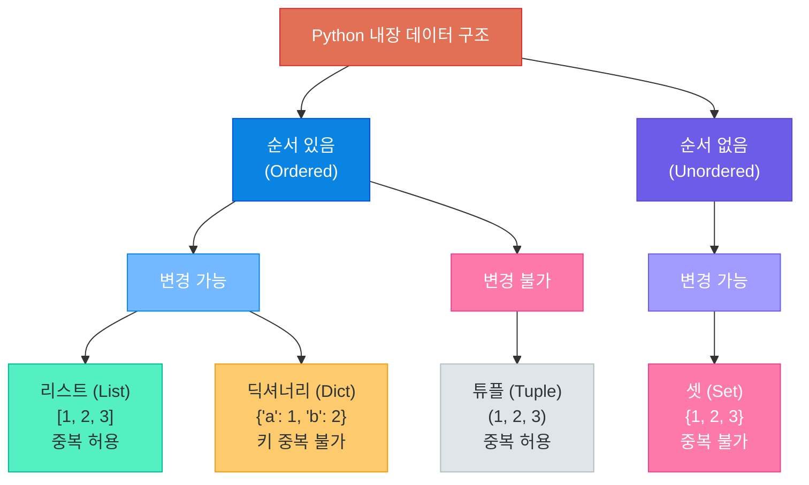
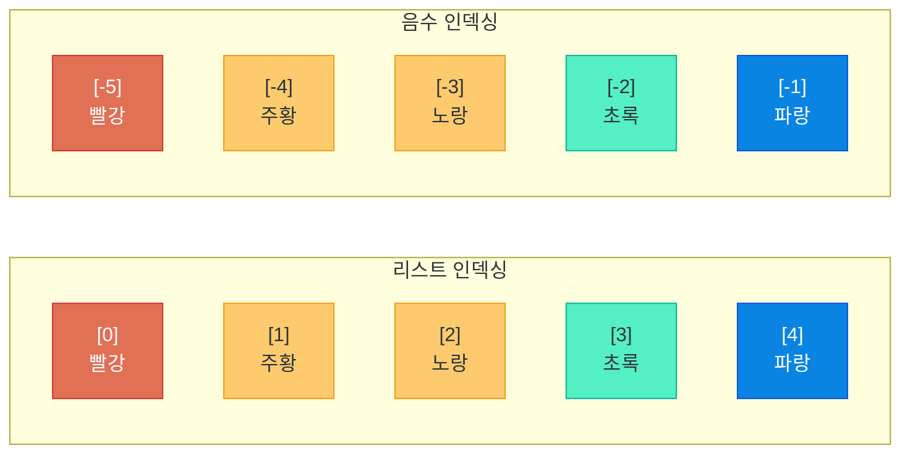
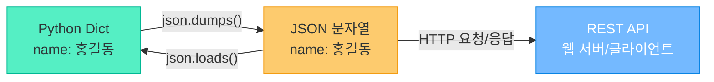
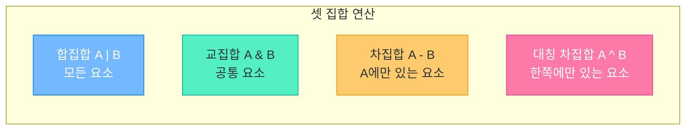
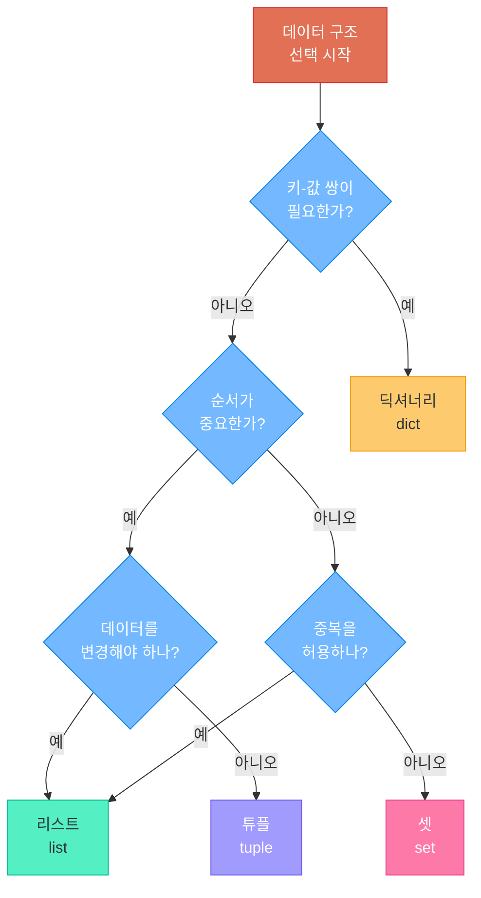
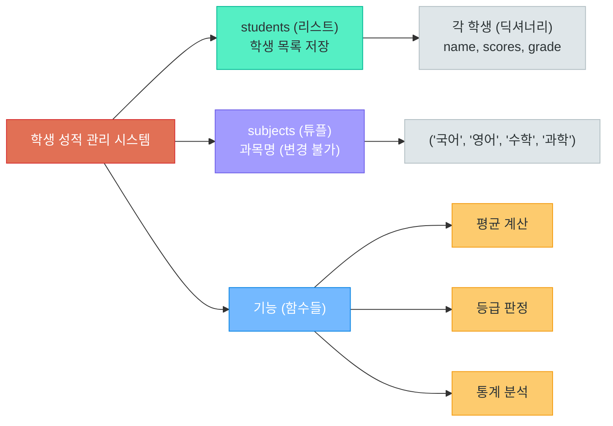
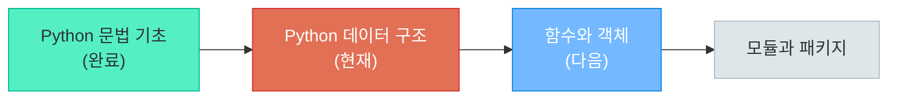

# Python 데이터 구조

> 데이터를 담는 그릇이 다르면, 요리도 달라진다 -- 리스트, 튜플, 딕셔너리, 셋으로 데이터를 자유자재로 다루는 법

---

## 1. 데이터 구조 개요

### 왜 데이터 구조가 중요한가

프로그래밍에서 **데이터 구조(Data Structure)** 는 데이터를 효율적으로 저장하고 관리하는 방법입니다.

비유하자면, 요리사에게 재료를 담는 그릇이 중요한 것과 같습니다.

```
냉장고에 재료를 넣을 때:
  - 서랍칸(리스트)      → 순서대로 정리, 꺼내기 쉬움
  - 밀폐용기(튜플)      → 한번 담으면 변경 불가, 안전하게 보관
  - 라벨 붙인 통(딕셔너리) → 이름표로 바로 찾기
  - 바구니(셋)          → 중복 없이 한 종류씩만 담기
```

잘못된 데이터 구조를 사용하면 코드가 복잡해지고, 성능이 떨어지며, 버그가 발생하기 쉽습니다. 올바른 데이터 구조를 선택하는 것은 좋은 프로그래머의 핵심 역량입니다.

### Python 내장 데이터 구조 4가지

Python은 별도의 라이브러리 없이도 강력한 4가지 내장 데이터 구조를 제공합니다.

| 구조 | 기호 | 순서 | 변경 가능 | 중복 허용 | 대표 용도 |
|------|------|------|-----------|-----------|-----------|
| 리스트 (List) | `[]` | O | O (뮤터블) | O | 순서 있는 데이터 모음 |
| 튜플 (Tuple) | `()` | O | X (이뮤터블) | O | 변경 불가 데이터 |
| 딕셔너리 (Dict) | `{}` | O (3.7+) | O (뮤터블) | 키 중복 X | 키-값 쌍 매핑 |
| 셋 (Set) | `{}` | X | O (뮤터블) | X | 중복 제거, 집합 연산 |

> **핵심 포인트:** Python 3.7부터 딕셔너리는 삽입 순서를 보장합니다. 하지만 셋은 여전히 순서가 없습니다.

### 4가지 구조 한눈에 비교



---

## 2. 리스트 (List)

리스트는 Python에서 가장 많이 사용되는 데이터 구조입니다. **순서가 있고, 변경이 가능하며, 중복을 허용**합니다. 장바구니에 물건을 넣고, 빼고, 순서를 바꿀 수 있는 것과 같습니다.

### 생성과 기본 사용법

```python
# 리스트 생성 방법
fruits = ["사과", "바나나", "딸기"]        # 대괄호로 생성
numbers = [1, 2, 3, 4, 5]                 # 숫자 리스트
mixed = [1, "hello", 3.14, True]          # 다양한 타입 혼합 가능
empty = []                                 # 빈 리스트
from_range = list(range(1, 6))            # [1, 2, 3, 4, 5]

# 리스트 길이 확인
print(len(fruits))   # 3
```

### 인덱싱 (Indexing)

리스트의 각 요소는 **인덱스(위치 번호)** 로 접근합니다. Python의 인덱스는 **0부터 시작**합니다.

```python
colors = ["빨강", "주황", "노랑", "초록", "파랑"]

# 양수 인덱스 (앞에서부터, 0부터 시작)
print(colors[0])    # "빨강" (첫 번째)
print(colors[2])    # "노랑" (세 번째)
print(colors[4])    # "파랑" (다섯 번째)

# 음수 인덱스 (뒤에서부터, -1부터 시작)
print(colors[-1])   # "파랑" (마지막)
print(colors[-2])   # "초록" (뒤에서 두 번째)

# 값 변경
colors[0] = "분홍"
print(colors)       # ["분홍", "주황", "노랑", "초록", "파랑"]
```



### 슬라이싱 (Slicing)

슬라이싱은 리스트의 **일부분을 잘라내는** 기능입니다. `[시작:끝:간격]` 형태로 사용합니다.

```python
numbers = [0, 1, 2, 3, 4, 5, 6, 7, 8, 9]

# 기본 슬라이싱 [시작:끝] — 끝 인덱스는 포함하지 않음
print(numbers[2:5])    # [2, 3, 4]
print(numbers[:3])     # [0, 1, 2]       (처음부터)
print(numbers[7:])     # [7, 8, 9]       (끝까지)
print(numbers[:])      # [0, 1, ..., 9]  (전체 복사)

# 간격 지정
print(numbers[::2])    # [0, 2, 4, 6, 8]  (2칸씩 건너뛰기)
print(numbers[1::2])   # [1, 3, 5, 7, 9]  (홀수 인덱스만)

# 역순
print(numbers[::-1])   # [9, 8, 7, ..., 0] (뒤집기)
```

### 주요 메서드

리스트는 데이터를 조작하기 위한 다양한 **메서드(method)** 를 제공합니다.

```python
# === 요소 추가 ===
fruits = ["사과", "바나나"]

fruits.append("딸기")           # 끝에 추가 → ["사과", "바나나", "딸기"]
fruits.insert(1, "포도")        # 인덱스 1에 삽입 → ["사과", "포도", "바나나", "딸기"]
fruits.extend(["망고", "키위"]) # 여러 요소 추가 → ["사과", "포도", "바나나", "딸기", "망고", "키위"]

# === 요소 제거 ===
fruits.remove("포도")           # 값으로 제거 (첫 번째만)
last = fruits.pop()             # 마지막 요소 꺼내기 → "키위"
second = fruits.pop(1)          # 인덱스 1 요소 꺼내기 → "바나나"

# === 정렬과 뒤집기 ===
scores = [85, 92, 78, 95, 88]
scores.sort()                   # 오름차순 정렬 → [78, 85, 88, 92, 95]
scores.sort(reverse=True)       # 내림차순 정렬 → [95, 92, 88, 85, 78]
scores.reverse()                # 현재 순서 뒤집기

# === 탐색 ===
print(scores.index(92))         # 92의 인덱스 위치
print(scores.count(85))         # 85의 등장 횟수
print(85 in scores)             # 포함 여부 → True
```

| 메서드 | 설명 | 반환값 |
|--------|------|--------|
| `append(x)` | 끝에 요소 추가 | None |
| `insert(i, x)` | 인덱스 i에 삽입 | None |
| `extend(iterable)` | 여러 요소 한번에 추가 | None |
| `remove(x)` | 첫 번째 x 제거 | None |
| `pop(i)` | 인덱스 i 요소 꺼내기 (기본: 마지막) | 제거된 요소 |
| `sort()` | 정렬 (원본 변경) | None |
| `reverse()` | 순서 뒤집기 (원본 변경) | None |
| `index(x)` | x의 첫 번째 인덱스 | int |
| `count(x)` | x의 등장 횟수 | int |

### 리스트 컴프리헨션 (List Comprehension)

리스트 컴프리헨션은 **한 줄로 리스트를 생성하는 Pythonic한 방법**입니다. 반복문과 조건문을 간결하게 표현할 수 있습니다.

```python
# 기본 형태: [표현식 for 변수 in 반복가능객체]
squares = [x**2 for x in range(1, 6)]
# 결과: [1, 4, 9, 16, 25]

# 조건부 필터링: [표현식 for 변수 in 반복가능객체 if 조건]
even_numbers = [x for x in range(1, 11) if x % 2 == 0]
# 결과: [2, 4, 6, 8, 10]

# 조건부 변환: [참일때 if 조건 else 거짓일때 for 변수 in 반복가능객체]
labels = ["짝수" if x % 2 == 0 else "홀수" for x in range(1, 6)]
# 결과: ["홀수", "짝수", "홀수", "짝수", "홀수"]

# 문자열 처리
names = ["alice", "bob", "charlie"]
upper_names = [name.upper() for name in names]
# 결과: ["ALICE", "BOB", "CHARLIE"]

# 중첩 반복
pairs = [(x, y) for x in range(3) for y in range(3)]
# 결과: [(0,0), (0,1), (0,2), (1,0), (1,1), (1,2), (2,0), (2,1), (2,2)]
```

> **핵심 포인트:** 리스트 컴프리헨션은 일반 for 문보다 빠르고 간결합니다. 하지만 너무 복잡한 로직은 오히려 가독성을 해치므로, 2중 이상의 중첩은 일반 for 문을 사용하는 것이 좋습니다.

### 중첩 리스트

리스트 안에 리스트를 넣을 수 있습니다. 이것을 **중첩 리스트(Nested List)** 또는 **2차원 리스트**라고 합니다.

```python
# 3x3 행렬 표현
matrix = [
    [1, 2, 3],
    [4, 5, 6],
    [7, 8, 9]
]

# 접근: matrix[행][열]
print(matrix[0][0])    # 1 (첫 번째 행, 첫 번째 열)
print(matrix[1][2])    # 6 (두 번째 행, 세 번째 열)
print(matrix[2])       # [7, 8, 9] (세 번째 행 전체)
```

### 실무 활용 예시

```python
# 쇼핑몰 장바구니 관리
cart = []

# 상품 추가
cart.append({"name": "노트북", "price": 1500000, "qty": 1})
cart.append({"name": "마우스", "price": 35000, "qty": 2})
cart.append({"name": "키보드", "price": 89000, "qty": 1})

# 총 금액 계산 (리스트 컴프리헨션 활용)
total = sum([item["price"] * item["qty"] for item in cart])
print(f"총 금액: {total:,}원")  # 총 금액: 1,659,000원

# 5만원 이상 상품만 필터링
expensive = [item["name"] for item in cart if item["price"] >= 50000]
print(f"고가 상품: {expensive}")  # 고가 상품: ['노트북', '키보드']
```

---

## 3. 튜플 (Tuple)

튜플은 리스트와 비슷하지만, **한번 생성하면 변경할 수 없는(immutable)** 데이터 구조입니다. 금고에 넣어 잠근 데이터라고 생각하면 됩니다.

### 생성과 특징

```python
# 튜플 생성 방법
colors = ("빨강", "초록", "파랑")       # 소괄호로 생성
numbers = (1, 2, 3, 4, 5)              # 숫자 튜플
single = (42,)                          # 요소가 하나일 때는 반드시 쉼표!
no_paren = 1, 2, 3                     # 소괄호 없이도 가능
from_list = tuple([1, 2, 3])           # 리스트를 튜플로 변환

# 인덱싱과 슬라이싱 (리스트와 동일)
print(colors[0])       # "빨강"
print(colors[-1])      # "파랑"
print(colors[1:])      # ("초록", "파랑")

# 변경 시도 시 에러 발생!
# colors[0] = "노랑"   # TypeError: 'tuple' object does not support item assignment
```

> **핵심 포인트:** 요소가 하나인 튜플을 만들 때 `(42)`는 그냥 숫자 42이고, `(42,)`가 튜플입니다. 쉼표를 잊지 마세요!

### 언패킹 (Unpacking)

튜플의 가장 강력한 기능 중 하나는 **언패킹**입니다. 여러 값을 한번에 변수에 할당할 수 있습니다.

```python
# 기본 언패킹
point = (3, 7)
x, y = point
print(f"x={x}, y={y}")   # x=3, y=7

# 함수에서 여러 값 반환 (자주 사용!)
def get_user_info():
    return "홍길동", 25, "서울"

name, age, city = get_user_info()
print(f"{name}, {age}세, {city}")  # 홍길동, 25세, 서울

# 변수 교환 (Python만의 간결한 문법)
a, b = 10, 20
a, b = b, a     # 교환!
print(a, b)     # 20 10

# 별표(*) 언패킹 — 나머지 값들을 리스트로 받기
first, *rest = (1, 2, 3, 4, 5)
print(first)    # 1
print(rest)     # [2, 3, 4, 5]

head, *body, tail = (1, 2, 3, 4, 5)
print(head)     # 1
print(body)     # [2, 3, 4]
print(tail)     # 5
```

### 네임드 튜플 (Named Tuple)

일반 튜플은 인덱스로만 접근해야 하므로 의미를 파악하기 어렵습니다. **네임드 튜플**은 각 요소에 이름을 붙여 가독성을 높여줍니다.

```python
from collections import namedtuple

# 네임드 튜플 정의 및 사용
Point = namedtuple("Point", ["x", "y"])
p = Point(3, 7)

print(p.x, p.y)       # 3 7 — 이름으로 접근 (가독성 향상!)
print(p[0], p[1])      # 3 7 — 인덱스로도 접근 가능
# p.x = 10             # AttributeError! — 여전히 immutable
```

### 리스트 vs 튜플 비교

| 항목 | 리스트 (List) | 튜플 (Tuple) |
|------|---------------|--------------|
| 기호 | `[]` | `()` |
| 변경 가능 | O (뮤터블) | X (이뮤터블) |
| 속도 | 상대적으로 느림 | 상대적으로 빠름 |
| 메모리 | 더 많이 사용 | 더 적게 사용 |
| 용도 | 변경이 필요한 데이터 | 변경되면 안 되는 데이터 |
| 딕셔너리 키 | 사용 불가 | 사용 가능 |
| 사용 예 | 장바구니, 할일 목록 | 좌표, RGB 색상, DB 레코드 |

> **핵심 포인트:** "이 데이터는 변경되면 안 된다"라는 의도를 코드로 표현하고 싶을 때 튜플을 사용합니다. 예를 들어 서울의 GPS 좌표 `(37.5665, 126.9780)`는 변하지 않으므로 튜플이 적합합니다.

---

## 4. 딕셔너리 (Dictionary)

딕셔너리는 **키(key)와 값(value)의 쌍**으로 데이터를 저장하는 구조입니다. 실제 사전(dictionary)에서 단어(키)로 뜻(값)을 찾는 것과 같습니다.

### 생성과 기본 사용법

```python
# 딕셔너리 생성 방법
student = {"name": "홍길동", "age": 20, "major": "컴퓨터공학"}
empty = {}                                # 빈 딕셔너리
from_pairs = dict(name="홍길동", age=20)  # dict() 함수로 생성

# 키로 값 접근
print(student["name"])      # "홍길동"
print(student["age"])       # 20

# 값 변경
student["age"] = 21
print(student["age"])       # 21

# 새로운 키-값 쌍 추가
student["gpa"] = 3.8
print(student)
# {'name': '홍길동', 'age': 21, 'major': '컴퓨터공학', 'gpa': 3.8}
```

### 키-값 접근과 get() 메서드

존재하지 않는 키에 접근하면 에러가 발생합니다. `get()` 메서드를 사용하면 안전하게 접근할 수 있습니다.

```python
student = {"name": "홍길동", "age": 20}

# 대괄호 접근 — 키가 없으면 KeyError!
# print(student["email"])   # KeyError: 'email'

# get() 메서드 — 키가 없으면 None 반환 (안전!)
print(student.get("email"))           # None
print(student.get("email", "없음"))   # "없음" (기본값 지정)
print(student.get("name", "없음"))    # "홍길동" (키가 있으면 값 반환)

# 키 존재 여부 확인
print("name" in student)    # True
print("email" in student)   # False
```

> **핵심 포인트:** 실무에서는 `get()` 메서드를 적극 사용합니다. 특히 외부 API에서 받은 JSON 데이터를 처리할 때, 키가 누락될 가능성이 있으므로 `get()`으로 안전하게 접근하는 것이 좋습니다.

### 주요 메서드

```python
user = {"name": "김철수", "age": 25, "city": "서울"}

# keys() — 모든 키 조회
print(user.keys())     # dict_keys(['name', 'age', 'city'])

# values() — 모든 값 조회
print(user.values())   # dict_values(['김철수', 25, '서울'])

# items() — 모든 키-값 쌍 조회
print(user.items())    # dict_items([('name', '김철수'), ('age', 25), ('city', '서울')])

# update() — 여러 키-값 한번에 업데이트
user.update({"age": 26, "email": "cs@mail.com"})
print(user)
# {'name': '김철수', 'age': 26, 'city': '서울', 'email': 'cs@mail.com'}

# pop() — 키로 제거하고 값 반환
removed = user.pop("city")
print(removed)         # "서울"
print(user)            # {'name': '김철수', 'age': 26, 'email': 'cs@mail.com'}

# 딕셔너리 순회
for key, value in user.items():
    print(f"{key}: {value}")
# name: 김철수
# age: 26
# email: cs@mail.com
```

| 메서드 | 설명 | 반환값 |
|--------|------|--------|
| `keys()` | 모든 키 | dict_keys 객체 |
| `values()` | 모든 값 | dict_values 객체 |
| `items()` | 모든 키-값 쌍 | dict_items 객체 |
| `get(key, default)` | 안전하게 값 가져오기 | 값 또는 default |
| `update(dict)` | 여러 키-값 업데이트 | None |
| `pop(key)` | 키로 제거, 값 반환 | 제거된 값 |
| `setdefault(key, val)` | 키 없으면 추가, 있으면 반환 | 값 |
| `clear()` | 모든 요소 제거 | None |

### 딕셔너리 컴프리헨션

리스트 컴프리헨션과 마찬가지로, 딕셔너리도 한 줄로 생성할 수 있습니다.

```python
# 기본 형태: {키표현식: 값표현식 for 변수 in 반복가능객체}
squares = {x: x**2 for x in range(1, 6)}
# 결과: {1: 1, 2: 4, 3: 9, 4: 16, 5: 25}

# 조건부 딕셔너리 컴프리헨션
scores = {"국어": 85, "수학": 92, "영어": 78, "과학": 95}
high_scores = {subject: score for subject, score in scores.items() if score >= 90}
# 결과: {'수학': 92, '과학': 95}

# 키-값 뒤집기
flipped = {v: k for k, v in scores.items()}
# 결과: {85: '국어', 92: '수학', 78: '영어', 95: '과학'}

# 두 리스트를 딕셔너리로 합치기
keys = ["name", "age", "city"]
values = ["홍길동", 25, "서울"]
user_dict = dict(zip(keys, values))
# 결과: {'name': '홍길동', 'age': 25, 'city': '서울'}
```

### 중첩 딕셔너리

딕셔너리 안에 딕셔너리를 넣어 복잡한 데이터를 표현할 수 있습니다.

```python
# 학교 정보 — 중첩 딕셔너리
school = {
    "name": "Python 고등학교",
    "location": "서울시 강남구",
    "classes": {
        "1반": {
            "teacher": "김선생",
            "students": 30,
            "avg_score": 85.5
        },
        "2반": {
            "teacher": "이선생",
            "students": 28,
            "avg_score": 88.2
        }
    }
}

# 중첩 접근
print(school["classes"]["1반"]["teacher"])    # "김선생"
print(school["classes"]["2반"]["avg_score"])  # 88.2

# 안전한 중첩 접근 (get 체이닝)
teacher = school.get("classes", {}).get("3반", {}).get("teacher", "정보 없음")
print(teacher)   # "정보 없음"
```

### JSON과의 관계

딕셔너리는 웹 개발에서 가장 중요한 데이터 형식인 **JSON(JavaScript Object Notation)** 과 구조가 거의 동일합니다. 이것이 Python이 웹 개발에서 강력한 이유 중 하나입니다.

```python
import json

# Python 딕셔너리 → JSON 문자열
user = {
    "name": "홍길동",
    "age": 25,
    "skills": ["Python", "JavaScript", "SQL"],
    "is_active": True
}

json_string = json.dumps(user, ensure_ascii=False, indent=2)
print(json_string)
# {
#   "name": "홍길동",
#   "age": 25,
#   "skills": ["Python", "JavaScript", "SQL"],
#   "is_active": true
# }

# JSON 문자열 → Python 딕셔너리
parsed = json.loads(json_string)
print(parsed["name"])    # "홍길동"
print(type(parsed))      # <class 'dict'>
```



> **핵심 포인트:** REST API를 만들거나 호출할 때, 데이터는 JSON 형태로 주고받습니다. Python 딕셔너리와 JSON은 `json.dumps()`와 `json.loads()`로 쉽게 변환됩니다. 이 부분은 이후 Flask/FastAPI 강의에서 핵심적으로 활용합니다.

---

## 5. 셋 (Set)

셋은 **중복을 허용하지 않고, 순서가 없는** 데이터 구조입니다. 수학의 집합(Set)과 동일한 개념이며, 집합 연산을 지원합니다.

### 생성과 특징

```python
# 셋 생성
fruits = {"사과", "바나나", "딸기", "사과"}  # 중복 자동 제거!
print(fruits)        # {'바나나', '딸기', '사과'} — 순서 보장 안 됨

numbers = set([1, 2, 3, 2, 1])   # 리스트를 셋으로 변환
print(numbers)       # {1, 2, 3}

empty_set = set()    # 빈 셋 (주의: {}는 빈 딕셔너리!)

# 요소 추가/제거
fruits.add("포도")           # 추가
fruits.discard("바나나")     # 제거 (없어도 에러 안 남)
fruits.remove("딸기")        # 제거 (없으면 KeyError!)
```

> **핵심 포인트:** 빈 셋을 만들 때 `{}`를 쓰면 빈 딕셔너리가 됩니다. 반드시 `set()`을 사용하세요!

### 집합 연산

셋의 가장 강력한 기능은 **집합 연산**입니다.

```python
frontend = {"HTML", "CSS", "JavaScript", "React"}
backend = {"Python", "JavaScript", "SQL", "FastAPI"}

# 합집합 (Union) — 두 집합의 모든 요소
all_skills = frontend | backend
# 또는: frontend.union(backend)
print(all_skills)
# {'HTML', 'CSS', 'JavaScript', 'React', 'Python', 'SQL', 'FastAPI'}

# 교집합 (Intersection) — 공통 요소
common = frontend & backend
# 또는: frontend.intersection(backend)
print(common)        # {'JavaScript'}

# 차집합 (Difference) — 한쪽에만 있는 요소
only_frontend = frontend - backend
# 또는: frontend.difference(backend)
print(only_frontend) # {'HTML', 'CSS', 'React'}

# 대칭 차집합 (Symmetric Difference) — 한쪽에만 있는 모든 요소
unique = frontend ^ backend
# 또는: frontend.symmetric_difference(backend)
print(unique)
# {'HTML', 'CSS', 'React', 'Python', 'SQL', 'FastAPI'}
```



### frozenset

`frozenset`은 **변경 불가능한(immutable) 셋**입니다. 튜플이 리스트의 immutable 버전인 것처럼, frozenset은 셋의 immutable 버전입니다. 딕셔너리의 키로 사용할 수 있다는 점이 특징입니다.

```python
immutable_set = frozenset([1, 2, 3])

print(immutable_set | {4, 5})    # frozenset({1, 2, 3, 4, 5}) — 집합 연산 가능
# immutable_set.add(4)           # AttributeError! — 변경은 불가
```

### 실무 활용

```python
# 1. 중복 제거 (가장 많이 사용!)
emails = ["a@mail.com", "b@mail.com", "a@mail.com", "c@mail.com", "b@mail.com"]
unique_emails = list(set(emails))
print(unique_emails)   # ['a@mail.com', 'b@mail.com', 'c@mail.com']

# 2. 빠른 멤버십 테스트
# 리스트에서 in 검사: O(n) — 느림
# 셋에서 in 검사: O(1) — 매우 빠름!
blocked_users = {"user_spam1", "user_spam2", "user_bot99"}

username = "user_spam1"
if username in blocked_users:
    print("차단된 사용자입니다!")

# 3. 두 그룹 비교
yesterday_visitors = {"김철수", "이영희", "박민수", "정수진"}
today_visitors = {"이영희", "박민수", "최동현", "강서연"}

# 어제도 오늘도 방문한 사람
loyal = yesterday_visitors & today_visitors
print(f"단골 방문자: {loyal}")   # {'이영희', '박민수'}

# 오늘 새로 방문한 사람
new_today = today_visitors - yesterday_visitors
print(f"신규 방문자: {new_today}") # {'최동현', '강서연'}
```

---

## 6. 데이터 구조 선택 가이드

### 상황별 최적 구조 선택

어떤 데이터 구조를 사용할지 고민될 때, 아래 표를 참고하세요.

| 상황 | 추천 구조 | 이유 |
|------|-----------|------|
| 순서 있는 데이터 목록 | 리스트 | 인덱스 접근, 순서 유지 |
| 변경되면 안 되는 데이터 | 튜플 | immutable, 안전성 보장 |
| 이름-값 매핑 | 딕셔너리 | 키로 빠른 접근 |
| 중복 제거 | 셋 | 자동 중복 제거 |
| JSON 데이터 처리 | 딕셔너리 | JSON과 구조 동일 |
| 함수에서 여러 값 반환 | 튜플 | 언패킹 지원 |
| 설정값/상수 목록 | 튜플 | 변경 방지 |
| 멤버십 테스트 (포함 여부) | 셋 | O(1) 탐색 속도 |
| 빈도수 세기 | 딕셔너리 | 키: 요소, 값: 횟수 |
| 행렬/테이블 데이터 | 중첩 리스트 | 2차원 구조 표현 |

### 성능 비교 (시간 복잡도)

| 연산 | 리스트 | 딕셔너리 | 셋 |
|------|--------|----------|-----|
| 인덱스 접근 | O(1) | - | - |
| 키 접근 | - | O(1) | - |
| 검색 (in) | O(n) | O(1) | O(1) |
| 추가 (끝) | O(1) | O(1) | O(1) |
| 삽입 (중간) | O(n) | - | - |
| 삭제 | O(n) | O(1) | O(1) |
| 정렬 | O(n log n) | - | - |

> **핵심 포인트:** "이 데이터에서 특정 값이 있는지 자주 확인해야 한다"면 리스트 대신 셋이나 딕셔너리를 사용하세요. 리스트는 요소가 많을수록 검색이 느려지지만, 셋과 딕셔너리는 데이터 양과 무관하게 빠릅니다.

### 선택 플로우차트



---

## 7. 실전 예제: 학생 성적 관리

여러 데이터 구조를 조합하여 실무에 가까운 예제를 만들어 보겠습니다.

### 데이터 설계



### 전체 코드

```python
# === 학생 성적 관리 시스템 ===

# 과목 목록 — 변경되면 안 되므로 튜플 사용
SUBJECTS = ("국어", "영어", "수학", "과학")

# 학생 데이터 — 딕셔너리의 리스트
students = [
    {"name": "홍길동", "scores": {"국어": 85, "영어": 92, "수학": 78, "과학": 88}},
    {"name": "김영희", "scores": {"국어": 95, "영어": 88, "수학": 92, "과학": 90}},
    {"name": "이철수", "scores": {"국어": 72, "영어": 65, "수학": 80, "과학": 75}},
    {"name": "박민수", "scores": {"국어": 88, "영어": 95, "수학": 98, "과학": 92}},
    {"name": "정수진", "scores": {"국어": 90, "영어": 82, "수학": 85, "과학": 88}},
]

def calculate_average(scores_dict):
    """점수 딕셔너리의 평균을 계산합니다."""
    return sum(scores_dict.values()) / len(scores_dict)

def get_grade(average):
    """평균 점수에 따라 등급을 반환합니다."""
    if average >= 95: return "A+"
    elif average >= 90: return "A"
    elif average >= 85: return "B+"
    elif average >= 80: return "B"
    elif average >= 75: return "C+"
    elif average >= 70: return "C"
    else: return "D"

def print_report(students):
    """전체 학생 성적표를 출력합니다."""
    print("=" * 60)
    print(f"{'학생 성적 관리 시스템':^60}")
    print("=" * 60)

    # 각 학생의 평균과 등급 계산
    results = []
    for student in students:
        avg = calculate_average(student["scores"])
        grade = get_grade(avg)
        results.append({"name": student["name"], "scores": student["scores"],
                         "average": avg, "grade": grade})

    # 평균 기준 내림차순 정렬
    results.sort(key=lambda x: x["average"], reverse=True)

    # 성적표 출력
    print(f"\n{'이름':<8} ", end="")
    for subj in SUBJECTS:
        print(f"{subj:>6}", end="")
    print(f"  {'평균':>6}  {'등급':>4}")
    print("-" * 60)

    for r in results:
        print(f"{r['name']:<8} ", end="")
        for subj in SUBJECTS:
            print(f"{r['scores'][subj]:>6}", end="")
        print(f"  {r['average']:>6.1f}  {r['grade']:>4}")

    # 과목별 통계
    print("\n" + "-" * 60)
    for subj in SUBJECTS:
        scores = [s["scores"][subj] for s in students]
        print(f"  {subj}: 평균 {sum(scores)/len(scores):.1f} "
              f"| 최고 {max(scores)} | 최저 {min(scores)}")

    # 셋으로 등급 종류 파악
    all_grades = {r["grade"] for r in results}
    print(f"\n  등급 분포: {', '.join(sorted(all_grades))}")
    print(f"  수석: {results[0]['name']} ({results[0]['average']:.1f}점)")

print_report(students)
```

### 실행 결과

```
============================================================
                      학생 성적 관리 시스템
============================================================

이름        국어    영어    수학    과학    평균    등급
------------------------------------------------------------
박민수       88     95     98     92   93.2    A
김영희       95     88     92     90   91.2    A
정수진       90     82     85     88   86.2   B+
홍길동       85     92     78     88   85.8   B+
이철수       72     65     80     75   73.0   C+
------------------------------------------------------------
  국어: 평균 86.0 | 최고 95 | 최저 72
  영어: 평균 84.4 | 최고 95 | 최저 65
  수학: 평균 86.6 | 최고 98 | 최저 78
  과학: 평균 86.6 | 최고 92 | 최저 75

  등급 분포: A, B+, C+
  수석: 박민수 (93.2점)
```

### 사용된 데이터 구조 정리

| 데이터 구조 | 사용 위치 | 선택 이유 |
|-------------|-----------|-----------|
| 튜플 | `SUBJECTS` (과목명) | 과목은 변경되면 안 되므로 immutable |
| 리스트 | `students` (학생 목록) | 학생 추가/삭제가 가능해야 함 |
| 딕셔너리 | 각 학생 정보 | 이름, 점수 등 키-값 매핑 |
| 딕셔너리 | `scores` (과목별 점수) | 과목명으로 점수 빠르게 접근 |
| 셋 | `all_grades` (등급 종류) | 중복 없는 등급 목록 필요 |
| 리스트 컴프리헨션 | 과목별 점수 추출 | 간결한 데이터 필터링 |

---

## 8. 핵심 정리

### 4가지 구조 최종 비교

| 항목 | 리스트 `[]` | 튜플 `()` | 딕셔너리 `{}` | 셋 `{}` |
|------|-------------|-----------|---------------|---------|
| 순서 | O | O | O (3.7+) | X |
| 변경 | O | X | O | O |
| 중복 | O | O | 키 X, 값 O | X |
| 인덱스 접근 | O | O | X (키 접근) | X |
| 생성 | `[1,2,3]` | `(1,2,3)` | `{"a":1}` | `{1,2,3}` |
| 빈 생성 | `[]` | `()` | `{}` | `set()` |
| 컴프리헨션 | O | X (제너레이터) | O | O |
| 주요 용도 | 데이터 목록 | 상수, 반환값 | 매핑, JSON | 집합 연산 |

### 기억해야 할 핵심 패턴

```python
# 1. 리스트 컴프리헨션으로 데이터 가공
processed = [transform(item) for item in data if condition(item)]

# 2. 딕셔너리의 get()으로 안전한 접근
value = data.get("key", "기본값")

# 3. 튜플 언패킹으로 다중 반환값 처리
name, age, city = get_user_info()

# 4. 셋으로 중복 제거
unique = list(set(duplicated_list))

# 5. 딕셔너리 + 리스트로 JSON 스타일 데이터
api_response = {
    "status": "success",
    "data": [{"id": 1, "name": "item1"}, {"id": 2, "name": "item2"}]
}
```

### 다음 강의 미리보기



다음 강의에서는 **함수(Function)** 를 깊이 다루고, **클래스(Class)** 와 **객체지향 프로그래밍(OOP)** 의 기초를 배웁니다. 오늘 배운 데이터 구조들을 함수와 클래스로 감싸면, 더 체계적이고 재사용 가능한 코드를 작성할 수 있습니다.

> 데이터 구조는 프로그래밍의 **기초 체력**입니다. 리스트, 딕셔너리, 튜플, 셋 — 이 네 가지를 자유자재로 다룰 수 있다면, Python으로 어떤 데이터든 효율적으로 처리할 수 있습니다.

---

[이전 강의: Python 문법 기초](02_python_syntax_basics.md) | [다음 강의: 함수와 객체](04_functions_and_objects.md)
