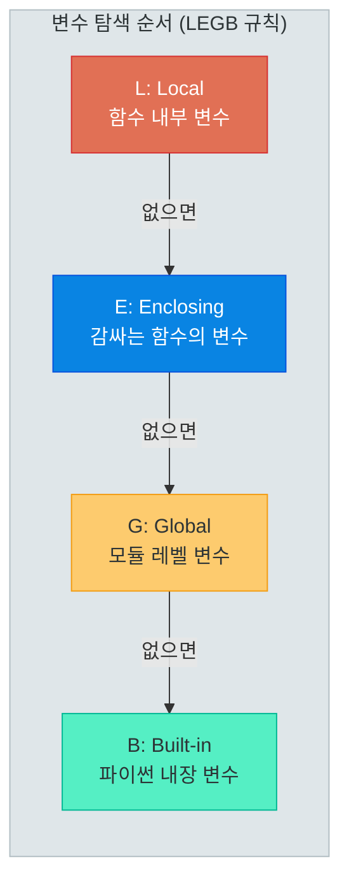
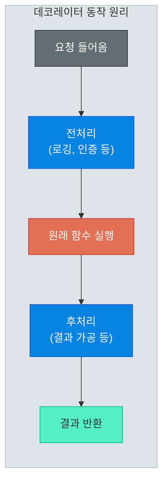
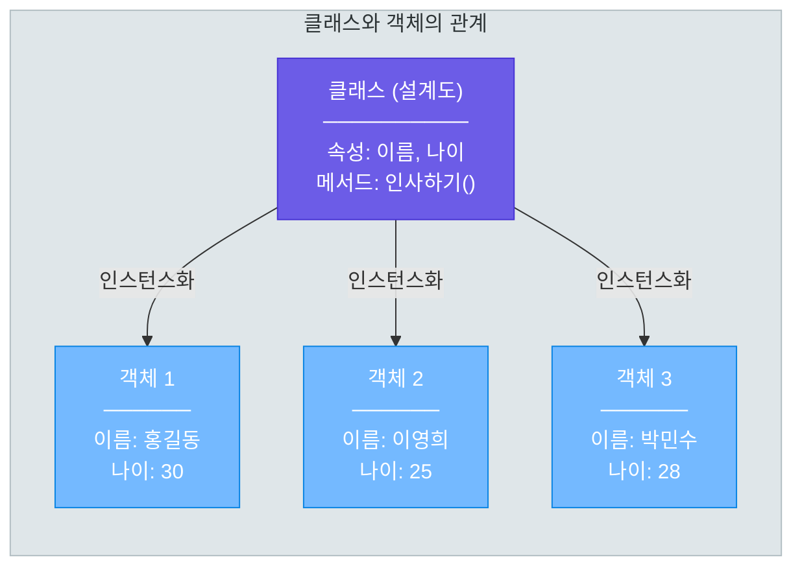
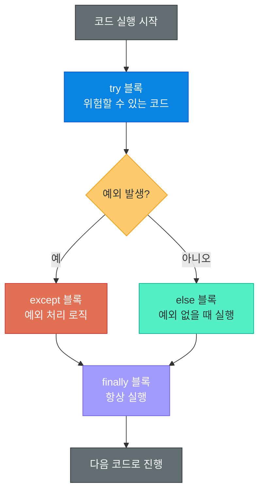
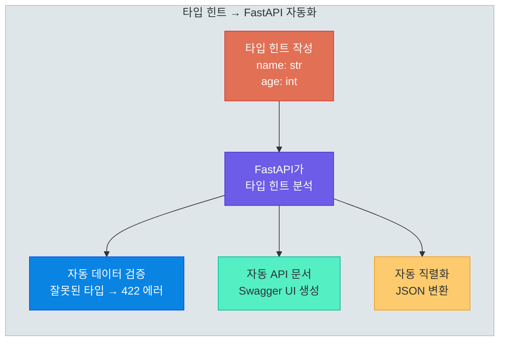
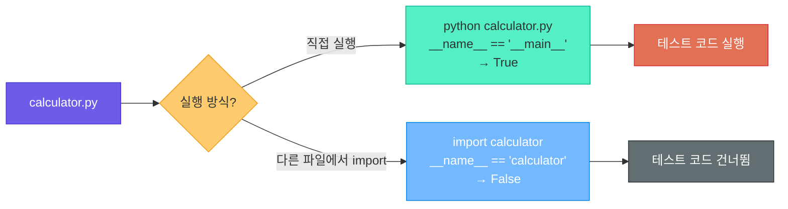
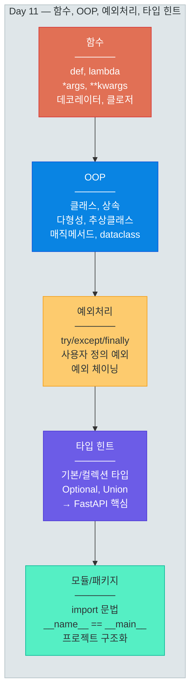

# 함수, OOP, 예외처리, 타입 힌트

> 코드를 "정리정돈"하는 기술 — 함수로 묶고, 클래스로 설계하고, 예외로 방어하고, 타입으로 소통하는 법

---

## 1. 함수 기초

### 함수란 무엇인가?

함수는 **"재사용 가능한 코드 블록"**입니다. 커피 머신을 생각해보세요. 원두(입력)를 넣고 버튼을 누르면 커피(출력)가 나옵니다. 내부 작동 원리를 몰라도 매번 같은 결과를 얻을 수 있죠. 함수도 마찬가지입니다.

```python
# 함수의 기본 구조
def 인사하기(이름):
    """이름을 받아 인사 메시지를 반환합니다."""
    return f"안녕하세요, {이름}님!"

# 함수 호출
메시지 = 인사하기("홍길동")
print(메시지)  # 안녕하세요, 홍길동님!
```

### 매개변수와 인자

| 용어 | 의미 | 예시 |
|------|------|------|
| **매개변수 (Parameter)** | 함수 정의 시 선언하는 변수 | `def greet(name):` 의 `name` |
| **인자 (Argument)** | 함수 호출 시 전달하는 값 | `greet("철수")` 의 `"철수"` |

### 위치 인자, 키워드 인자, 기본값

```python
# 1. 위치 인자 — 순서대로 매핑
def 프로필(이름, 나이, 직업):
    return f"{이름}, {나이}세, {직업}"

프로필("김철수", 25, "개발자")  # 순서 중요!

# 2. 키워드 인자 — 이름으로 매핑 (순서 무관)
프로필(직업="디자이너", 이름="이영희", 나이=28)

# 3. 기본값 — 호출 시 생략 가능
def 커피_주문(종류, 사이즈="톨", 샷=1):
    return f"{종류} {사이즈} ({샷}샷)"

커피_주문("라떼")           # 라떼 톨 (1샷)
커피_주문("라떼", "벤티", 2)  # 라떼 벤티 (2샷)
```

> **핵심 포인트:** 기본값이 있는 매개변수는 반드시 기본값이 없는 매개변수 **뒤에** 위치해야 합니다.

### *args와 **kwargs

```python
# *args — 가변 위치 인자 (튜플로 받음)
def 합계(*숫자들):
    return sum(숫자들)

합계(1, 2, 3)       # 6
합계(10, 20, 30, 40) # 100

# **kwargs — 가변 키워드 인자 (딕셔너리로 받음)
def 사용자_생성(**정보):
    for 키, 값 in 정보.items():
        print(f"  {키}: {값}")

사용자_생성(이름="홍길동", 이메일="hong@test.com", 나이=30)
# 출력:
#   이름: 홍길동
#   이메일: hong@test.com
#   나이: 30

# 실전: 모든 인자 유형을 함께 사용
def 종합_함수(필수, *args, 키워드="기본", **kwargs):
    print(f"필수: {필수}")
    print(f"args: {args}")
    print(f"키워드: {키워드}")
    print(f"kwargs: {kwargs}")
```

### 함수 스코프 (LEGB 규칙)

Python에서 변수를 찾는 순서를 **LEGB 규칙**이라고 합니다. 이름을 찾을 때 안쪽에서 바깥쪽으로 탐색합니다.



```python
x = "Global"  # G: 전역 변수

def 외부_함수():
    x = "Enclosing"  # E: 감싸는 함수 변수

    def 내부_함수():
        x = "Local"  # L: 지역 변수
        print(x)     # "Local" 출력 — 가장 안쪽부터 탐색

    내부_함수()

외부_함수()
```

---

## 2. 고급 함수

### 람다 함수

람다는 **이름 없는 한 줄짜리 함수**입니다. 일회성으로 간단한 연산이 필요할 때 유용합니다.

```python
# 일반 함수
def 제곱(x):
    return x ** 2

# 람다 함수 (동일한 기능)
제곱 = lambda x: x ** 2

# 실전 활용 — 정렬 기준으로 사용
학생들 = [("김철수", 85), ("이영희", 92), ("박민수", 78)]
학생들.sort(key=lambda x: x[1], reverse=True)
# 결과: [('이영희', 92), ('김철수', 85), ('박민수', 78)]
```

### map, filter, reduce

함수를 데이터에 **일괄 적용**하는 도구들입니다. 컨베이어 벨트 위에서 각 제품에 동일한 작업을 수행하는 것과 같습니다.

```python
# map — 모든 요소에 함수 적용
숫자 = [1, 2, 3, 4, 5]
제곱_결과 = list(map(lambda x: x ** 2, 숫자))
# [1, 4, 9, 16, 25]

# filter — 조건에 맞는 요소만 선택
짝수 = list(filter(lambda x: x % 2 == 0, 숫자))
# [2, 4]

# reduce — 누적 연산 (functools 모듈 필요)
from functools import reduce
총합 = reduce(lambda a, b: a + b, 숫자)
# 15 (1+2+3+4+5)
```

> **핵심 포인트:** 실무에서는 `map`/`filter` 대신 **리스트 컴프리헨션**을 더 많이 사용합니다. `[x**2 for x in 숫자]`가 `list(map(...))` 보다 훨씬 읽기 쉽습니다.

### 클로저 (Closure)

클로저는 **함수가 자신이 생성된 환경을 기억**하는 것입니다. 금고에 비밀번호를 설정하고, 나중에 그 비밀번호로 열 수 있는 것과 같습니다.

```python
def 승수_만들기(n):
    """n배를 해주는 함수를 반환"""
    def 곱하기(x):
        return x * n  # n을 기억하고 있음!
    return 곱하기

두배 = 승수_만들기(2)
세배 = 승수_만들기(3)

print(두배(5))   # 10
print(세배(5))   # 15
```

### 데코레이터 (Decorator)

데코레이터는 **기존 함수를 수정하지 않고 기능을 추가**하는 패턴입니다. 선물 포장처럼, 내용물(원래 함수)은 그대로 두고 포장지(추가 기능)로 감싸는 것입니다. FastAPI에서 `@app.get("/")` 같은 라우팅이 바로 데코레이터입니다.



```python
import time

# 데코레이터 정의
def 실행시간_측정(func):
    def wrapper(*args, **kwargs):
        시작 = time.time()
        결과 = func(*args, **kwargs)       # 원래 함수 실행
        종료 = time.time()
        print(f"{func.__name__} 실행시간: {종료 - 시작:.4f}초")
        return 결과
    return wrapper

# 데코레이터 적용 (@ 문법)
@실행시간_측정
def 무거운_작업():
    time.sleep(1)
    return "완료"

무거운_작업()  # "무거운_작업 실행시간: 1.0012초"
```

```python
# FastAPI에서의 데코레이터 (미리보기)
from fastapi import FastAPI
app = FastAPI()

@app.get("/users")       # 이것이 데코레이터!
def get_users():
    return [{"name": "홍길동"}]

@app.post("/users")      # HTTP POST 요청을 이 함수에 연결
def create_user(name: str):
    return {"name": name}
```

> **핵심 포인트:** `@데코레이터`는 사실 `함수 = 데코레이터(함수)`의 축약 문법입니다. FastAPI의 모든 라우팅이 데코레이터 기반이므로 이 개념을 반드시 이해해야 합니다.

---

## 3. 객체지향 프로그래밍 (OOP)

### 클래스와 객체

프로그래밍에서 **클래스**는 **설계도**, **객체**는 그 설계도로 만든 **실제 제품**입니다. 자동차 설계도(클래스) 하나로 수백 대의 자동차(객체)를 만들 수 있는 것처럼요.



### __init__과 self

```python
class 사용자:
    """사용자를 나타내는 클래스"""

    def __init__(self, 이름, 이메일, 나이):
        # self — 생성될 객체 자기 자신을 가리킴
        self.이름 = 이름        # 인스턴스 변수
        self.이메일 = 이메일
        self.나이 = 나이

    def 자기소개(self):
        return f"안녕하세요, {self.이름}입니다. ({self.이메일})"

    def 성인여부(self):
        return self.나이 >= 18

# 객체 생성 (인스턴스화)
유저1 = 사용자("홍길동", "hong@test.com", 25)
유저2 = 사용자("이영희", "lee@test.com", 16)

print(유저1.자기소개())   # 안녕하세요, 홍길동입니다. (hong@test.com)
print(유저2.성인여부())   # False
```

### 인스턴스 변수 vs 클래스 변수

```python
class 카운터:
    총_개수 = 0          # 클래스 변수 — 모든 인스턴스가 공유

    def __init__(self, 이름):
        self.이름 = 이름  # 인스턴스 변수 — 각 인스턴스 고유
        카운터.총_개수 += 1

c1 = 카운터("A")
c2 = 카운터("B")
c3 = 카운터("C")

print(카운터.총_개수)  # 3 — 클래스 변수는 모든 인스턴스가 공유
print(c1.이름)       # "A" — 인스턴스 변수는 각자 다름
print(c2.이름)       # "B"
```

| 구분 | 클래스 변수 | 인스턴스 변수 |
|------|------------|--------------|
| 선언 위치 | 클래스 본문 (메서드 밖) | `__init__` 안에서 `self.` 사용 |
| 공유 범위 | 모든 인스턴스가 공유 | 각 인스턴스 고유 |
| 접근 방법 | `클래스명.변수` 또는 `self.변수` | `self.변수` |
| 용도 | 공통 설정, 카운터 | 개별 데이터 |

### 메서드 종류

```python
class 피자:
    가게이름 = "파이썬 피자"  # 클래스 변수

    def __init__(self, 토핑, 사이즈):
        self.토핑 = 토핑      # 인스턴스 변수
        self.사이즈 = 사이즈

    # 인스턴스 메서드 — self를 통해 인스턴스에 접근
    def 설명(self):
        return f"{self.사이즈} 사이즈 {self.토핑} 피자"

    # 클래스 메서드 — cls를 통해 클래스에 접근
    @classmethod
    def 가게_소개(cls):
        return f"환영합니다! {cls.가게이름}입니다."

    # 정적 메서드 — self도 cls도 없음. 독립적인 유틸리티
    @staticmethod
    def 배달_가능(거리_km):
        return 거리_km <= 5

# 사용
내피자 = 피자("페퍼로니", "라지")
print(내피자.설명())           # 라지 사이즈 페퍼로니 피자
print(피자.가게_소개())         # 환영합니다! 파이썬 피자입니다.
print(피자.배달_가능(3))        # True
```

---

## 4. OOP 심화

### 상속과 다형성

상속은 **부모 클래스의 기능을 자식 클래스가 물려받는 것**입니다. 스마트폰이 전화기의 기능을 상속받으면서 추가 기능(카메라, 인터넷)을 더한 것과 같습니다.

```python
# 부모 클래스
class 동물:
    def __init__(self, 이름, 나이):
        self.이름 = 이름
        self.나이 = 나이

    def 소리내기(self):
        return "..."

    def 정보(self):
        return f"{self.이름} ({self.나이}살)"

# 자식 클래스 — 동물을 상속
class 개(동물):
    def __init__(self, 이름, 나이, 품종):
        super().__init__(이름, 나이)  # 부모의 __init__ 호출
        self.품종 = 품종

    def 소리내기(self):  # 메서드 오버라이딩 (다형성)
        return "멍멍!"

class 고양이(동물):
    def 소리내기(self):  # 같은 메서드, 다른 동작 (다형성)
        return "야옹~"

# 다형성 — 같은 메서드를 호출해도 객체마다 다르게 동작
동물들 = [개("바둑이", 3, "진돗개"), 고양이("나비", 2)]
for 동물_ in 동물들:
    print(f"{동물_.정보()} → {동물_.소리내기()}")
# 바둑이 (3살) → 멍멍!
# 나비 (2살) → 야옹~
```

### 추상 클래스 (ABC)

추상 클래스는 **"이런 메서드는 반드시 구현해야 해!"라고 강제하는 설계도**입니다. 미완성 설계도이므로 직접 인스턴스화할 수 없습니다.

```python
from abc import ABC, abstractmethod

class 결제수단(ABC):
    """모든 결제수단이 반드시 구현해야 할 인터페이스"""

    @abstractmethod
    def 결제(self, 금액: int) -> bool:
        pass

    @abstractmethod
    def 환불(self, 금액: int) -> bool:
        pass

class 신용카드(결제수단):
    def 결제(self, 금액: int) -> bool:
        print(f"신용카드로 {금액}원 결제")
        return True

    def 환불(self, 금액: int) -> bool:
        print(f"신용카드로 {금액}원 환불")
        return True

# 결제수단()  # TypeError! 추상 클래스는 인스턴스화 불가
카드 = 신용카드()
카드.결제(50000)  # 신용카드로 50000원 결제
```

### 매직 메서드 (던더 메서드)

언더스코어 두 개(`__`)로 감싸진 특별한 메서드들입니다. Python이 내부적으로 호출합니다.

```python
class 벡터:
    def __init__(self, x, y):
        self.x = x
        self.y = y

    def __str__(self):
        """print()로 출력할 때 호출"""
        return f"벡터({self.x}, {self.y})"

    def __repr__(self):
        """개발자용 표현 (디버깅용)"""
        return f"Vector(x={self.x}, y={self.y})"

    def __len__(self):
        """len() 호출 시"""
        return int((self.x**2 + self.y**2) ** 0.5)

    def __eq__(self, other):
        """== 비교 시"""
        return self.x == other.x and self.y == other.y

    def __add__(self, other):
        """+ 연산 시"""
        return 벡터(self.x + other.x, self.y + other.y)

v1 = 벡터(3, 4)
v2 = 벡터(1, 2)
v3 = v1 + v2          # __add__ → 벡터(4, 6)

print(v1)             # __str__ → 벡터(3, 4)
print(len(v1))        # __len__ → 5
print(v1 == 벡터(3, 4))  # __eq__ → True
```

| 매직 메서드 | 호출 시점 | 예시 |
|------------|----------|------|
| `__init__` | 객체 생성 시 | `obj = MyClass()` |
| `__str__` | `print()`, `str()` | `print(obj)` |
| `__repr__` | 디버깅, REPL | `>>> obj` |
| `__len__` | `len()` | `len(obj)` |
| `__eq__` | `==` 비교 | `obj1 == obj2` |
| `__add__` | `+` 연산 | `obj1 + obj2` |
| `__getitem__` | `[]` 인덱싱 | `obj[0]` |
| `__contains__` | `in` 연산 | `x in obj` |

### dataclass (Python 3.7+)

`dataclass`는 **데이터를 담는 클래스를 간편하게 만드는 데코레이터**입니다. `__init__`, `__repr__`, `__eq__` 등을 자동 생성해줍니다. 나중에 배울 **Pydantic 모델의 전신**이기도 합니다.

```python
from dataclasses import dataclass, field

# dataclass — __init__, __repr__, __eq__을 자동 생성!
@dataclass
class 사용자:
    이름: str
    이메일: str
    나이: int
    활성: bool = True                   # 기본값
    태그: list = field(default_factory=list)  # 가변 기본값

유저 = 사용자("홍길동", "hong@test.com", 30)
print(유저)  # 사용자(이름='홍길동', 이메일='hong@test.com', 나이=30, ...)
```

```python
# dataclass → Pydantic으로 진화 (미리보기)
from pydantic import BaseModel

class User(BaseModel):          # Pydantic 모델
    name: str                   # 타입 힌트 기반 자동 검증!
    email: str
    age: int

user = User(name="홍길동", email="hong@test.com", age=30)
# user = User(name="홍길동", email="hong@test.com", age="서른")
# → ValidationError! "서른"은 int가 아님
```

> **핵심 포인트:** `dataclass`에서 **타입 힌트**를 사용하는 문법이 Pydantic과 FastAPI에서 그대로 이어집니다. 이 패턴을 반드시 익혀두세요.

---

## 5. 예외 처리

### 왜 예외 처리가 필요한가?

프로그램은 예상치 못한 상황에 항상 직면합니다. 네트워크 끊김, 파일 없음, 잘못된 입력 등등. 예외 처리가 없으면 프로그램은 즉시 죽어버립니다. 예외 처리는 **"만약의 사태에 대비하는 안전 장치"**입니다.

### try, except, else, finally



```python
def 나누기(a, b):
    try:
        결과 = a / b
    except ZeroDivisionError:
        print("0으로 나눌 수 없습니다!")
        return None
    except TypeError as e:
        print(f"타입 오류: {e}")
        return None
    else:
        # 예외가 발생하지 않았을 때만 실행
        print(f"계산 성공: {a} / {b} = {결과}")
        return 결과
    finally:
        # 예외 여부와 관계없이 항상 실행
        print("나누기 연산 종료")

나누기(10, 3)   # 계산 성공: 10 / 3 = 3.333... → 나누기 연산 종료
나누기(10, 0)   # 0으로 나눌 수 없습니다! → 나누기 연산 종료
```

### 주요 내장 예외

| 예외 | 발생 상황 | 예시 |
|------|----------|------|
| `ValueError` | 값이 적절하지 않을 때 | `int("abc")` |
| `TypeError` | 타입이 맞지 않을 때 | `"hello" + 5` |
| `KeyError` | 딕셔너리에 키가 없을 때 | `d["없는키"]` |
| `IndexError` | 인덱스 범위 초과 | `lst[100]` |
| `FileNotFoundError` | 파일이 없을 때 | `open("없는파일.txt")` |
| `ZeroDivisionError` | 0으로 나눌 때 | `10 / 0` |
| `AttributeError` | 속성이 없을 때 | `"hello".없는메서드()` |
| `ImportError` | 모듈 임포트 실패 | `import 없는모듈` |

### 사용자 정의 예외

```python
# 비즈니스 로직에 맞는 커스텀 예외
class 잔액부족Error(Exception):
    def __init__(self, 잔액, 요청액):
        self.잔액 = 잔액
        self.요청액 = 요청액
        super().__init__(f"잔액 부족: 현재 {잔액}원, 요청 {요청액}원")

class 은행계좌:
    def __init__(self, 소유자, 잔액=0):
        self.소유자 = 소유자
        self.잔액 = 잔액

    def 출금(self, 금액):
        if 금액 > self.잔액:
            raise 잔액부족Error(self.잔액, 금액)
        self.잔액 -= 금액

# 사용
계좌 = 은행계좌("홍길동", 10000)
try:
    계좌.출금(50000)
except 잔액부족Error as e:
    print(e)  # 잔액 부족: 현재 10000원, 요청 50000원
```

### 예외 체이닝

```python
# 원래 예외를 보존하면서 새 예외를 발생
class 데이터베이스Error(Exception):
    pass

def 데이터_조회(user_id):
    try:
        result = {"users": {}}[user_id]  # KeyError 발생!
    except KeyError as e:
        raise 데이터베이스Error(f"사용자 {user_id}를 찾을 수 없습니다") from e
        # from e → 원래 예외(KeyError)가 원인으로 연결됨
```

> **핵심 포인트:** FastAPI에서는 `HTTPException`을 발생시켜 적절한 HTTP 상태 코드(404, 400, 500 등)와 함께 에러를 반환합니다. 예외 처리 패턴은 API 개발의 핵심입니다.

---

## 6. 타입 힌트 (Type Hints)

### 왜 타입 힌트가 중요한가?

Python은 **동적 타입 언어**입니다. 변수에 어떤 타입이든 넣을 수 있죠. 이는 자유롭지만, 대규모 프로젝트에서는 혼란을 야기합니다. 타입 힌트는 **"이 변수에 이런 타입의 값이 들어가야 한다"**는 약속입니다.

그리고 가장 중요한 이유는 바로 **FastAPI**입니다.



> **핵심 포인트:** FastAPI의 **자동 문서화**, **데이터 검증**, **직렬화**가 모두 타입 힌트에 기반합니다. 타입 힌트 없이는 FastAPI를 제대로 사용할 수 없습니다.

### 기본 타입 힌트

```python
# 변수의 타입 힌트
이름: str = "홍길동"
나이: int = 25
키: float = 175.5
활성: bool = True

# 함수의 타입 힌트
def 인사(이름: str, 나이: int) -> str:
    """매개변수 타입과 반환 타입을 명시"""
    return f"안녕하세요, {이름}님! ({나이}세)"

# 반환값이 없는 함수
def 로그_출력(메시지: str) -> None:
    print(f"[LOG] {메시지}")
```

### 컬렉션 타입

```python
from typing import List, Dict, Tuple, Set, Optional, Any

# 리스트 — 내부 요소의 타입까지 명시
점수들: List[int] = [85, 92, 78, 96]
이름들: List[str] = ["홍길동", "이영희", "박민수"]

# 딕셔너리 — 키 타입과 값 타입 명시
사용자: Dict[str, Any] = {
    "name": "홍길동",
    "age": 30,
    "active": True
}

# 튜플 — 각 위치의 타입 명시
좌표: Tuple[float, float] = (37.5665, 126.9780)

# Set
태그: Set[str] = {"python", "fastapi", "backend"}

# Optional — None일 수 있는 값 (매우 자주 사용!)
def 사용자_찾기(user_id: int) -> Optional[Dict[str, Any]]:
    """사용자가 없으면 None을 반환"""
    db = {1: {"name": "홍길동"}}
    return db.get(user_id)  # 있으면 Dict, 없으면 None
```

### Union, Literal, 그리고 최신 문법

```python
from typing import Union, Literal

# Union — 여러 타입 중 하나
def 포맷팅(값: Union[int, float, str]) -> str:
    return str(값)

# Literal — 특정 값만 허용 (매우 유용!)
def 정렬(
    데이터: List[int],
    방향: Literal["asc", "desc"] = "asc"
) -> List[int]:
    """정렬 방향은 반드시 'asc' 또는 'desc'만 가능"""
    return sorted(데이터, reverse=(방향 == "desc"))

정렬([3, 1, 2], "asc")    # [1, 2, 3]
정렬([3, 1, 2], "desc")   # [3, 2, 1]
# 정렬([3, 1, 2], "위로")  # 타입 체커가 경고!

# Python 3.10+ — | 연산자로 간소화 (Union, Optional 대체)
def 처리(값: int | str) -> str:       # Union[int, str] 대신
    return str(값)

def 검색(query: str) -> dict | None:  # Optional[dict] 대신
    ...
```

### 함수 시그니처의 타입 힌트

```python
from typing import List, Optional, Callable

# 콜백 함수 타입
def 데이터_처리(
    데이터: List[dict],
    변환기: Callable[[dict], dict],        # 함수를 인자로 받음
    필터: Optional[Callable[[dict], bool]] = None
) -> List[dict]:
    if 필터:
        데이터 = [d for d in 데이터 if 필터(d)]
    return [변환기(d) for d in 데이터]

# 사용 예시
결과 = 데이터_처리(
    데이터=[{"name": "Kim", "age": 30}, {"name": "Lee", "age": 17}],
    변환기=lambda d: {**d, "name": d["name"].upper()},
    필터=lambda d: d["age"] >= 18
)
# [{"name": "KIM", "age": 30}]
```

### 클래스의 타입 힌트

```python
from dataclasses import dataclass
from typing import List, Optional

@dataclass
class 주소:
    도시: str
    구: str
    상세: Optional[str] = None

@dataclass
class 사용자:
    이름: str
    이메일: str
    나이: int
    주소: 주소                        # 다른 클래스를 타입으로 사용
    취미: List[str]                   # 리스트 타입
    소개: Optional[str] = None        # 선택적 필드

유저 = 사용자(
    이름="홍길동",
    이메일="hong@test.com",
    나이=30,
    주소=주소(도시="서울", 구="강남구"),
    취미=["코딩", "독서"]
)
```

### 타입 힌트가 FastAPI에서 어떻게 쓰이는가

이 절이 이 강의에서 가장 중요합니다. 타입 힌트 하나로 **검증, 문서화, 직렬화**가 모두 자동으로 이루어집니다.

```python
from fastapi import FastAPI
from pydantic import BaseModel, EmailStr
from typing import Optional, List

app = FastAPI()

# Pydantic 모델 — 타입 힌트가 곧 데이터 스키마
class UserCreate(BaseModel):
    name: str                          # 필수, 문자열
    email: EmailStr                    # 필수, 이메일 형식 자동 검증
    age: int                           # 필수, 정수
    bio: Optional[str] = None          # 선택, 문자열 또는 None
    tags: List[str] = []               # 선택, 기본값 빈 리스트

class UserResponse(BaseModel):
    id: int
    name: str
    email: str

# 타입 힌트가 하는 일:
# 1) user: UserCreate → 요청 본문을 자동으로 검증
# 2) response_model=UserResponse → 응답 형식 자동 직렬화
# 3) Swagger UI에 스키마가 자동으로 표시됨

@app.post("/users", response_model=UserResponse)
def create_user(user: UserCreate):
    # user 객체는 이미 검증 완료 상태!
    return UserResponse(id=1, name=user.name, email=user.email)
```

```python
# FastAPI 경로 매개변수의 타입 힌트
@app.get("/users/{user_id}")
def get_user(user_id: int):        # str로 들어오면 자동 변환 시도
    return {"user_id": user_id}    # /users/abc → 422 에러 (int 변환 불가)

# 쿼리 매개변수의 타입 힌트
@app.get("/search")
def search(
    q: str,                        # 필수 쿼리 파라미터
    page: int = 1,                 # 선택 (기본값 있음)
    size: int = 10,
    sort: Optional[str] = None     # 선택 (None 가능)
):
    return {"query": q, "page": page}
```

> **핵심 포인트:** FastAPI에서 타입 힌트는 단순한 주석이 아닙니다. **실행 시점에 데이터를 검증하고, API 문서를 자동 생성하며, JSON 직렬화를 수행하는 핵심 메커니즘**입니다. 다른 프레임워크(Flask, Django)에서는 이러한 작업을 별도로 구현해야 합니다.

---

## 7. 모듈과 패키지 기초

### import 문법

Python에서 코드를 재사용하는 핵심 방법은 **모듈(파일)**과 **패키지(폴더)**입니다.

```python
# 1. 모듈 전체 가져오기
import math
print(math.sqrt(16))    # 4.0
print(math.pi)          # 3.141592653589793

# 2. 특정 항목만 가져오기
from math import sqrt, pi
print(sqrt(16))          # 4.0 — math. 없이 바로 사용

# 3. 별칭(alias) 사용
import numpy as np       # 긴 이름을 짧게
import pandas as pd

# 4. 모든 항목 가져오기 (비추천 — 이름 충돌 위험)
from math import *
```

### \_\_name\_\_ == "\_\_main\_\_"

이 패턴은 **"이 파일이 직접 실행될 때만 특정 코드를 실행하라"**는 의미입니다.

```python
# calculator.py

def 더하기(a, b):
    return a + b

def 빼기(a, b):
    return a - b

# 직접 실행할 때만 실행되는 코드
if __name__ == "__main__":
    # python calculator.py로 실행하면 여기가 실행됨
    print(더하기(3, 5))   # 8
    print(빼기(10, 3))    # 7
    # 다른 파일에서 import calculator 하면 여기는 실행 안 됨!
```



### 패키지 구조

```
my_project/
├── main.py              # 진입점
├── models/              # 패키지 (폴더)
│   ├── __init__.py      # 패키지 표시 파일
│   ├── user.py
│   └── product.py
├── services/
│   ├── __init__.py
│   ├── auth.py
│   └── payment.py
└── utils/
    ├── __init__.py
    └── helpers.py
```

```python
# main.py에서 패키지 내 모듈 사용
from models.user import User
from services.auth import login
from utils.helpers import format_date

# __init__.py에서 공개 API 정의 (선택)
# models/__init__.py
from .user import User
from .product import Product
# → from models import User, Product 가능해짐
```

> **핵심 포인트:** FastAPI 프로젝트는 **라우터, 모델, 서비스, 유틸리티**를 패키지로 분리하는 구조를 사용합니다. 이 패턴에 익숙해지세요.

---

## 8. 핵심 정리

### 오늘 배운 내용 한눈에 보기



### 요약 표

| 주제 | 핵심 개념 | FastAPI 연결 |
|------|----------|-------------|
| **함수** | def, lambda, 데코레이터, *args/**kwargs | `@app.get()` 데코레이터, 라우트 함수 |
| **OOP** | 클래스, 상속, dataclass | Pydantic BaseModel 상속 |
| **예외 처리** | try/except, 사용자 정의 예외 | HTTPException, 에러 핸들러 |
| **타입 힌트** | str, int, Optional, List, Dict | 자동 검증, 자동 문서화, 직렬화 |
| **모듈/패키지** | import, \_\_init\_\_.py | 프로젝트 구조 (routers, models, services) |

### 타입 힌트 치트시트

| 타입 힌트 | 의미 | 예시 |
|-----------|------|------|
| `x: int` | 정수 | `age: int = 25` |
| `x: str` | 문자열 | `name: str = "홍길동"` |
| `x: float` | 실수 | `height: float = 175.5` |
| `x: bool` | 불리언 | `active: bool = True` |
| `x: List[int]` | 정수 리스트 | `scores: List[int] = [85, 92]` |
| `x: Dict[str, Any]` | 문자열 키 딕셔너리 | `data: Dict[str, Any] = {}` |
| `x: Optional[str]` | 문자열 또는 None | `bio: Optional[str] = None` |
| `x: Union[int, str]` | 정수 또는 문자열 | `id: Union[int, str]` |
| `x: Literal["a", "b"]` | 특정 값만 허용 | `sort: Literal["asc", "desc"]` |
| `x: Tuple[int, str]` | (정수, 문자열) 튜플 | `pair: Tuple[int, str]` |
| `-> None` | 반환값 없음 | `def log(msg: str) -> None:` |
| `-> List[dict]` | 딕셔너리 리스트 반환 | `def get_all() -> List[dict]:` |

### 자주 하는 실수와 해결법

| 실수 | 문제 | 해결 |
|------|------|------|
| `def f(x=[]):` | 가변 기본값 공유 문제 | `def f(x=None): x = x or []` |
| `except:` (맨 예외) | 모든 예외를 삼켜버림 | `except Exception as e:` 사용 |
| 클래스 변수로 리스트 사용 | 모든 인스턴스가 같은 리스트 공유 | `__init__`에서 인스턴스 변수로 |
| 타입 힌트 없이 FastAPI 사용 | 자동 검증/문서화 안 됨 | 모든 매개변수에 타입 힌트 필수 |

### 다음 강의 미리보기

> **다음 강의 (05_builtins_stdlib_packages.md)**에서는 Python의 **내장 함수**, **표준 라이브러리**, 그리고 **외부 패키지 관리(pip, venv)**를 학습합니다. `json`, `datetime`, `os`, `pathlib` 같은 실무 필수 모듈들과 가상환경 관리를 다룰 예정입니다.

---

[이전 강의: 03_data_structures.md](./03_data_structures.md) | [다음 강의: 05_builtins_stdlib_packages.md](./05_builtins_stdlib_packages.md)
