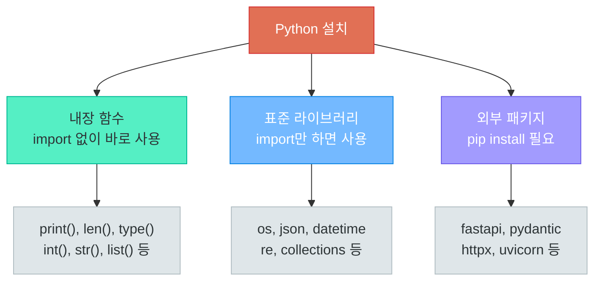
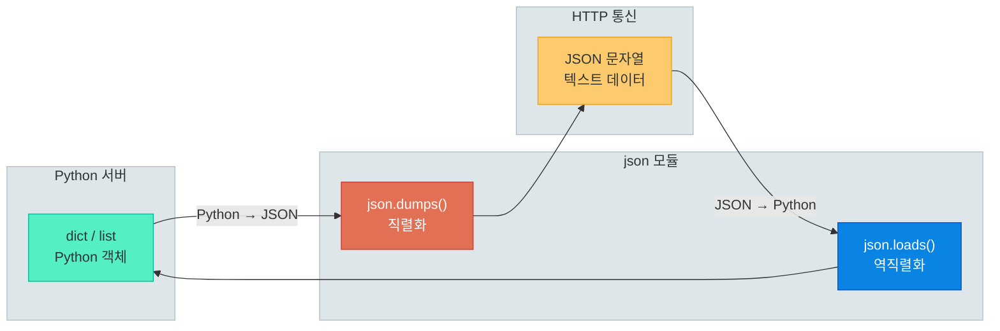
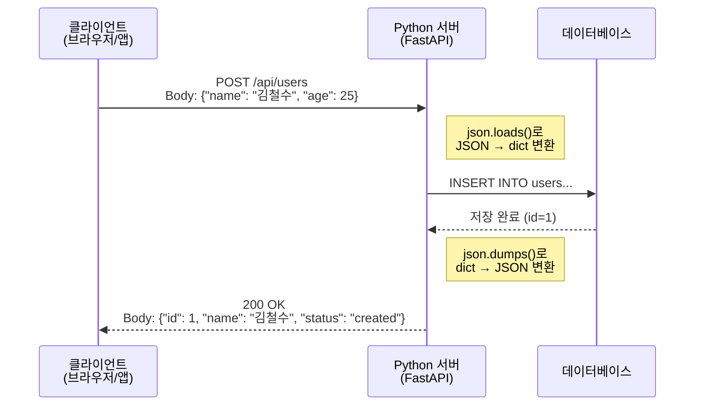
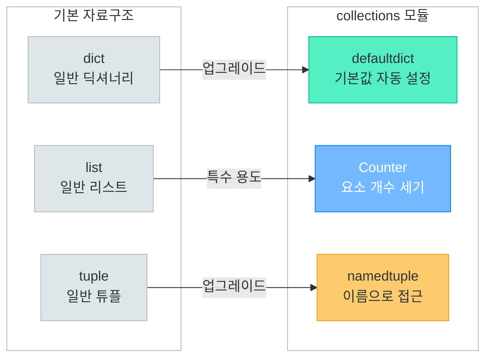
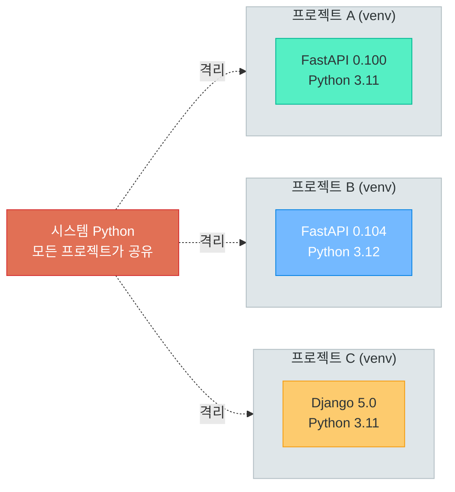
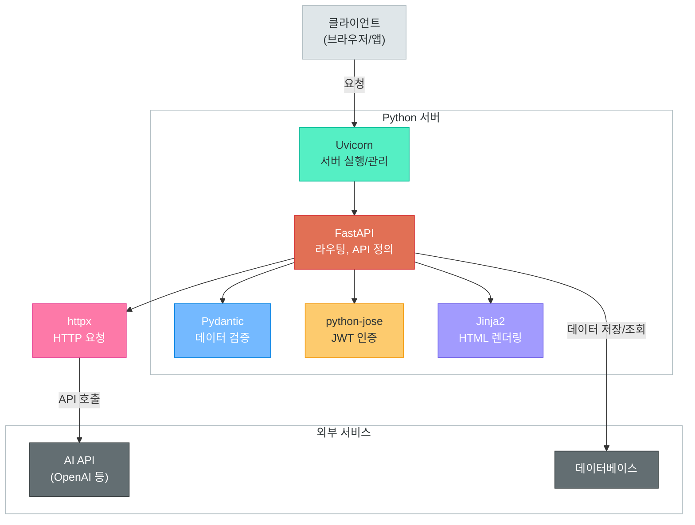

# 내장 함수, 표준 라이브러리, 패키지 관리

> Python에는 "배터리가 포함되어 있다(Batteries Included)" — 설치 즉시 사용할 수 있는 강력한 도구들의 세계

---

## 1. Python 내장 함수 (Built-in Functions)

### 내장 함수란?

Python을 설치하면 **아무것도 import 하지 않아도** 즉시 사용할 수 있는 함수들이 있다. 이것이 바로 **내장 함수(Built-in Functions)**이다.

집을 구매하면 기본으로 설치된 수도, 전기, 가스처럼 — Python에도 기본 장착된 도구들이 있다고 생각하면 된다.



### 타입 변환 함수

데이터의 옷을 갈아입히는 함수들이다. 문자열을 숫자로, 리스트를 튜플로 바꿀 수 있다.

```python
# 문자열 → 숫자
age = int("25")          # 25 (정수)
price = float("19.99")   # 19.99 (실수)

# 숫자 → 문자열
text = str(100)           # "100"
text2 = str(3.14)         # "3.14"

# 불리언 변환 — 빈 값은 False, 나머지는 True
bool(0)       # False
bool("")      # False
bool([])      # False
bool(None)    # False
bool(1)       # True
bool("hello") # True

# 컬렉션 변환 — 서로 자유롭게 변환 가능
list((1, 2, 3))         # [1, 2, 3] (튜플 → 리스트)
tuple([1, 2, 3])        # (1, 2, 3) (리스트 → 튜플)
set([1, 1, 2, 2, 3])    # {1, 2, 3} (중복 제거!)
dict([("a", 1), ("b", 2)])  # {"a": 1, "b": 2}
```

### 수학/통계 함수

```python
abs(-42)          # 42 (절댓값)
round(3.14159, 2) # 3.14 (소수점 2자리 반올림)
pow(2, 10)        # 1024 (거듭제곱)

scores = [85, 92, 78, 95, 88]
min(scores)       # 78
max(scores)       # 95
sum(scores)       # 438
```

### 반복/시퀀스 함수

웹 개발에서 데이터 목록을 다룰 때 가장 많이 사용하는 함수들이다.

```python
# len() — 길이 측정
len("안녕하세요")    # 5
len([1, 2, 3])       # 3

# range() — 숫자 시퀀스 생성
list(range(5))       # [0, 1, 2, 3, 4]
list(range(1, 6))    # [1, 2, 3, 4, 5]

# enumerate() — 인덱스와 값을 동시에 (API 응답에서 자주 사용)
fruits = ["사과", "바나나", "딸기"]
for i, fruit in enumerate(fruits):
    print(f"{i}: {fruit}")
# 0: 사과
# 1: 바나나
# 2: 딸기

# zip() — 여러 리스트를 묶기
names = ["김철수", "이영희", "박민준"]
scores = [85, 92, 78]
for name, score in zip(names, scores):
    print(f"{name}: {score}점")

# sorted() — 정렬 (원본 유지)
sorted([3, 1, 4, 1, 5])                # [1, 1, 3, 4, 5]

# map() — 모든 요소에 함수 적용
prices = ["100", "200", "300"]
int_prices = list(map(int, prices))     # [100, 200, 300]

# filter() — 조건에 맞는 요소만 추출
numbers = [1, 2, 3, 4, 5, 6, 7, 8]
evens = list(filter(lambda x: x % 2 == 0, numbers))  # [2, 4, 6, 8]
```

### 입출력 / 타입 확인 / 기타

```python
# print() — 출력 (디버깅의 기본)
print("이름:", "김철수", sep=" | ")  # 이름: | 김철수

# type(), isinstance() — 타입 확인
type(42)                # <class 'int'>
isinstance(42, int)     # True

# dir() — 객체가 가진 속성/메서드 목록
dir([])  # 리스트가 가진 모든 메서드 목록 표시
```

### 내장 함수 요약 표

| 카테고리 | 주요 함수 | 설명 |
|----------|-----------|------|
| **타입 변환** | `int()`, `str()`, `float()`, `bool()` | 기본 타입 간 변환 |
| | `list()`, `dict()`, `tuple()`, `set()` | 컬렉션 타입 간 변환 |
| **수학** | `abs()`, `round()`, `min()`, `max()`, `sum()`, `pow()` | 수학 연산 |
| **시퀀스** | `len()`, `range()`, `enumerate()`, `zip()` | 길이, 범위, 인덱싱 |
| | `sorted()`, `reversed()`, `map()`, `filter()` | 정렬, 변환, 필터 |
| **기타** | `type()`, `isinstance()`, `print()`, `input()`, `dir()` | 타입 확인, 입출력 |

> **핵심 포인트:** 내장 함수는 Python 어디서든 바로 쓸 수 있는 만능 도구다. 특히 `len()`, `type()`, `enumerate()`, `zip()`, `sorted()`, `map()`, `filter()`는 웹 개발에서 데이터를 가공할 때 매일 사용하게 된다.

---

## 2. 표준 라이브러리 — os, sys, pathlib

### 표준 라이브러리란?

Python을 설치하면 함께 딸려오는 모듈 모음이다. `pip install` 없이 `import`만 하면 바로 사용 가능하다. 새 차를 사면 기본으로 포함된 내비게이션, 에어컨, 블랙박스 같은 존재이다.

### os 모듈 — 운영체제와 대화하기

```python
import os

# 현재 작업 디렉토리
print(os.getcwd())  # /home/user/project

# 디렉토리 내용 확인
print(os.listdir("."))  # ['app.py', 'templates', 'static']

# 디렉토리 생성
os.makedirs("logs/2024", exist_ok=True)  # 중간 경로도 한번에 생성

# 환경 변수 읽기 — 서버 설정, API 키 관리에 필수!
db_host = os.environ.get("DB_HOST", "localhost")
api_key = os.environ.get("API_KEY", "default-key")

# 파일 존재 여부 확인
os.path.exists("config.json")  # True / False
os.path.isfile("app.py")       # True
os.path.isdir("templates")     # True
```

### sys 모듈 — Python 시스템 정보

```python
import sys

# Python 버전 확인
print(sys.version)    # 3.11.5 (main, Sep 11 2023, ...)
print(sys.platform)   # linux / win32 / darwin(macOS)

# 명령줄 인자 (CLI 프로그램에 유용)
# python app.py --port 8000 실행 시
print(sys.argv)  # ['app.py', '--port', '8000']

# 모듈 검색 경로
print(sys.path)  # Python이 모듈을 찾는 경로 목록

# 프로그램 종료
sys.exit(0)  # 정상 종료 (0), 에러 종료 (1)
```

### pathlib — 현대적 경로 처리

`os.path`보다 직관적이고 객체 지향적인 경로 처리 방법이다.

```python
from pathlib import Path

# 현재 디렉토리
current = Path.cwd()
print(current)  # /home/user/project

# 경로 결합 — / 연산자 사용 (os.path.join 대신)
config_path = Path("config") / "settings.json"
print(config_path)  # config/settings.json

# 파일 정보
p = Path("app.py")
p.exists()     # True / False
p.is_file()    # True
p.suffix       # '.py'
p.stem         # 'app'
p.parent       # Path('.') (부모 디렉토리)

# 디렉토리 생성
Path("logs/2024/01").mkdir(parents=True, exist_ok=True)

# 파일 읽기/쓰기 — 간결한 방법
content = Path("config.json").read_text(encoding="utf-8")
Path("output.txt").write_text("결과 데이터", encoding="utf-8")

# 패턴으로 파일 찾기
for py_file in Path(".").glob("**/*.py"):
    print(py_file)  # 모든 .py 파일 출력
```

### os.path vs pathlib 비교

| 작업 | os.path (구식) | pathlib (현대적) |
|------|---------------|----------------|
| 경로 결합 | `os.path.join("a", "b")` | `Path("a") / "b"` |
| 존재 확인 | `os.path.exists(path)` | `path.exists()` |
| 확장자 | `os.path.splitext(f)[1]` | `path.suffix` |
| 파일명 | `os.path.basename(path)` | `path.name` |
| 부모 경로 | `os.path.dirname(path)` | `path.parent` |
| 파일 읽기 | `open(path).read()` | `path.read_text()` |

> **핵심 포인트:** 새로운 프로젝트에서는 `pathlib`을 사용하자. 코드가 더 읽기 쉽고, 운영체제에 관계없이 경로를 안전하게 처리할 수 있다.

---

## 3. 표준 라이브러리 — json 모듈 (웹 개발 핵심!)

### 왜 json이 웹 개발의 핵심인가?

웹 세계에서 데이터를 주고받는 공용어가 바로 **JSON(JavaScript Object Notation)**이다. REST API의 요청과 응답 본문은 거의 대부분 JSON 형식으로 되어 있다.

Python의 `dict`/`list`를 네트워크로 전송하려면 **문자열(JSON)**로 변환해야 하고, 받은 JSON 문자열을 다시 **Python 객체**로 변환해야 한다. 이 양방향 변환을 담당하는 것이 `json` 모듈이다.



### json.dumps() / json.loads() — 문자열 변환

```python
import json

# === Python 객체 → JSON 문자열 (직렬화, Serialization) ===
user = {
    "name": "김철수",
    "age": 25,
    "is_student": True,
    "scores": [85, 92, 78],
    "address": None
}

# dumps = dump to string
json_str = json.dumps(user)
print(json_str)
# {"name": "\uae40\ucca0\uc218", "age": 25, "is_student": true, ...}

# 한글 깨짐 방지 + 보기 좋게 출력
json_str = json.dumps(user, ensure_ascii=False, indent=2)
print(json_str)
# {
#   "name": "김철수",
#   "age": 25,
#   "is_student": true,
#   "scores": [85, 92, 78],
#   "address": null
# }

# === JSON 문자열 → Python 객체 (역직렬화, Deserialization) ===
json_text = '{"name": "이영희", "age": 30, "active": true}'
data = json.loads(json_text)
print(data["name"])   # 이영희
print(type(data))     # <class 'dict'>
```

### json.dump() / json.load() — 파일 입출력

```python
import json

user = {"name": "박민준", "role": "developer", "skills": ["Python", "FastAPI"]}

# === Python 객체 → JSON 파일 저장 ===
with open("user.json", "w", encoding="utf-8") as f:
    json.dump(user, f, ensure_ascii=False, indent=2)

# === JSON 파일 → Python 객체 읽기 ===
with open("user.json", "r", encoding="utf-8") as f:
    loaded_user = json.load(f)
    print(loaded_user["name"])   # 박민준
```

> **혼동 주의:** `dumps`/`loads`는 **s**tring 변환, `dump`/`load`는 **f**ile 변환이다. s가 붙으면 문자열, 없으면 파일이라고 기억하자.

### Python ↔ JSON 타입 변환 규칙

| Python | JSON | 비고 |
|--------|------|------|
| `dict` | `object {}` | 가장 많이 사용 |
| `list`, `tuple` | `array []` | tuple도 array로 변환 |
| `str` | `string ""` | 문자열 |
| `int`, `float` | `number` | 숫자 |
| `True` | `true` | 소문자로 변환! |
| `False` | `false` | 소문자로 변환! |
| `None` | `null` | null로 변환! |

### 웹 API에서의 JSON 활용 흐름

실제 웹 서비스에서 JSON이 어떻게 흘러가는지 전체 흐름을 보자.



```python
# 실제 웹 서버에서의 JSON 처리 흐름
import json

# 1. 클라이언트 요청 수신 → JSON을 Python dict로 변환
request_body = '{"name": "김철수", "age": 25}'
user_data = json.loads(request_body)

# 2. 비즈니스 로직 처리
user_data["id"] = 1
user_data["created_at"] = "2024-01-15T10:30:00"

# 3. Python dict → JSON 응답으로 변환
response = json.dumps(user_data, ensure_ascii=False)
# {"name": "김철수", "age": 25, "id": 1, "created_at": "2024-01-15T10:30:00"}
```

> **핵심 포인트:** `json` 모듈은 Python과 웹 세계를 잇는 **다리**이다. REST API를 만들든, 외부 API를 호출하든, JSON 변환은 필수이다. FastAPI 같은 프레임워크는 이 변환을 자동으로 처리해주지만, 내부에서는 결국 같은 원리가 작동한다.

---

## 4. 표준 라이브러리 — datetime, collections

### datetime — 날짜와 시간 다루기

웹 서비스에서 날짜/시간은 어디서나 등장한다. 회원 가입일, 게시글 작성 시간, 토큰 만료 시간 등이 모두 datetime을 사용한다.

```python
from datetime import datetime, timedelta, date

# 현재 날짜/시간
now = datetime.now()
print(now)           # 2024-01-15 14:30:25.123456

# 특정 날짜 생성
birthday = datetime(1995, 3, 15, 9, 30)  # 1995-03-15 09:30:00

# 날짜 포맷팅 — strftime (string format time)
print(now.strftime("%Y-%m-%d"))         # 2024-01-15
print(now.strftime("%Y년 %m월 %d일"))    # 2024년 01월 15일

# 문자열 → datetime 파싱 — strptime (string parse time)
date_str = "2024-01-15"
parsed = datetime.strptime(date_str, "%Y-%m-%d")
print(parsed)   # 2024-01-15 00:00:00
```

### timedelta — 시간 차이 계산

```python
from datetime import datetime, timedelta

now = datetime.now()

# 시간 더하기/빼기
tomorrow = now + timedelta(days=1)
last_week = now - timedelta(weeks=1)

# JWT 토큰 만료 시간 설정 (실무에서 자주 사용)
token_expiry = now + timedelta(minutes=30)
print(f"토큰 만료: {token_expiry.strftime('%H:%M:%S')}")

# 두 날짜 사이의 차이
start = datetime(2024, 1, 1)
end = datetime(2024, 12, 31)
diff = end - start
print(f"차이: {diff.days}일")  # 차이: 365일
```

### collections — 강화된 자료구조

기본 `dict`, `list`로는 부족할 때 사용하는 특수 자료구조들이다.

```python
from collections import Counter, defaultdict, namedtuple

# === Counter — 요소 개수 세기 ===
# 로그 분석, 단어 빈도수 등에 활용
words = ["python", "java", "python", "go", "python", "java"]
counter = Counter(words)
print(counter)               # Counter({'python': 3, 'java': 2, 'go': 1})
print(counter.most_common(2)) # [('python', 3), ('java', 2)]

# === defaultdict — 기본값이 있는 딕셔너리 ===
# KeyError 걱정 없이 바로 사용 가능
scores = defaultdict(list)
scores["math"].append(95)     # 키가 없어도 자동으로 빈 리스트 생성
scores["math"].append(88)
scores["english"].append(92)
print(dict(scores))  # {'math': [95, 88], 'english': [92]}

# === namedtuple — 이름 붙은 튜플 ===
# 간단한 데이터 클래스 대용
User = namedtuple("User", ["name", "age", "email"])
user = User("김철수", 25, "kim@example.com")
print(user.name)    # 김철수 (인덱스 대신 이름으로 접근)
print(user.age)     # 25
```



> **핵심 포인트:** `datetime`은 웹 서비스의 시간 관련 로직(토큰 만료, 로그 타임스탬프 등)에 필수이고, `Counter`와 `defaultdict`는 데이터 분석과 집계에서 코드를 대폭 간결하게 만들어 준다.

---

## 5. 표준 라이브러리 — re (정규표현식)

### 정규표현식이란?

문자열에서 **특정 패턴**을 찾아내는 강력한 도구이다. 이메일 주소 검증, 전화번호 추출, 로그 파싱 등 텍스트 처리의 스위스 군용 칼이라 할 수 있다.

### 기본 패턴 문법

| 패턴 | 의미 | 예시 |
|------|------|------|
| `.` | 아무 문자 1개 | `a.c` → abc, aXc |
| `\d`, `\w`, `\s` | 숫자 / 문자+숫자+_ / 공백 | `\d+` → 123 |
| `*`, `+`, `?` | 0번이상 / 1번이상 / 0또는1번 | `ab+c` → abc, abbc |
| `{n}`, `{n,m}` | 정확히 n번 / n~m번 | `\d{3}` → 123 |
| `[]` | 문자 클래스 | `[aeiou]` → 모음 1개 |
| `^`, `$` | 시작 / 끝 | `^Hello`, `\.py$` |
| `\|` | 또는 | `cat\|dog` |
| `()` | 그룹핑 | `(\d+)-(\d+)` → 그룹 캡처 |

### 주요 함수 사용법

```python
import re

text = "연락처: 010-1234-5678, 이메일: hong@example.com, 가입일: 2024-01-15"

# search() — 첫 번째 매치 찾기
match = re.search(r"\d{3}-\d{4}-\d{4}", text)
if match:
    print(match.group())  # 010-1234-5678

# findall() — 모든 매치 찾기
numbers = re.findall(r"\d+", text)
print(numbers)  # ['010', '1234', '5678', '2024', '01', '15']

# match() — 문자열 시작부터 매치
result = re.match(r"연락처", text)
print(result.group())  # 연락처

# sub() — 패턴 치환
# 전화번호 마스킹 처리
masked = re.sub(r"(\d{3})-(\d{4})-(\d{4})", r"\1-****-\3", text)
print(masked)  # 연락처: 010-****-5678, ...
```

### 실전 예시 — 이메일/전화번호 검증

```python
import re

# 이메일 검증 패턴
def validate_email(email):
    pattern = r"^[a-zA-Z0-9._%+-]+@[a-zA-Z0-9.-]+\.[a-zA-Z]{2,}$"
    return bool(re.match(pattern, email))

print(validate_email("user@example.com"))   # True
print(validate_email("invalid-email"))       # False
print(validate_email("test@.com"))           # False

# 한국 전화번호 검증 패턴
def validate_phone(phone):
    pattern = r"^01[016789]-?\d{3,4}-?\d{4}$"
    return bool(re.match(pattern, phone))

print(validate_phone("010-1234-5678"))  # True
print(validate_phone("01012345678"))    # True
print(validate_phone("02-123-4567"))    # False (02는 지역번호)

# 비밀번호 강도 검사 — 조건별 정규식 활용
def check_password(pw):
    """8자 이상, 대문자/소문자/숫자/특수문자 포함 여부"""
    return {
        "8자 이상": len(pw) >= 8,
        "대문자": bool(re.search(r"[A-Z]", pw)),
        "소문자": bool(re.search(r"[a-z]", pw)),
        "숫자": bool(re.search(r"\d", pw)),
        "특수문자": bool(re.search(r"[!@#$%^&*]", pw)),
    }

print(check_password("MyPass123!"))
# {'8자 이상': True, '대문자': True, '소문자': True, '숫자': True, '특수문자': True}
```

> **핵심 포인트:** 정규표현식은 입력값 검증(이메일, 전화번호, 비밀번호)에 자주 사용된다. 복잡한 패턴은 읽기 어려우므로, 간단한 검증에만 직접 사용하고 복잡한 검증은 `pydantic` 같은 라이브러리에 맡기는 것이 현명하다.

---

## 6. 패키지 관리 (pip, venv)

### 왜 패키지 관리가 중요한가?

Python의 진짜 힘은 **수십만 개의 외부 패키지**에서 나온다. 웹 프레임워크, 데이터베이스 연결, AI 모델 호출 등 거의 모든 기능이 패키지로 제공된다. 이 패키지들을 설치하고, 버전을 관리하고, 프로젝트별로 격리하는 것이 패키지 관리이다.

### pip — Python 패키지 관리자

```bash
# 패키지 설치
pip install fastapi
pip install fastapi==0.104.1        # 특정 버전 설치
pip install "fastapi>=0.100,<0.200" # 버전 범위 지정
# 설치된 패키지 목록
pip list

# 설치된 패키지를 requirements.txt로 내보내기
pip freeze > requirements.txt

# requirements.txt로부터 일괄 설치
pip install -r requirements.txt

# 패키지 제거
pip uninstall fastapi

# 패키지 정보 확인
pip show fastapi
```

### requirements.txt — 프로젝트 의존성 명세서

프로젝트에 필요한 패키지와 버전을 기록한 파일이다. `pip freeze > requirements.txt` 명령으로 현재 환경을 내보내고, `pip install -r requirements.txt`로 동일 환경을 재현한다.

### 가상 환경 (venv) — 프로젝트별 격리

프로젝트마다 필요한 패키지와 버전이 다르다. 프로젝트 A는 FastAPI 0.100이 필요하고, 프로젝트 B는 FastAPI 0.104가 필요할 수 있다. 가상 환경은 이 문제를 해결한다.



### venv 사용법

```bash
# 1. 가상 환경 생성
python -m venv .venv

# 2. 가상 환경 활성화
# Linux/macOS
source .venv/bin/activate

# Windows
.venv\Scripts\activate

# 3. 활성화 확인 — 프롬프트에 (.venv) 표시
(.venv) $ which python    # /project/.venv/bin/python
(.venv) $ pip list         # 깨끗한 상태 (최소한의 패키지만)

# 4. 필요한 패키지 설치
(.venv) $ pip install -r requirements.txt

# 5. 가상 환경 비활성화
(.venv) $ deactivate
```

### 패키지 관리 전체 워크플로우


> **핵심 포인트:** 새 프로젝트를 시작할 때 가장 먼저 할 일은 `python -m venv .venv`로 가상 환경을 만드는 것이다. `.venv` 디렉토리는 `.gitignore`에 추가하고, `requirements.txt`만 Git에 커밋하자.

---

## 7. 우리 과정에서 사용할 주요 패키지

### 과정 전체에서 활용할 핵심 패키지들

이 과정에서는 Python으로 웹 API 서버를 구축하고, 생성형 AI와 연동하는 풀스택 서비스를 만들게 된다. 이를 위해 아래 패키지들을 사용한다.

| 패키지 | 용도 | 설치 명령 |
|--------|------|-----------|
| **fastapi** | 현대적 웹 API 프레임워크 | `pip install fastapi` |
| **uvicorn** | ASGI 서버 (FastAPI 실행기) | `pip install uvicorn[standard]` |
| **pydantic** | 데이터 검증 및 직렬화 | `pip install pydantic` |
| **httpx** | 비동기 HTTP 클라이언트 | `pip install httpx` |
| **python-jose** | JWT 토큰 생성/검증 | `pip install python-jose[cryptography]` |
| **python-multipart** | 폼 데이터/파일 업로드 처리 | `pip install python-multipart` |
| **jinja2** | HTML 템플릿 엔진 | `pip install jinja2` |

### 각 패키지의 역할



### 패키지 미리보기 — 한 줄 코드

```python
# FastAPI — 웹 API 서버 (다음 강의에서 본격적으로!)
from fastapi import FastAPI
app = FastAPI()

@app.get("/hello")
def hello():
    return {"message": "안녕하세요!"}  # 자동으로 JSON 응답

# Pydantic — 데이터 검증
from pydantic import BaseModel
class User(BaseModel):
    name: str
    age: int        # 타입이 맞지 않으면 자동 에러 발생

# httpx — 외부 API 호출
import httpx
response = httpx.get("https://api.example.com/data")
data = response.json()   # JSON 응답 → Python dict

# python-jose — JWT 토큰
from jose import jwt
token = jwt.encode({"user_id": 1}, "secret", algorithm="HS256")

# Jinja2 — HTML 템플릿
from jinja2 import Template
template = Template("<h1>안녕하세요, {{ name }}님!</h1>")
html = template.render(name="김철수")
```

### 과정 프로젝트 requirements.txt

위 표의 패키지들을 `requirements.txt`에 버전과 함께 기록하면, `pip install -r requirements.txt` 한 줄로 모든 환경을 재현할 수 있다.

```text
fastapi==0.104.1
uvicorn[standard]==0.24.0
pydantic==2.5.0
httpx==0.25.2
python-jose[cryptography]==3.3.0
python-multipart==0.0.6
jinja2==3.1.2
```

> **핵심 포인트:** 앞으로 강의가 진행되면서 각 패키지를 하나씩 깊이 있게 다루게 된다. 지금은 전체 그림만 파악하고, 실습 때 직접 설치하며 익히면 된다.

---

## 8. 핵심 정리

### 오늘 배운 내용 요약

| 영역 | 핵심 내용 | 웹 개발 활용 |
|------|-----------|-------------|
| **내장 함수** | `len()`, `type()`, `sorted()`, `map()`, `filter()` 등 | 데이터 가공, 변환 |
| **os / pathlib** | 파일 시스템, 환경변수, 경로 처리 | 설정 파일 관리, 파일 업로드 |
| **json** | `dumps()`/`loads()` 직렬화/역직렬화 | **REST API의 핵심** — 데이터 송수신 |
| **datetime** | 날짜/시간 생성, 포맷팅, 계산 | 토큰 만료, 로그 타임스탬프 |
| **collections** | `Counter`, `defaultdict`, `namedtuple` | 데이터 집계, 분석 |
| **re** | 정규표현식 패턴 매칭 | 입력값 검증 (이메일, 전화번호) |
| **pip / venv** | 패키지 설치, 가상 환경 관리 | 프로젝트 환경 구축 |

### 가장 중요한 3가지

```
1. json 모듈 = Python과 웹 세계를 잇는 다리
   → json.dumps(): Python dict → JSON 문자열
   → json.loads(): JSON 문자열 → Python dict

2. venv = 프로젝트마다 독립된 Python 환경
   → python -m venv .venv → 생성
   → source .venv/bin/activate → 활성화

3. requirements.txt = 팀 협업의 필수 파일
   → pip freeze > requirements.txt → 내보내기
   → pip install -r requirements.txt → 설치
```

### 다음 강의 미리보기

다음 시간에는 **Flask 소개와 웹 프레임워크**를 학습한다. 오늘 배운 `json` 모듈이 웹 프레임워크 내부에서 어떻게 활용되는지, 그리고 몇 줄의 코드만으로 웹 서버를 만드는 경험을 하게 될 것이다. `pip install flask`로 첫 번째 외부 패키지를 설치하고, "Hello, World!" API를 직접 만들어 보자.

---

[이전 강의: 04_functions_and_objects.md](./04_functions_and_objects.md) | [다음 강의: 06_flask_intro.md](./06_flask_intro.md)
