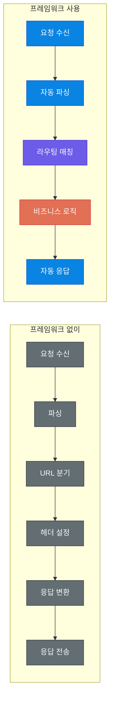
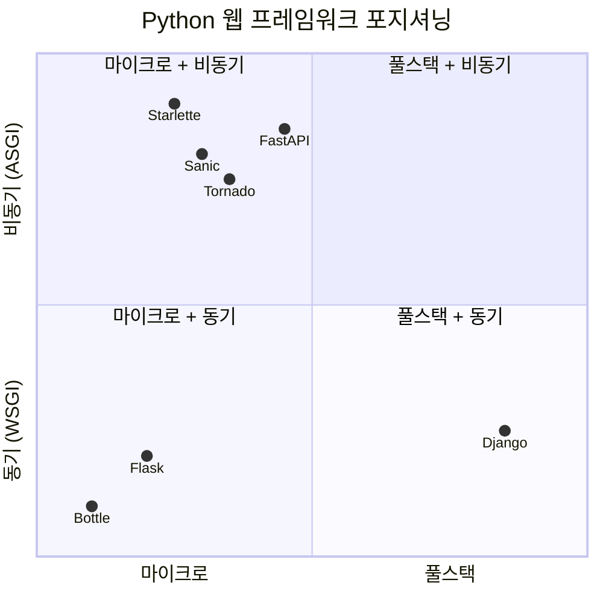
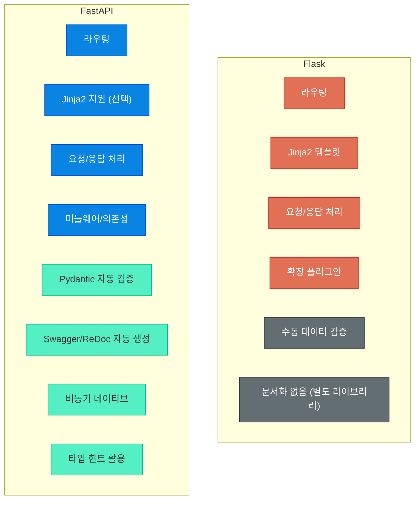
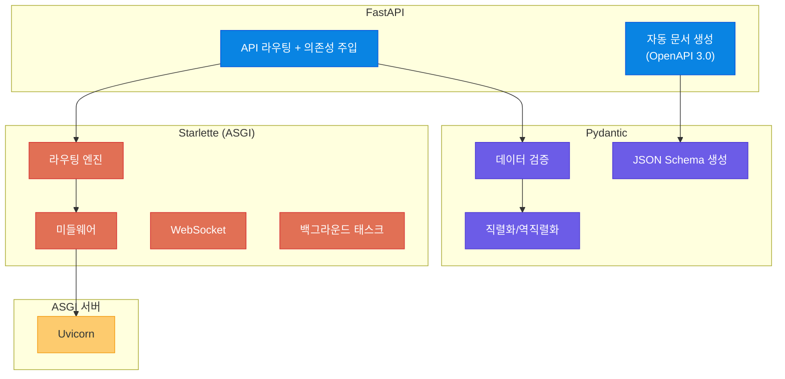
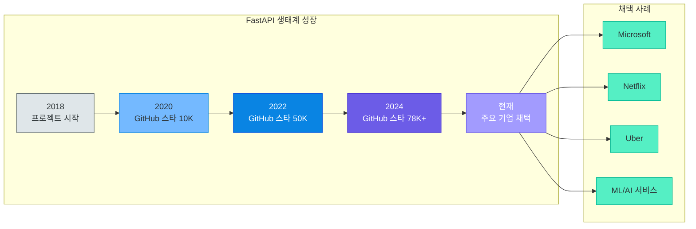
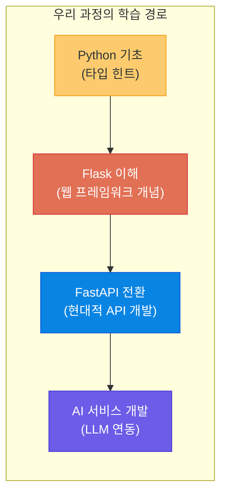

# Flask 소개와 웹 프레임워크 생태계 비교

> 웹 프레임워크는 개발자의 반복 노동을 줄여주는 도구입니다. Flask로 시작해서 왜 FastAPI로 넘어가는지, 그 여정을 함께 따라가 봅시다.

---

## 1. 웹 프레임워크란?

### 프레임워크 vs 라이브러리

프레임워크와 라이브러리는 자주 혼동되는 개념입니다. 핵심 차이는 **제어 흐름의 주도권**에 있습니다.

- **라이브러리**: 개발자가 필요할 때 호출합니다. 주도권이 개발자에게 있습니다.
- **프레임워크**: 프레임워크가 개발자의 코드를 호출합니다. 주도권이 프레임워크에 있습니다.

이것을 **제어의 역전(Inversion of Control)**이라고 합니다.

> **비유로 이해하기**
> - 라이브러리 = **공구 상자**: 망치가 필요하면 꺼내서 씁니다. 무엇을 만들지는 여러분이 결정합니다.
> - 프레임워크 = **자동차 조립 공장의 컨베이어 벨트**: 벨트가 움직이고, 여러분은 정해진 위치에서 부품을 끼웁니다. 전체 흐름은 공장이 관리합니다.

| 구분 | 라이브러리 | 프레임워크 |
|------|-----------|-----------|
| 제어 흐름 | 개발자가 호출 | 프레임워크가 호출 |
| 자유도 | 높음 | 규칙 안에서 자유 |
| 구조 | 개발자가 직접 설계 | 기본 구조가 제공됨 |
| 예시 | `requests`, `BeautifulSoup` | Flask, Django, FastAPI |

### 왜 프레임워크를 사용하는가

프레임워크 없이 웹 서버를 만들면 어떤 일이 벌어질까요?

```python
# 프레임워크 없이 HTTP 서버 만들기 (Python 표준 라이브러리만 사용)
from http.server import HTTPServer, BaseHTTPRequestHandler
import json

class MyHandler(BaseHTTPRequestHandler):
    def do_GET(self):
        if self.path == '/':
            self.send_response(200)
            self.send_header('Content-Type', 'text/html; charset=utf-8')
            self.end_headers()
            self.wfile.write('<h1>안녕하세요!</h1>'.encode('utf-8'))
        elif self.path == '/api/users':
            self.send_response(200)
            self.send_header('Content-Type', 'application/json')
            self.end_headers()
            self.wfile.write(json.dumps({"users": ["홍길동"]}).encode('utf-8'))
        else:
            self.send_response(404)
            self.end_headers()

server = HTTPServer(('localhost', 8000), MyHandler)
server.serve_forever()
```

```python
# Flask를 사용하면 같은 기능이 이렇게 간결해집니다
from flask import Flask, jsonify

app = Flask(__name__)

@app.route('/')
def home():
    return '<h1>안녕하세요!</h1>'

@app.route('/api/users')
def users():
    return jsonify(users=["홍길동", "김철수"])
```

프레임워크는 다음과 같은 반복 작업을 대신 처리해 줍니다.

- URL 라우팅 (어떤 경로에 어떤 함수를 연결할지)
- 요청 파싱 (헤더, 바디, 쿼리 파라미터 추출)
- 응답 생성 (상태 코드, 헤더, JSON 변환)
- 보안 처리 (CSRF, XSS 방어)
- 에러 핸들링 (404, 500 등)

### 웹 요청 처리 흐름 비교



> **핵심 포인트:** 프레임워크를 사용하면 개발자는 **비즈니스 로직**에만 집중할 수 있습니다. 나머지 인프라 코드는 프레임워크가 처리합니다.

---

## 2. Python 웹 프레임워크 생태계

Python에는 다양한 웹 프레임워크가 존재합니다. 각각의 철학과 특징이 다르기 때문에, 프로젝트의 성격에 맞게 선택해야 합니다.

### Django: 풀스택 프레임워크

Django는 **"배터리 포함(Batteries Included)"** 철학을 가진 풀스택 프레임워크입니다.

- ORM, 관리자 페이지, 인증 시스템, 폼 처리 등이 기본 내장
- 대형 웹 애플리케이션에 적합 (Instagram, Pinterest가 Django로 시작)
- 학습할 양이 많지만 한 번 익히면 빠르게 개발 가능
- **비유**: 풀옵션 아파트 — 입주하면 가구, 가전, 인테리어가 모두 갖춰져 있습니다

### Flask: 마이크로 프레임워크

Flask는 **최소한의 핵심 기능**만 제공하고 나머지는 개발자가 선택합니다.

- 라우팅, 요청/응답 처리, 템플릿 엔진(Jinja2)만 기본 제공
- 확장 라이브러리(Flask-SQLAlchemy, Flask-Login 등)로 기능 추가
- 소규모~중규모 프로젝트에 적합
- **비유**: 빈 원룸 — 가구와 인테리어를 직접 골라서 꾸밉니다

### FastAPI: 현대적 API 프레임워크

FastAPI는 **API 개발에 특화**된 현대적 프레임워크입니다.

- Python 타입 힌트 기반 자동 검증 (Pydantic)
- 자동 API 문서화 (Swagger UI, ReDoc)
- 비동기(async/await) 네이티브 지원
- Node.js, Go에 준하는 높은 성능
- **비유**: 스마트 팩토리 — 설계도(타입 힌트)만 넣으면 검증, 문서, 성능이 자동으로 따라옵니다

### 기타 프레임워크

| 프레임워크 | 특징 |
|-----------|------|
| **Tornado** | 비동기 네트워킹 라이브러리 겸 프레임워크, 실시간 채팅에 강점 |
| **Bottle** | 단일 파일 프레임워크, 초소형 프로젝트용 |
| **Starlette** | ASGI 프레임워크, FastAPI의 기반 |
| **Sanic** | 비동기 지원, Flask와 유사한 문법 |

### 프레임워크 비교 표

| 항목 | Django | Flask | FastAPI |
|------|--------|-------|---------|
| **유형** | 풀스택 | 마이크로 | API 특화 |
| **학습 곡선** | 높음 | 낮음 | 중간 |
| **성능** | 보통 | 보통 | 높음 |
| **커뮤니티** | 매우 큼 | 큼 | 빠르게 성장 중 |
| **비동기 지원** | 제한적 (3.1+) | 제한적 (2.0+) | 네이티브 |
| **자동 문서화** | 없음 (DRF로 가능) | 없음 | 내장 (OpenAPI) |
| **데이터 검증** | Forms/Serializer | 수동 | Pydantic 자동 |
| **적합한 용도** | CMS, 관리 시스템 | 프로토타입, 소규모 웹 | REST API, ML 서빙 |
| **GitHub 스타** | 80k+ | 68k+ | 78k+ |

### 프레임워크 포지셔닝



> **핵심 포인트:** 프레임워크 선택에 정답은 없습니다. 프로젝트의 규모, 팀의 역량, 성능 요구사항에 따라 최적의 선택이 달라집니다. 우리 과정에서는 **API 중심 개발**과 **AI 서비스 연동**에 최적화된 FastAPI를 주력으로 사용합니다.

---

## 3. Flask 소개

### Flask의 철학

Flask의 공식 설명은 이렇습니다:

> "Flask is a micro framework for Python based on Werkzeug and Jinja2. **Micro does not mean that your whole application has to fit into a single Python file, nor does it mean that Flask is lacking in functionality.** The micro in microframework means Flask aims to keep the core simple but extensible."

핵심은 **"마이크로는 제한적이라는 뜻이 아니다"**라는 것입니다. Flask는 핵심을 단순하게 유지하되, 확장은 자유롭게 할 수 있도록 설계되었습니다.

### 최소 앱 예제 (Hello World)

```python
# app.py - Flask 최소 애플리케이션
from flask import Flask

app = Flask(__name__)           # Flask 인스턴스 생성

@app.route('/')                 # 라우트 데코레이터로 URL과 함수 연결
def hello():
    return '안녕하세요! Flask입니다.'

if __name__ == '__main__':
    app.run(debug=True, port=5000)  # 개발 서버 실행
```

```bash
# 실행 방법
$ python app.py
 * Running on http://127.0.0.1:5000
```

단 7줄의 코드로 웹 서버가 만들어집니다. 이것이 Flask의 매력입니다.

### 라우팅 기본

라우팅은 **URL 경로와 처리 함수를 연결**하는 것입니다.

```python
from flask import Flask, request
app = Flask(__name__)

@app.route('/')                              # 기본 라우트
def index():
    return '메인 페이지'

@app.route('/user/<username>')               # 동적 라우트 (URL 변수)
def show_user(username):
    return f'{username}님의 프로필'

@app.route('/post/<int:post_id>')            # 타입 지정 가능
def show_post(post_id):
    return f'{post_id}번 게시글'

@app.route('/login', methods=['GET', 'POST']) # HTTP 메서드 지정
def login():
    if request.method == 'POST':
        return '로그인 처리'
    return '로그인 폼 표시'
```

### 요청/응답 처리

```python
from flask import Flask, request, jsonify

app = Flask(__name__)

@app.route('/api/data', methods=['POST'])
def handle_data():
    json_data = request.get_json()              # JSON 본문
    name = request.args.get('name')             # 쿼리 파라미터 (?name=홍길동)
    token = request.headers.get('Authorization') # 헤더

    return jsonify({"message": "처리 완료", "received": json_data}), 201
```

### 템플릿 (Jinja2) 기본

Flask는 Jinja2 템플릿 엔진을 내장하고 있어 HTML을 동적으로 생성할 수 있습니다.

```python
from flask import Flask, render_template

app = Flask(__name__)

@app.route('/profile/<name>')
def profile(name):
    # templates/profile.html 파일을 렌더링
    return render_template('profile.html', username=name, age=25)
```

```html
<!-- templates/profile.html — Jinja2 문법으로 동적 HTML 생성 -->
<h1>{{ username }}님의 프로필</h1>

    <p>성인 사용자입니다.</p>

    <p>미성년 사용자입니다.</p>

```

### Flask의 장단점

| 장점 | 단점 |
|------|------|
| 배우기 쉬움 (진입 장벽 낮음) | 대규모 프로젝트 구조 직접 설계 필요 |
| 가벼움 (최소 의존성) | 비동기 지원 제한적 |
| 유연함 (원하는 것만 조합) | API 문서 자동화 없음 |
| 거대한 커뮤니티와 자료 | 데이터 검증 수동 처리 |
| 빠른 프로토타이핑 | 타입 안정성 부족 |

---

## 4. Flask 앱 만들어보기

간단한 메모장 API를 Flask로 구현해 보겠습니다. 이 예제를 통해 Flask의 CRUD 패턴을 이해할 수 있습니다.

### 메모장 API (간결 버전)

```python
from flask import Flask, request, jsonify

app = Flask(__name__)
memos = {}  # 인메모리 저장소 (실제로는 DB 사용)
next_id = 1

@app.route('/memos', methods=['GET'])          # 전체 조회
def get_memos():
    return jsonify(list(memos.values()))

@app.route('/memos', methods=['POST'])         # 생성
def create_memo():
    global next_id
    data = request.get_json()
    if not data or 'title' not in data:        # 수동 검증 필요 (Flask의 한계)
        return jsonify({"error": "title은 필수입니다"}), 400
    memo = {"id": next_id, "title": data["title"], "content": data.get("content", "")}
    memos[next_id] = memo
    next_id += 1
    return jsonify(memo), 201

@app.route('/memos/<int:memo_id>', methods=['PUT'])    # 수정
def update_memo(memo_id):
    if memo_id not in memos:
        return jsonify({"error": "메모를 찾을 수 없습니다"}), 404
    data = request.get_json()
    memos[memo_id].update({"title": data.get("title", memos[memo_id]["title"]),
                           "content": data.get("content", memos[memo_id]["content"])})
    return jsonify(memos[memo_id])

@app.route('/memos/<int:memo_id>', methods=['DELETE']) # 삭제
def delete_memo(memo_id):
    if memo_id not in memos:
        return jsonify({"error": "메모를 찾을 수 없습니다"}), 404
    del memos[memo_id]
    return '', 204
```

### 눈여겨볼 점

위 코드에서 몇 가지 불편한 점이 보입니다.

1. **데이터 검증을 수동으로** 해야 합니다 (`if not data or 'title' not in data`)
2. **타입 검사가 없습니다** — `title`에 숫자가 와도 에러가 나지 않습니다
3. **API 문서가 자동으로 생성되지 않습니다** — Swagger UI를 보려면 별도 라이브러리 필요
4. **응답 스키마가 정의되지 않습니다** — 프론트엔드 개발자가 응답 구조를 코드를 읽어야 알 수 있습니다

이러한 한계들이 FastAPI로 전환하는 동기가 됩니다.

---

## 5. Flask의 한계와 FastAPI로의 전환

### 비동기 지원 부족

Flask는 기본적으로 **동기(Synchronous)** 방식으로 동작합니다. 하나의 요청이 처리되는 동안 다른 요청은 대기해야 합니다.

```python
# Flask - 동기 방식 (요청이 블로킹됨)
import time

@app.route('/slow')
def slow_task():
    time.sleep(3)  # 3초 동안 다른 요청 처리 불가
    return "완료"
```

Flask 2.0부터 `async def`를 지원하기는 하지만, 내부적으로 별도 스레드에서 실행되므로 **진정한 비동기가 아닙니다**.

```python
# Flask 2.0+ - async 지원하지만 제한적
@app.route('/async-task')
async def async_task():
    await asyncio.sleep(3)  # 지원은 하지만 ASGI 네이티브가 아님
    return "완료"
```

FastAPI는 ASGI(Asynchronous Server Gateway Interface) 기반으로, **비동기를 네이티브로 지원**합니다.

### 타입 검증 수동 처리

Flask에서 요청 데이터를 검증하려면 직접 코드를 작성해야 합니다.

```python
# Flask - 수동 검증 (if 문이 끝없이 이어짐)
@app.route('/users', methods=['POST'])
def create_user():
    data = request.get_json()
    if not data:
        return jsonify({"error": "JSON 데이터가 필요합니다"}), 400
    if 'name' not in data or not isinstance(data['name'], str):
        return jsonify({"error": "name은 문자열이어야 합니다"}), 400
    if 'age' not in data or not isinstance(data['age'], int):
        return jsonify({"error": "age는 정수여야 합니다"}), 400
    if data['age'] < 0 or data['age'] > 150:
        return jsonify({"error": "age는 0~150 사이여야 합니다"}), 400
    # ... 필드가 늘어날수록 검증 코드도 비례하여 증가
    return jsonify({"message": "사용자 생성 완료"}), 201
```

```python
# FastAPI - Pydantic으로 자동 검증 (깔끔하고 안전)
from pydantic import BaseModel, Field

class UserCreate(BaseModel):
    name: str
    age: int = Field(ge=0, le=150)
    email: str

@app.post('/users', status_code=201)
def create_user(user: UserCreate):
    # 검증은 Pydantic이 자동으로 처리
    # 잘못된 데이터가 오면 자동으로 422 에러 반환
    return {"message": "사용자 생성 완료"}
```

### API 문서 자동화 부재

Flask에서 API 문서를 만들려면 별도의 라이브러리(`flask-restx`, `flasgger` 등)를 설치하고 설정해야 합니다. FastAPI는 코드만 작성하면 **자동으로 Swagger UI와 ReDoc 문서가 생성**됩니다.

### 성능 비교

| 항목 | Flask (Gunicorn) | FastAPI (Uvicorn) |
|------|-----------------|-------------------|
| 초당 처리량 (RPS) | ~1,500 | ~9,000+ |
| 동시 연결 처리 | 스레드 기반 (제한적) | 이벤트 루프 (효율적) |
| I/O 대기 시 | 스레드 블로킹 | 비동기 논블로킹 |
| 메모리 사용 | 보통 | 낮음 |

> **참고**: 성능 수치는 벤치마크 환경에 따라 다를 수 있습니다. 핵심은 **I/O 바운드 작업**(DB 조회, 외부 API 호출 등)에서 비동기 방식이 압도적으로 유리하다는 점입니다.

### Flask vs FastAPI 기능 비교



> **핵심 포인트:** Flask의 한계는 "Flask가 나쁜 프레임워크"라는 뜻이 아닙니다. Flask가 탄생한 2010년과 현재의 웹 개발 환경이 다르기 때문입니다. API 중심, 비동기, 타입 안정성이 중요해진 현대 웹 개발에서는 FastAPI가 더 적합합니다.

---

## 6. 왜 FastAPI인가?

### 자동 API 문서화

FastAPI를 사용하면 코드를 작성하는 것만으로 자동으로 **Swagger UI**와 **ReDoc** 문서가 생성됩니다.

```python
from fastapi import FastAPI
from pydantic import BaseModel

app = FastAPI(title="메모 API", version="1.0.0")

class Memo(BaseModel):
    title: str
    content: str = ""

@app.post("/memos", response_model=Memo)
def create_memo(memo: Memo):
    """새 메모를 생성합니다."""
    return memo
```

위 코드만 작성하면 다음 URL에서 API 문서를 확인할 수 있습니다.

- `http://localhost:8000/docs` — Swagger UI (인터랙티브 테스트 가능)
- `http://localhost:8000/redoc` — ReDoc (깔끔한 레퍼런스 문서)

API 문서를 따로 작성할 필요가 없습니다. **코드가 곧 문서**입니다.

### Pydantic 기반 데이터 검증

FastAPI는 Pydantic을 사용하여 요청/응답 데이터를 자동으로 검증합니다.

```python
from pydantic import BaseModel, Field, EmailStr
from typing import Optional

class UserCreate(BaseModel):
    name: str = Field(min_length=2, max_length=50)  # 길이 제한 자동 검증
    age: int = Field(ge=0, le=150)                  # 범위 자동 검증
    email: EmailStr                                  # 이메일 형식 자동 검증
    bio: Optional[str] = None                        # 선택 필드

# 잘못된 데이터 → 자동으로 422 에러 + 상세 메시지 반환
```

### 비동기 네이티브 지원

FastAPI는 Python의 `async/await` 문법을 **네이티브로 지원**합니다. AI 서비스에서 외부 API 호출, DB 조회 등 I/O 작업이 많은 상황에서 큰 성능 차이를 만들어 냅니다.

```python
@app.get("/ai/generate")
async def generate_text(prompt: str):
    async with httpx.AsyncClient() as client:      # 비동기 HTTP 클라이언트
        response = await client.post(               # 대기 중 다른 요청 처리 가능
            "https://api.openai.com/v1/chat/completions",
            json={"model": "gpt-4", "messages": [{"role": "user", "content": prompt}]}
        )
    return response.json()
```

### 타입 힌트 활용

FastAPI는 Python의 타입 힌트를 적극 활용합니다. 이전 강의(04장)에서 배운 타입 힌트가 여기서 빛을 발합니다.

```python
from typing import List, Optional

@app.get("/users", response_model=List[User])
def get_users(skip: int = 0, limit: int = 10, name: Optional[str] = None):
    pass  # 타입 힌트가 곧 API 스펙 — 쿼리 파라미터 자동 변환, 문서 자동 반영
```

### 높은 성능 (Starlette 기반)

FastAPI는 내부적으로 **Starlette**(ASGI 프레임워크)과 **Pydantic**(데이터 검증)을 결합하여 만들어졌습니다.

### FastAPI 아키텍처 구조



### 생태계 성장세

FastAPI는 2018년 말에 등장하여 빠르게 성장하고 있습니다.



> **핵심 포인트:** FastAPI는 단순히 "새로운 프레임워크"가 아니라, **현대 웹 개발의 요구사항**(타입 안정성, 비동기, 자동 문서화)을 정면으로 해결하는 프레임워크입니다. 특히 AI/ML 서비스의 API 서빙에서 사실상 표준이 되어가고 있습니다.

---

## 7. 핵심 정리

### Flask vs FastAPI 최종 비교

| 비교 항목 | Flask | FastAPI |
|----------|-------|---------|
| **출시 연도** | 2010 | 2018 |
| **WSGI/ASGI** | WSGI (동기) | ASGI (비동기) |
| **라우팅** | `@app.route` 데코레이터 | `@app.get/post/put/delete` |
| **데이터 검증** | 수동 (if 문 연쇄) | Pydantic 자동 |
| **API 문서** | 없음 (별도 설치) | Swagger UI + ReDoc 자동 |
| **타입 힌트** | 미활용 | 핵심 기능 |
| **비동기** | 제한적 (2.0+) | 네이티브 지원 |
| **성능** | 보통 | 높음 (Starlette 기반) |
| **학습 곡선** | 매우 낮음 | 약간 높음 (타입 힌트 필요) |
| **적합한 용도** | 전통적 웹앱, 프로토타입 | REST API, AI 서비스, 마이크로서비스 |
| **실행 서버** | Gunicorn (WSGI) | Uvicorn (ASGI) |

### 같은 API, 다른 코드 — 최종 비교

```python
# === Flask 버전 ===
from flask import Flask, request, jsonify

app = Flask(__name__)

@app.route('/items', methods=['POST'])
def create_item():
    data = request.get_json()
    if not data or 'name' not in data:
        return jsonify({"error": "name 필수"}), 400
    if 'price' not in data or not isinstance(data['price'], (int, float)):
        return jsonify({"error": "price는 숫자"}), 400
    return jsonify(data), 201
```

```python
# === FastAPI 버전 ===
from fastapi import FastAPI
from pydantic import BaseModel

app = FastAPI()

class Item(BaseModel):
    name: str
    price: float
    description: str = ""

@app.post('/items', status_code=201)
def create_item(item: Item):
    return item  # 검증, 문서화, 직렬화 모두 자동
```

### 우리 과정에서의 선택 이유

이 **생성형 AI 풀스택 개발 과정**에서 FastAPI를 선택하는 이유는 명확합니다.

1. **AI 서비스 연동**: LLM API 호출은 I/O 바운드 작업 → 비동기 처리가 필수
2. **자동 API 문서화**: 프론트엔드와의 협업에서 Swagger UI가 큰 도움
3. **타입 안정성**: Pydantic 모델로 데이터 무결성 보장
4. **성능**: 다수의 사용자가 동시에 AI 서비스를 요청하는 상황 대응
5. **학습 효율**: 타입 힌트를 배우면 FastAPI와 Pydantic이 자연스럽게 따라옴



### 다음 강의 미리보기

다음 강의에서는 **FastAPI 기초**를 다룹니다. 오늘 Flask로 살펴본 웹 프레임워크의 개념을 바탕으로, FastAPI의 핵심 기능들을 하나씩 실습해 보겠습니다.

- FastAPI 프로젝트 구조와 설정
- 경로 연산(Path Operation) 기본
- Pydantic 모델을 활용한 요청/응답 처리
- 자동 API 문서 활용하기
- 의존성 주입(Dependency Injection) 기초

---

[이전 강의: 05_builtins_stdlib_packages.md](05_builtins_stdlib_packages.md) | [다음 강의: 07_fastapi_basics.md](07_fastapi_basics.md)
