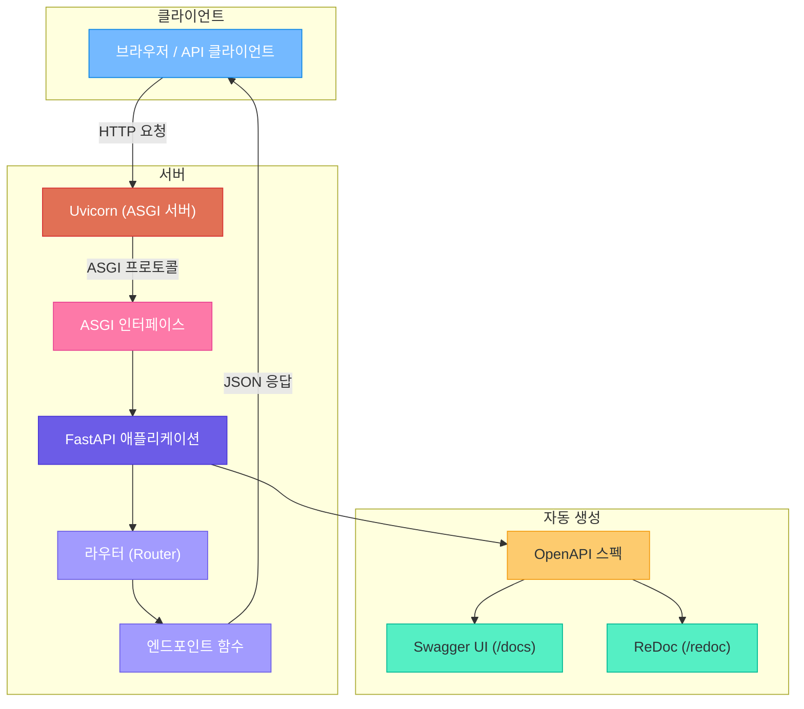
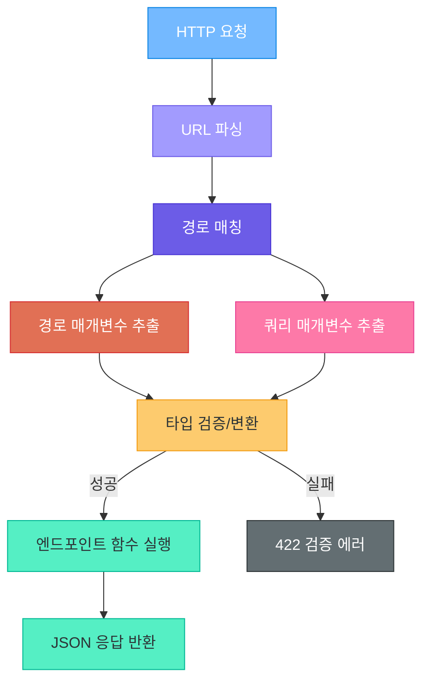
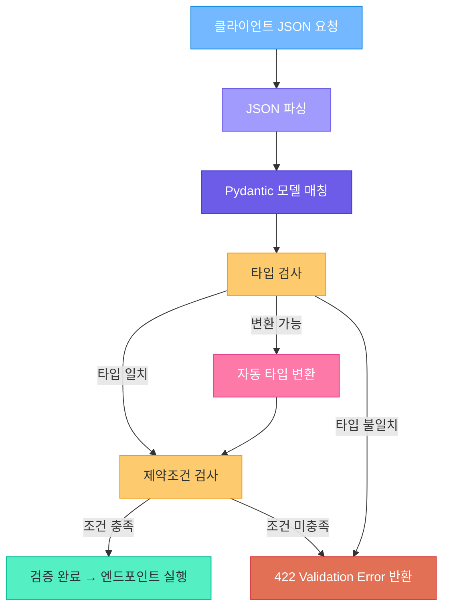
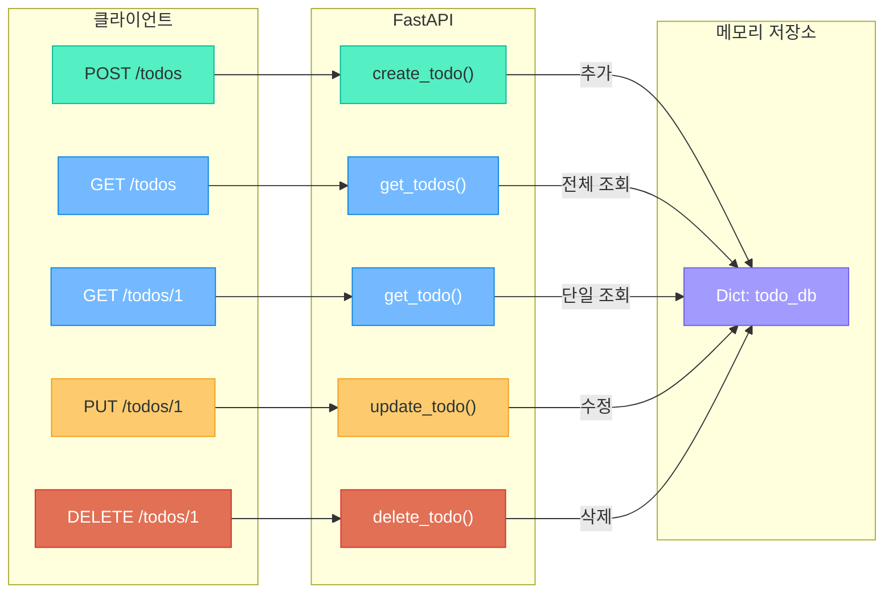
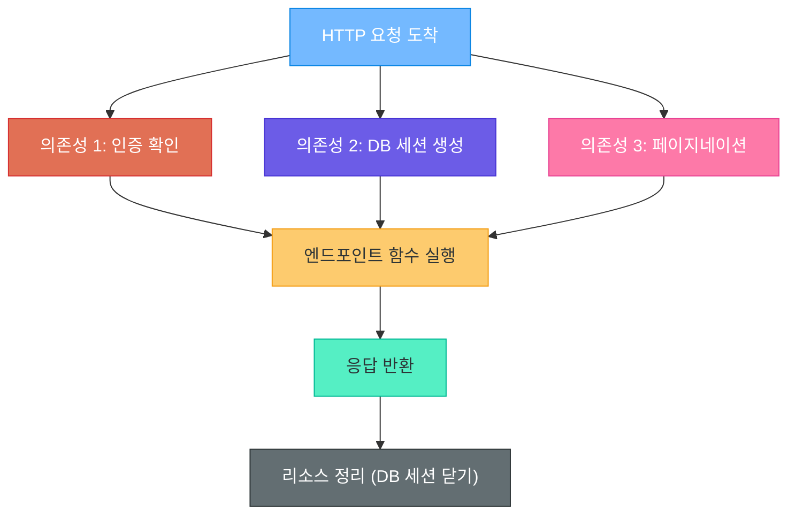
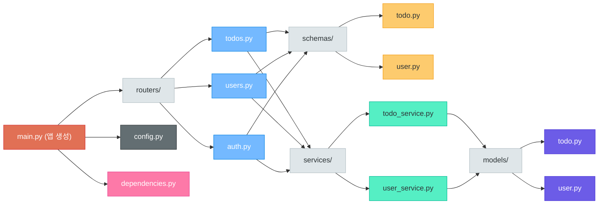
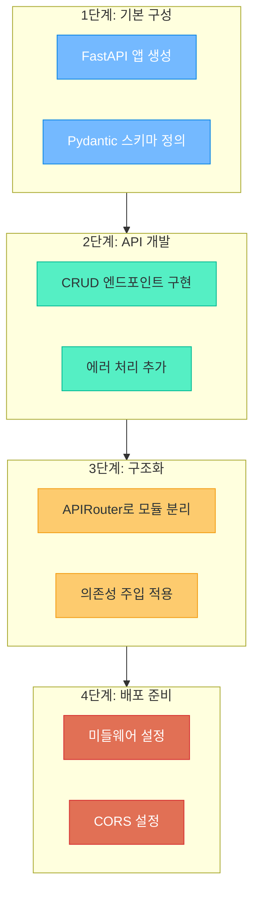

# FastAPI 기초

> 현대 웹 API 개발의 새로운 기준 — 빠르고, 직관적이며, 자동으로 문서화되는 Python 프레임워크

---

## 1. FastAPI 시작하기

### FastAPI란?

FastAPI는 Python으로 API를 만들기 위한 **현대적인 고성능 웹 프레임워크**입니다.

비유하자면, Flask가 **수동 변속기 자동차**라면 FastAPI는 **자율주행 자동차**와 같습니다. 타입 힌트만 적어주면 입력 검증, API 문서 생성, 데이터 직렬화를 **자동으로** 처리해줍니다.

| 특징 | 설명 |
|------|------|
| **고성능** | Node.js, Go에 필적하는 성능 (Starlette + Uvicorn 기반) |
| **빠른 개발** | 기능 개발 속도 약 200~300% 향상 (공식 문서 기준) |
| **자동 문서화** | Swagger UI, ReDoc 문서가 자동 생성 |
| **타입 기반** | Python 타입 힌트로 검증, 직렬화, 문서화를 한 번에 |
| **비동기 지원** | async/await 네이티브 지원 |

### 설치

```bash
# FastAPI와 Uvicorn 설치
pip install fastapi uvicorn

# 또는 모든 선택적 의존성 포함 설치
pip install "fastapi[all]"
```

> **핵심 포인트:** `fastapi[all]`을 설치하면 Uvicorn, Jinja2, python-multipart 등 실무에서 자주 쓰는 패키지가 한 번에 설치됩니다. 학습 단계에서는 이 방법을 추천합니다.

### 최소 앱 예제

```python
# main.py
from fastapi import FastAPI

app = FastAPI()  # 앱 인스턴스 생성

@app.get("/")
def read_root():
    return {"message": "안녕하세요, FastAPI!"}
```

단 **5줄의 핵심 코드**만으로 완전히 동작하는 API가 만들어졌습니다.

### 서버 실행

```bash
# 개발 모드 실행 (코드 변경 시 자동 재시작)
uvicorn main:app --reload

# 호스트와 포트 지정
uvicorn main:app --reload --host 0.0.0.0 --port 8000
```

- `main` : Python 파일명 (main.py)
- `app` : FastAPI 인스턴스 변수명
- `--reload` : 코드 변경 시 서버 자동 재시작 (개발용)

### 자동 API 문서 확인

FastAPI의 가장 강력한 기능 중 하나는 **자동 API 문서 생성**입니다.

| URL | 문서 형식 | 특징 |
|-----|-----------|------|
| `http://localhost:8000/docs` | Swagger UI | 인터랙티브, API 직접 테스트 가능 |
| `http://localhost:8000/redoc` | ReDoc | 깔끔한 읽기 전용 문서 |
| `http://localhost:8000/openapi.json` | OpenAPI JSON | 기계가 읽는 스펙 파일 |

별도의 문서 작성 없이 코드에서 **자동으로** 생성됩니다. 이것이 Flask와의 가장 큰 차이점입니다.

### FastAPI 앱 구조



> **핵심 포인트:** FastAPI는 ASGI(Asynchronous Server Gateway Interface) 기반입니다. Uvicorn이 네트워크 요청을 받아 ASGI 프로토콜로 변환하고, FastAPI가 이를 처리합니다. Flask(WSGI)와 달리 비동기 처리가 가능합니다.

---

## 2. 경로(Path) 작업과 라우팅

### 데코레이터 기반 라우팅

FastAPI는 **HTTP 메서드별 데코레이터**를 사용하여 라우팅을 정의합니다.

```python
from fastapi import FastAPI
app = FastAPI()

@app.get("/items")              # GET — 조회
def get_items():
    return {"items": ["사과", "바나나"]}

@app.post("/items")             # POST — 생성
def create_item():
    return {"message": "생성 완료"}

@app.put("/items/{item_id}")    # PUT — 수정
def update_item(item_id: int):
    return {"message": f"{item_id}번 수정 완료"}

@app.delete("/items/{item_id}") # DELETE — 삭제
def delete_item(item_id: int):
    return {"message": f"{item_id}번 삭제 완료"}
```

| 데코레이터 | HTTP 메서드 | 용도 |
|------------|-------------|------|
| `@app.get()` | GET | 데이터 조회 |
| `@app.post()` | POST | 데이터 생성 |
| `@app.put()` | PUT | 데이터 전체 수정 |
| `@app.patch()` | PATCH | 데이터 부분 수정 |
| `@app.delete()` | DELETE | 데이터 삭제 |

### 경로 매개변수 (Path Parameters)

URL 경로에 **중괄호 `{}`**를 사용하여 동적 값을 받습니다.

```python
# 경로 매개변수 — 자동으로 int 변환 및 검증
@app.get("/users/{user_id}")
def get_user(user_id: int):
    return {"user_id": user_id, "name": f"사용자_{user_id}"}

# 여러 경로 매개변수
@app.get("/users/{user_id}/posts/{post_id}")
def get_user_post(user_id: int, post_id: int):
    return {"user_id": user_id, "post_id": post_id}
```

`user_id: int`라고 타입 힌트를 지정하면, FastAPI가 자동으로 문자열을 정수로 **변환**하고, 변환이 불가능하면 **422 에러**를 반환합니다.

### 쿼리 매개변수 (Query Parameters)

경로 매개변수가 아닌 함수 매개변수는 자동으로 **쿼리 매개변수**로 해석됩니다.

```python
from typing import Optional

# GET /items?skip=0&limit=10
@app.get("/items")
def get_items(skip: int = 0, limit: int = 10):
    return {"skip": skip, "limit": limit}

# 필수 쿼리 (기본값 없음) / 선택적 쿼리 (Optional)
@app.get("/products")
def get_products(
    keyword: str,                       # 필수
    category: Optional[str] = None,     # 선택적
    min_price: int = 0                  # 기본값 있음
):
    return {"keyword": keyword, "category": category}
```

### 경로와 쿼리 조합

경로 매개변수와 쿼리 매개변수를 함께 사용할 수 있습니다. FastAPI가 자동으로 구분합니다.

```python
# GET /users/42/posts?published=true&skip=0&limit=5
@app.get("/users/{user_id}/posts")
def get_user_posts(
    user_id: int,             # 경로 매개변수 ({} 안에 있으므로)
    published: bool = True,   # 쿼리 매개변수
    skip: int = 0,            # 쿼리 매개변수
    limit: int = 10           # 쿼리 매개변수
):
    return {"user_id": user_id, "published": published, "skip": skip, "limit": limit}
```

> **핵심 포인트:** 함수 매개변수명이 경로의 `{}`와 일치하면 경로 매개변수, 그렇지 않으면 쿼리 매개변수로 자동 분류됩니다. Flask에서는 `request.args`로 직접 꺼내야 했지만, FastAPI는 함수 시그니처만으로 해결합니다.

### 요청 라우팅 흐름



---

## 3. Pydantic 모델과 요청 본문

### Pydantic BaseModel 소개

FastAPI의 핵심 동력은 **Pydantic** 라이브러리입니다. Pydantic은 타입 힌트를 사용하여 데이터의 **형태를 정의하고 자동으로 검증**합니다.

비유하자면 Pydantic은 **공항 보안 검색대**와 같습니다. 모든 데이터(승객)가 정해진 규칙(검색 기준)을 통과해야만 시스템(비행기)에 탑승할 수 있습니다.

```python
from pydantic import BaseModel

class User(BaseModel):
    name: str
    email: str
    age: int

# 올바른 데이터 — 정상 통과
user = User(name="홍길동", email="hong@example.com", age=25)
print(user.name)   # 홍길동

# 잘못된 데이터 — 자동 에러 발생
# User(name="홍길동", email="hong@example.com", age="스물다섯")
# → ValidationError: value is not a valid integer
```

### 요청 본문 (Request Body) 처리

Pydantic 모델을 함수 매개변수의 타입으로 지정하면, FastAPI가 **요청 본문(JSON)**을 자동으로 파싱하고 검증합니다.

```python
from fastapi import FastAPI
from pydantic import BaseModel

app = FastAPI()

class ItemCreate(BaseModel):
    name: str
    price: float
    description: str

@app.post("/items")
def create_item(item: ItemCreate):  # JSON → ItemCreate 자동 변환
    return {"message": "생성 완료", "item": item}
```

Flask에서는 `request.get_json()`으로 직접 파싱하고 하나하나 검증해야 했지만, FastAPI는 **모델 정의만으로** 자동 처리됩니다.

### Field() 활용 (제약조건, 설명)

`Field()`를 사용하면 각 필드에 **세밀한 제약조건**과 **설명**을 추가할 수 있습니다.

```python
from pydantic import BaseModel, Field

class Product(BaseModel):
    name: str = Field(
        ..., min_length=1, max_length=100, description="상품명"
    )
    price: float = Field(
        ..., gt=0, le=10000000, description="상품 가격 (원)"
    )
    quantity: int = Field(
        default=1, ge=0, description="재고 수량"
    )
    tags: list[str] = Field(
        default=[], description="상품 태그 목록"
    )
```

| Field 옵션 | 설명 | 예시 |
|------------|------|------|
| `gt` / `ge` | 초과 / 이상 | `gt=0`, `ge=0` |
| `lt` / `le` | 미만 / 이하 | `lt=100`, `le=100` |
| `min_length` / `max_length` | 문자열 길이 제한 | `min_length=1`, `max_length=50` |
| `pattern` | 정규표현식 패턴 | `pattern=r"^\d{3}-\d{4}$"` |

### 중첩 모델

Pydantic 모델 안에 다른 모델을 넣어 **복잡한 데이터 구조**를 표현할 수 있습니다.

```python
class Address(BaseModel):
    city: str
    district: str
    detail: str

class UserProfile(BaseModel):
    name: str
    email: str
    address: Address           # 중첩 모델
    hobbies: list[str]         # 문자열 리스트
```

### Optional 필드

`Optional`을 사용하면 **선택적 필드**를 정의할 수 있습니다.

```python
from typing import Optional

class ItemUpdate(BaseModel):
    name: Optional[str] = None
    price: Optional[float] = None
    description: Optional[str] = None
    is_available: bool = True
```

### Pydantic 검증 흐름



> **핵심 포인트:** Pydantic은 "가능하면 변환, 불가능하면 거부"라는 원칙으로 동작합니다. `"123"` 문자열이 `int` 필드에 들어오면 자동으로 `123`으로 변환하지만, `"abc"`는 거부합니다.

---

## 4. 응답 모델과 상태 코드

### response_model 매개변수

`response_model`을 사용하면 **응답 데이터의 형태를 지정**하고, 불필요한 필드를 자동으로 제거할 수 있습니다.

```python
from fastapi import FastAPI
from pydantic import BaseModel
app = FastAPI()

class UserInDB(BaseModel):          # 내부 모델 (비밀번호 포함)
    id: int
    name: str
    email: str
    hashed_password: str             # 외부 노출 금지

class UserResponse(BaseModel):      # 응답용 모델 (비밀번호 제외)
    id: int
    name: str
    email: str

@app.get("/users/{user_id}", response_model=UserResponse)
def get_user(user_id: int):
    user_data = UserInDB(
        id=user_id, name="홍길동",
        email="hong@example.com", hashed_password="hashed_secret_123"
    )
    return user_data  # hashed_password는 자동 제거
```

### 상태 코드 지정 (status_code)

HTTP 상태 코드를 명시적으로 지정하여 클라이언트에게 **처리 결과의 의미**를 전달합니다.

```python
from fastapi import FastAPI, status

app = FastAPI()

@app.post("/items", status_code=status.HTTP_201_CREATED)
def create_item(item: ItemCreate):
    return {"id": 1, **item.model_dump()}

@app.delete("/items/{item_id}", status_code=status.HTTP_204_NO_CONTENT)
def delete_item(item_id: int):
    return None
```

| 상태 코드 | 상수 | 의미 |
|-----------|------|------|
| 200 | `HTTP_200_OK` | 요청 성공 (기본값) |
| 201 | `HTTP_201_CREATED` | 리소스 생성 성공 |
| 204 | `HTTP_204_NO_CONTENT` | 성공, 응답 본문 없음 |
| 404 | `HTTP_404_NOT_FOUND` | 리소스를 찾을 수 없음 |
| 422 | `HTTP_422_UNPROCESSABLE_ENTITY` | 검증 실패 |

### HTTPException 활용

비즈니스 로직에서 발생하는 에러를 **명확한 HTTP 에러 응답**으로 변환합니다.

```python
from fastapi import HTTPException, status

@app.get("/items/{item_id}")
def get_item(item_id: int):
    if item_id not in fake_db:
        raise HTTPException(
            status_code=status.HTTP_404_NOT_FOUND,
            detail=f"아이템 {item_id}을(를) 찾을 수 없습니다"
        )
    return fake_db[item_id]
```

> **핵심 포인트:** `HTTPException`은 `raise`로 발생시킵니다. 함수 실행이 즉시 중단되고 에러 응답이 전달됩니다.

---

## 5. CRUD API 구현

### Todo 앱 설계

실제로 동작하는 **할 일 관리 API**를 만들어보겠습니다. 데이터베이스 없이 **메모리(딕셔너리)**를 사용하여 CRUD의 핵심 패턴을 익힙니다.

비유하자면, **화이트보드에 포스트잇을 붙이고 떼는 것**과 같습니다. 서버를 끄면 데이터가 사라지지만, CRUD의 원리를 배우기에는 충분합니다.

| HTTP 메서드 | 경로 | 기능 |
|------------|------|------|
| POST | `/todos` | 새 할 일 생성 |
| GET | `/todos` | 모든 할 일 조회 |
| GET | `/todos/{todo_id}` | 특정 할 일 조회 |
| PUT | `/todos/{todo_id}` | 할 일 수정 |
| DELETE | `/todos/{todo_id}` | 할 일 삭제 |

### CRUD 데이터 흐름



### 전체 코드 예제

```python
from fastapi import FastAPI, HTTPException, status
from pydantic import BaseModel, Field
from typing import Optional

app = FastAPI(title="Todo API", version="1.0.0")

# ── Pydantic 모델 ──

class TodoCreate(BaseModel):
    title: str = Field(..., min_length=1, max_length=200)
    description: Optional[str] = None
    completed: bool = False

class TodoUpdate(BaseModel):
    title: Optional[str] = None
    description: Optional[str] = None
    completed: Optional[bool] = None

class TodoResponse(BaseModel):
    id: int
    title: str
    description: Optional[str]
    completed: bool

# ── 메모리 저장소 ──

todo_db: dict[int, dict] = {}
next_id: int = 1

# ── CREATE ──
@app.post("/todos", response_model=TodoResponse, status_code=status.HTTP_201_CREATED)
def create_todo(todo: TodoCreate):
    global next_id
    new_todo = {"id": next_id, "title": todo.title,
                "description": todo.description, "completed": todo.completed}
    todo_db[next_id] = new_todo
    next_id += 1
    return new_todo

# ── READ (전체) ──
@app.get("/todos", response_model=list[TodoResponse])
def get_todos(completed: Optional[bool] = None, skip: int = 0, limit: int = 10):
    todos = list(todo_db.values())
    if completed is not None:
        todos = [t for t in todos if t["completed"] == completed]
    return todos[skip : skip + limit]

# ── READ (단일) ──
@app.get("/todos/{todo_id}", response_model=TodoResponse)
def get_todo(todo_id: int):
    if todo_id not in todo_db:
        raise HTTPException(status_code=404, detail="할 일을 찾을 수 없습니다")
    return todo_db[todo_id]

# ── UPDATE ──
@app.put("/todos/{todo_id}", response_model=TodoResponse)
def update_todo(todo_id: int, todo: TodoUpdate):
    if todo_id not in todo_db:
        raise HTTPException(status_code=404, detail="할 일을 찾을 수 없습니다")
    existing = todo_db[todo_id]
    for field, value in todo.model_dump(exclude_unset=True).items():
        existing[field] = value
    return existing

# ── DELETE ──
@app.delete("/todos/{todo_id}", status_code=status.HTTP_204_NO_CONTENT)
def delete_todo(todo_id: int):
    if todo_id not in todo_db:
        raise HTTPException(status_code=404, detail="할 일을 찾을 수 없습니다")
    del todo_db[todo_id]
```

### API 테스트 (curl)

```bash
# 생성
curl -X POST "http://localhost:8000/todos" \
  -H "Content-Type: application/json" \
  -d '{"title": "FastAPI 학습하기"}'

# 전체 조회 / 단일 조회
curl "http://localhost:8000/todos"
curl "http://localhost:8000/todos/1"

# 수정
curl -X PUT "http://localhost:8000/todos/1" \
  -H "Content-Type: application/json" -d '{"completed": true}'

# 삭제
curl -X DELETE "http://localhost:8000/todos/1"
```

---

## 6. 의존성 주입 (Dependency Injection)

### Depends() 기본 개념

**의존성 주입(DI)**이란 함수가 필요로 하는 것(의존성)을 외부에서 넣어주는 패턴입니다.

비유하자면, 카페에서 바리스타가 커피를 만들 때 원두, 물, 우유를 **직접 사러 가지 않고**, 누군가 **준비해서 가져다주는 것**과 같습니다. 바리스타는 커피 만드는 것에만 집중할 수 있습니다.

```python
from fastapi import FastAPI, Depends
app = FastAPI()

def get_current_user():  # 의존성 함수
    return {"user_id": 1, "username": "홍길동", "role": "admin"}

@app.get("/profile")
def get_profile(user: dict = Depends(get_current_user)):  # DI 주입
    return {"message": f"안녕하세요, {user['username']}님!"}

@app.get("/settings")
def get_settings(user: dict = Depends(get_current_user)):  # 재사용
    return {"user": user, "settings": {"theme": "dark"}}
```

### 공통 파라미터 추출

여러 엔드포인트에서 반복되는 매개변수를 **의존성 함수로 추출**합니다.

```python
from fastapi import Depends, Query

def pagination_params(
    skip: int = Query(0, ge=0), limit: int = Query(10, ge=1, le=100)
):
    return {"skip": skip, "limit": limit}

@app.get("/users")
def get_users(page: dict = Depends(pagination_params)):
    return {"users": [], **page}

@app.get("/posts")
def get_posts(page: dict = Depends(pagination_params)):
    return {"posts": [], **page}
```

### DB 세션 주입 패턴

실무에서 가장 많이 사용되는 패턴은 **데이터베이스 세션 주입**입니다.

```python
class DatabaseSession:
    def __init__(self):
        print("DB 세션 열림")
    def query(self, model):
        return []
    def close(self):
        print("DB 세션 닫힘")

# yield로 세션 생명주기 관리
def get_db():
    db = DatabaseSession()
    try:
        yield db            # 엔드포인트에서 db 사용
    finally:
        db.close()          # 요청 완료 후 자동으로 세션 닫기

@app.get("/users")
def get_users(db: DatabaseSession = Depends(get_db)):
    users = db.query("users")
    return {"users": users}
```

> **핵심 포인트:** `yield`를 사용한 의존성은 **요청 전/후 처리**를 가능하게 합니다. `yield` 이전 코드는 엔드포인트 실행 전에, `finally` 블록은 실행 후에 동작합니다.

### 의존성 주입 흐름도



---

## 7. 미들웨어와 CORS

### 미들웨어 개념

**미들웨어(Middleware)**는 모든 요청과 응답 사이에서 동작하는 **공통 처리 계층**입니다.

비유하자면, 건물의 **보안 게이트**와 같습니다. 모든 사람이 건물에 들어오고 나갈 때 반드시 거쳐야 하며, 출입 기록을 남기거나 보안 검사를 수행합니다.


### CORS 설정 (CORSMiddleware)

**CORS(Cross-Origin Resource Sharing)**는 웹 브라우저가 다른 도메인의 API에 접근할 때 필요한 보안 정책입니다. 프론트엔드(React 등)와 백엔드(FastAPI)를 별도로 개발할 때 반드시 설정해야 합니다.

```python
from fastapi import FastAPI
from fastapi.middleware.cors import CORSMiddleware

app = FastAPI()

origins = [
    "http://localhost:3000",      # React 개발 서버
    "http://localhost:5173",      # Vite 개발 서버
    "https://myapp.example.com",  # 프로덕션 도메인
]

app.add_middleware(
    CORSMiddleware,
    allow_origins=origins,         # 허용할 출처 목록
    allow_credentials=True,        # 쿠키 포함 요청 허용
    allow_methods=["*"],           # 모든 HTTP 메서드 허용
    allow_headers=["*"],           # 모든 헤더 허용
)
```

| 설정 | 설명 | 권장 값 |
|------|------|---------|
| `allow_origins` | 허용할 도메인 목록 | 특정 도메인 (보안상 `["*"]` 비권장) |
| `allow_credentials` | 쿠키/인증 정보 허용 | `True` (인증 필요 시) |
| `allow_methods` | 허용할 HTTP 메서드 | `["*"]` 또는 특정 메서드 |
| `allow_headers` | 허용할 요청 헤더 | `["*"]` 또는 특정 헤더 |

### 커스텀 미들웨어 만들기

직접 미들웨어를 만들어서 요청/응답에 공통 처리를 추가할 수 있습니다.

```python
import time
from fastapi import FastAPI, Request

app = FastAPI()

@app.middleware("http")
async def add_process_time_header(request: Request, call_next):
    start_time = time.time()
    response = await call_next(request)       # 다음 단계 실행
    process_time = time.time() - start_time
    response.headers["X-Process-Time"] = str(round(process_time, 4))
    print(f"[{request.method}] {request.url.path} - {process_time:.4f}초")
    return response
```

> **핵심 포인트:** 미들웨어 함수는 반드시 `async`로 정의하고, `call_next(request)`를 호출하여 다음 단계로 요청을 전달해야 합니다. `call_next` 전후로 요청 전처리와 응답 후처리를 수행합니다.

---

## 8. 프로젝트 구조화

### 단일 파일의 한계

지금까지는 `main.py` 하나에 모든 코드를 작성했습니다. 하지만 프로젝트가 커지면 하나의 파일에 수백 개의 엔드포인트가 쌓이게 됩니다.

비유하자면, **한 권의 노트에 모든 과목을 적는 것**과 같습니다. 처음에는 편하지만, 나중에 원하는 내용을 찾기 어려워집니다. 과목별로 노트를 분리하는 것이 효율적이듯, 코드도 역할별로 파일을 나눠야 합니다.

### APIRouter 활용

`APIRouter`를 사용하면 라우트를 **모듈별로 분리**하고 나중에 메인 앱에 **조립**할 수 있습니다.

```python
# routers/todos.py — Todo 관련 라우트
from fastapi import APIRouter, HTTPException, status
from pydantic import BaseModel, Field
from typing import Optional

router = APIRouter(
    prefix="/todos",          # 모든 경로에 /todos 접두사
    tags=["할 일 관리"],       # API 문서에서 그룹화
)

class TodoCreate(BaseModel):
    title: str = Field(..., min_length=1)
    description: Optional[str] = None

todo_db: dict[int, dict] = {}
next_id: int = 1

@router.post("/", status_code=status.HTTP_201_CREATED)
def create_todo(todo: TodoCreate):
    global next_id
    new_todo = {"id": next_id, "title": todo.title, "description": todo.description}
    todo_db[next_id] = new_todo
    next_id += 1
    return new_todo

@router.get("/")
def get_todos():
    return list(todo_db.values())
```

```python
# routers/users.py — User 관련 라우트
from fastapi import APIRouter

router = APIRouter(prefix="/users", tags=["사용자 관리"])

@router.get("/")
def get_users():
    return [{"id": 1, "name": "홍길동"}, {"id": 2, "name": "김개발"}]

@router.get("/{user_id}")
def get_user(user_id: int):
    return {"id": user_id, "name": f"사용자_{user_id}"}
```

```python
# main.py — 메인 앱에서 라우터 조립
from fastapi import FastAPI
from routers import todos, users

app = FastAPI(title="내 프로젝트 API", version="1.0.0")

app.include_router(todos.router)
app.include_router(users.router)

@app.get("/")
def root():
    return {"message": "API 서버가 실행 중입니다"}
```

### 디렉토리 구조 예시

실무에서 권장되는 FastAPI 프로젝트 구조입니다.

```
my_project/
├── app/
│   ├── __init__.py
│   ├── main.py              # FastAPI 앱 생성, 라우터 등록
│   ├── config.py             # 환경 설정
│   ├── dependencies.py       # 공통 의존성 함수
│   ├── routers/
│   │   ├── __init__.py
│   │   ├── todos.py          # /todos 라우트
│   │   ├── users.py          # /users 라우트
│   │   └── auth.py           # /auth 라우트
│   ├── models/
│   │   ├── __init__.py
│   │   ├── todo.py           # Todo DB 모델 (SQLAlchemy)
│   │   └── user.py           # User DB 모델
│   ├── schemas/
│   │   ├── __init__.py
│   │   ├── todo.py           # Todo Pydantic 스키마
│   │   └── user.py           # User Pydantic 스키마
│   └── services/
│       ├── __init__.py
│       ├── todo_service.py   # Todo 비즈니스 로직
│       └── user_service.py   # User 비즈니스 로직
├── tests/
│   ├── test_todos.py
│   └── test_users.py
├── requirements.txt
└── README.md
```

| 디렉토리 | 역할 |
|----------|------|
| `main.py` | 앱 인스턴스 생성, 라우터/미들웨어 등록 |
| `config.py` | 환경 변수, 설정 관리 |
| `routers/` | API 엔드포인트 정의 |
| `models/` | 데이터베이스 테이블 모델 (ORM) |
| `schemas/` | Pydantic 스키마 (요청/응답 모델) |
| `services/` | 비즈니스 로직 |
| `tests/` | 테스트 코드 |

### 프로젝트 디렉토리 구조도



### models vs schemas 구분

FastAPI 프로젝트에서 자주 혼동되는 개념입니다.

| 구분 | models/ | schemas/ |
|------|---------|----------|
| 라이브러리 | SQLAlchemy | Pydantic |
| 용도 | DB 테이블 정의 | API 요청/응답 형식 |
| 비유 | 창고의 선반 배치도 | 택배 송장 양식 |
| 예시 | `class Todo(Base): ...` | `class TodoCreate(BaseModel): ...` |

```python
# models/todo.py — DB 테이블 정의 (SQLAlchemy)
from sqlalchemy import Column, Integer, String, Boolean
from app.database import Base

class Todo(Base):
    __tablename__ = "todos"
    id = Column(Integer, primary_key=True, index=True)
    title = Column(String(200), nullable=False)
    description = Column(String(1000))
    completed = Column(Boolean, default=False)
```

```python
# schemas/todo.py — API 스키마 정의 (Pydantic)
from pydantic import BaseModel, Field
from typing import Optional

class TodoCreate(BaseModel):
    title: str = Field(..., min_length=1, max_length=200)
    description: Optional[str] = None

class TodoResponse(BaseModel):
    id: int
    title: str
    description: Optional[str]
    completed: bool

    class Config:
        from_attributes = True  # ORM 모델 → Pydantic 변환 허용
```

> **핵심 포인트:** `models`는 "데이터가 DB에 어떻게 저장되는지", `schemas`는 "데이터가 API를 통해 어떻게 주고받는지"를 정의합니다. 이 분리가 FastAPI 프로젝트 구조의 핵심입니다.

---

## 9. 핵심 정리

### Flask vs FastAPI 비교

| 항목 | Flask | FastAPI |
|------|-------|---------|
| 인터페이스 | WSGI (동기) | ASGI (비동기) |
| 타입 힌트 | 선택적 | 필수 (핵심 기능) |
| 데이터 검증 | 수동 (직접 구현) | 자동 (Pydantic) |
| API 문서 | 별도 라이브러리 필요 | 자동 생성 (Swagger, ReDoc) |
| 성능 | 보통 | 높음 (비동기 지원) |
| 학습 곡선 | 낮음 | 중간 (타입 힌트 필요) |
| 적합한 용도 | 전통적 웹 앱, 소규모 API | REST API, AI 서비스, 실시간 앱 |

### FastAPI 핵심 기능 요약표

| 기능 | 키워드 | 핵심 설명 |
|------|--------|-----------|
| 라우팅 | `@app.get()`, `@app.post()` | HTTP 메서드별 데코레이터로 경로 정의 |
| 경로 매개변수 | `{param}` + 타입 힌트 | URL에서 동적 값 추출, 자동 변환 |
| 쿼리 매개변수 | 함수 매개변수 = 기본값 | URL 쿼리 문자열에서 값 추출 |
| 요청 본문 | Pydantic `BaseModel` | JSON 요청을 자동 파싱 및 검증 |
| 응답 모델 | `response_model=` | 응답 데이터 형태 지정 및 필터링 |
| 상태 코드 | `status_code=` | HTTP 응답 상태 코드 명시 |
| 에러 처리 | `HTTPException` | 비즈니스 에러를 HTTP 에러로 변환 |
| 의존성 주입 | `Depends()` | 공통 로직 재사용, 리소스 관리 |
| 미들웨어 | `@app.middleware()` | 요청/응답 공통 처리 |
| 프로젝트 구조 | `APIRouter` | 라우트를 모듈별로 분리 후 조립 |

### FastAPI 개발 체크리스트



### 자주 하는 실수와 해결법

| 실수 | 원인 | 해결 |
|------|------|------|
| `ModuleNotFoundError: uvicorn` | uvicorn 미설치 | `pip install uvicorn` |
| 422 에러 발생 | 요청 데이터가 스키마와 불일치 | Pydantic 모델 필드와 JSON 키 확인 |
| CORS 에러 | 프론트엔드 도메인 미허용 | `CORSMiddleware` origins에 도메인 추가 |
| `path` vs `query` 혼동 | 매개변수 위치 오해 | `{}` 안이면 경로, 아니면 쿼리 |
| `response_model` 무시됨 | 반환 타입 불일치 | 반환 객체가 필드를 포함하는지 확인 |

### 다음 강의 미리보기

다음 강의에서는 **템플릿 엔진**을 학습합니다. FastAPI에서 Jinja2 템플릿을 사용하여 HTML 페이지를 렌더링하는 방법을 배웁니다. API만 만드는 것에서 나아가, **사용자가 직접 보는 화면**을 서버에서 만들어 보내는 SSR(Server-Side Rendering) 방식을 경험하게 됩니다.

---

> **이전 강의:** [Flask 입문](06_flask_intro.md)
>
> **다음 강의:** [템플릿 엔진](08_template_engine.md)
