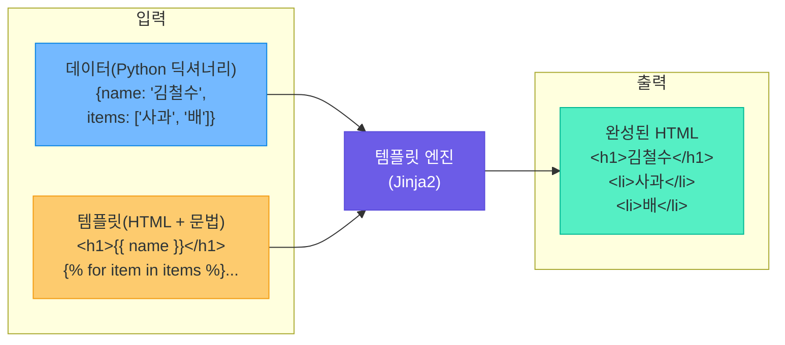
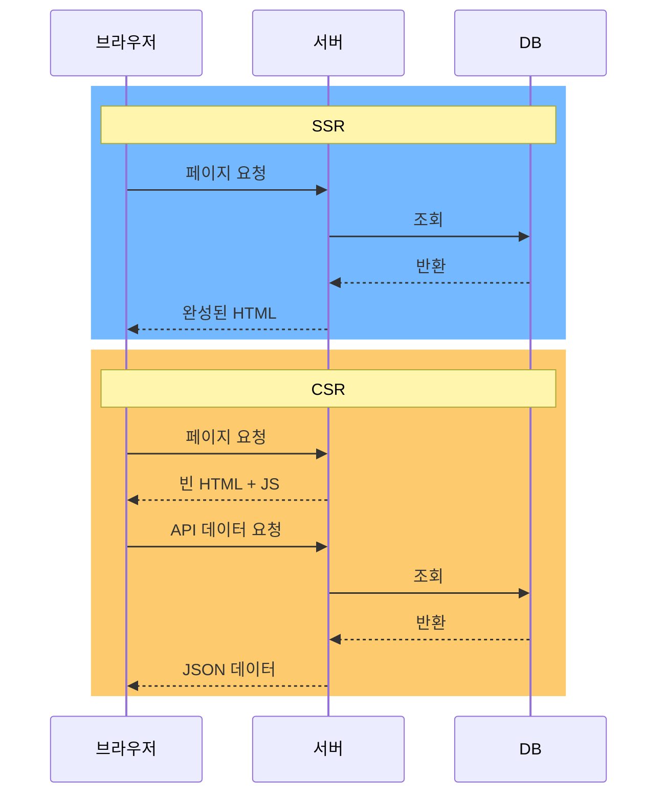
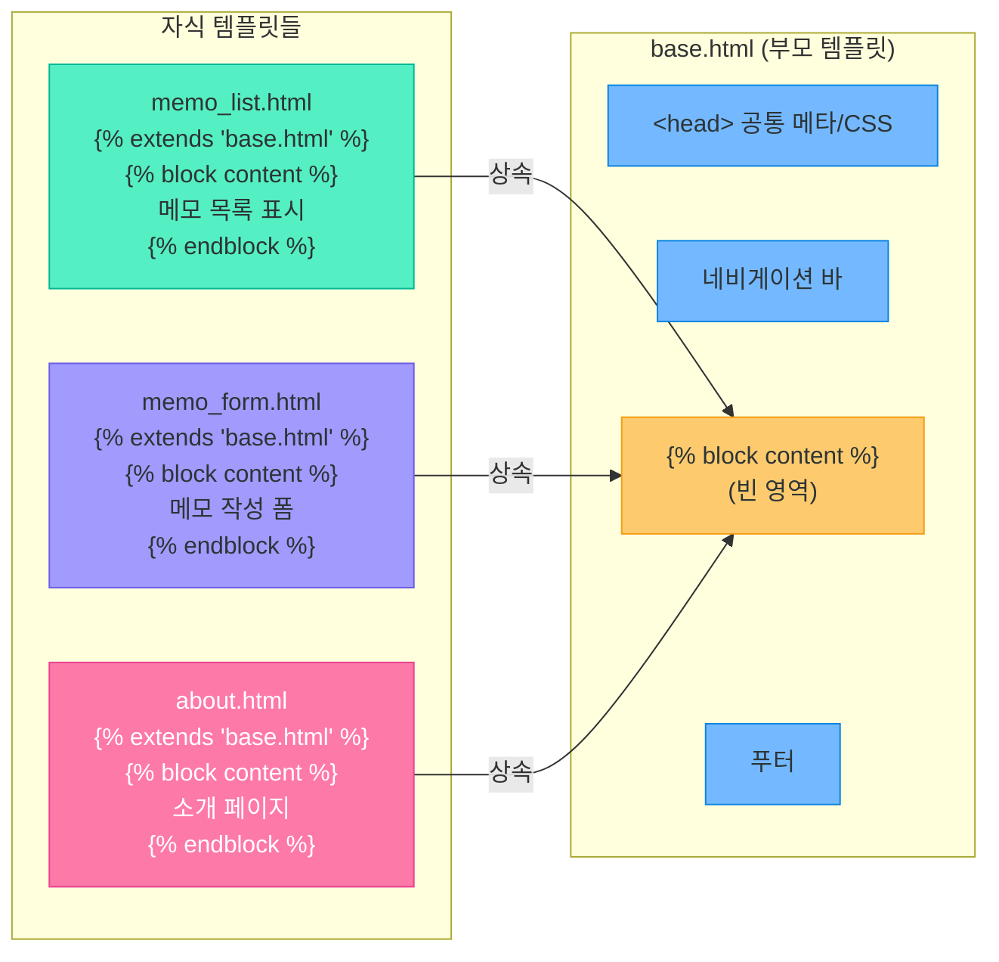
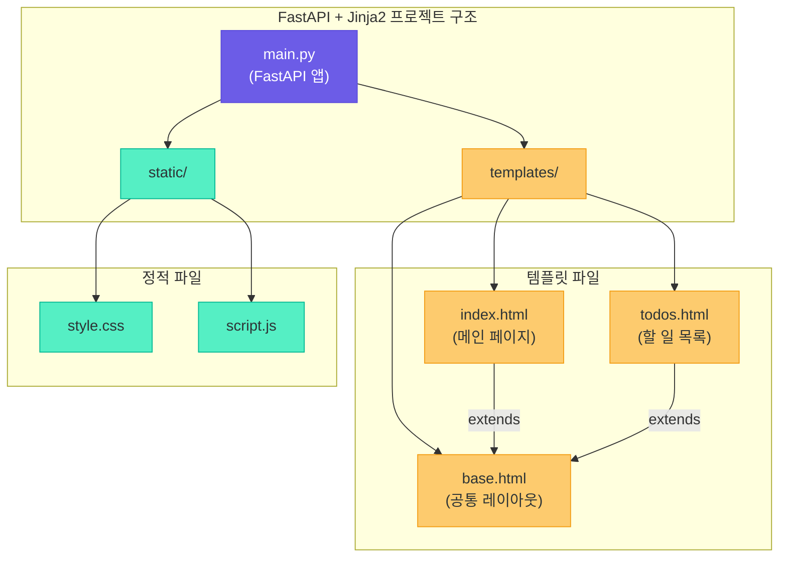
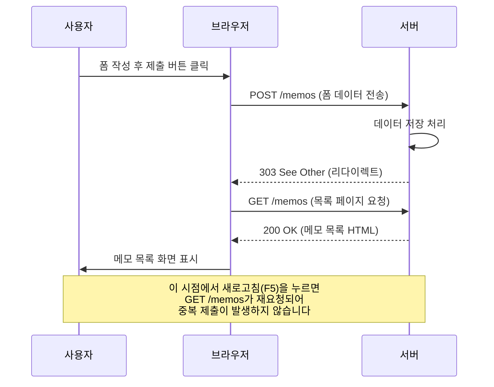
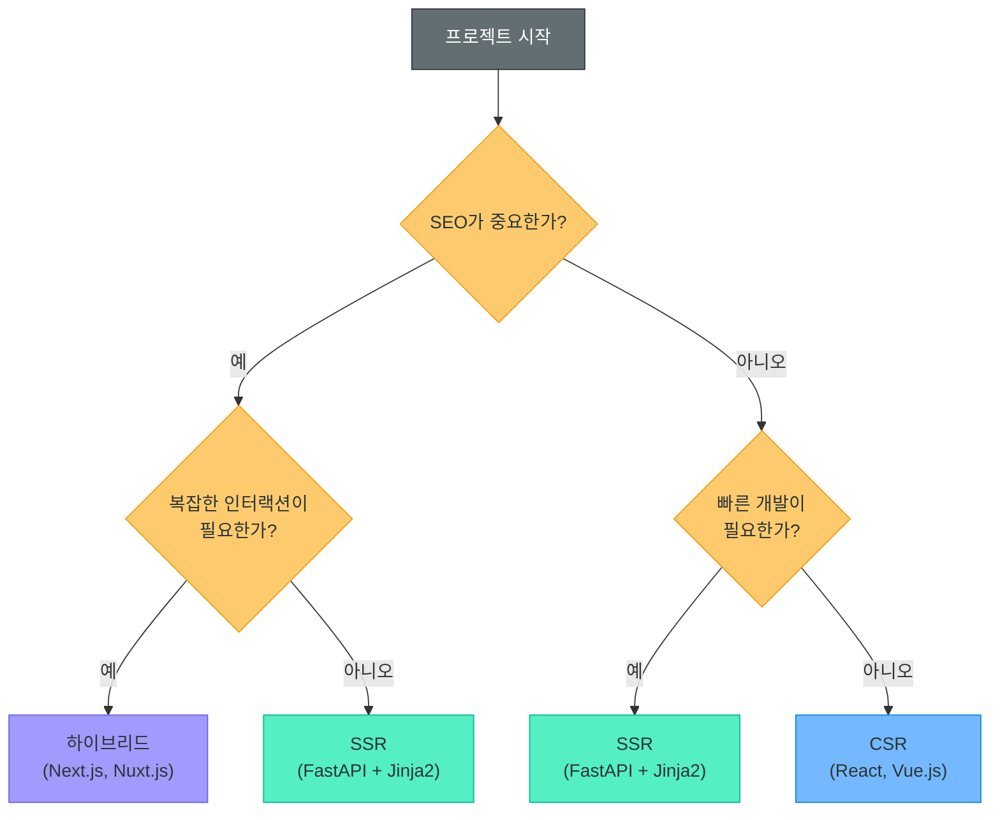

# 템플릿 엔진 (Jinja2, SSR vs CSR, FastAPI 연동)

> 같은 쇼핑몰이라도 로그인한 사용자마다 다른 추천 상품이 보이고, 장바구니에는 각자 담은 물건이 표시됩니다.
> 이렇게 **동적으로 HTML을 생성**하는 핵심 도구가 바로 **템플릿 엔진**입니다.

---

## 1. 템플릿 엔진이란?

### 동적 웹 페이지 생성의 필요성

정적 HTML 파일은 모든 사용자에게 동일한 내용을 보여줍니다. 하지만 현대 웹 서비스에서는 사용자마다 다른 화면을 제공해야 합니다.

- 로그인한 사용자의 이름 표시
- 게시판의 글 목록을 데이터베이스에서 가져와 표시
- 검색 결과를 동적으로 렌더링
- 장바구니, 주문 내역 등 개인화된 콘텐츠 제공

이러한 동적 페이지를 만들기 위해 **데이터**와 **HTML 구조**를 분리하고, 실행 시점에 합쳐주는 도구가 필요합니다. 그것이 바로 **템플릿 엔진**입니다.

### 템플릿 엔진의 역할

템플릿 엔진은 **요리 레시피**와 비슷합니다.

> **레시피(템플릿)** + **재료(데이터)** = **완성된 요리(HTML 페이지)**
>
> 같은 레시피라도 재료를 바꾸면 다른 요리가 나오듯,
> 같은 템플릿이라도 데이터를 바꾸면 다른 HTML이 생성됩니다.



### Python 템플릿 엔진 종류

| 템플릿 엔진 | 특징 | 사용처 |
|------------|------|--------|
| **Jinja2** | 가장 많이 사용, Flask/FastAPI 기본 지원 | 범용 웹 개발 |
| **Mako** | 빠른 속도, Python 코드 직접 삽입 가능 | Pyramid, Reddit |
| **Chameleon** | XML 기반, TAL 표현식 사용 | Pyramid |
| **Django Template** | Django 내장, 보안 중심 설계 | Django 프로젝트 |

> **핵심 포인트:** 이 강의에서는 Python 생태계에서 가장 널리 사용되고, FastAPI와 자연스럽게 연동되는 **Jinja2**를 중심으로 학습합니다.

---

## 2. SSR vs CSR

웹 페이지를 만드는 방식에는 크게 두 가지 접근법이 있습니다. **어디서 HTML을 완성하느냐**에 따라 나뉩니다.

### Server-Side Rendering (SSR)

SSR은 **서버에서 완성된 HTML을 만들어** 브라우저로 보내는 방식입니다.

- 서버가 데이터를 조회하고, 템플릿 엔진으로 HTML을 생성
- 브라우저는 완성된 HTML을 받아 바로 화면에 표시
- 전통적인 웹 개발 방식 (PHP, JSP, Django, Flask + Jinja2)

### Client-Side Rendering (CSR)

CSR은 **브라우저(클라이언트)에서 JavaScript로 HTML을 생성**하는 방식입니다.

- 서버는 비어 있는 HTML 껍데기와 JavaScript 파일만 전달
- 브라우저가 JavaScript를 실행하여 API로 데이터를 가져오고 화면을 구성
- 현대적 SPA(Single Page Application) 방식 (React, Vue, Angular)

### SSR vs CSR 요청 흐름 비교



### 장단점 비교

| 구분 | SSR (서버 사이드 렌더링) | CSR (클라이언트 사이드 렌더링) |
|------|------------------------|------------------------------|
| **초기 로딩 속도** | 빠름 (완성된 HTML 바로 표시) | 느림 (JS 다운로드 + 실행 후 표시) |
| **SEO (검색 엔진 최적화)** | 유리 (크롤러가 HTML 읽기 쉬움) | 불리 (빈 HTML, JS 실행 필요) |
| **서버 부하** | 높음 (매 요청마다 HTML 생성) | 낮음 (정적 파일만 전달) |
| **사용자 경험** | 페이지 전환 시 깜빡임 | 부드러운 화면 전환 |
| **개발 복잡도** | 낮음 (전통적 방식) | 높음 (프론트/백 분리) |
| **오프라인 지원** | 어려움 | PWA로 가능 |
| **대표 기술** | Jinja2, Django Template, PHP | React, Vue.js, Angular |

### 언제 SSR을, 언제 CSR을 사용하는가

**SSR이 적합한 경우:**
- 블로그, 뉴스 사이트 등 **SEO가 중요한** 콘텐츠 중심 서비스
- 빠른 첫 화면 로딩이 필요한 경우
- 간단한 관리자 페이지, 대시보드
- AI 서비스의 결과 표시 페이지

**CSR이 적합한 경우:**
- Gmail, Google Docs 같은 **복잡한 인터랙션**이 필요한 앱
- 실시간 데이터 업데이트가 빈번한 서비스
- 모바일 앱과 웹이 같은 API를 공유하는 경우

### 하이브리드 접근 (SSR + API)

실무에서는 SSR과 CSR을 함께 사용하는 하이브리드 방식도 많이 활용됩니다.

- 첫 페이지는 SSR로 빠르게 로딩 (SEO 확보)
- 이후 사용자 인터랙션은 JavaScript + API로 처리
- Next.js(React), Nuxt.js(Vue)가 이 방식을 기본 지원

> **핵심 포인트:** 생성형 AI 서비스 개발에서는 **SSR(FastAPI + Jinja2)로 기본 페이지**를 만들고, **API 엔드포인트**로 AI 모델과 통신하는 하이브리드 방식이 실용적입니다.

---

## 3. Jinja2 기초 문법

Jinja2는 Python에서 가장 많이 사용되는 템플릿 엔진으로, 직관적인 문법과 강력한 기능을 제공합니다.

### 기본 구분자

| 구분자 | 용도 | 예시 |
|--------|------|------|
| `{{ }}` | 변수 출력 (표현식) | `{{ user.name }}` |
| `` | 제어문 (조건, 반복) | `` |
| `{# #}` | 주석 (출력되지 않음) | `{# 이 부분은 무시됨 #}` |

### 변수 출력

```html
{# 단순 변수 출력 #}
<h1>안녕하세요, {{ username }}님!</h1>
<p>가입일: {{ join_date }}</p>

{# 딕셔너리 접근 #}
<p>이름: {{ user.name }}</p>
<p>이메일: {{ user['email'] }}</p>

{# 기본값 설정 (변수가 없을 때) #}
<p>{{ nickname | default('익명 사용자') }}</p>
```

### 조건문

```html

    <span class="badge">관리자</span>

    <span class="badge">스태프</span>

    <span class="badge">일반 회원</span>


{# 로그인 상태에 따른 메뉴 표시 #}
<nav>
    
        <a href="/logout">로그아웃</a>
    
        <a href="/login">로그인</a>
    
</nav>
```

### 반복문

```html
{# 리스트 반복 #}
<ul>

    <li>{{ loop.index }}. {{ item.name }} - {{ item.price }}원</li>

</ul>

{# 빈 리스트 처리 (else 블록) #}

    <p>{{ memo.content }}</p>

    <p>작성된 메모가 없습니다.</p>

```

> `loop.index`는 1부터 시작하는 반복 번호, `loop.index0`은 0부터 시작합니다.

### 필터

필터는 변수의 출력값을 변환하는 기능으로, 파이프(`|`) 기호로 연결합니다.

```html
<p>{{ name | upper }}</p>              {# 대문자 변환: "HELLO" #}
<p>{{ name | lower }}</p>              {# 소문자 변환: "hello" #}
<p>{{ text | truncate(50) }}</p>       {# 50자로 자르기 #}
<p>총 {{ items | length }}개</p>       {# 리스트 길이 #}
<p>{{ tags | join(', ') }}</p>          {# 리스트를 문자열로 결합 #}
<p>{{ user_input | e }}</p>            {# HTML 이스케이프 (보안) #}
```

### 주석

```html
{# 이것은 Jinja2 주석입니다 - HTML 출력에 포함되지 않습니다 #}

{#
    여러 줄 주석도 가능합니다.
    개발 중 임시로 코드를 비활성화할 때 유용합니다.
#}

<!-- 이것은 HTML 주석 - 브라우저에 전달됩니다 (소스 보기에서 보임) -->
```

> **핵심 포인트:** Jinja2 주석(`{# #}`)은 렌더링 시 완전히 제거되므로 보안에 유리합니다. HTML 주석(`<!-- -->`)은 클라이언트에 노출되므로 민감한 정보를 넣지 마세요.

---

## 4. Jinja2 고급 기능

### 템플릿 상속 (Template Inheritance)

템플릿 상속은 Jinja2의 **가장 강력한 기능**입니다. 웹사이트의 공통 레이아웃(헤더, 푸터, 네비게이션)을 한 곳에서 관리할 수 있습니다.

집을 짓는 것에 비유하면 이렇습니다:

> **기본 설계도(base.html)**: 벽, 지붕, 문 위치가 정해져 있음
> **방 꾸미기(child.html)**: 각 방의 내부 인테리어만 바꿈
>
> 벽과 지붕을 매번 다시 짓지 않아도 됩니다!

#### base.html (부모 템플릿)

```html
<!DOCTYPE html>
<html lang="ko">
<head>
    <meta charset="UTF-8">
    <title>내 사이트</title>
    <link rel="stylesheet" href="/static/style.css">
    
</head>
<body>
    <nav>
        <a href="/">홈</a>
        <a href="/memos">메모</a>
        <a href="/about">소개</a>
    </nav>

    <main>
        
        {# 자식 템플릿이 이 영역을 채웁니다 #}
        
    </main>

    <footer>
        <p>&copy; 2026 내 사이트. All rights reserved.</p>
    </footer>

    
</body>
</html>
```

#### memo_list.html (자식 템플릿)

```html


메모 목록 - 내 사이트


<h1>메모 목록</h1>
<ul>

    <li>{{ memo.title }} - {{ memo.created_at }}</li>

    <li>등록된 메모가 없습니다.</li>

</ul>
<a href="/memos/new">새 메모 작성</a>

```

### 매크로 (Macro)

매크로는 **재사용 가능한 템플릿 함수**입니다. Python의 함수와 비슷한 개념입니다.

```html
{# macros.html - 매크로 정의 (재사용 가능한 HTML 컴포넌트) #}

<div class="form-group">
    <label for="{{ name }}">{{ label }}</label>
    <input type="{{ type }}" id="{{ name }}" name="{{ name }}" value="{{ value }}">
</div>


{# 다른 템플릿에서 매크로 사용 #}


<form method="post">
    {{ input_field("title", "제목") }}
    {{ input_field("email", "이메일", type="email") }}
    <button type="submit">저장</button>
</form>
```

### 포함 (Include)

``는 다른 템플릿 파일의 내용을 그대로 삽입합니다.

```html
{# base.html 안에서 공통 컴포넌트 포함 #}
<body>
    

    <main>
        
    </main>

    
</body>
```

### 레이아웃 패턴 구조



> **핵심 포인트:** 템플릿 상속을 사용하면 공통 레이아웃을 **한 번만** 작성하고, 각 페이지에서는 달라지는 부분만 정의하면 됩니다. 유지보수가 훨씬 편리해집니다.

---

## 5. FastAPI에서 Jinja2 사용하기

### 패키지 설치

```bash
# Jinja2와 정적 파일 지원을 위한 패키지 설치
pip install fastapi uvicorn jinja2 python-multipart
```

### 프로젝트 디렉토리 구조

```
my_web_app/
├── main.py              # FastAPI 애플리케이션
├── templates/           # Jinja2 템플릿 파일
│   ├── base.html        # 기본 레이아웃
│   ├── index.html       # 메인 페이지
│   └── todos.html       # 할 일 목록 페이지
└── static/              # 정적 파일 (CSS, JS, 이미지)
    ├── style.css
    └── script.js
```



### Jinja2Templates 설정 및 TemplateResponse 반환

```python
from fastapi import FastAPI, Request
from fastapi.templating import Jinja2Templates
from fastapi.staticfiles import StaticFiles

app = FastAPI()

# 정적 파일 서빙 설정 (/static URL로 static 디렉토리 연결)
app.mount("/static", StaticFiles(directory="static"), name="static")

# 템플릿 디렉토리 설정
templates = Jinja2Templates(directory="templates")


@app.get("/")
async def home(request: Request):
    """메인 페이지 - 템플릿에 데이터를 전달하여 HTML 생성"""
    return templates.TemplateResponse(
        request=request,          # Request 객체 필수
        name="index.html",       # 렌더링할 템플릿 파일
        context={"title": "환영합니다"}  # 템플릿에 전달할 데이터
    )
```

`TemplateResponse`의 핵심 매개변수는 세 가지입니다: `request`(필수), `name`(템플릿 파일명), `context`(전달 데이터 딕셔너리).

---

## 6. 폼(Form) 처리

웹 애플리케이션에서 사용자 입력을 받으려면 HTML 폼과 서버 사이의 데이터 흐름을 이해해야 합니다.

### python-multipart 설치

FastAPI에서 폼 데이터를 처리하려면 `python-multipart` 패키지가 필요합니다.

```bash
pip install python-multipart
```

### HTML 폼과 FastAPI 연동

HTML의 `<form>` 태그에서 `method="post"`로 전송한 데이터를 FastAPI에서 `Form()` 매개변수로 수신합니다.

```python
from fastapi import FastAPI, Request, Form
from fastapi.responses import RedirectResponse

@app.post("/memos")
async def create_memo(
    title: str = Form(...),      # <input name="title">의 값
    content: str = Form(...)     # <textarea name="content">의 값
):
    """메모 저장 후 목록으로 리다이렉트 (PRG 패턴)"""
    # 데이터 저장 로직
    print(f"새 메모: {title} - {content}")
    return RedirectResponse(url="/memos", status_code=303)
```

HTML 폼의 `name` 속성과 FastAPI의 `Form()` 매개변수 이름이 **정확히 일치**해야 합니다.

### PRG 패턴 (Post/Redirect/Get)

폼을 제출한 뒤 브라우저에서 새로고침(F5)을 누르면 폼이 **중복 제출**되는 문제가 발생합니다. 이를 방지하기 위해 **PRG 패턴**을 사용합니다.



> **핵심 포인트:** PRG 패턴에서 리다이렉트 시 `status_code=303`을 사용합니다. 303은 "POST 이후 GET으로 리다이렉트하라"는 의미로, 브라우저가 자동으로 GET 요청으로 전환합니다.

---

## 7. 실전 예제: 간단한 메모 앱

FastAPI + Jinja2를 활용하여 **메모 CRUD(생성, 조회, 수정, 삭제)** 기능을 가진 웹 앱을 만들어봅니다.

### 전체 프로젝트 구조

```
memo_app/
├── main.py
├── templates/
│   ├── base.html
│   ├── memo_list.html
│   ├── memo_form.html
│   └── memo_edit.html
└── static/
    └── style.css
```

### main.py (전체 코드)

```python
from fastapi import FastAPI, Request, Form
from fastapi.templating import Jinja2Templates
from fastapi.staticfiles import StaticFiles
from fastapi.responses import RedirectResponse
from datetime import datetime

app = FastAPI()
app.mount("/static", StaticFiles(directory="static"), name="static")
templates = Jinja2Templates(directory="templates")

# 간단한 인메모리 저장소 (실무에서는 데이터베이스 사용)
memos: list[dict] = []
next_id: int = 1


@app.get("/")
async def home():
    """메인 페이지 → 메모 목록으로 리다이렉트"""
    return RedirectResponse(url="/memos")


@app.get("/memos")
async def memo_list(request: Request):
    """메모 목록 조회 (Read)"""
    return templates.TemplateResponse(
        request=request,
        name="memo_list.html",
        context={"memos": memos}
    )


@app.get("/memos/new")
async def memo_new(request: Request):
    """메모 작성 폼 표시"""
    return templates.TemplateResponse(
        request=request,
        name="memo_form.html"
    )


@app.post("/memos")
async def memo_create(
    title: str = Form(...),
    content: str = Form(...)
):
    """메모 생성 (Create)"""
    global next_id
    memo = {
        "id": next_id,
        "title": title,
        "content": content,
        "created_at": datetime.now().strftime("%Y-%m-%d %H:%M")
    }
    memos.append(memo)
    next_id += 1
    return RedirectResponse(url="/memos", status_code=303)


@app.get("/memos/{memo_id}/edit")
async def memo_edit_form(memo_id: int, request: Request):
    """메모 수정 폼 표시"""
    memo = next((m for m in memos if m["id"] == memo_id), None)
    if not memo:
        return RedirectResponse(url="/memos")
    return templates.TemplateResponse(
        request=request,
        name="memo_edit.html",
        context={"memo": memo}
    )


@app.post("/memos/{memo_id}/edit")
async def memo_update(
    memo_id: int,
    title: str = Form(...),
    content: str = Form(...)
):
    """메모 수정 (Update)"""
    for memo in memos:
        if memo["id"] == memo_id:
            memo["title"] = title
            memo["content"] = content
            break
    return RedirectResponse(url="/memos", status_code=303)


@app.post("/memos/{memo_id}/delete")
async def memo_delete(memo_id: int):
    """메모 삭제 (Delete)"""
    global memos
    memos = [m for m in memos if m["id"] != memo_id]
    return RedirectResponse(url="/memos", status_code=303)
```

### templates/base.html

```html
<!DOCTYPE html>
<html lang="ko">
<head>
    <meta charset="UTF-8">
    <meta name="viewport" content="width=device-width, initial-scale=1.0">
    <title>메모 앱</title>
    <link rel="stylesheet" href="/static/style.css">
</head>
<body>
    <nav>
        <h2><a href="/memos">메모 앱</a></h2>
        <a href="/memos/new">새 메모 작성</a>
    </nav>

    <main>
        
    </main>

    <footer>
        <p>FastAPI + Jinja2 메모 앱 예제</p>
    </footer>
</body>
</html>
```

### templates/memo_list.html

```html

메모 목록


<h1>메모 목록</h1>


<div class="memo-card">
    <h3>{{ memo.title }}</h3>
    <p>{{ memo.content | truncate(100) }}</p>
    <small>{{ memo.created_at }}</small>
    <div class="actions">
        <a href="/memos/{{ memo.id }}/edit">수정</a>
        <form method="post" action="/memos/{{ memo.id }}/delete"
              style="display:inline;">
            <button type="submit"
                    onclick="return confirm('정말 삭제하시겠습니까?')">
                삭제
            </button>
        </form>
    </div>
</div>

<p>아직 작성된 메모가 없습니다. 새 메모를 작성해보세요!</p>


```

### templates/memo_form.html & memo_edit.html

```html
{# memo_form.html - 새 메모 작성 #}

새 메모 작성


<h1>새 메모 작성</h1>
<form method="post" action="/memos">
    <div class="form-group">
        <label for="title">제목</label>
        <input type="text" id="title" name="title" required>
    </div>
    <div class="form-group">
        <label for="content">내용</label>
        <textarea id="content" name="content" rows="8" required></textarea>
    </div>
    <button type="submit">저장</button>
    <a href="/memos">취소</a>
</form>


{# memo_edit.html - 수정 폼은 동일 구조에 기존 값을 채워줌 #}
{# action="/memos/{{ memo.id }}/edit", value="{{ memo.title }}" 등 #}
```

### static/style.css

```css
/* 핵심 스타일만 발췌 */
body { font-family: 'Pretendard', sans-serif; max-width: 800px; margin: 0 auto; padding: 20px; }
nav { display: flex; justify-content: space-between; border-bottom: 2px solid #333; }
nav a { text-decoration: none; color: #0984e3; }
.memo-card { background: white; padding: 15px; margin: 10px 0; border-radius: 8px; }
.form-group { margin: 15px 0; }
.form-group label { display: block; font-weight: bold; }
.form-group input, .form-group textarea { width: 100%; padding: 8px; border: 1px solid #ddd; }
button { background: #0984e3; color: white; padding: 10px 20px; border: none; border-radius: 4px; }
```

### 실행 방법

```bash
# 메모 앱 실행
cd memo_app
uvicorn main:app --reload

# 브라우저에서 http://localhost:8000 접속
```

> **핵심 포인트:** 이 예제는 데이터를 메모리(리스트)에 저장하므로 서버를 재시작하면 데이터가 사라집니다. 실무에서는 데이터베이스(SQLite, PostgreSQL 등)를 연동하여 영구 저장합니다.

---

## 8. 핵심 정리

### Jinja2 문법 요약

| 문법 | 용도 | 예시 |
|------|------|------|
| `{{ 변수 }}` | 변수 출력 | `{{ user.name }}` |
| `` | 조건 분기 | `...` |
| `` | 반복 처리 | `...` |
| `{{ 변수\|필터 }}` | 값 변환 | `{{ name\|upper }}` |
| `{# 주석 #}` | 주석 | `{# 렌더링 시 제거됨 #}` |
| `` | 템플릿 상속 | `` |
| `` | 블록 정의/재정의 | `...` |
| `` | 템플릿 포함 | `` |
| `` | 매크로 정의 | `...` |

### SSR vs CSR 선택 가이드



### FastAPI + Jinja2 핵심 구성 요약

| 구성 요소 | 역할 | 코드 |
|-----------|------|------|
| `Jinja2Templates` | 템플릿 디렉토리 설정 | `templates = Jinja2Templates(directory="templates")` |
| `TemplateResponse` | 렌더링된 HTML 반환 | `templates.TemplateResponse(request, name, context)` |
| `StaticFiles` | 정적 파일 서빙 | `app.mount("/static", StaticFiles(directory="static"))` |
| `Form(...)` | 폼 데이터 수신 | `title: str = Form(...)` |
| `RedirectResponse` | PRG 패턴 리다이렉트 | `RedirectResponse(url="/memos", status_code=303)` |

### 이번 강의에서 배운 것

1. **템플릿 엔진**은 데이터와 HTML 구조를 분리하여 동적 페이지를 생성합니다
2. **SSR**은 서버에서 HTML을 완성하고, **CSR**은 브라우저에서 JavaScript로 화면을 구성합니다
3. **Jinja2**의 변수 출력, 조건문, 반복문, 필터, 템플릿 상속으로 효율적인 HTML을 작성할 수 있습니다
4. **FastAPI + Jinja2**를 연동하면 빠르게 SSR 웹 애플리케이션을 개발할 수 있습니다
5. **PRG 패턴**으로 폼 중복 제출 문제를 방지합니다

### 다음 강의 미리보기

다음 강의에서는 **REST API 설계 원칙**을 학습합니다. 오늘 배운 SSR 방식의 웹 앱에서 한 걸음 더 나아가, 프론트엔드와 백엔드를 완전히 분리하는 API 중심 아키텍처를 설계하는 방법을 알아봅니다. RESTful한 URL 설계, HTTP 메서드 활용, 상태 코드 체계 등 API 개발의 기초를 다루게 됩니다.

---

[이전 강의: 07_fastapi_basics.md](07_fastapi_basics.md) | [다음 강의: 09_rest_api_design.md](09_rest_api_design.md)
