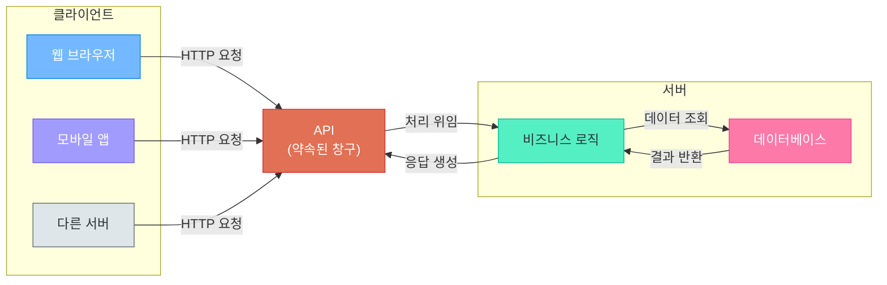
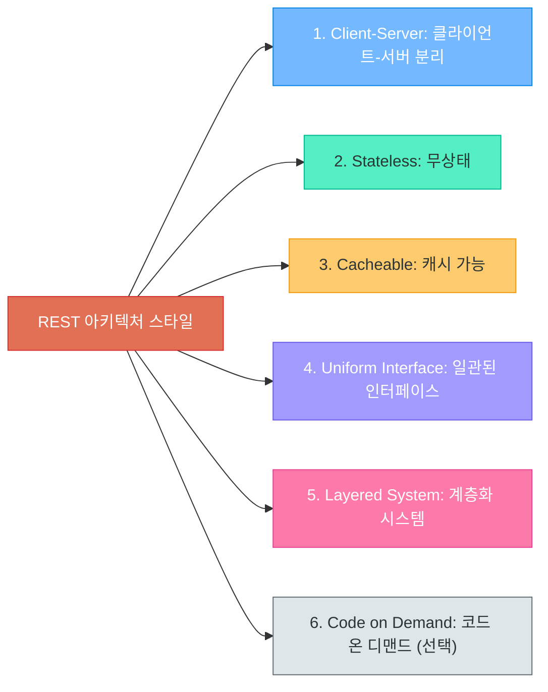
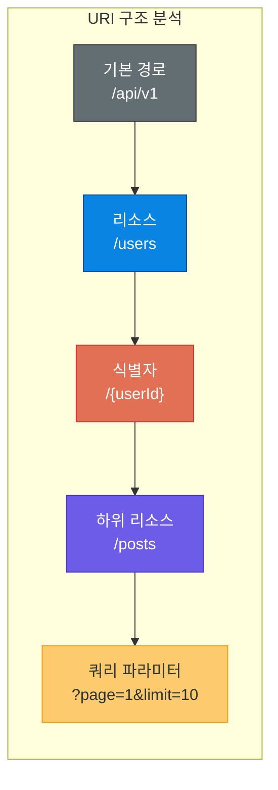
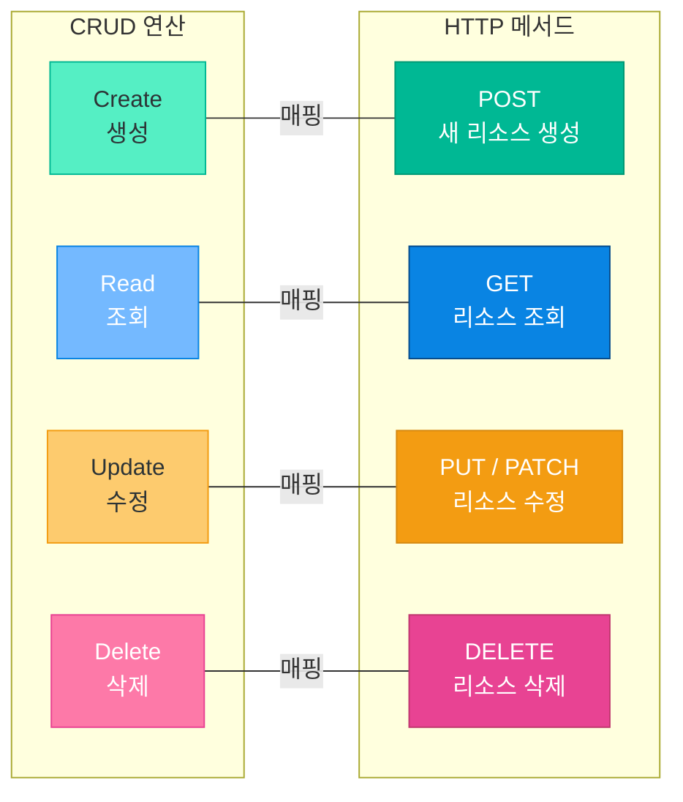
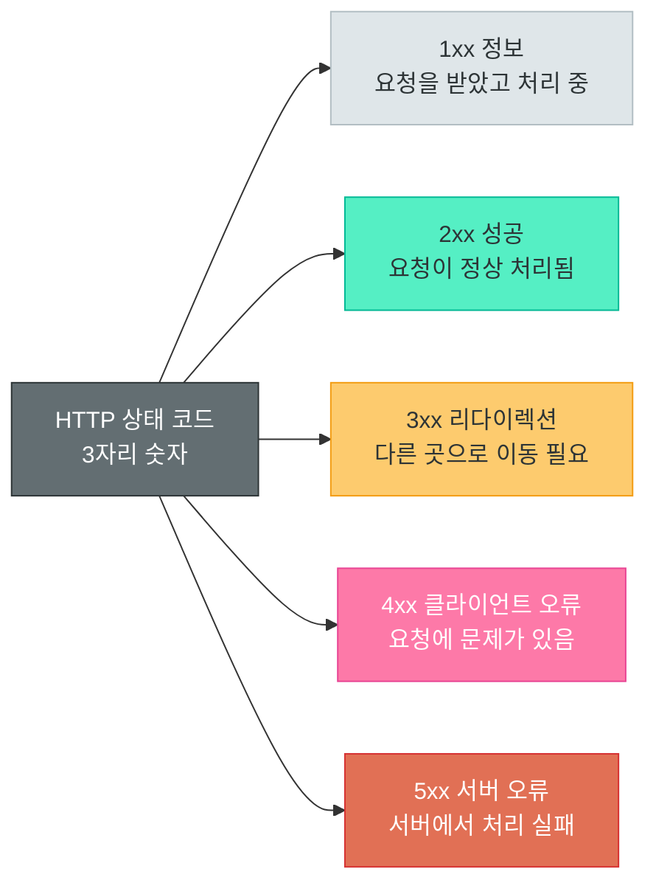
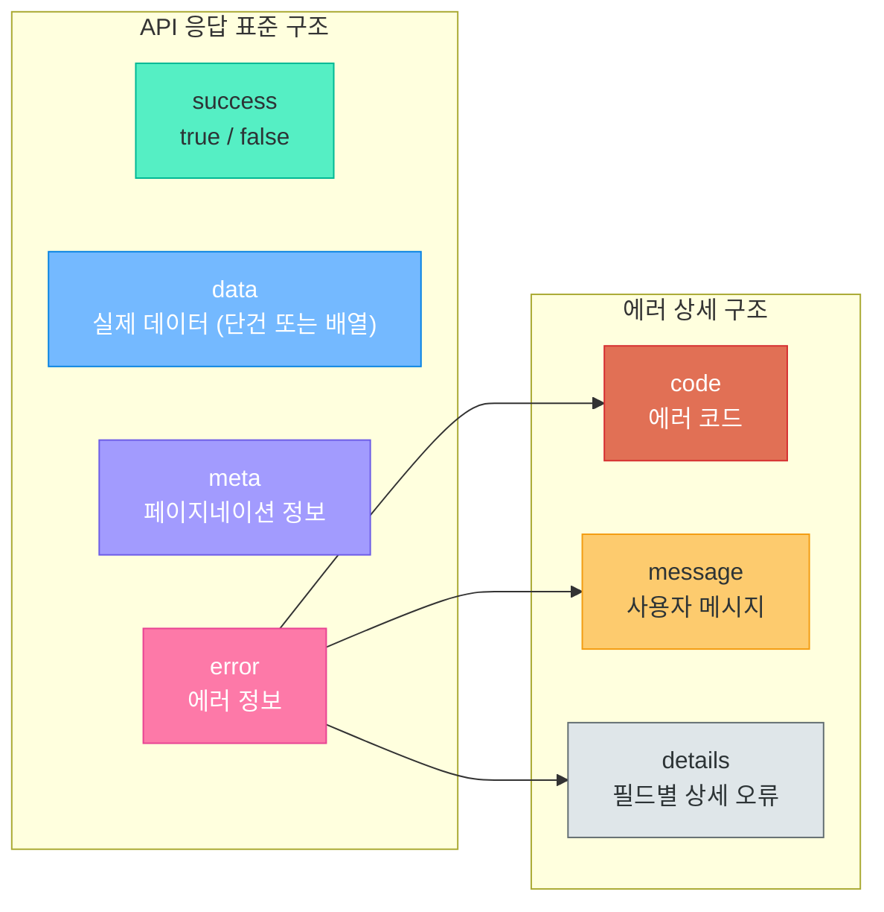
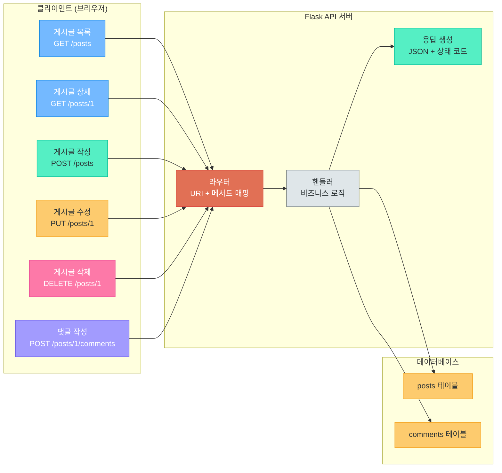

# REST API 설계 철학과 실전 원칙

> 좋은 API는 좋은 도시의 도로망과 같다 — 직관적이고, 일관되며, 누구나 길을 잃지 않는다

---

## 1. API란 무엇인가

### API의 정의

**API(Application Programming Interface)**는 소프트웨어와 소프트웨어가 서로 소통하기 위해 정해놓은 **약속된 창구**입니다. 프로그램이 다른 프로그램의 기능을 사용하고 싶을 때, 직접 내부를 들여다보는 것이 아니라 **API라는 공식 통로**를 통해 요청하고 응답을 받습니다.

### 레스토랑 비유: 웨이터 = API

API를 가장 쉽게 이해하는 방법은 레스토랑 비유입니다.

```
레스토랑에서의 API
━━━━━━━━━━━━━━━━━━━━━━━━━━━━━━━━━━━━━━━━━━━━━━
손님 (클라이언트)     → 음식을 주문하는 사람
메뉴판 (API 문서)     → 어떤 요청이 가능한지 정의
웨이터 (API)          → 주문을 받아 주방에 전달하고 음식을 가져옴
주방 (서버/DB)        → 실제로 음식을 만드는 곳
━━━━━━━━━━━━━━━━━━━━━━━━━━━━━━━━━━━━━━━━━━━━━━

손님은 주방에 직접 들어가지 않습니다.
웨이터(API)를 통해 주문(요청)하고, 음식(응답)을 받을 뿐입니다.
```

손님이 주방의 가스레인지를 직접 조작하지 않듯, 클라이언트는 서버의 내부 구현을 알 필요가 없습니다. API가 그 사이를 중재해줍니다.

### API 통신 구조



### Web API의 종류

인터넷을 통해 호출하는 API를 **Web API**라고 합니다. 대표적인 방식은 다음과 같습니다.

| 방식 | 특징 | 데이터 형식 | 사용 사례 |
|------|------|------------|----------|
| **REST** | URL + HTTP 메서드 기반, 단순하고 직관적 | JSON | 대부분의 웹/모바일 서비스 |
| **GraphQL** | 클라이언트가 필요한 데이터만 질의 | JSON | GitHub, Shopify |
| **gRPC** | 바이너리 프로토콜, 고성능 | Protocol Buffers | 마이크로서비스 간 통신 |
| **SOAP** | XML 기반, 엄격한 표준 | XML | 레거시 엔터프라이즈, 금융 |

### 왜 REST가 표준이 되었는가

REST가 사실상(de facto) 표준으로 자리 잡은 이유는 명확합니다.

1. **단순함**: HTTP를 그대로 활용하므로 별도 도구가 필요 없음
2. **보편성**: 모든 프로그래밍 언어에서 HTTP 호출이 가능
3. **직관성**: URL을 보면 어떤 자원인지 바로 파악 가능
4. **유연성**: JSON, XML 등 다양한 형식 지원
5. **캐싱 용이**: HTTP의 캐싱 메커니즘을 자연스럽게 활용

> **핵심 포인트:** REST는 "가장 뛰어난 기술"이 아니라 "가장 실용적인 선택"이기 때문에 표준이 되었습니다. 마치 영어가 세계 공용어가 된 것처럼, 완벽해서가 아니라 가장 많은 사람이 쓰기 때문입니다.

---

## 2. REST의 탄생과 철학

### Roy Fielding의 박사 논문 (2000년)

REST는 2000년, **Roy Fielding**이 UC Irvine 박사 논문 *"Architectural Styles and the Design of Network-based Software Architectures"*에서 처음 정의했습니다. Fielding은 HTTP/1.0과 HTTP/1.1 규격을 설계한 핵심 인물이기도 합니다.

그는 "웹이 왜 이렇게 성공적인가?"라는 질문에서 출발하여, 웹의 아키텍처적 특성을 분석하고 이를 **REST**라는 아키텍처 스타일로 정리했습니다.

### REST = Representational State Transfer

REST의 풀네임을 분해하면 그 철학이 드러납니다.

```
Representational  → 자원의 "표현"을 전달한다
State             → 현재 "상태"를
Transfer          → 클라이언트와 서버 사이에 "전송"한다

즉, "자원의 현재 상태를 표현한 것을 주고받는 아키텍처"
```

### 아키텍처 스타일 vs 프로토콜

REST는 **프로토콜이 아니라 아키텍처 스타일**입니다. 이 구분이 매우 중요합니다.

| 구분 | 프로토콜 | 아키텍처 스타일 |
|------|---------|---------------|
| **정의** | 엄격한 통신 규약 | 설계 원칙과 제약 조건의 집합 |
| **강제성** | 반드시 지켜야 함 | 권장 사항 (위반해도 동작함) |
| **예시** | HTTP, TCP, FTP | REST, 마이크로서비스 |
| **비유** | 교통법규 (위반 시 처벌) | 도시 설계 가이드라인 (참고 사항) |

### REST의 6가지 제약 조건

Roy Fielding은 REST 아키텍처가 갖춰야 할 6가지 제약 조건을 정의했습니다.



| 제약 조건 | 설명 | 비유 |
|----------|------|------|
| **Client-Server** | 클라이언트와 서버의 역할을 명확히 분리 | 손님과 주방은 독립적으로 운영 |
| **Stateless** | 각 요청은 독립적, 서버는 이전 요청을 기억하지 않음 | 매번 주문서를 새로 작성 |
| **Cacheable** | 응답에 캐시 가능 여부를 명시 | 자주 주문하는 메뉴는 미리 준비 |
| **Uniform Interface** | URI, HTTP 메서드 등 일관된 방식으로 통신 | 모든 지점에서 동일한 메뉴판 사용 |
| **Layered System** | 중간에 프록시, 로드밸런서 등을 끼워넣을 수 있음 | 본사 - 물류센터 - 매장 계층 구조 |
| **Code on Demand** | 서버가 클라이언트에 실행 가능한 코드를 전송 (선택사항) | 매장에서 조리법을 알려줌 |

> **핵심 포인트:** 이 6가지 제약 조건을 모두 만족하는 API를 **RESTful API**라고 부릅니다. 실무에서는 Stateless와 Uniform Interface가 가장 중요하게 다뤄집니다.

---

## 3. 리소스(Resource)와 표현(Representation)

### 리소스 중심 사고

REST의 핵심은 **"모든 것을 리소스(자원)로 바라보는 것"**입니다.

```
리소스란?
━━━━━━━━━━━━━━━━━━━━━━━━━━━━━━━━━━━━━━━
- 사용자 정보     → /users
- 게시글          → /posts
- 댓글            → /comments
- 상품            → /products
- 주문            → /orders
━━━━━━━━━━━━━━━━━━━━━━━━━━━━━━━━━━━━━━━
리소스 = 이름을 붙일 수 있는 모든 정보
```

전통적인 웹에서는 "어떤 동작을 할 것인가" 중심으로 설계했지만, REST에서는 **"어떤 자원을 다룰 것인가"** 중심으로 설계합니다.

### URI = 리소스의 고유 식별자

**URI(Uniform Resource Identifier)**는 각 리소스를 유일하게 식별하는 주소입니다.

```
/users              → 모든 사용자 (컬렉션)
/users/42           → 42번 사용자 (개별 리소스)
/users/42/posts     → 42번 사용자의 게시글들
/users/42/posts/7   → 42번 사용자의 7번 게시글
```

### 표현(Representation) = JSON, XML 등

리소스 자체는 추상적인 개념이고, 클라이언트가 실제로 받는 것은 리소스의 **표현(Representation)**입니다. 가장 널리 쓰이는 표현 형식은 **JSON**입니다.

```json
// "42번 사용자"라는 리소스의 JSON 표현
{
  "id": 42,
  "name": "홍길동",
  "email": "hong@example.com",
  "created_at": "2026-04-01T09:00:00Z"
}
```

같은 리소스도 클라이언트의 요청에 따라 JSON, XML, HTML 등 다른 형식으로 표현될 수 있습니다. 이것이 **Content Negotiation**입니다.

### 리소스 vs 행위 분리 원칙

REST에서 가장 핵심적인 설계 원칙은 **"리소스(명사)"와 "행위(동사)"를 분리**하는 것입니다.

| 구분 | 담당 | 예시 |
|------|------|------|
| **리소스 (명사)** | URI가 표현 | `/users`, `/posts/1` |
| **행위 (동사)** | HTTP 메서드가 표현 | `GET`, `POST`, `PUT`, `DELETE` |

```
잘못된 설계 (행위가 URI에 포함)       올바른 설계 (리소스와 행위 분리)
━━━━━━━━━━━━━━━━━━━━━━━━━━━       ━━━━━━━━━━━━━━━━━━━━━━━━━━━
GET /getUser?id=1                  GET    /users/1
POST /createUser                   POST   /users
POST /deleteUser?id=1              DELETE /users/1
```

---

## 4. URI 설계 원칙

이 섹션은 REST API 설계에서 가장 실무적으로 중요한 내용입니다. 좋은 URI 설계는 API의 사용성을 극적으로 높여줍니다.

### 좋은 URI vs 나쁜 URI

좋은 URI는 **문서 없이도 의미를 파악**할 수 있습니다.

```
좋은 URI = 잘 정비된 도로 표지판
━━━━━━━━━━━━━━━━━━━━━━━━━━━━━━━
GET /users/42/posts     → "42번 사용자의 게시글 목록" (바로 이해 가능)

나쁜 URI = 알 수 없는 암호
━━━━━━━━━━━━━━━━━━━━━━━━━━━━━━━
GET /api?action=getUserPosts&uid=42  (해석이 필요...)
```

### URI 설계 규칙

#### 규칙 1: 명사를 사용하고 복수형으로 작성

```
✅ /users, /products, /categories     → 복수형 명사
❌ /getUser, /user, /getUserList      → 동사 사용, 단수형
```

#### 규칙 2: 계층 구조로 관계를 표현

```
/users/{userId}/posts                → 특정 사용자의 게시글들
/users/{userId}/posts/{postId}       → 특정 사용자의 특정 게시글
/posts/{postId}/comments             → 특정 게시글의 댓글들
/posts/{postId}/comments/{commentId} → 특정 댓글
```

#### 규칙 3: 소문자 사용, 단어 구분은 하이픈(-)

```
✅ /user-profiles         → 소문자, 하이픈 구분
❌ /UserProfiles           → 카멜케이스
❌ /user_profiles          → 언더스코어 (URI에 부적합)
```

#### 규칙 4: 파일 확장자를 포함하지 않음

```
✅ /users/1               → 확장자 없음 (Accept 헤더로 형식 결정)
❌ /users/1.json           → 확장자 포함
```

#### 규칙 5: 동사 사용 금지 (HTTP 메서드가 동사 역할)

```
✅ POST   /users           → POST가 "생성"이라는 동사
✅ DELETE /users/1         → DELETE가 "삭제"라는 동사
❌ POST /createUser         → URI에 동사 포함
❌ GET  /deleteUser/1       → GET으로 삭제 시도
```

#### 규칙 6: 필터링, 정렬, 페이지네이션은 쿼리 파라미터

```
✅ /users?status=active              → 쿼리 파라미터로 필터링
✅ /users?sort=created_at&order=desc → 쿼리 파라미터로 정렬
✅ /users?page=2&limit=20            → 쿼리 파라미터로 페이지네이션
❌ /users/active                     → 필터가 경로에 포함
❌ /users/page/2                     → 페이지네이션이 경로에 포함
```

#### 규칙 7: API 버전 관리

```
✅ /api/v1/users           → URI에 버전 포함 (가장 일반적)
✅ /api/v2/users           → 새 버전
```

### URI 구조 분석



### URI 설계 비교 표

| 상황 | ✅ 올바른 URI | ❌ 잘못된 URI | 이유 |
|------|-------------|-------------|------|
| 사용자 목록 조회 | `GET /users` | `GET /getUsers` | 동사 사용 금지 |
| 사용자 생성 | `POST /users` | `POST /createUser` | HTTP 메서드가 동사 역할 |
| 사용자 수정 | `PUT /users/1` | `POST /updateUser` | PUT 메서드 사용 |
| 사용자 삭제 | `DELETE /users/1` | `GET /deleteUser/1` | GET으로 삭제하면 안 됨 |
| 게시글의 댓글 | `GET /posts/1/comments` | `GET /getCommentsByPost?id=1` | 계층 구조 활용 |
| 활성 사용자 필터 | `GET /users?status=active` | `GET /active-users` | 쿼리 파라미터 사용 |
| 검색 | `GET /users?q=홍길동` | `GET /searchUsers/홍길동` | 쿼리 파라미터 사용 |
| 사용자 프로필 | `GET /user-profiles/1` | `GET /userProfiles/1` | 소문자 + 하이픈 |
| 2페이지 조회 | `GET /users?page=2` | `GET /users/page/2` | 페이지는 경로가 아님 |

> **핵심 포인트:** URI 설계의 황금률은 **"URL만 보고도 어떤 리소스인지 알 수 있어야 한다"**입니다. 동료 개발자가 문서를 읽지 않아도 API를 사용할 수 있다면 성공적인 설계입니다.

---

## 5. HTTP 메서드와 CRUD 매핑

### 5가지 핵심 HTTP 메서드

HTTP 메서드는 리소스에 대해 **어떤 행위를 할 것인지** 나타냅니다.



### 메서드별 상세 규칙

| 메서드 | 용도 | 요청 본문 | 응답 본문 | 멱등성 | 안전성 |
|--------|------|----------|----------|--------|--------|
| **GET** | 리소스 조회 | 없음 | 있음 | O | O |
| **POST** | 리소스 생성 | 있음 | 있음 | X | X |
| **PUT** | 리소스 전체 교체 | 있음 | 있음 | O | X |
| **PATCH** | 리소스 부분 수정 | 있음 | 있음 | X | X |
| **DELETE** | 리소스 삭제 | 없음 | 선택 | O | X |

### 멱등성(Idempotency) 개념

**멱등성**이란 같은 요청을 **여러 번 반복해도 결과가 동일**한 성질입니다.

```
멱등성 비유
━━━━━━━━━━━━━━━━━━━━━━━━━━━━━━━━━━━━━━━
엘리베이터 버튼: 5층 버튼을 1번 누르든 10번 누르든 5층에 도착
   → PUT /users/1  {"name": "홍길동"}  (멱등 O)

자판기 버튼: 누를 때마다 음료수가 1개씩 나옴
   → POST /orders  {"item": "커피"}   (멱등 X)
━━━━━━━━━━━━━━━━━━━━━━━━━━━━━━━━━━━━━━━
```

### 안전한 메서드 vs 안전하지 않은 메서드

**안전한(Safe) 메서드**란 서버의 상태를 변경하지 않는 메서드입니다.

| 구분 | 메서드 | 설명 |
|------|--------|------|
| **안전 (Safe)** | GET | 조회만 하므로 서버 데이터 변경 없음 |
| **안전하지 않음** | POST, PUT, PATCH, DELETE | 서버 데이터를 변경할 수 있음 |

### PUT vs PATCH: 무엇이 다른가

```json
// 원본 데이터
{"id": 1, "name": "홍길동", "email": "hong@example.com", "age": 25}

// PUT: 리소스 전체를 교체 (빠진 필드는 사라짐)
PUT /users/1
{"name": "홍길동", "email": "new@example.com", "age": 30}

// PATCH: 특정 필드만 수정 (나머지는 유지)
PATCH /users/1
{"email": "new@example.com"}
```

> **핵심 포인트:** PUT은 "이 리소스를 통째로 이걸로 바꿔줘"이고, PATCH는 "이 부분만 고쳐줘"입니다. 대부분의 실무에서는 PATCH를 더 자주 사용합니다.

---

## 6. HTTP 상태 코드 심화

HTTP 상태 코드는 서버가 클라이언트에게 **"요청이 어떻게 처리되었는지"** 알려주는 3자리 숫자입니다. 적절한 상태 코드를 반환하는 것은 REST API 품질의 핵심입니다.

### 상태 코드 체계



### 1xx: 정보 응답 (Informational)

일반 REST API에서는 거의 사용되지 않지만, 알아두면 좋습니다.

| 코드 | 이름 | 설명 |
|------|------|------|
| 100 | Continue | 요청 헤더를 받았고, 본문을 보내도 됨 |
| 101 | Switching Protocols | WebSocket 등 프로토콜 전환 승인 |

### 2xx: 성공 (Success)

API에서 가장 많이 사용하는 범주입니다.

| 코드 | 이름 | 사용 상황 | HTTP 메서드 |
|------|------|----------|------------|
| **200** | OK | 일반적인 성공 응답 | GET, PUT, PATCH |
| **201** | Created | 새 리소스가 성공적으로 생성됨 | POST |
| **204** | No Content | 성공했지만 응답 본문이 없음 | DELETE |

```python
# Flask에서의 상태 코드 사용 예시

# 200 OK - 조회 성공
@app.route('/api/users/<int:user_id>')
def get_user(user_id):
    user = find_user(user_id)
    return jsonify(user), 200

# 201 Created - 생성 성공
@app.route('/api/users', methods=['POST'])
def create_user():
    data = request.get_json()
    new_user = save_user(data)
    return jsonify(new_user), 201

# 204 No Content - 삭제 성공
@app.route('/api/users/<int:user_id>', methods=['DELETE'])
def delete_user(user_id):
    remove_user(user_id)
    return '', 204
```

### 3xx: 리다이렉션 (Redirection)

| 코드 | 이름 | 설명 | 비유 |
|------|------|------|------|
| **301** | Moved Permanently | 리소스가 영구적으로 이동 | 이사한 집, 새 주소로 우편 전환 |
| **302** | Found | 리소스가 임시로 다른 곳에 있음 | 임시 매장 운영 중 |
| **304** | Not Modified | 캐시된 데이터를 그대로 사용해도 됨 | "어제 준 메뉴판 그대로예요" |

### 4xx: 클라이언트 오류 (Client Error)

클라이언트의 요청에 문제가 있을 때 사용합니다. **가장 세밀하게 구분해야 하는 범주**입니다.

| 코드 | 이름 | 설명 | 비유 |
|------|------|------|------|
| **400** | Bad Request | 요청 형식이 잘못됨 (필수 필드 누락, 타입 오류) | 주문서에 메뉴 이름이 없음 |
| **401** | Unauthorized | 인증이 필요하지만 인증되지 않음 | 회원카드를 안 보여줌 |
| **403** | Forbidden | 인증은 됐지만 권한이 없음 | 회원이지만 관리자 전용 영역 |
| **404** | Not Found | 요청한 리소스가 존재하지 않음 | 없는 메뉴를 주문 |
| **409** | Conflict | 리소스의 현재 상태와 충돌 | 같은 이메일로 이미 가입됨 |
| **422** | Unprocessable Entity | 문법은 맞지만 의미적으로 처리 불가 | 나이에 음수 값을 입력 |

#### 401 vs 403: 가장 헷갈리는 구분

```
401 Unauthorized (인증 실패)
━━━━━━━━━━━━━━━━━━━━━━━━━━━
"당신이 누구인지 모르겠습니다."
→ 로그인하지 않았거나, 토큰이 만료됨
→ 해결: 로그인(인증)을 하세요

403 Forbidden (인가 실패)
━━━━━━━━━━━━━━━━━━━━━━━━━━━
"당신이 누군지는 알지만, 이 작업은 할 수 없습니다."
→ 일반 사용자가 관리자 기능에 접근
→ 해결: 더 높은 권한이 필요합니다
```

#### 400 vs 422: 요청 오류의 세분화

```
400 Bad Request          → JSON 파싱 실패, 필수 필드 누락 등 "형식적" 오류
                            예: {"name":}  ← JSON 문법 오류

422 Unprocessable Entity → 문법은 맞지만 "의미적"으로 처리 불가
                            예: {"age": -5}  ← JSON은 유효하지만 나이가 음수
```

### 5xx: 서버 오류 (Server Error)

서버 측에서 문제가 발생했을 때 사용합니다. 클라이언트의 잘못이 아닙니다.

| 코드 | 이름 | 설명 | 비유 |
|------|------|------|------|
| **500** | Internal Server Error | 서버 내부에서 예상치 못한 오류 | 주방에서 불이 남 |
| **502** | Bad Gateway | 게이트웨이/프록시가 잘못된 응답을 받음 | 중간 배달원이 길을 잃음 |
| **503** | Service Unavailable | 서버가 일시적으로 사용 불가 | 점검 중이라 문 닫음 |

### 상태 코드 선택 가이드

실무에서 "어떤 상태 코드를 써야 하지?"라고 고민되는 상황별 가이드입니다.

| 상황 | 상태 코드 | 이유 |
|------|----------|------|
| 목록 조회 성공 | `200 OK` | 데이터가 있든 없든 조회 자체는 성공 |
| 단건 조회 실패 (없음) | `404 Not Found` | 해당 ID의 리소스가 없음 |
| 리소스 생성 성공 | `201 Created` | 새로운 리소스가 만들어짐 |
| 리소스 수정 성공 | `200 OK` | 수정 후 결과를 반환 |
| 리소스 삭제 성공 | `204 No Content` | 삭제 후 반환할 데이터 없음 |
| 필수 필드 누락 | `400 Bad Request` | 요청 형식 오류 |
| 로그인 안 함 | `401 Unauthorized` | 인증 필요 |
| 권한 부족 | `403 Forbidden` | 인가 실패 |
| 이메일 중복 | `409 Conflict` | 기존 데이터와 충돌 |
| 서버 버그 | `500 Internal Server Error` | 예상 못한 서버 오류 |
| 서버 점검 중 | `503 Service Unavailable` | 일시적 서비스 불가 |

> **핵심 포인트:** 무엇이든 `200`으로 응답하고 바디에 에러 메시지를 넣는 것은 안티패턴입니다. 상태 코드를 정확히 사용하면 클라이언트가 응답 코드만으로 결과를 판단할 수 있습니다.

---

## 7. API 응답 설계 패턴

### 일관된 응답 형식

모든 API 응답이 동일한 구조를 따르면, 클라이언트 개발자가 예측 가능하게 응답을 처리할 수 있습니다.

```json
// 성공 응답 (단건)
{
  "success": true,
  "data": {
    "id": 1,
    "name": "홍길동",
    "email": "hong@example.com"
  },
  "error": null
}

// 성공 응답 (목록 + 페이지네이션)
{
  "success": true,
  "data": [
    {"id": 1, "name": "홍길동"},
    {"id": 2, "name": "김영희"}
  ],
  "meta": {
    "total": 50,
    "page": 1,
    "limit": 20,
    "total_pages": 3
  },
  "error": null
}

// 실패 응답
{
  "success": false,
  "data": null,
  "error": {
    "code": "VALIDATION_ERROR",
    "message": "입력값이 올바르지 않습니다",
    "details": [
      {"field": "email", "message": "이메일 형식이 아닙니다"},
      {"field": "age", "message": "0 이상의 정수여야 합니다"}
    ]
  }
}
```

### 응답 구조 다이어그램



### 페이지네이션 (Pagination)

대량의 데이터를 한 번에 전부 반환하면 성능 문제가 발생합니다. 데이터를 페이지 단위로 나누어 반환하는 것이 **페이지네이션**입니다.

#### Offset 기반 vs Cursor 기반

```
Offset 기반: GET /api/users?page=2&limit=20
→ "20개씩 나눠서 2번째 페이지를 주세요" (OFFSET 20, LIMIT 20)

Cursor 기반: GET /api/posts?cursor=eyJpZCI6MTAwfQ&limit=20
→ "이 커서(마지막으로 본 지점) 이후 20개를 주세요"
```

| 방식 | 장점 | 단점 | 적합한 경우 |
|------|------|------|-----------|
| **Offset** | 구현 간단, 원하는 페이지로 바로 이동 | 대량 데이터에서 느림 | 관리자 목록, 검색 결과 |
| **Cursor** | 대량 데이터에서 빠름, 실시간 데이터에 안전 | 특정 페이지로 점프 불가 | SNS 피드, 채팅 기록 |

### 에러 응답 설계

좋은 에러 응답은 **무엇이 잘못되었는지, 어떻게 해결하는지** 알려줍니다.

```json
// 나쁜 에러 응답 (정보 부족)
{"error": "Bad Request"}

// 좋은 에러 응답 (상세 정보 포함)
{
  "success": false,
  "error": {
    "code": "VALIDATION_ERROR",
    "message": "회원가입 정보가 올바르지 않습니다",
    "details": [
      {"field": "email", "message": "이미 등록된 이메일 주소입니다"},
      {"field": "password", "message": "비밀번호는 8자 이상이어야 합니다"}
    ]
  }
}
```

### HATEOAS 간략 소개

**HATEOAS(Hypermedia As The Engine Of Application State)**는 REST의 성숙도 최고 단계로, 응답에 **다음에 할 수 있는 행위의 링크**를 포함합니다.

```json
{
  "id": 1,
  "name": "홍길동",
  "_links": {
    "self": {"href": "/api/users/1"},
    "posts": {"href": "/api/users/1/posts"},
    "update": {"href": "/api/users/1", "method": "PUT"},
    "delete": {"href": "/api/users/1", "method": "DELETE"}
  }
}
```

HATEOAS는 이상적이지만, 실무에서 완벽하게 구현하는 경우는 드뭅니다. 개념을 알고 필요한 수준에서 적용하는 것을 권장합니다.

---

## 8. RESTful API 설계 실습

### 게시판 API 설계 (다음 강의 프로젝트 예고)

다음 강의에서 직접 구현할 **게시판 API**를 미리 설계해봅시다. 이 설계가 다음 장의 blueprint가 됩니다.

### 게시글 CRUD API 명세

| HTTP 메서드 | URI | 설명 | 요청 본문 | 응답 코드 |
|------------|-----|------|----------|----------|
| `GET` | `/api/v1/posts` | 게시글 목록 조회 | 없음 | `200 OK` |
| `GET` | `/api/v1/posts/{id}` | 게시글 상세 조회 | 없음 | `200 OK` / `404` |
| `POST` | `/api/v1/posts` | 게시글 작성 | `{title, content, author}` | `201 Created` |
| `PUT` | `/api/v1/posts/{id}` | 게시글 전체 수정 | `{title, content, author}` | `200 OK` / `404` |
| `PATCH` | `/api/v1/posts/{id}` | 게시글 부분 수정 | `{title}` 등 일부 | `200 OK` / `404` |
| `DELETE` | `/api/v1/posts/{id}` | 게시글 삭제 | 없음 | `204 No Content` / `404` |

### 게시글 목록 조회 (필터링, 페이지네이션)

```
GET /api/v1/posts?page=1&limit=10&sort=created_at&order=desc
GET /api/v1/posts?author=홍길동&page=1
GET /api/v1/posts?q=Python&category=tutorial
```

### 댓글 CRUD API 명세 (중첩 리소스)

댓글은 게시글에 종속되므로, 게시글 하위의 **중첩 리소스(Nested Resource)**로 설계합니다.

| HTTP 메서드 | URI | 설명 | 요청 본문 | 응답 코드 |
|------------|-----|------|----------|----------|
| `GET` | `/api/v1/posts/{postId}/comments` | 댓글 목록 조회 | 없음 | `200 OK` |
| `GET` | `/api/v1/posts/{postId}/comments/{id}` | 댓글 상세 조회 | 없음 | `200 OK` / `404` |
| `POST` | `/api/v1/posts/{postId}/comments` | 댓글 작성 | `{content, author}` | `201 Created` |
| `PUT` | `/api/v1/posts/{postId}/comments/{id}` | 댓글 수정 | `{content}` | `200 OK` / `404` |
| `DELETE` | `/api/v1/posts/{postId}/comments/{id}` | 댓글 삭제 | 없음 | `204 No Content` / `404` |

### 실제 요청/응답 예시

```python
# 게시글 작성: POST /api/v1/posts
# 요청 본문
{"title": "Flask로 REST API 만들기", "content": "이번 강의에서는...", "author": "홍길동"}

# 응답 (201 Created)
{
    "success": true,
    "data": {
        "id": 15,
        "title": "Flask로 REST API 만들기",
        "content": "이번 강의에서는...",
        "author": "홍길동",
        "created_at": "2026-04-20T10:30:00Z",
        "updated_at": "2026-04-20T10:30:00Z"
    },
    "error": null
}
```

```python
# 게시글 목록 조회: GET /api/v1/posts?page=1&limit=5
# 응답 (200 OK)
{
    "success": true,
    "data": [
        {"id": 15, "title": "Flask로 REST API 만들기", "author": "홍길동", "comment_count": 3},
        {"id": 14, "title": "Python 가상환경 설정", "author": "김영희", "comment_count": 1}
    ],
    "meta": {"total": 42, "page": 1, "limit": 5, "total_pages": 9},
    "error": null
}
```

```python
# 존재하지 않는 게시글 조회: GET /api/v1/posts/9999
# 응답 (404 Not Found)
{
    "success": false,
    "data": null,
    "error": {
        "code": "RESOURCE_NOT_FOUND",
        "message": "해당 게시글을 찾을 수 없습니다",
        "details": {"resource": "Post", "id": 9999}
    }
}
```

```python
# 필수 필드 누락: POST /api/v1/posts  {"content": "내용만 있고 제목이 없어요"}
# 응답 (400 Bad Request)
{
    "success": false,
    "data": null,
    "error": {
        "code": "VALIDATION_ERROR",
        "message": "필수 입력값이 누락되었습니다",
        "details": [
            {"field": "title", "message": "제목은 필수 입력 항목입니다"},
            {"field": "author", "message": "작성자는 필수 입력 항목입니다"}
        ]
    }
}
```

### 게시판 API 전체 흐름



---

## 9. 핵심 정리

### REST API 설계 원칙 체크리스트

```
REST API 설계 체크리스트
━━━━━━━━━━━━━━━━━━━━━━━━━━━━━━━━━━━━━━━━━━━━━━━━━━━

[URI 설계]
 - URI에 명사를 사용하고 있는가?                (users, posts)
 - 컬렉션은 복수형인가?                         (/users, /products)
 - 소문자와 하이픈을 사용하는가?                 (/user-profiles)
 - 파일 확장자를 포함하지 않는가?                (/users/1, NOT /users/1.json)
 - 동사가 URI에 포함되지 않는가?                 (NOT /getUser, /createPost)
 - 계층 관계를 경로로 표현하는가?                (/users/1/posts)
 - 필터링은 쿼리 파라미터를 쓰는가?              (?status=active&page=1)
 - API 버전을 관리하고 있는가?                   (/api/v1/...)

[HTTP 메서드]
 - GET으로 조회, POST로 생성하는가?
 - PUT으로 전체 수정, PATCH로 부분 수정하는가?
 - DELETE로 삭제하는가?
 - GET 요청이 서버 상태를 변경하지 않는가?

[상태 코드]
 - 생성 성공 시 201 Created를 반환하는가?
 - 삭제 성공 시 204 No Content를 반환하는가?
 - 인증 실패 시 401, 권한 부족 시 403을 구분하는가?
 - 리소스 없음에 404를 반환하는가?
 - 모든 것을 200으로 퉁치지 않는가?

[응답 설계]
 - 일관된 응답 형식을 사용하는가?                (success, data, error)
 - 에러 응답에 충분한 정보를 담고 있는가?
 - 페이지네이션을 지원하는가?

━━━━━━━━━━━━━━━━━━━━━━━━━━━━━━━━━━━━━━━━━━━━━━━━━━━
```

### 한눈에 보는 요약

```
REST API 핵심 요약
━━━━━━━━━━━━━━━━━━━━━━━━━━━━━━━━━━━━━━━━━━━━━━━━━━━
 1. API = 소프트웨어 간 약속된 소통 창구
 2. REST = Roy Fielding이 정의한 웹 아키텍처 스타일
 3. 리소스(명사) → URI,  행위(동사) → HTTP 메서드
 4. URI는 복수형 명사, 소문자, 하이픈 사용
 5. GET=조회, POST=생성, PUT=전체수정, PATCH=부분수정, DELETE=삭제
 6. 멱등성: GET/PUT/DELETE는 멱등, POST는 비멱등
 7. 상태코드: 200(성공), 201(생성), 204(삭제), 400(요청오류),
             401(인증필요), 403(권한부족), 404(없음), 500(서버오류)
 8. 응답은 일관된 형식으로: {success, data, error}
 9. 페이지네이션: offset 방식(간단), cursor 방식(고성능)
━━━━━━━━━━━━━━━━━━━━━━━━━━━━━━━━━━━━━━━━━━━━━━━━━━━
```

### 다음 강의 미리보기

다음 강의 **`10_board_project.md`**에서는 오늘 설계한 게시판 API를 **FastAPI로 직접 구현**합니다. URI 설계, HTTP 메서드 매핑, 상태 코드 반환까지 코드로 옮기며 REST API의 원칙을 체득하게 됩니다.

```
다음 시간에 만들 것
━━━━━━━━━━━━━━━━━━━━━━━━━━━━━━━━━━━━
- Flask 프로젝트 구조 설정
- 게시글 CRUD API 구현
- 댓글 중첩 리소스 구현
- 에러 핸들링과 상태 코드
- Postman / curl로 API 테스트
━━━━━━━━━━━━━━━━━━━━━━━━━━━━━━━━━━━━
```

---

[이전 강의: 08_template_engine.md](./08_template_engine.md) | [다음 강의: 10_board_project.md](./10_board_project.md)
