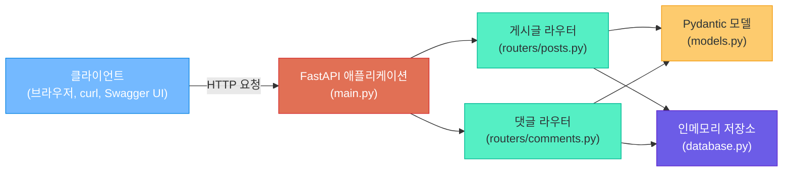
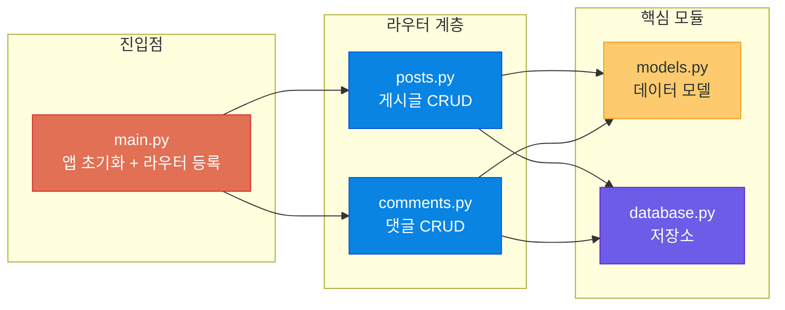
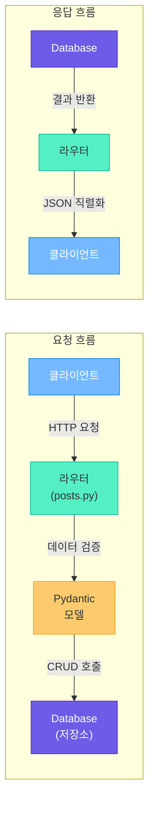
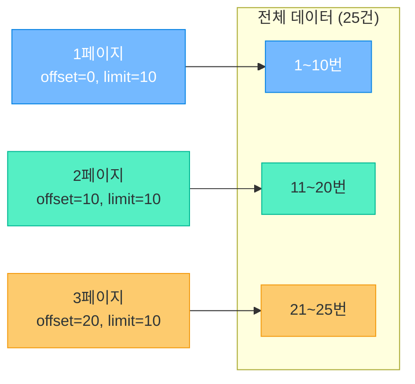
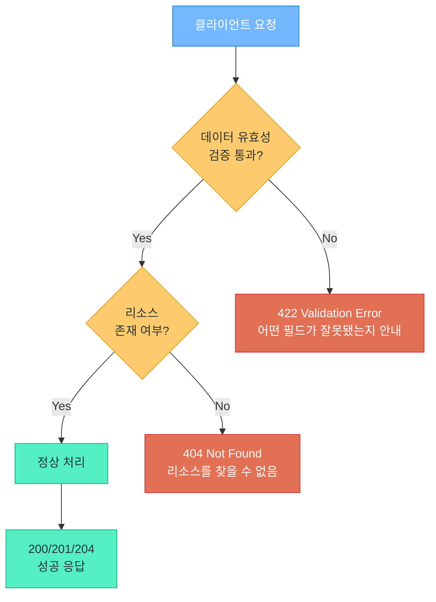
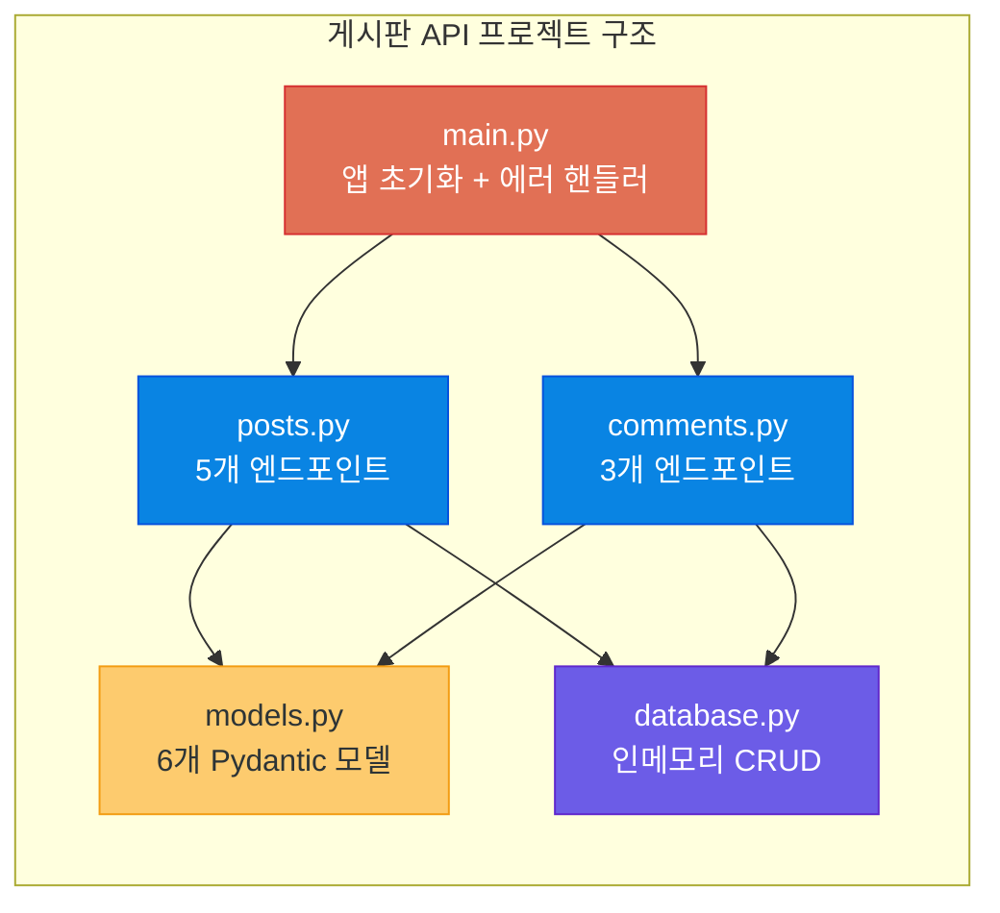

# REST API 게시판 프로젝트

> 이론은 끝났다, 이제 직접 만들 차례 -- FastAPI로 게시판 CRUD API를 처음부터 끝까지 구현합니다

---

## 1. 프로젝트 개요

### 왜 게시판인가?

게시판은 웹 개발의 "국민 체조"와 같습니다. 단순해 보이지만 **CRUD(생성, 조회, 수정, 삭제)**의 모든 핵심을 포함하고 있으며, 여기에 댓글, 검색, 페이지네이션까지 더하면 실무에서 만나는 대부분의 API 패턴을 경험할 수 있습니다.

이 프로젝트에서 구현할 기능은 다음과 같습니다.

| 카테고리 | 기능 | HTTP 메서드 | 엔드포인트 |
|----------|------|-------------|-----------|
| **게시글** | 작성 | POST | `/api/posts` |
| **게시글** | 목록 조회 | GET | `/api/posts` |
| **게시글** | 상세 조회 | GET | `/api/posts/{id}` |
| **게시글** | 수정 | PUT | `/api/posts/{id}` |
| **게시글** | 삭제 | DELETE | `/api/posts/{id}` |
| **댓글** | 작성 | POST | `/api/posts/{id}/comments` |
| **댓글** | 목록 조회 | GET | `/api/posts/{id}/comments` |
| **댓글** | 삭제 | DELETE | `/api/posts/{id}/comments/{cid}` |
| **검색** | 키워드 검색 | GET | `/api/posts?q=keyword` |
| **페이지네이션** | 페이지 단위 조회 | GET | `/api/posts?offset=0&limit=10` |

### 프로젝트 아키텍처 개요



> **핵심 포인트:** 이 프로젝트는 데이터베이스 대신 **인메모리 딕셔너리**를 사용합니다. 실무에서는 반드시 DB를 사용하지만, REST API의 설계 원칙과 FastAPI의 사용법에 집중하기 위해 의도적으로 단순화한 것입니다.

---

## 2. 프로젝트 구조 설계

### 디렉토리 구조

```
board_api/
├── main.py              # FastAPI 앱 초기화, 라우터 등록
├── models.py            # Pydantic 데이터 모델 정의
├── database.py          # 인메모리 저장소 (딕셔너리)
├── routers/
│   ├── __init__.py      # 패키지 초기화
│   ├── posts.py         # 게시글 CRUD 엔드포인트
│   └── comments.py      # 댓글 CRUD 엔드포인트
└── requirements.txt     # 의존성 목록
```

각 파일의 역할을 비유하면 이렇습니다.

| 파일 | 비유 | 역할 |
|------|------|------|
| `main.py` | 식당 입구 | 모든 요청이 처음 도착하는 곳 |
| `models.py` | 주문서 양식 | 요청/응답 데이터의 형태를 정의 |
| `database.py` | 주방 냉장고 | 데이터를 저장하고 꺼내는 곳 |
| `routers/posts.py` | 메인 요리사 | 게시글 관련 요청을 처리 |
| `routers/comments.py` | 보조 요리사 | 댓글 관련 요청을 처리 |

### 프로젝트 구조 다이어그램



### requirements.txt

```text
fastapi==0.115.0
uvicorn[standard]==0.30.0
```

설치 명령어:

```bash
pip install -r requirements.txt
```

---

## 3. 데이터 모델 설계

### Pydantic 모델이란?

Pydantic은 Python의 **데이터 검증 라이브러리**입니다. 택배를 보낼 때 송장에 보내는 사람, 받는 사람, 주소를 정해진 양식대로 적듯이, Pydantic 모델은 API로 주고받는 데이터의 형태를 미리 정의합니다.

### models.py -- 전체 코드

```python
# models.py -- 데이터 모델 정의
from pydantic import BaseModel, Field
from datetime import datetime
from typing import Optional


# ── 게시글 모델 ──

class PostCreate(BaseModel):
    """게시글 작성 시 클라이언트가 보내는 데이터"""
    title: str = Field(..., min_length=1, max_length=100, description="게시글 제목")
    content: str = Field(..., min_length=1, description="게시글 내용")
    author: str = Field(..., min_length=1, max_length=50, description="작성자")


class PostUpdate(BaseModel):
    """게시글 수정 시 클라이언트가 보내는 데이터 (부분 수정 가능)"""
    title: Optional[str] = Field(None, min_length=1, max_length=100)
    content: Optional[str] = Field(None, min_length=1)


class PostResponse(BaseModel):
    """게시글 응답 데이터"""
    id: int
    title: str
    content: str
    author: str
    created_at: str
    updated_at: str
    comment_count: int = 0


# ── 댓글 모델 ──

class CommentCreate(BaseModel):
    """댓글 작성 시 클라이언트가 보내는 데이터"""
    content: str = Field(..., min_length=1, max_length=500, description="댓글 내용")
    author: str = Field(..., min_length=1, max_length=50, description="작성자")


class CommentResponse(BaseModel):
    """댓글 응답 데이터"""
    id: int
    post_id: int
    content: str
    author: str
    created_at: str


# ── 페이지네이션 모델 ──

class PaginatedResponse(BaseModel):
    """페이지네이션이 적용된 응답"""
    total: int
    offset: int
    limit: int
    items: list
```

### 모델 간 관계

게시글(Post)과 댓글(Comment)은 **1:N 관계**입니다. 하나의 게시글에 여러 개의 댓글이 달릴 수 있습니다.

| 모델 | 용도 | 사용 시점 |
|------|------|----------|
| `PostCreate` | 게시글 작성 | POST `/api/posts` 요청 body |
| `PostUpdate` | 게시글 수정 | PUT `/api/posts/{id}` 요청 body |
| `PostResponse` | 게시글 응답 | 모든 게시글 관련 응답 |
| `CommentCreate` | 댓글 작성 | POST `/api/posts/{id}/comments` 요청 body |
| `CommentResponse` | 댓글 응답 | 모든 댓글 관련 응답 |
| `PaginatedResponse` | 목록 응답 | GET `/api/posts` 응답 |

### 데이터 모델 관계도

```mermaid
classDiagram
    class PostCreate {
        +str title
        +str content
        +str author
    }

    class PostUpdate {
        +Optional~str~ title
        +Optional~str~ content
    }

    class PostResponse {
        +int id
        +str title
        +str content
        +str author
        +str created_at
        +str updated_at
        +int comment_count
    }

    class CommentCreate {
        +str content
        +str author
    }

    class CommentResponse {
        +int id
        +int post_id
        +str content
        +str author
        +str created_at
    }

    class PaginatedResponse {
        +int total
        +int offset
        +int limit
        +list items
    }

    PostCreate ..> PostResponse : "생성 시 변환"
    PostUpdate ..> PostResponse : "수정 시 반영"
    CommentCreate ..> CommentResponse : "생성 시 변환"
    PostResponse "1" --> "*" CommentResponse : "1:N 관계"
    PaginatedResponse o-- PostResponse : "items에 포함"
```

> **핵심 포인트:** "입력용 모델"과 "출력용 모델"을 분리하는 것이 핵심입니다. `PostCreate`에는 `id`나 `created_at`이 없지만, `PostResponse`에는 있습니다. 서버가 자동으로 생성하는 값을 클라이언트에게 요구하지 않는 것이 좋은 API 설계입니다.

---

## 4. 메모리 기반 데이터 저장소

### database.py -- 전체 코드

실무에서는 PostgreSQL, MySQL 같은 데이터베이스를 사용하지만, 이 프로젝트에서는 학습에 집중하기 위해 Python 딕셔너리를 데이터 저장소로 사용합니다. 냉장고(DB)에 음식(데이터)을 넣고 꺼내는 것과 같은 원리입니다.

```python
# database.py -- 인메모리 데이터 저장소
from datetime import datetime


class Database:
    """딕셔너리 기반 인메모리 저장소"""

    def __init__(self):
        # 게시글 저장소: {id: {게시글 데이터}}
        self.posts: dict[int, dict] = {}
        # 댓글 저장소: {id: {댓글 데이터}}
        self.comments: dict[int, dict] = {}
        # ID 자동 증가 카운터
        self._post_id_counter = 0
        self._comment_id_counter = 0

    def _next_post_id(self) -> int:
        """게시글 ID 자동 증가"""
        self._post_id_counter += 1
        return self._post_id_counter

    def _next_comment_id(self) -> int:
        """댓글 ID 자동 증가"""
        self._comment_id_counter += 1
        return self._comment_id_counter

    # ── 게시글 CRUD ──

    def create_post(self, title: str, content: str, author: str) -> dict:
        """게시글 생성"""
        post_id = self._next_post_id()
        now = datetime.now().isoformat()
        post = {
            "id": post_id,
            "title": title,
            "content": content,
            "author": author,
            "created_at": now,
            "updated_at": now,
        }
        self.posts[post_id] = post
        return post

    def get_post(self, post_id: int) -> dict | None:
        """게시글 단건 조회"""
        return self.posts.get(post_id)

    def get_posts(
        self,
        offset: int = 0,
        limit: int = 10,
        query: str | None = None,
        sort: str = "created_at",
        order: str = "desc",
    ) -> tuple[list[dict], int]:
        """게시글 목록 조회 (검색, 페이지네이션, 정렬)"""
        # 전체 목록
        items = list(self.posts.values())

        # 검색 필터
        if query:
            query_lower = query.lower()
            items = [
                p for p in items
                if query_lower in p["title"].lower()
                or query_lower in p["content"].lower()
            ]

        # 정렬
        reverse = order == "desc"
        if sort in ("created_at", "updated_at", "title"):
            items.sort(key=lambda x: x[sort], reverse=reverse)

        total = len(items)

        # 페이지네이션
        items = items[offset: offset + limit]

        return items, total

    def update_post(self, post_id: int, title: str | None, content: str | None) -> dict | None:
        """게시글 수정"""
        post = self.posts.get(post_id)
        if not post:
            return None
        if title is not None:
            post["title"] = title
        if content is not None:
            post["content"] = content
        post["updated_at"] = datetime.now().isoformat()
        return post

    def delete_post(self, post_id: int) -> bool:
        """게시글 삭제 (연관 댓글도 함께 삭제)"""
        if post_id not in self.posts:
            return False
        del self.posts[post_id]
        # 해당 게시글의 댓글도 모두 삭제
        self.comments = {
            cid: c for cid, c in self.comments.items()
            if c["post_id"] != post_id
        }
        return True

    # ── 댓글 CRUD ──

    def create_comment(self, post_id: int, content: str, author: str) -> dict | None:
        """댓글 생성 (게시글이 없으면 None 반환)"""
        if post_id not in self.posts:
            return None
        comment_id = self._next_comment_id()
        now = datetime.now().isoformat()
        comment = {
            "id": comment_id,
            "post_id": post_id,
            "content": content,
            "author": author,
            "created_at": now,
        }
        self.comments[comment_id] = comment
        return comment

    def get_comments(self, post_id: int) -> list[dict]:
        """특정 게시글의 댓글 목록 조회"""
        return [
            c for c in self.comments.values()
            if c["post_id"] == post_id
        ]

    def delete_comment(self, comment_id: int) -> bool:
        """댓글 삭제"""
        if comment_id not in self.comments:
            return False
        del self.comments[comment_id]
        return True

    def get_comment_count(self, post_id: int) -> int:
        """특정 게시글의 댓글 수"""
        return sum(1 for c in self.comments.values() if c["post_id"] == post_id)


# 전역 인스턴스 (앱 전체에서 공유)
db = Database()
```

### 설계 포인트

| 설계 결정 | 이유 |
|-----------|------|
| 딕셔너리 사용 | ID로 빠른 조회 (O(1)) |
| ID 자동 증가 | DB의 AUTO_INCREMENT와 동일한 패턴 |
| 전역 인스턴스 | 앱 전체에서 하나의 저장소 공유 |
| 게시글 삭제 시 댓글도 삭제 | 데이터 정합성 유지 (CASCADE DELETE) |

> **핵심 포인트:** 이 인메모리 저장소는 서버를 재시작하면 데이터가 모두 사라집니다. 이것은 의도된 것이며, 나중에 SQLAlchemy + PostgreSQL을 연동하는 과정에서 영구 저장소로 교체하게 됩니다.

---

## 5. 게시글 API 구현

### API 흐름 개요



### routers/posts.py -- 전체 코드

```python
# routers/posts.py -- 게시글 CRUD 엔드포인트
from fastapi import APIRouter, HTTPException, Query
from models import PostCreate, PostUpdate, PostResponse, PaginatedResponse
from database import db

router = APIRouter(prefix="/api/posts", tags=["게시글"])


@router.post("", response_model=PostResponse, status_code=201)
def create_post(post: PostCreate):
    """게시글 작성"""
    result = db.create_post(
        title=post.title,
        content=post.content,
        author=post.author,
    )
    result["comment_count"] = 0
    return result


@router.get("", response_model=PaginatedResponse)
def list_posts(
    offset: int = Query(0, ge=0, description="시작 위치"),
    limit: int = Query(10, ge=1, le=100, description="조회 개수"),
    q: str | None = Query(None, description="검색 키워드"),
    sort: str = Query("created_at", description="정렬 기준"),
    order: str = Query("desc", regex="^(asc|desc)$", description="정렬 순서"),
):
    """게시글 목록 조회 (페이지네이션, 검색, 정렬)"""
    items, total = db.get_posts(
        offset=offset, limit=limit, query=q, sort=sort, order=order
    )
    # 각 게시글에 댓글 수 추가
    for item in items:
        item["comment_count"] = db.get_comment_count(item["id"])
    return {
        "total": total,
        "offset": offset,
        "limit": limit,
        "items": items,
    }


@router.get("/{post_id}", response_model=PostResponse)
def get_post(post_id: int):
    """게시글 상세 조회"""
    post = db.get_post(post_id)
    if not post:
        raise HTTPException(status_code=404, detail="게시글을 찾을 수 없습니다")
    post["comment_count"] = db.get_comment_count(post_id)
    return post


@router.put("/{post_id}", response_model=PostResponse)
def update_post(post_id: int, post_update: PostUpdate):
    """게시글 수정"""
    # 수정할 내용이 하나도 없는 경우
    if post_update.title is None and post_update.content is None:
        raise HTTPException(
            status_code=422, detail="수정할 내용을 하나 이상 입력해주세요"
        )
    result = db.update_post(
        post_id=post_id,
        title=post_update.title,
        content=post_update.content,
    )
    if not result:
        raise HTTPException(status_code=404, detail="게시글을 찾을 수 없습니다")
    result["comment_count"] = db.get_comment_count(post_id)
    return result


@router.delete("/{post_id}", status_code=204)
def delete_post(post_id: int):
    """게시글 삭제"""
    success = db.delete_post(post_id)
    if not success:
        raise HTTPException(status_code=404, detail="게시글을 찾을 수 없습니다")
    return None
```

### 각 엔드포인트 상세 설명

#### POST /api/posts -- 게시글 작성

새 게시글을 생성합니다. 요청 본문에 제목, 내용, 작성자를 보내면 서버가 ID와 생성 시간을 자동으로 부여합니다.

**요청 예시:**

```json
{
    "title": "FastAPI 첫 번째 게시글",
    "content": "안녕하세요! FastAPI로 만든 게시판입니다.",
    "author": "홍길동"
}
```

**응답 예시 (201 Created):**

```json
{
    "id": 1,
    "title": "FastAPI 첫 번째 게시글",
    "content": "안녕하세요! FastAPI로 만든 게시판입니다.",
    "author": "홍길동",
    "created_at": "2026-04-20T10:30:00",
    "updated_at": "2026-04-20T10:30:00",
    "comment_count": 0
}
```

#### GET /api/posts -- 게시글 목록 조회

전체 게시글 목록을 페이지네이션과 함께 반환합니다. 쿼리 파라미터로 검색과 정렬을 제어할 수 있습니다.

**쿼리 파라미터:**

| 파라미터 | 기본값 | 설명 |
|----------|--------|------|
| `offset` | 0 | 건너뛸 게시글 수 |
| `limit` | 10 | 한 번에 조회할 개수 (최대 100) |
| `q` | - | 제목/내용 검색 키워드 |
| `sort` | `created_at` | 정렬 기준 필드 |
| `order` | `desc` | 정렬 순서 (`asc` / `desc`) |

**응답 예시 (200 OK):**

```json
{
    "total": 25,
    "offset": 0,
    "limit": 10,
    "items": [
        {
            "id": 25,
            "title": "최신 게시글",
            "content": "가장 최근에 작성된 글입니다.",
            "author": "관리자",
            "created_at": "2026-04-20T15:00:00",
            "updated_at": "2026-04-20T15:00:00",
            "comment_count": 3
        }
    ]
}
```

#### GET /api/posts/{post_id} -- 게시글 상세 조회

특정 게시글 한 건을 조회합니다. 존재하지 않는 ID를 요청하면 404 에러를 반환합니다.

#### PUT /api/posts/{post_id} -- 게시글 수정

기존 게시글의 제목과 내용을 수정합니다. 부분 수정을 지원하므로 제목만 또는 내용만 보내도 됩니다.

**요청 예시:**

```json
{
    "title": "수정된 제목"
}
```

#### DELETE /api/posts/{post_id} -- 게시글 삭제

게시글을 삭제합니다. 해당 게시글에 달린 모든 댓글도 함께 삭제됩니다. 성공 시 본문 없이 204 상태 코드를 반환합니다.

---

## 6. 댓글 API 구현

### 중첩 리소스 URI 설계

댓글은 게시글에 종속된 자원입니다. REST 설계 원칙에 따라 URI에 이 **소유 관계**를 표현합니다.

```
/api/posts/{post_id}/comments          -- 특정 게시글의 댓글 목록
/api/posts/{post_id}/comments/{cid}    -- 특정 게시글의 특정 댓글
```

이것은 마치 주소 체계와 같습니다. "서울시(posts) > 강남구(post_id) > 역삼동(comments)"처럼 상위 자원에서 하위 자원으로 내려가는 구조입니다.

### routers/comments.py -- 전체 코드

```python
# routers/comments.py -- 댓글 CRUD 엔드포인트
from fastapi import APIRouter, HTTPException
from models import CommentCreate, CommentResponse
from database import db

router = APIRouter(prefix="/api/posts/{post_id}/comments", tags=["댓글"])


@router.post("", response_model=CommentResponse, status_code=201)
def create_comment(post_id: int, comment: CommentCreate):
    """댓글 작성"""
    # 게시글 존재 여부 확인
    post = db.get_post(post_id)
    if not post:
        raise HTTPException(status_code=404, detail="게시글을 찾을 수 없습니다")

    result = db.create_comment(
        post_id=post_id,
        content=comment.content,
        author=comment.author,
    )
    return result


@router.get("", response_model=list[CommentResponse])
def list_comments(post_id: int):
    """특정 게시글의 댓글 목록 조회"""
    # 게시글 존재 여부 확인
    post = db.get_post(post_id)
    if not post:
        raise HTTPException(status_code=404, detail="게시글을 찾을 수 없습니다")

    return db.get_comments(post_id)


@router.delete("/{comment_id}", status_code=204)
def delete_comment(post_id: int, comment_id: int):
    """댓글 삭제"""
    # 게시글 존재 여부 확인
    post = db.get_post(post_id)
    if not post:
        raise HTTPException(status_code=404, detail="게시글을 찾을 수 없습니다")

    success = db.delete_comment(comment_id)
    if not success:
        raise HTTPException(status_code=404, detail="댓글을 찾을 수 없습니다")
    return None
```

### 요청/응답 예시

#### POST /api/posts/1/comments -- 댓글 작성

**요청:**

```json
{
    "content": "좋은 글 감사합니다!",
    "author": "이영희"
}
```

**응답 (201 Created):**

```json
{
    "id": 1,
    "post_id": 1,
    "content": "좋은 글 감사합니다!",
    "author": "이영희",
    "created_at": "2026-04-20T11:00:00"
}
```

#### GET /api/posts/1/comments -- 댓글 목록 조회

**응답 (200 OK):**

```json
[
    {
        "id": 1,
        "post_id": 1,
        "content": "좋은 글 감사합니다!",
        "author": "이영희",
        "created_at": "2026-04-20T11:00:00"
    },
    {
        "id": 2,
        "post_id": 1,
        "content": "저도 FastAPI 배우고 있어요",
        "author": "김철수",
        "created_at": "2026-04-20T11:05:00"
    }
]
```

#### DELETE /api/posts/1/comments/2 -- 댓글 삭제

**응답:** 204 No Content (본문 없음)

---

## 7. 페이지네이션과 검색

### 왜 페이지네이션이 필요한가?

게시글이 10,000개 있다고 상상해 보세요. 모든 게시글을 한 번에 가져오면 네트워크 대역폭 낭비, 응답 시간 증가, 클라이언트 메모리 부족 등의 문제가 발생합니다. 도서관에서 책을 전부 한꺼번에 빌려오는 것은 불가능하듯, API도 적절한 양만 나눠서 전달해야 합니다.

### offset/limit 기반 페이지네이션



| 파라미터 | 의미 | 예시 |
|----------|------|------|
| `offset` | 건너뛸 항목 수 | `offset=20` -> 21번째부터 |
| `limit` | 가져올 항목 수 | `limit=10` -> 10개 가져오기 |

페이지 번호를 offset으로 변환하는 공식:

```
offset = (page - 1) * limit
```

예를 들어, 3페이지에서 10개씩 보려면: `offset = (3-1) * 10 = 20`

### 검색 기능

검색은 쿼리 파라미터 `q`를 사용합니다. 제목과 내용을 동시에 검색하며, 대소문자를 구분하지 않습니다.

```
GET /api/posts?q=FastAPI          -- "FastAPI" 포함 게시글 검색
GET /api/posts?q=python&limit=5   -- "python" 검색 + 5개만 조회
```

### 정렬 기능

정렬은 `sort`와 `order` 파라미터로 제어합니다.

```
GET /api/posts?sort=created_at&order=desc   -- 최신순 (기본값)
GET /api/posts?sort=title&order=asc         -- 제목 오름차순
GET /api/posts?sort=updated_at&order=desc   -- 최근 수정순
```

### 응답 형식

페이지네이션 응답에는 반드시 **메타 정보**를 포함해야 합니다. 클라이언트가 "다음 페이지가 있는지", "총 몇 개인지" 알 수 있어야 합니다.

```json
{
    "total": 25,
    "offset": 10,
    "limit": 10,
    "items": [ ... ]
}
```

| 필드 | 설명 |
|------|------|
| `total` | 검색 조건에 맞는 전체 항목 수 |
| `offset` | 현재 건너뛴 항목 수 |
| `limit` | 요청한 조회 개수 |
| `items` | 실제 데이터 배열 |

> **핵심 포인트:** offset/limit 방식은 구현이 간단하지만, 데이터가 매우 많으면 성능 이슈가 있습니다. 그래서 실무에서는 cursor 기반 페이지네이션을 사용하기도 합니다. 하지만 학습 단계에서는 offset/limit으로 충분합니다.

---

## 8. 에러 처리와 검증

### 일관된 에러 응답 형식

좋은 API는 성공뿐 아니라 실패할 때도 예측 가능한 형식으로 응답해야 합니다. 에러 응답의 형태가 매번 다르면 클라이언트 개발자가 혼란스럽습니다.

### main.py -- 전체 코드 (에러 핸들러 포함)

```python
# main.py -- FastAPI 앱 초기화 및 에러 핸들러
from fastapi import FastAPI, Request
from fastapi.responses import JSONResponse
from fastapi.exceptions import RequestValidationError
from routers import posts, comments

app = FastAPI(
    title="게시판 API",
    description="FastAPI로 구현한 REST API 게시판",
    version="1.0.0",
)

# 라우터 등록
app.include_router(posts.router)
app.include_router(comments.router)


# ── 커스텀 에러 핸들러 ──

@app.exception_handler(RequestValidationError)
async def validation_exception_handler(request: Request, exc: RequestValidationError):
    """422 Validation Error를 일관된 형식으로 변환"""
    errors = []
    for error in exc.errors():
        errors.append({
            "field": " -> ".join(str(loc) for loc in error["loc"]),
            "message": error["msg"],
        })
    return JSONResponse(
        status_code=422,
        content={
            "error": "유효성 검증 실패",
            "details": errors,
        },
    )


@app.exception_handler(404)
async def not_found_handler(request: Request, exc):
    """404 Not Found 에러"""
    return JSONResponse(
        status_code=404,
        content={"error": "요청한 리소스를 찾을 수 없습니다"},
    )


# ── 루트 엔드포인트 ──

@app.get("/")
def root():
    """API 상태 확인"""
    return {
        "message": "게시판 API가 실행 중입니다",
        "docs": "/docs",
        "version": "1.0.0",
    }
```

### 에러 응답 예시

#### 404 Not Found -- 존재하지 않는 리소스

```bash
# 존재하지 않는 게시글 조회
curl http://localhost:8000/api/posts/999
```

```json
{
    "detail": "게시글을 찾을 수 없습니다"
}
```

#### 422 Validation Error -- 잘못된 요청 데이터

```bash
# 제목 없이 게시글 작성 시도
curl -X POST http://localhost:8000/api/posts \
  -H "Content-Type: application/json" \
  -d '{"content": "내용만 있음", "author": "홍길동"}'
```

```json
{
    "error": "유효성 검증 실패",
    "details": [
        {
            "field": "body -> title",
            "message": "Field required"
        }
    ]
}
```

### 에러 처리 흐름



### HTTP 상태 코드 정리

| 상태 코드 | 의미 | 사용 상황 |
|-----------|------|----------|
| **200** OK | 성공 | 조회, 수정 성공 |
| **201** Created | 생성 성공 | 게시글/댓글 작성 성공 |
| **204** No Content | 성공 (본문 없음) | 삭제 성공 |
| **404** Not Found | 리소스 없음 | 존재하지 않는 ID 요청 |
| **422** Unprocessable Entity | 검증 실패 | 필수 필드 누락, 형식 오류 |

> **핵심 포인트:** 에러 메시지는 **개발자가 문제를 즉시 파악**할 수 있도록 구체적이어야 합니다. "오류가 발생했습니다"보다 "게시글을 찾을 수 없습니다"가 훨씬 유용합니다.

---

## 9. API 테스트

### 서버 실행

```bash
# board_api 디렉토리에서 실행
uvicorn main:app --reload --host 0.0.0.0 --port 8000
```

`--reload` 옵션은 코드 변경 시 서버를 자동으로 재시작합니다. 개발 환경에서만 사용하세요.

### Swagger UI로 테스트

FastAPI는 자동으로 API 문서를 생성합니다. 브라우저에서 `http://localhost:8000/docs`에 접속하면 **Swagger UI**를 통해 모든 엔드포인트를 시각적으로 테스트할 수 있습니다.

| URL | 설명 |
|-----|------|
| `http://localhost:8000/docs` | Swagger UI (대화형 API 문서) |
| `http://localhost:8000/redoc` | ReDoc (읽기 전용 API 문서) |

### curl 명령어로 전체 시나리오 테스트

아래는 게시글 생성부터 삭제까지의 전체 흐름을 curl로 테스트하는 예시입니다.

#### 1단계: 게시글 작성

```bash
# 게시글 3개 작성
curl -X POST http://localhost:8000/api/posts \
  -H "Content-Type: application/json" \
  -d '{
    "title": "첫 번째 게시글",
    "content": "FastAPI 게시판의 첫 글입니다!",
    "author": "홍길동"
  }'

curl -X POST http://localhost:8000/api/posts \
  -H "Content-Type: application/json" \
  -d '{
    "title": "Python 공부 일지",
    "content": "오늘은 Pydantic을 배웠습니다.",
    "author": "이영희"
  }'

curl -X POST http://localhost:8000/api/posts \
  -H "Content-Type: application/json" \
  -d '{
    "title": "FastAPI vs Flask 비교",
    "content": "FastAPI가 더 빠르고 타입 안전합니다.",
    "author": "김철수"
  }'
```

#### 2단계: 게시글 목록 조회

```bash
# 전체 목록 (기본: 최신순 10개)
curl http://localhost:8000/api/posts

# 검색: "FastAPI" 포함 게시글
curl "http://localhost:8000/api/posts?q=FastAPI"

# 페이지네이션: 2번째부터 1개만
curl "http://localhost:8000/api/posts?offset=1&limit=1"

# 정렬: 제목 오름차순
curl "http://localhost:8000/api/posts?sort=title&order=asc"
```

#### 3단계: 게시글 상세 조회

```bash
# 1번 게시글 상세
curl http://localhost:8000/api/posts/1
```

#### 4단계: 게시글 수정

```bash
# 1번 게시글 제목만 수정
curl -X PUT http://localhost:8000/api/posts/1 \
  -H "Content-Type: application/json" \
  -d '{"title": "수정된 첫 번째 게시글"}'
```

#### 5단계: 댓글 작성 및 조회

```bash
# 1번 게시글에 댓글 작성
curl -X POST http://localhost:8000/api/posts/1/comments \
  -H "Content-Type: application/json" \
  -d '{
    "content": "좋은 글이네요!",
    "author": "박지민"
  }'

# 1번 게시글 댓글 목록 조회
curl http://localhost:8000/api/posts/1/comments
```

#### 6단계: 삭제

```bash
# 댓글 삭제
curl -X DELETE http://localhost:8000/api/posts/1/comments/1

# 게시글 삭제 (연관 댓글도 함께 삭제)
curl -X DELETE http://localhost:8000/api/posts/1
```

### 테스트 체크리스트

| 테스트 항목 | 예상 결과 | 확인 |
|------------|----------|------|
| 게시글 작성 | 201 + 생성된 게시글 반환 | |
| 빈 제목으로 작성 | 422 Validation Error | |
| 게시글 목록 조회 | 200 + 페이지네이션 응답 | |
| 검색 (q=FastAPI) | 200 + 필터된 결과 | |
| 존재하지 않는 게시글 조회 | 404 Not Found | |
| 게시글 수정 (제목만) | 200 + 수정된 게시글 | |
| 게시글 삭제 | 204 No Content | |
| 댓글 작성 | 201 + 생성된 댓글 반환 | |
| 삭제된 게시글에 댓글 작성 | 404 Not Found | |
| 댓글 삭제 | 204 No Content | |

---

## 10. 핵심 정리

### 프로젝트 요약

이 프로젝트에서 우리는 FastAPI를 사용하여 **게시판 REST API**를 처음부터 끝까지 구현했습니다. 인메모리 저장소를 사용했지만, API 설계 원칙과 구조는 실무와 동일합니다.



### 배운 것 정리

| 항목 | 배운 내용 |
|------|----------|
| **프로젝트 구조** | main.py + routers + models + database로 관심사 분리 |
| **Pydantic 모델** | 입력/출력 모델 분리, 데이터 검증 자동화 |
| **CRUD 구현** | POST(생성), GET(조회), PUT(수정), DELETE(삭제) |
| **중첩 리소스** | `/posts/{id}/comments` 형태의 URI 설계 |
| **페이지네이션** | offset/limit 기반 목록 분할 |
| **검색 & 정렬** | 쿼리 파라미터로 필터링과 정렬 |
| **에러 처리** | 404, 422 에러의 일관된 응답 형식 |
| **HTTP 상태 코드** | 200, 201, 204, 404, 422의 적절한 사용 |

### REST 설계 원칙 적용 체크리스트

이전 강의에서 배운 REST 설계 원칙이 이 프로젝트에서 어떻게 적용되었는지 확인해 봅시다.

| REST 원칙 | 적용 여부 | 구현 내용 |
|-----------|----------|----------|
| URI는 명사(리소스)로 표현 | O | `/api/posts`, `/api/posts/{id}/comments` |
| HTTP 메서드로 행위 표현 | O | GET(조회), POST(생성), PUT(수정), DELETE(삭제) |
| 적절한 상태 코드 반환 | O | 200, 201, 204, 404, 422 |
| JSON 형식 통일 | O | 모든 요청/응답이 JSON |
| 복수형 리소스 이름 | O | `posts`, `comments` |
| 중첩 리소스로 관계 표현 | O | `posts/{id}/comments` |
| 페이지네이션 제공 | O | offset, limit, total 포함 |
| 일관된 에러 형식 | O | error + details 구조 |

### routers/__init__.py

라우터 패키지를 위한 초기화 파일입니다. 비워두어도 됩니다.

```python
# routers/__init__.py
```

### 전체 파일 목록과 실행 순서

```
1. requirements.txt 작성 후 pip install -r requirements.txt
2. models.py 작성 (데이터 모델 정의)
3. database.py 작성 (저장소 구현)
4. routers/__init__.py 생성 (빈 파일)
5. routers/posts.py 작성 (게시글 API)
6. routers/comments.py 작성 (댓글 API)
7. main.py 작성 (앱 초기화 + 라우터 등록)
8. uvicorn main:app --reload 로 실행
9. http://localhost:8000/docs 에서 테스트
```

### 다음 강의 미리보기

지금까지 만든 게시판 API에는 한 가지 큰 문제가 있습니다. **누구나** 게시글을 수정하고 삭제할 수 있다는 것입니다. 실제 게시판에서는 자기가 쓴 글만 수정/삭제할 수 있어야 합니다.

다음 강의에서는 이 문제를 해결하기 위해 **인증(Authentication)과 세션(Session)**을 다룹니다.

- 사용자가 누구인지 어떻게 확인하는가? (로그인)
- 로그인 상태를 어떻게 유지하는가? (세션, 쿠키)
- API에서 인증은 어떻게 하는가? (토큰 기반 인증)

---

> **이전 강의:** [REST API 설계 원칙](09_rest_api_design.md)
>
> **다음 강의:** [인증과 세션](11_auth_and_session.md)
