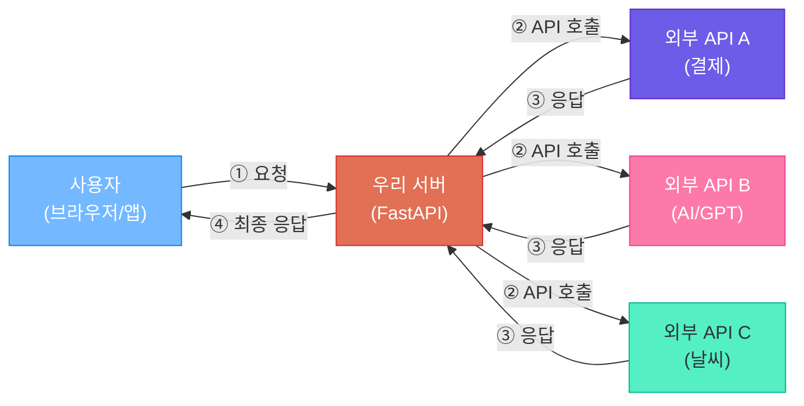
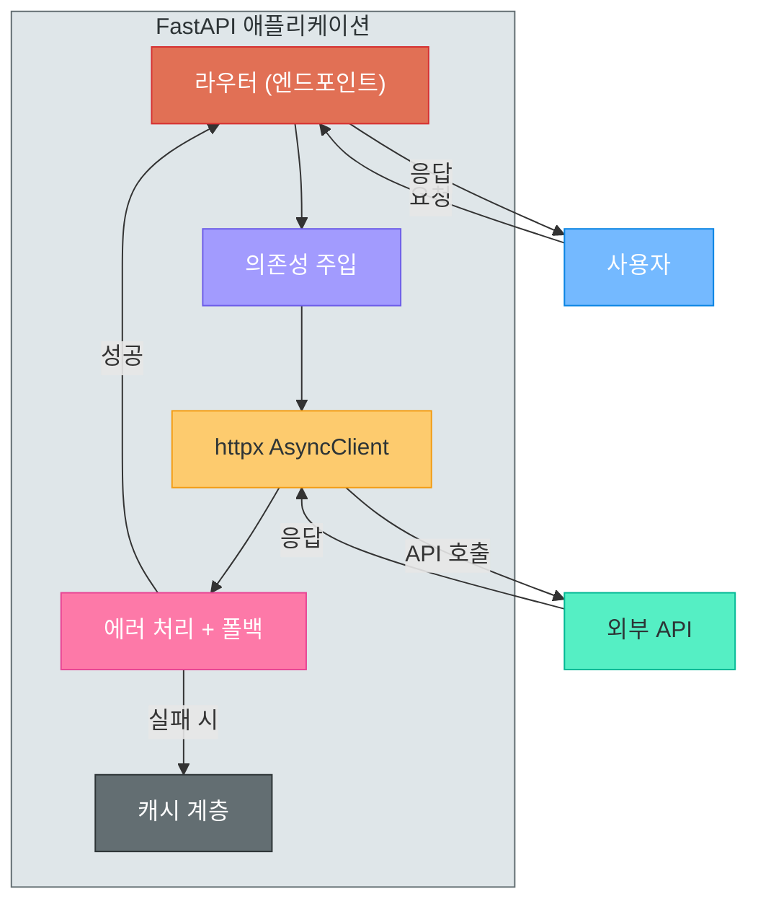
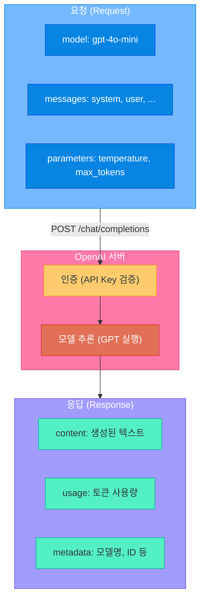
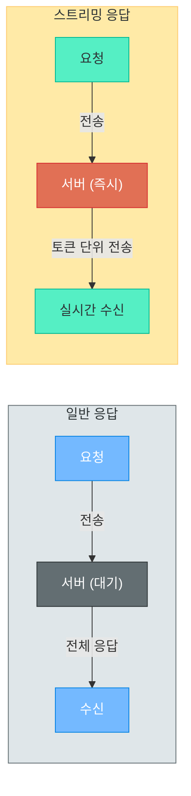
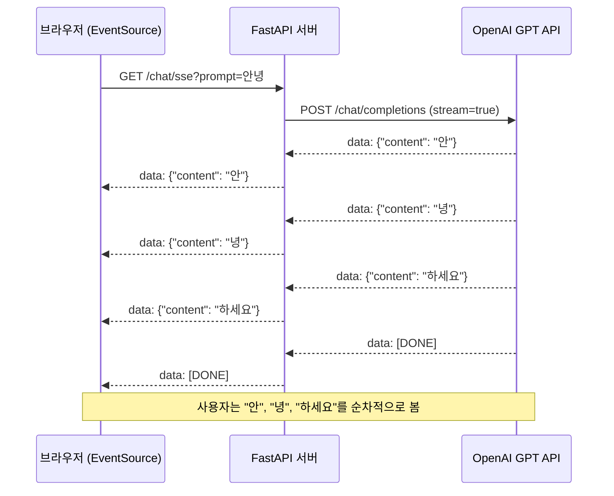
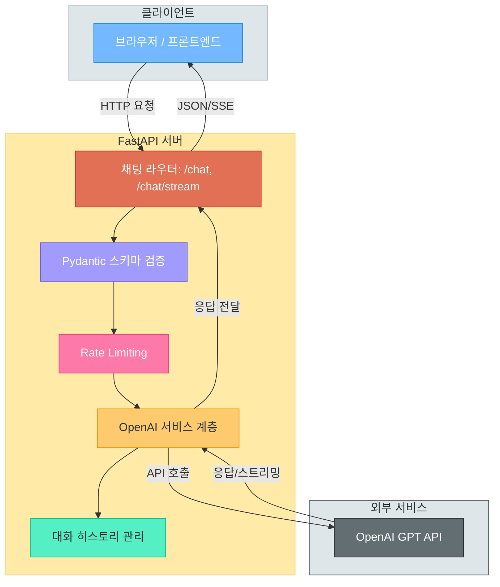
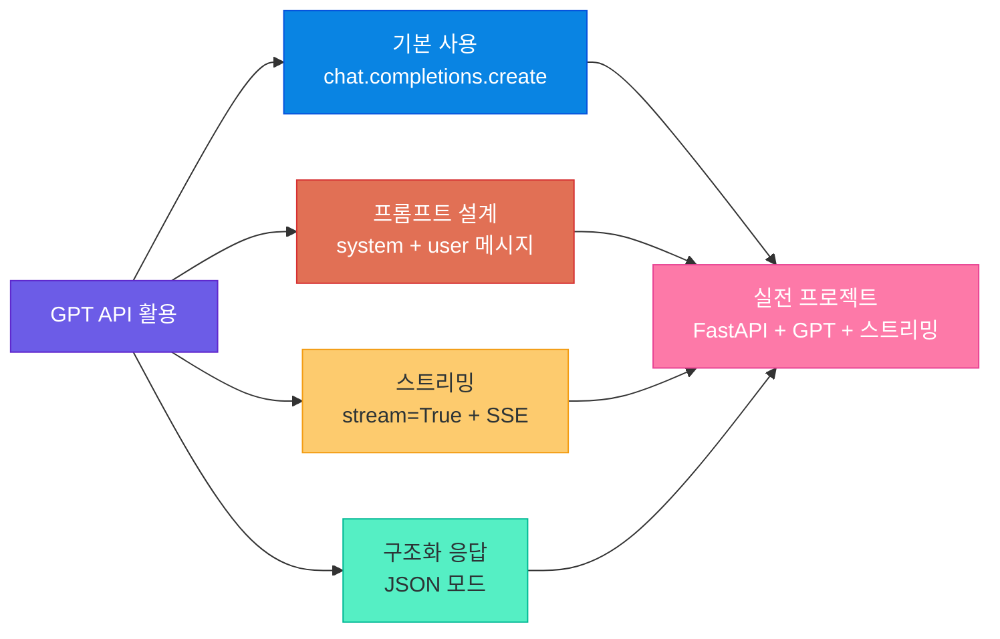

# 외부 API 연동 + GPT API 활용

> 우리 서버도 클라이언트가 될 수 있다 — httpx로 외부 세계와 소통하고, GPT API로 AI의 힘을 빌려오는 법을 배웁니다

---

## 1. 외부 API 연동이란?

### 서버도 클라이언트가 될 수 있다

지금까지 우리는 FastAPI로 **"요청을 받는 서버"**를 만들어 왔습니다. 하지만 현실의 서비스는 혼자 모든 것을 해결하지 않습니다. 마치 회사에서 업무를 처리할 때 다른 부서에 협조를 요청하듯, 우리 서버도 **다른 서버에게 도움을 요청**해야 할 때가 있습니다.

이것이 바로 **외부 API 연동**입니다. 우리 서버가 **클라이언트 역할**을 하여 외부 서비스의 API를 호출하는 것이죠.

### 왜 외부 API가 필요한가?

모든 기능을 직접 만드는 것은 비현실적입니다. 결제 시스템을 처음부터 구축하려면 수년이 걸리고, 날씨 데이터를 자체 수집하려면 기상 관측소가 필요합니다. 외부 API를 활용하면 **전문가가 만든 서비스를 레고 블록처럼 조합**하여 빠르게 서비스를 완성할 수 있습니다.

| 사용 사례 | 대표 서비스 | 역할 |
|-----------|------------|------|
| **결제** | 토스페이먼츠, 카카오페이 | 결제 처리, 환불, 정산 |
| **소셜 로그인** | 카카오, 구글, 네이버 | OAuth 인증, 사용자 정보 조회 |
| **날씨 정보** | OpenWeatherMap, 기상청 | 실시간 날씨 데이터 제공 |
| **AI 서비스** | OpenAI, Claude, Gemini | 텍스트 생성, 번역, 요약 |
| **알림** | Slack, 텔레그램, Twilio | 메시지 발송, 알림 전달 |
| **지도/위치** | 카카오맵, 구글맵 | 주소 검색, 경로 안내 |

### 외부 API 통신 흐름

우리가 만든 서비스가 외부 API와 어떻게 소통하는지 전체 그림을 살펴봅시다.



이 그림에서 핵심은 **우리 서버가 이중 역할**을 한다는 것입니다:
- 사용자에게는 **서버** (요청을 받는 쪽)
- 외부 API에게는 **클라이언트** (요청을 보내는 쪽)

> **핵심 포인트:** 외부 API 연동은 현대 웹 서비스의 필수 역량입니다. "바퀴를 다시 발명하지 말라"는 격언처럼, 잘 만들어진 서비스를 API로 연결하여 우리의 서비스를 빠르게 완성하는 것이 현명한 전략입니다.

---

## 2. HTTP 클라이언트 라이브러리

### requests vs httpx

Python에서 HTTP 요청을 보내는 대표적인 라이브러리 두 가지가 있습니다.

| 항목 | requests | httpx |
|------|----------|-------|
| **역사** | 2011년 출시, Python의 대표 HTTP 라이브러리 | 2019년 출시, 차세대 HTTP 라이브러리 |
| **동기 지원** | O | O |
| **비동기 지원** | X (별도 라이브러리 필요) | O (내장) |
| **HTTP/2 지원** | X | O |
| **API 호환성** | 표준 | requests와 유사한 API |
| **FastAPI 궁합** | 보통 (비동기 불가) | 최적 (비동기 네이티브) |
| **타입 힌트** | 부분적 | 완전 지원 |

### 왜 httpx인가?

FastAPI는 **비동기(async)** 프레임워크입니다. 비동기 엔드포인트에서 동기 방식의 requests를 사용하면, 요청을 기다리는 동안 **다른 요청을 처리하지 못하는 병목**이 발생합니다. 이는 마치 식당에서 요리사가 배달 음식을 기다리느라 다른 주문을 전혀 받지 못하는 것과 같습니다.

httpx는 비동기를 기본으로 지원하므로 FastAPI와 **자연스럽게 결합**됩니다. 배달 음식을 주문해놓고 다른 요리를 계속하는 것처럼, 외부 API 응답을 기다리면서도 다른 요청을 동시에 처리할 수 있습니다.

### 설치

```bash
# httpx 설치
pip install httpx

# 비동기 + HTTP/2 지원까지
pip install httpx[http2]
```

---

## 3. httpx 기본 사용법

### GET / POST 요청

```python
import httpx

# --- GET 요청 ---
response = httpx.get("https://jsonplaceholder.typicode.com/posts/1")
print(response.status_code)  # 200
print(response.json())       # JSON 응답을 딕셔너리로 변환

# 쿼리 파라미터 + 커스텀 헤더
response = httpx.get(
    "https://api.example.com/todos",
    params={"userId": 1, "completed": False},  # ?userId=1&completed=false
    headers={"Authorization": "Bearer your-token-here"}
)

# --- POST 요청 ---
new_post = {"title": "httpx 배우기", "body": "정말 편리합니다", "userId": 1}
response = httpx.post(
    "https://jsonplaceholder.typicode.com/posts",
    json=new_post  # 자동으로 Content-Type: application/json 설정
)
print(response.status_code)  # 201 (Created)
```

### 응답 처리와 에러 처리

```python
import httpx

try:
    response = httpx.get("https://api.example.com/data", timeout=10.0)
    response.raise_for_status()  # 4xx, 5xx면 예외 발생

    # 응답 활용
    print(response.json())       # JSON → dict
    print(response.text)         # 원본 텍스트
    print(response.headers)      # 응답 헤더

except httpx.TimeoutException:
    print("요청 시간 초과 — 서버가 응답하지 않습니다")
except httpx.HTTPStatusError as e:
    print(f"HTTP 에러: {e.response.status_code}")
except httpx.RequestError as e:
    print(f"요청 실패: {e}")
```

### 비동기 httpx

FastAPI와 함께 사용할 때는 **비동기 클라이언트**를 사용합니다.

```python
import httpx
import asyncio

async def fetch_data():
    async with httpx.AsyncClient() as client:
        response = await client.get(
            "https://jsonplaceholder.typicode.com/posts/1"
        )
        return response.json()

# 여러 요청을 동시에 보내기 (병렬 처리)
async def fetch_multiple():
    async with httpx.AsyncClient() as client:
        tasks = [
            client.get(f"https://jsonplaceholder.typicode.com/posts/{i}")
            for i in range(1, 4)
        ]
        responses = await asyncio.gather(*tasks)
        return [r.json() for r in responses]
```

> **핵심 포인트:** 동기 방식은 요청을 순차적으로 보내지만, 비동기 방식은 동시에 보내고 모든 응답을 한꺼번에 받습니다. 3개의 요청이 각각 1초씩 걸린다면, 동기는 3초, 비동기는 약 1초면 됩니다.

---

## 4. FastAPI에서 외부 API 호출

### 엔드포인트에서 httpx.AsyncClient 사용

FastAPI의 비동기 엔드포인트에서 외부 API를 호출하는 기본 패턴입니다.

```python
from fastapi import FastAPI, HTTPException
import httpx

app = FastAPI()

@app.get("/posts/{post_id}")
async def get_external_post(post_id: int):
    """외부 API에서 게시글 데이터를 가져옵니다"""
    async with httpx.AsyncClient() as client:
        response = await client.get(
            f"https://jsonplaceholder.typicode.com/posts/{post_id}"
        )
        if response.status_code == 404:
            raise HTTPException(status_code=404, detail="게시글을 찾을 수 없습니다")
        response.raise_for_status()
        return response.json()
```

### 의존성 주입으로 클라이언트 관리

매 요청마다 클라이언트를 생성하는 것은 비효율적입니다. **의존성 주입**과 **lifespan**을 활용하여 클라이언트를 재사용합시다.

```python
from fastapi import FastAPI, Depends
from contextlib import asynccontextmanager
import httpx

@asynccontextmanager
async def lifespan(app: FastAPI):
    app.state.http_client = httpx.AsyncClient(timeout=30.0)
    yield
    await app.state.http_client.aclose()

app = FastAPI(lifespan=lifespan)

async def get_http_client():
    return app.state.http_client

@app.get("/weather/{city}")
async def get_weather(
    city: str,
    client: httpx.AsyncClient = Depends(get_http_client)
):
    response = await client.get(
        "https://api.openweathermap.org/data/2.5/weather",
        params={"q": city, "appid": "YOUR_API_KEY", "units": "metric"}
    )
    response.raise_for_status()
    return response.json()
```

### 실전 예제: 날씨 API 연동 + 에러 처리

실제 OpenWeatherMap API를 연동하고 **폴백(fallback) 패턴**까지 적용한 예제입니다.

```python
from fastapi import FastAPI, HTTPException
from pydantic import BaseModel
import httpx, os

WEATHER_API_KEY = os.getenv("OPENWEATHER_API_KEY")
weather_cache: dict = {}  # 간단한 캐시 (실제로는 Redis 사용)

class WeatherResponse(BaseModel):
    city: str
    temperature: float
    description: str

@app.get("/weather/{city}", response_model=WeatherResponse)
async def get_weather(city: str):
    """날씨 조회 — 실패 시 캐시 폴백"""
    try:
        async with httpx.AsyncClient(timeout=10.0) as client:
            response = await client.get(
                "https://api.openweathermap.org/data/2.5/weather",
                params={"q": city, "appid": WEATHER_API_KEY, "units": "metric", "lang": "kr"}
            )
            response.raise_for_status()

        data = response.json()
        result = WeatherResponse(
            city=data["name"],
            temperature=data["main"]["temp"],
            description=data["weather"][0]["description"]
        )
        weather_cache[city] = result  # 캐시에 저장
        return result

    except httpx.HTTPStatusError as e:
        if e.response.status_code == 404:
            raise HTTPException(404, detail=f"'{city}' 도시를 찾을 수 없습니다")
        raise HTTPException(502, detail="날씨 서비스 오류")

    except httpx.RequestError:
        # 폴백: 캐시된 데이터 반환
        if city in weather_cache:
            return weather_cache[city]
        raise HTTPException(503, detail="날씨 서비스에 연결할 수 없습니다")
```

### FastAPI 외부 API 통합 아키텍처



> **핵심 포인트:** 외부 API 호출은 **반드시 실패할 수 있다**고 가정하고 설계해야 합니다. 타임아웃 설정, 에러 처리, 폴백 전략은 선택이 아니라 필수입니다.

---

## 5. OpenAI GPT API 소개

### GPT API = "외부 API의 일종"

여기서 중요한 관점 전환이 필요합니다. **GPT API는 특별한 것이 아닙니다.** 앞서 배운 날씨 API처럼, OpenAI가 제공하는 **외부 API의 일종**입니다. 차이점이 있다면 입력으로 "텍스트"를 보내고, 출력으로 "AI가 생성한 텍스트"를 받는다는 점뿐입니다.

날씨 API에 도시 이름을 보내면 온도가 오듯, GPT API에 질문을 보내면 답변이 옵니다. 기술적 원리는 동일한 **HTTP 요청/응답** 패턴입니다.

| 비교 | 날씨 API | GPT API |
|------|---------|---------|
| **요청** | 도시 이름 전송 | 질문/프롬프트 전송 |
| **처리** | 기상 데이터 조회 | AI 모델 추론 |
| **응답** | JSON (온도, 습도 등) | JSON (생성된 텍스트) |
| **인증** | API Key | API Key |
| **프로토콜** | HTTPS | HTTPS |
| **과금** | 호출 횟수 기반 | 토큰 사용량 기반 |

### API 키 발급과 관리

OpenAI API를 사용하려면 API 키가 필요합니다.

```bash
# .env 파일에 API 키 저장 (절대 코드에 직접 넣지 않기!)
OPENAI_API_KEY=sk-proj-xxxxxxxxxxxxxxxxxxxxxxxx
```

```python
# .env 파일에서 키 로드
import os
from dotenv import load_dotenv

load_dotenv()  # .env 파일 로드
api_key = os.getenv("OPENAI_API_KEY")
```

> **주의:** API 키를 GitHub에 올리면 자동으로 감지되어 키가 무효화됩니다. `.gitignore`에 `.env` 파일을 반드시 추가하세요.

### GPT API 요청/응답 구조

GPT API의 통신 구조를 시각적으로 살펴봅시다.



### 모델 종류

| 모델 | 특징 | 용도 | 비용 |
|------|------|------|------|
| **gpt-4o** | 최신 플래그십 모델, 멀티모달(텍스트+이미지) | 고품질 답변, 복잡한 추론 | 높음 |
| **gpt-4o-mini** | 가볍고 빠른 모델, 비용 효율적 | 일반 대화, 간단한 작업 | 낮음 |
| **o1 / o3** | 추론 특화 모델 | 수학, 코딩, 논리적 분석 | 매우 높음 |

### 요금 체계 개요

GPT API는 **토큰** 단위로 과금됩니다. 토큰은 대략 한국어 기준 한 글자가 1~2 토큰에 해당합니다.

| 항목 | 설명 |
|------|------|
| **입력 토큰** | 보내는 메시지(프롬프트)의 길이 |
| **출력 토큰** | AI가 생성하는 응답의 길이 |
| **과금 방식** | 입력 + 출력 토큰 합산, 1K 토큰 단위 |
| **비용 예시** | gpt-4o-mini: 입력 $0.15/1M, 출력 $0.60/1M |

> **핵심 포인트:** GPT API를 "마법"으로 보지 마세요. `POST /v1/chat/completions`라는 엔드포인트에 JSON을 보내고 JSON을 받는 것 — 우리가 지금까지 배운 것과 정확히 같은 패턴입니다. 다만 그 응답을 생성하는 주체가 AI 모델일 뿐입니다.

---

## 6. GPT API 기본 사용

### openai 라이브러리 설치

```bash
pip install openai
```

### ChatCompletion 요청

```python
from openai import OpenAI

# 클라이언트 생성 (자동으로 OPENAI_API_KEY 환경변수 사용)
client = OpenAI()

# 기본 대화 요청
response = client.chat.completions.create(
    model="gpt-4o-mini",
    messages=[
        {"role": "system", "content": "당신은 친절한 한국어 도우미입니다."},
        {"role": "user", "content": "Python이 뭔가요?"}
    ]
)

# 응답에서 텍스트 추출
answer = response.choices[0].message.content
print(answer)
```

### messages 배열 구조

GPT API의 핵심은 **messages 배열**입니다. 대화의 맥락을 배열로 전달합니다.

| 역할(role) | 설명 | 예시 |
|-----------|------|------|
| **system** | AI의 성격과 행동 규칙 설정 | "당신은 전문 번역가입니다" |
| **user** | 사용자의 입력 메시지 | "이 문장을 영어로 번역해주세요" |
| **assistant** | AI의 이전 응답 (대화 히스토리) | "Here is the translation..." |

```python
# 대화 히스토리를 포함한 멀티턴 대화
messages = [
    {"role": "system", "content": "당신은 Python 전문 튜터입니다."},
    {"role": "user", "content": "리스트와 튜플의 차이가 뭔가요?"},
    {"role": "assistant", "content": "리스트는 변경 가능하고 튜플은 불변입니다..."},
    {"role": "user", "content": "그러면 언제 튜플을 쓰나요?"}  # 후속 질문
]

response = client.chat.completions.create(
    model="gpt-4o-mini",
    messages=messages
)
```

### 주요 파라미터

| 파라미터 | 기본값 | 범위 | 설명 |
|---------|--------|------|------|
| **temperature** | 1.0 | 0.0 ~ 2.0 | 낮으면 일관된 답변, 높으면 다양한 답변 |
| **max_tokens** | 모델별 상이 | 1 ~ 모델 한도 | 응답 최대 길이 제한 |
| **top_p** | 1.0 | 0.0 ~ 1.0 | temperature와 함께 쓰지 않는 것을 권장 |

### 응답 파싱

```python
response = client.chat.completions.create(
    model="gpt-4o-mini",
    messages=[{"role": "user", "content": "안녕하세요"}]
)

text = response.choices[0].message.content  # 생성된 텍스트
print(f"입력: {response.usage.prompt_tokens} 토큰")
print(f"출력: {response.usage.completion_tokens} 토큰")
print(f"총: {response.usage.total_tokens} 토큰")
```

---

## 7. GPT API 활용 패턴

### 프롬프트 엔지니어링 기초

**프롬프트 엔지니어링**이란 AI에게 원하는 결과를 얻기 위해 **입력(프롬프트)을 잘 설계하는 기술**입니다. 같은 질문이라도 어떻게 물어보느냐에 따라 답변의 품질이 크게 달라집니다.

| 원칙 | 나쁜 예 | 좋은 예 |
|------|---------|---------|
| **구체적으로** | "코드 짜줘" | "Python으로 파일을 읽어서 줄 수를 세는 함수를 작성해주세요" |
| **역할 부여** | "번역해줘" | "당신은 IT 전문 번역가입니다. 다음 기술 문서를 자연스러운 한국어로 번역해주세요" |
| **형식 지정** | "설명해줘" | "3가지 핵심 포인트로 나누어 각각 2문장으로 설명해주세요" |
| **예시 제공** | "JSON으로 줘" | "다음 형식으로 응답해주세요: {\"name\": \"값\", \"score\": 숫자}" |

### 시스템 메시지 활용

시스템 메시지는 AI의 **페르소나와 행동 규칙**을 설정합니다.

```python
# 코드 리뷰어 역할
messages = [
    {
        "role": "system",
        "content": """당신은 시니어 Python 개발자입니다.
코드 리뷰 시 다음 규칙을 따르세요:
1. 보안 취약점을 최우선으로 확인
2. PEP 8 스타일 가이드 준수 여부 확인
3. 개선 제안은 코드 예시와 함께 제공
4. 긍정적인 피드백도 함께 제공"""
    },
    {
        "role": "user",
        "content": "다음 코드를 리뷰해주세요:\n\ndef login(pw):\n    if pw == 'admin123': return True"
    }
]
```

### 컨텍스트 관리 (대화 히스토리)

GPT API는 **상태가 없습니다(stateless)**. 이전 대화를 기억하지 못하므로, 매 요청마다 전체 대화 히스토리를 함께 보내야 합니다.

```python
class ChatSession:
    """대화 히스토리를 관리하는 간단한 세션 클래스"""

    def __init__(self, system_prompt: str):
        self.messages = [
            {"role": "system", "content": system_prompt}
        ]

    def chat(self, user_message: str) -> str:
        # 사용자 메시지 추가
        self.messages.append({"role": "user", "content": user_message})

        # API 호출 (전체 히스토리 전송)
        response = client.chat.completions.create(
            model="gpt-4o-mini",
            messages=self.messages
        )

        # AI 응답 추출 및 히스토리에 추가
        assistant_message = response.choices[0].message.content
        self.messages.append({"role": "assistant", "content": assistant_message})

        return assistant_message

# 사용 예시
session = ChatSession("당신은 Python 튜터입니다.")
print(session.chat("변수가 뭔가요?"))       # 첫 번째 질문
print(session.chat("예시를 들어주세요"))     # 이전 맥락을 기억한 후속 질문
```

### 구조화된 응답 요청 (JSON 모드)

AI에게 JSON 형식으로 응답하도록 요청할 수 있습니다.

```python
response = client.chat.completions.create(
    model="gpt-4o-mini",
    messages=[
        {
            "role": "system",
            "content": "당신은 감정 분석기입니다. 항상 JSON 형식으로만 응답하세요."
        },
        {
            "role": "user",
            "content": "이 리뷰를 분석해주세요: '배송은 빨랐는데 포장이 엉망이네요'"
        }
    ],
    response_format={"type": "json_object"}  # JSON 모드 활성화
)

import json
result = json.loads(response.choices[0].message.content)
# {"sentiment": "mixed", "positive": ["빠른 배송"], "negative": ["포장 상태 불량"]}
```

> **핵심 포인트:** 프롬프트 엔지니어링의 핵심은 "AI에게 명확한 지시를 내리는 것"입니다. 모호한 지시는 모호한 결과를, 구체적인 지시는 정확한 결과를 만들어냅니다. 이는 사람에게 업무를 지시할 때와 정확히 같은 원리입니다.

---

## 8. 스트리밍 응답 처리

### 왜 스트리밍인가?

ChatGPT를 사용해 보면 응답이 **한 글자씩 나타나는 것**을 볼 수 있습니다. 이것이 바로 **스트리밍**입니다. GPT-4o 같은 모델이 긴 답변을 생성하는 데 수 초가 걸릴 수 있는데, 스트리밍 없이는 그 시간 동안 사용자는 **빈 화면만 바라보고 기다려야** 합니다.

| 비교 | 일반 응답 | 스트리밍 응답 |
|------|---------|-------------|
| **대기 시간** | 전체 생성 완료까지 대기 (3~10초) | 첫 토큰 도착까지만 대기 (0.5초 이내) |
| **사용자 경험** | 답답함, 로딩 스피너 | 실시간으로 글자가 나타남 |
| **체감 속도** | 느리게 느껴짐 | 빠르게 느껴짐 |
| **비유** | 편지를 한 번에 받기 | 전화로 실시간 대화 |

### 스트리밍 데이터 흐름 비교



### OpenAI 스트리밍 API

openai 라이브러리에서 `stream=True` 옵션을 사용합니다.

```python
from openai import OpenAI

client = OpenAI()

# 스트리밍 요청
stream = client.chat.completions.create(
    model="gpt-4o-mini",
    messages=[
        {"role": "user", "content": "Python의 장점을 3가지 알려주세요"}
    ],
    stream=True  # 스트리밍 활성화
)

# 토큰이 도착할 때마다 하나씩 출력
for chunk in stream:
    content = chunk.choices[0].delta.content
    if content is not None:
        print(content, end="", flush=True)
```

### FastAPI StreamingResponse

FastAPI에서 스트리밍을 구현하려면 `StreamingResponse`를 사용합니다.

```python
from fastapi import FastAPI
from fastapi.responses import StreamingResponse
from openai import AsyncOpenAI

app = FastAPI()
aclient = AsyncOpenAI()  # 비동기 클라이언트

async def generate_stream(prompt: str):
    """GPT 스트리밍 응답을 생성하는 제너레이터"""
    stream = await aclient.chat.completions.create(
        model="gpt-4o-mini",
        messages=[
            {"role": "system", "content": "당신은 친절한 도우미입니다."},
            {"role": "user", "content": prompt}
        ],
        stream=True
    )

    async for chunk in stream:
        content = chunk.choices[0].delta.content
        if content:
            yield content

@app.get("/chat/stream")
async def chat_stream(prompt: str):
    """스트리밍 채팅 엔드포인트"""
    return StreamingResponse(
        generate_stream(prompt),
        media_type="text/plain"
    )
```

### Server-Sent Events (SSE) 패턴

실무에서는 **SSE(Server-Sent Events)** 형식을 많이 사용합니다. SSE는 서버에서 클라이언트로 **단방향 실시간 데이터 전송**을 위한 표준 프로토콜입니다.

```python
from fastapi import FastAPI
from fastapi.responses import StreamingResponse
from openai import AsyncOpenAI
import json

app = FastAPI()
aclient = AsyncOpenAI()

async def generate_sse_stream(prompt: str):
    """SSE 형식으로 스트리밍 응답을 생성합니다"""
    stream = await aclient.chat.completions.create(
        model="gpt-4o-mini",
        messages=[
            {"role": "system", "content": "친절한 한국어 도우미입니다."},
            {"role": "user", "content": prompt}
        ],
        stream=True
    )

    async for chunk in stream:
        content = chunk.choices[0].delta.content
        if content:
            # SSE 형식: "data: {JSON}\n\n"
            data = json.dumps({"content": content}, ensure_ascii=False)
            yield f"data: {data}\n\n"

    # 스트리밍 종료 신호
    yield "data: [DONE]\n\n"

@app.get("/chat/sse")
async def chat_sse(prompt: str):
    """SSE 기반 스트리밍 채팅 엔드포인트"""
    return StreamingResponse(
        generate_sse_stream(prompt),
        media_type="text/event-stream",
        headers={
            "Cache-Control": "no-cache",
            "Connection": "keep-alive"
        }
    )
```

### SSE 통신 흐름



> **핵심 포인트:** 스트리밍은 실제 응답 속도를 빠르게 만드는 것이 아닙니다. 총 소요 시간은 비슷하지만, 사용자가 **첫 글자를 즉시 볼 수 있기 때문에** 체감 속도가 훨씬 빨라집니다. UX 관점에서 매우 중요한 패턴입니다.

---

## 9. 실전 프로젝트: AI 챗봇 API

### 프로젝트 구조

지금까지 배운 모든 내용을 결합하여 **실전 AI 챗봇 API**를 만들어 봅시다.

```
ai-chatbot/
├── main.py              # FastAPI 앱 진입점
├── routers/
│   └── chat.py          # 채팅 관련 엔드포인트
├── services/
│   └── openai_service.py  # OpenAI API 호출 로직
├── models/
│   └── schemas.py       # Pydantic 모델 (요청/응답)
├── .env                 # API 키 (Git에 올리지 않기!)
└── requirements.txt     # 의존성 목록
```

### 전체 프로젝트 아키텍처



### 스키마 정의 (models/schemas.py)

```python
from pydantic import BaseModel, Field
from typing import Optional

class ChatRequest(BaseModel):
    """채팅 요청 스키마"""
    message: str = Field(..., min_length=1, max_length=2000, description="사용자 메시지")
    session_id: Optional[str] = Field(None, description="대화 세션 ID")
    temperature: float = Field(0.7, ge=0.0, le=2.0, description="창의성 조절")

class ChatResponse(BaseModel):
    """채팅 응답 스키마"""
    reply: str = Field(..., description="AI 응답 메시지")
    session_id: str = Field(..., description="대화 세션 ID")
    usage: dict = Field(..., description="토큰 사용량")
```

### 핵심 코드: 서비스 계층 (services/openai_service.py)

```python
from openai import AsyncOpenAI
from typing import AsyncGenerator
import uuid

aclient = AsyncOpenAI()
chat_histories: dict[str, list] = {}  # 실제로는 Redis 또는 DB 사용

SYSTEM_PROMPT = "당신은 친절하고 전문적인 AI 도우미입니다. 한국어로 간결하게 답변합니다."

def get_or_create_session(session_id: str | None) -> tuple[str, list]:
    if session_id and session_id in chat_histories:
        return session_id, chat_histories[session_id]
    new_id = session_id or str(uuid.uuid4())
    chat_histories[new_id] = [{"role": "system", "content": SYSTEM_PROMPT}]
    return new_id, chat_histories[new_id]

async def chat(message: str, session_id: str | None, temperature: float) -> dict:
    """일반 채팅 (전체 응답)"""
    sid, messages = get_or_create_session(session_id)
    messages.append({"role": "user", "content": message})

    response = await aclient.chat.completions.create(
        model="gpt-4o-mini", messages=messages,
        temperature=temperature, max_tokens=1000
    )
    reply = response.choices[0].message.content
    messages.append({"role": "assistant", "content": reply})

    return {"reply": reply, "session_id": sid, "usage": {
        "prompt_tokens": response.usage.prompt_tokens,
        "completion_tokens": response.usage.completion_tokens,
        "total_tokens": response.usage.total_tokens
    }}

async def chat_stream(
    message: str, session_id: str | None, temperature: float
) -> AsyncGenerator[str, None]:
    """스트리밍 채팅 — 토큰 단위로 yield"""
    sid, messages = get_or_create_session(session_id)
    messages.append({"role": "user", "content": message})

    stream = await aclient.chat.completions.create(
        model="gpt-4o-mini", messages=messages,
        temperature=temperature, max_tokens=1000, stream=True
    )
    full_reply = ""
    async for chunk in stream:
        content = chunk.choices[0].delta.content
        if content:
            full_reply += content
            yield content
    messages.append({"role": "assistant", "content": full_reply})
```

### 핵심 코드: 라우터 + 메인 앱

```python
# routers/chat.py
from fastapi import APIRouter, HTTPException
from fastapi.responses import StreamingResponse
from services import openai_service
import json

router = APIRouter(prefix="/chat", tags=["채팅"])

@router.post("/")
async def chat(request: ChatRequest):
    try:
        return await openai_service.chat(
            request.message, request.session_id, request.temperature)
    except Exception as e:
        raise HTTPException(502, detail=f"AI 서비스 오류: {str(e)}")

@router.post("/stream")
async def chat_stream(request: ChatRequest):
    async def event_generator():
        async for token in openai_service.chat_stream(
            request.message, request.session_id, request.temperature
        ):
            data = json.dumps({"content": token}, ensure_ascii=False)
            yield f"data: {data}\n\n"
        yield "data: [DONE]\n\n"

    return StreamingResponse(event_generator(), media_type="text/event-stream")

# main.py
from fastapi import FastAPI
from dotenv import load_dotenv
load_dotenv()

app = FastAPI(title="AI 챗봇 API", version="1.0.0")
app.include_router(chat.router)
```

### Rate Limiting

외부 API를 사용할 때는 **요청 빈도 제한**으로 비용 폭탄을 방지해야 합니다.

```python
from fastapi import Request, HTTPException
from collections import defaultdict
import time

request_counts: dict[str, list[float]] = defaultdict(list)

async def rate_limit_check(request: Request):
    """분당 10회로 요청 제한"""
    client_ip = request.client.host
    now = time.time()
    request_counts[client_ip] = [t for t in request_counts[client_ip] if now - t < 60]

    if len(request_counts[client_ip]) >= 10:
        raise HTTPException(429, detail="요청이 너무 많습니다. 1분 후 다시 시도해주세요.")
    request_counts[client_ip].append(now)
```

> **핵심 포인트:** 실전 프로젝트에서는 반드시 **계층을 분리**(라우터, 서비스, 스키마)하세요. 모든 코드를 하나의 파일에 넣으면 유지보수가 어려워집니다. 또한 Rate Limiting은 비용 폭탄을 막기 위한 필수 안전장치입니다.

---

## 10. 핵심 정리

### 외부 API 연동 체크리스트

| 항목 | 확인 사항 |
|------|----------|
| **라이브러리** | httpx (비동기 지원) 사용 |
| **인증** | API 키를 .env 파일에 저장, 코드에 하드코딩 금지 |
| **타임아웃** | 반드시 timeout 설정 (기본 10~30초) |
| **에러 처리** | try-except로 네트워크 에러, HTTP 에러 처리 |
| **폴백** | 외부 API 실패 시 대체 동작 준비 |
| **Rate Limiting** | 요청 빈도 제한으로 비용 및 차단 방지 |
| **로깅** | API 호출 성공/실패 로그 기록 |
| **클라이언트 관리** | AsyncClient를 lifespan에서 관리하여 재사용 |

### GPT API 활용 요약



### 전체 Python 웹 개발 과정 회고

지난 강의들을 돌아보면, 우리는 다음과 같은 여정을 걸어왔습니다:

| 단계 | 주제 | 배운 것 |
|------|------|---------|
| **기초** | Python 문법, 자료구조 | 프로그래밍의 도구 습득 |
| **웹 기초** | HTTP, REST API | 웹 통신의 원리 이해 |
| **서버 개발** | FastAPI, 라우팅, 검증 | "요청을 받는" 서버 구축 |
| **데이터** | 데이터베이스, ORM | 데이터 저장과 관리 |
| **파일/로깅** | 파일 I/O, 로깅 | 서버 운영의 기반 |
| **외부 연동** | httpx, GPT API, 스트리밍 | "요청을 보내는" 서버 구축 |

이 과정에서 가장 중요한 깨달음은 이것입니다: **GPT API도, 날씨 API도, 결제 API도 모두 같은 원리입니다.** HTTP로 요청을 보내고, JSON으로 응답을 받는 것. 이 패턴을 이해하면 어떤 외부 서비스든 연동할 수 있습니다.

### 다음 단계: 프론트엔드와 결합

지금까지 만든 API는 **백엔드**입니다. 사용자가 실제로 사용하려면 **프론트엔드**(화면)가 필요합니다. 다음 단계에서는 React, HTML/CSS/JavaScript 등으로 화면을 만들고, 우리가 만든 AI 챗봇 API와 연결하는 방법을 배우게 됩니다.

> **핵심 포인트:** 프로그래밍은 레고와 같습니다. 하나의 블록(API)을 만드는 법을 배웠으니, 이제 블록들을 조합하여 더 큰 것을 만들 차례입니다. AI 시대의 풀스택 개발자는 "AI API를 능숙하게 다루는 사람"이라는 점을 기억하세요.

---

> **이전 강의:** [파일 I/O와 로깅](12_file_io_and_logging.md)