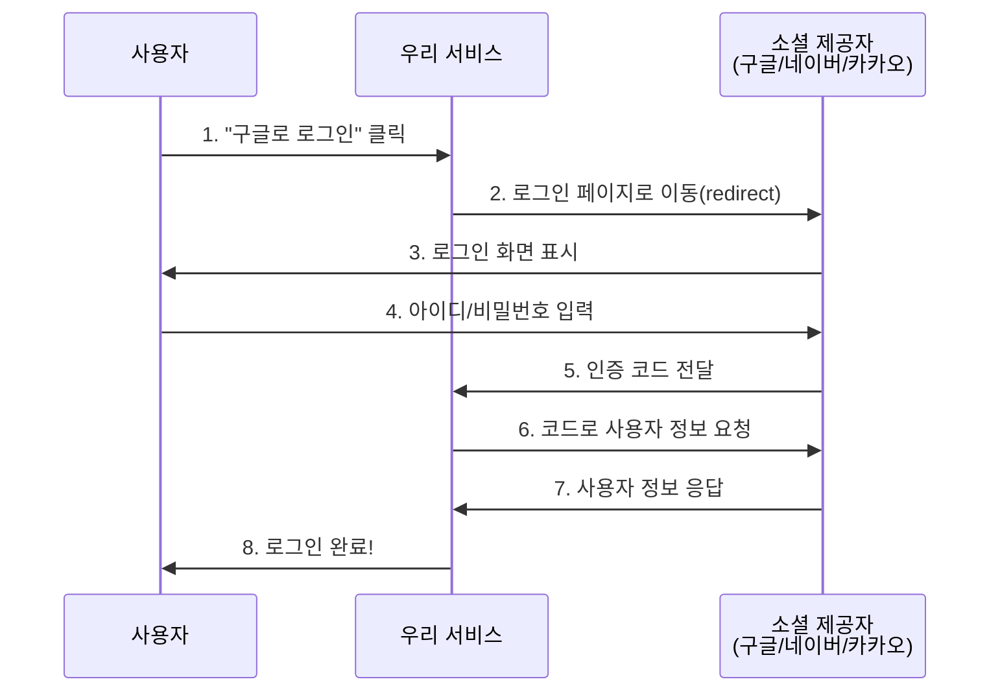
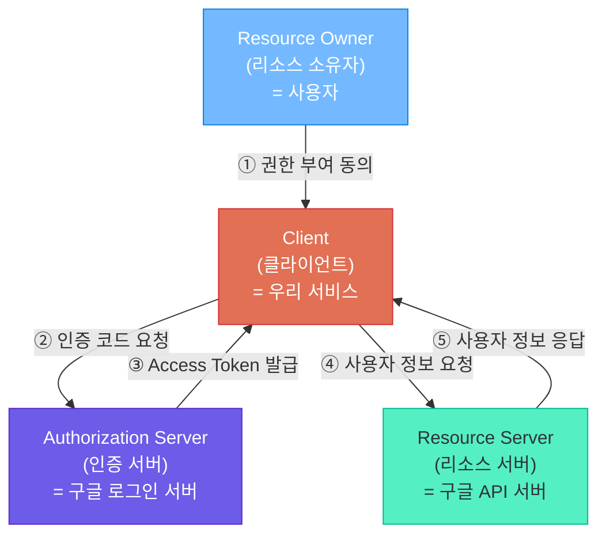
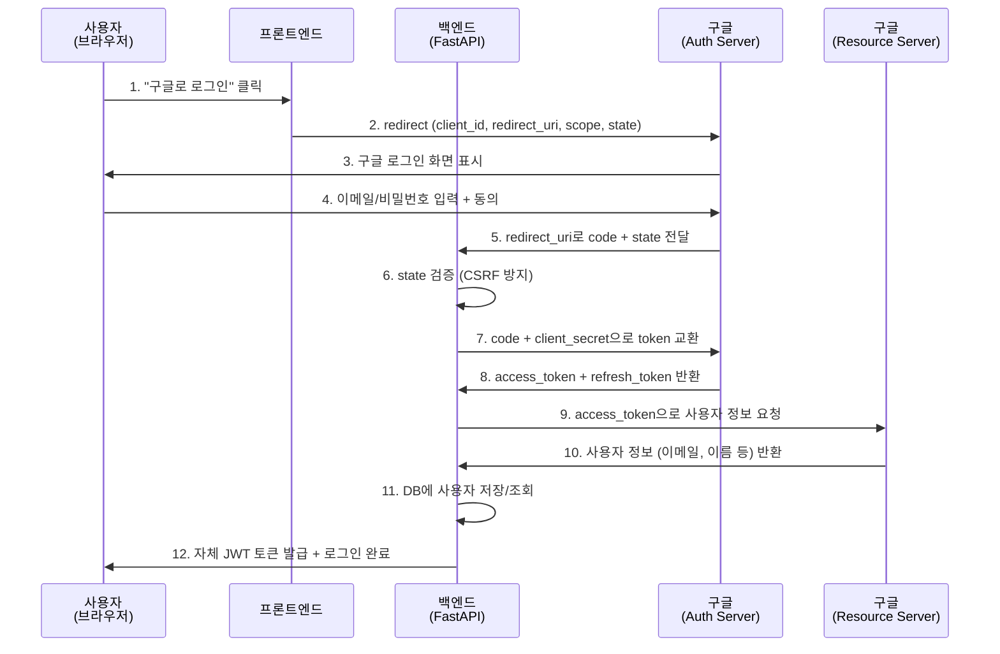
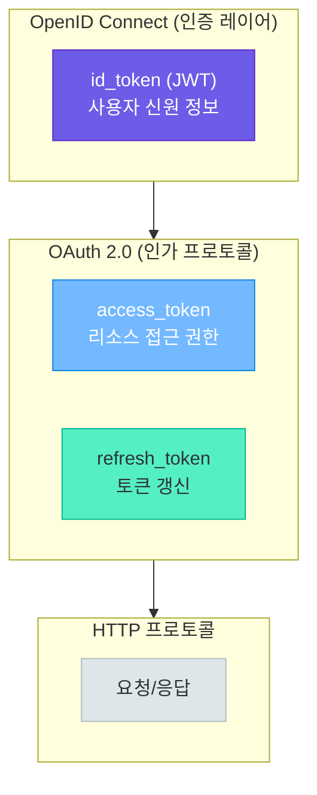
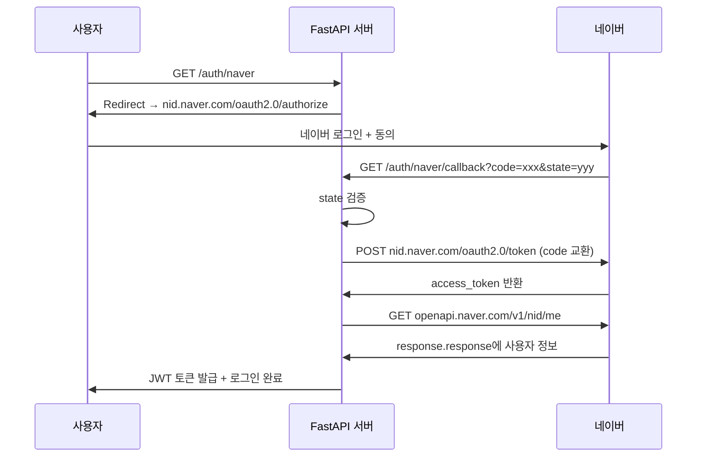
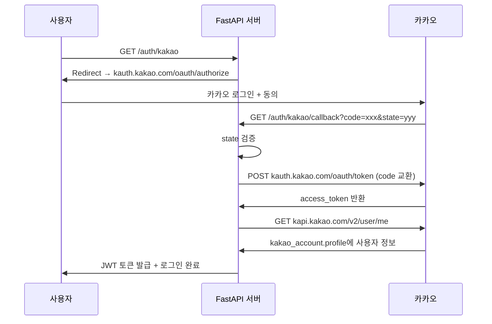
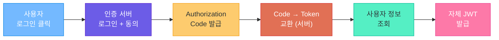

# 소셜 로그인과 OAuth 2.0

> "내가 직접 비밀번호를 관리하지 않아도 된다" — OAuth 2.0과 OpenID Connect로 구글, 네이버, 카카오 로그인을 구현합니다

---

## 1. 소셜 로그인이란?

### 왜 소셜 로그인인가?

여러분은 새로운 서비스에 가입할 때 어떤 방법을 선호하시나요? 아이디와 비밀번호를 또 하나 만드는 것보다, **"구글로 로그인"** 버튼을 누르는 것이 훨씬 편하지 않나요?

소셜 로그인은 사용자가 이미 가입한 외부 서비스(구글, 네이버, 카카오 등)의 계정을 이용하여 우리 서비스에 로그인하는 방식입니다. 사용자는 새로운 비밀번호를 만들 필요가 없고, 우리는 비밀번호를 직접 관리하지 않아도 됩니다.

| 항목 | 직접 인증 (Direct Auth) | 소셜 로그인 (Social Login) |
|------|------------------------|---------------------------|
| **비밀번호 관리** | 서버에서 직접 저장/관리 (해싱 필수) | 제공자가 관리 (우리는 비밀번호를 모름) |
| **보안 부담** | 높음 (비밀번호 유출 위험) | 낮음 (인증을 위임) |
| **사용자 이탈률** | 높음 (가입 과정이 번거로움) | 낮음 (클릭 2~3번으로 완료) |
| **이메일 인증** | 별도 구현 필요 | 불필요 (이미 인증된 이메일) |
| **구현 난이도** | 중간 (해싱, 토큰, 비밀번호 찾기 등) | 초기 설정 복잡, 이후 간편 |
| **사용자 신뢰** | 서비스에 따라 다름 | 대형 서비스의 보안 인프라 활용 |

### 소셜 로그인의 장점과 단점

| 구분 | 내용 |
|------|------|
| **장점** | 가입 전환율 향상 (간편한 가입 프로세스) |
| | 비밀번호 관리 부담 제거 |
| | 검증된 이메일/프로필 정보 획득 |
| | 대형 서비스의 보안 인프라 활용 |
| **단점** | 외부 서비스 의존성 (장애 시 로그인 불가) |
| | 각 제공자별 API 차이로 구현 복잡 |
| | 사용자 데이터 접근 범위가 제공자에 의해 제한 |
| | 제공자 정책 변경 시 대응 필요 |

### 전체 동작 흐름 (간단 버전)



> **핵심 포인트:** 소셜 로그인의 핵심은 **"인증을 위임하는 것"**입니다. 사용자의 비밀번호는 오직 구글/네이버/카카오만 알고 있으며, 우리 서비스는 "이 사람이 누구인지"에 대한 정보만 전달받습니다.

---

## 2. OAuth 2.0 이해하기

### OAuth 2.0이란?

OAuth 2.0은 **권한 위임(Authorization Delegation) 프로토콜**입니다. 사용자가 자신의 데이터에 대한 접근 권한을 제3자 애플리케이션에게 안전하게 위임할 수 있도록 해주는 표준입니다.

쉽게 비유하면, **호텔 카드키**와 같습니다.

```
호텔 카드키 비유
━━━━━━━━━━━━━━━━━━━━━━━━━━━━━━━━━━━━━━━━━━━━━━━━━━━━━━
마스터키 = 비밀번호 (모든 방에 접근 가능, 절대 남에게 주면 안 됨)
카드키   = Access Token (특정 방만 접근 가능, 유효기간 있음)
━━━━━━━━━━━━━━━━━━━━━━━━━━━━━━━━━━━━━━━━━━━━━━━━━━━━━━
```

### OAuth 2.0의 4가지 역할



| 역할 | 설명 | 소셜 로그인에서의 예 |
|------|------|---------------------|
| **Resource Owner** | 데이터의 실제 주인 | 구글 계정을 가진 사용자 |
| **Client** | 사용자 데이터에 접근하려는 앱 | 우리가 만드는 FastAPI 서비스 |
| **Authorization Server** | 사용자 인증 및 토큰 발급 | accounts.google.com |
| **Resource Server** | 보호된 리소스 보관 | googleapis.com/userinfo |

### Authorization Code Grant 흐름

소셜 로그인에서 사용하는 **Authorization Code Grant**는 가장 안전한 방식입니다. 비밀 키(client_secret)가 서버에만 존재하기 때문에 보안성이 높습니다.



### OAuth 2.0 Grant Types 비교

| Grant Type | 사용 사례 | 보안 수준 | 설명 |
|-----------|----------|----------|------|
| **Authorization Code** | 서버 사이드 앱 | 높음 | code를 받아 서버에서 token 교환 |
| **Authorization Code + PKCE** | SPA, 모바일 앱 | 높음 | code_verifier로 추가 보안 |
| **Implicit** (비권장) | 구형 SPA | 낮음 | token이 URL에 직접 노출 |
| **Client Credentials** | 서버 간 통신 | 높음 | 사용자 개입 없이 서버끼리 인증 |

> **핵심 포인트:** 소셜 로그인에는 **Authorization Code Grant**를 사용합니다. 핵심은 "code → token 교환은 서버에서"라는 원칙입니다. Implicit 방식은 보안 문제로 더 이상 권장되지 않습니다.

---

## 3. OpenID Connect (OIDC)

### OAuth 2.0 vs OIDC

- **OAuth 2.0** = **인가(Authorization)** — "이 앱이 당신의 데이터에 접근해도 되나요?"
- **OIDC** = **인증(Authentication)** — "당신은 누구인가요?"

OIDC(OpenID Connect)는 OAuth 2.0 **위에 쌓은 신원 확인 레이어**입니다. OAuth 2.0만으로는 "사용자가 누구인지"를 표준적으로 알 수 없었기 때문에, OIDC가 id_token이라는 표준을 추가한 것입니다.



### ID Token과 JWT

OIDC는 access_token과 별도로 **id_token**을 제공합니다. 이 id_token은 **JWT(JSON Web Token)** 형식입니다.

```
JWT 구조: Header.Payload.Signature
━━━━━━━━━━━━━━━━━━━━━━━━━━━━━━━━━━━━━━━━━━━━━━━━━━━━━━
eyJhbGciOiJSUzI1NiJ9.eyJzdWIiOiIxMjM0NSJ9.SflKxwRJ...
|    알고리즘 정보    | . |   사용자 정보    | . |  서명  |
```

id_token Payload 디코딩 예시:

```json
{
  "iss": "https://accounts.google.com",
  "sub": "110248495921338986420",
  "aud": "our-client-id.apps.googleusercontent.com",
  "email": "user@gmail.com",
  "name": "홍길동",
  "picture": "https://lh3.googleusercontent.com/...",
  "iat": 1714000000,
  "exp": 1714003600
}
```

| 필드 | 의미 |
|------|------|
| `iss` | 토큰 발급자 (issuer) |
| `sub` | 사용자 고유 식별자 (subject) |
| `aud` | 토큰 대상 (audience, 우리 client_id) |
| `email` | 사용자 이메일 |
| `iat` / `exp` | 발급 시각 / 만료 시각 |

### Scope 비교

| Scope | 설명 | 제공 정보 |
|-------|------|----------|
| `openid` | OIDC 필수 scope | sub (사용자 고유 ID) |
| `profile` | 기본 프로필 | 이름, 프로필 사진 |
| `email` | 이메일 | 이메일 주소, 인증 여부 |
| **구글** `googleapis.com/auth/calendar` | 구글 캘린더 | 일정 읽기/쓰기 |
| **네이버** `nickname` | 네이버 닉네임 | 닉네임 |
| **카카오** `account_email` | 카카오 이메일 | 이메일 주소 |

> **핵심 포인트:** OAuth 2.0은 "접근 권한 위임", OIDC는 "사용자 신원 확인"입니다. 구글은 OIDC를 완벽히 지원하며, 네이버와 카카오는 OAuth 2.0 기반으로 자체 프로필 API를 제공합니다.

---

## 4. 구글 소셜 로그인 구현

### Step 1: Google Cloud Console 설정

```
Google Cloud Console 설정 단계
━━━━━━━━━━━━━━━━━━━━━━━━━━━━━━━━━━━━━━━━━━━━━━━━━━━━━━━━━
1. https://console.cloud.google.com 접속
2. 프로젝트 생성 → 이름: my-social-login
3. OAuth 동의 화면 설정 (APIs & Services > OAuth consent screen)
   - User Type: 외부(External)
   - 범위: email, profile, openid
4. OAuth 2.0 클라이언트 ID 생성 (APIs & Services > Credentials)
   - 유형: 웹 애플리케이션
   - 승인된 리디렉션 URI: http://localhost:8000/auth/google/callback
5. Client ID와 Client Secret 복사 → .env에 저장
━━━━━━━━━━━━━━━━━━━━━━━━━━━━━━━━━━━━━━━━━━━━━━━━━━━━━━━━━
```

### Step 2: 프로젝트 구조

```
social-login/
├── main.py              # FastAPI 앱 엔트리포인트
├── config.py            # OAuth 설정 (Pydantic Settings)
├── routers/
│   └── auth.py          # 인증 라우터 엔드포인트
├── services/
│   └── oauth_service.py # OAuth 로직 (제공자별 구현)
├── models/
│   └── schemas.py       # Pydantic 모델
├── requirements.txt
└── .env                 # 환경 변수 (비밀 정보)
```

### Step 3: 설정 및 의존성

```bash
pip install fastapi uvicorn httpx python-jose[cryptography] python-dotenv pydantic-settings
```

```bash
# .env — 절대 Git에 커밋하지 마세요!
GOOGLE_CLIENT_ID=your-google-client-id.apps.googleusercontent.com
GOOGLE_CLIENT_SECRET=your-google-client-secret
GOOGLE_REDIRECT_URI=http://localhost:8000/auth/google/callback
SECRET_KEY=your-jwt-secret-key-change-this-in-production
```

```python
# config.py
from pydantic_settings import BaseSettings


class Settings(BaseSettings):
    google_client_id: str
    google_client_secret: str
    google_redirect_uri: str = "http://localhost:8000/auth/google/callback"
    secret_key: str = "change-this-in-production"
    algorithm: str = "HS256"
    access_token_expire_minutes: int = 60

    class Config:
        env_file = ".env"

settings = Settings()
```

```python
# models/schemas.py
from pydantic import BaseModel
from typing import Optional


class SocialUserInfo(BaseModel):
    """소셜 로그인으로 받은 사용자 정보"""
    provider: str           # google, naver, kakao
    provider_id: str        # 제공자별 고유 사용자 ID
    email: Optional[str] = None
    name: Optional[str] = None
    profile_image: Optional[str] = None


class TokenResponse(BaseModel):
    """우리 서비스의 JWT 토큰 응답"""
    access_token: str
    token_type: str = "bearer"
    user_info: SocialUserInfo
```

### Step 4: Google OAuth 서비스 구현

```python
# services/oauth_service.py — 구글 OAuth 로직
import httpx
from urllib.parse import urlencode
from config import settings
from models.schemas import SocialUserInfo

GOOGLE_AUTH_URL = "https://accounts.google.com/o/oauth2/v2/auth"
GOOGLE_TOKEN_URL = "https://oauth2.googleapis.com/token"
GOOGLE_USERINFO_URL = "https://www.googleapis.com/oauth2/v2/userinfo"


def get_google_login_url(state: str) -> str:
    """구글 로그인 페이지 URL을 생성합니다."""
    params = {
        "client_id": settings.google_client_id,
        "redirect_uri": settings.google_redirect_uri,
        "response_type": "code",
        "scope": "openid email profile",
        "state": state,
        "access_type": "offline",
        "prompt": "consent",
    }
    return f"{GOOGLE_AUTH_URL}?{urlencode(params)}"


async def get_google_token(code: str) -> dict:
    """Authorization code를 access_token으로 교환합니다."""
    async with httpx.AsyncClient() as client:
        response = await client.post(GOOGLE_TOKEN_URL, data={
            "code": code,
            "client_id": settings.google_client_id,
            "client_secret": settings.google_client_secret,
            "redirect_uri": settings.google_redirect_uri,
            "grant_type": "authorization_code",
        })
        response.raise_for_status()
        return response.json()


async def get_google_user_info(access_token: str) -> SocialUserInfo:
    """access_token으로 구글 사용자 정보를 조회합니다."""
    async with httpx.AsyncClient() as client:
        response = await client.get(
            GOOGLE_USERINFO_URL,
            headers={"Authorization": f"Bearer {access_token}"},
        )
        response.raise_for_status()
        data = response.json()
    return SocialUserInfo(
        provider="google", provider_id=data["id"],
        email=data.get("email"), name=data.get("name"),
        profile_image=data.get("picture"),
    )
```

### Step 5: 인증 라우터 구현

```python
# routers/auth.py
import secrets
from datetime import datetime, timedelta, timezone
from fastapi import APIRouter, HTTPException
from fastapi.responses import RedirectResponse
from jose import jwt
from config import settings
from models.schemas import TokenResponse
from services.oauth_service import (
    get_google_login_url, get_google_token, get_google_user_info,
)

router = APIRouter(prefix="/auth", tags=["auth"])
_state_store: dict[str, bool] = {}  # 프로덕션에서는 Redis 사용


def create_jwt_token(user_info: dict) -> str:
    payload = {
        **user_info,
        "exp": datetime.now(timezone.utc) + timedelta(
            minutes=settings.access_token_expire_minutes
        ),
        "iat": datetime.now(timezone.utc),
    }
    return jwt.encode(payload, settings.secret_key, algorithm=settings.algorithm)


@router.get("/google")
async def google_login():
    """구글 로그인 페이지로 리다이렉트합니다."""
    state = secrets.token_urlsafe(32)
    _state_store[state] = True
    return RedirectResponse(url=get_google_login_url(state))


@router.get("/google/callback")
async def google_callback(code: str, state: str):
    """구글 로그인 콜백을 처리합니다."""
    if state not in _state_store:
        raise HTTPException(status_code=400, detail="Invalid state parameter")
    del _state_store[state]

    token_data = await get_google_token(code)
    user_info = await get_google_user_info(token_data["access_token"])
    jwt_token = create_jwt_token(user_info.model_dump())
    return TokenResponse(access_token=jwt_token, user_info=user_info)
```

### Step 6: 사용자 정보 처리 (DB 저장)

```python
# services/user_service.py (개념 예시)
async def get_or_create_user(user_info: SocialUserInfo) -> dict:
    """소셜 로그인 정보로 사용자를 조회하거나 새로 생성합니다."""
    existing_user = await db.find_one({
        "provider": user_info.provider,
        "provider_id": user_info.provider_id,
    })
    if existing_user:
        await db.update_one(
            {"_id": existing_user["_id"]},
            {"$set": {"name": user_info.name, "last_login": datetime.now(timezone.utc)}},
        )
        return existing_user

    new_user = {
        "provider": user_info.provider,
        "provider_id": user_info.provider_id,
        "email": user_info.email,
        "name": user_info.name,
        "created_at": datetime.now(timezone.utc),
    }
    await db.insert_one(new_user)
    return new_user
```

> **핵심 포인트:** 소셜 로그인에서 사용자를 식별하는 키는 **provider + provider_id** 조합입니다. 같은 이메일이라도 구글과 네이버에서 다른 provider_id를 가지므로, 이 조합으로 고유하게 식별해야 합니다.

---

## 5. 네이버 소셜 로그인 구현

### Step 1: 네이버 개발자 센터 설정

```
네이버 개발자 센터 설정 단계
━━━━━━━━━━━━━━━━━━━━━━━━━━━━━━━━━━━━━━━━━━━━━━━━━━━━━━━━━
1. https://developers.naver.com 접속 후 로그인
2. Application > 애플리케이션 등록
   - 사용 API: 네이버 로그인
   - 제공 정보: 회원이름, 이메일, 프로필 사진, 별명
3. 환경 추가: PC 웹
   - 서비스 URL: http://localhost:8000
   - Callback URL: http://localhost:8000/auth/naver/callback
4. Client ID와 Client Secret 복사 → .env에 추가
━━━━━━━━━━━━━━━━━━━━━━━━━━━━━━━━━━━━━━━━━━━━━━━━━━━━━━━━━
```

### Step 2: 네이버 OAuth 구현

```python
# services/oauth_service.py (네이버 추가)
NAVER_AUTH_URL = "https://nid.naver.com/oauth2.0/authorize"
NAVER_TOKEN_URL = "https://nid.naver.com/oauth2.0/token"
NAVER_USERINFO_URL = "https://openapi.naver.com/v1/nid/me"


def get_naver_login_url(state: str) -> str:
    params = {
        "client_id": settings.naver_client_id,
        "redirect_uri": settings.naver_redirect_uri,
        "response_type": "code",
        "state": state,
    }
    return f"{NAVER_AUTH_URL}?{urlencode(params)}"


async def get_naver_token(code: str, state: str) -> dict:
    async with httpx.AsyncClient() as client:
        response = await client.post(NAVER_TOKEN_URL, data={
            "grant_type": "authorization_code",
            "client_id": settings.naver_client_id,
            "client_secret": settings.naver_client_secret,
            "code": code,
            "state": state,
        })
        response.raise_for_status()
        return response.json()


async def get_naver_user_info(access_token: str) -> SocialUserInfo:
    async with httpx.AsyncClient() as client:
        response = await client.get(
            NAVER_USERINFO_URL,
            headers={"Authorization": f"Bearer {access_token}"},
        )
        response.raise_for_status()
        data = response.json()
    # 네이버 특이점: response.response 안에 실제 데이터가 있음!
    profile = data["response"]
    return SocialUserInfo(
        provider="naver", provider_id=profile["id"],
        email=profile.get("email"), name=profile.get("name"),
        profile_image=profile.get("profile_image"),
    )
```

### 네이버 API 응답 구조

네이버 API의 특이점은 **`response` 안에 또 `response`**가 있다는 것입니다.

```json
{
  "resultcode": "00",
  "message": "success",
  "response": {
    "id": "32742776",
    "nickname": "홍길동",
    "name": "홍길동",
    "email": "user@naver.com",
    "gender": "M",
    "age": "30-39",
    "profile_image": "https://ssl.pstatic.net/static/...",
    "mobile": "010-1234-5678"
  }
}
```

### 시퀀스 다이어그램: 네이버 로그인 전체 흐름



---

## 6. 카카오 소셜 로그인 구현

### Step 1: 카카오 개발자 센터 설정

```
카카오 개발자 센터 설정 단계
━━━━━━━━━━━━━━━━━━━━━━━━━━━━━━━━━━━━━━━━━━━━━━━━━━━━━━━━━
1. https://developers.kakao.com 접속 후 로그인
2. 내 애플리케이션 > 애플리케이션 추가하기
3. 카카오 로그인 활성화 (제품 설정 > 카카오 로그인)
   - Redirect URI: http://localhost:8000/auth/kakao/callback
4. 동의항목 설정: 닉네임(필수), 프로필 사진(선택), 이메일(선택)
5. 앱 키에서 REST API 키 복사 → .env에 추가
   (REST API 키가 Client ID 역할, Client Secret은 선택사항)
━━━━━━━━━━━━━━━━━━━━━━━━━━━━━━━━━━━━━━━━━━━━━━━━━━━━━━━━━
```

### Step 2: 카카오 OAuth 구현

```python
# services/oauth_service.py (카카오 추가)
KAKAO_AUTH_URL = "https://kauth.kakao.com/oauth/authorize"
KAKAO_TOKEN_URL = "https://kauth.kakao.com/oauth/token"
KAKAO_USERINFO_URL = "https://kapi.kakao.com/v2/user/me"


def get_kakao_login_url(state: str) -> str:
    params = {
        "client_id": settings.kakao_client_id,
        "redirect_uri": settings.kakao_redirect_uri,
        "response_type": "code",
        "state": state,
    }
    return f"{KAKAO_AUTH_URL}?{urlencode(params)}"


async def get_kakao_token(code: str) -> dict:
    async with httpx.AsyncClient() as client:
        response = await client.post(KAKAO_TOKEN_URL, data={
            "grant_type": "authorization_code",
            "client_id": settings.kakao_client_id,
            "client_secret": settings.kakao_client_secret,
            "redirect_uri": settings.kakao_redirect_uri,
            "code": code,
        }, headers={"Content-Type": "application/x-www-form-urlencoded"})
        response.raise_for_status()
        return response.json()


async def get_kakao_user_info(access_token: str) -> SocialUserInfo:
    async with httpx.AsyncClient() as client:
        response = await client.get(
            KAKAO_USERINFO_URL,
            headers={"Authorization": f"Bearer {access_token}"},
        )
        response.raise_for_status()
        data = response.json()
    # 카카오 특이점: kakao_account 안에 profile 데이터가 있음!
    kakao_account = data.get("kakao_account", {})
    profile = kakao_account.get("profile", {})
    return SocialUserInfo(
        provider="kakao", provider_id=str(data["id"]),  # 숫자 ID → str
        email=kakao_account.get("email"), name=profile.get("nickname"),
        profile_image=profile.get("profile_image_url"),
    )
```

### 카카오 API 응답 구조

카카오의 사용자 정보 응답은 중첩이 깊습니다. `kakao_account` 안에 `profile`이 있는 구조에 주의하세요.

```json
{
  "id": 1234567890,
  "connected_at": "2024-01-15T10:30:00Z",
  "kakao_account": {
    "profile": {
      "nickname": "홍길동",
      "profile_image_url": "https://k.kakaocdn.net/.../img_640x640.jpg",
      "is_default_image": false
    },
    "has_email": true,
    "is_email_valid": true,
    "is_email_verified": true,
    "email": "user@kakao.com"
  }
}
```

### 시퀀스 다이어그램: 카카오 로그인 전체 흐름



---

## 7. 통합 소셜 로그인 서비스

### 3개 제공자 비교표

| 항목 | Google | Naver | Kakao |
|------|--------|-------|-------|
| **Auth URL** | accounts.google.com/o/oauth2/v2/auth | nid.naver.com/oauth2.0/authorize | kauth.kakao.com/oauth/authorize |
| **Token URL** | oauth2.googleapis.com/token | nid.naver.com/oauth2.0/token | kauth.kakao.com/oauth/token |
| **UserInfo URL** | googleapis.com/oauth2/v2/userinfo | openapi.naver.com/v1/nid/me | kapi.kakao.com/v2/user/me |
| **OIDC 지원** | 완전 지원 (id_token) | 미지원 | 부분 지원 |
| **응답 구조** | 단순 (flat) | response.response 중첩 | kakao_account.profile 중첩 |
| **ID 타입** | 문자열 | 문자열 | 숫자 (str 변환 필요) |

### 통합 OAuth 서비스 구현

3개의 제공자를 **전략 패턴(Strategy Pattern)**으로 통합합니다.

```python
# services/oauth_service.py (통합 버전)
import httpx
from enum import Enum
from urllib.parse import urlencode
from abc import ABC, abstractmethod
from config import settings
from models.schemas import SocialUserInfo


class OAuthProvider(str, Enum):
    GOOGLE = "google"
    NAVER = "naver"
    KAKAO = "kakao"


class BaseOAuthService(ABC):
    """소셜 로그인 서비스의 공통 인터페이스"""

    @abstractmethod
    def get_login_url(self, state: str) -> str: ...

    @abstractmethod
    async def get_token(self, code: str, **kwargs) -> dict: ...

    @abstractmethod
    async def get_user_info(self, access_token: str) -> SocialUserInfo: ...

    async def authenticate(self, code: str, **kwargs) -> SocialUserInfo:
        """code → token → user_info 전체 흐름을 실행합니다."""
        token_data = await self.get_token(code, **kwargs)
        return await self.get_user_info(token_data["access_token"])


class GoogleOAuthService(BaseOAuthService):
    AUTH_URL = "https://accounts.google.com/o/oauth2/v2/auth"
    TOKEN_URL = "https://oauth2.googleapis.com/token"
    USERINFO_URL = "https://www.googleapis.com/oauth2/v2/userinfo"

    def get_login_url(self, state: str) -> str:
        params = {
            "client_id": settings.google_client_id,
            "redirect_uri": settings.google_redirect_uri,
            "response_type": "code", "scope": "openid email profile",
            "state": state, "access_type": "offline", "prompt": "consent",
        }
        return f"{self.AUTH_URL}?{urlencode(params)}"

    async def get_token(self, code: str, **kwargs) -> dict:
        async with httpx.AsyncClient() as client:
            resp = await client.post(self.TOKEN_URL, data={
                "code": code, "client_id": settings.google_client_id,
                "client_secret": settings.google_client_secret,
                "redirect_uri": settings.google_redirect_uri,
                "grant_type": "authorization_code",
            })
            resp.raise_for_status()
            return resp.json()

    async def get_user_info(self, access_token: str) -> SocialUserInfo:
        async with httpx.AsyncClient() as client:
            resp = await client.get(self.USERINFO_URL,
                headers={"Authorization": f"Bearer {access_token}"})
            resp.raise_for_status()
            data = resp.json()
        return SocialUserInfo(
            provider="google", provider_id=data["id"],
            email=data.get("email"), name=data.get("name"),
            profile_image=data.get("picture"),
        )


class NaverOAuthService(BaseOAuthService):
    AUTH_URL = "https://nid.naver.com/oauth2.0/authorize"
    TOKEN_URL = "https://nid.naver.com/oauth2.0/token"
    USERINFO_URL = "https://openapi.naver.com/v1/nid/me"

    def get_login_url(self, state: str) -> str:
        params = {
            "client_id": settings.naver_client_id,
            "redirect_uri": settings.naver_redirect_uri,
            "response_type": "code", "state": state,
        }
        return f"{self.AUTH_URL}?{urlencode(params)}"

    async def get_token(self, code: str, **kwargs) -> dict:
        async with httpx.AsyncClient() as client:
            resp = await client.post(self.TOKEN_URL, data={
                "grant_type": "authorization_code",
                "client_id": settings.naver_client_id,
                "client_secret": settings.naver_client_secret,
                "code": code, "state": kwargs.get("state", ""),
            })
            resp.raise_for_status()
            return resp.json()

    async def get_user_info(self, access_token: str) -> SocialUserInfo:
        async with httpx.AsyncClient() as client:
            resp = await client.get(self.USERINFO_URL,
                headers={"Authorization": f"Bearer {access_token}"})
            resp.raise_for_status()
            profile = resp.json()["response"]
        return SocialUserInfo(
            provider="naver", provider_id=profile["id"],
            email=profile.get("email"), name=profile.get("name"),
            profile_image=profile.get("profile_image"),
        )


class KakaoOAuthService(BaseOAuthService):
    AUTH_URL = "https://kauth.kakao.com/oauth/authorize"
    TOKEN_URL = "https://kauth.kakao.com/oauth/token"
    USERINFO_URL = "https://kapi.kakao.com/v2/user/me"

    def get_login_url(self, state: str) -> str:
        params = {
            "client_id": settings.kakao_client_id,
            "redirect_uri": settings.kakao_redirect_uri,
            "response_type": "code", "state": state,
        }
        return f"{self.AUTH_URL}?{urlencode(params)}"

    async def get_token(self, code: str, **kwargs) -> dict:
        async with httpx.AsyncClient() as client:
            resp = await client.post(self.TOKEN_URL, data={
                "grant_type": "authorization_code",
                "client_id": settings.kakao_client_id,
                "client_secret": settings.kakao_client_secret,
                "redirect_uri": settings.kakao_redirect_uri, "code": code,
            }, headers={"Content-Type": "application/x-www-form-urlencoded"})
            resp.raise_for_status()
            return resp.json()

    async def get_user_info(self, access_token: str) -> SocialUserInfo:
        async with httpx.AsyncClient() as client:
            resp = await client.get(self.USERINFO_URL,
                headers={"Authorization": f"Bearer {access_token}"})
            resp.raise_for_status()
            data = resp.json()
        acct = data.get("kakao_account", {})
        profile = acct.get("profile", {})
        return SocialUserInfo(
            provider="kakao", provider_id=str(data["id"]),
            email=acct.get("email"), name=profile.get("nickname"),
            profile_image=profile.get("profile_image_url"),
        )


def get_oauth_service(provider: OAuthProvider) -> BaseOAuthService:
    """제공자에 맞는 OAuth 서비스 인스턴스를 반환합니다."""
    services = {
        OAuthProvider.GOOGLE: GoogleOAuthService,
        OAuthProvider.NAVER: NaverOAuthService,
        OAuthProvider.KAKAO: KakaoOAuthService,
    }
    service_class = services.get(provider)
    if not service_class:
        raise ValueError(f"지원하지 않는 OAuth 제공자: {provider}")
    return service_class()
```

### 통합 라우터

3개의 제공자를 **하나의 라우터**로 통합합니다. `{provider}` 경로 파라미터로 어떤 제공자든 동일한 코드로 처리합니다.

```python
# routers/auth.py (통합 버전)
import secrets
from datetime import datetime, timedelta, timezone
from fastapi import APIRouter, HTTPException
from fastapi.responses import RedirectResponse
from jose import jwt
from config import settings
from models.schemas import TokenResponse
from services.oauth_service import OAuthProvider, get_oauth_service

router = APIRouter(prefix="/auth", tags=["auth"])
_state_store: dict[str, str] = {}  # state → provider 매핑


def create_jwt_token(user_info: dict) -> str:
    payload = {
        **user_info,
        "exp": datetime.now(timezone.utc) + timedelta(
            minutes=settings.access_token_expire_minutes),
        "iat": datetime.now(timezone.utc),
    }
    return jwt.encode(payload, settings.secret_key, algorithm=settings.algorithm)


@router.get("/{provider}")
async def social_login(provider: OAuthProvider):
    """소셜 로그인 페이지로 리다이렉트합니다."""
    state = secrets.token_urlsafe(32)
    _state_store[state] = provider.value
    oauth_service = get_oauth_service(provider)
    return RedirectResponse(url=oauth_service.get_login_url(state))


@router.get("/{provider}/callback")
async def social_callback(provider: OAuthProvider, code: str, state: str):
    """소셜 로그인 콜백을 처리합니다."""
    if state not in _state_store:
        raise HTTPException(status_code=400, detail="Invalid state parameter")
    stored_provider = _state_store.pop(state)
    if stored_provider != provider.value:
        raise HTTPException(status_code=400, detail="Provider mismatch")

    oauth_service = get_oauth_service(provider)
    user_info = await oauth_service.authenticate(code, state=state)
    jwt_token = create_jwt_token(user_info.model_dump())
    return TokenResponse(access_token=jwt_token, user_info=user_info)
```

### 프론트엔드 로그인 버튼

```python
# main.py
from fastapi import FastAPI
from fastapi.responses import HTMLResponse
from routers.auth import router as auth_router

app = FastAPI(title="소셜 로그인 서비스")
app.include_router(auth_router)


@app.get("/", response_class=HTMLResponse)
async def login_page():
    return """
    <!DOCTYPE html>
    <html lang="ko">
    <head>
        <meta charset="UTF-8">
        <title>소셜 로그인</title>
        <style>
            body { font-family: 'Segoe UI', sans-serif; display: flex;
                   justify-content: center; align-items: center;
                   height: 100vh; background: #f5f6fa; }
            .login-box { background: white; padding: 40px; border-radius: 12px;
                         box-shadow: 0 4px 20px rgba(0,0,0,0.1);
                         text-align: center; width: 360px; }
            h1 { color: #2d3436; margin-bottom: 30px; }
            .btn { display: block; width: 100%; padding: 14px; margin: 10px 0;
                   border: none; border-radius: 8px; font-size: 16px;
                   font-weight: bold; cursor: pointer; color: white;
                   text-decoration: none; text-align: center; }
            .btn-google { background: #4285F4; }
            .btn-naver  { background: #03C75A; }
            .btn-kakao  { background: #FEE500; color: #3C1E1E; }
        </style>
    </head>
    <body>
        <div class="login-box">
            <h1>소셜 로그인</h1>
            <a href="/auth/google" class="btn btn-google">Google로 로그인</a>
            <a href="/auth/naver"  class="btn btn-naver">네이버로 로그인</a>
            <a href="/auth/kakao"  class="btn btn-kakao">카카오로 로그인</a>
        </div>
    </body>
    </html>
    """
```

> **핵심 포인트:** 통합 OAuth 서비스는 **전략 패턴(Strategy Pattern)**을 활용합니다. 공통 인터페이스(`BaseOAuthService`)를 정의하고, 각 제공자가 이를 구현합니다. 새로운 제공자(예: Apple, GitHub)를 추가할 때는 새로운 클래스를 만들고 팩토리에 등록하기만 하면 됩니다.

---

## 8. 보안 고려사항

### state 파라미터 (CSRF 방지)

**state 파라미터**는 CSRF(Cross-Site Request Forgery) 공격을 방지하는 핵심 보안 장치입니다.

```python
import secrets

# 1. 로그인 요청 시: state 생성 및 저장
state = secrets.token_urlsafe(32)
await redis.setex(f"oauth_state:{state}", 300, "valid")  # 5분 TTL

# 2. 콜백 시: state 검증
stored = await redis.get(f"oauth_state:{state}")
if not stored:
    raise HTTPException(status_code=400, detail="Invalid or expired state")
await redis.delete(f"oauth_state:{state}")  # 사용 후 즉시 삭제
```

```
CSRF 공격 시나리오 (state 없을 때)
━━━━━━━━━━━━━━━━━━━━━━━━━━━━━━━━━━━━━━━━━━━━━━━━━━━━━━
1. 공격자가 자신의 구글 계정으로 authorization code를 받음
2. 이 code가 포함된 콜백 URL을 피해자에게 전송
3. 피해자가 URL을 클릭하면, 공격자의 계정으로 로그인됨
4. 피해자가 입력하는 민감 데이터가 공격자 계정에 연결!
━━━━━━━━━━━━━━━━━━━━━━━━━━━━━━━━━━━━━━━━━━━━━━━━━━━━━━
```

### PKCE (Proof Key for Code Exchange)

PKCE는 SPA나 모바일 앱처럼 client_secret을 안전하게 저장할 수 없는 환경에서 필수입니다.

```python
import hashlib, base64, secrets

def generate_pkce_pair() -> tuple[str, str]:
    """PKCE code_verifier와 code_challenge를 생성합니다."""
    code_verifier = secrets.token_urlsafe(64)
    digest = hashlib.sha256(code_verifier.encode()).digest()
    code_challenge = base64.urlsafe_b64encode(digest).rstrip(b"=").decode()
    return code_verifier, code_challenge

verifier, challenge = generate_pkce_pair()
# Authorization Request에 code_challenge 포함
# Token Exchange에 code_verifier 포함
```

### Token 보안

```python
from fastapi import Response

def set_auth_cookies(response: Response, access_token: str, refresh_token: str):
    """토큰을 httpOnly 쿠키에 안전하게 저장합니다."""
    response.set_cookie(
        key="access_token", value=access_token,
        httponly=True,       # XSS 공격 방지
        secure=True,         # HTTPS에서만 전송
        samesite="lax",      # CSRF 기본 방지
        max_age=3600,        # 1시간
    )
    response.set_cookie(
        key="refresh_token", value=refresh_token,
        httponly=True, secure=True,
        samesite="strict",   # 동일 사이트에서만 전송
        max_age=86400 * 7,   # 7일
        path="/auth/refresh",
    )
```

### 흔한 실수와 방지법

| 실수 | 위험 | 방지법 |
|------|------|--------|
| **redirect_uri 불일치** | 인증 실패 | 등록한 URI와 정확히 일치 (후행 슬래시 주의) |
| **state 파라미터 미검증** | CSRF 공격 가능 | 생성 → 저장 → 검증 → 삭제 |
| **client_secret 프론트 노출** | 비밀 키 탈취 | 서버 사이드에서만 사용, .env로 관리 |
| **access_token localStorage 저장** | XSS 공격 시 탈취 | httpOnly 쿠키 사용 |
| **token 만료 미처리** | 세션 고착 | refresh_token으로 갱신 로직 구현 |
| **HTTPS 미사용** | 중간자 공격 | 프로덕션에서 반드시 HTTPS 적용 |
| **scope 과다 요청** | 사용자 거부 증가 | 필요한 최소 scope만 요청 |

> **핵심 포인트:** 소셜 로그인의 보안은 **state 검증**, **서버 사이드 token 교환**, **httpOnly 쿠키**가 3대 핵심입니다. 이 세 가지만 제대로 지켜도 대부분의 공격을 방지할 수 있습니다.

---

## 9. 핵심 정리

### 소셜 로그인 구현 체크리스트

| 단계 | 항목 | 설명 |
|------|------|------|
| 1 | 개발자 콘솔 등록 | 각 제공자의 개발자 센터에서 앱 등록 |
| 2 | Client ID/Secret 발급 | OAuth 자격 증명 발급 및 .env 저장 |
| 3 | Redirect URI 설정 | 콜백 URL 등록 (정확히 일치해야 함) |
| 4 | 로그인 URL 생성 | client_id, redirect_uri, scope, state 포함 |
| 5 | 콜백 처리 | state 검증 후 code를 token으로 교환 |
| 6 | 사용자 정보 조회 | access_token으로 프로필 API 호출 |
| 7 | DB 저장 | provider + provider_id로 사용자 관리 |
| 8 | 자체 JWT 발급 | 우리 서비스의 인증 토큰 생성 |
| 9 | 보안 점검 | state, HTTPS, httpOnly 쿠키 확인 |

### OAuth 2.0 + OIDC 핵심 흐름



### 제공자별 빠른 참조

| 항목 | Google | Naver | Kakao |
|------|--------|-------|-------|
| **개발자 콘솔** | console.cloud.google.com | developers.naver.com | developers.kakao.com |
| **Auth URL** | accounts.google.com/o/oauth2/v2/auth | nid.naver.com/oauth2.0/authorize | kauth.kakao.com/oauth/authorize |
| **Token URL** | oauth2.googleapis.com/token | nid.naver.com/oauth2.0/token | kauth.kakao.com/oauth/token |
| **UserInfo URL** | googleapis.com/oauth2/v2/userinfo | openapi.naver.com/v1/nid/me | kapi.kakao.com/v2/user/me |
| **사용자 ID 위치** | `data.id` | `data.response.id` | `data.id` |
| **이메일 위치** | `data.email` | `data.response.email` | `data.kakao_account.email` |
| **이름 위치** | `data.name` | `data.response.name` | `data.kakao_account.profile.nickname` |

이 강의에서 배운 핵심 원리를 기억하세요:

1. **OAuth 2.0**은 "비밀번호를 공유하지 않고 권한을 위임하는" 표준 프로토콜입니다
2. **Authorization Code Grant**는 서버 사이드 앱에서 가장 안전한 방식입니다
3. 모든 제공자의 흐름은 동일합니다: **로그인 URL → code → token → 사용자 정보**
4. 제공자마다 **응답 구조**가 다르므로, 파싱 로직에 주의해야 합니다
5. **state 검증**, **서버 사이드 token 교환**, **httpOnly 쿠키**가 보안의 3대 핵심입니다

> **핵심 포인트:** 소셜 로그인은 처음 설정이 번거롭지만, 한 번 구축하면 사용자 경험과 보안 모두를 개선할 수 있습니다. 이 강의에서 만든 통합 OAuth 서비스 패턴을 활용하면, 새로운 제공자를 추가하는 것도 클래스 하나를 만드는 것만큼 간단해집니다.

---

> **이전 강의:** [외부 API 연동 + GPT API 활용](13_external_api_and_gpt.md)
