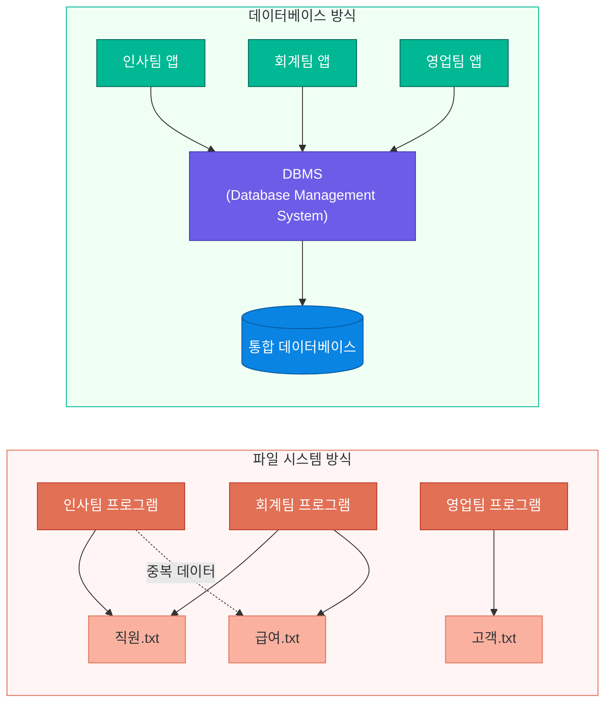
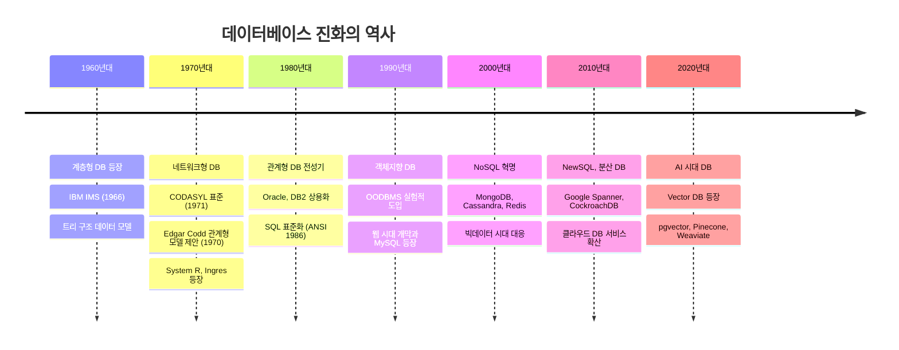
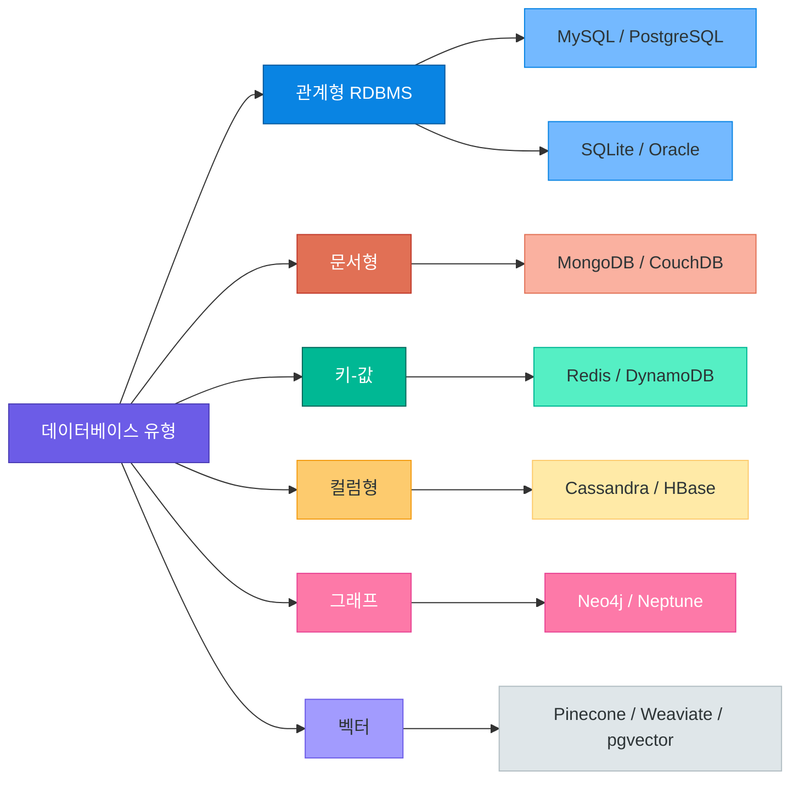
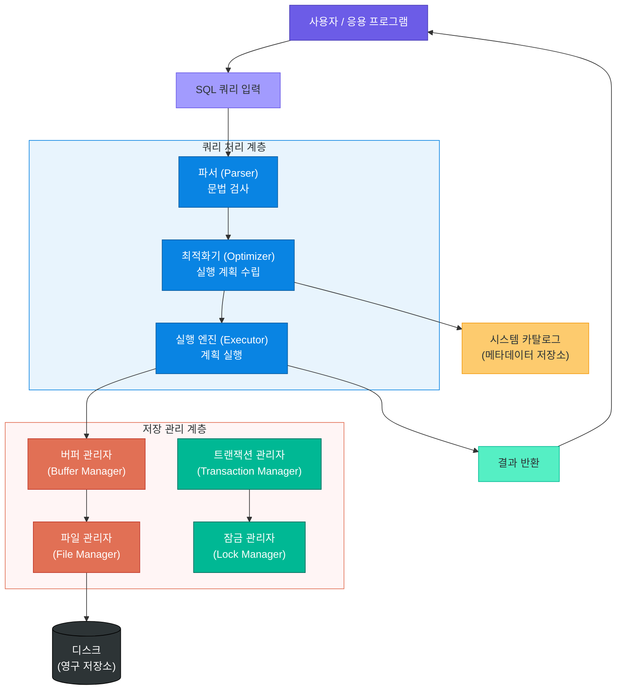
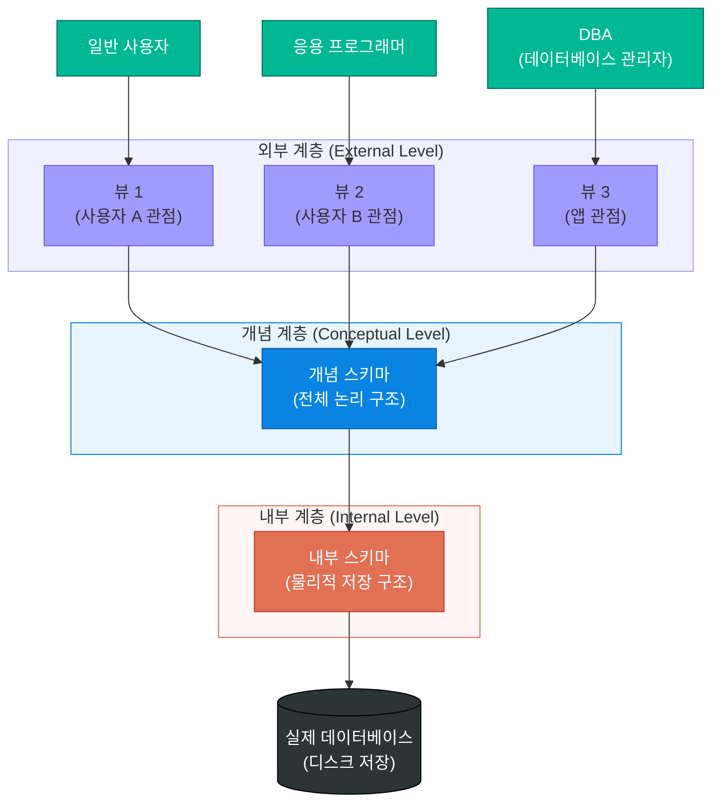
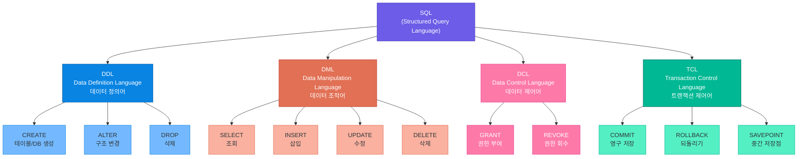
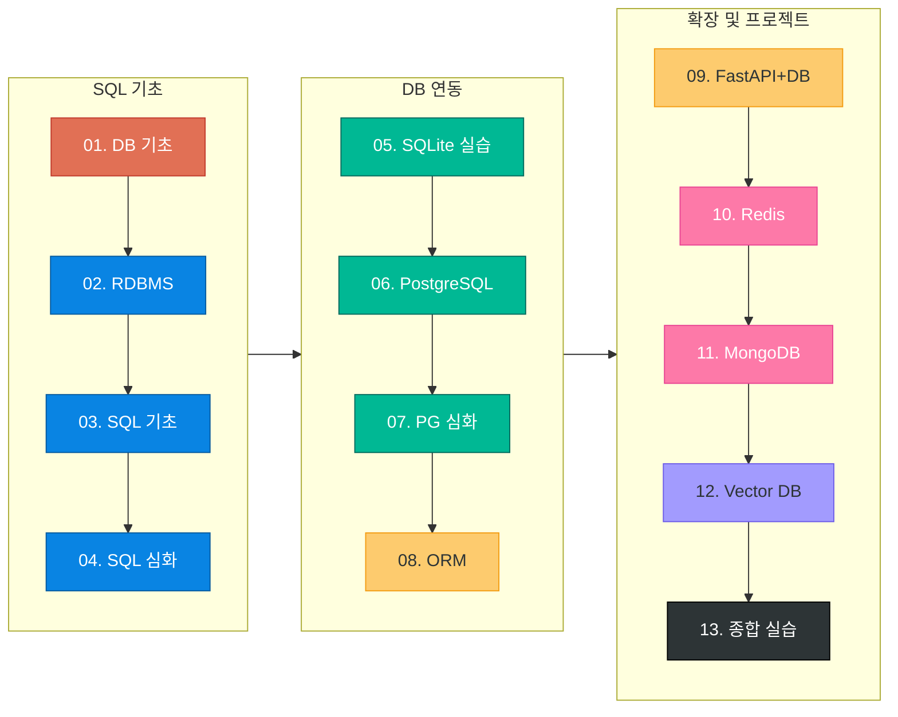

# 데이터베이스 기초 개념

> 데이터는 현대 소프트웨어의 심장이다 — DB의 탄생 배경부터 유형 분류, DBMS 구조까지 체계적으로 이해하여 탄탄한 백엔드 개발의 토대를 마련합니다

---

## 1. 데이터와 데이터베이스의 탄생

### 데이터란 무엇인가

일상에서 우리는 "데이터"와 "정보"라는 단어를 혼용하지만, 컴퓨터 과학에서는 명확히 구분합니다.

**데이터(Data)**는 가공되지 않은 원시 사실입니다. 숫자, 문자, 날짜처럼 그 자체만으로는 의미가 불분명한 값입니다. 반면 **정보(Information)**는 데이터를 특정 맥락에서 처리하고 해석하여 의미를 부여한 결과입니다.

| 구분 | 예시 | 설명 |
|------|------|------|
| 데이터 | `37.5`, `홍길동`, `2024-01-15` | 원시 값, 맥락 없음 |
| 정보 | `홍길동 환자의 2024년 1월 15일 체온은 37.5도` | 맥락과 의미가 부여된 상태 |
| 지식 | `37.5도는 미열이므로 충분한 수분 섭취가 필요하다` | 정보를 바탕으로 한 판단 |

실생활 비유를 들자면, 도서관의 카드 목록함을 생각해 보십시오. 낱장의 카드 하나하나는 데이터입니다. 그 카드들을 저자순, 주제별로 체계적으로 정리하면 정보가 되고, 사서가 "이 분야는 3층에 집중되어 있다"고 파악하면 지식이 됩니다.

### 파일 시스템의 한계

컴퓨터 초창기에는 데이터를 단순한 파일 형태로 관리했습니다. 각 부서(인사팀, 회계팀, 영업팀)가 자체적인 파일을 만들어 사용했는데, 이 방식은 곧 심각한 문제를 드러냈습니다.

**데이터 중복(Data Redundancy):** 인사팀의 직원 파일과 회계팀의 급여 파일에 같은 직원 정보가 중복 저장됩니다. 저장 공간 낭비는 물론, 어느 파일이 최신인지 알 수 없습니다.

**데이터 불일치(Data Inconsistency):** 홍길동 과장이 부장으로 승진했을 때 인사팀 파일은 업데이트했지만 회계팀 파일은 그대로라면, 두 파일의 데이터가 서로 다른 사실을 말하게 됩니다.

**동시 접근 문제(Concurrency Issues):** 두 사람이 동시에 같은 파일을 수정하면 한 사람의 변경 사항이 사라지거나 파일이 손상됩니다.

**데이터 종속성(Data Dependency):** 파일 구조를 바꾸면 그 파일을 사용하는 모든 프로그램을 함께 수정해야 합니다.

### 데이터베이스의 등장 배경

1960년대 미국 항공사 아메리칸 에어라인과 IBM이 항공편 예약 시스템 SABRE를 개발하면서 새로운 접근법이 필요해졌습니다. 수천 개의 단말기에서 동시에 좌석 예약 데이터에 접근해야 했기 때문에, 파일 시스템으로는 도저히 감당할 수 없었습니다.

이 과정에서 **체계적으로 구조화된 데이터 저장소**에 대한 개념이 탄생했습니다. 1960년대 말 찰스 바크만(Charles Bachman)이 최초의 DBMS인 IDS(Integrated Data Store)를 개발했고, 1970년 IBM 연구원 에드가 코드(Edgar F. Codd)가 **관계형 데이터 모델**을 논문으로 제안하면서 현대 데이터베이스의 이론적 토대가 완성되었습니다.

### 파일 시스템의 문제점 정리

파일 시스템 방식이 가져오는 문제들을 구체적인 시나리오로 살펴보겠습니다.

**시나리오: 한 회사의 직원 "이순신"이 서울에서 부산으로 전근을 갑니다.**

```
인사팀 파일:  이순신, 부산 지점, 영업부장  (업데이트 완료)
회계팀 파일:  이순신, 서울 지점, 영업부장  (업데이트 미완료)
복지팀 파일:  이순신, 서울 지점, 영업부장  (업데이트 미완료)
출입 시스템:  이순신, 서울 지점, 영업부장  (업데이트 미완료)
```

이 상황에서 회계팀이 서울 지점 직원 교통비를 정산하면 이순신은 이미 부산에 있는데도 서울 기준으로 계산됩니다. 더 심각한 것은 **어느 파일이 옳은지 판단할 기준이 없다**는 점입니다.

데이터베이스를 사용하면 `직원` 테이블에 단 하나의 레코드만 존재하고, 모든 부서가 같은 레코드를 참조합니다. 인사팀이 주소를 수정하면 즉시 전사적으로 반영됩니다.

### 파일 시스템 vs 데이터베이스



> **핵심 포인트:** 데이터베이스는 파일 시스템의 중복, 불일치, 동시 접근 문제를 해결하기 위해 1960년대에 등장했습니다. 데이터를 중앙에서 통합 관리함으로써 일관성과 효율성을 확보합니다.

---

## 2. 데이터베이스의 진화

### 세대별 데이터베이스의 발전

데이터베이스는 반세기 넘는 시간 동안 끊임없이 진화해 왔습니다. 마치 스마트폰이 벽돌 전화기에서 오늘날의 슈퍼컴퓨터로 발전한 것처럼, DB도 각 시대의 요구에 맞게 변화했습니다.



### 세대별 특징과 대표 제품

**1세대 - 계층형 데이터베이스 (Hierarchical DB)**

데이터를 나무(Tree) 구조로 표현합니다. 부모-자식 관계가 명확하여 계층적 데이터(조직도, 파일 시스템)를 표현하기에 유리하지만, 복잡한 관계를 표현하기 어렵고 탐색 경로가 제한적입니다.

- 대표 제품: IBM IMS(1966), Windows Registry
- 특징: 빠른 읽기 성능, 1:N 관계만 지원, 경직된 구조

**2세대 - 네트워크형 데이터베이스 (Network DB)**

계층형의 한계를 극복하여 M:N 관계를 지원합니다. 데이터 레코드들이 망(Network) 형태로 연결됩니다. 그러나 구조가 복잡하고 프로그래머가 데이터 탐색 경로를 직접 제어해야 하는 부담이 있었습니다.

- 대표 제품: IDMS, IDS
- 특징: M:N 관계 지원, 복잡한 프로그래밍 요구

**3세대 - 관계형 데이터베이스 (Relational DB)**

1970년 Edgar F. Codd가 제안한 수학적 집합론에 기반한 모델입니다. 데이터를 행과 열로 구성된 **테이블(Table)**로 표현하고, SQL이라는 선언적 언어로 데이터를 조작합니다. 프로그래머는 "무엇을 원하는지"만 기술하면 DBMS가 "어떻게 찾을지"를 결정합니다.

- 대표 제품: Oracle, MySQL, PostgreSQL, SQL Server, SQLite
- 특징: 데이터 독립성, SQL 표준, ACID 보장

**4세대 - NoSQL 데이터베이스**

2000년대 후반 구글, 아마존, 페이스북 등 대규모 웹 서비스가 관계형 DB의 한계(수평 확장 어려움, 고정 스키마)에 부딪히면서 등장했습니다. "Not Only SQL"의 약자로, 다양한 데이터 모델과 수평 확장(Scale-out)을 지원합니다.

- 대표 제품: MongoDB, Redis, Cassandra, Neo4j
- 특징: 유연한 스키마, 수평 확장, 최종적 일관성

**5세대 - NewSQL & AI 시대 DB**

관계형 DB의 ACID 보장과 NoSQL의 수평 확장성을 동시에 추구합니다. 또한 생성형 AI 시대에는 벡터 임베딩을 저장하고 유사도 검색을 지원하는 Vector DB가 새롭게 부상했습니다.

- 대표 제품: Google Spanner, CockroachDB, Pinecone, Weaviate
- 특징: 분산 트랜잭션, 벡터 검색, AI 네이티브

> **핵심 포인트:** Edgar F. Codd의 1970년 논문 "A Relational Model of Data for Large Shared Data Banks"는 현대 데이터베이스의 이론적 기초입니다. 관계형 모델은 50년이 지난 지금도 가장 널리 사용되는 데이터베이스 패러다임입니다.

---

## 3. 데이터베이스 유형 분류

### 주요 데이터베이스 유형

오늘날의 데이터베이스는 마치 공구함처럼 다양한 도구를 갖추고 있습니다. 망치로 나사를 조이지 않듯, 데이터의 성격과 사용 패턴에 맞는 DB를 선택해야 합니다.



### 유형별 상세 비교

| 유형 | 데이터 모델 | 스키마 | 강점 | 약점 | 적합 사례 | 대표 제품 |
|------|------------|--------|------|------|-----------|-----------|
| 관계형(RDBMS) | 테이블(행/열) | 고정 | ACID, 복잡한 조인 | 수평 확장 어려움 | 금융, 쇼핑몰, ERP | MySQL, PostgreSQL |
| 문서형(Document) | JSON/BSON 문서 | 유연 | 중첩 구조, 빠른 개발 | 복잡한 관계 표현 어려움 | 블로그, 카탈로그, CMS | MongoDB, CouchDB |
| 키-값(Key-Value) | 키:값 쌍 | 없음 | 초고속 읽기/쓰기 | 복잡한 쿼리 불가 | 캐시, 세션, 실시간 순위 | Redis, DynamoDB |
| 컬럼형(Column-family) | 컬럼 패밀리 | 반유연 | 대용량 쓰기, 수평 확장 | 복잡한 쿼리 제한 | IoT, 로그, 시계열 | Cassandra, HBase |
| 그래프(Graph) | 노드/엣지 | 유연 | 관계 탐색, 최단 경로 | 전체 그래프 집계 어려움 | SNS, 추천 엔진, 지식 그래프 | Neo4j, Neptune |
| 벡터(Vector) | 고차원 벡터 | 유연 | 유사도 검색, AI 연동 | 정확한 일치 검색 비효율 | RAG, 시맨틱 검색, 추천 | Pinecone, pgvector |

### 언제 어떤 DB를 선택해야 하는가

**관계형 DB를 선택할 때:** 데이터 구조가 명확하고 관계가 복잡할 때, 트랜잭션 무결성이 중요할 때(은행 이체, 재고 관리), 복잡한 집계와 조인 쿼리가 필요할 때

**문서형 DB를 선택할 때:** 데이터 구조가 자주 바뀔 때, 중첩된 계층 구조를 그대로 저장하고 싶을 때, 빠른 프로토타이핑이 필요할 때

**키-값 DB를 선택할 때:** 응답 속도가 극도로 중요할 때, 단순 조회/저장이 대부분일 때, 세션이나 캐시를 관리할 때

**그래프 DB를 선택할 때:** 데이터 간의 관계 자체가 핵심 가치일 때, 친구 추천, 사기 탐지, 지식 그래프를 구축할 때

> **핵심 포인트:** "어떤 DB가 최고인가"라는 질문은 "어떤 공구가 최고인가"라는 질문만큼 잘못된 것입니다. 사용 사례, 데이터 특성, 팀의 기술 스택을 종합적으로 고려하여 적합한 DB를 선택해야 합니다. 실제 서비스에서는 여러 유형의 DB를 함께 사용하는 폴리글랏(Polyglot) 전략이 일반적입니다.

---

## 4. DBMS의 개념과 구조

### DBMS란 무엇인가

**DBMS(Database Management System)**는 데이터베이스를 생성, 관리, 조작하는 소프트웨어 시스템입니다. 사용자와 데이터베이스 사이에서 **중개자** 역할을 합니다.

실생활 비유: 도서관을 생각해 보십시오. 책(데이터)은 서고(데이터베이스)에 있습니다. 도서관 사서 시스템(DBMS)이 "소설 중 2020년 이후 출판된 책"을 찾아달라는 요청을 받으면, 어디에 어떤 책이 있는지 파악하고, 적절한 책을 꺼내어 제공하며, 대출 기록을 관리합니다. 이용자는 서고의 물리적 배치를 몰라도 됩니다.

### DBMS의 주요 기능

| 기능 | 설명 | 예시 |
|------|------|------|
| **정의(Definition)** | 데이터 구조(스키마)를 정의하고 관리 | 테이블 생성, 컬럼 추가 |
| **조작(Manipulation)** | 데이터 삽입, 조회, 수정, 삭제 | SELECT, INSERT, UPDATE, DELETE |
| **제어(Control)** | 보안, 무결성, 동시성, 복구 관리 | 트랜잭션, 접근 권한, 백업 |
| **최적화(Optimization)** | 쿼리 실행 계획 수립 및 최적화 | 인덱스 활용, 실행 계획 |

### DBMS 내부 컴포넌트 아키텍처

DBMS는 단일 프로그램이 아니라 여러 서브시스템이 협력하는 복잡한 소프트웨어입니다. 사용자가 SQL을 입력했을 때 내부에서 어떤 일이 일어나는지 살펴봅시다.



**파서(Parser):** SQL 문장이 문법적으로 올바른지 검사하고, 파스 트리(Parse Tree)를 생성합니다. `SELECT * FORM users` 처럼 오타가 있으면 이 단계에서 오류가 발생합니다.

**최적화기(Optimizer):** 동일한 결과를 얻는 여러 방법 중 가장 효율적인 실행 계획을 선택합니다. 인덱스를 사용할지, 테이블을 전체 스캔할지, 조인 순서는 어떻게 할지를 결정합니다. DBMS 성능의 핵심입니다.

**실행 엔진(Executor):** 최적화기가 수립한 계획을 실제로 실행합니다. 버퍼 관리자를 통해 디스크와 메모리 사이의 데이터 이동을 조율합니다.

**트랜잭션 관리자:** ACID 속성을 보장합니다. 여러 연산이 하나의 논리 단위로 처리되도록 하고, 장애 발생 시 원자성을 보장합니다.

**잠금 관리자(Lock Manager):** 동시에 여러 사용자가 같은 데이터에 접근할 때 충돌이 없도록 잠금을 관리합니다. 너무 많은 잠금은 성능 저하를 유발하므로 세밀한 튜닝이 필요합니다.

### DBMS 3계층 아키텍처

1978년 ANSI/SPARC가 제안한 3계층 스키마 아키텍처는 **데이터 독립성**을 달성하기 위한 구조적 틀입니다.



**외부 계층(External Level):** 개별 사용자나 응용 프로그램이 보는 관점입니다. 같은 데이터베이스라도 인사팀은 직원 정보만, 고객은 주문 내역만 볼 수 있도록 **뷰(View)**를 통해 제한된 관점을 제공합니다.

**개념 계층(Conceptual Level):** 데이터베이스 전체의 논리적 구조를 정의합니다. 어떤 테이블이 있고, 컬럼은 무엇이며, 테이블 간 관계는 어떤지를 기술합니다. DBA가 관리하는 영역입니다.

**내부 계층(Internal Level):** 데이터가 실제로 디스크에 어떻게 저장되는지를 정의합니다. 인덱스 구조, 파일 배치, 압축 방식 등 물리적 저장 세부 사항을 다룹니다.

### 데이터 독립성

3계층 구조가 주는 가장 큰 이점은 **데이터 독립성**입니다.

**논리적 독립성(Logical Independence):** 개념 스키마가 변경되어도(테이블 추가, 컬럼 추가) 외부 스키마(애플리케이션)는 영향받지 않습니다. 예를 들어 `사용자` 테이블에 `생년월일` 컬럼을 추가해도, 기존 앱은 수정 없이 계속 동작합니다.

**물리적 독립성(Physical Independence):** 내부 스키마가 변경되어도(HDD에서 SSD로 교체, 인덱스 재구성) 개념 스키마와 외부 스키마는 영향받지 않습니다. 성능 최적화를 위해 저장 구조를 바꾸어도 애플리케이션 코드는 그대로입니다.

### ACID 속성 — 트랜잭션의 4가지 보장

관계형 DBMS가 신뢰받는 핵심 이유 중 하나는 **ACID** 속성입니다. 은행 계좌 이체를 예시로 각 속성을 이해해 보겠습니다.

> **예시:** A 계좌에서 B 계좌로 100만 원을 이체합니다. 이 작업은 두 단계로 이루어집니다.
> 1단계: A 계좌에서 100만 원 차감
> 2단계: B 계좌에 100만 원 추가

| 속성 | 영문 | 의미 | 이체 예시에서 보장하는 것 |
|------|------|------|--------------------------|
| **원자성** | Atomicity | 모두 성공하거나 모두 실패 | 1단계 성공 후 2단계 실패 시, 1단계도 취소됨 |
| **일관성** | Consistency | 트랜잭션 전후 DB는 유효한 상태 | 이체 전후 전체 잔액 합계는 동일 |
| **격리성** | Isolation | 동시 트랜잭션은 서로 간섭하지 않음 | 이체 중에 다른 사람이 조회해도 중간 상태가 보이지 않음 |
| **지속성** | Durability | 커밋된 트랜잭션은 영구 저장 | 서버가 갑자기 꺼져도 이체 내역은 사라지지 않음 |

ACID는 금융, 의료, 전자상거래처럼 데이터 무결성이 절대적으로 중요한 분야에서 필수 요건입니다. 반면 일부 NoSQL DB는 성능과 확장성을 위해 ACID의 일부를 완화한 **BASE(Basically Available, Soft state, Eventually consistent)** 모델을 채택합니다.

> **핵심 포인트:** DBMS의 3계층 구조는 데이터 독립성을 보장하여 유지보수 비용을 크게 줄입니다. 물리적 저장 방식이 바뀌어도 애플리케이션 코드를 수정하지 않아도 되는 것이 핵심 장점입니다. ACID 속성은 데이터 무결성을 보장하는 관계형 DB의 가장 강력한 특징 중 하나입니다.

---

## 5. 데이터베이스 사용자와 언어

### 데이터베이스 사용자 유형

데이터베이스를 사용하는 사람들은 역할에 따라 크게 세 유형으로 나뉩니다. 마치 도로를 사용하는 사람이 교통 공무원(설계/관리), 택시 기사(전문 운전), 일반 운전자(일상 이용)로 나뉘는 것처럼 말입니다.

| 사용자 유형 | 역할 | 주요 작업 | 사용 인터페이스 |
|-------------|------|-----------|----------------|
| **DBA (데이터베이스 관리자)** | DB 전체 설계 및 운영 | 스키마 정의, 성능 튜닝, 백업/복구, 권한 관리 | SQL, 관리 도구 |
| **응용 프로그래머** | DB를 활용하는 앱 개발 | SQL 작성, ORM 활용, API 개발 | SQL, ORM, SDK |
| **최종 사용자** | 완성된 앱을 통해 DB 이용 | 데이터 조회, 입력, 수정 | UI, 폼, 대시보드 |

### SQL 언어 분류

SQL(Structured Query Language)은 관계형 DB를 다루는 표준 언어입니다. 목적에 따라 4가지로 분류됩니다.



**DDL(Data Definition Language):** 데이터베이스 구조(스키마)를 정의하는 언어입니다. 테이블을 만들거나(`CREATE`), 컬럼을 추가하거나(`ALTER`), 테이블을 삭제(`DROP`)합니다. DDL 명령은 자동으로 커밋(영구 저장)됩니다.

**DML(Data Manipulation Language):** 데이터 자체를 다루는 언어입니다. 데이터를 조회(`SELECT`)하고, 추가(`INSERT`)하고, 수정(`UPDATE`)하고, 삭제(`DELETE`)합니다. 실무에서 가장 빈번하게 사용하는 명령들입니다.

**DCL(Data Control Language):** 데이터 접근 권한을 관리합니다. 특정 사용자에게 테이블 조회 권한을 주거나(`GRANT`), 회수(`REVOKE`)합니다. DBA가 주로 사용합니다.

**TCL(Transaction Control Language):** 트랜잭션(논리적 작업 단위)을 제어합니다. 작업 결과를 영구 저장하거나(`COMMIT`), 오류 발생 시 이전 상태로 되돌립니다(`ROLLBACK`).

### SQL 실제 사용 예시 맛보기

이 강의에서는 SQL을 깊이 다루지 않지만, 각 분류가 실제로 어떻게 사용되는지 간단히 살펴봅니다. 자세한 문법은 03~04강에서 학습합니다.

```sql
-- filename: sql_intro.sql -- SQL 언어 분류별 기초 예시

-- [DDL] 테이블 생성
CREATE TABLE users (
    id       INTEGER PRIMARY KEY,
    name     VARCHAR(100) NOT NULL,
    email    VARCHAR(200) UNIQUE,
    created  TIMESTAMP DEFAULT CURRENT_TIMESTAMP
);

-- [DML] 데이터 삽입
INSERT INTO users (name, email) VALUES ('홍길동', 'hong@example.com');

-- [DML] 데이터 조회
SELECT id, name, email
FROM   users
WHERE  created >= '2024-01-01'
ORDER  BY name;

-- [DML] 데이터 수정
UPDATE users
SET    name = '홍길순'
WHERE  id = 1;

-- [TCL] 트랜잭션 처리 (계좌 이체 예시)
BEGIN;
    UPDATE accounts SET balance = balance - 100000 WHERE id = 'A';
    UPDATE accounts SET balance = balance + 100000 WHERE id = 'B';
COMMIT;  -- 두 작업 모두 성공한 경우에만 영구 저장

-- [DCL] 권한 부여
GRANT SELECT ON users TO 'readonly_user';
```

위 예시에서 볼 수 있듯이, SQL은 영어 문장에 가까운 선언적 문법을 사용합니다. `SELECT name FROM users WHERE created >= '2024-01-01'`은 "users 테이블에서 2024년 이후에 생성된 레코드의 name을 조회하라"는 의미를 직관적으로 전달합니다.

> **핵심 포인트:** SQL은 "어떻게 찾을지"가 아닌 "무엇을 원하는지"를 선언적으로 기술하는 언어입니다. DBMS가 최적의 실행 계획을 알아서 수립하기 때문에, 개발자는 비즈니스 로직에만 집중할 수 있습니다. SQL의 상세한 문법은 03강 이후에서 심화 학습합니다.

---

## 6. 왜 개발자에게 데이터베이스가 중요한가

### 풀스택 개발에서 DB의 위치

풀스택 애플리케이션은 마치 빌딩과 같습니다. 사용자가 보는 UI는 외관이고, 비즈니스 로직은 내부 공간이며, 데이터베이스는 모든 것을 떠받치는 기초입니다. 기초가 부실하면 아무리 멋진 외관도 의미가 없습니다.

현대 풀스택 개발자에게 데이터베이스 역량은 선택이 아닌 필수입니다. API 설계, 성능 최적화, 보안, 데이터 모델링 모두 DB에 대한 깊은 이해를 요구합니다.

| 개발 단계 | DB 관련 역량 | 학습 포인트 |
|-----------|-------------|------------|
| **요구사항 분석** | 필요한 데이터 식별 | 엔티티, 속성, 관계 파악 |
| **설계** | 데이터 모델링, ERD 작성 | 정규화, 인덱스 전략 |
| **개발** | SQL 작성, ORM 활용 | CRUD, 트랜잭션, 조인 |
| **배포** | DB 서버 구성, 마이그레이션 | 환경별 설정, 스키마 관리 |
| **운영** | 성능 모니터링, 백업 | 슬로우 쿼리, 인덱스 튜닝 |
| **확장** | 샤딩, 읽기 복제 | 수평 확장, 캐시 레이어 |

### 생성형 AI 시대의 데이터베이스

생성형 AI의 등장은 데이터베이스의 역할을 더욱 확장시켰습니다. 특히 두 가지 새로운 요구가 생겨났습니다.

**RAG(Retrieval-Augmented Generation)와 Vector DB:** LLM이 최신 정보나 사내 문서를 참조하게 하려면, 문서를 벡터(고차원 숫자 배열)로 변환하여 저장하고 의미 기반 유사도 검색을 수행해야 합니다. 이를 위해 Pinecone, Weaviate, pgvector 같은 Vector DB가 필수 도구로 부상했습니다.

**구조화된 AI 출력의 저장:** LLM이 생성한 텍스트, 분석 결과, 대화 이력을 효율적으로 저장하고 검색하는 것도 중요한 과제입니다. 관계형 DB와 NoSQL DB의 조합으로 이를 처리합니다.

생성형 AI 서비스에서 일반적으로 사용하는 데이터베이스 구성은 다음과 같습니다.

| 역할 | 사용 DB | 저장 데이터 |
|------|---------|------------|
| 사용자 및 구독 관리 | PostgreSQL | 계정 정보, 결제 이력, 사용량 |
| 대화 이력 저장 | MongoDB | 채팅 메시지, 세션 컨텍스트 |
| 세션 캐싱 | Redis | 활성 세션, API 응답 캐시 |
| 문서 임베딩 저장 | pgvector / Pinecone | 문서 벡터, 유사도 검색 인덱스 |
| 실시간 로그 | Cassandra / Elasticsearch | 요청 로그, 에러 트래킹 |

이처럼 하나의 AI 서비스에서도 용도에 맞게 5가지 이상의 데이터베이스를 조합하여 사용합니다. 이 강의 시리즈는 이러한 실제 아키텍처를 단계적으로 구현하는 것을 목표로 합니다.

### 이 강의 시리즈 학습 로드맵



| 강의 번호 | 주제 | 핵심 도구 | Day |
|-----------|------|-----------|-----|
| 01 | DB 기초 개념 | 개념 학습 | Day 19 |
| 02 | RDBMS & 데이터 모델링 | ERD, 정규화 | Day 19 |
| 03 | SQL 기초 | SQLite, DBeaver | Day 20 |
| 04 | SQL 심화 | 인덱스, 서브쿼리 | Day 20 |
| 05 | SQLite 파이썬 연동 | sqlite3, Python | Day 21 |
| 06 | PostgreSQL 기초 | psql, pgAdmin | Day 21 |
| 07 | PostgreSQL 심화 | 트랜잭션, 뷰 | Day 22 |
| 08 | ORM - SQLAlchemy | SQLAlchemy | Day 22 |
| 09 | FastAPI + DB 통합 | FastAPI, Pydantic | Day 23 |
| 10 | Redis 캐싱 | Redis, aioredis | Day 23 |
| 11 | MongoDB NoSQL | PyMongo, Motor | Day 24 |
| 12 | Vector DB & RAG | Pinecone, pgvector | Day 24 |
| 13 | DB 설계 프로젝트 | 종합 실습 | Day 25 |

> **핵심 포인트:** 이 강의 시리즈는 단순한 SQL 문법 암기가 아닙니다. 관계형 DB의 이론적 기초부터 시작하여 실제 풀스택 서비스를 구축하고, 생성형 AI와 Vector DB까지 연결하는 완전한 백엔드 데이터 레이어를 설계하는 능력을 기릅니다.

---

## 7. 핵심 정리

### 개념 요약 테이블

| 개념 | 핵심 내용 | 실무 관련성 |
|------|-----------|------------|
| **데이터 vs 정보** | 데이터는 원시 값, 정보는 의미가 부여된 데이터 | 요구사항 분석, 데이터 모델링의 출발점 |
| **파일 시스템의 한계** | 중복, 불일치, 동시 접근, 종속성 문제 | DB 도입 필요성 이해 |
| **데이터베이스 탄생** | 1960년대 항공 예약 시스템에서 시작 | 현대 DBMS의 기원 |
| **관계형 모델** | Edgar Codd의 1970년 제안, 테이블 기반 | 가장 널리 쓰이는 DB 패러다임 |
| **NoSQL 등장** | 수평 확장, 유연한 스키마, 빅데이터 대응 | 현대 대규모 서비스의 핵심 인프라 |
| **DB 유형 분류** | 관계형, 문서, 키-값, 컬럼, 그래프, 벡터 | 사용 사례에 맞는 DB 선택 역량 |
| **DBMS** | DB를 관리하는 소프트웨어 시스템 | MySQL, PostgreSQL, MongoDB 등 |
| **3계층 구조** | 외부/개념/내부 스키마로 데이터 독립성 확보 | 유지보수 비용 절감 |
| **SQL 분류** | DDL, DML, DCL, TCL | 실무에서 매일 사용하는 언어 |
| **Vector DB** | 벡터 임베딩 저장 및 유사도 검색 | 생성형 AI, RAG 시스템 구축 |

### Key Takeaways

1. **데이터베이스는 필수 인프라입니다.** 모든 현대 소프트웨어 서비스는 데이터베이스 없이 작동할 수 없습니다. 개발자라면 최소한 하나의 RDBMS와 하나의 NoSQL DB를 능숙하게 다룰 수 있어야 합니다.

2. **목적에 맞는 DB를 선택해야 합니다.** 하나의 "최고의 DB"는 존재하지 않습니다. 데이터의 구조, 쿼리 패턴, 확장성 요구에 따라 적합한 DB를 선택하는 판단력이 중요합니다.

3. **DBMS는 개발자의 부담을 줄여 줍니다.** 동시성 제어, 복구, 보안, 최적화를 DBMS가 담당하기 때문에, 개발자는 비즈니스 로직에 집중할 수 있습니다.

4. **SQL은 반드시 익혀야 할 핵심 기술입니다.** ORM을 사용하더라도 SQL의 작동 원리를 이해해야 성능 문제를 진단하고 복잡한 쿼리를 최적화할 수 있습니다.

5. **생성형 AI 시대에 Vector DB는 새로운 필수 기술입니다.** RAG 파이프라인, 시맨틱 검색, AI 에이전트 구축을 위해 벡터 데이터베이스의 개념과 사용법을 습득해야 합니다.

### 이번 강의에서 익힌 핵심 용어

이후 강의에서 자주 등장하는 용어들을 미리 정리해 둡니다.

| 용어 | 영문 | 정의 |
|------|------|------|
| 데이터베이스 | Database | 구조화된 데이터의 집합체 |
| DBMS | Database Management System | DB를 관리하는 소프트웨어 |
| 스키마 | Schema | 데이터베이스의 구조와 제약 조건 정의 |
| 테이블 | Table | 관계형 DB의 기본 데이터 저장 단위 |
| 레코드 / 행 | Record / Row | 테이블의 각 데이터 항목 |
| 컬럼 / 열 | Column / Field | 테이블의 속성 |
| 쿼리 | Query | DBMS에 전달하는 데이터 요청 |
| 트랜잭션 | Transaction | 논리적 작업의 단위 |
| 인덱스 | Index | 빠른 검색을 위한 자료구조 |
| ORM | Object-Relational Mapping | 객체와 테이블을 매핑하는 프레임워크 |

---

## 다음 강의 미리보기

다음 강의 **`02_rdbms_concepts.md` - 관계형 데이터베이스와 데이터 모델링**에서는 다음 내용을 학습합니다.

- 관계형 데이터 모델의 수학적 기초 (집합론, 관계 대수)
- 키(Primary Key, Foreign Key, Composite Key) 개념
- ERD(Entity-Relationship Diagram) 작성법
- 정규화(1NF, 2NF, 3NF, BCNF)와 역정규화
- 실습: 온라인 쇼핑몰 데이터베이스 ERD 설계

이번 강의에서 "무엇이 데이터베이스인가"를 이해했다면, 다음 강의에서는 "어떻게 좋은 관계형 데이터베이스를 설계하는가"를 배웁니다.

---

> **이전 강의:** [외부 API 연동 + GPT API 활용](../03_python_webdev/13_external_api_and_gpt.md)
>
> **다음 강의:** [관계형 데이터베이스와 데이터 모델링](02_rdbms_concepts.md)
