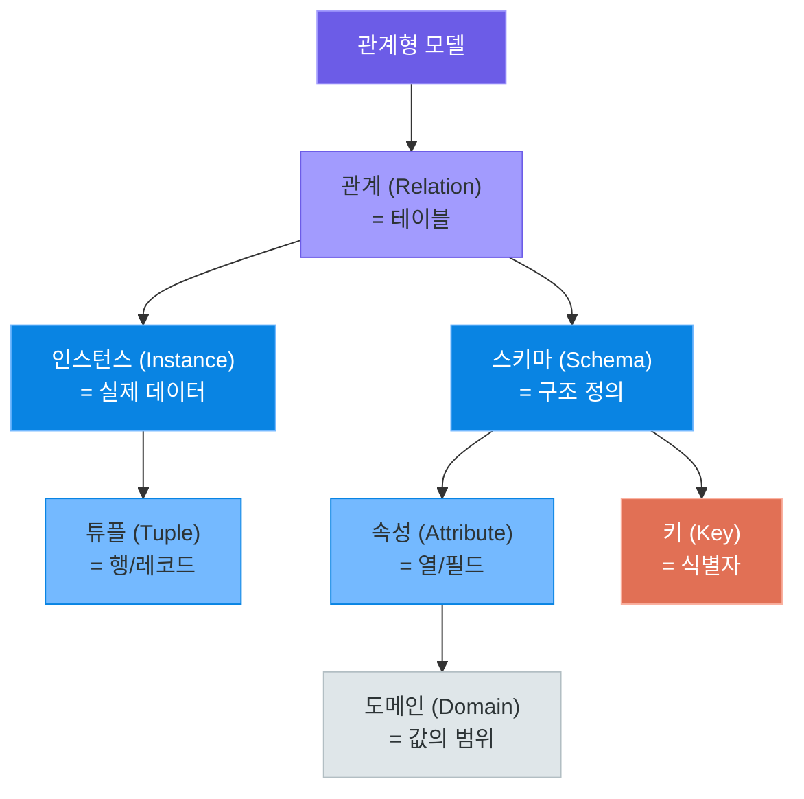
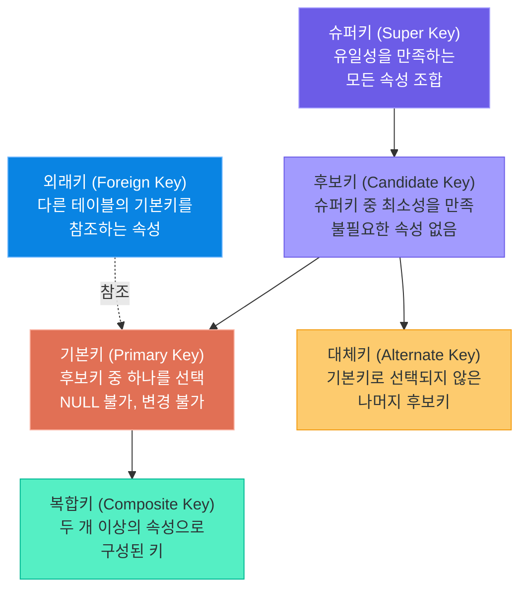
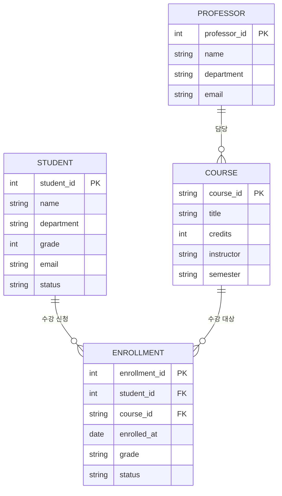
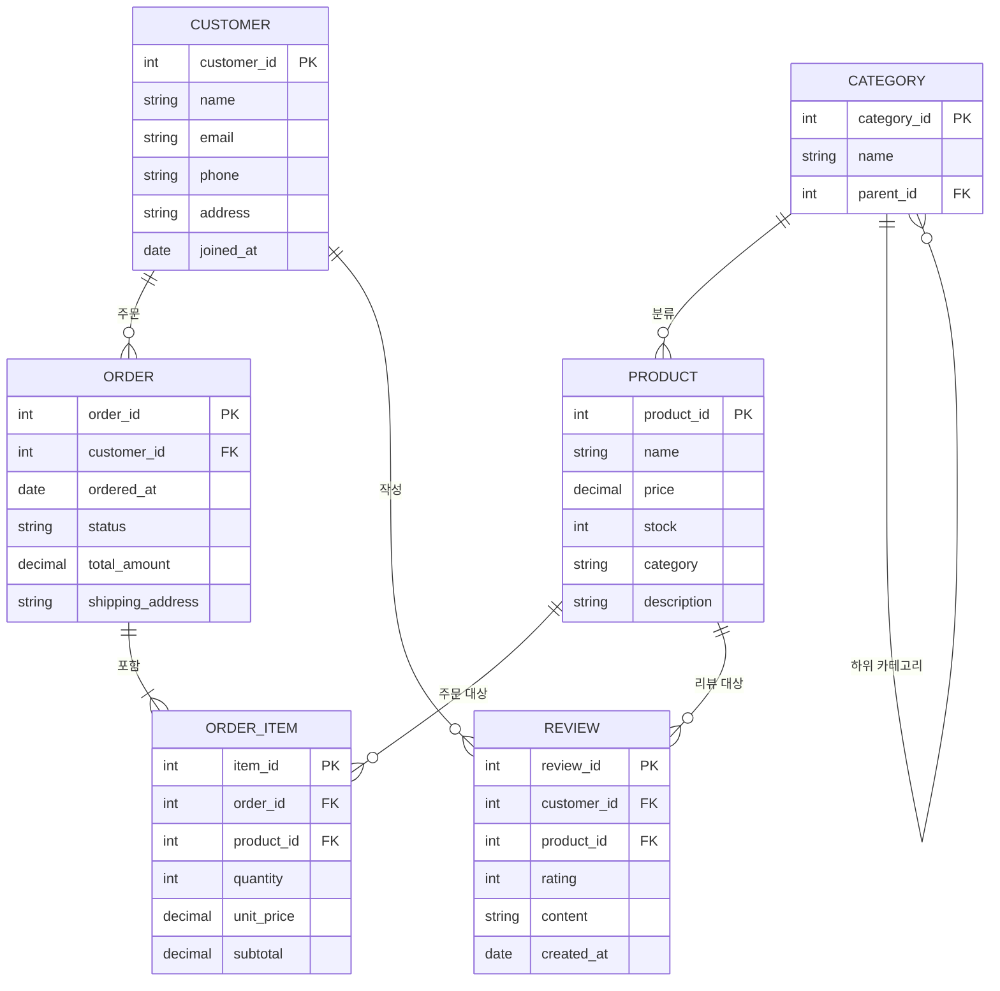
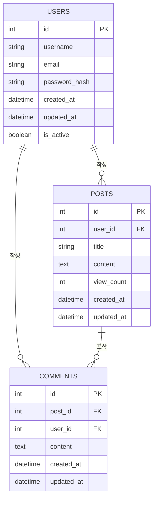
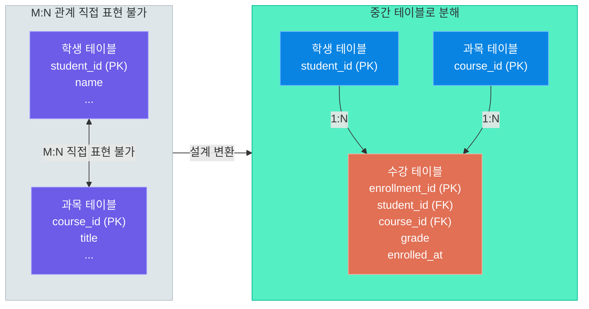
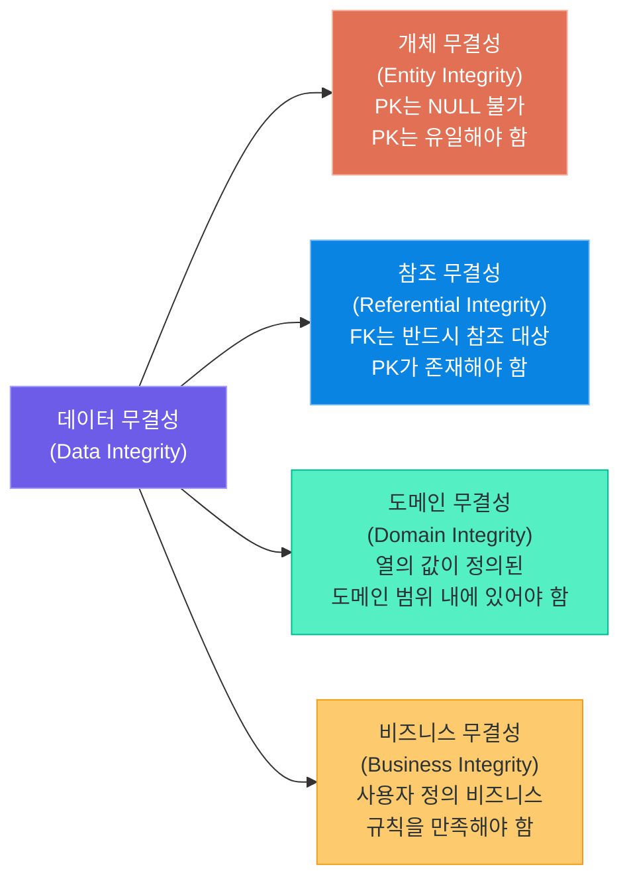
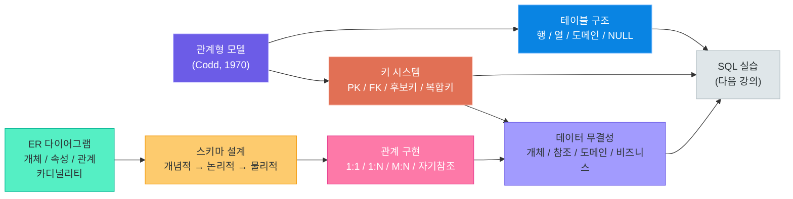

# 관계형 데이터베이스 핵심 개념

> 수학의 집합론에서 출발하여 현대 데이터 관리의 표준이 된 관계형 모델의 원리를 이해합니다.
> ER 다이어그램으로 현실 세계를 모델링하고, 올바른 스키마 설계의 기초를 다집니다.

---

## 1. 관계형 모델의 탄생

### Edgar F. Codd와 관계형 모델

1970년, IBM 연구원 **에드거 F. 코드(Edgar F. Codd)**는 "A Relational Model of Data for Large Shared Data Banks"라는 논문을 발표합니다. 이 논문은 데이터베이스 역사상 가장 중요한 문서 중 하나로, 데이터를 수학의 **집합론(Set Theory)**과 **1차 술어 논리(First-Order Predicate Logic)**를 기반으로 구조화하는 방법을 제시했습니다.

그는 당시 복잡한 포인터와 링크 구조로 데이터를 저장하던 **계층형 모델**과 **네트워크 모델**의 한계를 극복하고자 했습니다. 계층형 모델은 트리 구조로 데이터를 표현하여 특정 경로를 따라서만 데이터에 접근할 수 있었고, 네트워크 모델은 포인터로 복잡하게 얽힌 그래프 구조를 사용했습니다. 두 모델 모두 프로그래머가 데이터의 물리적 저장 구조를 직접 알아야 했기 때문에, 스키마가 변경되면 모든 프로그램을 수정해야 하는 문제가 있었습니다.

코드가 제안한 관계형 모델은 데이터를 **단순한 2차원 테이블** 형태로 표현하면서도 강력한 데이터 조작 능력을 제공합니다. 프로그래머는 데이터가 어떻게 저장되는지 알 필요 없이, 원하는 데이터가 무엇인지만 기술하면 됩니다. 이것이 관계형 모델의 핵심인 **데이터 독립성(Data Independence)**입니다.

**현실 세계 비유:** 관계형 모델을 이해하는 가장 쉬운 방법은 엑셀 스프레드시트를 상상하는 것입니다. 각 시트가 하나의 테이블이고, 행은 데이터 한 건, 열은 데이터의 속성을 나타냅니다. 단, 관계형 모델은 엑셀과 달리 여러 시트(테이블) 사이의 관계를 정교하게 정의하고 수학적으로 조작할 수 있습니다. 어떤 시트에도 중복 데이터를 저장하지 않고, 서로 참조하는 방식으로 일관성을 유지합니다.

### 핵심 용어 정리

관계형 모델에는 수학적 용어, 데이터베이스 전문 용어, 그리고 일상적으로 사용하는 용어가 혼재합니다. 세 가지를 함께 이해하면 혼동을 피할 수 있습니다.

| 수학 용어 | DB 전문 용어 | 일반 용어 | 설명 |
|-----------|-------------|-----------|------|
| 관계 (Relation) | 테이블 (Table) | 표 | 데이터의 집합, 행과 열로 구성 |
| 튜플 (Tuple) | 행 (Row) / 레코드 (Record) | 한 건의 데이터 | 테이블의 가로 한 줄 |
| 속성 (Attribute) | 열 (Column) / 필드 (Field) | 항목 | 데이터의 특성, 세로 한 줄 |
| 도메인 (Domain) | 데이터 타입 + 제약 | 값의 범위 | 속성이 가질 수 있는 값의 집합 |
| 카디널리티 (Cardinality) | 행 수 (Row Count) | 데이터 건수 | 테이블에 저장된 행의 수 |
| 차수 (Degree) | 열 수 (Column Count) | 항목 수 | 테이블의 열(속성) 개수 |
| 스키마 (Schema) | 테이블 정의 | 구조 설계도 | 테이블의 이름, 열, 타입 정의 |
| 릴레이션 인스턴스 | 테이블 데이터 | 현재 저장된 데이터 | 특정 시점의 테이블 내용 전체 |

### Codd의 12가지 규칙

코드는 관계형 데이터베이스가 갖추어야 할 12가지 규칙을 정의했습니다. 모든 규칙을 외울 필요는 없지만, 핵심 원칙을 이해하는 것이 중요합니다.

| 규칙 번호 | 규칙 이름 | 핵심 내용 |
|----------|---------|---------|
| 규칙 0 | 관계형 규칙 | RDBMS는 관계형 기능만으로 데이터를 관리해야 함 |
| 규칙 1 | 정보 규칙 | 모든 정보는 테이블의 행과 열의 값으로 표현 |
| 규칙 2 | 보장된 접근 규칙 | 모든 데이터는 테이블명, 기본키, 열명으로 접근 가능 |
| 규칙 3 | NULL의 체계적 처리 | NULL은 "알 수 없음"을 나타내며 체계적으로 처리 |
| 규칙 6 | 뷰 갱신 규칙 | 이론적으로 갱신 가능한 뷰는 실제로도 갱신 가능해야 함 |
| 규칙 9 | 논리적 데이터 독립성 | 논리적 구조 변경이 응용 프로그램에 영향을 주지 않아야 함 |
| 규칙 12 | 비전복 규칙 | 낮은 수준의 언어로 고수준 제약을 우회할 수 없어야 함 |

### 관계형 모델의 핵심 구성 요소



> **핵심 포인트:** 관계형 모델은 데이터를 2차원 테이블로 표현하고, 수학적 집합 연산(합집합, 교집합, 차집합, 곱집합)으로 데이터를 조작합니다. SQL은 이 수학적 개념을 프로그래머가 쉽게 사용할 수 있도록 만든 선언적 언어(Declarative Language)입니다. "어떻게 가져올지"가 아니라 "무엇을 가져올지"를 기술합니다.

---

## 2. 테이블 구조 이해

### 테이블, 행, 열의 관계

테이블은 관계형 데이터베이스의 기본 단위입니다. 하나의 테이블은 **동일한 성격의 데이터 집합**을 담습니다. 예를 들어 학생 정보, 수강 정보, 과목 정보는 각각 별도의 테이블로 분리합니다.

**현실 세계 비유:** 학교의 학생 명부를 생각해 보십시오. 명부 자체가 테이블이고, 각 학생의 한 줄이 행(Row)이며, 학번/이름/학과/학년 같은 각 항목이 열(Column)입니다. 모든 학생은 동일한 형식(열 구조)으로 기록됩니다. 만약 어떤 학생은 학번/이름만 기록하고 다른 학생은 이메일도 추가로 기록한다면 명부 관리가 매우 어려워집니다. 테이블은 이런 일관성을 보장합니다.

테이블 설계 시 중요한 원칙은 **한 테이블에는 하나의 주제**만 담는 것입니다. 학생 정보와 수강 정보를 하나의 테이블에 합치면 같은 학생의 정보가 수강 과목 수만큼 반복되는 문제(데이터 중복)가 발생합니다.

### 도메인(Domain) 개념

도메인은 특정 열이 가질 수 있는 **값의 집합**입니다. 단순히 데이터 타입만을 의미하는 것이 아니라, 비즈니스 규칙에 따른 제약까지 포함합니다.

| 열 이름 | 데이터 타입 | 도메인 (허용 값 범위) | 비고 |
|---------|------------|----------------------|------|
| student_id | INTEGER | 양의 정수, 중복 불가 | 기본키 |
| name | VARCHAR(50) | 최대 50자 문자열, NULL 불가 | 필수 입력 |
| grade | INTEGER | 1, 2, 3, 4 중 하나 | CHECK 제약 |
| gpa | DECIMAL(3,2) | 0.00 ~ 4.50 사이 | 소수점 2자리 |
| email | VARCHAR(100) | @ 포함, 고유값 | UNIQUE 제약 |
| enrolled_at | DATE | 과거 날짜만 허용 | 미래 날짜 불가 |
| status | VARCHAR(10) | '재학', '휴학', '졸업' 중 하나 | 열거형 |

### NULL의 의미와 주의점

NULL은 데이터베이스에서 가장 오해하기 쉬운 개념 중 하나입니다. NULL은 **"값이 없음"** 또는 **"알 수 없음"**을 의미하며, 0이나 빈 문자열("")과는 엄격히 다릅니다.

**현실 세계 비유:** 설문조사에서 응답하지 않은 항목을 생각해 보십시오. 응답 없음(NULL)은 "모른다"를 의미하고, "0점"은 "0을 선택했다"를 의미하며, 빈 문자열("")은 "아무 것도 쓰지 않았다"를 의미합니다. 세 가지는 완전히 다른 상황입니다.

| 상황 | 올바른 표현 | 잘못된 표현 | 이유 |
|------|-----------|-----------|------|
| 전화번호를 모름 | NULL | "" (빈 문자열) | 빈 문자열은 "번호가 없음"이 아님 |
| 아직 성적 미입력 | NULL | 0 | 0점과 미입력은 다른 의미 |
| 주소를 입력 안 함 | NULL | "미정" | 문자열 처리 오류 유발 |
| 할인율 없음 | 0 | NULL | 0은 명확한 비즈니스 의미 |

NULL 처리 시 반드시 알아야 할 규칙:
- `NULL = NULL` 은 TRUE가 아니라 NULL(알 수 없음)입니다. NULL 비교는 반드시 `IS NULL` 또는 `IS NOT NULL`을 사용합니다.
- NULL이 포함된 산술 연산 결과는 항상 NULL입니다. (예: `100 + NULL = NULL`)
- NULL이 포함된 문자열 결합도 NULL이 될 수 있습니다. (DBMS마다 다름)
- 집계 함수(COUNT, SUM, AVG 등)는 NULL을 무시합니다.
- ORDER BY 시 NULL은 보통 가장 앞이나 가장 뒤에 배치됩니다. (DBMS마다 다름)

### 예시: 학생 테이블과 수강 테이블

**students 테이블 (학생 정보)**

| student_id | name | department | grade | email | status |
|-----------|------|-----------|-------|-------|--------|
| 1001 | 김민준 | 컴퓨터공학 | 3 | minjun@univ.ac.kr | 재학 |
| 1002 | 이서연 | 데이터사이언스 | 2 | seoyeon@univ.ac.kr | 재학 |
| 1003 | 박도현 | 컴퓨터공학 | 4 | dohyun@univ.ac.kr | 졸업예정 |
| 1004 | 최지아 | 정보통신 | 1 | jia@univ.ac.kr | 재학 |

**courses 테이블 (과목 정보)**

| course_id | title | credits | instructor |
|----------|-------|--------|-----------|
| CS101 | 컴퓨터 개론 | 3 | 정교수 |
| CS201 | 자료구조 | 3 | 김교수 |
| CS301 | 데이터베이스 | 3 | 이교수 |
| CS401 | 머신러닝 | 3 | 박교수 |

**enrollments 테이블 (수강 정보)**

| enrollment_id | student_id | course_id | enrolled_at | grade |
|--------------|-----------|----------|------------|-------|
| 1 | 1001 | CS101 | 2024-03-02 | A |
| 2 | 1001 | CS201 | 2024-03-02 | NULL |
| 3 | 1002 | CS101 | 2024-03-02 | B+ |
| 4 | 1003 | CS301 | 2024-03-02 | NULL |
| 5 | 1004 | CS201 | 2024-03-02 | NULL |

> **핵심 포인트:** 테이블 설계 시 각 열의 도메인을 명확히 정의하고, NULL 허용 여부를 신중하게 결정해야 합니다. NULL을 과도하게 허용하면 데이터 품질이 저하되고, NULL을 과도하게 제한하면 시스템 유연성이 떨어집니다. 일반적으로 핵심 식별자와 필수 비즈니스 정보에는 NOT NULL을 적용하고, 선택적 정보에만 NULL을 허용합니다.

---

## 3. 키(Key)의 종류

### 키의 개념과 역할

키(Key)는 테이블에서 **행(튜플)을 식별**하거나 **테이블 간의 관계**를 맺는 데 사용하는 속성(또는 속성들의 조합)입니다. 키는 단순한 식별자를 넘어 데이터의 무결성을 보장하는 핵심 메커니즘입니다.

**현실 세계 비유:** 주민등록번호는 대한민국 모든 국민을 유일하게 식별하는 키입니다. 이름은 동명이인이 있을 수 있어 키로 사용하기 어렵지만, 주민등록번호는 절대 중복되지 않습니다. 데이터베이스에서도 마찬가지로, 각 행을 유일하게 식별할 수 있는 식별자가 필요합니다. 도서관 장서관리에서도 책 제목이 같을 수 있으므로 고유한 ISBN 번호를 키로 사용하는 것과 같은 원리입니다.

### 키의 계층 구조



### 각 키의 상세 설명

| 키 종류 | 유일성 | 최소성 | NULL 허용 | 설명 및 예시 |
|--------|-------|-------|----------|-------------|
| 슈퍼키 | O | X | 가능 | {학번}, {학번+이름}, {이메일} 모두 슈퍼키 |
| 후보키 | O | O | 가능 | {학번}, {이메일} — 최소한의 속성으로 유일 식별 |
| 기본키 | O | O | X | 후보키 중 선택된 대표키, NOT NULL + UNIQUE |
| 대체키 | O | O | 가능 | 기본키로 선택되지 않은 후보키 ({이메일}) |
| 외래키 | X | X | 가능 | 참조 무결성 보장, 다른 테이블의 PK를 참조 |
| 복합키 | O | O | X | (학번 + 과목코드)처럼 여러 열의 조합 |

### 자연키 vs 대리키

| 구분 | 자연키 (Natural Key) | 대리키 (Surrogate Key) |
|------|--------------------|-----------------------|
| 정의 | 현실 세계에 존재하는 식별자 | DB가 자동 생성하는 인공 식별자 |
| 예시 | 주민등록번호, 학번, 이메일 | AUTO_INCREMENT ID, UUID |
| 장점 | 의미를 직접 파악 가능, 추가 열 불필요 | 변경 위험 없음, 짧고 단순, 조인 효율 |
| 단점 | 변경 가능성 있음, 길이가 길 수 있음 | 비즈니스 의미 없음, 추가 열 필요 |
| 권장 상황 | 변경 불가능한 고유값이 확실히 존재할 때 | 대부분의 일반적인 테이블 |

실무에서는 대부분 **대리키(자동 증가 정수 또는 UUID)**를 기본키로 사용하는 것이 일반적입니다. 이메일이나 전화번호처럼 언뜻 유일해 보이는 값도 변경될 수 있고, 이메일을 FK로 참조하는 테이블이 많으면 이메일 변경 시 모든 테이블을 업데이트해야 하는 문제가 생깁니다.

### 기본키 설계 원칙

기본키를 선택할 때 고려해야 할 핵심 원칙입니다:

| 원칙 | 설명 | 위반 예시 |
|------|------|---------|
| 유일성 (Uniqueness) | 테이블 내에서 중복값이 없어야 함 | 이름을 PK로 사용 (동명이인) |
| 비NULL성 (Non-Nullability) | NULL이 허용되지 않아야 함 | 선택 입력 필드를 PK로 사용 |
| 불변성 (Immutability) | 값이 변경되지 않아야 함 | 이메일을 PK로 사용 (변경 가능) |
| 최소성 (Minimality) | 불필요한 속성을 포함하지 않아야 함 | {id, 이름}을 PK로 설정 |
| 단순성 (Simplicity) | 가능한 짧고 단순한 값을 사용 | 긴 텍스트를 PK로 사용 |

> **핵심 포인트:** 기본키(PK)는 테이블의 각 행을 유일하게 식별하는 핵심 요소입니다. NULL이 허용되지 않고 변경되어서는 안 됩니다. 외래키(FK)는 테이블 간의 관계를 정의하며, 참조 무결성을 보장하는 역할을 합니다. 실무에서는 대부분 정수형 자동 증가(AUTO_INCREMENT) 대리키를 기본키로 사용합니다.

---

## 4. ER 다이어그램 (개체-관계 모델)

### ER 모델의 개념

**ER 다이어그램(Entity-Relationship Diagram)**은 1976년 **피터 첸(Peter Chen)**이 제안한 데이터 모델링 기법입니다. 현실 세계의 데이터 구조를 시각적으로 표현하며, 데이터베이스 설계의 첫 단계인 **개념적 설계**에서 사용합니다.

**현실 세계 비유:** 건축 설계의 청사진(Blueprint)과 같습니다. 집을 실제로 짓기 전에 건축가가 도면을 그리듯, 데이터베이스를 구축하기 전에 ER 다이어그램으로 전체 구조를 설계합니다. 청사진이 방의 배치와 문/창문의 위치를 보여주듯, ER 다이어그램은 데이터의 구조와 관계를 보여줍니다. 비개발자인 기획자나 클라이언트와도 공유하고 검토할 수 있는 공통 언어입니다.

### ER 다이어그램의 핵심 요소

| 요소 | 표기 | 의미 | 예시 |
|------|------|------|------|
| 개체 (Entity) | 직사각형 | 현실 세계의 독립적인 객체 | 학생, 과목, 교수 |
| 속성 (Attribute) | 타원형 | 개체의 특성 | 학번, 이름, 학과 |
| 관계 (Relationship) | 다이아몬드 | 개체 간의 연관 | 수강하다, 가르치다 |
| 기본키 속성 | 밑줄 타원 | 개체를 식별하는 속성 | 학번 (밑줄) |
| 다중값 속성 | 이중 타원 | 여러 값을 가지는 속성 | 전화번호 (복수 가능) |
| 파생 속성 | 점선 타원 | 다른 속성에서 계산 | 나이 (생년월일로부터) |
| 약한 개체 | 이중 직사각형 | 독립적으로 존재할 수 없는 개체 | 주문 상세 (주문 없이 존재 불가) |

### 카디널리티 (Cardinality)

카디널리티는 두 개체 사이의 **수적 관계**를 나타냅니다. Mermaid의 erDiagram에서 사용하는 표기법과 함께 이해합니다.

| 관계 유형 | Mermaid 표기 | 의미 | 예시 |
|----------|------------|------|------|
| 정확히 하나 | `||` | 반드시 하나 존재 | 주문은 반드시 하나의 고객에게 속함 |
| 0 또는 하나 | `|o` | 없거나 하나 | 사용자는 프로필이 없을 수도 있음 |
| 0 이상 | `o{` | 없거나 여러 개 | 고객은 주문이 없을 수도 있음 |
| 1 이상 | `|{` | 반드시 하나 이상 | 주문에는 반드시 하나 이상의 상품 |

### 학생-수강-과목 ERD



### 쇼핑몰 ERD (고객-주문-상품-리뷰)



> **핵심 포인트:** ER 다이어그램은 개발자와 비개발자가 함께 데이터 구조를 논의할 수 있는 공통 언어입니다. 실제 테이블을 만들기 전에 ER 다이어그램으로 설계를 검토하면 나중에 발생할 수 있는 구조적 문제를 조기에 발견할 수 있습니다. 특히 M:N 관계나 자기 참조 관계는 ERD 단계에서 발견하고 처리 방법을 결정하는 것이 중요합니다.

---

## 5. 스키마 설계 실습

### 논리적 설계와 물리적 설계

데이터베이스 설계는 **개념적 설계 → 논리적 설계 → 물리적 설계**의 3단계로 진행됩니다.


| 설계 단계 | 주요 산출물 | 사용 도구 | 대상 독자 |
|----------|-----------|----------|----------|
| 요구사항 분석 | 요구사항 명세서 | 문서 도구, 인터뷰 | 모든 이해관계자 |
| 개념적 설계 | ER 다이어그램 | ERD 도구, 화이트보드 | 모든 이해관계자 |
| 논리적 설계 | 테이블 스키마, 정규화 결과 | 설계 문서 | 개발자, DBA |
| 물리적 설계 | 인덱스 설계, 파티셔닝 전략 | DBMS 매뉴얼 | DBA |
| 구현 | DDL 스크립트 | SQL 에디터 | 개발자 |

### 요구사항 분석 예시

좋은 데이터베이스 설계는 명확한 요구사항 분석에서 시작합니다. 다음은 게시판 서비스의 요구사항을 도출하는 과정입니다.

**기능 요구사항:**
- 사용자는 이메일과 비밀번호로 회원가입 및 로그인을 합니다.
- 로그인한 사용자는 게시글을 작성, 수정, 삭제할 수 있습니다.
- 게시글에는 제목, 내용, 작성자, 작성일시가 포함됩니다.
- 모든 사용자는 게시글에 댓글을 작성할 수 있습니다.
- 댓글에는 내용, 작성자, 작성일시가 포함됩니다.
- 게시글 조회 수가 기록되어야 합니다.

**데이터 요구사항 도출:**
- 개체(Entity): 사용자(User), 게시글(Post), 댓글(Comment)
- 관계: 사용자 -[작성]-> 게시글 (1:N), 사용자 -[작성]-> 댓글 (1:N), 게시글 -[포함]-> 댓글 (1:N)

### 게시판 ERD



### CREATE TABLE 문 미리보기

아래는 위 ERD를 SQL로 표현한 예시입니다. SQL 문법의 상세한 내용은 다음 강의(03_sql_basics_with_sqlite.md)에서 본격적으로 학습합니다.

```sql
# schema.sql -- 게시판 서비스 데이터베이스 스키마 정의

-- 사용자 테이블
-- 게시판 서비스에서 회원 정보를 저장합니다.
CREATE TABLE users (
    id            INTEGER  PRIMARY KEY AUTOINCREMENT,
    username      VARCHAR(50)  NOT NULL UNIQUE,
    email         VARCHAR(100) NOT NULL UNIQUE,
    password_hash VARCHAR(255) NOT NULL,
    is_active     BOOLEAN  DEFAULT TRUE,
    created_at    DATETIME DEFAULT CURRENT_TIMESTAMP,
    updated_at    DATETIME DEFAULT CURRENT_TIMESTAMP
);

-- 게시글 테이블
-- 사용자가 작성한 게시글을 저장합니다.
-- user_id는 users 테이블의 id를 참조합니다.
CREATE TABLE posts (
    id          INTEGER PRIMARY KEY AUTOINCREMENT,
    user_id     INTEGER      NOT NULL,
    title       VARCHAR(200) NOT NULL,
    content     TEXT         NOT NULL,
    view_count  INTEGER      DEFAULT 0,
    created_at  DATETIME     DEFAULT CURRENT_TIMESTAMP,
    updated_at  DATETIME     DEFAULT CURRENT_TIMESTAMP,
    FOREIGN KEY (user_id) REFERENCES users(id) ON DELETE CASCADE
);

-- 댓글 테이블
-- 게시글에 달린 댓글을 저장합니다.
-- post_id는 posts 테이블의 id를, user_id는 users 테이블의 id를 참조합니다.
CREATE TABLE comments (
    id          INTEGER  PRIMARY KEY AUTOINCREMENT,
    post_id     INTEGER  NOT NULL,
    user_id     INTEGER  NOT NULL,
    content     TEXT     NOT NULL,
    created_at  DATETIME DEFAULT CURRENT_TIMESTAMP,
    updated_at  DATETIME DEFAULT CURRENT_TIMESTAMP,
    FOREIGN KEY (post_id) REFERENCES posts(id) ON DELETE CASCADE,
    FOREIGN KEY (user_id) REFERENCES users(id) ON DELETE CASCADE
);
```

### 스키마 설계 체크리스트

| 확인 항목 | 세부 점검 사항 | 게시판 예시 |
|----------|-------------|-----------|
| 테이블 단일 책임 | 하나의 테이블이 하나의 주제만 담는가 | users/posts/comments 분리 완료 |
| 기본키 설정 | 모든 테이블에 PK가 있는가 | 모든 테이블에 id 컬럼 설정 |
| NULL 처리 | 필수 항목에 NOT NULL 적용 여부 | title, content, email 등 NOT NULL |
| 외래키 설정 | 관계가 FK로 정의되었는가 | user_id, post_id FK 설정 완료 |
| ON DELETE 옵션 | 부모 삭제 시 동작 결정 | CASCADE로 연쇄 삭제 |
| 기본값 설정 | 적절한 DEFAULT 값 지정 여부 | created_at, view_count 등 |

> **핵심 포인트:** 스키마 설계는 건물의 기초 공사와 같습니다. 처음에 올바르게 설계하지 않으면 나중에 수정하는 비용이 기하급수적으로 증가합니다. 서비스가 운영되고 데이터가 쌓이기 시작하면 테이블 구조를 변경하는 것은 매우 위험하고 복잡한 작업이 됩니다. 요구사항 분석 → ER 다이어그램 → 테이블 스키마의 순서를 반드시 지키십시오.

---

## 6. 관계의 종류와 구현

### 1:1 관계 (사용자 - 프로필)

1:1 관계는 한 개체가 다른 개체 하나와 정확히 대응하는 경우입니다. 사용자와 프로필의 관계가 대표적입니다. 사용자 한 명은 하나의 프로필만 가지고, 하나의 프로필은 한 명의 사용자에게만 속합니다.

**현실 세계 비유:** 대한민국 국민 한 명은 주민등록증을 한 장만 가질 수 있고, 한 장의 주민등록증은 한 명의 국민에게만 발급됩니다. 1:1 관계의 전형적인 예입니다.

**구현 방법:** 어느 한쪽 테이블에 상대방의 기본키를 외래키로 추가합니다. 보통 "부속" 개체가 되는 테이블에 외래키를 배치하고 UNIQUE 제약을 추가합니다.

**1:1 관계를 별도 테이블로 분리하는 이유:**
- 자주 조회되지 않는 데이터(대용량 텍스트, 이미지 URL 등)를 분리하여 성능 향상
- 선택적으로 존재하는 정보를 분리하여 NULL 컬럼 최소화
- 접근 권한을 다르게 적용해야 하는 경우

```sql
CREATE TABLE users (
    id       INTEGER PRIMARY KEY AUTOINCREMENT,
    username VARCHAR(50) NOT NULL,
    email    VARCHAR(100) NOT NULL UNIQUE
);

CREATE TABLE user_profiles (
    id          INTEGER PRIMARY KEY AUTOINCREMENT,
    user_id     INTEGER NOT NULL UNIQUE,  -- UNIQUE로 1:1 보장
    bio         TEXT,
    avatar_url  VARCHAR(255),
    website_url VARCHAR(255),
    FOREIGN KEY (user_id) REFERENCES users(id) ON DELETE CASCADE
);
```

### 1:N 관계 (부서 - 직원)

1:N 관계는 가장 흔한 관계 유형입니다. 한 부서에는 여러 직원이 소속될 수 있지만, 한 직원은 하나의 부서에만 소속됩니다.

**현실 세계 비유:** 선생님 한 명이 여러 학생을 가르칩니다. 하지만 한 학생의 담임 선생님은 한 명입니다. 게시글 하나에 댓글이 여러 개 달릴 수 있지만, 각 댓글은 하나의 게시글에만 속합니다.

**구현 방법:** "N" 쪽 테이블(직원)에 "1" 쪽 테이블(부서)의 기본키를 외래키로 추가합니다. 이 외래키가 두 테이블의 관계를 정의합니다.

```sql
CREATE TABLE departments (
    id   INTEGER PRIMARY KEY AUTOINCREMENT,
    name VARCHAR(100) NOT NULL,
    budget DECIMAL(15,2)
);

CREATE TABLE employees (
    id            INTEGER PRIMARY KEY AUTOINCREMENT,
    department_id INTEGER NOT NULL,          -- 1:N 관계의 FK
    name          VARCHAR(50) NOT NULL,
    position      VARCHAR(50),
    hire_date     DATE,
    FOREIGN KEY (department_id) REFERENCES departments(id)
);
```

### M:N 관계와 중간 테이블

M:N 관계는 관계형 데이터베이스에서 직접 표현할 수 없습니다. 반드시 **중간 테이블(Junction Table, 연결 테이블, 교차 테이블)**을 사용하여 두 개의 1:N 관계로 분해해야 합니다.

**현실 세계 비유:** 학생과 과목의 관계를 생각해 보십시오. 한 학생은 여러 과목을 수강하고, 한 과목에는 여러 학생이 등록합니다. 이 관계를 직접 표현할 수 없으므로 "수강 신청"이라는 중간 개념을 만들어서 해결합니다.



중간 테이블의 특징:
- 두 테이블의 기본키를 외래키로 포함합니다.
- 이 두 외래키의 조합이 복합 기본키가 됩니다. (또는 별도 대리키 사용)
- **관계 자체의 속성**(예: 수강 날짜, 성적, 주문 수량)도 중간 테이블에 저장합니다.

```sql
-- 학생-과목 M:N 관계를 중간 테이블로 해소
CREATE TABLE students (
    id   INTEGER PRIMARY KEY AUTOINCREMENT,
    name VARCHAR(50) NOT NULL
);

CREATE TABLE courses (
    id    VARCHAR(10) PRIMARY KEY,
    title VARCHAR(100) NOT NULL
);

CREATE TABLE enrollments (
    id          INTEGER PRIMARY KEY AUTOINCREMENT,
    student_id  INTEGER NOT NULL,
    course_id   VARCHAR(10) NOT NULL,
    enrolled_at DATE,
    grade       VARCHAR(5),  -- 관계의 속성
    UNIQUE (student_id, course_id),  -- 같은 학생이 같은 과목을 중복 수강 방지
    FOREIGN KEY (student_id) REFERENCES students(id),
    FOREIGN KEY (course_id)  REFERENCES courses(id)
);
```

### 자기 참조 관계 (직원 - 상사)

동일한 테이블 내에서 행끼리 참조 관계를 맺는 경우를 **자기 참조 관계(Self-Referencing Relationship)**라고 합니다. 조직도에서 직원과 상사의 관계, 카테고리의 상위/하위 카테고리 관계가 대표적입니다.

```sql
CREATE TABLE employees (
    id         INTEGER PRIMARY KEY AUTOINCREMENT,
    name       VARCHAR(50) NOT NULL,
    position   VARCHAR(50),
    manager_id INTEGER,  -- 자기 참조 FK (NULL이면 최고 관리자)
    FOREIGN KEY (manager_id) REFERENCES employees(id)
);
```

| id | name | position | manager_id | 설명 |
|----|------|---------|-----------|------|
| 1 | 홍대표 | CEO | NULL | 최고 관리자 (상사 없음) |
| 2 | 김개발팀장 | 팀장 | 1 | 홍대표 직속 |
| 3 | 이백엔드 | 개발자 | 2 | 김개발팀장 직속 |
| 4 | 박프론트 | 개발자 | 2 | 김개발팀장 직속 |
| 5 | 최기획팀장 | 팀장 | 1 | 홍대표 직속 |

> **핵심 포인트:** M:N 관계는 반드시 중간 테이블로 분해해야 합니다. 중간 테이블은 단순한 연결 역할뿐만 아니라, 관계 자체의 속성(예: 주문 수량, 수강 성적, 할인율)을 저장하는 중요한 역할을 합니다. 중간 테이블에 중복 수강 방지와 같은 UNIQUE 제약을 추가하면 비즈니스 규칙도 함께 보장할 수 있습니다.

---

## 7. 데이터 무결성 개요

### 무결성이란 무엇인가

데이터 무결성(Data Integrity)은 데이터베이스에 저장된 데이터가 **정확하고 일관성이 있으며 유효한** 상태를 유지하는 것을 의미합니다. 무결성이 보장되지 않으면 애플리케이션이 잘못된 데이터를 처리하게 되고, 이는 심각한 비즈니스 문제로 이어집니다.

**현실 세계 비유:** 은행 계좌를 생각해 보십시오. 계좌 잔액이 음수가 되어서는 안 되고(도메인 무결성), 존재하지 않는 계좌로 이체가 이루어져서는 안 되며(참조 무결성), 이체 시 출금 계좌에서 빠진 금액과 입금 계좌에 들어온 금액이 반드시 일치해야 합니다(비즈니스 무결성). 각 계좌는 고유한 계좌번호로 식별되어야 하고(개체 무결성), 이 규칙들이 모두 지켜져야 은행 시스템을 신뢰할 수 있습니다.

### 무결성의 4가지 유형



### 개체 무결성 (Entity Integrity)

모든 테이블의 기본키(Primary Key)는 NULL 값을 가질 수 없으며, 반드시 유일해야 합니다. 이는 테이블의 각 행이 항상 유일하게 식별될 수 있어야 함을 보장합니다.

| 위반 사례 | 문제점 | 해결 방법 |
|----------|-------|---------|
| PK 열에 NULL 입력 | 행을 식별할 수 없음 | NOT NULL 제약 자동 적용 |
| 중복 PK 값 입력 | 어떤 행을 참조해야 할지 모호 | UNIQUE 제약 자동 적용 |
| PK 값 변경 | 참조하던 FK가 엉뚱한 행을 가리킴 | 애플리케이션 수준에서 변경 금지 |

```sql
-- 개체 무결성: PRIMARY KEY 선언만으로 NOT NULL + UNIQUE 자동 보장
CREATE TABLE products (
    product_id  INTEGER PRIMARY KEY NOT NULL,  -- NULL 불가, 유일성 보장
    name        VARCHAR(100) NOT NULL,
    price       DECIMAL(10,2) NOT NULL
);

-- 아래 SQL은 에러 발생 (개체 무결성 위반)
-- INSERT INTO products VALUES (NULL, '노트북', 1500000);   -- PK에 NULL
-- INSERT INTO products VALUES (1, '마우스', 30000);
-- INSERT INTO products VALUES (1, '키보드', 80000);        -- PK 중복
```

### 참조 무결성 (Referential Integrity)

외래키(FK)가 참조하는 기본키(PK)가 반드시 해당 테이블에 존재해야 합니다. 존재하지 않는 값을 참조하거나, 참조되고 있는 값을 무단으로 삭제하는 것을 방지합니다.

| 위반 사례 | 문제점 | 해결 방법 |
|----------|-------|---------|
| 존재하지 않는 user_id로 post 삽입 | 고아 레코드 발생 | FOREIGN KEY 제약으로 삽입 거부 |
| 참조 중인 user 삭제 | 게시글의 작성자 정보 소실 | ON DELETE 옵션으로 처리 방식 결정 |
| FK 값을 존재하지 않는 PK로 변경 | 데이터 불일치 | FOREIGN KEY 제약으로 변경 거부 |

```sql
-- ON DELETE 옵션 종류와 사용 상황
-- CASCADE: 부모 삭제 시 자식도 자동 삭제 (게시글 삭제 → 댓글도 삭제)
FOREIGN KEY (post_id) REFERENCES posts(id) ON DELETE CASCADE

-- RESTRICT: 자식이 있으면 부모 삭제 불가 (주문 있는 상품 삭제 불가)
FOREIGN KEY (product_id) REFERENCES products(id) ON DELETE RESTRICT

-- SET NULL: 부모 삭제 시 FK를 NULL로 변경 (작성자 탈퇴 → post의 user_id를 NULL로)
FOREIGN KEY (user_id) REFERENCES users(id) ON DELETE SET NULL

-- SET DEFAULT: 부모 삭제 시 FK를 기본값으로 변경 (잘 사용하지 않음)
FOREIGN KEY (category_id) REFERENCES categories(id) ON DELETE SET DEFAULT
```

### 도메인 무결성 (Domain Integrity)

각 열의 값이 정의된 도메인 범위 내에 있어야 합니다. 데이터 타입, CHECK 제약, NOT NULL, DEFAULT 값 등을 통해 보장합니다.

```sql
# domain_integrity_example.sql -- 도메인 무결성 제약 적용 예시

CREATE TABLE students (
    student_id INTEGER      PRIMARY KEY,
    name       VARCHAR(50)  NOT NULL,
    grade      INTEGER      CHECK (grade BETWEEN 1 AND 4),      -- 학년은 1~4만 허용
    gpa        DECIMAL(3,2) CHECK (gpa BETWEEN 0.00 AND 4.50), -- GPA 범위 제한
    status     VARCHAR(10)  CHECK (status IN ('재학', '휴학', '졸업')), -- 열거형 제한
    email      VARCHAR(100) UNIQUE,                             -- 이메일 유일성
    created_at DATETIME     DEFAULT CURRENT_TIMESTAMP           -- 기본값 설정
);
```

### 비즈니스 무결성 (Business Integrity)

데이터베이스 수준에서 정의하기 어려운 비즈니스 규칙을 적용합니다. TRIGGER나 애플리케이션 로직으로 구현합니다.

| 비즈니스 규칙 예시 | 구현 레이어 | 구현 방법 |
|-----------------|-----------|---------|
| 재고가 없으면 주문 불가 | DB + 애플리케이션 | TRIGGER 또는 트랜잭션 + 잠금 |
| VIP 고객은 최대 10% 할인 | 애플리케이션 | 주문 생성 로직에서 처리 |
| 성인 인증 없이 특정 상품 구매 불가 | 애플리케이션 | API 계층에서 검증 |
| 반품 기간은 구매 후 30일 이내 | 애플리케이션 | 반품 요청 처리 시 날짜 검증 |
| 같은 날 같은 좌석 예약 불가 | DB | UNIQUE (seat_id, date) 제약 |

### 무결성 위반 시 발생하는 문제

무결성이 보장되지 않으면 어떤 일이 발생하는지 구체적인 시나리오로 살펴봅니다.

| 위반 유형 | 시나리오 | 결과 |
|----------|---------|------|
| 참조 무결성 | 탈퇴한 사용자 ID를 FK로 가진 게시글이 남아있음 | 게시글 작성자 정보 조회 불가, 오류 발생 |
| 도메인 무결성 | 나이 컬럼에 -5가 입력됨 | 잘못된 통계, 비즈니스 로직 오류 |
| 개체 무결성 | 같은 ID의 상품이 두 개 존재 | 주문 처리 시 어떤 상품을 참조해야 할지 모호 |
| 비즈니스 무결성 | 재고가 없는데 주문이 접수됨 | 배송 불가, 고객 불만, 환불 처리 비용 |

> **핵심 포인트:** 데이터 무결성은 DBMS가 자동으로 지켜주는 부분(개체/참조/도메인 무결성)과 애플리케이션에서 별도로 관리해야 하는 부분(비즈니스 무결성)으로 나뉩니다. 가능한 한 DBMS 수준에서 제약을 정의하는 것이 안전합니다. 애플리케이션 로직은 버그가 있거나 우회될 수 있지만, DB 제약은 어떤 경로로 데이터가 입력되더라도 반드시 검증됩니다.

---

## 8. 핵심 정리

### 학습 내용 요약

| 개념 | 핵심 내용 | 실무 적용 포인트 |
|------|---------|----------------|
| 관계형 모델 | Codd(1970), 집합론 기반, 2차원 테이블 | 모든 관계형 DB의 이론적 기반, SQL의 출발점 |
| 테이블 구조 | 행(레코드), 열(필드), 도메인, NULL | 설계 시 NULL 허용 여부와 도메인 범위를 명확히 정의 |
| 키(Key) 종류 | PK(식별), FK(관계), 복합키, 대리키 | 대부분의 경우 대리키(AUTO_INCREMENT)를 PK로 사용 |
| ER 다이어그램 | 개체, 속성, 관계의 시각적 표현 | 개발 전 이해관계자와 함께 검토하는 설계 도구 |
| 스키마 설계 | 요구사항 → ERD → 테이블 스키마 순서 | 초기 설계에 시간을 투자할수록 나중 비용이 절감 |
| 관계 구현 | 1:1, 1:N, M:N(중간 테이블), 자기참조 | M:N은 반드시 중간 테이블로 분해 |
| 데이터 무결성 | 개체/참조/도메인/비즈니스 4가지 유형 | DB 제약으로 최대한 보장, 나머지는 앱 로직으로 |

### 전체 개념 관계도



### 관계형 모델의 3가지 핵심 특성

관계형 모델이 50년 이상 데이터베이스의 표준으로 자리잡을 수 있었던 이유는 다음 세 가지 핵심 특성 덕분입니다.

| 특성 | 설명 | 실용적 의미 |
|------|------|-----------|
| 데이터 독립성 | 물리적 저장 방식이 변경되어도 논리적 구조는 유지 | 저장 엔진을 바꿔도 SQL은 그대로 사용 가능 |
| 선언적 조회 | "어떻게"가 아닌 "무엇을" 기술 (SQL) | 최적화는 DBMS에게 맡기고 로직에만 집중 |
| 수학적 엄밀성 | 집합 이론에 기반한 데이터 조작 | 결과가 예측 가능하고 일관성 있음 |

### 주요 체크리스트

테이블을 설계할 때 다음 질문들을 반드시 확인하십시오.

| 확인 항목 | 세부 점검 사항 |
|----------|-------------|
| 기본키 설정 | 모든 테이블에 PK가 있는가? 자연키 vs 대리키 선택은 적절한가? |
| NULL 처리 | 각 열의 NULL 허용 여부가 명확하게 결정되었는가? |
| 외래키 설정 | 테이블 간 관계가 FK로 정의되었는가? ON DELETE 옵션은 적절한가? |
| 도메인 정의 | 각 열의 데이터 타입과 범위 제약이 정의되었는가? |
| M:N 관계 처리 | M:N 관계가 중간 테이블로 올바르게 분해되었는가? |
| 중복 최소화 | 동일한 데이터가 여러 테이블에 중복 저장되지 않는가? |
| 단일 책임 | 각 테이블이 하나의 주제만 다루고 있는가? |
| 무결성 제약 | 비즈니스 규칙이 DB 제약으로 최대한 보장되고 있는가? |

---

### 다음 강의 미리보기

다음 강의인 **03_sql_basics_with_sqlite.md**에서는 이번 강의에서 설계한 스키마를 실제로 구현합니다. SQLite를 사용하여 테이블을 생성하고, 데이터를 삽입, 조회, 수정, 삭제하는 SQL의 4가지 기본 명령(SELECT, INSERT, UPDATE, DELETE)을 직접 실습합니다. 조건절(WHERE), 정렬(ORDER BY), 집계 함수(COUNT, SUM, AVG)와 JOIN을 사용하여 여러 테이블의 데이터를 결합하는 방법도 학습합니다. 이론으로 배운 관계형 모델의 개념이 실제 SQL 코드로 어떻게 표현되는지 체험하게 됩니다.

> **이전 강의:** [데이터베이스 기초와 진화](01_database_fundamentals.md)
>
> **다음 강의:** [SQL 기초와 SQLite 실습](03_sql_basics_with_sqlite.md)
