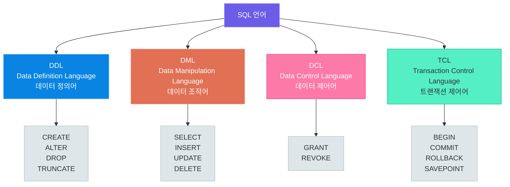
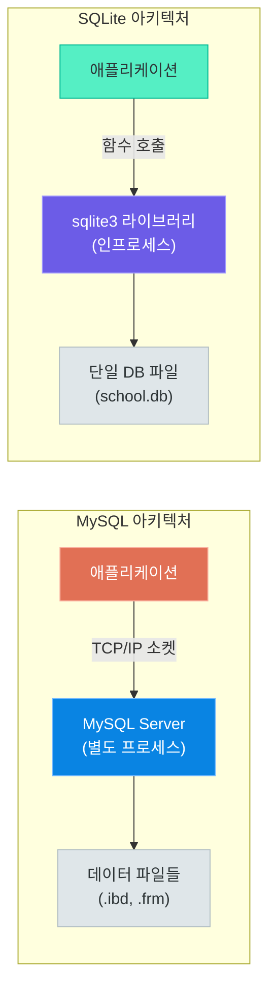
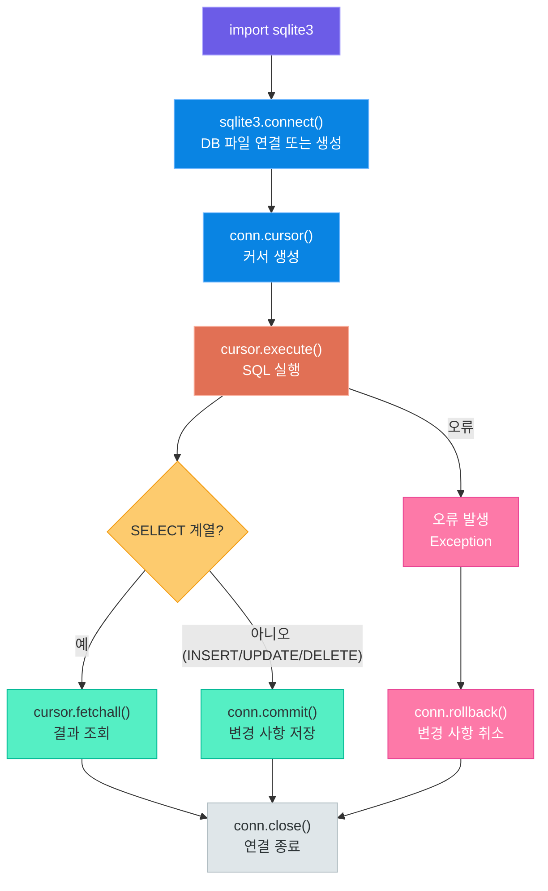
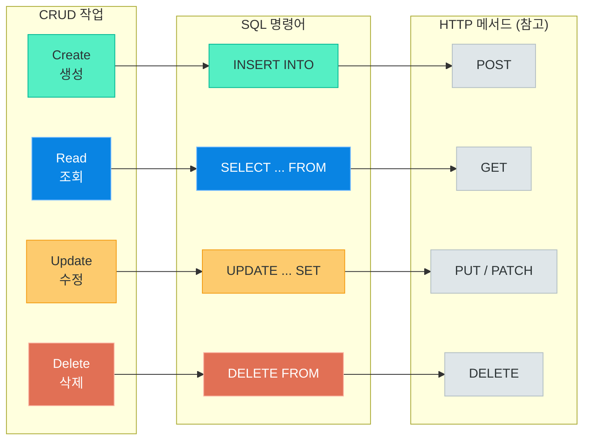
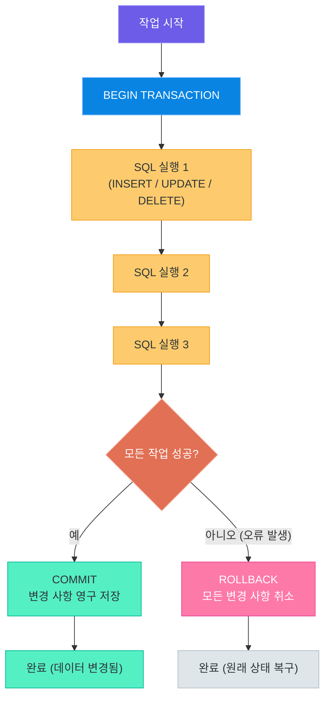
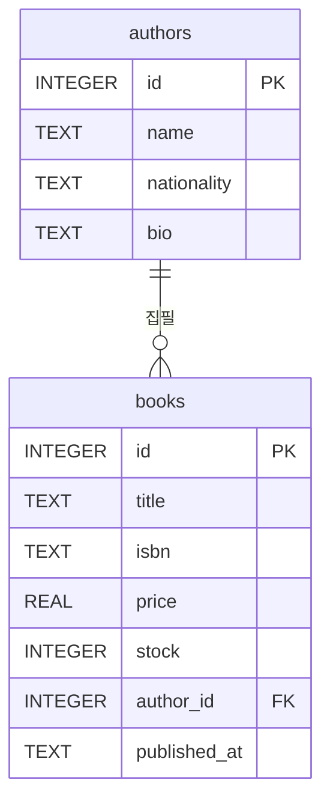
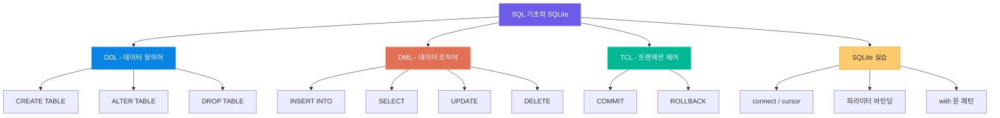

# SQL 기초와 SQLite 실습

> 데이터베이스와 대화하는 언어, SQL의 핵심 문법을 익히고 Python sqlite3 모듈로 직접 실습합니다.
> DDL로 구조를 만들고, DML로 데이터를 다루고, TCL로 안전하게 마무리하는 전체 흐름을 완성합니다.

---

## 1. SQL이란?

### Structured Query Language의 탄생

SQL(Structured Query Language)은 관계형 데이터베이스를 다루기 위해 설계된 표준 언어입니다. 1970년대 IBM의 연구소에서 에드거 F. 코드(Edgar F. Codd)의 관계형 모델을 기반으로 도널드 D. 챔벌린(Donald D. Chamberlin)과 레이먼드 F. 보이스(Raymond F. Boyce)가 개발하였습니다.

처음에는 SEQUEL(Structured English Query Language)이라는 이름이었으나, 상표권 문제로 SQL로 이름이 변경되었습니다. 1986년에 ANSI, 1987년에 ISO에서 표준으로 채택되어 오늘날 거의 모든 관계형 데이터베이스가 SQL을 지원합니다.

| 연도 | 사건 |
|------|------|
| 1970 | 에드거 F. 코드, 관계형 모델 논문 발표 |
| 1974 | IBM에서 SEQUEL 개발 시작 |
| 1979 | Oracle(당시 Relational Software)이 최초의 상용 SQL DBMS 출시 |
| 1986 | ANSI SQL 표준 제정 |
| 1992 | SQL-92 (SQL2) 표준 발표 — 현재 대부분의 기준 |
| 1999 | SQL:1999 (SQL3) — 절차적 기능, 객체지향 추가 |
| 2003 | SQL:2003 — XML 지원, 윈도우 함수 도입 |

### 선언적 언어 -- "무엇을" 원하는지 기술한다

SQL의 가장 큰 특징은 **선언적(Declarative)** 언어라는 점입니다. 일반적인 프로그래밍 언어(Python, Java 등)가 "어떻게(How)" 작업을 수행할지 단계별로 기술하는 **절차적(Procedural)** 방식인 것과 대조됩니다.

현실 세계 비유로 이해해 봅니다. 음식점에서 주문하는 상황을 생각해 보십시오.

- **절차적 방식 (직접 요리하기):** 냉장고를 열고 → 재료를 꺼내고 → 칼로 썰고 → 프라이팬을 달구고 → 볶고 → 접시에 담는다.
- **선언적 방식 (주문하기):** "김치볶음밥 1인분 주세요." — 요리 과정은 주방(데이터베이스 엔진)이 알아서 처리합니다.

SQL은 주문하는 방식과 같습니다. "학생 테이블에서 3학년인 학생의 이름을 알파벳 순으로 조회해 주세요"라고 기술하면, 실제로 어떤 인덱스를 사용하고 어떤 순서로 데이터를 읽을지는 데이터베이스 엔진이 결정합니다.

### SQL 표준과 방언

ANSI SQL이 표준이지만, 각 데이터베이스 제품마다 표준에 없는 기능을 추가하거나 일부 문법을 다르게 구현합니다. 이를 **방언(Dialect)**이라고 합니다.

| 기능 | ANSI SQL | MySQL | PostgreSQL | SQLite |
|------|----------|-------|------------|--------|
| 자동 증가 컬럼 | `GENERATED ALWAYS AS IDENTITY` | `AUTO_INCREMENT` | `SERIAL` 또는 `GENERATED` | `AUTOINCREMENT` |
| 현재 날짜/시간 | `CURRENT_TIMESTAMP` | `NOW()` | `NOW()` | `CURRENT_TIMESTAMP` |
| 문자열 연결 | `\|\|` | `CONCAT()` | `\|\|` | `\|\|` |
| 상위 N개 조회 | `FETCH FIRST N ROWS ONLY` | `LIMIT N` | `LIMIT N` | `LIMIT N` |
| 불리언 타입 | `BOOLEAN` | `TINYINT(1)` | `BOOLEAN` | 없음 (INTEGER 0/1) |

이 강의에서는 SQLite의 문법을 기준으로 학습하되, 다른 데이터베이스와의 차이점도 함께 살펴봅니다.

### SQL 언어 분류

SQL 명령어는 그 목적에 따라 네 가지로 분류됩니다.



> **핵심 포인트:** SQL은 "무엇을 원하는지"만 기술하는 선언적 언어입니다. 데이터베이스 엔진이 최적의 실행 방법을 결정하므로, 개발자는 비즈니스 로직에만 집중할 수 있습니다. DDL/DML/DCL/TCL의 분류를 먼저 이해하면 SQL 전체 구조가 명확하게 보입니다.

---

## 2. SQLite 소개

### SQLite의 탄생과 특징

SQLite는 2000년 D. 리처드 힙(D. Richard Hipp)이 개발한 경량 관계형 데이터베이스입니다. 이름에서 알 수 있듯이 "가벼운(Lite)" SQL 데이터베이스를 목표로 합니다.

일반적인 데이터베이스는 별도의 서버 프로세스가 실행되어야 합니다. MySQL을 사용하려면 MySQL 서버를 먼저 시작해야 하고, 애플리케이션은 네트워크 소켓을 통해 서버와 통신합니다. 반면 **SQLite는 서버가 없습니다(Serverless)**. 데이터베이스 전체가 단 하나의 파일(`.db` 또는 `.sqlite`)에 저장되며, 라이브러리 형태로 애플리케이션에 직접 내장됩니다.

현실 세계 비유: SQLite는 "개인 수첩"과 같습니다. MySQL이나 PostgreSQL이 거대한 도서관(서버, 사서, 대출 시스템이 모두 필요)이라면, SQLite는 주머니 속 수첩 한 권으로 모든 것이 해결됩니다.

SQLite의 주요 특징은 다음과 같습니다.

| 특징 | 설명 |
|------|------|
| 서버리스 | 별도 서버 프로세스 불필요 |
| 파일 기반 | 전체 DB가 단일 `.db` 파일에 저장 |
| Python 내장 | `sqlite3` 모듈이 표준 라이브러리에 포함 |
| 자가 포함 | 외부 의존성 없이 단독 실행 가능 |
| 크로스 플랫폼 | Windows, macOS, Linux, Android, iOS 모두 지원 |
| 트랜잭션 지원 | ACID 트랜잭션 완전 지원 |
| 소용량 | 라이브러리 크기 약 600KB |

### SQLite vs MySQL vs PostgreSQL 비교

| 항목 | SQLite | MySQL | PostgreSQL |
|------|--------|-------|------------|
| 아키텍처 | 서버리스, 파일 기반 | 클라이언트-서버 | 클라이언트-서버 |
| 설치 | 불필요 (Python 내장) | 별도 설치 필요 | 별도 설치 필요 |
| 동시 접속 | 제한적 (파일 잠금) | 수천 명 동시 접속 | 수천 명 동시 접속 |
| 데이터 타입 | 유연한 Type Affinity | 엄격한 타입 | 가장 엄격한 타입 |
| 저장 용량 | 최대 281TB | 제한 없음 | 제한 없음 |
| 사용자 권한 | 파일 시스템 권한 | 세분화된 권한 관리 | 세분화된 권한 관리 |
| 적합한 환경 | 학습, 프로토타입, 임베디드 | 웹 서비스, 중소규모 | 대규모 서비스, 분석 |
| 대표 사용처 | Android, iOS 내장, 브라우저 | WordPress, 많은 웹앱 | Instagram, Spotify |

### SQLite 아키텍처 -- 서버리스 구조



### 언제 SQLite를 사용하는가?

SQLite가 적합한 상황과 그렇지 않은 상황을 명확히 이해하는 것이 중요합니다.

**SQLite가 적합한 경우:**
- 학습 및 교육용 실습
- 애플리케이션 프로토타이핑
- 모바일 앱 로컬 저장소 (Android, iOS)
- 데스크톱 애플리케이션 내장 DB
- 소규모 단일 사용자 애플리케이션
- 테스트 환경 (운영은 PostgreSQL 사용, 테스트는 SQLite)

**SQLite가 부적합한 경우:**
- 다수의 동시 쓰기 요청이 필요한 웹 서비스
- 여러 서버가 동일 DB를 공유해야 하는 분산 환경
- 수백 기가바이트 이상의 대용량 데이터 처리

> **핵심 포인트:** SQLite는 "설치가 필요 없는 완전한 SQL 데이터베이스"입니다. Python에 기본 내장되어 있으므로, SQL을 처음 배우는 환경으로 최적입니다. 학습에서 익힌 SQL 문법의 95%는 MySQL, PostgreSQL에서도 그대로 적용됩니다.

---

## 3. Python sqlite3 모듈 기초

### 핵심 메서드와 연결 패턴

Python의 `sqlite3` 모듈은 표준 라이브러리에 포함되어 있어 별도 설치 없이 사용할 수 있습니다. DB-API 2.0 인터페이스(PEP 249)를 따르므로, sqlite3 사용법을 익히면 다른 데이터베이스 드라이버(psycopg2, pymysql 등)도 유사한 패턴으로 사용할 수 있습니다.

| 메서드 | 소속 | 역할 |
|--------|------|------|
| `sqlite3.connect(path)` | 모듈 | DB 파일에 연결, `Connection` 객체 반환 |
| `conn.cursor()` | Connection | SQL 실행 커서 생성 |
| `cursor.execute(sql, params)` | Cursor | SQL 단건 실행 |
| `cursor.executemany(sql, seq)` | Cursor | SQL 다건 반복 실행 |
| `cursor.fetchone()` | Cursor | 결과 행 1건 반환 |
| `cursor.fetchall()` | Cursor | 결과 행 전체 반환 |
| `cursor.fetchmany(n)` | Cursor | 결과 행 N건 반환 |
| `conn.commit()` | Connection | 트랜잭션 확정 (저장) |
| `conn.rollback()` | Connection | 트랜잭션 취소 |
| `conn.close()` | Connection | 연결 종료 |

### sqlite3 작업 흐름



### `with` 문을 활용한 안전한 연결 관리

`sqlite3.connect()`는 컨텍스트 매니저(Context Manager)를 지원합니다. `with` 문을 사용하면 예외 발생 시 자동으로 `rollback()`, 정상 종료 시 자동으로 `commit()`이 호출됩니다. 단, `close()`는 자동 호출되지 않으므로 주의가 필요합니다.

```python
# sqlite_basics.py -- SQLite3 기초 사용법
import sqlite3

# ── 데이터베이스 연결 ──
conn = sqlite3.connect("school.db")
cursor = conn.cursor()

# ── 테이블 생성 (DDL) ──
cursor.execute("""
    CREATE TABLE IF NOT EXISTS students (
        id INTEGER PRIMARY KEY AUTOINCREMENT,
        name TEXT NOT NULL,
        email TEXT UNIQUE,
        grade INTEGER DEFAULT 1,
        created_at TEXT DEFAULT CURRENT_TIMESTAMP
    )
""")
conn.commit()

# ── with 문을 활용한 안전한 데이터 조작 ──
# with 블록 내에서 예외 발생 시 자동 rollback
# with 블록 정상 종료 시 자동 commit
with sqlite3.connect("school.db") as conn:
    cursor = conn.cursor()
    cursor.execute(
        "INSERT INTO students (name, email, grade) VALUES (?, ?, ?)",
        ("테스트 학생", "test@example.com", 1)
    )
    # with 블록 종료 시 자동으로 commit 호출

# ── row_factory 설정: 딕셔너리처럼 접근 ──
conn = sqlite3.connect("school.db")
conn.row_factory = sqlite3.Row  # 컬럼 이름으로 접근 가능
cursor = conn.cursor()
cursor.execute("SELECT * FROM students LIMIT 1")
row = cursor.fetchone()
if row:
    print(row["name"])   # 컬럼 이름으로 접근
    print(row["grade"])
conn.close()
```

> **핵심 포인트:** `with sqlite3.connect(...) as conn:` 패턴은 트랜잭션 자동 관리를 제공합니다. 실무에서는 이 패턴을 기본으로 사용하십시오. `conn.row_factory = sqlite3.Row` 설정을 추가하면 조회 결과를 딕셔너리처럼 컬럼 이름으로 접근할 수 있어 가독성이 크게 향상됩니다.

---

## 4. DDL -- 데이터 정의어

### DDL이란?

DDL(Data Definition Language)은 데이터베이스의 **구조**를 정의하는 명령어 집합입니다. 테이블, 인덱스, 뷰 등 데이터베이스 객체를 생성(`CREATE`), 수정(`ALTER`), 삭제(`DROP`)합니다.

건축 비유로 이해해 봅니다. DML이 건물에 실제로 물건을 넣고 꺼내는 작업이라면, DDL은 건물 자체를 설계하고 짓는 작업입니다. 방의 개수, 크기, 용도를 결정하는 것이 DDL입니다.

### CREATE TABLE -- 테이블 생성

```python
# ddl_examples.py -- DDL 명령어 전체 예제
import sqlite3

conn = sqlite3.connect("school.db")
cursor = conn.cursor()

# ── 기본 테이블 생성 ──
cursor.execute("""
    CREATE TABLE IF NOT EXISTS departments (
        id   INTEGER PRIMARY KEY AUTOINCREMENT,
        name TEXT    NOT NULL UNIQUE,
        code TEXT    NOT NULL
    )
""")

# ── 외래 키를 포함한 테이블 생성 ──
cursor.execute("""
    CREATE TABLE IF NOT EXISTS students (
        id            INTEGER PRIMARY KEY AUTOINCREMENT,
        name          TEXT    NOT NULL,
        email         TEXT    UNIQUE,
        grade         INTEGER DEFAULT 1 CHECK (grade BETWEEN 1 AND 4),
        dept_id       INTEGER,
        created_at    TEXT    DEFAULT CURRENT_TIMESTAMP,
        FOREIGN KEY (dept_id) REFERENCES departments(id)
    )
""")

# ── ALTER TABLE: 컬럼 추가 ──
cursor.execute("ALTER TABLE students ADD COLUMN phone TEXT")

# ── ALTER TABLE: 테이블 이름 변경 ──
# cursor.execute("ALTER TABLE students RENAME TO learners")

# ── DROP TABLE: 테이블 삭제 ──
# cursor.execute("DROP TABLE IF EXISTS temp_table")

conn.commit()
conn.close()
```

### SQLite 데이터 타입 -- Type Affinity

SQLite는 다른 데이터베이스와 달리 **Type Affinity(타입 친화성)** 시스템을 사용합니다. 컬럼에 선언된 타입이 엄격한 제약이 아니라 "선호하는 타입"에 가깝습니다. 즉, `INTEGER` 컬럼에 문자열을 저장할 수도 있습니다.

SQLite의 5가지 기본 저장 타입(Storage Class)은 다음과 같습니다.

| Storage Class | 설명 | 예시 |
|---------------|------|------|
| `NULL` | 값 없음 | `NULL` |
| `INTEGER` | 부호 있는 정수 (1, 2, 3, 4, 6, 8 바이트) | `1`, `-42`, `2024` |
| `REAL` | 8바이트 IEEE 부동소수점 | `3.14`, `-0.5` |
| `TEXT` | UTF-8 또는 UTF-16 문자열 | `'홍길동'`, `'abc'` |
| `BLOB` | 입력 그대로 저장되는 이진 데이터 | 이미지, 파일 바이트 |

### SQLite vs MySQL 데이터 타입 비교

| 의미 | SQLite | MySQL |
|------|--------|-------|
| 정수 | `INTEGER` | `INT`, `BIGINT`, `TINYINT` |
| 실수 | `REAL` | `FLOAT`, `DOUBLE`, `DECIMAL` |
| 문자열 (가변) | `TEXT` | `VARCHAR(n)` |
| 문자열 (고정) | `TEXT` | `CHAR(n)` |
| 날짜/시간 | `TEXT` (ISO 8601 권장) | `DATE`, `DATETIME`, `TIMESTAMP` |
| 불리언 | `INTEGER` (0 또는 1) | `TINYINT(1)` 또는 `BOOLEAN` |
| 이진 데이터 | `BLOB` | `BLOB`, `MEDIUMBLOB`, `LONGBLOB` |
| 자동 증가 PK | `INTEGER PRIMARY KEY` | `INT AUTO_INCREMENT` |

### 제약 조건 (Constraints)

| 제약 조건 | 키워드 | 설명 |
|-----------|--------|------|
| 기본 키 | `PRIMARY KEY` | 행을 고유하게 식별, NULL 불가 |
| 고유 | `UNIQUE` | 컬럼 값이 중복 불가 |
| NULL 불가 | `NOT NULL` | NULL 값 저장 불가 |
| 기본값 | `DEFAULT 값` | 값 미입력 시 기본값 사용 |
| 확인 | `CHECK (조건)` | 조건을 만족하는 값만 허용 |
| 외래 키 | `FOREIGN KEY` | 다른 테이블의 기본 키 참조 |

> **핵심 포인트:** SQLite의 Type Affinity는 유연하지만, 실무에서는 명확한 타입을 선언하는 습관을 들이는 것이 좋습니다. `CREATE TABLE IF NOT EXISTS`는 테이블이 이미 존재할 때 오류를 방지하는 안전한 패턴이므로 항상 사용하십시오.

---

## 5. DML -- 데이터 조작어

### DML이란?

DML(Data Manipulation Language)은 테이블에 저장된 **데이터**를 다루는 명령어 집합입니다. 데이터를 삽입(INSERT), 조회(SELECT), 수정(UPDATE), 삭제(DELETE)하는 네 가지 핵심 명령어로 구성됩니다. 이 네 가지를 **CRUD**(Create, Read, Update, Delete)라고도 부릅니다.

### CRUD 매핑



### SQL Injection과 파라미터 바인딩

DML을 사용하기 전에 반드시 알아야 할 보안 개념이 있습니다. **SQL Injection**은 사용자 입력이 SQL 문에 그대로 포함될 때 발생하는 보안 취약점입니다.

```python
# 위험한 방식 -- 절대 사용하지 마십시오
name = input("이름을 입력하세요: ")
# 사용자가 "'; DROP TABLE students; --" 을 입력하면?
cursor.execute(f"SELECT * FROM students WHERE name = '{name}'")
# 실행되는 SQL: SELECT * FROM students WHERE name = ''; DROP TABLE students; --'
# students 테이블 전체가 삭제될 수 있습니다!

# 안전한 방식 -- 파라미터 바인딩 (? 플레이스홀더)
cursor.execute("SELECT * FROM students WHERE name = ?", (name,))
```

SQLite에서는 `?` 플레이스홀더를, psycopg2(PostgreSQL)에서는 `%s`를 사용합니다. 파라미터 바인딩은 입력값을 문자열로 처리하지 않고 별도로 전달하므로 SQL Injection이 불가능합니다.

### CRUD 전체 코드 예제

```python
# crud_operations.py -- CRUD 기본 연산
import sqlite3

conn = sqlite3.connect("school.db")
cursor = conn.cursor()

# ── INSERT (Create) ── 단건 삽입 ──
cursor.execute(
    "INSERT INTO students (name, email, grade) VALUES (?, ?, ?)",
    ("홍길동", "hong@example.com", 3)
)

# ── 여러 건 INSERT ── executemany 활용 ──
students_data = [
    ("김철수", "kim@example.com", 2),
    ("이영희", "lee@example.com", 1),
    ("박민수", "park@example.com", 3),
]
cursor.executemany(
    "INSERT INTO students (name, email, grade) VALUES (?, ?, ?)",
    students_data
)

# ── SELECT (Read) ── 조건 조회 ──
cursor.execute("SELECT * FROM students WHERE grade >= ?", (2,))
rows = cursor.fetchall()
for row in rows:
    print(row)

# ── SELECT: 단건 조회 ──
cursor.execute("SELECT id, name, grade FROM students WHERE email = ?",
               ("hong@example.com",))
student = cursor.fetchone()
if student:
    print(f"ID: {student[0]}, 이름: {student[1]}, 학년: {student[2]}")

# ── SELECT: 정렬 + 페이징 ──
cursor.execute("""
    SELECT id, name, grade
    FROM students
    ORDER BY grade DESC, name ASC
    LIMIT 10 OFFSET 0
""")
page_rows = cursor.fetchall()

# ── UPDATE ── WHERE 조건 필수! ──
cursor.execute(
    "UPDATE students SET grade = ? WHERE name = ?",
    (4, "홍길동")
)
print(f"변경된 행 수: {cursor.rowcount}")  # cursor.rowcount로 영향받은 행 수 확인

# ── DELETE ── WHERE 조건 필수! ──
cursor.execute("DELETE FROM students WHERE name = ?", ("박민수",))
print(f"삭제된 행 수: {cursor.rowcount}")

conn.commit()
conn.close()
```

### UPDATE와 DELETE의 WHERE 필수 원칙

UPDATE와 DELETE에서 `WHERE` 절을 생략하면 **테이블의 모든 행**이 영향을 받습니다. 이는 실무에서 가장 자주 발생하는 치명적 실수 중 하나입니다.

```sql
-- 위험: WHERE 없는 UPDATE -- 모든 학생의 학년이 0이 됩니다
UPDATE students SET grade = 0;

-- 위험: WHERE 없는 DELETE -- 모든 학생 데이터가 삭제됩니다
DELETE FROM students;

-- 안전: WHERE 조건 명시
UPDATE students SET grade = 0 WHERE id = 5;
DELETE FROM students WHERE id = 5;
```

> **핵심 포인트:** DML에서 파라미터 바인딩(`?`)은 선택이 아니라 필수입니다. 사용자 입력을 SQL 문자열에 직접 포함시키는 순간 SQL Injection 취약점이 생깁니다. UPDATE와 DELETE에서는 WHERE 절을 먼저 작성한 후 나머지를 채우는 습관을 들이십시오.

---

## 6. DCL과 TCL 개요

### DCL -- 데이터 제어어

DCL(Data Control Language)은 데이터베이스 **접근 권한**을 관리하는 명령어입니다. 어떤 사용자가 어떤 객체(테이블, 뷰 등)에 어떤 작업(SELECT, INSERT 등)을 할 수 있는지 제어합니다.

| 명령어 | 설명 | 예시 |
|--------|------|------|
| `GRANT` | 권한 부여 | `GRANT SELECT ON students TO readonly_user;` |
| `REVOKE` | 권한 회수 | `REVOKE INSERT ON students FROM app_user;` |

SQLite는 파일 기반의 단일 사용자 데이터베이스이므로, 접근 권한 관리가 **파일 시스템 권한**(읽기/쓰기)으로 대체됩니다. GRANT와 REVOKE는 MySQL, PostgreSQL 등 다중 사용자 환경에서 본격적으로 사용됩니다.

```sql
-- MySQL / PostgreSQL에서의 DCL 예시
-- 읽기 전용 사용자에게 students 테이블 SELECT 권한 부여
GRANT SELECT ON school.students TO 'readonly_user'@'localhost';

-- app 사용자에게 CRUD 권한 부여
GRANT SELECT, INSERT, UPDATE, DELETE ON school.* TO 'app_user'@'%';

-- 권한 회수
REVOKE INSERT ON school.students FROM 'readonly_user'@'localhost';
```

### TCL -- 트랜잭션 제어어

TCL(Transaction Control Language)은 **트랜잭션**을 제어하는 명령어입니다. 트랜잭션이란 데이터베이스에서 하나의 논리적 작업 단위로 묶인 일련의 SQL 명령어들을 말합니다. 트랜잭션의 상세 내용은 이후 강의에서 깊이 다루며, 여기서는 기본 개념과 흐름을 소개합니다.

은행 계좌 이체를 예로 들어보겠습니다. A가 B에게 10만 원을 이체할 때는 두 가지 작업이 원자적으로 처리되어야 합니다.

1. A의 계좌에서 10만 원 출금
2. B의 계좌에 10만 원 입금

두 작업 중 하나가 실패하면 전체를 취소해야 합니다. 이것이 트랜잭션입니다.

| 명령어 | 설명 |
|--------|------|
| `BEGIN` (또는 `BEGIN TRANSACTION`) | 트랜잭션 시작 |
| `COMMIT` | 트랜잭션 내 모든 변경 사항 영구 저장 |
| `ROLLBACK` | 트랜잭션 내 모든 변경 사항 취소 |
| `SAVEPOINT name` | 트랜잭션 내 중간 저장점 생성 |
| `ROLLBACK TO name` | 특정 저장점까지 되돌리기 |

### 트랜잭션 흐름



```python
# transaction_example.py -- 트랜잭션 처리 예제
import sqlite3

def transfer_points(from_id: int, to_id: int, points: int) -> bool:
    """두 학생 간 포인트 이전 -- 원자적으로 처리"""
    conn = sqlite3.connect("school.db")
    try:
        cursor = conn.cursor()
        # ── 출금 ──
        cursor.execute(
            "UPDATE accounts SET points = points - ? WHERE student_id = ?",
            (points, from_id)
        )
        if cursor.rowcount == 0:
            raise ValueError("출금 대상 학생을 찾을 수 없습니다.")

        # ── 입금 ──
        cursor.execute(
            "UPDATE accounts SET points = points + ? WHERE student_id = ?",
            (points, to_id)
        )
        if cursor.rowcount == 0:
            raise ValueError("입금 대상 학생을 찾을 수 없습니다.")

        conn.commit()   # 모두 성공 → 저장
        return True
    except Exception as e:
        conn.rollback() # 하나라도 실패 → 전체 취소
        print(f"이전 실패: {e}")
        return False
    finally:
        conn.close()
```

> **핵심 포인트:** `try / except / finally` 패턴과 트랜잭션을 결합하면 데이터 일관성을 보장할 수 있습니다. `commit()`은 성공 경로에서, `rollback()`은 예외 경로에서 호출하고, `close()`는 `finally`에서 반드시 호출합니다.

---

## 7. 조회 심화 -- WHERE 조건과 정렬

### WHERE 절의 연산자

SELECT, UPDATE, DELETE 모두 WHERE 절로 대상 행을 필터링합니다. 다양한 조건 연산자를 숙지해야 합니다.

#### 비교 연산자

| 연산자 | 의미 | 예시 |
|--------|------|------|
| `=` | 같음 | `WHERE grade = 3` |
| `!=` 또는 `<>` | 다름 | `WHERE grade != 1` |
| `<` | 미만 | `WHERE grade < 3` |
| `>` | 초과 | `WHERE grade > 2` |
| `<=` | 이하 | `WHERE grade <= 2` |
| `>=` | 이상 | `WHERE grade >= 2` |

#### 논리 연산자

| 연산자 | 의미 | 예시 |
|--------|------|------|
| `AND` | 모두 참 | `WHERE grade >= 2 AND grade <= 4` |
| `OR` | 하나 이상 참 | `WHERE grade = 1 OR grade = 4` |
| `NOT` | 부정 | `WHERE NOT grade = 3` |

#### 특수 조건 연산자

| 연산자 | 의미 | 예시 |
|--------|------|------|
| `BETWEEN a AND b` | a 이상 b 이하 | `WHERE grade BETWEEN 2 AND 4` |
| `IN (...)` | 목록 중 하나 | `WHERE grade IN (2, 3)` |
| `NOT IN (...)` | 목록에 없음 | `WHERE grade NOT IN (1, 4)` |
| `LIKE '패턴'` | 패턴 매칭 | `WHERE name LIKE '김%'` |
| `NOT LIKE '패턴'` | 패턴 불일치 | `WHERE email NOT LIKE '%@test.com'` |
| `IS NULL` | NULL인 경우 | `WHERE phone IS NULL` |
| `IS NOT NULL` | NULL이 아닌 경우 | `WHERE phone IS NOT NULL` |

### LIKE 와일드카드

| 와일드카드 | 의미 | 예시 | 매칭 예 |
|------------|------|------|---------|
| `%` | 0개 이상의 임의 문자 | `'김%'` | 김, 김철수, 김아무개 |
| `%` | 0개 이상의 임의 문자 | `'%수'` | 철수, 민수, 길수 |
| `%` | 0개 이상의 임의 문자 | `'%길%'` | 홍길동, 길동이, 김길이 |
| `_` | 정확히 1개의 임의 문자 | `'김_수'` | 김철수, 김민수 (김수 불가) |
| `_` | 정확히 1개의 임의 문자 | `'__동'` | 홍길동, 박말동 (길동 불가) |

### ORDER BY와 LIMIT / OFFSET

```python
# select_advanced.py -- 조회 심화 예제
import sqlite3

conn = sqlite3.connect("school.db")
conn.row_factory = sqlite3.Row
cursor = conn.cursor()

# ── BETWEEN ──
cursor.execute("SELECT * FROM students WHERE grade BETWEEN ? AND ?", (2, 3))
print("2~3학년:", cursor.fetchall())

# ── IN ──
cursor.execute("SELECT * FROM students WHERE grade IN (?, ?)", (1, 4))
print("1학년 또는 4학년:", cursor.fetchall())

# ── LIKE: 이름이 '김'으로 시작하는 학생 ──
cursor.execute("SELECT * FROM students WHERE name LIKE ?", ("김%",))
print("김씨 학생:", cursor.fetchall())

# ── LIKE: 이름이 정확히 3글자인 학생 (한글 1자 = 1자) ──
cursor.execute("SELECT * FROM students WHERE name LIKE ?", ("___",))
print("이름 3글자:", cursor.fetchall())

# ── IS NULL: 전화번호 미등록 학생 ──
cursor.execute("SELECT name FROM students WHERE phone IS NULL")
print("전화번호 없음:", cursor.fetchall())

# ── 다중 정렬: 학년 내림차순, 이름 오름차순 ──
cursor.execute("""
    SELECT id, name, grade
    FROM students
    ORDER BY grade DESC, name ASC
""")
print("정렬 결과:", cursor.fetchall())

# ── 페이징: 페이지 크기 5, 두 번째 페이지 ──
page_size = 5
page_num = 2  # 1부터 시작
offset = (page_num - 1) * page_size

cursor.execute("""
    SELECT id, name, grade
    FROM students
    ORDER BY id ASC
    LIMIT ? OFFSET ?
""", (page_size, offset))
print(f"페이지 {page_num} 결과:", cursor.fetchall())

conn.close()
```

> **핵심 포인트:** `LIKE` 검색에서도 파라미터 바인딩을 사용하십시오. 와일드카드(`%`, `_`)는 파라미터 값 안에 포함됩니다. 페이징 공식 `OFFSET = (페이지번호 - 1) × 페이지크기`는 모든 데이터베이스에서 동일하게 적용됩니다.

---

## 8. 실전 미니 프로젝트 -- 도서 관리 시스템

### 시스템 설계

간단한 도서 관리 시스템을 만들어 봅니다. 저자(authors) 테이블과 도서(books) 테이블로 구성하며, 하나의 저자가 여러 권의 책을 쓸 수 있는 **1:N 관계**를 가집니다.

### 테이블 관계도



### 완전한 구현 코드

```python
# book_manager.py -- 도서 관리 시스템 CLI 프로그램
import sqlite3
from typing import Optional

DB_PATH = "library.db"


# ────────────────────────────────────────────
# DB 초기화
# ────────────────────────────────────────────
def init_db() -> None:
    """데이터베이스와 테이블을 초기화합니다."""
    with sqlite3.connect(DB_PATH) as conn:
        cursor = conn.cursor()

        cursor.execute("""
            CREATE TABLE IF NOT EXISTS authors (
                id          INTEGER PRIMARY KEY AUTOINCREMENT,
                name        TEXT    NOT NULL,
                nationality TEXT,
                bio         TEXT
            )
        """)

        cursor.execute("""
            CREATE TABLE IF NOT EXISTS books (
                id           INTEGER PRIMARY KEY AUTOINCREMENT,
                title        TEXT    NOT NULL,
                isbn         TEXT    UNIQUE,
                price        REAL    DEFAULT 0.0,
                stock        INTEGER DEFAULT 0,
                author_id    INTEGER,
                published_at TEXT,
                FOREIGN KEY (author_id) REFERENCES authors(id)
            )
        """)


# ────────────────────────────────────────────
# 저자 CRUD
# ────────────────────────────────────────────
def add_author(name: str, nationality: str = "", bio: str = "") -> int:
    """저자를 추가하고 생성된 ID를 반환합니다."""
    with sqlite3.connect(DB_PATH) as conn:
        cursor = conn.cursor()
        cursor.execute(
            "INSERT INTO authors (name, nationality, bio) VALUES (?, ?, ?)",
            (name, nationality, bio)
        )
        return cursor.lastrowid


def get_all_authors() -> list:
    """전체 저자 목록을 반환합니다."""
    with sqlite3.connect(DB_PATH) as conn:
        conn.row_factory = sqlite3.Row
        cursor = conn.cursor()
        cursor.execute("SELECT * FROM authors ORDER BY name")
        return [dict(row) for row in cursor.fetchall()]


# ────────────────────────────────────────────
# 도서 CRUD
# ────────────────────────────────────────────
def add_book(title: str, author_id: int, isbn: str = "",
             price: float = 0.0, stock: int = 0,
             published_at: str = "") -> int:
    """도서를 추가하고 생성된 ID를 반환합니다."""
    with sqlite3.connect(DB_PATH) as conn:
        cursor = conn.cursor()
        cursor.execute(
            """INSERT INTO books (title, isbn, price, stock, author_id, published_at)
               VALUES (?, ?, ?, ?, ?, ?)""",
            (title, isbn, price, stock, author_id, published_at)
        )
        return cursor.lastrowid


def search_books(keyword: str) -> list:
    """제목에 키워드가 포함된 도서를 검색합니다."""
    with sqlite3.connect(DB_PATH) as conn:
        conn.row_factory = sqlite3.Row
        cursor = conn.cursor()
        cursor.execute("""
            SELECT b.id, b.title, b.price, b.stock,
                   a.name AS author_name
            FROM books b
            LEFT JOIN authors a ON b.author_id = a.id
            WHERE b.title LIKE ?
            ORDER BY b.title
        """, (f"%{keyword}%",))
        return [dict(row) for row in cursor.fetchall()]


def update_stock(book_id: int, new_stock: int) -> bool:
    """도서 재고를 업데이트합니다. 성공 여부를 반환합니다."""
    with sqlite3.connect(DB_PATH) as conn:
        cursor = conn.cursor()
        cursor.execute(
            "UPDATE books SET stock = ? WHERE id = ?",
            (new_stock, book_id)
        )
        return cursor.rowcount > 0


def delete_book(book_id: int) -> bool:
    """도서를 삭제합니다. 성공 여부를 반환합니다."""
    with sqlite3.connect(DB_PATH) as conn:
        cursor = conn.cursor()
        cursor.execute("DELETE FROM books WHERE id = ?", (book_id,))
        return cursor.rowcount > 0


def get_all_books() -> list:
    """전체 도서 목록을 저자 이름과 함께 반환합니다."""
    with sqlite3.connect(DB_PATH) as conn:
        conn.row_factory = sqlite3.Row
        cursor = conn.cursor()
        cursor.execute("""
            SELECT b.id, b.title, b.price, b.stock,
                   COALESCE(a.name, '저자 미상') AS author_name
            FROM books b
            LEFT JOIN authors a ON b.author_id = a.id
            ORDER BY b.id
        """)
        return [dict(row) for row in cursor.fetchall()]


# ────────────────────────────────────────────
# CLI 메뉴
# ────────────────────────────────────────────
def print_menu() -> None:
    print("\n" + "=" * 40)
    print("  도서 관리 시스템")
    print("=" * 40)
    print("  1. 전체 도서 목록")
    print("  2. 도서 검색")
    print("  3. 도서 추가")
    print("  4. 재고 수정")
    print("  5. 도서 삭제")
    print("  6. 저자 추가")
    print("  7. 전체 저자 목록")
    print("  0. 종료")
    print("=" * 40)


def main() -> None:
    init_db()

    # 샘플 데이터 삽입 (첫 실행 시)
    authors = get_all_authors()
    if not authors:
        author_id = add_author("김영한", "한국", "스프링 전문가")
        add_book("자바 ORM 표준 JPA 프로그래밍", author_id,
                 price=42000, stock=15, published_at="2015-09-01")
        add_book("실전! 스프링 부트와 JPA 활용", author_id,
                 price=38000, stock=20, published_at="2022-06-01")

        author_id2 = add_author("로버트 C. 마틴", "미국", "클린 코드 저자")
        add_book("클린 코드", author_id2,
                 price=33000, stock=25, published_at="2013-12-24")

    while True:
        print_menu()
        choice = input("선택: ").strip()

        if choice == "1":
            books = get_all_books()
            print(f"\n총 {len(books)}권")
            for b in books:
                print(f"  [{b['id']}] {b['title']} | "
                      f"저자: {b['author_name']} | "
                      f"가격: {b['price']:,.0f}원 | 재고: {b['stock']}권")

        elif choice == "2":
            keyword = input("검색어: ").strip()
            results = search_books(keyword)
            print(f"\n'{keyword}' 검색 결과: {len(results)}건")
            for b in results:
                print(f"  [{b['id']}] {b['title']} (저자: {b['author_name']})")

        elif choice == "3":
            title = input("제목: ").strip()
            try:
                author_id = int(input("저자 ID: ").strip())
                price = float(input("가격: ").strip())
                stock = int(input("재고: ").strip())
                book_id = add_book(title, author_id,
                                   price=price, stock=stock)
                print(f"도서가 추가되었습니다. (ID: {book_id})")
            except ValueError:
                print("입력값이 올바르지 않습니다.")

        elif choice == "4":
            try:
                book_id = int(input("도서 ID: ").strip())
                new_stock = int(input("새 재고 수량: ").strip())
                if update_stock(book_id, new_stock):
                    print("재고가 수정되었습니다.")
                else:
                    print("해당 도서를 찾을 수 없습니다.")
            except ValueError:
                print("입력값이 올바르지 않습니다.")

        elif choice == "5":
            try:
                book_id = int(input("삭제할 도서 ID: ").strip())
                if delete_book(book_id):
                    print("도서가 삭제되었습니다.")
                else:
                    print("해당 도서를 찾을 수 없습니다.")
            except ValueError:
                print("입력값이 올바르지 않습니다.")

        elif choice == "6":
            name = input("저자 이름: ").strip()
            nationality = input("국적 (선택): ").strip()
            bio = input("소개 (선택): ").strip()
            author_id = add_author(name, nationality, bio)
            print(f"저자가 추가되었습니다. (ID: {author_id})")

        elif choice == "7":
            authors = get_all_authors()
            print(f"\n총 {len(authors)}명의 저자")
            for a in authors:
                print(f"  [{a['id']}] {a['name']} ({a['nationality']})")

        elif choice == "0":
            print("프로그램을 종료합니다.")
            break
        else:
            print("올바른 메뉴를 선택하십시오.")


if __name__ == "__main__":
    main()
```

> **핵심 포인트:** 각 CRUD 함수를 독립적으로 분리하면 테스트가 쉬워지고 코드 재사용성이 높아집니다. `with sqlite3.connect(...) as conn:` 패턴을 함수 안에서 사용하면 함수가 호출될 때마다 연결을 얻고 자동으로 커밋/클로즈 처리가 됩니다. `cursor.lastrowid`로 방금 삽입된 행의 ID를 즉시 확인할 수 있습니다.

---

## 9. 핵심 정리

### SQL 명령어 분류 요약

| 분류 | 명령어 | 주요 목적 | SQLite 지원 |
|------|--------|-----------|-------------|
| DDL | `CREATE TABLE` | 테이블 생성 | 완전 지원 |
| DDL | `ALTER TABLE` | 테이블 구조 수정 | 부분 지원 (ADD COLUMN, RENAME만) |
| DDL | `DROP TABLE` | 테이블 삭제 | 완전 지원 |
| DML | `INSERT INTO` | 행 삽입 | 완전 지원 |
| DML | `SELECT` | 데이터 조회 | 완전 지원 |
| DML | `UPDATE` | 행 수정 | 완전 지원 |
| DML | `DELETE FROM` | 행 삭제 | 완전 지원 |
| DCL | `GRANT` | 권한 부여 | 미지원 (파일 권한으로 대체) |
| DCL | `REVOKE` | 권한 회수 | 미지원 |
| TCL | `BEGIN` | 트랜잭션 시작 | 완전 지원 |
| TCL | `COMMIT` | 변경 사항 저장 | 완전 지원 |
| TCL | `ROLLBACK` | 변경 사항 취소 | 완전 지원 |
| TCL | `SAVEPOINT` | 중간 저장점 | 완전 지원 |

### sqlite3 모듈 주요 메서드 요약

| 메서드 | 반환 타입 | 사용 시점 |
|--------|-----------|-----------|
| `sqlite3.connect(path)` | `Connection` | DB 연결 시작 |
| `conn.cursor()` | `Cursor` | SQL 실행 준비 |
| `cursor.execute(sql, params)` | `Cursor` | 단건 SQL 실행 |
| `cursor.executemany(sql, seq)` | `Cursor` | 반복 SQL 실행 |
| `cursor.fetchone()` | `tuple \| None` | 결과 1행 조회 |
| `cursor.fetchall()` | `list[tuple]` | 결과 전체 조회 |
| `cursor.fetchmany(n)` | `list[tuple]` | 결과 N행 조회 |
| `cursor.rowcount` | `int` | 영향받은 행 수 |
| `cursor.lastrowid` | `int \| None` | 마지막 삽입 ID |
| `conn.commit()` | `None` | 변경 사항 저장 |
| `conn.rollback()` | `None` | 변경 사항 취소 |
| `conn.row_factory` | 속성 | 결과 형식 설정 |
| `conn.close()` | `None` | 연결 종료 |

### 이번 강의 핵심 요약



### Key Takeaways

1. **SQL은 선언적 언어입니다.** "무엇을" 원하는지만 기술하면 데이터베이스 엔진이 최적의 방법을 찾습니다.

2. **DDL → 구조, DML → 데이터, DCL → 권한, TCL → 트랜잭션.** 이 네 가지 분류를 먼저 이해하면 SQL 전체가 체계적으로 보입니다.

3. **SQLite는 학습에 최적입니다.** 별도 설치 없이 Python 표준 라이브러리만으로 완전한 SQL 환경을 구성할 수 있습니다. 학습한 문법의 95%는 MySQL, PostgreSQL에서도 동일하게 적용됩니다.

4. **파라미터 바인딩은 필수입니다.** 사용자 입력을 SQL 문자열에 직접 포함하면 SQL Injection 취약점이 생깁니다. 항상 `?` 플레이스홀더를 사용하십시오.

5. **UPDATE/DELETE에는 WHERE 조건이 필수입니다.** WHERE 절이 없으면 테이블 전체가 영향을 받습니다. 반드시 WHERE 조건을 먼저 작성하는 습관을 들이십시오.

6. **`with sqlite3.connect(...) as conn:` 패턴을 기본으로 사용하십시오.** 트랜잭션 자동 관리와 예외 처리를 동시에 해결합니다.

7. **트랜잭션은 원자성을 보장합니다.** 여러 SQL 명령을 하나의 트랜잭션으로 묶으면 전체가 성공하거나 전체가 취소됩니다. 데이터 일관성의 핵심 개념입니다.

---

### 다음 강의 미리보기

다음 강의에서는 SQL 심화 내용을 다룹니다.

- **JOIN**: 두 테이블을 결합하는 방법 (INNER JOIN, LEFT JOIN, RIGHT JOIN)
- **서브쿼리(Subquery)**: 쿼리 안의 쿼리로 복잡한 조건 표현
- **집계 함수(Aggregate Functions)**: COUNT, SUM, AVG, MAX, MIN
- **GROUP BY / HAVING**: 데이터를 그룹으로 묶어 집계
- **인덱스(Index)**: 조회 성능을 높이는 원리와 활용법

이 내용들을 통해 실무에서 자주 마주치는 복잡한 데이터 조회 문제를 해결할 수 있게 됩니다.

---

> **이전 강의:** [관계형 데이터베이스와 데이터 모델링](02_rdbms_concepts.md)
>
> **다음 강의:** [SQL 심화 -- JOIN, 서브쿼리, 집계](04_sql_advanced.md)
