# SQL 심화 — JOIN, 서브쿼리, 집계 함수, CTE

> 정규화로 나눠 놓은 테이블을 다시 하나로 엮는 JOIN의 6가지 방법을 익히고,
> 서브쿼리와 CTE로 복잡한 질문을 SQL로 표현하는 방법을 배웁니다.

---

## 1. JOIN의 개념

### 왜 JOIN이 필요한가

관계형 데이터베이스는 데이터를 중복 없이 저장하기 위해 **정규화(Normalization)**를 적용합니다. 직원 정보와 부서 정보를 한 테이블에 다 넣는 대신, 각각 별도의 테이블에 저장하고 외래 키(Foreign Key)로 연결해 둡니다. 덕분에 저장 효율은 높아지지만, 분석할 때는 다시 합쳐서 봐야 합니다. 이 "합치는 작업"이 바로 JOIN입니다.

**비유:** 회사에서 직원 명부는 인사팀 서랍에, 부서 정보는 총무팀 서랍에 따로 보관한다고 생각해 보십시오. 특정 직원이 어느 부서에 속하는지 알려면 두 서랍에서 각각 서류를 꺼내 이름이나 번호를 기준으로 나란히 펼쳐 봐야 합니다. JOIN은 SQL이 두 개 이상의 테이블을 기준 컬럼을 맞춰 가며 자동으로 펼쳐 주는 기능입니다.

### 실습 데이터 준비

이 강의 전반에서 다음 세 테이블을 사용합니다.

```sql
-- setup.sql -- 실습용 테이블 생성 및 데이터 삽입
CREATE TABLE departments (
    dept_id   INTEGER PRIMARY KEY,
    dept_name TEXT    NOT NULL
);

CREATE TABLE employees (
    emp_id    INTEGER PRIMARY KEY,
    emp_name  TEXT    NOT NULL,
    dept_id   INTEGER,           -- NULL 가능: 부서 미배정 직원
    salary    REAL    NOT NULL,
    manager_id INTEGER,          -- 자기 참조: 직속 상사의 emp_id
    FOREIGN KEY (dept_id) REFERENCES departments(dept_id)
);

CREATE TABLE projects (
    project_id   INTEGER PRIMARY KEY,
    project_name TEXT    NOT NULL,
    dept_id      INTEGER,
    FOREIGN KEY (dept_id) REFERENCES departments(dept_id)
);

-- 부서 데이터
INSERT INTO departments VALUES (1, '개발팀');
INSERT INTO departments VALUES (2, '마케팅팀');
INSERT INTO departments VALUES (3, '인사팀');
INSERT INTO departments VALUES (4, '재무팀');  -- 직원 없는 부서

-- 직원 데이터
INSERT INTO employees VALUES (101, '김철수', 1,   5500000, NULL);
INSERT INTO employees VALUES (102, '이영희', 1,   4800000, 101);
INSERT INTO employees VALUES (103, '박민준', 2,   4200000, NULL);
INSERT INTO employees VALUES (104, '최수진', 2,   3900000, 103);
INSERT INTO employees VALUES (105, '정하늘', NULL, 3500000, NULL); -- 부서 미배정
INSERT INTO employees VALUES (106, '한지우', 3,   4600000, NULL);

-- 프로젝트 데이터
INSERT INTO projects VALUES (1, 'AI 챗봇 개발',   1);
INSERT INTO projects VALUES (2, '브랜드 리뉴얼',   2);
INSERT INTO projects VALUES (3, '채용 시스템 구축', 3);
```

### 실습 테이블 관계도

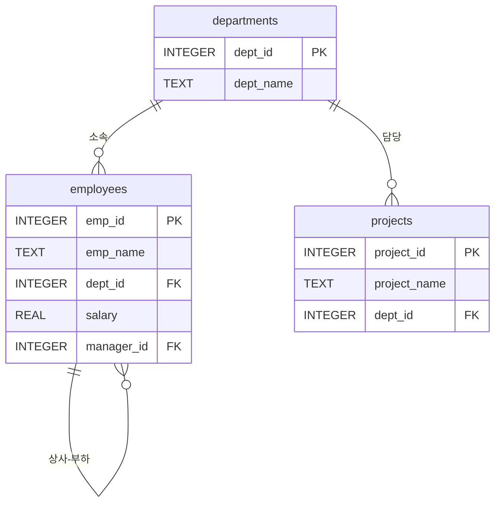

> **핵심 포인트:** erDiagram은 Mermaid에서 style 선언을 지원하지 않습니다. 관계 표기는 `||--o{`(일대다)처럼 표준 ERD 표기법을 사용합니다.

---

## 2. INNER JOIN

### 두 테이블의 교집합

INNER JOIN은 ON 절에 지정한 조건을 **양쪽 모두 만족하는 행**만 결과에 포함시킵니다. 교집합(intersection)에 해당합니다. 한쪽에만 있는 데이터는 결과에서 제외됩니다.

**비유:** 두 반의 출석부를 놓고, 두 반에 모두 이름이 올라와 있는 학생만 선발하는 것과 같습니다.

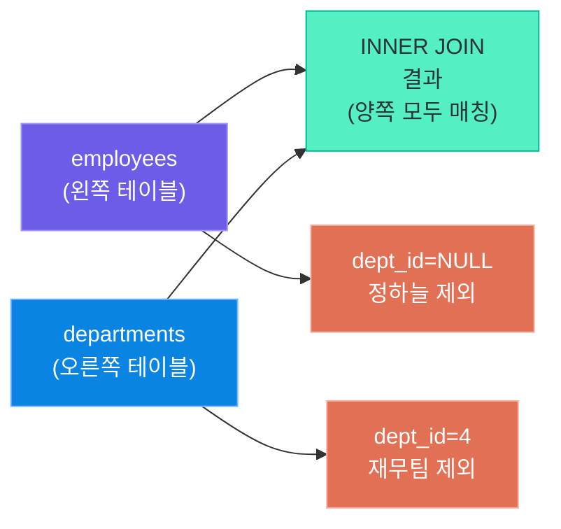

### 문법과 예제

```sql
-- inner_join.sql -- INNER JOIN 기본 예제
SELECT
    e.emp_name   AS 직원명,
    d.dept_name  AS 부서명,
    e.salary     AS 급여
FROM employees AS e
INNER JOIN departments AS d
    ON e.dept_id = d.dept_id
ORDER BY e.emp_id;
```

실행 결과:

| 직원명 | 부서명 | 급여 |
|--------|--------|------|
| 김철수 | 개발팀 | 5500000 |
| 이영희 | 개발팀 | 4800000 |
| 박민준 | 마케팅팀 | 4200000 |
| 최수진 | 마케팅팀 | 3900000 |
| 한지우 | 인사팀 | 4600000 |

부서가 없는 정하늘(dept_id=NULL)과 직원이 없는 재무팀(dept_id=4)은 모두 제외됩니다.

### 다중 테이블 INNER JOIN

세 개 이상의 테이블도 JOIN을 연결하여 합칠 수 있습니다.

```sql
-- triple_inner_join.sql -- 직원-부서-프로젝트 삼중 INNER JOIN
SELECT
    e.emp_name    AS 직원명,
    d.dept_name   AS 부서명,
    p.project_name AS 담당프로젝트
FROM employees AS e
INNER JOIN departments AS d ON e.dept_id = d.dept_id
INNER JOIN projects    AS p ON d.dept_id = p.dept_id
ORDER BY d.dept_name, e.emp_name;
```

### Python sqlite3 코드 예제

```python
# inner_join_python.py -- Python에서 INNER JOIN 실행하기
import sqlite3

conn = sqlite3.connect("company.db")
conn.row_factory = sqlite3.Row  # 컬럼명으로 접근 가능

cursor = conn.cursor()
cursor.execute("""
    SELECT
        e.emp_name  AS emp_name,
        d.dept_name AS dept_name,
        e.salary    AS salary
    FROM employees AS e
    INNER JOIN departments AS d ON e.dept_id = d.dept_id
    ORDER BY e.salary DESC
""")

rows = cursor.fetchall()
print(f"{'직원명':<10} {'부서명':<12} {'급여':>12}")
print("-" * 36)
for row in rows:
    print(f"{row['emp_name']:<10} {row['dept_name']:<12} {row['salary']:>12,.0f}")

conn.close()
```

> **핵심 포인트:** INNER JOIN은 JOIN 중에서 가장 자주 사용됩니다. ON 조건에 일치하지 않는 행은 양쪽 모두 버려지므로, NULL이나 미등록 데이터가 조용히 사라질 수 있습니다. 결과 건수가 예상보다 적다면 INNER JOIN을 의심해 보십시오.

---

## 3. LEFT (OUTER) JOIN

### 왼쪽 테이블 전체 + 오른쪽 매칭

LEFT JOIN은 왼쪽(FROM 절) 테이블의 **모든 행**을 포함하되, 오른쪽 테이블에 매칭되는 행이 없으면 오른쪽 컬럼을 NULL로 채웁니다.

**비유:** 왼쪽 출석부의 이름을 전부 먼저 적어 두고, 오른쪽 출석부에서 해당 이름을 찾으면 정보를 채우고, 없으면 빈칸으로 두는 것입니다.

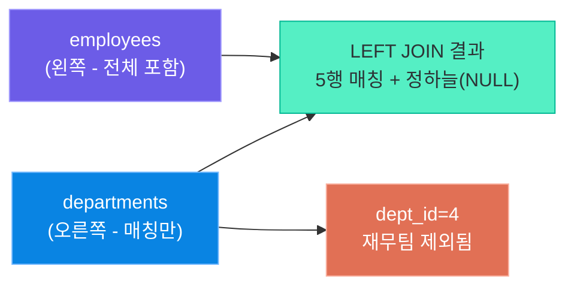

### NULL이 나오는 경우

```sql
-- left_join.sql -- 부서가 없는 직원도 포함하는 LEFT JOIN
SELECT
    e.emp_name  AS 직원명,
    d.dept_name AS 부서명,
    e.salary    AS 급여
FROM employees AS e
LEFT JOIN departments AS d
    ON e.dept_id = d.dept_id
ORDER BY e.emp_id;
```

실행 결과:

| 직원명 | 부서명 | 급여 |
|--------|--------|------|
| 김철수 | 개발팀 | 5500000 |
| 이영희 | 개발팀 | 4800000 |
| 박민준 | 마케팅팀 | 4200000 |
| 최수진 | 마케팅팀 | 3900000 |
| 정하늘 | NULL | 3500000 |
| 한지우 | 인사팀 | 4600000 |

정하늘의 부서명이 NULL로 표시됩니다. 이를 활용하면 **"아직 부서에 배정되지 않은 직원"**을 쉽게 찾을 수 있습니다.

```sql
-- left_join_unmatched.sql -- 매칭되지 않은 행만 필터링
SELECT
    e.emp_name AS 직원명,
    '미배정'   AS 부서명
FROM employees AS e
LEFT JOIN departments AS d ON e.dept_id = d.dept_id
WHERE d.dept_id IS NULL;
```

> **핵심 포인트:** LEFT JOIN 후 `WHERE 오른쪽테이블.컬럼 IS NULL` 조건을 추가하면 "왼쪽에만 있는 데이터"를 뽑을 수 있습니다. 이 패턴은 누락 데이터 탐지에서 매우 자주 사용됩니다.

---

## 4. RIGHT (OUTER) JOIN

### 오른쪽 테이블 전체 + 왼쪽 매칭

RIGHT JOIN은 LEFT JOIN의 반대입니다. 오른쪽 테이블의 모든 행을 유지하고, 왼쪽 테이블에 매칭이 없으면 NULL로 채웁니다.

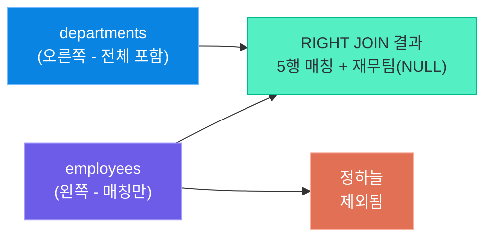

### SQLite에서의 우회 방법

SQLite는 RIGHT JOIN을 지원하지 않습니다. 테이블 순서를 바꾼 LEFT JOIN으로 완전히 동일한 결과를 얻을 수 있습니다.

```sql
-- right_join_sqlite.sql -- SQLite에서 RIGHT JOIN을 LEFT JOIN으로 대체
-- 원래 의도: employees RIGHT JOIN departments
-- 대체 방법: departments LEFT JOIN employees (테이블 순서 교환)

SELECT
    e.emp_name  AS 직원명,
    d.dept_name AS 부서명
FROM departments AS d          -- 오른쪽이었던 테이블을 왼쪽으로
LEFT JOIN employees AS e       -- 왼쪽이었던 테이블을 오른쪽으로
    ON d.dept_id = e.dept_id
ORDER BY d.dept_id;
```

실행 결과:

| 직원명 | 부서명 |
|--------|--------|
| 김철수 | 개발팀 |
| 이영희 | 개발팀 |
| 박민준 | 마케팅팀 |
| 최수진 | 마케팅팀 |
| 한지우 | 인사팀 |
| NULL | 재무팀 |

재무팀은 직원이 없으므로 직원명이 NULL로 표시됩니다.

> **핵심 포인트:** MySQL, PostgreSQL 등 대부분의 RDBMS는 RIGHT JOIN을 지원하지만, SQLite에서는 지원하지 않습니다. 실무에서는 가독성을 위해 RIGHT JOIN보다 테이블 순서를 바꾼 LEFT JOIN을 선호하는 경향이 있습니다.

---

## 5. FULL (OUTER) JOIN

### 양쪽 테이블 전체 합집합

FULL OUTER JOIN은 양쪽 테이블의 모든 행을 포함합니다. 한쪽에만 있는 행은 반대쪽 컬럼이 NULL로 채워집니다. 합집합(union) 개념입니다.

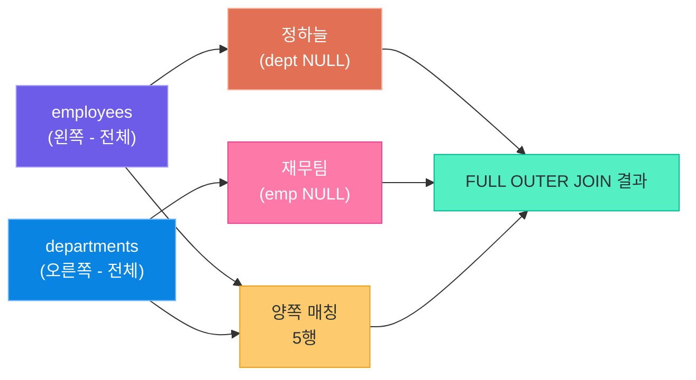

### SQLite에서 UNION으로 시뮬레이션

SQLite는 FULL OUTER JOIN을 지원하지 않습니다. LEFT JOIN과 RIGHT JOIN(테이블 교환)을 UNION으로 합쳐서 동일한 효과를 냅니다.

```sql
-- full_outer_join_sqlite.sql -- UNION으로 FULL OUTER JOIN 시뮬레이션
-- 1부: LEFT JOIN (왼쪽 전체 + 오른쪽 매칭)
SELECT
    e.emp_name  AS 직원명,
    d.dept_name AS 부서명
FROM employees AS e
LEFT JOIN departments AS d ON e.dept_id = d.dept_id

UNION

-- 2부: 오른쪽 전용 행 (departments에만 있는 부서)
SELECT
    e.emp_name  AS 직원명,
    d.dept_name AS 부서명
FROM departments AS d
LEFT JOIN employees AS e ON d.dept_id = e.dept_id
WHERE e.emp_id IS NULL

ORDER BY 부서명 NULLS LAST, 직원명;
```

| 직원명 | 부서명 |
|--------|--------|
| 이영희 | 개발팀 |
| 김철수 | 개발팀 |
| 박민준 | 마케팅팀 |
| 최수진 | 마케팅팀 |
| 한지우 | 인사팀 |
| NULL | 재무팀 |
| 정하늘 | NULL |

> **핵심 포인트:** FULL OUTER JOIN은 양쪽 테이블의 누락 데이터를 동시에 확인할 때 유용합니다. "부서도 없고, 직원도 없는" 고아 데이터를 한 번에 점검할 수 있습니다.

---

## 6. CROSS JOIN

### 카르테시안 곱 (모든 조합)

CROSS JOIN은 왼쪽 테이블의 각 행과 오른쪽 테이블의 모든 행을 조합합니다. ON 조건이 없으며, 결과 행 수는 `왼쪽 행 수 × 오른쪽 행 수`가 됩니다.

**비유:** 메뉴판에서 메인 요리 3가지와 음료 4가지를 모두 조합해 세트 메뉴 목록(12가지)을 만드는 것과 같습니다.

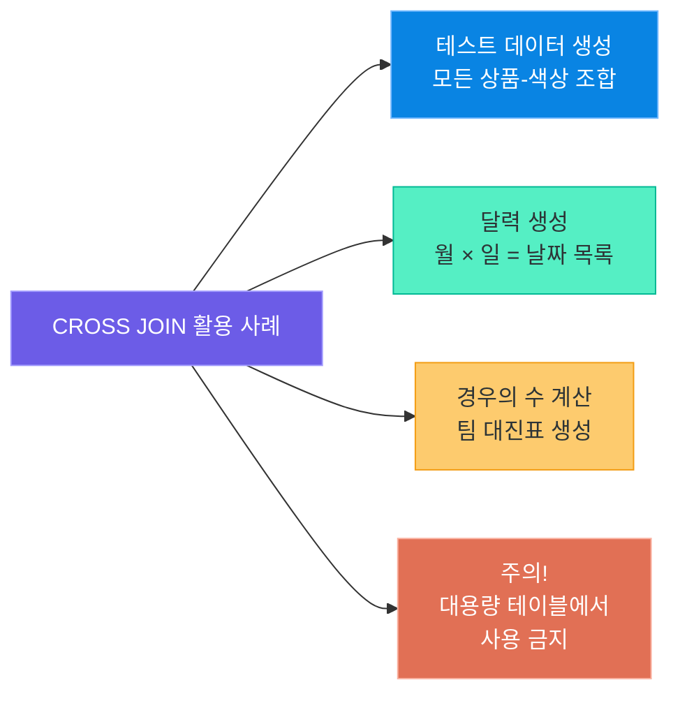

```sql
-- cross_join.sql -- CROSS JOIN으로 직원-부서 모든 조합 생성
SELECT
    e.emp_name  AS 직원명,
    d.dept_name AS 부서명
FROM employees AS e
CROSS JOIN departments AS d
ORDER BY e.emp_name, d.dept_name;
-- 결과: 6명 × 4부서 = 24행
```

실제 활용 예시 — 달력 생성:

```sql
-- calendar_cross_join.sql -- CROSS JOIN으로 월-주차 조합 생성
WITH months(m) AS (
    SELECT 1 UNION SELECT 2 UNION SELECT 3
    UNION SELECT 4 UNION SELECT 5 UNION SELECT 6
),
weeks(w) AS (
    SELECT 1 UNION SELECT 2 UNION SELECT 3
    UNION SELECT 4 UNION SELECT 5
)
SELECT
    m AS 월,
    w AS 주차,
    m || '월 ' || w || '주' AS 레이블
FROM months
CROSS JOIN weeks
ORDER BY m, w;
-- 결과: 3 × 5 = 15행
```

> **핵심 포인트:** CROSS JOIN은 강력하지만 위험합니다. 1,000행 × 1,000행 = 1,000,000행이 됩니다. 의도치 않은 카르테시안 곱은 데이터베이스를 느리게 만들거나 메모리를 소진시킬 수 있으므로, 반드시 작은 테이블(수십 행 이하)에서만 사용하십시오.

---

## 7. SELF JOIN

### 자기 자신과 JOIN

SELF JOIN은 동일한 테이블을 두 번 참조하여 JOIN하는 방식입니다. 테이블 안에 자기 참조 관계(예: 직원-상사)가 있을 때 사용합니다.

**비유:** 같은 직원 명부를 두 권 복사해 두고, 한 권에서 직원 이름을 찾고 다른 한 권에서 그 직원의 상사 이름을 찾는 것입니다.

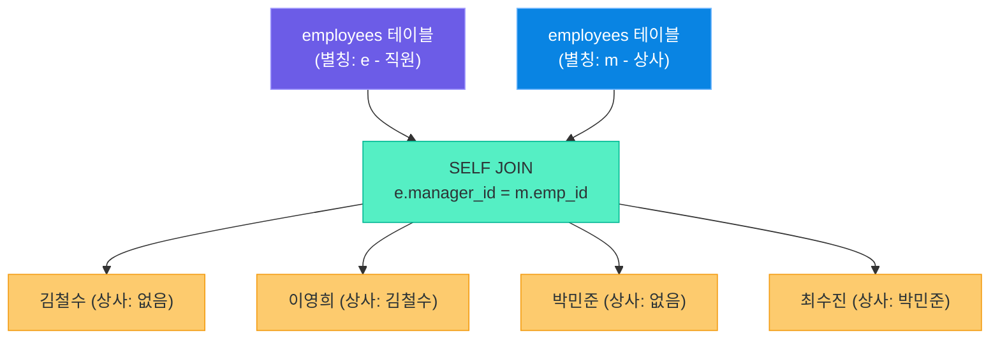

```sql
-- self_join.sql -- 직원과 직속 상사 이름을 함께 조회
SELECT
    e.emp_name AS 직원명,
    m.emp_name AS 상사명
FROM employees AS e              -- e: 직원
LEFT JOIN employees AS m         -- m: 상사 (같은 테이블, 다른 별칭)
    ON e.manager_id = m.emp_id
ORDER BY e.emp_id;
```

실행 결과:

| 직원명 | 상사명 |
|--------|--------|
| 김철수 | NULL |
| 이영희 | 김철수 |
| 박민준 | NULL |
| 최수진 | 박민준 |
| 정하늘 | NULL |
| 한지우 | NULL |

상사가 없는 직원(최고 관리자 또는 독립 직원)은 상사명이 NULL로 표시됩니다.

> **핵심 포인트:** SELF JOIN은 반드시 테이블에 **서로 다른 별칭(alias)**을 붙여야 합니다. 같은 테이블이지만 역할이 다른 두 복사본을 SQL이 구별할 수 있도록 해야 합니다.

---

## 8. JOIN 총정리

### 6종 JOIN 비교 한눈에 보기

| JOIN 종류 | 포함 범위 | NULL 발생 | SQLite 지원 |
|-----------|-----------|-----------|-------------|
| INNER JOIN | 양쪽 모두 일치하는 행 | 없음 | 지원 |
| LEFT JOIN | 왼쪽 전체 + 오른쪽 매칭 | 오른쪽 | 지원 |
| RIGHT JOIN | 오른쪽 전체 + 왼쪽 매칭 | 왼쪽 | 미지원 (LEFT JOIN 대체) |
| FULL OUTER JOIN | 양쪽 전체 | 양쪽 모두 가능 | 미지원 (UNION 대체) |
| CROSS JOIN | 모든 조합 (카르테시안 곱) | 없음 | 지원 |
| SELF JOIN | 자기 자신과 JOIN | 조건에 따라 | 지원 |

### JOIN 선택 가이드

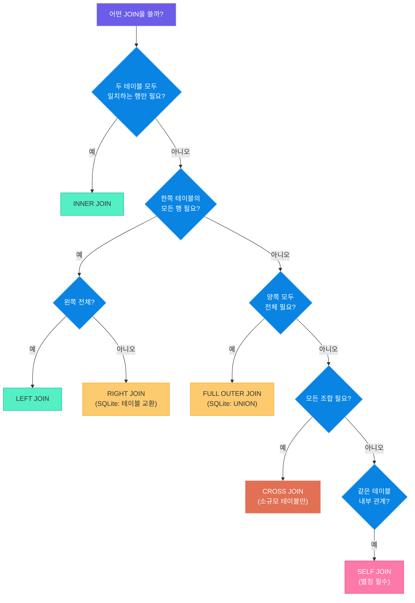

### JOIN 성능 팁

| 팁 | 설명 |
|----|------|
| 인덱스 활용 | JOIN ON 절에 사용되는 컬럼에 인덱스를 생성하면 조회 속도가 크게 향상됩니다 |
| 작은 테이블 먼저 | 쿼리 옵티마이저가 자동으로 처리하지만, FROM 절에 작은 테이블을 먼저 두는 것이 권장됩니다 |
| WHERE 먼저 필터링 | JOIN 전에 WHERE 조건으로 행 수를 줄이면 JOIN 비용이 감소합니다 |
| SELECT * 지양 | 필요한 컬럼만 명시하면 I/O와 메모리 사용을 줄일 수 있습니다 |
| EXPLAIN QUERY PLAN | SQLite에서 실행 계획을 확인하여 병목 지점을 파악합니다 |

> **핵심 포인트:** JOIN은 강력하지만, 여러 테이블을 잘못 연결하면 결과가 폭발적으로 증가하거나 잘못된 데이터를 반환할 수 있습니다. ON 조건을 정확히 명시하고, 결과 건수가 예상과 맞는지 반드시 확인하는 습관을 가지십시오.

---

## 9. 집계 함수

### COUNT, SUM, AVG, MIN, MAX

집계 함수(Aggregate Function)는 여러 행의 값을 하나의 결과로 요약합니다.

| 함수 | 기능 | 예시 |
|------|------|------|
| COUNT(*) | 전체 행 수 | COUNT(*) → 6 |
| COUNT(컬럼) | NULL 제외 행 수 | COUNT(dept_id) → 5 |
| SUM(컬럼) | 합계 | SUM(salary) |
| AVG(컬럼) | 평균 | AVG(salary) |
| MIN(컬럼) | 최솟값 | MIN(salary) |
| MAX(컬럼) | 최댓값 | MAX(salary) |

### GROUP BY

GROUP BY는 특정 컬럼의 값이 같은 행들을 그룹으로 묶고, 각 그룹에 집계 함수를 적용합니다.

```sql
-- group_by.sql -- 부서별 직원 수와 평균 급여 집계
SELECT
    d.dept_name          AS 부서명,
    COUNT(e.emp_id)      AS 직원수,
    ROUND(AVG(e.salary), 0) AS 평균급여,
    MAX(e.salary)        AS 최고급여,
    MIN(e.salary)        AS 최저급여
FROM departments AS d
LEFT JOIN employees AS e ON d.dept_id = e.dept_id
GROUP BY d.dept_id, d.dept_name
ORDER BY 평균급여 DESC;
```

실행 결과:

| 부서명 | 직원수 | 평균급여 | 최고급여 | 최저급여 |
|--------|--------|---------|---------|---------|
| 개발팀 | 2 | 5150000 | 5500000 | 4800000 |
| 인사팀 | 1 | 4600000 | 4600000 | 4600000 |
| 마케팅팀 | 2 | 4050000 | 4200000 | 3900000 |
| 재무팀 | 0 | NULL | NULL | NULL |

### HAVING — WHERE와의 차이

WHERE는 개별 행을 필터링하고, HAVING은 **GROUP BY 후 그룹**을 필터링합니다.

```sql
-- having_vs_where.sql -- HAVING으로 그룹 필터링
SELECT
    d.dept_name          AS 부서명,
    COUNT(e.emp_id)      AS 직원수,
    ROUND(AVG(e.salary), 0) AS 평균급여
FROM departments AS d
INNER JOIN employees AS e ON d.dept_id = e.dept_id
WHERE e.salary >= 4000000          -- 1단계: 급여 400만 이상인 직원만 포함
GROUP BY d.dept_id, d.dept_name
HAVING COUNT(e.emp_id) >= 2        -- 2단계: 직원이 2명 이상인 부서만 포함
ORDER BY 평균급여 DESC;
```

### SELECT 실행 순서

SQL 쿼리는 작성 순서와 실행 순서가 다릅니다. 이를 이해하면 오류를 줄일 수 있습니다.

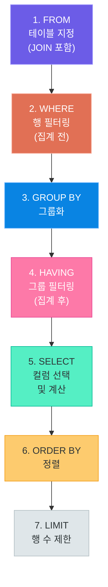

실행 순서의 의미:

- WHERE 절에서는 집계 함수(COUNT, SUM 등)를 사용할 수 없습니다. 집계 전이기 때문입니다.
- HAVING 절에서는 집계 함수를 사용할 수 있습니다. 집계 후이기 때문입니다.
- SELECT 별칭(AS로 붙인 이름)은 ORDER BY에서는 사용할 수 있지만, WHERE나 HAVING에서는 사용할 수 없습니다.

> **핵심 포인트:** `WHERE`는 JOIN 후 개별 행을 거르는 체(망)이고, `HAVING`은 GROUP BY 후 그룹 전체를 거르는 체입니다. 집계 결과를 조건으로 쓰고 싶다면 반드시 HAVING을 사용하십시오.

### Python sqlite3 집계 코드 예제

```python
# aggregate_python.py -- Python으로 부서별 집계 결과를 딕셔너리로 가져오기
import sqlite3

def get_dept_stats(db_path: str) -> list[dict]:
    """부서별 직원 수, 평균 급여, 최고/최저 급여를 집계하여 반환합니다."""
    conn = sqlite3.connect(db_path)
    conn.row_factory = sqlite3.Row

    cursor = conn.cursor()
    cursor.execute("""
        SELECT
            d.dept_name                 AS dept_name,
            COUNT(e.emp_id)             AS emp_count,
            COALESCE(ROUND(AVG(e.salary), 0), 0) AS avg_salary,
            COALESCE(MAX(e.salary), 0)  AS max_salary,
            COALESCE(MIN(e.salary), 0)  AS min_salary
        FROM departments AS d
        LEFT JOIN employees AS e ON d.dept_id = e.dept_id
        GROUP BY d.dept_id, d.dept_name
        HAVING COUNT(e.emp_id) > 0
        ORDER BY avg_salary DESC
    """)

    results = [dict(row) for row in cursor.fetchall()]
    conn.close()
    return results


if __name__ == "__main__":
    stats = get_dept_stats("company.db")
    header = f"{'부서명':<12} {'직원수':>6} {'평균급여':>12} {'최고급여':>12} {'최저급여':>12}"
    print(header)
    print("-" * len(header))
    for s in stats:
        print(
            f"{s['dept_name']:<12} {s['emp_count']:>6} "
            f"{s['avg_salary']:>12,.0f} {s['max_salary']:>12,.0f} "
            f"{s['min_salary']:>12,.0f}"
        )
```

---

## 10. 서브쿼리

### 서브쿼리란

서브쿼리(Subquery)는 SQL 문 안에 중첩된 또 다른 SELECT 문입니다. 복잡한 조건이나 중간 결과를 표현할 때 사용합니다.

**비유:** 도서관에서 "베스트셀러 목록에 있는 책들 중 2024년 출판된 것"을 찾을 때, 먼저 베스트셀러 목록을 가져온 다음 그 중에서 연도를 필터링하는 2단계 검색과 같습니다.

### 서브쿼리 위치별 분류

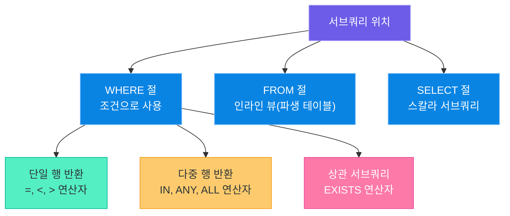

### WHERE 절 서브쿼리

```sql
-- subquery_where.sql -- 평균 급여 이상인 직원 조회
SELECT
    emp_name AS 직원명,
    salary   AS 급여
FROM employees
WHERE salary >= (
    SELECT AVG(salary) FROM employees    -- 단일 행 서브쿼리
)
ORDER BY salary DESC;
```

다중 행 서브쿼리와 IN 연산자:

```sql
-- subquery_in.sql -- 프로젝트를 수행 중인 부서의 직원 조회
SELECT emp_name AS 직원명
FROM employees
WHERE dept_id IN (
    SELECT dept_id FROM projects         -- 다중 행 서브쿼리
);
```

### FROM 절 서브쿼리 (인라인 뷰)

```sql
-- subquery_from.sql -- 부서별 평균 급여 중 상위 2개 부서
SELECT
    dept_summary.부서명,
    dept_summary.평균급여
FROM (
    SELECT
        d.dept_name          AS 부서명,
        ROUND(AVG(e.salary), 0) AS 평균급여
    FROM departments AS d
    INNER JOIN employees AS e ON d.dept_id = e.dept_id
    GROUP BY d.dept_id, d.dept_name
) AS dept_summary                        -- 파생 테이블에 별칭 필요
ORDER BY dept_summary.평균급여 DESC
LIMIT 2;
```

### SELECT 절 서브쿼리 (스칼라 서브쿼리)

```sql
-- subquery_select.sql -- 각 직원의 급여와 전체 평균 급여를 함께 표시
SELECT
    emp_name AS 직원명,
    salary   AS 급여,
    (SELECT ROUND(AVG(salary), 0) FROM employees) AS 전체평균급여,
    salary - (SELECT AVG(salary) FROM employees)  AS 평균대비차이
FROM employees
ORDER BY 평균대비차이 DESC;
```

### 상관 서브쿼리와 EXISTS

상관 서브쿼리(Correlated Subquery)는 외부 쿼리의 컬럼을 서브쿼리 안에서 참조합니다. 외부 행마다 서브쿼리가 실행됩니다.

```sql
-- correlated_subquery.sql -- 소속 부서 평균보다 급여가 높은 직원
SELECT
    e.emp_name  AS 직원명,
    e.salary    AS 급여,
    d.dept_name AS 부서명
FROM employees AS e
INNER JOIN departments AS d ON e.dept_id = d.dept_id
WHERE e.salary > (
    SELECT AVG(e2.salary)
    FROM employees AS e2
    WHERE e2.dept_id = e.dept_id    -- 외부 쿼리의 e.dept_id 참조
);
```

EXISTS 연산자:

```sql
-- exists_subquery.sql -- 담당 프로젝트가 있는 부서의 직원만 조회
SELECT e.emp_name AS 직원명
FROM employees AS e
WHERE EXISTS (
    SELECT 1
    FROM projects AS p
    WHERE p.dept_id = e.dept_id     -- 상관 서브쿼리
);
-- EXISTS는 서브쿼리에서 한 행이라도 반환되면 TRUE
```

| 연산자 | 특징 | 사용 예 |
|--------|------|---------|
| IN | 서브쿼리 결과 목록과 비교 | dept_id IN (SELECT ...) |
| EXISTS | 결과 존재 여부만 확인 (빠름) | EXISTS (SELECT 1 FROM ...) |
| ANY | 결과 중 하나라도 조건 만족 | salary > ANY (SELECT ...) |
| ALL | 결과 모두 조건 만족 | salary > ALL (SELECT ...) |

> **핵심 포인트:** EXISTS는 서브쿼리 결과의 첫 번째 매칭 행을 찾으면 즉시 멈추므로, IN보다 대용량 데이터에서 더 빠른 경우가 많습니다. 대용량 테이블에서 `IN (서브쿼리)` 대신 `EXISTS`를 먼저 고려해 보십시오.

---

## 11. CTE — Common Table Expression

### WITH 절 문법

CTE(공통 테이블 표현식)는 쿼리 내에서 임시로 이름을 붙인 결과 집합입니다. `WITH` 절로 정의하고, 이후 메인 쿼리에서 일반 테이블처럼 참조합니다.

**비유:** 보고서를 작성하기 전에 초안 메모지를 여러 장 써 두고, 본문에서 "3번 메모지 참고"라고 인용하는 것과 같습니다.

```sql
-- cte_basic.sql -- CTE로 부서별 통계를 먼저 계산하고 메인 쿼리에서 활용
WITH dept_stats AS (                       -- CTE 정의
    SELECT
        d.dept_id,
        d.dept_name,
        COUNT(e.emp_id)         AS 직원수,
        ROUND(AVG(e.salary), 0) AS 평균급여
    FROM departments AS d
    LEFT JOIN employees AS e ON d.dept_id = e.dept_id
    GROUP BY d.dept_id, d.dept_name
)
SELECT                                     -- 메인 쿼리에서 CTE 참조
    dept_name  AS 부서명,
    직원수,
    평균급여,
    CASE
        WHEN 평균급여 >= 5000000 THEN '고급여'
        WHEN 평균급여 >= 4000000 THEN '중급여'
        ELSE '저급여'
    END AS 급여등급
FROM dept_stats
ORDER BY 평균급여 DESC;
```

여러 CTE를 콤마로 연결하여 단계적으로 정의할 수도 있습니다:

```sql
-- multi_cte.sql -- 복수 CTE 체이닝
WITH
high_salary_emps AS (
    SELECT * FROM employees WHERE salary >= 4500000
),
their_depts AS (
    SELECT DISTINCT dept_id FROM high_salary_emps WHERE dept_id IS NOT NULL
)
SELECT d.dept_name AS 고연봉부서
FROM departments AS d
WHERE d.dept_id IN (SELECT dept_id FROM their_depts);
```

### 재귀 CTE — 조직도 계층 탐색

재귀 CTE는 자기 자신을 참조하여 계층 구조를 순회합니다. 조직도, 카테고리 트리, 경로 탐색 등에 활용됩니다.

```sql
-- recursive_cte.sql -- 재귀 CTE로 조직도 계층 구조 탐색
WITH RECURSIVE org_chart AS (
    -- 1. 앵커 쿼리: 최상위 직원(상사 없는 직원)으로 시작
    SELECT
        emp_id,
        emp_name,
        manager_id,
        0          AS 계층레벨,
        emp_name   AS 경로
    FROM employees
    WHERE manager_id IS NULL

    UNION ALL

    -- 2. 재귀 쿼리: 부하 직원을 한 단계씩 탐색
    SELECT
        e.emp_id,
        e.emp_name,
        e.manager_id,
        oc.계층레벨 + 1,
        oc.경로 || ' > ' || e.emp_name
    FROM employees AS e
    INNER JOIN org_chart AS oc ON e.manager_id = oc.emp_id
)
SELECT
    REPEAT('  ', 계층레벨) || emp_name AS 조직도,
    계층레벨,
    경로
FROM org_chart
ORDER BY 경로;
```

실행 결과 (계층 시각화):

| 조직도 | 계층레벨 | 경로 |
|--------|---------|------|
| 김철수 | 0 | 김철수 |
| &nbsp;&nbsp;이영희 | 1 | 김철수 > 이영희 |
| 박민준 | 0 | 박민준 |
| &nbsp;&nbsp;최수진 | 1 | 박민준 > 최수진 |
| 정하늘 | 0 | 정하늘 |
| 한지우 | 0 | 한지우 |

### CTE vs 서브쿼리 비교

| 항목 | 서브쿼리 | CTE |
|------|---------|-----|
| 가독성 | 중첩이 깊어질수록 어렵다 | WITH 절로 분리되어 명확하다 |
| 재사용 | 같은 서브쿼리를 반복 작성 | 정의한 이름을 여러 번 참조 가능 |
| 디버깅 | CTE 각 단계별 독립 실행 불가 | 각 CTE를 독립적으로 실행하여 중간 결과 확인 가능 |
| 재귀 | 불가능 | RECURSIVE 키워드로 가능 |
| 성능 | 옵티마이저가 인라인 처리 | 일부 DB에서 materialized(임시 저장) |
| 지원 | 모든 SQL 버전 | SQL:1999 이후 / SQLite 3.8.3 이상 |

> **핵심 포인트:** CTE는 복잡한 쿼리를 단계별로 쪼개서 작성할 수 있게 해 주는 "SQL의 함수 분리"와 같습니다. 서브쿼리가 세 단계 이상 중첩되기 시작하면 CTE로 리팩터링하는 것을 강력히 권장합니다.

---

## 12. 핵심 정리

### JOIN 6종 요약

| JOIN 종류 | 결과 범위 | 핵심 키워드 | SQLite |
|-----------|----------|------------|--------|
| INNER JOIN | 교집합 (양쪽 일치) | 가장 기본, 가장 자주 사용 | 지원 |
| LEFT JOIN | 왼쪽 전체 + 오른쪽 NULL 가능 | 누락 데이터 탐지 | 지원 |
| RIGHT JOIN | 오른쪽 전체 + 왼쪽 NULL 가능 | LEFT JOIN 테이블 교환으로 대체 | 미지원 |
| FULL OUTER JOIN | 합집합 (양쪽 모두) | UNION으로 대체 | 미지원 |
| CROSS JOIN | 카르테시안 곱 (모든 조합) | 소규모 전용, 주의 필요 | 지원 |
| SELF JOIN | 자기 참조 관계 | 별칭(alias) 필수 | 지원 |

### 집계 함수, 서브쿼리, CTE 요약

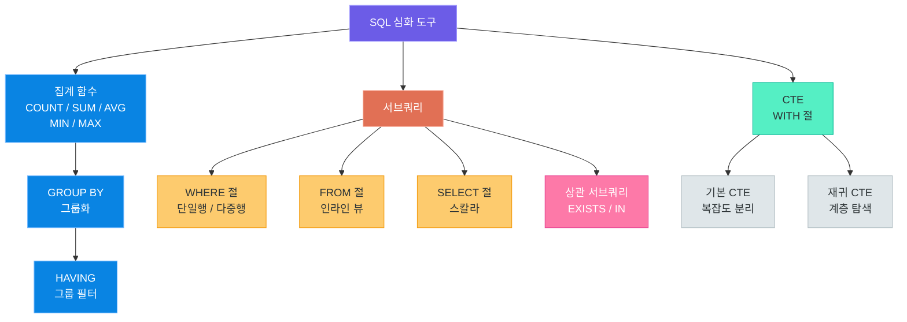

### Key Takeaways

1. **JOIN은 정규화된 데이터를 분석 목적으로 다시 합치는 핵심 도구입니다.** 6가지 JOIN의 차이를 이해하고 상황에 맞게 선택하십시오.

2. **LEFT JOIN + IS NULL 패턴**으로 누락 데이터나 고아 레코드를 효율적으로 탐지할 수 있습니다.

3. **SQLite는 RIGHT JOIN과 FULL OUTER JOIN을 지원하지 않습니다.** LEFT JOIN 테이블 교환과 UNION으로 대체합니다.

4. **GROUP BY는 집계 함수와 함께 사용하며, 집계 결과를 필터링할 때는 WHERE가 아닌 HAVING을 사용합니다.**

5. **SQL 실행 순서**는 FROM → WHERE → GROUP BY → HAVING → SELECT → ORDER BY → LIMIT입니다. 이 순서를 이해하면 많은 오류를 예방할 수 있습니다.

6. **서브쿼리는 강력하지만, 3단계 이상 중첩되면 CTE로 리팩터링하여 가독성을 높이십시오.**

7. **재귀 CTE**는 조직도, 카테고리 트리 같은 계층 구조 탐색에 필수적인 도구입니다.

---

### 자주 하는 실수와 해결 방법

| 실수 | 증상 | 해결 방법 |
|------|------|-----------|
| ON 조건 없이 JOIN | 카르테시안 곱 발생, 결과가 폭발적으로 증가 | ON 절을 반드시 명시하십시오 |
| WHERE와 HAVING 혼용 | 집계 함수를 WHERE에 사용하면 오류 발생 | 집계 조건은 HAVING으로 이동하십시오 |
| GROUP BY 누락 | SELECT에 집계 함수와 일반 컬럼 혼용 시 오류 | 집계하지 않는 컬럼은 GROUP BY에 추가하십시오 |
| NULL 비교 오류 | `= NULL` 대신 `IS NULL` 사용해야 함 | NULL 비교는 항상 IS NULL / IS NOT NULL을 사용하십시오 |
| CTE 이름 충돌 | WITH 절에서 테이블명과 같은 이름 사용 | 기존 테이블명과 겹치지 않는 이름을 사용하십시오 |
| 서브쿼리 다중 행 반환 | 단일 행 연산자(=)에 다중 행 서브쿼리 사용 | IN, ANY, ALL 또는 집계 함수로 단일 행으로 만드십시오 |

---

### 다음 강의 미리보기

Day 20에서는 데이터 무결성을 보장하는 **키, 제약조건, 인덱스**를 다룹니다. PRIMARY KEY, FOREIGN KEY, UNIQUE, NOT NULL 같은 제약조건이 어떻게 잘못된 데이터 입력을 막는지, 그리고 인덱스가 어떻게 조회 속도를 높이는지 배웁니다.

---

> **이전 강의:** [SQL 기초와 SQLite 실습](03_sql_basics_with_sqlite.md)
>
> **다음 강의:** [키, 제약조건, 인덱스](05_keys_constraints_indexes.md)
