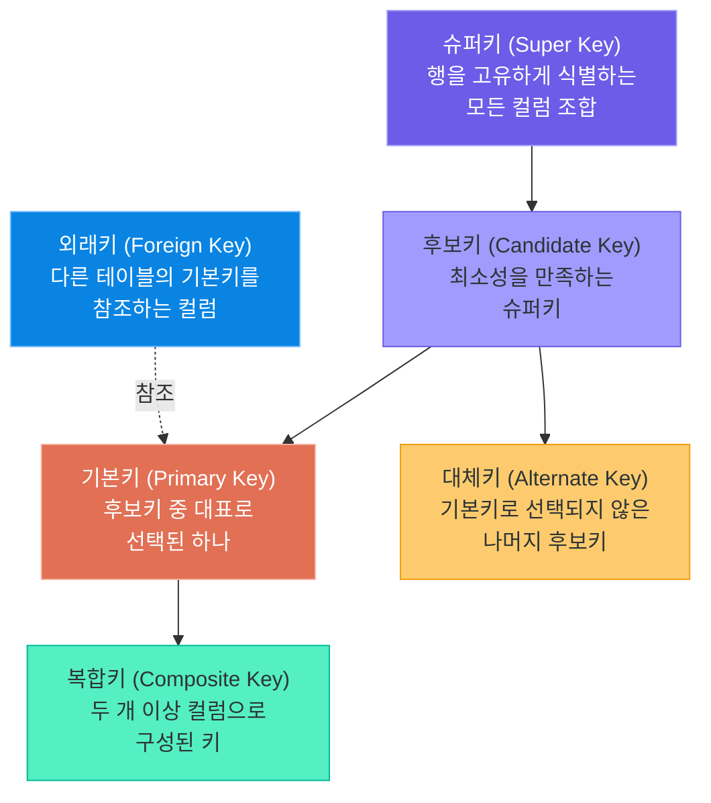
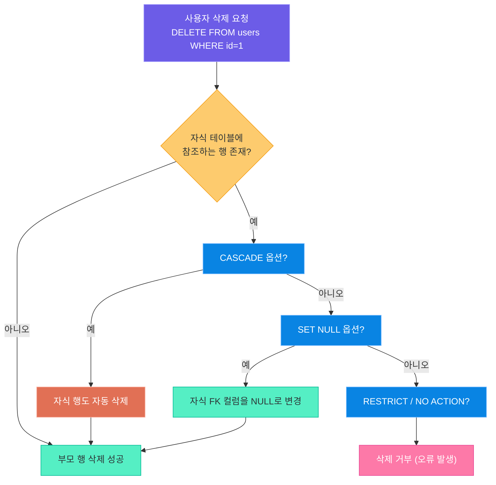
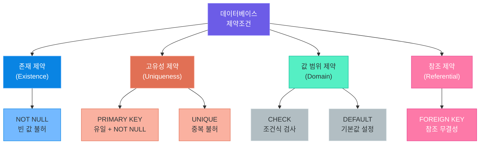
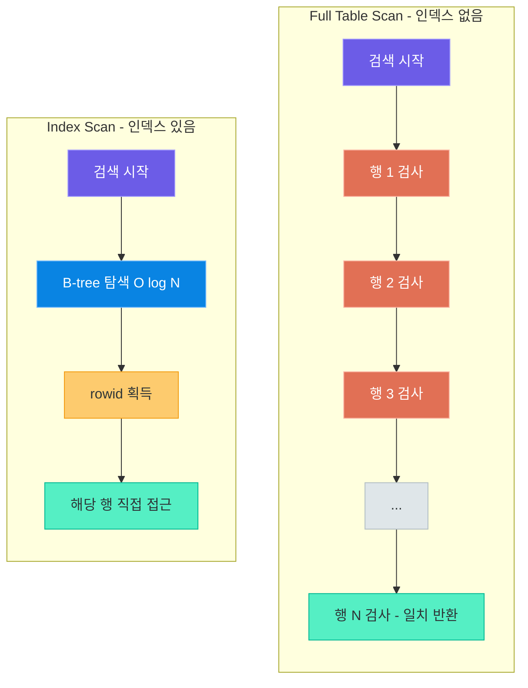
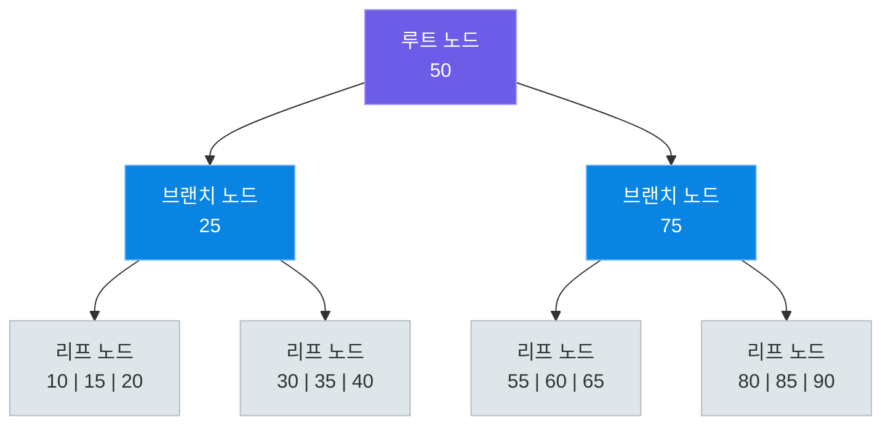
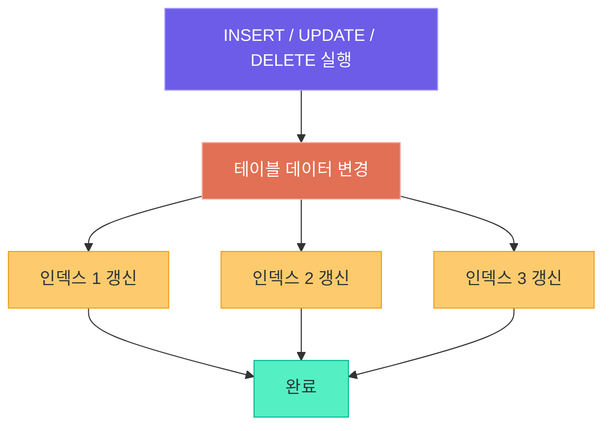
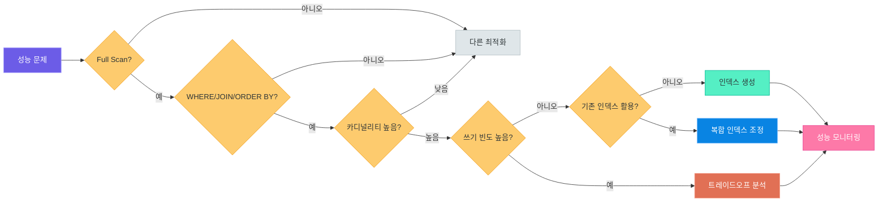

# 키, 제약조건, 인덱스

> 데이터베이스의 신뢰성과 성능은 키와 제약조건으로 보장하고, 인덱스로 가속합니다.
> 올바른 설계만이 수백만 건의 데이터를 밀리초 안에 찾아낼 수 있게 합니다.

---

## 1. 키(Key)의 역할과 중요성

### 데이터를 고유하게 식별하는 수단

데이터베이스에서 **키(Key)**란 테이블 안의 특정 행(row)을 고유하게 식별하기 위한 하나 이상의 컬럼을 의미합니다.

현실 세계를 떠올려 보겠습니다. 우리는 사람을 구분할 때 이름만으로는 부족합니다. "김철수"라는 이름이 동명이인일 수 있기 때문입니다. 그래서 국가는 **주민등록번호**를, 학교는 **학번**을, 회사는 **사원번호**를 부여합니다. 이처럼 절대로 겹치지 않는 고유한 식별자가 바로 키의 역할입니다.

| 현실 세계 | 데이터베이스 |
|-----------|-------------|
| 주민등록번호 | Primary Key |
| 학번 (학교 내 고유) | Candidate Key |
| 이름 + 생년월일 조합 | Composite Key |
| 다른 기관이 발급한 번호 참조 | Foreign Key |

### 키의 종류 계층 구조



- **슈퍼키**: 행을 고유하게 식별할 수 있는 컬럼 집합입니다. `(id)`, `(id, name)`, `(email)` 등 모두 슈퍼키가 될 수 있습니다.
- **후보키**: 슈퍼키 중 **최소성**을 만족하는 것입니다. 불필요한 컬럼 없이 최소한의 컬럼으로 행을 식별합니다.
- **기본키**: 후보키 중 테이블을 대표하도록 설계자가 선택한 키입니다.
- **대체키**: 기본키로 선택되지 않은 나머지 후보키입니다. `UNIQUE` 제약조건으로 관리합니다.

> **핵심 포인트:** 키는 단순한 번호 부여가 아닙니다. 키의 설계가 테이블 간 관계와 데이터 무결성의 기반을 결정합니다. 처음부터 올바른 키를 설계하는 것이 이후 모든 개발의 품질을 좌우합니다.

---

## 2. 기본키 (Primary Key)

### 유일성과 NOT NULL

**기본키(Primary Key, PK)**는 두 가지 절대적인 조건을 만족해야 합니다.

1. **유일성(Uniqueness)**: 테이블 내 모든 행에서 기본키 값이 중복되어서는 안 됩니다.
2. **NOT NULL**: 기본키 컬럼에는 NULL 값이 허용되지 않습니다.

이 두 조건은 논리적으로 당연합니다. "누군지 모른다(NULL)"거나 "두 명이 같은 번호(중복)"라면 식별 수단으로서 의미가 없기 때문입니다.

### 단일 컬럼 PK vs 복합 PK

| 구분 | 단일 컬럼 PK | 복합 PK (Composite PK) |
|------|-------------|----------------------|
| 정의 | 하나의 컬럼으로 식별 | 두 개 이상 컬럼 조합으로 식별 |
| 예시 | `user_id INTEGER PRIMARY KEY` | `(user_id, product_id)` |
| 사용 상황 | 독립적으로 존재하는 엔티티 | 관계 테이블(N:M 연결) |
| 장점 | 단순하고 JOIN이 쉽다 | 자연스러운 비즈니스 의미 표현 |
| 단점 | 추가 컬럼 필요 | FK 참조 시 복수 컬럼 필요 |

### AUTO INCREMENT와 AUTOINCREMENT

SQLite에서 자동으로 증가하는 기본키를 만드는 방법은 두 가지입니다.

```sql
-- 방법 1: INTEGER PRIMARY KEY (rowid의 별칭, 권장)
CREATE TABLE users (
    id INTEGER PRIMARY KEY,
    name TEXT NOT NULL
);

-- 방법 2: INTEGER PRIMARY KEY AUTOINCREMENT (엄격한 단조 증가 보장)
CREATE TABLE users_strict (
    id INTEGER PRIMARY KEY AUTOINCREMENT,
    name TEXT NOT NULL
);
```

| 구분 | `INTEGER PRIMARY KEY` | `INTEGER PRIMARY KEY AUTOINCREMENT` |
|------|----------------------|-------------------------------------|
| 재사용 여부 | 삭제된 최댓값 재사용 가능 | 절대 재사용하지 않음 |
| 성능 | 약간 빠름 | 내부 테이블 조회로 약간 느림 |
| 권장 | 대부분의 경우 | 감사 로그 등 단조 증가 필수 시 |

### 자연키 vs 대리키 (Surrogate Key)

**자연키(Natural Key)**는 현실 세계에 이미 존재하는 의미 있는 값을 키로 사용하는 것입니다. 주민등록번호, 이메일, ISBN 코드 등이 해당합니다.

**대리키(Surrogate Key)**는 데이터베이스가 임의로 부여하는 의미 없는 번호입니다. 자동 증가 정수가 가장 일반적입니다.

| 비교 항목 | 자연키 | 대리키 |
|-----------|--------|--------|
| 의미 | 비즈니스 의미 내포 | 의미 없는 일련번호 |
| 예시 | 이메일, 주민번호, ISBN | 1, 2, 3, 4... |
| 변경 가능성 | 변경될 수 있음 | 절대 변경 불필요 |
| 크기 | 문자열이면 크고 느림 | 정수로 작고 빠름 |
| FK 연결 | FK도 함께 변경 필요 | FK 영향 없음 |
| 권장 여부 | 신중하게 사용 | **일반적으로 권장** |

이메일을 기본키로 사용하면, 사용자가 이메일을 변경할 때 이를 참조하는 모든 외래키도 함께 변경해야 하는 연쇄 문제가 발생합니다. 대리키는 이 문제를 근본적으로 해결합니다.

### SQLite에서의 PK 동작 (rowid)

SQLite는 내부적으로 모든 테이블에 **rowid**라는 64비트 정수 식별자를 자동으로 부여합니다. `INTEGER PRIMARY KEY`로 선언된 컬럼은 rowid의 별칭(alias)이 되어, 별도의 저장 공간 없이 동작합니다.

```python
# filename: sqlite_pk_demo.py -- 기본키 동작 확인 예제
import sqlite3

conn = sqlite3.connect(":memory:")
cursor = conn.cursor()

# 테이블 생성
cursor.execute("""
    CREATE TABLE users (
        id   INTEGER PRIMARY KEY,
        name TEXT    NOT NULL,
        email TEXT   UNIQUE NOT NULL
    )
""")

# 데이터 삽입 (id 미지정 시 자동 할당)
cursor.execute("INSERT INTO users (name, email) VALUES (?, ?)",
               ("김철수", "chulsoo@example.com"))
cursor.execute("INSERT INTO users (name, email) VALUES (?, ?)",
               ("이영희", "younghee@example.com"))

# rowid와 id가 동일함을 확인
cursor.execute("SELECT id, rowid, name FROM users")
rows = cursor.fetchall()
for row in rows:
    print(f"id={row[0]}, rowid={row[1]}, name={row[2]}")
# 출력: id=1, rowid=1, name=김철수
#       id=2, rowid=2, name=이영희

conn.close()
```

> **핵심 포인트:** 대부분의 테이블에는 `id INTEGER PRIMARY KEY`를 사용하는 것이 가장 안전하고 성능도 좋습니다. 자연키는 비즈니스 규칙이 바뀌면 데이터베이스 전체에 파급 효과를 일으킬 수 있습니다.

---

## 3. 외래키 (Foreign Key)

### 테이블 간 관계를 맺는 열쇠

**외래키(Foreign Key, FK)**는 한 테이블의 컬럼이 다른 테이블의 기본키를 참조하도록 선언하는 제약조건입니다. 이를 통해 두 테이블 사이에 논리적 관계가 형성됩니다.

현실 비유를 들어보겠습니다. 도서관에서 대출 장부를 작성할 때, 각 대출 기록에는 "누가 빌렸는지"와 "무슨 책인지"를 기록합니다. 이 때 "회원 번호"와 "도서 번호"를 적는데, 이 번호들이 각각 회원 대장과 도서 목록의 항목을 가리키는 **참조 번호**가 됩니다. FK는 바로 이 참조 번호의 역할을 합니다.

### FOREIGN KEY REFERENCES 문법

```sql
-- 부모 테이블 (참조당하는 쪽)
CREATE TABLE users (
    id   INTEGER PRIMARY KEY,
    name TEXT    NOT NULL
);

-- 자식 테이블 (참조하는 쪽)
CREATE TABLE posts (
    id      INTEGER PRIMARY KEY,
    user_id INTEGER NOT NULL,
    title   TEXT    NOT NULL,
    content TEXT,
    FOREIGN KEY (user_id) REFERENCES users(id)
);
```

### SQLite에서 외래키 활성화

SQLite는 기본적으로 외래키 제약을 **비활성화** 상태로 시작합니다. 외래키 검사를 실제로 수행하려면 연결마다 다음 명령을 실행해야 합니다.

```python
# filename: sqlite_fk_enable.py -- 외래키 활성화 방법
import sqlite3

conn = sqlite3.connect("blog.db")
# 반드시 연결 직후 실행
conn.execute("PRAGMA foreign_keys = ON")
cursor = conn.cursor()
```

### ON DELETE / ON UPDATE 옵션

부모 테이블의 행이 삭제되거나 기본키가 변경될 때 자식 테이블의 FK 컬럼을 어떻게 처리할지 정의합니다.

| 옵션 | 동작 설명 | 사용 상황 |
|------|-----------|-----------|
| `CASCADE` | 부모 삭제/변경 시 자식도 함께 처리 | 게시글 삭제 시 댓글도 삭제 |
| `SET NULL` | 부모 삭제 시 자식 FK를 NULL로 | 작성자 탈퇴 후 글은 남기되 익명 처리 |
| `SET DEFAULT` | 부모 삭제 시 자식 FK를 기본값으로 | 기본 카테고리로 이동 |
| `RESTRICT` | 자식이 존재하면 부모 삭제 거부 | 참조 무결성 엄격 적용 |
| `NO ACTION` | 즉시 검사 없음 (트랜잭션 종료 시 검사) | 기본값, RESTRICT와 유사 |

### FK 참조 무결성 동작 흐름



### 코드 예제: posts → users FK 관계

```python
# filename: sqlite_fk_example.py -- 외래키 관계 생성 및 참조 무결성 확인
import sqlite3

conn = sqlite3.connect(":memory:")
conn.execute("PRAGMA foreign_keys = ON")
cursor = conn.cursor()

# 부모 테이블
cursor.execute("""
    CREATE TABLE users (
        id   INTEGER PRIMARY KEY,
        name TEXT NOT NULL
    )
""")

# 자식 테이블 (CASCADE 옵션 적용)
cursor.execute("""
    CREATE TABLE posts (
        id      INTEGER PRIMARY KEY,
        user_id INTEGER NOT NULL,
        title   TEXT    NOT NULL,
        FOREIGN KEY (user_id) REFERENCES users(id) ON DELETE CASCADE
    )
""")

# 데이터 삽입
cursor.execute("INSERT INTO users VALUES (1, '김철수')")
cursor.execute("INSERT INTO posts VALUES (1, 1, '첫 번째 글')")
cursor.execute("INSERT INTO posts VALUES (2, 1, '두 번째 글')")

# 부모 삭제 시 자식도 자동 삭제됨 (CASCADE)
cursor.execute("DELETE FROM users WHERE id = 1")
conn.commit()

cursor.execute("SELECT * FROM posts")
print(cursor.fetchall())  # 결과: [] (posts도 삭제됨)

# 존재하지 않는 user_id 삽입 시도 → 오류
try:
    cursor.execute("INSERT INTO posts VALUES (3, 999, '유령 글')")
    conn.commit()
except sqlite3.IntegrityError as e:
    print(f"무결성 오류: {e}")
    # FOREIGN KEY constraint failed

conn.close()
```

> **핵심 포인트:** 외래키는 데이터의 **참조 무결성(Referential Integrity)**을 보장합니다. 존재하지 않는 사용자의 게시글, 탈퇴한 회원의 주문 같은 "고아 데이터"가 생기는 것을 데이터베이스 레벨에서 방지합니다.

---

## 4. 제약조건 (Constraints) 총정리

### 제약조건이란?

**제약조건(Constraint)**은 컬럼 또는 테이블에 저장될 수 있는 데이터의 종류와 범위를 제한하는 규칙입니다. 잘못된 데이터가 처음부터 들어오지 못하도록 입구에서 검사하는 **문지기** 역할을 합니다.

애플리케이션 코드로도 유효성 검사를 할 수 있지만, 여러 애플리케이션이 같은 데이터베이스에 접근하거나 직접 SQL로 데이터를 조작할 때는 코드 레벨 검사가 우회됩니다. 데이터베이스 레벨의 제약조건은 어떤 경로로 접근해도 반드시 지켜집니다.

### 제약조건 분류



### 제약조건별 역할과 문법 비교

| 제약조건 | 역할 | 문법 예시 | NULL 허용 |
|----------|------|-----------|-----------|
| `NOT NULL` | 빈 값 저장 금지 | `name TEXT NOT NULL` | 불허 |
| `UNIQUE` | 중복값 금지 | `email TEXT UNIQUE` | 허용 (NULL 여러 개 가능) |
| `DEFAULT` | 미입력 시 기본값 | `status TEXT DEFAULT 'active'` | 해당 없음 |
| `CHECK` | 조건식 만족 여부 검사 | `age INTEGER CHECK (age >= 0)` | 해당 없음 |
| `PRIMARY KEY` | 행의 고유 식별자 | `id INTEGER PRIMARY KEY` | 불허 |
| `FOREIGN KEY` | 다른 테이블 참조 | `FOREIGN KEY (col) REFERENCES t(id)` | 허용 |

### 모든 제약조건을 적용한 테이블 생성 예제

```python
# filename: sqlite_constraints_demo.py -- 모든 제약조건 종합 예제
import sqlite3

conn = sqlite3.connect(":memory:")
conn.execute("PRAGMA foreign_keys = ON")
cursor = conn.cursor()

# 부서 테이블 (참조 대상)
cursor.execute("""
    CREATE TABLE departments (
        id   INTEGER PRIMARY KEY,
        name TEXT    NOT NULL UNIQUE
    )
""")

# 직원 테이블 (모든 제약조건 적용)
cursor.execute("""
    CREATE TABLE employees (
        id          INTEGER PRIMARY KEY,         -- 기본키: 유일 + NOT NULL
        name        TEXT    NOT NULL,            -- 이름은 반드시 입력
        email       TEXT    NOT NULL UNIQUE,     -- 이메일 중복 불허
        age         INTEGER CHECK (age BETWEEN 18 AND 65),  -- 나이 범위 제한
        salary      REAL    DEFAULT 3000000.0,  -- 급여 기본값
        dept_id     INTEGER,
        status      TEXT    DEFAULT 'active'
                            CHECK (status IN ('active', 'inactive', 'leave')),
        created_at  TEXT    DEFAULT (datetime('now')),
        FOREIGN KEY (dept_id) REFERENCES departments(id) ON DELETE SET NULL
    )
""")

# 정상 데이터 삽입
cursor.execute("INSERT INTO departments VALUES (1, '개발팀')")
cursor.execute("""
    INSERT INTO employees (name, email, age, dept_id)
    VALUES ('박민준', 'minjun@company.com', 28, 1)
""")
conn.commit()

# CHECK 위반 테스트
try:
    cursor.execute("""
        INSERT INTO employees (name, email, age)
        VALUES ('미성년자', 'teen@company.com', 15)
    """)
    conn.commit()
except sqlite3.IntegrityError as e:
    print(f"CHECK 위반: {e}")
    conn.rollback()

# UNIQUE 위반 테스트
try:
    cursor.execute("""
        INSERT INTO employees (name, email, age)
        VALUES ('이름다름', 'minjun@company.com', 30)
    """)
    conn.commit()
except sqlite3.IntegrityError as e:
    print(f"UNIQUE 위반: {e}")
    conn.rollback()

# 결과 확인
cursor.execute("SELECT id, name, email, age, salary, status FROM employees")
for row in cursor.fetchall():
    print(row)

conn.close()
```

> **핵심 포인트:** 제약조건은 "애플리케이션이 실수해도 데이터베이스가 지킨다"는 최후의 방어선입니다. 특히 여러 서비스가 하나의 DB를 공유하는 환경에서, 제약조건 없는 테이블은 데이터 품질을 보장할 수 없습니다.

---

## 5. 인덱스(Index) 개념

### 왜 인덱스가 필요한가?

두꺼운 교재에서 "트랜잭션"이라는 단어를 찾을 때, 처음 페이지부터 끝까지 한 장씩 넘기지 않습니다. 뒤에 있는 **색인(찾아보기)**을 펼쳐서 "트랜잭션 → 347쪽"을 확인하고 바로 그 페이지로 이동합니다.

데이터베이스 인덱스도 정확히 같은 원리입니다. 인덱스 없이 특정 행을 찾으려면 테이블의 모든 행을 순서대로 읽어야 합니다. 이것을 **Full Table Scan**이라고 합니다. 행이 100만 개라면 최악의 경우 100만 번을 검사해야 합니다.

### Full Table Scan vs Index Scan



| 비교 항목 | Full Table Scan | Index Scan |
|-----------|-----------------|------------|
| 검색 시간 복잡도 | O(N) | O(log N) |
| 100만 행 검색 | 최대 100만 번 검사 | 약 20번 비교 |
| 추가 저장 공간 | 불필요 | 인덱스 크기만큼 필요 |
| 쓰기 성능 | 영향 없음 | 삽입/수정 시 인덱스도 갱신 |
| 적합한 상황 | 소량 데이터, 전체 집계 | 대량 데이터에서 특정 행 검색 |

### 인덱스 생성과 삭제

```sql
-- 단일 컬럼 인덱스 생성
CREATE INDEX idx_users_email ON users(email);

-- 유니크 인덱스 (UNIQUE 제약조건과 유사)
CREATE UNIQUE INDEX idx_users_email_unique ON users(email);

-- 복합 인덱스 (여러 컬럼)
CREATE INDEX idx_posts_user_created ON posts(user_id, created_at);

-- 인덱스 삭제
DROP INDEX IF EXISTS idx_users_email;

-- 생성된 인덱스 목록 확인 (SQLite)
SELECT name, tbl_name, sql FROM sqlite_master WHERE type = 'index';
```

### SQLite의 EXPLAIN QUERY PLAN

```sql
-- 인덱스 없을 때 실행 계획
EXPLAIN QUERY PLAN
SELECT * FROM users WHERE email = 'test@example.com';
-- 결과: SCAN users (전체 스캔)

-- 인덱스 생성 후
CREATE INDEX idx_email ON users(email);

EXPLAIN QUERY PLAN
SELECT * FROM users WHERE email = 'test@example.com';
-- 결과: SEARCH users USING INDEX idx_email (email=?) (인덱스 사용)
```

> **핵심 포인트:** 인덱스는 **읽기 성능**을 극적으로 개선하지만, **쓰기 성능**에는 비용을 추가합니다. 인덱스는 공짜가 아닙니다. 신중하게 필요한 곳에만 생성해야 합니다.

---

## 6. 인덱스 내부 구조

### B-tree 인덱스 (가장 일반적)

**B-tree(Balanced Tree)**는 대부분의 관계형 데이터베이스가 기본 인덱스 구조로 사용합니다. SQLite, PostgreSQL, MySQL 모두 B-tree를 기반으로 합니다.

B-tree는 **루트(Root) → 브랜치(Branch) → 리프(Leaf)**의 3단계 구조로 구성됩니다. 모든 리프 노드가 같은 깊이에 있어서(Balanced), 어떤 값을 검색하든 탐색 시간이 균일합니다.

**현실 비유**: 도서관의 분류 체계와 같습니다. "한국 문학 → 소설 → 1990년대 → 박경리" 순서로 점점 좁혀가듯, B-tree도 범위를 절반씩 좁혀가며 목표값에 도달합니다.

### B-tree 구조 시각화



**B-tree 탐색 예시**: 값 35를 찾는 경우

1. 루트(50)에서 시작 → 35 < 50이므로 왼쪽 브랜치(25)로 이동
2. 브랜치(25)에서 → 35 > 25이므로 오른쪽 리프(30|35|40)로 이동
3. 리프 노드에서 35를 발견, 해당 행의 위치(rowid) 반환

3번의 비교만으로 목표값에 도달했습니다.

**범위 검색에 강한 이유**: B-tree의 리프 노드는 정렬된 순서로 연결 리스트처럼 연결되어 있습니다. `WHERE age BETWEEN 30 AND 40` 같은 범위 검색은 시작점을 찾은 후 리프 노드를 순서대로 따라가기만 하면 됩니다.

### Hash 인덱스

**Hash 인덱스**는 해시 함수를 사용하여 키 값을 해시 버킷의 주소로 변환합니다. `hash(값) → 버킷 번호`의 단순한 구조입니다.

**특징**:
- **정확히 일치(equality) 검색에 최적**: `WHERE email = 'abc@example.com'`처럼 `=` 조건에 O(1) 시간으로 응답합니다.
- **범위 검색 불가**: 해시 후에는 정렬 순서 정보가 사라지므로 `BETWEEN`, `>`, `<` 조건에 사용할 수 없습니다.

SQLite는 기본적으로 Hash 인덱스를 지원하지 않으며 B-tree만 사용합니다. PostgreSQL, MySQL에서는 Hash 인덱스를 명시적으로 생성할 수 있습니다.

### B-tree vs Hash 인덱스 비교

| 비교 항목 | B-tree 인덱스 | Hash 인덱스 |
|-----------|--------------|------------|
| 등호 검색 (`=`) | O(log N) | O(1) |
| 범위 검색 (`BETWEEN`, `>`) | 지원 (효율적) | 지원 불가 |
| 정렬 (`ORDER BY`) | 지원 | 지원 불가 |
| 전방 일치 (`LIKE 'abc%'`) | 지원 | 지원 불가 |
| 저장 공간 | 중간 | 적음 |
| 사용 데이터베이스 | 거의 모든 RDBMS | PostgreSQL, MySQL 일부 |
| SQLite 지원 여부 | 지원 | 미지원 |

> **핵심 포인트:** 실무에서는 B-tree 인덱스가 범용적이며 가장 많이 사용됩니다. Hash 인덱스는 매우 특수한 경우(등호 검색만 수행, 범위 검색 절대 없음)에만 고려합니다. SQLite 환경에서는 B-tree만 고려하면 됩니다.

---

## 7. 인덱스 설계 전략

### 어떤 컬럼에 인덱스를 걸어야 하는가?

인덱스를 생성하는 것이 항상 좋은 것은 아닙니다. 목적에 맞는 컬럼을 선별해야 합니다.

**인덱스가 효과적인 컬럼**:

1. **WHERE 절에 자주 등장하는 컬럼**: 조회 쿼리에서 필터링 기준이 되는 컬럼입니다.
   ```sql
   SELECT * FROM orders WHERE status = 'pending';  -- status 컬럼 인덱스 유용
   ```

2. **JOIN 조건 컬럼**: 두 테이블을 연결할 때 사용하는 컬럼입니다.
   ```sql
   SELECT * FROM posts p JOIN users u ON p.user_id = u.id;  -- user_id 인덱스 유용
   ```

3. **ORDER BY 컬럼**: 정렬이 자주 발생하는 컬럼입니다.
   ```sql
   SELECT * FROM articles ORDER BY created_at DESC;  -- created_at 인덱스 유용
   ```

**인덱스 효과가 낮은 컬럼**:

- **카디널리티(Cardinality)가 낮은 컬럼**: `gender('M'/'F')`, `is_deleted(0/1)` 같이 중복값이 매우 많은 컬럼은 인덱스 효과가 미미합니다. 전체 행의 50%가 해당되면 Full Scan이 더 빠를 수도 있습니다.
- **자주 변경되는 컬럼**: 데이터가 수정될 때마다 인덱스도 갱신되어 오히려 성능이 저하됩니다.

### 복합 인덱스와 컬럼 순서

복합 인덱스(Composite Index)는 **컬럼 순서가 매우 중요**합니다. `(user_id, created_at)` 인덱스는 다음 쿼리에 사용됩니다.

```sql
-- 인덱스 사용 가능
SELECT * FROM posts WHERE user_id = 1;
SELECT * FROM posts WHERE user_id = 1 AND created_at > '2024-01-01';

-- 인덱스 사용 불가 (첫 번째 컬럼이 빠짐)
SELECT * FROM posts WHERE created_at > '2024-01-01';
```

복합 인덱스는 **가장 선택성(Selectivity)이 높은 컬럼을 앞에** 배치하는 것이 원칙입니다. 즉, 쿼리를 가장 많이 걸러낼 수 있는 컬럼이 먼저 와야 합니다.

### 인덱스의 비용: 쓰기 성능과 저장 공간

인덱스는 읽기를 빠르게 하는 대신 다음 비용을 수반합니다.



| 인덱스 수 | 읽기 성능 | 쓰기 성능 | 저장 공간 |
|-----------|-----------|-----------|-----------|
| 0개 | 느림 (Full Scan) | 빠름 | 최소 |
| 1-3개 | 빠름 | 약간 느림 | 적당 |
| 5개 이상 | 매우 빠름 | 느림 | 큼 |
| 10개 이상 | 과도한 인덱스 | 매우 느림 | 과다 |

### 과도한 인덱스의 문제

쓰기가 많은 테이블(주문, 로그, 결제 내역 등)에 인덱스가 많으면 오히려 전체 성능이 저하됩니다. 대용량 데이터를 적재할 때는 **인덱스를 삭제 후 적재하고 다시 생성**하는 전략을 사용하기도 합니다.

### 인덱스 설계 의사결정 플로우차트



### EXPLAIN QUERY PLAN으로 실행 계획 분석

```python
# filename: sqlite_explain_demo.py -- EXPLAIN QUERY PLAN으로 인덱스 효과 확인
import sqlite3
import time

conn = sqlite3.connect(":memory:")
conn.execute("PRAGMA foreign_keys = ON")
cursor = conn.cursor()

# 테이블 생성 및 대량 데이터 삽입
cursor.execute("""
    CREATE TABLE products (
        id       INTEGER PRIMARY KEY,
        category TEXT NOT NULL,
        name     TEXT NOT NULL,
        price    REAL NOT NULL,
        stock    INTEGER DEFAULT 0
    )
""")

# 10만 건 데이터 삽입
import random
categories = ['전자제품', '의류', '식품', '도서', '스포츠']
data = [
    (categories[i % 5], f"상품_{i}", round(random.uniform(1000, 100000), 2), random.randint(0, 1000))
    for i in range(100_000)
]
cursor.executemany(
    "INSERT INTO products (category, name, price, stock) VALUES (?, ?, ?, ?)",
    data
)
conn.commit()

# 1. 인덱스 없을 때 실행 계획
print("=== 인덱스 없음 ===")
cursor.execute("EXPLAIN QUERY PLAN SELECT * FROM products WHERE category = '전자제품'")
for row in cursor.fetchall():
    print(row)

# 2. 성능 측정 (인덱스 없음)
start = time.perf_counter()
cursor.execute("SELECT COUNT(*) FROM products WHERE category = '전자제품'")
cursor.fetchone()
elapsed_no_idx = time.perf_counter() - start
print(f"인덱스 없음: {elapsed_no_idx * 1000:.2f}ms")

# 3. 인덱스 생성
cursor.execute("CREATE INDEX idx_category ON products(category)")

# 4. 인덱스 있을 때 실행 계획
print("\n=== 인덱스 있음 ===")
cursor.execute("EXPLAIN QUERY PLAN SELECT * FROM products WHERE category = '전자제품'")
for row in cursor.fetchall():
    print(row)

# 5. 성능 측정 (인덱스 있음)
start = time.perf_counter()
cursor.execute("SELECT COUNT(*) FROM products WHERE category = '전자제품'")
cursor.fetchone()
elapsed_with_idx = time.perf_counter() - start
print(f"인덱스 있음: {elapsed_with_idx * 1000:.2f}ms")

print(f"\n성능 개선: {elapsed_no_idx / elapsed_with_idx:.1f}배")

# 6. 복합 인덱스
cursor.execute("CREATE INDEX idx_category_price ON products(category, price)")
print("\n=== 복합 인덱스 (category + price) ===")
cursor.execute("""
    EXPLAIN QUERY PLAN
    SELECT * FROM products
    WHERE category = '전자제품' AND price < 50000
    ORDER BY price
""")
for row in cursor.fetchall():
    print(row)

conn.close()
```

> **핵심 포인트:** 인덱스 설계는 실측 기반이어야 합니다. "이 컬럼이 중요할 것 같다"는 직관보다, `EXPLAIN QUERY PLAN`으로 실제 실행 계획을 확인하고, 부하 테스트로 성능을 측정한 후 결정하는 것이 올바른 접근입니다.

---

## 8. 핵심 정리

### 키/제약조건/인덱스 요약 테이블

| 개념 | 분류 | 주요 역할 | 선언 위치 | 성능 영향 |
|------|------|-----------|-----------|-----------|
| Primary Key | 키 | 행의 고유 식별 | 컬럼/테이블 | 자동 인덱스 생성 |
| Foreign Key | 키 | 테이블 간 참조 관계 | 테이블 | 참조 무결성 보장 |
| NOT NULL | 제약조건 | 빈 값 금지 | 컬럼 | 없음 |
| UNIQUE | 제약조건 | 중복값 금지 | 컬럼/테이블 | 자동 인덱스 생성 |
| DEFAULT | 제약조건 | 기본값 설정 | 컬럼 | 없음 |
| CHECK | 제약조건 | 조건식 검사 | 컬럼/테이블 | 없음 |
| B-tree 인덱스 | 인덱스 | 범위/등호 검색 가속 | 별도 생성 | 읽기 향상, 쓰기 비용 |
| Hash 인덱스 | 인덱스 | 등호 검색 최적화 | 별도 생성 | 읽기 향상 (등호만) |

### 인덱스 설계 체크리스트

설계 단계에서 반드시 확인해야 할 항목입니다.

| 체크 항목 | 확인 내용 |
|-----------|-----------|
| WHERE 절 분석 | 자주 사용하는 필터 컬럼은 무엇인가? |
| JOIN 분석 | FK 컬럼에 인덱스가 있는가? |
| ORDER BY 분석 | 정렬 컬럼에 인덱스가 있는가? |
| 카디널리티 확인 | 인덱스 컬럼의 중복도가 낮은가? |
| 쓰기 빈도 측정 | 해당 테이블에 INSERT/UPDATE가 얼마나 자주 발생하는가? |
| 복합 인덱스 순서 | 선택성이 높은 컬럼이 앞에 오는가? |
| 실행 계획 검증 | EXPLAIN QUERY PLAN이 인덱스를 사용하는가? |
| 불필요 인덱스 제거 | 사용되지 않는 인덱스가 남아 있지 않은가? |

### Key Takeaways

오늘 학습한 내용을 세 문장으로 정리합니다.

1. **키와 제약조건은 데이터 품질의 근간입니다.** 기본키로 행을 고유하게 식별하고, 외래키로 테이블 간 관계를 명확히 하며, 제약조건으로 잘못된 데이터의 유입을 원천 차단합니다.

2. **인덱스는 성능과 비용의 트레이드오프입니다.** 읽기 성능을 극적으로 향상시키지만, 쓰기 성능과 저장 공간이라는 비용을 지불해야 합니다. 모든 컬럼에 인덱스를 생성하는 것은 오히려 해롭습니다.

3. **설계는 측정에 기반해야 합니다.** EXPLAIN QUERY PLAN으로 실행 계획을 확인하고, 실제 데이터와 쿼리 패턴을 분석한 후 인덱스를 결정하는 데이터 기반 접근이 필수입니다.

---

### 다음 강의 미리보기

다음 강의인 `06_normalization_and_transactions.md`에서는 **정규화(Normalization)**와 **트랜잭션(Transaction)**을 다룹니다.

- 정규화란 무엇이며 왜 중요한가?
- 제1~제3 정규형(1NF, 2NF, 3NF)과 실제 적용 방법
- 트랜잭션의 ACID 원칙 (원자성, 일관성, 격리성, 지속성)
- BEGIN / COMMIT / ROLLBACK의 실제 동작
- 동시성 문제와 격리 수준(Isolation Level)

---

> **이전 강의:** [SQL 심화 -- JOIN, 서브쿼리, 집계](04_sql_advanced.md)
>
> **다음 강의:** [정규화와 트랜잭션](06_normalization_and_transactions.md)
