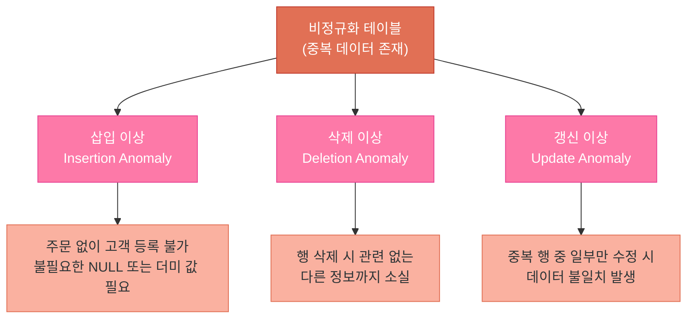
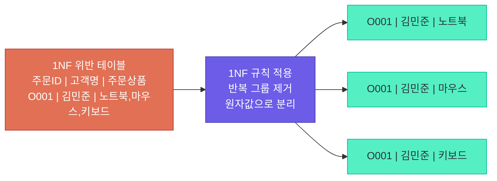
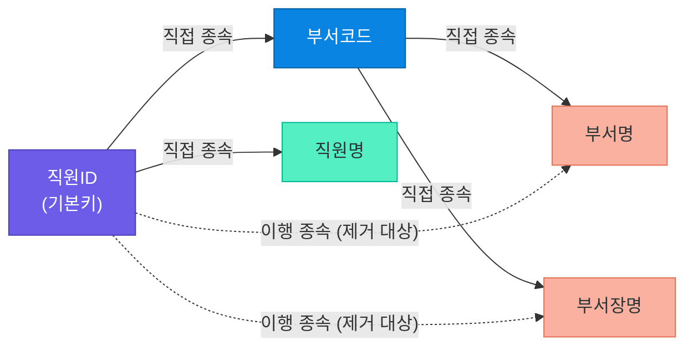
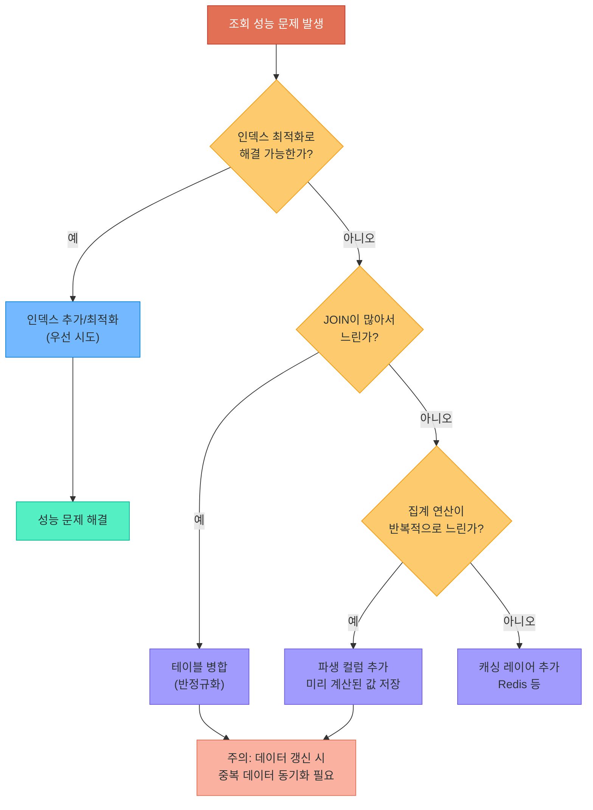
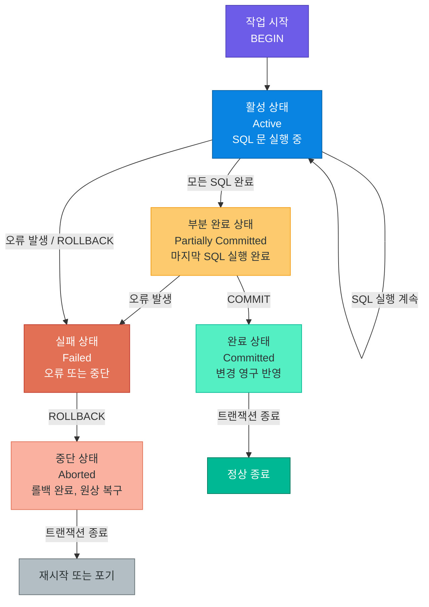
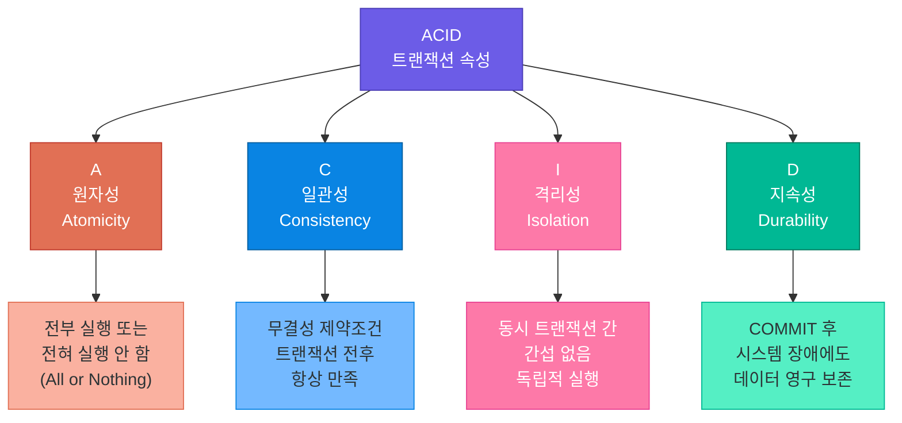
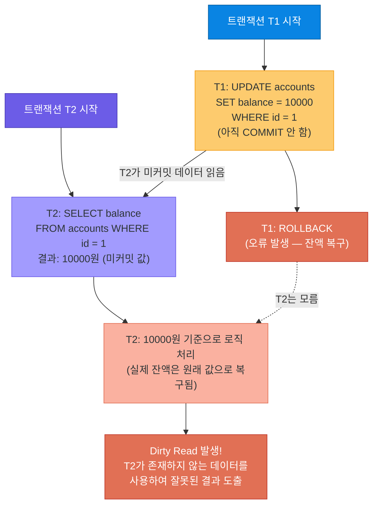
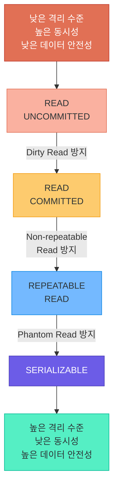
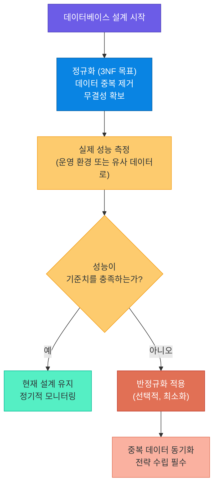

# 정규화와 트랜잭션

> 데이터를 올바른 자리에 놓고, 작업을 안전하게 완수한다 — 정규화로 데이터 중복을 제거하고 트랜잭션의 ACID 속성으로 데이터 무결성을 보장하는 핵심 원리를 학습합니다

---

## 1. 정규화란 무엇인가

### 정규화의 정의와 필요성

**정규화(Normalization)**는 관계형 데이터베이스 설계에서 데이터 중복을 최소화하고 데이터 무결성을 높이기 위해 테이블을 체계적으로 분해하는 과정입니다. E.F. Codd가 1970년대에 제안한 이 이론은 오늘날에도 데이터베이스 설계의 핵심 원칙으로 적용됩니다.

**실생활 비유:** 집 안 정리정돈을 생각해 보십시오. 같은 물건을 거실에도, 침실에도, 부엌에도 한 벌씩 두는 것은 공간 낭비이고 관리가 어렵습니다. 가위는 문구함 하나에만 보관하고, 필요할 때 그곳에서 꺼내 쓰는 것이 올바른 정리법입니다. 데이터베이스 정규화도 마찬가지입니다. 동일한 정보를 여러 테이블에 중복 저장하지 않고, 한 곳에만 두고 참조하는 구조로 만드는 것입니다.

### 이상 현상 (Anomaly)

정규화되지 않은 테이블에서는 세 가지 이상 현상이 발생합니다. 아래의 비정규화 주문 테이블을 살펴보겠습니다.

**비정규화된 주문 테이블 예시**

| 주문ID | 고객ID | 고객명 | 고객이메일 | 상품ID | 상품명 | 카테고리 | 수량 | 단가 |
|--------|--------|--------|------------|--------|--------|----------|------|------|
| O001 | C001 | 김민준 | kim@example.com | P001 | 노트북 | 전자제품 | 1 | 1200000 |
| O002 | C001 | 김민준 | kim@example.com | P002 | 마우스 | 전자제품 | 2 | 25000 |
| O003 | C002 | 이서연 | lee@example.com | P001 | 노트북 | 전자제품 | 1 | 1200000 |
| O004 | C003 | 박도윤 | park@example.com | P003 | 의자 | 가구 | 1 | 350000 |

이 테이블에서 발생하는 세 가지 이상 현상입니다.

| 이상 현상 | 설명 | 이 테이블에서의 예 |
|-----------|------|-------------------|
| 삽입 이상 (Insertion Anomaly) | 불필요한 데이터 없이 특정 데이터만 삽입 불가 | 주문 없이 새 고객 정보만 등록 불가 |
| 삭제 이상 (Deletion Anomaly) | 특정 데이터 삭제 시 의도치 않은 데이터까지 소실 | O004 삭제 시 박도윤 고객 정보도 사라짐 |
| 갱신 이상 (Update Anomaly) | 동일 데이터가 여러 행에 중복되어 일부만 수정되는 불일치 | 김민준의 이메일 변경 시 O001, O002 모두 수정 필요 |



> **핵심 포인트:** 이상 현상은 정규화되지 않은 테이블에서 발생하는 의도치 않은 부작용입니다. 데이터 중복이 근본 원인이며, 정규화를 통해 이를 해소합니다.

---

## 2. 제1정규형 (1NF)

### 1NF 정의

**제1정규형(First Normal Form, 1NF)**은 테이블의 모든 속성값이 **원자값(Atomic Value)**이어야 한다는 규칙입니다. 즉, 하나의 셀에 여러 값이 들어가거나, 반복 그룹이 존재해서는 안 됩니다.

**비유:** 서랍 하나에 양말 한 켤레씩만 넣는다고 생각해 보십시오. 여러 켤레를 뭉쳐서 하나의 서랍에 던져 넣으면 나중에 꺼낼 때 어느 것이 어느 것인지 알 수 없습니다. 각 셀은 하나의 값만 담아야 합니다.

### 1NF 위반 예시와 변환

**1NF 위반 테이블 (전)**

| 주문ID | 고객명 | 주문상품 |
|--------|--------|----------|
| O001 | 김민준 | 노트북, 마우스, 키보드 |
| O002 | 이서연 | 모니터 |

`주문상품` 열에 여러 값이 콤마로 구분되어 들어가 있습니다. 이는 원자값이 아니므로 1NF를 위반합니다.

**1NF 적용 테이블 (후)**

| 주문ID | 고객명 | 상품명 |
|--------|--------|--------|
| O001 | 김민준 | 노트북 |
| O001 | 김민준 | 마우스 |
| O001 | 김민준 | 키보드 |
| O002 | 이서연 | 모니터 |

각 행이 하나의 상품만 담도록 분리되었습니다. 이제 모든 셀이 원자값을 가집니다.



> **핵심 포인트:** 1NF는 정규화의 출발점입니다. 모든 속성이 원자값이어야 하며, 하나의 셀에 여러 값을 넣거나 반복 그룹(같은 종류의 컬럼을 여러 개 만드는 것 포함)이 있어서는 안 됩니다.

---

## 3. 제2정규형 (2NF)

### 2NF 정의

**제2정규형(Second Normal Form, 2NF)**은 1NF를 만족하면서, **부분 함수 종속(Partial Functional Dependency)**을 제거한 형태입니다. 부분 함수 종속이란 복합 기본키의 일부 속성만으로도 다른 속성을 결정할 수 있는 관계를 말합니다.

**비유:** 학교 시험지 채점 현황표를 떠올려 보십시오. 학생번호와 과목코드가 함께 있어야 점수를 알 수 있지만, 학생 이름은 학생번호만 알아도 알 수 있습니다. 이런 경우 학생 이름은 과목코드와 무관하게 학생번호에만 종속된 것입니다. 이를 분리해야 합니다.

### 2NF 위반 예시와 변환

**1NF 만족, 2NF 위반 테이블 (전)**

기본키: (주문ID, 상품ID) — 복합키

| 주문ID | 상품ID | 상품명 | 카테고리 | 수량 | 단가 | 고객ID | 고객명 |
|--------|--------|--------|----------|------|------|--------|--------|
| O001 | P001 | 노트북 | 전자제품 | 1 | 1200000 | C001 | 김민준 |
| O001 | P002 | 마우스 | 전자제품 | 2 | 25000 | C001 | 김민준 |
| O002 | P001 | 노트북 | 전자제품 | 1 | 1200000 | C002 | 이서연 |

- `수량`은 (주문ID, 상품ID) 전체에 종속 — 완전 함수 종속 (정상)
- `상품명`, `카테고리`, `단가`는 상품ID만으로 결정 — **부분 함수 종속 (위반)**
- `고객명`은 고객ID만으로 결정 — **부분 함수 종속 (위반)**

**2NF 적용 후 분해된 테이블 (후)**

주문_상품 테이블 (기본키: 주문ID + 상품ID)

| 주문ID | 상품ID | 수량 |
|--------|--------|------|
| O001 | P001 | 1 |
| O001 | P002 | 2 |
| O002 | P001 | 1 |

상품 테이블 (기본키: 상품ID)

| 상품ID | 상품명 | 카테고리 | 단가 |
|--------|--------|----------|------|
| P001 | 노트북 | 전자제품 | 1200000 |
| P002 | 마우스 | 전자제품 | 25000 |

주문 테이블 (기본키: 주문ID)

| 주문ID | 고객ID |
|--------|--------|
| O001 | C001 |
| O002 | C002 |

부분 함수 종속을 가진 속성들이 별도 테이블로 분리되어 중복이 사라졌습니다.

> **핵심 포인트:** 2NF는 복합 기본키를 사용하는 테이블에서만 발생하는 문제입니다. 기본키의 일부에만 종속되는 컬럼이 있다면, 해당 컬럼을 별도 테이블로 분리해야 합니다.

---

## 4. 제3정규형 (3NF)

### 3NF 정의

**제3정규형(Third Normal Form, 3NF)**은 2NF를 만족하면서, **이행 함수 종속(Transitive Functional Dependency)**을 제거한 형태입니다. 이행 함수 종속이란 A → B → C 관계에서 A → C가 성립하는 간접 종속 관계를 말합니다.

**비유:** 직원의 소속 부서를 알면 부서장 이름을 알 수 있습니다. 직원번호 → 부서코드 → 부서장명 이렇게 이행 관계가 성립합니다. 이 경우 부서장명은 직원번호에 직접 종속된 것이 아니라 부서코드를 경유한 간접 종속입니다. 이런 관계는 분리해야 합니다.

### 3NF 위반 예시와 변환

**2NF 만족, 3NF 위반 테이블 (전)**

기본키: 직원ID

| 직원ID | 직원명 | 부서코드 | 부서명 | 부서장명 |
|--------|--------|----------|--------|----------|
| E001 | 김민준 | D01 | 개발팀 | 홍길동 |
| E002 | 이서연 | D01 | 개발팀 | 홍길동 |
| E003 | 박도윤 | D02 | 마케팅팀 | 최영희 |

- 직원ID → 부서코드 (직접 종속)
- 부서코드 → 부서명, 부서코드 → 부서장명 (직접 종속)
- 직원ID → 부서명, 직원ID → 부서장명 (**이행 종속 — 위반**)



**3NF 적용 후 분해된 테이블 (후)**

직원 테이블 (기본키: 직원ID)

| 직원ID | 직원명 | 부서코드 |
|--------|--------|----------|
| E001 | 김민준 | D01 |
| E002 | 이서연 | D01 |
| E003 | 박도윤 | D02 |

부서 테이블 (기본키: 부서코드)

| 부서코드 | 부서명 | 부서장명 |
|----------|--------|----------|
| D01 | 개발팀 | 홍길동 |
| D02 | 마케팅팀 | 최영희 |

이행 종속 관계였던 부서명, 부서장명이 부서 테이블로 분리되어 갱신 이상이 해소되었습니다.

> **핵심 포인트:** 3NF는 기본키가 아닌 일반 속성 간의 종속 관계를 제거합니다. A → B → C 형태의 이행 종속이 발견되면, B와 C를 묶어 별도 테이블로 분리하십시오.

---

## 5. BCNF (Boyce-Codd Normal Form)

### BCNF 정의

**BCNF(보이스-코드 정규형)**는 3NF를 강화한 형태로, **모든 결정자(Determinant)가 후보키(Candidate Key)여야 한다**는 조건을 추가합니다. 3NF를 만족하더라도 결정자이지만 후보키가 아닌 속성이 존재하면 BCNF를 위반합니다.

### 3NF와 BCNF의 차이

3NF는 비주요 속성이 기본키에만 종속되도록 요구하지만, BCNF는 이보다 엄격하게 모든 결정자가 반드시 후보키이어야 한다고 요구합니다. 대부분의 3NF 테이블은 BCNF도 만족하지만, 복수의 후보키가 겹치는 복잡한 경우에 차이가 발생합니다.

**BCNF 위반 예시**

수업 신청 테이블: 학생은 과목당 하나의 교수에게 수업을 듣습니다. 교수는 하나의 과목만 담당합니다.

기본키 후보: (학생ID, 과목명) 또는 (학생ID, 교수ID)

| 학생ID | 과목명 | 교수ID |
|--------|--------|--------|
| S001 | 데이터베이스 | P001 |
| S002 | 데이터베이스 | P001 |
| S001 | 알고리즘 | P002 |
| S003 | 데이터베이스 | P002 |

이 테이블에서 `교수ID → 과목명` 관계가 성립합니다. 즉, 교수ID가 결정자이지만 후보키가 아닙니다. 이것이 BCNF 위반입니다.

**BCNF 적용 후**

교수_과목 테이블

| 교수ID | 과목명 |
|--------|--------|
| P001 | 데이터베이스 |
| P002 | 알고리즘 |
| P002 | 데이터베이스 |

학생_교수 테이블

| 학생ID | 교수ID |
|--------|--------|
| S001 | P001 |
| S002 | P001 |
| S001 | P002 |
| S003 | P002 |

> **핵심 포인트:** BCNF는 결정자가 반드시 후보키임을 보장합니다. 실무에서는 BCNF 분해가 조인 종속성 손실을 유발하는 경우가 있어, 3NF까지만 적용하는 경우가 많습니다.

---

## 6. 정규화 단계 총정리

### 단계별 비교 표

| 정규형 | 조건 | 제거 대상 | 비고 |
|--------|------|-----------|------|
| 1NF | 모든 속성이 원자값 | 반복 그룹, 다중값 속성 | 정규화의 기본 전제 |
| 2NF | 1NF + 완전 함수 종속 | 부분 함수 종속 | 복합키가 있을 때만 해당 |
| 3NF | 2NF + 직접 함수 종속 | 이행 함수 종속 | 실무 적용의 표준 |
| BCNF | 3NF + 모든 결정자=후보키 | 후보키 아닌 결정자 | 3NF보다 엄격 |

### 정규화 진행 흐름도

```mermaid
flowchart LR
    RAW["비정규화 테이블"] --> CHECK1{"원자값?"}
    CHECK1 -->|"아니오"| TO_1NF["반복 그룹 제거"]
    TO_1NF --> NF1["1NF"]
    CHECK1 -->|"예"| NF1
    NF1 --> CHECK2{"완전 함수 종속?"}
    CHECK2 -->|"아니오"| TO_2NF["부분 종속 분리"]
    TO_2NF --> NF2["2NF"]
    CHECK2 -->|"예"| NF2
    NF2 --> CHECK3{"이행 종속 없음?"}
    CHECK3 -->|"아니오"| TO_3NF["이행 종속 분리"]
    TO_3NF --> NF3["3NF"]
    CHECK3 -->|"예"| NF3
    NF3 --> CHECK4{"결정자=후보키?"}
    CHECK4 -->|"아니오"| TO_BCNF["비후보키 분리"]
    TO_BCNF --> BCNF_BOX["BCNF"]
    CHECK4 -->|"예"| BCNF_BOX

    style RAW fill:#e17055,stroke:#c0392b,color:#fff
    style CHECK1 fill:#fdcb6e,stroke:#f39c12,color:#2d3436
    style CHECK2 fill:#fdcb6e,stroke:#f39c12,color:#2d3436
    style CHECK3 fill:#fdcb6e,stroke:#f39c12,color:#2d3436
    style CHECK4 fill:#fdcb6e,stroke:#f39c12,color:#2d3436
    style TO_1NF fill:#a29bfe,stroke:#6c5ce7,color:#2d3436
    style TO_2NF fill:#a29bfe,stroke:#6c5ce7,color:#2d3436
    style TO_3NF fill:#a29bfe,stroke:#6c5ce7,color:#2d3436
    style TO_BCNF fill:#a29bfe,stroke:#6c5ce7,color:#2d3436
    style NF1 fill:#74b9ff,stroke:#0984e3,color:#2d3436
    style NF2 fill:#0984e3,stroke:#075fa0,color:#fff
    style NF3 fill:#6c5ce7,stroke:#4a3cb5,color:#fff
    style BCNF_BOX fill:#55efc4,stroke:#00b894,color:#2d3436
```



실무에서는 일반적으로 **3NF까지 적용**하는 것이 표준입니다. BCNF는 이론적으로 더 엄격하지만, 분해 과정에서 무손실 조인 특성이 깨질 수 있으므로 신중하게 적용해야 합니다.

> **핵심 포인트:** 정규화는 단계적으로 진행됩니다. 각 단계는 이전 단계를 포함하며, 무언가를 추가로 제거합니다. 실무에서는 보통 3NF가 최종 목표이며, 성능 문제가 생기면 의도적으로 반정규화를 적용합니다.

---

## 7. 반정규화 (Denormalization)

### 반정규화의 필요성

정규화가 데이터 중복을 줄이고 무결성을 높이는 데 이상적이라면, 왜 반정규화를 도입할까요? 이유는 **성능**입니다. 정규화가 심화될수록 테이블이 많아지고, 데이터를 조회하려면 여러 테이블을 JOIN해야 합니다. 조인이 많아질수록 쿼리 속도가 느려집니다.

**비유:** 도서관의 책을 주제별, 저자별, 언어별로 완벽하게 분류해 두면 체계적이지만, 매번 여러 카탈로그를 참조해야 합니다. 반면 자주 대출되는 인기 도서는 입구 바로 앞 특별 코너에 중복 배치하면 빨리 찾을 수 있습니다. 데이터 중복이 생기지만 접근 속도가 빨라지는 것입니다.

### 반정규화 기법

| 기법 | 설명 | 예시 |
|------|------|------|
| 테이블 병합 | 자주 JOIN하는 테이블을 하나로 합침 | 주문 + 배송 정보 통합 |
| 파생 컬럼 추가 | 집계값을 미리 계산하여 저장 | 총주문금액 컬럼을 주문 테이블에 추가 |
| 중복 컬럼 허용 | 자주 참조하는 외래 테이블 값을 현재 테이블에 복사 | 주문 테이블에 고객명 컬럼 추가 |
| 테이블 분할 (수직) | 자주 쓰는 컬럼과 자주 안 쓰는 컬럼 분리 | 직원 기본정보 / 직원 상세정보 분리 |
| 테이블 분할 (수평) | 파티셔닝으로 큰 테이블을 분할 | 연도별 주문 테이블 분리 |

### 반정규화 의사결정 흐름도



### 반정규화의 적절한 사용 시점

| 상황 | 반정규화 적합도 | 이유 |
|------|----------------|------|
| OLTP (트랜잭션 중심, 쓰기 빈번) | 낮음 | 갱신 이상 위험, 중복 동기화 부담 |
| OLAP (분석, 읽기 중심) | 높음 | 집계 성능 향상 효과 큼 |
| 실시간 대시보드 | 높음 | 빠른 집계 결과 필요 |
| 리포팅 서버 (별도 분리) | 높음 | 원본 DB와 분리되어 운영 가능 |
| 운영 서비스 주 DB | 낮음 | 데이터 일관성이 최우선 |

> **핵심 포인트:** 반정규화는 성능과 데이터 무결성 사이의 트레이드오프입니다. 반드시 정규화된 설계를 먼저 완성한 뒤, 실측된 성능 문제가 있을 때 선택적으로 적용해야 합니다. 무분별한 반정규화는 유지보수를 어렵게 만들고 데이터 불일치를 초래합니다.

---

## 8. 트랜잭션의 개념

### 트랜잭션이란

**트랜잭션(Transaction)**은 데이터베이스에서 하나의 논리적 작업 단위(Logical Unit of Work)입니다. 여러 개의 SQL 문장이 모두 성공하거나 모두 실패하도록 묶어주는 메커니즘입니다.

**비유:** 은행 계좌 이체를 생각해 보십시오. A 계좌에서 10만 원을 출금하고, B 계좌에 10만 원을 입금하는 두 가지 작업이 있습니다. 출금은 성공했는데 입금이 실패한다면? 돈이 허공으로 사라집니다. 반대로 입금은 성공했는데 출금이 실패한다면? 돈이 두 배가 됩니다. 두 작업은 반드시 함께 성공하거나 함께 실패해야 합니다. 트랜잭션이 이를 보장합니다.

### 트랜잭션 제어 명령어

| 명령어 | 역할 |
|--------|------|
| `BEGIN` 또는 `START TRANSACTION` | 트랜잭션 시작 |
| `COMMIT` | 모든 변경 사항을 영구 반영 |
| `ROLLBACK` | 모든 변경 사항을 트랜잭션 시작 전으로 되돌림 |
| `SAVEPOINT 이름` | 트랜잭션 내 부분 복구 지점 설정 |
| `ROLLBACK TO SAVEPOINT 이름` | 특정 저장점까지만 롤백 |

### 트랜잭션 상태 다이어그램



### SAVEPOINT 활용 예시

```sql
BEGIN;

INSERT INTO orders (customer_id, amount) VALUES (1, 50000);
SAVEPOINT after_order;

INSERT INTO order_items (order_id, product_id, qty) VALUES (LAST_INSERT_ID(), 101, 2);
SAVEPOINT after_items;

-- 결제 처리 실패 시 주문 자체는 유지하고 items만 롤백 가능
ROLLBACK TO SAVEPOINT after_order;

COMMIT;
```

> **핵심 포인트:** 트랜잭션은 "모두 성공하거나 모두 실패해야 하는" 작업 단위를 보장합니다. COMMIT으로 확정하고, 문제가 생기면 ROLLBACK으로 원상 복구합니다. SAVEPOINT를 활용하면 부분 롤백도 가능합니다.

---

## 9. ACID 속성

### ACID란

ACID는 트랜잭션이 데이터베이스의 무결성을 보장하기 위해 갖춰야 하는 네 가지 핵심 속성의 앞글자를 딴 약어입니다. 1983년 안드레아스 로이터와 테오 헤르더가 정의했습니다.

### 네 가지 속성 상세 설명

**Atomicity (원자성)**
트랜잭션 내의 모든 연산은 전부 실행되거나 전혀 실행되지 않아야 합니다.

비유: 수술을 생각해 보십시오. "절개는 했는데 봉합은 안 했다"는 결과는 허용되지 않습니다. 수술 전체가 완료되거나, 만약 도중에 문제가 생기면 원래 상태로 되돌려야 합니다.

**Consistency (일관성)**
트랜잭션이 완료된 후에도 데이터베이스는 일관된 상태를 유지해야 합니다. 정의된 모든 무결성 제약조건이 트랜잭션 전후로 항상 만족되어야 합니다.

비유: 회계 장부에서 차변과 대변의 합계는 항상 같아야 합니다. 어떤 거래를 기록하더라도 이 균형은 깨져서는 안 됩니다.

**Isolation (격리성)**
동시에 실행 중인 여러 트랜잭션은 서로 간섭하지 않아야 합니다. 각 트랜잭션은 다른 트랜잭션이 없는 것처럼 독립적으로 실행되어야 합니다.

비유: 선거 개표 과정에서 각 투표함은 독립적으로 집계됩니다. 한 투표함의 집계가 다른 투표함 집계에 영향을 주어서는 안 됩니다.

**Durability (지속성)**
성공적으로 완료(COMMIT)된 트랜잭션의 결과는 시스템 장애가 발생해도 영구적으로 보존되어야 합니다.

비유: 공증된 계약서는 한쪽 당사자가 기억을 잃더라도 유효합니다. 공증이라는 행위 자체가 영구적 효력을 보장합니다.

### ACID 속성 시각화



| 속성 | 보장 내용 | 관련 메커니즘 |
|------|-----------|---------------|
| 원자성 (Atomicity) | 부분 실패 없음 | ROLLBACK, Undo Log |
| 일관성 (Consistency) | 제약조건 항상 만족 | 무결성 제약, 트리거 |
| 격리성 (Isolation) | 동시 트랜잭션 독립 | 락(Lock), MVCC |
| 지속성 (Durability) | COMMIT 후 영구 저장 | Redo Log, WAL |

> **핵심 포인트:** ACID는 데이터베이스 트랜잭션의 신뢰성을 구성하는 네 기둥입니다. 이 중 격리성(Isolation)은 성능과 trade-off 관계에 있어, 실무에서는 격리 수준을 조절하여 균형을 맞춥니다.

---

## 10. 격리 수준 (Isolation Level)

### 동시성 문제의 종류

여러 트랜잭션이 동시에 실행될 때 격리가 불완전하면 세 가지 문제가 발생합니다.

| 문제 | 설명 | 예시 |
|------|------|------|
| Dirty Read (더티 리드) | 커밋되지 않은 다른 트랜잭션의 변경 데이터를 읽음 | T1이 잔액을 1000원으로 수정 중인데 T2가 1000원을 읽고, T1이 롤백하면 T2는 잘못된 데이터를 읽은 것 |
| Non-repeatable Read (반복 불가 읽기) | 같은 트랜잭션에서 같은 행을 두 번 읽었을 때 값이 다름 | T1이 같은 행을 두 번 읽는 사이에 T2가 해당 행을 수정하고 커밋 |
| Phantom Read (팬텀 읽기) | 같은 조건의 SELECT를 두 번 실행했을 때 행 수가 달라짐 | T1이 WHERE price > 1000 조회 사이에 T2가 새 행을 삽입하고 커밋 |

### 동시성 문제 시각화

아래 다이어그램은 Dirty Read가 발생하는 시나리오를 시간 순서로 표현합니다.



### 4가지 격리 수준

| 격리 수준 | Dirty Read | Non-repeatable Read | Phantom Read | 성능 |
|-----------|------------|---------------------|--------------|------|
| READ UNCOMMITTED | 허용 | 허용 | 허용 | 가장 빠름 |
| READ COMMITTED | 방지 | 허용 | 허용 | 빠름 |
| REPEATABLE READ | 방지 | 방지 | 허용 (MySQL InnoDB는 방지) | 보통 |
| SERIALIZABLE | 방지 | 방지 | 방지 | 가장 느림 |

### 격리 수준 스펙트럼



### 격리 수준별 실무 적용

| 격리 수준 | 주요 사용 사례 |
|-----------|----------------|
| READ UNCOMMITTED | 실시간 통계, 정확도보다 속도가 중요한 분석 |
| READ COMMITTED | PostgreSQL 기본값, 일반 OLTP 환경 |
| REPEATABLE READ | MySQL InnoDB 기본값, 일관성 있는 집계 필요 시 |
| SERIALIZABLE | 금융 거래, 재고 관리 등 정확성이 최우선인 경우 |

### SQLite의 격리 수준

SQLite는 표준 SQL 격리 수준 대신 `journal_mode` 설정으로 동시성을 제어합니다.

| Journal Mode | 설명 | 동시성 |
|--------------|------|--------|
| DELETE (기본값) | 트랜잭션 완료 후 저널 파일 삭제 | 하나의 쓰기만 허용 |
| WAL (Write-Ahead Log) | 변경 사항을 별도 WAL 파일에 먼저 기록 | 읽기/쓰기 동시 가능 |
| MEMORY | 저널을 메모리에 보관 | 빠르지만 장애 시 데이터 손실 |

```sql
-- WAL 모드 설정 (일반적으로 권장)
PRAGMA journal_mode=WAL;
```

> **핵심 포인트:** 격리 수준은 성능과 데이터 정확성 사이의 균형을 조절하는 핵심 설정입니다. 대부분의 RDBMS에서 기본값(READ COMMITTED 또는 REPEATABLE READ)이 적합하며, 특수한 요구사항이 없다면 기본값을 유지하십시오.

---

## 11. Python에서의 트랜잭션 실습

### sqlite3 모듈의 트랜잭션 제어

Python의 `sqlite3` 모듈은 기본적으로 **자동 트랜잭션 관리**를 지원합니다. `isolation_level` 파라미터로 동작 방식을 조정할 수 있습니다.

| isolation_level 값 | 동작 |
|--------------------|------|
| `"DEFERRED"` (기본값) | 첫 번째 DML 실행 시 트랜잭션 시작 |
| `"IMMEDIATE"` | BEGIN IMMEDIATE로 즉시 쓰기 잠금 획득 |
| `"EXCLUSIVE"` | BEGIN EXCLUSIVE로 독점 잠금 획득 |
| `None` | autocommit 모드, 자동 BEGIN 없음 |

### 트랜잭션 실습 환경 설정

실습을 진행하기 전에 테이블과 초기 데이터를 준비합니다.

```python
# setup_bank_db.py -- 계좌이체 실습용 DB 초기화
import sqlite3

def setup_database():
    conn = sqlite3.connect("bank.db")
    cursor = conn.cursor()

    # ── 계좌 테이블 생성 ──
    cursor.execute("""
        CREATE TABLE IF NOT EXISTS accounts (
            id      INTEGER PRIMARY KEY,
            owner   TEXT    NOT NULL,
            balance INTEGER NOT NULL CHECK (balance >= 0)
        )
    """)

    # ── 이체 이력 테이블 ──
    cursor.execute("""
        CREATE TABLE IF NOT EXISTS transfer_logs (
            id          INTEGER  PRIMARY KEY AUTOINCREMENT,
            from_acct   INTEGER  NOT NULL,
            to_acct     INTEGER  NOT NULL,
            amount      INTEGER  NOT NULL,
            transferred_at TEXT DEFAULT (datetime('now'))
        )
    """)

    # ── 초기 데이터 삽입 ──
    cursor.executemany(
        "INSERT OR IGNORE INTO accounts (id, owner, balance) VALUES (?, ?, ?)",
        [(1, "김민준", 500000), (2, "이서연", 200000)]
    )

    conn.commit()
    conn.close()
    print("DB 초기화 완료")

if __name__ == "__main__":
    setup_database()
```

### 기본 트랜잭션 패턴

```python
# basic_transaction.py -- sqlite3 기본 트랜잭션 패턴
import sqlite3

conn = sqlite3.connect("example.db")

try:
    # Python 3.12부터는 autocommit 파라미터 사용 가능
    cursor = conn.cursor()

    cursor.execute("INSERT INTO products (name, price) VALUES (?, ?)", ("노트북", 1200000))
    cursor.execute("INSERT INTO products (name, price) VALUES (?, ?)", ("마우스", 25000))

    conn.commit()   # 두 INSERT 모두 영구 반영
    print("트랜잭션 완료")

except sqlite3.Error as e:
    conn.rollback()  # 두 INSERT 모두 취소
    print(f"오류 발생, 롤백: {e}")

finally:
    conn.close()
```

### 계좌이체 트랜잭션 실습

```python
# transaction_example.py -- 트랜잭션 실습: 계좌이체
import sqlite3

def transfer_money(from_account, to_account, amount):
    conn = sqlite3.connect("bank.db")
    try:
        cursor = conn.cursor()

        # ── 출금 ──
        cursor.execute(
            "UPDATE accounts SET balance = balance - ? WHERE id = ?",
            (amount, from_account)
        )

        # ── 잔액 확인 ──
        cursor.execute(
            "SELECT balance FROM accounts WHERE id = ?",
            (from_account,)
        )
        balance = cursor.fetchone()[0]
        if balance < 0:
            raise ValueError("잔액이 부족합니다")

        # ── 입금 ──
        cursor.execute(
            "UPDATE accounts SET balance = balance + ? WHERE id = ?",
            (amount, to_account)
        )

        conn.commit()
        print(f"이체 완료: {amount}원")

    except Exception as e:
        conn.rollback()
        print(f"이체 실패 (롤백): {e}")
    finally:
        conn.close()
```

### SAVEPOINT를 활용한 부분 롤백

```python
# savepoint_example.py -- SAVEPOINT를 사용한 부분 롤백
import sqlite3

def process_order_with_savepoint(order_data, items_data):
    conn = sqlite3.connect("shop.db")
    conn.isolation_level = None  # autocommit 비활성화, 수동 제어

    try:
        conn.execute("BEGIN")

        # ── 주문 헤더 삽입 ──
        conn.execute(
            "INSERT INTO orders (customer_id, total) VALUES (?, ?)",
            (order_data["customer_id"], order_data["total"])
        )
        order_id = conn.execute("SELECT last_insert_rowid()").fetchone()[0]

        conn.execute("SAVEPOINT after_order")

        # ── 주문 상세 삽입 (실패 가능) ──
        for item in items_data:
            conn.execute(
                "INSERT INTO order_items (order_id, product_id, qty) VALUES (?, ?, ?)",
                (order_id, item["product_id"], item["qty"])
            )

        conn.execute("SAVEPOINT after_items")

        # ── 재고 차감 ──
        for item in items_data:
            conn.execute(
                "UPDATE products SET stock = stock - ? WHERE id = ?",
                (item["qty"], item["product_id"])
            )

            # ── 재고 부족 확인 ──
            stock = conn.execute(
                "SELECT stock FROM products WHERE id = ?",
                (item["product_id"],)
            ).fetchone()[0]

            if stock < 0:
                # 재고 차감만 롤백, 주문과 상세는 유지
                conn.execute("ROLLBACK TO SAVEPOINT after_items")
                raise ValueError(f"상품 {item['product_id']} 재고 부족")

        conn.execute("COMMIT")
        print("주문 처리 완료")

    except ValueError as e:
        conn.execute("ROLLBACK")
        print(f"주문 실패: {e}")

    finally:
        conn.close()
```

### 컨텍스트 매니저를 사용한 안전한 트랜잭션

```python
# context_manager_transaction.py -- with 문으로 안전하게 트랜잭션 관리
import sqlite3

# sqlite3.connect()는 컨텍스트 매니저를 지원합니다.
# 정상 종료 시 자동 COMMIT, 예외 발생 시 자동 ROLLBACK

with sqlite3.connect("bank.db") as conn:
    cursor = conn.cursor()
    cursor.execute(
        "UPDATE accounts SET balance = balance - 50000 WHERE id = 1"
    )
    cursor.execute(
        "UPDATE accounts SET balance = balance + 50000 WHERE id = 2"
    )
    # with 블록 정상 종료 시 자동 COMMIT
    # 예외 발생 시 자동 ROLLBACK
```

> **핵심 포인트:** Python에서 트랜잭션을 다룰 때는 항상 `try-except-finally` 패턴 또는 컨텍스트 매니저(`with` 문)를 사용하십시오. 예외가 발생하면 반드시 `rollback()`을 호출하고, `finally`에서 `close()`로 연결을 정리해야 합니다.

---

## 12. 핵심 정리

### 정규화 단계 요약

| 정규형 | 핵심 조건 | 제거하는 문제 |
|--------|-----------|---------------|
| 1NF | 모든 속성이 원자값 | 반복 그룹, 다중값 |
| 2NF | 1NF + 완전 함수 종속 | 부분 함수 종속 (복합키) |
| 3NF | 2NF + 직접 함수 종속 | 이행 함수 종속 |
| BCNF | 모든 결정자 = 후보키 | 비후보키 결정자 |

### ACID 속성 요약

| 속성 | 영문 | 보장 내용 |
|------|------|-----------|
| 원자성 | Atomicity | 트랜잭션은 전부 실행되거나 전혀 실행되지 않음 |
| 일관성 | Consistency | 트랜잭션 전후 모든 무결성 제약조건 만족 |
| 격리성 | Isolation | 동시 트랜잭션 간 간섭 없음 |
| 지속성 | Durability | COMMIT된 데이터는 장애에도 영구 보존 |

### 격리 수준 비교 요약

| 격리 수준 | Dirty Read | Non-repeatable Read | Phantom Read |
|-----------|:----------:|:-------------------:|:------------:|
| READ UNCOMMITTED | 발생 | 발생 | 발생 |
| READ COMMITTED | 방지 | 발생 | 발생 |
| REPEATABLE READ | 방지 | 방지 | 발생* |
| SERIALIZABLE | 방지 | 방지 | 방지 |

*MySQL InnoDB의 REPEATABLE READ는 MVCC로 Phantom Read도 대부분 방지합니다.

### 정규화 vs 반정규화 결정 기준



### 핵심 요점 정리

1. **정규화**는 데이터 중복을 제거하고 이상 현상을 방지합니다. 설계 단계에서 반드시 진행하십시오.
2. **1NF → 2NF → 3NF** 순서로 단계적으로 적용하며, 실무 표준은 3NF입니다.
3. **반정규화**는 성능 문제가 실측될 때 선택적으로 적용하되, 데이터 동기화 전략을 반드시 수립해야 합니다.
4. **트랜잭션**은 논리적 작업 단위로, COMMIT과 ROLLBACK으로 제어합니다.
5. **ACID**는 트랜잭션의 신뢰성을 보장하는 네 가지 속성입니다.
6. **격리 수준**은 성능과 데이터 정확성의 trade-off를 조정합니다. 기본값에서 시작하십시오.
7. **Python**에서는 `try-except-finally` 또는 컨텍스트 매니저로 안전하게 트랜잭션을 관리하십시오.

### 이번 강의에서 배운 SQL 요약

```sql
-- ── 정규화 후 테이블 조회 예시 ──
-- 주문과 상품, 고객 정보를 JOIN으로 결합
SELECT
    o.id         AS 주문ID,
    c.name       AS 고객명,
    p.name       AS 상품명,
    oi.qty       AS 수량,
    p.price      AS 단가,
    oi.qty * p.price AS 소계
FROM orders o
JOIN customers c  ON o.customer_id = c.id
JOIN order_items oi ON o.id = oi.order_id
JOIN products p   ON oi.product_id = p.id
WHERE o.id = 'O001';

-- ── 트랜잭션 제어 ──
BEGIN;
    UPDATE accounts SET balance = balance - 50000 WHERE id = 1;
    UPDATE accounts SET balance = balance + 50000 WHERE id = 2;
    -- 잔액 음수 여부 등 검증 후
COMMIT;

-- ── 격리 수준 설정 (MySQL/PostgreSQL) ──
SET TRANSACTION ISOLATION LEVEL REPEATABLE READ;
BEGIN;
    SELECT * FROM products WHERE price > 10000;
    -- ... 처리 ...
COMMIT;

-- ── SQLite WAL 모드 ──
PRAGMA journal_mode=WAL;
PRAGMA synchronous=NORMAL;  -- WAL 모드에서 성능과 안전성 균형
```

### 다음 강의 미리보기

다음 강의에서는 **Python과 데이터베이스 연동**을 실습합니다. sqlite3를 넘어 SQLAlchemy ORM, psycopg2(PostgreSQL 연결), 연결 풀링, 그리고 마이그레이션 도구까지 실무에서 사용하는 Python DB 연동 패턴 전반을 학습합니다.

| 다음 강의 주제 | 핵심 내용 |
|----------------|-----------|
| SQLAlchemy Core | 원시 SQL을 Python으로 추상화 |
| SQLAlchemy ORM | Python 클래스로 테이블을 모델링 |
| psycopg2 | PostgreSQL 네이티브 드라이버 |
| 연결 풀링 | 연결 재사용으로 성능 최적화 |
| Alembic 마이그레이션 | 스키마 변경 이력 관리 |

---

> **이전 강의:** [키, 제약조건, 인덱스](05_keys_constraints_indexes.md)
>
> **다음 강의:** [Python 데이터베이스 연동](07_python_db_integration.md)
