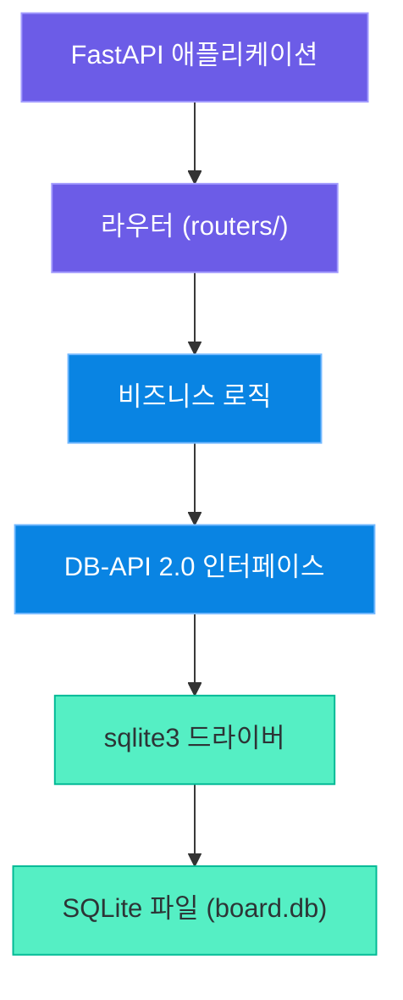
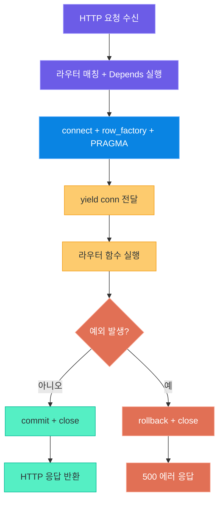
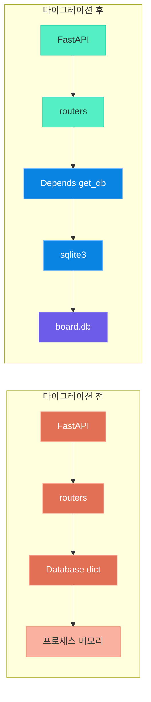
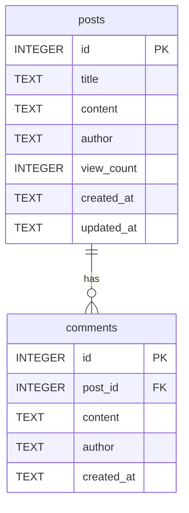
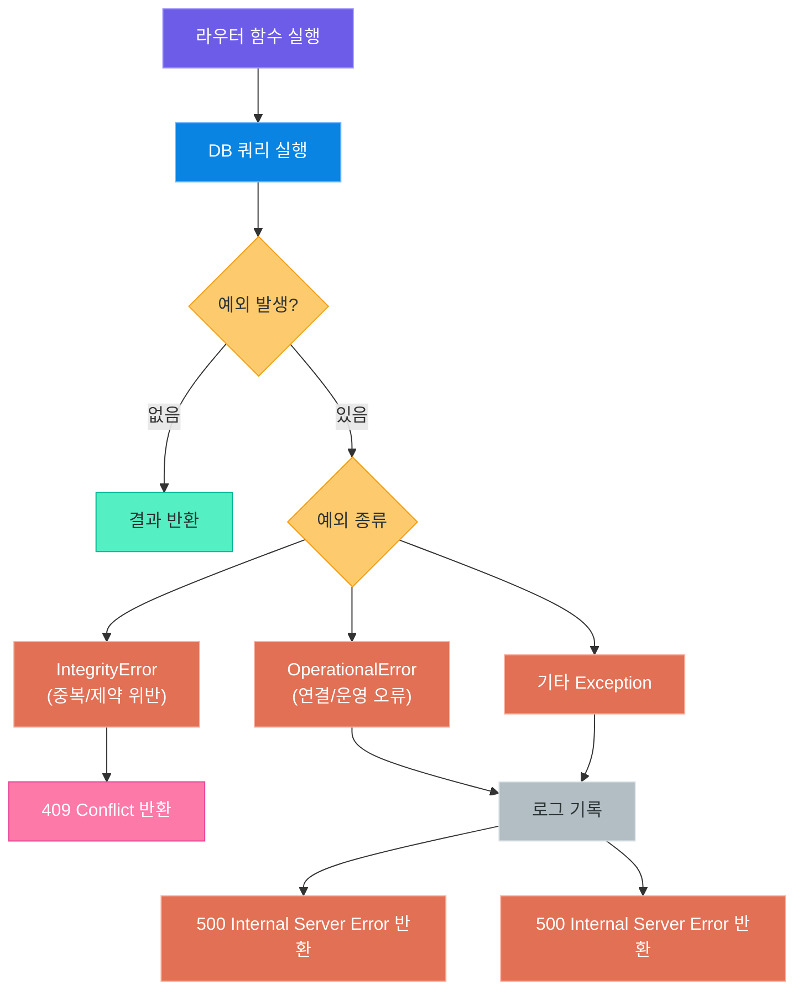
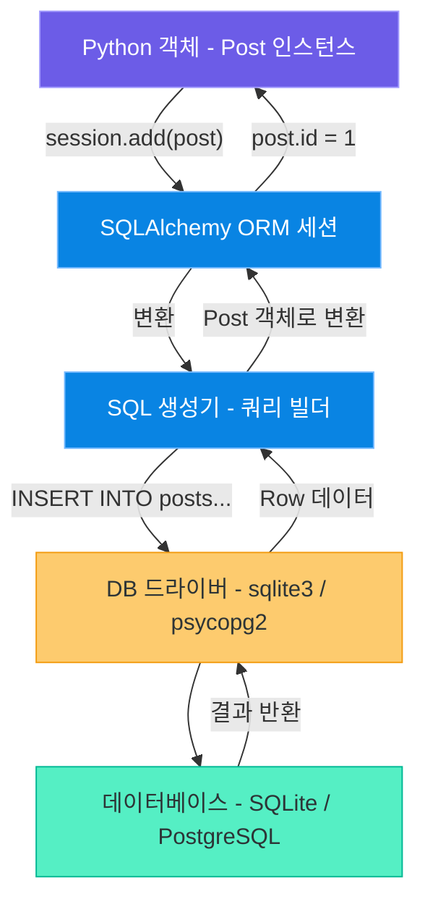
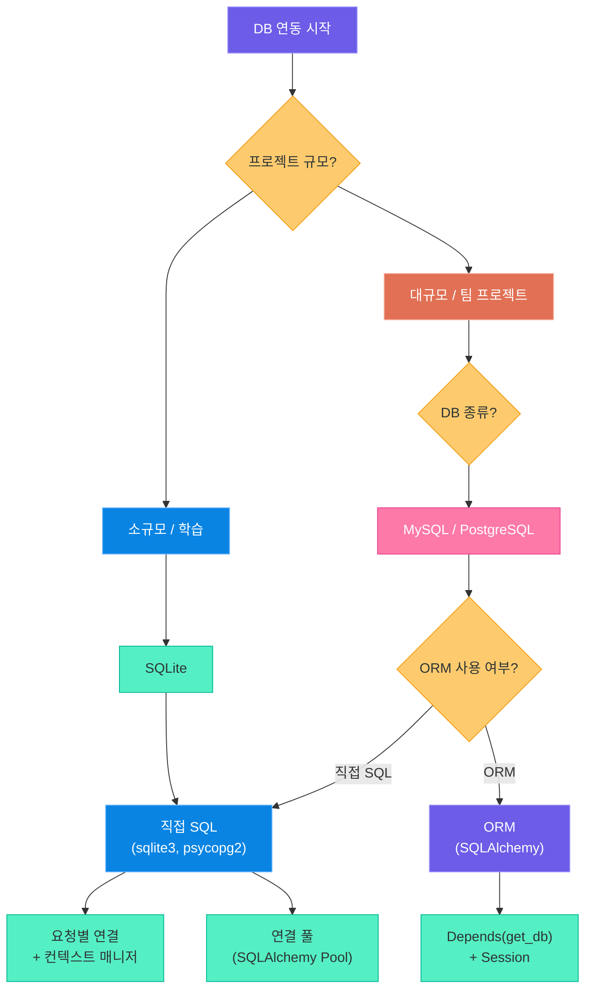

# Python 데이터베이스 연동

> Python 애플리케이션과 데이터베이스를 연결하는 방법을 체계적으로 익히고,
> 게시판 프로젝트의 인메모리 저장소를 실제 SQLite 데이터베이스로 전환합니다.

---

## 1. Python 데이터베이스 연동의 전체 그림

### 1.1 DB-API 2.0 표준 (PEP 249)

Python에서 데이터베이스에 접근하는 방식은 **PEP 249**라는 표준 규격으로 통일되어 있습니다. 이 표준을 DB-API 2.0이라고 부릅니다.

마치 전 세계 콘센트의 규격이 나라마다 다르더라도 **어댑터(adapter)** 하나로 연결할 수 있듯이, DB-API 2.0은 SQLite, MySQL, PostgreSQL 등 어떤 데이터베이스를 사용하더라도 동일한 Python 코드 패턴으로 접근할 수 있게 해 주는 공통 인터페이스입니다.

| DB-API 2.0 핵심 개념 | 설명 |
|---|---|
| `connect()` | 데이터베이스에 연결하여 Connection 객체 반환 |
| `cursor()` | 쿼리를 실행할 Cursor 객체 생성 |
| `execute(sql, params)` | SQL 문 실행 |
| `fetchone()` | 결과 행 하나 가져오기 |
| `fetchall()` | 모든 결과 행 가져오기 |
| `commit()` | 트랜잭션 커밋 |
| `rollback()` | 트랜잭션 롤백 |
| `close()` | 연결 종료 |

이 인터페이스를 구현한 모듈이 각 데이터베이스별로 존재합니다.

| 데이터베이스 | Python 모듈 |
|---|---|
| SQLite | `sqlite3` (표준 라이브러리 내장) |
| MySQL | `mysql-connector-python`, `PyMySQL` |
| PostgreSQL | `psycopg2`, `asyncpg` |
| Oracle | `cx_Oracle` |

### 1.2 Python의 DB 연동 방식

Python에서 DB에 연동하는 방식은 크게 두 가지로 나뉩니다.

| 방식 | 설명 | 장점 | 단점 |
|---|---|---|---|
| 직접 SQL | `sqlite3`, `psycopg2` 등으로 SQL 문 직접 작성 | 빠름, 세밀한 제어 가능 | 반복 코드 많음, DB 변경 시 전면 수정 |
| ORM | SQLAlchemy, Tortoise-ORM 등 사용 | 코드 재사용성 높음, DB 종류 추상화 | 학습 곡선, 복잡한 쿼리 다루기 어려울 수 있음 |

### 1.3 Python DB 연동 계층



### 1.4 이번 강의의 목표

**Day 20** 강의에서는 다음 목표를 달성합니다.

1. `sqlite3` 모듈의 심화 기능(Row Factory, 날짜 처리, 컨텍스트 매니저)을 이해합니다.
2. FastAPI의 의존성 주입(`Depends`)으로 DB 세션을 안전하게 관리합니다.
3. **핵심 실습**: `03_python_webdev/10_board_project.md`에서 만든 게시판 프로젝트의 인메모리 딕셔너리 저장소를 실제 SQLite 데이터베이스로 교체합니다.
4. ORM의 개념을 SQLAlchemy 맛보기 예제로 이해합니다.

> **핵심 포인트:** DB-API 2.0 표준 덕분에 어떤 데이터베이스를 사용하더라도 `connect → cursor → execute → commit → close`라는 동일한 흐름으로 작업할 수 있습니다. 드라이버만 교체하면 나머지 코드 패턴은 그대로 유지됩니다.

---

## 2. sqlite3 모듈 심화

### 2.1 Row Factory: 딕셔너리처럼 접근하기

기본 `cursor.fetchall()`은 결과를 **튜플의 리스트**로 반환합니다. 컬럼이 많아지면 `row[0]`, `row[3]` 같은 인덱스 접근은 가독성이 매우 떨어집니다.

`sqlite3.Row`를 row_factory로 설정하면 컬럼 이름으로 접근할 수 있어, 마치 딕셔너리처럼 편리하게 사용할 수 있습니다.

```python
# row_factory_example.py -- sqlite3.Row 활용 예제
import sqlite3

conn = sqlite3.connect(":memory:")
conn.row_factory = sqlite3.Row  # Row Factory 설정

cursor = conn.cursor()
cursor.execute("CREATE TABLE users (id INTEGER PRIMARY KEY, name TEXT, age INTEGER)")
cursor.execute("INSERT INTO users VALUES (1, '김철수', 28)")
conn.commit()

cursor.execute("SELECT * FROM users")
row = cursor.fetchone()

# 인덱스 접근 (가독성 낮음)
print(row[1])  # '김철수'

# 컬럼명 접근 (가독성 높음)
print(row["name"])   # '김철수'
print(row["age"])    # 28

# 딕셔너리로 변환
user_dict = dict(row)
print(user_dict)  # {'id': 1, 'name': '김철수', 'age': 28}

conn.close()
```

### 2.2 날짜/시간 처리

SQLite는 날짜/시간을 TEXT로 저장합니다. Python에서 datetime 객체로 변환하려면 `detect_types` 옵션을 사용합니다.

```python
# datetime_handling.py -- SQLite 날짜/시간 처리
import sqlite3
from datetime import datetime

# PARSE_DECLTYPES: 컬럼 선언 타입 기반 자동 변환
conn = sqlite3.connect(
    ":memory:",
    detect_types=sqlite3.PARSE_DECLTYPES | sqlite3.PARSE_COLNAMES
)
conn.row_factory = sqlite3.Row

conn.execute("""
    CREATE TABLE events (
        id INTEGER PRIMARY KEY,
        name TEXT,
        created_at TIMESTAMP DEFAULT CURRENT_TIMESTAMP
    )
""")
conn.execute("INSERT INTO events (name) VALUES ('강의 시작')")
conn.commit()

row = conn.execute("SELECT * FROM events").fetchone()
print(type(row["created_at"]))   # <class 'datetime.datetime'>
print(row["created_at"])         # 2026-04-20 10:00:00

conn.close()
```

게시판 프로젝트에서는 `TEXT` 타입으로 `CURRENT_TIMESTAMP`를 저장하고, 필요할 때 `datetime.fromisoformat()`으로 변환하는 방식을 사용합니다.

### 2.3 사용자 정의 함수 등록

`create_function()`으로 Python 함수를 SQL 안에서 사용할 수 있습니다.

```python
# custom_function.py -- 사용자 정의 SQL 함수
import sqlite3

def upper_korean(text: str) -> str:
    """한국어 텍스트 처리 예시 함수"""
    return text.strip() if text else ""

conn = sqlite3.connect(":memory:")
conn.create_function("TRIM_KR", 1, upper_korean)

conn.execute("CREATE TABLE posts (title TEXT)")
conn.execute("INSERT INTO posts VALUES ('  안녕하세요  ')")
conn.commit()

row = conn.execute("SELECT TRIM_KR(title) FROM posts").fetchone()
print(row[0])  # '안녕하세요'

conn.close()
```

### 2.4 컨텍스트 매니저 활용

`with` 문을 사용하면 예외 발생 시 자동으로 롤백되고, 정상 완료 시 커밋됩니다.

```python
# context_manager.py -- 컨텍스트 매니저로 안전한 트랜잭션 처리
import sqlite3

conn = sqlite3.connect("example.db")
conn.row_factory = sqlite3.Row

try:
    with conn:  # 자동 커밋/롤백
        conn.execute("INSERT INTO posts (title) VALUES (?)", ("새 게시글",))
        conn.execute("INSERT INTO posts (title) VALUES (?)", ("두 번째 글",))
    # 예외 없으면 자동 커밋
except sqlite3.Error as e:
    # 예외 발생 시 자동 롤백
    print(f"데이터베이스 오류: {e}")
finally:
    conn.close()
```

> **핵심 포인트:** `conn.row_factory = sqlite3.Row`를 설정하는 것이 실무에서 가장 중요한 sqlite3 심화 설정입니다. 컬럼 이름으로 결과에 접근할 수 있어 코드의 가독성과 유지보수성이 크게 향상됩니다.

---

## 3. 데이터베이스 연결 관리 패턴

### 3.1 연결 관리의 중요성

데이터베이스 연결은 **자원(resource)**입니다. 마치 도서관 열람실 좌석처럼, 연결을 열어 놓고 반납하지 않으면 다른 요청이 좌석을 얻지 못합니다. 특히 웹 서버에서는 수백 개의 요청이 동시에 들어올 수 있으므로, 연결 관리 전략이 매우 중요합니다.

| 연결 관리 방식 | 설명 | 적합한 상황 |
|---|---|---|
| 요청별 연결 | 요청마다 연결을 열고 닫음 | 소규모 앱, SQLite |
| 싱글톤 연결 | 앱 전체에 연결 하나 유지 | 단일 스레드, 테스트 |
| 연결 풀 | 미리 여러 연결을 생성해 두고 재사용 | 대용량 프로덕션 서버 |

SQLite는 파일 기반 DB이므로 **요청별 연결** 방식이 일반적으로 안전합니다. MySQL/PostgreSQL처럼 네트워크 기반 DB를 사용할 때는 연결 풀을 사용합니다.

### 3.2 FastAPI 의존성 주입으로 DB 세션 관리

FastAPI의 `Depends`를 활용하면 DB 연결의 생명주기를 프레임워크가 자동으로 관리합니다.

```python
# dependencies.py -- FastAPI DB 의존성 함수
from contextlib import contextmanager
import sqlite3
from typing import Generator

DATABASE_URL = "board.db"

def get_db() -> Generator:
    """
    FastAPI 의존성 함수 -- 요청마다 DB 연결을 생성하고 종료합니다.
    yield 이전: 연결 설정
    yield 이후: 정리 (커밋 또는 롤백, 연결 종료)
    """
    conn = sqlite3.connect(DATABASE_URL)
    conn.row_factory = sqlite3.Row
    conn.execute("PRAGMA foreign_keys = ON")
    try:
        yield conn
        conn.commit()
    except Exception:
        conn.rollback()
        raise
    finally:
        conn.close()
```

라우터에서 `Depends(get_db)`로 주입받아 사용합니다.

```python
# 라우터에서 의존성 주입 사용 예시
from fastapi import APIRouter, Depends
import sqlite3

router = APIRouter()

@router.get("/posts")
def get_posts(db: sqlite3.Connection = Depends(get_db)):
    rows = db.execute("SELECT * FROM posts").fetchall()
    return [dict(row) for row in rows]
```

### 3.3 요청-DB연결-해제 생명주기



> **핵심 포인트:** `yield`를 사용하는 의존성 함수는 `try/finally` 블록과 결합하여 연결이 항상 닫히도록 보장합니다. 예외가 발생하더라도 `finally` 블록은 반드시 실행됩니다.

---

## 4. 게시판 프로젝트 DB 마이그레이션

### 4.1 기존 구조 리뷰 (인메모리 딕셔너리 기반)

`03_python_webdev/10_board_project.md`에서 구현한 게시판은 다음과 같은 인메모리 저장소를 사용합니다.

```python
# 기존 database.py -- 인메모리 딕셔너리 기반 (마이그레이션 전)
class Database:
    def __init__(self):
        self.posts: dict[int, dict] = {}
        self.comments: dict[int, list[dict]] = {}
        self._post_id_counter: int = 0
        self._comment_id_counter: int = 0

    def create_post(self, data: dict) -> dict:
        self._post_id_counter += 1
        post = {
            "id": self._post_id_counter,
            "title": data["title"],
            "content": data["content"],
            "author": data["author"],
            "view_count": 0,
            "created_at": datetime.now().isoformat(),
            "updated_at": datetime.now().isoformat(),
        }
        self.posts[post["id"]] = post
        return post
```

이 방식의 문제점은 다음과 같습니다.

| 문제점 | 영향 |
|---|---|
| 서버 재시작 시 데이터 소멸 | 운영 불가 |
| 메모리 한계로 대용량 데이터 처리 불가 | 확장성 없음 |
| 동시성 제어 없음 (Race Condition) | 데이터 무결성 위험 |
| 검색, 정렬, 필터링 구현이 번거로움 | 개발 효율 저하 |

### 4.2 Before vs After 아키텍처 비교



### 4.3 게시판 DB 스키마



### 4.4 database.py 재작성

```python
# database.py -- SQLite 데이터베이스 관리
import sqlite3
from contextlib import contextmanager
from typing import Generator

DATABASE_URL = "board.db"


def init_db() -> None:
    """데이터베이스 초기화 -- 테이블 생성"""
    with get_db() as db:
        db.execute("""
            CREATE TABLE IF NOT EXISTS posts (
                id INTEGER PRIMARY KEY AUTOINCREMENT,
                title TEXT NOT NULL,
                content TEXT NOT NULL,
                author TEXT NOT NULL,
                view_count INTEGER DEFAULT 0,
                created_at TEXT DEFAULT (datetime('now', 'localtime')),
                updated_at TEXT DEFAULT (datetime('now', 'localtime'))
            )
        """)
        db.execute("""
            CREATE TABLE IF NOT EXISTS comments (
                id INTEGER PRIMARY KEY AUTOINCREMENT,
                post_id INTEGER NOT NULL,
                content TEXT NOT NULL,
                author TEXT NOT NULL,
                created_at TEXT DEFAULT (datetime('now', 'localtime')),
                FOREIGN KEY (post_id) REFERENCES posts(id) ON DELETE CASCADE
            )
        """)


@contextmanager
def get_db() -> Generator:
    """
    컨텍스트 매니저 방식의 DB 연결 -- database.py 내부에서 직접 사용.
    FastAPI 라우터에서는 depends_get_db()를 사용합니다.
    """
    conn = sqlite3.connect(DATABASE_URL)
    conn.row_factory = sqlite3.Row
    conn.execute("PRAGMA foreign_keys = ON")
    try:
        yield conn
        conn.commit()
    except Exception:
        conn.rollback()
        raise
    finally:
        conn.close()


def depends_get_db() -> Generator:
    """
    FastAPI Depends()용 DB 연결 함수.
    요청마다 새 연결을 생성하고, 완료 후 자동으로 닫습니다.
    """
    conn = sqlite3.connect(DATABASE_URL)
    conn.row_factory = sqlite3.Row
    conn.execute("PRAGMA foreign_keys = ON")
    try:
        yield conn
        conn.commit()
    except Exception:
        conn.rollback()
        raise
    finally:
        conn.close()
```

### 4.5 routers/posts.py 재작성

기존 딕셔너리 접근 코드를 SQL 쿼리로 전환합니다. 각 CRUD 엔드포인트의 변환 과정을 확인합니다.

```python
# routers/posts.py -- SQLite 기반으로 재작성된 게시글 라우터
import sqlite3
from fastapi import APIRouter, Depends, HTTPException, status
from database import depends_get_db
from models import PostCreate, PostUpdate, PostResponse

router = APIRouter(prefix="/api/posts", tags=["posts"])


@router.post("", response_model=PostResponse, status_code=status.HTTP_201_CREATED)
def create_post(post_data: PostCreate, db: sqlite3.Connection = Depends(depends_get_db)):
    """
    게시글 생성
    기존: self.posts[new_id] = {...}
    변경: INSERT INTO posts ...
    """
    cursor = db.execute(
        """
        INSERT INTO posts (title, content, author)
        VALUES (?, ?, ?)
        """,
        (post_data.title, post_data.content, post_data.author),
    )
    new_id = cursor.lastrowid

    row = db.execute("SELECT * FROM posts WHERE id = ?", (new_id,)).fetchone()
    return dict(row)


@router.get("", response_model=list[PostResponse])
def get_posts(db: sqlite3.Connection = Depends(depends_get_db)):
    """
    전체 게시글 조회
    기존: return list(self.posts.values())
    변경: SELECT * FROM posts ORDER BY created_at DESC
    """
    rows = db.execute(
        "SELECT * FROM posts ORDER BY created_at DESC"
    ).fetchall()
    return [dict(row) for row in rows]


@router.get("/{post_id}", response_model=PostResponse)
def get_post(post_id: int, db: sqlite3.Connection = Depends(depends_get_db)):
    """
    게시글 단건 조회 + 조회수 증가
    기존: if post_id not in self.posts: raise HTTPException(404)
    변경: SELECT ... WHERE id = ?
    """
    row = db.execute("SELECT * FROM posts WHERE id = ?", (post_id,)).fetchone()
    if row is None:
        raise HTTPException(
            status_code=status.HTTP_404_NOT_FOUND,
            detail=f"게시글 ID {post_id}를 찾을 수 없습니다."
        )

    # 조회수 증가
    db.execute(
        "UPDATE posts SET view_count = view_count + 1 WHERE id = ?",
        (post_id,)
    )

    # 업데이트된 row 다시 조회
    updated_row = db.execute("SELECT * FROM posts WHERE id = ?", (post_id,)).fetchone()
    return dict(updated_row)


@router.put("/{post_id}", response_model=PostResponse)
def update_post(
    post_id: int,
    post_data: PostUpdate,
    db: sqlite3.Connection = Depends(depends_get_db),
):
    """
    게시글 수정 (부분 업데이트 지원)
    기존: self.posts[post_id].update({...})
    변경: UPDATE posts SET ... WHERE id = ?
    """
    row = db.execute("SELECT * FROM posts WHERE id = ?", (post_id,)).fetchone()
    if row is None:
        raise HTTPException(
            status_code=status.HTTP_404_NOT_FOUND,
            detail=f"게시글 ID {post_id}를 찾을 수 없습니다."
        )

    post = dict(row)
    new_title = post_data.title if post_data.title is not None else post["title"]
    new_content = post_data.content if post_data.content is not None else post["content"]

    db.execute(
        """
        UPDATE posts
        SET title = ?,
            content = ?,
            updated_at = datetime('now', 'localtime')
        WHERE id = ?
        """,
        (new_title, new_content, post_id),
    )

    updated_row = db.execute("SELECT * FROM posts WHERE id = ?", (post_id,)).fetchone()
    return dict(updated_row)


@router.delete("/{post_id}", status_code=status.HTTP_204_NO_CONTENT)
def delete_post(post_id: int, db: sqlite3.Connection = Depends(depends_get_db)):
    """
    게시글 삭제 (연관 댓글은 CASCADE로 자동 삭제)
    기존: del self.posts[post_id]; del self.comments[post_id]
    변경: DELETE FROM posts WHERE id = ? (CASCADE 처리)
    """
    row = db.execute("SELECT id FROM posts WHERE id = ?", (post_id,)).fetchone()
    if row is None:
        raise HTTPException(
            status_code=status.HTTP_404_NOT_FOUND,
            detail=f"게시글 ID {post_id}를 찾을 수 없습니다."
        )

    db.execute("DELETE FROM posts WHERE id = ?", (post_id,))
```

### 4.6 routers/comments.py 재작성

```python
# routers/comments.py -- SQLite 기반으로 재작성된 댓글 라우터
import sqlite3
from fastapi import APIRouter, Depends, HTTPException, status
from database import depends_get_db
from models import CommentCreate, CommentResponse

router = APIRouter(prefix="/api/posts", tags=["comments"])


@router.post("/{post_id}/comments", response_model=CommentResponse, status_code=status.HTTP_201_CREATED)
def create_comment(
    post_id: int,
    comment_data: CommentCreate,
    db: sqlite3.Connection = Depends(depends_get_db),
):
    """
    댓글 생성
    기존: self.comments.setdefault(post_id, []).append({...})
    변경: INSERT INTO comments (post_id, content, author) VALUES (?, ?, ?)
    """
    # 게시글 존재 여부 확인
    post = db.execute("SELECT id FROM posts WHERE id = ?", (post_id,)).fetchone()
    if post is None:
        raise HTTPException(
            status_code=status.HTTP_404_NOT_FOUND,
            detail=f"게시글 ID {post_id}를 찾을 수 없습니다."
        )

    cursor = db.execute(
        "INSERT INTO comments (post_id, content, author) VALUES (?, ?, ?)",
        (post_id, comment_data.content, comment_data.author),
    )
    new_id = cursor.lastrowid

    row = db.execute("SELECT * FROM comments WHERE id = ?", (new_id,)).fetchone()
    return dict(row)


@router.get("/{post_id}/comments", response_model=list[CommentResponse])
def get_comments(post_id: int, db: sqlite3.Connection = Depends(depends_get_db)):
    """
    게시글의 댓글 목록 조회
    기존: return self.comments.get(post_id, [])
    변경: SELECT * FROM comments WHERE post_id = ? ORDER BY created_at
    """
    post = db.execute("SELECT id FROM posts WHERE id = ?", (post_id,)).fetchone()
    if post is None:
        raise HTTPException(
            status_code=status.HTTP_404_NOT_FOUND,
            detail=f"게시글 ID {post_id}를 찾을 수 없습니다."
        )

    rows = db.execute(
        "SELECT * FROM comments WHERE post_id = ? ORDER BY created_at",
        (post_id,),
    ).fetchall()
    return [dict(row) for row in rows]


@router.delete("/{post_id}/comments/{comment_id}", status_code=status.HTTP_204_NO_CONTENT)
def delete_comment(
    post_id: int,
    comment_id: int,
    db: sqlite3.Connection = Depends(depends_get_db),
):
    """
    댓글 삭제
    기존: self.comments[post_id] = [c for c in ... if c['id'] != comment_id]
    변경: DELETE FROM comments WHERE id = ? AND post_id = ?
    """
    row = db.execute(
        "SELECT id FROM comments WHERE id = ? AND post_id = ?",
        (comment_id, post_id),
    ).fetchone()
    if row is None:
        raise HTTPException(
            status_code=status.HTTP_404_NOT_FOUND,
            detail=f"댓글 ID {comment_id}를 찾을 수 없습니다."
        )

    db.execute("DELETE FROM comments WHERE id = ?", (comment_id,))
```

### 4.7 main.py 수정

앱 시작 시 `init_db()`를 호출하여 테이블을 생성합니다.

```python
# main.py -- FastAPI 앱 진입점 (DB 초기화 추가)
from fastapi import FastAPI
from contextlib import asynccontextmanager
from database import init_db
from routers import posts, comments


@asynccontextmanager
async def lifespan(app: FastAPI):
    """앱 시작/종료 생명주기 관리"""
    # 앱 시작 시 실행
    init_db()
    print("데이터베이스 초기화 완료")
    yield
    # 앱 종료 시 실행 (필요한 경우 정리 작업)
    print("앱 종료")


app = FastAPI(
    title="게시판 API",
    description="SQLite 기반 게시판 서비스",
    version="2.0.0",
    lifespan=lifespan,
)

app.include_router(posts.router)
app.include_router(comments.router)


@app.get("/")
def root():
    return {"message": "게시판 API v2.0 (SQLite 기반)"}
```

> **핵심 포인트:** `ON DELETE CASCADE` 설정 덕분에 게시글을 삭제하면 연관된 댓글도 자동으로 삭제됩니다. 기존 인메모리 방식에서는 직접 `del self.comments[post_id]`를 호출해야 했지만, DB 외래키 제약이 이를 자동으로 처리합니다.

---

## 5. 에러 처리와 예외 관리

### 5.1 DB 에러 유형

데이터베이스 작업 중 발생할 수 있는 예외를 파악하고, HTTP 상태 코드와 적절히 매핑해야 합니다.

| 예외 클래스 | 발생 상황 | HTTP 상태 코드 |
|---|---|---|
| `sqlite3.IntegrityError` | UNIQUE 제약 위반, NOT NULL 위반, 외래키 제약 위반 | 409 Conflict |
| `sqlite3.OperationalError` | 테이블 없음, 연결 실패, 잠금 오류 | 500 Internal Server Error |
| `sqlite3.ProgrammingError` | 잘못된 SQL, 닫힌 커서 사용 | 500 Internal Server Error |
| `sqlite3.DataError` | 데이터 형식 오류 | 422 Unprocessable Entity |

### 5.2 에러 처리 흐름



### 5.3 에러 처리 코드 예제

```python
# error_handling.py -- DB 에러 유형별 처리 예제
import sqlite3
import logging
from fastapi import HTTPException, status

logger = logging.getLogger(__name__)


def safe_create_post(db: sqlite3.Connection, title: str, content: str, author: str) -> dict:
    """
    게시글 생성 -- 에러 처리 포함
    """
    try:
        cursor = db.execute(
            "INSERT INTO posts (title, content, author) VALUES (?, ?, ?)",
            (title, content, author),
        )
        new_id = cursor.lastrowid
        row = db.execute("SELECT * FROM posts WHERE id = ?", (new_id,)).fetchone()
        return dict(row)

    except sqlite3.IntegrityError as e:
        # UNIQUE 제약 위반, NOT NULL 위반 등
        logger.warning("무결성 제약 위반: %s", e)
        raise HTTPException(
            status_code=status.HTTP_409_CONFLICT,
            detail="데이터 중복 또는 제약 조건 위반입니다."
        )

    except sqlite3.OperationalError as e:
        # 테이블 없음, 연결 오류 등
        logger.error("데이터베이스 운영 오류: %s", e)
        raise HTTPException(
            status_code=status.HTTP_500_INTERNAL_SERVER_ERROR,
            detail="데이터베이스 운영 중 오류가 발생했습니다."
        )

    except Exception as e:
        logger.error("예상치 못한 오류: %s", e, exc_info=True)
        raise HTTPException(
            status_code=status.HTTP_500_INTERNAL_SERVER_ERROR,
            detail="서버 내부 오류가 발생했습니다."
        )
```

> **핵심 포인트:** 사용자에게 반환하는 에러 메시지에는 DB 내부 오류 세부 정보를 노출하지 않아야 합니다. 세부 정보는 서버 로그에만 기록하고, 사용자에게는 일반적인 메시지를 반환합니다.

---

## 6. ORM 맛보기 - SQLAlchemy

### 6.1 ORM이란?

ORM(Object-Relational Mapping)은 **통역사**입니다. 한국어와 영어를 통역사가 중간에서 번역해 주듯, ORM은 Python 클래스(객체)와 데이터베이스 테이블(관계형 데이터) 사이를 자동으로 번역해 줍니다.

```
Python 클래스  <---> ORM (통역사)  <---> 데이터베이스 테이블
Post 객체              SQLAlchemy          posts 테이블
post.title = "제목"                         INSERT INTO posts (title) ...
session.query(Post)                         SELECT * FROM posts
```

### 6.2 직접 SQL vs ORM 비교

| 기준 | 직접 SQL (sqlite3) | ORM (SQLAlchemy) |
|---|---|---|
| 학습 난이도 | 낮음 (SQL 지식으로 충분) | 높음 (ORM 개념 추가 학습 필요) |
| 코드량 | 쿼리를 직접 작성해야 함 | 적은 코드로 CRUD 가능 |
| 성능 | 세밀한 최적화 가능 | 자동 생성 쿼리가 비효율적일 수 있음 |
| DB 변경 유연성 | 낮음 (SQL 방언 차이) | 높음 (DB 드라이버만 교체) |
| 복잡한 쿼리 | SQL로 직접 표현 | ORM 한계를 넘으면 raw SQL 병용 |
| 관계 처리 | JOIN 쿼리 직접 작성 | 관계 설정 후 자동 JOIN |

### 6.3 ORM 동작 원리



### 6.4 SQLAlchemy 기본 사용법 (맛보기)

```python
# sqlalchemy_intro.py -- SQLAlchemy ORM 맛보기
# 설치: pip install sqlalchemy

from sqlalchemy import create_engine, Column, Integer, String, Text, ForeignKey
from sqlalchemy.orm import DeclarativeBase, Session, relationship
from sqlalchemy.sql import func

# 엔진 생성 (데이터베이스 연결 설정)
engine = create_engine("sqlite:///board_orm.db", echo=True)


# Base 클래스 선언 (모든 모델의 부모)
class Base(DeclarativeBase):
    pass


# 테이블 = Python 클래스로 정의
class Post(Base):
    __tablename__ = "posts"

    id = Column(Integer, primary_key=True, autoincrement=True)
    title = Column(String(200), nullable=False)
    content = Column(Text, nullable=False)
    author = Column(String(50), nullable=False)
    view_count = Column(Integer, default=0)

    # 관계 설정: Post 삭제 시 연관 Comment도 삭제
    comments = relationship("Comment", back_populates="post", cascade="all, delete-orphan")


class Comment(Base):
    __tablename__ = "comments"

    id = Column(Integer, primary_key=True, autoincrement=True)
    post_id = Column(Integer, ForeignKey("posts.id"), nullable=False)
    content = Column(Text, nullable=False)
    author = Column(String(50), nullable=False)

    post = relationship("Post", back_populates="comments")


# 테이블 생성
Base.metadata.create_all(engine)


# CRUD -- 직접 SQL 방식과 비교
with Session(engine) as session:

    # CREATE: 객체 생성 후 add
    new_post = Post(title="첫 번째 글", content="내용입니다.", author="김철수")
    session.add(new_post)
    session.commit()
    session.refresh(new_post)
    print(f"생성된 게시글 ID: {new_post.id}")

    # READ: 쿼리 빌더 사용
    posts = session.query(Post).order_by(Post.id.desc()).all()
    for post in posts:
        print(f"[{post.id}] {post.title} - {post.author}")

    # UPDATE: 객체 속성 변경 후 commit
    post = session.get(Post, new_post.id)
    if post:
        post.title = "수정된 제목"
        session.commit()

    # DELETE: 객체 삭제
    post_to_delete = session.get(Post, new_post.id)
    if post_to_delete:
        session.delete(post_to_delete)
        session.commit()
```

### 6.5 직접 SQL과 ORM 코드 비교

같은 "게시글 생성" 작업을 두 방식으로 비교합니다.

```python
# 직접 SQL 방식
def create_post_sql(db: sqlite3.Connection, title: str, content: str, author: str) -> dict:
    cursor = db.execute(
        "INSERT INTO posts (title, content, author) VALUES (?, ?, ?)",
        (title, content, author),
    )
    row = db.execute("SELECT * FROM posts WHERE id = ?", (cursor.lastrowid,)).fetchone()
    return dict(row)


# ORM 방식 (SQLAlchemy)
def create_post_orm(session: Session, title: str, content: str, author: str) -> Post:
    post = Post(title=title, content=content, author=author)
    session.add(post)
    session.commit()
    session.refresh(post)
    return post
```

> **핵심 포인트:** SQLAlchemy는 강력하지만 학습 비용이 있습니다. 소규모 프로젝트나 학습 단계에서는 직접 SQL이 명확합니다. 대규모 프로젝트에서는 ORM이 유지보수성과 생산성을 크게 높입니다. FastAPI 공식 문서의 고급 예제는 SQLAlchemy를 기준으로 작성되어 있습니다.

---

## 7. 테스트와 마이그레이션 전략

### 7.1 테스트용 인메모리 DB

SQLite의 `:memory:` 옵션을 사용하면 파일을 생성하지 않고 메모리에만 존재하는 DB를 만들 수 있습니다. 테스트 후 자동으로 사라지므로 테스트 격리에 매우 유용합니다.

```python
# test_board.py -- pytest를 활용한 DB 통합 테스트
import pytest
import sqlite3
from fastapi.testclient import TestClient
from main import app
from database import depends_get_db


def override_get_db():
    """테스트용 인메모리 DB -- 각 테스트마다 새 DB 생성"""
    conn = sqlite3.connect(":memory:")
    conn.row_factory = sqlite3.Row
    conn.execute("PRAGMA foreign_keys = ON")

    # 테스트용 테이블 생성
    conn.execute("""
        CREATE TABLE posts (
            id INTEGER PRIMARY KEY AUTOINCREMENT,
            title TEXT NOT NULL,
            content TEXT NOT NULL,
            author TEXT NOT NULL,
            view_count INTEGER DEFAULT 0,
            created_at TEXT DEFAULT CURRENT_TIMESTAMP,
            updated_at TEXT DEFAULT CURRENT_TIMESTAMP
        )
    """)
    conn.execute("""
        CREATE TABLE comments (
            id INTEGER PRIMARY KEY AUTOINCREMENT,
            post_id INTEGER NOT NULL,
            content TEXT NOT NULL,
            author TEXT NOT NULL,
            created_at TEXT DEFAULT CURRENT_TIMESTAMP,
            FOREIGN KEY (post_id) REFERENCES posts(id) ON DELETE CASCADE
        )
    """)

    try:
        yield conn
        conn.commit()
    except Exception:
        conn.rollback()
        raise
    finally:
        conn.close()


# 테스트에서 실제 DB 대신 인메모리 DB 사용
app.dependency_overrides[depends_get_db] = override_get_db
client = TestClient(app)


def test_create_post():
    """게시글 생성 테스트"""
    response = client.post(
        "/api/posts",
        json={"title": "테스트 글", "content": "내용", "author": "테스터"},
    )
    assert response.status_code == 201
    data = response.json()
    assert data["title"] == "테스트 글"
    assert data["id"] is not None


def test_get_post_not_found():
    """존재하지 않는 게시글 조회 -- 404 확인"""
    response = client.get("/api/posts/9999")
    assert response.status_code == 404


def test_delete_post_cascades_comments():
    """게시글 삭제 시 댓글 CASCADE 삭제 확인"""
    # 게시글 생성
    post_resp = client.post(
        "/api/posts",
        json={"title": "삭제할 글", "content": "내용", "author": "테스터"},
    )
    post_id = post_resp.json()["id"]

    # 댓글 생성
    client.post(
        f"/api/posts/{post_id}/comments",
        json={"content": "댓글", "author": "댓글러"},
    )

    # 게시글 삭제
    client.delete(f"/api/posts/{post_id}")

    # 댓글 조회 시 404 (게시글도 없음)
    response = client.get(f"/api/posts/{post_id}/comments")
    assert response.status_code == 404
```

### 7.2 스키마 버전 관리 (마이그레이션 도구 소개)

실제 서비스에서는 DB 스키마가 계속 변경됩니다. 컬럼을 추가하거나 인덱스를 생성하는 작업을 체계적으로 관리하는 도구가 필요합니다.


| 마이그레이션 도구 | 설명 | 사용 환경 |
|---|---|---|
| `Alembic` | SQLAlchemy 기반, 가장 널리 사용 | SQLAlchemy + 모든 DB |
| `Flyway` | Java 생태계, SQL 파일 기반 | 다중 언어 팀 |
| `Liquibase` | XML/YAML/SQL 기반 | 엔터프라이즈 환경 |
| 직접 스크립트 | `schema_v1.sql`, `migration_001.sql` | 소규모 프로젝트 |

### 7.3 데이터 마이그레이션 고려사항

인메모리에 있던 데이터를 DB로 옮기거나, 운영 중인 DB의 스키마를 변경할 때 고려해야 할 사항입니다.

| 고려사항 | 설명 |
|---|---|
| 무중단 배포 | 스키마 변경 시 기존 앱과 새 앱이 동시에 동작 가능해야 함 |
| 롤백 계획 | 문제 발생 시 이전 버전으로 되돌리는 절차 수립 |
| 데이터 백업 | 마이그레이션 전 반드시 백업 |
| 컬럼 추가 시 기본값 | 기존 행에 들어갈 기본값 설정 필수 |
| 컬럼 삭제 시 단계적 처리 | 앱에서 먼저 사용 중단 → DB에서 삭제 |

> **핵심 포인트:** `:memory:` DB를 사용한 테스트는 실제 DB 파일에 영향을 주지 않으면서 DB 연동 코드를 검증할 수 있는 가장 깔끔한 방법입니다. `dependency_overrides`를 사용하면 FastAPI 앱의 실제 DB 의존성을 테스트용으로 쉽게 교체할 수 있습니다.

---

## 8. 핵심 정리

### 8.1 마이그레이션 전후 비교

| 항목 | 인메모리 딕셔너리 (Before) | SQLite DB (After) |
|---|---|---|
| 데이터 영속성 | 서버 재시작 시 소멸 | 파일에 영구 저장 |
| 데이터 용량 | 메모리 크기 제한 | 디스크 용량만큼 |
| 동시성 | Race Condition 위험 | SQLite 잠금 메커니즘 |
| 검색/정렬 | Python 코드로 직접 구현 | SQL WHERE, ORDER BY 사용 |
| 관계 처리 | 직접 ID 참조 관리 | 외래키 + CASCADE 자동 처리 |
| 코드량 | 적음 (dict 연산) | 많음 (SQL 쿼리 작성) |
| 실무 적합성 | 프로토타입/테스트 전용 | 실제 서비스 가능 |

### 8.2 DB 연동 패턴 요약



### 8.3 Key Takeaways

| 번호 | 핵심 내용 |
|---|---|
| 1 | DB-API 2.0 (PEP 249) 표준은 Python의 모든 DB 드라이버가 따르는 공통 인터페이스입니다. |
| 2 | `sqlite3.Row`를 row_factory로 설정하면 컬럼 이름으로 결과에 접근할 수 있습니다. |
| 3 | FastAPI의 `Depends(get_db)` 패턴은 요청 생명주기와 DB 연결 생명주기를 일치시킵니다. |
| 4 | `ON DELETE CASCADE`는 부모 레코드 삭제 시 자식 레코드를 자동으로 삭제합니다. |
| 5 | 게시판 마이그레이션의 핵심은 딕셔너리 연산을 SQL로 1:1 대응시키는 것입니다. |
| 6 | 테스트에서는 `:memory:` DB와 `dependency_overrides`로 실제 DB를 격리합니다. |
| 7 | ORM은 학습 곡선이 있지만, 대규모 프로젝트에서 유지보수성과 생산성을 크게 높입니다. |
| 8 | 스키마 변경은 항상 마이그레이션 도구(Alembic 등)와 롤백 계획을 함께 수립해야 합니다. |

### 8.4 다음 강의 미리보기

다음 강의 `08_mysql_and_production_db.md`에서는 SQLite를 넘어 **MySQL**과 같은 프로덕션 환경 데이터베이스를 다룹니다. 네트워크 기반 DB 연결, 연결 풀 설정, 그리고 실제 배포 환경에서의 DB 운영 전략을 학습합니다.

---

> **이전 강의:** [정규화와 트랜잭션](06_normalization_and_transactions.md)
>
> **다음 강의:** [MySQL과 프로덕션 데이터베이스](08_mysql_and_production_db.md)
