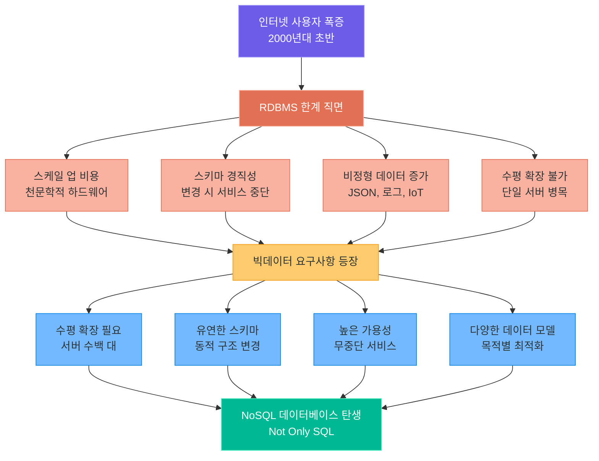
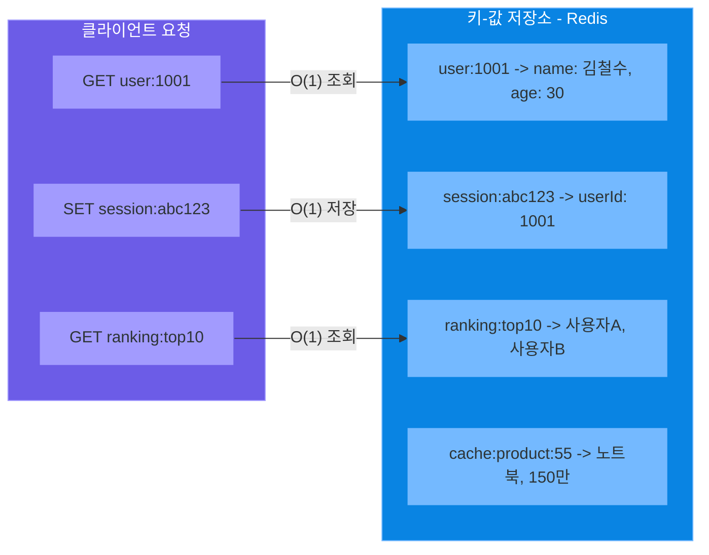
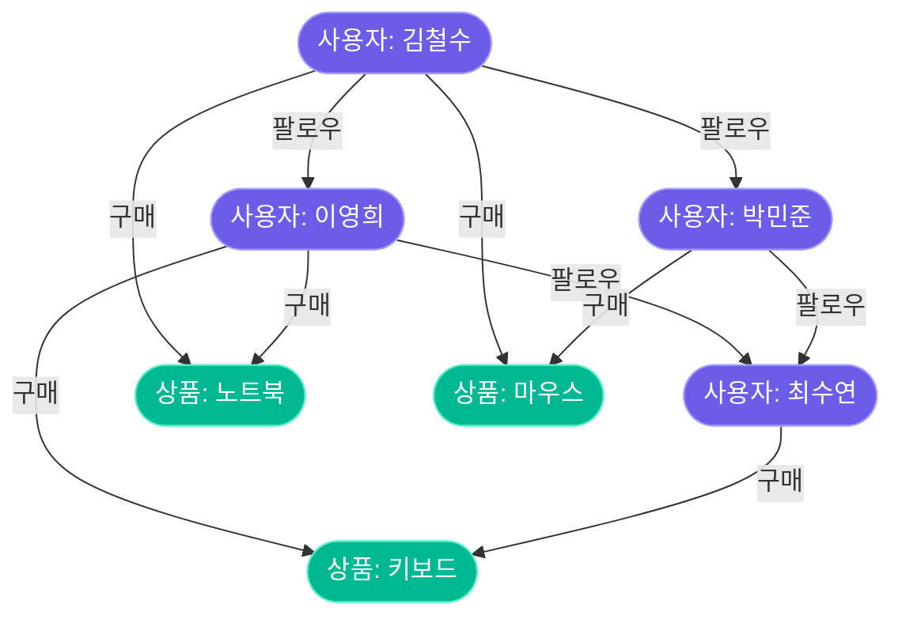
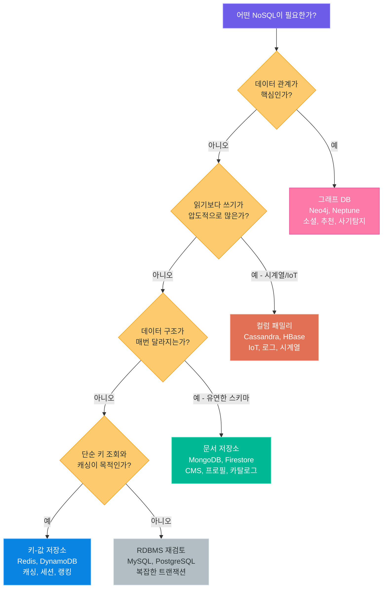
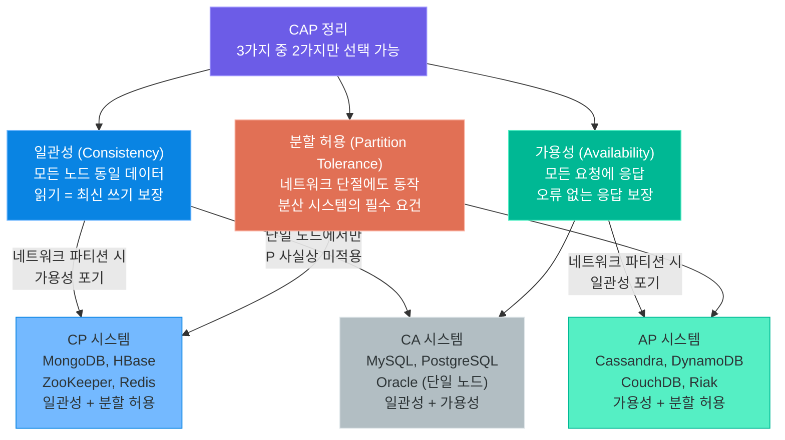
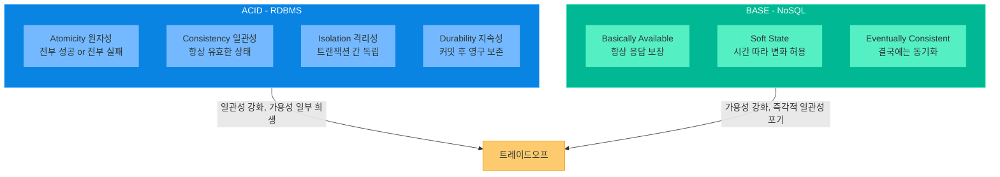
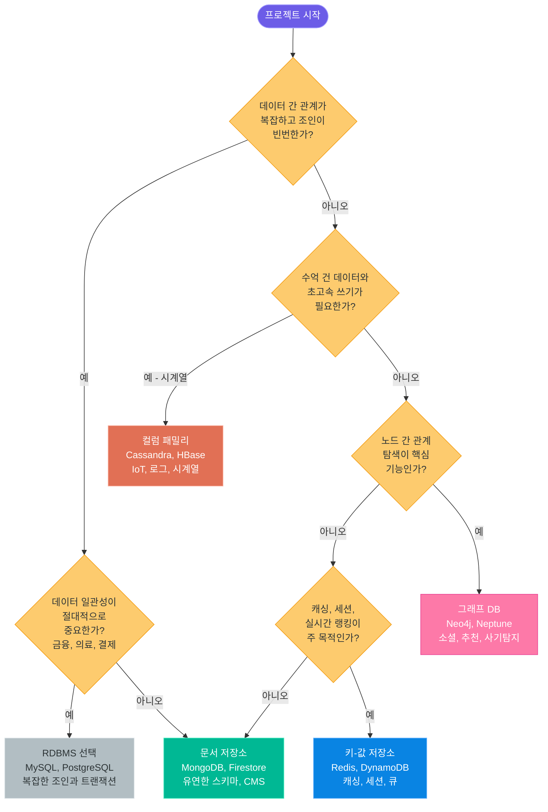
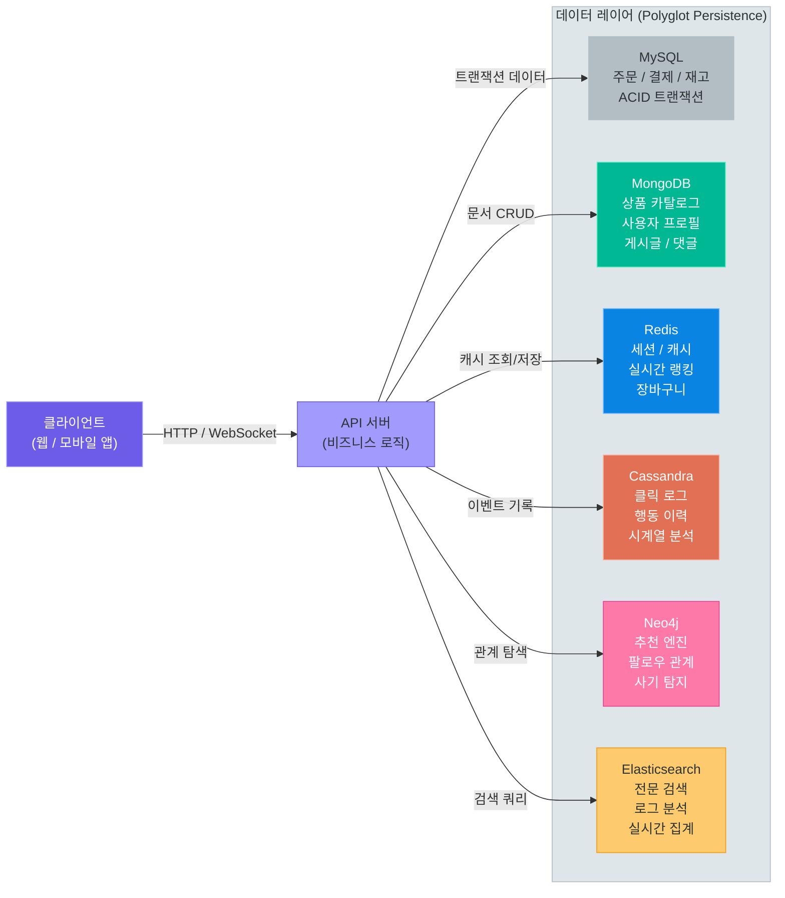
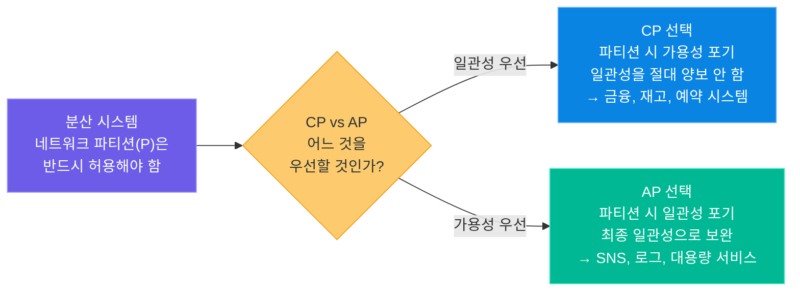
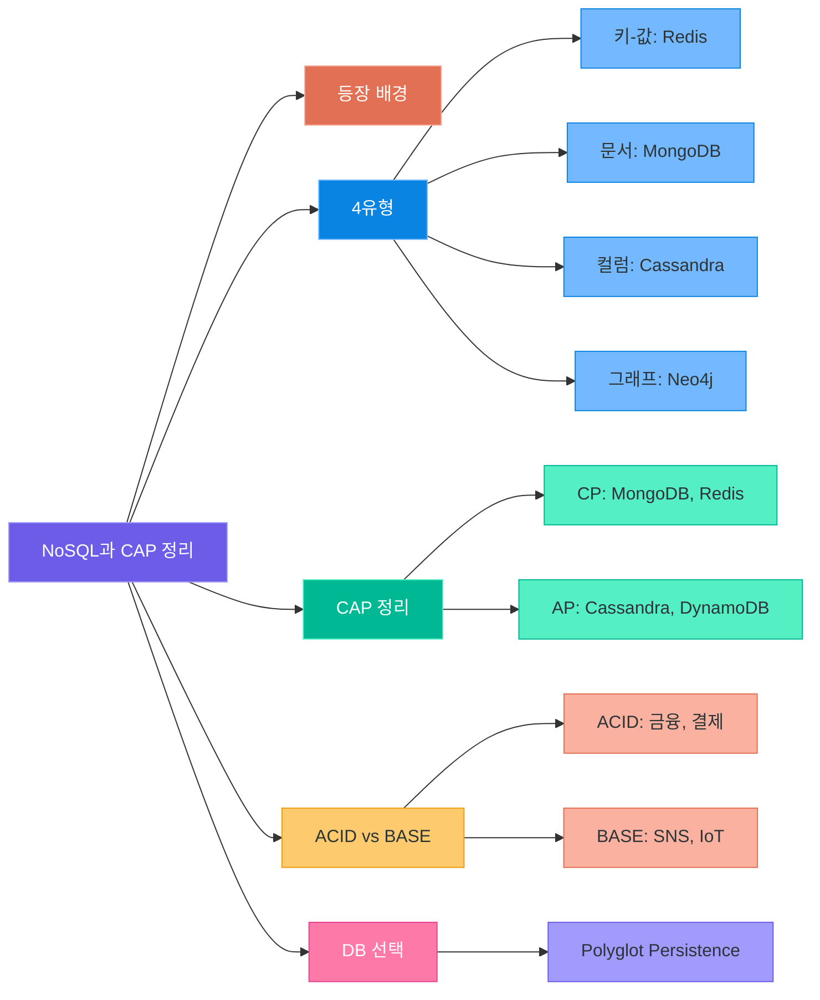

# NoSQL과 CAP 정리

> 관계형 DB가 모든 문제의 해답은 아닙니다 — NoSQL 4가지 유형의 특성을 이해하고, CAP 정리와 ACID vs BASE 트레이드오프를 파악하여 상황에 맞는 데이터베이스를 선택하는 능력을 갖춥니다

---

## 1. NoSQL의 등장 배경

### RDBMS가 직면한 한계

2000년대 초반까지 데이터베이스 세계는 관계형 DB(RDBMS)가 지배했습니다. MySQL, Oracle, PostgreSQL은 견고한 트랜잭션과 복잡한 쿼리를 지원하며 기업 시스템의 근간을 이루었습니다. 그러나 인터넷 사용자가 폭발적으로 증가하면서 RDBMS가 감당하기 어려운 상황이 펼쳐지기 시작했습니다.

**스케일 업의 한계와 비용:** RDBMS는 주로 수직 확장(Scale Up), 즉 서버 한 대의 CPU와 메모리를 업그레이드하는 방식으로 성능을 높입니다. 그러나 하드웨어 성능에는 물리적 한계가 있으며, 고성능 서버는 가격이 기하급수적으로 올라갑니다. 하루 수억 건의 요청을 처리하는 Facebook이나 Twitter에 이 방식은 현실적으로 불가능했습니다.

**스키마 변경의 어려움:** 테이블 구조를 사전에 정의해야 하는 RDBMS에서는 새로운 컬럼을 추가하거나 구조를 변경하는 작업이 서비스 중단을 수반합니다. 수억 개의 행이 있는 테이블에 컬럼 하나를 추가하는 ALTER TABLE 작업은 몇 시간에서 며칠이 걸릴 수 있습니다. 빠른 제품 개발과 실험을 반복하는 스타트업 환경에서 이는 치명적인 단점입니다.

**비정형 데이터의 증가:** SNS 게시글, 로그 파일, IoT 센서 데이터, 사용자 행동 이력처럼 고정된 형태가 없는 비정형 데이터가 급증했습니다. 이런 데이터를 미리 정의된 스키마에 억지로 끼워 맞추는 것은 비효율적입니다.

**RDBMS vs NoSQL 규모별 적합성:**

| 데이터 규모 | 초당 요청 수 | RDBMS 적합성 | NoSQL 적합성 | 권장 전략 |
|-----------|------------|-------------|-------------|----------|
| 소형 (수 GB) | 수백 건 | 매우 적합 | 과도한 도입 | RDBMS 단독 사용 |
| 중형 (수십 GB) | 수천 건 | 적합 | 보완 가능 | RDBMS + Redis 캐시 |
| 대형 (수 TB) | 수만 건 | 한계 도달 | 필요 | RDBMS + NoSQL 조합 |
| 초대형 (수 PB) | 수백만 건 | 불가 | 필수 | Polyglot Persistence |

### 빅데이터 시대의 요구사항

실생활 비유를 들어 보겠습니다. RDBMS는 마치 **엑셀 표**와 같습니다. 행과 열이 명확히 정해져 있어 정형화된 데이터를 다루기에 완벽합니다. 그러나 회사가 갑자기 열 배로 성장한다면 엑셀 한 장이 아닌 수백 장이 필요해지고, 각 장을 연결하고 관리하는 작업이 급격히 복잡해집니다.

반면 NoSQL은 목적에 따라 다양한 형태를 취합니다.

| 비유 | NoSQL 유형 | 특징 |
|------|-----------|------|
| 서류 폴더 (문서별 정보 묶음) | 문서 저장소 | 관련 정보를 하나의 덩어리로 보관 |
| 사물함 (번호에 내용 대응) | 키-값 저장소 | 고유 키로 값을 빠르게 꺼냄 |
| 전화번호부 (항목별 여러 속성) | 컬럼 패밀리 | 항목마다 다른 속성을 유연하게 저장 |
| 지하철 노선도 (역과 연결선) | 그래프 DB | 객체 간 관계 자체가 데이터 |

NoSQL(Not Only SQL)이라는 이름은 "SQL을 사용하지 않는다"는 의미가 아닙니다. "SQL만이 답이 아니다"라는 선언입니다. 목적에 따라 관계형 DB와 NoSQL을 함께 사용하는 것이 현대적인 접근입니다.

### RDBMS 한계와 NoSQL 등장 흐름



> **핵심 포인트:** NoSQL은 RDBMS를 대체하는 것이 아니라 보완합니다. 각 유형은 특정 문제를 해결하도록 설계되었으며, 실무에서는 여러 종류의 DB를 함께 사용하는 Polyglot Persistence 전략이 일반적입니다.

---

## 2. NoSQL 4가지 유형

### 2.1 키-값 저장소 (Key-Value Store)

키-값 저장소는 가장 단순하고 빠른 NoSQL 유형입니다. 마치 **사물함**을 생각하면 이해하기 쉽습니다. 각 사물함에는 고유한 번호(키)가 있고, 그 안에 무엇이든 넣을 수 있습니다(값). 내용물이 무엇인지는 꺼내보기 전까지 알 필요가 없습니다.

프로그래밍 언어의 해시맵(HashMap)과 동일한 개념입니다. `get(key)`로 데이터를 조회하고 `set(key, value)`로 저장합니다. 이 단순한 구조 덕분에 조회 속도가 극도로 빠릅니다. 일반적으로 O(1) 시간 복잡도로 수백만 건의 요청을 처리할 수 있습니다.

**대표 제품:** Redis, DynamoDB, Memcached

**주요 사용 사례:**
- 세션 관리: 로그인 정보를 `session:{user_id}` 키로 저장
- 캐싱: DB 조회 결과를 메모리에 임시 저장하여 응답 속도 향상
- 실시간 랭킹: Redis의 Sorted Set으로 게임 점수 순위 관리
- 속도 제한(Rate Limiting): API 호출 횟수 추적



**Redis 주요 자료구조:**

Redis는 단순한 문자열 키-값 외에도 다양한 자료구조를 제공합니다. 이 점이 Memcached와의 결정적인 차이입니다.

| 자료구조 | 설명 | 대표 사용 사례 |
|---------|------|-------------|
| String | 문자열, 숫자, 바이너리 | 캐시, 카운터, 세션 |
| List | 순서 있는 목록 | 최근 방문 목록, 작업 큐 |
| Set | 중복 없는 집합 | 팔로워 목록, 태그 |
| Sorted Set | 점수 기반 정렬 집합 | 실시간 랭킹 |
| Hash | 필드-값 쌍의 맵 | 사용자 프로필 객체 |
| Bitmap | 비트 단위 연산 | 출석 체크, 기능 플래그 |

> **핵심 포인트:** 키-값 저장소는 단순 키-값 조회에 최적화되어 있습니다. 복잡한 조건 검색이나 조인이 필요하다면 다른 DB가 적합합니다. Redis는 순수 메모리 기반으로 초당 수백만 건 처리가 가능하여 캐싱 레이어의 표준이 되었습니다.

### 2.2 문서 저장소 (Document Store)

문서 저장소는 데이터를 JSON(또는 BSON) 형태의 **문서(Document)**로 저장합니다. **서류 폴더**를 떠올려 보십시오. 각 폴더에는 관련된 정보가 모두 들어 있습니다. 직원 폴더에는 이름, 주소, 경력, 자격증 사본 등이 한 곳에 묶여 있습니다.

테이블처럼 모든 행이 동일한 컬럼을 가질 필요가 없습니다. 어떤 사용자는 `phone` 필드가 있고, 어떤 사용자는 없어도 됩니다. 중첩된 구조(nested object)와 배열도 그대로 저장할 수 있어 객체지향 프로그래밍과 궁합이 좋습니다.

**대표 제품:** MongoDB, CouchDB, Firestore, Amazon DocumentDB

**주요 사용 사례:**
- 컨텐츠 관리 시스템(CMS): 블로그, 뉴스 기사처럼 구조가 다양한 컨텐츠
- 사용자 프로필: 사용자마다 다른 추가 정보를 유연하게 저장
- 상품 카탈로그: 전자제품, 의류, 식품 등 카테고리별로 속성이 다른 상품
- 실시간 분석: 이벤트 로그, 사용자 행동 추적

```json
// mongodb_document_example.json -- 문서 저장소 구조 예시
{
  "_id": "user_1001",
  "name": "김철수",
  "email": "kim@example.com",
  "addresses": [
    { "type": "home", "city": "서울", "zipcode": "04521" },
    { "type": "work", "city": "판교", "zipcode": "13494" }
  ],
  "preferences": {
    "language": "ko",
    "notifications": true,
    "theme": "dark"
  },
  "tags": ["프리미엄", "얼리어답터"],
  "created_at": "2024-01-15T09:00:00Z",
  "last_login": "2024-03-20T14:30:00Z"
}
```

RDBMS로 동일한 사용자 데이터를 저장하려면 `users`, `addresses`, `preferences`, `tags` 등 최소 4개 테이블을 만들고 조인해야 합니다. 문서 저장소는 이를 하나의 문서로 처리합니다.

MongoDB의 실제 사용 방법은 다음 강의(10강)에서 자세히 다룹니다.

> **핵심 포인트:** 문서 저장소는 현실 세계의 복잡한 객체를 그대로 저장할 수 있어 개발 생산성이 높습니다. 단, 여러 컬렉션에 걸친 조인(join)이 어렵고, 트랜잭션 지원이 제한적이라는 점을 고려해야 합니다.

### 2.3 컬럼 패밀리 (Column-Family Store)

컬럼 패밀리 저장소는 **와이드 컬럼 스토어(Wide Column Store)**라고도 불립니다. 겉으로 보면 테이블처럼 보이지만, 각 행마다 서로 다른 컬럼을 가질 수 있고 수백만 개의 컬럼을 처리할 수 있다는 점에서 RDBMS와 근본적으로 다릅니다.

**전화번호부**에 비유할 수 있습니다. 각 사람(행 키)마다 이름, 전화번호처럼 공통된 정보도 있지만, 어떤 사람은 팩스번호가 있고, 어떤 사람은 여러 개의 소셜 계정이 있습니다. 이처럼 행마다 다른 컬럼 구성을 유연하게 허용합니다.

**대표 제품:** Apache Cassandra, HBase, ScyllaDB, Google Bigtable

**주요 사용 사례:**
- 시계열 데이터: 온도, 주식 가격처럼 시간 순으로 쌓이는 대용량 데이터
- IoT 데이터: 수천 개의 센서에서 수집되는 측정값
- 로그 분석: 서버 로그, 클릭스트림 데이터
- 메시지 히스토리: 채팅 앱의 대화 내역

```
// cassandra_schema_example -- 컬럼 패밀리 구조 예시
// 파티션 키: sensor_id, 클러스터링 키: timestamp (내림차순)

CREATE TABLE sensor_readings (
    sensor_id  TEXT,
    timestamp  TIMESTAMP,
    temperature DOUBLE,
    humidity   DOUBLE,
    battery    INT,
    pressure   DOUBLE,    -- 일부 센서만 존재
    PRIMARY KEY (sensor_id, timestamp)
) WITH CLUSTERING ORDER BY (timestamp DESC);

// 실제 저장 형태:
// sensor_001 | 2024-01-15 09:01 → temperature: 22.7, humidity: 64
// sensor_001 | 2024-01-15 09:00 → temperature: 22.5, humidity: 65, battery: 98
// sensor_002 | 2024-01-15 09:00 → temperature: 18.3, humidity: 70, pressure: 1013
```

Cassandra는 어떤 단일 장애점(SPOF)도 없는 완전한 분산 구조로 설계되어, 수천 대의 노드로 수평 확장이 가능합니다. Netflix는 수백 개의 Cassandra 노드에서 하루 수조 건의 이벤트를 처리합니다.

> **핵심 포인트:** 컬럼 패밀리 저장소는 시계열 데이터와 대규모 쓰기 작업에 특히 강합니다. 초당 수백만 건의 쓰기를 안정적으로 처리할 수 있으나, 복잡한 쿼리와 집계 연산은 제한적입니다.

### 2.4 그래프 데이터베이스 (Graph Database)

그래프 DB는 데이터를 **노드(Node)**와 **엣지(Edge)**로 표현합니다. **지하철 노선도**와 완전히 동일한 구조입니다. 역(노드)과 역 사이의 선(엣지)으로 전체 네트워크가 표현되고, 환승역이나 거리 같은 속성도 각 요소에 부여됩니다.

RDBMS에서 "A의 친구의 친구 중 서울에 사는 사람"을 찾으려면 여러 테이블을 조인해야 하고 깊이가 깊어질수록 성능이 급격히 저하됩니다. 그래프 DB는 이런 탐색을 본질적으로 효율적으로 처리합니다.

**대표 제품:** Neo4j, Amazon Neptune, ArangoDB, JanusGraph

**주요 사용 사례:**
- 소셜 네트워크: 팔로우, 친구 관계, 공통 지인 탐색
- 추천 시스템: "이 상품을 산 사람은 이것도 샀습니다"
- 사기 탐지: 의심스러운 거래 패턴과 계좌 연결망 분석
- 지식 그래프: 개념 간의 관계를 구조화 (예: Google의 Knowledge Graph)



위의 그래프에서 "김철수가 구매하지 않았지만 팔로우하는 사람들이 구매한 상품"을 찾는 Neo4j의 Cypher 쿼리 예시입니다.

```cypher
// neo4j_recommendation_query.cypher -- 그래프 DB 추천 쿼리 예시
MATCH (me:User {name: "김철수"})-[:FOLLOWS]->(friend:User)-[:PURCHASED]->(product:Product)
WHERE NOT (me)-[:PURCHASED]->(product)
RETURN product.name, count(friend) AS purchase_count
ORDER BY purchase_count DESC
LIMIT 5
```

RDBMS로 동일한 작업을 구현하려면 복잡한 서브쿼리와 여러 조인이 필요하며, 관계 깊이가 늘어날수록 성능이 급격히 저하됩니다. 그래프 DB는 관계 탐색 깊이에 거의 영향을 받지 않습니다.

> **핵심 포인트:** 그래프 DB는 관계 자체가 데이터의 핵심일 때 진가를 발휘합니다. 노드 수보다 엣지(관계) 수가 훨씬 많은 데이터 구조에 최적화되어 있습니다.

---

## 3. NoSQL 유형별 비교

### 4가지 유형 종합 비교

| 구분 | 키-값 저장소 | 문서 저장소 | 컬럼 패밀리 | 그래프 DB |
|------|------------|------------|------------|----------|
| **데이터 모델** | 키: 값 쌍 | JSON/BSON 문서 | 행 키 + 컬럼 패밀리 | 노드 + 엣지 |
| **스키마** | 없음 | 유연 (동적) | 부분적 고정 | 유연 |
| **수평 확장** | 매우 우수 | 우수 | 매우 우수 | 제한적 |
| **쿼리 방식** | 키 기반 단순 조회 | 필드 조건 검색 | 행 키 + 컬럼 범위 | 그래프 탐색 |
| **일관성** | 조정 가능 | 조정 가능 | 최종 일관성 | 강한 일관성 |
| **조인** | 불가 | 제한적 | 불가 | 네이티브 지원 |
| **대표 제품** | Redis, DynamoDB | MongoDB, Firestore | Cassandra, HBase | Neo4j, Neptune |
| **최적 사례** | 캐싱, 세션 | CMS, 프로필 | IoT, 시계열 | 소셜, 추천 |

### 읽기/쓰기 성능 특성 비교

각 유형의 읽기와 쓰기 성능 특성을 이해하면 적합한 DB를 고르는 데 도움이 됩니다.

| 구분 | 읽기 성능 | 쓰기 성능 | 복잡한 쿼리 | 트랜잭션 |
|------|---------|---------|-----------|---------|
| 키-값 | 극도로 빠름 (O1) | 극도로 빠름 | 불가 | 제한적 |
| 문서 | 빠름 | 빠름 | 가능 (집계 파이프라인) | 단일 문서 보장 |
| 컬럼 패밀리 | 빠름 (범위 스캔) | 매우 빠름 | 제한적 | 행 수준 |
| 그래프 | 관계 탐색 최적 | 보통 | 관계 패턴 쿼리 | 지원 |
| RDBMS | 조인 시 느려짐 | 보통 | 매우 강력 | 완벽한 ACID |

### NoSQL 유형 선택 의사결정 트리



> **핵심 포인트:** 어떤 NoSQL도 "만능"이 아닙니다. 데이터의 형태, 접근 패턴, 확장성 요구사항을 먼저 파악한 후 DB를 선택해야 합니다.

---

## 4. CAP 정리

### CAP 정리란 무엇인가

2000년 에릭 브루어(Eric Brewer)가 제안하고 2002년 Gilbert와 Lynch가 증명한 **CAP 정리**는 분산 시스템 설계의 핵심 원칙입니다. 이 정리는 분산 데이터베이스가 다음 세 가지 속성을 **동시에 모두** 보장할 수 없다고 말합니다.

**일관성 (Consistency):** 모든 노드가 동시에 동일한 데이터를 보입니다. 서울 서버에서 데이터를 수정하면 즉시 부산 서버에서도 같은 값이 보입니다. 어떤 노드에 읽기 요청을 보내도 항상 가장 최근에 쓰인 값을 반환합니다.

**가용성 (Availability):** 일부 노드에 장애가 발생해도 모든 요청에 응답합니다. 답이 최신 데이터가 아닐 수 있어도 반드시 응답을 돌려줍니다. "잠시 기다려 주세요"라고 응답하지 않습니다.

**분할 허용 (Partition Tolerance):** 노드 간 네트워크가 끊어지더라도(네트워크 파티션) 시스템이 계속 동작합니다. 일부 메시지가 유실되거나 지연되어도 시스템은 멈추지 않습니다.

**실생활 비유:** 3명의 팀원(서울, 부산, 제주)이 같은 문서를 공유합니다. 갑자기 부산-제주 간 전화가 끊겼을 때(네트워크 파티션), 두 가지 선택지만 남습니다.

- **CP 선택:** 서울이 "지금 일관성이 없으니 업무를 멈추겠습니다"라고 선언 → 일관성 유지, 가용성 포기
- **AP 선택:** 서울이 "일단 각자 알고 있는 정보로 계속 일합시다, 나중에 맞추겠습니다" → 가용성 유지, 일관성 포기

네트워크 파티션(P)은 분산 시스템에서 필연적으로 발생하므로, 실질적 선택은 **CP vs AP**입니다.

### CAP 삼각형 시각화



### 주요 데이터베이스의 CAP 분류

| 데이터베이스 | 유형 | 일관성 (C) | 가용성 (A) | 분할 허용 (P) | 특징 |
|------------|------|-----------|-----------|-------------|------|
| MySQL / PostgreSQL | CA | 강함 | 높음 | 제한적 | 단일 노드 또는 마스터-슬레이브 |
| MongoDB | CP | 강함 | 부분적 | 지원 | 프라이머리 노드 중심 |
| HBase | CP | 강함 | 부분적 | 지원 | ZooKeeper로 조정 |
| Redis (클러스터) | CP | 강함 | 부분적 | 지원 | 파티션 시 일부 슬롯 불가 |
| Cassandra | AP | 최종 일관성 | 매우 높음 | 지원 | 튜너블 일관성 |
| DynamoDB | AP | 최종 일관성 | 매우 높음 | 지원 | 강한 일관성 옵션 별도 |
| CouchDB | AP | 최종 일관성 | 높음 | 지원 | MVCC 방식 |

### 튜너블 일관성 (Tunable Consistency)

Cassandra처럼 일부 NoSQL은 쿼리마다 일관성 수준을 조정할 수 있는 **튜너블 일관성**을 제공합니다. 이는 CAP 정리의 엄격한 이분법을 넘어, 상황에 따라 일관성과 가용성 사이의 균형점을 찾을 수 있게 합니다.

| 일관성 레벨 | 설명 | 사용 사례 |
|-----------|------|----------|
| ONE | 1개 노드 응답으로 충분 | 최고 성능, 낮은 일관성 보장 |
| QUORUM | 과반수 노드 동의 필요 | 균형 잡힌 선택 |
| ALL | 모든 노드 동의 필요 | 최강 일관성, 느린 성능 |
| LOCAL_QUORUM | 로컬 데이터센터 과반수 | 지리 분산 환경 |

> **핵심 포인트:** "CA 시스템"은 분산 환경에서 사실상 P를 포기한 것입니다. 실제 분산 데이터베이스는 CP와 AP 중 하나를 선택합니다. Cassandra처럼 일관성 레벨을 쿼리마다 조정할 수 있는 "튜너블 일관성" 방식도 있습니다.

---

## 5. ACID vs BASE

### ACID: 관계형 DB의 신뢰성 원칙

ACID는 RDBMS 트랜잭션이 보장하는 4가지 속성의 머리글자입니다. 은행 계좌 이체처럼 데이터 무결성이 절대적으로 중요한 상황에서 필수적입니다.

**원자성 (Atomicity):** 트랜잭션의 모든 작업은 전부 성공하거나 전부 실패합니다. A 계좌에서 100만 원을 출금하고 B 계좌에 입금하는 도중 오류가 나면, 출금도 취소됩니다. "절반만 성공"은 없습니다.

**일관성 (Consistency):** 트랜잭션 전후로 데이터베이스는 항상 유효한 상태를 유지합니다. 잔액은 음수가 될 수 없다는 제약이 있다면, 트랜잭션 후에도 이 제약이 보장됩니다.

**격리성 (Isolation):** 동시에 실행되는 트랜잭션들은 서로 간섭하지 않습니다. 두 사람이 동시에 같은 계좌에서 출금해도 각자의 트랜잭션은 독립적으로 처리됩니다.

**지속성 (Durability):** 커밋된 트랜잭션은 시스템 장애가 발생해도 데이터가 보존됩니다. 저장 완료 후 서버가 꺼져도 데이터는 사라지지 않습니다.

```sql
-- acid_bank_transfer.sql -- ACID 트랜잭션 예시: 은행 이체
BEGIN TRANSACTION;

UPDATE accounts SET balance = balance - 1000000 WHERE account_id = 'A001';
UPDATE accounts SET balance = balance + 1000000 WHERE account_id = 'B002';

-- 잔액 음수 제약 확인 (Consistency)
SELECT balance FROM accounts WHERE account_id = 'A001';
-- 잔액이 음수라면 ROLLBACK

COMMIT;
-- 커밋 후 서버가 꺼져도 데이터 유지 (Durability)
```

### BASE: NoSQL의 실용적 접근

ACID가 강한 일관성을 보장하는 대신 가용성과 성능을 일부 희생하는 반면, BASE는 **높은 가용성과 성능**을 우선시하고 일관성은 "결국에는(Eventually)" 맞춰지면 된다는 접근을 취합니다.

**기본적 가용성 (Basically Available):** 시스템은 항상 응답합니다. 일부 노드가 죽어도 나머지가 요청을 처리합니다. 데이터가 오래된 것일 수 있어도 응답 자체는 보장합니다.

**소프트 상태 (Soft State):** 입력이 없어도 시스템 상태는 시간에 따라 변할 수 있습니다. 노드 간 동기화가 진행되면서 데이터가 "자연스럽게" 업데이트됩니다.

**최종 일관성 (Eventually Consistent):** 모든 업데이트가 결국에는 모든 노드에 전파됩니다. "언제까지"가 아니라 "결국에는"이라는 약속입니다.

실생활 비유를 들어 보겠습니다. 소셜 미디어에서 유명인이 새 글을 올렸을 때, 전 세계 모든 사용자가 동시에 그 글을 보게 되지는 않습니다. 서울 사용자는 즉시 보고, 뉴욕 사용자는 몇 초 후에 볼 수 있습니다. 이것이 최종 일관성입니다. 수억 명의 사용자를 위한 소셜 미디어에서 완벽한 동시 일관성을 요구한다면 서비스 자체가 불가능해집니다.

### 최종 일관성의 동작 원리

최종 일관성이 실제로 어떻게 작동하는지 Cassandra를 예로 들어 살펴보겠습니다. 3개 노드(A, B, C)가 있고 쓰기 레벨이 ONE(1개 노드 확인)인 경우입니다.

```
T=0ms  : 클라이언트가 노드 A에 "재고: 10" 쓰기
T=0ms  : 노드 A 확인, 응답 반환 (쓰기 완료)
T=50ms : 노드 A → 노드 B 복제 전파 (비동기)
T=80ms : 노드 A → 노드 C 복제 전파 (비동기)
T=50ms : 클라이언트가 노드 B에서 읽기 → "재고: 구형 값" (불일치!)
T=81ms : 클라이언트가 노드 B에서 읽기 → "재고: 10" (일관성 달성)
```

이 일시적 불일치 구간이 "소프트 상태"이며, 복제가 완료되면 "최종 일관성"이 달성됩니다.

### ACID vs BASE 비교

| 구분 | ACID | BASE |
|------|------|------|
| **일관성** | 즉각적, 강한 일관성 | 최종 일관성 (Eventually Consistent) |
| **가용성** | 일관성 위해 일부 희생 | 최우선 보장 |
| **확장성** | 수직 확장 중심 | 수평 확장 최적화 |
| **트랜잭션** | 복잡한 다중 레코드 트랜잭션 | 단순 트랜잭션, 제한적 |
| **적합 사례** | 금융, 결제, 의료 기록 | SNS, 로그, 쇼핑 카트 |
| **대표 DB** | MySQL, PostgreSQL, Oracle | Cassandra, DynamoDB, MongoDB |
| **성능** | 락(Lock)으로 인한 오버헤드 | 락 최소화, 높은 처리량 |



> **핵심 포인트:** ACID와 BASE는 우열이 없습니다. 금융 거래에는 ACID가 필수이고, 대규모 SNS 피드에는 BASE가 현실적입니다. 서비스 도메인의 요구사항을 먼저 파악하고 적절한 일관성 모델을 선택해야 합니다.

---

## 6. 데이터베이스 선택 가이드

### 프로젝트 요구사항 분석 체크리스트

데이터베이스를 선택하기 전에 다음 질문들에 답해야 합니다.

| 카테고리 | 확인 사항 | RDBMS 신호 | NoSQL 신호 |
|----------|----------|-----------|-----------|
| **데이터 구조** | 스키마가 고정적인가? | 고정, 정형화 | 가변적, 비정형 |
| **관계 복잡도** | 조인이 많이 필요한가? | 다중 조인 필수 | 조인 없거나 단순 |
| **확장성** | 트래픽 증가가 예상되는가? | 수직 확장 가능 | 수평 확장 필요 |
| **일관성** | 데이터 무결성이 절대적인가? | 강한 일관성 필수 | 최종 일관성 허용 |
| **트랜잭션** | 복잡한 트랜잭션이 필요한가? | 다중 레코드 트랜잭션 | 단순하거나 불필요 |
| **쿼리 패턴** | 쿼리가 다양하고 예측 불가한가? | 다양한 애드혹 쿼리 | 예측 가능한 패턴 |
| **읽기/쓰기 비율** | 쓰기가 압도적으로 많은가? | 읽기 중심 | 쓰기 집약적 |

### DB 선택 의사결정 플로우차트



### 실무 사례: 대표 아키텍처 패턴

**패턴 1 - 이커머스 플랫폼**

주문, 결제, 재고는 데이터 무결성이 절대적이므로 RDBMS를 사용합니다. 그러나 상품 목록 페이지 조회는 수많은 사용자가 동시에 요청하므로, Redis로 캐싱하여 DB 부하를 줄입니다. 상품 검색은 Elasticsearch가 전문 검색을 처리합니다.

```
# ecommerce_db_architecture -- 이커머스 DB 아키텍처
MySQL        : 주문, 결제, 재고, 사용자 계정 (ACID 필수)
Redis        : 상품 캐시, 세션, 장바구니, 쿠폰 잔여량 (TTL 기반 자동 만료)
Elasticsearch: 상품 검색, 카테고리 필터링 (역인덱스 기반 빠른 검색)
```

**패턴 2 - 소셜 미디어 플랫폼**

게시글과 사용자 프로필은 구조가 다양하고 빠르게 변하므로 MongoDB를 사용합니다. 팔로우/팔로워 관계는 그래프 DB가 효율적이며, 피드와 알림은 빠른 읽기를 위해 Redis를 활용합니다. 사용자 행동 이력처럼 대용량 쓰기가 필요한 데이터는 Cassandra가 처리합니다.

```
# social_media_db_architecture -- 소셜 미디어 DB 아키텍처
MongoDB      : 게시글, 댓글, 사용자 프로필 (유연한 스키마)
Neo4j        : 팔로우 관계, 추천 친구 탐색 (그래프 탐색)
Redis        : 알림 큐, 피드 캐시, 실시간 접속 상태 (Pub/Sub)
Cassandra    : 활동 로그, 클릭 이력, 뷰 카운트 (대용량 쓰기)
```

**패턴 3 - IoT 모니터링 시스템**

수천 개의 센서에서 초당 수만 건의 측정값이 들어오므로 Cassandra가 최적입니다. 현재 상태 조회에는 Redis, 이상 알림 규칙 관리에는 RDBMS를 사용합니다.

```
# iot_monitoring_db_architecture -- IoT 모니터링 DB 아키텍처
Cassandra    : 센서 측정값 시계열 저장, 데이터 보존 정책 관리
Redis        : 최신 센서 상태 캐시 (초당 수만 건 조회 대응)
PostgreSQL   : 센서 메타데이터, 알림 임계값 규칙, 사용자 설정
```

### Polyglot Persistence 아키텍처

여러 종류의 데이터베이스를 목적에 맞게 함께 사용하는 전략을 **Polyglot Persistence**라고 합니다. 마치 요리사가 칼, 프라이팬, 오븐을 각각 다른 용도로 사용하는 것과 같습니다. 하나의 도구가 모든 요리에 최적일 수는 없습니다.



Polyglot Persistence의 장점은 각 DB의 강점을 극대화할 수 있다는 것입니다. 그러나 운영 복잡도가 높아지고, 여러 DB 간 데이터 동기화가 새로운 도전 과제가 됩니다. 소규모 팀이라면 처음에는 하나의 DB로 시작하고, 명확한 병목이 확인될 때 다른 DB를 추가하는 점진적 접근이 현명합니다.

### Polyglot Persistence 도입 시 고려사항

| 고려 항목 | 내용 | 대응 방안 |
|----------|------|---------|
| 데이터 동기화 | 여러 DB 간 데이터 일관성 유지 | 이벤트 기반 동기화, CDC(Change Data Capture) |
| 운영 복잡도 | 여러 DB 모니터링 및 백업 | 통합 모니터링 도구 (Datadog, Prometheus) |
| 팀 역량 | 여러 DB 기술 습득 필요 | 점진적 도입, 내부 교육 |
| 비용 | 여러 DB 라이선스 및 인프라 | 오픈소스 우선, 클라우드 관리형 서비스 활용 |
| 트랜잭션 경계 | 여러 DB에 걸친 트랜잭션 처리 | Saga 패턴, 보상 트랜잭션 |

> **핵심 포인트:** DB 선택은 "기술적으로 멋진 것"이 아니라 "지금 문제를 가장 효과적으로 해결하는 것"이어야 합니다. 팀의 역량, 운영 부담, 비용까지 고려한 실용적 판단이 필요합니다.

---

## 7. 핵심 정리

### NoSQL 4유형 요약

| 유형 | 구조 | 강점 | 약점 | 언제 사용하나 |
|------|------|------|------|-------------|
| 키-값 | `key → value` | 초고속 단순 조회 | 복잡한 쿼리 불가 | 캐싱, 세션, 실시간 카운터 |
| 문서 | JSON 트리 구조 | 유연한 스키마, 개발 편의 | 조인 어려움 | CMS, 프로필, 카탈로그 |
| 컬럼 패밀리 | 행 키 + 컬럼 | 대용량 쓰기, 시계열 | 쿼리 패턴 제한 | IoT, 로그, 시계열 분석 |
| 그래프 | 노드 + 엣지 | 관계 탐색 특화 | 수평 확장 어려움 | 소셜, 추천, 사기 탐지 |

### CAP 정리 요약



### ACID vs BASE 요약

| 속성 | ACID | BASE |
|------|------|------|
| 일관성 모델 | 즉각적 강한 일관성 | 최종 일관성 |
| 데이터 무결성 | 절대 보장 | 일시적 불일치 허용 |
| 확장 방식 | 수직 확장 | 수평 확장 |
| 트랜잭션 | 복잡한 다중 트랜잭션 | 단순하거나 없음 |
| 대표 DB | MySQL, PostgreSQL | Cassandra, DynamoDB |

### 오늘 배운 개념 전체 지도



### DB 선택 최종 체크리스트

데이터베이스 선택 시 아래 질문에 답하며 결정하십시오.

1. **데이터 형태:** 정형(테이블) vs 반정형(JSON) vs 비정형(그래프)?
2. **확장성:** 현재와 미래의 데이터 규모는 어느 정도인가?
3. **일관성:** 잘못된 데이터가 비즈니스에 미치는 영향은 얼마나 큰가?
4. **쿼리 패턴:** 주로 어떤 방식으로 데이터를 읽고 쓰는가?
5. **트랜잭션:** 여러 데이터를 묶어 처리해야 하는 작업이 있는가?
6. **팀 역량:** 팀이 해당 DB를 운영하고 최적화할 수 있는가?
7. **생태계:** 라이브러리, 모니터링 도구, 커뮤니티 지원은 충분한가?

### 도메인별 DB 추천 요약

서비스 도메인에 따른 대표적인 데이터베이스 선택 패턴을 정리합니다.

| 서비스 도메인 | 핵심 데이터 | 1순위 DB | 보조 DB | CAP 선택 |
|------------|----------|---------|---------|---------|
| 인터넷 뱅킹 | 계좌, 이체, 잔액 | MySQL / PostgreSQL | Redis (세션) | CA → CP |
| 이커머스 | 주문, 상품, 재고 | MySQL | MongoDB + Redis | CP + AP |
| 소셜 미디어 | 게시글, 팔로우 | MongoDB | Neo4j + Cassandra | AP |
| 게임 서버 | 점수, 아이템, 채팅 | Redis | MySQL + Cassandra | AP |
| IoT 플랫폼 | 센서 측정값 | Cassandra | Redis + PostgreSQL | AP |
| 추천 시스템 | 사용자-아이템 관계 | Neo4j | MongoDB + Redis | CP |
| 검색 서비스 | 문서, 인덱스 | Elasticsearch | Redis | AP |

### Key Takeaways

- NoSQL은 RDBMS를 대체하는 것이 아니라 보완하는 도구입니다.
- 키-값, 문서, 컬럼 패밀리, 그래프 — 각 유형은 특정 문제에 최적화되어 있습니다.
- CAP 정리에 따르면 분산 시스템은 네트워크 파티션(P)이 필연적이므로, 실질적으로는 CP 또는 AP 중 하나를 선택해야 합니다.
- ACID는 강한 일관성을, BASE는 높은 가용성과 성능을 우선합니다.
- 최종 일관성(Eventually Consistent)은 "결국에는 맞춰진다"는 약속이며, 소셜 미디어나 로그 시스템처럼 일시적 불일치가 허용되는 도메인에 적합합니다.
- 실무에서는 Polyglot Persistence — 여러 DB를 목적에 맞게 함께 사용하는 전략이 일반적입니다.
- 단일 DB로 시작하여 실제 병목을 확인한 후 점진적으로 다른 DB를 도입하는 것이 현명한 접근입니다.
- 최선의 DB 선택은 기술적 우수함보다 현재 문제에 대한 적합성과 팀 운영 역량에서 나옵니다.

---

## 다음 강의 미리보기

10강에서는 문서 저장소의 대표 주자인 **MongoDB**를 직접 실습합니다. 컬렉션 설계, CRUD 작업, 집계 파이프라인, 인덱스 최적화까지 MongoDB를 실무에서 사용하는 방법을 단계적으로 익힙니다. 이번 강의에서 배운 문서 저장소의 개념이 실제 코드로 어떻게 구현되는지 확인하게 됩니다.

**10강에서 다루는 주요 주제:**
- MongoDB 설치 및 초기 설정
- 컬렉션과 문서 구조 설계 원칙
- CRUD 작업: insertOne, find, updateMany, deleteOne
- 집계 파이프라인(Aggregation Pipeline)으로 데이터 분석
- 인덱스 생성과 쿼리 성능 최적화
- 실무 프로젝트: 게시판 서비스 MongoDB로 구현하기

---

> **이전 강의:** [MySQL과 프로덕션 데이터베이스](08_mysql_and_production_db.md)
>
> **다음 강의:** [MongoDB 기초](10_mongodb_basics.md)
