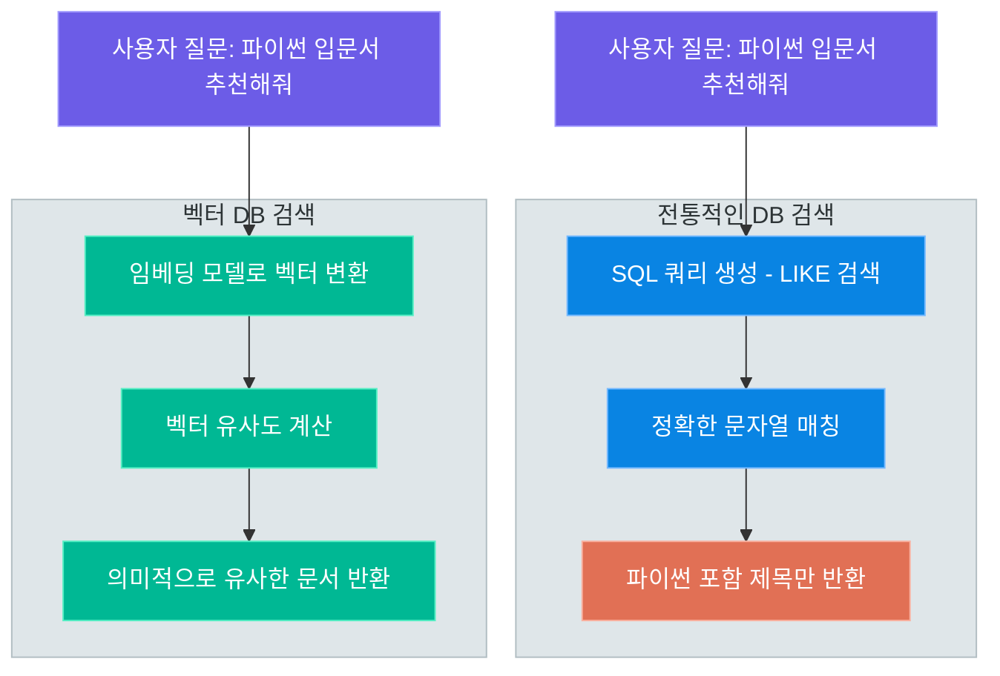
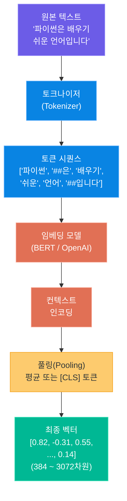
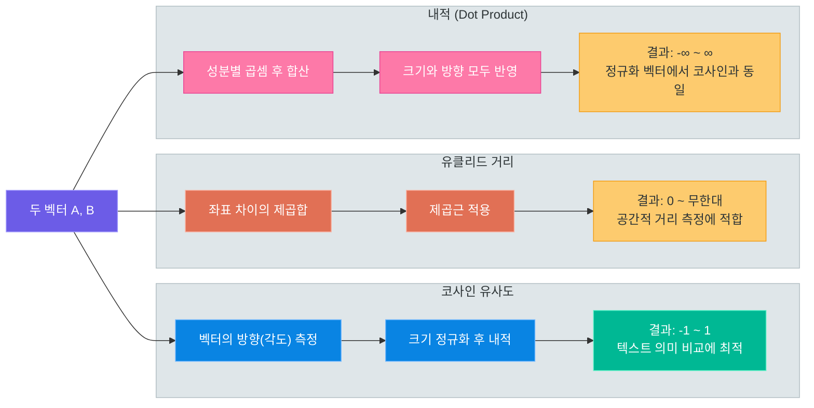
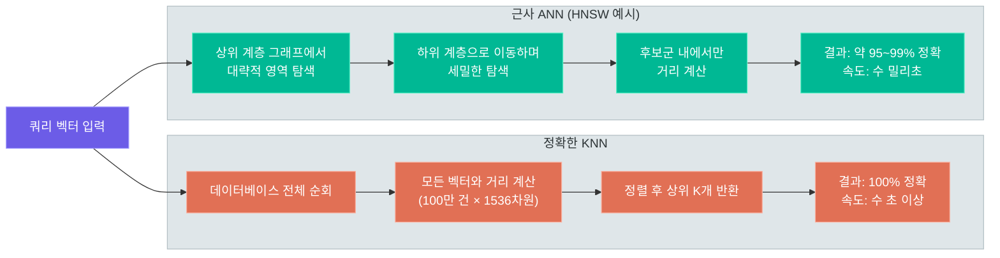
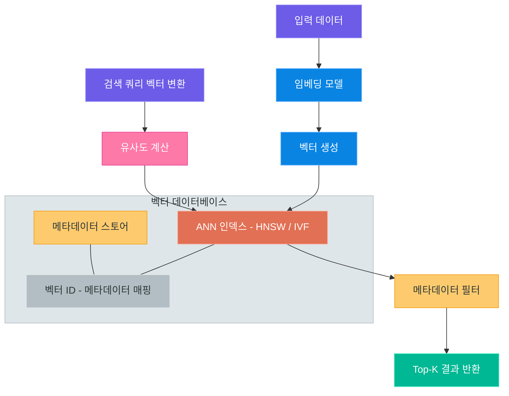
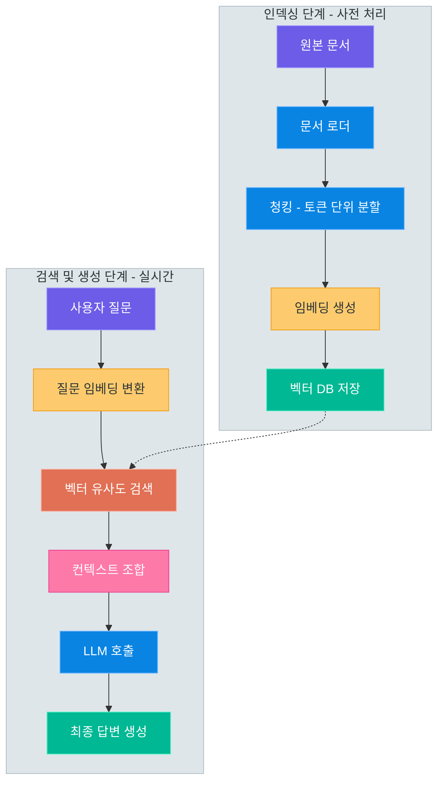
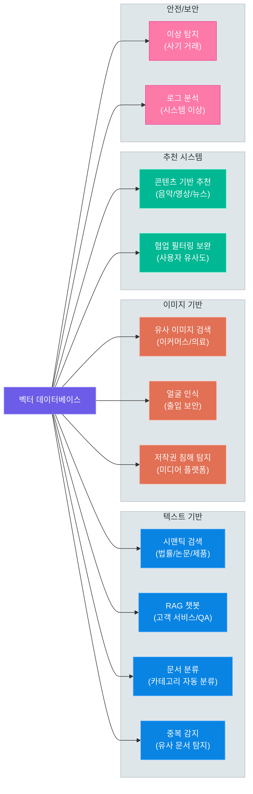
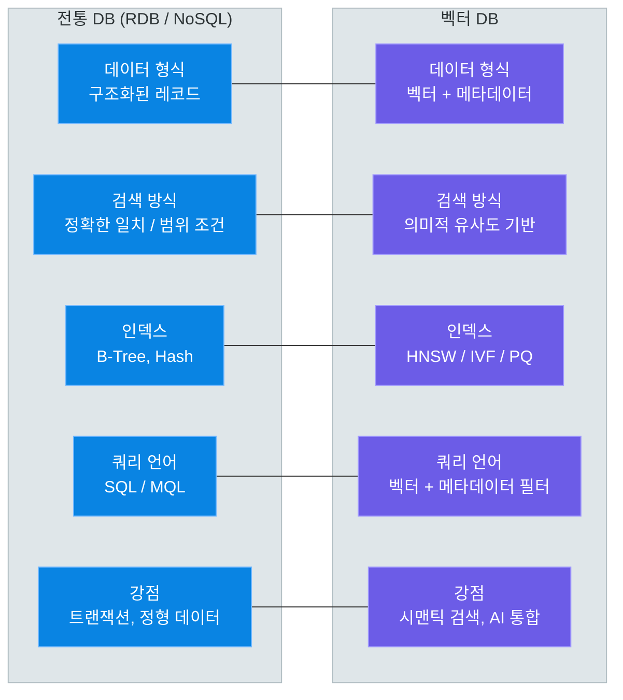

# 벡터 데이터베이스

> 텍스트의 "의미"를 숫자로 변환하여 유사한 것을 찾아내는 기술 — 임베딩, 유사도 검색, ANN 알고리즘부터 RAG 파이프라인까지, 생성형 AI 시대의 핵심 데이터 인프라를 이해합니다

---

## 1. 벡터 데이터베이스란 무엇인가

### 전통적인 데이터베이스의 검색 방식

지금까지 배운 관계형 데이터베이스와 MongoDB는 모두 **정확한 일치(Exact Match)** 또는 **범위 조건** 기반의 검색을 수행합니다.

```sql
-- 정확한 일치 검색
SELECT * FROM books WHERE title = '파친코';

-- 범위 검색
SELECT * FROM products WHERE price BETWEEN 10000 AND 50000;

-- 패턴 검색 (LIKE)
SELECT * FROM articles WHERE content LIKE '%인공지능%';
```

이 방식은 "정확히 무엇을 찾는지" 알고 있을 때 매우 효율적입니다. 그러나 **"이것과 비슷한 것"** 을 찾으려 하면 한계에 부딪힙니다.

예를 들어, "파이썬 입문서"를 검색하고 싶을 때 데이터베이스에 저장된 책 제목이 "Python 프로그래밍 기초"라면 LIKE 검색으로는 찾을 수 없습니다. 두 표현은 의미상 동일하지만, 문자열 자체가 다르기 때문입니다.

### 벡터 데이터베이스의 등장

**벡터 데이터베이스(Vector Database)**는 데이터를 고차원 숫자 벡터로 변환하여 저장하고, **의미적 유사도(Semantic Similarity)** 를 기반으로 검색하는 특수 목적 데이터베이스입니다.

비유를 들어보겠습니다. 도서관에서 책을 찾는 두 가지 방법을 상상해 보십시오.

- **전통적인 도서관 검색:** 책 제목이나 저자명을 사서에게 말하면 정확히 그 책을 찾아줍니다. "파친코"라는 제목의 책이 없으면 "없습니다"라고 답할 뿐입니다.
- **벡터 DB 방식의 도서관 검색:** "이민자 가족의 삶과 정체성에 관한 감동적인 소설"이라고 설명하면 사서가 유사한 느낌과 주제의 책들을 여러 권 추천해 줍니다.

두 번째 방식이 바로 벡터 데이터베이스가 하는 일입니다.

### 왜 지금 벡터 DB가 중요한가

생성형 AI, 특히 LLM(Large Language Model)의 폭발적인 성장과 함께 벡터 데이터베이스의 중요성이 급격히 높아졌습니다.

| 배경 | 설명 |
|------|------|
| LLM의 지식 한계 | GPT, Claude 등 LLM은 학습 데이터 이후의 정보를 모릅니다 |
| 기업 내부 데이터 | 사내 문서, 제품 매뉴얼 등은 LLM이 학습하지 않은 정보입니다 |
| 할루시네이션 문제 | 모르는 것을 그럴듯하게 지어내는 문제를 줄여야 합니다 |
| RAG의 부상 | LLM에 관련 문서를 실시간으로 제공하는 RAG 기법이 표준화되었습니다 |
| 멀티모달 확장 | 텍스트뿐 아니라 이미지, 오디오도 벡터로 표현 가능합니다 |

### 전통 DB vs 벡터 DB 검색 방식 비교



> **핵심 포인트:** 전통적인 DB는 "정확히 일치하는 것"을 찾고, 벡터 DB는 "의미적으로 유사한 것"을 찾습니다. 이 차이가 생성형 AI 애플리케이션 개발에서 결정적인 역할을 합니다.

---

## 2. 임베딩(Embedding)의 이해

### 임베딩이란 무엇인가

**임베딩(Embedding)**은 텍스트, 이미지, 오디오 등의 데이터를 **고차원 실수 벡터(숫자 배열)** 로 변환하는 기술입니다. 이 변환을 통해 컴퓨터가 데이터의 "의미"를 수치적으로 표현하고 비교할 수 있게 됩니다.

지도 위의 좌표 비유를 생각해 보십시오. 서울(37.5°N, 127.0°E)과 인천(37.5°N, 126.7°E)은 좌표가 매우 가깝습니다. 서울과 부산(35.1°N, 129.0°E)은 좌표가 멀리 떨어져 있습니다. 임베딩은 텍스트를 이러한 좌표처럼 다차원 공간에 배치합니다. 의미가 비슷한 단어나 문장은 벡터 공간에서 가까운 위치에 놓이고, 의미가 다른 것들은 멀리 떨어집니다.

```
"파이썬 프로그래밍" → [0.82, -0.31, 0.55, 0.14, ...]  (1536차원)
"Python 코딩"       → [0.79, -0.28, 0.58, 0.11, ...]  (1536차원)  ← 가까움
"오늘 날씨"         → [-0.12, 0.67, -0.43, 0.89, ...] (1536차원)  ← 멀리
```

### 주요 임베딩 모델

| 모델 | 개발사 | 차원 | 특징 |
|------|--------|------|------|
| text-embedding-3-small | OpenAI | 1536 | 빠르고 저렴, 범용 |
| text-embedding-3-large | OpenAI | 3072 | 높은 정확도, 고비용 |
| all-MiniLM-L6-v2 | Sentence Transformers | 384 | 오픈소스, 빠름 |
| all-mpnet-base-v2 | Sentence Transformers | 768 | 오픈소스, 균형 |
| BERT-base | Google | 768 | 양방향 컨텍스트 이해 |
| CLIP | OpenAI | 512 | 텍스트와 이미지 동시 임베딩 |
| KoBERT | SK T-Brain | 768 | 한국어 특화 |

### 텍스트 임베딩 변환 과정



### 코드 예제: OpenAI 임베딩 API 사용

```python
# embedding_example.py -- OpenAI 임베딩 생성
from openai import OpenAI

client = OpenAI()

texts = [
    "Python은 배우기 쉬운 프로그래밍 언어입니다",
    "파이썬은 초보자에게 적합한 코딩 언어입니다",
    "오늘 날씨가 매우 좋습니다",
]

response = client.embeddings.create(
    model="text-embedding-3-small",
    input=texts
)

for i, embedding in enumerate(response.data):
    vector = embedding.embedding
    print(f"텍스트 {i+1}: 차원={len(vector)}, 앞 5개 값={vector[:5]}")

# 출력 예시:
# 텍스트 1: 차원=1536, 앞 5개 값=[0.023, -0.045, 0.012, 0.087, -0.034]
# 텍스트 2: 차원=1536, 앞 5개 값=[0.021, -0.041, 0.015, 0.083, -0.031]
# 텍스트 3: 차원=1536, 앞 5개 값=[-0.012, 0.067, -0.043, 0.021, 0.089]
```

텍스트 1과 2("Python 배우기 쉬움" vs "파이썬 초보자 적합")는 의미가 유사하므로 앞 5개 값의 패턴이 비슷합니다. 텍스트 3("날씨")은 전혀 다른 패턴을 보입니다.

> **핵심 포인트:** 임베딩은 의미를 수치화한 것입니다. 의미가 비슷한 텍스트는 벡터 공간에서 가까운 위치에 존재하며, 이 거리를 계산하는 것이 곧 유사도 검색입니다.

---

## 3. 유사도 검색 (Similarity Search)

### 유사도 측정 방법

벡터 공간에서 두 벡터가 "얼마나 비슷한가"를 측정하는 방법은 여러 가지가 있습니다. 각 방법마다 특성이 다르므로 상황에 맞는 선택이 필요합니다.

**코사인 유사도 (Cosine Similarity)**

두 벡터가 이루는 각도의 코사인 값입니다. 벡터의 크기(길이)는 무시하고 **방향만** 비교합니다.

```
cosine_similarity(A, B) = (A · B) / (|A| × |B|)

값의 범위: -1 ~ 1
1에 가까울수록 유사, -1에 가까울수록 반대 의미, 0은 무관
```

**유클리드 거리 (Euclidean Distance / L2 Distance)**

두 벡터 사이의 **절대적인 거리**를 측정합니다. 일반적인 공간에서의 직선 거리와 동일한 개념입니다.

```
L2_distance(A, B) = sqrt(sum((a_i - b_i)^2))

값의 범위: 0 ~ 무한대
0에 가까울수록 유사, 클수록 다름
```

**내적 (Dot Product / Inner Product)**

두 벡터를 성분별로 곱하여 합산합니다. 벡터의 크기와 방향 모두 반영합니다.

```
dot_product(A, B) = sum(a_i × b_i)

정규화된 벡터에서는 코사인 유사도와 동일
```

### 유사도 측정 방법 비교

| 측정 방법 | 고려 요소 | 범위 | 최적 상황 | 비고 |
|-----------|-----------|------|-----------|------|
| 코사인 유사도 | 방향만 | -1 ~ 1 | 텍스트 유사도, 문서 검색 | 벡터 크기 무관 |
| 유클리드 거리 | 크기 + 방향 | 0 ~ ∞ | 공간적 거리가 중요할 때 | 값이 작을수록 유사 |
| 내적 | 크기 + 방향 | -∞ ~ ∞ | 정규화된 벡터, 추천 시스템 | 정규화 시 코사인과 동일 |
| 맨해튼 거리 | 절대 차이 합 | 0 ~ ∞ | 희소 벡터 | L1 distance |

실제로 **텍스트 임베딩 검색에서는 코사인 유사도**가 가장 널리 사용됩니다. 문서의 길이에 관계없이 의미적 방향만 비교하기 때문입니다.

### 유사도 측정 시각적 비교



### 코드 예제: 코사인 유사도 직접 계산

```python
# similarity_example.py -- 코사인 유사도 계산
import numpy as np

def cosine_similarity(a, b):
    return np.dot(a, b) / (np.linalg.norm(a) * np.linalg.norm(b))

def euclidean_distance(a, b):
    return np.linalg.norm(a - b)

# 예시 벡터 (임베딩 결과를 4차원으로 단순화)
vec_python  = np.array([0.8,  0.6,  0.1, -0.2])
vec_coding  = np.array([0.7,  0.5,  0.2, -0.1])
vec_weather = np.array([0.1, -0.3,  0.9,  0.4])

print("=== 코사인 유사도 (1에 가까울수록 유사) ===")
print(f"Python ↔ 코딩: {cosine_similarity(vec_python, vec_coding):.4f}")
print(f"Python ↔ 날씨: {cosine_similarity(vec_python, vec_weather):.4f}")

print("\n=== 유클리드 거리 (0에 가까울수록 유사) ===")
print(f"Python ↔ 코딩: {euclidean_distance(vec_python, vec_coding):.4f}")
print(f"Python ↔ 날씨: {euclidean_distance(vec_python, vec_weather):.4f}")

# 출력 예시:
# === 코사인 유사도 (1에 가까울수록 유사) ===
# Python ↔ 코딩: 0.9923
# Python ↔ 날씨: 0.0531
#
# === 유클리드 거리 (0에 가까울수록 유사) ===
# Python ↔ 코딩: 0.1732
# Python ↔ 날씨: 1.4177
```

코사인 유사도에서 Python과 코딩은 0.99로 매우 유사하고, Python과 날씨는 0.05로 거의 관련이 없음을 수치로 확인할 수 있습니다.

> **핵심 포인트:** 텍스트 임베딩 검색에서는 코사인 유사도가 가장 일반적입니다. 벡터의 절대 크기보다 방향(의미적 패턴)이 더 중요하기 때문입니다. 많은 벡터 DB에서 기본값으로 코사인 유사도를 사용합니다.

---

## 4. 근사 최근접 이웃 탐색 (ANN)

### 정확한 KNN의 한계

**KNN(K-Nearest Neighbors)** 은 쿼리 벡터에서 가장 가까운 K개의 벡터를 정확히 찾는 알고리즘입니다. 그러나 이를 위해서는 데이터베이스의 **모든 벡터와 거리를 계산**해야 합니다.

```
데이터 100만 건, 벡터 차원 1536일 때:
KNN 검색 1회 = 100만 × 1536 = 약 15억 번의 곱셈 연산
검색 시간: 수 초 ~ 수십 초 (실시간 서비스 불가)
```

실제 서비스에서는 밀리초(ms) 단위의 응답이 필요합니다. 100만 건이 넘는 벡터를 가진 시스템에서 정확한 KNN은 현실적이지 않습니다.

### ANN: 속도와 정확도의 트레이드오프

**ANN(Approximate Nearest Neighbor)** 은 "완벽히 정확하지 않아도 되니, 훨씬 빠르게 찾자"는 전략입니다.

도서관 비유로 설명하면 이렇습니다. 도서관 전체를 뒤지는 대신, "이 책은 컴퓨터 과학 관련이니 3층 IT 서가만 확인하면 대략 95% 확률로 유사한 책을 찾을 수 있다"는 식입니다.

ANN은 정확도를 약 1~5% 희생하는 대신, 검색 속도를 **수백 배에서 수천 배** 향상시킵니다.

### 주요 ANN 알고리즘

**HNSW (Hierarchical Navigable Small World)**

그래프 기반 알고리즘으로, 여러 계층의 그래프를 구성합니다. 상위 계층에서는 큰 도약으로 대략적인 영역을 찾고, 하위 계층에서 세밀하게 탐색합니다. 현재 가장 널리 사용되는 ANN 알고리즘입니다.

**IVF (Inverted File Index)**

벡터 공간을 여러 클러스터(Voronoi cell)로 분할합니다. 검색 시 쿼리와 가장 가까운 일부 클러스터만 탐색합니다. 메모리 효율이 좋아 대용량 데이터에 적합합니다.

**PQ (Product Quantization)**

고차원 벡터를 여러 서브벡터로 분할하고 각각을 양자화(압축)합니다. 메모리 사용량을 대폭 줄일 수 있어 IVF와 함께 IVF-PQ 형태로 자주 사용됩니다.

**LSH (Locality-Sensitive Hashing)**

해시 함수를 이용하여 유사한 벡터들이 같은 버킷에 모이도록 합니다. 구현이 단순하지만 정확도가 상대적으로 낮습니다.

### KNN vs ANN 비교



### ANN 알고리즘 비교

| 알고리즘 | 검색 속도 | 정확도 | 메모리 사용 | 인덱스 빌드 시간 | 특징 |
|----------|-----------|--------|-------------|-----------------|------|
| HNSW | 매우 빠름 | 매우 높음 | 높음 | 느림 | 대부분 상황에서 최선 |
| IVF | 빠름 | 높음 | 중간 | 중간 | 대용량 데이터 적합 |
| IVF-PQ | 빠름 | 중간 | 낮음 | 중간 | 메모리 제한 환경 |
| LSH | 중간 | 중간 | 낮음 | 빠름 | 구현 단순 |
| Flat (브루트포스) | 매우 느림 | 100% | 낮음 | 없음 | 소규모 데이터, 정확도 최우선 |

> **핵심 포인트:** ANN은 "정확히 가장 가까운 것"보다 "매우 빠르게 충분히 가까운 것"을 찾는 전략입니다. 실용적인 벡터 검색 서비스에서는 거의 항상 ANN을 사용합니다. HNSW가 현재 가장 많이 사용되는 알고리즘입니다.

---

## 5. 벡터 데이터베이스의 핵심 기능

### 벡터 DB가 제공하는 기능

단순한 벡터 저장소를 넘어, 현대적인 벡터 데이터베이스는 다음 기능들을 통합적으로 제공합니다.

**1. 벡터 저장 + 메타데이터 저장**

벡터 단독으로는 검색 결과를 사용자에게 보여주기 어렵습니다. 원본 텍스트, 파일명, 작성일 등 메타데이터를 함께 저장하여 검색 결과를 의미 있게 활용할 수 있습니다.

```json
{
  "id": "doc_001",
  "vector": [0.82, -0.31, 0.55, ...],
  "metadata": {
    "text": "Python은 배우기 쉬운 언어입니다",
    "source": "programming_guide.pdf",
    "page": 3,
    "category": "programming",
    "created_at": "2024-01-15"
  }
}
```

**2. 인덱싱 (HNSW, IVF 등)**

빠른 ANN 검색을 위한 인덱스를 자동으로 구축하고 관리합니다.

**3. 유사도 검색 (Top-K)**

쿼리 벡터와 가장 유사한 K개의 결과를 반환합니다.

**4. 하이브리드 필터링**

메타데이터 조건 필터와 벡터 유사도 검색을 결합합니다.

```python
# 2024년 이후 문서 중에서 "파이썬 학습"과 유사한 상위 5개
results = collection.query(
    query_embeddings=[query_vector],
    n_results=5,
    where={"created_at": {"$gte": "2024-01-01"}}  # 메타데이터 필터
)
```

### 벡터 DB 내부 구조



### 주요 벡터 DB 비교

| 데이터베이스 | 유형 | 인덱스 지원 | 필터링 | 특징 | 적합 상황 |
|-------------|------|-------------|--------|------|-----------|
| ChromaDB | 오픈소스 | HNSW | 지원 | 설치 간단, Python 친화적 | 개발/프로토타입 |
| FAISS | 오픈소스 라이브러리 | HNSW, IVF, PQ | 미지원 | Facebook AI, 고성능 | 배치 처리, 연구 |
| Pinecone | 관리형 서비스(SaaS) | 자동 관리 | 지원 | 완전 관리형, 확장 용이 | 프로덕션 서비스 |
| Weaviate | 오픈소스/클라우드 | HNSW | 지원 | GraphQL API, 멀티모달 | 엔터프라이즈 |
| Milvus | 오픈소스/클라우드 | HNSW, IVF 등 | 지원 | 대규모 분산 처리 | 대용량 프로덕션 |
| pgvector | PostgreSQL 확장 | IVF, HNSW | SQL 지원 | 기존 PostgreSQL에 통합 | 기존 PG 인프라 |
| Qdrant | 오픈소스/클라우드 | HNSW | 지원 | Rust 기반, 고성능 | 고성능 프로덕션 |

> **핵심 포인트:** ChromaDB는 학습과 프로토타입에, pgvector는 기존 PostgreSQL 인프라에 통합할 때, Pinecone은 관리 부담 없이 프로덕션 서비스를 빠르게 구축할 때 적합합니다. 다음 강의에서 ChromaDB, FAISS, pgvector를 직접 실습합니다.

---

## 6. RAG 파이프라인과 벡터 DB

### RAG란 무엇인가

**RAG(Retrieval-Augmented Generation, 검색 증강 생성)** 는 LLM이 답변을 생성할 때 벡터 DB에서 관련 문서를 검색하여 컨텍스트로 제공하는 기법입니다.

시험 비유가 이 개념을 잘 설명합니다. 순수 LLM은 모든 것을 암기하여 시험을 보는 학생입니다. 아는 것만 대답하고, 모르면 틀릴 수도 있습니다(할루시네이션). RAG는 교과서를 펼쳐놓고 시험을 보는 학생입니다. 모르는 것이 나와도 교과서에서 찾아 정확하게 대답할 수 있습니다.

### RAG가 해결하는 문제

| 문제 | 설명 | RAG 해결 방법 |
|------|------|--------------|
| 지식 단절 | LLM 학습 이후 발생한 사건을 모름 | 최신 문서를 벡터 DB에 저장하여 실시간 제공 |
| 기업 내부 정보 | 사내 문서는 LLM이 학습하지 않음 | 내부 문서를 인덱싱하여 검색 가능하게 만듦 |
| 할루시네이션 | 모르는 것을 그럴듯하게 지어냄 | 실제 문서 기반으로 답변 생성, 출처 제공 |
| 개인화 | 개별 사용자 데이터 참조 불가 | 사용자별 문서를 벡터 DB에 저장 |

### RAG 파이프라인의 두 단계

RAG 파이프라인은 **인덱싱(Indexing)** 과 **검색 및 생성(Retrieval & Generation)** 두 단계로 구성됩니다.



### RAG 파이프라인 각 단계 상세

**1단계 - 문서 로드 및 청킹**

대용량 문서를 LLM 컨텍스트 창에 맞게 작은 조각으로 분할합니다. 청킹 전략이 RAG 품질에 큰 영향을 미칩니다.

```
[청킹 전략]
- 고정 크기 청킹: 500자씩 분할 (단순하지만 문맥 단절 가능)
- 문장 단위 청킹: 문장 경계에서 분할 (자연스럽지만 크기 불균일)
- 재귀적 청킹: 단락 → 문장 → 단어 순으로 시도 (LangChain 기본)
- 시맨틱 청킹: 의미 변화 지점에서 분할 (최고 품질, 고비용)
```

**2단계 - 임베딩 생성 및 저장**

각 청크를 임베딩 모델로 벡터화하여 메타데이터(원본 텍스트, 파일명, 페이지 번호 등)와 함께 벡터 DB에 저장합니다.

**3단계 - 질문 처리**

사용자 질문을 동일한 임베딩 모델로 벡터화합니다. 인덱싱 시 사용한 모델과 반드시 동일해야 합니다.

**4단계 - 유사도 검색**

질문 벡터와 가장 유사한 청크 K개를 벡터 DB에서 검색합니다. 일반적으로 Top-3에서 Top-10 사이를 선택합니다.

**5단계 - LLM 답변 생성**

검색된 청크들을 컨텍스트로 하여 LLM에 프롬프트를 구성합니다.

```
[프롬프트 구조]
시스템: 당신은 친절한 도우미입니다. 아래 컨텍스트를 기반으로만 답변하세요.

컨텍스트:
[청크 1]: 리스트는 순서가 있는 데이터 컬렉션입니다...
[청크 2]: list.append()는 리스트 끝에 요소를 추가합니다...
[청크 3]: 리스트 슬라이싱은 list[start:end] 형식으로...

질문: 파이썬에서 리스트 사용법은?
```

### 05_genai_advanced 섹션과의 연결

이 강의에서 배운 개념들은 다음 섹션의 핵심 기반이 됩니다.

| 이 강의에서 배운 것 | 05_genai_advanced에서 배울 것 |
|--------------------|-----------------------------|
| 임베딩 개념 | LangChain Embeddings 클래스 활용 |
| 벡터 DB 구조 | ChromaDB, FAISS 실습 및 통합 |
| 유사도 검색 | 검색 결과 품질 평가 및 튜닝 |
| RAG 파이프라인 | LangChain RAG 체인 구축 실습 |
| 청킹 전략 | RecursiveCharacterTextSplitter 활용 |
| 메타데이터 필터링 | 하이브리드 검색 고급 기법 |

> **핵심 포인트:** RAG 파이프라인은 "벡터 DB에 문서를 저장"하는 인덱싱 단계와 "질문에 맞는 문서를 찾아 LLM에 전달"하는 검색 단계로 구성됩니다. 이 구조는 생성형 AI 애플리케이션의 가장 중요한 설계 패턴입니다.

---

## 7. 벡터 DB의 활용 사례

### 다양한 산업 분야에서의 활용

벡터 데이터베이스는 텍스트뿐 아니라 모든 종류의 데이터를 임베딩할 수 있어, 광범위한 분야에서 활용되고 있습니다.

**시맨틱 검색 (Semantic Search)**

전통적인 키워드 검색을 대체합니다. "노트북 배터리 오래가는 것"으로 검색하면 "장시간 구동 가능한 휴대용 컴퓨터"를 포함한 결과도 함께 보여줍니다. 법률 문서 검색, 학술 논문 검색, 제품 검색 등에 활용됩니다.

**질의응답 시스템 (RAG 기반 챗봇)**

기업 내부 문서, 고객 서비스 매뉴얼, 기술 문서 등을 기반으로 정확한 답변을 제공하는 챗봇을 구축합니다. 할루시네이션을 줄이고 출처를 제공할 수 있습니다.

**추천 시스템**

사용자가 좋아하는 콘텐츠의 임베딩과 유사한 다른 콘텐츠를 추천합니다. "이 영화와 비슷한 영화", "이 노래와 비슷한 노래"와 같은 방식으로 작동합니다.

**이미지 유사도 검색**

CLIP과 같은 멀티모달 임베딩 모델을 사용하여 유사한 이미지를 검색합니다. 쇼핑몰의 "비슷한 상품" 기능, 의료 영상 분석 등에 활용됩니다.

**이상 탐지 (Anomaly Detection)**

정상 데이터의 임베딩 분포를 학습한 후, 분포에서 벗어난(거리가 먼) 데이터를 이상으로 판별합니다. 사기 거래 탐지, 시스템 로그 이상 탐지 등에 적용됩니다.

### 벡터 DB 활용 분야 개요



### 실제 서비스 적용 예시

| 서비스 | 활용 사례 | 사용 데이터 |
|--------|-----------|-------------|
| GitHub Copilot | 코드 컨텍스트 기반 자동 완성 | 코드 임베딩 |
| Notion AI | 문서 내 시맨틱 검색 | 텍스트 임베딩 |
| Spotify | 노래 추천 ("이 곡과 비슷한 곡") | 오디오 임베딩 |
| Pinterest | 유사 이미지 검색 | 이미지 임베딩 |
| Airbnb | 숙소 시맨틱 검색 | 텍스트+이미지 임베딩 |
| 법률 AI (Harvey) | 판례 유사 검색 | 법률 문서 임베딩 |

> **핵심 포인트:** 벡터 DB는 텍스트에 한정되지 않습니다. 이미지, 오디오, 코드 등 임베딩 모델만 있다면 모든 종류의 데이터를 의미 기반으로 검색할 수 있습니다. 현재 가장 활발한 적용 분야는 RAG 기반 기업용 챗봇과 시맨틱 검색입니다.

---

## 8. 핵심 정리

### 벡터 DB 핵심 개념 요약

| 개념 | 설명 | 핵심 키워드 |
|------|------|-------------|
| 벡터 DB | 의미 기반 유사도 검색을 위한 데이터베이스 | 의미, 유사도, 고차원 |
| 임베딩 | 데이터를 고차원 실수 벡터로 변환 | 텍스트→숫자 배열 |
| 코사인 유사도 | 벡터 방향 기반 유사도 (-1 ~ 1) | 텍스트 검색 표준 |
| ANN | 정확도를 약간 희생하고 속도를 대폭 향상 | HNSW, IVF, PQ |
| HNSW | 그래프 기반 ANN 알고리즘, 현재 가장 많이 사용 | 다층 그래프 |
| RAG | 벡터 DB로 관련 문서를 검색하여 LLM 답변 보강 | 검색 증강 생성 |
| 청킹 | 대용량 문서를 LLM 컨텍스트 창에 맞게 분할 | 문서 전처리 |
| 하이브리드 검색 | 메타데이터 필터 + 벡터 유사도 검색 결합 | 정밀 검색 |

### 유사도 측정 방법 최종 비교

| 방법 | 수식 | 범위 | 권장 상황 |
|------|------|------|-----------|
| 코사인 유사도 | (A·B) / (|A||B|) | -1 ~ 1 | 텍스트 임베딩 (가장 일반적) |
| 유클리드 거리 | √Σ(aᵢ-bᵢ)² | 0 ~ ∞ | 공간적 거리 측정 |
| 내적 | Σ(aᵢ×bᵢ) | -∞ ~ ∞ | 정규화된 벡터, 추천 시스템 |
| 맨해튼 거리 | Σ|aᵢ-bᵢ| | 0 ~ ∞ | 희소 벡터 |

### 전통 DB vs 벡터 DB 최종 비교



### Key Takeaways

1. **벡터 DB는 전통 DB를 대체하지 않습니다.** 정형 데이터와 트랜잭션은 여전히 관계형 DB가 담당합니다. 두 기술은 상호 보완적입니다.

2. **임베딩 모델 선택이 품질의 핵심입니다.** 인덱싱과 검색에 동일한 모델을 사용해야 하며, 한국어 데이터에는 한국어 특화 모델 또는 다국어 모델이 필요합니다.

3. **ANN은 실용적 선택입니다.** 정확도를 0.1% 잃더라도 검색 속도가 1000배 빠르다면 실제 서비스에서는 ANN이 압도적으로 유리합니다.

4. **RAG는 LLM 할루시네이션의 실용적 해결책입니다.** 모델 재훈련 없이 최신 정보를 LLM에 제공할 수 있어, 기업 AI 애플리케이션의 사실상 표준 패턴이 되었습니다.

5. **청킹 전략이 RAG 품질을 결정합니다.** 아무리 좋은 임베딩 모델과 벡터 DB를 사용해도 청킹이 잘못되면 검색 품질이 떨어집니다.

---

### 다음 강의 미리보기

다음 강의에서는 이 강의에서 배운 개념을 코드로 직접 구현합니다.

- **ChromaDB:** Python에서 가장 간편하게 사용할 수 있는 로컬 벡터 DB 실습
- **FAISS:** Facebook AI의 고성능 벡터 검색 라이브러리 활용
- **pgvector:** 기존 PostgreSQL에 벡터 검색 기능을 추가하는 확장 실습
- **간단한 RAG 파이프라인:** 문서 인덱싱부터 질의응답까지 직접 구현

이 강의의 이론적 배경을 충분히 이해하면, 다음 강의의 코드가 훨씬 직관적으로 느껴질 것입니다.

---

> **이전 강의:** [MongoDB 기초](10_mongodb_basics.md)
>
> **다음 강의:** [벡터 데이터베이스 실습](12_vector_db_implementations.md)
