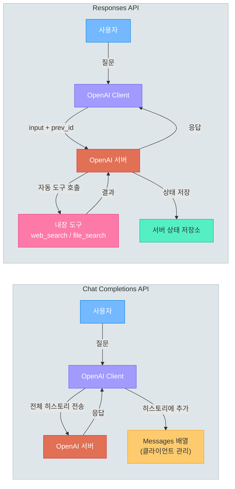
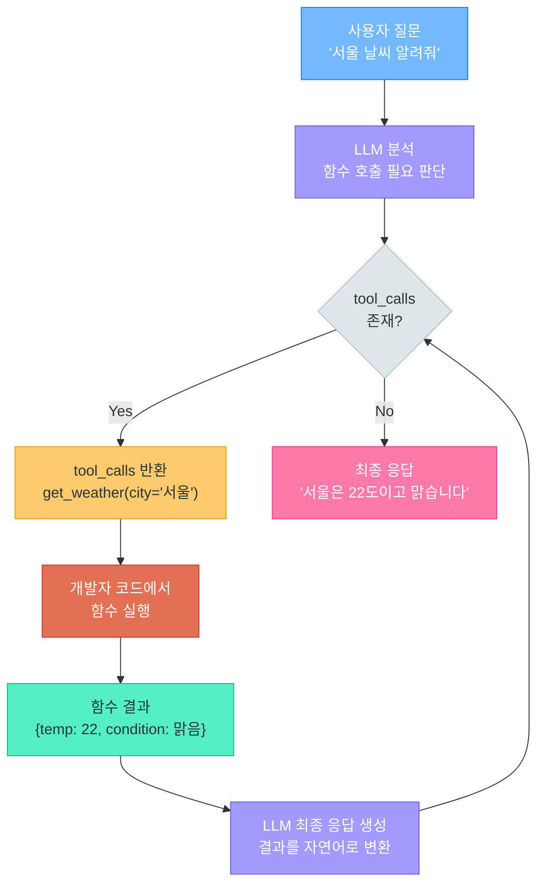
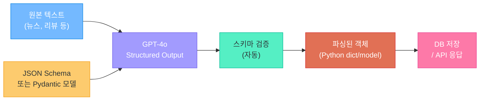
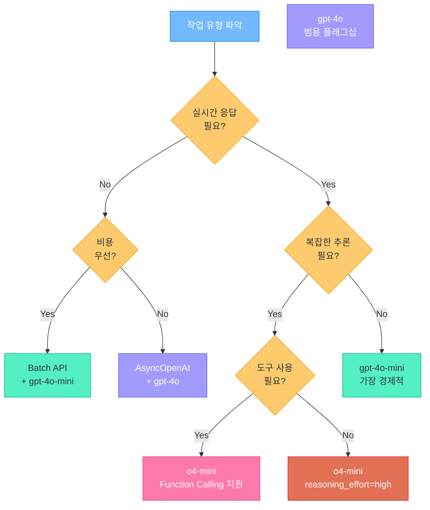

# OpenAI API 심화

> 13강에서 배운 기본 API 호출을 바탕으로 — Function Calling, Structured Output, Batch API, 임베딩 심화까지, 프로덕션 레벨의 OpenAI 활용법을 마스터합니다

---

## 1. Chat Completions vs Responses API

### Chat Completions API 요약

01-13강에서 우리는 `client.chat.completions.create()`를 사용하여 메시지 배열을 보내고 AI 응답을 받는 기본 패턴을 배웠습니다. system/user/assistant 역할, 스트리밍, FastAPI 연동까지 다루었죠. 이제 그 기초 위에 더 강력한 기능들을 쌓아 올리겠습니다.

### Responses API란?

OpenAI는 2025년부터 **Responses API**라는 새로운 API를 도입했습니다. Chat Completions API가 **stateless(상태 비저장)** 방식이라면, Responses API는 **stateful(상태 저장)** 방식으로 동작하며 서버 측에서 대화 상태를 관리할 수 있습니다.

| 비교 항목 | Chat Completions API | Responses API |
|-----------|---------------------|---------------|
| **상태 관리** | Stateless (매번 전체 히스토리 전송) | Stateful (서버에서 관리 가능) |
| **엔드포인트** | `/v1/chat/completions` | `/v1/responses` |
| **내장 도구** | 없음 (직접 구현 필요) | web_search, file_search, computer_use |
| **멀티턴 대화** | messages 배열 직접 관리 | previous_response_id로 체이닝 |
| **스트리밍** | SSE 청크 단위 | SSE + 이벤트 기반 |
| **Function Calling** | 지원 | 지원 |
| **Structured Output** | 지원 | 지원 |
| **성숙도** | 안정적, 광범위한 생태계 | 신규, 빠르게 발전 중 |

### 코드 비교: 동일 작업 수행

두 API로 동일한 작업을 수행하는 코드를 비교해 봅시다.

```python
# chat_vs_responses.py -- Chat Completions API와 Responses API 비교
from openai import OpenAI

client = OpenAI()

# ── 방법 1: Chat Completions API (기존 방식) ──
response_chat = client.chat.completions.create(
    model="gpt-4o",
    messages=[
        {"role": "system", "content": "당신은 Python 전문가입니다."},
        {"role": "user", "content": "데코레이터를 간단히 설명해주세요."}
    ]
)
print(response_chat.choices[0].message.content)

# ── 방법 2: Responses API (새로운 방식) ──
response_new = client.responses.create(
    model="gpt-4o",
    instructions="당신은 Python 전문가입니다.",
    input="데코레이터를 간단히 설명해주세요."
)
print(response_new.output_text)
```

Responses API는 `instructions`로 시스템 프롬프트를, `input`으로 사용자 입력을 분리하여 더 직관적인 인터페이스를 제공합니다.

### API 아키텍처 비교



> **핵심 포인트:** Chat Completions API는 성숙하고 안정적이며 대부분의 프로젝트에 적합합니다. Responses API는 내장 도구와 상태 관리가 필요한 에이전트 개발에 유리합니다. 두 API 모두 계속 지원되므로, 프로젝트 요구사항에 맞게 선택하면 됩니다.

---

## 2. 함수 호출 (Function Calling)

### Function Calling이란?

13강에서 배운 Chat Completions API는 텍스트를 입력받아 텍스트를 출력합니다. 하지만 실제 서비스에서는 AI가 **외부 시스템과 상호작용**해야 하는 경우가 많습니다. 날씨를 조회하거나, 데이터베이스를 검색하거나, 이메일을 보내는 등의 작업이죠.

**Function Calling**은 LLM이 사용자의 요청을 분석하여 "어떤 함수를 어떤 인자로 호출해야 하는지" 결정하고, 그 결과를 바탕으로 최종 응답을 생성하는 기능입니다. LLM이 직접 함수를 실행하는 것이 아니라, **호출해야 할 함수와 인자를 JSON으로 반환**하면 우리 코드가 실행합니다.

### tools 파라미터와 함수 정의

함수를 정의할 때는 JSON Schema 형식을 사용합니다. LLM은 이 스키마를 보고 언제, 어떤 인자로 함수를 호출할지 판단합니다.

```python
# function_definition.py -- Function Calling 도구 정의
tools = [
    {
        "type": "function",
        "function": {
            "name": "get_weather",
            "description": "특정 도시의 현재 날씨 정보를 조회합니다",
            "parameters": {
                "type": "object",
                "properties": {
                    "city": {
                        "type": "string",
                        "description": "날씨를 조회할 도시명 (예: '서울', '부산')"
                    },
                    "unit": {
                        "type": "string",
                        "enum": ["celsius", "fahrenheit"],
                        "description": "온도 단위 (기본값: celsius)"
                    }
                },
                "required": ["city"],
                "additionalProperties": False
            }
        }
    },
    {
        "type": "function",
        "function": {
            "name": "get_calendar_events",
            "description": "특정 날짜의 일정을 조회합니다",
            "parameters": {
                "type": "object",
                "properties": {
                    "date": {
                        "type": "string",
                        "description": "조회할 날짜 (YYYY-MM-DD 형식)"
                    },
                    "category": {
                        "type": "string",
                        "enum": ["all", "meeting", "personal", "deadline"],
                        "description": "일정 카테고리 필터"
                    }
                },
                "required": ["date"],
                "additionalProperties": False
            }
        }
    }
]
```

> **핵심 포인트:** `description` 필드가 매우 중요합니다. LLM은 이 설명을 읽고 어떤 함수를 호출할지 결정합니다. 설명이 모호하면 잘못된 함수가 호출될 수 있으므로 명확하고 구체적으로 작성해야 합니다.

### tool_choice 옵션

LLM이 함수를 호출할지 여부를 제어하는 `tool_choice` 파라미터가 있습니다.

| tool_choice 값 | 동작 | 사용 시점 |
|----------------|------|----------|
| `"auto"` (기본값) | LLM이 함수 호출 여부를 자율 판단 | 일반적인 대화형 어시스턴트 |
| `"required"` | 반드시 하나 이상의 함수를 호출 | 함수 호출이 필수인 파이프라인 |
| `"none"` | 함수를 호출하지 않고 텍스트만 생성 | 도구 정의는 유지하되 텍스트 응답이 필요할 때 |
| `{"type": "function", "function": {"name": "get_weather"}}` | 특정 함수를 반드시 호출 | 특정 작업을 강제할 때 |

```python
# tool_choice_example.py -- tool_choice 옵션별 사용 예시
from openai import OpenAI

client = OpenAI()

# 자동 판단 (기본값)
response = client.chat.completions.create(
    model="gpt-4o",
    messages=[{"role": "user", "content": "서울 날씨 알려줘"}],
    tools=tools,
    tool_choice="auto"
)

# 특정 함수 강제 호출
response = client.chat.completions.create(
    model="gpt-4o",
    messages=[{"role": "user", "content": "내일 뭐하지?"}],
    tools=tools,
    tool_choice={"type": "function", "function": {"name": "get_calendar_events"}}
)
```

### Parallel Function Calls (병렬 함수 호출)

LLM은 하나의 응답에서 **여러 함수를 동시에 호출**할 수 있습니다. 예를 들어 "서울이랑 부산 날씨 알려줘"라고 하면 `get_weather("서울")`과 `get_weather("부산")`을 동시에 요청합니다.

```python
# parallel_calls.py -- 병렬 함수 호출 처리
response = client.chat.completions.create(
    model="gpt-4o",
    messages=[{"role": "user", "content": "서울이랑 부산 날씨 비교해줘"}],
    tools=tools,
    parallel_tool_calls=True  # 기본값이 True
)

# 여러 개의 tool_calls가 반환될 수 있음
message = response.choices[0].message
if message.tool_calls:
    print(f"호출된 함수 수: {len(message.tool_calls)}")
    for call in message.tool_calls:
        print(f"  - {call.function.name}({call.function.arguments})")
```

### 전체 흐름: 날씨 + 일정 어시스턴트

Function Calling의 전체 루프를 구현한 완전한 예제입니다.

```python
# weather_calendar_assistant.py -- 날씨+일정 어시스턴트 전체 구현
import json
from openai import OpenAI

client = OpenAI()

# ── 실제 함수 구현 (실제로는 외부 API 호출) ──
def get_weather(city: str, unit: str = "celsius") -> dict:
    """날씨 API를 호출하는 함수 (여기서는 더미 데이터)"""
    weather_data = {
        "서울": {"temp": 22, "condition": "맑음", "humidity": 45},
        "부산": {"temp": 25, "condition": "흐림", "humidity": 60},
        "제주": {"temp": 27, "condition": "비", "humidity": 80},
    }
    data = weather_data.get(city, {"temp": 20, "condition": "정보 없음", "humidity": 50})
    return {"city": city, "temperature": data["temp"], "condition": data["condition"],
            "humidity": data["humidity"], "unit": unit}

def get_calendar_events(date: str, category: str = "all") -> dict:
    """캘린더에서 일정을 조회하는 함수 (여기서는 더미 데이터)"""
    events = {
        "2025-07-15": [
            {"time": "10:00", "title": "팀 스탠드업 미팅", "category": "meeting"},
            {"time": "14:00", "title": "프로젝트 리뷰", "category": "meeting"},
            {"time": "18:00", "title": "헬스장", "category": "personal"},
        ]
    }
    day_events = events.get(date, [])
    if category != "all":
        day_events = [e for e in day_events if e["category"] == category]
    return {"date": date, "events": day_events, "count": len(day_events)}

# ── 함수 매핑 ──
available_functions = {
    "get_weather": get_weather,
    "get_calendar_events": get_calendar_events,
}

# ── Function Calling 루프 ──
def run_assistant(user_message: str) -> str:
    messages = [
        {"role": "system", "content": "당신은 날씨와 일정을 관리하는 비서입니다. 한국어로 답변하세요."},
        {"role": "user", "content": user_message}
    ]

    # 1단계: 첫 번째 API 호출 — LLM이 함수 호출 여부 판단
    response = client.chat.completions.create(
        model="gpt-4o",
        messages=messages,
        tools=tools,
        tool_choice="auto"
    )

    message = response.choices[0].message

    # 2단계: 함수 호출이 필요한 경우 실행
    while message.tool_calls:
        messages.append(message)  # assistant의 tool_calls 메시지 추가

        for tool_call in message.tool_calls:
            func_name = tool_call.function.name
            func_args = json.loads(tool_call.function.arguments)

            # 함수 실행
            func = available_functions[func_name]
            result = func(**func_args)

            # 함수 실행 결과를 메시지에 추가
            messages.append({
                "role": "tool",
                "tool_call_id": tool_call.id,
                "content": json.dumps(result, ensure_ascii=False)
            })

        # 3단계: 함수 결과를 포함하여 다시 LLM 호출
        response = client.chat.completions.create(
            model="gpt-4o",
            messages=messages,
            tools=tools,
            tool_choice="auto"
        )
        message = response.choices[0].message

    return message.content

# 실행
print(run_assistant("서울 날씨 어때?"))
print(run_assistant("서울이랑 부산 날씨 비교해줘, 그리고 7월 15일 일정도 알려줘"))
```

### Function Calling 흐름도



> **핵심 포인트:** Function Calling의 핵심은 **LLM이 함수를 직접 실행하지 않는다**는 것입니다. LLM은 "어떤 함수를 어떤 인자로 호출하면 되겠다"고 판단만 하고, 실제 실행은 우리 코드에서 합니다. 이 분리 덕분에 보안과 제어권을 유지하면서도 AI의 판단력을 활용할 수 있습니다.

---

## 3. 구조화 출력 (Structured Output)

### 왜 구조화 출력이 필요한가?

13강에서 `response_format={"type": "json_object"}`로 JSON 모드를 사용해 보았습니다. 하지만 JSON 모드에는 한계가 있습니다. JSON 형식은 보장되지만, **어떤 필드가 포함될지는 보장되지 않습니다.** 예를 들어 `sentiment` 필드를 기대했는데 `feeling`이라는 필드가 올 수도 있습니다.

**Structured Output**은 JSON Schema를 명시적으로 정의하여 LLM의 출력이 **정확히 그 스키마를 따르도록 보장**하는 기능입니다.

| 비교 | JSON 모드 | Structured Output |
|------|----------|-------------------|
| **설정** | `{"type": "json_object"}` | `{"type": "json_schema", "json_schema": {...}}` |
| **필드 보장** | 필드명/타입 보장 안 됨 | 스키마에 정의된 필드 100% 보장 |
| **중첩 객체** | 구조 불확실 | 정확한 구조 보장 |
| **enum 값** | 지정 불가 | 허용 값 제한 가능 |
| **프롬프트 의존성** | 높음 (프롬프트로 형식 유도) | 낮음 (스키마가 강제) |

### response_format에 json_schema 지정

```python
# structured_output_basic.py -- Structured Output 기본 사용법
from openai import OpenAI

client = OpenAI()

response = client.chat.completions.create(
    model="gpt-4o",
    messages=[
        {"role": "system", "content": "당신은 뉴스 기사 분석 전문가입니다."},
        {"role": "user", "content": "삼성전자가 차세대 AI 반도체 개발에 5조원을 투자한다고 발표했다."}
    ],
    response_format={
        "type": "json_schema",
        "json_schema": {
            "name": "news_analysis",
            "strict": True,
            "schema": {
                "type": "object",
                "properties": {
                    "title": {
                        "type": "string",
                        "description": "기사 제목 요약 (20자 이내)"
                    },
                    "summary": {
                        "type": "string",
                        "description": "핵심 내용 요약 (2~3문장)"
                    },
                    "sentiment": {
                        "type": "string",
                        "enum": ["positive", "negative", "neutral"],
                        "description": "기사의 전반적인 논조"
                    },
                    "keywords": {
                        "type": "array",
                        "items": {"type": "string"},
                        "description": "핵심 키워드 목록 (3~5개)"
                    },
                    "category": {
                        "type": "string",
                        "enum": ["경제", "정치", "사회", "기술", "문화", "스포츠"],
                        "description": "기사 카테고리"
                    }
                },
                "required": ["title", "summary", "sentiment", "keywords", "category"],
                "additionalProperties": False
            }
        }
    }
)

import json
result = json.loads(response.choices[0].message.content)
print(f"제목: {result['title']}")
print(f"요약: {result['summary']}")
print(f"감정: {result['sentiment']}")
print(f"키워드: {', '.join(result['keywords'])}")
print(f"카테고리: {result['category']}")
```

### Pydantic 모델로 편리하게 정의하기

매번 JSON Schema를 수동으로 작성하는 것은 번거롭습니다. OpenAI SDK는 **Pydantic 모델을 자동으로 JSON Schema로 변환**하는 기능을 제공합니다.

```python
# structured_output_pydantic.py -- Pydantic 모델 기반 Structured Output
from openai import OpenAI
from pydantic import BaseModel
from typing import Literal

client = OpenAI()

# Pydantic 모델 정의
class NewsAnalysis(BaseModel):
    title: str
    summary: str
    sentiment: Literal["positive", "negative", "neutral"]
    keywords: list[str]
    category: Literal["경제", "정치", "사회", "기술", "문화", "스포츠"]
    confidence_score: float

# client.beta.chat.completions.parse()로 직접 파싱
completion = client.beta.chat.completions.parse(
    model="gpt-4o",
    messages=[
        {"role": "system", "content": "뉴스 기사를 분석하세요."},
        {"role": "user", "content": "현대자동차가 전기차 판매 1위를 달성하며 주가가 급등했다."}
    ],
    response_format=NewsAnalysis
)

# 이미 파싱된 Pydantic 객체
article = completion.choices[0].message.parsed
print(f"제목: {article.title}")
print(f"감정: {article.sentiment}")
print(f"신뢰도: {article.confidence_score}")
print(f"키워드: {article.keywords}")
```

### strict 모드와 제약사항

`strict: True`를 설정하면 출력이 스키마를 **100% 준수**합니다. 다만 몇 가지 제약이 있습니다.

| 제약사항 | 설명 |
|---------|------|
| **additionalProperties: false 필수** | 모든 object 타입에 명시해야 함 |
| **모든 필드가 required** | 선택적 필드는 `type: ["string", "null"]`로 대체 |
| **지원 타입** | string, number, integer, boolean, array, object, null, enum |
| **$ref 미지원** | 재귀적 스키마 참조 불가 |
| **중첩 깊이 제한** | 최대 5단계까지 중첩 가능 |
| **첫 호출 지연** | 새 스키마의 첫 호출 시 스키마 처리로 약간의 지연 발생 |

### 실전 예제: 뉴스 기사 배치 분석기

여러 기사를 한 번에 분석하는 실전 예제입니다.

```python
# news_batch_analyzer.py -- 여러 뉴스 기사를 구조화 출력으로 분석
from openai import OpenAI
from pydantic import BaseModel
from typing import Literal, Optional
import json

client = OpenAI()

class ArticleMeta(BaseModel):
    title: str
    summary: str
    sentiment: Literal["positive", "negative", "neutral"]
    keywords: list[str]
    category: Literal["경제", "정치", "사회", "기술", "문화", "스포츠"]
    impact_level: Literal["high", "medium", "low"]
    related_companies: Optional[list[str]]

class AnalysisResult(BaseModel):
    articles: list[ArticleMeta]
    overall_market_sentiment: Literal["bullish", "bearish", "neutral"]

articles_text = """
1. 삼성전자, AI 반도체 HBM4 양산 성공으로 엔비디아 공급 계약 체결
2. 한국은행, 기준금리 0.25%p 인하로 경기 부양 의지 표명
3. 카카오, 개인정보 유출 사고로 과징금 150억 부과
"""

completion = client.beta.chat.completions.parse(
    model="gpt-4o",
    messages=[
        {"role": "system", "content": "뉴스 기사들을 분석하여 구조화된 결과를 제공하세요."},
        {"role": "user", "content": articles_text}
    ],
    response_format=AnalysisResult
)

result = completion.choices[0].message.parsed
for article in result.articles:
    print(f"\n[{article.category}] {article.title}")
    print(f"  감정: {article.sentiment} | 영향도: {article.impact_level}")
    print(f"  키워드: {', '.join(article.keywords)}")

print(f"\n전체 시장 심리: {result.overall_market_sentiment}")
```

### 구조화 출력 파이프라인



> **핵심 포인트:** Structured Output은 LLM 출력을 프로그래밍적으로 안전하게 처리하기 위한 핵심 기능입니다. 프롬프트에 "JSON으로 응답해줘"라고 부탁하는 것과 달리, 스키마로 **강제**하므로 파싱 실패가 원천적으로 방지됩니다. 프로덕션 환경에서는 반드시 Structured Output 사용을 권장합니다.

---

## 4. 고급 파라미터와 모델 선택

### 모델 비교: gpt-4o vs o3-mini vs o4-mini

OpenAI는 용도에 따라 다양한 모델을 제공합니다. 올바른 모델 선택은 비용과 품질 모두에 큰 영향을 미칩니다.

| 항목 | gpt-4o | o3-mini | o4-mini |
|------|--------|---------|---------|
| **유형** | 범용 플래그십 | 추론 특화 (경량) | 추론 특화 (최신 경량) |
| **강점** | 멀티모달, 균형 잡힌 성능 | 수학/코딩/논리 추론 | 향상된 추론 + 도구 사용 |
| **입력 비용** | $2.50 / 1M 토큰 | $1.10 / 1M 토큰 | $1.10 / 1M 토큰 |
| **출력 비용** | $10.00 / 1M 토큰 | $4.40 / 1M 토큰 | $4.40 / 1M 토큰 |
| **컨텍스트 창** | 128K 토큰 | 200K 토큰 | 200K 토큰 |
| **최대 출력** | 16K 토큰 | 100K 토큰 | 100K 토큰 |
| **이미지 입력** | 지원 | 미지원 | 지원 |
| **Function Calling** | 지원 | 지원 | 지원 |
| **Structured Output** | 지원 | 지원 | 지원 |
| **스트리밍** | 지원 | 지원 | 지원 |
| **추천 용도** | 일반 대화, 콘텐츠 생성, 분석 | 비용 효율적 추론 작업 | 복잡한 추론 + 도구 결합 |

### reasoning_effort 파라미터 (o-series 전용)

o3-mini, o4-mini 같은 추론 모델은 **생각하는 깊이**를 조절할 수 있습니다.

```python
# reasoning_effort.py -- 추론 모델의 사고 깊이 조절
from openai import OpenAI

client = OpenAI()

question = "1부터 100까지의 소수 중 쌍둥이 소수 쌍을 모두 나열하세요."

# 낮은 추론 노력 — 빠르지만 부정확할 수 있음
response_low = client.chat.completions.create(
    model="o4-mini",
    reasoning_effort="low",
    messages=[{"role": "user", "content": question}]
)

# 중간 추론 노력 — 균형
response_medium = client.chat.completions.create(
    model="o4-mini",
    reasoning_effort="medium",
    messages=[{"role": "user", "content": question}]
)

# 높은 추론 노력 — 정확하지만 느리고 비쌈
response_high = client.chat.completions.create(
    model="o4-mini",
    reasoning_effort="high",
    messages=[{"role": "user", "content": question}]
)

for label, resp in [("low", response_low), ("medium", response_medium), ("high", response_high)]:
    tokens = resp.usage.completion_tokens
    print(f"[{label}] 출력 토큰: {tokens}")
```

| reasoning_effort | 응답 속도 | 정확도 | 비용 | 적합한 작업 |
|------------------|----------|--------|------|------------|
| `"low"` | 빠름 | 보통 | 낮음 | 간단한 분류, 포맷 변환 |
| `"medium"` | 중간 | 좋음 | 중간 | 일반적인 분석, 요약 |
| `"high"` | 느림 | 최고 | 높음 | 복잡한 수학, 코드 생성, 논리 추론 |

### temperature, top_p 심화 이해

13강에서 temperature의 기본 개념을 배웠습니다. 이제 좀 더 깊이 들어가 봅시다.

| 파라미터 | 범위 | 설명 | 주의사항 |
|---------|------|------|---------|
| **temperature** | 0.0 ~ 2.0 | 출력의 무작위성 조절. 0이면 거의 결정론적 | top_p와 동시 변경 비권장 |
| **top_p** | 0.0 ~ 1.0 | nucleus sampling. 누적 확률 p까지의 토큰만 고려 | temperature와 동시 변경 비권장 |
| **frequency_penalty** | -2.0 ~ 2.0 | 이미 등장한 토큰의 빈도에 비례하여 페널티 부과 | 반복 줄이기에 효과적 |
| **presence_penalty** | -2.0 ~ 2.0 | 이미 등장한 토큰 여부에 따라 페널티 부과 | 새로운 주제 유도에 효과적 |

### max_completion_tokens vs max_tokens

```python
# max_tokens_comparison.py -- max_completion_tokens와 max_tokens 차이
from openai import OpenAI

client = OpenAI()

# gpt-4o 계열: max_tokens 사용 (생성된 텍스트의 최대 토큰 수)
response = client.chat.completions.create(
    model="gpt-4o",
    messages=[{"role": "user", "content": "Python 역사를 설명하세요."}],
    max_tokens=500  # 출력 최대 500 토큰
)

# o-series 모델: max_completion_tokens 사용 (추론 토큰 + 출력 토큰 합산)
response = client.chat.completions.create(
    model="o4-mini",
    messages=[{"role": "user", "content": "피보나치 수열의 점화식을 증명하세요."}],
    max_completion_tokens=5000  # 추론 + 출력 합산 최대 5000 토큰
)

# 사용량 확인
usage = response.usage
print(f"입력 토큰: {usage.prompt_tokens}")
print(f"출력 토큰: {usage.completion_tokens}")
print(f"총 토큰: {usage.total_tokens}")
```

| 파라미터 | 적용 모델 | 포함 범위 |
|---------|----------|----------|
| `max_tokens` | gpt-4o, gpt-4o-mini 등 | 생성된 텍스트 토큰만 |
| `max_completion_tokens` | o3-mini, o4-mini 등 | 추론(thinking) 토큰 + 출력 토큰 합산 |

> **핵심 포인트:** 모델 선택은 **"가장 좋은 모델"이 아니라 "작업에 가장 적합한 모델"**을 고르는 것이 핵심입니다. 간단한 분류 작업에 gpt-4o를 쓰면 비용 낭비이고, 복잡한 추론 작업에 gpt-4o-mini를 쓰면 품질이 부족합니다. 작업 특성을 분석하고 적절한 모델과 파라미터를 조합하는 것이 프로덕션 최적화의 시작입니다.

---

## 5. 배치 처리와 비동기

### Batch API 개요

대량의 요청을 처리해야 할 때, 하나씩 API를 호출하면 시간도 오래 걸리고 Rate Limit에도 쉽게 걸립니다. OpenAI의 **Batch API**는 이 문제를 해결합니다.

| 항목 | 일반 API | Batch API |
|------|---------|-----------|
| **비용** | 정가 | **50% 할인** |
| **처리 시간** | 즉시 (수 초) | 최대 24시간 이내 |
| **Rate Limit** | 분당 토큰 제한 적용 | 별도 배치 큐로 처리 |
| **적합한 용도** | 실시간 응답 필요 | 대량 분석, 분류, 번역 등 |
| **결과 수신** | 동기/스트리밍 | 파일 다운로드 |

### Batch API 워크플로우

Batch API는 네 단계로 구성됩니다: 파일 업로드 → 배치 생성 → 상태 폴링 → 결과 다운로드.

```python
# batch_translation.py -- Batch API로 대량 번역 처리
import json
import time
from openai import OpenAI

client = OpenAI()

# ── 1단계: JSONL 요청 파일 생성 ──
sentences = [
    "인공지능은 인간의 학습 능력을 모방합니다.",
    "클라우드 컴퓨팅은 IT 인프라의 혁신을 가져왔습니다.",
    "블록체인 기술은 탈중앙화를 가능하게 합니다.",
    "사물인터넷은 일상의 모든 기기를 연결합니다.",
    "양자 컴퓨팅은 기존 컴퓨터의 한계를 넘어설 것입니다.",
]

requests = []
for i, sentence in enumerate(sentences):
    requests.append({
        "custom_id": f"translate-{i}",
        "method": "POST",
        "url": "/v1/chat/completions",
        "body": {
            "model": "gpt-4o-mini",
            "messages": [
                {"role": "system", "content": "Translate the following Korean text to English accurately."},
                {"role": "user", "content": sentence}
            ],
            "max_tokens": 200
        }
    })

# JSONL 파일로 저장
with open("batch_requests.jsonl", "w", encoding="utf-8") as f:
    for req in requests:
        f.write(json.dumps(req, ensure_ascii=False) + "\n")

# ── 2단계: 파일 업로드 ──
batch_file = client.files.create(
    file=open("batch_requests.jsonl", "rb"),
    purpose="batch"
)
print(f"업로드된 파일 ID: {batch_file.id}")

# ── 3단계: 배치 생성 ──
batch = client.batches.create(
    input_file_id=batch_file.id,
    endpoint="/v1/chat/completions",
    completion_window="24h",
    metadata={"description": "한영 번역 배치 작업"}
)
print(f"배치 ID: {batch.id}")
print(f"상태: {batch.status}")

# ── 4단계: 상태 폴링 ──
while True:
    batch_status = client.batches.retrieve(batch.id)
    print(f"상태: {batch_status.status} | "
          f"완료: {batch_status.request_counts.completed}/"
          f"{batch_status.request_counts.total}")

    if batch_status.status in ("completed", "failed", "expired"):
        break
    time.sleep(30)  # 30초마다 확인

# ── 5단계: 결과 다운로드 ──
if batch_status.status == "completed":
    result_file = client.files.content(batch_status.output_file_id)
    results = result_file.text.strip().split("\n")

    for line in results:
        result = json.loads(line)
        custom_id = result["custom_id"]
        translation = result["response"]["body"]["choices"][0]["message"]["content"]
        print(f"[{custom_id}] {translation}")
```

### AsyncOpenAI로 비동기 처리

실시간으로 빠르게 여러 요청을 처리해야 한다면 **비동기 패턴**을 사용합니다. `asyncio.gather`로 여러 API 호출을 동시에 실행할 수 있습니다.

```python
# async_email_classifier.py -- 비동기로 100개 이메일 분류 처리
import asyncio
from openai import AsyncOpenAI
from pydantic import BaseModel
from typing import Literal

aclient = AsyncOpenAI()

class EmailClassification(BaseModel):
    category: Literal["업무", "마케팅", "스팸", "개인", "긴급"]
    priority: Literal["high", "medium", "low"]
    summary: str
    requires_reply: bool

async def classify_email(email_id: int, email_content: str) -> dict:
    """단일 이메일을 비동기로 분류"""
    try:
        completion = await aclient.beta.chat.completions.parse(
            model="gpt-4o-mini",
            messages=[
                {"role": "system", "content": "이메일을 분류하세요."},
                {"role": "user", "content": email_content}
            ],
            response_format=EmailClassification
        )
        result = completion.choices[0].message.parsed
        return {"id": email_id, "status": "success", "result": result}
    except Exception as e:
        return {"id": email_id, "status": "error", "error": str(e)}

async def classify_all_emails(emails: list[dict]) -> list[dict]:
    """모든 이메일을 동시에 분류 (동시성 제어 포함)"""
    semaphore = asyncio.Semaphore(10)  # 최대 10개 동시 요청

    async def limited_classify(email):
        async with semaphore:
            return await classify_email(email["id"], email["content"])

    tasks = [limited_classify(email) for email in emails]
    results = await asyncio.gather(*tasks)
    return list(results)

# 실행
async def main():
    # 테스트용 이메일 데이터
    emails = [
        {"id": i, "content": f"테스트 이메일 #{i}: 프로젝트 진행 상황 보고..."}
        for i in range(100)
    ]

    results = await classify_all_emails(emails)

    success = sum(1 for r in results if r["status"] == "success")
    print(f"분류 완료: {success}/{len(results)}")

    for r in results[:5]:  # 처음 5개만 출력
        if r["status"] == "success":
            cls = r["result"]
            print(f"  #{r['id']}: [{cls.category}] 우선순위={cls.priority} 답장필요={cls.requires_reply}")

asyncio.run(main())
```

### 비동기 vs Batch API 선택 가이드

| 기준 | AsyncOpenAI + gather | Batch API |
|------|---------------------|-----------|
| **응답 시간** | 수 초 ~ 수 분 | 최대 24시간 |
| **비용** | 정가 | 50% 할인 |
| **동시 처리** | Semaphore로 제어 (10~50개) | OpenAI 서버에서 관리 |
| **에러 처리** | 실시간으로 재시도 가능 | 배치 완료 후 확인 |
| **적합한 규모** | 수십 ~ 수백 건 | 수백 ~ 수만 건 |
| **사용 예** | 실시간 챗봇, 대시보드 | 야간 배치 분석, 대량 번역 |

> **핵심 포인트:** 실시간 응답이 필요하면 `AsyncOpenAI + asyncio.gather`를, 시간 여유가 있고 비용 절약이 중요하면 Batch API를 선택하세요. 두 방식을 조합하여 "급한 건 비동기로, 나머지는 배치로" 처리하는 하이브리드 전략도 효과적입니다.

---

## 6. 임베딩 심화

### 임베딩 모델 비교

04-11강에서 벡터 데이터베이스와 임베딩의 개념을 배웠습니다. 이제 OpenAI 임베딩 API의 고급 기능을 살펴봅시다.

| 항목 | text-embedding-3-small | text-embedding-3-large |
|------|----------------------|----------------------|
| **기본 차원** | 1,536 | 3,072 |
| **최대 입력** | 8,191 토큰 | 8,191 토큰 |
| **비용** | $0.02 / 1M 토큰 | $0.13 / 1M 토큰 |
| **MTEB 벤치마크** | 62.3% | 64.6% |
| **차원 축소** | 지원 (dimensions 파라미터) | 지원 (dimensions 파라미터) |
| **추천 용도** | 일반적인 검색, 분류 | 고정밀 유사도 검색, RAG |

### dimensions 파라미터로 차원 축소

text-embedding-3 시리즈의 혁신적인 기능은 **Matryoshka 임베딩**입니다. 모델 재학습 없이 `dimensions` 파라미터만으로 벡터 차원을 줄일 수 있습니다.

```python
# embedding_dimensions.py -- 차원별 임베딩 생성 및 비교
from openai import OpenAI
import numpy as np

client = OpenAI()

text = "인공지능은 인간의 학습 능력, 추론 능력, 지각 능력을 인공적으로 구현한 기술입니다."

# 다양한 차원으로 임베딩 생성
dimensions_list = [256, 512, 1024, 1536, 3072]

for dim in dimensions_list:
    response = client.embeddings.create(
        model="text-embedding-3-large",
        input=text,
        dimensions=dim  # 원하는 차원 지정
    )

    embedding = response.data[0].embedding
    print(f"차원: {dim:>5} | 벡터 크기: {len(embedding)} | "
          f"저장 용량: {len(embedding) * 4:>6} bytes (float32)")
```

### 차원별 성능/비용 트레이드오프

차원을 줄이면 저장 공간과 검색 속도에서 이점을 얻지만, 정확도가 약간 감소합니다.

| 차원 | 상대 정확도 | 저장 비용 (1M 벡터) | 검색 속도 | 추천 시나리오 |
|------|-----------|-------------------|---------|-----------|
| **256** | ~93% | ~1 GB | 매우 빠름 | 모바일 앱, 빠른 프로토타입 |
| **512** | ~96% | ~2 GB | 빠름 | 일반적인 검색, 분류 |
| **1024** | ~98% | ~4 GB | 보통 | 정밀 검색, RAG |
| **1536** | ~99% | ~6 GB | 약간 느림 | 고정밀 유사도 |
| **3072** | 100% (기준) | ~12 GB | 느림 | 최대 정밀도 필요 시 |

```python
# embedding_similarity_test.py -- 차원별 유사도 정확도 비교
from openai import OpenAI
import numpy as np

client = OpenAI()

def cosine_similarity(a, b):
    return np.dot(a, b) / (np.linalg.norm(a) * np.linalg.norm(b))

# 테스트 문장 쌍
query = "파이썬 프로그래밍 학습 방법"
similar = "Python 코딩을 배우는 효과적인 방법"
different = "오늘 저녁 메뉴는 김치찌개로 정했다"

for dim in [256, 512, 1024, 1536]:
    resp = client.embeddings.create(
        model="text-embedding-3-small",
        input=[query, similar, different],
        dimensions=dim
    )

    q_emb = resp.data[0].embedding
    s_emb = resp.data[1].embedding
    d_emb = resp.data[2].embedding

    sim_score = cosine_similarity(q_emb, s_emb)
    diff_score = cosine_similarity(q_emb, d_emb)

    print(f"차원 {dim:>5}: 유사 문장={sim_score:.4f} | 다른 문장={diff_score:.4f} | "
          f"차이={sim_score - diff_score:.4f}")
```

### 벡터 DB와의 연결

04-11강에서 배운 벡터 DB에 저장하는 방법과 결합하면, OpenAI 임베딩으로 생성한 벡터를 ChromaDB, Pinecone, Qdrant 등에 저장하고 검색할 수 있습니다. 여기서는 벡터 DB 연동을 반복하지 않고, **임베딩 생성 최적화**에 집중합니다.

```python
# embedding_batch.py -- 대량 임베딩 생성 최적화
from openai import OpenAI
import time

client = OpenAI()

def create_embeddings_batch(texts: list[str], model: str = "text-embedding-3-small",
                            dimensions: int = 512, batch_size: int = 100) -> list[list[float]]:
    """대량 텍스트를 배치로 임베딩 생성"""
    all_embeddings = []

    for i in range(0, len(texts), batch_size):
        batch = texts[i:i + batch_size]
        response = client.embeddings.create(
            model=model,
            input=batch,
            dimensions=dimensions
        )
        # 원본 순서 유지를 위해 index로 정렬
        batch_embeddings = sorted(response.data, key=lambda x: x.index)
        all_embeddings.extend([item.embedding for item in batch_embeddings])

        if i + batch_size < len(texts):
            time.sleep(0.1)  # Rate Limit 방지

    return all_embeddings

# 사용 예시
documents = [f"문서 {i}번의 내용입니다." for i in range(500)]

start = time.time()
embeddings = create_embeddings_batch(documents, dimensions=512)
elapsed = time.time() - start

print(f"총 {len(embeddings)}개 임베딩 생성 완료")
print(f"소요 시간: {elapsed:.2f}초")
print(f"벡터 차원: {len(embeddings[0])}")
```

> **핵심 포인트:** 임베딩 차원 선택은 **정확도와 비용의 트레이드오프**입니다. 대부분의 경우 512~1024 차원이면 충분한 정확도를 제공하면서도 저장 비용과 검색 속도를 크게 개선할 수 있습니다. 프로토타입 단계에서는 256 차원으로 시작하고, 프로덕션에서 필요에 따라 차원을 높이는 전략을 권장합니다.

---

## 7. 핵심 정리

### 주요 개념 요약

| 기능 | 핵심 내용 | 사용 시점 |
|------|----------|----------|
| **Chat Completions API** | Stateless 방식, 직접 히스토리 관리 | 안정적인 프로덕션, 기존 코드 유지 |
| **Responses API** | Stateful 방식, 내장 도구 (web_search 등) | 에이전트 개발, 새 프로젝트 |
| **Function Calling** | LLM이 함수 호출 결정, 개발자가 실행 | 외부 시스템 연동 (DB, API 등) |
| **Structured Output** | JSON Schema로 출력 형식 강제 | 데이터 파이프라인, API 응답 |
| **reasoning_effort** | o-series 모델의 추론 깊이 조절 | 비용/정확도 최적화 |
| **Batch API** | 50% 할인, 24시간 이내 처리 | 대량 분석, 분류, 번역 |
| **AsyncOpenAI** | 비동기 동시 처리 + Semaphore | 실시간 대량 요청 |
| **임베딩 차원 축소** | dimensions 파라미터로 유연한 차원 선택 | 저장 비용 및 검색 속도 최적화 |

### API 기능 체크리스트

다음은 이번 강의에서 다룬 기능들의 실전 활용 체크리스트입니다.

| 단계 | 체크 항목 | 상태 |
|------|---------|------|
| **기초** | OpenAI 클라이언트 생성 및 기본 호출 (13강 완료) | 완료 |
| **기초** | 스트리밍 응답 처리 (13강 완료) | 완료 |
| **심화** | Function Calling으로 도구 연동 | 이번 강의 |
| **심화** | Structured Output으로 안정적인 출력 | 이번 강의 |
| **심화** | 모델별 특성 이해 및 적절한 선택 | 이번 강의 |
| **심화** | Batch API로 대량 처리 | 이번 강의 |
| **심화** | AsyncOpenAI로 비동기 처리 | 이번 강의 |
| **심화** | 임베딩 차원 최적화 | 이번 강의 |
| **실전** | Responses API + 내장 도구 활용 | 이번 강의 |

### 모델 선택 의사결정 트리



### 다음 강의 예고

다음 강의에서는 **Anthropic Claude API**를 살펴봅니다. OpenAI와는 다른 철학과 설계를 가진 Claude API의 특징, Messages API, 긴 컨텍스트 처리, 그리고 OpenAI API와의 비교를 통해 두 플랫폼의 장단점을 이해하고 상황에 맞게 선택할 수 있는 역량을 키워보겠습니다.

> **핵심 포인트:** API를 아는 것과 잘 쓰는 것은 다릅니다. 이번 강의에서 배운 기능들을 직접 코드로 작성하고 실행해 보세요. Function Calling 루프를 직접 구현하고, Structured Output으로 실제 데이터를 파싱하고, Batch API로 대량 작업을 돌려보는 경험이 진짜 실력을 만듭니다.

---
