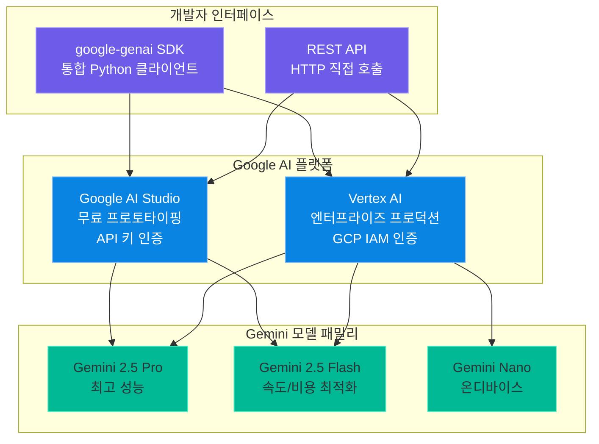
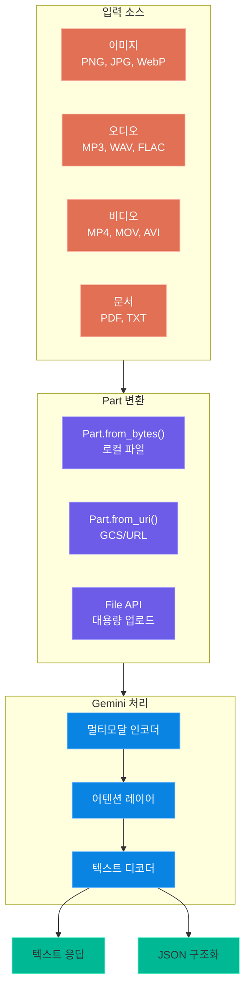
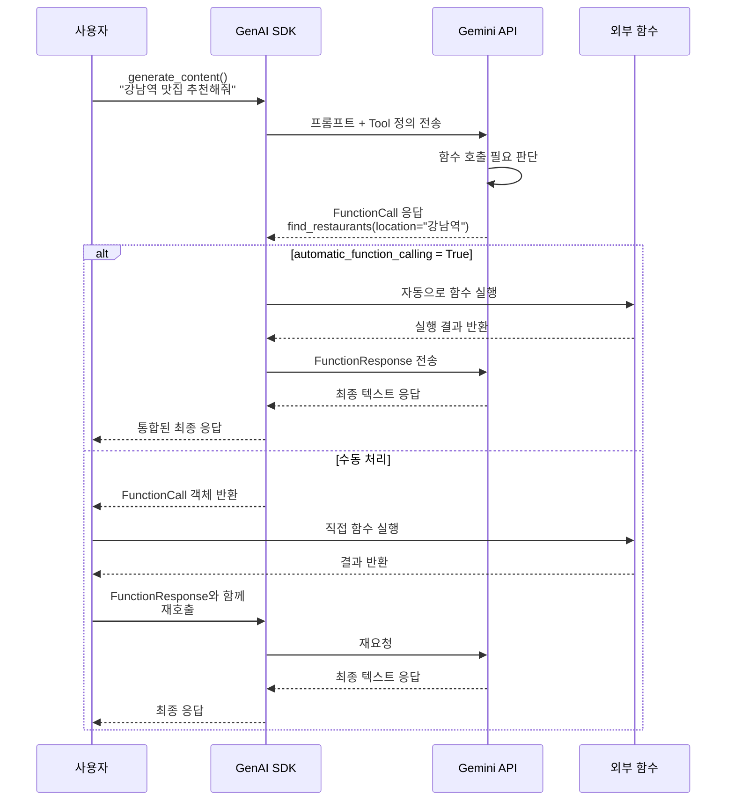
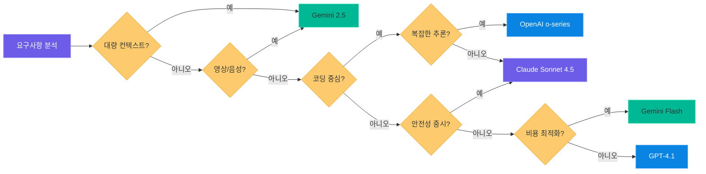

# Gemini API와 Google GenAI SDK

> Google의 최신 통합 SDK로 Gemini 모델을 활용하는 실전 가이드

---

## 1. Google GenAI SDK 설치

### 기존 SDK vs 새로운 통합 SDK

Google은 2024년 말부터 기존의 `google-generativeai` 패키지를 **`google-genai`**로 통합했습니다.
새로운 SDK는 Google AI Studio와 Vertex AI를 하나의 인터페이스로 통합하여,
개발 환경과 프로덕션 환경에서 코드 변경 없이 전환할 수 있도록 설계되었습니다.

| 항목 | 기존 SDK (`google-generativeai`) | 새 SDK (`google-genai`) |
|------|----------------------------------|------------------------|
| **패키지명** | `google-generativeai` | `google-genai` |
| **import** | `import google.generativeai as genai` | `from google import genai` |
| **최소 버전** | 0.x (레거시) | 1.0+ (현재 권장) |
| **Vertex AI 지원** | 별도 패키지 필요 | 내장 지원 |
| **비동기 지원** | 제한적 | `client.aio` 내장 |
| **타입 시스템** | 딕셔너리 기반 | `google.genai.types` 모듈 |
| **유지보수 상태** | 유지보수 모드 | 활발히 개발 중 |

### 설치 방법

```bash
# install_genai.sh -- Google GenAI SDK 설치
pip install google-genai
```

> **핵심 포인트:** `google-generativeai`(하이픈)가 아닌 `google-genai`를 설치해야 합니다.
> 두 패키지는 완전히 다른 패키지이며, 새 프로젝트에서는 반드시 `google-genai`를 사용하세요.

### API 키 설정과 Client 초기화

```python
# gemini_client_init.py -- Gemini 클라이언트 초기화
from google import genai

# 방법 1: API 키 직접 전달
client = genai.Client(api_key="YOUR_API_KEY")

# 방법 2: 환경 변수 사용 (권장)
import os
os.environ["GOOGLE_API_KEY"] = "YOUR_API_KEY"
client = genai.Client()  # 환경 변수에서 자동으로 읽음

# 방법 3: Vertex AI 모드 (프로덕션 환경)
client = genai.Client(
    vertexai=True,
    project="my-gcp-project",
    location="us-central1"
)
```

API 키는 [Google AI Studio](https://aistudio.google.com/)에서 무료로 발급받을 수 있습니다.
프로덕션 환경에서는 Vertex AI 모드를 사용하여 GCP의 IAM, VPC, 감사 로그 등의
엔터프라이즈 기능을 활용할 수 있습니다.

### Google AI 생태계 구조



> **핵심 포인트:** `google-genai` SDK 하나로 AI Studio(프로토타입)와 Vertex AI(프로덕션)를
> 모두 커버합니다. `vertexai=True` 한 줄이면 프로덕션 전환이 완료됩니다.

---

## 2. Gemini 모델 라인업

### 현재 사용 가능한 Gemini 모델

Gemini는 Google DeepMind가 개발한 멀티모달 AI 모델 패밀리입니다.
텍스트, 이미지, 오디오, 비디오를 네이티브로 처리할 수 있으며,
2025년부터는 **Thinking(사고) 모드**를 지원하여 복잡한 추론 작업에서도 뛰어난 성능을 보입니다.

| 모델 | 컨텍스트 윈도우 | 특징 | 입력 가격 (1M 토큰) | 출력 가격 (1M 토큰) |
|------|----------------|------|--------------------|--------------------|
| **gemini-2.5-pro** | 1,000,000 | 최고 성능, Thinking 지원 | $1.25 (≤200K) / $2.50 (>200K) | $10.00 (≤200K) / $15.00 (>200K) |
| **gemini-2.5-flash** | 1,000,000 | 속도/비용 최적화, Thinking 지원 | $0.15 (≤200K) / $0.30 (>200K) | $0.60 (≤200K) / $1.20 (>200K) |
| **gemini-2.0-flash** | 1,000,000 | 안정적인 범용 모델 | $0.10 | $0.40 |
| **gemini-2.0-flash-lite** | 1,000,000 | 초경량, 최저 비용 | $0.075 | $0.30 |

### 1M 토큰 컨텍스트 윈도우

Gemini의 가장 큰 차별점 중 하나는 **100만 토큰 컨텍스트 윈도우**입니다.
이는 약 700,000단어, 일반 도서 8~10권에 해당하는 분량입니다.

| 비교 항목 | Gemini 2.5 | GPT-4.1 | Claude Sonnet 4.5 |
|-----------|-----------|--------|-------------------|
| **최대 컨텍스트** | 1,000,000 토큰 | 128,000 토큰 | 200,000 토큰 |
| **대략적 분량** | 도서 8~10권 | 도서 1권 | 도서 1.5권 |
| **긴 문서 처리** | 네이티브 지원 | RAG 필요 | 부분 지원 |

### Thinking 모드 (추론 강화)

Gemini 2.5 Pro와 Flash는 **Thinking 모드**를 지원합니다.
이는 OpenAI의 o-series, Anthropic의 Extended Thinking과 유사한 개념으로,
모델이 답변 전에 내부적으로 추론 과정을 거치게 합니다.

```python
# gemini_thinking_mode.py -- Thinking 모드 설정
from google import genai
from google.genai import types

client = genai.Client()

# Thinking 모드 활성화 (budget 설정)
response = client.models.generate_content(
    model="gemini-2.5-flash",
    contents="x^2 + 3x - 10 = 0의 모든 해를 구하세요.",
    config=types.GenerateContentConfig(
        thinking_config=types.ThinkingConfig(
            thinking_budget=5000  # 토큰 단위 (0~24576)
        )
    )
)

# Thinking 과정 확인
for part in response.candidates[0].content.parts:
    if part.thought:
        print(f"[사고 과정] {part.text}")
    else:
        print(f"[최종 답변] {part.text}")
```

> **핵심 포인트:** `thinking_budget`을 0으로 설정하면 Thinking을 비활성화하고,
> 높게 설정할수록 더 깊은 추론을 수행합니다. Flash 모델에서도 Thinking을 활성화하면
> 복잡한 수학/코딩 문제에서 성능이 크게 향상됩니다.

---

## 3. 기본 텍스트 생성

### generate_content() 기본 사용법

Gemini API로 텍스트를 생성하는 가장 기본적인 방법입니다.

```python
# gemini_basic_generation.py -- 기본 텍스트 생성
from google import genai

client = genai.Client()

# 가장 간단한 호출
response = client.models.generate_content(
    model="gemini-2.5-flash",
    contents="Python의 리스트 컴프리헨션을 초보자에게 설명해주세요."
)

print(response.text)
```

### system_instruction 설정

시스템 인스트럭션은 모델의 역할과 행동 규칙을 정의합니다.
OpenAI의 `system` 메시지, Claude의 `system` 파라미터와 동일한 역할을 합니다.

```python
# gemini_system_instruction.py -- 시스템 인스트럭션 설정
from google import genai
from google.genai import types

client = genai.Client()

response = client.models.generate_content(
    model="gemini-2.5-flash",
    contents="파이썬에서 데코레이터란 무엇인가요?",
    config=types.GenerateContentConfig(
        system_instruction="당신은 10년 경력의 파이썬 시니어 개발자입니다. "
                          "항상 실무 코드 예제와 함께 설명하고, "
                          "초보 개발자가 이해할 수 있도록 쉽게 설명합니다. "
                          "한국어로 답변합니다.",
    )
)

print(response.text)
```

### GenerateContentConfig 주요 파라미터

`GenerateContentConfig`는 생성 동작을 세밀하게 제어할 수 있는 설정 객체입니다.

| 파라미터 | 타입 | 기본값 | 설명 |
|---------|------|--------|------|
| `temperature` | float | 1.0 | 창의성 조절 (0.0~2.0) |
| `top_p` | float | 0.95 | 누적 확률 기반 샘플링 |
| `top_k` | int | 40 | 상위 K개 토큰 중 샘플링 |
| `max_output_tokens` | int | 모델별 상이 | 최대 출력 토큰 수 |
| `stop_sequences` | list[str] | None | 생성 중단 문자열 |
| `system_instruction` | str | None | 시스템 프롬프트 |
| `response_mime_type` | str | None | 응답 형식 (`application/json` 등) |
| `thinking_config` | ThinkingConfig | None | Thinking 모드 설정 |

```python
# gemini_full_config.py -- 전체 설정 예제
from google import genai
from google.genai import types

client = genai.Client()

response = client.models.generate_content(
    model="gemini-2.5-flash",
    contents="REST API 설계 원칙 5가지를 JSON 배열로 정리해주세요.",
    config=types.GenerateContentConfig(
        system_instruction="당신은 API 설계 전문가입니다.",
        temperature=0.3,
        top_p=0.9,
        max_output_tokens=2048,
        response_mime_type="application/json",
        stop_sequences=["\n\n\n"],
    )
)

# JSON 응답 파싱
import json
result = json.loads(response.text)
print(json.dumps(result, indent=2, ensure_ascii=False))
```

### 멀티턴 대화

연속적인 대화를 구현하려면 이전 메시지들을 `contents` 리스트로 전달합니다.

```python
# gemini_multiturn.py -- 멀티턴 대화
from google import genai
from google.genai import types

client = genai.Client()

history = [
    types.Content(role="user", parts=[types.Part(text="나는 Python 초보자야")]),
    types.Content(role="model", parts=[types.Part(text="환영합니다! Python 학습을 도와드리겠습니다.")]),
    types.Content(role="user", parts=[types.Part(text="for 루프를 알려줘")]),
]

response = client.models.generate_content(
    model="gemini-2.5-flash",
    contents=history,
    config=types.GenerateContentConfig(
        system_instruction="친절한 Python 튜터입니다.",
    )
)

print(response.text)
```

> **핵심 포인트:** Gemini의 멀티턴 대화는 OpenAI/Claude와 구조가 유사합니다.
> 다만 역할이 `assistant`가 아닌 `model`이라는 점에 주의하세요.

---

## 4. 멀티모달 입력

### Gemini의 멀티모달 능력

Gemini는 태생부터 멀티모달 모델로 설계되었습니다.
텍스트, 이미지, 오디오, 비디오, PDF 등 다양한 형식의 입력을 네이티브로 처리할 수 있으며,
별도의 전처리 없이 하나의 API 호출로 여러 모달리티를 동시에 전달할 수 있습니다.

### 이미지 분석

#### 로컬 파일 사용 (Part.from_bytes)

```python
# gemini_image_local.py -- 로컬 이미지 분석
from google import genai
from google.genai import types

client = genai.Client()

# 로컬 이미지 파일 읽기
with open("architecture_diagram.png", "rb") as f:
    image_bytes = f.read()

response = client.models.generate_content(
    model="gemini-2.5-flash",
    contents=[
        types.Part.from_bytes(
            data=image_bytes,
            mime_type="image/png"
        ),
        "이 아키텍처 다이어그램을 분석하고, "
        "각 컴포넌트의 역할과 데이터 흐름을 설명해주세요."
    ]
)

print(response.text)
```

#### URL 기반 이미지 (Part.from_uri)

```python
# gemini_image_uri.py -- URI 기반 이미지 분석
from google import genai
from google.genai import types

client = genai.Client()

response = client.models.generate_content(
    model="gemini-2.5-flash",
    contents=[
        types.Part.from_uri(
            file_uri="gs://my-bucket/product_screenshot.png",
            mime_type="image/png"
        ),
        "이 제품 스크린샷의 UI/UX를 분석하고 개선점을 제안해주세요."
    ]
)

print(response.text)
```

### 오디오 입력

Gemini는 오디오 파일을 직접 입력받아 전사(transcription), 요약, 분석 등을 수행할 수 있습니다.
별도의 STT(Speech-to-Text) 서비스가 필요하지 않습니다.

```python
# gemini_audio_analysis.py -- 오디오 파일 분석
from google import genai
from google.genai import types

client = genai.Client()

# 오디오 파일 읽기
with open("meeting_recording.mp3", "rb") as f:
    audio_bytes = f.read()

response = client.models.generate_content(
    model="gemini-2.5-flash",
    contents=[
        types.Part.from_bytes(
            data=audio_bytes,
            mime_type="audio/mp3"
        ),
        "이 회의 녹음을 듣고 다음을 정리해주세요:\n"
        "1. 주요 논의 사항\n"
        "2. 결정된 액션 아이템\n"
        "3. 각 참석자의 핵심 발언 요약"
    ]
)

print(response.text)
```

> **핵심 포인트:** Gemini는 오디오를 네이티브로 이해합니다.
> mp3, wav, aac, flac, ogg 등 다양한 형식을 지원하며,
> 최대 약 9.5시간 분량의 오디오를 한 번에 처리할 수 있습니다.

### 비디오 분석

Gemini는 비디오를 프레임 단위로 분석하고, 오디오 트랙도 동시에 처리합니다.
File API를 사용하면 대용량 비디오도 업로드하여 분석할 수 있습니다.

```python
# gemini_video_analysis.py -- 비디오 파일 업로드 및 분석
from google import genai
from google.genai import types
import time

client = genai.Client()

# File API로 비디오 업로드
video_file = client.files.upload(
    file="product_demo.mp4",
    config=types.UploadFileConfig(
        mime_type="video/mp4",
        display_name="제품 데모 영상"
    )
)

# 업로드 처리 대기
while video_file.state == "PROCESSING":
    time.sleep(5)
    video_file = client.files.get(name=video_file.name)

# 비디오 분석
response = client.models.generate_content(
    model="gemini-2.5-pro",
    contents=[
        types.Part.from_uri(
            file_uri=video_file.uri,
            mime_type="video/mp4"
        ),
        "이 제품 데모 영상을 분석하고:\n"
        "1. 시간대별 주요 기능 시연 내용\n"
        "2. 사용된 UI 패턴\n"
        "3. 개선이 필요해 보이는 UX 포인트\n"
        "를 정리해주세요."
    ]
)

print(response.text)
```

#### YouTube URL 분석

```python
# gemini_youtube_analysis.py -- YouTube 영상 분석
from google import genai
from google.genai import types

client = genai.Client()

response = client.models.generate_content(
    model="gemini-2.5-flash",
    contents=[
        types.Part.from_uri(
            file_uri="https://www.youtube.com/watch?v=VIDEO_ID",
            mime_type="video/mp4"
        ),
        "이 영상의 핵심 내용을 5분 분량으로 요약해주세요."
    ]
)

print(response.text)
```

### 멀티모달 입력 처리 파이프라인



---

## 5. 함수 호출 (Function Calling)

### 함수 호출이란?

함수 호출은 LLM이 외부 도구(함수)를 사용하여 실시간 데이터를 가져오거나,
외부 시스템과 상호작용할 수 있게 하는 기능입니다.
Gemini의 함수 호출은 OpenAI/Claude와 개념은 동일하지만 구현 방식에 차이가 있습니다.

### FunctionDeclaration 정의

```python
# gemini_function_declaration.py -- 함수 선언 정의
from google.genai import types

# 방법 1: 딕셔너리 기반 정의
find_restaurants_declaration = types.FunctionDeclaration(
    name="find_restaurants",
    description="주어진 위치 근처의 레스토랑을 검색합니다.",
    parameters=types.Schema(
        type="OBJECT",
        properties={
            "location": types.Schema(
                type="STRING",
                description="검색할 위치 (예: '서울 강남역')"
            ),
            "cuisine": types.Schema(
                type="STRING",
                description="음식 종류 (예: '한식', '일식', '이탈리안')",
                enum=["한식", "일식", "중식", "이탈리안", "프랑스", "멕시칸"]
            ),
            "max_results": types.Schema(
                type="INTEGER",
                description="최대 검색 결과 수 (기본값: 5)"
            ),
        },
        required=["location"]
    )
)
```

### Tool 등록과 자동 함수 호출

Gemini SDK는 **Python 함수를 직접 도구로 등록**하는 기능을 제공합니다.
`automatic_function_calling`을 활성화하면 SDK가 자동으로 함수를 실행하고
그 결과를 모델에 다시 전달합니다.

```python
# gemini_auto_function_calling.py -- 자동 함수 호출
from google import genai
from google.genai import types

client = genai.Client()

# 실제 Python 함수 정의
def find_restaurants(location: str, cuisine: str = "한식", max_results: int = 5) -> list:
    """주어진 위치 근처의 레스토랑을 검색합니다."""
    # 실제로는 외부 API를 호출
    mock_data = {
        "서울 강남역": [
            {"name": "봉피양", "cuisine": "한식", "rating": 4.5, "price": "₩₩₩"},
            {"name": "스시 오마카세 쿄", "cuisine": "일식", "rating": 4.7, "price": "₩₩₩₩"},
            {"name": "라 포르타", "cuisine": "이탈리안", "rating": 4.3, "price": "₩₩₩"},
        ]
    }
    results = mock_data.get(location, [])
    filtered = [r for r in results if cuisine == "한식" or r["cuisine"] == cuisine]
    return filtered[:max_results]

def get_weather(city: str) -> dict:
    """특정 도시의 현재 날씨를 조회합니다."""
    return {"city": city, "temp": "18°C", "condition": "맑음", "humidity": "45%"}

# 자동 함수 호출 모드
response = client.models.generate_content(
    model="gemini-2.5-flash",
    contents="강남역 근처에서 좋은 이탈리안 레스토랑을 추천해주세요. "
             "그리고 오늘 서울 날씨도 알려주세요.",
    config=types.GenerateContentConfig(
        tools=[find_restaurants, get_weather],
        automatic_function_calling=types.AutomaticFunctionCallingConfig(
            disable=False  # 자동 호출 활성화
        )
    )
)

print(response.text)
```

### 수동 함수 호출 패턴

자동 호출 대신, 함수 호출 요청을 직접 처리할 수도 있습니다.
이 패턴은 함수 실행 전에 검증 로직을 추가하거나, 비동기 실행이 필요한 경우에 유용합니다.

```python
# gemini_manual_function_call.py -- 수동 함수 호출 처리
from google import genai
from google.genai import types
import json

client = genai.Client()

# FunctionDeclaration으로 도구 정의
restaurant_tool = types.Tool(
    function_declarations=[
        types.FunctionDeclaration(
            name="find_restaurants",
            description="레스토랑을 검색합니다.",
            parameters=types.Schema(
                type="OBJECT",
                properties={
                    "location": types.Schema(type="STRING", description="위치"),
                    "cuisine": types.Schema(type="STRING", description="음식 종류"),
                },
                required=["location"]
            )
        )
    ]
)

# 1단계: 모델에 요청
response = client.models.generate_content(
    model="gemini-2.5-flash",
    contents="강남역 근처 일식집 추천해줘",
    config=types.GenerateContentConfig(tools=[restaurant_tool])
)

# 2단계: 함수 호출 요청 확인
for part in response.candidates[0].content.parts:
    if part.function_call:
        fn_name = part.function_call.name
        fn_args = dict(part.function_call.args)
        print(f"호출 요청: {fn_name}({fn_args})")

        # 3단계: 실제 함수 실행
        result = find_restaurants(**fn_args)

        # 4단계: 결과를 모델에 전달
        followup = client.models.generate_content(
            model="gemini-2.5-flash",
            contents=[
                types.Content(role="user", parts=[types.Part(text="강남역 근처 일식집 추천해줘")]),
                response.candidates[0].content,
                types.Content(
                    role="user",
                    parts=[types.Part.from_function_response(
                        name=fn_name,
                        response={"result": result}
                    )]
                )
            ],
            config=types.GenerateContentConfig(tools=[restaurant_tool])
        )
        print(followup.text)
```

### 3사 함수 호출 비교

| 항목 | OpenAI | Claude | Gemini |
|------|--------|--------|--------|
| **정의 방식** | `tools` 파라미터 (JSON Schema) | `tools` 파라미터 (JSON Schema) | `FunctionDeclaration` 또는 Python 함수 |
| **자동 실행** | 미지원 (수동 루프 필요) | 미지원 (수동 루프 필요) | `automatic_function_calling` 지원 |
| **병렬 호출** | `parallel_tool_calls` 옵션 | 기본 지원 | 기본 지원 |
| **Python 함수 등록** | 미지원 | 미지원 | `tools=[python_func]` 직접 전달 |
| **호출 결과 전달** | `tool` role 메시지 | `tool_result` content block | `Part.from_function_response()` |

### Gemini 함수 호출 흐름



> **핵심 포인트:** Gemini의 `automatic_function_calling`은 개발 편의성에서 큰 장점입니다.
> Python 함수를 직접 도구로 등록하면 SDK가 함수 시그니처에서 스키마를 자동 생성하고,
> 호출-실행-결과 전달까지 한 번의 API 호출로 완료됩니다.

---

## 6. 그라운딩 (Grounding)

### Google 검색 그라운딩이란?

그라운딩은 모델이 **실시간 웹 정보**를 기반으로 답변하도록 하는 기능입니다.
모델의 학습 데이터 이후에 발생한 최신 정보, 실시간 뉴스, 주가 등을
Google 검색 결과에서 가져와 답변에 반영합니다.

이를 통해 LLM의 가장 큰 한계인 **할루시네이션(환각)** 과 **지식 단절(knowledge cutoff)**
문제를 효과적으로 해결할 수 있습니다.

### 기본 사용법

```python
# gemini_grounding.py -- Google 검색 그라운딩
from google import genai
from google.genai import types

client = genai.Client()

# Google 검색 그라운딩 활성화
response = client.models.generate_content(
    model="gemini-2.5-flash",
    contents="2026년 4월 현재 한국의 기준금리는 얼마인가요? "
             "최근 변동 내역도 알려주세요.",
    config=types.GenerateContentConfig(
        tools=[
            types.Tool(
                google_search=types.GoogleSearch()
            )
        ]
    )
)

print(response.text)
```

### 출처 메타데이터 활용

그라운딩을 사용하면 응답에 출처 정보가 포함됩니다.
이 메타데이터를 활용하여 답변의 신뢰성을 사용자에게 보여줄 수 있습니다.

```python
# gemini_grounding_metadata.py -- 그라운딩 출처 메타데이터
from google import genai
from google.genai import types

client = genai.Client()

response = client.models.generate_content(
    model="gemini-2.5-flash",
    contents="최근 출시된 삼성 갤럭시 S26의 주요 스펙과 가격을 알려주세요.",
    config=types.GenerateContentConfig(
        tools=[types.Tool(google_search=types.GoogleSearch())]
    )
)

# 응답 텍스트 출력
print("=== 답변 ===")
print(response.text)

# 그라운딩 메타데이터 확인
candidate = response.candidates[0]
if candidate.grounding_metadata:
    metadata = candidate.grounding_metadata

    # 검색 쿼리 확인
    if metadata.web_search_queries:
        print("\n=== 사용된 검색 쿼리 ===")
        for query in metadata.web_search_queries:
            print(f"  - {query}")

    # 출처 목록
    if metadata.grounding_chunks:
        print("\n=== 출처 ===")
        for chunk in metadata.grounding_chunks:
            if chunk.web:
                print(f"  - [{chunk.web.title}]({chunk.web.uri})")

    # 그라운딩 지원 정보
    if metadata.grounding_supports:
        print("\n=== 근거 매핑 ===")
        for support in metadata.grounding_supports:
            print(f"  텍스트: {support.segment.text}")
            for idx in support.grounding_chunk_indices:
                print(f"    -> 출처 #{idx}")
```

### 그라운딩 활용 시나리오

| 시나리오 | 그라운딩 필요 여부 | 이유 |
|---------|-------------------|------|
| 최신 뉴스 요약 | 필수 | 실시간 정보 필요 |
| 주식/환율 조회 | 필수 | 실시간 데이터 |
| 코딩 질문 답변 | 불필요 | 학습 데이터로 충분 |
| 역사적 사실 설명 | 불필요 | 고정된 지식 |
| 최신 제품 리뷰 | 권장 | 최신 데이터 유용 |
| 법률/규정 확인 | 권장 | 최신 개정 반영 |

> **핵심 포인트:** 그라운딩은 추가 비용이 발생합니다 (1,000 요청당 약 $35).
> 모든 요청에 무조건 적용하기보다는, 최신 정보가 필요한 경우에만 선택적으로 활성화하는 것이
> 비용 효율적입니다.

---

## 7. 스트리밍과 비동기

### 스트리밍 응답

대화형 애플리케이션에서는 전체 응답을 기다리지 않고,
생성되는 토큰을 실시간으로 사용자에게 보여주는 것이 좋은 UX를 제공합니다.

```python
# gemini_streaming.py -- 스트리밍 텍스트 생성
from google import genai
from google.genai import types

client = genai.Client()

# 동기 스트리밍
for chunk in client.models.generate_content_stream(
    model="gemini-2.5-flash",
    contents="Python 웹 프레임워크의 역사와 발전 과정을 설명해주세요.",
    config=types.GenerateContentConfig(
        system_instruction="상세하고 체계적으로 설명하세요."
    )
):
    print(chunk.text, end="", flush=True)

print()  # 줄바꿈
```

### 비동기 패턴

`client.aio`를 사용하면 비동기 API를 호출할 수 있습니다.
대량의 요청을 병렬로 처리하거나, 웹 프레임워크와 연동할 때 유용합니다.

```python
# gemini_async.py -- 비동기 텍스트 생성
import asyncio
from google import genai
from google.genai import types

client = genai.Client()

async def generate_async():
    """비동기 단건 생성"""
    response = await client.aio.models.generate_content(
        model="gemini-2.5-flash",
        contents="비동기 프로그래밍의 장점은?"
    )
    return response.text

async def generate_stream_async():
    """비동기 스트리밍"""
    async for chunk in client.aio.models.generate_content_stream(
        model="gemini-2.5-flash",
        contents="async/await 패턴을 설명해주세요."
    ):
        print(chunk.text, end="", flush=True)

async def batch_generate(prompts: list[str]):
    """여러 프롬프트 병렬 처리"""
    tasks = [
        client.aio.models.generate_content(
            model="gemini-2.5-flash",
            contents=prompt
        )
        for prompt in prompts
    ]
    responses = await asyncio.gather(*tasks)
    return [r.text for r in responses]

# 실행
asyncio.run(generate_async())
```

### FastAPI 연동

```python
# gemini_fastapi_app.py -- FastAPI + Gemini 스트리밍 API
from fastapi import FastAPI
from fastapi.responses import StreamingResponse
from pydantic import BaseModel
from google import genai
from google.genai import types

app = FastAPI()
client = genai.Client()

class ChatRequest(BaseModel):
    message: str
    system_prompt: str = "당신은 친절한 AI 어시스턴트입니다."

@app.post("/chat")
async def chat(request: ChatRequest):
    """일반 응답"""
    response = await client.aio.models.generate_content(
        model="gemini-2.5-flash",
        contents=request.message,
        config=types.GenerateContentConfig(
            system_instruction=request.system_prompt
        )
    )
    return {"response": response.text}

@app.post("/chat/stream")
async def chat_stream(request: ChatRequest):
    """스트리밍 응답"""
    async def event_generator():
        async for chunk in client.aio.models.generate_content_stream(
            model="gemini-2.5-flash",
            contents=request.message,
            config=types.GenerateContentConfig(
                system_instruction=request.system_prompt
            )
        ):
            if chunk.text:
                yield f"data: {chunk.text}\n\n"
        yield "data: [DONE]\n\n"

    return StreamingResponse(
        event_generator(),
        media_type="text/event-stream"
    )

# 실행: uvicorn gemini_fastapi_app:app --reload
```

> **핵심 포인트:** FastAPI의 비동기 특성과 Gemini의 `client.aio`는 궁합이 매우 좋습니다.
> 스트리밍 응답 시 `StreamingResponse`와 `generate_content_stream`을 조합하면
> ChatGPT와 유사한 실시간 타이핑 효과를 구현할 수 있습니다.

---

## 8. 핵심 정리

### 3사 API 종합 비교

| 비교 항목 | OpenAI (GPT) | Anthropic (Claude) | Google (Gemini) |
|-----------|-------------|-------------------|-----------------|
| **최신 플래그십** | GPT-4.1 / o-series | Claude Sonnet 4.5 / Opus 4.x | Gemini 2.5 Pro |
| **경량 모델** | GPT-4.1 mini | Claude Haiku 4.5 | Gemini 2.5 Flash |
| **최대 컨텍스트** | 128K~200K 토큰 | 200K 토큰 | 1,000,000 토큰 |
| **Python SDK** | `openai` | `anthropic` | `google-genai` |
| **클라이언트 초기화** | `OpenAI(api_key=)` | `Anthropic(api_key=)` | `genai.Client(api_key=)` |
| **텍스트 생성** | `chat.completions.create()` | `messages.create()` | `models.generate_content()` |
| **스트리밍** | `stream=True` | `stream=True` | `generate_content_stream()` |
| **비동기** | `AsyncOpenAI()` | `AsyncAnthropic()` | `client.aio` |
| **시스템 프롬프트** | `messages[0].role="system"` | `system` 파라미터 | `system_instruction` |
| **함수 호출** | `tools` (JSON Schema) | `tools` (JSON Schema) | `tools` (FunctionDeclaration / Python 함수) |
| **자동 함수 실행** | 미지원 | 미지원 | `automatic_function_calling` |
| **멀티모달 입력** | 이미지, 오디오 | 이미지, PDF | 이미지, 오디오, 비디오, PDF |
| **비디오 입력** | 미지원 (프레임 추출 필요) | 미지원 | 네이티브 지원 |
| **웹 검색 통합** | `web_search` 도구 | 미지원 (외부 도구 필요) | Google 검색 그라운딩 |
| **Thinking 모드** | o-series | Extended Thinking | thinking_config |
| **엔터프라이즈** | Azure OpenAI | AWS Bedrock | Vertex AI |
| **입력 가격 (1M)** | $2.00 (GPT-4.1) | $3.00 (Sonnet 4.5) | $1.25 (2.5 Pro) |
| **출력 가격 (1M)** | $8.00 (GPT-4.1) | $15.00 (Sonnet 4.5) | $10.00 (2.5 Pro) |
| **무료 티어** | 제한적 | 제한적 | AI Studio 무료 |

### 어떤 API를 선택해야 할까?



### 학습 로드맵

이 강의에서 배운 내용을 정리하면 다음과 같습니다.

| 순서 | 주제 | 핵심 개념 | 실습 키워드 |
|------|------|----------|------------|
| 1 | SDK 설치 | `google-genai` 통합 SDK | `Client()` 초기화 |
| 2 | 모델 라인업 | Pro vs Flash, Thinking 모드 | `thinking_budget` 설정 |
| 3 | 텍스트 생성 | `generate_content()` | `GenerateContentConfig` |
| 4 | 멀티모달 | 이미지, 오디오, 비디오 입력 | `Part.from_bytes()` |
| 5 | 함수 호출 | `FunctionDeclaration`, 자동 호출 | `automatic_function_calling` |
| 6 | 그라운딩 | Google 검색 통합 | `GoogleSearch()` |
| 7 | 스트리밍/비동기 | `client.aio`, FastAPI 연동 | `generate_content_stream()` |

### Gemini API의 핵심 강점 3가지

1. **압도적인 컨텍스트 윈도우** — 1M 토큰으로 RAG 없이도 대규모 문서를 직접 처리
2. **네이티브 멀티모달** — 이미지, 오디오, 비디오를 별도 전처리 없이 직접 입력
3. **개발자 편의성** — Python 함수 직접 등록, 자동 함수 호출, AI Studio 무료 티어

> **핵심 포인트:** 각 API의 강점을 이해하고 프로젝트 요구사항에 맞게 선택하는 것이 중요합니다.
> 실무에서는 하나의 API만 사용하기보다, 작업 유형에 따라 여러 API를 조합하여 사용하는
> **멀티 LLM 전략**이 점점 보편화되고 있습니다.

다음 강의에서는 프롬프트 엔지니어링 기법을 코드로 구현합니다.
Few-shot, Chain-of-Thought, Self-consistency 등의 기법을 3사 API에서 실습해보겠습니다.

---
