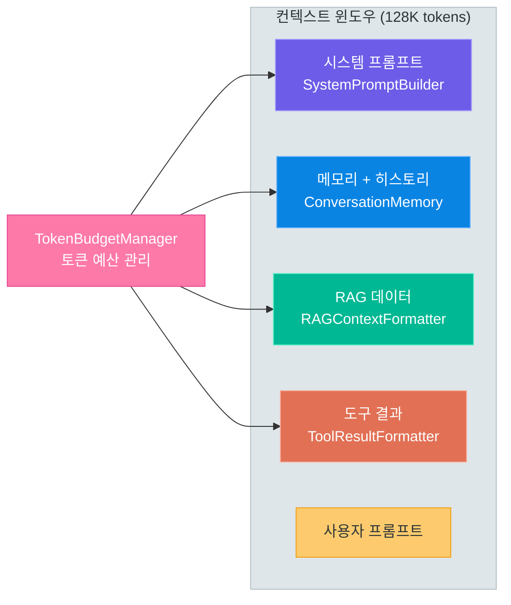
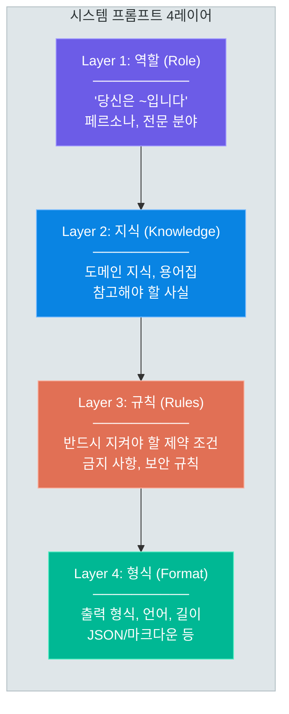
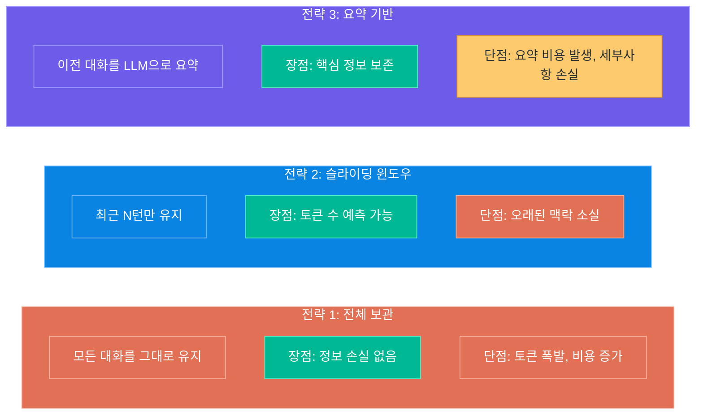
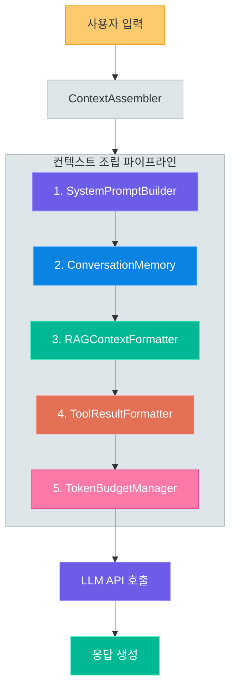

# 컨텍스트 엔지니어링 실전 구현

> 01강에서 배운 개념을 tiktoken, 메모리, RAG 삽입으로 코드로 만드는 시간입니다

---

## 1. 01강 복습 — 컨텍스트 윈도우 6요소 코드 매핑

01-05강에서 Karpathy의 프레이밍과 함께 컨텍스트 엔지니어링의 6요소를 배웠습니다.
이번 강의에서는 **각 요소를 실제 코드 모듈로 구현**합니다.

### 6요소 → 코드 모듈 매핑

| 컨텍스트 요소 | 01강에서 배운 것 | 이번 강의 코드 모듈 | 핵심 라이브러리 |
|---|---|---|---|
| **시스템 프롬프트** | AI의 역할/규칙 정의 | `SystemPromptBuilder` | langchain-core |
| **대화 히스토리** | 현재 세션의 맥락 | `ConversationMemory` | Redis, openai |
| **메모리** | 과거 대화/사용자 정보 | `ConversationMemory` (요약 전략) | openai, tiktoken |
| **관련 데이터 (RAG)** | 문서, DB 검색 결과 | `RAGContextFormatter` | langchain-core |
| **도구 결과** | API/도구 실행 결과 | `ToolResultFormatter` | openai |
| **예시 (Few-Shot)** | 원하는 출력 샘플 | `SystemPromptBuilder` 내 포함 | - |

> **핵심 포인트:** 6요소 모두를 하나의 컨텍스트 윈도우 안에 넣되, **토큰 예산**을 초과하면 안 됩니다. 이것이 `TokenBudgetManager`의 역할입니다.

### 컨텍스트 윈도우 구성요소와 코드 모듈 매핑



이 구조를 이해했으면, 각 모듈을 하나씩 구현해 보겠습니다.

---

## 2. 토큰 관리

LLM API를 호출할 때 가장 먼저 해결해야 할 문제는 **"지금 내 컨텍스트가 몇 토큰인가?"** 입니다.
토큰 수를 모르면 컨텍스트 윈도우를 초과하거나, 불필요하게 비용을 낭비하게 됩니다.

### 2.1 tiktoken 기본 사용법

```python
# token_counter.py -- tiktoken으로 토큰 수를 계산하는 기본 예제
import tiktoken

# GPT-4o, GPT-4o-mini 등 최신 모델은 o200k_base 사용
enc_o200k = tiktoken.get_encoding("o200k_base")

# GPT-4, GPT-3.5-turbo 등 이전 모델은 cl100k_base 사용
enc_cl100k = tiktoken.get_encoding("cl100k_base")

text = "컨텍스트 엔지니어링은 LLM 앱의 핵심입니다."

tokens_o200k = enc_o200k.encode(text)
tokens_cl100k = enc_cl100k.encode(text)

print(f"o200k_base 토큰 수: {len(tokens_o200k)}")  # 최신 모델 기준
print(f"cl100k_base 토큰 수: {len(tokens_cl100k)}")  # 이전 모델 기준
print(f"토큰 목록 (o200k): {tokens_o200k}")
```

### 2.2 모델별 컨텍스트 한도

> 가격/모델 라인업은 변동되므로 아래 표는 **2026-06 기준**입니다. 최신 값은 [OpenAI Pricing](https://openai.com/api/pricing/) 페이지에서 확인하세요.

| 모델 | 인코딩 | 컨텍스트 윈도우 | 입력 비용 (1M tokens) | 출력 비용 (1M tokens) |
|---|---|---|---|---|
| gpt-4.1 | o200k_base | 1,000,000 | $2.00 | $8.00 |
| gpt-4.1-mini | o200k_base | 1,000,000 | $0.40 | $1.60 |
| gpt-4o | o200k_base | 128,000 | $2.50 | $10.00 |
| gpt-4o-mini | o200k_base | 128,000 | $0.15 | $0.60 |
| o3 | o200k_base | 200,000 | $2.00 | $8.00 |
| o4-mini | o200k_base | 200,000 | $1.10 | $4.40 |

### 2.3 Chat 메시지의 토큰 계산

Chat API는 단순 텍스트가 아니라 메시지 배열을 전달합니다. 각 메시지에는 역할 토큰, 구분자 토큰 등 **오버헤드**가 붙습니다.

```python
# chat_token_counter.py -- Chat 메시지 배열의 정확한 토큰 수 계산
import tiktoken


def count_chat_tokens(
    messages: list[dict],
    model: str = "gpt-4o"
) -> int:
    """Chat 메시지 배열의 토큰 수를 계산합니다.

    주의: 메시지당 오버헤드(3토큰 등)는 모델/포맷에 따라 달라지므로
    이 값은 정확한 청구 토큰이 아니라 **근사치**입니다.
    """
    # gpt-4o / gpt-4.1 / o-series 등 최신 모델은 o200k_base
    if model.startswith(("gpt-4o", "gpt-4.1", "o1", "o3", "o4")):
        encoding = tiktoken.get_encoding("o200k_base")
    else:
        encoding = tiktoken.get_encoding("cl100k_base")

    # 모든 Chat 모델 공통: 메시지당 오버헤드
    tokens_per_message = 3  # <|im_start|>role\n ... <|im_end|>\n
    tokens_per_name = 1     # name 필드가 있을 경우 추가

    num_tokens = 0
    for message in messages:
        num_tokens += tokens_per_message
        for key, value in message.items():
            # content가 None이거나 문자열이 아닌 경우(tool_calls 등) 방어
            if value is None or not isinstance(value, str):
                continue
            num_tokens += len(encoding.encode(value))
            if key == "name":
                num_tokens += tokens_per_name

    num_tokens += 3  # assistant 응답 시작 프라이밍
    return num_tokens


# 사용 예시
messages = [
    {"role": "system", "content": "당신은 친절한 AI 어시스턴트입니다."},
    {"role": "user", "content": "Python의 장점을 3가지 알려주세요."},
]

total = count_chat_tokens(messages, model="gpt-4o")
print(f"총 토큰 수: {total}")
```

### 2.4 TokenBudgetManager 클래스

실제 서비스에서는 컨텍스트 윈도우를 구성요소별로 **예산 분배**해야 합니다.

```python
# token_budget_manager.py -- 컨텍스트 윈도우 토큰 예산 관리
import tiktoken
from dataclasses import dataclass


# 가격/한도는 변동될 수 있습니다 (2026-06 기준). 최신 값은 OpenAI Pricing 페이지 참고.
MODEL_CONFIGS = {
    "gpt-4.1":       {"encoding": "o200k_base", "max_tokens": 1_000_000, "input_cost_per_m": 2.00, "output_cost_per_m": 8.00},
    "gpt-4.1-mini":  {"encoding": "o200k_base", "max_tokens": 1_000_000, "input_cost_per_m": 0.40, "output_cost_per_m": 1.60},
    "gpt-4o":        {"encoding": "o200k_base", "max_tokens": 128_000, "input_cost_per_m": 2.50, "output_cost_per_m": 10.00},
    "gpt-4o-mini":   {"encoding": "o200k_base", "max_tokens": 128_000, "input_cost_per_m": 0.15, "output_cost_per_m": 0.60},
    "o3":            {"encoding": "o200k_base", "max_tokens": 200_000, "input_cost_per_m": 2.00, "output_cost_per_m": 8.00},
    "o4-mini":       {"encoding": "o200k_base", "max_tokens": 200_000, "input_cost_per_m": 1.10, "output_cost_per_m": 4.40},
}


@dataclass
class TokenBudgetManager:
    """컨텍스트 윈도우의 토큰 예산을 관리합니다."""
    model: str = "gpt-4o"
    max_output_tokens: int = 4_096
    system_ratio: float = 0.10     # 시스템 프롬프트에 10%
    history_ratio: float = 0.30    # 대화 히스토리에 30%
    rag_ratio: float = 0.35        # RAG 데이터에 35%
    tool_ratio: float = 0.15       # 도구 결과에 15%
    user_ratio: float = 0.10       # 사용자 프롬프트에 10%

    def __post_init__(self):
        config = MODEL_CONFIGS[self.model]
        self.encoding = tiktoken.get_encoding(config["encoding"])
        self.max_context = config["max_tokens"]
        self.input_cost_per_m = config["input_cost_per_m"]
        self.output_cost_per_m = config["output_cost_per_m"]
        self.available_input = self.max_context - self.max_output_tokens

    def get_budget(self, component: str) -> int:
        """각 구성요소의 토큰 예산을 반환합니다."""
        ratios = {
            "system": self.system_ratio,
            "history": self.history_ratio,
            "rag": self.rag_ratio,
            "tool": self.tool_ratio,
            "user": self.user_ratio,
        }
        return int(self.available_input * ratios[component])

    def count_tokens(self, text: str) -> int:
        """텍스트의 토큰 수를 반환합니다."""
        return len(self.encoding.encode(text))

    def trim_to_budget(self, text: str, component: str) -> str:
        """텍스트를 해당 구성요소의 토큰 예산에 맞게 자릅니다."""
        budget = self.get_budget(component)
        tokens = self.encoding.encode(text)
        if len(tokens) <= budget:
            return text
        trimmed_tokens = tokens[:budget]
        return self.encoding.decode(trimmed_tokens) + "\n...[토큰 예산 초과로 잘림]"

    def estimate_cost(self, input_tokens: int, output_tokens: int) -> float:
        """예상 비용을 달러로 반환합니다."""
        input_cost = (input_tokens / 1_000_000) * self.input_cost_per_m
        output_cost = (output_tokens / 1_000_000) * self.output_cost_per_m
        return input_cost + output_cost

    def report(self) -> str:
        """현재 예산 배분 현황을 문자열로 반환합니다."""
        lines = [f"모델: {self.model} | 컨텍스트: {self.max_context:,} | 입력 가용: {self.available_input:,}"]
        for comp in ["system", "history", "rag", "tool", "user"]:
            lines.append(f"  {comp:>10}: {self.get_budget(comp):>8,} tokens")
        return "\n".join(lines)


# 사용 예시
if __name__ == "__main__":
    mgr = TokenBudgetManager(model="gpt-4o", max_output_tokens=4096)
    print(mgr.report())
    print(f"비용 추정 (50K입력, 2K출력): ${mgr.estimate_cost(50000, 2000):.4f}")
```

> **핵심 포인트:** 토큰 예산 비율은 고정값이 아닙니다. RAG 중심 앱이면 `rag_ratio`를 높이고, 대화 중심 앱이면 `history_ratio`를 높이세요. 서비스 특성에 맞게 조정하는 것이 핵심입니다.

---

## 3. 시스템 프롬프트 설계

시스템 프롬프트는 LLM의 행동을 정의하는 **헌법**과 같습니다.
잘 설계된 시스템 프롬프트는 4개의 레이어로 구성됩니다.

### 3.1 4레이어 구조



| 레이어 | 역할 | 예시 |
|---|---|---|
| **Role** | AI의 정체성 정의 | "당신은 10년 경력의 보안 전문가입니다" |
| **Knowledge** | 도메인 지식 주입 | "OWASP Top 10 기준으로 답변합니다" |
| **Rules** | 행동 제약 조건 | "SQL 쿼리를 직접 실행하지 않습니다" |
| **Format** | 출력 형태 지정 | "JSON 형식으로 응답합니다" |

### 3.2 SystemPromptBuilder 클래스

```python
# system_prompt_builder.py -- 4레이어 시스템 프롬프트 빌더
from dataclasses import dataclass, field


@dataclass
class SystemPromptBuilder:
    """4레이어 구조의 시스템 프롬프트를 조립합니다."""
    role: str = ""
    knowledge: list[str] = field(default_factory=list)
    rules: list[str] = field(default_factory=list)
    format_instructions: str = ""
    few_shot_examples: list[dict] = field(default_factory=list)

    def set_role(self, role: str) -> "SystemPromptBuilder":
        """Layer 1: 역할 설정"""
        self.role = role
        return self

    def add_knowledge(self, knowledge: str) -> "SystemPromptBuilder":
        """Layer 2: 도메인 지식 추가"""
        self.knowledge.append(knowledge)
        return self

    def add_rule(self, rule: str) -> "SystemPromptBuilder":
        """Layer 3: 규칙 추가"""
        self.rules.append(rule)
        return self

    def set_format(self, fmt: str) -> "SystemPromptBuilder":
        """Layer 4: 출력 형식 설정"""
        self.format_instructions = fmt
        return self

    def add_example(self, user: str, assistant: str) -> "SystemPromptBuilder":
        """Few-Shot 예시 추가"""
        self.few_shot_examples.append({"user": user, "assistant": assistant})
        return self

    def build(self) -> str:
        """시스템 프롬프트 문자열을 조립합니다."""
        sections = []

        if self.role:
            sections.append(f"## 역할\n{self.role}")

        if self.knowledge:
            knowledge_text = "\n".join(f"- {k}" for k in self.knowledge)
            sections.append(f"## 도메인 지식\n{knowledge_text}")

        if self.rules:
            rules_text = "\n".join(f"- {r}" for r in self.rules)
            sections.append(f"## 규칙\n{rules_text}")

        if self.format_instructions:
            sections.append(f"## 출력 형식\n{self.format_instructions}")

        if self.few_shot_examples:
            examples = []
            for i, ex in enumerate(self.few_shot_examples, 1):
                examples.append(f"예시 {i}:\nUser: {ex['user']}\nAssistant: {ex['assistant']}")
            sections.append(f"## 참고 예시\n" + "\n\n".join(examples))

        return "\n\n".join(sections)


# 사용 예시: 코드 리뷰 봇
code_review_prompt = (
    SystemPromptBuilder()
    .set_role("당신은 10년 경력의 시니어 소프트웨어 엔지니어입니다. 코드 리뷰를 전문으로 합니다.")
    .add_knowledge("Python PEP 8 스타일 가이드를 기준으로 합니다.")
    .add_knowledge("SOLID 원칙과 클린 코드 원칙을 적용합니다.")
    .add_knowledge("보안 취약점(SQL Injection, XSS 등)을 반드시 체크합니다.")
    .add_rule("코드의 좋은 점도 반드시 언급합니다.")
    .add_rule("개선 제안은 구체적인 코드 예시와 함께 제공합니다.")
    .add_rule("비난하지 않고, 건설적인 피드백을 제공합니다.")
    .set_format("각 피드백은 [심각도: 높음/중간/낮음] 태그로 시작합니다.\nJSON 형식이 아닌 마크다운으로 응답합니다.")
    .add_example(
        user="def get_user(id):\n    return db.execute(f'SELECT * FROM users WHERE id={id}')",
        assistant="[심각도: 높음] SQL Injection 취약점이 있습니다.\n```python\ndef get_user(id):\n    return db.execute('SELECT * FROM users WHERE id=?', (id,))\n```"
    )
    .build()
)

print(code_review_prompt)
```

### 3.3 멀티 페르소나 — 상황별 전환

하나의 서비스에서 여러 시스템 프롬프트를 상황에 따라 전환할 수 있습니다.

```python
# multi_persona.py -- 상황별 시스템 프롬프트 전환
PERSONAS = {
    "code_review": (
        SystemPromptBuilder()
        .set_role("당신은 시니어 개발자입니다. 코드 리뷰를 수행합니다.")
        .add_rule("보안, 성능, 가독성 순으로 우선순위를 둡니다.")
        .set_format("마크다운 형식으로 응답합니다.")
        .build()
    ),
    "customer_support": (
        SystemPromptBuilder()
        .set_role("당신은 친절한 고객 지원 담당자입니다.")
        .add_rule("고객의 감정을 먼저 공감합니다.")
        .add_rule("해결책을 단계별로 안내합니다.")
        .set_format("존댓말을 사용합니다.")
        .build()
    ),
    "data_analyst": (
        SystemPromptBuilder()
        .set_role("당신은 데이터 분석 전문가입니다.")
        .add_knowledge("pandas, numpy, matplotlib에 능숙합니다.")
        .add_rule("결론을 먼저 말하고, 근거를 뒤에 제시합니다.")
        .set_format("표와 차트 코드를 포함합니다.")
        .build()
    ),
}


def get_system_prompt(user_intent: str) -> str:
    """사용자 의도의 키워드로 적절한 시스템 프롬프트를 반환합니다."""
    mapping = {"코드": "code_review", "리뷰": "code_review",
               "고객": "customer_support", "불만": "customer_support",
               "데이터": "data_analyst", "분석": "data_analyst"}
    for keyword, persona in mapping.items():
        if keyword in user_intent:
            return PERSONAS[persona]
    return PERSONAS["customer_support"]
```

> **핵심 포인트:** 시스템 프롬프트는 "한 번 작성하고 끝"이 아닙니다. 사용자의 의도나 대화 흐름에 따라 **동적으로 전환**하는 것이 실전입니다.

---

## 4. 대화 기록 관리

대화 히스토리는 컨텍스트의 가장 큰 비중을 차지합니다.
대화가 길어질수록 토큰이 급증하므로, **효율적인 메모리 전략**이 필수입니다.

### 4.1 3가지 전략 비교



| 전략 | 토큰 효율 | 정보 보존 | 구현 난이도 | 추천 상황 |
|---|---|---|---|---|
| 전체 보관 | 낮음 | 완벽 | 쉬움 | 짧은 대화, 프로토타입 |
| 슬라이딩 윈도우 | 높음 | 최근만 | 보통 | 일반 챗봇, 고객 상담 |
| 요약 기반 | 중간 | 핵심만 | 높음 | 장기 대화, 복잡한 상담 |

### 4.2 ConversationMemory 클래스 — 3가지 전략 통합

```python
# conversation_memory.py -- 3가지 메모리 전략을 지원하는 대화 기록 관리
import tiktoken
from openai import OpenAI
from dataclasses import dataclass, field
from enum import Enum


class MemoryStrategy(Enum):
    FULL = "full"
    SLIDING_WINDOW = "sliding_window"
    SUMMARY = "summary"


@dataclass
class ConversationMemory:
    """대화 기록을 관리합니다. 3가지 메모리 전략을 지원합니다."""
    strategy: MemoryStrategy = MemoryStrategy.SLIDING_WINDOW
    max_turns: int = 10           # 슬라이딩 윈도우: 최근 N턴
    max_tokens: int = 8_000       # 토큰 상한
    model: str = "gpt-4o"
    messages: list[dict] = field(default_factory=list)
    summary: str = ""             # 요약 기반 전략에서 사용
    _client: OpenAI = field(default=None, repr=False)

    def __post_init__(self):
        self.encoding = tiktoken.get_encoding("o200k_base")
        if self.strategy == MemoryStrategy.SUMMARY and self._client is None:
            self._client = OpenAI()

    def add_message(self, role: str, content: str):
        """메시지를 추가합니다."""
        self.messages.append({"role": role, "content": content})

    def _count_tokens(self, msgs: list[dict]) -> int:
        """메시지 리스트의 토큰 수를 계산합니다."""
        total = 0
        for msg in msgs:
            total += 3  # 메시지 오버헤드
            total += len(self.encoding.encode(msg["content"]))
        return total

    def get_messages(self) -> list[dict]:
        """전략에 따라 처리된 메시지를 반환합니다."""
        if self.strategy == MemoryStrategy.FULL:
            return list(self.messages)
        elif self.strategy == MemoryStrategy.SLIDING_WINDOW:
            return self._strategy_sliding_window()
        elif self.strategy == MemoryStrategy.SUMMARY:
            return self._strategy_summary()

    def _strategy_sliding_window(self) -> list[dict]:
        """슬라이딩 윈도우: 최근 N턴의 메시지만 반환합니다."""
        max_messages = self.max_turns * 2  # 1턴 = user + assistant
        recent = self.messages[-max_messages:]

        # 토큰 상한도 체크
        while self._count_tokens(recent) > self.max_tokens and len(recent) > 2:
            recent = recent[2:]  # 가장 오래된 1턴 제거

        return recent

    def _strategy_summary(self) -> list[dict]:
        """요약 기반: 오래된 대화를 요약하고, 최근 대화는 유지합니다."""
        recent_count = self.max_turns * 2
        if len(self.messages) <= recent_count:
            return list(self.messages)

        old_messages = self.messages[:-recent_count]
        recent_messages = self.messages[-recent_count:]

        self.summary = self._summarize(old_messages)

        summary_message = {
            "role": "system",
            "content": f"[이전 대화 요약]\n{self.summary}"
        }
        return [summary_message] + recent_messages

    def _summarize(self, messages: list[dict]) -> str:
        """메시지를 LLM으로 요약합니다."""
        conv = "\n".join(f"{m['role']}: {m['content']}" for m in messages)
        base = f"기존 요약:\n{self.summary}\n\n추가 대화:\n{conv}" if self.summary else f"대화 내용:\n{conv}"
        prompt = f"{base}\n\n위 내용을 핵심만 3~5문장으로 요약해주세요."

        response = self._client.chat.completions.create(
            model="gpt-4o-mini",  # 요약에는 저렴한 모델 사용
            messages=[{"role": "user", "content": prompt}],
            max_completion_tokens=300,  # Chat Completions는 max_completion_tokens 권장 (구 max_tokens는 노후 표기)
        )
        return response.choices[0].message.content

    def clear(self):
        """대화 기록을 초기화합니다."""
        self.messages.clear()
        self.summary = ""

    def stats(self) -> dict:
        """현재 메모리 상태를 반환합니다."""
        processed = self.get_messages()
        return {
            "strategy": self.strategy.value,
            "total_messages": len(self.messages),
            "processed_messages": len(processed),
            "processed_tokens": self._count_tokens(processed),
        }
```

### 4.3 Redis + VectorDB 하이브리드 메모리

프로덕션 환경에서는 인메모리 저장만으로는 부족합니다. **Redis**로 최근 대화를 빠르게 조회하고, **VectorDB**로 과거 대화에서 관련 맥락을 검색합니다.

```python
# hybrid_memory.py -- Redis + VectorDB 하이브리드 메모리 (개념 구현)
import json
from dataclasses import dataclass
from datetime import datetime


@dataclass
class HybridMemory:
    """Redis(최근 대화) + VectorDB(과거 대화 의미 검색) 하이브리드 구조"""
    session_id: str
    redis_client: object = None      # redis.Redis 인스턴스
    vector_store: object = None      # ChromaDB/Pinecone 인스턴스
    recent_window: int = 20

    def add_message(self, role: str, content: str):
        """Redis에 추가하고, 초과분은 VectorDB로 이동합니다."""
        message = {"role": role, "content": content, "timestamp": datetime.now().isoformat()}
        key = f"chat:{self.session_id}"
        self.redis_client.lpush(key, json.dumps(message, ensure_ascii=False))

        while self.redis_client.llen(key) > self.recent_window:
            old = json.loads(self.redis_client.rpop(key))
            self.vector_store.add(
                documents=[old["content"]],
                metadatas=[{"role": old["role"], "session_id": self.session_id}],
                ids=[f"{self.session_id}_{old['timestamp']}"],
            )

    def build_context(self, current_query: str) -> list[dict]:
        """최근 대화(Redis) + 관련 과거 대화(VectorDB)를 결합합니다."""
        context = []

        # VectorDB에서 관련 과거 대화 검색
        results = self.vector_store.query(query_texts=[current_query], n_results=3)
        if results["documents"] and results["documents"][0]:
            past = "\n".join(f"- {r}" for r in results["documents"][0])
            context.append({"role": "system", "content": f"[관련 과거 대화]\n{past}"})

        # Redis에서 최근 대화
        raw = self.redis_client.lrange(f"chat:{self.session_id}", 0, -1)
        for m in reversed([json.loads(r) for r in raw]):
            context.append({"role": m["role"], "content": m["content"]})

        return context
```

> **핵심 포인트:** 하이브리드 메모리의 핵심은 **"최근 것은 빠르게(Redis), 과거 것은 똑똑하게(VectorDB)"** 가져오는 것입니다.

---

## 5. RAG 컨텍스트 삽입

RAG(Retrieval-Augmented Generation)로 검색한 문서를 컨텍스트에 넣을 때, **어떤 형식으로 넣느냐**가 답변 품질을 좌우합니다.

### 5.1 검색 결과 포맷팅의 중요성

검색된 청크를 단순히 이어 붙이는 것과, 구조화하여 삽입하는 것은 결과가 다릅니다.

```
# 나쁜 예: 단순 이어붙이기
"FastAPI는 Python 웹 프레임워크입니다. FastAPI는 자동으로 API 문서를 생성합니다.
FastAPI는 Starlette 기반입니다."

# 좋은 예: 구조화된 포맷팅
"[문서 1] (유사도: 0.95, 출처: fastapi_docs/intro.md)
FastAPI는 Python 웹 프레임워크입니다.

[문서 2] (유사도: 0.87, 출처: fastapi_docs/features.md)
FastAPI는 자동으로 API 문서를 생성합니다."
```

### 5.2 RAGContextFormatter 클래스

```python
# rag_context_formatter.py -- 검색된 문서를 컨텍스트에 구조화하여 삽입
import tiktoken
from dataclasses import dataclass, field


@dataclass
class RetrievedChunk:
    """검색된 문서 청크를 나타냅니다."""
    content: str
    score: float                    # 유사도 점수 (0~1)
    source: str = ""                # 출처 (파일명, URL 등)
    metadata: dict = field(default_factory=dict)


@dataclass
class RAGContextFormatter:
    """검색된 문서 청크를 LLM 컨텍스트에 삽입할 형식으로 변환합니다."""
    max_tokens: int = 4_000
    min_score: float = 0.5
    encoding_name: str = "o200k_base"

    def __post_init__(self):
        self.encoding = tiktoken.get_encoding(self.encoding_name)

    def format_chunks(self, chunks: list[RetrievedChunk], query: str = "") -> str:
        """검색된 청크를 포맷팅합니다."""
        filtered = sorted([c for c in chunks if c.score >= self.min_score],
                          key=lambda c: c.score, reverse=True)
        if not filtered:
            return "[검색된 관련 문서가 없습니다.]"

        header = "다음은 질문과 관련된 참고 문서입니다. 이 정보를 바탕으로 답변해주세요.\n"
        parts, used = [], len(self.encoding.encode(header))

        for i, chunk in enumerate(filtered, 1):
            source = f"출처: {chunk.source}" if chunk.source else "출처: 미상"
            meta = ", ".join(f"{k}: {v}" for k, v in chunk.metadata.items() if k in ("date", "author"))
            meta_line = f" | {meta}" if meta else ""

            text = (f"[문서 {i}] (유사도: {chunk.score:.2f}, 품질: {self._quality_label(chunk.score)}, "
                    f"{source}{meta_line})\n{chunk.content}\n")

            cost = len(self.encoding.encode(text))
            if used + cost > self.max_tokens:
                parts.append(f"\n[토큰 예산 초과로 나머지 {len(filtered) - i + 1}개 문서 생략]")
                break
            parts.append(text)
            used += cost

        return header + "\n".join(parts)

    def _quality_label(self, score: float) -> str:
        """유사도 점수를 품질 등급으로 변환합니다."""
        if score >= 0.9:
            return "매우 높음"
        elif score >= 0.8:
            return "높음"
        elif score >= 0.7:
            return "보통"
        elif score >= 0.6:
            return "낮음"
        else:
            return "매우 낮음"

    def format_as_system_message(self, chunks: list[RetrievedChunk], query: str = "") -> dict:
        """포맷팅된 RAG 컨텍스트를 system 메시지로 반환합니다."""
        content = self.format_chunks(chunks, query)
        return {"role": "system", "content": content}
```

### 5.3 컨텍스트 우선순위 정렬

검색 결과가 많을 때, 어떤 순서로 배치하느냐도 중요합니다.

```python
# context_priority.py -- 컨텍스트 우선순위 정렬 전략
from enum import Enum


class PriorityStrategy(Enum):
    SCORE_DESC = "score_desc"       # 유사도 높은 순 (기본)
    SANDWICH = "sandwich"           # 중요한 정보를 앞뒤에 배치
    RECENCY = "recency"             # 최신 문서 우선


def sort_chunks(chunks: list, strategy: PriorityStrategy = PriorityStrategy.SCORE_DESC) -> list:
    """우선순위 전략에 따라 청크를 정렬합니다."""
    if strategy == PriorityStrategy.SCORE_DESC:
        return sorted(chunks, key=lambda c: c.score, reverse=True)

    elif strategy == PriorityStrategy.SANDWICH:
        # "Lost in the Middle" 문제 대응: 중요한 정보를 앞뒤에 배치
        ordered = sorted(chunks, key=lambda c: c.score, reverse=True)
        result = []
        for i, chunk in enumerate(ordered):
            result.append(chunk) if i % 2 == 0 else result.insert(0, chunk)
        return result

    elif strategy == PriorityStrategy.RECENCY:
        return sorted(chunks, key=lambda c: c.metadata.get("date", "1900-01-01"), reverse=True)
```

> **핵심 포인트:** "Lost in the Middle" 현상 -- LLM은 컨텍스트의 처음과 끝에 있는 정보에 더 주의를 기울입니다. 가장 중요한 문서를 처음이나 끝에 배치하세요.

---

## 6. 도구 결과 통합

LLM이 도구(API, 계산기, 검색 등)를 호출한 결과를 컨텍스트에 다시 넣어야 합니다.
원시 JSON을 그대로 넣는 것보다 **자연어로 변환**하는 것이 효과적입니다.

### 6.1 ToolResultFormatter 클래스

```python
# tool_result_formatter.py -- 도구 실행 결과를 컨텍스트에 삽입하는 포매터
import json
from dataclasses import dataclass, field
from datetime import datetime


@dataclass
class ToolResult:
    """도구 실행 결과를 나타냅니다."""
    tool_name: str
    raw_output: dict | list | str
    success: bool = True
    error_message: str = ""
    executed_at: str = field(default_factory=lambda: datetime.now().isoformat())


@dataclass
class ToolResultFormatter:
    """도구 결과를 LLM 컨텍스트에 삽입할 형식으로 변환합니다."""
    _formatters: dict = field(default_factory=dict)

    def register(self, tool_name: str, formatter_fn):
        """특정 도구에 대한 커스텀 포맷터를 등록합니다."""
        self._formatters[tool_name] = formatter_fn

    def format(self, result: ToolResult) -> str:
        """도구 결과를 자연어 형식으로 변환합니다."""
        if not result.success:
            return (
                f"[도구 오류: {result.tool_name}]\n"
                f"오류 메시지: {result.error_message}\n"
                f"실행 시간: {result.executed_at}"
            )

        # 커스텀 포맷터가 있으면 사용
        if result.tool_name in self._formatters:
            return self._formatters[result.tool_name](result.raw_output)

        return self._default_format(result)

    def _default_format(self, result: ToolResult) -> str:
        """기본 포맷터: JSON을 읽기 쉬운 텍스트로 변환합니다."""
        output = result.raw_output
        if isinstance(output, str):
            return f"[{result.tool_name} 결과]\n{output}"
        if isinstance(output, dict):
            lines = [f"  {k}: {json.dumps(v, ensure_ascii=False) if isinstance(v, (dict, list)) else v}"
                     for k, v in output.items()]
            return f"[{result.tool_name} 결과]\n" + "\n".join(lines)
        if isinstance(output, list):
            items = "\n".join(f"  {i+1}. {json.dumps(x, ensure_ascii=False)}" for i, x in enumerate(output[:10]))
            return f"[{result.tool_name} 결과] (총 {len(output)}건)\n{items}"
        return f"[{result.tool_name} 결과]\n{str(output)}"

    def format_multiple(self, results: list[ToolResult]) -> str:
        """여러 도구 결과를 하나의 텍스트로 결합합니다."""
        return "\n\n---\n\n".join(self.format(r) for r in results)
```

커스텀 포맷터를 등록하면 도구별로 최적화된 자연어 변환이 가능합니다.

```python
# custom_formatters.py -- 커스텀 포맷터 등록 예시

def format_weather(raw: dict) -> str:
    """날씨 API 결과를 자연어로 변환합니다."""
    return (
        f"현재 {raw.get('city', '알 수 없음')}의 날씨: "
        f"{raw.get('temp', 'N/A')}도C, {raw.get('description', 'N/A')}, "
        f"습도 {raw.get('humidity', 'N/A')}%"
    )

# 등록
formatter = ToolResultFormatter()
formatter.register("weather_api", format_weather)
```

### 6.2 전체 컨텍스트 조립 파이프라인

지금까지 만든 모듈을 하나로 결합하여, 최종 LLM 호출에 사용할 메시지 배열을 조립합니다.



```python
# context_assembler.py -- 전체 컨텍스트 조립 파이프라인
from openai import OpenAI
from dataclasses import dataclass


@dataclass
class ContextAssembler:
    """모든 컨텍스트 모듈을 결합하여 최종 messages 배열을 생성합니다."""
    system_builder: object       # SystemPromptBuilder
    memory: object               # ConversationMemory
    rag_formatter: object        # RAGContextFormatter
    tool_formatter: object       # ToolResultFormatter
    budget_manager: object       # TokenBudgetManager

    def assemble(self, user_message: str, rag_chunks=None, tool_results=None) -> list[dict]:
        """최종 messages 배열을 조립합니다."""
        bm = self.budget_manager
        messages = []

        # 1. 시스템 프롬프트
        messages.append({"role": "system", "content": bm.trim_to_budget(self.system_builder.build(), "system")})

        # 2. RAG 컨텍스트
        if rag_chunks:
            rag = bm.trim_to_budget(self.rag_formatter.format_chunks(rag_chunks, query=user_message), "rag")
            messages.append({"role": "system", "content": rag})

        # 3. 도구 결과
        if tool_results:
            tool = bm.trim_to_budget(self.tool_formatter.format_multiple(tool_results), "tool")
            messages.append({"role": "system", "content": f"[도구 실행 결과]\n{tool}"})

        # 4. 대화 히스토리 (토큰 예산 내에서 최근 것부터)
        budget, used = bm.get_budget("history"), 0
        trimmed = []
        for msg in reversed(self.memory.get_messages()):
            cost = bm.count_tokens(msg["content"]) + 3
            if used + cost > budget:
                break
            trimmed.insert(0, msg)
            used += cost
        messages.extend(trimmed)

        # 5. 현재 사용자 메시지
        messages.append({"role": "user", "content": user_message})
        return messages

    def assemble_and_call(self, user_message: str, rag_chunks=None, tool_results=None,
                         client: OpenAI = None, model: str = "gpt-4o") -> str:
        """컨텍스트를 조립하고 LLM API를 호출합니다."""
        messages = self.assemble(user_message, rag_chunks, tool_results)
        total = sum(self.budget_manager.count_tokens(m["content"]) + 3 for m in messages)
        print(f"[ContextAssembler] 입력: {total:,} tokens | 비용: ${self.budget_manager.estimate_cost(total, 1000):.4f}")

        client = client or OpenAI()
        response = client.chat.completions.create(model=model, messages=messages)
        self.memory.add_message("user", user_message)
        self.memory.add_message("assistant", response.choices[0].message.content)
        return response.choices[0].message.content
```

> **핵심 포인트:** `ContextAssembler`는 모든 모듈의 **오케스트레이터**입니다. 각 모듈은 독립적으로 테스트 가능하고, 조립 순서를 바꾸거나 특정 모듈을 교체할 수 있습니다.

---

## 7. 핵심 정리

### 컨텍스트 엔지니어링 실전 체크리스트

이번 강의에서 구현한 5개 모듈을 사용할 때, 아래 체크리스트를 확인하세요.

| 단계 | 체크 항목 | 담당 모듈 |
|---|---|---|
| 1 | 사용 모델의 인코딩과 컨텍스트 한도를 확인했는가? | `TokenBudgetManager` |
| 2 | 구성요소별 토큰 예산을 서비스에 맞게 조정했는가? | `TokenBudgetManager` |
| 3 | 시스템 프롬프트에 역할/지식/규칙/형식이 모두 있는가? | `SystemPromptBuilder` |
| 4 | 대화 히스토리 전략을 결정했는가? (전체/슬라이딩/요약) | `ConversationMemory` |
| 5 | RAG 문서에 유사도, 출처, 품질 등급을 표시했는가? | `RAGContextFormatter` |
| 6 | 도구 결과를 자연어로 변환했는가? | `ToolResultFormatter` |
| 7 | 전체 토큰이 예산을 초과하지 않는지 확인했는가? | `ContextAssembler` |
| 8 | 비용을 추정하고 모니터링하고 있는가? | `TokenBudgetManager` |

### 모듈 간 의존성 정리

```
TokenBudgetManager  <-- 모든 모듈이 의존 (토큰 계산/트리밍)
    |
SystemPromptBuilder <-- 독립 모듈 (시스템 프롬프트 생성)
ConversationMemory  <-- 독립 모듈 (대화 기록 관리)
RAGContextFormatter <-- 독립 모듈 (RAG 결과 포맷팅)
ToolResultFormatter <-- 독립 모듈 (도구 결과 포맷팅)
    |
    v
ContextAssembler    <-- 모든 모듈을 조립하는 오케스트레이터
```

### 라이브러리 버전 요약

| 라이브러리 | 최소 버전 | 용도 |
|---|---|---|
| `tiktoken` | 0.7+ | 토큰 인코딩/카운팅 |
| `openai` | 1.58+ | LLM API 호출, 요약 |
| `langchain-core` | 0.3+ | 메시지 타입, 체인 구성 (확장 시) |
| `redis` | 5.0+ | 실시간 대화 저장 (선택) |
| `chromadb` | 0.5+ | 벡터 검색 (선택) |

### 다음 강의 예고

이번 강의에서는 컨텍스트 윈도우의 각 구성요소를 **개별 모듈로 구현**하는 방법을 배웠습니다.

다음 강의에서는 RAG 시스템을 처음부터 끝까지 구축합니다.

- 문서 로딩 (PDF, 웹 페이지, 마크다운)
- 청킹 전략 (고정 크기, 의미 기반, 재귀적)
- 임베딩 생성 및 벡터 저장소 구축
- 검색 최적화 (하이브리드 검색, 리랭킹)
- 이번 강의의 `RAGContextFormatter`와 연결하여 End-to-End RAG 파이프라인 완성

> **핵심 포인트:** 컨텍스트 엔지니어링은 "프롬프트를 잘 쓰는 것"이 아니라 "LLM이 올바른 답을 할 수 있는 환경을 코드로 설계하는 것"입니다. 이번 강의의 5개 모듈을 자신의 프로젝트에 적용해 보세요.

---
