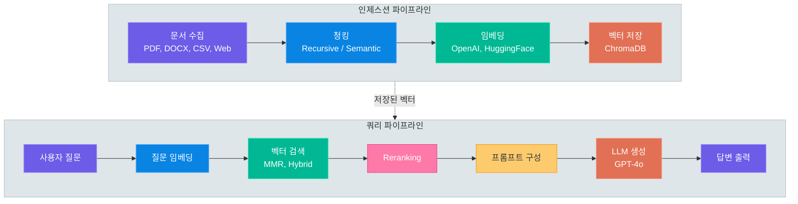
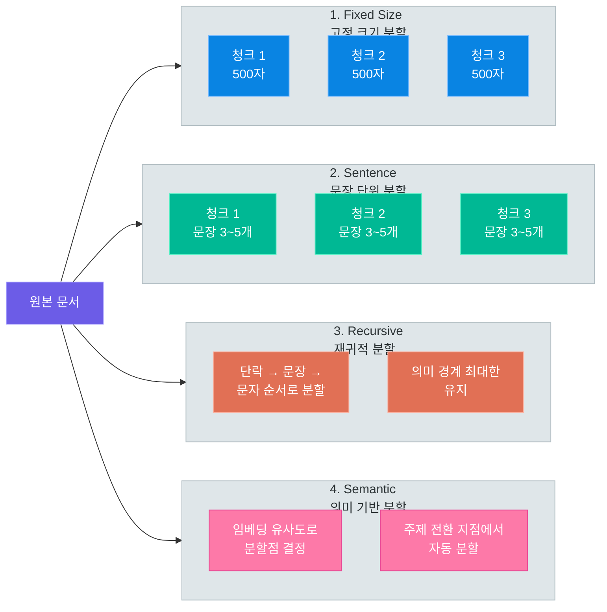
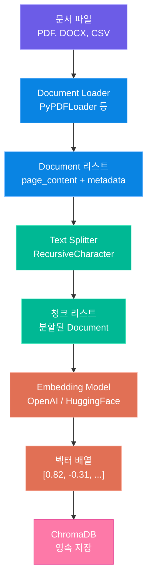
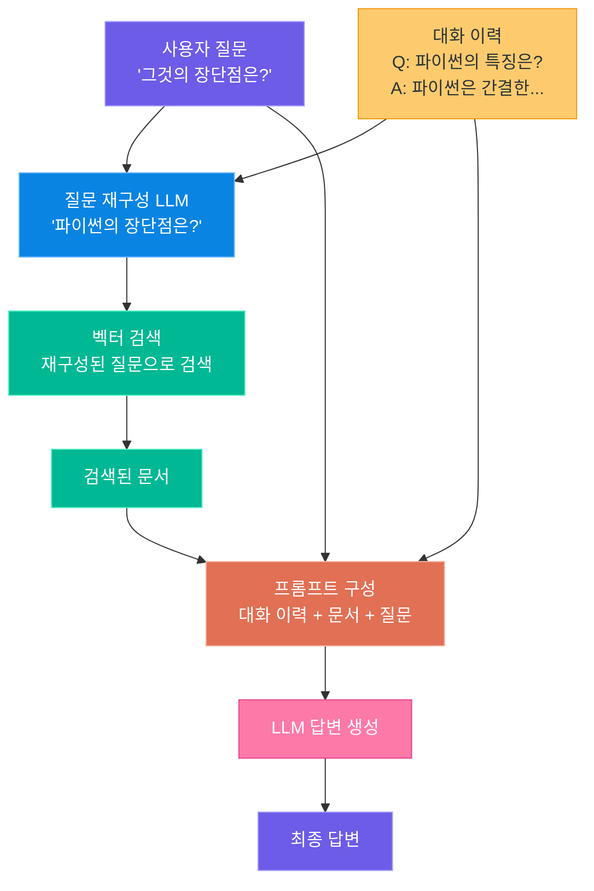
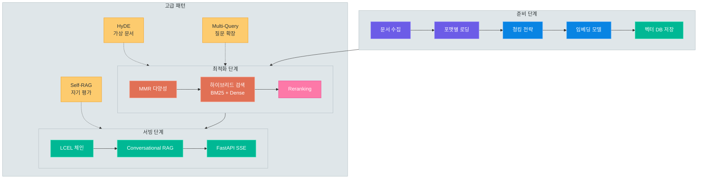

# RAG 시스템 구축

> 04강에서 배운 벡터 데이터베이스 지식을 바탕으로, 문서 로딩부터 청킹, 임베딩, 검색, 생성까지 — 풀 RAG 파이프라인을 직접 설계하고 구현합니다

---

## 1. 04강 복습 — RAG 준비물 점검

### 지금까지 배운 것

04강 11, 12차시에서 벡터 데이터베이스의 핵심 개념을 학습했습니다. 텍스트를 고차원 벡터로 변환하는 **임베딩**, 벡터 간 거리를 측정하는 **코사인 유사도**, 대규모 벡터에서 빠르게 검색하는 **ANN(Approximate Nearest Neighbor)** 알고리즘, 그리고 **ChromaDB, FAISS, pgvector** 세 가지 구현체를 직접 실습했습니다.

이번 강의에서는 이 지식을 **실전 RAG 파이프라인**으로 확장합니다. 벡터 DB에 "무엇을" 넣을지, "어떻게" 넣을지, "어떻게" 꺼내서 LLM에 전달할지를 체계적으로 다룹니다.

### 이 강의에서 새로 배울 것

| 단계 | 학습 내용 | 핵심 기술 |
|------|-----------|-----------|
| 문서 로딩 | 다양한 포맷의 문서를 통합 처리 | LangChain Document Loaders |
| 청킹 전략 | 문서를 의미 단위로 분할하는 기법 | RecursiveCharacterTextSplitter |
| 검색 최적화 | 검색 품질을 높이는 고급 기법 | MMR, 하이브리드 검색, Reranking |
| 생성 체인 | 검색 결과를 LLM에 전달하여 답변 생성 | LCEL, Conversational RAG |
| 고급 패턴 | RAG 성능을 극대화하는 아키텍처 | HyDE, Self-RAG, Multi-Query |

### RAG 풀 파이프라인 개요



> **핵심 포인트:** RAG는 크게 두 가지 파이프라인으로 구성됩니다. 문서를 벡터로 변환하여 저장하는 **인제스션 파이프라인**과, 사용자 질문에 맞는 문서를 검색하여 답변을 생성하는 **쿼리 파이프라인**입니다.

### 환경 설정

```bash
# requirements.txt -- RAG 시스템 구축에 필요한 패키지
pip install langchain==0.3.14 \
            langchain-community==0.3.14 \
            langchain-openai==0.3.1 \
            langchain-chroma==0.2.2 \
            chromadb==0.5.23 \
            openai==1.58.1 \
            pypdf==5.1.0 \
            docx2txt==0.8 \
            beautifulsoup4==4.12.3 \
            rank-bm25==0.2.2 \
            sentence-transformers==3.3.1 \
            fastapi==0.115.6 \
            uvicorn==0.34.0
```

---

## 2. 문서 로딩

### 왜 문서 로더가 필요한가

RAG 시스템에 공급할 문서는 PDF, Word, CSV, 웹 페이지 등 다양한 포맷으로 존재합니다. LangChain은 일관된 인터페이스로 문서를 로딩하는 **Document Loader** 추상화를 제공합니다. 모든 로더는 `load()` 메서드를 호출하면 `Document` 객체의 리스트를 반환하며, 각 `Document`는 `page_content`(텍스트)와 `metadata`(출처 정보) 속성을 가집니다.

### 주요 문서 로더

| 로더 | 대상 포맷 | 설치 패키지 | 특징 |
|------|-----------|-------------|------|
| `PyPDFLoader` | PDF | `pypdf` | 페이지별 분할, 메타데이터에 페이지 번호 포함 |
| `Docx2txtLoader` | DOCX | `docx2txt` | Word 문서의 텍스트 추출 |
| `CSVLoader` | CSV | 내장 | 행 단위 Document 생성, 컬럼명 메타데이터 |
| `WebBaseLoader` | HTML | `beautifulsoup4` | URL에서 웹 페이지 크롤링 및 텍스트 추출 |
| `TextLoader` | TXT | 내장 | 일반 텍스트 파일 로딩 |

### 개별 로더 사용법

```python
# loaders_example.py -- 각 문서 로더의 기본 사용법

from langchain_community.document_loaders import (
    PyPDFLoader,
    Docx2txtLoader,
    CSVLoader,
    WebBaseLoader,
)

# 1. PDF 로딩 — 페이지별로 Document 생성
pdf_loader = PyPDFLoader("data/company_report.pdf")
pdf_docs = pdf_loader.load()
print(f"PDF 문서: {len(pdf_docs)}페이지 로딩 완료")
print(f"메타데이터: {pdf_docs[0].metadata}")
# → {'source': 'data/company_report.pdf', 'page': 0}

# 2. Word 문서 로딩
docx_loader = Docx2txtLoader("data/meeting_notes.docx")
docx_docs = docx_loader.load()

# 3. CSV 로딩 — 행 단위로 Document 생성
csv_loader = CSVLoader("data/faq.csv", encoding="utf-8")
csv_docs = csv_loader.load()

# 4. 웹 페이지 로딩
web_loader = WebBaseLoader("https://example.com/docs/guide")
web_docs = web_loader.load()
```

### 여러 문서 유형 통합 로딩

실무에서는 다양한 포맷의 문서를 한꺼번에 처리해야 합니다. 파일 확장자에 따라 적절한 로더를 자동 선택하는 유틸리티를 만들어 보겠습니다.

```python
# unified_loader.py -- 확장자 기반 통합 문서 로더

from pathlib import Path
from langchain_community.document_loaders import (
    PyPDFLoader, Docx2txtLoader, CSVLoader, TextLoader,
)
from langchain_core.documents import Document

LOADER_MAP = {
    ".pdf": PyPDFLoader,
    ".docx": Docx2txtLoader,
    ".csv": CSVLoader,
    ".txt": TextLoader,
}


def load_documents(data_dir: str) -> list[Document]:
    """디렉토리 내 모든 문서를 확장자에 따라 자동 로딩합니다."""
    documents = []
    for file_path in Path(data_dir).rglob("*"):
        ext = file_path.suffix.lower()
        if ext not in LOADER_MAP:
            continue

        try:
            docs = LOADER_MAP[ext](str(file_path)).load()
            for doc in docs:
                doc.metadata["filename"] = file_path.name
                doc.metadata["file_type"] = ext
            documents.extend(docs)
            print(f"[OK] {file_path.name}: {len(docs)}개 Document 로딩")
        except Exception as e:
            print(f"[ERROR] {file_path.name}: {e}")

    print(f"\n총 {len(documents)}개 Document 로딩 완료")
    return documents
```

### 메타데이터 관리

메타데이터는 RAG 시스템에서 **필터링 검색**과 **출처 표시**에 활용됩니다.

| 메타데이터 항목 | 용도 | 예시 |
|----------------|------|------|
| `source` | 원본 파일 경로 / URL | `data/report.pdf` |
| `page` | PDF 페이지 번호 | `3` |
| `filename` | 파일명 | `report.pdf` |
| `file_type` | 파일 확장자 | `.pdf` |
| `created_at` | 문서 생성일 | `2025-01-15` |
| `category` | 문서 분류 | `기술문서`, `회의록` |

> **핵심 포인트:** 메타데이터를 잘 설계하면 "2024년 이후 기술문서에서만 검색" 같은 필터링 검색이 가능해집니다. 로딩 단계에서 메타데이터를 풍부하게 구성하는 것이 검색 품질 향상의 첫걸음입니다.

---

## 3. 청킹 전략

### 왜 청킹이 필요한가

문서를 통째로 벡터로 변환하면 두 가지 문제가 발생합니다.

첫째, 임베딩 모델의 **입력 길이 제한**입니다. 대부분의 임베딩 모델은 512 토큰 내외의 입력만 처리할 수 있습니다. 수십 페이지짜리 PDF를 한 번에 임베딩할 수 없습니다.

둘째, **검색 정밀도** 문제입니다. 긴 문서 전체를 하나의 벡터로 표현하면, 문서 내 다양한 주제가 하나의 벡터에 뭉뚱그려져 검색 품질이 떨어집니다.

### 4가지 청킹 전략 비교



| 전략 | 장점 | 단점 | 적합한 경우 |
|------|------|------|------------|
| Fixed Size | 구현 간단, 예측 가능한 청크 크기 | 문장 중간에서 잘릴 수 있음 | 균일한 구조의 로그 데이터 |
| Sentence | 문장 완결성 보장 | 문장 길이 편차가 클 수 있음 | 뉴스 기사, 블로그 |
| Recursive | 의미 경계 유지, 가장 범용적 | 파라미터 튜닝 필요 | 일반 문서 (가장 추천) |
| Semantic | 주제 변경 지점 자동 감지 | 임베딩 계산 비용, 속도 느림 | 긴 기술 문서, 논문 |

### RecursiveCharacterTextSplitter 상세

LangChain에서 가장 범용적으로 사용되는 청킹 도구입니다. 여러 구분자를 **계층적으로** 적용하여 의미 경계를 최대한 유지합니다.

기본 구분자 우선순위는 다음과 같습니다.

1. `\n\n` — 단락 경계 (가장 먼저 시도)
2. `\n` — 줄바꿈
3. ` ` — 공백 (단어 경계)
4. `""` — 문자 단위 (최후의 수단)

| 파라미터 | 설명 | 권장 값 |
|----------|------|---------|
| `chunk_size` | 청크 최대 문자 수 | 500~1000 |
| `chunk_overlap` | 인접 청크 간 겹치는 문자 수 | chunk_size의 10~20% |
| `separators` | 분할 구분자 리스트 | 기본값 또는 커스텀 |
| `length_function` | 길이 측정 함수 | `len` (기본) |

`chunk_overlap`은 청크 경계에서 문맥이 끊기는 것을 방지합니다. "파이썬은 1991년에 만들어졌으며"와 "귀도 반 로섬이 개발한 언어입니다"가 서로 다른 청크에 들어가도, 오버랩 영역에서 두 청크가 문맥을 공유합니다.

### 한국어 청킹 주의사항

| 이슈 | 설명 | 대처 방안 |
|------|------|-----------|
| 형태소 경계 | "인공지능을"에서 "인공지능"과 "을" 분리 시 의미 손실 | 충분한 chunk_overlap 설정 |
| 조사 처리 | "서버는", "서버가", "서버를"이 별도 토큰 | 임베딩 모델이 처리 (별도 조치 불필요) |
| 한자/영문 혼용 | 기술 문서에서 영문 용어와 한국어 혼재 | separators에 마침표(`.`) 추가 |
| 문장 끝 감지 | `다.`, `요.`, `까?` 등의 한국어 종결 | 정규식 기반 커스텀 구분자 활용 |

### 각 전략별 코드 예제

```python
# chunking_strategies.py -- 4가지 청킹 전략 비교 구현

from langchain.text_splitter import (
    CharacterTextSplitter,
    RecursiveCharacterTextSplitter,
    SentenceTransformersTokenTextSplitter,
)
from langchain_experimental.text_splitter import SemanticChunker
from langchain_openai import OpenAIEmbeddings

sample_text = """
인공지능(AI)은 인간의 학습 능력, 추론 능력, 지각 능력을 인공적으로 구현한 컴퓨터 과학의 한 분야입니다.
머신러닝은 AI의 하위 분야로, 데이터로부터 패턴을 학습하여 예측이나 결정을 수행합니다.

딥러닝은 머신러닝의 한 종류로, 인공 신경망을 여러 층으로 쌓아 복잡한 패턴을 학습합니다.
특히 이미지 인식, 자연어 처리, 음성 인식 분야에서 혁신적인 성과를 보이고 있습니다.

대규모 언어 모델(LLM)은 딥러닝 기반의 자연어 처리 모델로, 방대한 텍스트 데이터를 학습하여
인간과 유사한 텍스트를 생성할 수 있습니다. GPT, Claude, Gemini 등이 대표적인 예입니다.
"""

# 1. Fixed Size — 고정 크기 분할
fixed_splitter = CharacterTextSplitter(separator="", chunk_size=100, chunk_overlap=20)
fixed_chunks = fixed_splitter.split_text(sample_text)
print("=== Fixed Size ===")
for i, chunk in enumerate(fixed_chunks):
    print(f"[청크 {i}] ({len(chunk)}자): {chunk[:60]}...")

# 2. Recursive — 재귀적 분할 (가장 추천)
recursive_splitter = RecursiveCharacterTextSplitter(
    chunk_size=150, chunk_overlap=30,
    separators=["\n\n", "\n", ". ", " ", ""],
)
recursive_chunks = recursive_splitter.split_text(sample_text)
print("\n=== Recursive ===")
for i, chunk in enumerate(recursive_chunks):
    print(f"[청크 {i}] ({len(chunk)}자): {chunk[:60]}...")

# 3. Sentence — 문장 단위 (토큰 기반)
sentence_splitter = SentenceTransformersTokenTextSplitter(
    chunk_overlap=20, tokens_per_chunk=64,
)
sentence_chunks = sentence_splitter.split_text(sample_text)
print("\n=== Sentence (Token) ===")
for i, chunk in enumerate(sentence_chunks):
    print(f"[청크 {i}] ({len(chunk)}자): {chunk[:60]}...")

# 4. Semantic — 의미 기반 분할 (임베딩 활용)
embeddings = OpenAIEmbeddings(model="text-embedding-3-small")
semantic_splitter = SemanticChunker(
    embeddings=embeddings,
    breakpoint_threshold_type="percentile",
    breakpoint_threshold_amount=70,
)
semantic_chunks = semantic_splitter.split_text(sample_text)
print("\n=== Semantic ===")
for i, chunk in enumerate(semantic_chunks):
    print(f"[청크 {i}] ({len(chunk)}자): {chunk[:60]}...")
```

실행 결과 비교 (예시)입니다.

```
=== Fixed Size ===
[청크 0] (100자): 인공지능(AI)은 인간의 학습 능력, 추론 능력, 지각 능력을 인공적으로 구현한 컴퓨터 과학의 한...
→ 문장 중간에서 잘리는 문제 발생

=== Recursive ===
[청크 0] (142자): 인공지능(AI)은 ... 머신러닝은 AI의 하위 분야로...
→ 단락과 문장 경계를 유지하며 분할

=== Semantic ===
[청크 0] (180자): 인공지능(AI)은 ... 머신러닝은 ...
[청크 1] (160자): 딥러닝은 ... 특히 이미지 인식 ...
→ 주제별로 자동 분할 (AI 개론 / 딥러닝 / LLM)
```

> **핵심 포인트:** 대부분의 실무 프로젝트에서는 `RecursiveCharacterTextSplitter`가 최선의 선택입니다. `chunk_size=500~1000`, `chunk_overlap=50~200`으로 시작하고, 검색 결과를 평가하면서 점진적으로 튜닝하십시오.

---

## 4. 임베딩과 벡터 저장

### 한국어 임베딩 모델 비교

04강에서 임베딩의 원리를 배웠으므로, 여기서는 한국어 RAG에 적합한 모델 선택에 집중합니다.

| 모델 | 개발사 | 차원 | 한국어 성능 | 비용 | 특징 |
|------|--------|------|-------------|------|------|
| `text-embedding-3-small` | OpenAI | 1536 | 우수 | 유료 (저렴) | 가성비 최고, API 호출 |
| `text-embedding-3-large` | OpenAI | 3072 | 매우 우수 | 유료 (보통) | 고품질, 차원 축소 가능 |
| `multilingual-e5-large` | Microsoft | 1024 | 매우 우수 | 무료 | 다국어 지원, 로컬 실행 |
| `ko-sroberta-multitask` | KoNLPy | 768 | 우수 | 무료 | 한국어 특화, 경량 |
| `bge-m3` | BAAI | 1024 | 매우 우수 | 무료 | 다국어, 희소+밀집 벡터 |
| `paraphrase-multilingual-MiniLM-L12-v2` | SBERT | 384 | 보통 | 무료 | 경량, 빠른 추론 |

모델 선택 기준은 다음과 같습니다.

- **프로토타입 / 소규모 프로젝트:** `text-embedding-3-small` (API 기반, 설치 부담 없음)
- **비용 민감한 프로덕션:** `multilingual-e5-large` 또는 `bge-m3` (GPU 서버 필요)
- **한국어 특화 최적화:** `ko-sroberta-multitask` (한국어만 다루는 경우)

### 임베딩+저장 파이프라인



### 완전한 인제스션 파이프라인

```python
# ingestion_pipeline.py -- 문서 로딩 → 청킹 → 임베딩 → 저장 파이프라인

from pathlib import Path
from langchain_community.document_loaders import (
    PyPDFLoader, Docx2txtLoader, CSVLoader, TextLoader,
)
from langchain.text_splitter import RecursiveCharacterTextSplitter
from langchain_openai import OpenAIEmbeddings
from langchain_chroma import Chroma

LOADER_MAP = {
    ".pdf": PyPDFLoader, ".docx": Docx2txtLoader,
    ".csv": CSVLoader, ".txt": TextLoader,
}


def load_all_documents(data_dir: str):
    """data_dir 내 모든 지원 문서를 로딩합니다."""
    documents = []
    for file_path in Path(data_dir).rglob("*"):
        ext = file_path.suffix.lower()
        if ext not in LOADER_MAP:
            continue
        docs = LOADER_MAP[ext](str(file_path)).load()
        for doc in docs:
            doc.metadata["filename"] = file_path.name
            doc.metadata["file_type"] = ext
        documents.extend(docs)
    return documents


def chunk_documents(documents, chunk_size=800, chunk_overlap=150):
    """Document 리스트를 청크로 분할합니다."""
    splitter = RecursiveCharacterTextSplitter(
        chunk_size=chunk_size,
        chunk_overlap=chunk_overlap,
        separators=["\n\n", "\n", ". ", ", ", " ", ""],
    )
    chunks = splitter.split_documents(documents)
    for i, chunk in enumerate(chunks):
        chunk.metadata["chunk_index"] = i
    return chunks


def create_vector_store(chunks, persist_dir="./chroma_db"):
    """청크를 임베딩하여 ChromaDB에 저장합니다."""
    embeddings = OpenAIEmbeddings(model="text-embedding-3-small")
    vector_store = Chroma.from_documents(
        documents=chunks,
        embedding=embeddings,
        persist_directory=persist_dir,
        collection_name="rag_documents",
    )
    return vector_store


if __name__ == "__main__":
    print("1단계: 문서 로딩...")
    documents = load_all_documents("./data")
    print(f"   → {len(documents)}개 Document 로딩 완료")

    print("2단계: 청킹...")
    chunks = chunk_documents(documents)
    print(f"   → {len(chunks)}개 청크 생성 완료")

    print("3단계: 임베딩 및 벡터 저장...")
    vector_store = create_vector_store(chunks)
    print(f"   → ChromaDB 저장 완료 (./chroma_db)")

    # 검증: 간단한 검색 테스트
    results = vector_store.similarity_search("인공지능의 정의", k=3)
    for i, doc in enumerate(results):
        print(f"  [{i+1}] {doc.metadata['filename']} | {doc.page_content[:80]}...")
```

### 기존 벡터 스토어 불러오기

```python
# load_existing_store.py -- 저장된 ChromaDB 불러오기

from langchain_openai import OpenAIEmbeddings
from langchain_chroma import Chroma

embeddings = OpenAIEmbeddings(model="text-embedding-3-small")

vector_store = Chroma(
    persist_directory="./chroma_db",
    embedding_function=embeddings,
    collection_name="rag_documents",
)

print(f"저장된 문서 수: {vector_store._collection.count()}")

results = vector_store.similarity_search_with_score("머신러닝이란", k=3)
for doc, score in results:
    print(f"[유사도: {score:.4f}] {doc.page_content[:80]}...")
```

> **핵심 포인트:** 인제스션 파이프라인은 한 번만 실행하면 됩니다. 새 문서가 추가될 때만 증분 인제스션을 수행하고, 검색은 저장된 벡터 스토어를 불러와서 반복적으로 사용합니다.

---

## 5. 검색 최적화

### 기본 유사도 검색의 한계

단순 코사인 유사도 검색은 두 가지 문제를 가지고 있습니다.

**문제 1: 중복 결과.** 유사한 내용의 청크들이 상위에 몰려서 다양한 정보를 얻지 못합니다.

**문제 2: 키워드 누락.** 임베딩 기반 검색은 의미적 유사도에 집중하므로, "에러코드 E1234"같은 고유 식별자 검색에서 약합니다.

### MMR (Maximal Marginal Relevance)

MMR은 검색 결과의 **다양성**을 확보하는 알고리즘입니다. 이미 선택된 문서와 중복되지 않는 새로운 정보를 담은 문서를 우선 선택합니다.

```
MMR = λ × 유사도(질문, 문서) - (1-λ) × max(유사도(문서, 이미 선택된 문서들))
```

- `λ = 1`이면 순수 유사도 검색, `λ = 0`이면 다양성만 추구합니다.
- 일반적으로 `λ = 0.5~0.7`을 사용합니다.

```python
# mmr_search.py -- MMR 검색으로 다양한 결과 확보

from langchain_openai import OpenAIEmbeddings
from langchain_chroma import Chroma

embeddings = OpenAIEmbeddings(model="text-embedding-3-small")
vector_store = Chroma(
    persist_directory="./chroma_db",
    embedding_function=embeddings,
    collection_name="rag_documents",
)

query = "파이썬 웹 프레임워크의 종류와 특징"

# 일반 검색 vs MMR 비교
basic_results = vector_store.similarity_search(query, k=5)
mmr_results = vector_store.max_marginal_relevance_search(
    query, k=5, fetch_k=20, lambda_mult=0.6,
)

print("=== 일반 유사도 검색 ===")
for i, doc in enumerate(basic_results):
    print(f"  [{i+1}] {doc.page_content[:60]}...")

print("\n=== MMR 검색 ===")
for i, doc in enumerate(mmr_results):
    print(f"  [{i+1}] {doc.page_content[:60]}...")
```

### 하이브리드 검색: BM25 + Dense Vector

BM25(키워드 기반)와 Dense Vector(임베딩 기반)를 결합하면 양쪽 장점을 모두 취할 수 있습니다.

| 검색 방식 | 강점 | 약점 |
|-----------|------|------|
| BM25 (키워드) | 정확한 용어 매칭, 고유명사 검색 | 동의어, 유사 표현 검색 불가 |
| Dense Vector (임베딩) | 의미적 유사 검색, 동의어 처리 | 특정 키워드 누락 가능 |
| 하이브리드 (결합) | 양쪽 장점 결합 | 구현 복잡도 증가 |

```python
# hybrid_search.py -- BM25 + Dense Vector 하이브리드 검색

from langchain_chroma import Chroma
from langchain_core.documents import Document
from rank_bm25 import BM25Okapi
import numpy as np


class HybridSearcher:
    """BM25와 Dense Vector 검색을 결합한 하이브리드 검색기"""

    def __init__(self, vector_store: Chroma, documents: list[Document]):
        self.vector_store = vector_store
        self.documents = documents
        tokenized_docs = [doc.page_content.split() for doc in documents]
        self.bm25 = BM25Okapi(tokenized_docs)

    def search(self, query: str, k: int = 5,
               bm25_weight: float = 0.4, dense_weight: float = 0.6):
        """하이브리드 검색을 수행합니다."""
        # BM25 점수 계산 + 정규화
        bm25_scores = self.bm25.get_scores(query.split())
        if bm25_scores.max() > 0:
            bm25_scores = bm25_scores / bm25_scores.max()

        # Dense Vector 점수 계산 + 정규화
        dense_results = self.vector_store.similarity_search_with_score(
            query, k=len(self.documents)
        )
        dense_scores = np.zeros(len(self.documents))
        for doc, score in dense_results:
            for i, orig_doc in enumerate(self.documents):
                if orig_doc.page_content == doc.page_content:
                    dense_scores[i] = max(0, 1 - score)
                    break
        if dense_scores.max() > 0:
            dense_scores = dense_scores / dense_scores.max()

        # 가중 결합 후 상위 k개 반환
        combined = bm25_weight * bm25_scores + dense_weight * dense_scores
        top_indices = combined.argsort()[::-1][:k]
        return [self.documents[idx] for idx in top_indices]
```

### Reranking: Cross-Encoder로 재순위

초기 검색(Bi-Encoder)으로 후보를 빠르게 추린 후, **Cross-Encoder**로 정밀하게 재순위를 매기는 2단계 방식입니다.

| 단계 | 모델 유형 | 속도 | 정밀도 | 역할 |
|------|-----------|------|--------|------|
| 1단계 (Retrieval) | Bi-Encoder | 빠름 | 보통 | 후보 20~50개 추출 |
| 2단계 (Reranking) | Cross-Encoder | 느림 | 높음 | 최종 5~10개 선정 |

```python
# reranking_pipeline.py -- 검색 + Reranking 파이프라인

from langchain_openai import OpenAIEmbeddings
from langchain_chroma import Chroma
from sentence_transformers import CrossEncoder


class RerankedSearcher:
    """초기 검색 후 Cross-Encoder로 재순위를 매기는 검색기"""

    def __init__(self, vector_store: Chroma, reranker_model: str = None):
        self.vector_store = vector_store
        self.reranker = CrossEncoder(
            reranker_model or "cross-encoder/ms-marco-MiniLM-L-6-v2"
        )

    def search(self, query: str, initial_k: int = 20, final_k: int = 5):
        """2단계 검색을 수행합니다."""
        # 1단계: Bi-Encoder로 후보 추출
        candidates = self.vector_store.similarity_search(query, k=initial_k)

        # 2단계: Cross-Encoder로 재순위
        pairs = [(query, doc.page_content) for doc in candidates]
        scores = self.reranker.predict(pairs)

        scored_docs = sorted(zip(candidates, scores), key=lambda x: x[1], reverse=True)
        return [
            {"document": doc, "rerank_score": float(score)}
            for doc, score in scored_docs[:final_k]
        ]
```

> **핵심 포인트:** 검색 최적화의 핵심은 **후보 확보 → 정밀 필터링**의 2단계 전략입니다. MMR로 다양성을 확보하고, 하이브리드 검색으로 키워드와 의미 검색을 결합하며, Reranking으로 최종 품질을 높이십시오.

---

## 6. RAG 체인 구성

### LCEL로 RAG 체인 구성

LangChain Expression Language(LCEL)의 파이프 연산자(`|`)를 사용하면 RAG 체인을 선언적으로 구성할 수 있습니다.

```python
# basic_rag_chain.py -- LCEL 기반 기본 RAG 체인

from langchain_openai import ChatOpenAI, OpenAIEmbeddings
from langchain_chroma import Chroma
from langchain_core.prompts import ChatPromptTemplate
from langchain_core.output_parsers import StrOutputParser
from langchain_core.runnables import RunnablePassthrough

# 벡터 스토어 및 리트리버
embeddings = OpenAIEmbeddings(model="text-embedding-3-small")
vector_store = Chroma(
    persist_directory="./chroma_db",
    embedding_function=embeddings,
    collection_name="rag_documents",
)
retriever = vector_store.as_retriever(
    search_type="mmr",
    search_kwargs={"k": 5, "fetch_k": 20, "lambda_mult": 0.6},
)

llm = ChatOpenAI(model="gpt-4o", temperature=0)

prompt = ChatPromptTemplate.from_messages([
    ("system", """당신은 주어진 문서를 기반으로 질문에 답변하는 어시스턴트입니다.
1. 반드시 제공된 문서 내용만을 기반으로 답변합니다.
2. 문서에 관련 내용이 없으면 "제공된 문서에서 해당 정보를 찾을 수 없습니다"라고 답합니다.
3. 답변 마지막에 참고한 문서의 출처를 표시합니다.

참고 문서:
{context}"""),
    ("human", "{question}"),
])


def format_docs(docs):
    return "\n\n".join(
        f"[문서 {i+1}] (출처: {doc.metadata.get('filename', 'unknown')})\n{doc.page_content}"
        for i, doc in enumerate(docs)
    )


# RAG 체인 구성 — LCEL 파이프 연산자 활용
rag_chain = (
    {"context": retriever | format_docs, "question": RunnablePassthrough()}
    | prompt
    | llm
    | StrOutputParser()
)

response = rag_chain.invoke("인공지능의 주요 응용 분야는 무엇인가요?")
print(response)
```

### Conversational RAG (대화 이력 반영)

실제 서비스에서는 사용자가 여러 차례 질문을 이어갑니다. "그것의 장단점은?"이라는 후속 질문은 이전 질문의 주제를 알아야 검색할 수 있습니다. 핵심은 **질문 재구성(Question Reformulation)** 단계입니다.



```python
# conversational_rag.py -- 대화 이력을 반영하는 Conversational RAG

from langchain_openai import ChatOpenAI, OpenAIEmbeddings
from langchain_chroma import Chroma
from langchain_core.prompts import ChatPromptTemplate, MessagesPlaceholder
from langchain_core.output_parsers import StrOutputParser
from langchain_core.messages import HumanMessage, AIMessage

embeddings = OpenAIEmbeddings(model="text-embedding-3-small")
vector_store = Chroma(
    persist_directory="./chroma_db",
    embedding_function=embeddings,
    collection_name="rag_documents",
)
retriever = vector_store.as_retriever(search_kwargs={"k": 5})
llm = ChatOpenAI(model="gpt-4o", temperature=0)

# 질문 재구성 체인
reformulate_prompt = ChatPromptTemplate.from_messages([
    ("system", """대화 이력과 후속 질문이 주어집니다.
후속 질문이 대화 이력을 참조하는 경우, 독립적으로 이해할 수 있는 질문으로 재구성하십시오.
독립적인 질문이면 그대로 반환하십시오. 재구성된 질문만 출력하십시오."""),
    MessagesPlaceholder(variable_name="chat_history"),
    ("human", "{question}"),
])
reformulate_chain = reformulate_prompt | llm | StrOutputParser()

# RAG 답변 생성 프롬프트
answer_prompt = ChatPromptTemplate.from_messages([
    ("system", """문서 기반 어시스턴트입니다. 제공된 문서를 참고하여 답변하십시오.
문서에 없는 내용은 추측하지 마십시오.

참고 문서:
{context}"""),
    MessagesPlaceholder(variable_name="chat_history"),
    ("human", "{question}"),
])


class ConversationalRAG:
    """대화 이력을 관리하며 RAG 검색+생성을 수행합니다."""

    def __init__(self):
        self.chat_history: list = []

    def ask(self, question: str) -> str:
        # 1. 질문 재구성
        reformulated = question
        if self.chat_history:
            reformulated = reformulate_chain.invoke({
                "chat_history": self.chat_history,
                "question": question,
            })
        print(f"[재구성된 질문] {reformulated}")

        # 2. 검색
        docs = retriever.invoke(reformulated)
        context = "\n\n".join(
            f"[문서 {i+1}] {doc.page_content}" for i, doc in enumerate(docs)
        )

        # 3. 답변 생성
        response = (answer_prompt | llm | StrOutputParser()).invoke({
            "context": context,
            "chat_history": self.chat_history,
            "question": question,
        })

        # 4. 대화 이력 업데이트 (최근 10턴 유지)
        self.chat_history.append(HumanMessage(content=question))
        self.chat_history.append(AIMessage(content=response))
        if len(self.chat_history) > 20:
            self.chat_history = self.chat_history[-20:]

        return response


# 사용 예시
if __name__ == "__main__":
    rag = ConversationalRAG()
    print(rag.ask("파이썬의 주요 특징을 설명해주세요"))
    print(rag.ask("그것의 단점은 무엇인가요?"))  # "그것" → 파이썬
```

### FastAPI SSE 스트리밍 RAG

프로덕션 환경에서는 LLM 응답을 **스트리밍**으로 전달해야 사용자 경험이 좋아집니다.

```python
# rag_server.py -- FastAPI SSE 스트리밍 RAG 서버

from fastapi import FastAPI
from fastapi.responses import StreamingResponse
from fastapi.middleware.cors import CORSMiddleware
from pydantic import BaseModel
from langchain_openai import ChatOpenAI, OpenAIEmbeddings
from langchain_chroma import Chroma
from langchain_core.prompts import ChatPromptTemplate, MessagesPlaceholder
from langchain_core.output_parsers import StrOutputParser
from langchain_core.messages import HumanMessage, AIMessage

app = FastAPI(title="RAG Streaming Server")
app.add_middleware(CORSMiddleware, allow_origins=["*"], allow_methods=["*"], allow_headers=["*"])

embeddings = OpenAIEmbeddings(model="text-embedding-3-small")
vector_store = Chroma(
    persist_directory="./chroma_db",
    embedding_function=embeddings,
    collection_name="rag_documents",
)
retriever = vector_store.as_retriever(search_type="mmr", search_kwargs={"k": 5, "fetch_k": 20})
llm = ChatOpenAI(model="gpt-4o", temperature=0, streaming=True)

rag_prompt = ChatPromptTemplate.from_messages([
    ("system", "참고 문서를 기반으로 답변하십시오.\n\n참고 문서:\n{context}"),
    MessagesPlaceholder(variable_name="chat_history"),
    ("human", "{question}"),
])

sessions: dict[str, list] = {}


class ChatRequest(BaseModel):
    session_id: str
    question: str


@app.post("/chat")
async def chat(request: ChatRequest):
    """SSE 스트리밍으로 RAG 답변을 반환합니다."""
    chat_history = sessions.get(request.session_id, [])
    docs = retriever.invoke(request.question)
    context = "\n\n".join(f"[{i+1}] {d.page_content}" for i, d in enumerate(docs))
    chain = rag_prompt | llm | StrOutputParser()

    async def event_generator():
        full_response = ""
        async for chunk in chain.astream({
            "context": context, "chat_history": chat_history,
            "question": request.question,
        }):
            full_response += chunk
            yield f"data: {chunk}\n\n"
        chat_history.append(HumanMessage(content=request.question))
        chat_history.append(AIMessage(content=full_response))
        sessions[request.session_id] = chat_history[-20:]
        yield "data: [DONE]\n\n"

    return StreamingResponse(event_generator(), media_type="text/event-stream")

# 실행: uvicorn rag_server:app --host 0.0.0.0 --port 8000
```

> **핵심 포인트:** 프로덕션 RAG 서비스는 SSE 스트리밍으로 구현하여 사용자가 첫 토큰부터 즉시 응답을 확인할 수 있도록 합니다. 세션 관리는 인메모리 대신 Redis나 데이터베이스를 사용하십시오.

---

## 7. RAG 고급 패턴

### HyDE (Hypothetical Document Embeddings)

사용자의 짧은 질문과 긴 문서 사이에는 **벡터 공간 불일치**가 발생할 수 있습니다. HyDE는 LLM에게 먼저 **가상의 답변 문서**를 생성하게 한 뒤, 그 문서의 임베딩으로 검색합니다.

```
질문 → LLM이 가상 답변 생성 → 가상 답변 임베딩 → 벡터 검색 → 실제 문서 반환
```

```python
# hyde_rag.py -- HyDE 패턴 구현

from langchain_openai import ChatOpenAI, OpenAIEmbeddings
from langchain_chroma import Chroma
from langchain_core.prompts import ChatPromptTemplate
from langchain_core.output_parsers import StrOutputParser

llm = ChatOpenAI(model="gpt-4o", temperature=0.7)
embeddings = OpenAIEmbeddings(model="text-embedding-3-small")
vector_store = Chroma(
    persist_directory="./chroma_db",
    embedding_function=embeddings,
    collection_name="rag_documents",
)

hyde_prompt = ChatPromptTemplate.from_messages([
    ("system", """질문에 대해 상세한 답변 문서를 작성하십시오.
실제 사실 여부는 중요하지 않습니다. 해당 주제의 전문 문서처럼 300자 내외로 작성하십시오."""),
    ("human", "{question}"),
])
hyde_chain = hyde_prompt | llm | StrOutputParser()


def hyde_search(question: str, k: int = 5):
    """HyDE 방식으로 검색합니다."""
    hypothetical_doc = hyde_chain.invoke({"question": question})
    return vector_store.similarity_search(hypothetical_doc, k=k)
```

### Self-RAG (자기 평가)

Self-RAG는 생성된 답변의 **품질을 스스로 평가**하고, 검색이 필요한지 판단하는 패턴입니다.

```python
# self_rag.py -- Self-RAG 패턴 (간소화 버전)

from langchain_openai import ChatOpenAI
from langchain_core.prompts import ChatPromptTemplate
from langchain_core.output_parsers import StrOutputParser

llm = ChatOpenAI(model="gpt-4o", temperature=0)

needs_retrieval_prompt = ChatPromptTemplate.from_messages([
    ("system", """질문이 외부 문서 검색이 필요한지 판단하십시오.
- 일반 상식이나 인사로 답할 수 있으면: NO
- 특정 사실, 데이터, 전문 지식이 필요하면: YES
YES 또는 NO만 출력하십시오."""),
    ("human", "{question}"),
])

evaluate_prompt = ChatPromptTemplate.from_messages([
    ("system", """답변 품질을 평가하십시오.
질문: {question} / 참고 문서: {context} / 생성된 답변: {answer}
평가: 1. 문서 근거 여부 (SUPPORTED/NOT_SUPPORTED)  2. 답변 충분성 (COMPLETE/PARTIAL)
JSON으로 출력하십시오."""),
    ("human", "평가해주세요."),
])


def self_rag_pipeline(question: str, retriever, llm_instance):
    """Self-RAG 파이프라인을 실행합니다."""
    needs = (needs_retrieval_prompt | llm_instance | StrOutputParser()).invoke(
        {"question": question}
    )
    if needs.strip() == "NO":
        return llm_instance.invoke(question).content

    docs = retriever.invoke(question)
    context = "\n".join(doc.page_content for doc in docs)
    answer = llm_instance.invoke(f"참고 문서:\n{context}\n\n질문: {question}").content

    evaluation = (evaluate_prompt | llm_instance | StrOutputParser()).invoke(
        {"question": question, "context": context, "answer": answer}
    )
    print(f"[Self-RAG 평가] {evaluation}")
    return answer
```

### Multi-Query RAG (질문 확장)

하나의 질문을 여러 관점에서 **재작성**하여 검색 커버리지를 넓히는 패턴입니다.

```python
# multi_query_rag.py -- Multi-Query RAG 패턴

from langchain_openai import ChatOpenAI
from langchain_core.prompts import ChatPromptTemplate
from langchain_core.output_parsers import StrOutputParser

llm = ChatOpenAI(model="gpt-4o", temperature=0.7)

expand_prompt = ChatPromptTemplate.from_messages([
    ("system", """사용자의 질문을 3가지 다른 관점에서 재작성하십시오.
각 질문은 같은 의도를 가지되, 다른 단어와 표현을 사용하십시오.
한 줄에 하나씩, 번호 없이 질문만 출력하십시오."""),
    ("human", "{question}"),
])
expand_chain = expand_prompt | llm | StrOutputParser()


def multi_query_search(question: str, retriever, k: int = 5):
    """여러 관점의 질문으로 검색하여 결과를 통합합니다."""
    expanded = expand_chain.invoke({"question": question})
    queries = [question] + [q.strip() for q in expanded.strip().split("\n") if q.strip()]

    all_docs, seen = [], set()
    for query in queries:
        for doc in retriever.invoke(query):
            content_hash = hash(doc.page_content[:100])
            if content_hash not in seen:
                seen.add(content_hash)
                all_docs.append(doc)
    return all_docs[:k]
```

> **핵심 포인트:** HyDE는 짧은 질문과 긴 문서의 벡터 불일치를 해결하고, Self-RAG는 불필요한 검색을 줄이며, Multi-Query는 검색 범위를 넓힙니다. 프로젝트 특성에 맞는 패턴을 선택하거나 조합하여 사용하십시오.

---

## 8. 핵심 정리

### RAG 파이프라인 전체 흐름 요약



### RAG 최적화 체크리스트

| 단계 | 체크 항목 | 권장 사항 |
|------|-----------|-----------|
| 문서 로딩 | 모든 포맷의 문서가 정상 로딩되는가? | 통합 로더 + 에러 핸들링 |
| 메타데이터 | 출처, 날짜, 카테고리 등이 포함되었는가? | 로딩 단계에서 풍부하게 설정 |
| 청킹 | chunk_size와 overlap이 적절한가? | 500~1000자, 10~20% overlap |
| 청킹 | 문장 중간에서 잘리지 않는가? | Recursive + 한국어 구분자 |
| 임베딩 | 한국어 성능이 검증된 모델인가? | multilingual-e5-large 또는 OpenAI |
| 저장 | 영속성이 보장되는가? | ChromaDB persist_directory 설정 |
| 검색 | 중복 결과가 반환되지 않는가? | MMR 적용 (lambda_mult=0.5~0.7) |
| 검색 | 키워드+의미 검색이 모두 되는가? | 하이브리드 검색 도입 |
| 검색 | 검색 정밀도가 충분한가? | Reranking 적용 |
| 프롬프트 | 문서 기반 답변 지시가 명확한가? | "문서에 없으면 모른다고 답하라" |
| 대화 | 후속 질문의 맥락이 유지되는가? | 질문 재구성 체인 적용 |
| 서빙 | 응답 속도가 적절한가? | SSE 스트리밍 적용 |

### 성능 튜닝 가이드

| 문제 | 원인 | 해결 방법 |
|------|------|-----------|
| 관련 없는 문서 검색됨 | chunk_size가 너무 큼 | chunk_size 줄이기 (300~500) |
| 문맥이 끊긴 답변 | chunk_overlap 부족 | overlap을 chunk_size의 20%로 |
| 비슷한 결과만 반환 | 유사도 검색의 한계 | MMR 적용 |
| 키워드 검색 실패 | Dense 검색의 약점 | 하이브리드 검색 도입 |
| 답변 품질 낮음 | 프롬프트 부실 | 역할, 규칙, 형식 명시 |
| 후속 질문 실패 | 대화 맥락 미반영 | 질문 재구성 체인 추가 |
| 응답 지연 | LLM 응답 대기 | SSE 스트리밍 적용 |

### 다음 단계

이번 강의에서 RAG 파이프라인의 전체 구조를 다루었습니다. 각 단계를 이해하고, 프로젝트에 맞게 조합하는 것이 중요합니다.

다음 강의에서는 이번에 사용한 **LangChain LCEL(LangChain Expression Language)**을 깊이 있게 다룹니다. 파이프 연산자(`|`)의 동작 원리, Runnable 프로토콜, 병렬 처리, 폴백(fallback) 전략 등을 학습하여 더 유연하고 견고한 AI 체인을 설계할 수 있게 됩니다.

> **핵심 포인트:** RAG는 단일 기술이 아니라 여러 기술의 **조합**입니다. 문서 로딩, 청킹, 임베딩, 검색, 생성 — 각 단계를 독립적으로 개선하고 평가하는 것이 전체 시스템 품질을 높이는 지름길입니다.

---
