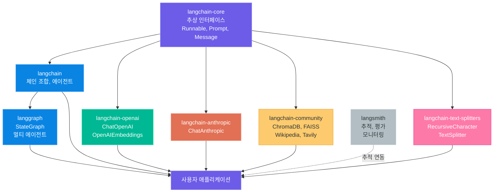
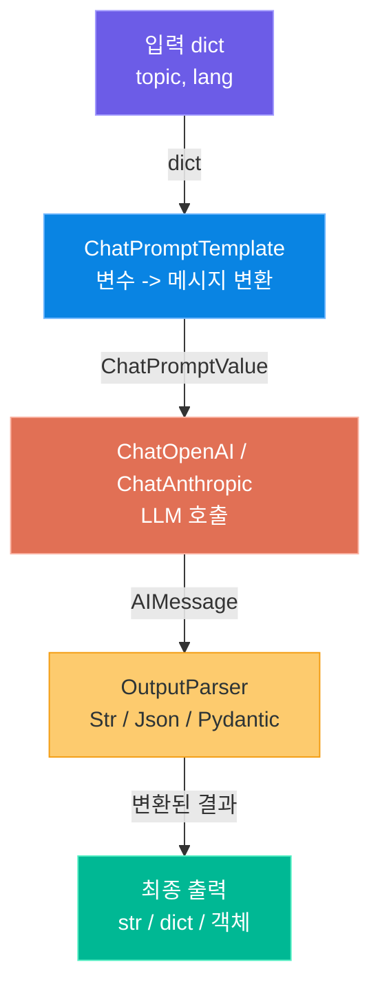
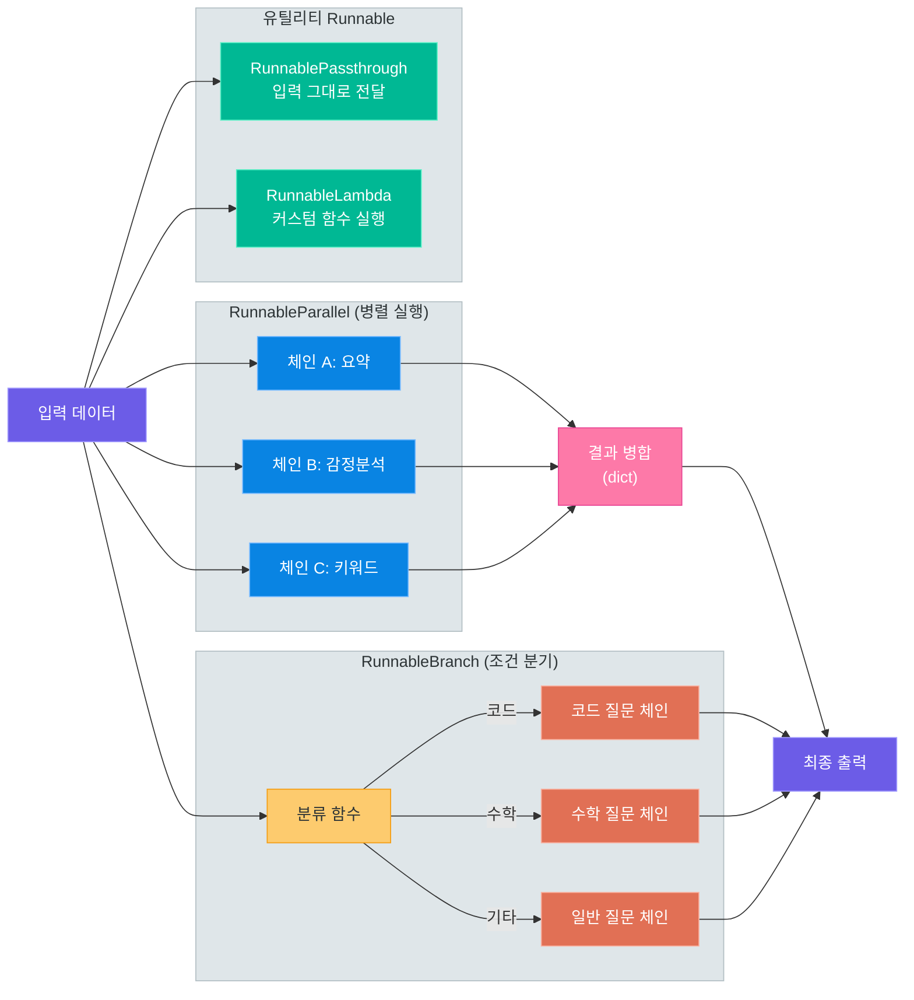
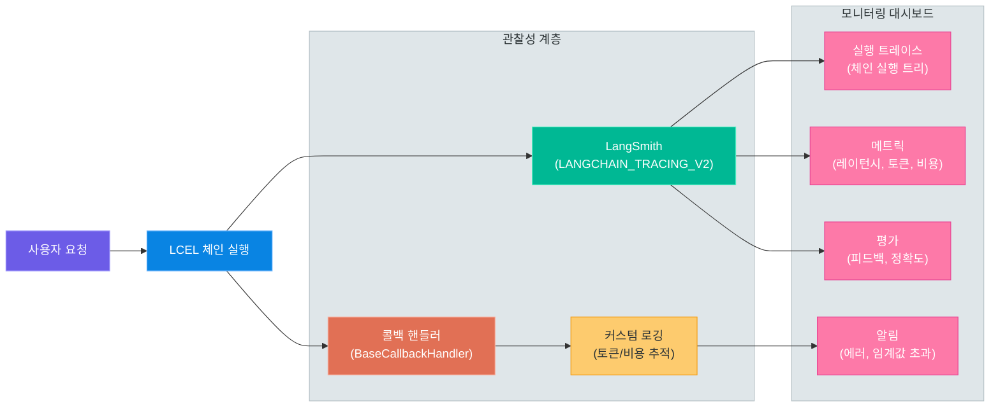

# LangChain LCEL (LangChain Expression Language)

> LLM 애플리케이션의 레고 블록 조립법 -- Runnable 인터페이스, 파이프 연산자, 병렬/분기 패턴부터 스트리밍과 관찰성까지, LangChain v0.3의 핵심 추상화를 완전 정복합니다

---

## 1. LangChain v0.3 패키지 생태계

### 패키지 분리의 배경

LangChain은 v0.2부터 **모놀리식 구조를 폐기**하고 패키지를 기능별로 분리했습니다. v0.3에서는 이 구조가 완전히 정착되어, 필요한 기능만 골라서 설치하는 **모듈형 아키텍처**를 채택하고 있습니다.

비유하자면, 과거에는 공구 전체 세트를 한 번에 구매해야 했지만, 이제는 드라이버만 필요하면 드라이버만, 망치만 필요하면 망치만 살 수 있는 구조입니다.

### 핵심 패키지 구조

| 패키지 | 역할 | 주요 클래스 |
|--------|------|-------------|
| `langchain-core` | 추상 인터페이스, LCEL 기반 클래스 | `Runnable`, `ChatPromptTemplate`, `BaseMessage` |
| `langchain` | 체인 조합, 에이전트 프레임워크 | `create_stuff_documents_chain`, `AgentExecutor` |
| `langchain-openai` | OpenAI 모델 바인딩 | `ChatOpenAI`, `OpenAIEmbeddings` |
| `langchain-anthropic` | Anthropic 모델 바인딩 | `ChatAnthropic` |
| `langchain-community` | 서드파티 통합 (DB, 검색 등) | `ChromaDB`, `FAISS`, `WikipediaLoader` |
| `langchain-text-splitters` | 문서 분할 유틸리티 | `RecursiveCharacterTextSplitter` |
| `langgraph` | 상태 기반 멀티 에이전트 그래프 | `StateGraph`, `MessageGraph` |
| `langsmith` | 추적, 평가, 모니터링 | LangSmith 대시보드 연동 |

### 설치

```bash
# install_langchain.sh -- LangChain v0.3 패키지 설치
# 핵심 패키지 (LCEL 사용에 필요한 최소 구성)
pip install langchain langchain-core

# LLM 프로바이더별 패키지
pip install langchain-openai      # OpenAI (GPT-4o, GPT-4o-mini)
pip install langchain-anthropic   # Anthropic (Claude 3.5 Sonnet, Claude Opus 4)

# 커뮤니티 통합 (벡터 DB, 도구 등)
pip install langchain-community

# 문서 분할
pip install langchain-text-splitters

# 전체 한 번에 설치
pip install langchain langchain-openai langchain-anthropic langchain-community
```

### LangChain 패키지 의존성 구조



> **핵심 포인트:** `langchain-core`가 모든 패키지의 기반입니다. LCEL의 `Runnable` 인터페이스, 프롬프트 템플릿, 메시지 타입 등 핵심 추상화가 여기에 정의되어 있으며, 나머지 패키지들은 이 인터페이스를 구현합니다. 불필요한 패키지를 설치하지 않으므로 의존성 충돌이 줄어듭니다.

---

## 2. Runnable 인터페이스

### 모든 것이 Runnable

LangChain v0.3에서 **모든 구성 요소는 `Runnable`** 인터페이스를 구현합니다. 프롬프트 템플릿, LLM, 출력 파서, 검색기(Retriever) 등 LCEL 체인에 참여하는 모든 객체가 동일한 메서드를 제공합니다.

비유하자면, USB 포트가 키보드, 마우스, 외장 하드 등 다양한 장치를 하나의 규격으로 연결하듯, `Runnable` 인터페이스는 다양한 AI 구성 요소를 하나의 규격으로 연결합니다.

### Runnable 핵심 메서드

| 메서드 | 동기/비동기 | 설명 | 반환값 |
|--------|-------------|------|--------|
| `invoke(input)` | 동기 | 단일 입력 처리 | 단일 출력 |
| `batch(inputs)` | 동기 | 여러 입력 일괄 처리 | 출력 리스트 |
| `stream(input)` | 동기 | 스트리밍 출력 (토큰 단위) | Iterator |
| `ainvoke(input)` | 비동기 | 비동기 단일 입력 처리 | Awaitable |
| `abatch(inputs)` | 비동기 | 비동기 일괄 처리 | Awaitable[List] |
| `astream(input)` | 비동기 | 비동기 스트리밍 | AsyncIterator |
| `astream_events(input)` | 비동기 | 체인 내부 이벤트 스트리밍 | AsyncIterator[Event] |

### 입력/출력 타입 규칙

각 Runnable 구성 요소는 고유한 입력/출력 타입을 갖습니다. 체인을 구성할 때 **앞 구성 요소의 출력 타입이 뒤 구성 요소의 입력 타입과 일치**해야 합니다.

| 구성 요소 | 입력 타입 | 출력 타입 |
|-----------|-----------|-----------|
| `ChatPromptTemplate` | `dict` | `ChatPromptValue` |
| `ChatOpenAI` / `ChatAnthropic` | `ChatPromptValue` 또는 `list[BaseMessage]` | `AIMessage` |
| `StrOutputParser` | `AIMessage` | `str` |
| `JsonOutputParser` | `AIMessage` | `dict` |
| `RunnableLambda` | 사용자 정의 | 사용자 정의 |
| `VectorStoreRetriever` | `str` | `list[Document]` |

### 코드 예제: 다양한 Runnable 실행 방식 비교

```python
# runnable_methods.py -- Runnable 인터페이스의 6가지 실행 방식
from langchain_openai import ChatOpenAI
from langchain_core.prompts import ChatPromptTemplate
from langchain_core.output_parsers import StrOutputParser
import asyncio

# 체인 구성: 프롬프트 → LLM → 파서
prompt = ChatPromptTemplate.from_template("{topic}에 대해 한 문장으로 설명해주세요.")
llm = ChatOpenAI(model="gpt-4o-mini", temperature=0)
parser = StrOutputParser()

chain = prompt | llm | parser

# 1. invoke — 단일 입력, 단일 출력
result = chain.invoke({"topic": "LCEL"})
print(f"invoke: {result}")

# 2. batch — 여러 입력을 한 번에 처리
results = chain.batch([
    {"topic": "LangChain"},
    {"topic": "RAG"},
    {"topic": "벡터 데이터베이스"},
])
for r in results:
    print(f"batch: {r}")

# 3. stream — 토큰 단위 스트리밍
for chunk in chain.stream({"topic": "프롬프트 엔지니어링"}):
    print(chunk, end="", flush=True)
print()

# 4~6. 비동기 버전
async def async_examples():
    # ainvoke
    result = await chain.ainvoke({"topic": "임베딩"})
    print(f"ainvoke: {result}")

    # abatch
    results = await chain.abatch([
        {"topic": "HNSW"},
        {"topic": "코사인 유사도"},
    ])
    for r in results:
        print(f"abatch: {r}")

    # astream
    async for chunk in chain.astream({"topic": "트랜스포머"}):
        print(chunk, end="", flush=True)
    print()

asyncio.run(async_examples())
```

### batch의 동시성 제어

`batch` 메서드는 `max_concurrency` 매개변수로 동시 실행 수를 제어할 수 있습니다. API 호출 제한(Rate Limit)이 있을 때 유용합니다.

```python
# batch_concurrency.py -- batch 동시성 제어
topics = [{"topic": f"주제_{i}"} for i in range(20)]

# 최대 5개씩 동시 실행 (API Rate Limit 대응)
results = chain.batch(topics, config={"max_concurrency": 5})
```

> **핵심 포인트:** `Runnable` 인터페이스를 이해하면 LangChain의 모든 구성 요소를 동일한 방식으로 다룰 수 있습니다. `invoke`로 시작하여, 성능이 필요하면 `batch`로, 실시간 응답이 필요하면 `stream`으로, 비동기 환경에서는 `a` 접두사 메서드로 전환하면 됩니다.

---

## 3. 기본 체인 구성

### 파이프 연산자 `|`로 체인 만들기

LCEL의 핵심은 **파이프 연산자 `|`** 입니다. Unix 셸의 파이프와 동일한 개념으로, 앞 구성 요소의 출력을 뒤 구성 요소의 입력으로 전달합니다.

```
prompt | llm | parser
```

이것은 다음과 동일합니다.

```python
parser.invoke(llm.invoke(prompt.invoke(input_data)))
```

그러나 파이프 연산자를 사용하면 **선언적으로** 체인을 정의할 수 있어 가독성이 훨씬 좋습니다.

### ChatPromptTemplate 사용법

`ChatPromptTemplate`은 LLM에 전달할 프롬프트를 구조화합니다. 시스템 메시지, 사용자 메시지, AI 메시지 등을 명확하게 분리할 수 있습니다.

```python
# prompt_template.py -- ChatPromptTemplate 다양한 생성 방식
from langchain_core.prompts import ChatPromptTemplate

# 방법 1: from_template (단순한 사용자 메시지만)
simple_prompt = ChatPromptTemplate.from_template(
    "{topic}에 대해 설명해주세요."
)

# 방법 2: from_messages (시스템 + 사용자 메시지)
chat_prompt = ChatPromptTemplate.from_messages([
    ("system", "당신은 {role} 전문가입니다. 한국어로 답변해주세요."),
    ("human", "{question}"),
])

# 방법 3: 대화 히스토리 포함
history_prompt = ChatPromptTemplate.from_messages([
    ("system", "당신은 친절한 AI 비서입니다."),
    ("human", "안녕하세요, 저는 {name}입니다."),
    ("ai", "안녕하세요 {name}님! 무엇을 도와드릴까요?"),
    ("human", "{question}"),
])

# 프롬프트 실행 (invoke)
result = chat_prompt.invoke({
    "role": "Python",
    "question": "리스트 컴프리헨션이 뭔가요?"
})
print(result)
# ChatPromptValue(messages=[
#   SystemMessage(content='당신은 Python 전문가입니다. 한국어로 답변해주세요.'),
#   HumanMessage(content='리스트 컴프리헨션이 뭔가요?')
# ])
```

### 출력 파서 3종

LLM의 응답(`AIMessage`)을 원하는 형식으로 변환하는 파서입니다.

| 파서 | 출력 타입 | 용도 |
|------|-----------|------|
| `StrOutputParser` | `str` | 텍스트 그대로 추출 |
| `JsonOutputParser` | `dict` | JSON 형식으로 파싱 |
| `PydanticOutputParser` | Pydantic 모델 | 구조화된 객체로 변환 |

### 코드 예제: 번역기 체인

```python
# translator_chain.py -- LCEL 기본 체인: 번역기
from langchain_openai import ChatOpenAI
from langchain_core.prompts import ChatPromptTemplate
from langchain_core.output_parsers import StrOutputParser

prompt = ChatPromptTemplate.from_messages([
    ("system", "당신은 전문 번역가입니다. {source_lang}을 {target_lang}으로 번역해주세요. 번역 결과만 출력하세요."),
    ("human", "{text}"),
])

llm = ChatOpenAI(model="gpt-4o-mini", temperature=0)
parser = StrOutputParser()

# 체인 조립: prompt → llm → parser
translator = prompt | llm | parser

# 실행
result = translator.invoke({
    "source_lang": "한국어",
    "target_lang": "영어",
    "text": "LangChain의 핵심은 LCEL 파이프 연산자입니다.",
})
print(result)
# "The core of LangChain is the LCEL pipe operator."
```

### 코드 예제: JSON 출력 체인

```python
# json_output_chain.py -- JSON 구조화 출력 체인
from langchain_openai import ChatOpenAI
from langchain_core.prompts import ChatPromptTemplate
from langchain_core.output_parsers import JsonOutputParser
from pydantic import BaseModel, Field

# Pydantic 모델로 출력 스키마 정의
class BookReview(BaseModel):
    title: str = Field(description="책 제목")
    author: str = Field(description="저자")
    rating: int = Field(description="1~5점 평점")
    summary: str = Field(description="한 줄 요약")
    keywords: list[str] = Field(description="핵심 키워드 3개")

parser = JsonOutputParser(pydantic_object=BookReview)

prompt = ChatPromptTemplate.from_messages([
    ("system", "당신은 도서 리뷰 전문가입니다.\n{format_instructions}"),
    ("human", "'{book_name}'에 대한 리뷰를 작성해주세요."),
])

llm = ChatOpenAI(model="gpt-4o-mini", temperature=0)

chain = prompt | llm | parser

result = chain.invoke({
    "book_name": "클린 코드",
    "format_instructions": parser.get_format_instructions(),
})
print(result)
# {
#     "title": "클린 코드",
#     "author": "로버트 C. 마틴",
#     "rating": 5,
#     "summary": "좋은 코드를 작성하기 위한 실용적인 가이드",
#     "keywords": ["클린코드", "리팩토링", "소프트웨어장인정신"]
# }
```

### LCEL 기본 체인 구조



> **핵심 포인트:** LCEL 체인의 기본 패턴은 `prompt | llm | parser` 입니다. 프롬프트가 dict를 받아 메시지로 변환하고, LLM이 메시지를 받아 AIMessage를 생성하며, 파서가 AIMessage를 원하는 형식으로 변환합니다. 이 세 단계의 입출력 타입 흐름을 이해하는 것이 LCEL의 핵심입니다.

---

## 4. 병렬과 분기

### RunnableParallel: 여러 체인 동시 실행

`RunnableParallel`은 여러 Runnable을 **동시에 실행**하고 결과를 dict로 합칩니다. API 호출을 병렬화하여 전체 응답 시간을 단축할 수 있습니다.

```python
# parallel_chain.py -- RunnableParallel로 병렬 실행
from langchain_core.runnables import RunnableParallel
from langchain_openai import ChatOpenAI
from langchain_core.prompts import ChatPromptTemplate
from langchain_core.output_parsers import StrOutputParser

llm = ChatOpenAI(model="gpt-4o-mini", temperature=0)
parser = StrOutputParser()

# 각각의 분석 체인 정의
summary_chain = (
    ChatPromptTemplate.from_template("{text}를 3줄로 요약해주세요.")
    | llm | parser
)

sentiment_chain = (
    ChatPromptTemplate.from_template("{text}의 감정을 긍정/부정/중립으로 분류해주세요.")
    | llm | parser
)

keyword_chain = (
    ChatPromptTemplate.from_template("{text}에서 핵심 키워드 5개를 추출해주세요.")
    | llm | parser
)

# 병렬 실행 — 세 체인이 동시에 실행됩니다
analysis_chain = RunnableParallel(
    summary=summary_chain,
    sentiment=sentiment_chain,
    keywords=keyword_chain,
)

result = analysis_chain.invoke({"text": "LangChain은 LLM 애플리케이션 개발을 위한 프레임워크입니다..."})
print(result["summary"])     # 요약 결과
print(result["sentiment"])   # 감정 분석 결과
print(result["keywords"])    # 키워드 추출 결과
```

### RunnablePassthrough: 입력 그대로 전달

`RunnablePassthrough`는 입력을 변환 없이 그대로 다음 단계로 전달합니다. RAG 패턴에서 **원본 질문을 유지**하면서 검색 결과를 추가할 때 자주 사용됩니다.

```python
# passthrough_rag.py -- RunnablePassthrough로 RAG 패턴 구현
from langchain_core.runnables import RunnablePassthrough, RunnableParallel
from langchain_openai import ChatOpenAI
from langchain_core.prompts import ChatPromptTemplate
from langchain_core.output_parsers import StrOutputParser

llm = ChatOpenAI(model="gpt-4o-mini")
parser = StrOutputParser()

# 가상의 검색 함수 (실제로는 벡터 DB Retriever 사용)
def fake_retriever(query: str) -> str:
    docs = {
        "LCEL": "LCEL은 LangChain Expression Language의 약자로, 체인을 선언적으로 구성하는 방법입니다.",
        "RAG": "RAG는 Retrieval-Augmented Generation으로, 검색을 통해 LLM 응답을 보강합니다.",
    }
    return docs.get(query, "관련 문서를 찾지 못했습니다.")

prompt = ChatPromptTemplate.from_template(
    """다음 컨텍스트를 기반으로 질문에 답변해주세요.

컨텍스트: {context}

질문: {question}"""
)

# RunnablePassthrough로 question은 그대로 전달, context는 검색
rag_chain = (
    RunnableParallel(
        context=lambda x: fake_retriever(x["question"]),
        question=RunnablePassthrough() | (lambda x: x["question"]),
    )
    | prompt
    | llm
    | parser
)

result = rag_chain.invoke({"question": "LCEL"})
print(result)
```

### RunnableBranch: 조건부 체인 분기

`RunnableBranch`는 입력 조건에 따라 **서로 다른 체인을 실행**합니다. if-elif-else 구문과 유사합니다.

```python
# branch_chain.py -- RunnableBranch로 질문 유형별 분기 처리
from langchain_core.runnables import RunnableBranch, RunnableLambda
from langchain_openai import ChatOpenAI
from langchain_core.prompts import ChatPromptTemplate
from langchain_core.output_parsers import StrOutputParser

llm = ChatOpenAI(model="gpt-4o-mini", temperature=0)
parser = StrOutputParser()

# 질문 유형별 전문 체인
code_chain = (
    ChatPromptTemplate.from_template(
        "당신은 시니어 개발자입니다. 코드 관련 질문에 답변해주세요.\n질문: {question}"
    ) | llm | parser
)

math_chain = (
    ChatPromptTemplate.from_template(
        "당신은 수학 교수입니다. 수학 관련 질문에 단계별로 풀어주세요.\n질문: {question}"
    ) | llm | parser
)

general_chain = (
    ChatPromptTemplate.from_template(
        "당신은 친절한 AI 비서입니다. 질문에 답변해주세요.\n질문: {question}"
    ) | llm | parser
)

# 질문 분류 함수
def classify_question(input_data: dict) -> str:
    question = input_data["question"].lower()
    if any(kw in question for kw in ["코드", "파이썬", "함수", "클래스", "프로그래밍", "python"]):
        return "code"
    elif any(kw in question for kw in ["계산", "수학", "미적분", "확률", "방정식"]):
        return "math"
    return "general"

# 조건부 분기
branch_chain = RunnableBranch(
    (lambda x: classify_question(x) == "code", code_chain),
    (lambda x: classify_question(x) == "math", math_chain),
    general_chain,  # 기본(default) 체인
)

# 테스트
print(branch_chain.invoke({"question": "파이썬에서 리스트 정렬 방법은?"}))
print(branch_chain.invoke({"question": "이차방정식 풀이를 알려주세요"}))
print(branch_chain.invoke({"question": "오늘 날씨가 어때요?"}))
```

### RunnableLambda: 커스텀 함수를 Runnable로

일반 Python 함수를 `RunnableLambda`로 감싸면 LCEL 체인에 참여시킬 수 있습니다.

```python
# lambda_chain.py -- RunnableLambda로 커스텀 처리 단계 추가
from langchain_core.runnables import RunnableLambda

# 일반 함수를 Runnable로 변환
def add_metadata(text: str) -> dict:
    return {
        "text": text,
        "length": len(text),
        "word_count": len(text.split()),
    }

def format_output(data: dict) -> str:
    return f"[{data['word_count']}단어] {data['text']}"

# 체인에 커스텀 처리 단계 삽입
chain = (
    ChatPromptTemplate.from_template("{topic}에 대해 한 문장으로 설명해주세요.")
    | llm
    | StrOutputParser()
    | RunnableLambda(add_metadata)
    | RunnableLambda(format_output)
)

result = chain.invoke({"topic": "LCEL"})
print(result)  # "[12단어] LCEL은 LangChain에서 체인을 선언적으로 구성하는 표현 언어입니다."
```

### 병렬/분기 패턴 구조



> **핵심 포인트:** `RunnableParallel`은 독립적인 여러 작업을 동시에 실행하여 시간을 절약합니다. `RunnableBranch`는 입력에 따라 적절한 전문 체인으로 라우팅합니다. `RunnablePassthrough`와 `RunnableLambda`는 체인 중간에 데이터를 조작하거나 유지하는 데 사용됩니다. 이 네 가지 패턴을 조합하면 대부분의 복잡한 AI 워크플로를 표현할 수 있습니다.

---

## 5. 메모리 -- RunnableWithMessageHistory

### 대화 히스토리의 필요성

LLM은 기본적으로 **상태를 유지하지 않습니다(Stateless)**. 이전 대화를 기억하지 못하므로, 매 요청마다 이전 대화 내용을 함께 전달해야 합니다. `RunnableWithMessageHistory`는 이 과정을 자동화합니다.

### ChatMessageHistory와 세션 관리

```python
# message_history.py -- ChatMessageHistory 기본 사용법
from langchain_community.chat_message_histories import ChatMessageHistory
from langchain_core.messages import HumanMessage, AIMessage

# 세션별 히스토리 저장소
store = {}

def get_session_history(session_id: str) -> ChatMessageHistory:
    """세션 ID별로 대화 히스토리를 반환합니다."""
    if session_id not in store:
        store[session_id] = ChatMessageHistory()
    return store[session_id]

# 수동으로 메시지 추가 (테스트용)
history = get_session_history("user_001")
history.add_user_message("안녕하세요!")
history.add_ai_message("안녕하세요! 무엇을 도와드릴까요?")

print(history.messages)
# [HumanMessage(content='안녕하세요!'),
#  AIMessage(content='안녕하세요! 무엇을 도와드릴까요?')]
```

### 코드 예제: 대화형 챗봇 체인

```python
# chatbot_with_memory.py -- RunnableWithMessageHistory를 이용한 대화형 챗봇
from langchain_openai import ChatOpenAI
from langchain_core.prompts import ChatPromptTemplate, MessagesPlaceholder
from langchain_core.output_parsers import StrOutputParser
from langchain_core.runnables.history import RunnableWithMessageHistory
from langchain_community.chat_message_histories import ChatMessageHistory

# 세션 저장소
store = {}

def get_session_history(session_id: str) -> ChatMessageHistory:
    if session_id not in store:
        store[session_id] = ChatMessageHistory()
    return store[session_id]

# 프롬프트: MessagesPlaceholder로 히스토리 자리 확보
prompt = ChatPromptTemplate.from_messages([
    ("system", "당신은 친절한 AI 비서입니다. 이전 대화를 참고하여 답변하세요."),
    MessagesPlaceholder(variable_name="history"),
    ("human", "{input}"),
])

llm = ChatOpenAI(model="gpt-4o-mini", temperature=0.7)
parser = StrOutputParser()

# 기본 체인
chain = prompt | llm | parser

# 메모리를 자동으로 관리하는 래퍼
chatbot = RunnableWithMessageHistory(
    chain,
    get_session_history,
    input_messages_key="input",
    history_messages_key="history",
)

# 대화 시뮬레이션 — session_id로 사용자 구분
config = {"configurable": {"session_id": "user_001"}}

response1 = chatbot.invoke(
    {"input": "안녕하세요, 저는 박수현이에요."},
    config=config,
)
print(f"AI: {response1}")

response2 = chatbot.invoke(
    {"input": "제 이름이 뭐라고 했죠?"},
    config=config,
)
print(f"AI: {response2}")
# AI: 박수현님이라고 하셨습니다!

# 다른 세션 — 이전 대화를 모름
config2 = {"configurable": {"session_id": "user_002"}}
response3 = chatbot.invoke(
    {"input": "제 이름이 뭐라고 했죠?"},
    config=config2,
)
print(f"AI: {response3}")
# AI: 아직 이름을 말씀해주시지 않으셨는데요!
```

### Redis 기반 영구 히스토리 저장

프로덕션 환경에서는 메모리 대신 **Redis** 등 외부 저장소를 사용합니다.

```python
# redis_history.py -- Redis 기반 대화 히스토리 (프로덕션 패턴)
from langchain_community.chat_message_histories import RedisChatMessageHistory

def get_redis_history(session_id: str) -> RedisChatMessageHistory:
    return RedisChatMessageHistory(
        session_id=session_id,
        url="redis://localhost:6379",
        ttl=3600,  # 1시간 후 자동 만료
    )

# 나머지는 동일하게 RunnableWithMessageHistory에 연결
chatbot = RunnableWithMessageHistory(
    chain,
    get_redis_history,
    input_messages_key="input",
    history_messages_key="history",
)
```

### 히스토리 길이 제한

대화가 길어지면 토큰 비용이 급증합니다. 최근 N개 메시지만 유지하는 전략이 필요합니다.

```python
# trimmed_history.py -- 최근 메시지만 유지하는 히스토리 트리밍
from langchain_core.messages import trim_messages

trimmer = trim_messages(
    max_tokens=1000,
    strategy="last",           # 최근 메시지 우선
    token_counter=llm,         # LLM 토크나이저로 토큰 수 계산
    include_system=True,       # 시스템 메시지는 항상 포함
    allow_partial=False,
)

# 트리머를 체인에 삽입
chain = trimmer | prompt | llm | parser
```

> **핵심 포인트:** `RunnableWithMessageHistory`는 `session_id`별로 대화 히스토리를 자동 관리합니다. 개발 시에는 `ChatMessageHistory`(메모리), 프로덕션에서는 `RedisChatMessageHistory`(Redis)를 사용합니다. 토큰 비용 관리를 위해 `trim_messages`로 히스토리 길이를 제한하는 것이 실무에서 중요합니다.

---

## 6. 스트리밍 심화

### astream_events v2: 체인 내부 이벤트 스트리밍

`astream`은 최종 출력만 스트리밍하지만, `astream_events`는 체인 내부의 **모든 구성 요소에서 발생하는 이벤트**를 스트리밍합니다. 디버깅, 진행 상황 표시, 중간 결과 확인에 매우 유용합니다.

### 이벤트 타입

| 이벤트 타입 | 발생 시점 | 주요 데이터 |
|-------------|-----------|-------------|
| `on_chain_start` | 체인 실행 시작 | 입력 데이터 |
| `on_chain_end` | 체인 실행 완료 | 최종 출력 |
| `on_chat_model_start` | LLM 호출 시작 | 프롬프트 메시지 |
| `on_chat_model_stream` | LLM 토큰 생성 | 생성된 토큰 청크 |
| `on_chat_model_end` | LLM 호출 완료 | 전체 응답 |
| `on_prompt_start` | 프롬프트 렌더링 시작 | 입력 변수 |
| `on_prompt_end` | 프롬프트 렌더링 완료 | 렌더링된 메시지 |
| `on_parser_start` | 파서 실행 시작 | 파서 입력 |
| `on_parser_end` | 파서 실행 완료 | 파싱된 결과 |
| `on_retriever_start` | 검색 시작 | 쿼리 |
| `on_retriever_end` | 검색 완료 | 검색 결과 문서 |

### 코드 예제: astream_events로 중간 과정 추적

```python
# astream_events_example.py -- 체인 내부 이벤트 스트리밍
import asyncio
from langchain_openai import ChatOpenAI
from langchain_core.prompts import ChatPromptTemplate
from langchain_core.output_parsers import StrOutputParser

prompt = ChatPromptTemplate.from_template("{topic}에 대해 설명해주세요.")
llm = ChatOpenAI(model="gpt-4o-mini", temperature=0)
parser = StrOutputParser()

chain = prompt | llm | parser

async def stream_events():
    async for event in chain.astream_events(
        {"topic": "LCEL"},
        version="v2",
    ):
        kind = event["event"]

        if kind == "on_chain_start":
            print(f"[체인 시작] {event['name']}")

        elif kind == "on_chat_model_stream":
            # LLM이 생성하는 토큰을 실시간으로 출력
            chunk = event["data"]["chunk"]
            print(chunk.content, end="", flush=True)

        elif kind == "on_chain_end":
            print(f"\n[체인 완료] {event['name']}")

asyncio.run(stream_events())
```

### FastAPI SSE 연동: StreamingResponse + astream_events

실제 웹 애플리케이션에서 LCEL 스트리밍을 사용하는 가장 일반적인 패턴입니다. **Server-Sent Events(SSE)** 를 통해 클라이언트에 실시간으로 토큰을 전달합니다.

```python
# fastapi_streaming.py -- FastAPI SSE를 활용한 스트리밍 RAG 엔드포인트
from fastapi import FastAPI
from fastapi.responses import StreamingResponse
from langchain_openai import ChatOpenAI
from langchain_core.prompts import ChatPromptTemplate
from langchain_core.output_parsers import StrOutputParser
from pydantic import BaseModel
import json

app = FastAPI()

prompt = ChatPromptTemplate.from_messages([
    ("system", "당신은 도움이 되는 AI 비서입니다. 한국어로 답변해주세요."),
    ("human", "{question}"),
])

llm = ChatOpenAI(model="gpt-4o-mini", temperature=0.7, streaming=True)
parser = StrOutputParser()

chain = prompt | llm | parser

class QuestionRequest(BaseModel):
    question: str

@app.post("/chat/stream")
async def chat_stream(request: QuestionRequest):
    """SSE 방식으로 LLM 응답을 스트리밍합니다."""

    async def event_generator():
        async for chunk in chain.astream({"question": request.question}):
            # SSE 형식으로 각 토큰을 전송
            data = json.dumps({"token": chunk}, ensure_ascii=False)
            yield f"data: {data}\n\n"
        yield "data: [DONE]\n\n"

    return StreamingResponse(
        event_generator(),
        media_type="text/event-stream",
        headers={
            "Cache-Control": "no-cache",
            "Connection": "keep-alive",
        },
    )

@app.post("/chat/stream-events")
async def chat_stream_events(request: QuestionRequest):
    """astream_events로 체인 내부 이벤트까지 스트리밍합니다."""

    async def event_generator():
        async for event in chain.astream_events(
            {"question": request.question},
            version="v2",
        ):
            if event["event"] == "on_chat_model_stream":
                token = event["data"]["chunk"].content
                data = json.dumps({
                    "type": "token",
                    "content": token,
                }, ensure_ascii=False)
                yield f"data: {data}\n\n"

            elif event["event"] == "on_chain_end" and event["name"] == "RunnableSequence":
                data = json.dumps({"type": "done"}, ensure_ascii=False)
                yield f"data: {data}\n\n"

    return StreamingResponse(
        event_generator(),
        media_type="text/event-stream",
    )
```

### 프론트엔드 SSE 소비 코드

```javascript
// stream_client.js -- 프론트엔드에서 SSE 스트리밍 소비
const response = await fetch("/chat/stream", {
    method: "POST",
    headers: { "Content-Type": "application/json" },
    body: JSON.stringify({ question: "LCEL이란 무엇인가요?" }),
});

const reader = response.body.getReader();
const decoder = new TextDecoder();

while (true) {
    const { done, value } = await reader.read();
    if (done) break;

    const text = decoder.decode(value);
    const lines = text.split("\n").filter(line => line.startsWith("data: "));

    for (const line of lines) {
        const data = line.slice(6); // "data: " 제거
        if (data === "[DONE]") {
            console.log("\n스트리밍 완료");
            break;
        }
        const parsed = JSON.parse(data);
        process.stdout.write(parsed.token); // 토큰 단위 출력
    }
}
```

### astream vs astream_events 비교

| 항목 | `astream` | `astream_events` |
|------|-----------|-------------------|
| 출력 대상 | 최종 출력(파서 결과)만 | 체인 내부 모든 구성 요소 |
| 사용 난이도 | 쉬움 | 중간 |
| 용도 | 단순 토큰 스트리밍 | 디버깅, 진행 상황, 중간 결과 |
| 이벤트 필터링 | 불가 | 이벤트 타입별 필터링 가능 |
| 권장 상황 | 프로덕션 채팅 UI | 개발/디버깅, 복잡한 RAG |

> **핵심 포인트:** `astream`은 최종 결과를 토큰 단위로 스트리밍하여 채팅 UI에 적합합니다. `astream_events`는 체인 내부의 모든 이벤트를 감시하여 디버깅과 모니터링에 적합합니다. FastAPI의 `StreamingResponse`와 SSE를 결합하면 실시간 AI 채팅 서비스를 구현할 수 있습니다.

---

## 7. 콜백과 관찰성

### BaseCallbackHandler 커스텀 구현

LangChain의 콜백 시스템은 체인 실행 과정을 **가로채서 관찰**할 수 있는 메커니즘입니다. 로깅, 토큰 사용량 추적, 비용 계산, 에러 모니터링 등에 활용됩니다.

```python
# custom_callback.py -- 토큰 사용량 추적 콜백 핸들러
from langchain_core.callbacks import BaseCallbackHandler
from langchain_openai import ChatOpenAI
from langchain_core.prompts import ChatPromptTemplate
from langchain_core.output_parsers import StrOutputParser
from typing import Any
import time

class TokenUsageCallback(BaseCallbackHandler):
    """LLM 호출의 토큰 사용량과 비용을 추적하는 콜백"""

    def __init__(self):
        self.total_input_tokens = 0
        self.total_output_tokens = 0
        self.total_cost = 0.0
        self.call_count = 0
        self.start_time = None

    def on_llm_start(self, serialized: dict, prompts: list, **kwargs: Any) -> None:
        self.start_time = time.time()
        self.call_count += 1
        print(f"[LLM 호출 #{self.call_count}] 시작...")

    def on_llm_end(self, response: Any, **kwargs: Any) -> None:
        elapsed = time.time() - self.start_time

        # 토큰 사용량 추출
        if response.llm_output and "token_usage" in response.llm_output:
            usage = response.llm_output["token_usage"]
            input_tokens = usage.get("prompt_tokens", 0)
            output_tokens = usage.get("completion_tokens", 0)

            self.total_input_tokens += input_tokens
            self.total_output_tokens += output_tokens

            # GPT-4o-mini 기준 비용 계산
            cost = (input_tokens * 0.15 + output_tokens * 0.60) / 1_000_000
            self.total_cost += cost

            print(f"[LLM 호출 #{self.call_count}] 완료 ({elapsed:.2f}초)")
            print(f"  입력: {input_tokens} 토큰, 출력: {output_tokens} 토큰")
            print(f"  비용: ${cost:.6f}")

    def on_llm_error(self, error: Exception, **kwargs: Any) -> None:
        print(f"[LLM 에러] {error}")

    def print_summary(self):
        print(f"\n{'='*50}")
        print(f"총 호출 수: {self.call_count}")
        print(f"총 입력 토큰: {self.total_input_tokens}")
        print(f"총 출력 토큰: {self.total_output_tokens}")
        print(f"총 비용: ${self.total_cost:.6f}")
        print(f"{'='*50}")

# 콜백 사용
callback = TokenUsageCallback()

prompt = ChatPromptTemplate.from_template("{topic}에 대해 설명해주세요.")
llm = ChatOpenAI(model="gpt-4o-mini", temperature=0)
parser = StrOutputParser()

chain = prompt | llm | parser

# config에 callbacks 전달
result1 = chain.invoke(
    {"topic": "LCEL"},
    config={"callbacks": [callback]},
)

result2 = chain.invoke(
    {"topic": "RAG"},
    config={"callbacks": [callback]},
)

callback.print_summary()
# ==================================================
# 총 호출 수: 2
# 총 입력 토큰: 48
# 총 출력 토큰: 256
# 총 비용: $0.000161
# ==================================================
```

### LangSmith 연동

**LangSmith**는 LangChain 팀이 만든 관찰성(Observability) 플랫폼입니다. 환경 변수만 설정하면 모든 체인 실행이 자동으로 추적됩니다.

```bash
# .env -- LangSmith 환경 변수 설정
LANGCHAIN_TRACING_V2=true
LANGCHAIN_API_KEY=lsv2_pt_xxxxxxxxxxxx
LANGCHAIN_PROJECT=my-lcel-project
```

```python
# langsmith_setup.py -- LangSmith 연동 설정
import os

# 환경 변수 설정 (코드에서 직접 설정하는 경우)
os.environ["LANGCHAIN_TRACING_V2"] = "true"
os.environ["LANGCHAIN_API_KEY"] = "lsv2_pt_xxxxxxxxxxxx"
os.environ["LANGCHAIN_PROJECT"] = "my-lcel-project"

# 이후 모든 체인 실행이 LangSmith 대시보드에 자동 기록됩니다
chain = prompt | llm | parser
result = chain.invoke({"topic": "LCEL"})
# LangSmith 대시보드에서 확인 가능:
# - 각 단계별 입출력
# - 토큰 사용량
# - 레이턴시
# - 에러 트레이스
```

### LangSmith가 추적하는 정보

| 추적 항목 | 설명 |
|-----------|------|
| 체인 실행 트리 | 각 Runnable의 호출 순서와 계층 구조 |
| 입력/출력 데이터 | 각 단계의 정확한 입력과 출력 |
| 토큰 사용량 | 프롬프트 토큰, 생성 토큰, 총 토큰 |
| 레이턴시 | 각 단계별 소요 시간 |
| 에러 로그 | 에러 발생 지점과 스택 트레이스 |
| 모델 정보 | 사용된 모델명, 파라미터 (temperature 등) |
| 피드백 | 사용자 평가 (좋아요/싫어요, 점수) |

### 관찰성 파이프라인



> **핵심 포인트:** 프로덕션 AI 서비스에서 관찰성은 선택이 아닌 필수입니다. `BaseCallbackHandler`로 토큰 비용을 추적하고, LangSmith로 체인 실행을 시각화하면 디버깅과 최적화가 훨씬 수월해집니다. `LANGCHAIN_TRACING_V2=true` 환경 변수 한 줄이면 LangSmith 연동이 완료됩니다.

---

## 8. 핵심 정리

### LCEL 패턴 정리표

| 패턴 | 핵심 클래스/연산자 | 설명 | 사용 예시 |
|------|-------------------|------|-----------|
| 기본 체인 | `\|` (파이프) | 구성 요소를 순차 연결 | `prompt \| llm \| parser` |
| 병렬 실행 | `RunnableParallel` | 여러 체인 동시 실행 | 요약 + 감정분석 + 키워드 동시 처리 |
| 입력 전달 | `RunnablePassthrough` | 입력을 그대로 전달 | RAG에서 원본 질문 유지 |
| 조건 분기 | `RunnableBranch` | 조건에 따라 다른 체인 실행 | 질문 유형별 전문 체인 라우팅 |
| 커스텀 함수 | `RunnableLambda` | Python 함수를 Runnable로 변환 | 후처리, 데이터 변환 |
| 대화 메모리 | `RunnableWithMessageHistory` | 세션별 대화 히스토리 관리 | 챗봇 대화 유지 |
| 동기 실행 | `invoke` / `batch` | 결과를 기다려서 반환 | 배치 처리, 단순 호출 |
| 스트리밍 | `stream` / `astream` | 토큰 단위 실시간 출력 | 채팅 UI 실시간 응답 |
| 이벤트 추적 | `astream_events` | 체인 내부 이벤트 스트리밍 | 디버깅, 진행 상황 표시 |
| 관찰성 | `BaseCallbackHandler` + LangSmith | 실행 추적, 비용 모니터링 | 프로덕션 모니터링 |

### Runnable 메서드 선택 가이드

| 상황 | 권장 메서드 | 이유 |
|------|-------------|------|
| 단순 1회 호출 | `invoke` | 가장 단순, 동기 처리 |
| 여러 입력 일괄 처리 | `batch` | 자동 병렬화, Rate Limit 제어 |
| 채팅 UI 실시간 출력 | `stream` / `astream` | 사용자 경험 향상 |
| FastAPI 비동기 엔드포인트 | `ainvoke` / `astream` | 이벤트 루프 호환 |
| 체인 디버깅 | `astream_events` | 각 단계별 입출력 확인 |
| 대량 데이터 처리 | `abatch(max_concurrency=N)` | 동시성 제어 + 비동기 |

### 출력 파서 선택 가이드

| 파서 | 출력 | 장점 | 단점 |
|------|------|------|------|
| `StrOutputParser` | `str` | 단순, 스트리밍 완벽 지원 | 구조화 불가 |
| `JsonOutputParser` | `dict` | JSON 구조화, 스키마 힌트 | 파싱 실패 가능 |
| `PydanticOutputParser` | Pydantic 객체 | 타입 검증, IDE 자동완성 | 스트리밍 제한적 |

### 프로덕션 체크리스트

| 항목 | 구현 방법 | 중요도 |
|------|-----------|--------|
| 스트리밍 응답 | `astream` + FastAPI SSE | 높음 |
| 에러 핸들링 | `chain.with_fallbacks([backup_chain])` | 높음 |
| 토큰 비용 추적 | `BaseCallbackHandler` 커스텀 구현 | 높음 |
| 실행 추적 | LangSmith `LANGCHAIN_TRACING_V2=true` | 높음 |
| 대화 메모리 | `RunnableWithMessageHistory` + Redis | 중간 |
| Rate Limit 대응 | `batch(max_concurrency=N)` | 중간 |
| 히스토리 트리밍 | `trim_messages(max_tokens=N)` | 중간 |
| 타임아웃 설정 | `chain.with_config({"timeout": 30})` | 중간 |

### 자주 하는 실수와 해결법

| 실수 | 원인 | 해결 |
|------|------|------|
| `TypeError: dict is not a BaseMessage` | 체인 입출력 타입 불일치 | 각 구성 요소의 입력/출력 타입 확인 |
| 스트리밍이 한 번에 출력됨 | 파서가 전체 결과를 버퍼링 | `StrOutputParser` 사용 또는 파서 없이 직접 처리 |
| `RunnableWithMessageHistory` 에러 | `input_messages_key` 미지정 | 프롬프트의 변수명과 `input_messages_key`를 일치시킴 |
| LangSmith에 추적이 안 됨 | 환경 변수 미설정 | `LANGCHAIN_TRACING_V2=true`와 `LANGCHAIN_API_KEY` 확인 |
| `batch`에서 Rate Limit 에러 | 동시 요청 과다 | `config={"max_concurrency": 3}` 설정 |
| 메모리 히스토리 초기화 안됨 | 서버 재시작 시 메모리 초기화 | Redis 등 영구 저장소 사용 |

### Key Takeaways

1. **LCEL의 핵심은 `|` 파이프 연산자입니다.** `prompt | llm | parser` 패턴으로 선언적 체인을 구성하면, 자동으로 스트리밍, 비동기, 배치를 지원합니다.

2. **모든 구성 요소는 Runnable입니다.** `invoke`, `stream`, `batch`와 그 비동기 버전(`ainvoke`, `astream`, `abatch`) 6가지 메서드를 동일하게 사용할 수 있습니다.

3. **병렬과 분기로 복잡한 워크플로를 표현합니다.** `RunnableParallel`로 동시 실행, `RunnableBranch`로 조건 분기, `RunnablePassthrough`로 데이터 유지, `RunnableLambda`로 커스텀 변환을 구현합니다.

4. **프로덕션에서는 관찰성이 필수입니다.** LangSmith 연동과 커스텀 콜백으로 토큰 비용, 레이턴시, 에러를 모니터링해야 합니다.

5. **스트리밍은 사용자 경험의 핵심입니다.** FastAPI의 `StreamingResponse`와 LCEL의 `astream`을 결합하면 ChatGPT와 같은 실시간 응답 경험을 구현할 수 있습니다.

---

### 다음 강의 미리보기

다음 강의에서는 **멀티모달 AI**를 다룹니다. 텍스트뿐만 아니라 이미지, 오디오, 비디오를 함께 처리하는 멀티모달 LLM 활용법을 학습합니다. GPT-4o의 이미지 이해, 음성 입출력, LangChain의 멀티모달 체인 구성 등 실무에서 점점 중요해지는 멀티모달 AI 패턴을 경험하게 됩니다.

---
