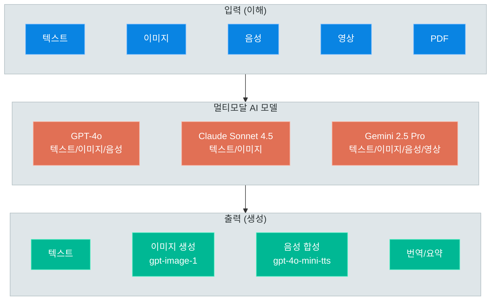
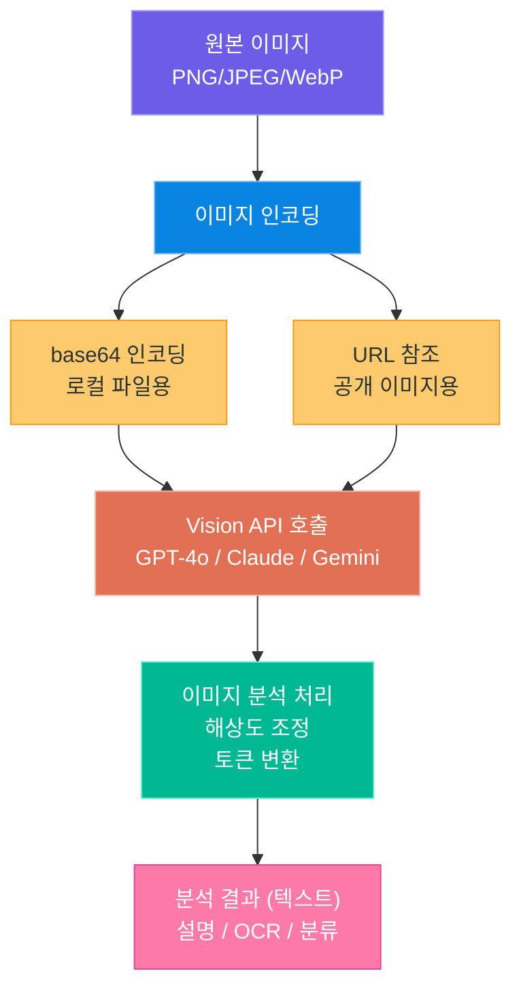
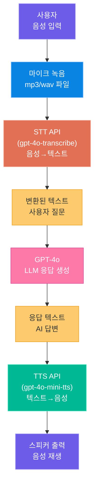
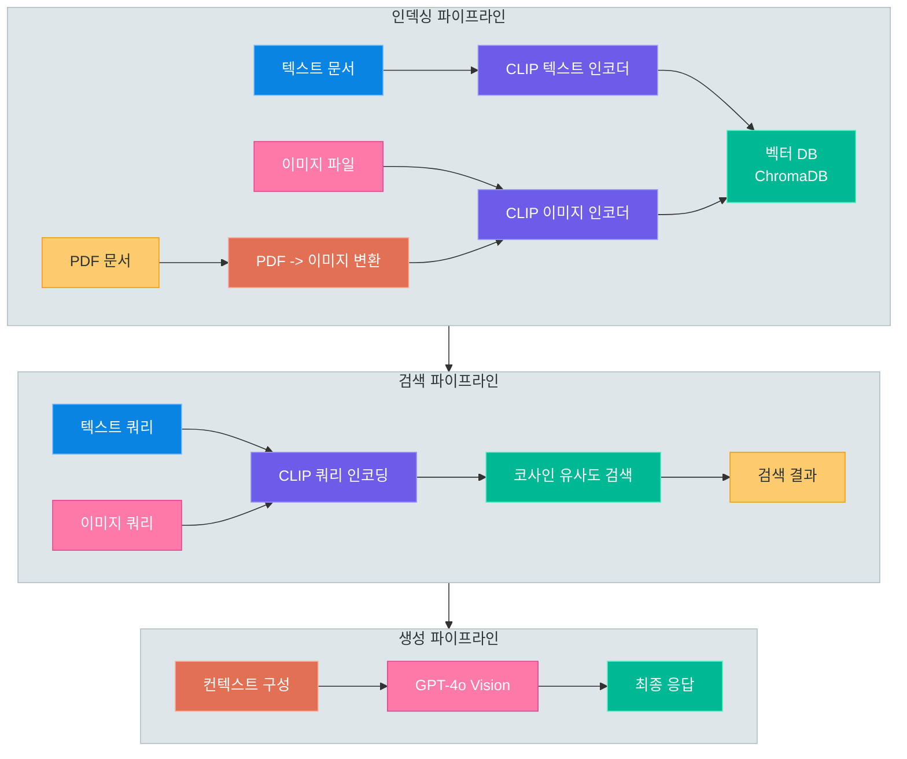

# 멀티모달 AI

> 텍스트를 넘어 이미지, 음성, 문서까지 — 하나의 AI가 여러 감각을 동시에 이해하고 생성하는 멀티모달 AI의 원리와 실전 활용법을 학습합니다

---

## 1. 멀티모달 AI 개요

### 멀티모달이란 무엇인가

**멀티모달(Multimodal)**이란 텍스트, 이미지, 음성, 영상 등 **여러 종류의 데이터(모달리티)**를 동시에 처리할 수 있는 AI 능력을 의미합니다. 기존의 LLM은 텍스트만 입력받아 텍스트를 출력하는 단일 모달(Unimodal) 방식이었지만, 최신 모델들은 이미지를 보고 설명하거나, 음성을 듣고 텍스트로 변환하거나, 텍스트 설명으로 이미지를 생성하는 등 다양한 모달리티를 넘나들 수 있습니다.

### 입력 멀티모달 vs 출력 멀티모달

멀티모달 능력은 크게 두 가지로 구분할 수 있습니다.

| 구분 | 설명 | 예시 |
|------|------|------|
| **입력 멀티모달** | 다양한 형식의 데이터를 이해하는 능력 | 이미지를 보고 내용 설명, 음성을 듣고 텍스트 변환 |
| **출력 멀티모달** | 다양한 형식의 데이터를 생성하는 능력 | 텍스트로 이미지 생성, 텍스트를 음성으로 변환 |

현재 대부분의 모델은 **입력 멀티모달**에 강점을 보이며, 출력 멀티모달은 특화된 모델(DALL-E, TTS 등)과의 조합을 통해 구현합니다. GPT-4o처럼 텍스트, 이미지, 음성을 모두 입출력하는 통합 멀티모달 모델도 등장하고 있습니다.

### 모델별 멀티모달 지원 매트릭스

| 기능 | GPT-4o | Claude Sonnet 4.5 | Gemini 2.5 Pro |
|------|--------|-------------------|----------------|
| 텍스트 입력 | O | O | O |
| 텍스트 출력 | O | O | O |
| 이미지 이해 | O | O | O |
| 이미지 생성 | O (gpt-image-1) | X | O (Imagen 3) |
| 음성 입력 (STT) | O (gpt-4o-transcribe) | X | O (내장) |
| 음성 출력 (TTS) | O (gpt-4o-mini-tts) | X | O (내장) |
| 영상 이해 | O (프레임 추출) | X | O (네이티브) |
| PDF 직접 입력 | X (이미지 변환) | O | O (네이티브) |

### 멀티모달 입출력 모델 매트릭스



> **핵심 포인트:** 멀티모달 AI는 "입력을 이해하는 능력"과 "출력을 생성하는 능력"으로 나뉩니다. 현재 GPT-4o가 가장 넓은 멀티모달 커버리지를 제공하며, Gemini(2.5)는 영상 이해에서, Claude(Sonnet 4.5)는 문서 분석에서 각각 강점을 보입니다.

---

## 2. Vision — 이미지 이해

### Vision API의 핵심 개념

Vision API는 이미지를 입력으로 받아 그 내용을 이해하고 텍스트로 설명하는 기능입니다. 단순한 이미지 인식(OCR)을 넘어, 이미지의 맥락, 분위기, 관계, 의도까지 파악할 수 있습니다.

| 활용 분야 | 설명 | 예시 |
|-----------|------|------|
| 이미지 설명 | 사진의 내용을 자연어로 설명 | 제품 사진 → 상세 설명 자동 생성 |
| OCR + 이해 | 문서/영수증의 텍스트 추출 및 해석 | 영수증 → 항목별 금액 정리 |
| 차트 분석 | 그래프/차트의 데이터 해석 | 매출 차트 → 트렌드 분석 보고서 |
| UI 분석 | 화면 캡처에서 UI 요소 파악 | 앱 화면 → 접근성 개선 제안 |
| 의료/과학 | 의료 이미지, 현미경 사진 분석 | X-ray → 소견 초안 작성 |

### GPT-4o Vision: base64 인코딩과 URL 전달

OpenAI의 GPT-4o는 두 가지 방식으로 이미지를 입력받습니다. **URL 직접 전달**은 공개된 이미지에, **base64 인코딩**은 로컬 파일이나 비공개 이미지에 사용합니다.

### Claude Vision: Image Content Block

Anthropic의 Claude는 `image` 타입의 content block을 사용합니다. base64 인코딩된 이미지 데이터를 `source` 필드에 포함하며, `media_type`을 명시해야 합니다.

### Gemini Vision: Part.from_bytes

Google의 Gemini는 `Part.from_bytes()` 또는 `Part.from_uri()`를 사용합니다. Gemini 2.5 Pro는 최대 수천 개의 이미지를 단일 프롬프트에 포함할 수 있는 압도적인 컨텍스트 윈도우를 제공합니다.

### 해상도/토큰/비용 비교

| 항목 | GPT-4o | Claude Sonnet 4.5 | Gemini 2.5 Pro |
|------|--------|-------------------|----------------|
| 최대 이미지 크기 | 20MB | 5MB (base64) | 20MB |
| 지원 형식 | PNG, JPEG, GIF, WebP | PNG, JPEG, GIF, WebP | PNG, JPEG, GIF, WebP, PDF |
| 이미지당 토큰 (저해상도) | ~85 토큰 | ~1,600 토큰 | ~258 토큰 |
| 이미지당 토큰 (고해상도) | ~170-1,105 토큰 | ~1,600 토큰 | ~258 토큰 |
| 최대 이미지 수/요청 | 제한 없음 (토큰 한도 내) | 20장 | 3,600장 |
| 자동 해상도 조절 | O (low/high/auto) | X (자동 조절) | O (자동) |
| 비용 기준 (입력) | $2.50 / 1M 토큰 | $3.00 / 1M 토큰 | $1.25 / 1M 토큰 |

### 코드 예제: 3사 Vision API 비교

```python
# multimodal_vision_compare.py -- 동일 이미지로 GPT-4o, Claude, Gemini Vision 비교

import base64
from openai import OpenAI
import anthropic
from google import genai
from google.genai import types

# --- 공통: 이미지 로드 및 base64 인코딩 ---
image_path = "sample_chart.png"
with open(image_path, "rb") as f:
    image_bytes = f.read()
image_base64 = base64.standard_b64encode(image_bytes).decode("utf-8")

prompt = "이 차트를 분석하고, 주요 트렌드와 인사이트를 한국어로 설명해 주세요."


# --- 1. GPT-4o Vision ---
def analyze_with_gpt4o():
    client = OpenAI()
    response = client.chat.completions.create(
        model="gpt-4o",
        messages=[
            {
                "role": "user",
                "content": [
                    {"type": "text", "text": prompt},
                    {
                        "type": "image_url",
                        "image_url": {
                            "url": f"data:image/png;base64,{image_base64}",
                            "detail": "high"  # low, high, auto
                        }
                    }
                ]
            }
        ],
        max_completion_tokens=1000
    )
    return response.choices[0].message.content


# --- 2. Claude Vision ---
def analyze_with_claude():
    client = anthropic.Anthropic()
    response = client.messages.create(
        model="claude-sonnet-4-6",
        max_tokens=1000,
        messages=[
            {
                "role": "user",
                "content": [
                    {
                        "type": "image",
                        "source": {
                            "type": "base64",
                            "media_type": "image/png",
                            "data": image_base64
                        }
                    },
                    {
                        "type": "text",
                        "text": prompt
                    }
                ]
            }
        ]
    )
    return response.content[0].text


# --- 3. Gemini Vision ---
def analyze_with_gemini():
    # API 키는 GEMINI_API_KEY 환경변수에서 자동으로 읽어옵니다.
    client = genai.Client()

    image_part = types.Part.from_bytes(
        data=image_bytes,
        mime_type="image/png"
    )
    response = client.models.generate_content(
        model="gemini-2.5-flash",
        contents=[prompt, image_part]
    )
    return response.text


# --- 비교 실행 ---
if __name__ == "__main__":
    for name, func in [("GPT-4o", analyze_with_gpt4o),
                        ("Claude", analyze_with_claude),
                        ("Gemini", analyze_with_gemini)]:
        print(f"\n{'=' * 60}\n[{name} Vision 분석 결과]\n{'=' * 60}")
        print(func())
```

### Vision 처리 파이프라인



> **핵심 포인트:** GPT-4o는 `image_url`, Claude는 `image` content block, Gemini는 `Part.from_bytes`로 이미지를 전달합니다. 해상도와 비용 최적화를 위해 `detail` 파라미터(GPT-4o)를 적절히 활용하십시오.

---

## 3. 이미지 생성

### gpt-image-1 개요

**gpt-image-1**은 OpenAI의 최신 이미지 생성 모델로, DALL-E 3 계열의 뒤를 잇습니다. 텍스트 프롬프트 기반 고품질 이미지를 생성하며, 텍스트 렌더링, 일관된 캐릭터, 사실적인 디테일에서 크게 향상되었습니다.

| 항목 | gpt-image-1 |
|------|-------------|
| 지원 크기 | 1024x1024, 1024x1536, 1536x1024, auto |
| 품질 옵션 | low, medium, high |
| 출력 형식 | PNG, JPEG, WebP |
| 최대 생성 수 | 요청당 1장 |
| 투명 배경 | O (PNG 형식) |
| 텍스트 렌더링 | 매우 우수 (한글 포함) |
| 비용 (1024x1024, medium) | ~$0.04/장 |

### 프롬프트 설계 팁

| 요소 | 설명 | 예시 |
|------|------|------|
| **주제** | 이미지의 핵심 대상 | "한국 전통 한옥 마을" |
| **스타일** | 예술적 표현 방식 | "수채화 스타일", "3D 렌더링", "미니멀 일러스트" |
| **구도** | 카메라 앵글과 배치 | "조감도(bird's eye view)", "클로즈업", "와이드 앵글" |
| **조명** | 빛의 방향과 분위기 | "골든 아워 자연광", "네온 조명", "스튜디오 조명" |
| **디테일** | 세부 사항과 품질 | "매우 상세한(highly detailed)", "8K 해상도" |
| **네거티브** | 원하지 않는 요소 | 프롬프트에 "~없이" 형태로 명시 |

```
약한 프롬프트:  "고양이 그림"
강한 프롬프트:  "햇살이 비치는 창가에 앉아 있는 주황색 줄무늬 고양이,
                수채화 스타일, 따뜻한 톤, 부드러운 자연광,
                배경에 화분과 책이 있는 아늑한 공간"
```

### 이미지 편집 (마스크 기반)

gpt-image-1은 기존 이미지의 특정 영역을 마스크로 지정하여 수정하는 **이미지 편집(Inpainting)** 기능을 제공합니다. 투명 영역(알파 채널)이 있는 PNG 이미지를 마스크로 사용합니다.

### 코드 예제: 이미지 생성 + 편집

```python
# multimodal_image_gen.py -- gpt-image-1을 활용한 이미지 생성 및 편집

import base64
from openai import OpenAI

client = OpenAI()


# --- 1. 이미지 생성 ---
def generate_image(prompt: str, size: str = "1024x1024", quality: str = "medium"):
    """텍스트 프롬프트로 이미지를 생성합니다."""
    result = client.images.generate(
        model="gpt-image-1",
        prompt=prompt,
        size=size,         # 1024x1024, 1024x1536, 1536x1024
        quality=quality,   # low, medium, high
        n=1
    )

    # base64로 반환된 이미지를 파일로 저장
    image_base64 = result.data[0].b64_json
    image_bytes = base64.b64decode(image_base64)

    output_path = "generated_image.png"
    with open(output_path, "wb") as f:
        f.write(image_bytes)

    print(f"이미지 생성 완료: {output_path}")
    return output_path


# --- 2. 이미지 편집 (마스크 기반 Inpainting) ---
def edit_image(image_path: str, mask_path: str, edit_prompt: str):
    """마스크를 사용하여 이미지의 특정 영역을 편집합니다."""
    result = client.images.edit(
        model="gpt-image-1",
        image=open(image_path, "rb"),
        mask=open(mask_path, "rb"),      # 투명 영역 = 편집 대상
        prompt=edit_prompt,
        size="1024x1024",
        n=1
    )

    image_base64 = result.data[0].b64_json
    image_bytes = base64.b64decode(image_base64)

    output_path = "edited_image.png"
    with open(output_path, "wb") as f:
        f.write(image_bytes)

    print(f"이미지 편집 완료: {output_path}")
    return output_path


# --- 실행 ---
if __name__ == "__main__":
    # 이미지 생성
    prompt = (
        "한국 전통 한옥 마을의 봄 풍경, "
        "벚꽃이 만개한 거리, 기와지붕 위로 분홍빛 꽃잎이 흩날리는 모습, "
        "수채화 스타일, 따뜻한 자연광, 매우 상세한 묘사"
    )
    image_file = generate_image(prompt, size="1536x1024", quality="high")

    # 이미지 편집 (하늘 부분을 석양으로 변경)
    edit_prompt = "하늘을 아름다운 석양 노을로 변경, 주황색과 보라색 그라데이션"
    edited_file = edit_image(image_file, "sky_mask.png", edit_prompt)
```

> **핵심 포인트:** gpt-image-1은 프롬프트의 구체성에 비례하여 결과 품질이 달라집니다. 주제, 스타일, 구도, 조명, 디테일을 체계적으로 명시하십시오. 마스크 기반 편집은 특정 부분만 수정할 수 있어 매우 효율적입니다.

---

## 4. 음성 처리

### STT: gpt-4o-transcribe (레거시: whisper-1)

**gpt-4o-transcribe**는 OpenAI의 현행 STT 모델로, 한국어를 포함한 100개 이상의 언어를 지원하며 기존 `whisper-1` 대비 정확도가 향상되었습니다. 기존 코드 호환을 위해 레거시 모델 `whisper-1`도 계속 사용할 수 있습니다.

| 항목 | 상세 |
|------|------|
| 모델 ID | gpt-4o-transcribe (레거시: whisper-1) |
| 지원 형식 | mp3, mp4, mpeg, mpga, m4a, wav, webm |
| 최대 파일 크기 | 25MB |
| 지원 언어 | 100+ (한국어 포함) |
| 타임스탬프 | 세그먼트 단위 지원 |
| 출력 형식 | json, text (verbose_json/srt/vtt는 whisper-1 전용) |

### TTS: gpt-4o-mini-tts (레거시: tts-1 / tts-1-hd)

OpenAI의 TTS API는 텍스트를 자연스러운 음성으로 변환합니다. 현행 모델은 **gpt-4o-mini-tts**로, 음성의 톤/감정/스타일을 지시(instructions)로 제어할 수 있습니다. 기존 코드 호환을 위해 레거시 모델 `tts-1`(실시간 스트리밍용) / `tts-1-hd`(고품질용)도 계속 사용할 수 있습니다.

| 항목 | gpt-4o-mini-tts | tts-1 (레거시) | tts-1-hd (레거시) |
|------|-----------------|----------------|-------------------|
| 용도 | 현행 권장 (스타일 제어) | 실시간 스트리밍 | 고품질 오디오 |
| 지연 시간 | 낮음 | 낮음 | 높음 |
| 음질 | 매우 우수 | 양호 | 매우 우수 |
| 스타일 지시 | O (instructions) | X | X |
| 최대 입력 | 4,096 문자 | 4,096 문자 | 4,096 문자 |

**6가지 음성 옵션:**

| 음성 ID | 특성 | 어울리는 용도 |
|---------|------|--------------|
| alloy | 중성적, 균형 잡힌 톤 | 범용 내레이션 |
| echo | 따뜻하고 부드러운 남성 톤 | 팟캐스트, 오디오북 |
| fable | 표현력 있는 영국식 톤 | 스토리텔링, 동화 |
| onyx | 깊고 권위 있는 남성 톤 | 뉴스 리포트, 프레젠테이션 |
| nova | 밝고 친근한 여성 톤 | 고객 응대, 안내 |
| shimmer | 차분하고 명확한 여성 톤 | 교육, 튜토리얼 |

### 코드 예제: 오디오 파일 STT → GPT 응답 → TTS 출력

```python
# multimodal_voice_pipeline.py -- 음성 입력 → GPT 응답 → 음성 출력 파이프라인

from openai import OpenAI

client = OpenAI()


# --- 1. STT: 음성 → 텍스트 ---
def speech_to_text(audio_path: str, language: str = "ko") -> str:
    """오디오 파일을 텍스트로 변환합니다."""
    with open(audio_path, "rb") as audio_file:
        transcript = client.audio.transcriptions.create(
            model="gpt-4o-transcribe",  # 레거시: whisper-1
            file=audio_file,
            language=language,       # 언어 힌트 (정확도 향상)
            response_format="text"   # json, text (srt/verbose_json/vtt는 whisper-1 전용)
        )
    return transcript


# --- 2. LLM: 텍스트 → GPT 응답 ---
def get_gpt_response(user_text: str, system_prompt: str = None) -> str:
    """사용자 텍스트에 대한 GPT-4o 응답을 생성합니다."""
    messages = []
    if system_prompt:
        messages.append({"role": "system", "content": system_prompt})
    messages.append({"role": "user", "content": user_text})

    response = client.chat.completions.create(
        model="gpt-4o",
        messages=messages,
        max_completion_tokens=500,
        temperature=0.7
    )
    return response.choices[0].message.content


# --- 4. TTS: 텍스트 → 음성 ---
def text_to_speech(
    text: str,
    output_path: str = "response.mp3",
    voice: str = "nova",
    model: str = "gpt-4o-mini-tts"
) -> str:
    """텍스트를 음성 파일로 변환합니다."""
    # 스트리밍 응답을 파일로 저장하는 현행 패턴
    with client.audio.speech.with_streaming_response.create(
        model=model,       # gpt-4o-mini-tts (레거시: tts-1 / tts-1-hd)
        voice=voice,       # alloy, echo, fable, onyx, nova, shimmer
        input=text,
        speed=1.0          # 0.25 ~ 4.0 배속
    ) as response:
        response.stream_to_file(output_path)

    print(f"음성 파일 저장: {output_path}")
    return output_path


# --- 전체 파이프라인 실행 ---
if __name__ == "__main__":
    # Step 1: 음성 → 텍스트
    input_audio = "user_question.mp3"
    user_text = speech_to_text(input_audio, language="ko")
    print(f"[STT 결과] {user_text}")

    # Step 2: 텍스트 → GPT 응답
    system_prompt = (
        "당신은 친절한 한국어 AI 비서입니다. "
        "사용자의 질문에 간결하고 명확하게 답변해 주세요."
    )
    gpt_response = get_gpt_response(user_text, system_prompt)
    print(f"[GPT 응답] {gpt_response}")

    # Step 3: GPT 응답 → 음성
    output_audio = text_to_speech(
        gpt_response,
        output_path="ai_response.mp3",
        voice="nova",
        model="gpt-4o-mini-tts"
    )
    print(f"[파이프라인 완료] {output_audio}")
```

### 음성 AI 파이프라인



> **핵심 포인트:** 음성 AI 파이프라인은 STT(gpt-4o-transcribe) → LLM(gpt-4o) → TTS(gpt-4o-mini-tts)의 세 단계로 구성됩니다. 현행 모델은 정확도와 음질이 향상되었으며 레거시(whisper-1, tts-1/tts-1-hd)도 호환됩니다. 한국어 STT 정확도를 위해 `language="ko"`를 반드시 지정하십시오.

---

## 5. 문서 처리

### PDF → 이미지 → Vision 파이프라인

PDF 문서를 AI로 분석하는 가장 효과적인 접근법은 **PDF 페이지를 이미지로 변환한 후 Vision API로 분석**하는 것입니다. 텍스트뿐만 아니라 표, 차트, 다이어그램 등 시각적 요소까지 함께 분석할 수 있습니다.

### PyMuPDF로 PDF 페이지 추출

**PyMuPDF(fitz)**는 PDF 문서를 고품질 이미지로 변환하는 데 가장 널리 사용되는 Python 라이브러리입니다. 빠른 속도와 높은 렌더링 품질을 제공합니다.

```bash
pip install PyMuPDF openai Pillow
```

### 표/차트가 포함된 문서 분석 전략

| 문서 유형 | 분석 전략 | Vision 프롬프트 팁 |
|-----------|----------|-------------------|
| 텍스트 중심 문서 | OCR + 텍스트 추출 → LLM 분석 | "이 문서의 핵심 내용을 요약해 주세요" |
| 표가 포함된 문서 | 이미지 변환 → Vision 분석 | "이 표의 데이터를 JSON 형식으로 추출해 주세요" |
| 차트/그래프 문서 | 고해상도 이미지 → Vision 분석 | "이 차트의 트렌드와 이상치를 분석해 주세요" |
| 혼합 문서 | 페이지별 이미지 + 텍스트 동시 추출 | 페이지별 유형에 맞는 프롬프트 적용 |
| 스캔 문서 | 고해상도 이미지 → Vision OCR | "이 문서의 모든 텍스트를 추출해 주세요" |

### 코드 예제: PDF 분석 파이프라인

```python
# multimodal_pdf_analysis.py -- PDF 문서를 Vision API로 분석하는 파이프라인

import base64
import fitz  # PyMuPDF
from openai import OpenAI

client = OpenAI()


# --- 1. PDF → 이미지 변환 ---
def pdf_to_images(pdf_path: str, dpi: int = 200) -> list[dict]:
    """PDF의 각 페이지를 이미지로 변환합니다."""
    doc = fitz.open(pdf_path)
    pages = []

    for page_num in range(len(doc)):
        page = doc.load_page(page_num)

        # 고해상도 렌더링을 위한 Matrix 설정
        zoom = dpi / 72  # 72 DPI가 기본값
        mat = fitz.Matrix(zoom, zoom)
        pix = page.get_pixmap(matrix=mat)

        # PNG 바이트로 변환
        image_bytes = pix.tobytes("png")
        image_base64 = base64.standard_b64encode(image_bytes).decode("utf-8")

        # 텍스트도 함께 추출 (보조 정보로 활용)
        text = page.get_text()

        pages.append({
            "page_num": page_num + 1,
            "image_base64": image_base64,
            "text": text,
            "width": pix.width,
            "height": pix.height
        })

    doc.close()
    print(f"PDF 변환 완료: {len(pages)}페이지")
    return pages


# --- 2. 단일 페이지 Vision 분석 ---
def analyze_page(page_data: dict, question: str = None) -> str:
    """Vision API로 단일 페이지를 분석합니다."""
    prompt = question or "이 문서 페이지의 내용을 한국어로 상세히 분석해 주세요."

    response = client.chat.completions.create(
        model="gpt-4o",
        messages=[
            {
                "role": "user",
                "content": [
                    {"type": "text", "text": f"[페이지 {page_data['page_num']}] {prompt}"},
                    {
                        "type": "image_url",
                        "image_url": {
                            "url": f"data:image/png;base64,{page_data['image_base64']}",
                            "detail": "high"
                        }
                    }
                ]
            }
        ],
        max_completion_tokens=2000
    )
    return response.choices[0].message.content


# --- 3. 전체 PDF 분석 파이프라인 ---
def analyze_pdf(pdf_path: str, question: str = None) -> str:
    """PDF 전체를 분석하고 종합 결과를 반환합니다."""
    # Step 1: PDF → 이미지 변환
    pages = pdf_to_images(pdf_path, dpi=200)

    # Step 2: 페이지별 분석
    page_analyses = []
    for page_data in pages:
        print(f"페이지 {page_data['page_num']} 분석 중...")
        analysis = analyze_page(page_data, question)
        page_analyses.append(f"## 페이지 {page_data['page_num']}\n{analysis}")

    # Step 3: 종합 분석
    all_analyses = "\n\n".join(page_analyses)
    summary_prompt = f"""다음은 PDF 문서의 페이지별 분석 결과입니다.
이 내용을 종합하여 문서 전체의 핵심 내용을 한국어로 요약해 주세요.

{all_analyses}
"""

    summary_response = client.chat.completions.create(
        model="gpt-4o",
        messages=[{"role": "user", "content": summary_prompt}],
        max_completion_tokens=2000
    )

    return summary_response.choices[0].message.content


# --- 실행 ---
if __name__ == "__main__":
    pdf_file = "quarterly_report.pdf"

    # 전체 문서 분석
    result = analyze_pdf(pdf_file, question="이 보고서의 핵심 KPI와 트렌드를 분석해 주세요.")
    print("=" * 60)
    print("[PDF 분석 결과]")
    print("=" * 60)
    print(result)
```

> **핵심 포인트:** PDF 분석의 핵심은 **페이지를 고품질 이미지로 변환**하는 것입니다. DPI 설정(200 이상 권장)이 분석 품질에 직접적인 영향을 미칩니다. 텍스트만 추출하는 것보다 Vision API를 활용하면 표, 차트, 레이아웃 정보까지 함께 파악할 수 있어 더 정확한 분석이 가능합니다.

---

## 6. 멀티모달 RAG

### 멀티모달 RAG란

기존 RAG는 텍스트 문서만을 검색 대상으로 했지만, **멀티모달 RAG**는 **이미지, 표, 차트 등 시각적 데이터**까지 검색 대상에 포함합니다. 예를 들어, "전원 버튼은 어디에 있나요?"라는 질문에 관련 텍스트와 **제품 이미지**를 함께 검색하여 LLM에 전달할 수 있습니다.

### CLIP과 이미지 임베딩

**CLIP (Contrastive Language-Image Pre-training)**은 OpenAI가 개발한 모델로, 텍스트와 이미지를 **동일한 벡터 공간**에 매핑하여 교차 모달 검색을 가능하게 합니다.

| 임베딩 모델 | 개발사 | 차원 | 특징 |
|-------------|--------|------|------|
| CLIP (ViT-B/32) | OpenAI | 512 | 텍스트-이미지 통합 임베딩, 오픈소스 |
| CLIP (ViT-L/14) | OpenAI | 768 | 더 높은 정확도, 더 큰 모델 |
| nomic-embed-vision | Nomic AI | 768 | 경량화된 멀티모달 임베딩 |
| Jina CLIP v2 | Jina AI | 1024 | 다국어 지원, 높은 성능 |
| text-embedding-3-large | OpenAI | 3072 | 텍스트 전용 (이미지 비지원) |

### 텍스트+이미지 혼합 벡터 저장

CLIP 모델을 사용하면 텍스트와 이미지 모두 동일한 차원의 벡터로 변환되므로, 하나의 벡터 DB 컬렉션에 함께 저장할 수 있습니다.

| 전략 | 설명 | 장점 | 단점 |
|------|------|------|------|
| **통합 저장** | 텍스트·이미지를 같은 컬렉션에 저장 | 단일 검색으로 모든 모달리티 결과 | 임베딩 모델 통일 필요 |
| **분리 저장** | 텍스트와 이미지를 별도 컬렉션에 저장 | 각 모달리티별 최적 임베딩 사용 가능 | 검색 로직이 복잡 |

### 멀티모달 검색 시나리오

| 검색 유형 | 쿼리 | 결과 | 활용 사례 |
|-----------|------|------|-----------|
| 텍스트 → 텍스트 | "파이썬 설치 방법" | 관련 문서 텍스트 | 일반적인 RAG |
| 텍스트 → 이미지 | "서버 아키텍처 다이어그램" | 관련 아키텍처 이미지 | 기술 문서 검색 |
| 이미지 → 이미지 | 제품 사진 업로드 | 유사한 제품 이미지 | 유사 상품 추천 |
| 이미지 → 텍스트 | 오류 스크린샷 업로드 | 관련 해결 방법 문서 | 기술 지원 |

### 코드 예제: 텍스트+이미지 혼합 RAG

```python
# multimodal_rag.py -- CLIP 임베딩을 활용한 텍스트+이미지 멀티모달 RAG

import torch
import chromadb
from PIL import Image
from transformers import CLIPProcessor, CLIPModel
from openai import OpenAI

openai_client = OpenAI()


# --- 1. CLIP 모델 로드 ---
clip_model = CLIPModel.from_pretrained("openai/clip-vit-base-patch32")
clip_processor = CLIPProcessor.from_pretrained("openai/clip-vit-base-patch32")


def get_text_embedding(text: str) -> list[float]:
    """CLIP으로 텍스트 임베딩을 생성합니다."""
    inputs = clip_processor(text=[text], return_tensors="pt", padding=True)
    with torch.no_grad():
        text_features = clip_model.get_text_features(**inputs)
    # 정규화
    text_features = text_features / text_features.norm(dim=-1, keepdim=True)
    return text_features[0].tolist()


def get_image_embedding(image_path: str) -> list[float]:
    """CLIP으로 이미지 임베딩을 생성합니다."""
    image = Image.open(image_path).convert("RGB")
    inputs = clip_processor(images=image, return_tensors="pt")
    with torch.no_grad():
        image_features = clip_model.get_image_features(**inputs)
    # 정규화
    image_features = image_features / image_features.norm(dim=-1, keepdim=True)
    return image_features[0].tolist()


# --- 2. ChromaDB 설정 ---
chroma_client = chromadb.PersistentClient(path="./multimodal_db")
collection = chroma_client.get_or_create_collection(
    name="multimodal_docs",
    metadata={"hnsw:space": "cosine"}
)


# --- 3. 문서 인덱싱 (텍스트 + 이미지) ---
def index_text_document(doc_id: str, text: str, metadata: dict = None):
    """텍스트 문서를 벡터 DB에 인덱싱합니다."""
    embedding = get_text_embedding(text)
    meta = {"type": "text", "content": text}
    if metadata:
        meta.update(metadata)

    collection.upsert(
        ids=[doc_id],
        embeddings=[embedding],
        metadatas=[meta],
        documents=[text]
    )


def index_image_document(doc_id: str, image_path: str, caption: str = "", metadata: dict = None):
    """이미지를 벡터 DB에 인덱싱합니다."""
    embedding = get_image_embedding(image_path)
    meta = {"type": "image", "image_path": image_path, "caption": caption}
    if metadata:
        meta.update(metadata)

    collection.upsert(
        ids=[doc_id],
        embeddings=[embedding],
        metadatas=[meta],
        documents=[caption or f"Image: {image_path}"]
    )


# --- 4. 멀티모달 검색 ---
def search_by_text(query: str, n_results: int = 5) -> dict:
    """텍스트 쿼리로 텍스트+이미지를 검색합니다."""
    query_embedding = get_text_embedding(query)
    results = collection.query(
        query_embeddings=[query_embedding],
        n_results=n_results
    )
    return results


def search_by_image(image_path: str, n_results: int = 5) -> dict:
    """이미지 쿼리로 유사한 텍스트+이미지를 검색합니다."""
    query_embedding = get_image_embedding(image_path)
    results = collection.query(
        query_embeddings=[query_embedding],
        n_results=n_results
    )
    return results


# --- 5. RAG: 검색 결과 + LLM 응답 ---
def multimodal_rag_query(query: str, n_results: int = 3) -> str:
    """멀티모달 RAG 쿼리를 수행합니다."""
    # 검색
    results = search_by_text(query, n_results=n_results)

    # 컨텍스트 구성
    context_parts = []
    image_paths = []
    for i, (doc, meta) in enumerate(zip(results["documents"][0], results["metadatas"][0])):
        if meta["type"] == "text":
            context_parts.append(f"[문서 {i+1}] {doc}")
        elif meta["type"] == "image":
            context_parts.append(f"[이미지 {i+1}] 설명: {meta.get('caption', '없음')}")
            image_paths.append(meta["image_path"])

    context = "\n".join(context_parts)

    # LLM에 전달 (텍스트 컨텍스트 + 이미지)
    messages_content = [
        {"type": "text", "text": f"다음 검색 결과를 참고하여 질문에 답변해 주세요.\n\n검색 결과:\n{context}\n\n질문: {query}"}
    ]

    # 검색된 이미지가 있으면 Vision 입력으로 추가
    import base64
    for img_path in image_paths:
        with open(img_path, "rb") as f:
            img_b64 = base64.standard_b64encode(f.read()).decode("utf-8")
        messages_content.append({
            "type": "image_url",
            "image_url": {"url": f"data:image/png;base64,{img_b64}", "detail": "low"}
        })

    response = openai_client.chat.completions.create(
        model="gpt-4o",
        messages=[{"role": "user", "content": messages_content}],
        max_completion_tokens=1000
    )
    return response.choices[0].message.content


# --- 실행 예시 ---
if __name__ == "__main__":
    # 텍스트 + 이미지 인덱싱
    index_text_document("doc_1", "Python은 1991년 귀도 반 로섬이 개발한 언어입니다.")
    index_text_document("doc_2", "Flask는 Python 기반의 경량 웹 프레임워크입니다.")
    index_image_document("img_1", "architecture.png", caption="3-Tier 웹 아키텍처")

    # 텍스트 쿼리로 멀티모달 RAG 검색
    answer = multimodal_rag_query("웹 서버 아키텍처에 대해 알려주세요")
    print(f"[RAG 응답] {answer}")
```

### 멀티모달 RAG 아키텍처



> **핵심 포인트:** 멀티모달 RAG의 핵심은 CLIP과 같은 **텍스트-이미지 통합 임베딩 모델**입니다. 동일한 벡터 공간에 매핑하면 **교차 모달 검색(Cross-modal Retrieval)**이 가능해지며, 검색된 컨텍스트를 GPT-4o Vision에 전달하면 종합적인 답변을 생성할 수 있습니다.

---

## 7. 핵심 정리

### 멀티모달 AI 기능 종합 비교

| 기능 | 사용 모델/API | 입력 | 출력 | 주요 활용 |
|------|-------------|------|------|-----------|
| 이미지 이해 (Vision) | gpt-4o, claude-sonnet-4-6, gemini-2.5-pro | 이미지 (base64/URL) | 텍스트 (설명/분석) | OCR, 차트 분석, UI 리뷰 |
| 이미지 생성 | gpt-image-1 | 텍스트 프롬프트 | 이미지 (PNG/JPEG) | 디자인, 컨셉 아트, 마케팅 |
| 이미지 편집 | gpt-image-1 (edit) | 이미지 + 마스크 + 프롬프트 | 편집된 이미지 | 부분 수정, 배경 교체 |
| 음성 인식 (STT) | gpt-4o-transcribe (레거시: whisper-1) | 오디오 파일 (mp3/wav) | 텍스트 | 회의록, 자막, 음성 검색 |
| 음성 합성 (TTS) | gpt-4o-mini-tts (레거시: tts-1/tts-1-hd) | 텍스트 | 오디오 파일 (mp3) | 오디오북, 안내 음성, 접근성 |
| 문서 분석 | gpt-4o + PyMuPDF | PDF (이미지 변환) | 텍스트 (분석/추출) | 보고서 분석, 표 추출 |
| 멀티모달 RAG | CLIP + ChromaDB + gpt-4o | 텍스트/이미지 쿼리 | 텍스트 답변 | 지식 검색, 고객 지원 |

### 멀티모달 파이프라인 설계 시 고려사항

| 고려사항 | 설명 | 권장 사항 |
|----------|------|----------|
| **비용 최적화** | 이미지 해상도가 높을수록 토큰 소비 증가 | Vision에서 `detail: "low"` 먼저 시도 |
| **지연 시간** | 이미지/음성 처리는 텍스트보다 느림 | 비동기 처리, 스트리밍 활용 |
| **파일 크기** | 각 API마다 최대 파일 크기 제한 존재 | 전처리 단계에서 리사이즈/압축 |
| **언어 지원** | STT/TTS의 한국어 품질 확인 필요 | language 파라미터 명시 |
| **개인정보** | 이미지/음성에 개인정보 포함 가능성 | PII 마스킹 전처리 적용 |
| **에러 처리** | 멀티모달 파이프라인은 실패 지점이 다양 | 각 단계별 재시도 로직 구현 |

> **핵심 포인트:** 멀티모달 AI는 각 모달리티의 특성을 이해하고 적절한 파이프라인을 설계하는 것이 핵심입니다. 비용, 지연 시간, 품질의 균형을 고려하여 아키텍처를 구축하십시오.

### 다음 강의 안내

이번 강의에서는 Vision API, gpt-image-1, STT/TTS(gpt-4o-transcribe / gpt-4o-mini-tts), CLIP 기반 멀티모달 RAG까지 **멀티모달 AI**의 핵심 개념과 실전 기법을 학습했습니다.

다음 강의에서는 **AI 에이전트의 개념과 동작 원리**를 학습합니다. Agent Software와 Agentic Software의 차이, ReAct/Plan-and-Execute 패턴, 실전 워크플로 예제(웹 서비스 점검, 최저가 검색, 장애 대응 자동화 등)를 다룹니다.

---
