# AI 에이전트의 이해

> "도구를 쥔 AI" — 단순한 챗봇을 넘어, 스스로 판단하고 행동하는 AI 에이전트의 세계를 탐험합니다

---

## 1. AI 에이전트란?

### 챗봇 vs 에이전트

우리가 일상적으로 사용하는 ChatGPT, Claude 같은 **챗봇**은 사용자의 질문에 한 번 답변하고 끝나는 **수동적(Reactive)** 시스템입니다. 반면 **AI 에이전트**는 목표를 부여받으면 스스로 계획을 세우고, 도구를 사용하며, 결과를 검증하는 **능동적(Proactive)** 시스템입니다.

| 구분 | 챗봇 (Chatbot) | AI 에이전트 (Agent) |
|------|----------------|---------------------|
| **동작 방식** | 질문 → 답변 (1회성) | 목표 → 계획 → 실행 → 검증 (다단계) |
| **주도권** | 사용자가 매번 지시 | AI가 스스로 다음 행동 결정 |
| **도구 사용** | 없음 (텍스트 생성만) | 웹 검색, API 호출, 코드 실행 등 |
| **상태 관리** | 대화 히스토리만 유지 | 작업 진행 상태 + 중간 결과 관리 |
| **에러 대응** | 틀린 답변 그대로 출력 | 실패 시 재시도 또는 대안 경로 탐색 |
| **반복 실행** | 불가능 | 목표 달성까지 루프 반복 |
| **사용 예** | "서울 날씨 알려줘" | "내일 비 오면 우산 챙기라고 알림 보내줘" |

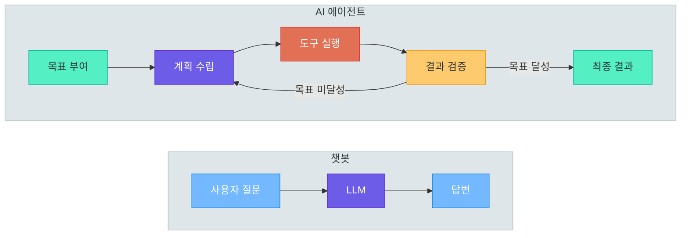

> **핵심 포인트:** 챗봇이 "질문에 답하는 도구"라면, AI 에이전트는 "목표를 달성하는 자율적 시스템"입니다. 에이전트는 도구를 사용하고, 결과를 판단하며, 필요하면 계획을 수정하는 루프를 반복합니다.

---

### Agent Software vs Agentic Software (핵심 구분!)

AI 에이전트를 논할 때 가장 혼동하기 쉬운 개념이 바로 **Agent Software**와 **Agentic Software**의 차이입니다. 이 둘은 겉보기에 비슷하지만 자율성의 정도와 사람 개입의 수준에서 본질적인 차이가 있습니다.

#### Agent Software (에이전트 소프트웨어)

**완전 자율적으로 동작하는 AI 시스템**입니다. 사람이 최초 목표만 설정하면, 이후 모든 판단과 실행을 AI가 독립적으로 수행합니다.

- **자율성**: 사람 개입 없이 목표를 달성
- **동작 방식**: 24시간 독립 실행, 스스로 판단하고 행동
- **에러 대응**: 자체적으로 감지하고 복구
- **예시**: 24시간 서버 모니터링 에이전트, 자동 거래 봇, 자율 주행 시스템

```python
# agent_software_example.py -- Agent Software: 24시간 서버 모니터링
import asyncio

class ServerMonitorAgent:
    """사람 개입 없이 24시간 자율적으로 서버를 모니터링하고 대응"""
    def __init__(self, endpoints: list[str]):
        self.endpoints = endpoints

    async def run_forever(self):
        """무한 루프: 모니터링 → 감지 → 판단 → 대응"""
        while True:
            for ep in self.endpoints:
                status = await self.check_health(ep)
                if not status["healthy"]:
                    await self.restart_service(ep)    # 자동 재시작
                    await self.send_alert(ep, "재시작 실행됨")
            await asyncio.sleep(60)
```

#### Agentic Software (에이전틱 소프트웨어)

**기존 소프트웨어에 AI 에이전트 능력을 부여한 것**입니다. AI가 일부 작업을 대행하지만, 핵심 결정은 사람이 내리며 AI는 보조 역할을 합니다.

- **자율성**: 사람과 협업하며 AI가 일부 작업을 대행
- **동작 방식**: 사람의 요청이나 맥락에 반응하여 동작
- **에러 대응**: 사람에게 확인 요청 또는 선택지 제시
- **예시**: GitHub Copilot, Claude Code, Cursor IDE, Notion AI

```python
# agentic_software_example.py -- Agentic Software: 코드 리뷰 보조
class AgenticCodeReviewer:
    """사람의 코드 리뷰를 AI가 보조 — 최종 결정은 사람이 내림"""
    async def review_pull_request(self, pr_diff: str):
        analysis = await self.analyze_code(pr_diff)
        # AI는 제안만 하고, 최종 승인은 사람이 결정
        return {"suggestions": analysis["improvements"],
                "security_issues": analysis["vulnerabilities"],
                "action_required": "사람이 검토 후 Approve/Request Changes 결정"}
```

#### 자율성 스펙트럼

Agent Software와 Agentic Software는 이분법이 아니라 **자율성의 스펙트럼** 위에 존재합니다.

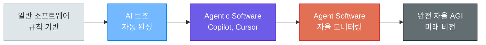

#### Agent Software vs Agentic Software 상세 비교

| 비교 항목 | Agent Software | Agentic Software |
|-----------|----------------|-------------------|
| **자율성** | 완전 자율 (Fully Autonomous) | 반자율 (Semi-Autonomous) |
| **사람 개입** | 최초 설정 후 불필요 | 핵심 결정에 사람 필요 |
| **실행 방식** | 24시간 독립 실행 | 사람의 요청에 반응 |
| **에러 대응** | 자체 복구 후 알림 | 사람에게 선택지 제시 |
| **신뢰 수준** | 높은 신뢰 필요 (자율 결정) | 중간 신뢰 (사람이 검증) |
| **위험도** | 높음 (잘못된 자율 행동) | 낮음 (사람이 최종 확인) |
| **적합한 작업** | 반복적, 규칙 명확, 위험 낮음 | 창의적, 판단 필요, 위험 높음 |
| **대표 예시** | 서버 모니터링, 로그 분석 봇 | GitHub Copilot, Claude Code |

> **핵심 포인트:** 현재 업계의 주류는 **Agentic Software**입니다. 완전 자율적인 Agent Software는 특수한 도메인(모니터링, 로그 분석 등)에서만 실용적이며, 대부분의 실무에서는 사람과 AI가 협업하는 Agentic 접근이 더 안전하고 효과적입니다.

---

### AI 에이전트의 핵심 구성 요소

AI 에이전트는 다섯 가지 핵심 구성 요소로 이루어집니다. 이들이 유기적으로 결합되어야 제대로 된 에이전트가 동작합니다.

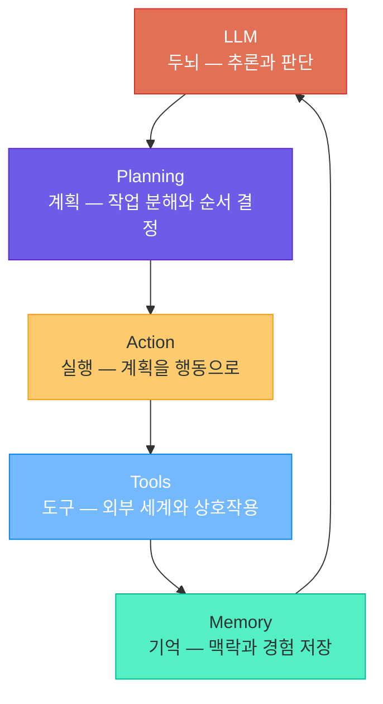

| 구성 요소 | 역할 | 구현 기술 |
|-----------|------|-----------|
| **LLM (두뇌)** | 상황을 이해하고 다음 행동을 결정 | GPT-4o, Claude 3.5 Sonnet, Gemini |
| **Planning (계획)** | 복잡한 목표를 하위 작업으로 분해 | ReAct, Plan-and-Execute, Tree of Thought |
| **Tools (도구)** | 외부 API, 데이터베이스, 코드 실행 | Function Calling, MCP, Tool Use |
| **Memory (기억)** | 대화 히스토리, 작업 결과, 장기 지식 | 벡터 DB, 체크포인팅, 세션 스토어 |
| **Action (실행)** | 계획에 따라 도구를 호출하고 결과 수집 | LangGraph 노드, Agent Executor |

> **핵심 포인트:** 에이전트의 품질은 가장 약한 구성 요소에 의해 결정됩니다. 아무리 강력한 LLM을 사용해도 도구 정의가 모호하거나 메모리 관리가 부실하면 에이전트는 제대로 동작하지 않습니다.

---

## 2. 에이전트의 동작 원리

### Perception → Planning → Action 루프

AI 에이전트의 핵심 동작 원리는 **인지(Perception) → 계획(Planning) → 행동(Action)** 의 반복 루프입니다. 이 루프는 목표가 달성될 때까지 계속 반복됩니다.

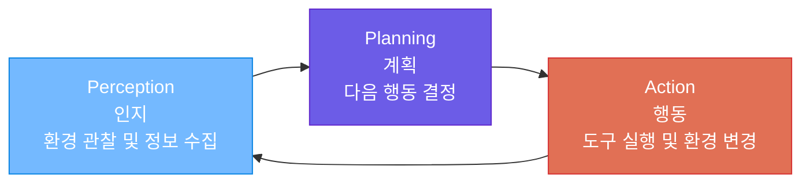

- **Perception (인지)**: 사용자 입력, 도구 실행 결과, 환경 상태 등을 관찰합니다
- **Planning (계획)**: 관찰된 정보를 바탕으로 LLM이 다음에 무엇을 할지 결정합니다
- **Action (행동)**: 계획에 따라 도구를 호출하거나 최종 답변을 생성합니다

이 루프가 한 번만 돌면 단순한 질문-답변이고, 여러 번 반복되면 복잡한 작업을 수행하는 에이전트가 됩니다.

---

### ReAct 패턴 (Reasoning + Acting)

**ReAct**는 가장 널리 사용되는 에이전트 패턴으로, **Reasoning(추론)**과 **Acting(행동)**을 번갈아 수행합니다. LLM이 먼저 생각(Thought)을 정리하고, 그에 따라 행동(Action)하며, 결과를 관찰(Observation)한 뒤 다시 생각하는 과정을 반복합니다.

```
Thought → Action → Observation → Thought → Action → Observation → ... → Final Answer
```

#### 구체적 예시: "서울 내일 날씨 알려줘"

```
Thought 1: 날씨 정보를 얻으려면 날씨 API를 호출해야 합니다.
Action 1:  weather_api.get(location="서울", date="2025-03-15")
Observation 1: {"condition": "맑음", "temp_high": 24, "temp_low": 11, "humidity": 45}
Thought 2: 날씨 정보를 확인했습니다. 사용자에게 전달하겠습니다.
Final Answer: "서울 내일 날씨는 맑음, 최고 24°C / 최저 11°C, 습도 45%입니다."
```

#### ReAct 패턴 코드 예시

```python
# react_pattern_example.py -- ReAct 패턴의 기본 구조 (OpenAI Function Calling)
from openai import OpenAI
client = OpenAI()

tools = [{"type": "function", "function": {
    "name": "get_weather",
    "description": "특정 도시의 날씨 정보를 조회합니다",
    "parameters": {"type": "object",
        "properties": {"location": {"type": "string", "description": "도시 이름"},
                        "date": {"type": "string", "description": "날짜 (YYYY-MM-DD)"}},
        "required": ["location"]}}}]

messages = [{"role": "user", "content": "서울 내일 날씨 알려줘"}]

while True:  # ReAct 루프: LLM 호출 → 도구 실행 → 다시 LLM 호출 → ...
    response = client.chat.completions.create(model="gpt-4o", messages=messages, tools=tools)
    msg = response.choices[0].message

    if msg.tool_calls:  # Action: 도구 호출이 필요한 경우
        messages.append(msg)
        for tc in msg.tool_calls:
            result = execute_tool(tc.function.name, tc.function.arguments)  # Observation
            messages.append({"role": "tool", "tool_call_id": tc.id, "content": result})
    else:  # Final Answer
        print(msg.content)
        break
```

---

### Plan-and-Execute 패턴

**Plan-and-Execute** 패턴은 ReAct와 달리, **먼저 전체 계획을 수립한 뒤 단계별로 실행**하는 방식입니다. 복잡하고 여러 단계가 필요한 작업에 적합합니다.

#### ReAct vs Plan-and-Execute 비교

| 구분 | ReAct | Plan-and-Execute |
|------|-------|------------------|
| **계획 방식** | 한 단계씩 즉석 판단 | 전체 계획 먼저 수립 |
| **적합한 작업** | 간단한 도구 호출 (1-3단계) | 복잡한 다단계 작업 (5단계 이상) |
| **유연성** | 높음 (매 단계 재판단) | 중간 (계획 수정 가능하지만 비용 발생) |
| **효율성** | 단순 작업에 효율적 | 복잡 작업에 효율적 |

#### 예시: "다음 주 팀 회식 장소 찾아줘"

```
[계획 수립] → 먼저 전체 계획을 세움
  1. 팀원 수와 선호 음식 확인  →  database.query("SELECT preference FROM team_members")
  2. 회사 근처 식당 검색      →  search_api.search("강남역 근처 한식 단체석")
  3. 가격/리뷰/수용인원 비교   →  compare_restaurants(results)
  4. 예약 가능 여부 확인       →  check_availability(top3, date="2025-03-21")
  5. 최종 추천 + 예약 링크     →  generate_recommendation(available)
```

---

### 도구 사용 (Tool Use)

에이전트의 핵심 능력은 **도구(Tool)**를 사용하는 것입니다. LLM 단독으로는 최신 정보 검색, 계산, 외부 시스템 조작이 불가능하지만, 도구를 통해 이 한계를 극복합니다.

#### 에이전트가 사용할 수 있는 도구 유형

| 도구 유형 | 설명 | 사용 예시 |
|-----------|------|-----------|
| **웹 검색** | 실시간 인터넷 정보 검색 | Tavily, Google Search API |
| **코드 실행** | Python 코드 작성 및 실행 | Code Interpreter, Jupyter |
| **데이터베이스** | SQL 쿼리 실행, 데이터 조회 | PostgreSQL, MongoDB |
| **파일 시스템** | 파일 읽기, 쓰기, 수정 | 로컬 파일, S3, GCS |
| **외부 API** | REST API 호출, 서비스 연동 | Slack, Gmail, Calendar |
| **브라우저** | 웹 페이지 조작, 스크래핑 | Playwright, Browser Use |

#### 도구 정의 예시 (JSON Schema)

도구는 LLM이 이해할 수 있는 **JSON Schema**로 정의합니다. 이 정의가 명확할수록 에이전트가 도구를 정확하게 사용합니다.

```json
{
  "type": "function",
  "function": {
    "name": "search_products",
    "description": "온라인 쇼핑몰에서 상품을 검색합니다. 상품명, 카테고리, 가격 범위로 필터링 가능.",
    "parameters": {
      "type": "object",
      "properties": {
        "query": {"type": "string", "description": "검색할 상품명 또는 키워드"},
        "category": {"type": "string", "enum": ["전자기기", "의류", "식품", "도서"]},
        "max_price": {"type": "number", "description": "최대 가격 (원)"},
        "min_rating": {"type": "number", "description": "최소 평점 (1-5)"}
      },
      "required": ["query"]
    }
  }
}
```

> **핵심 포인트:** 도구 정의에서 가장 중요한 것은 `description`입니다. LLM은 이 설명을 보고 언제, 어떤 도구를 사용할지 판단합니다. 설명이 모호하면 에이전트가 엉뚱한 도구를 호출하거나 필요한 도구를 사용하지 않는 문제가 발생합니다.

---

## 3. 실전 에이전트 워크플로 예제

### 예제 1: 웹 서비스 점검 에이전트

운영 중인 마이크로서비스의 전체 헬스체크를 자동으로 수행하는 에이전트입니다. 사용자가 "우리 서비스 전체 헬스체크 해줘"라고 요청하면, 에이전트가 자율적으로 모든 엔드포인트를 점검하고 보고서를 생성합니다.

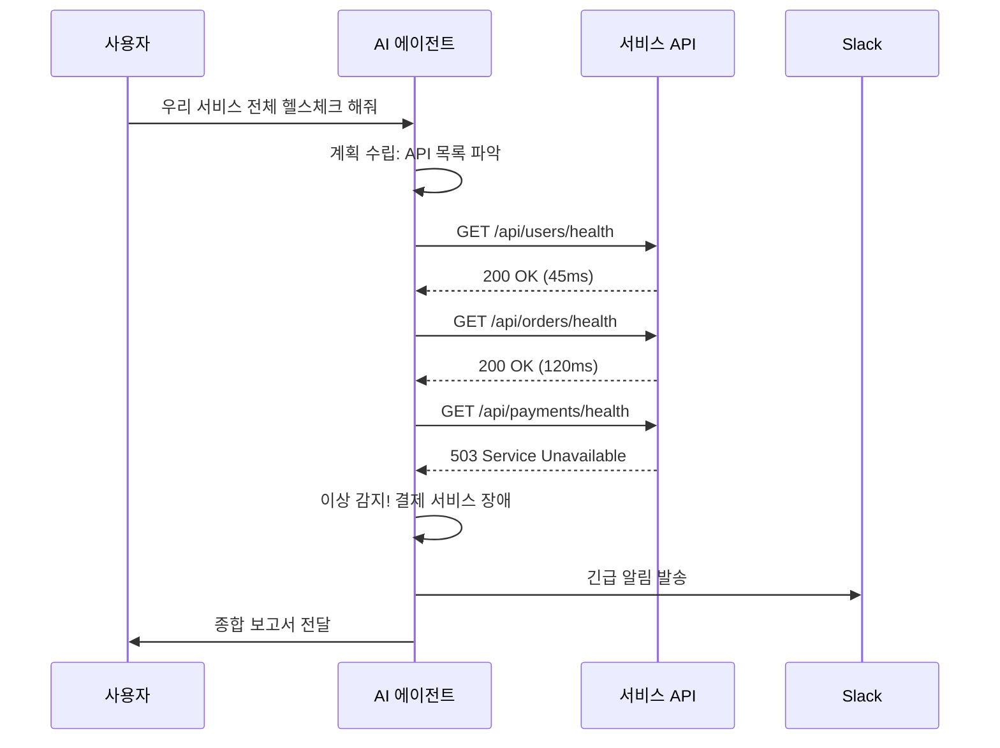

```python
# health_check_agent.py -- 웹 서비스 점검 에이전트
import httpx, asyncio
from datetime import datetime

async def health_check(endpoint: str) -> dict:
    """도구 1: 특정 엔드포인트의 상태를 확인합니다."""
    try:
        async with httpx.AsyncClient(timeout=10) as client:
            start = datetime.now()
            resp = await client.get(endpoint)
            elapsed = (datetime.now() - start).total_seconds() * 1000
            return {"endpoint": endpoint, "status_code": resp.status_code,
                    "response_time_ms": round(elapsed, 2), "healthy": resp.status_code == 200}
    except httpx.TimeoutException:
        return {"endpoint": endpoint, "healthy": False, "error": "Timeout"}

async def run_health_check_agent():
    """에이전트 로직: 계획 → 실행 → 판단 → 보고"""
    endpoints = [
        "https://api.example.com/users/health",
        "https://api.example.com/orders/health",
        "https://api.example.com/payments/health",
    ]
    # 1단계: 모든 엔드포인트 병렬 점검
    results = await asyncio.gather(*[health_check(ep) for ep in endpoints])

    # 2단계: 이상 탐지 + 알림
    unhealthy = [r for r in results if not r["healthy"]]
    if unhealthy:
        alert_msg = f"장애 감지: {len(unhealthy)}개 서비스 이상\n"
        for r in unhealthy:
            alert_msg += f"  - {r['endpoint']}: {r.get('error', r['status_code'])}\n"
        await send_slack_alert("#ops-alerts", alert_msg)

    # 3단계: 종합 보고서 생성
    return {"timestamp": datetime.now().isoformat(),
            "total": len(results), "healthy": len(results) - len(unhealthy),
            "unhealthy": len(unhealthy), "details": results}
```

---

### 예제 2: 최저가 검색 에이전트

여러 쇼핑 플랫폼의 가격을 비교하여 최저가를 찾아주는 에이전트입니다.

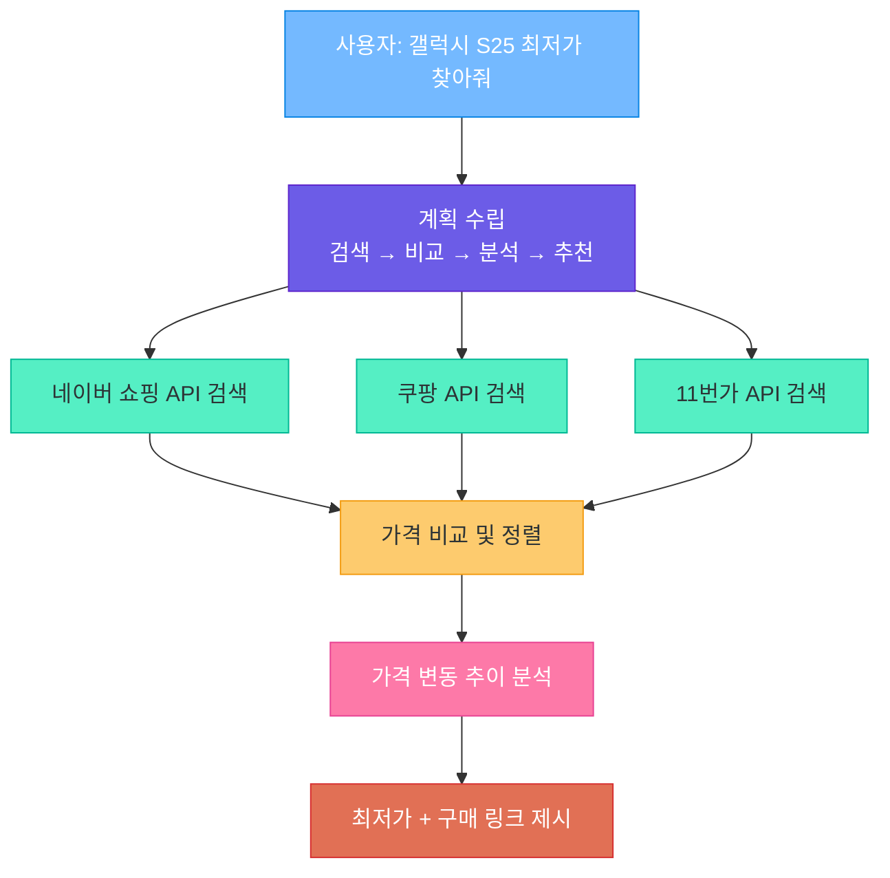

```python
# price_search_agent.py -- 최저가 검색 에이전트
import httpx, asyncio

async def search_shopping(platform: str, query: str) -> list[dict]:
    """도구: 쇼핑 플랫폼에서 상품을 검색합니다."""
    endpoints = {
        "naver": "https://openapi.naver.com/v1/search/shop.json",
        "coupang": "https://api.coupang.com/v1/products/search",
    }
    async with httpx.AsyncClient() as client:
        resp = await client.get(endpoints[platform], params={"query": query, "display": 5})
        return resp.json().get("items", [])

async def run_price_agent(product_name: str):
    # 1단계: 병렬 검색
    naver, coupang = await asyncio.gather(
        search_shopping("naver", product_name),
        search_shopping("coupang", product_name),
    )
    # 2단계: 가격 비교 + 정렬
    all_items = []
    for platform, items in {"naver": naver, "coupang": coupang}.items():
        for item in items:
            all_items.append({"platform": platform, "title": item["title"],
                              "price": int(item["lprice"]), "link": item["link"]})
    ranked = sorted(all_items, key=lambda x: x["price"])

    # 3단계: 결과 정리
    best = ranked[0]
    return f"{product_name} 최저가: {best['price']:,}원 ({best['platform']}) - {best['link']}"
```

---

### 예제 3: 모니터링 + 장애 대응 에이전트

24시간 실행되는 **Agent Software**의 대표적인 예시입니다. 사람의 개입 없이 자율적으로 장애를 감지하고 대응합니다.

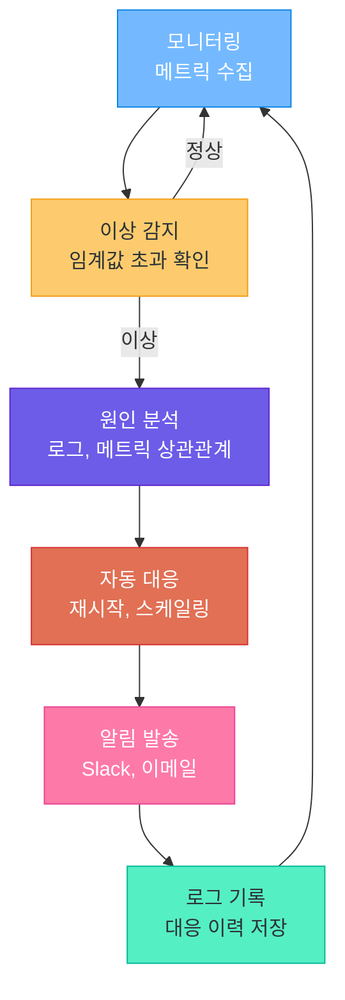

#### 장애 등급별 대응 전략

| 등급 | 조건 | 자동 대응 | 알림 대상 |
|------|------|-----------|-----------|
| **Level 1 (경고)** | 응답 시간 500ms 초과 | 로그 기록만 | 모니터링 채널 |
| **Level 2 (주의)** | 에러율 5% 초과 | 트래픽 분산 (로드밸런싱) | 담당 엔지니어 |
| **Level 3 (심각)** | 서비스 다운 | 자동 재시작 + 스케일업 | 팀 전체 + 긴급 전화 |
| **Level 4 (크리티컬)** | 데이터 유실 위험 | 서비스 중단 + 백업 전환 | CTO + 전체 엔지니어링 |

```python
# monitoring_agent.py -- 장애 대응 에이전트 (Agent Software)
import asyncio, httpx
from enum import IntEnum

class AlertLevel(IntEnum):
    WARNING = 1; CAUTION = 2; CRITICAL = 3; FATAL = 4

class MonitoringAgent:
    """24시간 자율 모니터링 에이전트"""

    def __init__(self, services: list[dict]):
        self.services = services
        self.failure_counts = {s["name"]: 0 for s in services}

    async def run(self):
        """메인 루프: 모니터링 → 감지 → 분석 → 대응 → 알림"""
        while True:
            for service in self.services:
                status = await self.check(service)
                level = self.assess_level(service["name"], status)
                if level >= AlertLevel.CAUTION:
                    await self.respond(service, level)
                    await self.notify(service, level, status)
            await asyncio.sleep(30)

    def assess_level(self, name: str, status: dict) -> AlertLevel:
        """연속 실패 횟수 기반 장애 등급 판정"""
        if not status["healthy"]:
            self.failure_counts[name] += 1
        else:
            self.failure_counts[name] = 0
            return AlertLevel.WARNING
        count = self.failure_counts[name]
        if count >= 10: return AlertLevel.FATAL
        elif count >= 5: return AlertLevel.CRITICAL
        elif count >= 3: return AlertLevel.CAUTION
        return AlertLevel.WARNING

    async def respond(self, service: dict, level: AlertLevel):
        """장애 등급에 따른 자동 대응"""
        if level == AlertLevel.CAUTION:
            await self.redistribute_traffic(service)
        elif level == AlertLevel.CRITICAL:
            await self.restart_service(service)
        elif level == AlertLevel.FATAL:
            await self.failover_to_backup(service)
```

---

### 예제 4: 자동 구매 에이전트 (대신 구매)

사용자가 조건을 설정하면 가격을 모니터링하다가 조건 충족 시 구매를 진행하는 에이전트입니다. **금전이 관련된 작업이므로 반드시 Human-in-the-Loop가 필요합니다.**

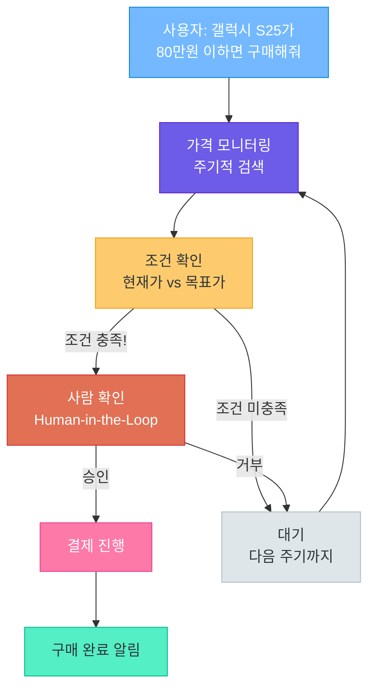

```python
# auto_purchase_agent.py -- 자동 구매 에이전트 (Human-in-the-Loop 필수)
import asyncio

class AutoPurchaseAgent:
    """가격 모니터링 후 조건부 자동 구매 에이전트"""

    def __init__(self, product: str, target_price: int):
        self.product = product
        self.target_price = target_price

    async def run(self):
        while True:
            current_price = await self.check_price(self.product)

            if current_price <= self.target_price:
                # ⚠️ 반드시 사람 확인! (Human-in-the-Loop)
                approved = await self.request_human_approval(
                    product=self.product, price=current_price
                )
                if approved:
                    result = await self.execute_purchase(self.product, current_price)
                    await self.notify_completion(result)
                    return result

            await asyncio.sleep(3600)  # 1시간 간격

    async def request_human_approval(self, product, price) -> bool:
        """금전 관련 결정은 반드시 사람의 승인을 받음"""
        notification = {"title": "구매 승인 요청",
                        "body": f"{product} - {price:,}원 구매하시겠습니까?",
                        "actions": ["승인", "거부"]}
        response = await send_approval_request(notification)
        return response == "승인"
```

> **핵심 포인트:** 금전 거래, 데이터 삭제, 대외 커뮤니케이션 등 **되돌리기 어려운 행동**에는 반드시 Human-in-the-Loop을 적용하세요. "자동 구매"는 Agent Software처럼 보이지만, 실제로는 Agentic Software로 구현하는 것이 안전합니다.

---

## 4. 에이전트 아키텍처 패턴

### Single Agent (단일 에이전트)

하나의 LLM이 모든 도구를 직접 관리하고 호출하는 가장 단순한 구조입니다. 도구가 5개 이하이고 작업이 단순할 때 적합합니다.

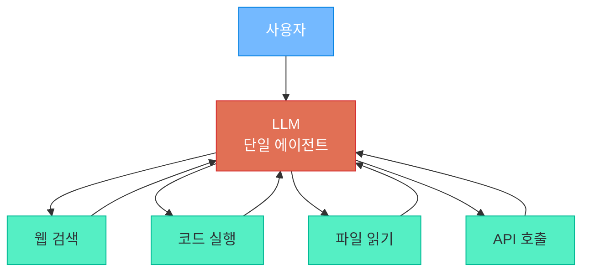

**장점**: 구현이 간단하고 디버깅이 쉬움

**단점**: 도구가 많아지면 LLM이 혼란, 프롬프트가 비대해짐

---

### Multi-Agent: Supervisor 패턴

**관리자(Supervisor) 에이전트**가 전체 작업을 관리하고, **전문 에이전트(Worker)** 들에게 작업을 분배하는 구조입니다. 각 워커는 자기 도메인에 특화된 도구와 프롬프트를 가집니다.

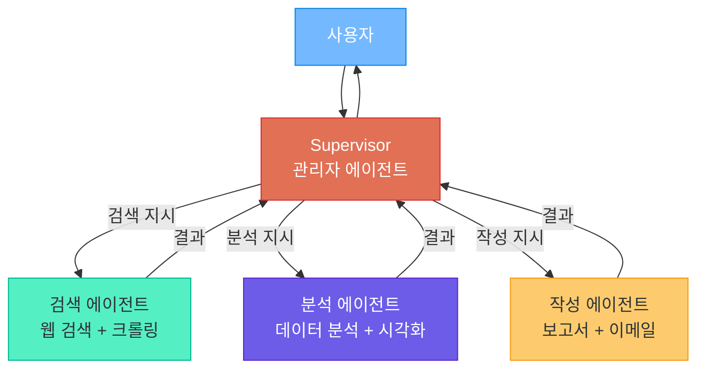

**장점**: 역할 분담으로 각 에이전트가 전문성 발휘, 확장 용이

**단점**: Supervisor가 병목이 될 수 있음, 에이전트 간 통신 비용

---

### Multi-Agent: Handoff 패턴

에이전트 간 **직접 작업을 전달(Handoff)** 하는 구조입니다. 파이프라인처럼 각 에이전트가 자기 역할을 완료한 뒤 다음 에이전트에게 넘깁니다. Supervisor 없이 에이전트가 자율적으로 다음 담당자를 결정합니다.

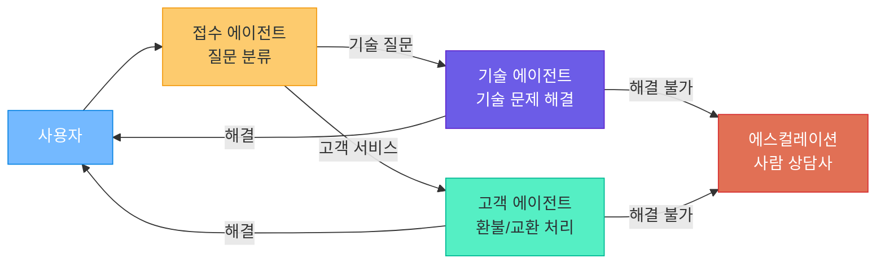

**장점**: 에이전트가 자율적으로 작업 전달, 유연한 구조

**단점**: 전달 과정에서 맥락 손실 가능, 복잡한 디버깅

---

### 패턴 선택 가이드

| 패턴 | 적합한 상황 | 복잡도 | 장점 | 단점 |
|------|------------|--------|------|------|
| **Single Agent** | 도구 5개 이하, 단순 작업 | 낮음 | 구현 간단, 빠른 응답 | 확장 한계, 도구 혼동 |
| **Supervisor** | 역할이 명확히 나뉘는 작업 | 중간 | 체계적 관리, 확장 용이 | Supervisor 병목, 비용 |
| **Handoff** | 순차적 처리, 고객 서비스 | 중간 | 유연한 전달, 전문화 | 맥락 손실, 디버깅 어려움 |
| **Supervisor + Handoff** | 대규모 복잡한 시스템 | 높음 | 최대 유연성 | 설계/운영 복잡 |

> **핵심 포인트:** 처음에는 **Single Agent**로 시작하고, 도구가 5개를 넘거나 역할 분리가 필요할 때 **Multi-Agent**로 전환하세요. 과도한 아키텍처는 오히려 성능과 디버깅을 악화시킵니다.

---

## 5. 에이전트의 신뢰성과 안전성

### Hallucination (환각) 문제

챗봇의 환각은 틀린 답변을 출력하는 것에 그치지만, **에이전트의 환각은 틀린 정보를 기반으로 행동**하므로 훨씬 위험합니다. 존재하지 않는 API를 호출하거나, 잘못된 SQL로 데이터를 삭제할 수 있습니다.

#### 환각 방지 전략

| 전략 | 설명 | 구현 방법 |
|------|------|-----------|
| **도구 결과 재확인** | 도구 실행 결과를 LLM이 다시 검증 | 검증 프롬프트 추가 |
| **다중 소스 교차 검증** | 하나의 정보를 여러 경로로 확인 | 복수 도구 호출 후 비교 |
| **구조화된 출력** | 자유 텍스트 대신 JSON 스키마 강제 | Structured Output 사용 |
| **도구 실행 전 확인** | 위험한 도구 호출 전 사전 검증 | 입력 파라미터 Validation |
| **실행 이력 기록** | 모든 도구 호출과 결과를 로깅 | LangSmith, 로그 DB |

---

### Human-in-the-Loop

모든 에이전트 행동을 자동화할 수는 없습니다. **중요한 결정에는 사람의 승인이 필요**합니다. 승인 수준을 3단계로 분류하여 적용하는 것이 실무적입니다.

| 승인 레벨 | 설명 | 에이전트 동작 | 예시 |
|-----------|------|---------------|------|
| **Level 1 (자동)** | 위험도 낮음, 되돌리기 쉬움 | 자동 실행, 로그만 기록 | 정보 조회, 검색, 읽기 |
| **Level 2 (알림)** | 중간 위험, 알림 필요 | 실행 후 사후 알림 | 파일 수정, 이메일 발송, 설정 변경 |
| **Level 3 (승인)** | 고위험, 되돌리기 어려움 | 실행 전 사전 승인 필요 | 금전 거래, 데이터 삭제, 계정 관리 |

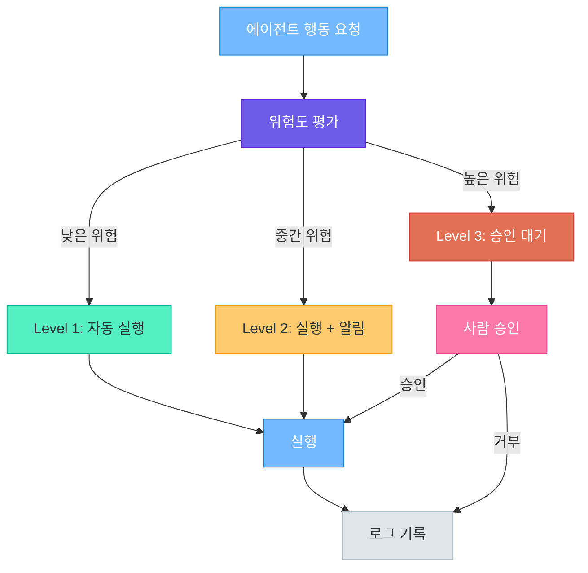

---

### 에러 복구와 재시도

에이전트는 도구 실행 중 다양한 에러를 만납니다. 견고한 에이전트는 **재시도 → 대안 도구 → 에스컬레이션**의 단계적 복구 전략을 갖추어야 합니다.

```python
# error_recovery.py -- 에이전트 에러 복구 전략
import asyncio
from typing import Callable

async def resilient_tool_call(
    primary_tool: Callable, fallback_tool: Callable | None = None,
    max_retries: int = 3, retry_delay: float = 1.0,
) -> dict:
    """단계적 에러 복구: 재시도 → 대안 도구 → 에스컬레이션"""
    for attempt in range(max_retries):           # 1단계: 재시도
        try:
            return {"status": "success", "result": await primary_tool()}
        except Exception as e:
            print(f"시도 {attempt + 1}/{max_retries} 실패: {e}")
            if attempt < max_retries - 1:
                await asyncio.sleep(retry_delay * (attempt + 1))

    if fallback_tool:                            # 2단계: 대안 도구
        try:
            return {"status": "fallback_success", "result": await fallback_tool()}
        except Exception:
            pass

    return {"status": "escalation_needed",       # 3단계: 사람에게 에스컬레이션
            "message": "자동 복구 실패. 사람의 개입이 필요합니다."}
```

---

### 비용 관리

에이전트는 하나의 작업에 LLM을 **여러 번** 호출하므로 비용 관리 전략이 필수입니다.

| 작업 유형 | 예상 LLM 호출 횟수 | 예상 토큰 | 예상 비용 (GPT-4o) |
|-----------|-------------------|-----------|---------------------|
| 단순 검색 | 2-3회 | ~3,000 | ~$0.02 |
| 데이터 분석 | 5-8회 | ~10,000 | ~$0.08 |
| 보고서 작성 | 8-15회 | ~30,000 | ~$0.25 |
| 복잡한 멀티 에이전트 | 20-50회 | ~100,000 | ~$0.80 |

#### 비용 절감 전략

```python
# cost_management.py -- 에이전트 비용 관리
class AgentCostGuard:
    """에이전트의 토큰 사용량과 비용을 제한"""

    def __init__(self, max_iterations: int = 20, max_tokens: int = 100_000):
        self.max_iterations = max_iterations
        self.max_tokens = max_tokens
        self.current_iterations = 0
        self.total_tokens = 0

    def check_budget(self, tokens_used: int) -> bool:
        """매 LLM 호출 시 예산 초과 여부 확인"""
        self.current_iterations += 1
        self.total_tokens += tokens_used
        if self.current_iterations >= self.max_iterations:
            raise Exception(f"최대 반복 횟수 초과: {self.current_iterations}")
        if self.total_tokens >= self.max_tokens:
            raise Exception(f"최대 토큰 초과: {self.total_tokens}")
        return True
```

> **핵심 포인트:** 에이전트의 비용은 예측하기 어렵습니다. 반드시 **최대 반복 횟수 제한**과 **토큰 사용량 모니터링**을 구현하세요. LLM 호출 없이 해결할 수 있는 부분은 일반 코드로 처리하는 것이 효율적입니다.

---

## 6. 에이전트 생태계

### 주요 에이전트 프레임워크

| 프레임워크 | 개발사 | 핵심 특징 | 장점 | 단점 |
|-----------|--------|-----------|------|------|
| **LangGraph** | LangChain | 그래프 기반 상태 머신 | 유연한 흐름 제어, 체크포인팅 | 학습 곡선 높음 |
| **CrewAI** | CrewAI | 역할 기반 멀티 에이전트 | 직관적 API, 빠른 프로토타이핑 | 세밀한 제어 어려움 |
| **AutoGen** | Microsoft | 대화형 멀티 에이전트 | 에이전트 간 자연어 소통 | 비용 관리 어려움 |
| **OpenAI Assistants** | OpenAI | 클라우드 호스팅 에이전트 | 간편한 설정, 내장 도구 | OpenAI 종속, 제한된 커스터마이징 |
| **Claude Computer Use** | Anthropic | 화면 조작 에이전트 | 모든 GUI 앱 제어 가능 | 실행 속도 느림, 비용 높음 |

#### 프레임워크 선택 기준

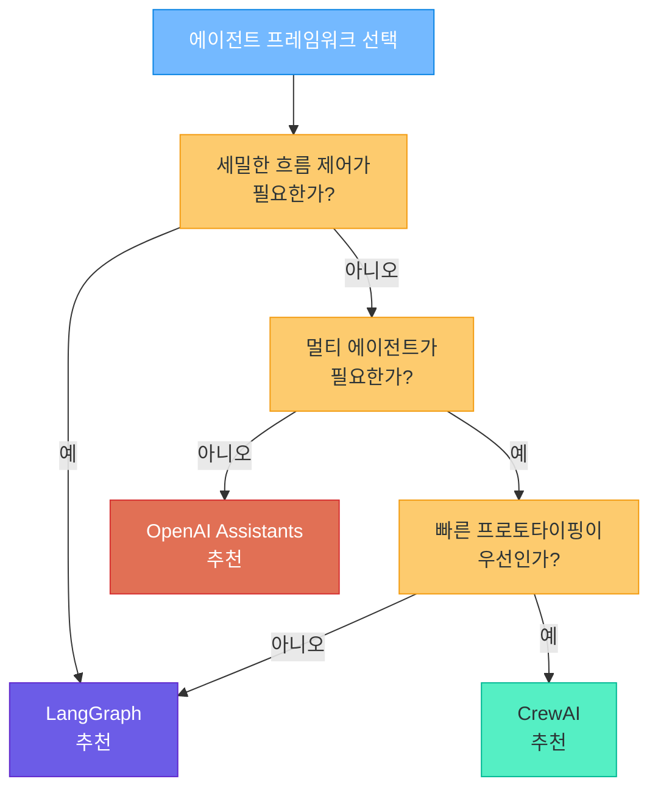

---

### 에이전트 도구 생태계

| 도구 카테고리 | 설명 | 대표 기술 |
|--------------|------|-----------|
| **Browser Use** | AI가 웹 브라우저를 직접 조작 | Playwright, Puppeteer, Browser Use |
| **Computer Use** | AI가 마우스/키보드로 화면 조작 | Claude Computer Use, UFO |
| **Code Interpreter** | AI가 코드를 작성하고 실행 | OpenAI Code Interpreter, E2B |
| **MCP** | 도구를 표준화된 프로토콜로 연결 | Model Context Protocol (Anthropic) |
| **Custom Tools** | 직접 만든 API나 함수를 도구로 등록 | Function Calling, Tool Use API |

#### MCP (Model Context Protocol) 개요

MCP는 Anthropic이 제안한 **에이전트 도구 연결 표준 프로토콜**입니다. USB처럼 다양한 도구를 표준화된 방식으로 LLM에 연결합니다.

```python
# mcp_concept.py -- MCP 개념 이해를 위한 의사 코드
class WeatherMCPServer:
    """MCP 서버 (도구 제공자): 날씨 정보를 표준화된 방식으로 제공"""

    def list_tools(self):
        return [{"name": "get_weather", "description": "도시의 현재 날씨를 조회합니다",
                 "input_schema": {"type": "object",
                   "properties": {"city": {"type": "string", "description": "도시 이름"}}}}]

    def call_tool(self, name: str, arguments: dict):
        if name == "get_weather":
            return fetch_weather(arguments["city"])

# MCP 클라이언트 (에이전트): Claude Desktop, Cursor 등이
# MCP 서버에 연결하여 도구를 자동으로 발견하고 사용
```

---

### 에이전트의 현재와 미래

#### 현재 (2024-2025): 특정 도메인에서 실용적 성과

| 도메인 | 현재 수준 | 대표 서비스 |
|--------|-----------|------------|
| 코딩 보조 | 실용 단계 | GitHub Copilot, Claude Code, Cursor |
| 고객 서비스 | 실용 단계 | Intercom, Zendesk AI |
| 데이터 분석 | 초기 단계 | Code Interpreter, Julius AI |
| 웹 브라우징 | 실험 단계 | Browser Use, Claude Computer Use |
| 범용 작업 자동화 | 연구 단계 | AutoGPT, BabyAGI |

#### 단기 미래: 멀티모달 에이전트와 MCP 생태계 확장

- **멀티모달 에이전트**: 이미지, 음성, 영상까지 활용하는 에이전트
- **MCP 생태계 확장**: 표준화된 도구 프로토콜로 에이전트 능력 빠르게 확장

#### 장기 비전: 범용 AI 에이전트

- **범용 에이전트**: 특정 도메인에 국한되지 않고 다양한 작업을 수행
- **에이전트 간 협업**: 서로 다른 에이전트가 표준 프로토콜로 소통하며 협력

> **핵심 포인트:** 현재 AI 에이전트는 "무엇이든 할 수 있는 만능 AI"가 아니라, **특정 도메인에서 사람을 보조하는 도구**입니다. 과도한 기대보다는 현실적인 범위에서 활용하고, 점진적으로 자율성을 확대하는 접근이 바람직합니다.

---

## 7. 핵심 정리

### AI 에이전트 체크리스트

| 항목 | 확인 사항 | 중요도 |
|------|-----------|--------|
| **목표 정의** | 에이전트가 달성해야 할 목표가 명확한가? | 필수 |
| **도구 설계** | 각 도구의 description이 명확한가? | 필수 |
| **에러 처리** | 도구 실패 시 재시도/대안 전략이 있는가? | 필수 |
| **비용 제한** | 최대 반복 횟수와 토큰 한도가 설정되었는가? | 필수 |
| **Human-in-the-Loop** | 위험한 행동에 사람 승인이 적용되었는가? | 필수 |
| **로깅** | 모든 도구 호출과 결과가 기록되는가? | 권장 |
| **테스트** | 다양한 시나리오로 에이전트를 테스트했는가? | 권장 |
| **아키텍처** | 작업 복잡도에 맞는 패턴을 선택했는가? | 권장 |
| **환각 방지** | 도구 결과 검증과 교차 확인이 구현되었는가? | 권장 |
| **모니터링** | 운영 중 에이전트 행동을 추적할 수 있는가? | 권장 |

### Agent vs Agentic 한눈에 보기

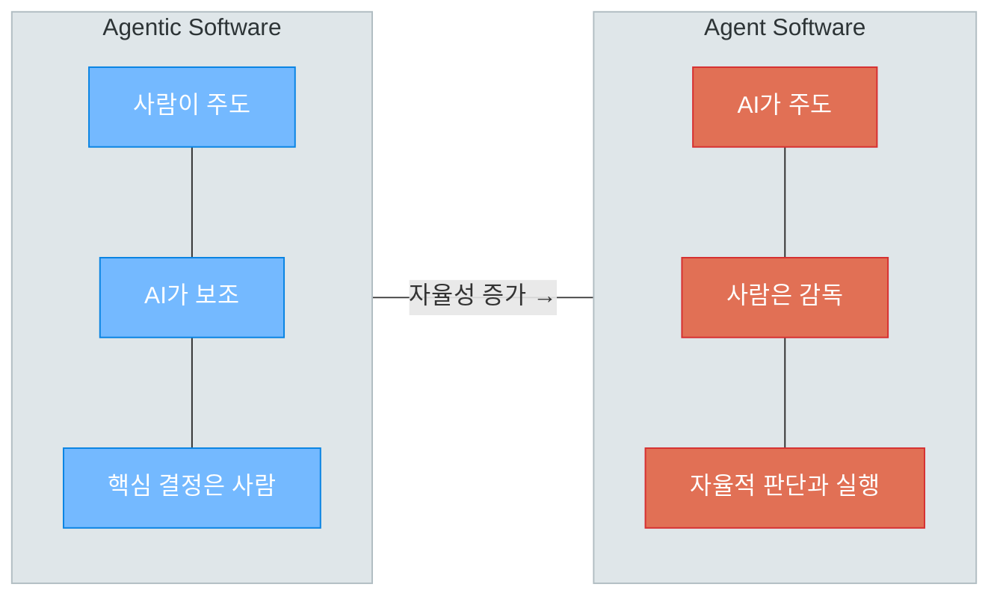

### 이 강의에서 배운 핵심 개념

| 개념 | 요약 |
|------|------|
| **AI 에이전트** | 목표를 부여받으면 스스로 계획하고 도구를 사용하여 달성하는 자율적 AI 시스템 |
| **Agent vs Agentic** | Agent는 완전 자율, Agentic은 사람과 협업 — 현재 주류는 Agentic |
| **ReAct 패턴** | Thought → Action → Observation 루프를 반복하는 가장 기본적인 에이전트 패턴 |
| **도구 사용** | 웹 검색, 코드 실행, API 호출 등으로 LLM의 한계를 극복 |
| **아키텍처 패턴** | Single Agent, Supervisor, Handoff — 작업 복잡도에 따라 선택 |
| **Human-in-the-Loop** | 위험도에 따라 자동/알림/승인 3단계로 사람의 개입 수준 결정 |
| **비용 관리** | 반복 횟수 제한, 토큰 모니터링으로 예산 초과 방지 |

### 다음 단계

이번 강의에서는 AI 에이전트의 **개념, 동작 원리, 아키텍처 패턴, 안전성**을 학습했습니다. 다음 강의에서는 **LangGraph를 사용하여 실제로 에이전트를 구축합니다**. StateGraph로 상태를 관리하고, 노드와 엣지로 에이전트 흐름을 설계하며, 체크포인팅과 Human-in-the-Loop을 코드로 구현합니다.

---

> **이전 강의:** [멀티모달 AI](08_multimodal_ai.md) | **다음 강의:** [LangGraph 에이전트](10_langgraph_agents.md)
