# Agentic 디자인 패턴

> LLM 기반 에이전트 워크플로우의 5대 핵심 설계 패턴 -- 단순 체이닝부터 자율 평가-최적화까지, 상황에 맞는 패턴을 선택하고 조합하는 아키텍처 가이드

---

## 1. 왜 패턴이 필요한가

### 에이전트 복잡성의 현실

LLM 기반 에이전트를 구축하다 보면, 단일 프롬프트 호출만으로는 해결할 수 없는 문제들을 마주합니다. 고객 문의를 분류하고, 여러 문서를 동시에 분석하고, 생성한 코드를 검증하고, 복합 리서치를 수행하는 등 실무의 작업은 본질적으로 **다단계**이고 **비선형**입니다.

이런 복잡성을 구조 없이 접근하면 다음과 같은 문제가 발생합니다.

| 문제 | 증상 |
|------|------|
| 모놀리식 프롬프트 | 하나의 프롬프트에 모든 지시를 담아 길이가 수천 토큰을 넘김 |
| 비결정적 흐름 | LLM 응답에 따라 예측 불가능한 경로로 진행 |
| 품질 불일치 | 중간 결과의 품질이 보장되지 않아 최종 출력 편차가 큼 |
| 확장 어려움 | 새 기능 추가 시 기존 로직 전체를 수정해야 함 |
| 디버깅 불가 | 어느 단계에서 문제가 발생했는지 추적할 수 없음 |

### 패턴 = 검증된 설계 청사진

소프트웨어 엔지니어링에 GoF 디자인 패턴이 있듯, LLM 에이전트에도 반복적으로 검증된 설계 패턴이 있습니다. Anthropic은 에이전트 시스템을 구축하면서 발견한 핵심 패턴 5가지를 정리하여 공개했습니다. 이 패턴들은 다음과 같은 가치를 제공합니다.

1. **예측 가능성** -- 각 패턴의 입력/출력/흐름이 명확하므로 시스템 동작을 예측할 수 있습니다
2. **모듈화** -- 패턴 단위로 개발, 테스트, 교체가 가능합니다
3. **조합 가능성** -- 패턴을 레고 블록처럼 조합하여 복잡한 시스템을 구성할 수 있습니다
4. **소통 효율** -- 팀원 간 "이건 Routing 패턴이야"라고 말하면 즉시 구조를 이해합니다

### 단순한 것부터 시작하라

Anthropic이 강조하는 핵심 원칙이 있습니다. **가능한 한 가장 단순한 패턴을 사용하라.** 복잡한 에이전트 프레임워크에 뛰어들기 전에, 단순한 Prompt Chaining이나 Routing으로 문제를 해결할 수 있는지 먼저 확인하세요. 불필요한 복잡성은 비용 증가, 레이턴시 증가, 디버깅 난이도 상승으로 직결됩니다.

```
단순도 순서: Prompt Chaining < Routing < Parallelization < Orchestrator-Worker < Evaluator-Optimizer
```

> **핵심 포인트:** 패턴은 문제를 구조적으로 분해하는 도구입니다. 복잡한 에이전트를 구축하기 전에 "이 문제에 가장 적합한 패턴이 무엇인가?"를 먼저 질문하세요.

---

## 2. 5대 패턴 개요

### 패턴 비교표

| 패턴 | 복잡도 | 자율성 | LLM 호출 수 | 핵심 구조 | 대표 시나리오 |
|------|--------|--------|-------------|-----------|---------------|
| Prompt Chaining | 낮음 | 낮음 | 2~5회 (순차) | A -> B -> C | 문서 분석 -> 요약 -> 번역 |
| Routing | 낮음 | 중간 | 2회 (분류+처리) | 분류 -> 분기 | 고객 문의 유형별 전문 응답 |
| Parallelization | 중간 | 낮음 | 3~N회 (동시) | 팬아웃 -> 팬인 | 다관점 분석, 투표 |
| Orchestrator-Worker | 높음 | 높음 | 동적 (분해+N) | 분해 -> 실행 -> 종합 | 코드 리뷰, 복합 리서치 |
| Evaluator-Optimizer | 높음 | 높음 | 반복 (생성+평가) | 생성 <-> 평가 루프 | 코드 생성, 글쓰기 개선 |

### 전체 패턴 관계도

패턴을 선택할 때 가장 중요한 두 축은 **복잡도(구현 난이도)** 와 **자율성(LLM의 의사결정 범위)** 입니다. 단순한 파이프라인은 복잡도와 자율성이 모두 낮고, Evaluator-Optimizer는 LLM이 스스로 품질을 판단하고 개선하므로 자율성이 가장 높습니다.

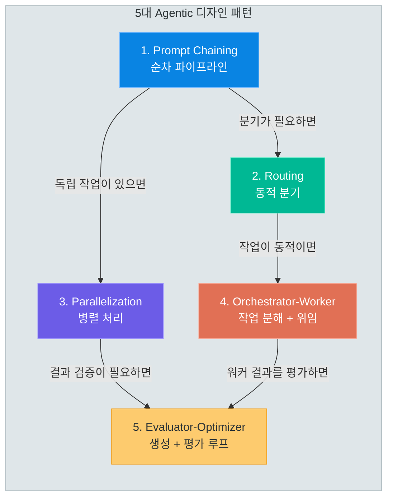

### 패턴별 핵심 질문

패턴을 선택하기 전에 다음 질문에 답하세요.

| 질문 | 해당 패턴 |
|------|-----------|
| 작업을 고정된 단계로 분해할 수 있는가? | Prompt Chaining |
| 입력 유형에 따라 다른 처리가 필요한가? | Routing |
| 독립적인 작업을 동시에 실행할 수 있는가? | Parallelization |
| 작업 분해를 LLM이 동적으로 해야 하는가? | Orchestrator-Worker |
| 출력 품질을 반복적으로 개선해야 하는가? | Evaluator-Optimizer |

> **핵심 포인트:** 5가지 패턴은 복잡도와 자율성의 스펙트럼 위에 있습니다. 가장 단순한 Prompt Chaining부터 시작하여, 문제의 요구사항에 따라 점진적으로 복잡한 패턴을 선택하세요.

---

## 3. 패턴 1: Prompt Chaining (순차 연결)

### 개념

Prompt Chaining은 가장 기본적인 에이전트 패턴입니다. **하나의 LLM 호출 결과가 다음 LLM 호출의 입력이 되는 순차적 파이프라인**을 구성합니다. 복잡한 작업을 여러 개의 작은 단계로 분해하고, 각 단계를 전문화된 프롬프트로 처리합니다.

- **고정된 순서**: 단계의 수와 순서가 설계 시점에 결정됩니다
- **게이트 검증**: 단계 사이에 품질 검증(Gate) 로직을 삽입할 수 있습니다
- **단순성**: 구현이 간단하고 디버깅이 용이합니다

### 아키텍처 다이어그램

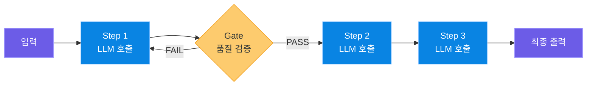

### 적용 시나리오

1. **문서 분석 파이프라인**: 문서 수집 -> 핵심 정보 추출 -> 분석 -> 보고서 생성
2. **다국어 콘텐츠 생성**: 주제 리서치 -> 원고 작성 -> 감수 -> 번역
3. **데이터 처리**: 비정형 데이터 파싱 -> 정규화 -> 검증 -> 구조화된 출력

### 코드 패턴

아래 코드는 `2.langchain/8.agents/9.agentic_patterns/9.1_prompt_chaining.py`를 기반으로 한 Prompt Chaining 구현입니다. 주제 리서치 -> 게이트 검증 -> 분석 -> 보고서 생성의 4단계 파이프라인을 구성합니다.

```python
# prompt_chaining.py -- 4단계 순차 파이프라인
# 참조: 2.langchain/8.agents/9.agentic_patterns/9.1_prompt_chaining.py
from langchain_openai import ChatOpenAI
from langchain_core.prompts import ChatPromptTemplate
from langchain_core.output_parsers import StrOutputParser

llm = ChatOpenAI(model="gpt-4o-mini", temperature=0.7)
parser = StrOutputParser()

# ── Step 1: 주제 리서치 ─────────────────────────────────
research_prompt = ChatPromptTemplate.from_template(
    "다음 주제에 대해 핵심 사실 5가지를 간결하게 정리해주세요.\n\n주제: {topic}"
)
research_chain = research_prompt | llm | parser

# ── Step 2: 게이트 검증 ─────────────────────────────────
gate_prompt = ChatPromptTemplate.from_template(
    """다음 리서치 결과를 평가해주세요.

리서치 결과:
{research}

평가 기준:
1. 사실 5가지가 포함되어 있는가?
2. 각 사실이 구체적이고 검증 가능한가?

'PASS' 또는 'FAIL'로만 답하고, FAIL인 경우 이유를 한 줄로 설명해주세요."""
)
gate_chain = gate_prompt | llm | parser

# ── Step 3: 심층 분석 ───────────────────────────────────
analysis_prompt = ChatPromptTemplate.from_template(
    """다음 리서치 결과를 바탕으로 심층 분석을 작성해주세요.

리서치 결과:
{research}

포함 사항: 핵심 트렌드, 시사점, 향후 전망"""
)
analysis_chain = analysis_prompt | llm | parser

# ── Step 4: 보고서 생성 ─────────────────────────────────
report_prompt = ChatPromptTemplate.from_template(
    """다음 리서치와 분석을 바탕으로 간결한 보고서를 작성해주세요.

리서치: {research}
분석: {analysis}

형식: 제목, 요약(3줄), 핵심 발견사항, 결론"""
)
report_chain = report_prompt | llm | parser
```

파이프라인의 실행은 각 단계의 출력을 다음 단계로 명시적으로 전달합니다. **게이트 검증 실패 시 이전 단계를 재실행**하는 로직이 핵심입니다.

```python
# pipeline_execution.py -- 게이트 검증이 포함된 파이프라인 실행
def run_chaining_pipeline(topic: str) -> str:
    """Prompt Chaining 파이프라인을 실행합니다."""
    # 1단계: 리서치
    research = research_chain.invoke({"topic": topic})

    # 2단계: 게이트 검증 — FAIL 시 재수행
    gate_result = gate_chain.invoke({"research": research})
    if "FAIL" in gate_result.upper():
        research = research_chain.invoke({"topic": topic})

    # 3단계: 분석
    analysis = analysis_chain.invoke({"research": research})

    # 4단계: 보고서 생성
    report = report_chain.invoke({"research": research, "analysis": analysis})
    return report

result = run_chaining_pipeline("2025년 생성형 AI 시장 동향")
```

### 게이트(Gate) 검증의 역할

게이트 검증은 Prompt Chaining의 품질을 보장하는 핵심 메커니즘입니다. 각 단계 사이에 삽입된 게이트가 중간 결과의 품질을 확인하고, 기준에 미달하면 해당 단계를 재실행합니다.

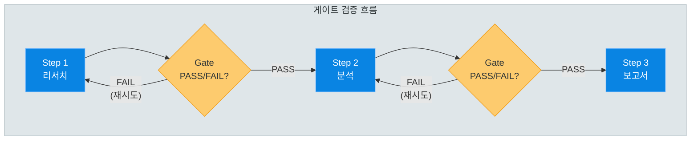

### 장단점

| 장점 | 단점 |
|------|------|
| 구현이 가장 단순하고 직관적 | 단계가 많아지면 레이턴시 누적 |
| 각 단계를 독립적으로 테스트 가능 | 동적으로 단계를 추가/제거할 수 없음 |
| 게이트 검증으로 품질 보장 | 병렬 처리 불가 (순차 실행) |
| 디버깅이 쉬움 (단계별 로그) | 실행 순서가 고정되어 유연성 부족 |
| LLM 비용 예측 가능 | 단계 간 강한 의존성 |

### 언제 사용하지 말아야 하는가

- 입력 유형에 따라 **다른 경로**가 필요한 경우 -> Routing
- 독립적인 작업을 **동시에** 실행할 수 있는 경우 -> Parallelization
- 작업의 수와 종류가 **입력에 따라 동적으로** 변하는 경우 -> Orchestrator-Worker

> **핵심 포인트:** Prompt Chaining은 "가장 단순한 에이전트 패턴"입니다. 고정된 단계로 분해할 수 있고, 각 단계의 출력이 다음 단계의 입력이 되는 순차적 작업에 적합합니다. 게이트 검증을 통해 중간 품질을 보장할 수 있습니다.

---

## 4. 패턴 2: Routing (동적 분기)

### 개념

Routing은 **입력의 특성에 따라 다른 처리 경로로 분기**하는 패턴입니다. LLM이 먼저 입력을 분류(classify)하고, 분류 결과에 따라 전문화된 체인으로 요청을 전달합니다.

- **분류기(Classifier)**: LLM이 입력을 사전 정의된 카테고리 중 하나로 분류합니다
- **전문화된 분기(Branch)**: 각 카테고리별로 최적화된 프롬프트와 처리 로직을 갖습니다
- **확장성**: 새 카테고리가 필요하면 분류기 프롬프트와 전문 체인만 추가하면 됩니다

Prompt Chaining이 "모든 입력을 같은 경로로 처리"한다면, Routing은 "입력에 맞는 최적의 경로를 선택"합니다.

### 아키텍처 다이어그램

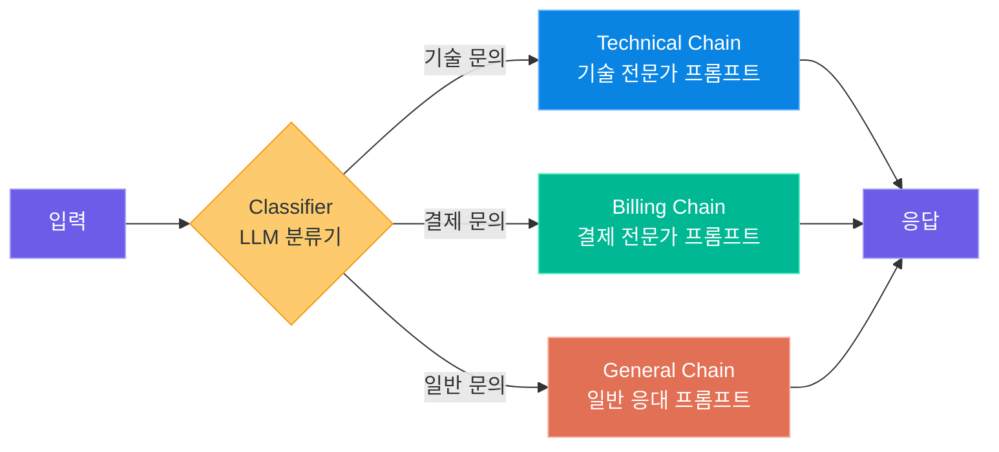

### 적용 시나리오

1. **고객 서비스 자동화**: 기술 지원, 결제 문의, 일반 문의 등 유형별 전문 응답
2. **멀티 도메인 Q&A**: 법률, 의학, 기술 등 분야별 전문가 라우팅
3. **난이도 기반 분기**: 간단한 질문은 소형 모델, 복잡한 질문은 대형 모델로 분배
4. **비용 최적화**: 단순 작업은 저가 모델, 정밀 작업은 고가 모델로 분기

### 코드 패턴

아래 코드는 `2.langchain/8.agents/9.agentic_patterns/9.2_routing.py`를 기반으로 한 Routing 구현입니다. 고객 문의를 3가지 카테고리로 분류하고 전문 체인으로 분기합니다.

```python
# routing.py -- 고객 문의 라우팅 시스템
# 참조: 2.langchain/8.agents/9.agentic_patterns/9.2_routing.py
from langchain_openai import ChatOpenAI
from langchain_core.prompts import ChatPromptTemplate
from langchain_core.output_parsers import StrOutputParser
from langchain_core.runnables import RunnableLambda

llm = ChatOpenAI(model="gpt-4o-mini", temperature=0)
parser = StrOutputParser()

# ── 1. 분류기 (Router) ──────────────────────────────────
classifier_prompt = ChatPromptTemplate.from_template(
    """다음 고객 문의를 분류해주세요. 반드시 아래 카테고리 중 하나만 출력하세요.

카테고리: technical, billing, general

고객 문의: {query}
카테고리:"""
)
classifier_chain = classifier_prompt | llm | parser

# ── 2. 전문 체인 정의 ───────────────────────────────────
technical_chain = ChatPromptTemplate.from_template(
    "당신은 기술 지원 전문가입니다. 단계별로 문제 해결 방법을 안내해주세요.\n\n문의: {query}"
) | llm | parser

billing_chain = ChatPromptTemplate.from_template(
    "당신은 결제 전문 상담원입니다. 정책을 안내하고 친절하게 응답해주세요.\n\n문의: {query}"
) | llm | parser

general_chain = ChatPromptTemplate.from_template(
    "당신은 친절한 고객 서비스 담당자입니다. 일반적인 문의에 도움을 주세요.\n\n문의: {query}"
) | llm | parser

# ── 3. 라우팅 로직 ──────────────────────────────────────
route_map = {
    "technical": technical_chain,
    "billing": billing_chain,
    "general": general_chain,
}

def route_query(inputs: dict) -> str:
    """분류 결과에 따라 적절한 체인으로 라우팅합니다."""
    query = inputs["query"]
    category = classifier_chain.invoke({"query": query}).strip().lower()
    chain = route_map.get(category, general_chain)  # fallback: general
    response = chain.invoke({"query": query})
    return f"[{category.upper()}] {response}"

routing_chain = RunnableLambda(route_query)

# 테스트
result = routing_chain.invoke({"query": "프로그램이 자꾸 충돌합니다"})
# → [TECHNICAL] 충돌 해결 단계별 안내...
```

### 분류기 설계 원칙

Routing 패턴의 성공은 **분류기의 정확도**에 달려 있습니다.

| 원칙 | 설명 |
|------|------|
| 카테고리를 명확하게 정의 | "technical", "billing"처럼 모호하지 않은 이름 사용 |
| 상호 배타적 카테고리 | 하나의 입력이 두 카테고리에 동시에 해당되지 않도록 설계 |
| 폴백(Fallback) 카테고리 | 분류가 불확실한 경우를 위한 기본 카테고리 준비 |
| 출력 형식 제한 | "반드시 카테고리 중 하나만 출력하세요"로 LLM 출력 제한 |
| 저온 설정 | 분류기에는 temperature=0을 사용하여 일관성 보장 |

### 다층 라우팅 아키텍처

복잡한 시스템에서는 라우팅을 여러 계층으로 구성할 수 있습니다. 첫 번째 라우터가 대분류를, 두 번째 라우터가 소분류를 담당합니다.

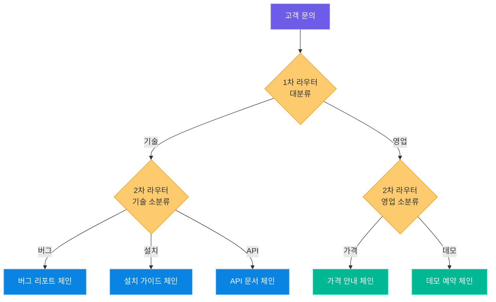

### 모델 기반 라우팅

카테고리뿐 아니라 **사용할 모델 자체를 라우팅**할 수도 있습니다. 난이도에 따라 적절한 모델을 선택하여 비용을 최적화합니다.

```python
# model_routing.py -- 난이도별 모델 라우팅
models = {
    "simple": ChatOpenAI(model="gpt-4o-mini", temperature=0.7),   # 빠르고 저렴
    "complex": ChatOpenAI(model="gpt-4o", temperature=0),          # 정확하고 강력
}

difficulty_prompt = ChatPromptTemplate.from_template(
    """질문의 난이도를 판단하세요.
- simple: 사실 확인, 간단한 설명
- complex: 분석, 비교, 추론 필요
질문: {query}
난이도:"""
)

def route_by_difficulty(inputs: dict) -> str:
    difficulty = (difficulty_prompt | llm | parser).invoke(inputs).strip().lower()
    model = models.get(difficulty, models["simple"])
    return model.invoke(inputs["query"]).content
```

### 장단점

| 장점 | 단점 |
|------|------|
| 전문화된 프롬프트로 응답 품질 향상 | 분류 오류 시 잘못된 경로로 진행 |
| 새 카테고리 추가가 용이 | 카테고리 수가 많으면 분류 정확도 저하 |
| 비용 최적화 가능 (모델 라우팅) | 분류를 위한 추가 LLM 호출 비용 |
| 관심사 분리 원칙 준수 | 카테고리 간 경계가 모호한 경우 처리 어려움 |

> **핵심 포인트:** Routing은 "입력에 최적화된 처리 경로를 선택"하는 패턴입니다. 분류기의 정확도가 전체 시스템의 성능을 좌우하므로, 명확한 카테고리 정의와 폴백 전략이 중요합니다.

---

## 5. 패턴 3: Parallelization (병렬 처리)

### 개념

Parallelization은 **독립적인 작업을 동시에 실행하고 결과를 합성**하는 패턴입니다. 두 가지 하위 패턴이 있습니다.

1. **팬아웃/팬인(Fan-out/Fan-in)**: 하나의 입력을 여러 관점으로 동시 분석 후 종합
2. **투표(Voting)**: 여러 LLM이 독립적으로 판단하고 다수결로 최종 결정

### 아키텍처 다이어그램

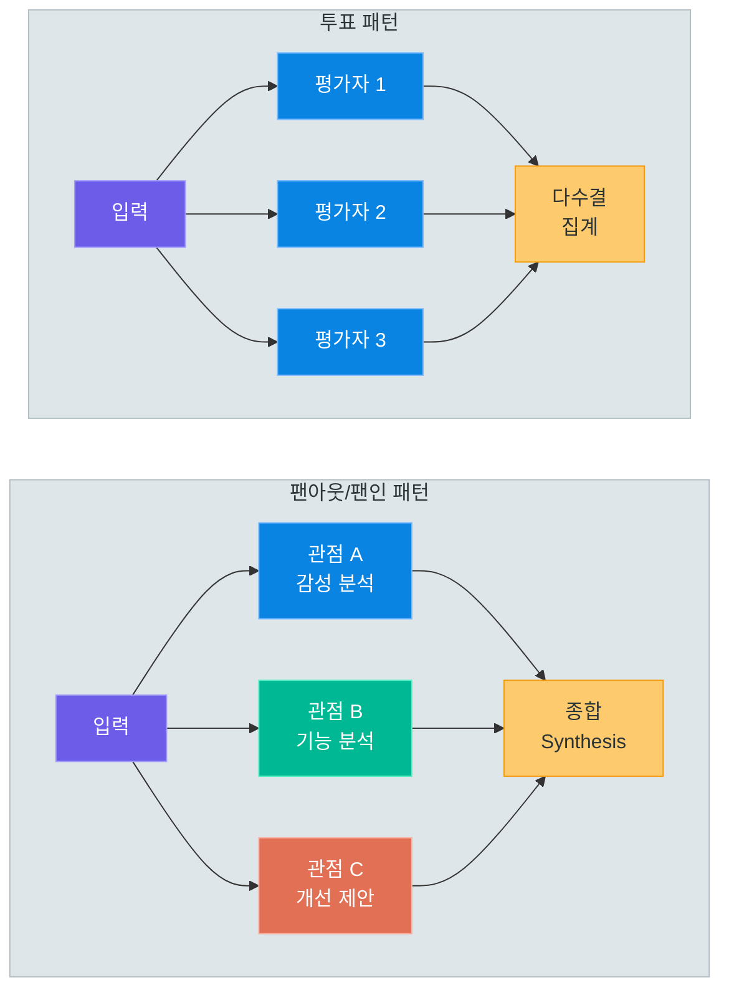

### 적용 시나리오

1. **다관점 분석**: 제품 리뷰를 감성, 기능, 개선점 관점에서 동시 분석
2. **콘텐츠 모더레이션**: 여러 평가자가 독립적으로 유해성을 판단하고 다수결
3. **앙상블 판단**: 여러 모델의 의견을 종합하여 편향을 줄이고 정확도 향상
4. **다중 소스 정보 수집**: 여러 데이터 소스에서 동시에 정보를 수집

### 코드 패턴: 팬아웃/팬인

아래 코드는 `2.langchain/8.agents/9.agentic_patterns/9.3_parallelization.py`를 기반으로 한 팬아웃/팬인 구현입니다. 제품 리뷰를 3가지 관점에서 동시에 분석합니다.

```python
# parallelization_fanout.py -- 팬아웃/팬인: 다관점 동시 분석
# 참조: 2.langchain/8.agents/9.agentic_patterns/9.3_parallelization.py
from langchain_openai import ChatOpenAI
from langchain_core.prompts import ChatPromptTemplate
from langchain_core.output_parsers import StrOutputParser
from langchain_core.runnables import RunnableParallel

llm = ChatOpenAI(model="gpt-4o-mini", temperature=0.7)
parser = StrOutputParser()

# 3가지 관점의 분석 체인
sentiment_prompt = ChatPromptTemplate.from_template(
    "다음 리뷰의 감성(긍정/부정/중립)을 분석하세요.\n\n리뷰: {review}"
)
feature_prompt = ChatPromptTemplate.from_template(
    "다음 리뷰에서 언급된 제품 기능과 평가를 추출하세요.\n\n리뷰: {review}"
)
action_prompt = ChatPromptTemplate.from_template(
    "다음 리뷰를 바탕으로 제품 개선 제안을 정리하세요.\n\n리뷰: {review}"
)

# RunnableParallel로 3개 체인을 동시 실행 (팬아웃)
parallel_analysis = RunnableParallel(
    sentiment=sentiment_prompt | llm | parser,
    features=feature_prompt | llm | parser,
    actions=action_prompt | llm | parser,
)

# 종합 체인 (팬인)
synthesis_prompt = ChatPromptTemplate.from_template(
    """3가지 분석 결과를 종합하여 최종 보고서를 작성하세요.

감성 분석: {sentiment}
기능 분석: {features}
개선 제안: {actions}

종합 보고서 (3~5줄):"""
)
synthesis_chain = synthesis_prompt | llm | parser

# 실행
review = "이 노트북은 화면이 선명하고 키보드가 좋지만 배터리가 3시간밖에 안 갑니다."
analysis_results = parallel_analysis.invoke({"review": review})  # 팬아웃
final_report = synthesis_chain.invoke(analysis_results)           # 팬인
```

### 코드 패턴: 투표(Voting)

투표 패턴은 여러 LLM이 독립적으로 판단하고 다수결로 최종 결정을 내립니다.

```python
# parallelization_voting.py -- 투표 패턴: 다수결 의사결정
# 참조: 2.langchain/8.agents/9.agentic_patterns/9.3_parallelization.py
vote_prompt = ChatPromptTemplate.from_template(
    """번역 품질을 평가하세요.
원문: {original}
번역: {translation}
'GOOD' 또는 'BAD'로만 답하세요."""
)

# 3명의 독립 평가자 (temperature를 다르게 설정하여 다양성 확보)
voter1 = vote_prompt | ChatOpenAI(model="gpt-4o-mini", temperature=0.0) | parser
voter2 = vote_prompt | ChatOpenAI(model="gpt-4o-mini", temperature=0.5) | parser
voter3 = vote_prompt | ChatOpenAI(model="gpt-4o-mini", temperature=1.0) | parser

voting_panel = RunnableParallel(voter1=voter1, voter2=voter2, voter3=voter3)

# 투표 실행 및 다수결 집계
votes = voting_panel.invoke({
    "original": "The quick brown fox jumps over the lazy dog.",
    "translation": "빠른 갈색 여우가 게으른 개를 뛰어넘습니다.",
})
good_count = sum(1 for v in votes.values() if "GOOD" in v.upper())
bad_count = sum(1 for v in votes.values() if "BAD" in v.upper())
final_verdict = "GOOD" if good_count > bad_count else "BAD"
```

### 팬아웃/팬인 vs 투표 비교

| 구분 | 팬아웃/팬인 | 투표 |
|------|-------------|------|
| 목적 | 다양한 관점의 분석 결과 종합 | 독립적인 판단의 다수결 합의 |
| 각 분기의 역할 | 서로 다른 분석 수행 | 동일한 판단을 독립적으로 수행 |
| 결과 합성 | LLM이 종합 보고서 생성 | 프로그래밍 로직으로 다수결 집계 |
| 프롬프트 | 분기별로 다른 프롬프트 | 모든 분기가 동일한 프롬프트 |

### RunnableParallel의 동작 방식

LangChain의 `RunnableParallel`은 내부적으로 비동기 실행을 사용합니다. 전체 실행 시간은 가장 느린 체인의 실행 시간에 수렴합니다.

```
순차 실행: Step A (2s) -> Step B (3s) -> Step C (1s) = 총 6초
병렬 실행: Step A (2s) | Step B (3s) | Step C (1s) = 총 3초 (가장 긴 시간)
```

### 장단점

| 장점 | 단점 |
|------|------|
| 실행 시간 단축 (병렬 실행) | 독립적인 작업만 가능 (의존성 있으면 불가) |
| 다관점 분석으로 편향 감소 | LLM 호출 수가 분기 수만큼 증가 (비용) |
| 투표로 판단의 신뢰도 향상 | 결과 합성 로직이 추가로 필요 |
| 앙상블 효과로 정확도 향상 | 메모리 사용량 증가 (동시 실행) |

> **핵심 포인트:** Parallelization은 독립적인 작업을 동시에 실행하여 시간을 절약하고 다양한 관점을 확보합니다. 팬아웃/팬인은 분석의 다양성을, 투표는 판단의 신뢰도를 높입니다. `RunnableParallel`이 병렬 실행을 자동으로 처리합니다.

---

## 6. 패턴 4: Orchestrator-Worker (오케스트레이터-워커)

### 개념

Orchestrator-Worker는 **중앙 오케스트레이터가 작업을 동적으로 분해하고, 워커에게 분배한 후, 결과를 종합**하는 패턴입니다. Parallelization과 비슷해 보이지만 핵심적인 차이가 있습니다.

| 구분 | Parallelization | Orchestrator-Worker |
|------|-----------------|---------------------|
| 작업 분해 | 설계 시점에 고정 | **런타임에 동적** |
| 분기 수 | 미리 결정됨 | 입력에 따라 변함 |
| 분기 내용 | 미리 정의된 관점 | LLM이 내용을 결정 |
| 오케스트레이터 | 없음 (단순 팬아웃) | LLM이 작업 분해 담당 |

오케스트레이터가 "이 코드를 리뷰하라"는 요청을 받으면, **보안, 성능, 코드 품질**로 분해할 수 있습니다. 다른 요청에서는 **아키텍처, 테스트 커버리지, 문서화**로 분해할 수도 있습니다. 작업 분해 자체가 LLM의 판단에 의해 동적으로 이루어지는 것이 핵심입니다.

### 아키텍처 다이어그램

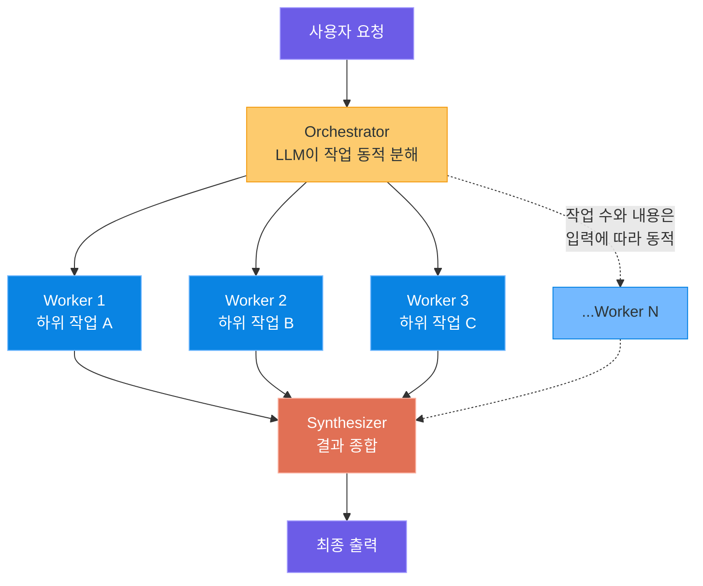

### 적용 시나리오

1. **복합 리서치**: "AI 산업 보고서 작성" -> 시장 규모, 주요 플레이어, 기술 트렌드, 규제 동향 조사
2. **코드 리뷰**: "웹 크롤러 리뷰" -> 보안 분석, 성능 분석, 코드 품질 분석
3. **프로젝트 계획**: "앱 개발 계획" -> 요구사항 정리, 기술 스택 선정, 일정 산정

### 코드 패턴

아래 코드는 `2.langchain/8.agents/9.agentic_patterns/9.4_orchestrator_worker.py`를 기반으로 한 Orchestrator-Worker 구현입니다. LangGraph의 `StateGraph`로 상태를 관리합니다.

```python
# orchestrator_worker.py -- 동적 작업 분해 + 워커 위임 + 종합
# 참조: 2.langchain/8.agents/9.agentic_patterns/9.4_orchestrator_worker.py
import json
from typing import TypedDict, List
from langchain_openai import ChatOpenAI
from langchain_core.messages import HumanMessage, SystemMessage
from langgraph.graph import StateGraph, START, END

llm = ChatOpenAI(model="gpt-4o-mini", temperature=0)


# ── 1. 상태 정의 ────────────────────────────────────────
class OrchestratorState(TypedDict):
    request: str           # 원본 요청
    subtasks: List[str]    # 분해된 하위 작업 목록
    results: List[str]     # 각 워커의 결과
    final_output: str      # 종합 최종 출력


# ── 2. 오케스트레이터 노드 — 작업 분해 ──────────────────
def orchestrator(state: OrchestratorState) -> dict:
    """요청을 분석하고 하위 작업으로 동적 분해합니다."""
    response = llm.invoke([
        SystemMessage(content="""작업 분해 전문가입니다.
요청을 2~4개의 독립적인 하위 작업으로 분해하세요.
JSON 배열 형식으로만 답하세요. 예: ["작업1", "작업2", "작업3"]"""),
        HumanMessage(content=f"요청: {state['request']}")
    ])
    try:
        subtasks = json.loads(response.content)
    except json.JSONDecodeError:
        subtasks = [state["request"]]
    return {"subtasks": subtasks, "results": []}


# ── 3. 워커 노드 — 하위 작업 실행 ────────────────────────
def worker(state: OrchestratorState) -> dict:
    """각 하위 작업을 실행합니다."""
    results = []
    for i, subtask in enumerate(state["subtasks"], 1):
        response = llm.invoke([
            SystemMessage(content="주어진 작업을 수행하고 결과를 간결하게 보고하세요."),
            HumanMessage(content=subtask)
        ])
        results.append(f"[작업 {i}] {subtask}\n결과: {response.content}")
    return {"results": results}


# ── 4. 종합 노드 — 결과 통합 ────────────────────────────
def synthesizer(state: OrchestratorState) -> dict:
    """모든 워커 결과를 종합합니다."""
    all_results = "\n\n".join(state["results"])
    response = llm.invoke([
        SystemMessage(content="하위 작업 결과를 종합하여 하나의 완성된 보고서로 통합하세요."),
        HumanMessage(content=f"원본 요청: {state['request']}\n\n결과:\n{all_results}")
    ])
    return {"final_output": response.content}


# ── 5. LangGraph 워크플로우 구성 ─────────────────────────
graph = StateGraph(OrchestratorState)
graph.add_node("orchestrator", orchestrator)
graph.add_node("worker", worker)
graph.add_node("synthesizer", synthesizer)
graph.add_edge(START, "orchestrator")
graph.add_edge("orchestrator", "worker")
graph.add_edge("worker", "synthesizer")
graph.add_edge("synthesizer", END)

app = graph.compile()

# 실행
result = app.invoke({
    "request": "Python 웹 크롤러를 보안, 성능, 품질 관점에서 리뷰해주세요.",
    "subtasks": [], "results": [], "final_output": "",
})
print(result["final_output"])
```

### Send API를 사용한 병렬 워커

LangGraph의 `Send` API를 사용하면 오케스트레이터가 분해한 하위 작업을 **병렬로** 실행할 수 있습니다. 이는 Parallelization 패턴을 Orchestrator-Worker 안에 내포하는 형태입니다.

```python
# parallel_workers.py -- Send API로 워커를 병렬 실행
from langgraph.types import Send
import operator
from typing import Annotated

class ParallelOrcState(TypedDict):
    request: str
    subtasks: list[str]
    results: Annotated[list[str], operator.add]  # 리듀서: 결과 누적
    final_output: str

class SingleTaskState(TypedDict):
    task: str
    results: Annotated[list[str], operator.add]

def distribute_tasks(state: ParallelOrcState) -> list[Send]:
    """오케스트레이터가 분해한 작업을 병렬 워커로 분배합니다."""
    return [Send("parallel_worker", {"task": t, "results": []})
            for t in state["subtasks"]]

def parallel_worker(state: SingleTaskState) -> dict:
    """개별 하위 작업을 실행합니다."""
    response = llm.invoke([HumanMessage(content=state["task"])])
    return {"results": [f"{state['task']}: {response.content}"]}

# 그래프: orchestrator → Send(병렬 워커) → synthesizer
graph = StateGraph(ParallelOrcState)
graph.add_node("orchestrator", orchestrator)
graph.add_node("parallel_worker", parallel_worker)
graph.add_node("synthesizer", synthesizer)
graph.add_edge(START, "orchestrator")
graph.add_conditional_edges("orchestrator", distribute_tasks)
graph.add_edge("parallel_worker", "synthesizer")
graph.add_edge("synthesizer", END)
```

### LangGraph 실행 흐름

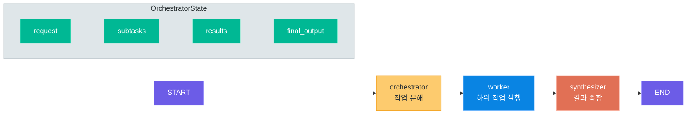

### 오케스트레이터 프롬프트 설계 원칙

| 원칙 | 나쁜 예 | 좋은 예 |
|------|---------|---------|
| 독립성: 작업 간 의존 없어야 | "A를 먼저 한 후 B 수행" | "A와 B를 각각 수행" |
| 구체성: 명확한 범위 | "코드를 분석하라" | "보안 취약점을 분석하라" |
| 제한된 수: 2~4개 | 10개의 세부 작업 | 3개의 핵심 작업 |
| 구조화된 출력 | 자유 형식 텍스트 | `["작업1", "작업2"]` |

### 장단점

| 장점 | 단점 |
|------|------|
| 입력에 따라 작업을 유연하게 분해 | 오케스트레이터의 분해 품질에 의존 |
| LLM이 도메인 지식으로 최적 분해 | LLM 호출 수 예측 어려움 (비용 변동) |
| Send API로 병렬 실행 가능 | 구현 복잡도가 높음 (상태 관리 필요) |
| 종합 단계에서 일관성 보장 | 오케스트레이터 + 워커 + 종합 = 최소 3단계 |

> **핵심 포인트:** Orchestrator-Worker는 "LLM이 작업을 동적으로 분해"하는 것이 핵심입니다. Parallelization과 달리 작업의 수와 내용이 런타임에 결정됩니다. LangGraph의 StateGraph로 상태를 관리하고, Send API로 워커를 병렬 실행할 수 있습니다.

---

## 7. 패턴 5: Evaluator-Optimizer (평가자-최적화)

### 개념

Evaluator-Optimizer는 **생성자(Generator)가 출력을 만들고, 평가자(Evaluator)가 품질을 검증하며, 기준에 미달하면 피드백을 반영하여 재생성하는 반복 루프**입니다. 5가지 패턴 중 자율성이 가장 높으며, LLM이 스스로의 출력을 평가하고 개선하는 self-correcting 메커니즘을 구현합니다.

- **반복 루프**: 생성 -> 평가 -> (피드백 반영) -> 재생성을 반복합니다
- **종료 조건**: 품질 기준 충족 또는 최대 반복 횟수 도달 시 종료합니다
- **역할 분리**: 생성자와 평가자는 서로 다른 프롬프트(또는 모델)를 사용합니다

### 아키텍처 다이어그램

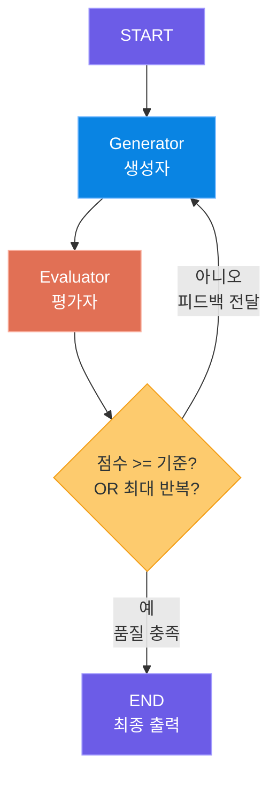

### 적용 시나리오

1. **코드 생성 + 검증**: 코드 생성 -> 테스트 실행 -> 실패 시 수정 -> 재테스트
2. **글쓰기 개선**: 초안 작성 -> 품질 평가 -> 피드백 반영 -> 재작성
3. **마케팅 카피**: 슬로건 생성 -> 다기준 평가 -> 피드백 기반 개선
4. **번역 품질 향상**: 번역 -> 정확도/자연스러움 평가 -> 수정 -> 재평가

### 코드 패턴

아래 코드는 `2.langchain/8.agents/9.agentic_patterns/9.5_evaluator_optimizer.py`를 기반으로 한 구현입니다. LangGraph의 순환 그래프(conditional_edges)로 반복 루프를 구성합니다.

```python
# evaluator_optimizer.py -- 생성->평가->개선 순환 루프
# 참조: 2.langchain/8.agents/9.agentic_patterns/9.5_evaluator_optimizer.py
from typing import TypedDict, List
from langchain_openai import ChatOpenAI
from langchain_core.messages import HumanMessage, SystemMessage
from langgraph.graph import StateGraph, START, END

# 생성자는 창의적(temperature=0.7), 평가자는 일관적(temperature=0)
llm = ChatOpenAI(model="gpt-4o-mini", temperature=0.7)
evaluator_llm = ChatOpenAI(model="gpt-4o-mini", temperature=0)


# ── 1. 상태 정의 ────────────────────────────────────────
class EvalOptState(TypedDict):
    task: str                  # 원본 작업
    current_output: str        # 현재 생성물
    feedback: str              # 평가자 피드백
    score: int                 # 평가 점수 (1~10)
    iteration: int             # 현재 반복 횟수
    history: List[str]         # 이전 생성물 기록


# ── 2. 생성자 노드 ──────────────────────────────────────
def generator(state: EvalOptState) -> dict:
    """초기 생성 또는 피드백 기반 개선을 수행합니다."""
    iteration = state["iteration"] + 1

    if state["feedback"]:
        # 피드백이 있으면 -> 개선 모드
        prompt = f"""이전 결과를 피드백을 반영하여 개선하세요.
작업: {state['task']}
이전 결과: {state['current_output']}
피드백: {state['feedback']}
개선된 결과:"""
    else:
        # 초기 생성 모드
        prompt = f"다음 작업을 수행하세요.\n\n작업: {state['task']}\n\n결과:"

    response = llm.invoke([HumanMessage(content=prompt)])
    history = state["history"] + [response.content]
    return {"current_output": response.content, "iteration": iteration, "history": history}


# ── 3. 평가자 노드 ──────────────────────────────────────
def evaluator(state: EvalOptState) -> dict:
    """생성물의 품질을 평가하고 피드백을 제공합니다."""
    response = evaluator_llm.invoke([
        SystemMessage(content="""품질 평가 전문가입니다.
평가 기준: 주목성, 명확성, 설득력, 간결성
반드시 다음 형식으로 답하세요:
점수: [1~10 숫자]
피드백: [구체적인 개선 사항]"""),
        HumanMessage(content=f"작업: {state['task']}\n\n평가 대상:\n{state['current_output']}")
    ])

    result = response.content
    # 점수 파싱
    score = 5
    for line in result.split("\n"):
        if "점수" in line:
            digits = "".join(c for c in line if c.isdigit())
            if digits:
                score = min(10, max(1, int(digits[:2])))
                break
    # 피드백 파싱
    feedback = result
    for line in result.split("\n"):
        if "피드백" in line:
            feedback = line.split(":", 1)[-1].strip()
            break
    return {"score": score, "feedback": feedback}


# ── 4. 조건부 라우팅 ────────────────────────────────────
def should_continue(state: EvalOptState) -> str:
    if state["score"] >= 8:      return "end"       # 품질 기준 충족
    if state["iteration"] >= 3:  return "end"       # 최대 반복 도달
    return "continue"                                # 재생성


# ── 5. 순환 그래프 구성 ─────────────────────────────────
graph = StateGraph(EvalOptState)
graph.add_node("generator", generator)
graph.add_node("evaluator", evaluator)
graph.add_edge(START, "generator")
graph.add_edge("generator", "evaluator")
graph.add_conditional_edges(
    "evaluator", should_continue,
    {"continue": "generator", "end": END},   # 순환 엣지!
)

app = graph.compile()

# 실행
result = app.invoke({
    "task": "AI 코딩 교육 플랫폼의 30자 이내 마케팅 슬로건을 작성해주세요.",
    "current_output": "", "feedback": "", "score": 0, "iteration": 0, "history": [],
})
print(f"최종 결과 (반복 {result['iteration']}회, 점수 {result['score']}/10):")
print(result["current_output"])
```

### 반복 개선 과정 시각화

`history` 필드에 각 버전이 기록되므로 개선 과정을 투명하게 추적할 수 있습니다.

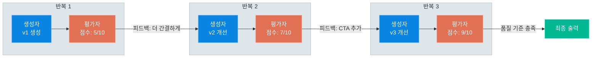

### 생성자와 평가자의 역할 분리

| 구분 | 생성자(Generator) | 평가자(Evaluator) |
|------|-------------------|-------------------|
| 역할 | 창의적 콘텐츠 생성 | 객관적 품질 평가 |
| temperature | 높음 (0.7~1.0) | 낮음 (0~0.3) |
| 프롬프트 스타일 | "작성하세요", "만들어주세요" | "평가하세요", "점수를 매기세요" |
| 출력 형식 | 자유 형식 텍스트 | 구조화된 형식 (점수 + 피드백) |

이 역할 분리는 소프트웨어의 코드 리뷰와 유사한 **검사자-생산자 분리 원칙**을 따릅니다.

### 종료 조건 설계

반복 루프의 종료 조건은 신중하게 설계해야 합니다. 잘못된 종료 조건은 무한 루프나 불필요한 반복으로 이어집니다.

| 종료 조건 | 설명 | 주의사항 |
|-----------|------|----------|
| 점수 임계값 | 평가 점수가 기준 이상이면 종료 | 임계값이 너무 높으면 종료 불가 |
| 최대 반복 횟수 | N회 반복 후 강제 종료 | 안전장치로 반드시 설정 |
| 점수 정체 | 연속 N회 점수 변화가 없으면 종료 | 더 이상 개선 불가 판단 |

### 장단점

| 장점 | 단점 |
|------|------|
| 반복적 개선으로 높은 품질 보장 | 반복 횟수만큼 LLM 호출 비용 증가 |
| 자동화된 품질 검증 메커니즘 | 레이턴시 누적 (반복 x 2회 LLM 호출) |
| 개선 과정의 투명한 추적 가능 | 평가자의 평가가 편향될 수 있음 |
| 생성자-평가자 역할 분리로 견고함 | 무한 루프 방지를 위한 안전장치 필수 |

> **핵심 포인트:** Evaluator-Optimizer는 "자기 교정(Self-Correction)" 메커니즘을 구현합니다. 생성자와 평가자의 역할 분리, 구조화된 피드백, 그리고 안전한 종료 조건이 성공의 열쇠입니다. LangGraph의 순환 그래프(conditional_edges)가 이 반복 루프를 자연스럽게 표현합니다.

---

## 8. 패턴 선택 가이드

### 의사결정 플로차트

다음 플로차트는 문제의 특성에 따라 적합한 패턴을 선택하는 가이드입니다.

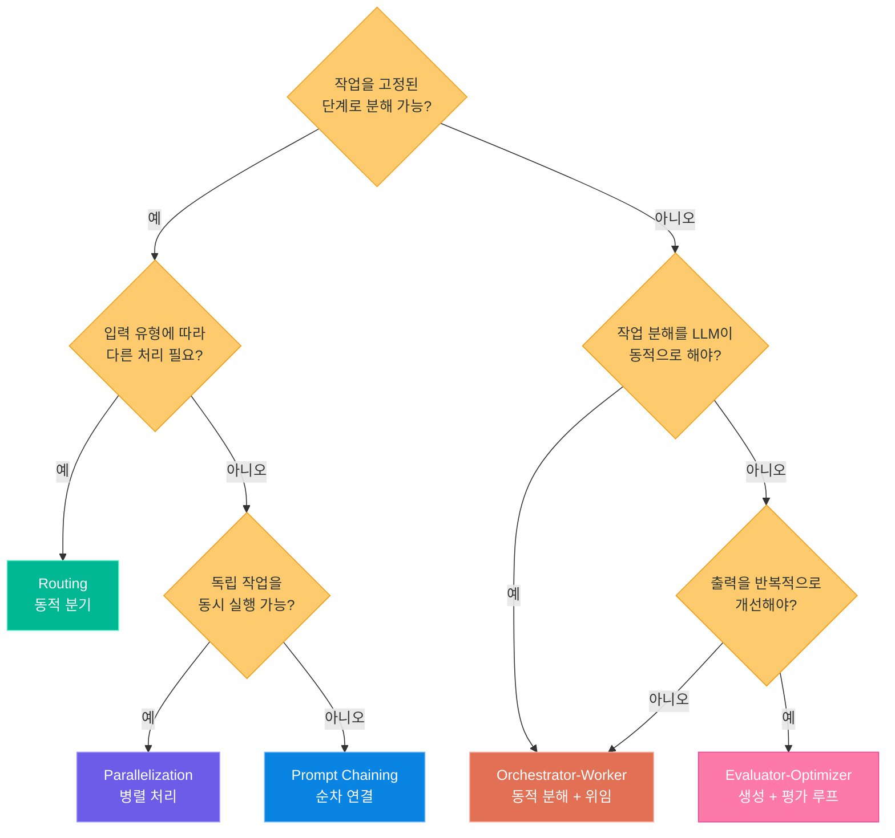

### 패턴 조합 전략

실무에서는 단일 패턴만으로 문제를 해결하기 어려운 경우가 많습니다. 여러 패턴을 조합하여 복잡한 에이전트 시스템을 구축할 수 있습니다.

#### 조합 1: Chaining + Routing

순차적 파이프라인 중간에 라우팅을 삽입합니다. 전처리 -> 분류 -> 전문 처리 -> 후처리 형태입니다.

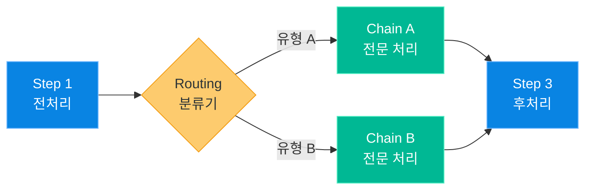

#### 조합 2: Orchestrator-Worker + Evaluator-Optimizer

오케스트레이터가 작업을 분해하고, 각 워커의 결과를 평가자가 검증하여 품질을 보장합니다.

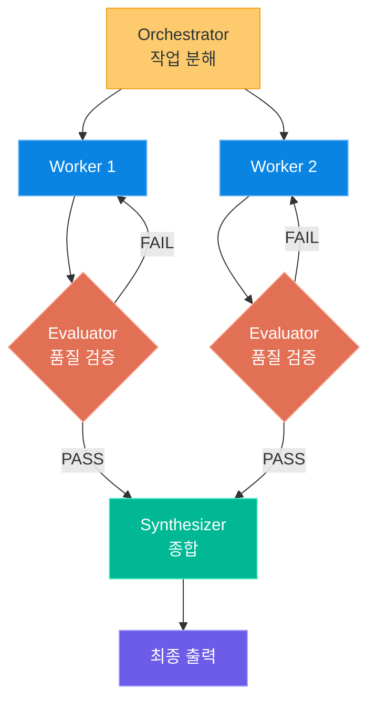

#### 조합 3: Parallelization + Evaluator-Optimizer

병렬로 여러 버전을 생성하고, 평가자가 최고 품질을 선택합니다.

```python
# parallel_eval.py -- 병렬 생성 + 평가 선택
from langchain_core.runnables import RunnableParallel

parallel_gen = RunnableParallel(
    formal=formal_chain,
    casual=casual_chain,
    creative=creative_chain,
)

candidates = parallel_gen.invoke({"task": task})
best = evaluator_chain.invoke({"candidates": candidates, "criteria": "명확성, 설득력"})
```

### 조합 패턴 정리표

| 조합 | 설명 | 사용 사례 |
|------|------|-----------|
| Chaining + Routing | 파이프라인 중간에 분기 | 전처리 -> 분류 -> 전문 처리 |
| Chaining + Parallelization | 파이프라인 한 단계를 병렬화 | 리서치 -> 병렬 분석 -> 종합 |
| Routing + Parallelization | 분기에 따라 병렬/단일 선택 | 복잡 질문은 병렬, 단순은 단일 |
| Orchestrator + Evaluator | 워커 결과를 평가자가 검증 | 품질 보장이 필요한 복합 작업 |
| Parallelization + Evaluator | 여러 후보 생성 후 최적 선택 | 창의적 콘텐츠 최적화 |

> **핵심 포인트:** 패턴 조합은 단일 패턴의 한계를 보완합니다. Chaining + Routing은 가장 흔한 조합이고, Orchestrator + Evaluator는 가장 강력한 조합입니다. 항상 가장 단순한 조합부터 시작하세요.

---

## 9. 패턴 조합 실전 예제

### 복합 에이전트 아키텍처: AI 블로그 작성 시스템

5가지 패턴을 모두 활용한 실전 예제입니다. 주제를 받아 리서치하고, 블로그 글을 작성하며, 품질을 검증하는 복합 시스템입니다.

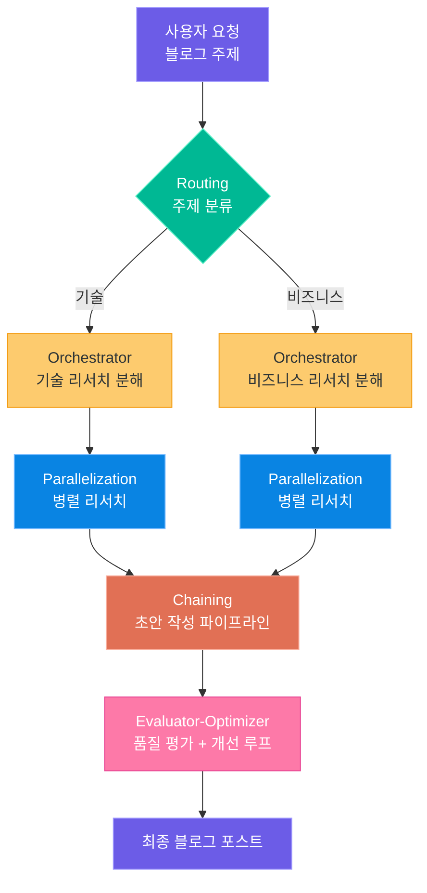

실행 흐름은 다음과 같습니다.

1. **Routing**: 사용자가 입력한 주제를 "기술", "비즈니스" 등으로 분류
2. **Orchestrator-Worker**: 분류된 주제에 맞는 리서치 작업을 동적으로 분해
3. **Parallelization**: 분해된 리서치 작업을 병렬로 실행
4. **Prompt Chaining**: 리서치 결과 -> 개요 작성 -> 본문 작성 -> 편집 파이프라인
5. **Evaluator-Optimizer**: 완성된 글의 품질을 평가하고, 기준에 미달하면 개선

```python
# blog_agent.py -- 5대 패턴 조합 블로그 작성 에이전트
import json
from typing import TypedDict, List
from langchain_openai import ChatOpenAI
from langchain_core.messages import HumanMessage, SystemMessage
from langgraph.graph import StateGraph, START, END

llm = ChatOpenAI(model="gpt-4o-mini", temperature=0.7)
eval_llm = ChatOpenAI(model="gpt-4o-mini", temperature=0)


class BlogState(TypedDict):
    topic: str               # 블로그 주제
    category: str            # 주제 카테고리 (Routing)
    research_tasks: List[str]   # 리서치 하위 작업 (Orchestrator)
    research_results: List[str] # 리서치 결과 (Parallelization)
    outline: str             # 글 개요 (Chaining Step 1)
    final_post: str          # 최종 포스트
    feedback: str            # 평가자 피드백
    score: int               # 평가 점수
    iteration: int           # 반복 횟수


# 1. Routing: 주제 분류
def classify_topic(state: BlogState) -> dict:
    response = llm.invoke([
        SystemMessage(content="주제를 tech 또는 business로 분류하세요. 한 단어만."),
        HumanMessage(content=state["topic"])
    ])
    return {"category": response.content.strip().lower()}

# 2. Orchestrator: 리서치 작업 분해
def plan_research(state: BlogState) -> dict:
    response = llm.invoke([
        SystemMessage(content='블로그 리서치용 2~3개 하위 작업을 JSON 배열로 출력하세요.'),
        HumanMessage(content=f"주제: {state['topic']} ({state['category']})")
    ])
    try:
        tasks = json.loads(response.content)
    except json.JSONDecodeError:
        tasks = [f"{state['topic']}에 대해 조사"]
    return {"research_tasks": tasks}

# 3. Parallelization: 병렬 리서치 실행
def execute_research(state: BlogState) -> dict:
    results = []
    for task in state["research_tasks"]:
        response = llm.invoke([
            SystemMessage(content="리서치 작업을 수행하고 결과를 요약하세요."),
            HumanMessage(content=task)
        ])
        results.append(response.content)
    return {"research_results": results}

# 4. Chaining: 개요 -> 초안 작성
def write_outline(state: BlogState) -> dict:
    research = "\n".join(state["research_results"])
    response = llm.invoke([
        SystemMessage(content="리서치 결과를 바탕으로 블로그 개요를 작성하세요."),
        HumanMessage(content=f"주제: {state['topic']}\n리서치:\n{research}")
    ])
    return {"outline": response.content}

def write_draft(state: BlogState) -> dict:
    if state["feedback"]:
        prompt = f"피드백을 반영하여 개선하세요.\n이전 글: {state['final_post']}\n피드백: {state['feedback']}"
    else:
        prompt = f"개요를 바탕으로 블로그 글을 작성하세요.\n개요: {state['outline']}"
    response = llm.invoke([HumanMessage(content=prompt)])
    return {"final_post": response.content, "iteration": state["iteration"] + 1}

# 5. Evaluator-Optimizer: 품질 평가 + 개선
def evaluate_post(state: BlogState) -> dict:
    response = eval_llm.invoke([
        SystemMessage(content="블로그 글을 평가하세요.\n점수: [1~10]\n피드백: [개선 사항]"),
        HumanMessage(content=state["final_post"])
    ])
    result = response.content
    score = 5
    for line in result.split("\n"):
        if "점수" in line:
            digits = "".join(c for c in line if c.isdigit())
            if digits:
                score = min(10, max(1, int(digits[:2])))
                break
    return {"score": score, "feedback": result}

def should_improve(state: BlogState) -> str:
    if state["score"] >= 8 or state["iteration"] >= 3:
        return "end"
    return "improve"


# 그래프 구성
graph = StateGraph(BlogState)
graph.add_node("classify", classify_topic)
graph.add_node("plan", plan_research)
graph.add_node("research", execute_research)
graph.add_node("outline", write_outline)
graph.add_node("draft", write_draft)
graph.add_node("evaluate", evaluate_post)

graph.add_edge(START, "classify")
graph.add_edge("classify", "plan")
graph.add_edge("plan", "research")
graph.add_edge("research", "outline")
graph.add_edge("outline", "draft")
graph.add_edge("draft", "evaluate")
graph.add_conditional_edges("evaluate", should_improve, {"improve": "draft", "end": END})

app = graph.compile()
```

### 패턴별 비용과 레이턴시 특성

| 패턴 | LLM 호출 수 | 레이턴시 특성 | 비용 예측성 |
|------|-------------|---------------|-------------|
| Prompt Chaining | 고정 (N단계) | N x 단일 호출 시간 | 높음 |
| Routing | 2회 (분류 + 처리) | 2 x 단일 호출 시간 | 높음 |
| Parallelization | 고정 (M + 1) | max(M개 호출) + 종합 | 높음 |
| Orchestrator-Worker | 동적 (1 + N + 1) | 분해 + max(N개) + 종합 | 중간 |
| Evaluator-Optimizer | 동적 (2 x 반복) | 반복 x (생성 + 평가) | 낮음 |

### 프로덕션 안전장치

프로덕션 환경에서는 반드시 다음 안전장치를 설정하세요.

```python
# production_safety.py -- 프로덕션 에이전트 안전장치
from langgraph.errors import GraphRecursionError

# 1. 재귀 제한: 무한 루프 방지
try:
    result = app.invoke(initial_state, config={"recursion_limit": 25})
except GraphRecursionError:
    result = {"error": "최대 반복 횟수 초과"}

# 2. 타임아웃: 전체 실행 시간 제한
import asyncio

async def invoke_with_timeout(app, state, timeout=60):
    try:
        return await asyncio.wait_for(app.ainvoke(state), timeout=timeout)
    except asyncio.TimeoutError:
        return {"error": f"실행 시간 {timeout}초 초과"}

# 3. 비용 추적: LLM 호출 횟수 모니터링
class CostTracker:
    def __init__(self, max_calls: int = 20):
        self.call_count = 0
        self.max_calls = max_calls

    def check(self):
        self.call_count += 1
        if self.call_count > self.max_calls:
            raise RuntimeError(f"최대 LLM 호출 수({self.max_calls}) 초과")
```

### 실전 설계 체크리스트

| 단계 | 점검 항목 | 확인 |
|------|-----------|------|
| 1. 문제 분석 | 단일 LLM 호출로 해결 가능한가? | 가능하면 패턴 불필요 |
| 2. 분해 가능성 | 고정 단계로 분해 가능한가? | 가능하면 Chaining |
| 3. 분기 필요성 | 입력 유형별 다른 처리가 필요한가? | 필요하면 Routing 추가 |
| 4. 병렬 가능성 | 독립 작업을 동시 실행할 수 있는가? | 가능하면 Parallelization |
| 5. 동적 분해 | 작업 분해가 런타임에 결정되는가? | 그렇다면 Orchestrator-Worker |
| 6. 품질 검증 | 출력 품질을 반복 개선해야 하는가? | 필요하면 Evaluator-Optimizer |
| 7. 안전장치 | 최대 반복, 타임아웃을 설정했는가? | 프로덕션 필수 |
| 8. 비용 추정 | 패턴별 LLM 호출 수를 계산했는가? | 비용 예산과 비교 |

### 참조 코드 파일

| 파일 | 패턴 | 설명 |
|------|------|------|
| `2.langchain/8.agents/9.agentic_patterns/9.1_prompt_chaining.py` | Prompt Chaining | 리서치 -> 게이트 -> 분석 -> 보고서 |
| `2.langchain/8.agents/9.agentic_patterns/9.2_routing.py` | Routing | 고객 문의 분류 -> 전문 체인 분기 |
| `2.langchain/8.agents/9.agentic_patterns/9.3_parallelization.py` | Parallelization | 다관점 분석 + 투표 패턴 |
| `2.langchain/8.agents/9.agentic_patterns/9.4_orchestrator_worker.py` | Orchestrator-Worker | 동적 작업 분해 + LangGraph |
| `2.langchain/8.agents/9.agentic_patterns/9.5_evaluator_optimizer.py` | Evaluator-Optimizer | 생성-평가 순환 루프 + LangGraph |

> **핵심 포인트:** 5가지 패턴은 독립적으로 사용할 수도 있고, 레고 블록처럼 조합할 수도 있습니다. 항상 가장 단순한 패턴부터 시작하고, 문제의 복잡도가 요구할 때만 패턴을 추가하세요. 프로덕션에서는 반드시 재귀 제한, 타임아웃, 비용 추적 등의 안전장치를 설정하세요.

---

다음 강의에서는 **MCP(Model Context Protocol)**를 다룹니다. AI 모델이 외부 도구와 데이터 소스를 표준화된 프로토콜로 연결하는 방법, MCP 서버 구현, 그리고 에이전트와 MCP를 통합하는 실전 기법을 배웁니다.
