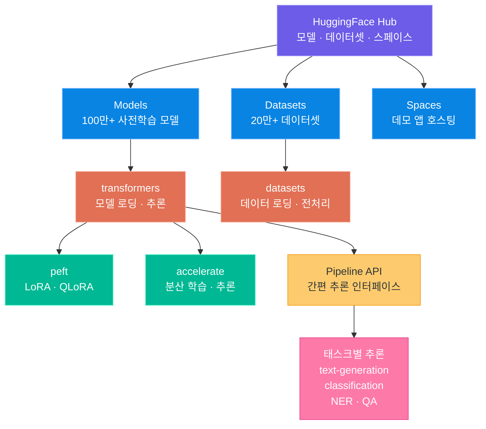
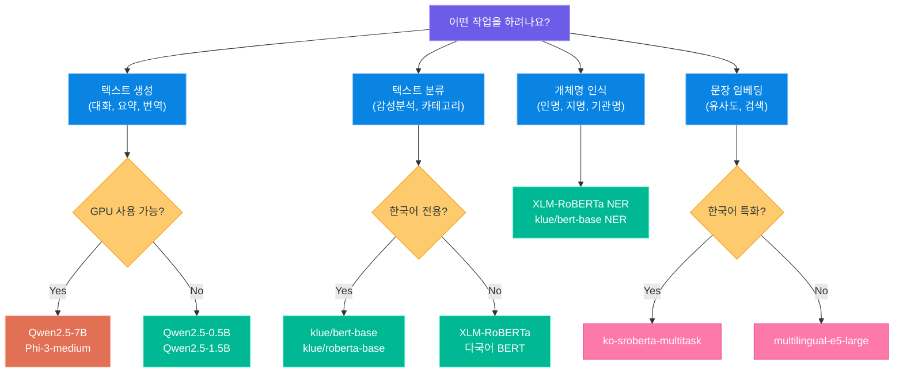
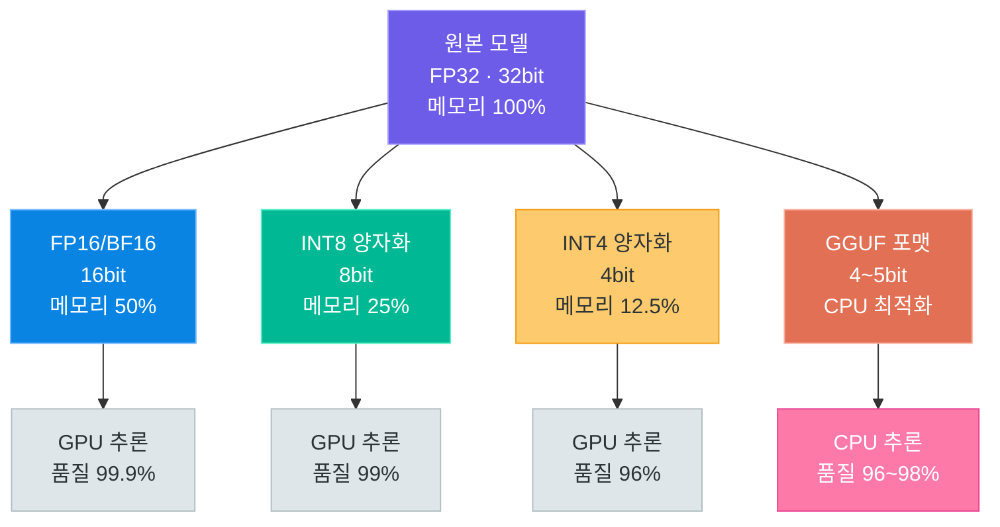
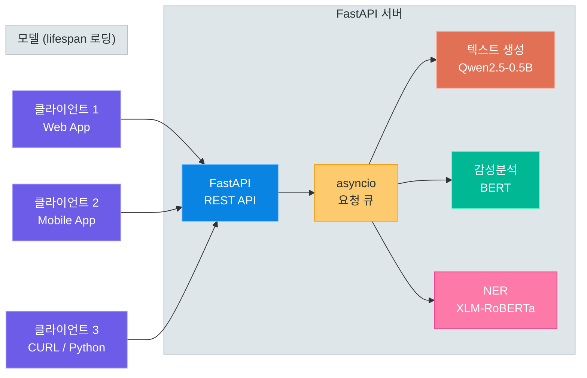

# HuggingFace 로컬 모델 활용

> 클라우드 API 없이 내 컴퓨터에서 직접 AI 모델을 실행하는 방법 — HuggingFace 생태계, Pipeline API, 양자화, 한국어 NLP, FastAPI 서빙까지 로컬 추론의 모든 것을 다룹니다

---

## 1. HuggingFace 생태계

### HuggingFace란

**HuggingFace**는 AI/ML 커뮤니티의 **GitHub**라고 불리는 플랫폼입니다. 오픈소스 모델, 데이터셋, 데모 앱을 공유하고, 모델을 쉽게 로딩하여 사용할 수 있는 라이브러리 생태계를 제공합니다.

OpenAI API나 Claude API 같은 클라우드 서비스는 편리하지만, 비용이 발생하고 데이터가 외부 서버로 전송됩니다. HuggingFace를 활용하면 **무료로, 오프라인에서, 내 데이터를 외부에 노출하지 않고** AI 모델을 사용할 수 있습니다.

### Hub: 모델/데이터셋/스페이스 저장소

HuggingFace Hub는 세 가지 핵심 저장소로 구성됩니다.

| 저장소 | 설명 | 규모 (2024 기준) |
|--------|------|------------------|
| **Models** | 사전학습된 모델 저장소 | 100만+ 모델 |
| **Datasets** | 학습/평가용 데이터셋 | 20만+ 데이터셋 |
| **Spaces** | 모델 데모 앱 (Gradio/Streamlit) | 50만+ 스페이스 |

### 핵심 라이브러리 구성

HuggingFace 생태계는 여러 라이브러리로 구성되어 있으며, 각각의 역할이 명확하게 분리되어 있습니다.

| 라이브러리 | 역할 | 핵심 기능 |
|------------|------|-----------|
| `transformers` | 모델 로딩 및 추론 | AutoModel, Pipeline, generate() |
| `datasets` | 데이터셋 로딩 및 전처리 | load_dataset(), map(), filter() |
| `tokenizers` | 빠른 토크나이저 | BPE, WordPiece, Unigram |
| `peft` | 파라미터 효율적 파인튜닝 | LoRA, QLoRA, Prefix Tuning |
| `accelerate` | 분산 학습/추론 | multi-GPU, mixed precision |
| `huggingface_hub` | Hub API 클라이언트 | 모델 다운로드, 업로드 |
| `safetensors` | 안전한 텐서 저장 형식 | pickle 대비 보안 향상 |

```bash
# install_hf.sh -- HuggingFace 핵심 라이브러리 설치
pip install transformers>=4.46 datasets accelerate peft
pip install sentencepiece protobuf  # 일부 모델에 필요
```

### HuggingFace 생태계 구조



> **핵심 포인트:** HuggingFace는 단순한 모델 저장소가 아니라, 모델의 탐색 → 다운로드 → 추론 → 파인튜닝 → 배포까지 전 과정을 지원하는 통합 생태계입니다. `transformers` 라이브러리 하나만 설치하면 수만 개의 모델을 즉시 사용할 수 있습니다.

---

## 2. Pipeline API

### Pipeline이란

`Pipeline`은 HuggingFace transformers에서 제공하는 **가장 간단한 추론 인터페이스**입니다. 모델 로딩, 토큰화, 추론, 후처리를 한 줄로 처리할 수 있습니다.

```python
# pipeline_basic.py -- Pipeline의 기본 사용법
from transformers import pipeline

# 한 줄로 감성분석 수행
classifier = pipeline("text-classification", model="nlptown/bert-base-multilingual-uncased-sentiment")
result = classifier("이 영화 정말 재미있었습니다!")
print(result)
# [{'label': '5 stars', 'score': 0.7842}]
```

### 지원하는 태스크 종류

Pipeline은 다양한 NLP 태스크를 지원합니다. 각 태스크별로 적합한 모델이 자동으로 매핑됩니다.

| 태스크 | pipeline 이름 | 설명 | 예시 모델 |
|--------|---------------|------|-----------|
| 텍스트 생성 | `text-generation` | 이어 쓰기, 대화 | Qwen2.5, Phi-3 |
| 텍스트 분류 | `text-classification` | 감성분석, 카테고리 | BERT, RoBERTa |
| 개체명 인식 | `ner` | 인명, 지명, 기관명 추출 | XLM-RoBERTa |
| 요약 | `summarization` | 긴 텍스트 요약 | BART, T5 |
| 번역 | `translation` | 다국어 번역 | MarianMT, mBART |
| 질의응답 | `question-answering` | 문서 기반 QA | BERT, RoBERTa |
| 특징 추출 | `feature-extraction` | 텍스트 임베딩 벡터 | E5, BGE |
| 빈칸 채우기 | `fill-mask` | 마스킹된 토큰 예측 | BERT, RoBERTa |
| 제로샷 분류 | `zero-shot-classification` | 라벨 없이 분류 | BART-MNLI |

### batch_size 및 device 설정

Pipeline은 대량의 입력을 효율적으로 처리하기 위한 배치 처리와, CPU/GPU 장치 선택을 지원합니다.

```python
# pipeline_config.py -- batch_size와 device 설정
from transformers import pipeline

# GPU 사용 (CUDA 장치 0번)
pipe = pipeline(
    "text-classification",
    model="nlptown/bert-base-multilingual-uncased-sentiment",
    device=0  # GPU 0번, CPU는 -1 또는 "cpu"
)

# 여러 텍스트를 한 번에 처리 (배치)
texts = [
    "이 제품 정말 좋습니다!",
    "배송이 너무 느려서 실망했어요.",
    "가격 대비 괜찮은 품질입니다.",
    "다시는 구매하지 않을 겁니다.",
]

results = pipe(texts, batch_size=4)
for text, result in zip(texts, results):
    print(f"{text} → {result['label']} ({result['score']:.4f})")
```

### 태스크별 Pipeline 사용 예제

#### 텍스트 생성 (text-generation)

```python
# pipeline_generation.py -- 텍스트 생성 Pipeline
from transformers import pipeline

generator = pipeline(
    "text-generation",
    model="Qwen/Qwen2.5-0.5B-Instruct",
    device="cpu",
    torch_dtype="auto",
)

messages = [
    {"role": "system", "content": "당신은 친절한 한국어 AI 비서입니다."},
    {"role": "user", "content": "파이썬의 장점 3가지를 알려주세요."},
]

result = generator(
    messages,
    max_new_tokens=256,
    temperature=0.7,
    do_sample=True,
)
print(result[0]["generated_text"][-1]["content"])
```

#### 텍스트 분류 (text-classification)

```python
# pipeline_classification.py -- 다국어 감성분석 Pipeline
from transformers import pipeline

classifier = pipeline(
    "text-classification",
    model="nlptown/bert-base-multilingual-uncased-sentiment",
    device="cpu",
)

reviews = [
    "서비스가 정말 훌륭했습니다. 다음에도 꼭 이용하겠습니다.",
    "음식이 차갑고 맛이 없었습니다.",
    "보통이에요. 특별히 좋지도 나쁘지도 않습니다.",
]

for review in reviews:
    result = classifier(review)[0]
    stars = result["label"]
    score = result["score"]
    print(f"리뷰: {review}")
    print(f"  → 평점: {stars}, 신뢰도: {score:.4f}\n")
```

#### 개체명 인식 (NER)

```python
# pipeline_ner.py -- 다국어 개체명 인식 Pipeline
from transformers import pipeline

ner = pipeline(
    "ner",
    model="Davlan/xlm-roberta-large-finetuned-ner-hrl",
    aggregation_strategy="simple",
    device="cpu",
)

text = "삼성전자의 이재용 회장이 서울 서초구 삼성타운에서 기자간담회를 열었다."

entities = ner(text)
for entity in entities:
    print(f"  [{entity['entity_group']}] {entity['word']} (score: {entity['score']:.4f})")

# 출력 예시:
#   [ORG] 삼성전자 (score: 0.9912)
#   [PER] 이재용 (score: 0.9876)
#   [LOC] 서울 (score: 0.9834)
```

> **핵심 포인트:** Pipeline API는 "빠르게 프로토타이핑"할 때 가장 유용합니다. 모델명만 바꾸면 동일한 코드로 다른 모델을 시도할 수 있어, 여러 모델을 비교 평가할 때 매우 효율적입니다. 프로덕션 수준의 세밀한 제어가 필요하면 AutoModel을 직접 사용하세요.

---

## 3. CPU 친화 다국어 모델

### 왜 소형 모델인가

GPT-4나 Llama 70B 같은 대형 모델은 고가의 GPU가 필수입니다. 하지만 학습 환경이나 소규모 서비스에서는 **CPU에서도 실행 가능한 소형 모델**이 훨씬 실용적입니다.

소형 모델을 선택하는 기준은 다음과 같습니다.

| 기준 | 설명 |
|------|------|
| 파라미터 수 | 4B 이하면 CPU에서도 동작 가능 |
| 한국어 성능 | 다국어 모델 중 한국어 벤치마크 점수 확인 |
| 라이선스 | 상업적 사용 가능 여부 |
| 메모리 요구량 | float16 기준 파라미터 수 × 2 바이트 |

### 소형 다국어 모델 비교표

#### 생성형 모델 (텍스트 생성)

| 모델 | 파라미터 | RAM (FP16) | 한국어 점수 | 라이선스 | 특징 |
|------|----------|------------|-------------|----------|------|
| **Qwen2.5-0.5B-Instruct** | 0.5B | ~1.5GB | ★★★☆☆ | Apache 2.0 | 가장 가벼운 다국어 생성 모델 |
| **Qwen2.5-1.5B-Instruct** | 1.5B | ~3.5GB | ★★★★☆ | Apache 2.0 | 한국어 성능 우수, CPU 추론 가능 |
| **gemma-2-2b-it** | 2.6B | ~5.5GB | ★★★☆☆ | Gemma License | Google 경량 모델, 구조 효율적 |
| **Phi-3-mini-4k-instruct** | 3.8B | ~7.6GB | ★★★☆☆ | MIT | Microsoft, 추론 능력 강점 |

#### 인코더 모델 (분류/NER/임베딩)

| 모델 | 파라미터 | RAM | 용도 | 한국어 | 특징 |
|------|----------|-----|------|--------|------|
| **multilingual-e5-large** | 560M | ~1.1GB | 임베딩/검색 | ★★★★☆ | 다국어 문장 임베딩 최강 |
| **XLM-RoBERTa-large** | 560M | ~1.1GB | 분류/NER | ★★★★☆ | 100개 언어 지원 |
| **klue/bert-base** | 110M | ~0.4GB | 분류/NER | ★★★★★ | 한국어 특화 BERT |
| **klue/roberta-base** | 110M | ~0.4GB | 분류/NER | ★★★★★ | 한국어 특화 RoBERTa |
| **jhgan/ko-sroberta-multitask** | 110M | ~0.4GB | 문장 임베딩 | ★★★★★ | 한국어 Sentence-BERT |

### Qwen2.5-0.5B로 한국어 텍스트 생성

가장 가벼운 다국어 생성 모델인 Qwen2.5-0.5B를 사용하여 한국어 텍스트를 생성합니다.

```python
# qwen_generation.py -- Qwen2.5-0.5B로 한국어 텍스트 생성
from transformers import pipeline

generator = pipeline(
    "text-generation",
    model="Qwen/Qwen2.5-0.5B-Instruct",
    device="cpu",
    torch_dtype="auto",
)

# 대화형 생성
messages = [
    {"role": "system", "content": "당신은 한국어로 답변하는 AI 비서입니다. 간결하게 답변하세요."},
    {"role": "user", "content": "머신러닝과 딥러닝의 차이점을 설명해주세요."},
]

output = generator(
    messages,
    max_new_tokens=200,
    temperature=0.7,
    top_p=0.9,
    do_sample=True,
)

answer = output[0]["generated_text"][-1]["content"]
print("=" * 60)
print("질문: 머신러닝과 딥러닝의 차이점을 설명해주세요.")
print("=" * 60)
print(f"답변: {answer}")
```

### XLM-RoBERTa로 감성분석

다국어 인코더 모델인 XLM-RoBERTa를 활용하여 한국어 텍스트의 감성을 분석합니다.

```python
# xlm_roberta_sentiment.py -- XLM-RoBERTa로 다국어 감성분석
from transformers import pipeline

# 다국어 감성분석 파이프라인
sentiment = pipeline(
    "text-classification",
    model="nlptown/bert-base-multilingual-uncased-sentiment",
    device="cpu",
)

# 한국어 리뷰 데이터
korean_reviews = [
    {"text": "이 카페 분위기가 너무 좋고 커피도 맛있어요!", "expected": "긍정"},
    {"text": "주문한 지 1시간이 넘었는데 아직도 안 왔습니다.", "expected": "부정"},
    {"text": "가격은 비싸지만 품질이 좋아서 만족합니다.", "expected": "긍정"},
    {"text": "직원이 불친절하고 매장이 지저분했습니다.", "expected": "부정"},
    {"text": "그냥 보통이에요. 특별한 건 없습니다.", "expected": "중립"},
]

print("=" * 70)
print(f"{'리뷰':<35} {'예상':^6} {'예측':^10} {'신뢰도':>8}")
print("=" * 70)

for review in korean_reviews:
    result = sentiment(review["text"])[0]
    print(f"{review['text']:<35} {review['expected']:^6} {result['label']:^10} {result['score']:>8.4f}")
```

### 모델 선택 가이드

어떤 모델을 선택해야 할지 모를 때, 아래 플로우차트를 참고하세요.



> **핵심 포인트:** CPU 환경에서는 **Qwen2.5-0.5B ~ 1.5B**가 한국어 텍스트 생성에 가장 실용적입니다. 분류/NER에는 **klue/bert-base** 또는 **XLM-RoBERTa**를, 문장 임베딩에는 **ko-sroberta-multitask** 또는 **multilingual-e5-large**를 사용하세요.

---

## 4. AutoModel 심화

### AutoModel이란

Pipeline은 편리하지만, 생성 파라미터를 세밀하게 제어하거나 모델 내부에 접근하려면 `AutoModel`을 직접 사용해야 합니다.

HuggingFace의 `Auto` 클래스는 모델 아키텍처를 자동으로 감지하여 적절한 클래스를 로딩합니다.

| Auto 클래스 | 용도 | 예시 |
|-------------|------|------|
| `AutoModelForCausalLM` | 텍스트 생성 (GPT 계열) | Qwen, Phi, Llama |
| `AutoModelForSeq2SeqLM` | 번역, 요약 (인코더-디코더) | T5, mBART |
| `AutoModelForSequenceClassification` | 텍스트 분류 | BERT, RoBERTa |
| `AutoModelForTokenClassification` | 토큰 분류 (NER) | BERT, XLM-R |
| `AutoModel` | 범용 (임베딩 추출 등) | 모든 모델 |
| `AutoTokenizer` | 토크나이저 자동 로딩 | 모든 모델과 짝 |

### AutoModelForCausalLM 사용법

```python
# automodel_basic.py -- AutoModel 기본 사용법
from transformers import AutoModelForCausalLM, AutoTokenizer
import torch

# 모델과 토크나이저 로딩
model_name = "Qwen/Qwen2.5-0.5B-Instruct"

tokenizer = AutoTokenizer.from_pretrained(model_name)
model = AutoModelForCausalLM.from_pretrained(
    model_name,
    torch_dtype=torch.float32,  # CPU에서는 float32 사용
    device_map="cpu",
)

# 대화 메시지를 토크나이저의 chat template으로 변환
messages = [
    {"role": "system", "content": "당신은 친절한 한국어 AI 비서입니다."},
    {"role": "user", "content": "파이썬으로 피보나치 수열을 구하는 방법을 알려주세요."},
]

# chat template 적용
text = tokenizer.apply_chat_template(
    messages,
    tokenize=False,
    add_generation_prompt=True,
)

# 토큰화 및 생성
inputs = tokenizer(text, return_tensors="pt").to(model.device)

outputs = model.generate(
    **inputs,
    max_new_tokens=300,
    temperature=0.7,
    top_p=0.9,
    do_sample=True,
)

# 입력 토큰 이후의 생성된 부분만 디코딩
generated = outputs[0][inputs["input_ids"].shape[-1]:]
response = tokenizer.decode(generated, skip_special_tokens=True)
print(response)
```

### generate() 파라미터 상세

`model.generate()`의 핵심 파라미터들을 이해하면 생성 품질을 크게 향상시킬 수 있습니다.

| 파라미터 | 기본값 | 설명 | 권장 범위 |
|----------|--------|------|-----------|
| `max_new_tokens` | 20 | 생성할 최대 토큰 수 | 50 ~ 2048 |
| `temperature` | 1.0 | 낮을수록 확정적, 높을수록 창의적 | 0.1 ~ 1.5 |
| `top_p` | 1.0 | 누적 확률 상위 p%의 토큰만 사용 | 0.8 ~ 0.95 |
| `top_k` | 50 | 확률 상위 k개 토큰만 사용 | 10 ~ 100 |
| `do_sample` | False | True면 샘플링, False면 greedy | True 권장 |
| `repetition_penalty` | 1.0 | 1보다 크면 반복 표현 억제 | 1.1 ~ 1.5 |
| `num_beams` | 1 | 빔 서치 폭 (1이면 greedy/sampling) | 1 ~ 5 |

```python
# generate_params.py -- 생성 파라미터에 따른 출력 비교
from transformers import AutoModelForCausalLM, AutoTokenizer
import torch

model_name = "Qwen/Qwen2.5-0.5B-Instruct"
tokenizer = AutoTokenizer.from_pretrained(model_name)
model = AutoModelForCausalLM.from_pretrained(
    model_name, torch_dtype=torch.float32, device_map="cpu"
)

messages = [
    {"role": "user", "content": "봄에 가기 좋은 여행지를 추천해주세요."},
]

text = tokenizer.apply_chat_template(messages, tokenize=False, add_generation_prompt=True)
inputs = tokenizer(text, return_tensors="pt").to(model.device)

# 설정 1: 보수적 (낮은 temperature)
output_conservative = model.generate(
    **inputs,
    max_new_tokens=150,
    temperature=0.3,
    top_p=0.85,
    do_sample=True,
    repetition_penalty=1.2,
)

# 설정 2: 창의적 (높은 temperature)
output_creative = model.generate(
    **inputs,
    max_new_tokens=150,
    temperature=1.2,
    top_p=0.95,
    top_k=80,
    do_sample=True,
    repetition_penalty=1.1,
)

for label, output in [("보수적", output_conservative), ("창의적", output_creative)]:
    generated = output[0][inputs["input_ids"].shape[-1]:]
    response = tokenizer.decode(generated, skip_special_tokens=True)
    print(f"\n[{label} 설정]")
    print(response)
    print("-" * 50)
```

### Qwen2.5-1.5B로 한국어 QA 실습

더 큰 모델을 사용하면 한국어 응답의 품질이 눈에 띄게 향상됩니다.

```python
# qwen_qa.py -- Qwen2.5-1.5B로 한국어 QA 실습
from transformers import AutoModelForCausalLM, AutoTokenizer
import torch

model_name = "Qwen/Qwen2.5-1.5B-Instruct"

tokenizer = AutoTokenizer.from_pretrained(model_name)
model = AutoModelForCausalLM.from_pretrained(
    model_name,
    torch_dtype=torch.float32,
    device_map="cpu",
)

def ask_question(question: str, context: str = None) -> str:
    """한국어 QA 함수"""
    if context:
        system_msg = f"다음 문서를 참고하여 질문에 답변하세요.\n\n문서: {context}"
    else:
        system_msg = "당신은 한국어로 정확하게 답변하는 AI 비서입니다."

    messages = [
        {"role": "system", "content": system_msg},
        {"role": "user", "content": question},
    ]

    text = tokenizer.apply_chat_template(
        messages, tokenize=False, add_generation_prompt=True
    )
    inputs = tokenizer(text, return_tensors="pt").to(model.device)

    outputs = model.generate(
        **inputs,
        max_new_tokens=300,
        temperature=0.5,
        top_p=0.9,
        do_sample=True,
        repetition_penalty=1.2,
    )

    generated = outputs[0][inputs["input_ids"].shape[-1]:]
    return tokenizer.decode(generated, skip_special_tokens=True)

# 일반 질문
print("[일반 QA]")
print(ask_question("대한민국의 수도와 인구를 알려주세요."))

# 문서 기반 QA
context = """
FastAPI는 Python 3.7+에서 동작하는 웹 프레임워크입니다.
Starlette을 기반으로 하며, Pydantic을 사용하여 데이터 검증을 수행합니다.
자동 API 문서 생성, 비동기 지원, 타입 힌트 기반 검증이 주요 특징입니다.
"""
print("\n[문서 기반 QA]")
print(ask_question("FastAPI의 주요 특징 3가지는 무엇인가요?", context=context))
```

> **핵심 포인트:** `temperature`와 `top_p`는 생성 품질에 가장 큰 영향을 미치는 파라미터입니다. 정확한 답변이 필요하면 `temperature=0.3, top_p=0.85`로, 창의적인 텍스트가 필요하면 `temperature=0.8~1.2`로 설정하세요. `repetition_penalty=1.1~1.3`을 추가하면 반복 표현을 효과적으로 줄일 수 있습니다.

---

## 5. 양자화(Quantization)

### 양자화란

**양자화(Quantization)**란 모델의 가중치를 더 작은 비트 수로 표현하여 메모리 사용량과 추론 속도를 개선하는 기술입니다.

예를 들어, 원래 32비트(float32)로 저장된 가중치를 16비트(float16), 8비트(int8), 4비트(int4)로 변환하면 모델 크기가 각각 1/2, 1/4, 1/8로 줄어듭니다.

| 정밀도 | 비트 수 | 7B 모델 메모리 | 상대 품질 | 사용 환경 |
|--------|---------|---------------|-----------|-----------|
| FP32 | 32bit | ~28GB | 100% (기준) | 학습, 연구 |
| FP16/BF16 | 16bit | ~14GB | ~99.9% | GPU 추론 |
| INT8 | 8bit | ~7GB | ~99% | GPU 추론 (절약) |
| INT4 | 4bit | ~3.5GB | ~95~97% | GPU 제한 환경 |
| GGUF Q4 | 4bit | ~3.5GB | ~95~97% | CPU 추론 |

### BitsAndBytes 4bit/8bit 양자화

`bitsandbytes` 라이브러리를 사용하면 GPU 환경에서 모델을 4bit 또는 8bit로 양자화하여 로딩할 수 있습니다.

```bash
# install_bnb.sh -- bitsandbytes 설치 (CUDA 필요)
pip install bitsandbytes>=0.43
```

```python
# quantization_4bit.py -- BitsAndBytes 4bit 양자화 로딩
from transformers import AutoModelForCausalLM, AutoTokenizer, BitsAndBytesConfig
import torch

# 4bit 양자화 설정
quantization_config = BitsAndBytesConfig(
    load_in_4bit=True,                    # 4bit 양자화 활성화
    bnb_4bit_quant_type="nf4",            # NormalFloat4 양자화 (권장)
    bnb_4bit_compute_dtype=torch.bfloat16, # 연산 시 bfloat16 사용
    bnb_4bit_use_double_quant=True,       # 이중 양자화 (추가 메모리 절약)
)

model_name = "Qwen/Qwen2.5-1.5B-Instruct"

tokenizer = AutoTokenizer.from_pretrained(model_name)
model = AutoModelForCausalLM.from_pretrained(
    model_name,
    quantization_config=quantization_config,
    device_map="auto",  # GPU에 자동 배치
)

# 양자화된 모델로 추론
messages = [
    {"role": "user", "content": "양자컴퓨터란 무엇인가요?"},
]

text = tokenizer.apply_chat_template(messages, tokenize=False, add_generation_prompt=True)
inputs = tokenizer(text, return_tensors="pt").to(model.device)

outputs = model.generate(**inputs, max_new_tokens=200, temperature=0.7, do_sample=True)
generated = outputs[0][inputs["input_ids"].shape[-1]:]
print(tokenizer.decode(generated, skip_special_tokens=True))

# 모델 메모리 사용량 확인
print(f"\n모델 메모리: {model.get_memory_footprint() / 1024**3:.2f} GB")
```

### 8bit 양자화

8bit 양자화는 4bit보다 품질 손실이 적으면서도 메모리를 절반으로 줄입니다.

```python
# quantization_8bit.py -- BitsAndBytes 8bit 양자화 로딩
from transformers import AutoModelForCausalLM, AutoTokenizer, BitsAndBytesConfig

quantization_config = BitsAndBytesConfig(
    load_in_8bit=True,  # 8bit 양자화 활성화
)

model = AutoModelForCausalLM.from_pretrained(
    "Qwen/Qwen2.5-1.5B-Instruct",
    quantization_config=quantization_config,
    device_map="auto",
)
print(f"8bit 모델 메모리: {model.get_memory_footprint() / 1024**3:.2f} GB")
```

### GGUF 포맷 + llama-cpp-python CPU 추론

GPU 없이 CPU에서 양자화 모델을 실행하려면 **GGUF 포맷**과 **llama-cpp-python**을 사용합니다. GGUF는 llama.cpp 프로젝트에서 만든 양자화 모델 포맷으로, CPU에 최적화되어 있습니다.

```bash
# install_llamacpp.sh -- llama-cpp-python 설치
pip install llama-cpp-python
# GPU 가속이 필요한 경우:
# CMAKE_ARGS="-DGGML_CUDA=on" pip install llama-cpp-python
```

```python
# gguf_inference.py -- llama-cpp-python으로 GGUF 모델 CPU 추론
from llama_cpp import Llama

# HuggingFace Hub에서 GGUF 모델 다운로드 및 로딩
llm = Llama.from_pretrained(
    repo_id="Qwen/Qwen2.5-1.5B-Instruct-GGUF",
    filename="qwen2.5-1.5b-instruct-q4_k_m.gguf",
    n_ctx=2048,       # 컨텍스트 윈도우 크기
    n_threads=4,      # CPU 스레드 수
    verbose=False,
)

# ChatCompletion 형식으로 추론
response = llm.create_chat_completion(
    messages=[
        {"role": "system", "content": "당신은 한국어 AI 비서입니다."},
        {"role": "user", "content": "클라우드 컴퓨팅의 장단점을 알려주세요."},
    ],
    max_tokens=300,
    temperature=0.7,
    top_p=0.9,
)

print(response["choices"][0]["message"]["content"])
```

### VRAM/RAM 절약 비교

양자화 방식에 따른 Qwen2.5-1.5B 모델의 메모리 사용량 비교입니다.

| 양자화 방식 | 메모리 사용량 | 추론 속도 (상대) | 품질 | 필요 환경 |
|-------------|-------------|-----------------|------|-----------|
| FP32 | ~6.0GB | 1.0x (기준) | 100% | CPU/GPU |
| FP16/BF16 | ~3.0GB | 1.5x | ~99.9% | GPU |
| INT8 (bnb) | ~1.5GB | 1.3x | ~99% | GPU (CUDA) |
| INT4 (bnb) | ~0.9GB | 1.5x | ~96% | GPU (CUDA) |
| GGUF Q4_K_M | ~1.0GB | 1.2x | ~96% | CPU |
| GGUF Q5_K_M | ~1.2GB | 1.1x | ~98% | CPU |

### 양자화 방식 비교



> **핵심 포인트:** GPU가 있으면 `BitsAndBytes 4bit` 양자화가 가장 효율적이고, GPU가 없으면 `GGUF + llama-cpp-python`이 CPU 추론의 최적 조합입니다. 4bit 양자화만으로도 원본 대비 약 96%의 품질을 유지하면서 메모리를 1/8로 줄일 수 있습니다.

---

## 6. 한국어 NLP 실전

### 감성분석: klue/roberta-base 활용

KLUE(Korean Language Understanding Evaluation) 프로젝트에서 제공하는 한국어 특화 RoBERTa 모델을 활용한 감성분석입니다.

```python
# korean_sentiment.py -- 한국어 감성분석 실전 코드
from transformers import pipeline

# 한국어 감성분석 파이프라인
# 참고: 아래 모델은 NSMC(네이버 영화 리뷰) 데이터셋으로 학습된 모델
sentiment_analyzer = pipeline(
    "text-classification",
    model="snunlp/KR-FinBert-SC",  # 한국어 감성분석 모델
    device="cpu",
)

# 테스트 데이터
test_reviews = [
    "이 영화는 정말 감동적이었습니다. 배우들의 연기가 훌륭했어요.",
    "시간 낭비였습니다. 스토리가 너무 뻔하고 지루했어요.",
    "나쁘지 않았지만 기대에는 못 미쳤습니다.",
    "올해 본 영화 중 최고입니다! 꼭 보세요.",
    "개연성이 없고 결말이 너무 허무합니다.",
]

print("=" * 65)
print("한국어 감성분석 결과")
print("=" * 65)

for review in test_reviews:
    result = sentiment_analyzer(review)[0]
    label = result["label"]
    score = result["score"]
    emoji = "+" if "positive" in label.lower() or "긍정" in label else "-"
    print(f"[{emoji}] {review}")
    print(f"    → {label} (신뢰도: {score:.4f})")
    print()
```

### NER: 한국어 개체명 인식

한국어 텍스트에서 인명, 지명, 기관명 등의 개체명을 추출합니다.

```python
# korean_ner.py -- 한국어 개체명 인식 실전 코드
from transformers import pipeline

# 다국어 NER 파이프라인 (한국어 지원)
ner_pipeline = pipeline(
    "ner",
    model="Davlan/xlm-roberta-large-finetuned-ner-hrl",
    aggregation_strategy="simple",
    device="cpu",
)

# 한국어 테스트 문장들
test_sentences = [
    "네이버의 이해진 의장이 성남시 분당구 정자동 본사에서 기자간담회를 열었다.",
    "BTS의 RM이 유엔 본부에서 연설했다.",
    "삼성전자가 미국 텍사스주에 반도체 공장을 건설한다고 발표했다.",
    "한국은행이 기준금리를 3.5%로 동결했다.",
]

# 개체명 유형 한글 매핑
entity_labels = {
    "PER": "인물",
    "ORG": "기관",
    "LOC": "장소",
    "MISC": "기타",
}

for sentence in test_sentences:
    print(f"\n문장: {sentence}")
    entities = ner_pipeline(sentence)

    if entities:
        for ent in entities:
            label_kr = entity_labels.get(ent["entity_group"], ent["entity_group"])
            print(f"  [{label_kr}] {ent['word']} (score: {ent['score']:.4f})")
    else:
        print("  개체명 없음")
    print("-" * 60)
```

### 문장 임베딩 + 유사도: sentence-transformers

`sentence-transformers`를 사용하면 한국어 문장을 벡터로 변환하고, 문장 간 의미적 유사도를 계산할 수 있습니다.

```python
# korean_similarity.py -- 한국어 문장 유사도 계산
from sentence_transformers import SentenceTransformer
from sklearn.metrics.pairwise import cosine_similarity
import numpy as np

# 한국어 문장 임베딩 모델 로딩
model = SentenceTransformer("jhgan/ko-sroberta-multitask")

# 기준 문장
query = "오늘 날씨가 정말 좋습니다."

# 비교할 문장들
candidates = [
    "오늘 하늘이 맑고 기온이 적당합니다.",       # 의미 유사
    "날씨가 화창해서 산책하기 좋은 날이에요.",     # 의미 유사
    "오늘 비가 와서 우산을 가져갔습니다.",         # 부분 관련
    "파이썬은 배우기 쉬운 프로그래밍 언어입니다.", # 무관
    "주식 시장이 크게 하락했습니다.",              # 무관
]

# 임베딩 계산
query_embedding = model.encode([query])
candidate_embeddings = model.encode(candidates)

# 코사인 유사도 계산
similarities = cosine_similarity(query_embedding, candidate_embeddings)[0]

# 결과 출력 (유사도 내림차순)
print(f"기준 문장: {query}\n")
print(f"{'순위':<4} {'유사도':<8} {'문장'}")
print("=" * 60)

ranked = sorted(enumerate(candidates), key=lambda x: similarities[x[0]], reverse=True)

for rank, (idx, sentence) in enumerate(ranked, 1):
    sim = similarities[idx]
    bar = "█" * int(sim * 20)
    print(f"  {rank}.  {sim:.4f}  {bar}  {sentence}")
```

### 텍스트 분류: 뉴스 카테고리 분류

제로샷 분류를 사용하면 별도의 학습 데이터 없이 텍스트를 원하는 카테고리로 분류할 수 있습니다.

```python
# korean_classification.py -- 한국어 뉴스 카테고리 분류 (제로샷)
from transformers import pipeline

# 다국어 제로샷 분류 파이프라인
classifier = pipeline(
    "zero-shot-classification",
    model="joeddav/xlm-roberta-large-xnli",
    device="cpu",
)

# 뉴스 카테고리
categories = ["정치", "경제", "사회", "문화", "스포츠", "과학기술"]

# 분류할 뉴스 기사 제목들
news_headlines = [
    "국회, 내년도 예산안 본회의 통과",
    "삼성전자, 3분기 영업이익 전년비 30% 증가",
    "서울 지하철 파업 예고...시민 불편 우려",
    "BTS 부산 콘서트 10만 관객 동원",
    "손흥민, 시즌 20호 골 달성",
    "국내 연구진, 차세대 배터리 원천기술 개발",
]

print("=" * 70)
print("한국어 뉴스 카테고리 분류 (제로샷)")
print("=" * 70)

for headline in news_headlines:
    result = classifier(headline, candidate_labels=categories)

    top_label = result["labels"][0]
    top_score = result["scores"][0]
    second_label = result["labels"][1]
    second_score = result["scores"][1]

    print(f"\n기사: {headline}")
    print(f"  1순위: {top_label} ({top_score:.4f})")
    print(f"  2순위: {second_label} ({second_score:.4f})")
```

### 한국어 텍스트 요약

다국어 요약 모델을 활용한 한국어 텍스트 요약 예제입니다.

```python
# korean_summarization.py -- 한국어 텍스트 요약
from transformers import pipeline

# 한국어를 지원하는 텍스트 생성 모델로 요약 수행
summarizer = pipeline(
    "text-generation",
    model="Qwen/Qwen2.5-1.5B-Instruct",
    device="cpu",
    torch_dtype="auto",
)

article = """
인공지능(AI) 기술이 의료 분야에서 혁신적인 변화를 이끌고 있다.
최근 서울대학교 병원 연구팀은 AI 기반 의료 영상 분석 시스템을 개발하여
폐암 조기 진단 정확도를 기존 85%에서 97%로 향상시켰다고 발표했다.
이 시스템은 CT 스캔 영상에서 미세한 결절을 감지하여 의사의 진단을 보조한다.
연구팀은 10만 건 이상의 익명화된 의료 영상 데이터를 활용하여 딥러닝 모델을
학습시켰으며, 임상 시험 결과 전문 영상의학과 의사와 동등한 수준의
진단 능력을 보여주었다. 향후 다른 암종에 대한 확장 연구도 계획하고 있다.
"""

messages = [
    {"role": "system", "content": "주어진 기사를 2~3문장으로 요약하세요."},
    {"role": "user", "content": article},
]

result = summarizer(messages, max_new_tokens=150, temperature=0.3, do_sample=True)
summary = result[0]["generated_text"][-1]["content"]

print("원문 길이:", len(article))
print("요약 결과:")
print(summary)
```

> **핵심 포인트:** 한국어 NLP 태스크에서는 **목적에 맞는 모델 선택**이 중요합니다. 감성분석/NER에는 한국어 특화 인코더(klue/bert-base)를, 문장 유사도에는 ko-sroberta를, 텍스트 생성/요약에는 Qwen2.5를 활용하세요. 제로샷 분류는 학습 데이터 없이도 즉시 사용 가능하여 프로토타이핑에 매우 유용합니다.

---

## 7. FastAPI 로컬 모델 서빙

### 왜 모델 서빙이 필요한가

로컬에서 모델을 실행하는 것만으로는 다른 애플리케이션이나 팀원이 모델을 사용할 수 없습니다. **FastAPI**를 사용하여 모델을 REST API로 서빙하면, 어떤 클라이언트에서든 HTTP 요청으로 모델을 호출할 수 있습니다.

### FastAPI + HuggingFace 모델 서빙 API

```python
# model_server.py -- FastAPI + HuggingFace 모델 서빙
import asyncio
from contextlib import asynccontextmanager
from dataclasses import dataclass, field

from fastapi import FastAPI
from pydantic import BaseModel
from transformers import pipeline


# ── 요청/응답 스키마 ─────────────────────────────
class GenerateRequest(BaseModel):
    prompt: str
    max_new_tokens: int = 200
    temperature: float = 0.7


class GenerateResponse(BaseModel):
    generated_text: str
    model: str


class ClassifyRequest(BaseModel):
    text: str


class ClassifyResponse(BaseModel):
    label: str
    score: float


# ── 모델 컨테이너 ─────────────────────────────────
@dataclass
class ModelContainer:
    generator: object = field(default=None)
    classifier: object = field(default=None)


models = ModelContainer()


# ── 요청 큐 (동시 요청 제한) ─────────────────────
request_queue: asyncio.Queue = asyncio.Queue(maxsize=10)


# ── lifespan: 앱 시작 시 모델 로딩 ────────────────
@asynccontextmanager
async def lifespan(app: FastAPI):
    """서버 시작 시 모델을 한 번만 로딩합니다."""
    print("모델 로딩 중...")

    models.generator = pipeline(
        "text-generation",
        model="Qwen/Qwen2.5-0.5B-Instruct",
        device="cpu",
        torch_dtype="auto",
    )

    models.classifier = pipeline(
        "text-classification",
        model="nlptown/bert-base-multilingual-uncased-sentiment",
        device="cpu",
    )

    print("모델 로딩 완료!")
    yield
    print("서버 종료. 모델 메모리 해제.")


app = FastAPI(title="HuggingFace Model Server", lifespan=lifespan)


# ── 엔드포인트 ─────────────────────────────────────
@app.post("/generate", response_model=GenerateResponse)
async def generate(req: GenerateRequest):
    """텍스트 생성 엔드포인트"""
    messages = [
        {"role": "system", "content": "한국어로 답변하세요."},
        {"role": "user", "content": req.prompt},
    ]

    # 동기 작업을 스레드풀에서 실행
    loop = asyncio.get_event_loop()
    result = await loop.run_in_executor(
        None,
        lambda: models.generator(
            messages,
            max_new_tokens=req.max_new_tokens,
            temperature=req.temperature,
            do_sample=True,
        ),
    )

    generated_text = result[0]["generated_text"][-1]["content"]

    return GenerateResponse(
        generated_text=generated_text,
        model="Qwen/Qwen2.5-0.5B-Instruct",
    )


@app.post("/classify", response_model=ClassifyResponse)
async def classify(req: ClassifyRequest):
    """감성분석 엔드포인트"""
    loop = asyncio.get_event_loop()
    result = await loop.run_in_executor(
        None,
        lambda: models.classifier(req.text),
    )

    return ClassifyResponse(
        label=result[0]["label"],
        score=result[0]["score"],
    )


@app.get("/health")
async def health():
    """헬스 체크"""
    return {
        "status": "healthy",
        "models_loaded": models.generator is not None,
    }


# ── 실행 ──────────────────────────────────────────
# uvicorn model_server:app --host 0.0.0.0 --port 8000
```

### 클라이언트에서 호출하기

```python
# client_example.py -- 모델 서버 클라이언트 예제
import requests

BASE_URL = "http://localhost:8000"

# 텍스트 생성 요청
response = requests.post(
    f"{BASE_URL}/generate",
    json={
        "prompt": "FastAPI의 장점 3가지를 알려주세요.",
        "max_new_tokens": 200,
        "temperature": 0.7,
    },
)
print("생성 결과:", response.json()["generated_text"])

# 감성분석 요청
response = requests.post(
    f"{BASE_URL}/classify",
    json={"text": "이 서비스 정말 최고입니다!"},
)
result = response.json()
print(f"감성분석: {result['label']} ({result['score']:.4f})")
```

### 서빙 아키텍처



> **핵심 포인트:** FastAPI의 `lifespan`을 사용하면 서버 시작 시 모델을 한 번만 로딩하여 메모리를 효율적으로 관리할 수 있습니다. 모델 추론은 CPU-bound 작업이므로 `run_in_executor`로 이벤트 루프를 블로킹하지 않도록 해야 합니다.

---

## 8. 핵심 정리

### 모델 선택 체크리스트

프로젝트에서 HuggingFace 로컬 모델을 도입할 때, 아래 체크리스트를 참고하세요.

| 체크 항목 | 질문 | 선택 기준 |
|-----------|------|-----------|
| 태스크 | 생성? 분류? NER? 임베딩? | 태스크에 맞는 모델 아키텍처 선택 |
| 언어 | 한국어 전용? 다국어? | klue/* (한국어) vs XLM-R (다국어) |
| 하드웨어 | GPU 있음? CPU만? | GPU → BitsAndBytes, CPU → GGUF |
| 모델 크기 | 메모리 여유? | 1B 이하 → 가볍고 빠름, 3B+ → 품질 우수 |
| 양자화 | 메모리 부족? | 4bit/8bit 양자화 적용 |
| 서빙 방식 | 로컬 스크립트? API 서버? | 스크립트 → Pipeline, 서버 → FastAPI |
| 라이선스 | 상업적 사용? | Apache 2.0, MIT 확인 |

### 이번 강의에서 배운 것

```
1. HuggingFace 생태계  → Hub, transformers, datasets, peft, accelerate
2. Pipeline API       → 한 줄로 추론하는 가장 간단한 방법
3. CPU 친화 모델      → Qwen2.5, klue/bert-base, ko-sroberta
4. AutoModel 심화     → generate() 파라미터 세밀 제어
5. 양자화             → BitsAndBytes (GPU), GGUF (CPU) 메모리 절약
6. 한국어 NLP 실전    → 감성분석, NER, 유사도, 분류, 요약
7. FastAPI 서빙       → lifespan 모델 로딩, REST API 제공
```

### 다음 단계

이번 강의에서는 **사전학습된 모델을 그대로 사용하는 방법**을 배웠습니다. 하지만 실제 프로젝트에서는 도메인 데이터에 맞게 모델을 미세 조정(Fine-tuning)해야 하는 경우가 많습니다.

**다음 강의에서는 LoRA 파인튜닝을 배웁니다.** LoRA(Low-Rank Adaptation)는 전체 모델 가중치의 0.1~1%만 학습하여 적은 자원으로도 모델을 커스터마이징하는 기법입니다. GPU 메모리가 부족한 환경에서도 QLoRA를 활용하면 4bit 양자화 + LoRA 조합으로 대형 모델까지 파인튜닝할 수 있습니다.

---
