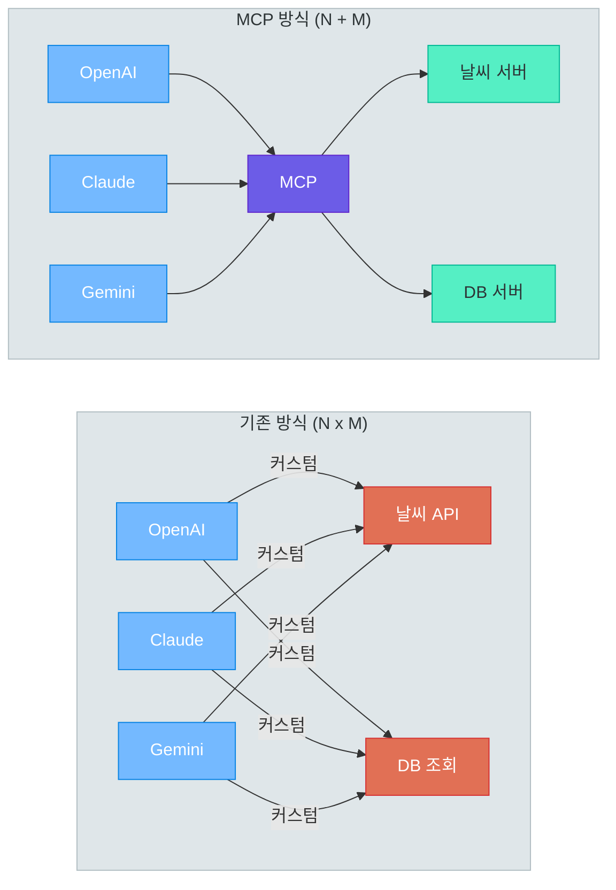
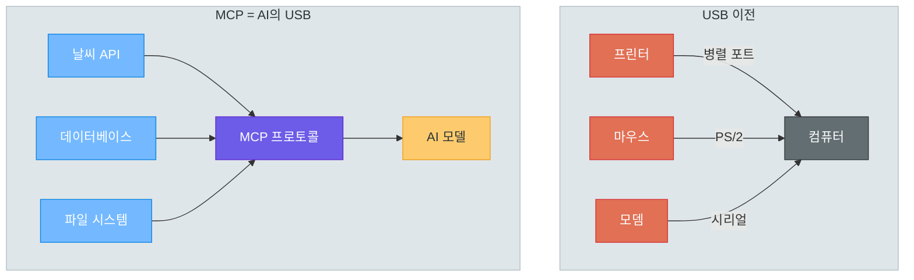
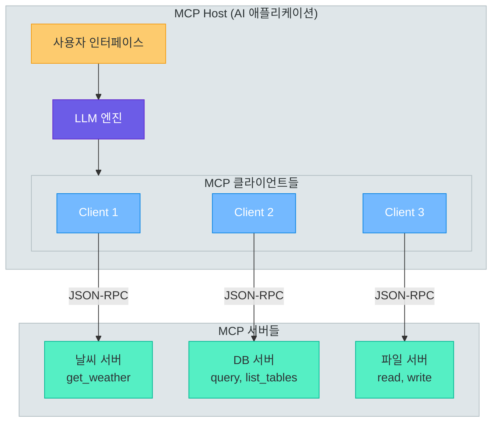
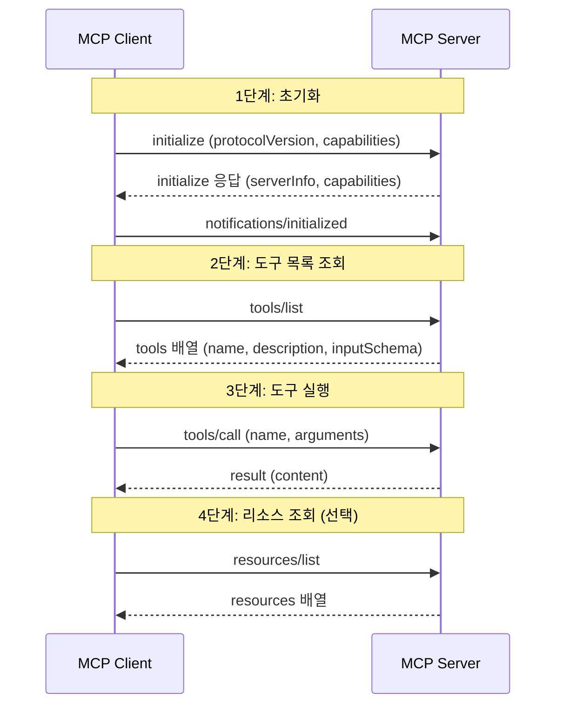
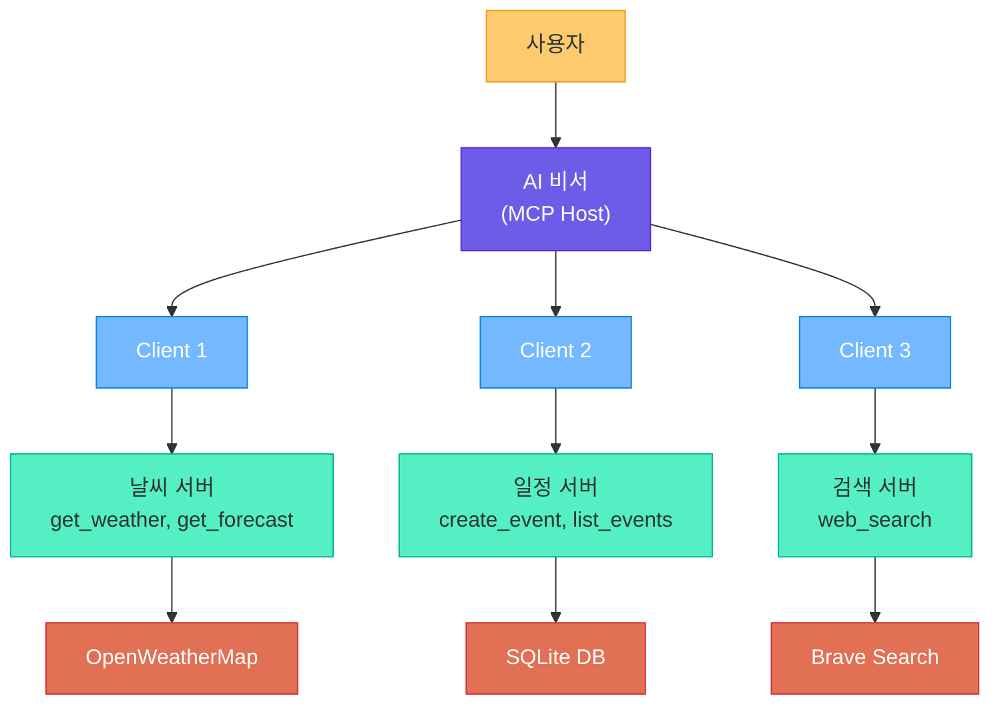
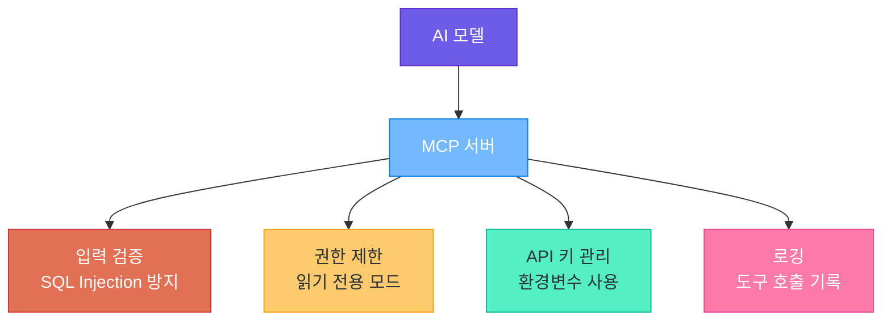
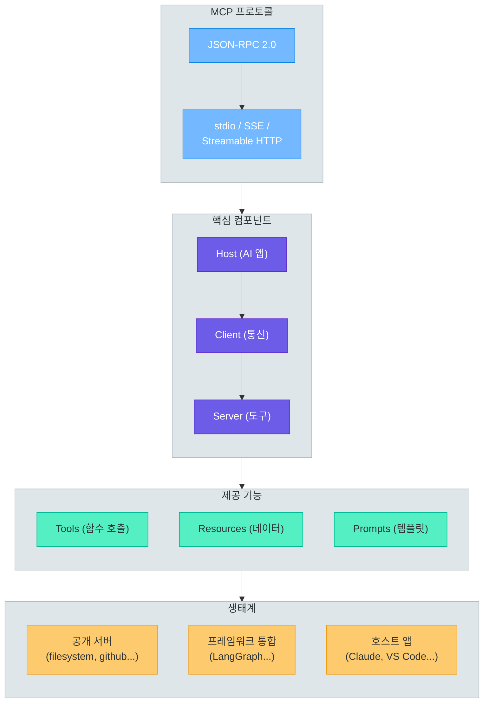

# MCP (Model Context Protocol)

> "AI에게 도구를 연결하는 표준" -- USB처럼, 어떤 AI 모델이든 어떤 도구든 하나의 프로토콜로 연결합니다

---

## 1. MCP란?

### 왜 MCP가 필요한가?

현재 AI 생태계에서 각 모델 제공자는 도구(Tool) 연동 방식을 제각각 정의하고 있습니다. OpenAI는 `function_calling`과 `tools` 파라미터를, Anthropic은 `tool_use` 블록을, Google은 `function_declarations`를 사용합니다. 하나의 도구를 여러 모델에 연동하려면 모델별로 별도의 통합 코드를 작성해야 합니다.

| AI 모델 제공자 | 도구 호출 방식 | 요청 형식 | 응답 형식 |
|----------------|----------------|-----------|-----------|
| OpenAI | `tools` / `function_calling` | `tools` 배열 | `tool_calls` 메시지 |
| Anthropic | `tool_use` | `tools` 배열 | `tool_use` 콘텐츠 블록 |
| Google | `function_declarations` | `tools` 객체 | `functionCall` 파트 |
| Meta (Llama) | 모델별 상이 | 프롬프트 기반 | 텍스트 파싱 필요 |

N개의 모델과 M개의 도구가 있다면, 직접 연동 방식은 **N x M개의 통합 코드**가 필요합니다. MCP는 이 문제를 **표준 프로토콜**로 해결하여 **N + M개의 통합**만 필요하게 만듭니다.



### MCP의 비유 -- AI 세계의 USB

USB가 등장하기 전에는 프린터는 병렬 포트, 마우스는 PS/2 포트, 모뎀은 시리얼 포트 등 장치마다 서로 다른 커넥터를 사용했습니다. USB가 등장하면서 **하나의 표준**으로 모든 장치를 연결할 수 있게 되었습니다. MCP는 AI 도구 세계에서 USB와 같은 역할을 합니다.



| 비유 | USB | MCP |
|------|-----|-----|
| 역할 | 장치와 컴퓨터를 연결하는 표준 | 도구와 AI 모델을 연결하는 표준 |
| 이전 | 장치마다 다른 포트 필요 | 모델마다 다른 도구 연동 코드 |
| 이후 | 하나의 USB 포트로 모든 장치 연결 | 하나의 MCP로 모든 도구 연결 |
| 서버 | USB 장치 (프린터, 마우스 등) | MCP 서버 (날씨, DB, 파일 등) |
| 클라이언트 | USB 호스트 컨트롤러 | MCP 클라이언트 |

### MCP의 핵심 개념

MCP 아키텍처는 세 가지 핵심 컴포넌트로 구성됩니다.

- **MCP Host**: AI 애플리케이션 자체입니다. Claude Desktop, VS Code의 AI 플러그인, 또는 직접 만든 AI 앱이 호스트에 해당합니다.
- **MCP Client**: 호스트 안에서 MCP 서버와 통신하는 컴포넌트입니다. 각 클라이언트는 하나의 MCP 서버와 1:1로 연결됩니다.
- **MCP Server**: 도구(Tools), 리소스(Resources), 프롬프트(Prompts)를 제공하는 서버입니다.



### MCP가 제공하는 세 가지 기능

| 기능 | 설명 | 제어 주체 | 예시 |
|------|------|-----------|------|
| **Tools** | 에이전트가 호출할 수 있는 함수 | 모델 (LLM이 호출 결정) | `get_weather()`, `query_db()` |
| **Resources** | 컨텍스트로 사용할 수 있는 데이터 | 애플리케이션 (앱이 선택) | 파일 내용, DB 스키마 |
| **Prompts** | 미리 정의된 프롬프트 템플릿 | 사용자 (명시적 선택) | 코드 리뷰 프롬프트 |

**Tools**가 가장 핵심적인 기능입니다. LLM이 사용자의 질문을 분석하여 필요한 도구를 선택하고 호출합니다. **Resources**는 LLM의 컨텍스트를 풍부하게 만들기 위한 데이터이고, **Prompts**는 일관된 작업을 위한 템플릿입니다.

> **핵심 포인트:** MCP는 "AI 도구 세계의 USB"입니다. Host(앱) - Client(통신) - Server(도구) 3계층 구조로, N x M의 통합 문제를 N + M으로 줄여줍니다.

---

## 2. MCP 아키텍처

### 통신 방식 -- JSON-RPC 2.0

MCP는 **JSON-RPC 2.0** 프로토콜 기반으로 통신합니다. 요청과 응답 모두 JSON 객체이며, 메서드 이름과 파라미터로 구성됩니다.

```json
// 요청 (Client -> Server)
{
    "jsonrpc": "2.0",
    "id": 1,
    "method": "tools/call",
    "params": {
        "name": "get_weather",
        "arguments": { "city": "Seoul" }
    }
}

// 응답 (Server -> Client)
{
    "jsonrpc": "2.0",
    "id": 1,
    "result": {
        "content": [{ "type": "text", "text": "서울 날씨: 맑음, 22°C" }]
    }
}
```

### Transport 종류

| Transport | 방식 | 적합한 경우 | 특징 |
|-----------|------|-------------|------|
| **stdio** | 표준 입출력 (stdin/stdout) | 로컬 프로세스 간 통신 | 가장 단순, 로컬 전용 |
| **SSE** | Server-Sent Events (HTTP) | 원격 서버 통신 | 서버→클라이언트 스트리밍 |
| **Streamable HTTP** | HTTP 기반 양방향 | 최신 원격 통신 | SSE 대체, 양방향 |

**stdio**는 Claude Desktop이나 VS Code에서 MCP 서버를 실행할 때 주로 사용합니다. **Streamable HTTP**는 원격 서버에 MCP 서버를 배포할 때 사용하는 최신 전송 방식입니다.

### 프로토콜 흐름



### MCP와 기존 도구 통합 비교

| 기준 | Raw Function Calling | LangChain Tools | MCP |
|------|---------------------|-----------------|-----|
| 코드량 | 모델별 개별 구현 | 프레임워크가 추상화 | 표준 프로토콜 |
| 재사용성 | 낮음 (모델 종속) | 보통 (프레임워크 내) | 높음 (표준) |
| 표준화 | 없음 | 프레임워크 한정 | 개방형 표준 |
| 프로세스 분리 | 불가능 | 불가능 | 가능 (별도 프로세스) |
| 언어 독립성 | 없음 | Python/JS | 모든 언어 가능 |

> **핵심 포인트:** MCP는 JSON-RPC 2.0 위에 구축된 표준 프로토콜로, 초기화 → 도구 목록 조회 → 도구 실행의 명확한 흐름을 따릅니다. 도구 서버가 별도 프로세스로 실행되어 언어 독립적이고 안전합니다.

---

## 3. MCP 서버 만들기 (Python)

### 프로젝트 구조

```
mcp-weather-server/
├── server.py          # MCP 서버 메인 코드
├── pyproject.toml     # 패키지 설정
└── requirements.txt   # 의존성
```

```bash
# mcp_install.sh -- MCP Python SDK 설치
pip install mcp httpx
```

### 기본 MCP 서버 -- 날씨 조회

OpenWeatherMap API를 사용하여 날씨를 조회하는 MCP 서버입니다.

```python
# server.py -- 날씨 조회 MCP 서버
import os
import asyncio
import httpx
from mcp.server import Server
from mcp.server.stdio import stdio_server
from mcp.types import Tool, TextContent

API_KEY = os.environ.get("OPENWEATHER_API_KEY", "")
server = Server("weather-server")


@server.list_tools()
async def list_tools() -> list[Tool]:
    """서버가 제공하는 도구 목록을 반환합니다."""
    return [
        Tool(
            name="get_weather",
            description="지정한 도시의 현재 날씨를 조회합니다. 도시명은 영문으로 입력합니다.",
            inputSchema={
                "type": "object",
                "properties": {
                    "city": {
                        "type": "string",
                        "description": "도시명 (영문, 예: Seoul, Tokyo, New York)"
                    }
                },
                "required": ["city"]
            }
        ),
        Tool(
            name="get_forecast",
            description="지정한 도시의 5일간 날씨 예보를 조회합니다.",
            inputSchema={
                "type": "object",
                "properties": {
                    "city": {"type": "string", "description": "도시명 (영문)"},
                    "days": {
                        "type": "integer",
                        "description": "예보 일수 (1~5, 기본값 3)",
                        "default": 3
                    }
                },
                "required": ["city"]
            }
        )
    ]


@server.call_tool()
async def call_tool(name: str, arguments: dict) -> list[TextContent]:
    """도구 호출을 처리합니다."""
    if name == "get_weather":
        city = arguments["city"]
        async with httpx.AsyncClient() as client:
            resp = await client.get(
                "https://api.openweathermap.org/data/2.5/weather",
                params={"q": city, "appid": API_KEY, "units": "metric", "lang": "kr"}
            )
            if resp.status_code != 200:
                return [TextContent(type="text", text=f"조회 실패: {resp.status_code}")]
            data = resp.json()

        return [TextContent(type="text", text=(
            f"{city} 날씨: {data['weather'][0]['description']}, "
            f"온도: {data['main']['temp']}°C (체감 {data['main']['feels_like']}°C), "
            f"습도: {data['main']['humidity']}%, 풍속: {data['wind']['speed']}m/s"
        ))]

    elif name == "get_forecast":
        city = arguments["city"]
        days = min(arguments.get("days", 3), 5)
        async with httpx.AsyncClient() as client:
            resp = await client.get(
                "https://api.openweathermap.org/data/2.5/forecast",
                params={"q": city, "appid": API_KEY, "units": "metric",
                        "lang": "kr", "cnt": days * 8}
            )
            data = resp.json()

        lines = [f"{city} {days}일 예보:"]
        for item in data["list"][::8]:
            lines.append(f"  {item['dt_txt']}: {item['weather'][0]['description']}, "
                         f"{item['main']['temp']}°C")
        return [TextContent(type="text", text="\n".join(lines))]

    raise ValueError(f"알 수 없는 도구: {name}")


async def main():
    async with stdio_server() as (read_stream, write_stream):
        await server.run(read_stream, write_stream,
                         server.create_initialization_options())

if __name__ == "__main__":
    asyncio.run(main())
```

핵심 데코레이터 두 가지:

- `@server.list_tools()`: 도구 목록 반환 (이름, 설명, JSON Schema 입력 스키마)
- `@server.call_tool()`: 도구 실행 핸들러

### 실전 MCP 서버 -- 데이터베이스 조회

```python
# db_server.py -- 데이터베이스 조회 MCP 서버
import asyncio
import sqlite3
from contextlib import closing
from mcp.server import Server
from mcp.server.stdio import stdio_server
from mcp.types import Tool, TextContent

DB_PATH = "company.db"
server = Server("db-server")


@server.list_tools()
async def list_tools() -> list[Tool]:
    return [
        Tool(
            name="list_tables",
            description="데이터베이스의 모든 테이블 목록을 반환합니다.",
            inputSchema={"type": "object", "properties": {}, "required": []}
        ),
        Tool(
            name="describe_table",
            description="지정한 테이블의 컬럼 정보를 반환합니다.",
            inputSchema={
                "type": "object",
                "properties": {
                    "table_name": {"type": "string", "description": "테이블명"}
                },
                "required": ["table_name"]
            }
        ),
        Tool(
            name="query",
            description="SELECT 쿼리를 실행합니다. SELECT만 허용됩니다.",
            inputSchema={
                "type": "object",
                "properties": {
                    "sql": {"type": "string", "description": "SELECT SQL 쿼리"}
                },
                "required": ["sql"]
            }
        )
    ]


@server.call_tool()
async def call_tool(name: str, arguments: dict) -> list[TextContent]:
    with closing(sqlite3.connect(DB_PATH)) as conn:
        if name == "list_tables":
            cursor = conn.execute(
                "SELECT name FROM sqlite_master WHERE type='table'"
            )
            tables = [row[0] for row in cursor.fetchall()]
            return [TextContent(type="text", text=f"테이블: {', '.join(tables)}")]

        elif name == "describe_table":
            table = arguments["table_name"]
            if not table.isalnum():
                return [TextContent(type="text", text="오류: 영숫자 테이블명만 허용")]
            cursor = conn.execute(f"PRAGMA table_info({table})")
            cols = [f"  - {c[1]} ({c[2]}){' [PK]' if c[5] else ''}"
                    for c in cursor.fetchall()]
            return [TextContent(type="text", text=f"{table} 컬럼:\n" + "\n".join(cols))]

        elif name == "query":
            sql = arguments["sql"].strip()
            if not sql.upper().startswith("SELECT"):
                return [TextContent(type="text", text="오류: SELECT만 허용됩니다")]
            try:
                cursor = conn.execute(sql)
                columns = [d[0] for d in cursor.description]
                rows = cursor.fetchall()
                header = " | ".join(columns)
                body = "\n".join(" | ".join(str(v) for v in row) for row in rows[:50])
                return [TextContent(type="text", text=f"{header}\n{body}")]
            except sqlite3.Error as e:
                return [TextContent(type="text", text=f"쿼리 오류: {e}")]

    raise ValueError(f"알 수 없는 도구: {name}")


async def main():
    async with stdio_server() as (read_stream, write_stream):
        await server.run(read_stream, write_stream,
                         server.create_initialization_options())

if __name__ == "__main__":
    asyncio.run(main())
```

### MCP 서버 -- 파일 시스템

보안을 위해 **허용된 디렉토리만** 접근하도록 제한하는 파일 시스템 서버입니다.

```python
# filesystem_server.py -- 파일 시스템 MCP 서버
import os
import asyncio
from pathlib import Path
from mcp.server import Server
from mcp.server.stdio import stdio_server
from mcp.types import Tool, TextContent

ALLOWED_DIRS = [Path(os.environ.get("MCP_ALLOWED_DIR", "/tmp/mcp-sandbox")).resolve()]
server = Server("filesystem-server")


def is_path_allowed(path: Path) -> bool:
    resolved = path.resolve()
    return any(resolved == d or d in resolved.parents for d in ALLOWED_DIRS)


@server.list_tools()
async def list_tools() -> list[Tool]:
    return [
        Tool(name="read_file", description="파일 내용을 읽어 반환합니다.",
             inputSchema={"type": "object",
                          "properties": {"path": {"type": "string", "description": "파일 경로"}},
                          "required": ["path"]}),
        Tool(name="write_file", description="파일에 내용을 씁니다.",
             inputSchema={"type": "object",
                          "properties": {"path": {"type": "string"}, "content": {"type": "string"}},
                          "required": ["path", "content"]}),
        Tool(name="list_directory", description="디렉토리의 파일/폴더 목록을 반환합니다.",
             inputSchema={"type": "object",
                          "properties": {"path": {"type": "string", "description": "디렉토리 경로"}},
                          "required": ["path"]})
    ]


@server.call_tool()
async def call_tool(name: str, arguments: dict) -> list[TextContent]:
    target = Path(arguments.get("path", ""))
    if not is_path_allowed(target):
        return [TextContent(type="text", text=f"접근 거부: 허용된 디렉토리가 아닙니다")]

    try:
        if name == "read_file":
            return [TextContent(type="text", text=target.read_text(encoding="utf-8"))]
        elif name == "write_file":
            target.parent.mkdir(parents=True, exist_ok=True)
            target.write_text(arguments["content"], encoding="utf-8")
            return [TextContent(type="text", text=f"저장 완료: {target}")]
        elif name == "list_directory":
            entries = sorted(target.iterdir())
            lines = [f"  {'[DIR]' if e.is_dir() else '[FILE]'} {e.name}" for e in entries]
            return [TextContent(type="text", text=f"{target}:\n" + "\n".join(lines))]
    except Exception as e:
        return [TextContent(type="text", text=f"오류: {e}")]
    raise ValueError(f"알 수 없는 도구: {name}")


async def main():
    async with stdio_server() as (read_stream, write_stream):
        await server.run(read_stream, write_stream, server.create_initialization_options())

if __name__ == "__main__":
    asyncio.run(main())
```

> **핵심 포인트:** MCP 서버는 `@server.list_tools()`로 도구를 정의하고 `@server.call_tool()`로 실행 로직을 구현합니다. 도구의 `description`과 `inputSchema`가 LLM이 도구를 이해하는 핵심이므로 명확하게 작성해야 합니다.

---

## 4. MCP 서버 연동하기

### Claude Desktop에서 사용하기

Claude Desktop은 MCP를 기본 지원합니다. 설정 파일에 서버를 등록하면 대화 중 자동으로 도구를 인식합니다.

- **macOS**: `~/Library/Application Support/Claude/claude_desktop_config.json`
- **Windows**: `%APPDATA%\Claude\claude_desktop_config.json`

```json
{
    "mcpServers": {
        "weather": {
            "command": "python",
            "args": ["/path/to/server.py"],
            "env": { "OPENWEATHER_API_KEY": "your-api-key" }
        },
        "database": {
            "command": "python",
            "args": ["/path/to/db_server.py"]
        },
        "filesystem": {
            "command": "python",
            "args": ["/path/to/filesystem_server.py"],
            "env": { "MCP_ALLOWED_DIR": "/Users/username/documents" }
        }
    }
}
```

### VS Code에서 사용하기

프로젝트 루트에 `.mcp.json` 파일을 생성합니다.

```json
{
    "servers": {
        "database": {
            "command": "python",
            "args": ["./mcp-servers/db_server.py"]
        },
        "github": {
            "command": "npx",
            "args": ["-y", "@modelcontextprotocol/server-github"],
            "env": { "GITHUB_TOKEN": "${GITHUB_TOKEN}" }
        }
    }
}
```

### 커스텀 MCP 클라이언트 구현

MCP 서버를 자체 애플리케이션에 통합하려면 클라이언트를 직접 구현합니다.

```python
# mcp_client_example.py -- MCP 클라이언트 구현
import asyncio
from mcp import ClientSession, StdioServerParameters
from mcp.client.stdio import stdio_client


async def main():
    server_params = StdioServerParameters(
        command="python",
        args=["server.py"],
        env={"OPENWEATHER_API_KEY": "your-key"}
    )

    async with stdio_client(server_params) as (read_stream, write_stream):
        async with ClientSession(read_stream, write_stream) as session:
            # 1. 초기화
            await session.initialize()

            # 2. 도구 목록 조회
            tools_result = await session.list_tools()
            for tool in tools_result.tools:
                print(f"  - {tool.name}: {tool.description}")

            # 3. 도구 실행
            result = await session.call_tool("get_weather", arguments={"city": "Seoul"})
            print(f"결과: {result.content[0].text}")

if __name__ == "__main__":
    asyncio.run(main())
```

### LLM과 결합한 MCP 클라이언트

실제로는 MCP 클라이언트를 LLM과 결합하여 사용합니다. LLM이 필요한 도구를 선택하고, MCP 서버를 호출하는 구조입니다.

```python
# llm_mcp_client.py -- LLM + MCP 통합 클라이언트
import asyncio
import json
from openai import AsyncOpenAI
from mcp import ClientSession, StdioServerParameters
from mcp.client.stdio import stdio_client


async def run_agent(user_message: str):
    openai = AsyncOpenAI()
    server_params = StdioServerParameters(command="python", args=["server.py"])

    async with stdio_client(server_params) as (read, write):
        async with ClientSession(read, write) as session:
            await session.initialize()

            # MCP 도구를 OpenAI 형식으로 변환
            mcp_tools = await session.list_tools()
            openai_tools = [
                {"type": "function", "function": {
                    "name": t.name, "description": t.description,
                    "parameters": t.inputSchema}}
                for t in mcp_tools.tools
            ]

            messages = [{"role": "user", "content": user_message}]
            response = await openai.chat.completions.create(
                model="gpt-4o", messages=messages, tools=openai_tools
            )
            choice = response.choices[0]

            # 도구 호출 루프
            while choice.finish_reason == "tool_calls":
                messages.append(choice.message)
                for tc in choice.message.tool_calls:
                    result = await session.call_tool(
                        tc.function.name, json.loads(tc.function.arguments))
                    messages.append({"role": "tool", "tool_call_id": tc.id,
                                     "content": result.content[0].text})

                response = await openai.chat.completions.create(
                    model="gpt-4o", messages=messages, tools=openai_tools)
                choice = response.choices[0]

            print(f"AI: {choice.message.content}")

if __name__ == "__main__":
    asyncio.run(run_agent("서울 날씨 어때?"))
```

> **핵심 포인트:** MCP 서버는 Claude Desktop, VS Code, 커스텀 앱 등 다양한 호스트에서 사용할 수 있습니다. 핵심은 MCP 도구 목록을 LLM의 도구 호출 형식으로 변환하고, 결과를 다시 LLM에 전달하는 것입니다.

---

## 5. MCP 생태계

### 공개 MCP 서버 목록

MCP 생태계에는 이미 다양한 공개 서버가 존재합니다. 직접 개발하지 않아도 바로 활용할 수 있습니다.

| MCP 서버 | 제공 기능 | 설치 |
|----------|----------|------|
| `@modelcontextprotocol/server-filesystem` | 파일 읽기/쓰기/검색 | `npx -y @modelcontextprotocol/server-filesystem /path` |
| `@modelcontextprotocol/server-github` | GitHub 이슈, PR, 파일 관리 | `npx -y @modelcontextprotocol/server-github` |
| `@modelcontextprotocol/server-postgres` | PostgreSQL DB 조회 | `npx -y @modelcontextprotocol/server-postgres` |
| `@modelcontextprotocol/server-slack` | Slack 메시지 읽기/보내기 | `npx -y @modelcontextprotocol/server-slack` |
| `@modelcontextprotocol/server-brave-search` | 웹 검색 | `npx -y @modelcontextprotocol/server-brave-search` |
| `@playwright/mcp` | 브라우저 자동화 | `npx -y @playwright/mcp` |
| `@modelcontextprotocol/server-memory` | 지식 그래프 메모리 | `npx -y @modelcontextprotocol/server-memory` |
| `@modelcontextprotocol/server-fetch` | 웹 페이지 가져오기 | `npx -y @modelcontextprotocol/server-fetch` |

### MCP 서버 찾기

1. **[mcp.so](https://mcp.so)**: MCP 서버 전용 검색 사이트 (카테고리별, 인기순)
2. **[GitHub Topics](https://github.com/topics/mcp-server)**: `mcp-server` 토픽으로 검색
3. **[Smithery](https://smithery.ai)**: MCP 서버 레지스트리, 원클릭 설치 지원
4. **npm/PyPI**: `npm search mcp-server` 또는 [pypi.org](https://pypi.org/search/?q=mcp-server) 웹 검색 (`pip search`는 폐기됨)

### MCP와 에이전트 프레임워크 통합

이전 강의에서 배운 LangGraph와 MCP를 결합하면 더욱 강력한 에이전트를 구축할 수 있습니다.

```python
# langgraph_mcp_integration.py -- LangGraph + MCP 통합
import asyncio
from langchain_core.tools import StructuredTool
from langchain_openai import ChatOpenAI
from langgraph.prebuilt import create_react_agent
from mcp import ClientSession, StdioServerParameters
from mcp.client.stdio import stdio_client


async def mcp_tools_to_langchain(session: ClientSession) -> list[StructuredTool]:
    """MCP 서버의 도구를 LangChain 도구로 변환합니다."""
    mcp_tools = await session.list_tools()
    langchain_tools = []

    for tool in mcp_tools.tools:
        tool_name = tool.name

        async def call_mcp(session=session, name=tool_name, **kwargs):
            result = await session.call_tool(name, arguments=kwargs)
            return result.content[0].text

        lc_tool = StructuredTool.from_function(
            coroutine=call_mcp,
            name=tool.name,
            description=tool.description,
        )
        langchain_tools.append(lc_tool)

    return langchain_tools


async def main():
    params = StdioServerParameters(command="python", args=["server.py"])
    async with stdio_client(params) as (read, write):
        async with ClientSession(read, write) as session:
            await session.initialize()
            tools = await mcp_tools_to_langchain(session)

            llm = ChatOpenAI(model="gpt-4o")
            agent = create_react_agent(llm, tools)
            result = await agent.ainvoke({
                "messages": [("human", "서울 날씨와 3일 예보를 알려줘")]
            })
            for msg in result["messages"]:
                print(f"[{msg.type}] {msg.content}")

if __name__ == "__main__":
    asyncio.run(main())
```

MCP 서버를 교체해도 에이전트 코드를 수정할 필요가 없다는 것이 핵심 장점입니다.

> **핵심 포인트:** MCP 생태계에는 파일 시스템, GitHub, DB, 웹 검색 등 다양한 공개 서버가 존재합니다. LangGraph와 결합하면 표준화된 도구로 강력한 에이전트를 빠르게 구축할 수 있습니다.

---

## 6. 실전 프로젝트: 멀티 도구 AI 비서

### 프로젝트 구성

3개의 MCP 서버를 연결한 AI 비서를 만들어 봅니다. 날씨 조회, 일정 관리, 웹 검색을 모두 처리합니다.



### 일정 관리 MCP 서버

```python
# calendar_server.py -- 일정 관리 MCP 서버
import asyncio
import sqlite3
from contextlib import closing
from mcp.server import Server
from mcp.server.stdio import stdio_server
from mcp.types import Tool, TextContent

DB_PATH = "calendar.db"
server = Server("calendar-server")


def init_db():
    with closing(sqlite3.connect(DB_PATH)) as conn:
        conn.execute("""
            CREATE TABLE IF NOT EXISTS events (
                id INTEGER PRIMARY KEY AUTOINCREMENT,
                title TEXT NOT NULL,
                datetime TEXT NOT NULL,
                description TEXT DEFAULT ''
            )
        """)
        conn.commit()


@server.list_tools()
async def list_tools() -> list[Tool]:
    return [
        Tool(name="create_event", description="새 일정을 생성합니다.",
             inputSchema={"type": "object", "properties": {
                 "title": {"type": "string", "description": "일정 제목"},
                 "datetime": {"type": "string", "description": "YYYY-MM-DD HH:MM"},
                 "description": {"type": "string", "description": "설명 (선택)", "default": ""}
             }, "required": ["title", "datetime"]}),
        Tool(name="list_events", description="일정 목록을 조회합니다.",
             inputSchema={"type": "object", "properties": {
                 "date": {"type": "string", "description": "YYYY-MM-DD (선택)"}
             }, "required": []}),
        Tool(name="delete_event", description="일정을 삭제합니다.",
             inputSchema={"type": "object", "properties": {
                 "event_id": {"type": "integer", "description": "삭제할 일정 ID"}
             }, "required": ["event_id"]})
    ]


@server.call_tool()
async def call_tool(name: str, arguments: dict) -> list[TextContent]:
    with closing(sqlite3.connect(DB_PATH)) as conn:
        if name == "create_event":
            cursor = conn.execute(
                "INSERT INTO events (title, datetime, description) VALUES (?, ?, ?)",
                (arguments["title"], arguments["datetime"],
                 arguments.get("description", "")))
            conn.commit()
            return [TextContent(type="text",
                text=f"일정 생성! (ID:{cursor.lastrowid}) "
                     f"{arguments['datetime']} - {arguments['title']}")]

        elif name == "list_events":
            date = arguments.get("date")
            if date:
                cursor = conn.execute(
                    "SELECT id, title, datetime FROM events WHERE datetime LIKE ?",
                    (f"{date}%",))
            else:
                cursor = conn.execute(
                    "SELECT id, title, datetime FROM events ORDER BY datetime LIMIT 20")
            events = cursor.fetchall()
            if not events:
                return [TextContent(type="text", text="등록된 일정이 없습니다.")]
            lines = [f"  [{e[0]}] {e[2]} - {e[1]}" for e in events]
            return [TextContent(type="text", text="일정:\n" + "\n".join(lines))]

        elif name == "delete_event":
            conn.execute("DELETE FROM events WHERE id = ?", (arguments["event_id"],))
            conn.commit()
            return [TextContent(type="text",
                text=f"일정 {arguments['event_id']}번 삭제 완료")]

    raise ValueError(f"알 수 없는 도구: {name}")


async def main():
    init_db()
    async with stdio_server() as (read_stream, write_stream):
        await server.run(read_stream, write_stream,
                         server.create_initialization_options())

if __name__ == "__main__":
    asyncio.run(main())
```

### 멀티 MCP 서버 통합 클라이언트

여러 MCP 서버를 동시에 연결하고 LLM과 통합하는 에이전트입니다.

```python
# multi_mcp_client.py -- 멀티 MCP 서버 통합 에이전트
import asyncio
import json
from openai import AsyncOpenAI
from mcp import ClientSession, StdioServerParameters
from mcp.client.stdio import stdio_client
from contextlib import AsyncExitStack


class MultiMCPAgent:
    def __init__(self):
        self.openai = AsyncOpenAI()
        self.sessions: dict[str, ClientSession] = {}
        self.tool_to_session: dict[str, str] = {}
        self.openai_tools: list[dict] = []
        self.exit_stack = AsyncExitStack()

    async def connect_server(self, name: str, command: str, args: list[str],
                             env: dict = None):
        params = StdioServerParameters(command=command, args=args, env=env)
        transport = await self.exit_stack.enter_async_context(stdio_client(params))
        session = await self.exit_stack.enter_async_context(
            ClientSession(transport[0], transport[1]))
        await session.initialize()
        self.sessions[name] = session

        tools_result = await session.list_tools()
        for tool in tools_result.tools:
            self.tool_to_session[tool.name] = name
            self.openai_tools.append({"type": "function", "function": {
                "name": tool.name, "description": tool.description,
                "parameters": tool.inputSchema}})
        print(f"[{name}] 연결 완료 ({len(tools_result.tools)}개 도구)")

    async def chat(self, user_message: str) -> str:
        messages = [
            {"role": "system", "content":
             "날씨 조회, 일정 관리가 가능한 AI 비서입니다. 한국어로 응답하세요."},
            {"role": "user", "content": user_message}
        ]

        response = await self.openai.chat.completions.create(
            model="gpt-4o", messages=messages,
            tools=self.openai_tools if self.openai_tools else None)
        choice = response.choices[0]

        while choice.finish_reason == "tool_calls":
            messages.append(choice.message)
            for tc in choice.message.tool_calls:
                session = self.sessions[self.tool_to_session[tc.function.name]]
                result = await session.call_tool(
                    tc.function.name, json.loads(tc.function.arguments))
                messages.append({"role": "tool", "tool_call_id": tc.id,
                                 "content": result.content[0].text})
            response = await self.openai.chat.completions.create(
                model="gpt-4o", messages=messages, tools=self.openai_tools)
            choice = response.choices[0]

        return choice.message.content

    async def close(self):
        await self.exit_stack.aclose()


async def main():
    agent = MultiMCPAgent()
    try:
        await agent.connect_server("weather", "python", ["server.py"])
        await agent.connect_server("calendar", "python", ["calendar_server.py"])

        queries = ["서울 날씨 어때?", "내일 오후 3시에 팀 회의 잡아줘", "일정 보여줘"]
        for q in queries:
            print(f"\n사용자: {q}")
            print(f"AI: {await agent.chat(q)}")
    finally:
        await agent.close()

if __name__ == "__main__":
    asyncio.run(main())
```

### 실행 예시

```
[weather] 연결 완료 (2개 도구)
[calendar] 연결 완료 (3개 도구)

사용자: 서울 날씨 어때?
AI: 현재 서울은 맑으며 기온은 22°C, 체감온도 21°C입니다. 습도 45%, 풍속 3.2m/s로 쾌적합니다.

사용자: 내일 오후 3시에 팀 회의 잡아줘
AI: 내일 오후 3시에 팀 회의 일정을 등록했습니다!

사용자: 일정 보여줘
AI: 현재 등록된 일정입니다:
  [1] 2025-03-15 15:00 - 팀 회의
```

> **핵심 포인트:** 여러 MCP 서버를 하나의 에이전트에 연결하면, 도구명으로 자동 라우팅됩니다. 각 서버는 독립 프로세스이므로 서로 영향 없이 추가/교체가 가능합니다.

---

## 7. MCP 보안과 모범 사례

### 보안 고려사항

MCP 서버는 AI가 외부 시스템에 접근하는 통로이므로 보안이 중요합니다.



**입력 검증**: SQL 쿼리 실행 시 반드시 SELECT만 허용하고 위험 키워드를 차단합니다.

```python
# 나쁜 예
cursor = conn.execute(arguments["sql"])  # 위험!

# 좋은 예
sql = arguments["sql"].strip()
if not sql.upper().startswith("SELECT"):
    raise ValueError("SELECT만 허용됩니다")
forbidden = ["DROP", "DELETE", "UPDATE", "INSERT", "ALTER"]
if any(kw in sql.upper() for kw in forbidden):
    raise ValueError("허용되지 않는 키워드 포함")
```

**권한 최소화**: 필요한 최소 권한만 부여합니다.

```python
conn = sqlite3.connect("file:data.db?mode=ro", uri=True)  # 읽기 전용
```

**API 키 관리**: 환경변수로 관리하고 코드에 하드코딩하지 않습니다.

```python
API_KEY = os.environ.get("OPENWEATHER_API_KEY")
if not API_KEY:
    raise ValueError("OPENWEATHER_API_KEY 환경변수 필요")
```

### MCP 서버 개발 모범 사례

| 구분 | 해야 할 것 | 하지 말아야 할 것 |
|------|-----------|------------------|
| 도구 설명 | 명확하고 구체적으로 작성 | 모호한 설명 ("데이터 처리") |
| 입력 스키마 | 모든 파라미터에 description 추가 | 스키마 없이 자유 입력 |
| 에러 처리 | 의미 있는 에러 메시지 반환 | 스택 트레이스 노출 |
| 보안 | 입력 검증, 권한 최소화 | 모든 접근 무조건 허용 |
| 로깅 | 도구 호출과 결과 기록 | 로깅 없이 운영 |
| 결과 형식 | 일관된 텍스트 형식 반환 | 도구마다 다른 형식 |

**도구 설명이 가장 중요합니다.** LLM은 `description`을 읽고 도구 선택을 결정합니다.

```python
# 나쁜 예
Tool(name="search", description="검색합니다")

# 좋은 예
Tool(name="search_products",
     description="상품 DB에서 키워드로 검색합니다. 상품명, 카테고리에서 검색하며 "
                 "최대 20개 결과를 반환합니다. 가격 범위 필터링도 가능합니다.")
```

### MCP vs 직접 API 통합 -- 언제 무엇을 쓸까?

| 기준 | MCP가 적합한 경우 | 직접 통합이 나은 경우 |
|------|-------------------|---------------------|
| 도구 재사용 | 여러 AI 앱에서 같은 도구 사용 | 특정 앱 전용 도구 |
| 팀 구성 | 도구팀과 AI팀이 분리 | 한 팀에서 모두 개발 |
| 도구 수 | 5개 이상 다양한 도구 | 1~2개 단순 도구 |
| 성능 | 약간의 오버헤드 허용 | 마이크로초 지연 중요 |
| 언어 | 도구가 여러 언어로 구현 | 모든 코드가 같은 언어 |

> **핵심 포인트:** MCP 보안의 핵심은 입력 검증, 권한 최소화, API 키 환경변수 관리입니다. 도구의 `description`은 LLM이 이해하는 유일한 수단이므로 가장 중요합니다.

---

## 8. 핵심 정리

### MCP 핵심 개념 요약



### MCP 개발 체크리스트

| 단계 | 체크 항목 | 설명 |
|------|----------|------|
| 설계 | 도구 범위 정의 | 서버가 제공할 도구 목록과 역할 정의 |
| 설계 | 입력/출력 스키마 | JSON Schema로 파라미터 타입과 설명 정의 |
| 구현 | 도구 설명 작성 | LLM이 이해할 수 있는 구체적 설명 |
| 구현 | 에러 처리 | 모든 예외를 잡아 의미 있는 메시지 반환 |
| 보안 | 입력 검증 | SQL Injection, Path Traversal 방어 |
| 보안 | 권한 최소화 | 읽기 전용 등 필요 최소 권한 |
| 보안 | API 키 관리 | 환경변수 사용, 하드코딩 금지 |
| 테스트 | 단위 테스트 | 정상/에러 케이스 모두 테스트 |
| 배포 | 설정 문서화 | claude_desktop_config.json 예시 제공 |
| 운영 | 로깅 | 도구 호출, 에러 로그 기록 |

### 전체 도구 통합 방식 비교

| 기준 | Function Calling | LangChain Tools | MCP |
|------|-----------------|-----------------|-----|
| 정의 방식 | JSON Schema (모델별) | Python 함수/클래스 | JSON Schema (표준) |
| 실행 위치 | 앱 내부 | 앱 내부 | 별도 프로세스 |
| 재사용성 | 낮음 (모델 종속) | 보통 (프레임워크 내) | 높음 (표준) |
| 표준화 | 없음 | 없음 | 개방형 표준 |
| 생태계 | 없음 | LangChain Hub | mcp.so, GitHub |
| 언어 지원 | 구현 언어 한정 | Python, JS | 모든 언어 |
| 프로세스 격리 | 없음 | 없음 | 있음 |
| 적합한 규모 | 소규모 (1~3개) | 중규모 (3~10개) | 대규모 (5개+) |

### 다음 단계

MCP를 학습했으니 다음 방향으로 확장해 보세요.

1. **기존 프로젝트에 MCP 적용**: RAG 시스템이나 LangGraph 에이전트에 MCP 서버를 연결해 보세요.
2. **공개 MCP 서버 활용**: `@modelcontextprotocol/server-github`이나 `@playwright/mcp`를 Claude Desktop에 연결하세요.
3. **팀용 MCP 서버 개발**: 사내 API나 DB를 MCP 서버로 래핑하여 팀원들과 공유하세요.

```bash
# 핵심 패키지
pip install mcp                  # MCP Python SDK
pip install httpx                # 비동기 HTTP 클라이언트
pip install langchain-openai     # OpenAI 통합 (LangGraph 연동 시)
pip install langgraph            # LangGraph 에이전트 (선택)
```

> **핵심 포인트:** MCP는 AI 도구 통합의 표준입니다. "도구를 한 번 만들면 어디서든 사용한다"는 철학으로, 에이전트 생태계의 확장성과 재사용성을 근본적으로 향상시킵니다. 작은 서버 하나부터 시작하여 점진적으로 확장해 나가세요.

---

> **이전 강의:** [LangGraph 에이전트](10_langgraph_agents.md) | **다음 강의:** [HuggingFace 로컬 모델 활용](13_huggingface_local.md)
