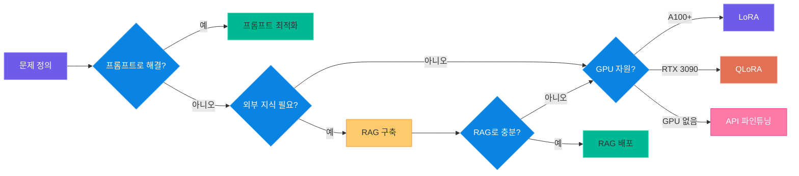
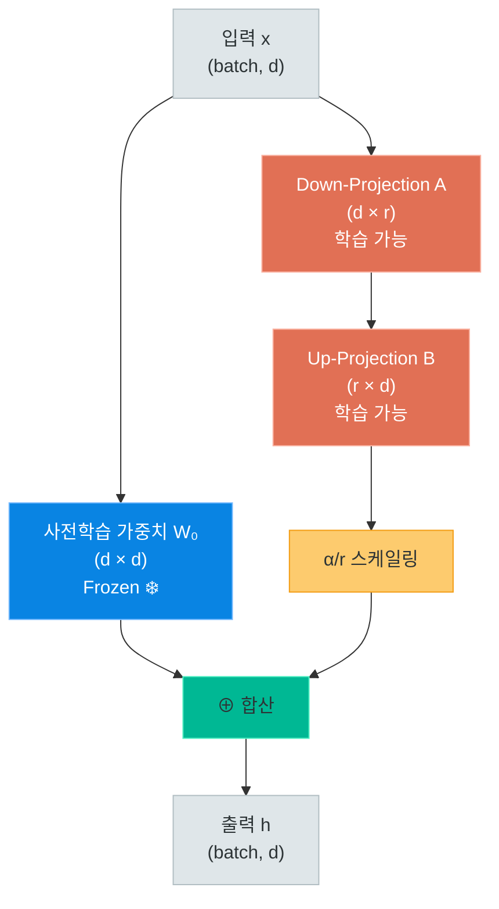
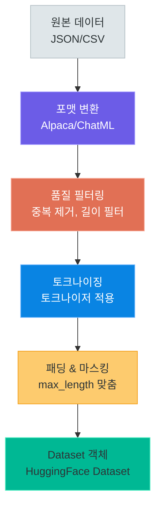
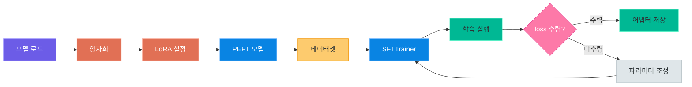

# LoRA / QLoRA 파인튜닝 실전 가이드

> 대규모 언어 모델을 내 데이터에 맞게 효율적으로 미세조정하는 방법을 배웁니다

---

## 1. 파인튜닝 전략 선택

### 파인튜닝이란?

파인튜닝(Fine-Tuning)은 사전학습된 대규모 언어 모델(LLM)의 가중치를 특정 태스크나 도메인 데이터로
추가 학습시켜 모델의 성능을 개선하는 기법입니다.

하지만 모든 문제에 파인튜닝이 필요한 것은 아닙니다. 프롬프트 엔지니어링이나 RAG로 충분한 경우도 많습니다.
파인튜닝은 **마지막 카드**로 사용하는 것이 비용 대비 효과적입니다.

### 언제 파인튜닝이 필요한가?

| 상황 | 프롬프트 | RAG | 파인튜닝 |
|---|---|---|---|
| 출력 형식 고정 (JSON, XML 등) | 가능 | 가능 | **최적** |
| 도메인 전문 용어 사용 | 부분적 | 가능 | **최적** |
| 특정 톤/스타일 유지 | 부분적 | 어려움 | **최적** |
| 최신 지식 반영 | 불가능 | **최적** | 가능 |
| 비용 민감한 대량 처리 | 비쌈 | 보통 | **최적** |
| 빠른 프로토타이핑 | **최적** | 가능 | 느림 |
| 환각(Hallucination) 감소 | 부분적 | **최적** | 가능 |

> **핵심 포인트:** 파인튜닝은 모델이 "어떻게 말하는가"를 바꾸고, RAG는 모델이 "무엇을 아는가"를 확장합니다. 두 기법은 상호 보완적입니다.

### Full Fine-Tuning vs PEFT

**Full Fine-Tuning**은 모델의 모든 파라미터를 업데이트합니다.
7B 모델 기준으로 약 28GB 이상의 VRAM이 필요하며, 학습 시간도 오래 걸립니다.

**PEFT(Parameter-Efficient Fine-Tuning)**는 모델의 극히 일부 파라미터만 학습합니다.
대표적인 기법으로 LoRA, QLoRA, Prefix Tuning, Adapter 등이 있습니다.

| 비교 항목 | Full Fine-Tuning | LoRA (PEFT) | QLoRA (PEFT) |
|---|---|---|---|
| 학습 파라미터 비율 | 100% | 0.1~1% | 0.1~1% |
| 7B 모델 VRAM | 28GB+ | 16GB+ | 6GB+ |
| 학습 속도 | 느림 | 빠름 | 보통 |
| 성능 | 최고 | Full의 95%+ | Full의 90%+ |
| GPU 요구 사항 | A100 80GB+ | A100 40GB | RTX 3090/4090 |
| 비용 | 매우 높음 | 보통 | 낮음 |

### 파인튜닝 결정 트리

아래 다이어그램은 어떤 접근 방식을 선택해야 하는지 판단하는 흐름입니다.



> **핵심 포인트:** 프롬프트 엔지니어링 -> RAG -> 파인튜닝 순서로 시도하세요. 각 단계에서 충분한지 평가한 후 다음 단계로 넘어가는 것이 효율적입니다.

---

## 2. LoRA 원리

### 저랭크 분해(Low-Rank Decomposition)란?

LoRA(Low-Rank Adaptation)는 Microsoft Research에서 2021년에 발표한 기법으로,
사전학습된 모델의 가중치를 직접 수정하지 않고, **저랭크 행렬 두 개를 추가**하여
효율적으로 파인튜닝하는 방법입니다.

핵심 아이디어는 다음과 같습니다:

- 사전학습된 가중치 행렬 `W₀`는 고정(freeze)합니다
- 가중치 업데이트 `ΔW`를 저랭크 행렬 두 개의 곱으로 근사합니다
- `ΔW = A × B` (여기서 A는 d×r, B는 r×d 크기)
- `r`(rank)은 `d`(원본 차원)보다 훨씬 작습니다 (r << d)

### 수학적 원리

원본 선형 변환:

```
h = W₀ · x
```

LoRA 적용 후:

```
h = W₀ · x + ΔW · x = W₀ · x + (A × B) · x
```

예를 들어, 원본 가중치 행렬이 `4096 × 4096` 크기라면:
- **Full Fine-Tuning**: 4096 × 4096 = **16,777,216개** 파라미터 업데이트
- **LoRA (r=8)**: (4096 × 8) + (8 × 4096) = **65,536개** 파라미터 업데이트
- 파라미터 절감률: **99.6%**

### LoRA 구조 다이어그램



### 핵심 하이퍼파라미터

#### r (Rank)

저랭크 행렬의 차원 크기입니다. 값이 클수록 표현력이 높아지지만 파라미터 수도 증가합니다.

| Rank (r) | 파라미터 수 (d=4096) | 일반적인 용도 |
|---|---|---|
| 4 | 32,768 | 단순 분류 태스크 |
| 8 | 65,536 | 일반적인 파인튜닝 (기본값) |
| 16 | 131,072 | 복잡한 태스크 |
| 32 | 262,144 | 도메인 특화 학습 |
| 64 | 524,288 | 대규모 데이터셋 학습 |

#### lora_alpha

LoRA 스케일링 팩터입니다. 실제 스케일링은 `alpha / r`로 계산됩니다.
일반적으로 `lora_alpha = 2 * r` 또는 `lora_alpha = r`로 설정합니다.

- `alpha = 16, r = 8` -> 스케일링 = 2.0
- `alpha = 8, r = 8` -> 스케일링 = 1.0
- `alpha = 32, r = 16` -> 스케일링 = 2.0

#### lora_dropout

LoRA 레이어에 적용되는 드롭아웃 비율입니다.
과적합 방지를 위해 사용하며, 일반적으로 `0.05 ~ 0.1` 사이의 값을 사용합니다.

#### target_modules

LoRA를 적용할 모듈을 선택합니다. Transformer의 어텐션 레이어가 주요 대상입니다.

| 모듈 | 설명 | 권장 여부 |
|---|---|---|
| `q_proj` | Query 프로젝션 | 필수 |
| `v_proj` | Value 프로젝션 | 필수 |
| `k_proj` | Key 프로젝션 | 권장 |
| `o_proj` | Output 프로젝션 | 권장 |
| `gate_proj` | FFN 게이트 | 선택적 |
| `up_proj` | FFN 업 프로젝션 | 선택적 |
| `down_proj` | FFN 다운 프로젝션 | 선택적 |

> **핵심 포인트:** 최소한 `q_proj`와 `v_proj`에는 LoRA를 적용해야 합니다. 최근에는 모든 Linear 레이어에 적용하는 것이 더 좋은 결과를 보이는 경우가 많습니다.

### 학습 파라미터 수 계산 예시

```python
# lora_params_calc.py -- LoRA 학습 파라미터 수 계산기

def calc_lora_params(d_model, r, num_target_modules, num_layers):
    """LoRA 학습 파라미터 수 계산"""
    # 각 LoRA 레이어: A(d×r) + B(r×d) = 2 * d * r
    params_per_module = 2 * d_model * r
    total_params = params_per_module * num_target_modules * num_layers
    return total_params

# Qwen2.5-7B 예시
d_model = 3584          # hidden_size
r = 8                   # rank
num_target_modules = 4  # q_proj, k_proj, v_proj, o_proj
num_layers = 28         # num_hidden_layers

total = calc_lora_params(d_model, r, num_target_modules, num_layers)
original = 7_000_000_000  # 7B 파라미터

print(f"LoRA 학습 파라미터: {total:,}개")          # 6,422,528개
print(f"전체 파라미터 대비: {total/original*100:.2f}%")  # 약 0.09%
```

---

## 3. QLoRA 환경

### QLoRA란?

QLoRA(Quantized LoRA)는 2023년 워싱턴 대학교에서 발표한 기법으로,
**4비트 양자화된 모델 위에 LoRA를 적용**하는 방법입니다.

핵심 기술은 다음과 같습니다:

1. **NF4(NormalFloat4) 양자화**: 정규분포에 최적화된 4비트 데이터 타입
2. **이중 양자화(Double Quantization)**: 양자화 상수를 다시 양자화하여 메모리 절감
3. **페이지드 옵티마이저(Paged Optimizers)**: GPU 메모리 부족 시 CPU로 자동 오프로딩

### VRAM 계산

모델 크기별 필요 VRAM을 비교합니다.

| 모델 크기 | FP16 추론 | FP16 학습 | QLoRA 학습 | QLoRA + Gradient Checkpointing |
|---|---|---|---|---|
| 0.5B | 1GB | 4GB | 2GB | 1.5GB |
| 1.5B | 3GB | 12GB | 4GB | 3GB |
| 3B | 6GB | 24GB | 8GB | 6GB |
| 7B | 14GB | 56GB | 12GB | 8GB |
| 14B | 28GB | 112GB | 20GB | 14GB |
| 32B | 64GB | 256GB | 40GB | 28GB |
| 72B | 144GB | 576GB | 80GB | 52GB |

> **핵심 포인트:** QLoRA를 사용하면 RTX 3090/4090(24GB) 한 장으로도 7B 모델을 파인튜닝할 수 있습니다. Gradient Checkpointing을 함께 사용하면 더 큰 모델도 가능합니다.

### BitsAndBytesConfig 설정

```python
# bnb_config.py -- QLoRA 양자화 설정

import torch
from transformers import BitsAndBytesConfig

# QLoRA용 4비트 양자화 설정
bnb_config = BitsAndBytesConfig(
    load_in_4bit=True,                    # 4비트 양자화 활성화
    bnb_4bit_quant_type="nf4",            # NormalFloat4 사용
    bnb_4bit_compute_dtype=torch.bfloat16, # 연산은 bfloat16으로
    bnb_4bit_use_double_quant=True,        # 이중 양자화 활성화
)
```

각 설정의 의미를 살펴봅니다:

- `load_in_4bit=True`: 모델 가중치를 4비트로 양자화하여 로드합니다
- `bnb_4bit_quant_type="nf4"`: NormalFloat4 양자화를 사용합니다. 일반 int4보다 성능이 좋습니다
- `bnb_4bit_compute_dtype=torch.bfloat16`: 실제 연산 시에는 bfloat16으로 변환하여 계산합니다
- `bnb_4bit_use_double_quant=True`: 양자화 상수를 한 번 더 양자화하여 추가 메모리를 절약합니다

### QLoRA 모델 로드 코드

```python
# load_qlora_model.py -- QLoRA 모델 로드

import torch
from transformers import AutoModelForCausalLM, AutoTokenizer, BitsAndBytesConfig
from peft import LoraConfig, get_peft_model, prepare_model_for_kbit_training

# 1. 양자화 설정
bnb_config = BitsAndBytesConfig(
    load_in_4bit=True,
    bnb_4bit_quant_type="nf4",
    bnb_4bit_compute_dtype=torch.bfloat16,
    bnb_4bit_use_double_quant=True,
)

# 2. 모델과 토크나이저 로드
model_name = "Qwen/Qwen2.5-0.5B-Instruct"

tokenizer = AutoTokenizer.from_pretrained(model_name)
model = AutoModelForCausalLM.from_pretrained(
    model_name,
    quantization_config=bnb_config,
    device_map="auto",
    trust_remote_code=True,
)

# 3. k-bit 학습을 위한 모델 준비
model = prepare_model_for_kbit_training(model)

# 4. LoRA 설정
lora_config = LoraConfig(
    r=8,                          # Rank
    lora_alpha=16,                # Alpha (보통 2*r)
    target_modules=[              # LoRA 적용 대상 모듈
        "q_proj",
        "k_proj",
        "v_proj",
        "o_proj",
    ],
    lora_dropout=0.05,            # Dropout
    bias="none",                  # Bias 학습 여부
    task_type="CAUSAL_LM",        # 태스크 유형
)

# 5. PEFT 모델 생성
model = get_peft_model(model, lora_config)

# 학습 가능 파라미터 확인
model.print_trainable_parameters()
# 출력 예: trainable params: 851,968 || all params: 494,033,920 || trainable%: 0.1724
```

---

## 4. 데이터셋 준비

### 파인튜닝 데이터 포맷

파인튜닝에 사용하는 데이터 포맷은 크게 3가지입니다. 각각의 구조와 용도를 살펴보겠습니다.

### Alpaca 포맷

Stanford Alpaca에서 처음 사용한 포맷으로, 가장 단순한 구조입니다.

```json
[
    {
        "instruction": "주어진 텍스트를 요약해 주세요.",
        "input": "인공지능(AI)은 인간의 학습능력, 추론능력, 지각능력을 인공적으로 구현한 컴퓨터 과학의 세부 분야입니다. AI는 머신러닝, 딥러닝, 자연어처리 등 다양한 기술을 포함하며, 최근 대규모 언어 모델(LLM)의 발전으로 새로운 전환점을 맞이하고 있습니다.",
        "output": "AI는 인간의 지능을 컴퓨터로 구현하는 기술로, 최근 LLM의 발전으로 큰 변화를 겪고 있습니다."
    },
    {
        "instruction": "다음 문장을 영어로 번역해 주세요.",
        "input": "오늘 날씨가 정말 좋습니다.",
        "output": "The weather is really nice today."
    }
]
```

### ShareGPT 포맷

다중 턴 대화 형식으로, ChatGPT 대화를 공유하는 데서 시작된 포맷입니다.

```json
[
    {
        "conversations": [
            {"from": "system", "value": "당신은 친절한 한국어 AI 어시스턴트입니다."},
            {"from": "human", "value": "파이썬에서 리스트를 정렬하는 방법을 알려주세요."},
            {"from": "gpt", "value": "파이썬에서 리스트를 정렬하는 방법은 두 가지가 있습니다:\n\n1. `sort()` 메서드: 원본 리스트를 직접 정렬합니다.\n2. `sorted()` 함수: 정렬된 새 리스트를 반환합니다."},
            {"from": "human", "value": "역순으로 정렬하려면요?"},
            {"from": "gpt", "value": "`reverse=True` 파라미터를 사용하면 됩니다.\n\n```python\nmy_list = [3, 1, 4, 1, 5]\nmy_list.sort(reverse=True)  # [5, 4, 3, 1, 1]\n```"}
        ]
    }
]
```

### ChatML 포맷

OpenAI의 Chat Markup Language 포맷으로, 최근 가장 널리 사용됩니다.

```json
[
    {
        "messages": [
            {"role": "system", "content": "당신은 의료 전문 AI 어시스턴트입니다."},
            {"role": "user", "content": "두통이 심한데 어떻게 해야 하나요?"},
            {"role": "assistant", "content": "두통의 원인은 다양합니다. 충분한 수분 섭취와 휴식을 권장하며, 증상이 지속되면 전문의 상담을 받으시기 바랍니다."}
        ]
    }
]
```

### 한국어 파인튜닝 데이터셋

| 데이터셋 | 설명 | 크기 | 포맷 | 라이선스 |
|---|---|---|---|---|
| KoAlpaca | 한국어 Alpaca 데이터 | 52K | Alpaca | CC BY-NC 4.0 |
| KULLM-v2 | 고려대 한국어 지시 데이터 | 152K | Alpaca | CC BY-SA 4.0 |
| Open-Orca-Ko | 한국어 Orca 데이터 | 200K+ | ShareGPT | Apache 2.0 |
| KorQuAD | 한국어 질의응답 데이터 | 70K+ | QA | CC BY-ND 2.0 |
| AI Hub 데이터 | 정부 제공 한국어 데이터 | 다양 | 다양 | 공공누리 |

> **핵심 포인트:** 한국어 파인튜닝 시에는 기존 한국어 데이터셋을 활용하거나, 직접 데이터를 수집/생성해야 합니다. 데이터 품질이 파인튜닝 결과를 좌우하므로, 양보다 질에 집중하세요.

### 데이터 전처리 파이프라인



### 데이터셋 준비 코드

```python
# prepare_dataset.py -- Alpaca 포맷 데이터셋 준비 및 ChatML 변환

from datasets import Dataset

# 1. 학습 데이터 준비 (Alpaca 포맷)
train_data = [
    {
        "instruction": "다음 문장의 감정을 분석해 주세요.",
        "input": "오늘 정말 행복한 하루였습니다!",
        "output": "긍정적인 감정입니다. 화자는 하루를 매우 만족스럽게 보낸 것으로 보입니다."
    },
    {
        "instruction": "다음 코드의 버그를 찾아주세요.",
        "input": "def add(a, b):\n    return a - b",
        "output": "함수 이름은 add(더하기)이지만 실제로는 뺄셈(a - b)을 수행하고 있습니다. `return a + b`로 수정해야 합니다."
    },
]


# 2. Alpaca 포맷을 프롬프트 템플릿으로 변환
def format_alpaca_prompt(example):
    """Alpaca 포맷 데이터를 학습용 프롬프트로 변환"""
    if example.get("input", "").strip():
        prompt = f"""### Instruction:
{example['instruction']}

### Input:
{example['input']}

### Response:
{example['output']}"""
    else:
        prompt = f"""### Instruction:
{example['instruction']}

### Response:
{example['output']}"""
    return {"text": prompt}


# 3. HuggingFace Dataset 객체 생성
dataset = Dataset.from_list(train_data)
dataset = dataset.map(format_alpaca_prompt)

print(f"데이터셋 크기: {len(dataset)}")
print(f"샘플 데이터:\n{dataset[0]['text']}")


# 4. ChatML 포맷 변환 (최신 모델 권장)
def format_chatml(example):
    """Alpaca 포맷을 ChatML 대화 형식으로 변환"""
    messages = [
        {"role": "system", "content": "당신은 도움이 되는 AI 어시스턴트입니다."},
    ]
    if example.get("input", "").strip():
        user_content = f"{example['instruction']}\n\n{example['input']}"
    else:
        user_content = example["instruction"]

    messages.append({"role": "user", "content": user_content})
    messages.append({"role": "assistant", "content": example["output"]})
    return {"messages": messages}


# 5. 토크나이저 ChatML 템플릿 적용
def apply_chat_template(example, tokenizer):
    """토크나이저의 chat_template을 적용"""
    text = tokenizer.apply_chat_template(
        example["messages"],
        tokenize=False,
        add_generation_prompt=False,
    )
    return {"text": text}
```

---

## 5. SFTTrainer 학습

### SFTTrainer 소개

`trl` (Transformer Reinforcement Learning) 라이브러리의 `SFTTrainer`는
지도 학습 기반 파인튜닝(Supervised Fine-Tuning)을 위한 고수준 API입니다.

`trl 0.9+`에서는 기존 `SFTTrainer`가 더욱 개선되어 다음과 같은 기능을 제공합니다:

- ChatML/Alpaca 포맷 자동 처리
- Packing(여러 샘플을 하나의 시퀀스로 결합) 지원
- LoRA/QLoRA와의 원활한 통합
- NEFTune(노이즈 임베딩) 지원

### TrainingArguments 핵심 파라미터

```python
# training_args.py -- 학습 하이퍼파라미터 설정

from transformers import TrainingArguments

training_args = TrainingArguments(
    # === 기본 설정 ===
    output_dir="./results",                 # 체크포인트 저장 경로
    num_train_epochs=3,                     # 전체 에폭 수
    max_steps=-1,                           # 최대 학습 스텝 (-1이면 에폭 기준)

    # === 배치 크기 ===
    per_device_train_batch_size=4,          # GPU당 배치 크기
    gradient_accumulation_steps=4,          # 그래디언트 누적 스텝
    # 실효 배치 크기 = 4 * 4 = 16

    # === 학습률 ===
    learning_rate=2e-4,                     # 초기 학습률
    lr_scheduler_type="cosine",             # 스케줄러 (cosine 권장)
    warmup_ratio=0.03,                      # 워밍업 비율

    # === 메모리 최적화 ===
    gradient_checkpointing=True,            # 그래디언트 체크포인팅
    optim="paged_adamw_8bit",               # 8비트 AdamW 옵티마이저
    bf16=True,                              # bfloat16 사용
    fp16=False,                             # float16 (bf16 지원 안 되면)

    # === 로깅 ===
    logging_steps=10,                       # 로그 출력 간격
    save_strategy="steps",                  # 저장 전략
    save_steps=100,                         # 저장 간격
    save_total_limit=3,                     # 최대 체크포인트 수

    # === 기타 ===
    report_to="none",                       # "wandb", "tensorboard" 등
    seed=42,                                # 랜덤 시드
)
```

각 파라미터에 대한 상세 설명입니다:

| 파라미터 | 설명 | 권장 값 |
|---|---|---|
| `learning_rate` | 초기 학습률. LoRA는 일반 학습보다 높게 설정 | 1e-4 ~ 3e-4 |
| `lr_scheduler_type` | 학습률 감소 스케줄러 | cosine |
| `warmup_ratio` | 워밍업 구간 비율 | 0.03 ~ 0.1 |
| `gradient_accumulation_steps` | 그래디언트 누적 횟수 | 4 ~ 16 |
| `gradient_checkpointing` | 메모리 절감을 위한 체크포인팅 | True |
| `optim` | 옵티마이저 종류 | paged_adamw_8bit |
| `max_seq_length` | 최대 시퀀스 길이 | 512 ~ 2048 |
| `packing` | 짧은 샘플 결합 | True (효율적) |

### 학습 파이프라인



### Qwen2.5-0.5B QLoRA 파인튜닝 전체 코드

아래는 CPU에서도 실행 가능한 미니 학습 예제입니다. GPU가 없는 환경에서 테스트할 수 있도록
`max_steps=50`으로 제한합니다.

```python
# qlora_finetune.py -- Qwen2.5-0.5B QLoRA 파인튜닝 전체 코드

import torch
from datasets import Dataset
from transformers import (
    AutoModelForCausalLM,
    AutoTokenizer,
    BitsAndBytesConfig,
    TrainingArguments,
)
from peft import LoraConfig, get_peft_model, prepare_model_for_kbit_training
from trl import SFTTrainer

# ============================================================
# 1. 학습 데이터 준비
# ============================================================
train_data = [
    {
        "messages": [
            {"role": "system", "content": "당신은 친절한 한국어 AI 어시스턴트입니다."},
            {"role": "user", "content": "파이썬의 장점을 3가지 알려주세요."},
            {"role": "assistant", "content": "파이썬의 주요 장점 3가지입니다:\n\n1. **간결한 문법**: 읽기 쉽고 배우기 쉬운 문법을 제공합니다.\n2. **풍부한 라이브러리**: NumPy, Pandas, TensorFlow 등 다양한 라이브러리가 있습니다.\n3. **넓은 활용 분야**: 웹 개발, 데이터 분석, AI/ML 등 다양한 분야에서 사용됩니다."},
        ]
    },
    {
        "messages": [
            {"role": "system", "content": "당신은 친절한 한국어 AI 어시스턴트입니다."},
            {"role": "user", "content": "딥러닝과 머신러닝의 차이점은 무엇인가요?"},
            {"role": "assistant", "content": "딥러닝은 머신러닝의 하위 분야입니다.\n\n- **머신러닝**: 데이터에서 패턴을 학습하는 알고리즘의 총칭입니다. SVM, 결정트리 등이 포함됩니다.\n- **딥러닝**: 심층 신경망을 사용하는 머신러닝 기법입니다. 이미지, 자연어 등 비정형 데이터에 강점이 있습니다.\n\n핵심 차이는 특성 추출(feature engineering)의 자동화 여부입니다."},
        ]
    },
    {
        "messages": [
            {"role": "system", "content": "당신은 친절한 한국어 AI 어시스턴트입니다."},
            {"role": "user", "content": "REST API란 무엇인가요?"},
            {"role": "assistant", "content": "REST API는 Representational State Transfer의 약자로, 웹 서비스 간 통신을 위한 아키텍처 스타일입니다.\n\n주요 원칙:\n- **자원(Resource)** 기반: URL로 자원을 식별합니다.\n- **HTTP 메서드 활용**: GET(조회), POST(생성), PUT(수정), DELETE(삭제)\n- **무상태(Stateless)**: 각 요청은 독립적입니다.\n- **JSON 형식**: 데이터를 JSON으로 주고받습니다."},
        ]
    },
]

# 데이터를 충분히 복제하여 학습에 사용 (실제로는 더 많은 데이터 필요)
train_data_expanded = train_data * 20  # 60개 샘플
dataset = Dataset.from_list(train_data_expanded)

# ============================================================
# 2. 모델 & 토크나이저 로드
# ============================================================
model_name = "Qwen/Qwen2.5-0.5B-Instruct"

# GPU 사용 가능 여부에 따라 양자화 설정 분기
if torch.cuda.is_available():
    bnb_config = BitsAndBytesConfig(
        load_in_4bit=True,
        bnb_4bit_quant_type="nf4",
        bnb_4bit_compute_dtype=torch.bfloat16,
        bnb_4bit_use_double_quant=True,
    )
    model = AutoModelForCausalLM.from_pretrained(
        model_name,
        quantization_config=bnb_config,
        device_map="auto",
        trust_remote_code=True,
    )
    model = prepare_model_for_kbit_training(model)
else:
    # CPU 환경: 양자화 없이 float32로 로드
    model = AutoModelForCausalLM.from_pretrained(
        model_name,
        torch_dtype=torch.float32,
        device_map="cpu",
        trust_remote_code=True,
    )

tokenizer = AutoTokenizer.from_pretrained(model_name, trust_remote_code=True)

# 패딩 토큰 설정
if tokenizer.pad_token is None:
    tokenizer.pad_token = tokenizer.eos_token
    model.config.pad_token_id = tokenizer.eos_token_id

# ============================================================
# 3. LoRA 설정
# ============================================================
lora_config = LoraConfig(
    r=8,                              # Rank
    lora_alpha=16,                    # Alpha (스케일링 팩터)
    target_modules=[
        "q_proj", "k_proj", "v_proj", "o_proj",
    ],
    lora_dropout=0.05,                # Dropout
    bias="none",
    task_type="CAUSAL_LM",
)

model = get_peft_model(model, lora_config)
model.print_trainable_parameters()

# ============================================================
# 4. TrainingArguments 설정
# ============================================================
training_args = TrainingArguments(
    output_dir="./qlora-qwen-output",
    num_train_epochs=1,
    max_steps=50,                     # CPU 실습용: 50스텝만 학습
    per_device_train_batch_size=2,
    gradient_accumulation_steps=2,
    learning_rate=2e-4,
    lr_scheduler_type="cosine",
    warmup_ratio=0.03,
    logging_steps=5,
    save_strategy="steps",
    save_steps=25,
    save_total_limit=2,
    bf16=torch.cuda.is_available(),   # GPU일 때만 bf16
    fp16=False,
    optim="adamw_torch",              # CPU 호환 옵티마이저
    report_to="none",
    seed=42,
    gradient_checkpointing=torch.cuda.is_available(),
    remove_unused_columns=False,
)

# ============================================================
# 5. SFTTrainer 초기화 및 학습
# ============================================================
trainer = SFTTrainer(
    model=model,
    args=training_args,
    train_dataset=dataset,
    processing_class=tokenizer,
    packing=False,                    # 짧은 데이터라 packing 비활성화
    max_seq_length=512,
)

# 학습 시작
print("=" * 50)
print("학습을 시작합니다...")
print("=" * 50)

train_result = trainer.train()

# 학습 결과 출력
print(f"\n학습 완료!")
print(f"총 학습 스텝: {train_result.global_step}")
print(f"최종 학습 Loss: {train_result.training_loss:.4f}")

# ============================================================
# 6. 어댑터 저장
# ============================================================
adapter_path = "./qlora-qwen-adapter"
model.save_pretrained(adapter_path)
tokenizer.save_pretrained(adapter_path)
print(f"\n어댑터 저장 완료: {adapter_path}")
```

### 학습 모니터링

학습 중 loss가 제대로 감소하는지 확인하는 것이 중요합니다.

```python
# monitor_training.py -- 학습 로그 시각화

import matplotlib.pyplot as plt

def plot_training_loss(log_history):
    """학습 loss를 시각화합니다."""
    steps = [log["step"] for log in log_history if "loss" in log]
    losses = [log["loss"] for log in log_history if "loss" in log]

    plt.figure(figsize=(10, 5))
    plt.plot(steps, losses, "b-", label="Training Loss")
    plt.xlabel("Step")
    plt.ylabel("Loss")
    plt.title("Training Loss Curve")
    plt.legend()
    plt.grid(True, alpha=0.3)
    plt.savefig("training_loss.png", dpi=150, bbox_inches="tight")
    plt.show()

# trainer.state.log_history에서 loss 추출
plot_training_loss(trainer.state.log_history)
```

정상적인 학습에서는 다음과 같은 패턴을 보입니다:

- **초기**: loss가 빠르게 감소합니다
- **중반**: 감소 속도가 점차 완만해집니다
- **후반**: 거의 수렴하거나 미세하게 감소합니다

loss가 감소하지 않거나 발산하면 다음을 확인하세요:

1. 학습률이 너무 높지 않은지 확인 (2e-4 -> 1e-4로 줄이기)
2. 데이터 포맷이 올바른지 확인
3. 배치 크기가 너무 크지 않은지 확인

> **핵심 포인트:** Weights & Biases(wandb)를 연동하면 실시간으로 학습 메트릭을 모니터링할 수 있습니다. `report_to="wandb"`로 설정하고 `wandb login`을 먼저 실행하세요.

---

## 6. 모델 저장과 배포

### 어댑터 저장

LoRA 학습 후에는 어댑터 가중치만 저장합니다. 원본 모델 대비 매우 작은 크기입니다.

```python
# save_adapter.py -- LoRA 어댑터 저장

# 어댑터만 저장 (수 MB 크기)
adapter_path = "./my-qlora-adapter"
model.save_pretrained(adapter_path)
tokenizer.save_pretrained(adapter_path)

# 저장된 파일 확인
import os
for f in os.listdir(adapter_path):
    size = os.path.getsize(os.path.join(adapter_path, f))
    print(f"  {f}: {size / 1024:.1f} KB")

# 출력 예시:
#   adapter_config.json: 0.5 KB
#   adapter_model.safetensors: 3,328.0 KB  <-- LoRA 가중치
#   tokenizer.json: 6,920.0 KB
#   tokenizer_config.json: 1.2 KB
```

### 어댑터 로드, 병합, Hub 업로드

배포 시에는 어댑터를 원본 모델에 병합하여 하나의 모델로 만들 수 있습니다.
병합하면 추론 시 추가 오버헤드가 없어집니다.

```python
# merge_and_deploy.py -- 어댑터 로드 + 병합 + Hub 업로드

from transformers import AutoModelForCausalLM, AutoTokenizer
from peft import PeftModel
from huggingface_hub import login
import torch

# 1. 베이스 모델 로드 (FP16)
base_model = AutoModelForCausalLM.from_pretrained(
    "Qwen/Qwen2.5-0.5B-Instruct",
    torch_dtype=torch.float16,
    device_map="cpu",  # 병합은 CPU에서 수행
)
tokenizer = AutoTokenizer.from_pretrained("Qwen/Qwen2.5-0.5B-Instruct")

# 2. 어댑터 로드
model = PeftModel.from_pretrained(base_model, "./my-qlora-adapter")

# 3. 병합 실행
merged_model = model.merge_and_unload()

# 4. 병합된 모델 저장
merged_path = "./my-merged-model"
merged_model.save_pretrained(merged_path)
tokenizer.save_pretrained(merged_path)
print(f"병합된 모델 저장 완료: {merged_path}")

# 5. HuggingFace Hub 업로드 (선택)
login(token="hf_YOUR_TOKEN_HERE")
merged_model.push_to_hub("your-username/my-merged-model")
tokenizer.push_to_hub("your-username/my-merged-model")
```

### GGUF 변환 및 Ollama 배포

병합된 모델을 GGUF 포맷으로 변환하면 Ollama에서 사용할 수 있습니다.

```bash
# convert_gguf.sh -- GGUF 변환 및 Ollama 배포

# 1. llama.cpp 설치 (이미 설치되어 있다면 건너뛰기)
git clone https://github.com/ggerganov/llama.cpp
cd llama.cpp
pip install -r requirements.txt

# 2. HuggingFace 모델을 GGUF로 변환
python convert_hf_to_gguf.py \
    ../my-merged-model \
    --outfile my-model.gguf \
    --outtype q4_k_m

# 3. Ollama용 Modelfile 생성
cat > Modelfile << 'MODELFILE_EOF'
FROM ./my-model.gguf

PARAMETER temperature 0.7
PARAMETER top_p 0.9
PARAMETER num_ctx 2048

SYSTEM """당신은 친절한 한국어 AI 어시스턴트입니다."""
MODELFILE_EOF

# 4. Ollama에 모델 등록
ollama create my-finetuned-model -f Modelfile

# 5. 테스트
ollama run my-finetuned-model "파이썬의 장점을 알려주세요."
```

> **핵심 포인트:** GGUF 변환 시 양자화 타입에 따라 모델 크기와 품질이 달라집니다. `q4_k_m`은 크기와 품질의 균형이 좋은 선택입니다. `q8_0`은 품질이 더 좋지만 크기가 커집니다.

---

## 7. 평가와 비교

### 정량적 평가 지표

파인튜닝 전후 모델의 성능을 객관적으로 비교하기 위해 다음 지표를 사용합니다.

| 지표 | 설명 | 범위 | 적합한 태스크 |
|---|---|---|---|
| BLEU | n-gram 정밀도 기반 유사도 | 0~1 | 번역, 요약 |
| ROUGE-L | 최장 공통 부분 수열 기반 | 0~1 | 요약 |
| BERTScore | BERT 임베딩 유사도 | 0~1 | 범용 텍스트 생성 |
| Exact Match | 정확히 일치하는 비율 | 0~1 | QA, 분류 |
| Perplexity | 모델의 혼란도 (낮을수록 좋음) | 1~inf | 언어 모델링 |

### 파인튜닝 전후 성능 비교 코드

```python
# evaluate_model.py -- 파인튜닝 전후 성능 비교

import torch
from transformers import AutoModelForCausalLM, AutoTokenizer
from peft import PeftModel
from rouge_score import rouge_scorer
import numpy as np

# 1. 평가용 데이터
eval_data = [
    {
        "question": "파이썬에서 리스트 컴프리헨션이란 무엇인가요?",
        "reference": "리스트 컴프리헨션은 기존 리스트를 기반으로 새로운 리스트를 간결하게 생성하는 파이썬 문법입니다."
    },
    {
        "question": "REST API에서 GET과 POST의 차이점은?",
        "reference": "GET은 데이터를 조회할 때, POST는 데이터를 생성/전송할 때 사용합니다."
    },
]

# 2. 응답 생성 함수
def generate_response(model, tokenizer, question):
    messages = [
        {"role": "system", "content": "당신은 친절한 한국어 AI 어시스턴트입니다."},
        {"role": "user", "content": question},
    ]
    text = tokenizer.apply_chat_template(messages, tokenize=False, add_generation_prompt=True)
    inputs = tokenizer(text, return_tensors="pt").to(model.device)
    with torch.no_grad():
        outputs = model.generate(**inputs, max_new_tokens=256, temperature=0.1, do_sample=True)
    return tokenizer.decode(outputs[0][inputs["input_ids"].shape[1]:], skip_special_tokens=True)

# 3. ROUGE 점수 계산
def calculate_rouge(predictions, references):
    scorer = rouge_scorer.RougeScorer(["rouge1", "rouge2", "rougeL"], use_stemmer=False)
    scores = {"rouge1": [], "rouge2": [], "rougeL": []}
    for pred, ref in zip(predictions, references):
        score = scorer.score(ref, pred)
        for key in scores:
            scores[key].append(score[key].fmeasure)
    return {key: np.mean(vals) for key, vals in scores.items()}

# 4. 비교 실행
model_name = "Qwen/Qwen2.5-0.5B-Instruct"
tokenizer = AutoTokenizer.from_pretrained(model_name)
base_model = AutoModelForCausalLM.from_pretrained(
    model_name, torch_dtype=torch.float16, device_map="auto"
)

# 베이스 모델 평가
base_preds = [generate_response(base_model, tokenizer, d["question"]) for d in eval_data]
base_rouge = calculate_rouge(base_preds, [d["reference"] for d in eval_data])

# 파인튜닝 모델 평가
ft_model = PeftModel.from_pretrained(base_model, "./my-qlora-adapter")
ft_preds = [generate_response(ft_model, tokenizer, d["question"]) for d in eval_data]
ft_rouge = calculate_rouge(ft_preds, [d["reference"] for d in eval_data])

# 결과 비교 출력
print(f"{'지표':<12} {'베이스':<10} {'파인튜닝':<10} {'변화':<10}")
print("-" * 42)
for key in base_rouge:
    diff = ft_rouge[key] - base_rouge[key]
    sign = "+" if diff > 0 else ""
    print(f"{key:<12} {base_rouge[key]:<10.4f} {ft_rouge[key]:<10.4f} {sign}{diff:<10.4f}")
```

### 정성적 평가

정량적 지표만으로는 모델의 실제 품질을 판단하기 어렵습니다.
다음과 같은 항목을 수동으로 비교 평가하세요:

1. **응답의 정확성**: 사실 관계가 올바른가?
2. **응답의 완성도**: 질문에 충분히 답했는가?
3. **톤과 스타일**: 원하는 톤으로 답변하는가?
4. **형식 준수**: 요청한 출력 형식을 따르는가?
5. **한국어 품질**: 자연스러운 한국어를 사용하는가?

> **핵심 포인트:** 파인튜닝은 소량의 고품질 데이터로도 큰 효과를 볼 수 있습니다. 1,000개 미만의 데이터로도 톤/스타일/형식을 변경하는 것은 충분히 가능합니다. 하지만 도메인 지식을 주입하려면 더 많은 데이터가 필요합니다.

---

## 8. 핵심 정리

### 파인튜닝 체크리스트

파인튜닝 프로젝트를 시작하기 전에 다음 체크리스트를 확인하세요:

**사전 준비:**

- [ ] 프롬프트 엔지니어링으로 충분한지 검토했는가?
- [ ] RAG로 해결 가능한 문제는 아닌지 확인했는가?
- [ ] GPU 자원을 확보했는가? (최소 RTX 3090 또는 Colab Pro)
- [ ] 학습 데이터를 충분히 수집했는가? (최소 100개, 권장 1,000개 이상)

**데이터 준비:**

- [ ] 데이터 포맷을 통일했는가? (Alpaca, ShareGPT, ChatML 중 선택)
- [ ] 데이터 품질을 검수했는가? (오류, 중복, 부적절한 내용 제거)
- [ ] 학습/검증 데이터를 분리했는가? (일반적으로 9:1 비율)
- [ ] 토크나이징 후 시퀀스 길이를 확인했는가?

**학습 설정:**

- [ ] 베이스 모델을 선택했는가? (Qwen, Llama, Gemma 등)
- [ ] LoRA 하이퍼파라미터를 설정했는가? (r, alpha, target_modules)
- [ ] TrainingArguments를 설정했는가? (lr, batch_size, epochs)
- [ ] 메모리 최적화를 적용했는가? (QLoRA, gradient checkpointing)

**학습 및 평가:**

- [ ] loss가 정상적으로 감소하는지 모니터링했는가?
- [ ] 과적합 여부를 확인했는가? (학습 loss는 감소, 검증 loss는 증가)
- [ ] 파인튜닝 전후 성능을 비교했는가?
- [ ] 다양한 입력에 대해 정성적 평가를 수행했는가?

**배포:**

- [ ] 어댑터를 저장했는가?
- [ ] 필요시 어댑터를 병합했는가?
- [ ] GGUF 변환이 필요한 경우 변환했는가?
- [ ] 배포 환경에서 테스트했는가?

### 주요 라이브러리 버전 요약

| 라이브러리 | 권장 버전 | 용도 |
|---|---|---|
| `transformers` | 4.46+ | 모델 로드, 토크나이저 |
| `peft` | 0.12+ | LoRA 설정 및 관리 |
| `trl` | 0.9+ | SFTTrainer |
| `bitsandbytes` | 0.43+ | 양자화 (QLoRA) |
| `datasets` | 2.20+ | 데이터셋 관리 |
| `accelerate` | 0.33+ | 분산 학습, device_map |
| `torch` | 2.1+ | 딥러닝 프레임워크 |

### 요약

| 주제 | 핵심 내용 |
|---|---|
| 전략 선택 | 프롬프트 -> RAG -> 파인튜닝 순서로 시도 |
| LoRA | 저랭크 행렬 분해로 0.1%의 파라미터만 학습 |
| QLoRA | 4비트 양자화 + LoRA로 GPU 메모리 절감 |
| 데이터 | 품질 > 양. Alpaca/ChatML 포맷 사용 |
| 학습 | SFTTrainer + cosine lr + gradient checkpointing |
| 배포 | 어댑터 저장 -> 병합 -> GGUF 변환 -> Ollama |
| 평가 | ROUGE, BERTScore + 정성적 비교 평가 |

> **핵심 포인트:** 파인튜닝은 단순히 코드를 실행하는 것이 아니라, 데이터 준비부터 평가까지의 전체 파이프라인을 이해하고 관리하는 것이 중요합니다. 좋은 데이터가 좋은 모델을 만듭니다.

다음 강의에서는 **AI 모델 평가와 안전성**을 다룹니다. LLM의 편향성, 환각 문제, 그리고 안전한 AI 시스템을 구축하는 방법을 학습합니다.

---
